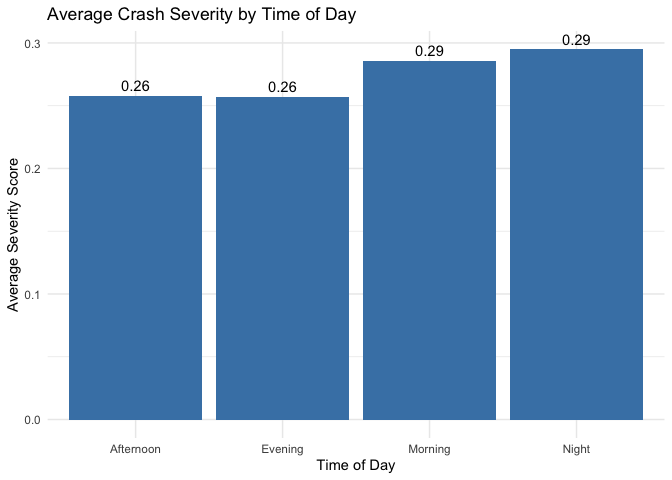

Analysis of Traffic Crash Patterns and Their Contributing Factors
================
Shivansh Patel, Manas Mathur, Muhammad Raham Saleem

## Introduction

This analysis explores traffic crash patterns in our dataset, focusing
on key factors that influence crash occurrence and severity. We
investigate the relationships between speed limits, vehicle types,
substance abuse, and various other factors that contribute to traffic
accidents.

## Data Preparation

``` r
# Load required libraries
library(dplyr)
library(ggplot2)
library(tidyr)
library(lubridate)
library(corrplot)
library(forcats)
library(scales)

# Load the dataset
crash_data <- read.csv("US.csv")

# Basic text cleaning function
clean_text_column <- function(x) {
  x <- toupper(trimws(x))
  x[x == ""] <- "UNKNOWN"
  x[is.na(x)] <- "UNKNOWN"
  return(x)
}

# Clean and standardize the data
crash_clean <- crash_data %>%
  # First clean all character columns
  mutate(across(where(is.character), clean_text_column)) %>%
  # Then handle specific columns
  mutate(
    Weather = case_when(
      Weather == "N/A" ~ "UNKNOWN",
      grepl("FREEZING RAIN|FREEZING DRIZZLE", Weather) ~ "FREEZING PRECIPITATION",
      grepl("BLOWING", Weather) ~ "BLOWING WEATHER",
      TRUE ~ Weather
    ),
    Traffic.Control = case_when(
      Traffic.Control == "N/A" ~ "UNKNOWN",
      grepl("SIGNAL", Traffic.Control) ~ "TRAFFIC SIGNAL",
      TRUE ~ Traffic.Control
    ),
    Driver.Substance.Abuse = case_when(
      Driver.Substance.Abuse == "N/A" ~ "UNKNOWN",
      Driver.Substance.Abuse == "NONE DETECTED" ~ "NONE",
      TRUE ~ Driver.Substance.Abuse
    ),
    Vehicle.Body.Type = case_when(
      Vehicle.Body.Type == "N/A" ~ "UNKNOWN",
      grepl("PASSENGER", Vehicle.Body.Type) ~ "PASSENGER VEHICLE",
      TRUE ~ Vehicle.Body.Type
    )
  )

# Handle rare categories directly
crash_clean <- crash_clean %>%
  # Weather categories
  group_by(Weather) %>%
  mutate(count = n()) %>%
  ungroup() %>%
  mutate(Weather = if_else(count < nrow(crash_clean) * 0.001, "OTHER", Weather)) %>%
  select(-count) %>%
  
  # Traffic Control categories
  group_by(Traffic.Control) %>%
  mutate(count = n()) %>%
  ungroup() %>%
  mutate(Traffic.Control = if_else(count < nrow(crash_clean) * 0.001, "OTHER", Traffic.Control)) %>%
  select(-count) %>%
  
  # Vehicle Body Type categories
  group_by(Vehicle.Body.Type) %>%
  mutate(count = n()) %>%
  ungroup() %>%
  mutate(Vehicle.Body.Type = if_else(count < nrow(crash_clean) * 0.001, "OTHER", Vehicle.Body.Type)) %>%
  select(-count)

# Create severity score
crash_severity <- crash_clean %>%
  mutate(
    severity_score = case_when(
      Injury.Severity == "FATAL INJURY" ~ 4,
      Injury.Severity == "SUSPECTED SERIOUS INJURY" ~ 3,
      Injury.Severity == "SUSPECTED MINOR INJURY" ~ 2,
      Injury.Severity == "POSSIBLE INJURY" ~ 1,
      Injury.Severity == "NO APPARENT INJURY" ~ 0,
      TRUE ~ NA_real_
    )
  )

# Print summary to verify the cleaning
cat("Unique values in Weather after cleaning:\n")
```

    ## Unique values in Weather after cleaning:

``` r
print(table(crash_clean$Weather))
```

    ## 
    ##      CLEAR     CLOUDY      FOGGY      OTHER       RAIN    RAINING      SLEET 
    ##     128224      18616        676        727       1749      20611        218 
    ##       SNOW    UNKNOWN WINTRY MIX 
    ##       1569      14150        391

``` r
cat("\nUnique values in Traffic.Control after cleaning:\n")
```

    ## 
    ## Unique values in Traffic.Control after cleaning:

``` r
print(table(crash_clean$Traffic.Control))
```

    ## 
    ##    NO CONTROLS          OTHER         PERSON      STOP SIGN TRAFFIC SIGNAL 
    ##          75608           2526            282          13326          66290 
    ##        UNKNOWN     YIELD SIGN 
    ##          27038           1861

``` r
cat("\nUnique values in Vehicle.Body.Type after cleaning:\n")
```

    ## 
    ## Unique values in Vehicle.Body.Type after cleaning:

``` r
print(table(crash_clean$Vehicle.Body.Type))
```

    ## 
    ##                                   (SPORT) UTILITY VEHICLE 
    ##                                                     15990 
    ##                                       AMBULANCE/EMERGENCY 
    ##                                                       466 
    ##                                              BUS - SCHOOL 
    ##                                                       338 
    ##                                             BUS - TRANSIT 
    ##                                                       387 
    ## CARGO VAN/LIGHT TRUCK 2 AXLES (OVER 10,000LBS (4,536 KG)) 
    ##                                                      1858 
    ##                                    FIRE VEHICLE/EMERGENCY 
    ##                                                       437 
    ##                                FIRE VEHICLE/NON EMERGENCY 
    ##                                                       296 
    ##    MEDIUM/HEAVY TRUCKS 3 AXLES (OVER 10,000LBS (4,536KG)) 
    ##                                                      1469 
    ##                                                MOTORCYCLE 
    ##                                                       889 
    ##                                                     OTHER 
    ##                                                      2733 
    ##                                                 OTHER BUS 
    ##                                                       418 
    ##          OTHER LIGHT TRUCKS (10,000LBS (4,536KG) OR LESS) 
    ##                                                      1909 
    ##                                              OTHER TRUCKS 
    ##                                                       195 
    ##                                         PASSENGER VEHICLE 
    ##                                                    128930 
    ##                                                    PICKUP 
    ##                                                       776 
    ##                                              PICKUP TRUCK 
    ##                                                      6787 
    ##                                  POLICE VEHICLE/EMERGENCY 
    ##                                                      1497 
    ##                              POLICE VEHICLE/NON EMERGENCY 
    ##                                                      2119 
    ##                                      RECREATIONAL VEHICLE 
    ##                                                       197 
    ##                                                SCHOOL BUS 
    ##                                                      2975 
    ##                                     SPORT UTILITY VEHICLE 
    ##                                                      2391 
    ##                                             STATION WAGON 
    ##                                                       790 
    ##                                               TRANSIT BUS 
    ##                                                      3642 
    ##                                             TRUCK TRACTOR 
    ##                                                       548 
    ##                                                   UNKNOWN 
    ##                                                      3936 
    ##                                                       VAN 
    ##                                                      4958

## Analysis 1: Speed Zones and Crash Patterns

### Research Question

What speed zones result in the most crashes, and how does this affect
crash severity

``` r
colnames(crash_clean)
```

    ##  [1] "Report.Number"                 "Local.Case.Number"            
    ##  [3] "Agency.Name"                   "ACRS.Report.Type"             
    ##  [5] "Crash.Date.Time"               "Route.Type"                   
    ##  [7] "Road.Name"                     "Cross.Street.Name"            
    ##  [9] "Off.Road.Description"          "Municipality"                 
    ## [11] "Related.Non.Motorist"          "Collision.Type"               
    ## [13] "Weather"                       "Surface.Condition"            
    ## [15] "Light"                         "Traffic.Control"              
    ## [17] "Driver.Substance.Abuse"        "Non.Motorist.Substance.Abuse" 
    ## [19] "Person.ID"                     "Driver.At.Fault"              
    ## [21] "Injury.Severity"               "Circumstance"                 
    ## [23] "Driver.Distracted.By"          "Drivers.License.State"        
    ## [25] "Vehicle.ID"                    "Vehicle.Damage.Extent"        
    ## [27] "Vehicle.First.Impact.Location" "Vehicle.Body.Type"            
    ## [29] "Vehicle.Movement"              "Vehicle.Going.Dir"            
    ## [31] "Speed.Limit"                   "Driverless.Vehicle"           
    ## [33] "Parked.Vehicle"                "Vehicle.Year"                 
    ## [35] "Vehicle.Make"                  "Vehicle.Model"                
    ## [37] "Latitude"                      "Longitude"                    
    ## [39] "Location"

``` r
unique(crash_clean$Driver.Distracted.By)
```

    ##  [1] "UNKNOWN"                                          
    ##  [2] "NOT DISTRACTED"                                   
    ##  [3] "LOOKED BUT DID NOT SEE"                           
    ##  [4] "INATTENTIVE OR LOST IN THOUGHT"                   
    ##  [5] "TALKING OR LISTENING TO CELLULAR PHONE"           
    ##  [6] "OTHER DISTRACTION"                                
    ##  [7] "DISTRACTED BY OUTSIDE PERSON OBJECT OR EVENT"     
    ##  [8] "EATING OR DRINKING"                               
    ##  [9] "BY MOVING OBJECT IN VEHICLE"                      
    ## [10] "BY OTHER OCCUPANTS"                               
    ## [11] "ADJUSTING AUDIO AND OR CLIMATE CONTROLS"          
    ## [12] "NO DRIVER PRESENT"                                
    ## [13] "OTHER ELECTRONIC DEVICE (NAVIGATIONAL PALM PILOT)"
    ## [14] "OTHER CELLULAR PHONE RELATED"                     
    ## [15] "USING OTHER DEVICE CONTROLS INTEGRAL TO VEHICLE"  
    ## [16] "USING DEVICE OBJECT BROUGHT INTO VEHICLE"         
    ## [17] "DIALING CELLULAR PHONE"                           
    ## [18] "TEXTING FROM A CELLULAR PHONE"                    
    ## [19] "SMOKING RELATED"                                  
    ## [20] "OTHER ACTION (LOOKING AWAY FROM TASK, ETC.)"      
    ## [21] "TALKING/LISTENING"                                
    ## [22] "MANUALLY OPERATING (DIALING, PLAYING GAME, ETC.)"

``` r
speed_limit_crashes <- table(crash_clean$Speed.Limit)
speed_limit_summary <- data.frame(
    speed_limit = names(speed_limit_crashes),
    crash_count = as.numeric(speed_limit_crashes)
)


speed_limit_summary <- speed_limit_summary[order(-speed_limit_summary$crash_count), ]


print(speed_limit_summary)
```

    ##    speed_limit crash_count
    ## 8           35       55496
    ## 9           40       35615
    ## 6           25       26258
    ## 7           30       25673
    ## 10          45       13135
    ## 4           15        6378
    ## 1            0        6068
    ## 11          50        5000
    ## 2            5        4315
    ## 12          55        4292
    ## 3           10        3181
    ## 5           20        1367
    ## 13          60          85
    ## 14          65          59
    ## 15          70           8
    ## 16          75           1

``` r
library(ggplot2)
ggplot(speed_limit_summary, aes(x = speed_limit, y = crash_count)) +
    geom_bar(stat = "identity", fill = "steelblue") +
    theme_minimal() +
    labs(
        title = "Crash Frequency by Speed Limit",
        x = "Speed Limit",
        y = "Number of Crashes"
    ) +
    theme(axis.text.x = element_text(angle = 45, hjust = 1))
```

<!-- -->

``` r
head(crash_clean$Crash.Date.Time, 1)
```

    ## [1] "05/27/2021 07:40:00 PM"

``` r
nrow(crash_clean)
```

    ## [1] 186931

## Analysis 2: Lights, surfaces, and injury severity

### Research Question

What combinations of lighting and surfaces result in the worst injuries?

``` r
crash_analysis <- crash_clean %>%
  
  filter(!Light %in% c("N/A", 
                      "DARK -- UNKNOWN LIGHTING", 
                      "UNKNOWN", 
                      "OTHER", 
                      "DARK - UNKNOWN LIGHTING")) %>%
  filter(!Surface.Condition %in% c("N/A", 
                                 "OTHER", 
                                 "UNKNOWN")) %>%

  mutate(Light = case_when(
    Light %in% c("DARK LIGHTS ON", "DARK - LIGHTED") ~ "DARK WITH LIGHTS",
    Light %in% c("DARK NO LIGHTS", "DARK - NOT LIGHTED") ~ "DARK WITHOUT LIGHTS",
    TRUE ~ Light
  )) %>%

  mutate(Surface.Condition = case_when(
    Surface.Condition %in% c("WATER(STANDING/MOVING)", "WATER (STANDING, MOVING)") ~ "WATER (STANDING/MOVING)",
    TRUE ~ Surface.Condition
  )) %>%
  mutate(Surface.Condition = case_when(
    Surface.Condition %in% c("ICE/FROST", "ICE") ~ "ICE",
    TRUE ~ Surface.Condition
  )) %>%

  mutate(
    severity_score = case_when(
      Injury.Severity == "FATAL INJURY" ~ 4,
      Injury.Severity == "SUSPECTED SERIOUS INJURY" ~ 3,
      Injury.Severity == "SUSPECTED MINOR INJURY" ~ 2,
      Injury.Severity == "POSSIBLE INJURY" ~ 1,
      Injury.Severity == "NO APPARENT INJURY" ~ 0,
      TRUE ~ NA_real_
    )
  )


severity_by_conditions <- crash_analysis %>%
  group_by(Light, Surface.Condition) %>%
  summarise(
    avg_severity = mean(severity_score, na.rm = TRUE),
    n_crashes = n(),
    .groups = 'drop'
  ) %>%
  arrange(desc(avg_severity))


print(head(severity_by_conditions, 10))
```

    ## # A tibble: 10 × 4
    ##    Light               Surface.Condition       avg_severity n_crashes
    ##    <chr>               <chr>                          <dbl>     <int>
    ##  1 DAYLIGHT            MUD, DIRT, GRAVEL              0.684        38
    ##  2 DAYLIGHT            WATER (STANDING/MOVING)        0.625        16
    ##  3 DAYLIGHT            OIL                            0.583        24
    ##  4 DARK WITHOUT LIGHTS WATER (STANDING/MOVING)        0.5           8
    ##  5 DAWN                SLUSH                          0.4          10
    ##  6 DARK WITHOUT LIGHTS ICE                            0.374       123
    ##  7 DAYLIGHT            SLUSH                          0.364       140
    ##  8 DARK WITH LIGHTS    SLUSH                          0.34         50
    ##  9 DARK WITHOUT LIGHTS DRY                            0.337      3555
    ## 10 DUSK                WET                            0.335       807

``` r
ggplot(severity_by_conditions, 
       aes(x = Surface.Condition, 
           y = avg_severity,
           fill = Light)) +
  geom_bar(stat = "identity", position = position_dodge(width = 0.9)) +
  coord_flip() +  
  theme_minimal() +
  theme(
    axis.text.y = element_text(size = 10),
    panel.grid.major.y = element_blank(), 
    legend.position = "bottom"
  ) +
  labs(title = "Average Crash Severity by Light and Surface Conditions",
       subtitle = "Severity Score: 0 (No Injury) to 1 (Fatal)",
       x = "Surface Condition",
       y = "Average Severity Score",
       fill = "Lighting Condition")
```

<!-- -->

``` r
substance_present <- c("ALCOHOL CONTRIBUTED", "ALCOHOL PRESENT",
                      "COMBINATION CONTRIBUTED", "COMBINED SUBSTANCE PRESENT",
                      "ILLEGAL DRUG CONTRIBUTED", "ILLEGAL DRUG PRESENT",
                      "MEDICATION CONTRIBUTED", "MEDICATION PRESENT",
                      "SUSPECT OF ALCOHOL USE, SUSPECT OF DRUG USE",
                      "NOT SUSPECT OF ALCOHOL USE, SUSPECT OF DRUG USE",
                      "SUSPECT OF ALCOHOL USE, NOT SUSPECT OF DRUG USE")


crash_analysis <- crash_clean %>%
  mutate(
    
    crash_datetime = as.POSIXct(Crash.Date.Time, format = "%m/%d/%Y %I:%M:%S %p"),
    
    day_of_week = weekdays(crash_datetime),
    
    day_of_week = factor(day_of_week, 
                        levels = c("Monday", "Tuesday", "Wednesday", 
                                 "Thursday", "Friday", "Saturday", "Sunday")),
    
    severity_score = case_when(
      Injury.Severity == "FATAL INJURY" ~ 4,
      Injury.Severity == "SUSPECTED SERIOUS INJURY" ~ 3,
      Injury.Severity == "SUSPECTED MINOR INJURY" ~ 2,
      Injury.Severity == "POSSIBLE INJURY" ~ 1,
      Injury.Severity == "NO APPARENT INJURY" ~ 0,
      TRUE ~ NA_real_
    ),

    has_substance = Driver.Substance.Abuse %in% substance_present
  )


severity_by_day <- crash_analysis %>%
  group_by(day_of_week, has_substance) %>%
  summarise(
    avg_severity = mean(severity_score, na.rm = TRUE),
    n_crashes = n(),
    se = sd(severity_score, na.rm = TRUE) / sqrt(n()),  
    .groups = 'drop'
  )

ggplot(severity_by_day) +
  geom_line(aes(x = day_of_week, 
                y = avg_severity, 
                group = has_substance,
                color = has_substance),
            size = 1.2) +
  geom_point(aes(x = day_of_week, 
                 y = avg_severity,
                 color = has_substance),
             size = 3) +

  scale_color_manual(values = c("lightblue", "red"),
                    labels = c("Non-Substance Related", "Substance Related")) +
  theme_minimal() +
  theme(
    axis.text.x = element_text(angle = 45, hjust = 1),
    legend.title = element_blank(),
    legend.position = "bottom"
  ) +
  labs(
    title = "Average Crash Severity by Day of Week",
    subtitle = "Comparing Substance-Related vs Non-Substance-Related Crashes",
    x = "Day of Week",
    y = "Average Severity Score (0-4)"
  )
```

<!-- -->

## Analysis 3: Impact Locations and Crash Patterns

### Research Question

How do Impact Zones affect crash severity

``` r
library(sf)
library(tigris)
library(dplyr)
library(lubridate)

crash_coords <- crash_clean %>% 
  select(Longitude, Latitude)

nrow(crash_coords)
```

    ## [1] 186931

``` r
crash_sf <- st_as_sf(crash_coords, coords = c("Longitude", "Latitude"), crs = 4326)

states <- states(cb = TRUE) %>%
  st_transform(crs = 4326)  
```

    ##   |                                                                              |                                                                      |   0%  |                                                                              |=                                                                     |   1%  |                                                                              |=                                                                     |   2%  |                                                                              |==                                                                    |   2%  |                                                                              |==                                                                    |   3%  |                                                                              |===                                                                   |   4%  |                                                                              |===                                                                   |   5%  |                                                                              |====                                                                  |   5%  |                                                                              |====                                                                  |   6%  |                                                                              |=====                                                                 |   6%  |                                                                              |=====                                                                 |   7%  |                                                                              |======                                                                |   8%  |                                                                              |======                                                                |   9%  |                                                                              |=======                                                               |   9%  |                                                                              |=======                                                               |  10%  |                                                                              |========                                                              |  11%  |                                                                              |========                                                              |  12%  |                                                                              |=========                                                             |  12%  |                                                                              |=========                                                             |  13%  |                                                                              |==========                                                            |  14%  |                                                                              |==========                                                            |  15%  |                                                                              |===========                                                           |  15%  |                                                                              |===========                                                           |  16%  |                                                                              |============                                                          |  17%  |                                                                              |============                                                          |  18%  |                                                                              |=============                                                         |  18%  |                                                                              |=============                                                         |  19%  |                                                                              |==============                                                        |  20%  |                                                                              |==============                                                        |  21%  |                                                                              |===============                                                       |  21%  |                                                                              |===============                                                       |  22%  |                                                                              |================                                                      |  23%  |                                                                              |================                                                      |  24%  |                                                                              |=================                                                     |  24%  |                                                                              |=================                                                     |  25%  |                                                                              |==================                                                    |  25%  |                                                                              |==================                                                    |  26%  |                                                                              |===================                                                   |  27%  |                                                                              |===================                                                   |  28%  |                                                                              |====================                                                  |  28%  |                                                                              |====================                                                  |  29%  |                                                                              |=====================                                                 |  29%  |                                                                              |=====================                                                 |  30%  |                                                                              |======================                                                |  31%  |                                                                              |======================                                                |  32%  |                                                                              |=======================                                               |  32%  |                                                                              |=======================                                               |  33%  |                                                                              |========================                                              |  34%  |                                                                              |========================                                              |  35%  |                                                                              |=========================                                             |  35%  |                                                                              |=========================                                             |  36%  |                                                                              |==========================                                            |  37%  |                                                                              |==========================                                            |  38%  |                                                                              |===========================                                           |  38%  |                                                                              |===========================                                           |  39%  |                                                                              |============================                                          |  40%  |                                                                              |=============================                                         |  41%  |                                                                              |=============================                                         |  42%  |                                                                              |==============================                                        |  42%  |                                                                              |==============================                                        |  43%  |                                                                              |===============================                                       |  44%  |                                                                              |===============================                                       |  45%  |                                                                              |================================                                      |  45%  |                                                                              |================================                                      |  46%  |                                                                              |=================================                                     |  47%  |                                                                              |=================================                                     |  48%  |                                                                              |==================================                                    |  48%  |                                                                              |==================================                                    |  49%  |                                                                              |===================================                                   |  50%  |                                                                              |===================================                                   |  51%  |                                                                              |====================================                                  |  51%  |                                                                              |====================================                                  |  52%  |                                                                              |=====================================                                 |  53%  |                                                                              |======================================                                |  54%  |                                                                              |======================================                                |  55%  |                                                                              |=======================================                               |  56%  |                                                                              |========================================                              |  56%  |                                                                              |========================================                              |  57%  |                                                                              |=========================================                             |  58%  |                                                                              |=========================================                             |  59%  |                                                                              |==========================================                            |  59%  |                                                                              |==========================================                            |  60%  |                                                                              |===========================================                           |  61%  |                                                                              |===========================================                           |  62%  |                                                                              |============================================                          |  62%  |                                                                              |============================================                          |  63%  |                                                                              |=============================================                         |  64%  |                                                                              |=============================================                         |  65%  |                                                                              |==============================================                        |  65%  |                                                                              |==============================================                        |  66%  |                                                                              |===============================================                       |  67%  |                                                                              |===============================================                       |  68%  |                                                                              |================================================                      |  68%  |                                                                              |================================================                      |  69%  |                                                                              |=================================================                     |  69%  |                                                                              |=================================================                     |  70%  |                                                                              |==================================================                    |  71%  |                                                                              |==================================================                    |  72%  |                                                                              |===================================================                   |  72%  |                                                                              |===================================================                   |  73%  |                                                                              |====================================================                  |  74%  |                                                                              |====================================================                  |  75%  |                                                                              |=====================================================                 |  75%  |                                                                              |=====================================================                 |  76%  |                                                                              |======================================================                |  77%  |                                                                              |======================================================                |  78%  |                                                                              |=======================================================               |  78%  |                                                                              |=======================================================               |  79%  |                                                                              |========================================================              |  80%  |                                                                              |========================================================              |  81%  |                                                                              |=========================================================             |  81%  |                                                                              |=========================================================             |  82%  |                                                                              |==========================================================            |  83%  |                                                                              |==========================================================            |  84%  |                                                                              |===========================================================           |  84%  |                                                                              |===========================================================           |  85%  |                                                                              |============================================================          |  85%  |                                                                              |============================================================          |  86%  |                                                                              |=============================================================         |  87%  |                                                                              |==============================================================        |  88%  |                                                                              |==============================================================        |  89%  |                                                                              |===============================================================       |  89%  |                                                                              |===============================================================       |  90%  |                                                                              |================================================================      |  91%  |                                                                              |================================================================      |  92%  |                                                                              |=================================================================     |  92%  |                                                                              |=================================================================     |  93%  |                                                                              |==================================================================    |  94%  |                                                                              |==================================================================    |  95%  |                                                                              |===================================================================   |  95%  |                                                                              |===================================================================   |  96%  |                                                                              |====================================================================  |  97%  |                                                                              |====================================================================  |  98%  |                                                                              |===================================================================== |  98%  |                                                                              |===================================================================== |  99%  |                                                                              |======================================================================|  99%  |                                                                              |======================================================================| 100%

``` r
crash_with_states <- st_join(crash_sf, states["NAME"])

crash_states_df <- crash_with_states %>%
  mutate(row_num = row_number()) %>%
  st_drop_geometry() %>%
  select(NAME, row_num)

crash_clean_with_states <- crash_clean %>%
  mutate(row_num = row_number()) %>%
  left_join(crash_states_df, by = "row_num") %>%
  rename(state = NAME) %>%
  select(-row_num)

crash_maryland_injuries <- crash_clean_with_states %>% 
  mutate(date = mdy_hms(Crash.Date.Time)) %>%
  filter(year(date) == 2024,
#         state == "Maryland", 
         Injury.Severity != "NO APPARENT INJURY",
#         Injury.Severity != "POSSIBLE INJURY",
         Injury.Severity != "UNKNOWN",
         Vehicle.First.Impact.Location != "NON-COLLISION",
         Vehicle.First.Impact.Location != "VEHICLE NOT AT SCENE")

colnames(crash_maryland_injuries)
```

    ##  [1] "Report.Number"                 "Local.Case.Number"            
    ##  [3] "Agency.Name"                   "ACRS.Report.Type"             
    ##  [5] "Crash.Date.Time"               "Route.Type"                   
    ##  [7] "Road.Name"                     "Cross.Street.Name"            
    ##  [9] "Off.Road.Description"          "Municipality"                 
    ## [11] "Related.Non.Motorist"          "Collision.Type"               
    ## [13] "Weather"                       "Surface.Condition"            
    ## [15] "Light"                         "Traffic.Control"              
    ## [17] "Driver.Substance.Abuse"        "Non.Motorist.Substance.Abuse" 
    ## [19] "Person.ID"                     "Driver.At.Fault"              
    ## [21] "Injury.Severity"               "Circumstance"                 
    ## [23] "Driver.Distracted.By"          "Drivers.License.State"        
    ## [25] "Vehicle.ID"                    "Vehicle.Damage.Extent"        
    ## [27] "Vehicle.First.Impact.Location" "Vehicle.Body.Type"            
    ## [29] "Vehicle.Movement"              "Vehicle.Going.Dir"            
    ## [31] "Speed.Limit"                   "Driverless.Vehicle"           
    ## [33] "Parked.Vehicle"                "Vehicle.Year"                 
    ## [35] "Vehicle.Make"                  "Vehicle.Model"                
    ## [37] "Latitude"                      "Longitude"                    
    ## [39] "Location"                      "state"                        
    ## [41] "date"

``` r
colnames(crash_maryland_injuries)
```

    ##  [1] "Report.Number"                 "Local.Case.Number"            
    ##  [3] "Agency.Name"                   "ACRS.Report.Type"             
    ##  [5] "Crash.Date.Time"               "Route.Type"                   
    ##  [7] "Road.Name"                     "Cross.Street.Name"            
    ##  [9] "Off.Road.Description"          "Municipality"                 
    ## [11] "Related.Non.Motorist"          "Collision.Type"               
    ## [13] "Weather"                       "Surface.Condition"            
    ## [15] "Light"                         "Traffic.Control"              
    ## [17] "Driver.Substance.Abuse"        "Non.Motorist.Substance.Abuse" 
    ## [19] "Person.ID"                     "Driver.At.Fault"              
    ## [21] "Injury.Severity"               "Circumstance"                 
    ## [23] "Driver.Distracted.By"          "Drivers.License.State"        
    ## [25] "Vehicle.ID"                    "Vehicle.Damage.Extent"        
    ## [27] "Vehicle.First.Impact.Location" "Vehicle.Body.Type"            
    ## [29] "Vehicle.Movement"              "Vehicle.Going.Dir"            
    ## [31] "Speed.Limit"                   "Driverless.Vehicle"           
    ## [33] "Parked.Vehicle"                "Vehicle.Year"                 
    ## [35] "Vehicle.Make"                  "Vehicle.Model"                
    ## [37] "Latitude"                      "Longitude"                    
    ## [39] "Location"                      "state"                        
    ## [41] "date"

``` r
unique(crash_maryland_injuries$Injury.Severity)
```

    ## [1] "POSSIBLE INJURY"          "SUSPECTED MINOR INJURY"  
    ## [3] "SUSPECTED SERIOUS INJURY" "FATAL INJURY"

``` r
crash_maryland_injuries$Injury.Severity <- factor(crash_maryland_injuries$Injury.Severity, levels = c('SUSPECTED MINOR INJURY', 'SUSPECTED SERIOUS INJURY', 'FATAL INJURY'))

impact_injury_table <- table(crash_maryland_injuries$Vehicle.First.Impact.Location, 
                              crash_maryland_injuries$Injury.Severity)

impact_injury_prop <- prop.table(impact_injury_table, margin = 1) * 100


ggplot(data = as.data.frame.table(impact_injury_prop), 
       aes(x = reorder(Var1, -table(Var1)), y = Freq, fill = Var2)) +
  geom_bar(stat = "identity", position = "stack") +
  theme_minimal() +
  labs(x = "Impact Location", 
       y = "Count",
       fill = "Injury Severity",
       title = "Relationship between Impact Location and Injury Severity") +
  theme(axis.text.x = element_text(angle = 45, hjust = 1))
```

<!-- -->

``` r
chisq_test <- chisq.test(table(crash_maryland_injuries$Vehicle.First.Impact.Location, 
                              crash_maryland_injuries$Injury.Severity))

chisq_test
```

    ## 
    ##  Pearson's Chi-squared test
    ## 
    ## data:  table(crash_maryland_injuries$Vehicle.First.Impact.Location,     crash_maryland_injuries$Injury.Severity)
    ## X-squared = 66.004, df = 28, p-value = 6.599e-05

``` r
library(effectsize)
cramers_v <- cramers_v(crash_maryland_injuries$Vehicle.First.Impact.Location, 
                       crash_maryland_injuries$Injury.Severity)

stdres <- chisq_test$stdres
stdres
```

    ##                 
    ##                  SUSPECTED MINOR INJURY SUSPECTED SERIOUS INJURY FATAL INJURY
    ##   CARGO LOSS                0.670631388             -0.626612700 -0.217529932
    ##   EIGHT O CLOCK             1.155384910             -1.002110840 -0.580339631
    ##   ELEVEN O CLOCK           -0.863758858              1.185928473 -0.725595587
    ##   FIVE O CLOCK              0.920678846             -1.512479051  1.432837244
    ##   FOUR O CLOCK             -1.563290377              0.473408716  3.127978960
    ##   NINE O CLOCK             -2.249379445              2.313861273  0.166492904
    ##   ONE O CLOCK               0.497974816             -0.375971079 -0.398637420
    ##   SEVEN O CLOCK             1.281585224             -1.760841483  1.079889102
    ##   SIX O CLOCK               3.581175022             -3.160764795 -1.653658812
    ##   TEN O CLOCK              -1.346933925              1.277559824  0.386365949
    ##   THREE O CLOCK            -1.175399840              0.472370839  2.042774659
    ##   TOP                      -1.416803723              1.650750079 -0.408367953
    ##   TWELVE O CLOCK            0.423495079              0.130360413 -1.533890390
    ##   TWO O CLOCK              -2.912284288              2.262926187  2.161032531
    ##   UNDERSIDE                 0.008673926             -0.992812233  2.611282709

``` r
impact_freq <- table(crash_maryland_injuries$Vehicle.First.Impact.Location)
impact_freq_sorted <- sort(impact_freq, decreasing = TRUE)

impact_chisq <- chisq.test(impact_freq)

library(ggplot2)
impact_df <- data.frame(
  location = names(impact_freq),
  count = as.numeric(impact_freq)
)

ggplot(impact_df, aes(x = reorder(location, -count), y = count)) +
  geom_bar(stat = "identity") +
  theme_minimal() +
  theme(axis.text.x = element_text(angle = 45, hjust = 1)) +
  labs(x = "Impact Location",
       y = "Frequency",
       title = "Distribution of Vehicle Impact Locations")
```

<!-- -->

``` r
weights <- 1 / table(crash_maryland_injuries$Vehicle.First.Impact.Location)
weights <- weights[crash_maryland_injuries$Vehicle.First.Impact.Location]

weighted.chisq <- chisq.test(table(crash_maryland_injuries$Vehicle.First.Impact.Location, 
                                  crash_maryland_injuries$Injury.Severity),
                            weights)
weighted.chisq
```

    ## 
    ##  Pearson's Chi-squared test
    ## 
    ## data:  table(crash_maryland_injuries$Vehicle.First.Impact.Location,     crash_maryland_injuries$Injury.Severity)
    ## X-squared = 66.004, df = 28, p-value = 6.599e-05

``` r
first_impact_severity <- crash_severity %>%
  group_by(Vehicle.First.Impact.Location) %>%
  summarise(
    avg_severity = mean(severity_score, na.rm = TRUE),
    crash_count = n()
  ) %>%  filter(Vehicle.First.Impact.Location != "UNKNOWN", Vehicle.First.Impact.Location != "VEHICLE NOT AT SCENE",crash_count > 10)

ggplot(first_impact_severity, aes(x = reorder(Vehicle.First.Impact.Location, -avg_severity), y = avg_severity)) +
  geom_bar(stat = "identity", fill = "black") +
  geom_text(aes(label = round(avg_severity, 2)), vjust = -0.5) +
  labs(
    title = "Average Crash Severity by Vehicle Impact Location",
    x = "Type of impact",
    y = "Average Severity Score"
  ) +
  theme_minimal() +
  theme(axis.text.x = element_text(angle = 45, hjust = 1))
```

<!-- -->

``` r
library(mapview)


crash_maryland_sf <- st_as_sf(crash_maryland_injuries, 
                            coords = c("Longitude", "Latitude"), 
                            crs = 4326)

colnames(crash_maryland_sf)
```

    ##  [1] "Report.Number"                 "Local.Case.Number"            
    ##  [3] "Agency.Name"                   "ACRS.Report.Type"             
    ##  [5] "Crash.Date.Time"               "Route.Type"                   
    ##  [7] "Road.Name"                     "Cross.Street.Name"            
    ##  [9] "Off.Road.Description"          "Municipality"                 
    ## [11] "Related.Non.Motorist"          "Collision.Type"               
    ## [13] "Weather"                       "Surface.Condition"            
    ## [15] "Light"                         "Traffic.Control"              
    ## [17] "Driver.Substance.Abuse"        "Non.Motorist.Substance.Abuse" 
    ## [19] "Person.ID"                     "Driver.At.Fault"              
    ## [21] "Injury.Severity"               "Circumstance"                 
    ## [23] "Driver.Distracted.By"          "Drivers.License.State"        
    ## [25] "Vehicle.ID"                    "Vehicle.Damage.Extent"        
    ## [27] "Vehicle.First.Impact.Location" "Vehicle.Body.Type"            
    ## [29] "Vehicle.Movement"              "Vehicle.Going.Dir"            
    ## [31] "Speed.Limit"                   "Driverless.Vehicle"           
    ## [33] "Parked.Vehicle"                "Vehicle.Year"                 
    ## [35] "Vehicle.Make"                  "Vehicle.Model"                
    ## [37] "Location"                      "state"                        
    ## [39] "date"                          "geometry"

``` r
severity_colors <- c("FATAL" = "red",
                    "NO APPARENT INJURY" = "green",
                    "POSSIBLE INJURY" = "blue",
                    "SUSPECTED MINOR INJURY" = "yellow",
                    "SUSPECTED SERIOUS INJURY" = "orange"
                    )


mapview(crash_maryland_sf,
        zcol = "Injury.Severity",
        col.regions = severity_colors,
        cex = 3,
        alpha = 0.8,
        legend = TRUE,
        popup = c("Injury.Severity"),
        layer.name = "Crash Severity")
```

<div class="leaflet html-widget html-fill-item" id="htmlwidget-d19a16bfc313aa90c5a5" style="width:672px;height:480px;"></div>
<script type="application/json" data-for="htmlwidget-d19a16bfc313aa90c5a5">{"x":{"options":{"minZoom":1,"maxZoom":52,"crs":{"crsClass":"L.CRS.EPSG3857","code":null,"proj4def":null,"projectedBounds":null,"options":{}},"preferCanvas":false,"bounceAtZoomLimits":false,"maxBounds":[[[-90,-370]],[[90,370]]]},"calls":[{"method":"addProviderTiles","args":["CartoDB.Positron","CartoDB.Positron","CartoDB.Positron",{"errorTileUrl":"","noWrap":false,"detectRetina":false,"pane":"tilePane"}]},{"method":"addProviderTiles","args":["CartoDB.DarkMatter","CartoDB.DarkMatter","CartoDB.DarkMatter",{"errorTileUrl":"","noWrap":false,"detectRetina":false,"pane":"tilePane"}]},{"method":"addProviderTiles","args":["OpenStreetMap","OpenStreetMap","OpenStreetMap",{"errorTileUrl":"","noWrap":false,"detectRetina":false,"pane":"tilePane"}]},{"method":"addProviderTiles","args":["Esri.WorldImagery","Esri.WorldImagery","Esri.WorldImagery",{"errorTileUrl":"","noWrap":false,"detectRetina":false,"pane":"tilePane"}]},{"method":"addProviderTiles","args":["OpenTopoMap","OpenTopoMap","OpenTopoMap",{"errorTileUrl":"","noWrap":false,"detectRetina":false,"pane":"tilePane"}]},{"method":"createMapPane","args":["point",440]},{"method":"addCircleMarkers","args":[[39.09165565,39.14852707,39.18396,39.02253706,39.05233667,39.0745357,39.19201333,39.01450617,39.19290172,39.02263517,39.07568645,39.23141011,39.03196333,39.0203095,39.07638094,39.14852707,39.09606259,39.07321667,39.02045975,39.18214377,38.98775972,39.15655977,39.05528682,39.18801455,39.00995515,39.07028042,39.12684957,39.17735683,39.13958451,39.07603117,39.00014716,39.25471683,39.0556289,39.05286923,39.08624483,39.09232899,39.06372333,39.1049575,39.18992758,39.2645338,39.0162655,39.143662,39.05168306,39.0815115,39.09030389,39.14489136,39.19022592,39.10434438,39.21875643,39.04464419,39.07321667,39.144792,39.02839393,39.01561095,39.09782967,39.08667046,39.00648391,39.26933197,39.0011345,39.15804,39.19942295,39.05369583,39.09594025,39.10407404,39.02587617,39.30244036,39.12259705,38.98667432,39.09090859,39.02651361,39.01019833,39.18527327,39.192135,39.0998085,39.09232899,39.13901336,39.05201698,39.14086083,39.17851989,39.12896411,39.07655717,39.15436882,39.13093667,39.14064772,38.9538653,39.24635964,39.03464577,39.129042,39.01402262,39.08787075,39.15731782,39.10353518,39.16250676,39.16367087,39.01450617,39.0864645,39.01119102,39.18772861,39.05327421,39.0827704,39.10204,39.13493667,39.13770111,39.04645376,39.05609911,38.972781,39.1775539,39.08030223,39.10049167,39.1062158,39.139155,39.04652838,39.08489235,39.04944817,39.1062158,39.05251483,39.03053677,39.06769721,39.03614749,39.19632174,38.98311717,39.11593814,39.18124183,39.12234527,39.03114129,38.97609507,38.99396817,39.05724967,39.01114464,39.23270326,39.07572626,39.03027,39.16609833,39.10632066,39.08785839,39.13712268,39.18527327,39.127215,39.144582,39.00671985,39.0471652,38.98379224,39.0122749,39.16014592,39.14086083,39.03646197,39.06242073,39.05921854,39.05824483,39.11516114,39.06133316,39.1049575,39.21034217,39.10333,39.0561879,39.01521368,39.03646197,39.1457805,39.0907635,39.192317,39.03689786,39.22117236,39.09542742,39.06445183,39.27651257,38.99347156,39.05750157,39.03024083,39.15198658,39.01295567,39.12975167,39.15214141,39.09058936,39.07132283,39.09136361,39.05001863,39.09958202,39.17244454,39.08156009,38.98888333,39.24694395,39.1431305,39.09086751,39.11252817,39.02330749,38.97303667,39.13683383,39.1867682,39.06227609,39.105873,39.05088779,39.148428,39.05868388,39.07768407,39.05636167,39.08792403,39.03107892,39.11559886,39.03938224,39.1189821,39.12975167,38.99444618,39.19023475,39.1406882,39.18772861,39.160865,39.1879162,39.12608921,39.15618233,39.14625067,39.04952856,39.07323716,39.155945,39.03044263,39.19005842,39.17998778,39.10629067,39.10054624,39.05327421,39.04952312,39.07428492,39.11066183,39.0851078,39.08422495,39.02253706,39.26317133,39.15664484,39.1065118,39.17836758,39.11248204,39.24634128,39.0051253,39.16182514,39.147998,38.97898074,39.15417351,39.05320012,39.01681316,39.0365865,39.15655683,39.048872,39.17336646,39.01150398,39.04452782,39.21792667,39.06194985,39.12095514,39.03960584,38.98786638,39.16999533,39.067105,39.07572626,39.1933745,39.0745357,39.02970264,39.03019312,39.1084545,39.03938224,39.02194767,39.11186655,38.9948855,39.10500033,39.09136361,39.14932186,39.10610701,39.08702301,39.00782783,39.05728982,39.04952312,39.14064772,39.10333,39.05868388,39.07567204,39.18167833,39.1627579,39.06356466,39.13712268,39.17336646,39.04634446,39.15960238,39.08035317,38.99396817,39.05752557,39.09875733,39.10049167,39.12234527,39.01532017,39.05104369,39.10500033,39.09776217,39.07920646,39.18650373,39.01066267,38.97887578,39.10438407,39.10286818,39.00013733,39.03198569,39.09425717,39.01398333,39.05628002,39.14064667,39.2263619,39.10563784,38.98059007,39.08365562,39.14987523,39.22819088,39.11136564,39.08023358,39.13591015,39.11066183,39.13591015,39.08781899,39.15010333,39.0998085,39.05849597,39.10257825,39.23553072,39.16200559,39.01466604,39.07638094,39.05291842,39.0362995,39.09060545,39.09058936,39.02263517,39.11685731,39.08027854,39.07611479,39.18088183,39.06713668,39.01851126,39.2445077,39.13493667,39.04311274,38.98830009,39.06283817,39.19008333,39.13589063,39.14065081,39.11516114,39.11245632,38.97303667,39.15992983,39.04658705,39.05626139,39.04944817,39.05824483,39.03019312,39.01371556,39.19749403,39.13901336,39.08400617,39.08781899,39.24424085,39.15010333,39.113185,39.04652838,39.03512225,39.11737467,39.10492981,38.98995817,39.19023152,39.12357717,39.07611479,39.24455127,39.18430653,39.13901336,39.00610917,39.05916983,39.1266056,39.10487712,39.05024215,39.07551691,39.00671985,39.1808346,39.12899936,39.0177685,39.06849376,39.0489016,39.14037327,39.0055822,39.04571337,39.05393394,39.18214377,39.03291666,39.10506391,39.00638306,39.13815833,39.15662243,39.05006692,39.14609481,38.99666041,39.0301205,39.14237567,39.10434961,39.03061662,39.12826133,39.10286818,39.1808346,39.02198598,39.17869289,39.17778445,39.01397354,39.106565,39.06372333,39.17679267,39.19208959,39.08030223,39.16497201,39.01053966,39.12365617,39.09032267,39.16912296,39.19023152,39.09197333,39.05035682,39.05437695,39.01351727,38.99444618,39.15896719,39.07065997,39.01313667,39.12357717,38.998975,39.15664484,39.01586387,39.01971823,39.02555699,39.05168306,39.14168018,38.99447545,39.208171,39.109516,39.02229508,39.09271867,39.10632066,39.18088183,39.1703211,39.27050809,39.192317,39.12118449,39.18433168,39.01934124,39.07928536,38.9948855,39.15640308,39.04098003,39.105691,39.19026567,39.129042,39.01532017,39.09004724,39.00248378,39.25427799,39.04952312,39.07379357,39.11006633,39.10353518,39.16999533,39.13659286,39.16273167,39.05440758,39.05718995,39.11378023,39.14529951,39.05168306,39.09354465,39.12962354,39.12342454,39.09998911,39.01520925,39.12494317,38.99015626,39.08154478,39.06769721,39.11252817,39.08942651,39.04626783,39.04995194,39.15417127,38.98739033,39.07581717,39.08513327,39.12332733,39.09501143,39.15417242,39.1065118,39.00718333,39.044145,39.03960584,39.05609911,39.03951644,39.08667046,39.04658705,39.07568645,39.15992983,39.18509311,39.01851364,39.19425737,39.15648374,38.99018634,39.18509311,39.05286923,39.06247596,39.08702301,39.19014688,39.08942651,39.02531425,39.19075785,39.00975386,39.10281861,38.989224,39.12418005,39.00855727,39.03120183,39.02080639,39.16830629,39.13115873,39.19005842,39.15198658,39.05440758,39.05885106,39.02194767,39.15960238,39.13149569,38.96348414,39.0677727,39.09657402,38.9839505,38.97670802,39.04952856,39.05145333,39.12962354,39.17064033,39.19070333,38.9889716,39.18001915,39.16124452,39.23748021,38.99727,39.06687789,39.119132,39.11062984,39.052744,39.17767438,39.14529951,39.02414494,39.21939167,39.05560181,39.09060545,39.21523,39.26005541,39.1206574,39.05878775,39.19014688,39.0130077,39.04829942,39.09035445,39.04482272,39.16497201,39.28016417,39.19003312,38.9834959,39.02511333,39.12365617,39.1431305,39.23753144,39.0212632,39.02971634,39.0495688,39.0301205,38.98687317,39.09051067,39.11685731,39.16200559,39.00327717,39.18240167,39.07321667,39.04439673,39.08477058,39.14168018,39.02146167,39.08056957,39.10663833,39.11642253,39.07582126,39.17767438,39.07736679,39.0519,39.06611252,39.16327614,39.03941738,39.0835617,39.07738954,39.17998778,39.17539994,39.19822493,39.07303259,39.07641867,39.18712895,39.07028042,39.11006633,39.06713668,38.99369882,39.15802242,39.10257825,39.17943506,39.14529951,39.01371556,39.14478368,39.03367572,39.0486127,39.01313667,39.18860333,39.0495565,39.1597711,39.106565,39.0122749,39.13051099,39.08681797,39.19206805,39.06019812,39.0755378,39.05280505,39.09035445,39.00665936,39.09248863,39.19361533,38.98830009,39.23056467,39.15409833,39.19206805,39.14458065,39.11559886,39.12421586,39.06297541,39.18778619,39.03041491,39.12494317,39.06828413,39.10654349,39.17851989,39.19832787,39.18117463,39.23229246,39.07567204,39.12261922,39.09907066,39.05440758,39.063254,39.157565,39.03473803,39.24424085,39.05752557,38.99182407,38.98616271,39.127215,39.01780883,39.12366658,39.15684233,39.04316318,39.14166983,39.29000086,39.1545071,39.00287024,39.04659,39.14492727,39.1902415,39.18423381,39.037553,39.18423381,39.14376939,39.01975741,39.00078017,39.14492727,39.1545071,39.27879317,39.06655006,39.17482217,39.00355578,39.034675,39.175355,39.05191455,39.2320035,39.12841817,39.07317464,39.18753443,39.1530195,39.175721,39.01594147,39.175721,39.04743983,39.14014381,39.238705,39.052765,39.034675,39.109898,39.04001843,39.22113167,39.0048331,39.100913,39.18753443,39.11763317,39.08107867,39.07317464,39.14264817,39.109898,39.15030445,39.16971667,39.27133048,39.18804736,39.23107145,39.06258166,39.2548265,39.17157726,39.05013495,39.11424133,39.27745633,39.05883185,39.04146228,39.0755564,39.06584567,39.03683521,39.08647093,39.00238667,38.98849943,39.04226114,39.11567615,39.090515,39.14407579,39.05202223,39.18301179,39.1939489,39.18301179,39.19819972,39.28762502,39.00954412,39.17537842,39.01943833,39.03994158,39.06308549,39.05175889,39.03512687,39.160393,39.17989646,39.07536256,39.15620325,39.18550733,39.110948,39.00548333,39.04432246,39.00238667,39.00863065,39.10135528,38.98152959,39.27428767,39.12092412,39.07385469,39.1234415,39.0216151,39.02292046,39.1453962,39.04577676,39.07704777,39.05530048,39.0791131,39.08647093,39.02953583,38.98152959,39.13757498,39.04432246,39.14407579,39.15757868,39.02590263,39.08563249,39.05883185,39.17417449,39.01218143,39.09148521,39.07301508,39.11704599,39.15503667,39.1609746,39.16546853,39.05943246,39.28978454,39.14544633,39.10684197,39.00007459,39.13359238,39.15449317,39.06117367,39.07598164,39.314993,39.07598164,39.13359238,39.15508667,39.28847037,39.03690046,39.08004317,39.11185556,38.98671647,39.1899951,38.99799109,38.98341763,39.01923743,39.14176683,38.97532652,39.15339252,38.98324668,39.0874533,39.01662967,39.13973125,39.20158825,39.15664706,39.14614574,39.05712859,39.06434503,39.01862021,39.20463955,39.111165,38.98215201,39.14341008,39.06603635,39.01330641,39.1571817,39.06771141,39.09312262,39.03904,39.14341008,39.19212686,39.05927631,39.10103988,39.09298448,38.98596226,39.08356155,39.1985015,38.99504178,39.07426024,39.14804529,39.17444333,39.20227391,39.2460479,38.98961318,39.06771141,39.02774233,39.10556576,38.96290434,39.02247364,39.16272442,39.06430447,39.06697319,39.11184716,39.17553935,39.13973125,39.03472978,39.11923212,39.01138652,39.11522298,39.02665533,39.019786,39.15582796,39.10633017,39.06933367,39.01836933,39.14940883,39.13101919,39.16135118,39.06028919,39.02665533,39.06434503,39.18933636,39.00800482,39.13032317,39.14804529,39.1156806,38.98024001,39.08223091,38.97596852,39.07001017,39.16017978,39.15077876,39.1541885,39.12871043,39.14804529,39.08274769,39.15844397,39.09553234,39.03943167,39.1541885,38.99951321,39.05621906,39.07591883,39.20866333,39.019786,39.15664706,39.19000283,39.15628892,39.09974146,39.05621906,39.14613355,39.14613355,39.05883448,39.02224222,39.07276483,39.08763744,39.01594795,39.1076754,39.1571817,39.08009329,39.11923212,39.04679791,39.05927631,39.09082176,39.00891528,39.1009298,39.19292437,39.09298448,39.10650299,39.0643591,39.10650299,38.9897918,39.32944398,39.06993836,39.19176585,39.05704827,39.02247364,39.05951056,39.16017833,39.04950224,39.09529667,38.98906333,39.15807369,39.10703,39.05294867,38.9944797,39.15110053,38.9800955,39.1425173,39.1749615,39.03292488,39.0379242,39.10441948,39.1565745,38.99681022,39.18669343,39.0379242,39.15313126,39.05438557,39.06664273,39.05417366,39.1456116,39.027055,39.00091978,39.15258259,38.99468833,39.17159211,38.98718302,39.17844275,39.16142833,39.162175,39.12401355,39.15605816,39.02205499,39.03050422,38.96640547,39.05181228,39.03476587,39.05344788,39.08034539,38.9705,39.19828279,38.99175667,39.10419854,39.18109813,38.98792018,39.18526185,39.19216447,39.07610665,39.09808275,39.04494544,39.06156077,39.043975,39.19179897,39.01318673,39.08034539,39.06690475,39.02037652,39.173575,39.1908107,39.01567479,39.18828917,39.0198061,39.06193347,39.14913451,38.98684275,39.07311467,39.05809795,39.01653947,38.99462339,39.19094463,38.99315617,39.27794167,39.091841,39.02247255,39.06590561,39.1445255,38.99949746,39.13635382,39.06869183,39.15110053,39.0354346,38.99998189,39.19170556,39.06773842,39.05971267,39.0354854,39.05357703,39.06093536,39.188475,39.06540407,39.16096572,39.10988196,39.08754224,39.05015367,39.03050422,39.08659074,38.98838698,39.26933317,39.19077434,39.11745577,39.13677017,39.155145,39.05742593,39.13828083,39.10929868,39.17699217,39.14296231,39.03123064,39.17416062,39.17883667,39.17844275,39.0001088,39.06970377,39.02242307,39.08768617,39.05723896,39.05622572,39.05692533,38.98935693,39.08754224,38.95052604,39.0953717,39.12173676,39.06325051,39.07551449,39.14082526,39.06590561,39.10425104,39.12330552,39.0299585,39.05624005,39.27742912,39.10913583,39.18657333,39.14461139,39.11078311,39.12600896,39.12855617,39.05572553,39.09564939,39.11448773,39.2320785,38.9758221,39.01883233,39.18019192,39.08694058,39.12608066,39.04822753,39.10644042,39.04308743,39.09989639,39.07551449,39.10053,39.0385226,39.014131,39.03651292,39.0664031,38.9665197,38.98070994,39.21759167,39.07314626,39.27265335,39.05712211,39.12427333,39.24736217,39.05719134,39.05624005,39.15588658,39.11595504,39.11124587,39.20244011,39.11124587,39.17245008,39.03934204,39.04950224,39.05441558,39.04068985,39.14331466,39.05333407,39.19068172,38.99705614,39.05742593,38.97228883,38.98837249,39.05455897,39.07082917,39.05540033,39.05455897,39.11082502,39.16801388,39.023083,39.03733783,39.06775084,39.07654618,39.03668417,38.96941333,39.18122493,39.09551944,39.04137619,39.14414345,39.15251566,39.02972023,39.11967882,39.01435892,39.15573615,39.15466487,39.13347515,39.27742912,39.01170312,39.28834163,39.06310977,39.05540033,38.99261681,39.12277055,39.15661064,39.04710146,39.02134201,39.09702,39.09953697,39.09439583,39.01566661,39.15535333,39.10665223,39.04287844,38.98947757,39.13659531,39.14066816,39.01402833,39.0953717,39.05064128,39.03138567,39.02205499,39.01471296,38.9758221,38.98482038,39.12391917,39.07518317,39.161025,39.06093536,39.0966061,39.1146425,39.09439583,39.02800348,39.01302056,39.04686126,39.03938067,38.99149633,39.09529667,39.18102787,39.05381835,39.15605372,39.17077629,39.05289283,39.04089759,38.9830415,39.06664273,38.97255688,38.98906538,39.15654044,38.99455633,39.07324359,39.252444,39.14290972,39.03004131,39.02071117,39.14203579,39.023083,39.01567479,39.14414345,39.06111454,39.01236351,39.20768167,39.19008967,39.155175,39.03057047,39.06263106,39.11078311,39.08694311,39.12752075,39.14395046,39.17481833,39.14041664,39.16814733,39.05798133,39.14458065,39.09942374,39.0159208,39.1206355,39.05936884,38.99268533,39.16092916,39.16359947,39.1146425,39.14913451,39.00684523,39.28010308,38.99869917,39.15333284,39.27850047,39.15137872,39.12173676,39.15081483,39.12277055,39.125684,39.154925,39.18296451,39.162175,39.03754059,39.03976369,39.17245008,39.22442536,39.12868408,39.05804925,39.12030028,39.1597975,39.10899389,39.02037652,39.10987685,39.12277089,39.03123064,39.15605816,39.11454336,39.12794167,39.0796319,39.0020694,39.01009977,39.0633865,38.9984152,38.99462339,39.18991433,39.0904769,39.08768617,39.10099333,39.08173052,39.03199402,39.05318244,39.19798583,39.0838809,39.03938067,39.02461147,39.08274249,39.08172226,39.02327836,39.14050941,39.128696,39.18658641,39.06582129,39.15493751,39.03138567,39.1064436,39.14353576,39.03847576,39.03921117,39.06322705,39.14891855,39.10340515,39.17394844,39.08751328,39.1410989,39.15452058,39.00142809,39.22266299,39.02576517,39.18296451,39.18524513,39.06435882,39.14175973,39.05942862,39.18539633,39.08063103,39.19342617,39.10867647,39.09122733,38.98556167,39.03782099,39.17836914,39.189885,39.18117353,39.03934204,39.21440733,39.20016919,39.07436817,39.22635282,39.153565,39.05789261,39.04068985,39.11114976,39.16815351,39.09312403,39.11468945,39.07610665,38.99117788,39.04708285,39.04777064,39.02418188,39.11293876,39.09240117,39.07311467,39.22822383,39.05349668,39.19179897,39.22109789,39.0137005,39.06590561,39.15540673,39.05942862,39.17792667,39.07882551,39.011935,39.11326,39.09181117,39.19829803,39.23123871,39.0904769,38.97669333,39.00021833,39.25141655,39.0156755,39.06127238,39.15142134,39.10441948,38.99877846,39.15736431,39.19001833,38.97808917,39.00048399,39.05318244,39.01001913,39.11712244,39.126615,39.10913583,39.14113773,39.06396996,39.12921333,38.99455633,38.99402807,39.10700874,39.10340515,39.17836667,39.04066527,39.06093536,39.18382321,39.0214461,39.00947042,39.07326424,39.10913138,39.15493575,39.22403683,38.99605683,39.14364063,39.10328196,39.081509,39.12855617,39.11299678,39.13002034,39.12045945,39.06481425,38.99372494,38.99920818,39.08748047,39.05942862,39.03400167,38.9924065,39.05604362,39.26915919,39.05357703,39.03976369,39.07707533,39.0142085,39.11559756,39.06626167,39.18258267,39.17843283,39.01566661,39.01294167,39.03998607,39.02349967,39.05809795,38.99052163,39.00034675,39.027055,39.13956204,39.04652899,39.17842433,39.0559677,38.98906538,39.18621417,39.15423867,39.11804553,39.05804925,39.07080087,39.01601651,38.98487722,39.03800021,39.06435882,39.0966061,39.05441558,39.03085778,39.1066435,39.05798133,39.19071794,39.15446741,39.01545262,38.98833604,38.98928783,39.0354854,39.02164463,39.14052217,38.99743254,39.10905424,39.19686131,39.04478188,39.05181228,39.20088917,38.97624428,39.01601651,39.05289283,38.98684275,39.17446671,39.11723942,39.18398573,39.09391537,39.01202995,39.06505025,39.01409,39.24635691,39.0525455,39.02741456,39.12793109,39.12045945,39.11702367,39.02947987,39.08585645,39.18199253,39.13374328,38.99346179,39.10670358,39.08313126,39.15258259,39.15251566,39.1456116,39.03800021,39.0687643,39.15434651,39.018985,39.06093536,39.04092833,39.04844458,39.06659533,39.1033663,39.16092916,38.99468833,38.98474358,38.95935029,39.01288617,39.03976369,39.04304,38.99311288,39.04909683,39.11184842,39.12618387,39.1052121,39.2328061,39.15535333,39.01393063,39.18290711,39.04844803,39.01288617,39.08764747,39.03630445,39.15081483,38.977655,39.14608131,38.99362153,39.0137005,39.10850378,39.10988196,39.18019192,39.08728933,39.21759167,39.12469939,38.98814027,39.08353648,39.17854858,39.12863292,39.10635219,39.15540673,38.98833604,39.14463166,39.07589985,39.13114812,39.22822383,39.15593118,39.17159211,39.06093536,39.18290711,39.08764747,39.1877412,39.04311975,38.99605683,38.96911625,39.13286633,39.15434651,39.09122733,39.1565745,39.1579353,39.1036865,39.15313126,39.09594036,39.19774121,39.03100717,39.16992667,39.0384971,38.99276848,39.05616167,39.0221975,39.01332983,39.18539633,39.075612,39.06093536,38.97808917,39.07216667,39.19828279,39.14608131,39.22793343,38.98482038,39.18122493,39.15240292,39.11268879,39.06190446,39.0579753,38.99675269,39.10234059,39.02463794,39.08259946,39.02071117,39.02388496,39.06311209,38.97782517,39.16910396,39.19894,39.15258259,39.036645,39.05277667,38.97661443,39.01409,39.06337771,39.02564538,39.05787419,38.97123614,39.12539092,39.11105446,39.21560123,38.99046686,39.0788595,39.05931,39.02809701,39.02499591,39.16755039,39.07223654,39.01257408,39.12627856,39.03100717,39.25630772,39.01141532,39.06775084,39.08024263,39.11231317,39.054362,39.06157204,38.99642702,39.04120482,39.15399033,39.143724,39.07219438,38.97641824,39.09085187,39.15613581,38.98335851,39.02048677,39.13307133,39.06386732,39.15544927,39.00037249,38.99591995,39.06319167,38.99363199,39.06157204,39.02697229,39.09928717,39.07551015,38.96859784,39.19010244,39.13307133,39.054362,39.03142999,39.12995216,38.94439236,39.0460156,39.03229904,39.05888916,39.14839415,39.03229904,39.22855195,39.05272588,39.05351562,39.1539015,39.14776641,39.05229533,39.12087321,39.18490583,39.07546425,39.14839415,39.13189,39.15635189,39.11955938,39.18490583,39.06200587,39.10959646,39.11590007,39.06319167,39.12400049,39.14935645,39.06157204,39.18261398,39.00402814,39.15583514,39.12400049,39.10880904,39.06772817,39.2291303,39.02048677,39.25110971,39.00791482,39.06123808,39.19823117,39.06648553,39.19146758,39.07924517,38.98409947,39.07572743,39.06648553,39.20602017,39.15758214,39.0197569,39.00521457,39.07698259,38.96033817,39.11124096,39.11558639,39.30705263,39.13223885,39.08789118,39.13502103,39.07924517,39.26324558,38.978068,39.26215105,39.16229,39.00521457,39.17403983,38.98600207,39.04631551,39.04165907,39.170442,39.139265,38.98527881,39.03104233,39.15644333,39.04631551,39.10890794,39.17403983,39.15608508,39.04521036,39.14851319,39.02832669,39.18329052,39.05490862,39.01790399,39.26404167,38.98745048,39.15608508,39.10006206,39.08156953,39.19823117,39.14231008,39.07197575,39.092932,39.15623648,38.98477622,38.99532106,39.1477065,39.27825367,39.10536714,39.12248956,39.09249973,39.24707158,39.03857083,39.05988283,39.00124426,39.015642,39.05351706,39.120524,38.9938405,39.11231767,39.04012342,38.99317512,39.02760738,39.12248956,39.12751652,39.10643989,39.14185722,39.10621536,39.00124426,39.23409717,39.10643989,39.05534344,39.07479084,39.15614729,39.08338933,39.14744466,39.12332546,39.0587368,39.0580054,38.98755214,39.27841605,39.13324709,39.11086984,39.23409717,39.08390446,39.01984104,39.23338359,39.00117,39.03062022,39.01643284,38.9938405,39.03062022,39.09206283,39.08153852,39.13359267,39.03308347,39.11846153,39.15914858,39.13359267,39.18808017,39.00402795,39.18609167,38.99912167,39.05583217,38.981101,39.17550667,38.98153482,38.97617017,39.03881667,39.14180657,39.019655,39.15930867,39.179035,39.00660774,39.20041927,39.1377189,39.069762,39.12189287,39.15439823,39.09392351,39.07254024,39.04984588,39.10912661,39.0877985,39.02294606,39.1377189,39.06183587,39.07753918,39.19745929,39.09779067,39.07481333,39.15904325,39.03123539,39.10357333,39.05583217,39.01095766,39.04644667,39.22695874,39.09779067,38.98616252,39.07753918,39.17550667,39.19687333,39.03123539,39.03881667,39.01983829,39.02691226,39.15772833,39.14172226,39.03749144,39.05942828,39.04040717,39.08369363,39.06254752,39.05901833,39.10732167,39.18200596,38.99014019,39.17469755,39.07197575,39.06219917,39.04642611,39.04618333,39.09566031,39.04642611,39.0529159,39.18200596,39.05941366,39.18222767,39.11181776,39.0732662,39.17803556,39.0037612,38.98433482,39.02198839,39.09054375,39.05239427,39.09054375,39.03203236,39.05136359,39.0732662,38.98532508,38.99924667,39.14065188,39.13205927,39.16125333,39.08324636,39.04130332,39.03203236,38.99022463,38.9901465,39.16172183,39.07624981,39.056213,39.1565595,39.05744826,39.056213,39.11181776,39.07144233,39.08234231,39.02773856,39.07376439,39.11486519,39.22286122,39.033675,39.1123244,39.14395524,39.06303565,39.02135767,39.07624981,39.11566986,39.04338909,39.00163865,38.98173333,39.04662,39.154083,39.05785051,39.17853862,39.0708754,39.24605073,39.01982087,39.05039173,39.02609012,39.1192953,39.20742324,39.00580705,39.0678805,39.17161667,39.12708038,39.27680811,39.14260202,39.15582995,39.15793618,39.09876353,39.08929601,39.02397548,39.1295894,39.022735,39.01982087,39.15444317,39.1490984,39.02752533,39.02397548,39.15452544,39.18052167,39.0747195,39.18052167,39.0015282,39.06082028,39.08077603,39.0335559,39.0015282,39.07722167,39.21442921,39.14968474,39.17845359,39.1415565,39.16635011,39.05561076,39.0980743,39.12708038,39.00819331,39.15452544,39.14034877,38.99606717,38.99355195,38.99022394,39.06402833,39.03083989,39.03192383,39.07252831,38.99321094,39.06702916,39.0216151,39.07545328,39.05404433,39.0225435,39.00628042,38.96866438,39.02771712,39.02975551,39.14450905,39.02854671,39.05716217,39.11184658,39.14270364,39.11473289,39.07589655,39.05866733,39.18030595,39.00894833,38.97494005,39.09989702,39.11527429,39.04507003,39.15818517,39.09418038,39.02854671,39.14270364,39.00026594,39.19055834,39.14863419,39.0133955,39.21372138,39.0142865,38.97494005,39.04211836,39.01314131,39.18030595,39.029444,39.07566901,39.02148858,39.14069683,39.15065517,39.00081436,39.11728767,39.17544548,39.07252831,39.11802861,39.0133955,38.99606717,39.02188422,39.07589655,39.21372138,39.01314131,38.98970077,39.06702916,39.14748833,38.98867,39.15323,39.0081904,39.19830874,39.1500782,39.0968774,39.07970074,39.19003833,39.0968774,39.01350324,39.12063817,39.19830874,39.09200864,39.12063817,39.01224734,39.22839457,39.10098229,39.1862893,39.14086658,39.19003833,39.00294382,39.01236849,39.00294382,39.27535883,39.11725272,39.18746087,39.185335,39.07125453,39.06880533,39.11369863,39.29056144,39.07919183,39.12786553,38.98108086,39.07705111,39.010745,39.0949855,39.01903601,39.04968924,39.02597175,39.07808356,39.0203771,39.12837167,38.98594471,38.96276649,39.03339533,39.08735899,39.12837167,39.18746087,39.09375785,39.199015,39.22140151,39.185335,39.06880533,39.282859,39.20557181,39.10494521,39.00363152,38.98668822,39.04156969,39.11485928,39.16857888,39.14603,39.07399086,39.23927088,39.05677214,39.10994975,39.00456266,39.10889201,39.0306465,39.00981001,39.06328783,39.00508917,39.02394033,39.23927088,39.07689432,39.14603,39.05004397,39.06714039,39.07314251,39.10652733,38.99803401,39.15544867,39.0999285,39.01535439,39.00623052,39.08061441,39.08061441,39.166912,38.99239215,39.08080609,39.08677747,39.0311324,39.03033158,39.06714039,39.1902122,39.16934962,39.0564705,39.08152148,39.0528095,39.0999285,39.20352181,39.12128465,39.10494521,39.10494521,39.08150208,39.03486564,39.13766153,39.13687578,39.05270789,39.0536755,39.16929311,39.10645,39.0955785,39.26158443,39.01198579,39.14280711,39.08061441,38.97055245,39.17965644,39.08167867,39.10591636,39.08677747,39.01198579,39.07314251,39.0311324,39.08150208,39.26340845,39.05443896,39.01535439,39.020802,39.09542834,39.10314091,39.14649569,39.06162267,39.19475326,39.16938358,39.0053287,39.07530533,39.12216078,39.07715504,38.98959903,38.99011717,39.01948379,39.01558995,39.10803733,39.04093877,39.15718439,39.00891438,39.17627833,38.96542931,39.09020067,39.07715504,39.01790005,39.13228565,39.03764776,39.17691567,39.17691567,38.99480394,39.0827269,39.15791665,39.09540233,39.15121783,38.99887639,39.16157667,39.1212015,39.07711215,39.20182022,39.06424962,39.16938358,39.21336516,39.12048397,39.14346615,39.12048397,39.08035212,39.11802767,39.05830003,39.05830003,39.18450667,39.1632621,39.05794769,39.16716483,39.24827335,39.15791665,39.01091133,39.07530533,38.99996107,39.08990918,39.09570471,39.0238622,39.09020067,39.10245437,39.15405423,39.01335754,39.07485077,39.05528951,39.02683283,39.13246608,39.1648378,39.01076593,39.18017659,39.0607882,38.99737471,39.22819279,39.209331,39.15405423,39.1648378,38.96273327,39.17710398,39.17097193,39.11183083,39.209331,39.07066833,39.14934091,39.12596344,38.99461347,39.11794883,39.05608316,39.08040066,39.11183083,39.09146245,39.05324933,39.02689752,39.09978283,39.17940333,39.21614283,39.09146245,39.05908867,39.067687,39.08040066,39.05528951,39.02185485,39.02701847,39.07066833,39.13929767,39.14144983,39.01063483,39.16999322,39.08156503,39.14979413,39.04721935,39.16999322,39.09978283,39.05904488,39.14574567,39.13808155,39.21614283,38.97076,39.14256567,39.10654824,39.06400165,38.97577667,39.061602,39.01633242,38.96273327,39.30430957,39.05608316,39.07352443,38.96273327,39.0594901,39.08255049,39.18165705,39.14945728,39.01337734,39.05324933,39.07819669,39.1752458,39.0278365,39.15868583,39.20457189,39.167125,39.15696705,39.09555971,39.15792311,39.08154147,39.04993501,39.15262096,39.15576947,39.13703833,38.98348082,39.01954133,38.96983785,39.01425733,38.995999,39.12021044,39.01425733,39.01171483,39.05107671,39.172575,39.12112767,39.16587114,39.13703833,39.28358517,39.09555971,39.07272442,39.27844494,39.26125583,39.1559205,39.02270783,39.15944375,39.05416285,39.121152,39.09316907,39.05733043,39.05283738,39.15696705,39.15792311,38.99131391,38.97762267,39.01982588,39.28358517,39.08033383,39.1908133,39.28283647,39.00979823,39.18213448,39.10642691,39.00558,39.05856129,39.1250353,39.1036065,39.05310266,39.10303559,39.15150613,39.24632467,38.99131391,39.04098567,39.1908133,39.1348233,39.04454372,39.14054586,39.05107671,38.99361435,39.1578135,39.2023564,39.24632467,39.0470436,39.06840423,39.04412483,39.18115718,39.16555699,39.0748209,39.05897235,39.02423552,39.043245,39.0308273,39.06102952,39.06582513,39.18115718,39.14122833,39.05074815,39.12108903,39.08814341,39.14122833,39.02960015,38.99988756,39.05637973,39.12447693,39.16996036,38.98389299,39.17093119,39.18105733,39.09091029,39.13226188,39.0632448,39.17093119,39.11391032,38.95752514,39.132107,38.98745744,39.02423552,39.11891382,39.14059962,39.11887067,39.201974,39.1123244,39.07321514,39.02960015,39.18359314,39.09636249,39.01499368,39.18112494,39.15792311,39.14059962,39.01602411,39.0474055,39.14353279,39.05752926,39.085075,39.09346237,39.04025877,39.06683349,39.07428492,39.07583113,39.201974,39.20123683,39.0474055,39.03547317,39.1405269,39.00026594,39.0643727,38.99332423,39.141881,39.24694395,39.09342585,39.12828373,39.106735,39.13018667,39.06665118,39.04651533,38.98357595,39.090515,39.0748209,39.05344655,39.15726267,39.05600744,39.10623718,39.06422304,39.06683349,39.09566882,39.03261113,38.96190715,39.09540233,39.19022592,39.09190913,39.20755068,39.12469722,39.20975065,39.09594134,39.141881,39.05394833,39.04651533,39.14266414,39.08403707,39.04462674,39.04109433,39.01433977,39.0858292],[-77.06993308,-77.20672489,-77.18772167,-77.1030492,-77.02083333,-77.13567112,-77.24285333,-77.1184655,-77.27618119,-77.14429117,-77.14026317,-77.23703298,-77.02277633,-76.9777388,-76.93908449,-77.20672489,-76.93769291,-76.95585917,-77.01274039,-77.26030584,-77.07720854,-77.05768238,-77.14707247,-77.16620469,-77.09729689,-76.95756393000001,-77.1838813,-77.18944483999999,-77.13287429,-76.941327,-77.10957985,-77.22750569,-76.95598475,-77.07691873,-76.94015133000001,-77.15347508000001,-77.11616167,-77.1902448,-77.22047363999999,-77.2813177,-77.01750917,-77.22387667,-77.11580265000001,-77.1462645,-77.07118035000001,-77.21876354,-77.26656479,-76.93329316000001,-77.23257713,-77.1134943,-76.95585917,-77.19517917,-77.04723026000001,-76.97762397,-76.93680667,-77.35914284,-77.09766985,-77.15238093000001,-77.02525199999999,-77.20455,-77.25342003,-76.97521248,-76.93797784,-77.28505661,-77.06394683000001,-77.17789141999999,-77.09328067,-77.02652917,-77.10839839,-77.14174765999999,-77.11460167,-77.15067986,-77.23333833,-77.00385783,-77.15347508000001,-77.19466283,-77.11855853,-77.21496617,-77.24201125,-77.07151912,-77.08672733,-77.20939703000001,-77.16090167,-77.21424258,-77.10353995,-77.14374599,-77.02454741,-77.23031467,-77.04115132,-77.13381858,-77.16339668000001,-77.28737803999999,-77.16569976,-77.22655577,-77.1184655,-77.21830672999999,-77.00436379,-77.18676606,-77.13222416000001,-77.15107666999999,-77.37186333,-77.20569666999999,-77.24293683,-76.98687233,-76.95426298,-77.14844782999999,-77.27116411999999,-77.14416540000001,-77.21346167,-76.91878434,-77.205285,-76.98691221999999,-77.14785378000001,-77.07068117,-76.91878434,-77.10655125,-77.10497813000001,-76.96214068,-77.04995065,-77.15346571000001,-77.07708866999999,-77.20452481,-77.26248916999999,-77.18177271,-77.00465967,-77.09964889,-77.05176267,-76.948415,-77.01735945,-77.283759,-77.00198774,-77.12634167,-76.9988,-76.91876936,-77.04426683,-77.15469951,-77.15067986,-77.17409167,-77.16825532999999,-77.02141220999999,-77.05316531,-77.07710281,-77.09094949999999,-77.19164235,-77.21496617,-77.03823403,-77.04179932,-76.95292488,-77.04990083,-77.21468876,-77.09144534000001,-77.1902448,-77.23968287,-77.19047833,-77.0827591,-76.97693146,-77.03823403,-77.17364999999999,-77.0447575,-77.26560267000001,-77.05117086,-77.25920790000001,-77.18086956,-77.06807933,-77.31281378,-77.03235305,-76.96868753,-77.1266645,-77.0642647,-77.09863398,-77.16389332999999,-77.21304356,-77.04491314000001,-77.13952233000001,-77.06281504,-76.98166041,-77.18798280999999,-77.2347111,-77.14941949,-77.07232999999999,-77.34995555,-77.19321232999999,-77.00004525999999,-77.06422417,-77.20708869000001,-77.14863333,-77.19278367,-77.24009356000001,-77.04190985,-77.20788450000001,-76.94734438,-77.06712093,-77.11974782999999,-77.07057819000001,-77.1189,-77.17595710000001,-77.0047776,-77.16632971,-77.05424042,-77.17153860000001,-77.16389332999999,-77.03629545,-77.26664361,-77.20204179,-77.18676606,-77.38769602000001,-77.1973338,-77.07231001,-77.206739,-77.14526433,-77.1142086,-77.00833862,-77.21590500000001,-76.98376408999999,-77.26678251,-77.15064126,-77.0381155,-77.21341515,-77.13222416000001,-76.98204982999999,-76.93988219000001,-77.17456306,-77.15205587,-76.95081823,-77.1030492,-77.22004767,-77.22456146,-77.15226285999999,-77.17941334,-77.07010524,-77.14383696,-77.14323937,-77.25283096,-77.290364,-77.09872901999999,-77.25277866,-77.11088185,-76.97742015999999,-77.03058217,-77.26669367,-77.10200038000001,-77.28372342,-76.97901192,-76.99236868,-77.061015,-76.96066282,-77.18531465,-77.25258371,-77.02365835000001,-77.17671614,-77.074915,-77.00198774,-77.2701515,-77.13567112,-77.07600467,-77.04780215,-77.2180128,-77.05424042,-77.0150175,-77.18704572,-77.12397900000001,-77.19029433,-77.06281504,-77.01220573000001,-77.15820443,-77.13519239,-77.03974267,-77.07482609,-76.98204982999999,-77.21424258,-77.19047833,-77.11974782999999,-77.14026662000001,-77.26131167,-77.28309047,-77.17607313000001,-77.15469951,-77.28372342,-77.06693896,-77.19840043000001,-77.07769583,-77.05176267,-77.05625227,-77.10200500000001,-77.21346167,-77.18177271,-77.04741017000001,-77.0667286,-77.19029433,-77.13636945,-77.06798756000001,-77.20283048,-77.01755983,-77.09874256000001,-76.93330405,-77.20590079,-77.10962039,-77.04839036,-77.02072733,-77.09438867,-77.04982647999999,-77.20917,-77.06963231,-77.14480011000001,-76.98968782,-76.95162306,-77.05783257,-77.26614263,-76.93223968,-77.08100069,-77.19230062,-77.17456306,-77.19230062,-76.94402995,-77.20887833,-77.00385783,-77.07098463,-77.22073542,-77.24729309,-77.28159226,-77.04264177,-76.93908449,-77.05218680999999,-77.00032400000001,-77.04492522,-77.04491314000001,-77.14429117,-77.24968287999999,-77.07897374,-77.12012326999999,-77.26208801,-77.07493855,-77.0142828,-77.28739156,-77.20569666999999,-77.05198792,-77.09498096,-77.0411625,-77.26657167,-77.19212729,-77.20201733,-77.21468876,-77.05935088,-77.14863333,-77.21630067,-76.98699458999999,-76.95364194,-77.07068117,-77.04990083,-77.04780215,-77.05152266,-77.25005876,-77.19466283,-77.22913017,-76.94402995,-77.23467002,-77.20887833,-77.18639167000001,-76.98691221999999,-77.18514782,-77.25122267,-77.19026095,-76.993636,-77.26653856999999,-77.23137917,-77.12012326999999,-77.18715364000001,-77.21090688,-77.19466283,-77.07860103,-77.06195398,-77.17364963999999,-77.19001022,-77.10890623,-77.11705499999999,-77.02141220999999,-77.20015246,-77.23043853,-76.9941335,-77.07540075,-77.10203825000001,-77.222843,-77.038658,-77.10449419,-77.13805763000001,-77.26030584,-77.07371159,-77.18238076999999,-77.07874492000001,-77.16215,-77.21474424,-76.98122427,-77.14511543,-77.02752859,-77.1351815,-77.22055583,-76.93328565,-77.10505099,-76.92167166999999,-77.20590079,-77.20015246,-77.13475592,-77.26734218,-77.20997027999999,-77.04203871,-77.15251667,-77.11616167,-77.26430567,-77.24269563999999,-77.14416540000001,-77.15017397,-77.0407963,-77.23133722,-77.16626633,-77.15415591,-77.26653856999999,-77.10881500000001,-77.07871813,-77.05034546,-77.01659655,-77.03629545,-77.16028664,-77.01278550000001,-77.09867333,-77.23137917,-77.07694917000001,-77.22456146,-77.20569902,-77.01319613,-77.19276591000001,-77.11580265000001,-77.21772491,-77.03635452,-77.1750785,-77.16024013000001,-76.97738208,-76.93992618,-76.91876936,-77.26208801,-77.20760523,-77.21672902,-77.26560267000001,-76.9889124,-77.21096707,-77.01347805,-77.17023586000001,-77.12397900000001,-77.26590726000001,-77.17268934000001,-76.91090767,-77.2667675,-77.23031467,-77.04741017000001,-77.21352315,-77.10977742,-77.22362509,-76.98204982999999,-77.16470941999999,-76.93441433,-77.28737803999999,-77.17671614,-77.20580188,-77.28303200000001,-77.08604913000001,-77.1615353,-77.21604919000001,-77.22014230000001,-77.11580265000001,-77.07927209,-77.16380156,-76.92496217999999,-77.18500218,-77.11893636000001,-76.92434374,-77.0239237,-77.14592,-76.96214068,-77.06422417,-76.94779880999999,-77.20430867,-77.07533028,-77.28700022,-77.02664617000001,-77.08174416999999,-77.14825163,-77.23651517,-77.11300774999999,-77.4177703,-77.15226285999999,-76.98021482999999,-77.06317833,-77.25258371,-76.95426298,-77.19286320000001,-77.35914284,-76.98699458999999,-77.14026317,-77.21630067,-77.28337943,-76.9721148,-77.12487050999999,-77.26656171,-77.02941764000001,-77.28337943,-77.07691873,-76.96201833000001,-77.13519239,-77.26657418000001,-76.94779880999999,-77.04561735999999,-77.19142415,-77.0406481,-77.18924464,-77.14949076000001,-77.179934,-77.0876301,-77.161417,-77.20800063999999,-77.2101605,-77.16121302000001,-77.26678251,-77.0642647,-77.08604913000001,-77.12151498999999,-77.0150175,-77.19840043000001,-76.91948261,-77.10173234,-76.95921779,-77.10763722,-77.092291,-77.07707886,-77.1142086,-77.07437618,-77.16380156,-77.23558250000001,-77.24776833,-76.98784196,-77.15063201,-77.222722,-77.27784192,-77.07340667,-77.05959596,-77.18210667,-77.15476121,-77.07629683,-77.27108525,-77.22014230000001,-77.01121165000001,-77.25695833,-77.14943992000001,-77.04492522,-77.25925333000001,-77.20266835,-77.22526271,-77.1223021,-77.26657418000001,-77.04195258999999,-77.05068489,-77.05364833,-77.11150308000001,-77.15017397,-77.21190768,-77.26656335,-77.13755014,-77.07623167,-77.23133722,-77.19321232999999,-77.27786593,-77.0448141,-76.98367447,-77.05302935,-77.1351815,-77.02666633,-77.04783533,-77.24968287999999,-77.28159226,-77.077566,-77.19948667,-76.95585917,-76.99206914,-76.95084538,-77.21772491,-77.13803833,-77.14129819999999,-77.156745,-77.1991862,-77.00200823,-77.27108525,-76.97882653000001,-77.11867332999999,-77.02246457,-77.01494115,-76.9978601,-77.13686588,-77.07088921,-77.15064126,-77.25421797,-77.24231127,-77.07820529,-77.13832892000001,-77.19935054,-76.95756393000001,-76.93441433,-77.07493855,-77.00901045000001,-77.20421718999999,-77.22073542,-77.24019168,-77.22014230000001,-77.05152266,-77.22598410000001,-77.07487619,-77.06915035999999,-77.09867333,-77.25146333000001,-77.11414717,-77.21787353000001,-77.15251667,-77.09094949999999,-77.07108619,-77.13499842,-77.25991316,-76.95655388,-77.00384581,-77.16479884,-77.05364833,-77.02148981000001,-77.12406427000001,-77.30590817,-77.09498096,-77.25386133000001,-77.28716667,-77.25991316,-77.20239642,-77.16632971,-77.20104361999999,-77.12490191000001,-77.18694504,-77.08546809000001,-76.92434374,-77.12962884,-77.15837516000001,-77.24201125,-77.24499170999999,-77.26194608,-77.27081515,-77.14026662000001,-77.17754065,-77.21112881000001,-77.08604913000001,-77.2300422,-77.21358499999999,-77.14407180000001,-77.23467002,-77.05625227,-77.1020761,-77.09404000000001,-77.17409167,-77.04352483,-77.23129892999999,-77.2058205,-77.0521237,-77.21767463,-77.20558201,-77.25627863,-77.02442403000001,-76.95201,-77.14442069,-77.26668917000001,-77.26723178,-76.99899327999999,-77.26723178,-77.22399039,-77.0133749,-77.02549,-77.14442069,-77.25627863,-77.31465033000001,-77.02977279,-77.25302167,-76.99626555,-77.09448166999999,-77.25425167,-77.07454776,-77.17873767,-77.2376075,-77.00266911,-77.25240234,-77.21142399999999,-77.35930682999999,-77.00066262,-77.35930682999999,-77.102194,-77.20497048999999,-77.27903333,-77.05118833,-77.09448166999999,-77.21668267,-77.05541141,-77.05956500000001,-77.05017042999999,-77.19176867,-77.25240234,-77.21245233,-76.94643917,-77.00266911,-77.22100082999999,-77.21668267,-77.19558234,-77.20617333,-77.21643974,-77.19739241000001,-77.28671253,-77.04198327,-77.14369807,-77.20507311999999,-76.97371320000001,-77.16780469,-77.32502967000001,-77.11854585,-76.98154517,-77.05320082,-77.15970067000001,-76.98865031,-77.21822198,-77.03497167,-76.98810082999999,-77.05187139,-77.16616599,-77.04682833,-77.16811196,-77.11844977,-77.18220162,-77.11158494999999,-77.18220162,-77.24504749,-77.20715439999999,-77.04408246,-77.2380027,-77.04409683,-76.99060308999999,-76.93935156000001,-77.11469292,-77.12709878,-77.21535117000001,-77.26918281,-77.11508523000001,-77.22175635000001,-77.1507435,-77.19174312,-77.18896333000001,-77.08416004,-77.03497167,-77.01806684,-77.07605660999999,-76.98884577,-77.20436433,-77.17819375000001,-77.13695211,-77.17679778,-77.0118497,-76.97787082000001,-77.14542681,-76.99224441,-77.00203808000001,-77.11778916999999,-77.00405968,-77.21822198,-77.04759583000001,-76.98884577,-77.22624223,-77.08416004,-77.16811196,-77.26347953,-77.15054286,-77.17016906000001,-77.11854585,-77.20409766,-77.00254835,-77.04709597,-76.95594797,-77.16474436,-77.20095333,-77.16360804,-77.16921658,-76.96635146,-77.20100646,-77.2033485,-77.16663538,-77.02580611,-77.1900605,-77.20949935,-77.05254186000001,-77.16242412,-77.19811167,-77.16242412,-77.1900605,-77.20095000000001,-77.20609446,-77.14799831000001,-77.20080016999999,-77.18703738000001,-77.02149039,-77.25904521,-77.03103677,-76.98829658,-76.97665536,-77.22687732999999,-76.9941201,-77.21113577,-77.01556608,-77.17637971000001,-76.97738883,-77.19643884,-77.24670089,-77.22458426999999,-77.20388149,-77.07339047000001,-77.12624244,-77.01444370999999,-77.24602985,-77.18757667,-77.00190388999999,-77.20095782,-77.02494347,-77.01660354000001,-77.15802142,-76.9860108,-77.07941739,-77.04185667,-77.20095782,-77.24248665,-77.06222950999999,-77.21596663,-77.12278918,-77.12351343,-77.14762833,-77.066078,-77.02510483,-77.16099029999999,-77.21816162,-77.27326733,-77.24596923,-77.2342357,-77.09541399,-76.9860108,-77.0207255,-77.14480918,-77.10091434,-77.10301568,-77.28312305,-77.12616843000001,-77.15009642,-77.18703075000001,-77.25543107,-77.19643884,-77.07041408000001,-77.17182966,-77.09199388,-77.07508564,-77.0106785,-77.13439763,-77.19999347,-77.15804467,-77.11407298,-77.01444048,-77.2324555,-77.16121244999999,-77.2225301,-77.11138027,-77.0106785,-77.12624244,-77.12056815,-77.08029162,-77.16254057,-77.21816162,-77.1661691,-77.13354015,-77.15199109,-76.99362807,-77.04536356,-77.1595173,-77.17461494,-77.25411067,-77.34395001,-77.21816162,-76.94808098,-77.23949532,-76.9378471,-77.05420333000001,-77.25411067,-77.03185316,-77.11906533,-76.94120235,-77.23108999999999,-77.13439763,-77.22458426999999,-77.18542167,-77.16548066999999,-77.18449904000001,-77.11906533,-77.27463901,-77.27463901,-77.1526684,-76.97728778,-77.07783667,-77.17623408,-76.97755644999999,-77.18956033000001,-77.15802142,-77.0804751,-77.17182966,-77.03268726,-77.06222950999999,-77.17936655,-77.03875746999999,-77.0743848,-77.2386035,-77.12278918,-77.15855709,-77.02902955,-77.15855709,-77.00705698,-77.19126572,-77.16982858,-77.27216935,-76.94970435,-77.10301568,-77.06171311999999,-77.19198,-77.05194305000001,-76.969235,-77.02681333,-77.19203367999999,-77.19499333,-77.05102173,-77.0270584,-77.21011455,-77.1112255,-77.22092442,-77.2533445,-77.07334953,-76.99440642,-77.20367450000001,-77.26649583,-77.07481357,-77.18830652,-76.99440642,-77.15278089,-77.05196883000001,-77.16490348000001,-77.14542564,-77.14398208999999,-77.1321935,-77.02546185,-77.21224724,-77.03641500000001,-77.41649036,-77.10615543999999,-77.23840708,-77.22247167,-77.22450000000001,-77.36587845,-77.26459964999999,-77.13514836,-77.04794522,-77.14083042,-77.07485583,-77.106711,-76.9682881,-77.00133431,-77.10046,-77.24476335999999,-77.02641917,-76.93300128,-77.06976939,-77.07708876,-77.15086798999999,-77.23349690000001,-77.16256318000001,-77.09857802000001,-77.10945297000001,-77.17698754,-77.16005167,-77.15228246,-77.01660321,-77.00133431,-77.12833010999999,-77.01254962,-77.23694666999999,-77.00856564,-77.04274309,-77.25123633,-77.13441217,-76.96058065,-77.20898111,-77.094618,-77.00822606,-77.11841593,-77.04180854000001,-77.03626351,-77.28072478,-77.06342127000001,-77.21266567000001,-77.07037115,-77.10277016000001,-76.97377609999999,-77.28830433,-77.09680853,-77.22623873000001,-77.1140675,-77.21011455,-77.19446834,-76.99572657,-77.24229124999999,-76.95925475999999,-76.96590682999999,-77.07498513,-77.07427848,-77.09111856,-77.25168333000001,-77.14951859,-77.20037868,-77.30262919,-77.07954934,-77.07164163,-77.04794522,-76.94510216,-77.07509623999999,-77.15230283,-77.19084717,-77.25106228,-77.205557,-77.40978333,-77.12020618,-77.08792223,-77.07933762,-77.2701965,-77.20028954999999,-77.00461776,-77.24848501,-77.30138167,-77.23840708,-77.00405145000001,-77.17001728,-77.04494821,-76.96297982999999,-77.07344989000001,-77.11905693999999,-76.95116582999999,-77.07011559999999,-77.07954934,-77.12049833,-77.04447963,-77.215952,-77.09480736,-76.9939742,-77.15211106,-76.97377609999999,-77.19249833000001,-77.07323168000001,-77.12676217000001,-77.11901448,-77.32482136,-76.92321283,-77.21426332999999,-77.23831576000001,-76.93359535,-77.18203462,-77.16824033,-76.95858047999999,-76.93812148000001,-77.18563039999999,-77.14239000000001,-76.99380724,-77.01442633000001,-77.268646,-77.17351499,-77.07219898,-77.0756779,-77.15235054999999,-77.05212770999999,-77.00376903,-76.9939742,-76.93353333,-77.12302364,-77.00427283000001,-76.99599680999999,-77.12761458999999,-77.10621666,-77.11176632,-77.23864833,-77.00805292,-77.27699033,-77.08442211000001,-77.372665,-77.06639017000001,-77.16045436,-77.11901448,-77.21592566,-77.20368528,-76.93182584,-77.24552054,-76.93182584,-77.18968461,-77.05426098,-77.05194305000001,-76.96954733,-77.15900148,-77.14049983,-77.11086254999999,-77.24771739000001,-77.16948313,-77.12020618,-77.14867133,-77.07494545,-77.05012675,-77.06306633,-76.954027,-77.05012675,-76.93340085,-77.28513778,-77.16234683,-77.12359782999999,-76.95922127999999,-76.97196046000001,-77.08372933,-77.13062467,-77.11487459999999,-76.93785828999999,-77.15807461,-77.04349736,-77.19239580999999,-76.98356834000001,-77.11876203999999,-76.97789512,-77.17649521,-77.19216849,-77.20329778999999,-77.32482136,-77.04132743,-77.19576422,-77.29579535000001,-76.954027,-77.06085124000001,-77.32360418,-77.22457011,-77.05200309999999,-77.05814679,-77.26548667,-76.93553172999999,-77.132487,-77.0426223,-77.271655,-77.12097912,-77.05073487,-77.07005459,-77.20554335999999,-77.21421759,-77.07953333,-77.04447963,-77.05124323,-77.21220733,-77.13514836,-77.04208856,-76.99380724,-77.07720994,-77.2481085,-76.939809,-77.20156333,-77.09111856,-77.19479148000001,-76.97820160000001,-77.132487,-77.00911637999999,-77.16027991999999,-77.05126064,-76.9979075,-77.22771683000001,-76.969235,-77.26233240000001,-77.09413008999999,-77.05852874999999,-77.21335747000001,-77.05082496999999,-77.05339108,-77.09864983,-77.16490348000001,-77.17880332,-77.14953584,-77.26662689,-77.03637083,-76.95575662,-77.13939667,-77.22081900000001,-77.13736295,-76.97671633,-77.29386242,-77.16234683,-77.04274309,-77.04349736,-77.05199784,-77.09087181,-77.22488833,-77.26649267000001,-77.41028083,-77.10493602,-76.96251877,-76.93359535,-77.13510513,-77.07994358000001,-77.20163365000001,-77.26114,-77.209615,-77.23070217,-77.087788,-77.20239642,-77.09975808999999,-76.97773714,-77.22542933,-77.05051089,-77.09709133,-77.15911756,-77.22624064999999,-76.97820160000001,-77.20898111,-77.02677445,-77.24783612,-76.99878694,-77.06691143,-77.32220362,-77.30315216,-77.215952,-77.17464217,-77.32360418,-77.2377,-77.15494167,-77.18215192,-77.22450000000001,-77.05028552,-76.99085742,-77.18968461,-77.42633583999999,-77.17432578,-77.12633819,-77.2260751,-77.07728233,-76.92997622999999,-77.01254962,-77.08185849,-76.92642153,-77.00461776,-77.26459964999999,-77.18566719,-77.1704,-77.08085637000001,-77.18118309,-77.11473934999999,-76.96588432999999,-76.99464093,-77.03626351,-77.18529217,-77.15266560000001,-76.96297982999999,-77.19163,-77.14573769,-77.04836369,-77.11356329,-77.39535913,-77.14355105,-76.9979075,-76.97979193,-76.93061618,-77.14572794,-77.02475165,-77.21071249000001,-77.16754274,-77.12996889,-77.12718502,-77.20102278,-77.21220733,-77.15822908,-77.2234436,-77.12302149999999,-77.05426317,-77.07355483000001,-77.19651081000001,-77.15595912000001,-77.29452517999999,-76.93098264,-77.15194579999999,-77.20894901,-77.17572378,-77.18594872,-76.9858445,-77.18215192,-77.15058264,-76.96904068000001,-77.22693445,-77.06199678,-77.41838749999999,-77.07536233,-77.27016816,-77.07621005,-77.06233967,-77.07716667,-76.99034244000001,-77.24180923999999,-77.22179783,-77.26226656,-77.05426098,-77.24954363000001,-77.24651636999999,-77.13569488,-77.06961123000001,-77.14160833,-77.05000945,-77.15900148,-76.9323978,-77.20478559,-77.19660492,-77.18587555000001,-77.16256318000001,-77.02987697,-77.05198064,-76.98560354,-77.04585726000001,-77.28213253,-77.08384583,-77.00822606,-77.26626167000001,-76.97603562,-77.15228246,-77.27939596,-77.04922999999999,-76.97377609999999,-77.26084805000001,-77.06199678,-77.24001333,-77.14199798,-77.09793833000001,-77.26981499999999,-77.0704365,-77.24486666999999,-77.24042998,-77.15266560000001,-77.07663832999999,-77.097055,-77.19606764,-77.00541667,-77.04393842,-77.20745219,-77.20367450000001,-76.99891517,-77.17058049000001,-77.26695832999999,-77.09876005,-76.98755722,-77.11356329,-77.00446315000001,-76.98999089,-77.13223667,-76.92321283,-77.20090053,-77.03982372,-77.23418667,-77.03637083,-77.05161708,-76.94341851,-77.15595912000001,-77.23830332999999,-77.15902692,-77.09111856,-77.26827518,-77.04525731,-77.04073384,-77.00276312,-77.00602633,-77.20102335,-77.17640417,-77.0412225,-77.19300432,-77.22525774,-77.14613933,-77.16824033,-77.16117672,-77.23943996,-77.03383038,-77.12607183999999,-77.02402017999999,-77.02608098,-77.07938377000001,-77.06199678,-77.07230333,-77.0556005,-77.08257733000001,-77.2791333,-77.07427848,-76.99085742,-76.94250183,-77.00439347,-77.20352437,-77.02646867,-77.2606315,-77.23861201,-77.0426223,-77.0988,-77.05524358,-76.97847849999999,-77.11841593,-77.15385977,-77.00989226,-77.1321935,-77.19851228,-76.98694275,-77.23870021,-76.95415343000001,-77.14953584,-77.25975167,-77.20960533,-76.97834632999999,-77.12633819,-77.16824181,-77.00547474,-77.09251725,-77.05477466000001,-76.96904068000001,-77.19479148000001,-76.96954733,-76.98404889,-77.15539917,-77.087788,-77.24759731,-77.20952538,-77.03447561,-77.09515301,-77.09534816999999,-77.07498513,-77.01485773,-77.19763867,-76.99359041,-77.08003128999999,-77.30467711,-77.12028818,-77.07485583,-77.09843266999999,-76.99678188,-77.00547474,-77.05082496999999,-77.094618,-77.20444517,-76.96941151,-77.27351915,-77.15351746,-77.04144699,-77.07367010999999,-77.05606167000001,-77.14380946999999,-77.05100383,-77.07650915000001,-77.18519277,-77.03383038,-77.16878967,-77.07806193,-77.15299408,-77.26012780000001,-77.15836751000001,-77.03214567000001,-77.12092386,-77.15472183,-77.21224724,-77.19239580999999,-77.14398208999999,-77.05477466000001,-77.26325708,-77.20936688,-77.082725,-77.09111856,-77.04645167,-76.98382617,-77.05954250000001,-77.20621674,-77.15911756,-77.03641500000001,-77.09672852,-77.09543322,-77.04179037,-76.99085742,-77.11084833,-77.06499167,-77.151354,-77.18702347,-77.07246705,-77.20128419,-77.28374149,-77.271655,-77.04213535,-77.26372839,-77.23319132,-77.04179037,-77.04492744,-77.00024238,-77.17464217,-77.09190332999999,-77.27460571,-77.03205865,-77.04922999999999,-76.98809185,-77.30262919,-77.268646,-77.04245817,-77.23864833,-77.24130855,-77.01233812,-77.14799735,-77.24182424,-77.18560703,-77.15228161,-77.26084805000001,-77.09515301,-77.22270125999999,-77.00176689,-77.24457375,-77.26626167000001,-77.26118279000001,-77.41649036,-77.09111856,-77.26372839,-77.04492744,-77.17849318,-77.05052354999999,-77.0412225,-77.14001687,-77.17534250999999,-77.20936688,-77.06233967,-77.26649583,-77.19198169000001,-77.37340198,-77.15278089,-77.00168960000001,-77.2542648,-77.00465633,-77.17658967,-76.98986691,-77.09709347,-76.94423578,-77.13448983000001,-77.09046117,-77.41838749999999,-76.99397617,-77.09111856,-77.09876005,-77.113085,-77.24476335999999,-77.27460571,-77.07944155,-77.07720994,-77.11487459999999,-77.19418812000001,-76.93257796,-76.9453537,-76.96837978000001,-77.03601754,-77.17993423999999,-77.0498829,-77.21692637,-76.97671633,-77.11178648000001,-77.09480761,-77.07825833,-77.20942667,-77.26076166999999,-77.21224724,-76.99612283,-77.05106467,-77.00855691,-77.05606167000001,-77.073189,-77.01100601,-77.05336368,-77.12563012,-77.02750444,-77.12174364000001,-77.35641086,-77.09548316999999,-77.32760931999999,-77.0471,-77.13341692,-77.04559946000001,-77.28163933,-77.0651489,-77.08002276000001,-77.11604131,-77.00465633,-77.27558315,-77.04125467,-76.95922127999999,-77.08025112999999,-77.07170182999999,-77.1434105,-77.09183461000001,-77.03803718,-77.04821087000001,-77.25238817,-77.22389767,-76.98885811,-77.00453773,-77.11494767000001,-77.29262936000001,-76.98846828000001,-77.04449704,-77.24471382999999,-77.05204954,-77.26119241000001,-77.08233477,-77.04122187,-77.09497333,-76.99240132,-77.09183461000001,-77.12612935,-77.100298,-77.11720077,-77.13857145,-77.26652996999999,-77.24471382999999,-77.1434105,-77.02754955,-77.12604983999999,-77.11703099,-77.03226402999999,-77.00386657,-77.12155228,-77.20692465,-77.00386657,-77.4159832,-76.95318274,-77.1067913,-77.21398334,-77.22695709,-77.11757983,-77.19892929,-77.20565285000001,-76.99391185,-77.20692465,-77.07046167,-77.07806062,-77.1569351,-77.20565285000001,-76.96066469,-77.12113767,-77.0982211,-77.09497333,-77.23999153,-77.01240018999999,-77.09183461000001,-77.26689933999999,-77.04100945,-77.21591891999999,-77.23999153,-77.18843584,-77.14913433,-77.17784603,-77.04449704,-77.23803669,-77.08052563,-77.0527539,-77.24501383,-77.17420479,-77.24402394000001,-77.07149367,-77.09082234,-77.00263035,-77.17420479,-77.06374386,-77.20493519999999,-77.01194785,-77.02282479,-77.13918664000001,-77.12836383,-76.93214134,-77.16632791000001,-77.19764993,-77.18883580000001,-77.07964401,-77.15672601,-77.07149367,-77.32732790999999,-76.99165833000001,-77.22159499999999,-77.22455333000001,-77.02282479,-77.25104783,-77.09446102,-77.05200662,-77.05030019,-77.20879433,-77.1319245,-77.13552545,-77.12602717,-77.16571933,-77.05200662,-77.06645657,-77.25104783,-77.19197339,-77.05094075,-77.2174833,-77.04702103,-77.25733932999999,-76.97295688,-77.00700265,-77.30451832999999,-77.15687461,-77.19197339,-77.18192495,-77.1460665,-77.24501383,-77.4071027,-76.95646266999999,-77.12302167,-77.16558123,-77.02656948000001,-77.02749849,-77.23277967,-77.20382232999999,-76.91086196000001,-77.17753166999999,-77.14308173000001,-77.29493927999999,-77.05092500000001,-77.0505749,-76.98579201,-77.04199479,-77.1067055,-77.180403,-77.05199897999999,-77.21664565,-77.05537004,-77.12052756999999,-77.07725575000001,-77.17753166999999,-76.99304573000001,-76.94095484,-77.06161442,-76.91878996,-76.98579201,-77.05601157,-76.94095484,-77.05002523,-77.03571893,-77.05851860999999,-77.086833,-77.20575291999999,-77.17860516,-77.12240057,-76.96848498999999,-76.98769858999999,-77.32227905000001,-77.24479708,-76.93370124,-77.05601157,-77.21812124,-77.01332564000001,-77.23770454,-77.12289333,-77.04805607999999,-77.11957344,-77.05199897999999,-77.04805607999999,-77.04555717,-77.14550235999999,-76.99382538,-77.00272429,-77.07482813999999,-77.16057675,-76.99382538,-77.19722400000001,-77.04087523,-77.25351000000001,-76.99496867000001,-76.955218,-77.095202,-77.23799200000001,-77.00948556,-76.99691532999999,-77.04171332999999,-77.22437336,-77.06790433,-77.21928538,-77.21002333,-77.08497016,-77.24527913,-77.19414106000001,-77.17007617,-77.11458152,-77.17476003,-77.17232783,-77.0650897,-77.10293983,-76.997407,-77.07943967,-77.14433888000001,-77.19414106000001,-77.12398352,-77.07075254,-77.25005014,-77.13676700000001,-77.11576832999999,-77.27554995,-77.00485965999999,-77.25273333,-76.955218,-77.04087699999999,-76.98682100000001,-77.07593052999999,-77.13676700000001,-76.98732529,-77.07075254,-77.23799200000001,-77.13090667,-77.00485965999999,-77.04171332999999,-77.13439006999999,-77.0467366,-77.20483333,-77.19941324,-77.0265795,-77.05046828,-77.10955667,-76.94812166,-77.04760969,-77.04756666999999,-76.93192351,-77.26013426999999,-77.03005964,-77.23777569000001,-76.95646266999999,-77.0671165,-76.986963,-77.19151167,-76.93813692000001,-76.986963,-77.11565704,-77.26013426999999,-77.06207166999999,-77.26032333000001,-77.18714538,-76.95556747000001,-77.24052453,-77.13724655,-77.00436497,-77.01544043,-77.04495794,-77.08265710000001,-77.04495794,-77.04829530000001,-77.11572628,-76.95556747000001,-77.05732881,-77.03182332999999,-77.21425800999999,-77.18886653,-77.15894,-77.07863684,-77.04807329,-77.04829530000001,-77.15262097999999,-77.02399435,-77.25443850000001,-77.08067466999999,-77.11932833,-77.26662974,-77.06072497,-77.11932833,-77.18714538,-76.95668067,-76.94844356999999,-77.0469279,-76.95566029,-77.18605511,-77.28649354,-77.03588166999999,-77.16186298,-77.20166256,-77.09498065,-77.21339759,-77.08067466999999,-77.16615946,-76.99165932,-76.99552496,-77.13585166999999,-77.10321666999999,-77.17448707,-76.96842175,-77.26792467,-77.11620339,-77.20492969999999,-76.97653235,-77.07255322,-77.14817934,-77.16109102,-77.22556989,-77.07818343,-76.98562667,-77.19931,-77.17402622,-77.16090524000001,-77.06762548,-77.21607625,-77.20433985,-76.93629986000001,-77.1777654,-77.01108261,-77.16378468000001,-77.14720167,-76.97653235,-77.209548,-77.01896596,-77.07981650000001,-77.01108261,-77.20943972000001,-77.116035,-77.00498567,-77.116035,-76.99551973,-77.28220936,-77.14607822000001,-77.08927186,-76.99551973,-77.13926499999999,-77.24993124,-77.27442537,-77.2390675,-77.2179285,-77.24670116999999,-76.96173688,-77.19073888,-77.17402622,-76.97999857000001,-77.20943972000001,-77.20674889999999,-77.07721282999999,-77.05256839,-77.15261827,-76.96784537000001,-77.10508729,-77.04993917,-77.13338967999999,-77.06344529,-76.95975197,-77.0118497,-77.16318090999999,-76.95359732999999,-77.14879667,-77.03906277999999,-77.10109565,-77.02053995,-77.02102855,-77.19278004,-77.04731439,-77.04995217,-77.18702894,-77.2208253,-77.15698353000001,-76.95755238,-76.99736566999999,-77.26843635,-77.00828167,-77.07707704000001,-77.13978149,-77.21584667,-77.06515699000001,-77.204031,-77.13255825,-77.04731439,-77.2208253,-76.99573461999999,-77.19205399000001,-77.21727558000001,-77.01647583,-77.04652437999999,-76.978195,-77.07707704000001,-77.05911891,-77.01656432,-77.26843635,-77.047616,-77.14026789,-77.10577628,-77.21484583,-77.17415493999999,-77.02544938,-77.1688924,-77.23806539,-77.13338967999999,-76.97646702999999,-77.01647583,-77.07721282999999,-77.12368832999999,-76.95755238,-77.04652437999999,-77.01656432,-77.02395608,-76.95975197,-77.16912667,-77.07330167000001,-77.14168667,-76.97977831999999,-77.24466547,-77.20887424999999,-77.19476435,-77.14324211,-77.24969,-77.19476435,-77.01657863,-77.03999089,-77.24466547,-77.15160037,-77.03999089,-77.01701887,-77.28837176,-77.07446396,-77.27385036,-77.15212977,-77.24969,-77.11011258000001,-77.01675618,-77.11011258000001,-77.31146583,-77.16915028,-77.24879301999999,-77.203485,-77.13947395,-77.00274883,-77.01374672,-77.26530750000001,-76.951874,-77.33586200000001,-77.12566274,-77.13932250000001,-77.13324,-77.09134950000001,-77.01414284000001,-77.07124561000001,-77.04623561,-77.08097999,-77.04426626999999,-77.383295,-76.98817927,-77.0877807,-77.04889213,-77.07351496,-77.383295,-77.24879301999999,-77.07624610000001,-77.26067949999999,-77.28489761,-77.203485,-77.00274883,-77.20759733,-77.26477187,-77.19031502,-77.01238494,-77.02150629,-77.05825906,-77.19158804999999,-77.26035424,-77.27458833,-77.13628839,-77.27326477,-77.16540562,-77.30262788,-77.11056489000001,-77.07983271000001,-77.05437067,-77.04083502,-77.295292,-77.1450055,-77.01102917,-77.27326477,-77.13891492,-77.27458833,-77.075339,-77.07492264,-77.11157353999999,-76.91912417,-77.01712726,-77.19214783,-77.00362242,-76.97792224,-76.99749008000001,-77.00136396000001,-77.00136396000001,-77.19167967,-77.05828330999999,-77.07511334,-76.95682789999999,-77.00480123,-76.98402102,-77.07492264,-77.26658983,-77.09085537,-77.17919517,-77.2497314,-77.11505617,-77.00362242,-77.24421743000001,-77.16199385,-77.19031502,-77.19031502,-77.14597181000001,-77.10705579,-77.25744632,-77.25240495,-77.07310499,-77.13511833,-77.06149824000001,-77.15184000000001,-76.98911296999999,-77.34404836,-77.09798087,-77.15104466,-77.00136396000001,-77.11629855,-77.26815293,-77.14556519999999,-77.05577302,-76.95682789999999,-77.09798087,-77.11157353999999,-77.00480123,-77.14597181000001,-77.21947720999999,-77.07952976,-76.97792224,-77.01325767,-76.93829799,-77.17439389,-77.03989262,-76.99838865,-77.18486584,-77.19070480000001,-77.02281863,-76.9547125,-76.98892404,-76.99116211,-77.15020168,-77.02174866999999,-77.20838882,-77.05554262,-77.18484083,-77.05166609,-77.0561245,-77.04029211,-77.17837667000001,-77.08791935000001,-76.94257,-76.99116211,-77.02547941,-77.00867402,-77.02693979,-77.2700565,-77.2700565,-77.19099955999999,-77.15108119999999,-77.21332028,-76.93791833,-77.1976805,-76.99796873,-77.23450167,-76.98958433,-76.96794604,-77.25313478,-76.99946625,-77.19070480000001,-77.24800427,-77.0341267,-77.02987922,-77.0341267,-77.0804854,-77.20646600000001,-77.04996610000001,-77.04996610000001,-77.25427999999999,-77.02276922,-77.11828533000001,-77.29193505000001,-77.27399755,-77.21332028,-77.00153183,-76.9547125,-77.07700461,-77.09702403,-76.93811110999999,-76.97280796,-76.94257,-77.18864449,-77.28725728000001,-77.01681391,-77.11592868,-76.99544834,-77.14993699999999,-77.39153321000001,-77.06070937,-77.00175627,-77.26866529,-77.28210479000001,-77.02727479000001,-77.25029954,-77.24023649999999,-77.28725728000001,-77.06070937,-77.08786796,-77.23423947000001,-77.2627353,-77.07596083,-77.24023649999999,-77.30920833,-77.01236815999999,-77.18290317,-77.03622389,-76.97696449999999,-76.95425145,-77.07732866000001,-77.07596083,-77.17864201,-77.1363915,-77.04666287000001,-77.09827983,-77.24039999999999,-77.05209683,-77.17864201,-77.06972483,-77.114161,-77.07732866000001,-76.99544834,-77.01543667999999,-77.13253766,-77.30920833,-77.22288033,-77.08418283,-77.01748000000001,-77.17672931,-77.14598771999999,-77.2156159,-77.05204084,-77.17672931,-77.09827983,-77.0475412,-77.28894750000001,-77.21205936,-77.05209683,-77.14767166999999,-77.18231133,-76.94180288,-77.09618503,-77.125795,-76.99837952,-77.00565407000001,-77.08786796,-77.19757859000001,-76.95425145,-76.95577014,-77.08786796,-77.06184838999999,-77.21704785999999,-77.26474856999999,-77.20948978,-77.01677232999999,-77.1363915,-77.07193934999999,-77.25362165,-77.04709932999999,-77.19219366999999,-77.24591481,-77.18465,-77.15875831,-76.93783568000001,-77.19196673,-77.14560165,-77.07532487,-77.21227283,-77.27683715000001,-77.25217833000001,-77.09498392,-77.12130883,-77.12957037,-77.08964228000001,-77.09653817,-77.03443158,-77.08964228000001,-76.979015,-77.07390861,-77.16431833,-77.18540483,-77.21460028,-77.25217833000001,-77.20190100000001,-76.93783568000001,-77.27392399999999,-77.32220861,-77.22221533,-77.2640615,-77.1499345,-77.21939,-76.97491182,-77.15850133000001,-77.07972494000001,-77.06570716,-77.05098824,-77.15875831,-77.19196673,-77.11772597,-77.00023417,-77.13448233,-77.20190100000001,-77.08115017,-77.24781285,-77.23311862,-76.99976224,-77.21035324,-77.15230063,-77.07862833,-77.15229506,-77.24249607,-77.19057517,-76.97661904,-77.07659108,-77.20756092000001,-77.14386367,-77.11772597,-76.990996,-77.24781285,-77.20565621999999,-76.99231607,-77.21465931,-77.07390861,-77.03224136999999,-77.213633,-77.24567979,-77.14386367,-77.0519798,-77.12946341,-77.14919596999999,-77.26234607000001,-77.08423669,-77.04577212,-77.06910951,-77.10297654999999,-77.11093167,-76.98407530999999,-77.15547155,-77.12741883,-77.26234607000001,-77.22457167,-77.05150569,-76.98918885000001,-77.15312075999999,-77.22457167,-76.98359499999999,-77.07678605,-76.9543171,-77.07277597,-77.17900023999999,-77.08210183,-77.26271045,-77.26214032999999,-77.04372952999999,-77.18883231,-77.05040301,-77.26271045,-77.16032112000001,-77.10793861000001,-77.1890185,-77.09877308,-77.10297654999999,-77.25116063999999,-77.19365933,-77.021213,-77.25339108999999,-77.16186298,-76.95550095999999,-76.98359499999999,-77.25586556,-77.12459293000001,-77.04254026,-77.26395244,-77.19196673,-77.19365933,-77.00543405000001,-76.985315,-77.22387872,-77.07780975,-77.07826167,-77.07479008,-77.05596633,-77.16168594,-76.93988219000001,-77.00203431,-77.25339108999999,-77.20377417,-76.985315,-77.0259695,-77.2107445,-76.99573461999999,-76.96908102,-77.02412377,-77.21780833,-77.34995555,-77.03977620000001,-77.34661625,-77.15887318999999,-77.071292,-77.1648809,-76.98675067000001,-77.13753644000001,-77.04682833,-77.04577212,-77.10876359,-77.27585836,-76.96587495999999,-77.00150800999999,-77.03940993000001,-77.16168594,-76.93824825999999,-77.05212046,-77.08612762,-76.93791833,-77.26656479,-77.07033529,-77.22423055,-77.24713509,-77.23716396,-77.11015816,-77.21780833,-77.09618500000001,-76.98675067000001,-77.20057057,-77.15470596,-77.11293691,-77.07586083,-77.05441424999999,-77.15297124],3,null,"Crash Severity",{"crs":{"crsClass":"L.CRS.EPSG3857","code":null,"proj4def":null,"projectedBounds":null,"options":{}},"pane":"point","stroke":true,"color":"#333333","weight":1,"opacity":[0.6,0.8,0.6,0.6,0.6,0.8,0.8,0.8,0.6,0.6,0.6,0.6,0.6,0.8,0.8,0.8,0.8,0.8,0.6,0.8,0.8,0.6,0.6,0.8,0.6,0.6,0.8,0.8,0.6,0.8,0.6,0.8,0.8,0.8,0.8,0.8,0.8,0.6,0.6,0.8,0.8,0.8,0.6,0.8,0.8,0.8,0.8,0.6,0.8,0.8,0.8,0.8,0.6,0.6,0.6,0.6,0.6,0.6,0.6,0.6,0.8,0.8,0.8,0.6,0.6,0.8,0.8,0.8,0.8,0.6,0.8,0.8,0.8,0.8,0.6,0.8,0.8,0.6,0.6,0.8,0.8,0.8,0.8,0.8,0.6,0.6,0.6,0.6,0.8,0.8,0.8,0.6,0.6,0.6,0.8,0.6,0.8,0.8,0.8,0.6,0.8,0.8,0.6,0.8,0.8,0.6,0.8,0.6,0.8,0.8,0.6,0.6,0.6,0.8,0.8,0.8,0.8,0.6,0.8,0.6,0.8,0.6,0.8,0.6,0.6,0.8,0.6,0.8,0.8,0.6,0.8,0.8,0.8,0.6,0.6,0.6,0.8,0.6,0.6,0.6,0.8,0.8,0.6,0.6,0.6,0.6,0.8,0.8,0.6,0.6,0.8,0.6,0.6,0.8,0.8,0.8,0.8,0.6,0.8,0.6,0.8,0.8,0.6,0.8,0.8,0.6,0.8,0.8,0.8,0.8,0.8,0.6,0.8,0.8,0.8,0.8,0.6,0.6,0.8,0.6,0.6,0.6,0.8,0.6,0.6,0.6,0.8,0.8,0.8,0.6,0.8,0.8,0.8,0.6,0.8,0.8,0.8,0.8,0.6,0.6,0.8,0.8,0.8,0.8,0.8,0.6,0.8,0.6,0.6,0.6,0.6,0.8,0.6,0.6,0.8,0.6,0.8,0.6,0.8,0.6,0.8,0.8,0.8,0.8,0.8,0.8,0.8,0.8,0.6,0.6,0.6,0.8,0.8,0.6,0.6,0.8,0.6,0.8,0.8,0.6,0.8,0.8,0.6,0.6,0.8,0.8,0.6,0.6,0.6,0.8,0.8,0.8,0.6,0.8,0.8,0.8,0.8,0.6,0.8,0.8,0.8,0.8,0.6,0.8,0.8,0.8,0.8,0.6,0.8,0.8,0.8,0.6,0.6,0.6,0.6,0.8,0.8,0.8,0.8,0.8,0.8,0.6,0.8,0.8,0.8,0.6,0.8,0.8,0.8,0.8,0.6,0.6,0.6,0.8,0.8,0.8,0.6,0.6,0.8,0.8,0.8,0.6,0.8,0.8,0.6,0.6,0.8,0.8,0.6,0.8,0.8,0.8,0.8,0.6,0.6,0.8,0.8,0.8,0.6,0.6,0.8,0.8,0.6,0.8,0.6,0.8,0.6,0.8,0.8,0.8,0.8,0.8,0.6,0.8,0.8,0.8,0.8,0.6,0.8,0.8,0.8,0.6,0.8,0.6,0.6,0.8,0.8,0.8,0.8,0.8,0.8,0.8,0.6,0.8,0.8,0.8,0.6,0.8,0.6,0.8,0.8,0.8,0.8,0.8,0.8,0.6,0.6,0.8,0.8,0.6,0.8,0.8,0.8,0.8,0.8,0.8,0.8,0.6,0.8,0.6,0.8,0.6,0.8,0.8,0.8,0.8,0.8,0.8,0.6,0.8,0.8,0.6,0.8,0.8,0.8,0.6,0.6,0.6,0.6,0.8,0.8,0.6,0.6,0.6,0.8,0.6,0.8,0.8,0.8,0.6,0.6,0.8,0.6,0.8,0.8,0.8,0.6,0.8,0.8,0.8,0.8,0.6,0.6,0.6,0.8,0.8,0.6,0.8,0.8,0.8,0.8,0.6,0.8,0.8,0.6,0.8,0.8,0.6,0.6,0.6,0.8,0.6,0.6,0.8,0.6,0.8,0.8,0.8,0.6,0.8,0.6,0.6,0.8,0.6,0.6,0.6,0.6,0.8,0.6,0.6,0.8,0.6,0.8,0.8,0.8,0.8,0.8,0.6,0.8,0.8,0.6,0.8,0.8,0.8,0.8,0.6,0.6,0.6,0.8,0.8,0.8,0.8,0.6,0.6,0.8,0.6,0.8,0.6,0.8,0.6,0.6,0.6,0.8,0.8,0.6,0.8,0.6,0.8,0.8,0.8,0.8,0.8,0.8,0.8,0.8,0.8,0.8,0.8,0.8,0.8,0.8,0.8,0.6,0.6,0.8,0.6,0.6,0.6,0.8,0.6,0.8,0.8,0.8,0.8,0.6,0.8,0.8,0.8,0.6,0.8,0.8,0.6,0.8,0.6,0.6,0.8,0.6,0.8,0.6,0.8,0.8,0.8,0.8,0.8,0.6,0.8,0.6,0.8,0.8,0.8,0.8,0.6,0.8,0.6,0.6,0.8,0.6,0.8,0.8,0.8,0.6,0.8,0.8,0.6,0.6,0.8,0.6,0.6,0.6,0.8,0.8,0.8,0.8,0.6,0.8,0.8,0.8,0.6,0.8,0.8,0.6,0.6,0.8,0.8,0.8,0.6,0.8,0.8,0.8,0.8,0.6,0.8,0.8,0.8,0.6,0.8,0.6,0.6,0.6,0.6,0.6,0.8,0.6,0.6,0.8,0.8,0.6,0.6,0.8,0.8,0.8,0.6,0.6,0.8,0.8,0.8,0.8,0.6,0.6,0.6,0.8,0.8,0.6,0.8,0.6,0.8,0.8,0.8,0.8,0.8,0.8,0.6,0.8,0.6,0.8,0.8,0.6,0.8,0.6,0.8,0.8,0.8,0.6,0.6,0.6,0.6,0.8,0.6,0.8,0.8,0.8,0.8,0.8,0.6,0.8,0.8,0.8,0.6,0.6,0.8,0.8,0.8,0.6,0.8,0.8,0.6,0.8,0.8,0.8,0.6,0.8,0.6,0.8,0.8,0.8,0.8,0.8,0.8,0.6,0.6,0.6,0.8,0.8,0.6,0.8,0.6,0.8,0.8,0.8,0.6,0.8,0.8,0.8,0.8,0.6,0.8,0.8,0.8,0.8,0.6,0.8,0.6,0.6,0.8,0.8,0.8,0.8,0.6,0.8,0.8,0.6,0.6,0.6,0.6,0.8,0.6,0.8,0.8,0.8,0.8,0.6,0.8,0.8,0.6,0.8,0.8,0.8,0.8,0.8,0.8,0.8,0.8,0.6,0.6,0.8,0.6,0.8,0.8,0.8,0.6,0.6,0.6,0.6,0.8,0.8,0.8,0.6,0.6,0.6,0.8,0.6,0.8,0.8,0.8,0.8,0.8,0.8,0.8,0.6,0.6,0.8,0.8,0.8,0.6,0.8,0.6,0.6,0.8,0.6,0.6,0.8,0.6,0.8,0.8,0.6,0.8,0.8,0.6,0.6,0.6,0.8,0.8,0.6,0.8,0.6,0.8,0.6,0.6,0.6,0.8,0.6,0.8,0.8,0.6,0.6,0.6,0.8,0.8,0.8,0.8,0.6,0.8,0.6,0.6,0.8,0.6,0.8,0.8,0.6,0.8,0.8,0.6,0.8,0.8,0.8,0.8,0.6,0.8,0.8,0.8,0.8,0.6,0.8,0.8,0.8,0.8,0.6,0.6,0.8,0.6,0.6,0.8,0.8,0.8,0.6,0.8,0.8,0.6,0.6,0.6,0.6,0.8,0.6,0.8,0.6,0.6,0.6,0.8,0.8,0.8,0.6,0.6,0.6,0.8,0.8,0.8,0.6,0.8,0.8,0.8,0.8,0.6,0.8,0.8,0.6,0.6,0.6,0.6,0.8,0.8,0.8,0.8,0.8,0.8,0.8,0.6,0.8,0.8,0.8,0.6,0.8,0.6,0.6,0.6,0.8,0.6,0.8,0.6,0.8,0.8,0.6,0.6,0.8,0.8,0.6,0.6,0.8,0.6,0.6,0.6,0.8,0.8,0.8,0.6,0.6,0.6,0.8,0.8,0.8,0.8,0.6,0.8,0.8,0.8,0.8,0.8,0.6,0.8,0.8,0.8,0.8,0.8,0.8,0.6,0.8,0.6,0.6,0.6,0.8,0.8,0.8,0.8,0.8,0.8,0.8,0.8,0.6,0.6,0.6,0.8,0.8,0.6,0.6,0.8,0.8,0.8,0.8,0.6,0.8,0.8,0.6,0.6,0.6,0.8,0.6,0.8,0.6,0.8,0.8,0.8,0.8,0.8,0.8,0.6,0.6,0.6,0.8,0.8,0.6,0.6,0.6,0.8,0.8,0.8,0.8,0.6,0.6,0.8,0.6,0.8,0.8,0.8,0.8,0.8,0.8,0.8,0.6,0.8,0.8,0.8,0.6,0.8,0.8,0.8,0.8,0.8,0.8,0.8,0.8,0.8,0.6,0.6,0.8,0.6,0.8,0.8,0.6,0.6,0.6,0.8,0.6,0.8,0.6,0.6,0.6,0.8,0.8,0.8,0.8,0.6,0.6,0.6,0.8,0.6,0.8,0.8,0.6,0.6,0.8,0.8,0.8,0.8,0.8,0.6,0.8,0.6,0.8,0.8,0.6,0.6,0.8,0.8,0.8,0.8,0.8,0.8,0.8,0.6,0.6,0.6,0.6,0.8,0.8,0.8,0.6,0.8,0.8,0.6,0.8,0.8,0.6,0.6,0.8,0.8,0.6,0.8,0.6,0.8,0.6,0.6,0.6,0.8,0.6,0.6,0.6,0.8,0.6,0.6,0.6,0.8,0.6,0.6,0.6,0.8,0.6,0.8,0.8,0.6,0.8,0.8,0.8,0.6,0.8,0.6,0.8,0.8,0.8,0.6,0.6,0.6,0.8,0.6,0.8,0.8,0.8,0.8,0.8,0.8,0.6,0.8,0.6,0.6,0.8,0.6,0.6,0.8,0.6,0.8,0.8,0.8,0.8,0.8,0.6,0.8,0.8,0.8,0.8,0.6,0.6,0.6,0.6,0.8,0.8,0.6,0.8,0.8,0.8,0.8,0.8,0.8,0.6,0.6,0.8,0.8,0.8,0.6,0.6,0.8,0.8,0.8,0.8,0.8,0.8,0.6,0.8,0.6,0.6,0.6,0.6,0.6,0.6,0.6,0.6,0.6,0.8,0.6,0.8,0.8,0.8,0.8,0.6,0.8,0.8,0.8,0.8,0.8,0.8,0.8,0.8,0.6,0.8,0.8,0.8,0.8,0.8,0.6,0.8,0.6,0.6,0.6,0.8,0.8,0.6,0.6,0.8,0.6,0.8,0.6,0.6,0.6,0.8,0.8,0.8,0.8,0.6,0.6,0.6,0.8,0.8,0.6,0.8,0.6,0.8,0.6,0.6,0.6,0.8,0.8,0.8,0.8,0.6,0.8,0.8,0.8,0.8,0.8,0.6,0.8,0.8,0.8,0.8,0.8,0.8,0.8,0.8,0.6,0.6,0.8,0.8,0.8,0.6,0.8,0.8,0.8,0.6,0.8,0.8,0.6,0.8,0.8,0.8,0.6,0.8,0.6,0.6,0.6,0.6,0.8,0.6,0.8,0.8,0.6,0.6,0.8,0.8,0.6,0.8,0.8,0.8,0.6,0.6,0.8,0.6,0.6,0.6,0.8,0.8,0.6,0.6,0.8,0.6,0.6,0.6,0.6,0.8,0.8,0.8,0.6,0.8,0.6,0.8,0.6,0.6,0.6,0.8,0.8,0.8,0.8,0.8,0.8,0.6,0.6,0.6,0.8,0.8,0.8,0.8,0.8,0.8,0.8,0.6,0.6,0.6,0.8,0.6,0.8,0.8,0.8,0.8,0.8,0.8,0.6,0.8,0.8,0.6,0.6,0.6,0.6,0.6,0.8,0.6,0.6,0.8,0.8,0.6,0.6,0.6,0.8,0.6,0.6,0.6,0.6,0.8,0.8,0.6,0.8,0.8,0.6,0.6,0.6,0.8,0.6,0.8,0.6,0.8,0.8,0.8,0.8,0.8,0.8,0.8,0.8,0.8,0.8,0.6,0.6,0.6,0.6,0.6,0.6,0.8,0.6,0.6,0.6,0.6,0.8,0.6,0.6,0.8,0.8,0.8,0.8,0.8,0.6,0.8,0.6,0.8,0.8,0.8,0.6,0.6,0.8,0.8,0.6,0.8,0.8,0.8,0.6,0.6,0.8,0.8,0.8,0.6,0.8,0.6,0.6,0.6,0.8,0.6,0.6,0.8,0.8,0.8,0.8,0.8,0.8,0.8,0.8,0.8,0.8,0.8,0.8,0.6,0.8,0.6,0.8,0.8,0.6,0.8,0.6,0.8,0.8,0.8,0.6,0.6,0.8,0.8,0.8,0.8,0.6,0.6,0.8,0.8,0.6,0.8,0.6,0.8,0.8,0.6,0.6,0.6,0.6,0.6,0.6,0.8,0.8,0.8,0.6,0.8,0.6,0.8,0.8,0.8,0.8,0.6,0.8,0.6,0.6,0.8,0.6,0.8,0.8,0.6,0.8,0.6,0.6,0.8,0.8,0.8,0.6,0.8,0.8,0.8,0.8,0.8,0.6,0.6,0.8,0.8,0.6,0.8,0.8,0.6,0.8,0.8,0.6,0.8,0.6,0.8,0.8,0.8,0.6,0.8,0.8,0.6,0.8,0.8,0.8,0.8,0.8,0.6,0.6,0.8,0.8,0.8,0.8,0.6,0.6,0.6,0.8,0.8,0.6,0.6,0.8,0.6,0.8,0.8,0.8,0.8,0.6,0.6,0.8,0.8,0.8,0.8,0.8,0.8,0.8,0.6,0.8,0.8,0.6,0.8,0.8,0.8,0.8,0.8,0.6,0.8,0.8,0.6,0.6,0.6,0.8,0.8,0.8,0.6,0.8,0.8,0.6,0.8,0.8,0.8,0.8,0.6,0.8,0.6,0.6,0.8,0.6,0.8,0.8,0.6,0.8,0.8,0.8,0.8,0.6,0.6,0.6,0.8,0.8,0.6,0.6,0.8,0.8,0.6,0.8,0.8,0.6,0.8,0.8,0.6,0.8,0.6,0.6,0.6,0.8,0.6,0.8,0.8,0.8,0.8,0.8,0.6,0.8,0.8,0.6,0.8,0.8,0.8,0.8,0.6,0.8,0.8,0.6,0.6,0.6,0.8,0.8,0.8,0.6,0.8,0.6,0.6,0.6,0.8,0.8,0.8,0.6,0.6,0.8,0.6,0.8,0.8,0.8,0.8,0.8,0.6,0.6,0.6,0.8,0.8,0.8,0.8,0.8,0.8,0.8,0.8,0.8,0.6,0.6,0.8,0.6,0.6,0.8,0.8,0.6,0.6,0.8,0.6,0.8,0.8,0.6,0.6,0.6,0.6,0.8,0.6,0.6,0.6,0.8,0.8,0.8,0.8,0.6,0.6,0.8,0.8,0.6,0.6,0.6,0.8,0.8,0.8,0.6,0.8,0.8,0.8,0.8,0.8,0.6,0.6,0.8,0.8,0.6,0.8,0.6,0.6,0.8,0.8,0.6,0.8,0.8,0.8,0.8,0.8,0.8,0.6,0.6,0.8,0.8,0.6,0.8,0.8,0.6,0.8,0.6,0.6,0.8,0.6,0.8,0.8,0.6,0.6,0.6,0.8,0.6,0.8,0.8,0.8,0.6,0.8,0.6,0.8,0.6,0.6,0.8,0.8,0.6,0.6,0.6,0.8,0.8,0.8,0.8,0.8,0.8,0.8,0.8,0.8,0.6,0.8,0.8,0.6,0.6,0.6,0.6,0.8,0.6,0.8,0.8,0.6,0.8,0.6,0.8,0.8,0.8,0.8,0.8,0.8,0.8,0.6,0.8,0.6,0.8,0.6,0.8,0.8,0.8,0.8,0.8,0.6,0.8,0.6,0.8,0.6,0.6,0.8,0.8,0.8,0.6,0.6,0.8,0.8,0.8,0.6,0.8,0.6,0.8,0.6,0.8,0.6,0.8,0.8,0.8,0.6,0.8,0.6,0.8,0.8,0.8,0.8,0.6,0.8,0.8,0.8,0.8,0.6,0.8,0.6,0.8,0.6,0.6,0.8,0.6,0.8,0.8,0.6,0.8,0.8,0.8,0.6,0.8,0.6,0.8,0.6,0.8,0.6,0.8,0.6,0.6,0.8,0.8,0.6,0.8,0.8,0.8,0.8,0.8,0.8,0.8,0.8,0.6,0.8,0.6,0.8,0.8,0.6,0.6,0.8,0.8,0.8,0.6,0.6,0.6,0.8,0.6,0.8,0.6,0.6,0.6,0.8,0.8,0.6,0.8,0.8,0.6,0.8,0.8,0.6,0.8,0.8,0.8,0.6,0.8,0.6,0.6,0.6,0.8,0.8,0.6,0.8,0.8,0.8,0.6,0.6,0.8,0.6,0.6,0.8,0.8,0.8,0.8,0.6,0.8,0.8,0.8,0.6,0.6,0.6,0.6,0.6,0.6,0.6,0.8,0.8,0.8,0.8,0.8,0.6,0.6,0.8,0.8,0.8,0.8,0.6,0.8,0.8,0.8,0.6,0.6,0.6,0.6,0.6,0.6,0.8,0.8,0.8,0.6,0.8,0.8,0.6,0.8,0.6,0.8,0.8,0.8,0.8,0.6,0.6,0.8,0.6,0.8,0.8,0.8,0.6,0.8,0.8,0.6,0.8,0.6,0.8,0.8,0.8,0.8,0.8,0.6,0.8,0.8,0.8,0.8,0.6,0.8,0.6,0.8,0.8,0.8,0.6,0.6,0.6,0.8,0.8,0.6,0.6,0.8,0.6,0.8,0.8,0.8,0.8,0.8,0.8,0.8,0.8,0.8,0.8,0.6,0.8,0.6,0.8,0.8,0.8,0.8,0.8,0.6,0.6,0.6,0.8,0.8,0.6,0.6,0.6,0.8,0.6,0.8,0.8,0.6,0.6,0.8,0.8,0.8,0.8,0.8,0.6,0.6,0.6,0.8,0.6,0.8,0.8,0.8,0.8,0.8,0.6,0.6,0.8,0.8,0.8,0.8,0.8,0.8,0.8,0.6,0.8,0.8,0.8,0.8,0.8,0.8,0.6,0.6,0.6,0.8,0.8,0.8,0.8,0.8,0.6,0.6,0.6,0.8,0.8,0.8,0.8,0.8,0.8,0.8,0.8,0.6,0.6,0.6,0.8,0.6,0.6,0.8,0.8,0.6,0.6,0.6,0.6,0.8,0.8,0.6,0.8,0.8,0.8,0.6,0.8,0.8,0.6,0.8,0.8,0.8,0.8,0.8,0.8,0.8,0.8,0.8,0.6,0.6,0.6,0.6,0.6,0.8,0.8,0.6,0.8,0.8,0.8,0.8,0.6,0.8,0.8,0.8,0.8,0.8,0.6,0.8,0.8,0.6,0.8,0.6,0.6,0.6,0.6,0.6,0.8,0.6,0.8,0.8,0.8,0.8,0.6,0.6,0.8,0.6,0.6,0.8,0.8,0.8,0.8,0.8,0.6,0.6,0.8,0.6,0.8,0.8,0.8,0.6,0.8,0.6,0.8,0.6,0.8,0.6,0.8,0.8,0.8,0.8,0.8,0.6,0.6,0.6,0.8,0.6,0.6,0.8,0.8,0.6,0.8,0.6,0.8,0.8,0.8,0.8,0.8,0.8,0.6,0.8,0.8,0.8,0.8,0.8,0.8,0.8,0.6,0.8,0.6,0.8,0.8,0.8,0.6,0.8,0.6,0.8,0.6,0.8,0.6,0.8,0.8,0.8,0.8,0.8,0.6,0.8,0.8,0.6,0.6,0.8,0.8,0.6,0.8,0.6,0.6,0.8,0.6,0.8,0.6,0.6,0.6,0.6,0.6,0.6,0.8,0.6,0.8,0.6,0.8,0.6,0.8,0.8,0.8,0.6,0.8,0.8,0.6,0.6,0.6,0.6,0.8,0.8,0.6,0.6,0.8,0.8,0.6,0.8,0.6,0.8,0.6,0.8,0.6,0.8,0.6,0.8,0.8,0.8,0.6,0.8,0.6,0.8,0.6,0.6,0.6,0.8,0.8,0.6,0.6,0.8,0.6,0.6,0.8,0.8,0.6,0.8,0.6,0.6,0.8,0.6,0.6,0.6,0.6,0.6,0.6,0.6,0.6,0.6,0.8,0.6,0.8,0.6,0.8,0.8,0.6,0.6,0.6,0.6,0.8,0.6,0.6,0.6,0.8,0.8,0.8,0.6,0.6,0.6,0.8,0.8,0.6,0.8,0.8,0.8,0.6,0.8,0.6,0.8,0.8,0.6,0.8,0.8,0.6,0.6,0.6,0.8,0.8,0.8,0.8,0.8,0.8,0.6,0.6,0.8,0.8,0.6,0.8,0.8,0.6,0.8,0.6,0.8,0.6,0.8,0.8,0.6,0.6,0.6,0.6,0.8,0.6,0.8,0.8,0.8,0.6,0.6,0.6,0.8,0.8,0.6,0.8,0.8,0.8,0.8,0.6,0.8,0.6,0.8,0.6,0.6,0.6,0.8,0.8,0.6,0.8,0.8,0.6,0.6,0.6,0.8,0.8,0.8,0.6,0.8,0.6,0.8,0.6,0.8,0.6,0.8,0.8,0.6,0.8,0.8,0.6,0.8,0.8,0.6,0.8,0.8,0.8,0.8,0.8,0.6,0.6,0.6,0.6,0.6,0.6,0.6,0.8,0.8,0.6,0.8,0.8,0.8,0.8,0.8,0.8,0.8,0.8,0.8,0.6,0.6,0.6,0.8,0.6,0.6,0.8,0.6,0.8,0.6,0.6,0.8,0.8,0.8,0.8,0.8,0.8,0.8,0.6,0.8],"fill":true,"fillColor":["#BEBEBE","#FF0000","#BEBEBE","#BEBEBE","#BEBEBE","#FF0000","#FF0000","#FF0000","#BEBEBE","#BEBEBE","#BEBEBE","#BEBEBE","#BEBEBE","#FF0000","#FF0000","#FF0000","#FF0000","#FF0000","#BEBEBE","#FF0000","#FF0000","#BEBEBE","#BEBEBE","#FF0000","#BEBEBE","#BEBEBE","#FF0000","#FF0000","#BEBEBE","#FF0000","#BEBEBE","#FF0000","#FF0000","#FF0000","#FF0000","#FF0000","#FF0000","#BEBEBE","#BEBEBE","#FF0000","#FF0000","#FF0000","#BEBEBE","#FF0000","#FF0000","#0000FF","#FF0000","#BEBEBE","#FF0000","#FF0000","#FF0000","#FF0000","#BEBEBE","#BEBEBE","#BEBEBE","#BEBEBE","#BEBEBE","#BEBEBE","#BEBEBE","#BEBEBE","#FF0000","#FF0000","#FF0000","#BEBEBE","#BEBEBE","#0000FF","#FF0000","#FF0000","#FF0000","#BEBEBE","#FF0000","#FF0000","#FF0000","#FF0000","#BEBEBE","#FF0000","#FF0000","#BEBEBE","#BEBEBE","#FF0000","#FF0000","#FF0000","#FF0000","#FF0000","#BEBEBE","#BEBEBE","#BEBEBE","#BEBEBE","#FF0000","#FF0000","#FF0000","#BEBEBE","#BEBEBE","#BEBEBE","#FF0000","#BEBEBE","#FF0000","#FF0000","#FF0000","#BEBEBE","#FF0000","#FF0000","#BEBEBE","#FF0000","#FF0000","#BEBEBE","#FF0000","#BEBEBE","#FF0000","#FF0000","#BEBEBE","#BEBEBE","#BEBEBE","#FF0000","#FF0000","#0000FF","#FF0000","#BEBEBE","#0000FF","#BEBEBE","#FF0000","#BEBEBE","#FF0000","#BEBEBE","#BEBEBE","#FF0000","#BEBEBE","#FF0000","#FF0000","#BEBEBE","#FF0000","#FF0000","#0000FF","#BEBEBE","#BEBEBE","#BEBEBE","#FF0000","#BEBEBE","#BEBEBE","#BEBEBE","#FF0000","#0000FF","#BEBEBE","#BEBEBE","#BEBEBE","#BEBEBE","#FF0000","#FF0000","#BEBEBE","#BEBEBE","#FF0000","#BEBEBE","#BEBEBE","#FF0000","#FF0000","#FF0000","#FF0000","#BEBEBE","#FF0000","#BEBEBE","#FF0000","#FF0000","#BEBEBE","#FF0000","#FF0000","#BEBEBE","#FF0000","#0000FF","#FF0000","#FF0000","#FF0000","#BEBEBE","#FFA500","#FF0000","#FF0000","#FF0000","#BEBEBE","#BEBEBE","#FF0000","#BEBEBE","#BEBEBE","#BEBEBE","#FF0000","#BEBEBE","#BEBEBE","#BEBEBE","#FF0000","#FF0000","#FF0000","#BEBEBE","#FF0000","#FF0000","#FF0000","#BEBEBE","#FF0000","#FF0000","#FF0000","#0000FF","#BEBEBE","#BEBEBE","#FF0000","#FF0000","#FF0000","#FF0000","#FF0000","#BEBEBE","#0000FF","#BEBEBE","#BEBEBE","#BEBEBE","#BEBEBE","#FF0000","#BEBEBE","#BEBEBE","#FF0000","#BEBEBE","#FF0000","#BEBEBE","#FF0000","#BEBEBE","#FF0000","#FF0000","#FF0000","#FF0000","#FF0000","#FF0000","#FF0000","#FF0000","#BEBEBE","#BEBEBE","#BEBEBE","#FF0000","#FF0000","#BEBEBE","#BEBEBE","#FF0000","#BEBEBE","#FF0000","#FF0000","#BEBEBE","#FF0000","#FF0000","#BEBEBE","#BEBEBE","#FF0000","#FF0000","#BEBEBE","#BEBEBE","#BEBEBE","#FFA500","#FF0000","#FF0000","#BEBEBE","#FF0000","#FF0000","#FF0000","#FF0000","#BEBEBE","#FF0000","#FF0000","#FF0000","#FF0000","#BEBEBE","#0000FF","#FF0000","#FF0000","#FF0000","#BEBEBE","#FF0000","#FF0000","#FF0000","#BEBEBE","#BEBEBE","#BEBEBE","#BEBEBE","#0000FF","#FF0000","#FF0000","#FF0000","#FF0000","#FF0000","#BEBEBE","#0000FF","#FF0000","#FF0000","#BEBEBE","#FF0000","#FF0000","#FF0000","#FF0000","#BEBEBE","#BEBEBE","#BEBEBE","#FF0000","#FF0000","#0000FF","#BEBEBE","#BEBEBE","#FF0000","#FF0000","#FF0000","#BEBEBE","#FF0000","#FF0000","#BEBEBE","#BEBEBE","#FF0000","#0000FF","#BEBEBE","#FF0000","#0000FF","#FF0000","#0000FF","#BEBEBE","#BEBEBE","#FF0000","#FF0000","#FF0000","#BEBEBE","#BEBEBE","#FF0000","#FF0000","#BEBEBE","#FF0000","#BEBEBE","#FF0000","#BEBEBE","#FF0000","#FF0000","#FF0000","#FF0000","#FF0000","#BEBEBE","#0000FF","#FF0000","#FF0000","#FF0000","#BEBEBE","#FF0000","#FF0000","#FF0000","#BEBEBE","#FF0000","#BEBEBE","#BEBEBE","#FF0000","#FF0000","#FF0000","#FF0000","#FF0000","#FF0000","#FF0000","#BEBEBE","#FF0000","#FF0000","#FF0000","#BEBEBE","#FF0000","#BEBEBE","#FF0000","#FF0000","#FF0000","#FF0000","#FF0000","#FF0000","#BEBEBE","#BEBEBE","#FF0000","#FF0000","#BEBEBE","#FF0000","#FF0000","#0000FF","#0000FF","#FF0000","#FF0000","#0000FF","#BEBEBE","#FF0000","#BEBEBE","#FF0000","#BEBEBE","#FF0000","#FF0000","#FF0000","#FF0000","#FF0000","#FF0000","#BEBEBE","#FF0000","#FF0000","#BEBEBE","#FF0000","#FF0000","#FF0000","#BEBEBE","#BEBEBE","#BEBEBE","#BEBEBE","#0000FF","#0000FF","#BEBEBE","#BEBEBE","#BEBEBE","#FF0000","#BEBEBE","#FF0000","#0000FF","#FF0000","#BEBEBE","#BEBEBE","#FF0000","#BEBEBE","#FF0000","#FF0000","#FF0000","#BEBEBE","#FF0000","#FF0000","#FF0000","#FF0000","#BEBEBE","#BEBEBE","#BEBEBE","#FF0000","#FF0000","#BEBEBE","#FF0000","#FF0000","#FF0000","#FF0000","#BEBEBE","#FF0000","#0000FF","#BEBEBE","#FF0000","#FF0000","#BEBEBE","#BEBEBE","#BEBEBE","#FF0000","#BEBEBE","#BEBEBE","#FF0000","#BEBEBE","#FF0000","#FF0000","#FF0000","#BEBEBE","#FF0000","#BEBEBE","#BEBEBE","#FF0000","#BEBEBE","#BEBEBE","#BEBEBE","#BEBEBE","#0000FF","#BEBEBE","#BEBEBE","#FF0000","#BEBEBE","#FF0000","#FF0000","#FF0000","#FF0000","#FF0000","#BEBEBE","#FF0000","#FF0000","#BEBEBE","#FF0000","#FF0000","#0000FF","#FF0000","#BEBEBE","#BEBEBE","#BEBEBE","#FF0000","#FF0000","#FF0000","#FF0000","#BEBEBE","#BEBEBE","#FF0000","#BEBEBE","#FF0000","#BEBEBE","#FF0000","#BEBEBE","#BEBEBE","#BEBEBE","#FF0000","#FF0000","#BEBEBE","#FF0000","#BEBEBE","#FF0000","#FF0000","#FF0000","#FF0000","#FF0000","#0000FF","#0000FF","#FF0000","#FF0000","#FF0000","#0000FF","#FF0000","#FF0000","#FF0000","#FF0000","#BEBEBE","#BEBEBE","#FF0000","#BEBEBE","#BEBEBE","#BEBEBE","#FF0000","#BEBEBE","#FF0000","#FF0000","#FF0000","#FF0000","#BEBEBE","#FF0000","#FF0000","#FF0000","#BEBEBE","#FF0000","#0000FF","#BEBEBE","#FF0000","#BEBEBE","#BEBEBE","#FF0000","#BEBEBE","#FF0000","#BEBEBE","#FF0000","#FF0000","#FF0000","#FF0000","#FF0000","#BEBEBE","#FF0000","#BEBEBE","#FF0000","#FF0000","#FF0000","#0000FF","#BEBEBE","#FF0000","#BEBEBE","#BEBEBE","#FF0000","#BEBEBE","#FF0000","#FF0000","#FF0000","#BEBEBE","#0000FF","#FF0000","#BEBEBE","#BEBEBE","#FF0000","#BEBEBE","#BEBEBE","#BEBEBE","#FF0000","#FF0000","#FF0000","#FF0000","#BEBEBE","#0000FF","#FF0000","#FF0000","#BEBEBE","#0000FF","#FF0000","#BEBEBE","#BEBEBE","#FF0000","#FF0000","#FF0000","#BEBEBE","#FF0000","#FF0000","#FF0000","#FF0000","#BEBEBE","#FF0000","#FF0000","#FF0000","#BEBEBE","#FF0000","#BEBEBE","#BEBEBE","#BEBEBE","#BEBEBE","#BEBEBE","#FF0000","#BEBEBE","#BEBEBE","#FF0000","#FF0000","#BEBEBE","#BEBEBE","#FF0000","#FF0000","#0000FF","#BEBEBE","#BEBEBE","#FF0000","#FF0000","#FF0000","#FF0000","#BEBEBE","#BEBEBE","#BEBEBE","#FF0000","#FF0000","#BEBEBE","#FF0000","#BEBEBE","#FF0000","#FF0000","#FF0000","#0000FF","#FF0000","#0000FF","#BEBEBE","#FF0000","#BEBEBE","#FF0000","#FF0000","#BEBEBE","#FF0000","#BEBEBE","#FF0000","#0000FF","#0000FF","#BEBEBE","#BEBEBE","#BEBEBE","#BEBEBE","#FF0000","#BEBEBE","#FF0000","#FF0000","#FF0000","#FF0000","#FF0000","#BEBEBE","#FF0000","#0000FF","#FF0000","#BEBEBE","#BEBEBE","#FF0000","#FF0000","#FF0000","#BEBEBE","#FF0000","#FF0000","#BEBEBE","#FF0000","#FFA500","#FF0000","#BEBEBE","#FF0000","#BEBEBE","#FF0000","#FF0000","#FF0000","#FF0000","#0000FF","#FF0000","#BEBEBE","#BEBEBE","#BEBEBE","#FF0000","#FF0000","#BEBEBE","#FF0000","#BEBEBE","#FF0000","#FF0000","#0000FF","#BEBEBE","#FF0000","#FF0000","#FF0000","#0000FF","#BEBEBE","#FF0000","#0000FF","#FF0000","#FF0000","#BEBEBE","#FF0000","#BEBEBE","#BEBEBE","#0000FF","#FF0000","#FF0000","#FF0000","#BEBEBE","#FF0000","#FF0000","#BEBEBE","#BEBEBE","#BEBEBE","#BEBEBE","#FF0000","#BEBEBE","#FF0000","#FF0000","#FF0000","#FF0000","#BEBEBE","#FF0000","#0000FF","#BEBEBE","#FF0000","#FF0000","#FF0000","#FF0000","#FF0000","#FF0000","#FF0000","#FF0000","#BEBEBE","#BEBEBE","#FF0000","#BEBEBE","#FF0000","#FF0000","#FF0000","#BEBEBE","#BEBEBE","#BEBEBE","#BEBEBE","#FF0000","#FF0000","#FF0000","#BEBEBE","#BEBEBE","#BEBEBE","#0000FF","#BEBEBE","#FF0000","#FF0000","#FF0000","#0000FF","#0000FF","#FF0000","#FF0000","#BEBEBE","#BEBEBE","#FF0000","#FF0000","#FF0000","#BEBEBE","#FF0000","#BEBEBE","#BEBEBE","#FF0000","#BEBEBE","#BEBEBE","#0000FF","#BEBEBE","#FF0000","#FF0000","#BEBEBE","#FF0000","#FF0000","#BEBEBE","#BEBEBE","#BEBEBE","#FF0000","#FF0000","#BEBEBE","#FF0000","#BEBEBE","#FF0000","#BEBEBE","#BEBEBE","#BEBEBE","#FF0000","#BEBEBE","#FF0000","#FF0000","#BEBEBE","#BEBEBE","#BEBEBE","#FF0000","#FF0000","#FF0000","#FF0000","#BEBEBE","#0000FF","#BEBEBE","#BEBEBE","#FF0000","#BEBEBE","#FF0000","#FF0000","#BEBEBE","#FF0000","#FF0000","#BEBEBE","#FF0000","#FF0000","#FF0000","#FF0000","#BEBEBE","#FF0000","#FF0000","#FF0000","#FF0000","#BEBEBE","#FF0000","#FF0000","#FF0000","#0000FF","#BEBEBE","#BEBEBE","#FF0000","#BEBEBE","#BEBEBE","#FF0000","#FF0000","#FF0000","#BEBEBE","#FF0000","#FF0000","#BEBEBE","#BEBEBE","#BEBEBE","#BEBEBE","#0000FF","#BEBEBE","#FF0000","#BEBEBE","#BEBEBE","#BEBEBE","#FF0000","#FF0000","#0000FF","#BEBEBE","#BEBEBE","#BEBEBE","#FF0000","#FF0000","#FF0000","#BEBEBE","#FF0000","#FF0000","#FF0000","#FF0000","#BEBEBE","#FF0000","#FF0000","#BEBEBE","#BEBEBE","#BEBEBE","#BEBEBE","#FF0000","#FF0000","#FF0000","#FF0000","#FF0000","#0000FF","#FF0000","#BEBEBE","#FF0000","#FF0000","#FF0000","#BEBEBE","#FF0000","#BEBEBE","#BEBEBE","#BEBEBE","#FF0000","#BEBEBE","#FF0000","#BEBEBE","#FF0000","#FF0000","#BEBEBE","#BEBEBE","#FF0000","#FF0000","#BEBEBE","#BEBEBE","#FF0000","#BEBEBE","#BEBEBE","#BEBEBE","#FF0000","#FF0000","#FF0000","#BEBEBE","#BEBEBE","#BEBEBE","#FF0000","#FF0000","#FF0000","#FF0000","#BEBEBE","#FF0000","#FF0000","#FF0000","#FF0000","#FF0000","#BEBEBE","#FF0000","#FF0000","#FF0000","#FF0000","#FF0000","#FF0000","#BEBEBE","#FF0000","#BEBEBE","#BEBEBE","#BEBEBE","#FF0000","#FF0000","#FF0000","#FF0000","#FF0000","#FF0000","#FF0000","#FF0000","#BEBEBE","#BEBEBE","#BEBEBE","#FF0000","#FF0000","#BEBEBE","#BEBEBE","#FF0000","#FF0000","#FF0000","#FF0000","#BEBEBE","#FF0000","#FF0000","#BEBEBE","#BEBEBE","#BEBEBE","#FF0000","#BEBEBE","#FF0000","#BEBEBE","#FF0000","#FF0000","#0000FF","#FF0000","#FF0000","#0000FF","#BEBEBE","#BEBEBE","#BEBEBE","#FF0000","#FF0000","#BEBEBE","#BEBEBE","#BEBEBE","#FF0000","#FF0000","#FF0000","#FF0000","#BEBEBE","#BEBEBE","#FF0000","#BEBEBE","#FF0000","#FF0000","#FF0000","#0000FF","#0000FF","#FF0000","#0000FF","#BEBEBE","#0000FF","#FF0000","#FF0000","#BEBEBE","#0000FF","#FF0000","#FF0000","#FF0000","#FF0000","#FF0000","#FF0000","#FF0000","#FF0000","#BEBEBE","#BEBEBE","#0000FF","#BEBEBE","#0000FF","#FF0000","#BEBEBE","#BEBEBE","#BEBEBE","#FF0000","#BEBEBE","#0000FF","#BEBEBE","#BEBEBE","#BEBEBE","#FF0000","#FF0000","#FF0000","#FF0000","#BEBEBE","#BEBEBE","#BEBEBE","#FF0000","#BEBEBE","#FF0000","#FF0000","#BEBEBE","#BEBEBE","#FF0000","#FF0000","#FF0000","#FF0000","#0000FF","#BEBEBE","#FF0000","#BEBEBE","#FF0000","#FF0000","#BEBEBE","#BEBEBE","#FF0000","#FF0000","#FF0000","#FF0000","#FF0000","#FF0000","#FF0000","#BEBEBE","#BEBEBE","#BEBEBE","#BEBEBE","#FF0000","#FF0000","#FF0000","#BEBEBE","#FF0000","#FF0000","#BEBEBE","#FF0000","#FF0000","#BEBEBE","#BEBEBE","#FF0000","#FF0000","#BEBEBE","#FF0000","#BEBEBE","#FF0000","#BEBEBE","#BEBEBE","#BEBEBE","#FF0000","#BEBEBE","#BEBEBE","#BEBEBE","#FF0000","#BEBEBE","#BEBEBE","#BEBEBE","#FF0000","#BEBEBE","#BEBEBE","#BEBEBE","#FF0000","#BEBEBE","#FF0000","#FF0000","#BEBEBE","#FF0000","#FF0000","#FF0000","#BEBEBE","#FF0000","#BEBEBE","#0000FF","#FF0000","#0000FF","#BEBEBE","#BEBEBE","#BEBEBE","#FF0000","#BEBEBE","#FF0000","#FF0000","#FF0000","#FFA500","#FF0000","#FF0000","#BEBEBE","#FF0000","#BEBEBE","#BEBEBE","#FF0000","#BEBEBE","#BEBEBE","#FF0000","#BEBEBE","#FF0000","#FF0000","#FF0000","#FF0000","#FF0000","#BEBEBE","#FF0000","#FF0000","#FF0000","#FF0000","#BEBEBE","#BEBEBE","#BEBEBE","#BEBEBE","#FF0000","#FF0000","#BEBEBE","#FF0000","#FF0000","#FF0000","#FF0000","#FF0000","#FF0000","#BEBEBE","#BEBEBE","#FF0000","#FF0000","#0000FF","#BEBEBE","#BEBEBE","#FF0000","#FF0000","#FF0000","#FF0000","#FF0000","#FF0000","#BEBEBE","#FF0000","#BEBEBE","#BEBEBE","#BEBEBE","#BEBEBE","#BEBEBE","#BEBEBE","#BEBEBE","#BEBEBE","#BEBEBE","#FF0000","#BEBEBE","#FF0000","#FF0000","#FF0000","#FF0000","#BEBEBE","#FF0000","#FF0000","#FF0000","#FF0000","#FF0000","#FF0000","#FF0000","#FF0000","#BEBEBE","#0000FF","#FF0000","#FF0000","#FF0000","#FF0000","#BEBEBE","#0000FF","#BEBEBE","#BEBEBE","#BEBEBE","#FF0000","#FF0000","#BEBEBE","#BEBEBE","#FF0000","#BEBEBE","#FF0000","#BEBEBE","#BEBEBE","#BEBEBE","#FF0000","#FF0000","#0000FF","#0000FF","#BEBEBE","#BEBEBE","#BEBEBE","#FF0000","#FF0000","#BEBEBE","#FF0000","#BEBEBE","#FF0000","#BEBEBE","#BEBEBE","#BEBEBE","#0000FF","#FF0000","#FF0000","#FF0000","#BEBEBE","#FF0000","#FF0000","#FF0000","#FF0000","#FF0000","#BEBEBE","#FF0000","#FF0000","#FF0000","#FF0000","#0000FF","#FF0000","#FF0000","#FF0000","#BEBEBE","#BEBEBE","#FF0000","#FF0000","#FFA500","#BEBEBE","#FF0000","#0000FF","#FF0000","#BEBEBE","#FF0000","#FF0000","#BEBEBE","#FF0000","#FF0000","#FF0000","#BEBEBE","#FF0000","#BEBEBE","#BEBEBE","#BEBEBE","#BEBEBE","#FF0000","#BEBEBE","#FF0000","#FF0000","#BEBEBE","#BEBEBE","#FF0000","#FF0000","#BEBEBE","#FF0000","#FF0000","#FF0000","#BEBEBE","#BEBEBE","#FF0000","#BEBEBE","#BEBEBE","#BEBEBE","#FF0000","#FF0000","#BEBEBE","#BEBEBE","#FF0000","#BEBEBE","#BEBEBE","#BEBEBE","#BEBEBE","#FF0000","#FF0000","#FF0000","#BEBEBE","#FF0000","#BEBEBE","#FF0000","#BEBEBE","#BEBEBE","#BEBEBE","#FF0000","#FF0000","#FF0000","#0000FF","#FF0000","#FF0000","#BEBEBE","#BEBEBE","#BEBEBE","#FF0000","#FF0000","#FF0000","#FF0000","#FF0000","#FF0000","#FF0000","#BEBEBE","#BEBEBE","#BEBEBE","#FF0000","#BEBEBE","#0000FF","#FF0000","#FF0000","#FF0000","#FF0000","#FF0000","#BEBEBE","#0000FF","#FF0000","#BEBEBE","#BEBEBE","#BEBEBE","#BEBEBE","#BEBEBE","#FF0000","#BEBEBE","#BEBEBE","#FF0000","#FF0000","#BEBEBE","#BEBEBE","#BEBEBE","#FF0000","#BEBEBE","#BEBEBE","#BEBEBE","#BEBEBE","#FF0000","#FF0000","#BEBEBE","#FF0000","#FF0000","#BEBEBE","#BEBEBE","#BEBEBE","#FF0000","#BEBEBE","#FF0000","#BEBEBE","#FF0000","#0000FF","#FF0000","#FF0000","#FF0000","#FF0000","#0000FF","#FF0000","#FF0000","#FF0000","#BEBEBE","#BEBEBE","#BEBEBE","#BEBEBE","#BEBEBE","#BEBEBE","#FF0000","#BEBEBE","#BEBEBE","#BEBEBE","#BEBEBE","#FF0000","#BEBEBE","#BEBEBE","#FF0000","#FF0000","#FF0000","#FF0000","#FF0000","#BEBEBE","#FF0000","#BEBEBE","#FF0000","#0000FF","#FF0000","#BEBEBE","#BEBEBE","#FF0000","#FF0000","#BEBEBE","#FF0000","#FF0000","#FF0000","#BEBEBE","#BEBEBE","#FF0000","#FF0000","#FF0000","#BEBEBE","#FF0000","#BEBEBE","#BEBEBE","#BEBEBE","#FF0000","#BEBEBE","#BEBEBE","#FF0000","#FF0000","#FF0000","#FF0000","#FF0000","#FF0000","#FF0000","#FF0000","#FF0000","#FF0000","#FF0000","#FF0000","#BEBEBE","#FF0000","#BEBEBE","#FF0000","#FF0000","#BEBEBE","#FF0000","#BEBEBE","#FF0000","#FF0000","#FF0000","#BEBEBE","#BEBEBE","#FF0000","#FF0000","#FF0000","#FF0000","#BEBEBE","#BEBEBE","#FF0000","#FF0000","#BEBEBE","#FFA500","#BEBEBE","#FF0000","#FF0000","#BEBEBE","#BEBEBE","#BEBEBE","#BEBEBE","#BEBEBE","#BEBEBE","#FF0000","#FF0000","#FF0000","#BEBEBE","#0000FF","#BEBEBE","#FF0000","#FF0000","#FF0000","#FF0000","#BEBEBE","#FF0000","#BEBEBE","#BEBEBE","#FF0000","#BEBEBE","#FF0000","#FF0000","#BEBEBE","#FF0000","#BEBEBE","#BEBEBE","#FF0000","#FF0000","#FF0000","#BEBEBE","#FF0000","#FF0000","#FF0000","#FF0000","#FF0000","#BEBEBE","#BEBEBE","#FF0000","#FF0000","#BEBEBE","#FF0000","#FF0000","#BEBEBE","#FF0000","#FF0000","#BEBEBE","#FF0000","#BEBEBE","#FF0000","#FF0000","#FF0000","#BEBEBE","#0000FF","#FF0000","#BEBEBE","#FF0000","#FF0000","#FF0000","#FF0000","#0000FF","#BEBEBE","#BEBEBE","#FF0000","#0000FF","#FF0000","#FF0000","#BEBEBE","#BEBEBE","#BEBEBE","#FF0000","#0000FF","#BEBEBE","#BEBEBE","#FF0000","#BEBEBE","#FF0000","#FF0000","#FF0000","#FF0000","#BEBEBE","#BEBEBE","#FF0000","#FF0000","#FF0000","#FF0000","#FF0000","#FF0000","#FF0000","#BEBEBE","#0000FF","#0000FF","#BEBEBE","#FF0000","#FF0000","#0000FF","#0000FF","#FF0000","#BEBEBE","#FF0000","#FF0000","#BEBEBE","#BEBEBE","#BEBEBE","#FF0000","#FF0000","#FF0000","#BEBEBE","#FF0000","#FF0000","#BEBEBE","#FF0000","#FF0000","#FF0000","#FF0000","#BEBEBE","#FF0000","#BEBEBE","#BEBEBE","#FF0000","#BEBEBE","#FF0000","#FF0000","#BEBEBE","#FF0000","#FF0000","#FF0000","#FF0000","#BEBEBE","#BEBEBE","#BEBEBE","#FF0000","#FF0000","#BEBEBE","#BEBEBE","#FF0000","#FF0000","#BEBEBE","#FFA500","#FF0000","#BEBEBE","#FF0000","#FF0000","#BEBEBE","#FF0000","#BEBEBE","#BEBEBE","#BEBEBE","#FF0000","#BEBEBE","#FF0000","#FF0000","#FF0000","#FF0000","#0000FF","#BEBEBE","#FF0000","#FF0000","#BEBEBE","#FF0000","#FF0000","#FF0000","#FF0000","#BEBEBE","#FF0000","#FF0000","#BEBEBE","#BEBEBE","#BEBEBE","#FF0000","#FF0000","#FF0000","#BEBEBE","#FF0000","#BEBEBE","#BEBEBE","#BEBEBE","#FF0000","#FF0000","#FF0000","#BEBEBE","#BEBEBE","#0000FF","#BEBEBE","#0000FF","#FF0000","#FF0000","#FF0000","#FF0000","#BEBEBE","#BEBEBE","#BEBEBE","#FF0000","#FF0000","#FF0000","#FF0000","#FF0000","#FF0000","#FF0000","#FF0000","#FF0000","#BEBEBE","#BEBEBE","#FF0000","#BEBEBE","#BEBEBE","#FF0000","#FF0000","#BEBEBE","#BEBEBE","#FF0000","#BEBEBE","#FF0000","#FF0000","#BEBEBE","#BEBEBE","#BEBEBE","#BEBEBE","#FF0000","#BEBEBE","#BEBEBE","#BEBEBE","#FF0000","#FF0000","#FF0000","#FF0000","#BEBEBE","#BEBEBE","#FF0000","#FF0000","#BEBEBE","#BEBEBE","#BEBEBE","#FF0000","#FF0000","#FF0000","#BEBEBE","#FFA500","#FF0000","#FF0000","#FF0000","#FF0000","#BEBEBE","#BEBEBE","#0000FF","#FF0000","#BEBEBE","#FF0000","#BEBEBE","#BEBEBE","#FF0000","#FF0000","#BEBEBE","#FF0000","#0000FF","#FF0000","#FF0000","#FF0000","#FF0000","#BEBEBE","#BEBEBE","#FF0000","#FF0000","#BEBEBE","#FF0000","#0000FF","#BEBEBE","#FF0000","#BEBEBE","#BEBEBE","#FF0000","#BEBEBE","#FF0000","#FF0000","#BEBEBE","#BEBEBE","#BEBEBE","#FF0000","#BEBEBE","#FF0000","#FF0000","#FF0000","#BEBEBE","#FF0000","#BEBEBE","#FF0000","#BEBEBE","#BEBEBE","#FF0000","#FF0000","#BEBEBE","#BEBEBE","#BEBEBE","#FF0000","#FF0000","#FF0000","#0000FF","#FF0000","#FFA500","#FF0000","#FF0000","#FF0000","#BEBEBE","#FF0000","#FF0000","#BEBEBE","#BEBEBE","#BEBEBE","#BEBEBE","#FF0000","#BEBEBE","#FF0000","#0000FF","#BEBEBE","#FF0000","#BEBEBE","#FF0000","#FF0000","#FF0000","#FF0000","#FF0000","#FF0000","#FF0000","#BEBEBE","#FFA500","#BEBEBE","#FF0000","#BEBEBE","#FF0000","#FF0000","#FF0000","#FF0000","#FF0000","#BEBEBE","#FF0000","#BEBEBE","#FF0000","#BEBEBE","#BEBEBE","#FF0000","#0000FF","#FF0000","#BEBEBE","#BEBEBE","#FF0000","#FF0000","#FF0000","#BEBEBE","#FF0000","#BEBEBE","#FF0000","#BEBEBE","#FF0000","#BEBEBE","#FF0000","#FF0000","#FF0000","#BEBEBE","#FF0000","#BEBEBE","#FF0000","#FF0000","#FF0000","#FF0000","#BEBEBE","#FF0000","#0000FF","#FF0000","#FF0000","#BEBEBE","#FF0000","#BEBEBE","#FF0000","#BEBEBE","#BEBEBE","#FF0000","#BEBEBE","#FF0000","#FF0000","#BEBEBE","#FF0000","#FF0000","#FF0000","#BEBEBE","#FF0000","#BEBEBE","#FF0000","#BEBEBE","#FF0000","#BEBEBE","#FF0000","#BEBEBE","#BEBEBE","#FF0000","#FF0000","#BEBEBE","#FF0000","#FF0000","#FF0000","#FF0000","#FF0000","#FF0000","#FF0000","#FF0000","#BEBEBE","#0000FF","#BEBEBE","#FF0000","#FF0000","#BEBEBE","#BEBEBE","#FF0000","#FF0000","#FF0000","#BEBEBE","#BEBEBE","#BEBEBE","#FF0000","#BEBEBE","#FF0000","#BEBEBE","#BEBEBE","#BEBEBE","#FF0000","#FF0000","#BEBEBE","#FF0000","#FF0000","#BEBEBE","#FF0000","#FFA500","#BEBEBE","#FF0000","#FF0000","#FF0000","#BEBEBE","#FF0000","#BEBEBE","#BEBEBE","#BEBEBE","#FF0000","#FF0000","#BEBEBE","#FF0000","#FF0000","#0000FF","#BEBEBE","#BEBEBE","#0000FF","#BEBEBE","#BEBEBE","#FF0000","#FF0000","#FF0000","#FF0000","#BEBEBE","#0000FF","#FF0000","#FF0000","#BEBEBE","#BEBEBE","#BEBEBE","#BEBEBE","#BEBEBE","#BEBEBE","#BEBEBE","#FF0000","#FF0000","#FF0000","#FF0000","#0000FF","#BEBEBE","#BEBEBE","#FF0000","#FF0000","#FF0000","#FF0000","#BEBEBE","#FF0000","#FF0000","#FF0000","#BEBEBE","#BEBEBE","#BEBEBE","#BEBEBE","#BEBEBE","#BEBEBE","#FF0000","#FF0000","#FF0000","#BEBEBE","#FF0000","#FF0000","#BEBEBE","#FF0000","#BEBEBE","#FF0000","#FF0000","#FF0000","#FF0000","#BEBEBE","#BEBEBE","#FF0000","#BEBEBE","#FF0000","#FF0000","#FF0000","#BEBEBE","#FFA500","#FF0000","#BEBEBE","#FF0000","#BEBEBE","#FF0000","#FF0000","#FF0000","#FF0000","#FF0000","#BEBEBE","#FF0000","#FFA500","#FF0000","#FF0000","#BEBEBE","#FF0000","#BEBEBE","#FF0000","#FF0000","#FF0000","#BEBEBE","#BEBEBE","#BEBEBE","#0000FF","#FF0000","#BEBEBE","#BEBEBE","#FF0000","#BEBEBE","#FF0000","#FF0000","#FF0000","#FF0000","#FF0000","#FF0000","#FF0000","#0000FF","#FF0000","#FF0000","#BEBEBE","#FF0000","#BEBEBE","#FF0000","#0000FF","#FF0000","#FF0000","#FF0000","#BEBEBE","#BEBEBE","#BEBEBE","#FF0000","#FF0000","#BEBEBE","#BEBEBE","#BEBEBE","#FF0000","#BEBEBE","#FF0000","#FF0000","#BEBEBE","#BEBEBE","#FF0000","#FF0000","#FF0000","#FF0000","#FF0000","#BEBEBE","#BEBEBE","#BEBEBE","#FF0000","#BEBEBE","#FF0000","#FF0000","#FF0000","#FF0000","#FF0000","#BEBEBE","#BEBEBE","#0000FF","#FF0000","#FF0000","#FF0000","#FF0000","#FF0000","#FF0000","#BEBEBE","#FF0000","#FF0000","#FF0000","#FF0000","#FF0000","#FF0000","#BEBEBE","#BEBEBE","#BEBEBE","#FF0000","#FF0000","#FF0000","#FF0000","#FF0000","#BEBEBE","#BEBEBE","#BEBEBE","#FF0000","#0000FF","#FF0000","#FF0000","#FF0000","#FF0000","#FF0000","#FF0000","#BEBEBE","#BEBEBE","#BEBEBE","#0000FF","#BEBEBE","#BEBEBE","#FF0000","#FF0000","#BEBEBE","#BEBEBE","#BEBEBE","#BEBEBE","#FF0000","#FF0000","#BEBEBE","#0000FF","#FF0000","#FF0000","#BEBEBE","#FF0000","#FF0000","#BEBEBE","#FFA500","#FF0000","#0000FF","#0000FF","#FF0000","#FF0000","#FF0000","#FF0000","#FF0000","#BEBEBE","#BEBEBE","#BEBEBE","#BEBEBE","#BEBEBE","#FF0000","#FF0000","#BEBEBE","#FF0000","#FF0000","#FF0000","#0000FF","#BEBEBE","#0000FF","#FF0000","#FF0000","#FF0000","#FF0000","#BEBEBE","#FF0000","#FFA500","#BEBEBE","#0000FF","#BEBEBE","#BEBEBE","#BEBEBE","#BEBEBE","#BEBEBE","#FF0000","#BEBEBE","#FF0000","#FF0000","#FF0000","#FF0000","#BEBEBE","#BEBEBE","#FF0000","#BEBEBE","#BEBEBE","#FF0000","#0000FF","#FF0000","#FF0000","#FF0000","#BEBEBE","#BEBEBE","#FF0000","#BEBEBE","#FF0000","#FF0000","#FF0000","#BEBEBE","#FF0000","#BEBEBE","#FF0000","#BEBEBE","#FF0000","#BEBEBE","#FF0000","#FF0000","#FF0000","#FF0000","#FF0000","#BEBEBE","#BEBEBE","#BEBEBE","#FF0000","#BEBEBE","#BEBEBE","#FF0000","#FF0000","#BEBEBE","#FF0000","#BEBEBE","#FF0000","#FF0000","#FF0000","#FF0000","#FFA500","#FF0000","#BEBEBE","#FF0000","#FF0000","#FF0000","#FF0000","#FF0000","#FF0000","#FF0000","#BEBEBE","#FF0000","#BEBEBE","#FF0000","#FF0000","#FF0000","#BEBEBE","#FF0000","#BEBEBE","#FF0000","#BEBEBE","#FF0000","#BEBEBE","#FF0000","#FF0000","#0000FF","#FF0000","#FF0000","#BEBEBE","#FF0000","#FF0000","#BEBEBE","#BEBEBE","#FF0000","#FF0000","#BEBEBE","#FF0000","#BEBEBE","#BEBEBE","#FF0000","#BEBEBE","#0000FF","#BEBEBE","#BEBEBE","#BEBEBE","#BEBEBE","#BEBEBE","#BEBEBE","#FF0000","#BEBEBE","#FF0000","#BEBEBE","#FF0000","#BEBEBE","#FF0000","#FF0000","#0000FF","#BEBEBE","#FF0000","#FF0000","#BEBEBE","#BEBEBE","#BEBEBE","#BEBEBE","#FF0000","#FF0000","#BEBEBE","#BEBEBE","#FF0000","#FF0000","#BEBEBE","#FF0000","#BEBEBE","#FF0000","#BEBEBE","#FF0000","#BEBEBE","#0000FF","#BEBEBE","#FF0000","#FF0000","#FF0000","#BEBEBE","#0000FF","#BEBEBE","#FF0000","#BEBEBE","#BEBEBE","#BEBEBE","#0000FF","#FF0000","#BEBEBE","#BEBEBE","#FF0000","#BEBEBE","#BEBEBE","#FF0000","#FF0000","#BEBEBE","#FF0000","#BEBEBE","#BEBEBE","#FF0000","#BEBEBE","#BEBEBE","#BEBEBE","#BEBEBE","#BEBEBE","#BEBEBE","#BEBEBE","#BEBEBE","#BEBEBE","#FF0000","#BEBEBE","#FF0000","#BEBEBE","#FF0000","#FF0000","#BEBEBE","#BEBEBE","#BEBEBE","#BEBEBE","#FF0000","#BEBEBE","#BEBEBE","#BEBEBE","#FF0000","#FF0000","#FF0000","#BEBEBE","#BEBEBE","#BEBEBE","#FF0000","#FF0000","#BEBEBE","#FF0000","#FF0000","#FF0000","#BEBEBE","#FF0000","#BEBEBE","#FF0000","#FF0000","#BEBEBE","#FF0000","#FF0000","#BEBEBE","#BEBEBE","#BEBEBE","#FF0000","#FF0000","#FF0000","#FF0000","#FF0000","#FF0000","#BEBEBE","#BEBEBE","#FF0000","#FF0000","#BEBEBE","#FF0000","#FF0000","#BEBEBE","#FF0000","#BEBEBE","#0000FF","#BEBEBE","#FF0000","#FF0000","#BEBEBE","#BEBEBE","#BEBEBE","#BEBEBE","#FF0000","#BEBEBE","#FF0000","#FF0000","#FF0000","#BEBEBE","#BEBEBE","#BEBEBE","#FF0000","#FF0000","#BEBEBE","#FF0000","#FF0000","#FF0000","#0000FF","#BEBEBE","#FF0000","#BEBEBE","#FF0000","#BEBEBE","#BEBEBE","#BEBEBE","#FF0000","#FF0000","#BEBEBE","#FFA500","#FF0000","#BEBEBE","#BEBEBE","#BEBEBE","#FF0000","#FF0000","#FF0000","#BEBEBE","#FF0000","#BEBEBE","#FF0000","#BEBEBE","#FF0000","#BEBEBE","#FF0000","#FF0000","#BEBEBE","#FF0000","#FF0000","#BEBEBE","#FF0000","#FF0000","#BEBEBE","#FF0000","#FF0000","#FF0000","#FF0000","#FF0000","#BEBEBE","#BEBEBE","#BEBEBE","#BEBEBE","#BEBEBE","#BEBEBE","#BEBEBE","#FF0000","#FF0000","#BEBEBE","#FF0000","#FF0000","#FF0000","#FF0000","#FF0000","#0000FF","#FF0000","#FF0000","#FF0000","#BEBEBE","#BEBEBE","#BEBEBE","#FF0000","#BEBEBE","#BEBEBE","#FF0000","#BEBEBE","#FF0000","#BEBEBE","#BEBEBE","#0000FF","#FF0000","#FF0000","#FF0000","#0000FF","#FF0000","#FF0000","#BEBEBE","#FF0000"],"fillOpacity":[0.6,0.6,0.6,0.6,0.6,0.6,0.6,0.6,0.6,0.6,0.6,0.6,0.6,0.6,0.6,0.6,0.6,0.6,0.6,0.6,0.6,0.6,0.6,0.6,0.6,0.6,0.6,0.6,0.6,0.6,0.6,0.6,0.6,0.6,0.6,0.6,0.6,0.6,0.6,0.6,0.6,0.6,0.6,0.6,0.6,0.6,0.6,0.6,0.6,0.6,0.6,0.6,0.6,0.6,0.6,0.6,0.6,0.6,0.6,0.6,0.6,0.6,0.6,0.6,0.6,0.6,0.6,0.6,0.6,0.6,0.6,0.6,0.6,0.6,0.6,0.6,0.6,0.6,0.6,0.6,0.6,0.6,0.6,0.6,0.6,0.6,0.6,0.6,0.6,0.6,0.6,0.6,0.6,0.6,0.6,0.6,0.6,0.6,0.6,0.6,0.6,0.6,0.6,0.6,0.6,0.6,0.6,0.6,0.6,0.6,0.6,0.6,0.6,0.6,0.6,0.6,0.6,0.6,0.6,0.6,0.6,0.6,0.6,0.6,0.6,0.6,0.6,0.6,0.6,0.6,0.6,0.6,0.6,0.6,0.6,0.6,0.6,0.6,0.6,0.6,0.6,0.6,0.6,0.6,0.6,0.6,0.6,0.6,0.6,0.6,0.6,0.6,0.6,0.6,0.6,0.6,0.6,0.6,0.6,0.6,0.6,0.6,0.6,0.6,0.6,0.6,0.6,0.6,0.6,0.6,0.6,0.6,0.6,0.6,0.6,0.6,0.6,0.6,0.6,0.6,0.6,0.6,0.6,0.6,0.6,0.6,0.6,0.6,0.6,0.6,0.6,0.6,0.6,0.6,0.6,0.6,0.6,0.6,0.6,0.6,0.6,0.6,0.6,0.6,0.6,0.6,0.6,0.6,0.6,0.6,0.6,0.6,0.6,0.6,0.6,0.6,0.6,0.6,0.6,0.6,0.6,0.6,0.6,0.6,0.6,0.6,0.6,0.6,0.6,0.6,0.6,0.6,0.6,0.6,0.6,0.6,0.6,0.6,0.6,0.6,0.6,0.6,0.6,0.6,0.6,0.6,0.6,0.6,0.6,0.6,0.6,0.6,0.6,0.6,0.6,0.6,0.6,0.6,0.6,0.6,0.6,0.6,0.6,0.6,0.6,0.6,0.6,0.6,0.6,0.6,0.6,0.6,0.6,0.6,0.6,0.6,0.6,0.6,0.6,0.6,0.6,0.6,0.6,0.6,0.6,0.6,0.6,0.6,0.6,0.6,0.6,0.6,0.6,0.6,0.6,0.6,0.6,0.6,0.6,0.6,0.6,0.6,0.6,0.6,0.6,0.6,0.6,0.6,0.6,0.6,0.6,0.6,0.6,0.6,0.6,0.6,0.6,0.6,0.6,0.6,0.6,0.6,0.6,0.6,0.6,0.6,0.6,0.6,0.6,0.6,0.6,0.6,0.6,0.6,0.6,0.6,0.6,0.6,0.6,0.6,0.6,0.6,0.6,0.6,0.6,0.6,0.6,0.6,0.6,0.6,0.6,0.6,0.6,0.6,0.6,0.6,0.6,0.6,0.6,0.6,0.6,0.6,0.6,0.6,0.6,0.6,0.6,0.6,0.6,0.6,0.6,0.6,0.6,0.6,0.6,0.6,0.6,0.6,0.6,0.6,0.6,0.6,0.6,0.6,0.6,0.6,0.6,0.6,0.6,0.6,0.6,0.6,0.6,0.6,0.6,0.6,0.6,0.6,0.6,0.6,0.6,0.6,0.6,0.6,0.6,0.6,0.6,0.6,0.6,0.6,0.6,0.6,0.6,0.6,0.6,0.6,0.6,0.6,0.6,0.6,0.6,0.6,0.6,0.6,0.6,0.6,0.6,0.6,0.6,0.6,0.6,0.6,0.6,0.6,0.6,0.6,0.6,0.6,0.6,0.6,0.6,0.6,0.6,0.6,0.6,0.6,0.6,0.6,0.6,0.6,0.6,0.6,0.6,0.6,0.6,0.6,0.6,0.6,0.6,0.6,0.6,0.6,0.6,0.6,0.6,0.6,0.6,0.6,0.6,0.6,0.6,0.6,0.6,0.6,0.6,0.6,0.6,0.6,0.6,0.6,0.6,0.6,0.6,0.6,0.6,0.6,0.6,0.6,0.6,0.6,0.6,0.6,0.6,0.6,0.6,0.6,0.6,0.6,0.6,0.6,0.6,0.6,0.6,0.6,0.6,0.6,0.6,0.6,0.6,0.6,0.6,0.6,0.6,0.6,0.6,0.6,0.6,0.6,0.6,0.6,0.6,0.6,0.6,0.6,0.6,0.6,0.6,0.6,0.6,0.6,0.6,0.6,0.6,0.6,0.6,0.6,0.6,0.6,0.6,0.6,0.6,0.6,0.6,0.6,0.6,0.6,0.6,0.6,0.6,0.6,0.6,0.6,0.6,0.6,0.6,0.6,0.6,0.6,0.6,0.6,0.6,0.6,0.6,0.6,0.6,0.6,0.6,0.6,0.6,0.6,0.6,0.6,0.6,0.6,0.6,0.6,0.6,0.6,0.6,0.6,0.6,0.6,0.6,0.6,0.6,0.6,0.6,0.6,0.6,0.6,0.6,0.6,0.6,0.6,0.6,0.6,0.6,0.6,0.6,0.6,0.6,0.6,0.6,0.6,0.6,0.6,0.6,0.6,0.6,0.6,0.6,0.6,0.6,0.6,0.6,0.6,0.6,0.6,0.6,0.6,0.6,0.6,0.6,0.6,0.6,0.6,0.6,0.6,0.6,0.6,0.6,0.6,0.6,0.6,0.6,0.6,0.6,0.6,0.6,0.6,0.6,0.6,0.6,0.6,0.6,0.6,0.6,0.6,0.6,0.6,0.6,0.6,0.6,0.6,0.6,0.6,0.6,0.6,0.6,0.6,0.6,0.6,0.6,0.6,0.6,0.6,0.6,0.6,0.6,0.6,0.6,0.6,0.6,0.6,0.6,0.6,0.6,0.6,0.6,0.6,0.6,0.6,0.6,0.6,0.6,0.6,0.6,0.6,0.6,0.6,0.6,0.6,0.6,0.6,0.6,0.6,0.6,0.6,0.6,0.6,0.6,0.6,0.6,0.6,0.6,0.6,0.6,0.6,0.6,0.6,0.6,0.6,0.6,0.6,0.6,0.6,0.6,0.6,0.6,0.6,0.6,0.6,0.6,0.6,0.6,0.6,0.6,0.6,0.6,0.6,0.6,0.6,0.6,0.6,0.6,0.6,0.6,0.6,0.6,0.6,0.6,0.6,0.6,0.6,0.6,0.6,0.6,0.6,0.6,0.6,0.6,0.6,0.6,0.6,0.6,0.6,0.6,0.6,0.6,0.6,0.6,0.6,0.6,0.6,0.6,0.6,0.6,0.6,0.6,0.6,0.6,0.6,0.6,0.6,0.6,0.6,0.6,0.6,0.6,0.6,0.6,0.6,0.6,0.6,0.6,0.6,0.6,0.6,0.6,0.6,0.6,0.6,0.6,0.6,0.6,0.6,0.6,0.6,0.6,0.6,0.6,0.6,0.6,0.6,0.6,0.6,0.6,0.6,0.6,0.6,0.6,0.6,0.6,0.6,0.6,0.6,0.6,0.6,0.6,0.6,0.6,0.6,0.6,0.6,0.6,0.6,0.6,0.6,0.6,0.6,0.6,0.6,0.6,0.6,0.6,0.6,0.6,0.6,0.6,0.6,0.6,0.6,0.6,0.6,0.6,0.6,0.6,0.6,0.6,0.6,0.6,0.6,0.6,0.6,0.6,0.6,0.6,0.6,0.6,0.6,0.6,0.6,0.6,0.6,0.6,0.6,0.6,0.6,0.6,0.6,0.6,0.6,0.6,0.6,0.6,0.6,0.6,0.6,0.6,0.6,0.6,0.6,0.6,0.6,0.6,0.6,0.6,0.6,0.6,0.6,0.6,0.6,0.6,0.6,0.6,0.6,0.6,0.6,0.6,0.6,0.6,0.6,0.6,0.6,0.6,0.6,0.6,0.6,0.6,0.6,0.6,0.6,0.6,0.6,0.6,0.6,0.6,0.6,0.6,0.6,0.6,0.6,0.6,0.6,0.6,0.6,0.6,0.6,0.6,0.6,0.6,0.6,0.6,0.6,0.6,0.6,0.6,0.6,0.6,0.6,0.6,0.6,0.6,0.6,0.6,0.6,0.6,0.6,0.6,0.6,0.6,0.6,0.6,0.6,0.6,0.6,0.6,0.6,0.6,0.6,0.6,0.6,0.6,0.6,0.6,0.6,0.6,0.6,0.6,0.6,0.6,0.6,0.6,0.6,0.6,0.6,0.6,0.6,0.6,0.6,0.6,0.6,0.6,0.6,0.6,0.6,0.6,0.6,0.6,0.6,0.6,0.6,0.6,0.6,0.6,0.6,0.6,0.6,0.6,0.6,0.6,0.6,0.6,0.6,0.6,0.6,0.6,0.6,0.6,0.6,0.6,0.6,0.6,0.6,0.6,0.6,0.6,0.6,0.6,0.6,0.6,0.6,0.6,0.6,0.6,0.6,0.6,0.6,0.6,0.6,0.6,0.6,0.6,0.6,0.6,0.6,0.6,0.6,0.6,0.6,0.6,0.6,0.6,0.6,0.6,0.6,0.6,0.6,0.6,0.6,0.6,0.6,0.6,0.6,0.6,0.6,0.6,0.6,0.6,0.6,0.6,0.6,0.6,0.6,0.6,0.6,0.6,0.6,0.6,0.6,0.6,0.6,0.6,0.6,0.6,0.6,0.6,0.6,0.6,0.6,0.6,0.6,0.6,0.6,0.6,0.6,0.6,0.6,0.6,0.6,0.6,0.6,0.6,0.6,0.6,0.6,0.6,0.6,0.6,0.6,0.6,0.6,0.6,0.6,0.6,0.6,0.6,0.6,0.6,0.6,0.6,0.6,0.6,0.6,0.6,0.6,0.6,0.6,0.6,0.6,0.6,0.6,0.6,0.6,0.6,0.6,0.6,0.6,0.6,0.6,0.6,0.6,0.6,0.6,0.6,0.6,0.6,0.6,0.6,0.6,0.6,0.6,0.6,0.6,0.6,0.6,0.6,0.6,0.6,0.6,0.6,0.6,0.6,0.6,0.6,0.6,0.6,0.6,0.6,0.6,0.6,0.6,0.6,0.6,0.6,0.6,0.6,0.6,0.6,0.6,0.6,0.6,0.6,0.6,0.6,0.6,0.6,0.6,0.6,0.6,0.6,0.6,0.6,0.6,0.6,0.6,0.6,0.6,0.6,0.6,0.6,0.6,0.6,0.6,0.6,0.6,0.6,0.6,0.6,0.6,0.6,0.6,0.6,0.6,0.6,0.6,0.6,0.6,0.6,0.6,0.6,0.6,0.6,0.6,0.6,0.6,0.6,0.6,0.6,0.6,0.6,0.6,0.6,0.6,0.6,0.6,0.6,0.6,0.6,0.6,0.6,0.6,0.6,0.6,0.6,0.6,0.6,0.6,0.6,0.6,0.6,0.6,0.6,0.6,0.6,0.6,0.6,0.6,0.6,0.6,0.6,0.6,0.6,0.6,0.6,0.6,0.6,0.6,0.6,0.6,0.6,0.6,0.6,0.6,0.6,0.6,0.6,0.6,0.6,0.6,0.6,0.6,0.6,0.6,0.6,0.6,0.6,0.6,0.6,0.6,0.6,0.6,0.6,0.6,0.6,0.6,0.6,0.6,0.6,0.6,0.6,0.6,0.6,0.6,0.6,0.6,0.6,0.6,0.6,0.6,0.6,0.6,0.6,0.6,0.6,0.6,0.6,0.6,0.6,0.6,0.6,0.6,0.6,0.6,0.6,0.6,0.6,0.6,0.6,0.6,0.6,0.6,0.6,0.6,0.6,0.6,0.6,0.6,0.6,0.6,0.6,0.6,0.6,0.6,0.6,0.6,0.6,0.6,0.6,0.6,0.6,0.6,0.6,0.6,0.6,0.6,0.6,0.6,0.6,0.6,0.6,0.6,0.6,0.6,0.6,0.6,0.6,0.6,0.6,0.6,0.6,0.6,0.6,0.6,0.6,0.6,0.6,0.6,0.6,0.6,0.6,0.6,0.6,0.6,0.6,0.6,0.6,0.6,0.6,0.6,0.6,0.6,0.6,0.6,0.6,0.6,0.6,0.6,0.6,0.6,0.6,0.6,0.6,0.6,0.6,0.6,0.6,0.6,0.6,0.6,0.6,0.6,0.6,0.6,0.6,0.6,0.6,0.6,0.6,0.6,0.6,0.6,0.6,0.6,0.6,0.6,0.6,0.6,0.6,0.6,0.6,0.6,0.6,0.6,0.6,0.6,0.6,0.6,0.6,0.6,0.6,0.6,0.6,0.6,0.6,0.6,0.6,0.6,0.6,0.6,0.6,0.6,0.6,0.6,0.6,0.6,0.6,0.6,0.6,0.6,0.6,0.6,0.6,0.6,0.6,0.6,0.6,0.6,0.6,0.6,0.6,0.6,0.6,0.6,0.6,0.6,0.6,0.6,0.6,0.6,0.6,0.6,0.6,0.6,0.6,0.6,0.6,0.6,0.6,0.6,0.6,0.6,0.6,0.6,0.6,0.6,0.6,0.6,0.6,0.6,0.6,0.6,0.6,0.6,0.6,0.6,0.6,0.6,0.6,0.6,0.6,0.6,0.6,0.6,0.6,0.6,0.6,0.6,0.6,0.6,0.6,0.6,0.6,0.6,0.6,0.6,0.6,0.6,0.6,0.6,0.6,0.6,0.6,0.6,0.6,0.6,0.6,0.6,0.6,0.6,0.6,0.6,0.6,0.6,0.6,0.6,0.6,0.6,0.6,0.6,0.6,0.6,0.6,0.6,0.6,0.6,0.6,0.6,0.6,0.6,0.6,0.6,0.6,0.6,0.6,0.6,0.6,0.6,0.6,0.6,0.6,0.6,0.6,0.6,0.6,0.6,0.6,0.6,0.6,0.6,0.6,0.6,0.6,0.6,0.6,0.6,0.6,0.6,0.6,0.6,0.6,0.6,0.6,0.6,0.6,0.6,0.6,0.6,0.6,0.6,0.6,0.6,0.6,0.6,0.6,0.6,0.6,0.6,0.6,0.6,0.6,0.6,0.6,0.6,0.6,0.6,0.6,0.6,0.6,0.6,0.6,0.6,0.6,0.6,0.6,0.6,0.6,0.6,0.6,0.6,0.6,0.6,0.6,0.6,0.6,0.6,0.6,0.6,0.6,0.6,0.6,0.6,0.6,0.6,0.6,0.6,0.6,0.6,0.6,0.6,0.6,0.6,0.6,0.6,0.6,0.6,0.6,0.6,0.6,0.6,0.6,0.6,0.6,0.6,0.6,0.6,0.6,0.6,0.6,0.6,0.6,0.6,0.6,0.6,0.6,0.6,0.6,0.6,0.6,0.6,0.6,0.6,0.6,0.6,0.6,0.6,0.6,0.6,0.6,0.6,0.6,0.6,0.6,0.6,0.6,0.6,0.6,0.6,0.6,0.6,0.6,0.6,0.6,0.6,0.6,0.6,0.6,0.6,0.6,0.6,0.6,0.6,0.6,0.6,0.6,0.6,0.6,0.6,0.6,0.6,0.6,0.6,0.6,0.6,0.6,0.6,0.6,0.6,0.6,0.6,0.6,0.6,0.6,0.6,0.6,0.6,0.6,0.6,0.6,0.6,0.6,0.6,0.6,0.6,0.6,0.6,0.6,0.6,0.6,0.6,0.6,0.6,0.6,0.6,0.6,0.6,0.6,0.6,0.6,0.6,0.6,0.6,0.6,0.6,0.6,0.6,0.6,0.6,0.6,0.6,0.6,0.6,0.6,0.6,0.6,0.6,0.6,0.6,0.6,0.6,0.6,0.6,0.6,0.6,0.6,0.6,0.6,0.6,0.6,0.6,0.6,0.6,0.6,0.6,0.6,0.6,0.6,0.6,0.6,0.6,0.6,0.6,0.6,0.6,0.6,0.6,0.6,0.6,0.6,0.6,0.6,0.6,0.6,0.6,0.6,0.6,0.6,0.6,0.6,0.6,0.6,0.6,0.6,0.6,0.6,0.6,0.6,0.6,0.6,0.6,0.6,0.6,0.6,0.6,0.6,0.6,0.6,0.6,0.6,0.6,0.6,0.6,0.6,0.6,0.6,0.6,0.6,0.6,0.6,0.6,0.6,0.6,0.6,0.6,0.6,0.6,0.6,0.6,0.6,0.6,0.6,0.6,0.6,0.6,0.6,0.6,0.6,0.6,0.6,0.6,0.6,0.6,0.6,0.6,0.6,0.6,0.6,0.6,0.6,0.6,0.6,0.6,0.6,0.6,0.6,0.6,0.6,0.6,0.6,0.6,0.6,0.6,0.6,0.6,0.6,0.6,0.6,0.6,0.6,0.6,0.6,0.6,0.6,0.6,0.6,0.6,0.6,0.6,0.6,0.6,0.6,0.6,0.6,0.6,0.6,0.6,0.6,0.6,0.6,0.6,0.6,0.6,0.6,0.6,0.6,0.6,0.6,0.6,0.6,0.6,0.6,0.6,0.6,0.6,0.6,0.6,0.6,0.6,0.6,0.6,0.6,0.6,0.6,0.6,0.6,0.6,0.6,0.6,0.6,0.6,0.6,0.6,0.6,0.6,0.6,0.6,0.6,0.6,0.6,0.6,0.6,0.6,0.6,0.6,0.6,0.6,0.6,0.6,0.6,0.6,0.6,0.6,0.6,0.6,0.6,0.6,0.6,0.6,0.6,0.6,0.6,0.6,0.6,0.6,0.6,0.6,0.6,0.6,0.6,0.6,0.6,0.6,0.6,0.6,0.6,0.6,0.6,0.6,0.6,0.6,0.6,0.6,0.6,0.6,0.6,0.6,0.6,0.6,0.6,0.6,0.6,0.6,0.6,0.6,0.6,0.6,0.6,0.6,0.6,0.6,0.6,0.6,0.6,0.6,0.6,0.6,0.6,0.6,0.6,0.6,0.6,0.6,0.6,0.6,0.6,0.6,0.6,0.6,0.6,0.6,0.6,0.6,0.6,0.6,0.6,0.6,0.6,0.6,0.6,0.6,0.6,0.6,0.6,0.6,0.6,0.6,0.6,0.6,0.6,0.6,0.6,0.6,0.6,0.6,0.6,0.6,0.6,0.6,0.6,0.6,0.6,0.6,0.6,0.6,0.6,0.6,0.6,0.6,0.6,0.6,0.6,0.6,0.6,0.6,0.6,0.6,0.6,0.6,0.6,0.6,0.6,0.6,0.6,0.6,0.6,0.6,0.6,0.6,0.6,0.6,0.6,0.6,0.6,0.6,0.6,0.6,0.6,0.6,0.6,0.6,0.6,0.6,0.6,0.6,0.6,0.6,0.6,0.6,0.6,0.6,0.6,0.6,0.6,0.6,0.6,0.6,0.6,0.6,0.6,0.6,0.6,0.6,0.6,0.6,0.6,0.6,0.6,0.6,0.6,0.6,0.6,0.6,0.6,0.6,0.6,0.6,0.6,0.6,0.6,0.6,0.6,0.6,0.6,0.6,0.6,0.6,0.6,0.6,0.6,0.6,0.6,0.6,0.6,0.6,0.6,0.6,0.6,0.6,0.6,0.6,0.6,0.6,0.6,0.6,0.6,0.6,0.6,0.6,0.6,0.6,0.6,0.6,0.6,0.6,0.6,0.6,0.6,0.6,0.6,0.6,0.6,0.6,0.6,0.6,0.6,0.6,0.6,0.6,0.6,0.6,0.6,0.6,0.6,0.6,0.6,0.6,0.6,0.6,0.6,0.6,0.6,0.6,0.6,0.6,0.6,0.6,0.6,0.6,0.6,0.6,0.6,0.6,0.6,0.6,0.6,0.6,0.6,0.6,0.6,0.6,0.6,0.6,0.6,0.6,0.6,0.6,0.6,0.6,0.6,0.6,0.6,0.6,0.6,0.6,0.6,0.6,0.6,0.6,0.6,0.6,0.6,0.6,0.6,0.6,0.6,0.6,0.6,0.6,0.6,0.6,0.6,0.6,0.6,0.6,0.6,0.6,0.6,0.6,0.6,0.6,0.6,0.6,0.6,0.6,0.6,0.6,0.6,0.6,0.6,0.6,0.6,0.6,0.6,0.6,0.6,0.6,0.6,0.6,0.6,0.6,0.6,0.6,0.6,0.6,0.6,0.6,0.6,0.6,0.6,0.6,0.6,0.6,0.6,0.6,0.6,0.6,0.6,0.6,0.6,0.6,0.6,0.6,0.6,0.6,0.6,0.6,0.6,0.6,0.6,0.6,0.6,0.6,0.6,0.6,0.6,0.6,0.6,0.6,0.6,0.6,0.6,0.6,0.6,0.6,0.6,0.6,0.6,0.6,0.6,0.6,0.6,0.6,0.6,0.6,0.6,0.6,0.6,0.6,0.6,0.6,0.6,0.6,0.6,0.6,0.6,0.6,0.6,0.6,0.6,0.6,0.6,0.6,0.6,0.6,0.6,0.6,0.6,0.6,0.6,0.6,0.6,0.6,0.6,0.6,0.6,0.6,0.6,0.6,0.6,0.6,0.6,0.6,0.6,0.6,0.6,0.6,0.6,0.6,0.6,0.6,0.6,0.6,0.6,0.6,0.6,0.6,0.6,0.6,0.6,0.6,0.6,0.6,0.6,0.6,0.6,0.6,0.6,0.6,0.6,0.6,0.6,0.6,0.6,0.6,0.6,0.6,0.6,0.6,0.6,0.6,0.6,0.6,0.6,0.6,0.6,0.6,0.6,0.6,0.6,0.6,0.6,0.6,0.6,0.6,0.6,0.6,0.6,0.6,0.6,0.6,0.6,0.6,0.6,0.6,0.6,0.6,0.6,0.6,0.6,0.6,0.6,0.6,0.6,0.6]},null,null,["<div class='scrollableContainer'><table class=mapview-popup id='popup'><tr class='coord'><td><\/td><th><b>Feature ID&emsp;<\/b><\/th><td>1&emsp;<\/td><\/tr><tr><td>1<\/td><th>Injury.Severity&emsp;<\/th><td>NA&emsp;<\/td><\/tr><\/table><\/div>","<div class='scrollableContainer'><table class=mapview-popup id='popup'><tr class='coord'><td><\/td><th><b>Feature ID&emsp;<\/b><\/th><td>2&emsp;<\/td><\/tr><tr><td>1<\/td><th>Injury.Severity&emsp;<\/th><td>SUSPECTED MINOR INJURY&emsp;<\/td><\/tr><\/table><\/div>","<div class='scrollableContainer'><table class=mapview-popup id='popup'><tr class='coord'><td><\/td><th><b>Feature ID&emsp;<\/b><\/th><td>3&emsp;<\/td><\/tr><tr><td>1<\/td><th>Injury.Severity&emsp;<\/th><td>NA&emsp;<\/td><\/tr><\/table><\/div>","<div class='scrollableContainer'><table class=mapview-popup id='popup'><tr class='coord'><td><\/td><th><b>Feature ID&emsp;<\/b><\/th><td>4&emsp;<\/td><\/tr><tr><td>1<\/td><th>Injury.Severity&emsp;<\/th><td>NA&emsp;<\/td><\/tr><\/table><\/div>","<div class='scrollableContainer'><table class=mapview-popup id='popup'><tr class='coord'><td><\/td><th><b>Feature ID&emsp;<\/b><\/th><td>5&emsp;<\/td><\/tr><tr><td>1<\/td><th>Injury.Severity&emsp;<\/th><td>NA&emsp;<\/td><\/tr><\/table><\/div>","<div class='scrollableContainer'><table class=mapview-popup id='popup'><tr class='coord'><td><\/td><th><b>Feature ID&emsp;<\/b><\/th><td>6&emsp;<\/td><\/tr><tr><td>1<\/td><th>Injury.Severity&emsp;<\/th><td>SUSPECTED MINOR INJURY&emsp;<\/td><\/tr><\/table><\/div>","<div class='scrollableContainer'><table class=mapview-popup id='popup'><tr class='coord'><td><\/td><th><b>Feature ID&emsp;<\/b><\/th><td>7&emsp;<\/td><\/tr><tr><td>1<\/td><th>Injury.Severity&emsp;<\/th><td>SUSPECTED MINOR INJURY&emsp;<\/td><\/tr><\/table><\/div>","<div class='scrollableContainer'><table class=mapview-popup id='popup'><tr class='coord'><td><\/td><th><b>Feature ID&emsp;<\/b><\/th><td>8&emsp;<\/td><\/tr><tr><td>1<\/td><th>Injury.Severity&emsp;<\/th><td>SUSPECTED MINOR INJURY&emsp;<\/td><\/tr><\/table><\/div>","<div class='scrollableContainer'><table class=mapview-popup id='popup'><tr class='coord'><td><\/td><th><b>Feature ID&emsp;<\/b><\/th><td>9&emsp;<\/td><\/tr><tr><td>1<\/td><th>Injury.Severity&emsp;<\/th><td>NA&emsp;<\/td><\/tr><\/table><\/div>","<div class='scrollableContainer'><table class=mapview-popup id='popup'><tr class='coord'><td><\/td><th><b>Feature ID&emsp;<\/b><\/th><td>10&emsp;<\/td><\/tr><tr><td>1<\/td><th>Injury.Severity&emsp;<\/th><td>NA&emsp;<\/td><\/tr><\/table><\/div>","<div class='scrollableContainer'><table class=mapview-popup id='popup'><tr class='coord'><td><\/td><th><b>Feature ID&emsp;<\/b><\/th><td>11&emsp;<\/td><\/tr><tr><td>1<\/td><th>Injury.Severity&emsp;<\/th><td>NA&emsp;<\/td><\/tr><\/table><\/div>","<div class='scrollableContainer'><table class=mapview-popup id='popup'><tr class='coord'><td><\/td><th><b>Feature ID&emsp;<\/b><\/th><td>12&emsp;<\/td><\/tr><tr><td>1<\/td><th>Injury.Severity&emsp;<\/th><td>NA&emsp;<\/td><\/tr><\/table><\/div>","<div class='scrollableContainer'><table class=mapview-popup id='popup'><tr class='coord'><td><\/td><th><b>Feature ID&emsp;<\/b><\/th><td>13&emsp;<\/td><\/tr><tr><td>1<\/td><th>Injury.Severity&emsp;<\/th><td>NA&emsp;<\/td><\/tr><\/table><\/div>","<div class='scrollableContainer'><table class=mapview-popup id='popup'><tr class='coord'><td><\/td><th><b>Feature ID&emsp;<\/b><\/th><td>14&emsp;<\/td><\/tr><tr><td>1<\/td><th>Injury.Severity&emsp;<\/th><td>SUSPECTED MINOR INJURY&emsp;<\/td><\/tr><\/table><\/div>","<div class='scrollableContainer'><table class=mapview-popup id='popup'><tr class='coord'><td><\/td><th><b>Feature ID&emsp;<\/b><\/th><td>15&emsp;<\/td><\/tr><tr><td>1<\/td><th>Injury.Severity&emsp;<\/th><td>SUSPECTED MINOR INJURY&emsp;<\/td><\/tr><\/table><\/div>","<div class='scrollableContainer'><table class=mapview-popup id='popup'><tr class='coord'><td><\/td><th><b>Feature ID&emsp;<\/b><\/th><td>16&emsp;<\/td><\/tr><tr><td>1<\/td><th>Injury.Severity&emsp;<\/th><td>SUSPECTED MINOR INJURY&emsp;<\/td><\/tr><\/table><\/div>","<div class='scrollableContainer'><table class=mapview-popup id='popup'><tr class='coord'><td><\/td><th><b>Feature ID&emsp;<\/b><\/th><td>17&emsp;<\/td><\/tr><tr><td>1<\/td><th>Injury.Severity&emsp;<\/th><td>SUSPECTED MINOR INJURY&emsp;<\/td><\/tr><\/table><\/div>","<div class='scrollableContainer'><table class=mapview-popup id='popup'><tr class='coord'><td><\/td><th><b>Feature ID&emsp;<\/b><\/th><td>18&emsp;<\/td><\/tr><tr><td>1<\/td><th>Injury.Severity&emsp;<\/th><td>SUSPECTED MINOR INJURY&emsp;<\/td><\/tr><\/table><\/div>","<div class='scrollableContainer'><table class=mapview-popup id='popup'><tr class='coord'><td><\/td><th><b>Feature ID&emsp;<\/b><\/th><td>19&emsp;<\/td><\/tr><tr><td>1<\/td><th>Injury.Severity&emsp;<\/th><td>NA&emsp;<\/td><\/tr><\/table><\/div>","<div class='scrollableContainer'><table class=mapview-popup id='popup'><tr class='coord'><td><\/td><th><b>Feature ID&emsp;<\/b><\/th><td>20&emsp;<\/td><\/tr><tr><td>1<\/td><th>Injury.Severity&emsp;<\/th><td>SUSPECTED MINOR INJURY&emsp;<\/td><\/tr><\/table><\/div>","<div class='scrollableContainer'><table class=mapview-popup id='popup'><tr class='coord'><td><\/td><th><b>Feature ID&emsp;<\/b><\/th><td>21&emsp;<\/td><\/tr><tr><td>1<\/td><th>Injury.Severity&emsp;<\/th><td>SUSPECTED MINOR INJURY&emsp;<\/td><\/tr><\/table><\/div>","<div class='scrollableContainer'><table class=mapview-popup id='popup'><tr class='coord'><td><\/td><th><b>Feature ID&emsp;<\/b><\/th><td>22&emsp;<\/td><\/tr><tr><td>1<\/td><th>Injury.Severity&emsp;<\/th><td>NA&emsp;<\/td><\/tr><\/table><\/div>","<div class='scrollableContainer'><table class=mapview-popup id='popup'><tr class='coord'><td><\/td><th><b>Feature ID&emsp;<\/b><\/th><td>23&emsp;<\/td><\/tr><tr><td>1<\/td><th>Injury.Severity&emsp;<\/th><td>NA&emsp;<\/td><\/tr><\/table><\/div>","<div class='scrollableContainer'><table class=mapview-popup id='popup'><tr class='coord'><td><\/td><th><b>Feature ID&emsp;<\/b><\/th><td>24&emsp;<\/td><\/tr><tr><td>1<\/td><th>Injury.Severity&emsp;<\/th><td>SUSPECTED MINOR INJURY&emsp;<\/td><\/tr><\/table><\/div>","<div class='scrollableContainer'><table class=mapview-popup id='popup'><tr class='coord'><td><\/td><th><b>Feature ID&emsp;<\/b><\/th><td>25&emsp;<\/td><\/tr><tr><td>1<\/td><th>Injury.Severity&emsp;<\/th><td>NA&emsp;<\/td><\/tr><\/table><\/div>","<div class='scrollableContainer'><table class=mapview-popup id='popup'><tr class='coord'><td><\/td><th><b>Feature ID&emsp;<\/b><\/th><td>26&emsp;<\/td><\/tr><tr><td>1<\/td><th>Injury.Severity&emsp;<\/th><td>NA&emsp;<\/td><\/tr><\/table><\/div>","<div class='scrollableContainer'><table class=mapview-popup id='popup'><tr class='coord'><td><\/td><th><b>Feature ID&emsp;<\/b><\/th><td>27&emsp;<\/td><\/tr><tr><td>1<\/td><th>Injury.Severity&emsp;<\/th><td>SUSPECTED MINOR INJURY&emsp;<\/td><\/tr><\/table><\/div>","<div class='scrollableContainer'><table class=mapview-popup id='popup'><tr class='coord'><td><\/td><th><b>Feature ID&emsp;<\/b><\/th><td>28&emsp;<\/td><\/tr><tr><td>1<\/td><th>Injury.Severity&emsp;<\/th><td>SUSPECTED MINOR INJURY&emsp;<\/td><\/tr><\/table><\/div>","<div class='scrollableContainer'><table class=mapview-popup id='popup'><tr class='coord'><td><\/td><th><b>Feature ID&emsp;<\/b><\/th><td>29&emsp;<\/td><\/tr><tr><td>1<\/td><th>Injury.Severity&emsp;<\/th><td>NA&emsp;<\/td><\/tr><\/table><\/div>","<div class='scrollableContainer'><table class=mapview-popup id='popup'><tr class='coord'><td><\/td><th><b>Feature ID&emsp;<\/b><\/th><td>30&emsp;<\/td><\/tr><tr><td>1<\/td><th>Injury.Severity&emsp;<\/th><td>SUSPECTED MINOR INJURY&emsp;<\/td><\/tr><\/table><\/div>","<div class='scrollableContainer'><table class=mapview-popup id='popup'><tr class='coord'><td><\/td><th><b>Feature ID&emsp;<\/b><\/th><td>31&emsp;<\/td><\/tr><tr><td>1<\/td><th>Injury.Severity&emsp;<\/th><td>NA&emsp;<\/td><\/tr><\/table><\/div>","<div class='scrollableContainer'><table class=mapview-popup id='popup'><tr class='coord'><td><\/td><th><b>Feature ID&emsp;<\/b><\/th><td>32&emsp;<\/td><\/tr><tr><td>1<\/td><th>Injury.Severity&emsp;<\/th><td>SUSPECTED MINOR INJURY&emsp;<\/td><\/tr><\/table><\/div>","<div class='scrollableContainer'><table class=mapview-popup id='popup'><tr class='coord'><td><\/td><th><b>Feature ID&emsp;<\/b><\/th><td>33&emsp;<\/td><\/tr><tr><td>1<\/td><th>Injury.Severity&emsp;<\/th><td>SUSPECTED MINOR INJURY&emsp;<\/td><\/tr><\/table><\/div>","<div class='scrollableContainer'><table class=mapview-popup id='popup'><tr class='coord'><td><\/td><th><b>Feature ID&emsp;<\/b><\/th><td>34&emsp;<\/td><\/tr><tr><td>1<\/td><th>Injury.Severity&emsp;<\/th><td>SUSPECTED MINOR INJURY&emsp;<\/td><\/tr><\/table><\/div>","<div class='scrollableContainer'><table class=mapview-popup id='popup'><tr class='coord'><td><\/td><th><b>Feature ID&emsp;<\/b><\/th><td>35&emsp;<\/td><\/tr><tr><td>1<\/td><th>Injury.Severity&emsp;<\/th><td>SUSPECTED MINOR INJURY&emsp;<\/td><\/tr><\/table><\/div>","<div class='scrollableContainer'><table class=mapview-popup id='popup'><tr class='coord'><td><\/td><th><b>Feature ID&emsp;<\/b><\/th><td>36&emsp;<\/td><\/tr><tr><td>1<\/td><th>Injury.Severity&emsp;<\/th><td>SUSPECTED MINOR INJURY&emsp;<\/td><\/tr><\/table><\/div>","<div class='scrollableContainer'><table class=mapview-popup id='popup'><tr class='coord'><td><\/td><th><b>Feature ID&emsp;<\/b><\/th><td>37&emsp;<\/td><\/tr><tr><td>1<\/td><th>Injury.Severity&emsp;<\/th><td>SUSPECTED MINOR INJURY&emsp;<\/td><\/tr><\/table><\/div>","<div class='scrollableContainer'><table class=mapview-popup id='popup'><tr class='coord'><td><\/td><th><b>Feature ID&emsp;<\/b><\/th><td>38&emsp;<\/td><\/tr><tr><td>1<\/td><th>Injury.Severity&emsp;<\/th><td>NA&emsp;<\/td><\/tr><\/table><\/div>","<div class='scrollableContainer'><table class=mapview-popup id='popup'><tr class='coord'><td><\/td><th><b>Feature ID&emsp;<\/b><\/th><td>39&emsp;<\/td><\/tr><tr><td>1<\/td><th>Injury.Severity&emsp;<\/th><td>NA&emsp;<\/td><\/tr><\/table><\/div>","<div class='scrollableContainer'><table class=mapview-popup id='popup'><tr class='coord'><td><\/td><th><b>Feature ID&emsp;<\/b><\/th><td>40&emsp;<\/td><\/tr><tr><td>1<\/td><th>Injury.Severity&emsp;<\/th><td>SUSPECTED MINOR INJURY&emsp;<\/td><\/tr><\/table><\/div>","<div class='scrollableContainer'><table class=mapview-popup id='popup'><tr class='coord'><td><\/td><th><b>Feature ID&emsp;<\/b><\/th><td>41&emsp;<\/td><\/tr><tr><td>1<\/td><th>Injury.Severity&emsp;<\/th><td>SUSPECTED MINOR INJURY&emsp;<\/td><\/tr><\/table><\/div>","<div class='scrollableContainer'><table class=mapview-popup id='popup'><tr class='coord'><td><\/td><th><b>Feature ID&emsp;<\/b><\/th><td>42&emsp;<\/td><\/tr><tr><td>1<\/td><th>Injury.Severity&emsp;<\/th><td>SUSPECTED MINOR INJURY&emsp;<\/td><\/tr><\/table><\/div>","<div class='scrollableContainer'><table class=mapview-popup id='popup'><tr class='coord'><td><\/td><th><b>Feature ID&emsp;<\/b><\/th><td>43&emsp;<\/td><\/tr><tr><td>1<\/td><th>Injury.Severity&emsp;<\/th><td>NA&emsp;<\/td><\/tr><\/table><\/div>","<div class='scrollableContainer'><table class=mapview-popup id='popup'><tr class='coord'><td><\/td><th><b>Feature ID&emsp;<\/b><\/th><td>44&emsp;<\/td><\/tr><tr><td>1<\/td><th>Injury.Severity&emsp;<\/th><td>SUSPECTED MINOR INJURY&emsp;<\/td><\/tr><\/table><\/div>","<div class='scrollableContainer'><table class=mapview-popup id='popup'><tr class='coord'><td><\/td><th><b>Feature ID&emsp;<\/b><\/th><td>45&emsp;<\/td><\/tr><tr><td>1<\/td><th>Injury.Severity&emsp;<\/th><td>SUSPECTED MINOR INJURY&emsp;<\/td><\/tr><\/table><\/div>","<div class='scrollableContainer'><table class=mapview-popup id='popup'><tr class='coord'><td><\/td><th><b>Feature ID&emsp;<\/b><\/th><td>46&emsp;<\/td><\/tr><tr><td>1<\/td><th>Injury.Severity&emsp;<\/th><td>SUSPECTED SERIOUS INJURY&emsp;<\/td><\/tr><\/table><\/div>","<div class='scrollableContainer'><table class=mapview-popup id='popup'><tr class='coord'><td><\/td><th><b>Feature ID&emsp;<\/b><\/th><td>47&emsp;<\/td><\/tr><tr><td>1<\/td><th>Injury.Severity&emsp;<\/th><td>SUSPECTED MINOR INJURY&emsp;<\/td><\/tr><\/table><\/div>","<div class='scrollableContainer'><table class=mapview-popup id='popup'><tr class='coord'><td><\/td><th><b>Feature ID&emsp;<\/b><\/th><td>48&emsp;<\/td><\/tr><tr><td>1<\/td><th>Injury.Severity&emsp;<\/th><td>NA&emsp;<\/td><\/tr><\/table><\/div>","<div class='scrollableContainer'><table class=mapview-popup id='popup'><tr class='coord'><td><\/td><th><b>Feature ID&emsp;<\/b><\/th><td>49&emsp;<\/td><\/tr><tr><td>1<\/td><th>Injury.Severity&emsp;<\/th><td>SUSPECTED MINOR INJURY&emsp;<\/td><\/tr><\/table><\/div>","<div class='scrollableContainer'><table class=mapview-popup id='popup'><tr class='coord'><td><\/td><th><b>Feature ID&emsp;<\/b><\/th><td>50&emsp;<\/td><\/tr><tr><td>1<\/td><th>Injury.Severity&emsp;<\/th><td>SUSPECTED MINOR INJURY&emsp;<\/td><\/tr><\/table><\/div>","<div class='scrollableContainer'><table class=mapview-popup id='popup'><tr class='coord'><td><\/td><th><b>Feature ID&emsp;<\/b><\/th><td>51&emsp;<\/td><\/tr><tr><td>1<\/td><th>Injury.Severity&emsp;<\/th><td>SUSPECTED MINOR INJURY&emsp;<\/td><\/tr><\/table><\/div>","<div class='scrollableContainer'><table class=mapview-popup id='popup'><tr class='coord'><td><\/td><th><b>Feature ID&emsp;<\/b><\/th><td>52&emsp;<\/td><\/tr><tr><td>1<\/td><th>Injury.Severity&emsp;<\/th><td>SUSPECTED MINOR INJURY&emsp;<\/td><\/tr><\/table><\/div>","<div class='scrollableContainer'><table class=mapview-popup id='popup'><tr class='coord'><td><\/td><th><b>Feature ID&emsp;<\/b><\/th><td>53&emsp;<\/td><\/tr><tr><td>1<\/td><th>Injury.Severity&emsp;<\/th><td>NA&emsp;<\/td><\/tr><\/table><\/div>","<div class='scrollableContainer'><table class=mapview-popup id='popup'><tr class='coord'><td><\/td><th><b>Feature ID&emsp;<\/b><\/th><td>54&emsp;<\/td><\/tr><tr><td>1<\/td><th>Injury.Severity&emsp;<\/th><td>NA&emsp;<\/td><\/tr><\/table><\/div>","<div class='scrollableContainer'><table class=mapview-popup id='popup'><tr class='coord'><td><\/td><th><b>Feature ID&emsp;<\/b><\/th><td>55&emsp;<\/td><\/tr><tr><td>1<\/td><th>Injury.Severity&emsp;<\/th><td>NA&emsp;<\/td><\/tr><\/table><\/div>","<div class='scrollableContainer'><table class=mapview-popup id='popup'><tr class='coord'><td><\/td><th><b>Feature ID&emsp;<\/b><\/th><td>56&emsp;<\/td><\/tr><tr><td>1<\/td><th>Injury.Severity&emsp;<\/th><td>NA&emsp;<\/td><\/tr><\/table><\/div>","<div class='scrollableContainer'><table class=mapview-popup id='popup'><tr class='coord'><td><\/td><th><b>Feature ID&emsp;<\/b><\/th><td>57&emsp;<\/td><\/tr><tr><td>1<\/td><th>Injury.Severity&emsp;<\/th><td>NA&emsp;<\/td><\/tr><\/table><\/div>","<div class='scrollableContainer'><table class=mapview-popup id='popup'><tr class='coord'><td><\/td><th><b>Feature ID&emsp;<\/b><\/th><td>58&emsp;<\/td><\/tr><tr><td>1<\/td><th>Injury.Severity&emsp;<\/th><td>NA&emsp;<\/td><\/tr><\/table><\/div>","<div class='scrollableContainer'><table class=mapview-popup id='popup'><tr class='coord'><td><\/td><th><b>Feature ID&emsp;<\/b><\/th><td>59&emsp;<\/td><\/tr><tr><td>1<\/td><th>Injury.Severity&emsp;<\/th><td>NA&emsp;<\/td><\/tr><\/table><\/div>","<div class='scrollableContainer'><table class=mapview-popup id='popup'><tr class='coord'><td><\/td><th><b>Feature ID&emsp;<\/b><\/th><td>60&emsp;<\/td><\/tr><tr><td>1<\/td><th>Injury.Severity&emsp;<\/th><td>NA&emsp;<\/td><\/tr><\/table><\/div>","<div class='scrollableContainer'><table class=mapview-popup id='popup'><tr class='coord'><td><\/td><th><b>Feature ID&emsp;<\/b><\/th><td>61&emsp;<\/td><\/tr><tr><td>1<\/td><th>Injury.Severity&emsp;<\/th><td>SUSPECTED MINOR INJURY&emsp;<\/td><\/tr><\/table><\/div>","<div class='scrollableContainer'><table class=mapview-popup id='popup'><tr class='coord'><td><\/td><th><b>Feature ID&emsp;<\/b><\/th><td>62&emsp;<\/td><\/tr><tr><td>1<\/td><th>Injury.Severity&emsp;<\/th><td>SUSPECTED MINOR INJURY&emsp;<\/td><\/tr><\/table><\/div>","<div class='scrollableContainer'><table class=mapview-popup id='popup'><tr class='coord'><td><\/td><th><b>Feature ID&emsp;<\/b><\/th><td>63&emsp;<\/td><\/tr><tr><td>1<\/td><th>Injury.Severity&emsp;<\/th><td>SUSPECTED MINOR INJURY&emsp;<\/td><\/tr><\/table><\/div>","<div class='scrollableContainer'><table class=mapview-popup id='popup'><tr class='coord'><td><\/td><th><b>Feature ID&emsp;<\/b><\/th><td>64&emsp;<\/td><\/tr><tr><td>1<\/td><th>Injury.Severity&emsp;<\/th><td>NA&emsp;<\/td><\/tr><\/table><\/div>","<div class='scrollableContainer'><table class=mapview-popup id='popup'><tr class='coord'><td><\/td><th><b>Feature ID&emsp;<\/b><\/th><td>65&emsp;<\/td><\/tr><tr><td>1<\/td><th>Injury.Severity&emsp;<\/th><td>NA&emsp;<\/td><\/tr><\/table><\/div>","<div class='scrollableContainer'><table class=mapview-popup id='popup'><tr class='coord'><td><\/td><th><b>Feature ID&emsp;<\/b><\/th><td>66&emsp;<\/td><\/tr><tr><td>1<\/td><th>Injury.Severity&emsp;<\/th><td>SUSPECTED SERIOUS INJURY&emsp;<\/td><\/tr><\/table><\/div>","<div class='scrollableContainer'><table class=mapview-popup id='popup'><tr class='coord'><td><\/td><th><b>Feature ID&emsp;<\/b><\/th><td>67&emsp;<\/td><\/tr><tr><td>1<\/td><th>Injury.Severity&emsp;<\/th><td>SUSPECTED MINOR INJURY&emsp;<\/td><\/tr><\/table><\/div>","<div class='scrollableContainer'><table class=mapview-popup id='popup'><tr class='coord'><td><\/td><th><b>Feature ID&emsp;<\/b><\/th><td>68&emsp;<\/td><\/tr><tr><td>1<\/td><th>Injury.Severity&emsp;<\/th><td>SUSPECTED MINOR INJURY&emsp;<\/td><\/tr><\/table><\/div>","<div class='scrollableContainer'><table class=mapview-popup id='popup'><tr class='coord'><td><\/td><th><b>Feature ID&emsp;<\/b><\/th><td>69&emsp;<\/td><\/tr><tr><td>1<\/td><th>Injury.Severity&emsp;<\/th><td>SUSPECTED MINOR INJURY&emsp;<\/td><\/tr><\/table><\/div>","<div class='scrollableContainer'><table class=mapview-popup id='popup'><tr class='coord'><td><\/td><th><b>Feature ID&emsp;<\/b><\/th><td>70&emsp;<\/td><\/tr><tr><td>1<\/td><th>Injury.Severity&emsp;<\/th><td>NA&emsp;<\/td><\/tr><\/table><\/div>","<div class='scrollableContainer'><table class=mapview-popup id='popup'><tr class='coord'><td><\/td><th><b>Feature ID&emsp;<\/b><\/th><td>71&emsp;<\/td><\/tr><tr><td>1<\/td><th>Injury.Severity&emsp;<\/th><td>SUSPECTED MINOR INJURY&emsp;<\/td><\/tr><\/table><\/div>","<div class='scrollableContainer'><table class=mapview-popup id='popup'><tr class='coord'><td><\/td><th><b>Feature ID&emsp;<\/b><\/th><td>72&emsp;<\/td><\/tr><tr><td>1<\/td><th>Injury.Severity&emsp;<\/th><td>SUSPECTED MINOR INJURY&emsp;<\/td><\/tr><\/table><\/div>","<div class='scrollableContainer'><table class=mapview-popup id='popup'><tr class='coord'><td><\/td><th><b>Feature ID&emsp;<\/b><\/th><td>73&emsp;<\/td><\/tr><tr><td>1<\/td><th>Injury.Severity&emsp;<\/th><td>SUSPECTED MINOR INJURY&emsp;<\/td><\/tr><\/table><\/div>","<div class='scrollableContainer'><table class=mapview-popup id='popup'><tr class='coord'><td><\/td><th><b>Feature ID&emsp;<\/b><\/th><td>74&emsp;<\/td><\/tr><tr><td>1<\/td><th>Injury.Severity&emsp;<\/th><td>SUSPECTED MINOR INJURY&emsp;<\/td><\/tr><\/table><\/div>","<div class='scrollableContainer'><table class=mapview-popup id='popup'><tr class='coord'><td><\/td><th><b>Feature ID&emsp;<\/b><\/th><td>75&emsp;<\/td><\/tr><tr><td>1<\/td><th>Injury.Severity&emsp;<\/th><td>NA&emsp;<\/td><\/tr><\/table><\/div>","<div class='scrollableContainer'><table class=mapview-popup id='popup'><tr class='coord'><td><\/td><th><b>Feature ID&emsp;<\/b><\/th><td>76&emsp;<\/td><\/tr><tr><td>1<\/td><th>Injury.Severity&emsp;<\/th><td>SUSPECTED MINOR INJURY&emsp;<\/td><\/tr><\/table><\/div>","<div class='scrollableContainer'><table class=mapview-popup id='popup'><tr class='coord'><td><\/td><th><b>Feature ID&emsp;<\/b><\/th><td>77&emsp;<\/td><\/tr><tr><td>1<\/td><th>Injury.Severity&emsp;<\/th><td>SUSPECTED MINOR INJURY&emsp;<\/td><\/tr><\/table><\/div>","<div class='scrollableContainer'><table class=mapview-popup id='popup'><tr class='coord'><td><\/td><th><b>Feature ID&emsp;<\/b><\/th><td>78&emsp;<\/td><\/tr><tr><td>1<\/td><th>Injury.Severity&emsp;<\/th><td>NA&emsp;<\/td><\/tr><\/table><\/div>","<div class='scrollableContainer'><table class=mapview-popup id='popup'><tr class='coord'><td><\/td><th><b>Feature ID&emsp;<\/b><\/th><td>79&emsp;<\/td><\/tr><tr><td>1<\/td><th>Injury.Severity&emsp;<\/th><td>NA&emsp;<\/td><\/tr><\/table><\/div>","<div class='scrollableContainer'><table class=mapview-popup id='popup'><tr class='coord'><td><\/td><th><b>Feature ID&emsp;<\/b><\/th><td>80&emsp;<\/td><\/tr><tr><td>1<\/td><th>Injury.Severity&emsp;<\/th><td>SUSPECTED MINOR INJURY&emsp;<\/td><\/tr><\/table><\/div>","<div class='scrollableContainer'><table class=mapview-popup id='popup'><tr class='coord'><td><\/td><th><b>Feature ID&emsp;<\/b><\/th><td>81&emsp;<\/td><\/tr><tr><td>1<\/td><th>Injury.Severity&emsp;<\/th><td>SUSPECTED MINOR INJURY&emsp;<\/td><\/tr><\/table><\/div>","<div class='scrollableContainer'><table class=mapview-popup id='popup'><tr class='coord'><td><\/td><th><b>Feature ID&emsp;<\/b><\/th><td>82&emsp;<\/td><\/tr><tr><td>1<\/td><th>Injury.Severity&emsp;<\/th><td>SUSPECTED MINOR INJURY&emsp;<\/td><\/tr><\/table><\/div>","<div class='scrollableContainer'><table class=mapview-popup id='popup'><tr class='coord'><td><\/td><th><b>Feature ID&emsp;<\/b><\/th><td>83&emsp;<\/td><\/tr><tr><td>1<\/td><th>Injury.Severity&emsp;<\/th><td>SUSPECTED MINOR INJURY&emsp;<\/td><\/tr><\/table><\/div>","<div class='scrollableContainer'><table class=mapview-popup id='popup'><tr class='coord'><td><\/td><th><b>Feature ID&emsp;<\/b><\/th><td>84&emsp;<\/td><\/tr><tr><td>1<\/td><th>Injury.Severity&emsp;<\/th><td>SUSPECTED MINOR INJURY&emsp;<\/td><\/tr><\/table><\/div>","<div class='scrollableContainer'><table class=mapview-popup id='popup'><tr class='coord'><td><\/td><th><b>Feature ID&emsp;<\/b><\/th><td>85&emsp;<\/td><\/tr><tr><td>1<\/td><th>Injury.Severity&emsp;<\/th><td>NA&emsp;<\/td><\/tr><\/table><\/div>","<div class='scrollableContainer'><table class=mapview-popup id='popup'><tr class='coord'><td><\/td><th><b>Feature ID&emsp;<\/b><\/th><td>86&emsp;<\/td><\/tr><tr><td>1<\/td><th>Injury.Severity&emsp;<\/th><td>NA&emsp;<\/td><\/tr><\/table><\/div>","<div class='scrollableContainer'><table class=mapview-popup id='popup'><tr class='coord'><td><\/td><th><b>Feature ID&emsp;<\/b><\/th><td>87&emsp;<\/td><\/tr><tr><td>1<\/td><th>Injury.Severity&emsp;<\/th><td>NA&emsp;<\/td><\/tr><\/table><\/div>","<div class='scrollableContainer'><table class=mapview-popup id='popup'><tr class='coord'><td><\/td><th><b>Feature ID&emsp;<\/b><\/th><td>88&emsp;<\/td><\/tr><tr><td>1<\/td><th>Injury.Severity&emsp;<\/th><td>NA&emsp;<\/td><\/tr><\/table><\/div>","<div class='scrollableContainer'><table class=mapview-popup id='popup'><tr class='coord'><td><\/td><th><b>Feature ID&emsp;<\/b><\/th><td>89&emsp;<\/td><\/tr><tr><td>1<\/td><th>Injury.Severity&emsp;<\/th><td>SUSPECTED MINOR INJURY&emsp;<\/td><\/tr><\/table><\/div>","<div class='scrollableContainer'><table class=mapview-popup id='popup'><tr class='coord'><td><\/td><th><b>Feature ID&emsp;<\/b><\/th><td>90&emsp;<\/td><\/tr><tr><td>1<\/td><th>Injury.Severity&emsp;<\/th><td>SUSPECTED MINOR INJURY&emsp;<\/td><\/tr><\/table><\/div>","<div class='scrollableContainer'><table class=mapview-popup id='popup'><tr class='coord'><td><\/td><th><b>Feature ID&emsp;<\/b><\/th><td>91&emsp;<\/td><\/tr><tr><td>1<\/td><th>Injury.Severity&emsp;<\/th><td>SUSPECTED MINOR INJURY&emsp;<\/td><\/tr><\/table><\/div>","<div class='scrollableContainer'><table class=mapview-popup id='popup'><tr class='coord'><td><\/td><th><b>Feature ID&emsp;<\/b><\/th><td>92&emsp;<\/td><\/tr><tr><td>1<\/td><th>Injury.Severity&emsp;<\/th><td>NA&emsp;<\/td><\/tr><\/table><\/div>","<div class='scrollableContainer'><table class=mapview-popup id='popup'><tr class='coord'><td><\/td><th><b>Feature ID&emsp;<\/b><\/th><td>93&emsp;<\/td><\/tr><tr><td>1<\/td><th>Injury.Severity&emsp;<\/th><td>NA&emsp;<\/td><\/tr><\/table><\/div>","<div class='scrollableContainer'><table class=mapview-popup id='popup'><tr class='coord'><td><\/td><th><b>Feature ID&emsp;<\/b><\/th><td>94&emsp;<\/td><\/tr><tr><td>1<\/td><th>Injury.Severity&emsp;<\/th><td>NA&emsp;<\/td><\/tr><\/table><\/div>","<div class='scrollableContainer'><table class=mapview-popup id='popup'><tr class='coord'><td><\/td><th><b>Feature ID&emsp;<\/b><\/th><td>95&emsp;<\/td><\/tr><tr><td>1<\/td><th>Injury.Severity&emsp;<\/th><td>SUSPECTED MINOR INJURY&emsp;<\/td><\/tr><\/table><\/div>","<div class='scrollableContainer'><table class=mapview-popup id='popup'><tr class='coord'><td><\/td><th><b>Feature ID&emsp;<\/b><\/th><td>96&emsp;<\/td><\/tr><tr><td>1<\/td><th>Injury.Severity&emsp;<\/th><td>NA&emsp;<\/td><\/tr><\/table><\/div>","<div class='scrollableContainer'><table class=mapview-popup id='popup'><tr class='coord'><td><\/td><th><b>Feature ID&emsp;<\/b><\/th><td>97&emsp;<\/td><\/tr><tr><td>1<\/td><th>Injury.Severity&emsp;<\/th><td>SUSPECTED MINOR INJURY&emsp;<\/td><\/tr><\/table><\/div>","<div class='scrollableContainer'><table class=mapview-popup id='popup'><tr class='coord'><td><\/td><th><b>Feature ID&emsp;<\/b><\/th><td>98&emsp;<\/td><\/tr><tr><td>1<\/td><th>Injury.Severity&emsp;<\/th><td>SUSPECTED MINOR INJURY&emsp;<\/td><\/tr><\/table><\/div>","<div class='scrollableContainer'><table class=mapview-popup id='popup'><tr class='coord'><td><\/td><th><b>Feature ID&emsp;<\/b><\/th><td>99&emsp;<\/td><\/tr><tr><td>1<\/td><th>Injury.Severity&emsp;<\/th><td>SUSPECTED MINOR INJURY&emsp;<\/td><\/tr><\/table><\/div>","<div class='scrollableContainer'><table class=mapview-popup id='popup'><tr class='coord'><td><\/td><th><b>Feature ID&emsp;<\/b><\/th><td>100&emsp;<\/td><\/tr><tr><td>1<\/td><th>Injury.Severity&emsp;<\/th><td>NA&emsp;<\/td><\/tr><\/table><\/div>","<div class='scrollableContainer'><table class=mapview-popup id='popup'><tr class='coord'><td><\/td><th><b>Feature ID&emsp;<\/b><\/th><td>101&emsp;<\/td><\/tr><tr><td>1<\/td><th>Injury.Severity&emsp;<\/th><td>SUSPECTED MINOR INJURY&emsp;<\/td><\/tr><\/table><\/div>","<div class='scrollableContainer'><table class=mapview-popup id='popup'><tr class='coord'><td><\/td><th><b>Feature ID&emsp;<\/b><\/th><td>102&emsp;<\/td><\/tr><tr><td>1<\/td><th>Injury.Severity&emsp;<\/th><td>SUSPECTED MINOR INJURY&emsp;<\/td><\/tr><\/table><\/div>","<div class='scrollableContainer'><table class=mapview-popup id='popup'><tr class='coord'><td><\/td><th><b>Feature ID&emsp;<\/b><\/th><td>103&emsp;<\/td><\/tr><tr><td>1<\/td><th>Injury.Severity&emsp;<\/th><td>NA&emsp;<\/td><\/tr><\/table><\/div>","<div class='scrollableContainer'><table class=mapview-popup id='popup'><tr class='coord'><td><\/td><th><b>Feature ID&emsp;<\/b><\/th><td>104&emsp;<\/td><\/tr><tr><td>1<\/td><th>Injury.Severity&emsp;<\/th><td>SUSPECTED MINOR INJURY&emsp;<\/td><\/tr><\/table><\/div>","<div class='scrollableContainer'><table class=mapview-popup id='popup'><tr class='coord'><td><\/td><th><b>Feature ID&emsp;<\/b><\/th><td>105&emsp;<\/td><\/tr><tr><td>1<\/td><th>Injury.Severity&emsp;<\/th><td>SUSPECTED MINOR INJURY&emsp;<\/td><\/tr><\/table><\/div>","<div class='scrollableContainer'><table class=mapview-popup id='popup'><tr class='coord'><td><\/td><th><b>Feature ID&emsp;<\/b><\/th><td>106&emsp;<\/td><\/tr><tr><td>1<\/td><th>Injury.Severity&emsp;<\/th><td>NA&emsp;<\/td><\/tr><\/table><\/div>","<div class='scrollableContainer'><table class=mapview-popup id='popup'><tr class='coord'><td><\/td><th><b>Feature ID&emsp;<\/b><\/th><td>107&emsp;<\/td><\/tr><tr><td>1<\/td><th>Injury.Severity&emsp;<\/th><td>SUSPECTED MINOR INJURY&emsp;<\/td><\/tr><\/table><\/div>","<div class='scrollableContainer'><table class=mapview-popup id='popup'><tr class='coord'><td><\/td><th><b>Feature ID&emsp;<\/b><\/th><td>108&emsp;<\/td><\/tr><tr><td>1<\/td><th>Injury.Severity&emsp;<\/th><td>NA&emsp;<\/td><\/tr><\/table><\/div>","<div class='scrollableContainer'><table class=mapview-popup id='popup'><tr class='coord'><td><\/td><th><b>Feature ID&emsp;<\/b><\/th><td>109&emsp;<\/td><\/tr><tr><td>1<\/td><th>Injury.Severity&emsp;<\/th><td>SUSPECTED MINOR INJURY&emsp;<\/td><\/tr><\/table><\/div>","<div class='scrollableContainer'><table class=mapview-popup id='popup'><tr class='coord'><td><\/td><th><b>Feature ID&emsp;<\/b><\/th><td>110&emsp;<\/td><\/tr><tr><td>1<\/td><th>Injury.Severity&emsp;<\/th><td>SUSPECTED MINOR INJURY&emsp;<\/td><\/tr><\/table><\/div>","<div class='scrollableContainer'><table class=mapview-popup id='popup'><tr class='coord'><td><\/td><th><b>Feature ID&emsp;<\/b><\/th><td>111&emsp;<\/td><\/tr><tr><td>1<\/td><th>Injury.Severity&emsp;<\/th><td>NA&emsp;<\/td><\/tr><\/table><\/div>","<div class='scrollableContainer'><table class=mapview-popup id='popup'><tr class='coord'><td><\/td><th><b>Feature ID&emsp;<\/b><\/th><td>112&emsp;<\/td><\/tr><tr><td>1<\/td><th>Injury.Severity&emsp;<\/th><td>NA&emsp;<\/td><\/tr><\/table><\/div>","<div class='scrollableContainer'><table class=mapview-popup id='popup'><tr class='coord'><td><\/td><th><b>Feature ID&emsp;<\/b><\/th><td>113&emsp;<\/td><\/tr><tr><td>1<\/td><th>Injury.Severity&emsp;<\/th><td>NA&emsp;<\/td><\/tr><\/table><\/div>","<div class='scrollableContainer'><table class=mapview-popup id='popup'><tr class='coord'><td><\/td><th><b>Feature ID&emsp;<\/b><\/th><td>114&emsp;<\/td><\/tr><tr><td>1<\/td><th>Injury.Severity&emsp;<\/th><td>SUSPECTED MINOR INJURY&emsp;<\/td><\/tr><\/table><\/div>","<div class='scrollableContainer'><table class=mapview-popup id='popup'><tr class='coord'><td><\/td><th><b>Feature ID&emsp;<\/b><\/th><td>115&emsp;<\/td><\/tr><tr><td>1<\/td><th>Injury.Severity&emsp;<\/th><td>SUSPECTED MINOR INJURY&emsp;<\/td><\/tr><\/table><\/div>","<div class='scrollableContainer'><table class=mapview-popup id='popup'><tr class='coord'><td><\/td><th><b>Feature ID&emsp;<\/b><\/th><td>116&emsp;<\/td><\/tr><tr><td>1<\/td><th>Injury.Severity&emsp;<\/th><td>SUSPECTED SERIOUS INJURY&emsp;<\/td><\/tr><\/table><\/div>","<div class='scrollableContainer'><table class=mapview-popup id='popup'><tr class='coord'><td><\/td><th><b>Feature ID&emsp;<\/b><\/th><td>117&emsp;<\/td><\/tr><tr><td>1<\/td><th>Injury.Severity&emsp;<\/th><td>SUSPECTED MINOR INJURY&emsp;<\/td><\/tr><\/table><\/div>","<div class='scrollableContainer'><table class=mapview-popup id='popup'><tr class='coord'><td><\/td><th><b>Feature ID&emsp;<\/b><\/th><td>118&emsp;<\/td><\/tr><tr><td>1<\/td><th>Injury.Severity&emsp;<\/th><td>NA&emsp;<\/td><\/tr><\/table><\/div>","<div class='scrollableContainer'><table class=mapview-popup id='popup'><tr class='coord'><td><\/td><th><b>Feature ID&emsp;<\/b><\/th><td>119&emsp;<\/td><\/tr><tr><td>1<\/td><th>Injury.Severity&emsp;<\/th><td>SUSPECTED SERIOUS INJURY&emsp;<\/td><\/tr><\/table><\/div>","<div class='scrollableContainer'><table class=mapview-popup id='popup'><tr class='coord'><td><\/td><th><b>Feature ID&emsp;<\/b><\/th><td>120&emsp;<\/td><\/tr><tr><td>1<\/td><th>Injury.Severity&emsp;<\/th><td>NA&emsp;<\/td><\/tr><\/table><\/div>","<div class='scrollableContainer'><table class=mapview-popup id='popup'><tr class='coord'><td><\/td><th><b>Feature ID&emsp;<\/b><\/th><td>121&emsp;<\/td><\/tr><tr><td>1<\/td><th>Injury.Severity&emsp;<\/th><td>SUSPECTED MINOR INJURY&emsp;<\/td><\/tr><\/table><\/div>","<div class='scrollableContainer'><table class=mapview-popup id='popup'><tr class='coord'><td><\/td><th><b>Feature ID&emsp;<\/b><\/th><td>122&emsp;<\/td><\/tr><tr><td>1<\/td><th>Injury.Severity&emsp;<\/th><td>NA&emsp;<\/td><\/tr><\/table><\/div>","<div class='scrollableContainer'><table class=mapview-popup id='popup'><tr class='coord'><td><\/td><th><b>Feature ID&emsp;<\/b><\/th><td>123&emsp;<\/td><\/tr><tr><td>1<\/td><th>Injury.Severity&emsp;<\/th><td>SUSPECTED MINOR INJURY&emsp;<\/td><\/tr><\/table><\/div>","<div class='scrollableContainer'><table class=mapview-popup id='popup'><tr class='coord'><td><\/td><th><b>Feature ID&emsp;<\/b><\/th><td>124&emsp;<\/td><\/tr><tr><td>1<\/td><th>Injury.Severity&emsp;<\/th><td>NA&emsp;<\/td><\/tr><\/table><\/div>","<div class='scrollableContainer'><table class=mapview-popup id='popup'><tr class='coord'><td><\/td><th><b>Feature ID&emsp;<\/b><\/th><td>125&emsp;<\/td><\/tr><tr><td>1<\/td><th>Injury.Severity&emsp;<\/th><td>NA&emsp;<\/td><\/tr><\/table><\/div>","<div class='scrollableContainer'><table class=mapview-popup id='popup'><tr class='coord'><td><\/td><th><b>Feature ID&emsp;<\/b><\/th><td>126&emsp;<\/td><\/tr><tr><td>1<\/td><th>Injury.Severity&emsp;<\/th><td>SUSPECTED MINOR INJURY&emsp;<\/td><\/tr><\/table><\/div>","<div class='scrollableContainer'><table class=mapview-popup id='popup'><tr class='coord'><td><\/td><th><b>Feature ID&emsp;<\/b><\/th><td>127&emsp;<\/td><\/tr><tr><td>1<\/td><th>Injury.Severity&emsp;<\/th><td>NA&emsp;<\/td><\/tr><\/table><\/div>","<div class='scrollableContainer'><table class=mapview-popup id='popup'><tr class='coord'><td><\/td><th><b>Feature ID&emsp;<\/b><\/th><td>128&emsp;<\/td><\/tr><tr><td>1<\/td><th>Injury.Severity&emsp;<\/th><td>SUSPECTED MINOR INJURY&emsp;<\/td><\/tr><\/table><\/div>","<div class='scrollableContainer'><table class=mapview-popup id='popup'><tr class='coord'><td><\/td><th><b>Feature ID&emsp;<\/b><\/th><td>129&emsp;<\/td><\/tr><tr><td>1<\/td><th>Injury.Severity&emsp;<\/th><td>SUSPECTED MINOR INJURY&emsp;<\/td><\/tr><\/table><\/div>","<div class='scrollableContainer'><table class=mapview-popup id='popup'><tr class='coord'><td><\/td><th><b>Feature ID&emsp;<\/b><\/th><td>130&emsp;<\/td><\/tr><tr><td>1<\/td><th>Injury.Severity&emsp;<\/th><td>NA&emsp;<\/td><\/tr><\/table><\/div>","<div class='scrollableContainer'><table class=mapview-popup id='popup'><tr class='coord'><td><\/td><th><b>Feature ID&emsp;<\/b><\/th><td>131&emsp;<\/td><\/tr><tr><td>1<\/td><th>Injury.Severity&emsp;<\/th><td>SUSPECTED MINOR INJURY&emsp;<\/td><\/tr><\/table><\/div>","<div class='scrollableContainer'><table class=mapview-popup id='popup'><tr class='coord'><td><\/td><th><b>Feature ID&emsp;<\/b><\/th><td>132&emsp;<\/td><\/tr><tr><td>1<\/td><th>Injury.Severity&emsp;<\/th><td>SUSPECTED MINOR INJURY&emsp;<\/td><\/tr><\/table><\/div>","<div class='scrollableContainer'><table class=mapview-popup id='popup'><tr class='coord'><td><\/td><th><b>Feature ID&emsp;<\/b><\/th><td>133&emsp;<\/td><\/tr><tr><td>1<\/td><th>Injury.Severity&emsp;<\/th><td>SUSPECTED SERIOUS INJURY&emsp;<\/td><\/tr><\/table><\/div>","<div class='scrollableContainer'><table class=mapview-popup id='popup'><tr class='coord'><td><\/td><th><b>Feature ID&emsp;<\/b><\/th><td>134&emsp;<\/td><\/tr><tr><td>1<\/td><th>Injury.Severity&emsp;<\/th><td>NA&emsp;<\/td><\/tr><\/table><\/div>","<div class='scrollableContainer'><table class=mapview-popup id='popup'><tr class='coord'><td><\/td><th><b>Feature ID&emsp;<\/b><\/th><td>135&emsp;<\/td><\/tr><tr><td>1<\/td><th>Injury.Severity&emsp;<\/th><td>NA&emsp;<\/td><\/tr><\/table><\/div>","<div class='scrollableContainer'><table class=mapview-popup id='popup'><tr class='coord'><td><\/td><th><b>Feature ID&emsp;<\/b><\/th><td>136&emsp;<\/td><\/tr><tr><td>1<\/td><th>Injury.Severity&emsp;<\/th><td>NA&emsp;<\/td><\/tr><\/table><\/div>","<div class='scrollableContainer'><table class=mapview-popup id='popup'><tr class='coord'><td><\/td><th><b>Feature ID&emsp;<\/b><\/th><td>137&emsp;<\/td><\/tr><tr><td>1<\/td><th>Injury.Severity&emsp;<\/th><td>SUSPECTED MINOR INJURY&emsp;<\/td><\/tr><\/table><\/div>","<div class='scrollableContainer'><table class=mapview-popup id='popup'><tr class='coord'><td><\/td><th><b>Feature ID&emsp;<\/b><\/th><td>138&emsp;<\/td><\/tr><tr><td>1<\/td><th>Injury.Severity&emsp;<\/th><td>NA&emsp;<\/td><\/tr><\/table><\/div>","<div class='scrollableContainer'><table class=mapview-popup id='popup'><tr class='coord'><td><\/td><th><b>Feature ID&emsp;<\/b><\/th><td>139&emsp;<\/td><\/tr><tr><td>1<\/td><th>Injury.Severity&emsp;<\/th><td>NA&emsp;<\/td><\/tr><\/table><\/div>","<div class='scrollableContainer'><table class=mapview-popup id='popup'><tr class='coord'><td><\/td><th><b>Feature ID&emsp;<\/b><\/th><td>140&emsp;<\/td><\/tr><tr><td>1<\/td><th>Injury.Severity&emsp;<\/th><td>NA&emsp;<\/td><\/tr><\/table><\/div>","<div class='scrollableContainer'><table class=mapview-popup id='popup'><tr class='coord'><td><\/td><th><b>Feature ID&emsp;<\/b><\/th><td>141&emsp;<\/td><\/tr><tr><td>1<\/td><th>Injury.Severity&emsp;<\/th><td>SUSPECTED MINOR INJURY&emsp;<\/td><\/tr><\/table><\/div>","<div class='scrollableContainer'><table class=mapview-popup id='popup'><tr class='coord'><td><\/td><th><b>Feature ID&emsp;<\/b><\/th><td>142&emsp;<\/td><\/tr><tr><td>1<\/td><th>Injury.Severity&emsp;<\/th><td>SUSPECTED SERIOUS INJURY&emsp;<\/td><\/tr><\/table><\/div>","<div class='scrollableContainer'><table class=mapview-popup id='popup'><tr class='coord'><td><\/td><th><b>Feature ID&emsp;<\/b><\/th><td>143&emsp;<\/td><\/tr><tr><td>1<\/td><th>Injury.Severity&emsp;<\/th><td>NA&emsp;<\/td><\/tr><\/table><\/div>","<div class='scrollableContainer'><table class=mapview-popup id='popup'><tr class='coord'><td><\/td><th><b>Feature ID&emsp;<\/b><\/th><td>144&emsp;<\/td><\/tr><tr><td>1<\/td><th>Injury.Severity&emsp;<\/th><td>NA&emsp;<\/td><\/tr><\/table><\/div>","<div class='scrollableContainer'><table class=mapview-popup id='popup'><tr class='coord'><td><\/td><th><b>Feature ID&emsp;<\/b><\/th><td>145&emsp;<\/td><\/tr><tr><td>1<\/td><th>Injury.Severity&emsp;<\/th><td>NA&emsp;<\/td><\/tr><\/table><\/div>","<div class='scrollableContainer'><table class=mapview-popup id='popup'><tr class='coord'><td><\/td><th><b>Feature ID&emsp;<\/b><\/th><td>146&emsp;<\/td><\/tr><tr><td>1<\/td><th>Injury.Severity&emsp;<\/th><td>NA&emsp;<\/td><\/tr><\/table><\/div>","<div class='scrollableContainer'><table class=mapview-popup id='popup'><tr class='coord'><td><\/td><th><b>Feature ID&emsp;<\/b><\/th><td>147&emsp;<\/td><\/tr><tr><td>1<\/td><th>Injury.Severity&emsp;<\/th><td>SUSPECTED MINOR INJURY&emsp;<\/td><\/tr><\/table><\/div>","<div class='scrollableContainer'><table class=mapview-popup id='popup'><tr class='coord'><td><\/td><th><b>Feature ID&emsp;<\/b><\/th><td>148&emsp;<\/td><\/tr><tr><td>1<\/td><th>Injury.Severity&emsp;<\/th><td>SUSPECTED MINOR INJURY&emsp;<\/td><\/tr><\/table><\/div>","<div class='scrollableContainer'><table class=mapview-popup id='popup'><tr class='coord'><td><\/td><th><b>Feature ID&emsp;<\/b><\/th><td>149&emsp;<\/td><\/tr><tr><td>1<\/td><th>Injury.Severity&emsp;<\/th><td>NA&emsp;<\/td><\/tr><\/table><\/div>","<div class='scrollableContainer'><table class=mapview-popup id='popup'><tr class='coord'><td><\/td><th><b>Feature ID&emsp;<\/b><\/th><td>150&emsp;<\/td><\/tr><tr><td>1<\/td><th>Injury.Severity&emsp;<\/th><td>NA&emsp;<\/td><\/tr><\/table><\/div>","<div class='scrollableContainer'><table class=mapview-popup id='popup'><tr class='coord'><td><\/td><th><b>Feature ID&emsp;<\/b><\/th><td>151&emsp;<\/td><\/tr><tr><td>1<\/td><th>Injury.Severity&emsp;<\/th><td>SUSPECTED MINOR INJURY&emsp;<\/td><\/tr><\/table><\/div>","<div class='scrollableContainer'><table class=mapview-popup id='popup'><tr class='coord'><td><\/td><th><b>Feature ID&emsp;<\/b><\/th><td>152&emsp;<\/td><\/tr><tr><td>1<\/td><th>Injury.Severity&emsp;<\/th><td>NA&emsp;<\/td><\/tr><\/table><\/div>","<div class='scrollableContainer'><table class=mapview-popup id='popup'><tr class='coord'><td><\/td><th><b>Feature ID&emsp;<\/b><\/th><td>153&emsp;<\/td><\/tr><tr><td>1<\/td><th>Injury.Severity&emsp;<\/th><td>NA&emsp;<\/td><\/tr><\/table><\/div>","<div class='scrollableContainer'><table class=mapview-popup id='popup'><tr class='coord'><td><\/td><th><b>Feature ID&emsp;<\/b><\/th><td>154&emsp;<\/td><\/tr><tr><td>1<\/td><th>Injury.Severity&emsp;<\/th><td>SUSPECTED MINOR INJURY&emsp;<\/td><\/tr><\/table><\/div>","<div class='scrollableContainer'><table class=mapview-popup id='popup'><tr class='coord'><td><\/td><th><b>Feature ID&emsp;<\/b><\/th><td>155&emsp;<\/td><\/tr><tr><td>1<\/td><th>Injury.Severity&emsp;<\/th><td>SUSPECTED MINOR INJURY&emsp;<\/td><\/tr><\/table><\/div>","<div class='scrollableContainer'><table class=mapview-popup id='popup'><tr class='coord'><td><\/td><th><b>Feature ID&emsp;<\/b><\/th><td>156&emsp;<\/td><\/tr><tr><td>1<\/td><th>Injury.Severity&emsp;<\/th><td>SUSPECTED MINOR INJURY&emsp;<\/td><\/tr><\/table><\/div>","<div class='scrollableContainer'><table class=mapview-popup id='popup'><tr class='coord'><td><\/td><th><b>Feature ID&emsp;<\/b><\/th><td>157&emsp;<\/td><\/tr><tr><td>1<\/td><th>Injury.Severity&emsp;<\/th><td>SUSPECTED MINOR INJURY&emsp;<\/td><\/tr><\/table><\/div>","<div class='scrollableContainer'><table class=mapview-popup id='popup'><tr class='coord'><td><\/td><th><b>Feature ID&emsp;<\/b><\/th><td>158&emsp;<\/td><\/tr><tr><td>1<\/td><th>Injury.Severity&emsp;<\/th><td>NA&emsp;<\/td><\/tr><\/table><\/div>","<div class='scrollableContainer'><table class=mapview-popup id='popup'><tr class='coord'><td><\/td><th><b>Feature ID&emsp;<\/b><\/th><td>159&emsp;<\/td><\/tr><tr><td>1<\/td><th>Injury.Severity&emsp;<\/th><td>SUSPECTED MINOR INJURY&emsp;<\/td><\/tr><\/table><\/div>","<div class='scrollableContainer'><table class=mapview-popup id='popup'><tr class='coord'><td><\/td><th><b>Feature ID&emsp;<\/b><\/th><td>160&emsp;<\/td><\/tr><tr><td>1<\/td><th>Injury.Severity&emsp;<\/th><td>NA&emsp;<\/td><\/tr><\/table><\/div>","<div class='scrollableContainer'><table class=mapview-popup id='popup'><tr class='coord'><td><\/td><th><b>Feature ID&emsp;<\/b><\/th><td>161&emsp;<\/td><\/tr><tr><td>1<\/td><th>Injury.Severity&emsp;<\/th><td>SUSPECTED MINOR INJURY&emsp;<\/td><\/tr><\/table><\/div>","<div class='scrollableContainer'><table class=mapview-popup id='popup'><tr class='coord'><td><\/td><th><b>Feature ID&emsp;<\/b><\/th><td>162&emsp;<\/td><\/tr><tr><td>1<\/td><th>Injury.Severity&emsp;<\/th><td>SUSPECTED MINOR INJURY&emsp;<\/td><\/tr><\/table><\/div>","<div class='scrollableContainer'><table class=mapview-popup id='popup'><tr class='coord'><td><\/td><th><b>Feature ID&emsp;<\/b><\/th><td>163&emsp;<\/td><\/tr><tr><td>1<\/td><th>Injury.Severity&emsp;<\/th><td>NA&emsp;<\/td><\/tr><\/table><\/div>","<div class='scrollableContainer'><table class=mapview-popup id='popup'><tr class='coord'><td><\/td><th><b>Feature ID&emsp;<\/b><\/th><td>164&emsp;<\/td><\/tr><tr><td>1<\/td><th>Injury.Severity&emsp;<\/th><td>SUSPECTED MINOR INJURY&emsp;<\/td><\/tr><\/table><\/div>","<div class='scrollableContainer'><table class=mapview-popup id='popup'><tr class='coord'><td><\/td><th><b>Feature ID&emsp;<\/b><\/th><td>165&emsp;<\/td><\/tr><tr><td>1<\/td><th>Injury.Severity&emsp;<\/th><td>SUSPECTED MINOR INJURY&emsp;<\/td><\/tr><\/table><\/div>","<div class='scrollableContainer'><table class=mapview-popup id='popup'><tr class='coord'><td><\/td><th><b>Feature ID&emsp;<\/b><\/th><td>166&emsp;<\/td><\/tr><tr><td>1<\/td><th>Injury.Severity&emsp;<\/th><td>NA&emsp;<\/td><\/tr><\/table><\/div>","<div class='scrollableContainer'><table class=mapview-popup id='popup'><tr class='coord'><td><\/td><th><b>Feature ID&emsp;<\/b><\/th><td>167&emsp;<\/td><\/tr><tr><td>1<\/td><th>Injury.Severity&emsp;<\/th><td>SUSPECTED MINOR INJURY&emsp;<\/td><\/tr><\/table><\/div>","<div class='scrollableContainer'><table class=mapview-popup id='popup'><tr class='coord'><td><\/td><th><b>Feature ID&emsp;<\/b><\/th><td>168&emsp;<\/td><\/tr><tr><td>1<\/td><th>Injury.Severity&emsp;<\/th><td>SUSPECTED SERIOUS INJURY&emsp;<\/td><\/tr><\/table><\/div>","<div class='scrollableContainer'><table class=mapview-popup id='popup'><tr class='coord'><td><\/td><th><b>Feature ID&emsp;<\/b><\/th><td>169&emsp;<\/td><\/tr><tr><td>1<\/td><th>Injury.Severity&emsp;<\/th><td>SUSPECTED MINOR INJURY&emsp;<\/td><\/tr><\/table><\/div>","<div class='scrollableContainer'><table class=mapview-popup id='popup'><tr class='coord'><td><\/td><th><b>Feature ID&emsp;<\/b><\/th><td>170&emsp;<\/td><\/tr><tr><td>1<\/td><th>Injury.Severity&emsp;<\/th><td>SUSPECTED MINOR INJURY&emsp;<\/td><\/tr><\/table><\/div>","<div class='scrollableContainer'><table class=mapview-popup id='popup'><tr class='coord'><td><\/td><th><b>Feature ID&emsp;<\/b><\/th><td>171&emsp;<\/td><\/tr><tr><td>1<\/td><th>Injury.Severity&emsp;<\/th><td>SUSPECTED MINOR INJURY&emsp;<\/td><\/tr><\/table><\/div>","<div class='scrollableContainer'><table class=mapview-popup id='popup'><tr class='coord'><td><\/td><th><b>Feature ID&emsp;<\/b><\/th><td>172&emsp;<\/td><\/tr><tr><td>1<\/td><th>Injury.Severity&emsp;<\/th><td>NA&emsp;<\/td><\/tr><\/table><\/div>","<div class='scrollableContainer'><table class=mapview-popup id='popup'><tr class='coord'><td><\/td><th><b>Feature ID&emsp;<\/b><\/th><td>173&emsp;<\/td><\/tr><tr><td>1<\/td><th>Injury.Severity&emsp;<\/th><td>FATAL INJURY&emsp;<\/td><\/tr><\/table><\/div>","<div class='scrollableContainer'><table class=mapview-popup id='popup'><tr class='coord'><td><\/td><th><b>Feature ID&emsp;<\/b><\/th><td>174&emsp;<\/td><\/tr><tr><td>1<\/td><th>Injury.Severity&emsp;<\/th><td>SUSPECTED MINOR INJURY&emsp;<\/td><\/tr><\/table><\/div>","<div class='scrollableContainer'><table class=mapview-popup id='popup'><tr class='coord'><td><\/td><th><b>Feature ID&emsp;<\/b><\/th><td>175&emsp;<\/td><\/tr><tr><td>1<\/td><th>Injury.Severity&emsp;<\/th><td>SUSPECTED MINOR INJURY&emsp;<\/td><\/tr><\/table><\/div>","<div class='scrollableContainer'><table class=mapview-popup id='popup'><tr class='coord'><td><\/td><th><b>Feature ID&emsp;<\/b><\/th><td>176&emsp;<\/td><\/tr><tr><td>1<\/td><th>Injury.Severity&emsp;<\/th><td>SUSPECTED MINOR INJURY&emsp;<\/td><\/tr><\/table><\/div>","<div class='scrollableContainer'><table class=mapview-popup id='popup'><tr class='coord'><td><\/td><th><b>Feature ID&emsp;<\/b><\/th><td>177&emsp;<\/td><\/tr><tr><td>1<\/td><th>Injury.Severity&emsp;<\/th><td>NA&emsp;<\/td><\/tr><\/table><\/div>","<div class='scrollableContainer'><table class=mapview-popup id='popup'><tr class='coord'><td><\/td><th><b>Feature ID&emsp;<\/b><\/th><td>178&emsp;<\/td><\/tr><tr><td>1<\/td><th>Injury.Severity&emsp;<\/th><td>NA&emsp;<\/td><\/tr><\/table><\/div>","<div class='scrollableContainer'><table class=mapview-popup id='popup'><tr class='coord'><td><\/td><th><b>Feature ID&emsp;<\/b><\/th><td>179&emsp;<\/td><\/tr><tr><td>1<\/td><th>Injury.Severity&emsp;<\/th><td>SUSPECTED MINOR INJURY&emsp;<\/td><\/tr><\/table><\/div>","<div class='scrollableContainer'><table class=mapview-popup id='popup'><tr class='coord'><td><\/td><th><b>Feature ID&emsp;<\/b><\/th><td>180&emsp;<\/td><\/tr><tr><td>1<\/td><th>Injury.Severity&emsp;<\/th><td>NA&emsp;<\/td><\/tr><\/table><\/div>","<div class='scrollableContainer'><table class=mapview-popup id='popup'><tr class='coord'><td><\/td><th><b>Feature ID&emsp;<\/b><\/th><td>181&emsp;<\/td><\/tr><tr><td>1<\/td><th>Injury.Severity&emsp;<\/th><td>NA&emsp;<\/td><\/tr><\/table><\/div>","<div class='scrollableContainer'><table class=mapview-popup id='popup'><tr class='coord'><td><\/td><th><b>Feature ID&emsp;<\/b><\/th><td>182&emsp;<\/td><\/tr><tr><td>1<\/td><th>Injury.Severity&emsp;<\/th><td>NA&emsp;<\/td><\/tr><\/table><\/div>","<div class='scrollableContainer'><table class=mapview-popup id='popup'><tr class='coord'><td><\/td><th><b>Feature ID&emsp;<\/b><\/th><td>183&emsp;<\/td><\/tr><tr><td>1<\/td><th>Injury.Severity&emsp;<\/th><td>SUSPECTED MINOR INJURY&emsp;<\/td><\/tr><\/table><\/div>","<div class='scrollableContainer'><table class=mapview-popup id='popup'><tr class='coord'><td><\/td><th><b>Feature ID&emsp;<\/b><\/th><td>184&emsp;<\/td><\/tr><tr><td>1<\/td><th>Injury.Severity&emsp;<\/th><td>NA&emsp;<\/td><\/tr><\/table><\/div>","<div class='scrollableContainer'><table class=mapview-popup id='popup'><tr class='coord'><td><\/td><th><b>Feature ID&emsp;<\/b><\/th><td>185&emsp;<\/td><\/tr><tr><td>1<\/td><th>Injury.Severity&emsp;<\/th><td>NA&emsp;<\/td><\/tr><\/table><\/div>","<div class='scrollableContainer'><table class=mapview-popup id='popup'><tr class='coord'><td><\/td><th><b>Feature ID&emsp;<\/b><\/th><td>186&emsp;<\/td><\/tr><tr><td>1<\/td><th>Injury.Severity&emsp;<\/th><td>NA&emsp;<\/td><\/tr><\/table><\/div>","<div class='scrollableContainer'><table class=mapview-popup id='popup'><tr class='coord'><td><\/td><th><b>Feature ID&emsp;<\/b><\/th><td>187&emsp;<\/td><\/tr><tr><td>1<\/td><th>Injury.Severity&emsp;<\/th><td>SUSPECTED MINOR INJURY&emsp;<\/td><\/tr><\/table><\/div>","<div class='scrollableContainer'><table class=mapview-popup id='popup'><tr class='coord'><td><\/td><th><b>Feature ID&emsp;<\/b><\/th><td>188&emsp;<\/td><\/tr><tr><td>1<\/td><th>Injury.Severity&emsp;<\/th><td>SUSPECTED MINOR INJURY&emsp;<\/td><\/tr><\/table><\/div>","<div class='scrollableContainer'><table class=mapview-popup id='popup'><tr class='coord'><td><\/td><th><b>Feature ID&emsp;<\/b><\/th><td>189&emsp;<\/td><\/tr><tr><td>1<\/td><th>Injury.Severity&emsp;<\/th><td>SUSPECTED MINOR INJURY&emsp;<\/td><\/tr><\/table><\/div>","<div class='scrollableContainer'><table class=mapview-popup id='popup'><tr class='coord'><td><\/td><th><b>Feature ID&emsp;<\/b><\/th><td>190&emsp;<\/td><\/tr><tr><td>1<\/td><th>Injury.Severity&emsp;<\/th><td>NA&emsp;<\/td><\/tr><\/table><\/div>","<div class='scrollableContainer'><table class=mapview-popup id='popup'><tr class='coord'><td><\/td><th><b>Feature ID&emsp;<\/b><\/th><td>191&emsp;<\/td><\/tr><tr><td>1<\/td><th>Injury.Severity&emsp;<\/th><td>SUSPECTED MINOR INJURY&emsp;<\/td><\/tr><\/table><\/div>","<div class='scrollableContainer'><table class=mapview-popup id='popup'><tr class='coord'><td><\/td><th><b>Feature ID&emsp;<\/b><\/th><td>192&emsp;<\/td><\/tr><tr><td>1<\/td><th>Injury.Severity&emsp;<\/th><td>SUSPECTED MINOR INJURY&emsp;<\/td><\/tr><\/table><\/div>","<div class='scrollableContainer'><table class=mapview-popup id='popup'><tr class='coord'><td><\/td><th><b>Feature ID&emsp;<\/b><\/th><td>193&emsp;<\/td><\/tr><tr><td>1<\/td><th>Injury.Severity&emsp;<\/th><td>SUSPECTED MINOR INJURY&emsp;<\/td><\/tr><\/table><\/div>","<div class='scrollableContainer'><table class=mapview-popup id='popup'><tr class='coord'><td><\/td><th><b>Feature ID&emsp;<\/b><\/th><td>194&emsp;<\/td><\/tr><tr><td>1<\/td><th>Injury.Severity&emsp;<\/th><td>NA&emsp;<\/td><\/tr><\/table><\/div>","<div class='scrollableContainer'><table class=mapview-popup id='popup'><tr class='coord'><td><\/td><th><b>Feature ID&emsp;<\/b><\/th><td>195&emsp;<\/td><\/tr><tr><td>1<\/td><th>Injury.Severity&emsp;<\/th><td>SUSPECTED MINOR INJURY&emsp;<\/td><\/tr><\/table><\/div>","<div class='scrollableContainer'><table class=mapview-popup id='popup'><tr class='coord'><td><\/td><th><b>Feature ID&emsp;<\/b><\/th><td>196&emsp;<\/td><\/tr><tr><td>1<\/td><th>Injury.Severity&emsp;<\/th><td>SUSPECTED MINOR INJURY&emsp;<\/td><\/tr><\/table><\/div>","<div class='scrollableContainer'><table class=mapview-popup id='popup'><tr class='coord'><td><\/td><th><b>Feature ID&emsp;<\/b><\/th><td>197&emsp;<\/td><\/tr><tr><td>1<\/td><th>Injury.Severity&emsp;<\/th><td>SUSPECTED MINOR INJURY&emsp;<\/td><\/tr><\/table><\/div>","<div class='scrollableContainer'><table class=mapview-popup id='popup'><tr class='coord'><td><\/td><th><b>Feature ID&emsp;<\/b><\/th><td>198&emsp;<\/td><\/tr><tr><td>1<\/td><th>Injury.Severity&emsp;<\/th><td>SUSPECTED SERIOUS INJURY&emsp;<\/td><\/tr><\/table><\/div>","<div class='scrollableContainer'><table class=mapview-popup id='popup'><tr class='coord'><td><\/td><th><b>Feature ID&emsp;<\/b><\/th><td>199&emsp;<\/td><\/tr><tr><td>1<\/td><th>Injury.Severity&emsp;<\/th><td>NA&emsp;<\/td><\/tr><\/table><\/div>","<div class='scrollableContainer'><table class=mapview-popup id='popup'><tr class='coord'><td><\/td><th><b>Feature ID&emsp;<\/b><\/th><td>200&emsp;<\/td><\/tr><tr><td>1<\/td><th>Injury.Severity&emsp;<\/th><td>NA&emsp;<\/td><\/tr><\/table><\/div>","<div class='scrollableContainer'><table class=mapview-popup id='popup'><tr class='coord'><td><\/td><th><b>Feature ID&emsp;<\/b><\/th><td>201&emsp;<\/td><\/tr><tr><td>1<\/td><th>Injury.Severity&emsp;<\/th><td>SUSPECTED MINOR INJURY&emsp;<\/td><\/tr><\/table><\/div>","<div class='scrollableContainer'><table class=mapview-popup id='popup'><tr class='coord'><td><\/td><th><b>Feature ID&emsp;<\/b><\/th><td>202&emsp;<\/td><\/tr><tr><td>1<\/td><th>Injury.Severity&emsp;<\/th><td>SUSPECTED MINOR INJURY&emsp;<\/td><\/tr><\/table><\/div>","<div class='scrollableContainer'><table class=mapview-popup id='popup'><tr class='coord'><td><\/td><th><b>Feature ID&emsp;<\/b><\/th><td>203&emsp;<\/td><\/tr><tr><td>1<\/td><th>Injury.Severity&emsp;<\/th><td>SUSPECTED MINOR INJURY&emsp;<\/td><\/tr><\/table><\/div>","<div class='scrollableContainer'><table class=mapview-popup id='popup'><tr class='coord'><td><\/td><th><b>Feature ID&emsp;<\/b><\/th><td>204&emsp;<\/td><\/tr><tr><td>1<\/td><th>Injury.Severity&emsp;<\/th><td>SUSPECTED MINOR INJURY&emsp;<\/td><\/tr><\/table><\/div>","<div class='scrollableContainer'><table class=mapview-popup id='popup'><tr class='coord'><td><\/td><th><b>Feature ID&emsp;<\/b><\/th><td>205&emsp;<\/td><\/tr><tr><td>1<\/td><th>Injury.Severity&emsp;<\/th><td>SUSPECTED MINOR INJURY&emsp;<\/td><\/tr><\/table><\/div>","<div class='scrollableContainer'><table class=mapview-popup id='popup'><tr class='coord'><td><\/td><th><b>Feature ID&emsp;<\/b><\/th><td>206&emsp;<\/td><\/tr><tr><td>1<\/td><th>Injury.Severity&emsp;<\/th><td>NA&emsp;<\/td><\/tr><\/table><\/div>","<div class='scrollableContainer'><table class=mapview-popup id='popup'><tr class='coord'><td><\/td><th><b>Feature ID&emsp;<\/b><\/th><td>207&emsp;<\/td><\/tr><tr><td>1<\/td><th>Injury.Severity&emsp;<\/th><td>SUSPECTED SERIOUS INJURY&emsp;<\/td><\/tr><\/table><\/div>","<div class='scrollableContainer'><table class=mapview-popup id='popup'><tr class='coord'><td><\/td><th><b>Feature ID&emsp;<\/b><\/th><td>208&emsp;<\/td><\/tr><tr><td>1<\/td><th>Injury.Severity&emsp;<\/th><td>NA&emsp;<\/td><\/tr><\/table><\/div>","<div class='scrollableContainer'><table class=mapview-popup id='popup'><tr class='coord'><td><\/td><th><b>Feature ID&emsp;<\/b><\/th><td>209&emsp;<\/td><\/tr><tr><td>1<\/td><th>Injury.Severity&emsp;<\/th><td>NA&emsp;<\/td><\/tr><\/table><\/div>","<div class='scrollableContainer'><table class=mapview-popup id='popup'><tr class='coord'><td><\/td><th><b>Feature ID&emsp;<\/b><\/th><td>210&emsp;<\/td><\/tr><tr><td>1<\/td><th>Injury.Severity&emsp;<\/th><td>NA&emsp;<\/td><\/tr><\/table><\/div>","<div class='scrollableContainer'><table class=mapview-popup id='popup'><tr class='coord'><td><\/td><th><b>Feature ID&emsp;<\/b><\/th><td>211&emsp;<\/td><\/tr><tr><td>1<\/td><th>Injury.Severity&emsp;<\/th><td>NA&emsp;<\/td><\/tr><\/table><\/div>","<div class='scrollableContainer'><table class=mapview-popup id='popup'><tr class='coord'><td><\/td><th><b>Feature ID&emsp;<\/b><\/th><td>212&emsp;<\/td><\/tr><tr><td>1<\/td><th>Injury.Severity&emsp;<\/th><td>SUSPECTED MINOR INJURY&emsp;<\/td><\/tr><\/table><\/div>","<div class='scrollableContainer'><table class=mapview-popup id='popup'><tr class='coord'><td><\/td><th><b>Feature ID&emsp;<\/b><\/th><td>213&emsp;<\/td><\/tr><tr><td>1<\/td><th>Injury.Severity&emsp;<\/th><td>NA&emsp;<\/td><\/tr><\/table><\/div>","<div class='scrollableContainer'><table class=mapview-popup id='popup'><tr class='coord'><td><\/td><th><b>Feature ID&emsp;<\/b><\/th><td>214&emsp;<\/td><\/tr><tr><td>1<\/td><th>Injury.Severity&emsp;<\/th><td>NA&emsp;<\/td><\/tr><\/table><\/div>","<div class='scrollableContainer'><table class=mapview-popup id='popup'><tr class='coord'><td><\/td><th><b>Feature ID&emsp;<\/b><\/th><td>215&emsp;<\/td><\/tr><tr><td>1<\/td><th>Injury.Severity&emsp;<\/th><td>SUSPECTED MINOR INJURY&emsp;<\/td><\/tr><\/table><\/div>","<div class='scrollableContainer'><table class=mapview-popup id='popup'><tr class='coord'><td><\/td><th><b>Feature ID&emsp;<\/b><\/th><td>216&emsp;<\/td><\/tr><tr><td>1<\/td><th>Injury.Severity&emsp;<\/th><td>NA&emsp;<\/td><\/tr><\/table><\/div>","<div class='scrollableContainer'><table class=mapview-popup id='popup'><tr class='coord'><td><\/td><th><b>Feature ID&emsp;<\/b><\/th><td>217&emsp;<\/td><\/tr><tr><td>1<\/td><th>Injury.Severity&emsp;<\/th><td>SUSPECTED MINOR INJURY&emsp;<\/td><\/tr><\/table><\/div>","<div class='scrollableContainer'><table class=mapview-popup id='popup'><tr class='coord'><td><\/td><th><b>Feature ID&emsp;<\/b><\/th><td>218&emsp;<\/td><\/tr><tr><td>1<\/td><th>Injury.Severity&emsp;<\/th><td>NA&emsp;<\/td><\/tr><\/table><\/div>","<div class='scrollableContainer'><table class=mapview-popup id='popup'><tr class='coord'><td><\/td><th><b>Feature ID&emsp;<\/b><\/th><td>219&emsp;<\/td><\/tr><tr><td>1<\/td><th>Injury.Severity&emsp;<\/th><td>SUSPECTED MINOR INJURY&emsp;<\/td><\/tr><\/table><\/div>","<div class='scrollableContainer'><table class=mapview-popup id='popup'><tr class='coord'><td><\/td><th><b>Feature ID&emsp;<\/b><\/th><td>220&emsp;<\/td><\/tr><tr><td>1<\/td><th>Injury.Severity&emsp;<\/th><td>NA&emsp;<\/td><\/tr><\/table><\/div>","<div class='scrollableContainer'><table class=mapview-popup id='popup'><tr class='coord'><td><\/td><th><b>Feature ID&emsp;<\/b><\/th><td>221&emsp;<\/td><\/tr><tr><td>1<\/td><th>Injury.Severity&emsp;<\/th><td>SUSPECTED MINOR INJURY&emsp;<\/td><\/tr><\/table><\/div>","<div class='scrollableContainer'><table class=mapview-popup id='popup'><tr class='coord'><td><\/td><th><b>Feature ID&emsp;<\/b><\/th><td>222&emsp;<\/td><\/tr><tr><td>1<\/td><th>Injury.Severity&emsp;<\/th><td>SUSPECTED MINOR INJURY&emsp;<\/td><\/tr><\/table><\/div>","<div class='scrollableContainer'><table class=mapview-popup id='popup'><tr class='coord'><td><\/td><th><b>Feature ID&emsp;<\/b><\/th><td>223&emsp;<\/td><\/tr><tr><td>1<\/td><th>Injury.Severity&emsp;<\/th><td>SUSPECTED MINOR INJURY&emsp;<\/td><\/tr><\/table><\/div>","<div class='scrollableContainer'><table class=mapview-popup id='popup'><tr class='coord'><td><\/td><th><b>Feature ID&emsp;<\/b><\/th><td>224&emsp;<\/td><\/tr><tr><td>1<\/td><th>Injury.Severity&emsp;<\/th><td>SUSPECTED MINOR INJURY&emsp;<\/td><\/tr><\/table><\/div>","<div class='scrollableContainer'><table class=mapview-popup id='popup'><tr class='coord'><td><\/td><th><b>Feature ID&emsp;<\/b><\/th><td>225&emsp;<\/td><\/tr><tr><td>1<\/td><th>Injury.Severity&emsp;<\/th><td>SUSPECTED MINOR INJURY&emsp;<\/td><\/tr><\/table><\/div>","<div class='scrollableContainer'><table class=mapview-popup id='popup'><tr class='coord'><td><\/td><th><b>Feature ID&emsp;<\/b><\/th><td>226&emsp;<\/td><\/tr><tr><td>1<\/td><th>Injury.Severity&emsp;<\/th><td>SUSPECTED MINOR INJURY&emsp;<\/td><\/tr><\/table><\/div>","<div class='scrollableContainer'><table class=mapview-popup id='popup'><tr class='coord'><td><\/td><th><b>Feature ID&emsp;<\/b><\/th><td>227&emsp;<\/td><\/tr><tr><td>1<\/td><th>Injury.Severity&emsp;<\/th><td>SUSPECTED MINOR INJURY&emsp;<\/td><\/tr><\/table><\/div>","<div class='scrollableContainer'><table class=mapview-popup id='popup'><tr class='coord'><td><\/td><th><b>Feature ID&emsp;<\/b><\/th><td>228&emsp;<\/td><\/tr><tr><td>1<\/td><th>Injury.Severity&emsp;<\/th><td>SUSPECTED MINOR INJURY&emsp;<\/td><\/tr><\/table><\/div>","<div class='scrollableContainer'><table class=mapview-popup id='popup'><tr class='coord'><td><\/td><th><b>Feature ID&emsp;<\/b><\/th><td>229&emsp;<\/td><\/tr><tr><td>1<\/td><th>Injury.Severity&emsp;<\/th><td>NA&emsp;<\/td><\/tr><\/table><\/div>","<div class='scrollableContainer'><table class=mapview-popup id='popup'><tr class='coord'><td><\/td><th><b>Feature ID&emsp;<\/b><\/th><td>230&emsp;<\/td><\/tr><tr><td>1<\/td><th>Injury.Severity&emsp;<\/th><td>NA&emsp;<\/td><\/tr><\/table><\/div>","<div class='scrollableContainer'><table class=mapview-popup id='popup'><tr class='coord'><td><\/td><th><b>Feature ID&emsp;<\/b><\/th><td>231&emsp;<\/td><\/tr><tr><td>1<\/td><th>Injury.Severity&emsp;<\/th><td>NA&emsp;<\/td><\/tr><\/table><\/div>","<div class='scrollableContainer'><table class=mapview-popup id='popup'><tr class='coord'><td><\/td><th><b>Feature ID&emsp;<\/b><\/th><td>232&emsp;<\/td><\/tr><tr><td>1<\/td><th>Injury.Severity&emsp;<\/th><td>SUSPECTED MINOR INJURY&emsp;<\/td><\/tr><\/table><\/div>","<div class='scrollableContainer'><table class=mapview-popup id='popup'><tr class='coord'><td><\/td><th><b>Feature ID&emsp;<\/b><\/th><td>233&emsp;<\/td><\/tr><tr><td>1<\/td><th>Injury.Severity&emsp;<\/th><td>SUSPECTED MINOR INJURY&emsp;<\/td><\/tr><\/table><\/div>","<div class='scrollableContainer'><table class=mapview-popup id='popup'><tr class='coord'><td><\/td><th><b>Feature ID&emsp;<\/b><\/th><td>234&emsp;<\/td><\/tr><tr><td>1<\/td><th>Injury.Severity&emsp;<\/th><td>NA&emsp;<\/td><\/tr><\/table><\/div>","<div class='scrollableContainer'><table class=mapview-popup id='popup'><tr class='coord'><td><\/td><th><b>Feature ID&emsp;<\/b><\/th><td>235&emsp;<\/td><\/tr><tr><td>1<\/td><th>Injury.Severity&emsp;<\/th><td>NA&emsp;<\/td><\/tr><\/table><\/div>","<div class='scrollableContainer'><table class=mapview-popup id='popup'><tr class='coord'><td><\/td><th><b>Feature ID&emsp;<\/b><\/th><td>236&emsp;<\/td><\/tr><tr><td>1<\/td><th>Injury.Severity&emsp;<\/th><td>SUSPECTED MINOR INJURY&emsp;<\/td><\/tr><\/table><\/div>","<div class='scrollableContainer'><table class=mapview-popup id='popup'><tr class='coord'><td><\/td><th><b>Feature ID&emsp;<\/b><\/th><td>237&emsp;<\/td><\/tr><tr><td>1<\/td><th>Injury.Severity&emsp;<\/th><td>NA&emsp;<\/td><\/tr><\/table><\/div>","<div class='scrollableContainer'><table class=mapview-popup id='popup'><tr class='coord'><td><\/td><th><b>Feature ID&emsp;<\/b><\/th><td>238&emsp;<\/td><\/tr><tr><td>1<\/td><th>Injury.Severity&emsp;<\/th><td>SUSPECTED MINOR INJURY&emsp;<\/td><\/tr><\/table><\/div>","<div class='scrollableContainer'><table class=mapview-popup id='popup'><tr class='coord'><td><\/td><th><b>Feature ID&emsp;<\/b><\/th><td>239&emsp;<\/td><\/tr><tr><td>1<\/td><th>Injury.Severity&emsp;<\/th><td>SUSPECTED MINOR INJURY&emsp;<\/td><\/tr><\/table><\/div>","<div class='scrollableContainer'><table class=mapview-popup id='popup'><tr class='coord'><td><\/td><th><b>Feature ID&emsp;<\/b><\/th><td>240&emsp;<\/td><\/tr><tr><td>1<\/td><th>Injury.Severity&emsp;<\/th><td>NA&emsp;<\/td><\/tr><\/table><\/div>","<div class='scrollableContainer'><table class=mapview-popup id='popup'><tr class='coord'><td><\/td><th><b>Feature ID&emsp;<\/b><\/th><td>241&emsp;<\/td><\/tr><tr><td>1<\/td><th>Injury.Severity&emsp;<\/th><td>SUSPECTED MINOR INJURY&emsp;<\/td><\/tr><\/table><\/div>","<div class='scrollableContainer'><table class=mapview-popup id='popup'><tr class='coord'><td><\/td><th><b>Feature ID&emsp;<\/b><\/th><td>242&emsp;<\/td><\/tr><tr><td>1<\/td><th>Injury.Severity&emsp;<\/th><td>SUSPECTED MINOR INJURY&emsp;<\/td><\/tr><\/table><\/div>","<div class='scrollableContainer'><table class=mapview-popup id='popup'><tr class='coord'><td><\/td><th><b>Feature ID&emsp;<\/b><\/th><td>243&emsp;<\/td><\/tr><tr><td>1<\/td><th>Injury.Severity&emsp;<\/th><td>NA&emsp;<\/td><\/tr><\/table><\/div>","<div class='scrollableContainer'><table class=mapview-popup id='popup'><tr class='coord'><td><\/td><th><b>Feature ID&emsp;<\/b><\/th><td>244&emsp;<\/td><\/tr><tr><td>1<\/td><th>Injury.Severity&emsp;<\/th><td>NA&emsp;<\/td><\/tr><\/table><\/div>","<div class='scrollableContainer'><table class=mapview-popup id='popup'><tr class='coord'><td><\/td><th><b>Feature ID&emsp;<\/b><\/th><td>245&emsp;<\/td><\/tr><tr><td>1<\/td><th>Injury.Severity&emsp;<\/th><td>SUSPECTED MINOR INJURY&emsp;<\/td><\/tr><\/table><\/div>","<div class='scrollableContainer'><table class=mapview-popup id='popup'><tr class='coord'><td><\/td><th><b>Feature ID&emsp;<\/b><\/th><td>246&emsp;<\/td><\/tr><tr><td>1<\/td><th>Injury.Severity&emsp;<\/th><td>SUSPECTED MINOR INJURY&emsp;<\/td><\/tr><\/table><\/div>","<div class='scrollableContainer'><table class=mapview-popup id='popup'><tr class='coord'><td><\/td><th><b>Feature ID&emsp;<\/b><\/th><td>247&emsp;<\/td><\/tr><tr><td>1<\/td><th>Injury.Severity&emsp;<\/th><td>NA&emsp;<\/td><\/tr><\/table><\/div>","<div class='scrollableContainer'><table class=mapview-popup id='popup'><tr class='coord'><td><\/td><th><b>Feature ID&emsp;<\/b><\/th><td>248&emsp;<\/td><\/tr><tr><td>1<\/td><th>Injury.Severity&emsp;<\/th><td>NA&emsp;<\/td><\/tr><\/table><\/div>","<div class='scrollableContainer'><table class=mapview-popup id='popup'><tr class='coord'><td><\/td><th><b>Feature ID&emsp;<\/b><\/th><td>249&emsp;<\/td><\/tr><tr><td>1<\/td><th>Injury.Severity&emsp;<\/th><td>NA&emsp;<\/td><\/tr><\/table><\/div>","<div class='scrollableContainer'><table class=mapview-popup id='popup'><tr class='coord'><td><\/td><th><b>Feature ID&emsp;<\/b><\/th><td>250&emsp;<\/td><\/tr><tr><td>1<\/td><th>Injury.Severity&emsp;<\/th><td>FATAL INJURY&emsp;<\/td><\/tr><\/table><\/div>","<div class='scrollableContainer'><table class=mapview-popup id='popup'><tr class='coord'><td><\/td><th><b>Feature ID&emsp;<\/b><\/th><td>251&emsp;<\/td><\/tr><tr><td>1<\/td><th>Injury.Severity&emsp;<\/th><td>SUSPECTED MINOR INJURY&emsp;<\/td><\/tr><\/table><\/div>","<div class='scrollableContainer'><table class=mapview-popup id='popup'><tr class='coord'><td><\/td><th><b>Feature ID&emsp;<\/b><\/th><td>252&emsp;<\/td><\/tr><tr><td>1<\/td><th>Injury.Severity&emsp;<\/th><td>SUSPECTED MINOR INJURY&emsp;<\/td><\/tr><\/table><\/div>","<div class='scrollableContainer'><table class=mapview-popup id='popup'><tr class='coord'><td><\/td><th><b>Feature ID&emsp;<\/b><\/th><td>253&emsp;<\/td><\/tr><tr><td>1<\/td><th>Injury.Severity&emsp;<\/th><td>NA&emsp;<\/td><\/tr><\/table><\/div>","<div class='scrollableContainer'><table class=mapview-popup id='popup'><tr class='coord'><td><\/td><th><b>Feature ID&emsp;<\/b><\/th><td>254&emsp;<\/td><\/tr><tr><td>1<\/td><th>Injury.Severity&emsp;<\/th><td>SUSPECTED MINOR INJURY&emsp;<\/td><\/tr><\/table><\/div>","<div class='scrollableContainer'><table class=mapview-popup id='popup'><tr class='coord'><td><\/td><th><b>Feature ID&emsp;<\/b><\/th><td>255&emsp;<\/td><\/tr><tr><td>1<\/td><th>Injury.Severity&emsp;<\/th><td>SUSPECTED MINOR INJURY&emsp;<\/td><\/tr><\/table><\/div>","<div class='scrollableContainer'><table class=mapview-popup id='popup'><tr class='coord'><td><\/td><th><b>Feature ID&emsp;<\/b><\/th><td>256&emsp;<\/td><\/tr><tr><td>1<\/td><th>Injury.Severity&emsp;<\/th><td>SUSPECTED MINOR INJURY&emsp;<\/td><\/tr><\/table><\/div>","<div class='scrollableContainer'><table class=mapview-popup id='popup'><tr class='coord'><td><\/td><th><b>Feature ID&emsp;<\/b><\/th><td>257&emsp;<\/td><\/tr><tr><td>1<\/td><th>Injury.Severity&emsp;<\/th><td>SUSPECTED MINOR INJURY&emsp;<\/td><\/tr><\/table><\/div>","<div class='scrollableContainer'><table class=mapview-popup id='popup'><tr class='coord'><td><\/td><th><b>Feature ID&emsp;<\/b><\/th><td>258&emsp;<\/td><\/tr><tr><td>1<\/td><th>Injury.Severity&emsp;<\/th><td>NA&emsp;<\/td><\/tr><\/table><\/div>","<div class='scrollableContainer'><table class=mapview-popup id='popup'><tr class='coord'><td><\/td><th><b>Feature ID&emsp;<\/b><\/th><td>259&emsp;<\/td><\/tr><tr><td>1<\/td><th>Injury.Severity&emsp;<\/th><td>SUSPECTED MINOR INJURY&emsp;<\/td><\/tr><\/table><\/div>","<div class='scrollableContainer'><table class=mapview-popup id='popup'><tr class='coord'><td><\/td><th><b>Feature ID&emsp;<\/b><\/th><td>260&emsp;<\/td><\/tr><tr><td>1<\/td><th>Injury.Severity&emsp;<\/th><td>SUSPECTED MINOR INJURY&emsp;<\/td><\/tr><\/table><\/div>","<div class='scrollableContainer'><table class=mapview-popup id='popup'><tr class='coord'><td><\/td><th><b>Feature ID&emsp;<\/b><\/th><td>261&emsp;<\/td><\/tr><tr><td>1<\/td><th>Injury.Severity&emsp;<\/th><td>SUSPECTED MINOR INJURY&emsp;<\/td><\/tr><\/table><\/div>","<div class='scrollableContainer'><table class=mapview-popup id='popup'><tr class='coord'><td><\/td><th><b>Feature ID&emsp;<\/b><\/th><td>262&emsp;<\/td><\/tr><tr><td>1<\/td><th>Injury.Severity&emsp;<\/th><td>SUSPECTED MINOR INJURY&emsp;<\/td><\/tr><\/table><\/div>","<div class='scrollableContainer'><table class=mapview-popup id='popup'><tr class='coord'><td><\/td><th><b>Feature ID&emsp;<\/b><\/th><td>263&emsp;<\/td><\/tr><tr><td>1<\/td><th>Injury.Severity&emsp;<\/th><td>NA&emsp;<\/td><\/tr><\/table><\/div>","<div class='scrollableContainer'><table class=mapview-popup id='popup'><tr class='coord'><td><\/td><th><b>Feature ID&emsp;<\/b><\/th><td>264&emsp;<\/td><\/tr><tr><td>1<\/td><th>Injury.Severity&emsp;<\/th><td>SUSPECTED SERIOUS INJURY&emsp;<\/td><\/tr><\/table><\/div>","<div class='scrollableContainer'><table class=mapview-popup id='popup'><tr class='coord'><td><\/td><th><b>Feature ID&emsp;<\/b><\/th><td>265&emsp;<\/td><\/tr><tr><td>1<\/td><th>Injury.Severity&emsp;<\/th><td>SUSPECTED MINOR INJURY&emsp;<\/td><\/tr><\/table><\/div>","<div class='scrollableContainer'><table class=mapview-popup id='popup'><tr class='coord'><td><\/td><th><b>Feature ID&emsp;<\/b><\/th><td>266&emsp;<\/td><\/tr><tr><td>1<\/td><th>Injury.Severity&emsp;<\/th><td>SUSPECTED MINOR INJURY&emsp;<\/td><\/tr><\/table><\/div>","<div class='scrollableContainer'><table class=mapview-popup id='popup'><tr class='coord'><td><\/td><th><b>Feature ID&emsp;<\/b><\/th><td>267&emsp;<\/td><\/tr><tr><td>1<\/td><th>Injury.Severity&emsp;<\/th><td>SUSPECTED MINOR INJURY&emsp;<\/td><\/tr><\/table><\/div>","<div class='scrollableContainer'><table class=mapview-popup id='popup'><tr class='coord'><td><\/td><th><b>Feature ID&emsp;<\/b><\/th><td>268&emsp;<\/td><\/tr><tr><td>1<\/td><th>Injury.Severity&emsp;<\/th><td>NA&emsp;<\/td><\/tr><\/table><\/div>","<div class='scrollableContainer'><table class=mapview-popup id='popup'><tr class='coord'><td><\/td><th><b>Feature ID&emsp;<\/b><\/th><td>269&emsp;<\/td><\/tr><tr><td>1<\/td><th>Injury.Severity&emsp;<\/th><td>SUSPECTED MINOR INJURY&emsp;<\/td><\/tr><\/table><\/div>","<div class='scrollableContainer'><table class=mapview-popup id='popup'><tr class='coord'><td><\/td><th><b>Feature ID&emsp;<\/b><\/th><td>270&emsp;<\/td><\/tr><tr><td>1<\/td><th>Injury.Severity&emsp;<\/th><td>SUSPECTED MINOR INJURY&emsp;<\/td><\/tr><\/table><\/div>","<div class='scrollableContainer'><table class=mapview-popup id='popup'><tr class='coord'><td><\/td><th><b>Feature ID&emsp;<\/b><\/th><td>271&emsp;<\/td><\/tr><tr><td>1<\/td><th>Injury.Severity&emsp;<\/th><td>SUSPECTED MINOR INJURY&emsp;<\/td><\/tr><\/table><\/div>","<div class='scrollableContainer'><table class=mapview-popup id='popup'><tr class='coord'><td><\/td><th><b>Feature ID&emsp;<\/b><\/th><td>272&emsp;<\/td><\/tr><tr><td>1<\/td><th>Injury.Severity&emsp;<\/th><td>NA&emsp;<\/td><\/tr><\/table><\/div>","<div class='scrollableContainer'><table class=mapview-popup id='popup'><tr class='coord'><td><\/td><th><b>Feature ID&emsp;<\/b><\/th><td>273&emsp;<\/td><\/tr><tr><td>1<\/td><th>Injury.Severity&emsp;<\/th><td>NA&emsp;<\/td><\/tr><\/table><\/div>","<div class='scrollableContainer'><table class=mapview-popup id='popup'><tr class='coord'><td><\/td><th><b>Feature ID&emsp;<\/b><\/th><td>274&emsp;<\/td><\/tr><tr><td>1<\/td><th>Injury.Severity&emsp;<\/th><td>NA&emsp;<\/td><\/tr><\/table><\/div>","<div class='scrollableContainer'><table class=mapview-popup id='popup'><tr class='coord'><td><\/td><th><b>Feature ID&emsp;<\/b><\/th><td>275&emsp;<\/td><\/tr><tr><td>1<\/td><th>Injury.Severity&emsp;<\/th><td>NA&emsp;<\/td><\/tr><\/table><\/div>","<div class='scrollableContainer'><table class=mapview-popup id='popup'><tr class='coord'><td><\/td><th><b>Feature ID&emsp;<\/b><\/th><td>276&emsp;<\/td><\/tr><tr><td>1<\/td><th>Injury.Severity&emsp;<\/th><td>SUSPECTED SERIOUS INJURY&emsp;<\/td><\/tr><\/table><\/div>","<div class='scrollableContainer'><table class=mapview-popup id='popup'><tr class='coord'><td><\/td><th><b>Feature ID&emsp;<\/b><\/th><td>277&emsp;<\/td><\/tr><tr><td>1<\/td><th>Injury.Severity&emsp;<\/th><td>SUSPECTED MINOR INJURY&emsp;<\/td><\/tr><\/table><\/div>","<div class='scrollableContainer'><table class=mapview-popup id='popup'><tr class='coord'><td><\/td><th><b>Feature ID&emsp;<\/b><\/th><td>278&emsp;<\/td><\/tr><tr><td>1<\/td><th>Injury.Severity&emsp;<\/th><td>SUSPECTED MINOR INJURY&emsp;<\/td><\/tr><\/table><\/div>","<div class='scrollableContainer'><table class=mapview-popup id='popup'><tr class='coord'><td><\/td><th><b>Feature ID&emsp;<\/b><\/th><td>279&emsp;<\/td><\/tr><tr><td>1<\/td><th>Injury.Severity&emsp;<\/th><td>SUSPECTED MINOR INJURY&emsp;<\/td><\/tr><\/table><\/div>","<div class='scrollableContainer'><table class=mapview-popup id='popup'><tr class='coord'><td><\/td><th><b>Feature ID&emsp;<\/b><\/th><td>280&emsp;<\/td><\/tr><tr><td>1<\/td><th>Injury.Severity&emsp;<\/th><td>SUSPECTED MINOR INJURY&emsp;<\/td><\/tr><\/table><\/div>","<div class='scrollableContainer'><table class=mapview-popup id='popup'><tr class='coord'><td><\/td><th><b>Feature ID&emsp;<\/b><\/th><td>281&emsp;<\/td><\/tr><tr><td>1<\/td><th>Injury.Severity&emsp;<\/th><td>SUSPECTED MINOR INJURY&emsp;<\/td><\/tr><\/table><\/div>","<div class='scrollableContainer'><table class=mapview-popup id='popup'><tr class='coord'><td><\/td><th><b>Feature ID&emsp;<\/b><\/th><td>282&emsp;<\/td><\/tr><tr><td>1<\/td><th>Injury.Severity&emsp;<\/th><td>NA&emsp;<\/td><\/tr><\/table><\/div>","<div class='scrollableContainer'><table class=mapview-popup id='popup'><tr class='coord'><td><\/td><th><b>Feature ID&emsp;<\/b><\/th><td>283&emsp;<\/td><\/tr><tr><td>1<\/td><th>Injury.Severity&emsp;<\/th><td>SUSPECTED SERIOUS INJURY&emsp;<\/td><\/tr><\/table><\/div>","<div class='scrollableContainer'><table class=mapview-popup id='popup'><tr class='coord'><td><\/td><th><b>Feature ID&emsp;<\/b><\/th><td>284&emsp;<\/td><\/tr><tr><td>1<\/td><th>Injury.Severity&emsp;<\/th><td>SUSPECTED MINOR INJURY&emsp;<\/td><\/tr><\/table><\/div>","<div class='scrollableContainer'><table class=mapview-popup id='popup'><tr class='coord'><td><\/td><th><b>Feature ID&emsp;<\/b><\/th><td>285&emsp;<\/td><\/tr><tr><td>1<\/td><th>Injury.Severity&emsp;<\/th><td>SUSPECTED MINOR INJURY&emsp;<\/td><\/tr><\/table><\/div>","<div class='scrollableContainer'><table class=mapview-popup id='popup'><tr class='coord'><td><\/td><th><b>Feature ID&emsp;<\/b><\/th><td>286&emsp;<\/td><\/tr><tr><td>1<\/td><th>Injury.Severity&emsp;<\/th><td>NA&emsp;<\/td><\/tr><\/table><\/div>","<div class='scrollableContainer'><table class=mapview-popup id='popup'><tr class='coord'><td><\/td><th><b>Feature ID&emsp;<\/b><\/th><td>287&emsp;<\/td><\/tr><tr><td>1<\/td><th>Injury.Severity&emsp;<\/th><td>SUSPECTED MINOR INJURY&emsp;<\/td><\/tr><\/table><\/div>","<div class='scrollableContainer'><table class=mapview-popup id='popup'><tr class='coord'><td><\/td><th><b>Feature ID&emsp;<\/b><\/th><td>288&emsp;<\/td><\/tr><tr><td>1<\/td><th>Injury.Severity&emsp;<\/th><td>SUSPECTED MINOR INJURY&emsp;<\/td><\/tr><\/table><\/div>","<div class='scrollableContainer'><table class=mapview-popup id='popup'><tr class='coord'><td><\/td><th><b>Feature ID&emsp;<\/b><\/th><td>289&emsp;<\/td><\/tr><tr><td>1<\/td><th>Injury.Severity&emsp;<\/th><td>SUSPECTED MINOR INJURY&emsp;<\/td><\/tr><\/table><\/div>","<div class='scrollableContainer'><table class=mapview-popup id='popup'><tr class='coord'><td><\/td><th><b>Feature ID&emsp;<\/b><\/th><td>290&emsp;<\/td><\/tr><tr><td>1<\/td><th>Injury.Severity&emsp;<\/th><td>SUSPECTED MINOR INJURY&emsp;<\/td><\/tr><\/table><\/div>","<div class='scrollableContainer'><table class=mapview-popup id='popup'><tr class='coord'><td><\/td><th><b>Feature ID&emsp;<\/b><\/th><td>291&emsp;<\/td><\/tr><tr><td>1<\/td><th>Injury.Severity&emsp;<\/th><td>NA&emsp;<\/td><\/tr><\/table><\/div>","<div class='scrollableContainer'><table class=mapview-popup id='popup'><tr class='coord'><td><\/td><th><b>Feature ID&emsp;<\/b><\/th><td>292&emsp;<\/td><\/tr><tr><td>1<\/td><th>Injury.Severity&emsp;<\/th><td>NA&emsp;<\/td><\/tr><\/table><\/div>","<div class='scrollableContainer'><table class=mapview-popup id='popup'><tr class='coord'><td><\/td><th><b>Feature ID&emsp;<\/b><\/th><td>293&emsp;<\/td><\/tr><tr><td>1<\/td><th>Injury.Severity&emsp;<\/th><td>NA&emsp;<\/td><\/tr><\/table><\/div>","<div class='scrollableContainer'><table class=mapview-popup id='popup'><tr class='coord'><td><\/td><th><b>Feature ID&emsp;<\/b><\/th><td>294&emsp;<\/td><\/tr><tr><td>1<\/td><th>Injury.Severity&emsp;<\/th><td>SUSPECTED MINOR INJURY&emsp;<\/td><\/tr><\/table><\/div>","<div class='scrollableContainer'><table class=mapview-popup id='popup'><tr class='coord'><td><\/td><th><b>Feature ID&emsp;<\/b><\/th><td>295&emsp;<\/td><\/tr><tr><td>1<\/td><th>Injury.Severity&emsp;<\/th><td>SUSPECTED MINOR INJURY&emsp;<\/td><\/tr><\/table><\/div>","<div class='scrollableContainer'><table class=mapview-popup id='popup'><tr class='coord'><td><\/td><th><b>Feature ID&emsp;<\/b><\/th><td>296&emsp;<\/td><\/tr><tr><td>1<\/td><th>Injury.Severity&emsp;<\/th><td>SUSPECTED SERIOUS INJURY&emsp;<\/td><\/tr><\/table><\/div>","<div class='scrollableContainer'><table class=mapview-popup id='popup'><tr class='coord'><td><\/td><th><b>Feature ID&emsp;<\/b><\/th><td>297&emsp;<\/td><\/tr><tr><td>1<\/td><th>Injury.Severity&emsp;<\/th><td>NA&emsp;<\/td><\/tr><\/table><\/div>","<div class='scrollableContainer'><table class=mapview-popup id='popup'><tr class='coord'><td><\/td><th><b>Feature ID&emsp;<\/b><\/th><td>298&emsp;<\/td><\/tr><tr><td>1<\/td><th>Injury.Severity&emsp;<\/th><td>NA&emsp;<\/td><\/tr><\/table><\/div>","<div class='scrollableContainer'><table class=mapview-popup id='popup'><tr class='coord'><td><\/td><th><b>Feature ID&emsp;<\/b><\/th><td>299&emsp;<\/td><\/tr><tr><td>1<\/td><th>Injury.Severity&emsp;<\/th><td>SUSPECTED MINOR INJURY&emsp;<\/td><\/tr><\/table><\/div>","<div class='scrollableContainer'><table class=mapview-popup id='popup'><tr class='coord'><td><\/td><th><b>Feature ID&emsp;<\/b><\/th><td>300&emsp;<\/td><\/tr><tr><td>1<\/td><th>Injury.Severity&emsp;<\/th><td>SUSPECTED MINOR INJURY&emsp;<\/td><\/tr><\/table><\/div>","<div class='scrollableContainer'><table class=mapview-popup id='popup'><tr class='coord'><td><\/td><th><b>Feature ID&emsp;<\/b><\/th><td>301&emsp;<\/td><\/tr><tr><td>1<\/td><th>Injury.Severity&emsp;<\/th><td>SUSPECTED MINOR INJURY&emsp;<\/td><\/tr><\/table><\/div>","<div class='scrollableContainer'><table class=mapview-popup id='popup'><tr class='coord'><td><\/td><th><b>Feature ID&emsp;<\/b><\/th><td>302&emsp;<\/td><\/tr><tr><td>1<\/td><th>Injury.Severity&emsp;<\/th><td>NA&emsp;<\/td><\/tr><\/table><\/div>","<div class='scrollableContainer'><table class=mapview-popup id='popup'><tr class='coord'><td><\/td><th><b>Feature ID&emsp;<\/b><\/th><td>303&emsp;<\/td><\/tr><tr><td>1<\/td><th>Injury.Severity&emsp;<\/th><td>SUSPECTED MINOR INJURY&emsp;<\/td><\/tr><\/table><\/div>","<div class='scrollableContainer'><table class=mapview-popup id='popup'><tr class='coord'><td><\/td><th><b>Feature ID&emsp;<\/b><\/th><td>304&emsp;<\/td><\/tr><tr><td>1<\/td><th>Injury.Severity&emsp;<\/th><td>SUSPECTED MINOR INJURY&emsp;<\/td><\/tr><\/table><\/div>","<div class='scrollableContainer'><table class=mapview-popup id='popup'><tr class='coord'><td><\/td><th><b>Feature ID&emsp;<\/b><\/th><td>305&emsp;<\/td><\/tr><tr><td>1<\/td><th>Injury.Severity&emsp;<\/th><td>NA&emsp;<\/td><\/tr><\/table><\/div>","<div class='scrollableContainer'><table class=mapview-popup id='popup'><tr class='coord'><td><\/td><th><b>Feature ID&emsp;<\/b><\/th><td>306&emsp;<\/td><\/tr><tr><td>1<\/td><th>Injury.Severity&emsp;<\/th><td>NA&emsp;<\/td><\/tr><\/table><\/div>","<div class='scrollableContainer'><table class=mapview-popup id='popup'><tr class='coord'><td><\/td><th><b>Feature ID&emsp;<\/b><\/th><td>307&emsp;<\/td><\/tr><tr><td>1<\/td><th>Injury.Severity&emsp;<\/th><td>SUSPECTED MINOR INJURY&emsp;<\/td><\/tr><\/table><\/div>","<div class='scrollableContainer'><table class=mapview-popup id='popup'><tr class='coord'><td><\/td><th><b>Feature ID&emsp;<\/b><\/th><td>308&emsp;<\/td><\/tr><tr><td>1<\/td><th>Injury.Severity&emsp;<\/th><td>SUSPECTED SERIOUS INJURY&emsp;<\/td><\/tr><\/table><\/div>","<div class='scrollableContainer'><table class=mapview-popup id='popup'><tr class='coord'><td><\/td><th><b>Feature ID&emsp;<\/b><\/th><td>309&emsp;<\/td><\/tr><tr><td>1<\/td><th>Injury.Severity&emsp;<\/th><td>NA&emsp;<\/td><\/tr><\/table><\/div>","<div class='scrollableContainer'><table class=mapview-popup id='popup'><tr class='coord'><td><\/td><th><b>Feature ID&emsp;<\/b><\/th><td>310&emsp;<\/td><\/tr><tr><td>1<\/td><th>Injury.Severity&emsp;<\/th><td>SUSPECTED MINOR INJURY&emsp;<\/td><\/tr><\/table><\/div>","<div class='scrollableContainer'><table class=mapview-popup id='popup'><tr class='coord'><td><\/td><th><b>Feature ID&emsp;<\/b><\/th><td>311&emsp;<\/td><\/tr><tr><td>1<\/td><th>Injury.Severity&emsp;<\/th><td>SUSPECTED SERIOUS INJURY&emsp;<\/td><\/tr><\/table><\/div>","<div class='scrollableContainer'><table class=mapview-popup id='popup'><tr class='coord'><td><\/td><th><b>Feature ID&emsp;<\/b><\/th><td>312&emsp;<\/td><\/tr><tr><td>1<\/td><th>Injury.Severity&emsp;<\/th><td>SUSPECTED MINOR INJURY&emsp;<\/td><\/tr><\/table><\/div>","<div class='scrollableContainer'><table class=mapview-popup id='popup'><tr class='coord'><td><\/td><th><b>Feature ID&emsp;<\/b><\/th><td>313&emsp;<\/td><\/tr><tr><td>1<\/td><th>Injury.Severity&emsp;<\/th><td>SUSPECTED SERIOUS INJURY&emsp;<\/td><\/tr><\/table><\/div>","<div class='scrollableContainer'><table class=mapview-popup id='popup'><tr class='coord'><td><\/td><th><b>Feature ID&emsp;<\/b><\/th><td>314&emsp;<\/td><\/tr><tr><td>1<\/td><th>Injury.Severity&emsp;<\/th><td>NA&emsp;<\/td><\/tr><\/table><\/div>","<div class='scrollableContainer'><table class=mapview-popup id='popup'><tr class='coord'><td><\/td><th><b>Feature ID&emsp;<\/b><\/th><td>315&emsp;<\/td><\/tr><tr><td>1<\/td><th>Injury.Severity&emsp;<\/th><td>NA&emsp;<\/td><\/tr><\/table><\/div>","<div class='scrollableContainer'><table class=mapview-popup id='popup'><tr class='coord'><td><\/td><th><b>Feature ID&emsp;<\/b><\/th><td>316&emsp;<\/td><\/tr><tr><td>1<\/td><th>Injury.Severity&emsp;<\/th><td>SUSPECTED MINOR INJURY&emsp;<\/td><\/tr><\/table><\/div>","<div class='scrollableContainer'><table class=mapview-popup id='popup'><tr class='coord'><td><\/td><th><b>Feature ID&emsp;<\/b><\/th><td>317&emsp;<\/td><\/tr><tr><td>1<\/td><th>Injury.Severity&emsp;<\/th><td>SUSPECTED MINOR INJURY&emsp;<\/td><\/tr><\/table><\/div>","<div class='scrollableContainer'><table class=mapview-popup id='popup'><tr class='coord'><td><\/td><th><b>Feature ID&emsp;<\/b><\/th><td>318&emsp;<\/td><\/tr><tr><td>1<\/td><th>Injury.Severity&emsp;<\/th><td>SUSPECTED MINOR INJURY&emsp;<\/td><\/tr><\/table><\/div>","<div class='scrollableContainer'><table class=mapview-popup id='popup'><tr class='coord'><td><\/td><th><b>Feature ID&emsp;<\/b><\/th><td>319&emsp;<\/td><\/tr><tr><td>1<\/td><th>Injury.Severity&emsp;<\/th><td>NA&emsp;<\/td><\/tr><\/table><\/div>","<div class='scrollableContainer'><table class=mapview-popup id='popup'><tr class='coord'><td><\/td><th><b>Feature ID&emsp;<\/b><\/th><td>320&emsp;<\/td><\/tr><tr><td>1<\/td><th>Injury.Severity&emsp;<\/th><td>NA&emsp;<\/td><\/tr><\/table><\/div>","<div class='scrollableContainer'><table class=mapview-popup id='popup'><tr class='coord'><td><\/td><th><b>Feature ID&emsp;<\/b><\/th><td>321&emsp;<\/td><\/tr><tr><td>1<\/td><th>Injury.Severity&emsp;<\/th><td>SUSPECTED MINOR INJURY&emsp;<\/td><\/tr><\/table><\/div>","<div class='scrollableContainer'><table class=mapview-popup id='popup'><tr class='coord'><td><\/td><th><b>Feature ID&emsp;<\/b><\/th><td>322&emsp;<\/td><\/tr><tr><td>1<\/td><th>Injury.Severity&emsp;<\/th><td>SUSPECTED MINOR INJURY&emsp;<\/td><\/tr><\/table><\/div>","<div class='scrollableContainer'><table class=mapview-popup id='popup'><tr class='coord'><td><\/td><th><b>Feature ID&emsp;<\/b><\/th><td>323&emsp;<\/td><\/tr><tr><td>1<\/td><th>Injury.Severity&emsp;<\/th><td>NA&emsp;<\/td><\/tr><\/table><\/div>","<div class='scrollableContainer'><table class=mapview-popup id='popup'><tr class='coord'><td><\/td><th><b>Feature ID&emsp;<\/b><\/th><td>324&emsp;<\/td><\/tr><tr><td>1<\/td><th>Injury.Severity&emsp;<\/th><td>SUSPECTED MINOR INJURY&emsp;<\/td><\/tr><\/table><\/div>","<div class='scrollableContainer'><table class=mapview-popup id='popup'><tr class='coord'><td><\/td><th><b>Feature ID&emsp;<\/b><\/th><td>325&emsp;<\/td><\/tr><tr><td>1<\/td><th>Injury.Severity&emsp;<\/th><td>NA&emsp;<\/td><\/tr><\/table><\/div>","<div class='scrollableContainer'><table class=mapview-popup id='popup'><tr class='coord'><td><\/td><th><b>Feature ID&emsp;<\/b><\/th><td>326&emsp;<\/td><\/tr><tr><td>1<\/td><th>Injury.Severity&emsp;<\/th><td>SUSPECTED MINOR INJURY&emsp;<\/td><\/tr><\/table><\/div>","<div class='scrollableContainer'><table class=mapview-popup id='popup'><tr class='coord'><td><\/td><th><b>Feature ID&emsp;<\/b><\/th><td>327&emsp;<\/td><\/tr><tr><td>1<\/td><th>Injury.Severity&emsp;<\/th><td>NA&emsp;<\/td><\/tr><\/table><\/div>","<div class='scrollableContainer'><table class=mapview-popup id='popup'><tr class='coord'><td><\/td><th><b>Feature ID&emsp;<\/b><\/th><td>328&emsp;<\/td><\/tr><tr><td>1<\/td><th>Injury.Severity&emsp;<\/th><td>SUSPECTED MINOR INJURY&emsp;<\/td><\/tr><\/table><\/div>","<div class='scrollableContainer'><table class=mapview-popup id='popup'><tr class='coord'><td><\/td><th><b>Feature ID&emsp;<\/b><\/th><td>329&emsp;<\/td><\/tr><tr><td>1<\/td><th>Injury.Severity&emsp;<\/th><td>SUSPECTED MINOR INJURY&emsp;<\/td><\/tr><\/table><\/div>","<div class='scrollableContainer'><table class=mapview-popup id='popup'><tr class='coord'><td><\/td><th><b>Feature ID&emsp;<\/b><\/th><td>330&emsp;<\/td><\/tr><tr><td>1<\/td><th>Injury.Severity&emsp;<\/th><td>SUSPECTED MINOR INJURY&emsp;<\/td><\/tr><\/table><\/div>","<div class='scrollableContainer'><table class=mapview-popup id='popup'><tr class='coord'><td><\/td><th><b>Feature ID&emsp;<\/b><\/th><td>331&emsp;<\/td><\/tr><tr><td>1<\/td><th>Injury.Severity&emsp;<\/th><td>SUSPECTED MINOR INJURY&emsp;<\/td><\/tr><\/table><\/div>","<div class='scrollableContainer'><table class=mapview-popup id='popup'><tr class='coord'><td><\/td><th><b>Feature ID&emsp;<\/b><\/th><td>332&emsp;<\/td><\/tr><tr><td>1<\/td><th>Injury.Severity&emsp;<\/th><td>SUSPECTED MINOR INJURY&emsp;<\/td><\/tr><\/table><\/div>","<div class='scrollableContainer'><table class=mapview-popup id='popup'><tr class='coord'><td><\/td><th><b>Feature ID&emsp;<\/b><\/th><td>333&emsp;<\/td><\/tr><tr><td>1<\/td><th>Injury.Severity&emsp;<\/th><td>NA&emsp;<\/td><\/tr><\/table><\/div>","<div class='scrollableContainer'><table class=mapview-popup id='popup'><tr class='coord'><td><\/td><th><b>Feature ID&emsp;<\/b><\/th><td>334&emsp;<\/td><\/tr><tr><td>1<\/td><th>Injury.Severity&emsp;<\/th><td>SUSPECTED SERIOUS INJURY&emsp;<\/td><\/tr><\/table><\/div>","<div class='scrollableContainer'><table class=mapview-popup id='popup'><tr class='coord'><td><\/td><th><b>Feature ID&emsp;<\/b><\/th><td>335&emsp;<\/td><\/tr><tr><td>1<\/td><th>Injury.Severity&emsp;<\/th><td>SUSPECTED MINOR INJURY&emsp;<\/td><\/tr><\/table><\/div>","<div class='scrollableContainer'><table class=mapview-popup id='popup'><tr class='coord'><td><\/td><th><b>Feature ID&emsp;<\/b><\/th><td>336&emsp;<\/td><\/tr><tr><td>1<\/td><th>Injury.Severity&emsp;<\/th><td>SUSPECTED MINOR INJURY&emsp;<\/td><\/tr><\/table><\/div>","<div class='scrollableContainer'><table class=mapview-popup id='popup'><tr class='coord'><td><\/td><th><b>Feature ID&emsp;<\/b><\/th><td>337&emsp;<\/td><\/tr><tr><td>1<\/td><th>Injury.Severity&emsp;<\/th><td>SUSPECTED MINOR INJURY&emsp;<\/td><\/tr><\/table><\/div>","<div class='scrollableContainer'><table class=mapview-popup id='popup'><tr class='coord'><td><\/td><th><b>Feature ID&emsp;<\/b><\/th><td>338&emsp;<\/td><\/tr><tr><td>1<\/td><th>Injury.Severity&emsp;<\/th><td>NA&emsp;<\/td><\/tr><\/table><\/div>","<div class='scrollableContainer'><table class=mapview-popup id='popup'><tr class='coord'><td><\/td><th><b>Feature ID&emsp;<\/b><\/th><td>339&emsp;<\/td><\/tr><tr><td>1<\/td><th>Injury.Severity&emsp;<\/th><td>SUSPECTED MINOR INJURY&emsp;<\/td><\/tr><\/table><\/div>","<div class='scrollableContainer'><table class=mapview-popup id='popup'><tr class='coord'><td><\/td><th><b>Feature ID&emsp;<\/b><\/th><td>340&emsp;<\/td><\/tr><tr><td>1<\/td><th>Injury.Severity&emsp;<\/th><td>SUSPECTED MINOR INJURY&emsp;<\/td><\/tr><\/table><\/div>","<div class='scrollableContainer'><table class=mapview-popup id='popup'><tr class='coord'><td><\/td><th><b>Feature ID&emsp;<\/b><\/th><td>341&emsp;<\/td><\/tr><tr><td>1<\/td><th>Injury.Severity&emsp;<\/th><td>SUSPECTED MINOR INJURY&emsp;<\/td><\/tr><\/table><\/div>","<div class='scrollableContainer'><table class=mapview-popup id='popup'><tr class='coord'><td><\/td><th><b>Feature ID&emsp;<\/b><\/th><td>342&emsp;<\/td><\/tr><tr><td>1<\/td><th>Injury.Severity&emsp;<\/th><td>NA&emsp;<\/td><\/tr><\/table><\/div>","<div class='scrollableContainer'><table class=mapview-popup id='popup'><tr class='coord'><td><\/td><th><b>Feature ID&emsp;<\/b><\/th><td>343&emsp;<\/td><\/tr><tr><td>1<\/td><th>Injury.Severity&emsp;<\/th><td>SUSPECTED MINOR INJURY&emsp;<\/td><\/tr><\/table><\/div>","<div class='scrollableContainer'><table class=mapview-popup id='popup'><tr class='coord'><td><\/td><th><b>Feature ID&emsp;<\/b><\/th><td>344&emsp;<\/td><\/tr><tr><td>1<\/td><th>Injury.Severity&emsp;<\/th><td>NA&emsp;<\/td><\/tr><\/table><\/div>","<div class='scrollableContainer'><table class=mapview-popup id='popup'><tr class='coord'><td><\/td><th><b>Feature ID&emsp;<\/b><\/th><td>345&emsp;<\/td><\/tr><tr><td>1<\/td><th>Injury.Severity&emsp;<\/th><td>NA&emsp;<\/td><\/tr><\/table><\/div>","<div class='scrollableContainer'><table class=mapview-popup id='popup'><tr class='coord'><td><\/td><th><b>Feature ID&emsp;<\/b><\/th><td>346&emsp;<\/td><\/tr><tr><td>1<\/td><th>Injury.Severity&emsp;<\/th><td>SUSPECTED MINOR INJURY&emsp;<\/td><\/tr><\/table><\/div>","<div class='scrollableContainer'><table class=mapview-popup id='popup'><tr class='coord'><td><\/td><th><b>Feature ID&emsp;<\/b><\/th><td>347&emsp;<\/td><\/tr><tr><td>1<\/td><th>Injury.Severity&emsp;<\/th><td>SUSPECTED MINOR INJURY&emsp;<\/td><\/tr><\/table><\/div>","<div class='scrollableContainer'><table class=mapview-popup id='popup'><tr class='coord'><td><\/td><th><b>Feature ID&emsp;<\/b><\/th><td>348&emsp;<\/td><\/tr><tr><td>1<\/td><th>Injury.Severity&emsp;<\/th><td>SUSPECTED MINOR INJURY&emsp;<\/td><\/tr><\/table><\/div>","<div class='scrollableContainer'><table class=mapview-popup id='popup'><tr class='coord'><td><\/td><th><b>Feature ID&emsp;<\/b><\/th><td>349&emsp;<\/td><\/tr><tr><td>1<\/td><th>Injury.Severity&emsp;<\/th><td>SUSPECTED MINOR INJURY&emsp;<\/td><\/tr><\/table><\/div>","<div class='scrollableContainer'><table class=mapview-popup id='popup'><tr class='coord'><td><\/td><th><b>Feature ID&emsp;<\/b><\/th><td>350&emsp;<\/td><\/tr><tr><td>1<\/td><th>Injury.Severity&emsp;<\/th><td>SUSPECTED MINOR INJURY&emsp;<\/td><\/tr><\/table><\/div>","<div class='scrollableContainer'><table class=mapview-popup id='popup'><tr class='coord'><td><\/td><th><b>Feature ID&emsp;<\/b><\/th><td>351&emsp;<\/td><\/tr><tr><td>1<\/td><th>Injury.Severity&emsp;<\/th><td>SUSPECTED MINOR INJURY&emsp;<\/td><\/tr><\/table><\/div>","<div class='scrollableContainer'><table class=mapview-popup id='popup'><tr class='coord'><td><\/td><th><b>Feature ID&emsp;<\/b><\/th><td>352&emsp;<\/td><\/tr><tr><td>1<\/td><th>Injury.Severity&emsp;<\/th><td>SUSPECTED MINOR INJURY&emsp;<\/td><\/tr><\/table><\/div>","<div class='scrollableContainer'><table class=mapview-popup id='popup'><tr class='coord'><td><\/td><th><b>Feature ID&emsp;<\/b><\/th><td>353&emsp;<\/td><\/tr><tr><td>1<\/td><th>Injury.Severity&emsp;<\/th><td>NA&emsp;<\/td><\/tr><\/table><\/div>","<div class='scrollableContainer'><table class=mapview-popup id='popup'><tr class='coord'><td><\/td><th><b>Feature ID&emsp;<\/b><\/th><td>354&emsp;<\/td><\/tr><tr><td>1<\/td><th>Injury.Severity&emsp;<\/th><td>SUSPECTED MINOR INJURY&emsp;<\/td><\/tr><\/table><\/div>","<div class='scrollableContainer'><table class=mapview-popup id='popup'><tr class='coord'><td><\/td><th><b>Feature ID&emsp;<\/b><\/th><td>355&emsp;<\/td><\/tr><tr><td>1<\/td><th>Injury.Severity&emsp;<\/th><td>SUSPECTED MINOR INJURY&emsp;<\/td><\/tr><\/table><\/div>","<div class='scrollableContainer'><table class=mapview-popup id='popup'><tr class='coord'><td><\/td><th><b>Feature ID&emsp;<\/b><\/th><td>356&emsp;<\/td><\/tr><tr><td>1<\/td><th>Injury.Severity&emsp;<\/th><td>SUSPECTED MINOR INJURY&emsp;<\/td><\/tr><\/table><\/div>","<div class='scrollableContainer'><table class=mapview-popup id='popup'><tr class='coord'><td><\/td><th><b>Feature ID&emsp;<\/b><\/th><td>357&emsp;<\/td><\/tr><tr><td>1<\/td><th>Injury.Severity&emsp;<\/th><td>NA&emsp;<\/td><\/tr><\/table><\/div>","<div class='scrollableContainer'><table class=mapview-popup id='popup'><tr class='coord'><td><\/td><th><b>Feature ID&emsp;<\/b><\/th><td>358&emsp;<\/td><\/tr><tr><td>1<\/td><th>Injury.Severity&emsp;<\/th><td>SUSPECTED MINOR INJURY&emsp;<\/td><\/tr><\/table><\/div>","<div class='scrollableContainer'><table class=mapview-popup id='popup'><tr class='coord'><td><\/td><th><b>Feature ID&emsp;<\/b><\/th><td>359&emsp;<\/td><\/tr><tr><td>1<\/td><th>Injury.Severity&emsp;<\/th><td>NA&emsp;<\/td><\/tr><\/table><\/div>","<div class='scrollableContainer'><table class=mapview-popup id='popup'><tr class='coord'><td><\/td><th><b>Feature ID&emsp;<\/b><\/th><td>360&emsp;<\/td><\/tr><tr><td>1<\/td><th>Injury.Severity&emsp;<\/th><td>SUSPECTED MINOR INJURY&emsp;<\/td><\/tr><\/table><\/div>","<div class='scrollableContainer'><table class=mapview-popup id='popup'><tr class='coord'><td><\/td><th><b>Feature ID&emsp;<\/b><\/th><td>361&emsp;<\/td><\/tr><tr><td>1<\/td><th>Injury.Severity&emsp;<\/th><td>SUSPECTED MINOR INJURY&emsp;<\/td><\/tr><\/table><\/div>","<div class='scrollableContainer'><table class=mapview-popup id='popup'><tr class='coord'><td><\/td><th><b>Feature ID&emsp;<\/b><\/th><td>362&emsp;<\/td><\/tr><tr><td>1<\/td><th>Injury.Severity&emsp;<\/th><td>SUSPECTED MINOR INJURY&emsp;<\/td><\/tr><\/table><\/div>","<div class='scrollableContainer'><table class=mapview-popup id='popup'><tr class='coord'><td><\/td><th><b>Feature ID&emsp;<\/b><\/th><td>363&emsp;<\/td><\/tr><tr><td>1<\/td><th>Injury.Severity&emsp;<\/th><td>SUSPECTED MINOR INJURY&emsp;<\/td><\/tr><\/table><\/div>","<div class='scrollableContainer'><table class=mapview-popup id='popup'><tr class='coord'><td><\/td><th><b>Feature ID&emsp;<\/b><\/th><td>364&emsp;<\/td><\/tr><tr><td>1<\/td><th>Injury.Severity&emsp;<\/th><td>SUSPECTED MINOR INJURY&emsp;<\/td><\/tr><\/table><\/div>","<div class='scrollableContainer'><table class=mapview-popup id='popup'><tr class='coord'><td><\/td><th><b>Feature ID&emsp;<\/b><\/th><td>365&emsp;<\/td><\/tr><tr><td>1<\/td><th>Injury.Severity&emsp;<\/th><td>SUSPECTED MINOR INJURY&emsp;<\/td><\/tr><\/table><\/div>","<div class='scrollableContainer'><table class=mapview-popup id='popup'><tr class='coord'><td><\/td><th><b>Feature ID&emsp;<\/b><\/th><td>366&emsp;<\/td><\/tr><tr><td>1<\/td><th>Injury.Severity&emsp;<\/th><td>NA&emsp;<\/td><\/tr><\/table><\/div>","<div class='scrollableContainer'><table class=mapview-popup id='popup'><tr class='coord'><td><\/td><th><b>Feature ID&emsp;<\/b><\/th><td>367&emsp;<\/td><\/tr><tr><td>1<\/td><th>Injury.Severity&emsp;<\/th><td>NA&emsp;<\/td><\/tr><\/table><\/div>","<div class='scrollableContainer'><table class=mapview-popup id='popup'><tr class='coord'><td><\/td><th><b>Feature ID&emsp;<\/b><\/th><td>368&emsp;<\/td><\/tr><tr><td>1<\/td><th>Injury.Severity&emsp;<\/th><td>SUSPECTED MINOR INJURY&emsp;<\/td><\/tr><\/table><\/div>","<div class='scrollableContainer'><table class=mapview-popup id='popup'><tr class='coord'><td><\/td><th><b>Feature ID&emsp;<\/b><\/th><td>369&emsp;<\/td><\/tr><tr><td>1<\/td><th>Injury.Severity&emsp;<\/th><td>SUSPECTED MINOR INJURY&emsp;<\/td><\/tr><\/table><\/div>","<div class='scrollableContainer'><table class=mapview-popup id='popup'><tr class='coord'><td><\/td><th><b>Feature ID&emsp;<\/b><\/th><td>370&emsp;<\/td><\/tr><tr><td>1<\/td><th>Injury.Severity&emsp;<\/th><td>NA&emsp;<\/td><\/tr><\/table><\/div>","<div class='scrollableContainer'><table class=mapview-popup id='popup'><tr class='coord'><td><\/td><th><b>Feature ID&emsp;<\/b><\/th><td>371&emsp;<\/td><\/tr><tr><td>1<\/td><th>Injury.Severity&emsp;<\/th><td>SUSPECTED MINOR INJURY&emsp;<\/td><\/tr><\/table><\/div>","<div class='scrollableContainer'><table class=mapview-popup id='popup'><tr class='coord'><td><\/td><th><b>Feature ID&emsp;<\/b><\/th><td>372&emsp;<\/td><\/tr><tr><td>1<\/td><th>Injury.Severity&emsp;<\/th><td>SUSPECTED MINOR INJURY&emsp;<\/td><\/tr><\/table><\/div>","<div class='scrollableContainer'><table class=mapview-popup id='popup'><tr class='coord'><td><\/td><th><b>Feature ID&emsp;<\/b><\/th><td>373&emsp;<\/td><\/tr><tr><td>1<\/td><th>Injury.Severity&emsp;<\/th><td>SUSPECTED SERIOUS INJURY&emsp;<\/td><\/tr><\/table><\/div>","<div class='scrollableContainer'><table class=mapview-popup id='popup'><tr class='coord'><td><\/td><th><b>Feature ID&emsp;<\/b><\/th><td>374&emsp;<\/td><\/tr><tr><td>1<\/td><th>Injury.Severity&emsp;<\/th><td>SUSPECTED SERIOUS INJURY&emsp;<\/td><\/tr><\/table><\/div>","<div class='scrollableContainer'><table class=mapview-popup id='popup'><tr class='coord'><td><\/td><th><b>Feature ID&emsp;<\/b><\/th><td>375&emsp;<\/td><\/tr><tr><td>1<\/td><th>Injury.Severity&emsp;<\/th><td>SUSPECTED MINOR INJURY&emsp;<\/td><\/tr><\/table><\/div>","<div class='scrollableContainer'><table class=mapview-popup id='popup'><tr class='coord'><td><\/td><th><b>Feature ID&emsp;<\/b><\/th><td>376&emsp;<\/td><\/tr><tr><td>1<\/td><th>Injury.Severity&emsp;<\/th><td>SUSPECTED MINOR INJURY&emsp;<\/td><\/tr><\/table><\/div>","<div class='scrollableContainer'><table class=mapview-popup id='popup'><tr class='coord'><td><\/td><th><b>Feature ID&emsp;<\/b><\/th><td>377&emsp;<\/td><\/tr><tr><td>1<\/td><th>Injury.Severity&emsp;<\/th><td>SUSPECTED SERIOUS INJURY&emsp;<\/td><\/tr><\/table><\/div>","<div class='scrollableContainer'><table class=mapview-popup id='popup'><tr class='coord'><td><\/td><th><b>Feature ID&emsp;<\/b><\/th><td>378&emsp;<\/td><\/tr><tr><td>1<\/td><th>Injury.Severity&emsp;<\/th><td>NA&emsp;<\/td><\/tr><\/table><\/div>","<div class='scrollableContainer'><table class=mapview-popup id='popup'><tr class='coord'><td><\/td><th><b>Feature ID&emsp;<\/b><\/th><td>379&emsp;<\/td><\/tr><tr><td>1<\/td><th>Injury.Severity&emsp;<\/th><td>SUSPECTED MINOR INJURY&emsp;<\/td><\/tr><\/table><\/div>","<div class='scrollableContainer'><table class=mapview-popup id='popup'><tr class='coord'><td><\/td><th><b>Feature ID&emsp;<\/b><\/th><td>380&emsp;<\/td><\/tr><tr><td>1<\/td><th>Injury.Severity&emsp;<\/th><td>NA&emsp;<\/td><\/tr><\/table><\/div>","<div class='scrollableContainer'><table class=mapview-popup id='popup'><tr class='coord'><td><\/td><th><b>Feature ID&emsp;<\/b><\/th><td>381&emsp;<\/td><\/tr><tr><td>1<\/td><th>Injury.Severity&emsp;<\/th><td>SUSPECTED MINOR INJURY&emsp;<\/td><\/tr><\/table><\/div>","<div class='scrollableContainer'><table class=mapview-popup id='popup'><tr class='coord'><td><\/td><th><b>Feature ID&emsp;<\/b><\/th><td>382&emsp;<\/td><\/tr><tr><td>1<\/td><th>Injury.Severity&emsp;<\/th><td>NA&emsp;<\/td><\/tr><\/table><\/div>","<div class='scrollableContainer'><table class=mapview-popup id='popup'><tr class='coord'><td><\/td><th><b>Feature ID&emsp;<\/b><\/th><td>383&emsp;<\/td><\/tr><tr><td>1<\/td><th>Injury.Severity&emsp;<\/th><td>SUSPECTED MINOR INJURY&emsp;<\/td><\/tr><\/table><\/div>","<div class='scrollableContainer'><table class=mapview-popup id='popup'><tr class='coord'><td><\/td><th><b>Feature ID&emsp;<\/b><\/th><td>384&emsp;<\/td><\/tr><tr><td>1<\/td><th>Injury.Severity&emsp;<\/th><td>SUSPECTED MINOR INJURY&emsp;<\/td><\/tr><\/table><\/div>","<div class='scrollableContainer'><table class=mapview-popup id='popup'><tr class='coord'><td><\/td><th><b>Feature ID&emsp;<\/b><\/th><td>385&emsp;<\/td><\/tr><tr><td>1<\/td><th>Injury.Severity&emsp;<\/th><td>SUSPECTED MINOR INJURY&emsp;<\/td><\/tr><\/table><\/div>","<div class='scrollableContainer'><table class=mapview-popup id='popup'><tr class='coord'><td><\/td><th><b>Feature ID&emsp;<\/b><\/th><td>386&emsp;<\/td><\/tr><tr><td>1<\/td><th>Injury.Severity&emsp;<\/th><td>SUSPECTED MINOR INJURY&emsp;<\/td><\/tr><\/table><\/div>","<div class='scrollableContainer'><table class=mapview-popup id='popup'><tr class='coord'><td><\/td><th><b>Feature ID&emsp;<\/b><\/th><td>387&emsp;<\/td><\/tr><tr><td>1<\/td><th>Injury.Severity&emsp;<\/th><td>SUSPECTED MINOR INJURY&emsp;<\/td><\/tr><\/table><\/div>","<div class='scrollableContainer'><table class=mapview-popup id='popup'><tr class='coord'><td><\/td><th><b>Feature ID&emsp;<\/b><\/th><td>388&emsp;<\/td><\/tr><tr><td>1<\/td><th>Injury.Severity&emsp;<\/th><td>SUSPECTED MINOR INJURY&emsp;<\/td><\/tr><\/table><\/div>","<div class='scrollableContainer'><table class=mapview-popup id='popup'><tr class='coord'><td><\/td><th><b>Feature ID&emsp;<\/b><\/th><td>389&emsp;<\/td><\/tr><tr><td>1<\/td><th>Injury.Severity&emsp;<\/th><td>NA&emsp;<\/td><\/tr><\/table><\/div>","<div class='scrollableContainer'><table class=mapview-popup id='popup'><tr class='coord'><td><\/td><th><b>Feature ID&emsp;<\/b><\/th><td>390&emsp;<\/td><\/tr><tr><td>1<\/td><th>Injury.Severity&emsp;<\/th><td>SUSPECTED MINOR INJURY&emsp;<\/td><\/tr><\/table><\/div>","<div class='scrollableContainer'><table class=mapview-popup id='popup'><tr class='coord'><td><\/td><th><b>Feature ID&emsp;<\/b><\/th><td>391&emsp;<\/td><\/tr><tr><td>1<\/td><th>Injury.Severity&emsp;<\/th><td>SUSPECTED MINOR INJURY&emsp;<\/td><\/tr><\/table><\/div>","<div class='scrollableContainer'><table class=mapview-popup id='popup'><tr class='coord'><td><\/td><th><b>Feature ID&emsp;<\/b><\/th><td>392&emsp;<\/td><\/tr><tr><td>1<\/td><th>Injury.Severity&emsp;<\/th><td>NA&emsp;<\/td><\/tr><\/table><\/div>","<div class='scrollableContainer'><table class=mapview-popup id='popup'><tr class='coord'><td><\/td><th><b>Feature ID&emsp;<\/b><\/th><td>393&emsp;<\/td><\/tr><tr><td>1<\/td><th>Injury.Severity&emsp;<\/th><td>SUSPECTED MINOR INJURY&emsp;<\/td><\/tr><\/table><\/div>","<div class='scrollableContainer'><table class=mapview-popup id='popup'><tr class='coord'><td><\/td><th><b>Feature ID&emsp;<\/b><\/th><td>394&emsp;<\/td><\/tr><tr><td>1<\/td><th>Injury.Severity&emsp;<\/th><td>SUSPECTED MINOR INJURY&emsp;<\/td><\/tr><\/table><\/div>","<div class='scrollableContainer'><table class=mapview-popup id='popup'><tr class='coord'><td><\/td><th><b>Feature ID&emsp;<\/b><\/th><td>395&emsp;<\/td><\/tr><tr><td>1<\/td><th>Injury.Severity&emsp;<\/th><td>SUSPECTED MINOR INJURY&emsp;<\/td><\/tr><\/table><\/div>","<div class='scrollableContainer'><table class=mapview-popup id='popup'><tr class='coord'><td><\/td><th><b>Feature ID&emsp;<\/b><\/th><td>396&emsp;<\/td><\/tr><tr><td>1<\/td><th>Injury.Severity&emsp;<\/th><td>NA&emsp;<\/td><\/tr><\/table><\/div>","<div class='scrollableContainer'><table class=mapview-popup id='popup'><tr class='coord'><td><\/td><th><b>Feature ID&emsp;<\/b><\/th><td>397&emsp;<\/td><\/tr><tr><td>1<\/td><th>Injury.Severity&emsp;<\/th><td>NA&emsp;<\/td><\/tr><\/table><\/div>","<div class='scrollableContainer'><table class=mapview-popup id='popup'><tr class='coord'><td><\/td><th><b>Feature ID&emsp;<\/b><\/th><td>398&emsp;<\/td><\/tr><tr><td>1<\/td><th>Injury.Severity&emsp;<\/th><td>NA&emsp;<\/td><\/tr><\/table><\/div>","<div class='scrollableContainer'><table class=mapview-popup id='popup'><tr class='coord'><td><\/td><th><b>Feature ID&emsp;<\/b><\/th><td>399&emsp;<\/td><\/tr><tr><td>1<\/td><th>Injury.Severity&emsp;<\/th><td>NA&emsp;<\/td><\/tr><\/table><\/div>","<div class='scrollableContainer'><table class=mapview-popup id='popup'><tr class='coord'><td><\/td><th><b>Feature ID&emsp;<\/b><\/th><td>400&emsp;<\/td><\/tr><tr><td>1<\/td><th>Injury.Severity&emsp;<\/th><td>SUSPECTED SERIOUS INJURY&emsp;<\/td><\/tr><\/table><\/div>","<div class='scrollableContainer'><table class=mapview-popup id='popup'><tr class='coord'><td><\/td><th><b>Feature ID&emsp;<\/b><\/th><td>401&emsp;<\/td><\/tr><tr><td>1<\/td><th>Injury.Severity&emsp;<\/th><td>SUSPECTED SERIOUS INJURY&emsp;<\/td><\/tr><\/table><\/div>","<div class='scrollableContainer'><table class=mapview-popup id='popup'><tr class='coord'><td><\/td><th><b>Feature ID&emsp;<\/b><\/th><td>402&emsp;<\/td><\/tr><tr><td>1<\/td><th>Injury.Severity&emsp;<\/th><td>NA&emsp;<\/td><\/tr><\/table><\/div>","<div class='scrollableContainer'><table class=mapview-popup id='popup'><tr class='coord'><td><\/td><th><b>Feature ID&emsp;<\/b><\/th><td>403&emsp;<\/td><\/tr><tr><td>1<\/td><th>Injury.Severity&emsp;<\/th><td>NA&emsp;<\/td><\/tr><\/table><\/div>","<div class='scrollableContainer'><table class=mapview-popup id='popup'><tr class='coord'><td><\/td><th><b>Feature ID&emsp;<\/b><\/th><td>404&emsp;<\/td><\/tr><tr><td>1<\/td><th>Injury.Severity&emsp;<\/th><td>NA&emsp;<\/td><\/tr><\/table><\/div>","<div class='scrollableContainer'><table class=mapview-popup id='popup'><tr class='coord'><td><\/td><th><b>Feature ID&emsp;<\/b><\/th><td>405&emsp;<\/td><\/tr><tr><td>1<\/td><th>Injury.Severity&emsp;<\/th><td>SUSPECTED MINOR INJURY&emsp;<\/td><\/tr><\/table><\/div>","<div class='scrollableContainer'><table class=mapview-popup id='popup'><tr class='coord'><td><\/td><th><b>Feature ID&emsp;<\/b><\/th><td>406&emsp;<\/td><\/tr><tr><td>1<\/td><th>Injury.Severity&emsp;<\/th><td>NA&emsp;<\/td><\/tr><\/table><\/div>","<div class='scrollableContainer'><table class=mapview-popup id='popup'><tr class='coord'><td><\/td><th><b>Feature ID&emsp;<\/b><\/th><td>407&emsp;<\/td><\/tr><tr><td>1<\/td><th>Injury.Severity&emsp;<\/th><td>SUSPECTED MINOR INJURY&emsp;<\/td><\/tr><\/table><\/div>","<div class='scrollableContainer'><table class=mapview-popup id='popup'><tr class='coord'><td><\/td><th><b>Feature ID&emsp;<\/b><\/th><td>408&emsp;<\/td><\/tr><tr><td>1<\/td><th>Injury.Severity&emsp;<\/th><td>SUSPECTED SERIOUS INJURY&emsp;<\/td><\/tr><\/table><\/div>","<div class='scrollableContainer'><table class=mapview-popup id='popup'><tr class='coord'><td><\/td><th><b>Feature ID&emsp;<\/b><\/th><td>409&emsp;<\/td><\/tr><tr><td>1<\/td><th>Injury.Severity&emsp;<\/th><td>SUSPECTED MINOR INJURY&emsp;<\/td><\/tr><\/table><\/div>","<div class='scrollableContainer'><table class=mapview-popup id='popup'><tr class='coord'><td><\/td><th><b>Feature ID&emsp;<\/b><\/th><td>410&emsp;<\/td><\/tr><tr><td>1<\/td><th>Injury.Severity&emsp;<\/th><td>NA&emsp;<\/td><\/tr><\/table><\/div>","<div class='scrollableContainer'><table class=mapview-popup id='popup'><tr class='coord'><td><\/td><th><b>Feature ID&emsp;<\/b><\/th><td>411&emsp;<\/td><\/tr><tr><td>1<\/td><th>Injury.Severity&emsp;<\/th><td>NA&emsp;<\/td><\/tr><\/table><\/div>","<div class='scrollableContainer'><table class=mapview-popup id='popup'><tr class='coord'><td><\/td><th><b>Feature ID&emsp;<\/b><\/th><td>412&emsp;<\/td><\/tr><tr><td>1<\/td><th>Injury.Severity&emsp;<\/th><td>SUSPECTED MINOR INJURY&emsp;<\/td><\/tr><\/table><\/div>","<div class='scrollableContainer'><table class=mapview-popup id='popup'><tr class='coord'><td><\/td><th><b>Feature ID&emsp;<\/b><\/th><td>413&emsp;<\/td><\/tr><tr><td>1<\/td><th>Injury.Severity&emsp;<\/th><td>NA&emsp;<\/td><\/tr><\/table><\/div>","<div class='scrollableContainer'><table class=mapview-popup id='popup'><tr class='coord'><td><\/td><th><b>Feature ID&emsp;<\/b><\/th><td>414&emsp;<\/td><\/tr><tr><td>1<\/td><th>Injury.Severity&emsp;<\/th><td>SUSPECTED MINOR INJURY&emsp;<\/td><\/tr><\/table><\/div>","<div class='scrollableContainer'><table class=mapview-popup id='popup'><tr class='coord'><td><\/td><th><b>Feature ID&emsp;<\/b><\/th><td>415&emsp;<\/td><\/tr><tr><td>1<\/td><th>Injury.Severity&emsp;<\/th><td>SUSPECTED MINOR INJURY&emsp;<\/td><\/tr><\/table><\/div>","<div class='scrollableContainer'><table class=mapview-popup id='popup'><tr class='coord'><td><\/td><th><b>Feature ID&emsp;<\/b><\/th><td>416&emsp;<\/td><\/tr><tr><td>1<\/td><th>Injury.Severity&emsp;<\/th><td>SUSPECTED MINOR INJURY&emsp;<\/td><\/tr><\/table><\/div>","<div class='scrollableContainer'><table class=mapview-popup id='popup'><tr class='coord'><td><\/td><th><b>Feature ID&emsp;<\/b><\/th><td>417&emsp;<\/td><\/tr><tr><td>1<\/td><th>Injury.Severity&emsp;<\/th><td>NA&emsp;<\/td><\/tr><\/table><\/div>","<div class='scrollableContainer'><table class=mapview-popup id='popup'><tr class='coord'><td><\/td><th><b>Feature ID&emsp;<\/b><\/th><td>418&emsp;<\/td><\/tr><tr><td>1<\/td><th>Injury.Severity&emsp;<\/th><td>SUSPECTED MINOR INJURY&emsp;<\/td><\/tr><\/table><\/div>","<div class='scrollableContainer'><table class=mapview-popup id='popup'><tr class='coord'><td><\/td><th><b>Feature ID&emsp;<\/b><\/th><td>419&emsp;<\/td><\/tr><tr><td>1<\/td><th>Injury.Severity&emsp;<\/th><td>SUSPECTED MINOR INJURY&emsp;<\/td><\/tr><\/table><\/div>","<div class='scrollableContainer'><table class=mapview-popup id='popup'><tr class='coord'><td><\/td><th><b>Feature ID&emsp;<\/b><\/th><td>420&emsp;<\/td><\/tr><tr><td>1<\/td><th>Injury.Severity&emsp;<\/th><td>SUSPECTED MINOR INJURY&emsp;<\/td><\/tr><\/table><\/div>","<div class='scrollableContainer'><table class=mapview-popup id='popup'><tr class='coord'><td><\/td><th><b>Feature ID&emsp;<\/b><\/th><td>421&emsp;<\/td><\/tr><tr><td>1<\/td><th>Injury.Severity&emsp;<\/th><td>SUSPECTED MINOR INJURY&emsp;<\/td><\/tr><\/table><\/div>","<div class='scrollableContainer'><table class=mapview-popup id='popup'><tr class='coord'><td><\/td><th><b>Feature ID&emsp;<\/b><\/th><td>422&emsp;<\/td><\/tr><tr><td>1<\/td><th>Injury.Severity&emsp;<\/th><td>NA&emsp;<\/td><\/tr><\/table><\/div>","<div class='scrollableContainer'><table class=mapview-popup id='popup'><tr class='coord'><td><\/td><th><b>Feature ID&emsp;<\/b><\/th><td>423&emsp;<\/td><\/tr><tr><td>1<\/td><th>Injury.Severity&emsp;<\/th><td>NA&emsp;<\/td><\/tr><\/table><\/div>","<div class='scrollableContainer'><table class=mapview-popup id='popup'><tr class='coord'><td><\/td><th><b>Feature ID&emsp;<\/b><\/th><td>424&emsp;<\/td><\/tr><tr><td>1<\/td><th>Injury.Severity&emsp;<\/th><td>NA&emsp;<\/td><\/tr><\/table><\/div>","<div class='scrollableContainer'><table class=mapview-popup id='popup'><tr class='coord'><td><\/td><th><b>Feature ID&emsp;<\/b><\/th><td>425&emsp;<\/td><\/tr><tr><td>1<\/td><th>Injury.Severity&emsp;<\/th><td>SUSPECTED MINOR INJURY&emsp;<\/td><\/tr><\/table><\/div>","<div class='scrollableContainer'><table class=mapview-popup id='popup'><tr class='coord'><td><\/td><th><b>Feature ID&emsp;<\/b><\/th><td>426&emsp;<\/td><\/tr><tr><td>1<\/td><th>Injury.Severity&emsp;<\/th><td>SUSPECTED MINOR INJURY&emsp;<\/td><\/tr><\/table><\/div>","<div class='scrollableContainer'><table class=mapview-popup id='popup'><tr class='coord'><td><\/td><th><b>Feature ID&emsp;<\/b><\/th><td>427&emsp;<\/td><\/tr><tr><td>1<\/td><th>Injury.Severity&emsp;<\/th><td>NA&emsp;<\/td><\/tr><\/table><\/div>","<div class='scrollableContainer'><table class=mapview-popup id='popup'><tr class='coord'><td><\/td><th><b>Feature ID&emsp;<\/b><\/th><td>428&emsp;<\/td><\/tr><tr><td>1<\/td><th>Injury.Severity&emsp;<\/th><td>SUSPECTED MINOR INJURY&emsp;<\/td><\/tr><\/table><\/div>","<div class='scrollableContainer'><table class=mapview-popup id='popup'><tr class='coord'><td><\/td><th><b>Feature ID&emsp;<\/b><\/th><td>429&emsp;<\/td><\/tr><tr><td>1<\/td><th>Injury.Severity&emsp;<\/th><td>SUSPECTED MINOR INJURY&emsp;<\/td><\/tr><\/table><\/div>","<div class='scrollableContainer'><table class=mapview-popup id='popup'><tr class='coord'><td><\/td><th><b>Feature ID&emsp;<\/b><\/th><td>430&emsp;<\/td><\/tr><tr><td>1<\/td><th>Injury.Severity&emsp;<\/th><td>SUSPECTED MINOR INJURY&emsp;<\/td><\/tr><\/table><\/div>","<div class='scrollableContainer'><table class=mapview-popup id='popup'><tr class='coord'><td><\/td><th><b>Feature ID&emsp;<\/b><\/th><td>431&emsp;<\/td><\/tr><tr><td>1<\/td><th>Injury.Severity&emsp;<\/th><td>SUSPECTED MINOR INJURY&emsp;<\/td><\/tr><\/table><\/div>","<div class='scrollableContainer'><table class=mapview-popup id='popup'><tr class='coord'><td><\/td><th><b>Feature ID&emsp;<\/b><\/th><td>432&emsp;<\/td><\/tr><tr><td>1<\/td><th>Injury.Severity&emsp;<\/th><td>NA&emsp;<\/td><\/tr><\/table><\/div>","<div class='scrollableContainer'><table class=mapview-popup id='popup'><tr class='coord'><td><\/td><th><b>Feature ID&emsp;<\/b><\/th><td>433&emsp;<\/td><\/tr><tr><td>1<\/td><th>Injury.Severity&emsp;<\/th><td>SUSPECTED MINOR INJURY&emsp;<\/td><\/tr><\/table><\/div>","<div class='scrollableContainer'><table class=mapview-popup id='popup'><tr class='coord'><td><\/td><th><b>Feature ID&emsp;<\/b><\/th><td>434&emsp;<\/td><\/tr><tr><td>1<\/td><th>Injury.Severity&emsp;<\/th><td>SUSPECTED SERIOUS INJURY&emsp;<\/td><\/tr><\/table><\/div>","<div class='scrollableContainer'><table class=mapview-popup id='popup'><tr class='coord'><td><\/td><th><b>Feature ID&emsp;<\/b><\/th><td>435&emsp;<\/td><\/tr><tr><td>1<\/td><th>Injury.Severity&emsp;<\/th><td>NA&emsp;<\/td><\/tr><\/table><\/div>","<div class='scrollableContainer'><table class=mapview-popup id='popup'><tr class='coord'><td><\/td><th><b>Feature ID&emsp;<\/b><\/th><td>436&emsp;<\/td><\/tr><tr><td>1<\/td><th>Injury.Severity&emsp;<\/th><td>SUSPECTED MINOR INJURY&emsp;<\/td><\/tr><\/table><\/div>","<div class='scrollableContainer'><table class=mapview-popup id='popup'><tr class='coord'><td><\/td><th><b>Feature ID&emsp;<\/b><\/th><td>437&emsp;<\/td><\/tr><tr><td>1<\/td><th>Injury.Severity&emsp;<\/th><td>SUSPECTED MINOR INJURY&emsp;<\/td><\/tr><\/table><\/div>","<div class='scrollableContainer'><table class=mapview-popup id='popup'><tr class='coord'><td><\/td><th><b>Feature ID&emsp;<\/b><\/th><td>438&emsp;<\/td><\/tr><tr><td>1<\/td><th>Injury.Severity&emsp;<\/th><td>NA&emsp;<\/td><\/tr><\/table><\/div>","<div class='scrollableContainer'><table class=mapview-popup id='popup'><tr class='coord'><td><\/td><th><b>Feature ID&emsp;<\/b><\/th><td>439&emsp;<\/td><\/tr><tr><td>1<\/td><th>Injury.Severity&emsp;<\/th><td>NA&emsp;<\/td><\/tr><\/table><\/div>","<div class='scrollableContainer'><table class=mapview-popup id='popup'><tr class='coord'><td><\/td><th><b>Feature ID&emsp;<\/b><\/th><td>440&emsp;<\/td><\/tr><tr><td>1<\/td><th>Injury.Severity&emsp;<\/th><td>NA&emsp;<\/td><\/tr><\/table><\/div>","<div class='scrollableContainer'><table class=mapview-popup id='popup'><tr class='coord'><td><\/td><th><b>Feature ID&emsp;<\/b><\/th><td>441&emsp;<\/td><\/tr><tr><td>1<\/td><th>Injury.Severity&emsp;<\/th><td>SUSPECTED MINOR INJURY&emsp;<\/td><\/tr><\/table><\/div>","<div class='scrollableContainer'><table class=mapview-popup id='popup'><tr class='coord'><td><\/td><th><b>Feature ID&emsp;<\/b><\/th><td>442&emsp;<\/td><\/tr><tr><td>1<\/td><th>Injury.Severity&emsp;<\/th><td>NA&emsp;<\/td><\/tr><\/table><\/div>","<div class='scrollableContainer'><table class=mapview-popup id='popup'><tr class='coord'><td><\/td><th><b>Feature ID&emsp;<\/b><\/th><td>443&emsp;<\/td><\/tr><tr><td>1<\/td><th>Injury.Severity&emsp;<\/th><td>NA&emsp;<\/td><\/tr><\/table><\/div>","<div class='scrollableContainer'><table class=mapview-popup id='popup'><tr class='coord'><td><\/td><th><b>Feature ID&emsp;<\/b><\/th><td>444&emsp;<\/td><\/tr><tr><td>1<\/td><th>Injury.Severity&emsp;<\/th><td>SUSPECTED MINOR INJURY&emsp;<\/td><\/tr><\/table><\/div>","<div class='scrollableContainer'><table class=mapview-popup id='popup'><tr class='coord'><td><\/td><th><b>Feature ID&emsp;<\/b><\/th><td>445&emsp;<\/td><\/tr><tr><td>1<\/td><th>Injury.Severity&emsp;<\/th><td>NA&emsp;<\/td><\/tr><\/table><\/div>","<div class='scrollableContainer'><table class=mapview-popup id='popup'><tr class='coord'><td><\/td><th><b>Feature ID&emsp;<\/b><\/th><td>446&emsp;<\/td><\/tr><tr><td>1<\/td><th>Injury.Severity&emsp;<\/th><td>SUSPECTED MINOR INJURY&emsp;<\/td><\/tr><\/table><\/div>","<div class='scrollableContainer'><table class=mapview-popup id='popup'><tr class='coord'><td><\/td><th><b>Feature ID&emsp;<\/b><\/th><td>447&emsp;<\/td><\/tr><tr><td>1<\/td><th>Injury.Severity&emsp;<\/th><td>SUSPECTED MINOR INJURY&emsp;<\/td><\/tr><\/table><\/div>","<div class='scrollableContainer'><table class=mapview-popup id='popup'><tr class='coord'><td><\/td><th><b>Feature ID&emsp;<\/b><\/th><td>448&emsp;<\/td><\/tr><tr><td>1<\/td><th>Injury.Severity&emsp;<\/th><td>SUSPECTED MINOR INJURY&emsp;<\/td><\/tr><\/table><\/div>","<div class='scrollableContainer'><table class=mapview-popup id='popup'><tr class='coord'><td><\/td><th><b>Feature ID&emsp;<\/b><\/th><td>449&emsp;<\/td><\/tr><tr><td>1<\/td><th>Injury.Severity&emsp;<\/th><td>NA&emsp;<\/td><\/tr><\/table><\/div>","<div class='scrollableContainer'><table class=mapview-popup id='popup'><tr class='coord'><td><\/td><th><b>Feature ID&emsp;<\/b><\/th><td>450&emsp;<\/td><\/tr><tr><td>1<\/td><th>Injury.Severity&emsp;<\/th><td>SUSPECTED MINOR INJURY&emsp;<\/td><\/tr><\/table><\/div>","<div class='scrollableContainer'><table class=mapview-popup id='popup'><tr class='coord'><td><\/td><th><b>Feature ID&emsp;<\/b><\/th><td>451&emsp;<\/td><\/tr><tr><td>1<\/td><th>Injury.Severity&emsp;<\/th><td>NA&emsp;<\/td><\/tr><\/table><\/div>","<div class='scrollableContainer'><table class=mapview-popup id='popup'><tr class='coord'><td><\/td><th><b>Feature ID&emsp;<\/b><\/th><td>452&emsp;<\/td><\/tr><tr><td>1<\/td><th>Injury.Severity&emsp;<\/th><td>NA&emsp;<\/td><\/tr><\/table><\/div>","<div class='scrollableContainer'><table class=mapview-popup id='popup'><tr class='coord'><td><\/td><th><b>Feature ID&emsp;<\/b><\/th><td>453&emsp;<\/td><\/tr><tr><td>1<\/td><th>Injury.Severity&emsp;<\/th><td>SUSPECTED MINOR INJURY&emsp;<\/td><\/tr><\/table><\/div>","<div class='scrollableContainer'><table class=mapview-popup id='popup'><tr class='coord'><td><\/td><th><b>Feature ID&emsp;<\/b><\/th><td>454&emsp;<\/td><\/tr><tr><td>1<\/td><th>Injury.Severity&emsp;<\/th><td>NA&emsp;<\/td><\/tr><\/table><\/div>","<div class='scrollableContainer'><table class=mapview-popup id='popup'><tr class='coord'><td><\/td><th><b>Feature ID&emsp;<\/b><\/th><td>455&emsp;<\/td><\/tr><tr><td>1<\/td><th>Injury.Severity&emsp;<\/th><td>NA&emsp;<\/td><\/tr><\/table><\/div>","<div class='scrollableContainer'><table class=mapview-popup id='popup'><tr class='coord'><td><\/td><th><b>Feature ID&emsp;<\/b><\/th><td>456&emsp;<\/td><\/tr><tr><td>1<\/td><th>Injury.Severity&emsp;<\/th><td>NA&emsp;<\/td><\/tr><\/table><\/div>","<div class='scrollableContainer'><table class=mapview-popup id='popup'><tr class='coord'><td><\/td><th><b>Feature ID&emsp;<\/b><\/th><td>457&emsp;<\/td><\/tr><tr><td>1<\/td><th>Injury.Severity&emsp;<\/th><td>NA&emsp;<\/td><\/tr><\/table><\/div>","<div class='scrollableContainer'><table class=mapview-popup id='popup'><tr class='coord'><td><\/td><th><b>Feature ID&emsp;<\/b><\/th><td>458&emsp;<\/td><\/tr><tr><td>1<\/td><th>Injury.Severity&emsp;<\/th><td>SUSPECTED SERIOUS INJURY&emsp;<\/td><\/tr><\/table><\/div>","<div class='scrollableContainer'><table class=mapview-popup id='popup'><tr class='coord'><td><\/td><th><b>Feature ID&emsp;<\/b><\/th><td>459&emsp;<\/td><\/tr><tr><td>1<\/td><th>Injury.Severity&emsp;<\/th><td>NA&emsp;<\/td><\/tr><\/table><\/div>","<div class='scrollableContainer'><table class=mapview-popup id='popup'><tr class='coord'><td><\/td><th><b>Feature ID&emsp;<\/b><\/th><td>460&emsp;<\/td><\/tr><tr><td>1<\/td><th>Injury.Severity&emsp;<\/th><td>NA&emsp;<\/td><\/tr><\/table><\/div>","<div class='scrollableContainer'><table class=mapview-popup id='popup'><tr class='coord'><td><\/td><th><b>Feature ID&emsp;<\/b><\/th><td>461&emsp;<\/td><\/tr><tr><td>1<\/td><th>Injury.Severity&emsp;<\/th><td>SUSPECTED MINOR INJURY&emsp;<\/td><\/tr><\/table><\/div>","<div class='scrollableContainer'><table class=mapview-popup id='popup'><tr class='coord'><td><\/td><th><b>Feature ID&emsp;<\/b><\/th><td>462&emsp;<\/td><\/tr><tr><td>1<\/td><th>Injury.Severity&emsp;<\/th><td>NA&emsp;<\/td><\/tr><\/table><\/div>","<div class='scrollableContainer'><table class=mapview-popup id='popup'><tr class='coord'><td><\/td><th><b>Feature ID&emsp;<\/b><\/th><td>463&emsp;<\/td><\/tr><tr><td>1<\/td><th>Injury.Severity&emsp;<\/th><td>SUSPECTED MINOR INJURY&emsp;<\/td><\/tr><\/table><\/div>","<div class='scrollableContainer'><table class=mapview-popup id='popup'><tr class='coord'><td><\/td><th><b>Feature ID&emsp;<\/b><\/th><td>464&emsp;<\/td><\/tr><tr><td>1<\/td><th>Injury.Severity&emsp;<\/th><td>SUSPECTED MINOR INJURY&emsp;<\/td><\/tr><\/table><\/div>","<div class='scrollableContainer'><table class=mapview-popup id='popup'><tr class='coord'><td><\/td><th><b>Feature ID&emsp;<\/b><\/th><td>465&emsp;<\/td><\/tr><tr><td>1<\/td><th>Injury.Severity&emsp;<\/th><td>SUSPECTED MINOR INJURY&emsp;<\/td><\/tr><\/table><\/div>","<div class='scrollableContainer'><table class=mapview-popup id='popup'><tr class='coord'><td><\/td><th><b>Feature ID&emsp;<\/b><\/th><td>466&emsp;<\/td><\/tr><tr><td>1<\/td><th>Injury.Severity&emsp;<\/th><td>SUSPECTED MINOR INJURY&emsp;<\/td><\/tr><\/table><\/div>","<div class='scrollableContainer'><table class=mapview-popup id='popup'><tr class='coord'><td><\/td><th><b>Feature ID&emsp;<\/b><\/th><td>467&emsp;<\/td><\/tr><tr><td>1<\/td><th>Injury.Severity&emsp;<\/th><td>SUSPECTED MINOR INJURY&emsp;<\/td><\/tr><\/table><\/div>","<div class='scrollableContainer'><table class=mapview-popup id='popup'><tr class='coord'><td><\/td><th><b>Feature ID&emsp;<\/b><\/th><td>468&emsp;<\/td><\/tr><tr><td>1<\/td><th>Injury.Severity&emsp;<\/th><td>NA&emsp;<\/td><\/tr><\/table><\/div>","<div class='scrollableContainer'><table class=mapview-popup id='popup'><tr class='coord'><td><\/td><th><b>Feature ID&emsp;<\/b><\/th><td>469&emsp;<\/td><\/tr><tr><td>1<\/td><th>Injury.Severity&emsp;<\/th><td>SUSPECTED MINOR INJURY&emsp;<\/td><\/tr><\/table><\/div>","<div class='scrollableContainer'><table class=mapview-popup id='popup'><tr class='coord'><td><\/td><th><b>Feature ID&emsp;<\/b><\/th><td>470&emsp;<\/td><\/tr><tr><td>1<\/td><th>Injury.Severity&emsp;<\/th><td>SUSPECTED MINOR INJURY&emsp;<\/td><\/tr><\/table><\/div>","<div class='scrollableContainer'><table class=mapview-popup id='popup'><tr class='coord'><td><\/td><th><b>Feature ID&emsp;<\/b><\/th><td>471&emsp;<\/td><\/tr><tr><td>1<\/td><th>Injury.Severity&emsp;<\/th><td>NA&emsp;<\/td><\/tr><\/table><\/div>","<div class='scrollableContainer'><table class=mapview-popup id='popup'><tr class='coord'><td><\/td><th><b>Feature ID&emsp;<\/b><\/th><td>472&emsp;<\/td><\/tr><tr><td>1<\/td><th>Injury.Severity&emsp;<\/th><td>SUSPECTED MINOR INJURY&emsp;<\/td><\/tr><\/table><\/div>","<div class='scrollableContainer'><table class=mapview-popup id='popup'><tr class='coord'><td><\/td><th><b>Feature ID&emsp;<\/b><\/th><td>473&emsp;<\/td><\/tr><tr><td>1<\/td><th>Injury.Severity&emsp;<\/th><td>SUSPECTED MINOR INJURY&emsp;<\/td><\/tr><\/table><\/div>","<div class='scrollableContainer'><table class=mapview-popup id='popup'><tr class='coord'><td><\/td><th><b>Feature ID&emsp;<\/b><\/th><td>474&emsp;<\/td><\/tr><tr><td>1<\/td><th>Injury.Severity&emsp;<\/th><td>SUSPECTED SERIOUS INJURY&emsp;<\/td><\/tr><\/table><\/div>","<div class='scrollableContainer'><table class=mapview-popup id='popup'><tr class='coord'><td><\/td><th><b>Feature ID&emsp;<\/b><\/th><td>475&emsp;<\/td><\/tr><tr><td>1<\/td><th>Injury.Severity&emsp;<\/th><td>SUSPECTED MINOR INJURY&emsp;<\/td><\/tr><\/table><\/div>","<div class='scrollableContainer'><table class=mapview-popup id='popup'><tr class='coord'><td><\/td><th><b>Feature ID&emsp;<\/b><\/th><td>476&emsp;<\/td><\/tr><tr><td>1<\/td><th>Injury.Severity&emsp;<\/th><td>NA&emsp;<\/td><\/tr><\/table><\/div>","<div class='scrollableContainer'><table class=mapview-popup id='popup'><tr class='coord'><td><\/td><th><b>Feature ID&emsp;<\/b><\/th><td>477&emsp;<\/td><\/tr><tr><td>1<\/td><th>Injury.Severity&emsp;<\/th><td>NA&emsp;<\/td><\/tr><\/table><\/div>","<div class='scrollableContainer'><table class=mapview-popup id='popup'><tr class='coord'><td><\/td><th><b>Feature ID&emsp;<\/b><\/th><td>478&emsp;<\/td><\/tr><tr><td>1<\/td><th>Injury.Severity&emsp;<\/th><td>NA&emsp;<\/td><\/tr><\/table><\/div>","<div class='scrollableContainer'><table class=mapview-popup id='popup'><tr class='coord'><td><\/td><th><b>Feature ID&emsp;<\/b><\/th><td>479&emsp;<\/td><\/tr><tr><td>1<\/td><th>Injury.Severity&emsp;<\/th><td>SUSPECTED MINOR INJURY&emsp;<\/td><\/tr><\/table><\/div>","<div class='scrollableContainer'><table class=mapview-popup id='popup'><tr class='coord'><td><\/td><th><b>Feature ID&emsp;<\/b><\/th><td>480&emsp;<\/td><\/tr><tr><td>1<\/td><th>Injury.Severity&emsp;<\/th><td>SUSPECTED MINOR INJURY&emsp;<\/td><\/tr><\/table><\/div>","<div class='scrollableContainer'><table class=mapview-popup id='popup'><tr class='coord'><td><\/td><th><b>Feature ID&emsp;<\/b><\/th><td>481&emsp;<\/td><\/tr><tr><td>1<\/td><th>Injury.Severity&emsp;<\/th><td>SUSPECTED MINOR INJURY&emsp;<\/td><\/tr><\/table><\/div>","<div class='scrollableContainer'><table class=mapview-popup id='popup'><tr class='coord'><td><\/td><th><b>Feature ID&emsp;<\/b><\/th><td>482&emsp;<\/td><\/tr><tr><td>1<\/td><th>Injury.Severity&emsp;<\/th><td>SUSPECTED MINOR INJURY&emsp;<\/td><\/tr><\/table><\/div>","<div class='scrollableContainer'><table class=mapview-popup id='popup'><tr class='coord'><td><\/td><th><b>Feature ID&emsp;<\/b><\/th><td>483&emsp;<\/td><\/tr><tr><td>1<\/td><th>Injury.Severity&emsp;<\/th><td>NA&emsp;<\/td><\/tr><\/table><\/div>","<div class='scrollableContainer'><table class=mapview-popup id='popup'><tr class='coord'><td><\/td><th><b>Feature ID&emsp;<\/b><\/th><td>484&emsp;<\/td><\/tr><tr><td>1<\/td><th>Injury.Severity&emsp;<\/th><td>NA&emsp;<\/td><\/tr><\/table><\/div>","<div class='scrollableContainer'><table class=mapview-popup id='popup'><tr class='coord'><td><\/td><th><b>Feature ID&emsp;<\/b><\/th><td>485&emsp;<\/td><\/tr><tr><td>1<\/td><th>Injury.Severity&emsp;<\/th><td>SUSPECTED MINOR INJURY&emsp;<\/td><\/tr><\/table><\/div>","<div class='scrollableContainer'><table class=mapview-popup id='popup'><tr class='coord'><td><\/td><th><b>Feature ID&emsp;<\/b><\/th><td>486&emsp;<\/td><\/tr><tr><td>1<\/td><th>Injury.Severity&emsp;<\/th><td>NA&emsp;<\/td><\/tr><\/table><\/div>","<div class='scrollableContainer'><table class=mapview-popup id='popup'><tr class='coord'><td><\/td><th><b>Feature ID&emsp;<\/b><\/th><td>487&emsp;<\/td><\/tr><tr><td>1<\/td><th>Injury.Severity&emsp;<\/th><td>SUSPECTED MINOR INJURY&emsp;<\/td><\/tr><\/table><\/div>","<div class='scrollableContainer'><table class=mapview-popup id='popup'><tr class='coord'><td><\/td><th><b>Feature ID&emsp;<\/b><\/th><td>488&emsp;<\/td><\/tr><tr><td>1<\/td><th>Injury.Severity&emsp;<\/th><td>NA&emsp;<\/td><\/tr><\/table><\/div>","<div class='scrollableContainer'><table class=mapview-popup id='popup'><tr class='coord'><td><\/td><th><b>Feature ID&emsp;<\/b><\/th><td>489&emsp;<\/td><\/tr><tr><td>1<\/td><th>Injury.Severity&emsp;<\/th><td>SUSPECTED MINOR INJURY&emsp;<\/td><\/tr><\/table><\/div>","<div class='scrollableContainer'><table class=mapview-popup id='popup'><tr class='coord'><td><\/td><th><b>Feature ID&emsp;<\/b><\/th><td>490&emsp;<\/td><\/tr><tr><td>1<\/td><th>Injury.Severity&emsp;<\/th><td>NA&emsp;<\/td><\/tr><\/table><\/div>","<div class='scrollableContainer'><table class=mapview-popup id='popup'><tr class='coord'><td><\/td><th><b>Feature ID&emsp;<\/b><\/th><td>491&emsp;<\/td><\/tr><tr><td>1<\/td><th>Injury.Severity&emsp;<\/th><td>NA&emsp;<\/td><\/tr><\/table><\/div>","<div class='scrollableContainer'><table class=mapview-popup id='popup'><tr class='coord'><td><\/td><th><b>Feature ID&emsp;<\/b><\/th><td>492&emsp;<\/td><\/tr><tr><td>1<\/td><th>Injury.Severity&emsp;<\/th><td>NA&emsp;<\/td><\/tr><\/table><\/div>","<div class='scrollableContainer'><table class=mapview-popup id='popup'><tr class='coord'><td><\/td><th><b>Feature ID&emsp;<\/b><\/th><td>493&emsp;<\/td><\/tr><tr><td>1<\/td><th>Injury.Severity&emsp;<\/th><td>SUSPECTED MINOR INJURY&emsp;<\/td><\/tr><\/table><\/div>","<div class='scrollableContainer'><table class=mapview-popup id='popup'><tr class='coord'><td><\/td><th><b>Feature ID&emsp;<\/b><\/th><td>494&emsp;<\/td><\/tr><tr><td>1<\/td><th>Injury.Severity&emsp;<\/th><td>SUSPECTED MINOR INJURY&emsp;<\/td><\/tr><\/table><\/div>","<div class='scrollableContainer'><table class=mapview-popup id='popup'><tr class='coord'><td><\/td><th><b>Feature ID&emsp;<\/b><\/th><td>495&emsp;<\/td><\/tr><tr><td>1<\/td><th>Injury.Severity&emsp;<\/th><td>NA&emsp;<\/td><\/tr><\/table><\/div>","<div class='scrollableContainer'><table class=mapview-popup id='popup'><tr class='coord'><td><\/td><th><b>Feature ID&emsp;<\/b><\/th><td>496&emsp;<\/td><\/tr><tr><td>1<\/td><th>Injury.Severity&emsp;<\/th><td>SUSPECTED MINOR INJURY&emsp;<\/td><\/tr><\/table><\/div>","<div class='scrollableContainer'><table class=mapview-popup id='popup'><tr class='coord'><td><\/td><th><b>Feature ID&emsp;<\/b><\/th><td>497&emsp;<\/td><\/tr><tr><td>1<\/td><th>Injury.Severity&emsp;<\/th><td>NA&emsp;<\/td><\/tr><\/table><\/div>","<div class='scrollableContainer'><table class=mapview-popup id='popup'><tr class='coord'><td><\/td><th><b>Feature ID&emsp;<\/b><\/th><td>498&emsp;<\/td><\/tr><tr><td>1<\/td><th>Injury.Severity&emsp;<\/th><td>SUSPECTED MINOR INJURY&emsp;<\/td><\/tr><\/table><\/div>","<div class='scrollableContainer'><table class=mapview-popup id='popup'><tr class='coord'><td><\/td><th><b>Feature ID&emsp;<\/b><\/th><td>499&emsp;<\/td><\/tr><tr><td>1<\/td><th>Injury.Severity&emsp;<\/th><td>SUSPECTED MINOR INJURY&emsp;<\/td><\/tr><\/table><\/div>","<div class='scrollableContainer'><table class=mapview-popup id='popup'><tr class='coord'><td><\/td><th><b>Feature ID&emsp;<\/b><\/th><td>500&emsp;<\/td><\/tr><tr><td>1<\/td><th>Injury.Severity&emsp;<\/th><td>SUSPECTED MINOR INJURY&emsp;<\/td><\/tr><\/table><\/div>","<div class='scrollableContainer'><table class=mapview-popup id='popup'><tr class='coord'><td><\/td><th><b>Feature ID&emsp;<\/b><\/th><td>501&emsp;<\/td><\/tr><tr><td>1<\/td><th>Injury.Severity&emsp;<\/th><td>SUSPECTED MINOR INJURY&emsp;<\/td><\/tr><\/table><\/div>","<div class='scrollableContainer'><table class=mapview-popup id='popup'><tr class='coord'><td><\/td><th><b>Feature ID&emsp;<\/b><\/th><td>502&emsp;<\/td><\/tr><tr><td>1<\/td><th>Injury.Severity&emsp;<\/th><td>SUSPECTED MINOR INJURY&emsp;<\/td><\/tr><\/table><\/div>","<div class='scrollableContainer'><table class=mapview-popup id='popup'><tr class='coord'><td><\/td><th><b>Feature ID&emsp;<\/b><\/th><td>503&emsp;<\/td><\/tr><tr><td>1<\/td><th>Injury.Severity&emsp;<\/th><td>SUSPECTED SERIOUS INJURY&emsp;<\/td><\/tr><\/table><\/div>","<div class='scrollableContainer'><table class=mapview-popup id='popup'><tr class='coord'><td><\/td><th><b>Feature ID&emsp;<\/b><\/th><td>504&emsp;<\/td><\/tr><tr><td>1<\/td><th>Injury.Severity&emsp;<\/th><td>SUSPECTED SERIOUS INJURY&emsp;<\/td><\/tr><\/table><\/div>","<div class='scrollableContainer'><table class=mapview-popup id='popup'><tr class='coord'><td><\/td><th><b>Feature ID&emsp;<\/b><\/th><td>505&emsp;<\/td><\/tr><tr><td>1<\/td><th>Injury.Severity&emsp;<\/th><td>SUSPECTED MINOR INJURY&emsp;<\/td><\/tr><\/table><\/div>","<div class='scrollableContainer'><table class=mapview-popup id='popup'><tr class='coord'><td><\/td><th><b>Feature ID&emsp;<\/b><\/th><td>506&emsp;<\/td><\/tr><tr><td>1<\/td><th>Injury.Severity&emsp;<\/th><td>SUSPECTED MINOR INJURY&emsp;<\/td><\/tr><\/table><\/div>","<div class='scrollableContainer'><table class=mapview-popup id='popup'><tr class='coord'><td><\/td><th><b>Feature ID&emsp;<\/b><\/th><td>507&emsp;<\/td><\/tr><tr><td>1<\/td><th>Injury.Severity&emsp;<\/th><td>SUSPECTED MINOR INJURY&emsp;<\/td><\/tr><\/table><\/div>","<div class='scrollableContainer'><table class=mapview-popup id='popup'><tr class='coord'><td><\/td><th><b>Feature ID&emsp;<\/b><\/th><td>508&emsp;<\/td><\/tr><tr><td>1<\/td><th>Injury.Severity&emsp;<\/th><td>SUSPECTED SERIOUS INJURY&emsp;<\/td><\/tr><\/table><\/div>","<div class='scrollableContainer'><table class=mapview-popup id='popup'><tr class='coord'><td><\/td><th><b>Feature ID&emsp;<\/b><\/th><td>509&emsp;<\/td><\/tr><tr><td>1<\/td><th>Injury.Severity&emsp;<\/th><td>SUSPECTED MINOR INJURY&emsp;<\/td><\/tr><\/table><\/div>","<div class='scrollableContainer'><table class=mapview-popup id='popup'><tr class='coord'><td><\/td><th><b>Feature ID&emsp;<\/b><\/th><td>510&emsp;<\/td><\/tr><tr><td>1<\/td><th>Injury.Severity&emsp;<\/th><td>SUSPECTED MINOR INJURY&emsp;<\/td><\/tr><\/table><\/div>","<div class='scrollableContainer'><table class=mapview-popup id='popup'><tr class='coord'><td><\/td><th><b>Feature ID&emsp;<\/b><\/th><td>511&emsp;<\/td><\/tr><tr><td>1<\/td><th>Injury.Severity&emsp;<\/th><td>SUSPECTED MINOR INJURY&emsp;<\/td><\/tr><\/table><\/div>","<div class='scrollableContainer'><table class=mapview-popup id='popup'><tr class='coord'><td><\/td><th><b>Feature ID&emsp;<\/b><\/th><td>512&emsp;<\/td><\/tr><tr><td>1<\/td><th>Injury.Severity&emsp;<\/th><td>SUSPECTED MINOR INJURY&emsp;<\/td><\/tr><\/table><\/div>","<div class='scrollableContainer'><table class=mapview-popup id='popup'><tr class='coord'><td><\/td><th><b>Feature ID&emsp;<\/b><\/th><td>513&emsp;<\/td><\/tr><tr><td>1<\/td><th>Injury.Severity&emsp;<\/th><td>NA&emsp;<\/td><\/tr><\/table><\/div>","<div class='scrollableContainer'><table class=mapview-popup id='popup'><tr class='coord'><td><\/td><th><b>Feature ID&emsp;<\/b><\/th><td>514&emsp;<\/td><\/tr><tr><td>1<\/td><th>Injury.Severity&emsp;<\/th><td>NA&emsp;<\/td><\/tr><\/table><\/div>","<div class='scrollableContainer'><table class=mapview-popup id='popup'><tr class='coord'><td><\/td><th><b>Feature ID&emsp;<\/b><\/th><td>515&emsp;<\/td><\/tr><tr><td>1<\/td><th>Injury.Severity&emsp;<\/th><td>SUSPECTED MINOR INJURY&emsp;<\/td><\/tr><\/table><\/div>","<div class='scrollableContainer'><table class=mapview-popup id='popup'><tr class='coord'><td><\/td><th><b>Feature ID&emsp;<\/b><\/th><td>516&emsp;<\/td><\/tr><tr><td>1<\/td><th>Injury.Severity&emsp;<\/th><td>NA&emsp;<\/td><\/tr><\/table><\/div>","<div class='scrollableContainer'><table class=mapview-popup id='popup'><tr class='coord'><td><\/td><th><b>Feature ID&emsp;<\/b><\/th><td>517&emsp;<\/td><\/tr><tr><td>1<\/td><th>Injury.Severity&emsp;<\/th><td>NA&emsp;<\/td><\/tr><\/table><\/div>","<div class='scrollableContainer'><table class=mapview-popup id='popup'><tr class='coord'><td><\/td><th><b>Feature ID&emsp;<\/b><\/th><td>518&emsp;<\/td><\/tr><tr><td>1<\/td><th>Injury.Severity&emsp;<\/th><td>NA&emsp;<\/td><\/tr><\/table><\/div>","<div class='scrollableContainer'><table class=mapview-popup id='popup'><tr class='coord'><td><\/td><th><b>Feature ID&emsp;<\/b><\/th><td>519&emsp;<\/td><\/tr><tr><td>1<\/td><th>Injury.Severity&emsp;<\/th><td>SUSPECTED MINOR INJURY&emsp;<\/td><\/tr><\/table><\/div>","<div class='scrollableContainer'><table class=mapview-popup id='popup'><tr class='coord'><td><\/td><th><b>Feature ID&emsp;<\/b><\/th><td>520&emsp;<\/td><\/tr><tr><td>1<\/td><th>Injury.Severity&emsp;<\/th><td>NA&emsp;<\/td><\/tr><\/table><\/div>","<div class='scrollableContainer'><table class=mapview-popup id='popup'><tr class='coord'><td><\/td><th><b>Feature ID&emsp;<\/b><\/th><td>521&emsp;<\/td><\/tr><tr><td>1<\/td><th>Injury.Severity&emsp;<\/th><td>SUSPECTED MINOR INJURY&emsp;<\/td><\/tr><\/table><\/div>","<div class='scrollableContainer'><table class=mapview-popup id='popup'><tr class='coord'><td><\/td><th><b>Feature ID&emsp;<\/b><\/th><td>522&emsp;<\/td><\/tr><tr><td>1<\/td><th>Injury.Severity&emsp;<\/th><td>SUSPECTED MINOR INJURY&emsp;<\/td><\/tr><\/table><\/div>","<div class='scrollableContainer'><table class=mapview-popup id='popup'><tr class='coord'><td><\/td><th><b>Feature ID&emsp;<\/b><\/th><td>523&emsp;<\/td><\/tr><tr><td>1<\/td><th>Injury.Severity&emsp;<\/th><td>SUSPECTED MINOR INJURY&emsp;<\/td><\/tr><\/table><\/div>","<div class='scrollableContainer'><table class=mapview-popup id='popup'><tr class='coord'><td><\/td><th><b>Feature ID&emsp;<\/b><\/th><td>524&emsp;<\/td><\/tr><tr><td>1<\/td><th>Injury.Severity&emsp;<\/th><td>SUSPECTED MINOR INJURY&emsp;<\/td><\/tr><\/table><\/div>","<div class='scrollableContainer'><table class=mapview-popup id='popup'><tr class='coord'><td><\/td><th><b>Feature ID&emsp;<\/b><\/th><td>525&emsp;<\/td><\/tr><tr><td>1<\/td><th>Injury.Severity&emsp;<\/th><td>NA&emsp;<\/td><\/tr><\/table><\/div>","<div class='scrollableContainer'><table class=mapview-popup id='popup'><tr class='coord'><td><\/td><th><b>Feature ID&emsp;<\/b><\/th><td>526&emsp;<\/td><\/tr><tr><td>1<\/td><th>Injury.Severity&emsp;<\/th><td>SUSPECTED MINOR INJURY&emsp;<\/td><\/tr><\/table><\/div>","<div class='scrollableContainer'><table class=mapview-popup id='popup'><tr class='coord'><td><\/td><th><b>Feature ID&emsp;<\/b><\/th><td>527&emsp;<\/td><\/tr><tr><td>1<\/td><th>Injury.Severity&emsp;<\/th><td>SUSPECTED MINOR INJURY&emsp;<\/td><\/tr><\/table><\/div>","<div class='scrollableContainer'><table class=mapview-popup id='popup'><tr class='coord'><td><\/td><th><b>Feature ID&emsp;<\/b><\/th><td>528&emsp;<\/td><\/tr><tr><td>1<\/td><th>Injury.Severity&emsp;<\/th><td>SUSPECTED MINOR INJURY&emsp;<\/td><\/tr><\/table><\/div>","<div class='scrollableContainer'><table class=mapview-popup id='popup'><tr class='coord'><td><\/td><th><b>Feature ID&emsp;<\/b><\/th><td>529&emsp;<\/td><\/tr><tr><td>1<\/td><th>Injury.Severity&emsp;<\/th><td>NA&emsp;<\/td><\/tr><\/table><\/div>","<div class='scrollableContainer'><table class=mapview-popup id='popup'><tr class='coord'><td><\/td><th><b>Feature ID&emsp;<\/b><\/th><td>530&emsp;<\/td><\/tr><tr><td>1<\/td><th>Injury.Severity&emsp;<\/th><td>SUSPECTED MINOR INJURY&emsp;<\/td><\/tr><\/table><\/div>","<div class='scrollableContainer'><table class=mapview-popup id='popup'><tr class='coord'><td><\/td><th><b>Feature ID&emsp;<\/b><\/th><td>531&emsp;<\/td><\/tr><tr><td>1<\/td><th>Injury.Severity&emsp;<\/th><td>SUSPECTED SERIOUS INJURY&emsp;<\/td><\/tr><\/table><\/div>","<div class='scrollableContainer'><table class=mapview-popup id='popup'><tr class='coord'><td><\/td><th><b>Feature ID&emsp;<\/b><\/th><td>532&emsp;<\/td><\/tr><tr><td>1<\/td><th>Injury.Severity&emsp;<\/th><td>NA&emsp;<\/td><\/tr><\/table><\/div>","<div class='scrollableContainer'><table class=mapview-popup id='popup'><tr class='coord'><td><\/td><th><b>Feature ID&emsp;<\/b><\/th><td>533&emsp;<\/td><\/tr><tr><td>1<\/td><th>Injury.Severity&emsp;<\/th><td>SUSPECTED MINOR INJURY&emsp;<\/td><\/tr><\/table><\/div>","<div class='scrollableContainer'><table class=mapview-popup id='popup'><tr class='coord'><td><\/td><th><b>Feature ID&emsp;<\/b><\/th><td>534&emsp;<\/td><\/tr><tr><td>1<\/td><th>Injury.Severity&emsp;<\/th><td>NA&emsp;<\/td><\/tr><\/table><\/div>","<div class='scrollableContainer'><table class=mapview-popup id='popup'><tr class='coord'><td><\/td><th><b>Feature ID&emsp;<\/b><\/th><td>535&emsp;<\/td><\/tr><tr><td>1<\/td><th>Injury.Severity&emsp;<\/th><td>NA&emsp;<\/td><\/tr><\/table><\/div>","<div class='scrollableContainer'><table class=mapview-popup id='popup'><tr class='coord'><td><\/td><th><b>Feature ID&emsp;<\/b><\/th><td>536&emsp;<\/td><\/tr><tr><td>1<\/td><th>Injury.Severity&emsp;<\/th><td>SUSPECTED MINOR INJURY&emsp;<\/td><\/tr><\/table><\/div>","<div class='scrollableContainer'><table class=mapview-popup id='popup'><tr class='coord'><td><\/td><th><b>Feature ID&emsp;<\/b><\/th><td>537&emsp;<\/td><\/tr><tr><td>1<\/td><th>Injury.Severity&emsp;<\/th><td>NA&emsp;<\/td><\/tr><\/table><\/div>","<div class='scrollableContainer'><table class=mapview-popup id='popup'><tr class='coord'><td><\/td><th><b>Feature ID&emsp;<\/b><\/th><td>538&emsp;<\/td><\/tr><tr><td>1<\/td><th>Injury.Severity&emsp;<\/th><td>SUSPECTED MINOR INJURY&emsp;<\/td><\/tr><\/table><\/div>","<div class='scrollableContainer'><table class=mapview-popup id='popup'><tr class='coord'><td><\/td><th><b>Feature ID&emsp;<\/b><\/th><td>539&emsp;<\/td><\/tr><tr><td>1<\/td><th>Injury.Severity&emsp;<\/th><td>NA&emsp;<\/td><\/tr><\/table><\/div>","<div class='scrollableContainer'><table class=mapview-popup id='popup'><tr class='coord'><td><\/td><th><b>Feature ID&emsp;<\/b><\/th><td>540&emsp;<\/td><\/tr><tr><td>1<\/td><th>Injury.Severity&emsp;<\/th><td>SUSPECTED MINOR INJURY&emsp;<\/td><\/tr><\/table><\/div>","<div class='scrollableContainer'><table class=mapview-popup id='popup'><tr class='coord'><td><\/td><th><b>Feature ID&emsp;<\/b><\/th><td>541&emsp;<\/td><\/tr><tr><td>1<\/td><th>Injury.Severity&emsp;<\/th><td>SUSPECTED MINOR INJURY&emsp;<\/td><\/tr><\/table><\/div>","<div class='scrollableContainer'><table class=mapview-popup id='popup'><tr class='coord'><td><\/td><th><b>Feature ID&emsp;<\/b><\/th><td>542&emsp;<\/td><\/tr><tr><td>1<\/td><th>Injury.Severity&emsp;<\/th><td>SUSPECTED MINOR INJURY&emsp;<\/td><\/tr><\/table><\/div>","<div class='scrollableContainer'><table class=mapview-popup id='popup'><tr class='coord'><td><\/td><th><b>Feature ID&emsp;<\/b><\/th><td>543&emsp;<\/td><\/tr><tr><td>1<\/td><th>Injury.Severity&emsp;<\/th><td>SUSPECTED MINOR INJURY&emsp;<\/td><\/tr><\/table><\/div>","<div class='scrollableContainer'><table class=mapview-popup id='popup'><tr class='coord'><td><\/td><th><b>Feature ID&emsp;<\/b><\/th><td>544&emsp;<\/td><\/tr><tr><td>1<\/td><th>Injury.Severity&emsp;<\/th><td>SUSPECTED MINOR INJURY&emsp;<\/td><\/tr><\/table><\/div>","<div class='scrollableContainer'><table class=mapview-popup id='popup'><tr class='coord'><td><\/td><th><b>Feature ID&emsp;<\/b><\/th><td>545&emsp;<\/td><\/tr><tr><td>1<\/td><th>Injury.Severity&emsp;<\/th><td>NA&emsp;<\/td><\/tr><\/table><\/div>","<div class='scrollableContainer'><table class=mapview-popup id='popup'><tr class='coord'><td><\/td><th><b>Feature ID&emsp;<\/b><\/th><td>546&emsp;<\/td><\/tr><tr><td>1<\/td><th>Injury.Severity&emsp;<\/th><td>SUSPECTED MINOR INJURY&emsp;<\/td><\/tr><\/table><\/div>","<div class='scrollableContainer'><table class=mapview-popup id='popup'><tr class='coord'><td><\/td><th><b>Feature ID&emsp;<\/b><\/th><td>547&emsp;<\/td><\/tr><tr><td>1<\/td><th>Injury.Severity&emsp;<\/th><td>NA&emsp;<\/td><\/tr><\/table><\/div>","<div class='scrollableContainer'><table class=mapview-popup id='popup'><tr class='coord'><td><\/td><th><b>Feature ID&emsp;<\/b><\/th><td>548&emsp;<\/td><\/tr><tr><td>1<\/td><th>Injury.Severity&emsp;<\/th><td>SUSPECTED MINOR INJURY&emsp;<\/td><\/tr><\/table><\/div>","<div class='scrollableContainer'><table class=mapview-popup id='popup'><tr class='coord'><td><\/td><th><b>Feature ID&emsp;<\/b><\/th><td>549&emsp;<\/td><\/tr><tr><td>1<\/td><th>Injury.Severity&emsp;<\/th><td>SUSPECTED MINOR INJURY&emsp;<\/td><\/tr><\/table><\/div>","<div class='scrollableContainer'><table class=mapview-popup id='popup'><tr class='coord'><td><\/td><th><b>Feature ID&emsp;<\/b><\/th><td>550&emsp;<\/td><\/tr><tr><td>1<\/td><th>Injury.Severity&emsp;<\/th><td>SUSPECTED MINOR INJURY&emsp;<\/td><\/tr><\/table><\/div>","<div class='scrollableContainer'><table class=mapview-popup id='popup'><tr class='coord'><td><\/td><th><b>Feature ID&emsp;<\/b><\/th><td>551&emsp;<\/td><\/tr><tr><td>1<\/td><th>Injury.Severity&emsp;<\/th><td>SUSPECTED SERIOUS INJURY&emsp;<\/td><\/tr><\/table><\/div>","<div class='scrollableContainer'><table class=mapview-popup id='popup'><tr class='coord'><td><\/td><th><b>Feature ID&emsp;<\/b><\/th><td>552&emsp;<\/td><\/tr><tr><td>1<\/td><th>Injury.Severity&emsp;<\/th><td>NA&emsp;<\/td><\/tr><\/table><\/div>","<div class='scrollableContainer'><table class=mapview-popup id='popup'><tr class='coord'><td><\/td><th><b>Feature ID&emsp;<\/b><\/th><td>553&emsp;<\/td><\/tr><tr><td>1<\/td><th>Injury.Severity&emsp;<\/th><td>SUSPECTED MINOR INJURY&emsp;<\/td><\/tr><\/table><\/div>","<div class='scrollableContainer'><table class=mapview-popup id='popup'><tr class='coord'><td><\/td><th><b>Feature ID&emsp;<\/b><\/th><td>554&emsp;<\/td><\/tr><tr><td>1<\/td><th>Injury.Severity&emsp;<\/th><td>NA&emsp;<\/td><\/tr><\/table><\/div>","<div class='scrollableContainer'><table class=mapview-popup id='popup'><tr class='coord'><td><\/td><th><b>Feature ID&emsp;<\/b><\/th><td>555&emsp;<\/td><\/tr><tr><td>1<\/td><th>Injury.Severity&emsp;<\/th><td>NA&emsp;<\/td><\/tr><\/table><\/div>","<div class='scrollableContainer'><table class=mapview-popup id='popup'><tr class='coord'><td><\/td><th><b>Feature ID&emsp;<\/b><\/th><td>556&emsp;<\/td><\/tr><tr><td>1<\/td><th>Injury.Severity&emsp;<\/th><td>SUSPECTED MINOR INJURY&emsp;<\/td><\/tr><\/table><\/div>","<div class='scrollableContainer'><table class=mapview-popup id='popup'><tr class='coord'><td><\/td><th><b>Feature ID&emsp;<\/b><\/th><td>557&emsp;<\/td><\/tr><tr><td>1<\/td><th>Injury.Severity&emsp;<\/th><td>NA&emsp;<\/td><\/tr><\/table><\/div>","<div class='scrollableContainer'><table class=mapview-popup id='popup'><tr class='coord'><td><\/td><th><b>Feature ID&emsp;<\/b><\/th><td>558&emsp;<\/td><\/tr><tr><td>1<\/td><th>Injury.Severity&emsp;<\/th><td>SUSPECTED MINOR INJURY&emsp;<\/td><\/tr><\/table><\/div>","<div class='scrollableContainer'><table class=mapview-popup id='popup'><tr class='coord'><td><\/td><th><b>Feature ID&emsp;<\/b><\/th><td>559&emsp;<\/td><\/tr><tr><td>1<\/td><th>Injury.Severity&emsp;<\/th><td>SUSPECTED MINOR INJURY&emsp;<\/td><\/tr><\/table><\/div>","<div class='scrollableContainer'><table class=mapview-popup id='popup'><tr class='coord'><td><\/td><th><b>Feature ID&emsp;<\/b><\/th><td>560&emsp;<\/td><\/tr><tr><td>1<\/td><th>Injury.Severity&emsp;<\/th><td>SUSPECTED MINOR INJURY&emsp;<\/td><\/tr><\/table><\/div>","<div class='scrollableContainer'><table class=mapview-popup id='popup'><tr class='coord'><td><\/td><th><b>Feature ID&emsp;<\/b><\/th><td>561&emsp;<\/td><\/tr><tr><td>1<\/td><th>Injury.Severity&emsp;<\/th><td>NA&emsp;<\/td><\/tr><\/table><\/div>","<div class='scrollableContainer'><table class=mapview-popup id='popup'><tr class='coord'><td><\/td><th><b>Feature ID&emsp;<\/b><\/th><td>562&emsp;<\/td><\/tr><tr><td>1<\/td><th>Injury.Severity&emsp;<\/th><td>SUSPECTED SERIOUS INJURY&emsp;<\/td><\/tr><\/table><\/div>","<div class='scrollableContainer'><table class=mapview-popup id='popup'><tr class='coord'><td><\/td><th><b>Feature ID&emsp;<\/b><\/th><td>563&emsp;<\/td><\/tr><tr><td>1<\/td><th>Injury.Severity&emsp;<\/th><td>SUSPECTED MINOR INJURY&emsp;<\/td><\/tr><\/table><\/div>","<div class='scrollableContainer'><table class=mapview-popup id='popup'><tr class='coord'><td><\/td><th><b>Feature ID&emsp;<\/b><\/th><td>564&emsp;<\/td><\/tr><tr><td>1<\/td><th>Injury.Severity&emsp;<\/th><td>NA&emsp;<\/td><\/tr><\/table><\/div>","<div class='scrollableContainer'><table class=mapview-popup id='popup'><tr class='coord'><td><\/td><th><b>Feature ID&emsp;<\/b><\/th><td>565&emsp;<\/td><\/tr><tr><td>1<\/td><th>Injury.Severity&emsp;<\/th><td>NA&emsp;<\/td><\/tr><\/table><\/div>","<div class='scrollableContainer'><table class=mapview-popup id='popup'><tr class='coord'><td><\/td><th><b>Feature ID&emsp;<\/b><\/th><td>566&emsp;<\/td><\/tr><tr><td>1<\/td><th>Injury.Severity&emsp;<\/th><td>SUSPECTED MINOR INJURY&emsp;<\/td><\/tr><\/table><\/div>","<div class='scrollableContainer'><table class=mapview-popup id='popup'><tr class='coord'><td><\/td><th><b>Feature ID&emsp;<\/b><\/th><td>567&emsp;<\/td><\/tr><tr><td>1<\/td><th>Injury.Severity&emsp;<\/th><td>NA&emsp;<\/td><\/tr><\/table><\/div>","<div class='scrollableContainer'><table class=mapview-popup id='popup'><tr class='coord'><td><\/td><th><b>Feature ID&emsp;<\/b><\/th><td>568&emsp;<\/td><\/tr><tr><td>1<\/td><th>Injury.Severity&emsp;<\/th><td>NA&emsp;<\/td><\/tr><\/table><\/div>","<div class='scrollableContainer'><table class=mapview-popup id='popup'><tr class='coord'><td><\/td><th><b>Feature ID&emsp;<\/b><\/th><td>569&emsp;<\/td><\/tr><tr><td>1<\/td><th>Injury.Severity&emsp;<\/th><td>NA&emsp;<\/td><\/tr><\/table><\/div>","<div class='scrollableContainer'><table class=mapview-popup id='popup'><tr class='coord'><td><\/td><th><b>Feature ID&emsp;<\/b><\/th><td>570&emsp;<\/td><\/tr><tr><td>1<\/td><th>Injury.Severity&emsp;<\/th><td>SUSPECTED MINOR INJURY&emsp;<\/td><\/tr><\/table><\/div>","<div class='scrollableContainer'><table class=mapview-popup id='popup'><tr class='coord'><td><\/td><th><b>Feature ID&emsp;<\/b><\/th><td>571&emsp;<\/td><\/tr><tr><td>1<\/td><th>Injury.Severity&emsp;<\/th><td>SUSPECTED MINOR INJURY&emsp;<\/td><\/tr><\/table><\/div>","<div class='scrollableContainer'><table class=mapview-popup id='popup'><tr class='coord'><td><\/td><th><b>Feature ID&emsp;<\/b><\/th><td>572&emsp;<\/td><\/tr><tr><td>1<\/td><th>Injury.Severity&emsp;<\/th><td>SUSPECTED MINOR INJURY&emsp;<\/td><\/tr><\/table><\/div>","<div class='scrollableContainer'><table class=mapview-popup id='popup'><tr class='coord'><td><\/td><th><b>Feature ID&emsp;<\/b><\/th><td>573&emsp;<\/td><\/tr><tr><td>1<\/td><th>Injury.Severity&emsp;<\/th><td>SUSPECTED MINOR INJURY&emsp;<\/td><\/tr><\/table><\/div>","<div class='scrollableContainer'><table class=mapview-popup id='popup'><tr class='coord'><td><\/td><th><b>Feature ID&emsp;<\/b><\/th><td>574&emsp;<\/td><\/tr><tr><td>1<\/td><th>Injury.Severity&emsp;<\/th><td>NA&emsp;<\/td><\/tr><\/table><\/div>","<div class='scrollableContainer'><table class=mapview-popup id='popup'><tr class='coord'><td><\/td><th><b>Feature ID&emsp;<\/b><\/th><td>575&emsp;<\/td><\/tr><tr><td>1<\/td><th>Injury.Severity&emsp;<\/th><td>SUSPECTED SERIOUS INJURY&emsp;<\/td><\/tr><\/table><\/div>","<div class='scrollableContainer'><table class=mapview-popup id='popup'><tr class='coord'><td><\/td><th><b>Feature ID&emsp;<\/b><\/th><td>576&emsp;<\/td><\/tr><tr><td>1<\/td><th>Injury.Severity&emsp;<\/th><td>SUSPECTED MINOR INJURY&emsp;<\/td><\/tr><\/table><\/div>","<div class='scrollableContainer'><table class=mapview-popup id='popup'><tr class='coord'><td><\/td><th><b>Feature ID&emsp;<\/b><\/th><td>577&emsp;<\/td><\/tr><tr><td>1<\/td><th>Injury.Severity&emsp;<\/th><td>SUSPECTED MINOR INJURY&emsp;<\/td><\/tr><\/table><\/div>","<div class='scrollableContainer'><table class=mapview-popup id='popup'><tr class='coord'><td><\/td><th><b>Feature ID&emsp;<\/b><\/th><td>578&emsp;<\/td><\/tr><tr><td>1<\/td><th>Injury.Severity&emsp;<\/th><td>NA&emsp;<\/td><\/tr><\/table><\/div>","<div class='scrollableContainer'><table class=mapview-popup id='popup'><tr class='coord'><td><\/td><th><b>Feature ID&emsp;<\/b><\/th><td>579&emsp;<\/td><\/tr><tr><td>1<\/td><th>Injury.Severity&emsp;<\/th><td>SUSPECTED SERIOUS INJURY&emsp;<\/td><\/tr><\/table><\/div>","<div class='scrollableContainer'><table class=mapview-popup id='popup'><tr class='coord'><td><\/td><th><b>Feature ID&emsp;<\/b><\/th><td>580&emsp;<\/td><\/tr><tr><td>1<\/td><th>Injury.Severity&emsp;<\/th><td>SUSPECTED MINOR INJURY&emsp;<\/td><\/tr><\/table><\/div>","<div class='scrollableContainer'><table class=mapview-popup id='popup'><tr class='coord'><td><\/td><th><b>Feature ID&emsp;<\/b><\/th><td>581&emsp;<\/td><\/tr><tr><td>1<\/td><th>Injury.Severity&emsp;<\/th><td>NA&emsp;<\/td><\/tr><\/table><\/div>","<div class='scrollableContainer'><table class=mapview-popup id='popup'><tr class='coord'><td><\/td><th><b>Feature ID&emsp;<\/b><\/th><td>582&emsp;<\/td><\/tr><tr><td>1<\/td><th>Injury.Severity&emsp;<\/th><td>NA&emsp;<\/td><\/tr><\/table><\/div>","<div class='scrollableContainer'><table class=mapview-popup id='popup'><tr class='coord'><td><\/td><th><b>Feature ID&emsp;<\/b><\/th><td>583&emsp;<\/td><\/tr><tr><td>1<\/td><th>Injury.Severity&emsp;<\/th><td>SUSPECTED MINOR INJURY&emsp;<\/td><\/tr><\/table><\/div>","<div class='scrollableContainer'><table class=mapview-popup id='popup'><tr class='coord'><td><\/td><th><b>Feature ID&emsp;<\/b><\/th><td>584&emsp;<\/td><\/tr><tr><td>1<\/td><th>Injury.Severity&emsp;<\/th><td>SUSPECTED MINOR INJURY&emsp;<\/td><\/tr><\/table><\/div>","<div class='scrollableContainer'><table class=mapview-popup id='popup'><tr class='coord'><td><\/td><th><b>Feature ID&emsp;<\/b><\/th><td>585&emsp;<\/td><\/tr><tr><td>1<\/td><th>Injury.Severity&emsp;<\/th><td>SUSPECTED MINOR INJURY&emsp;<\/td><\/tr><\/table><\/div>","<div class='scrollableContainer'><table class=mapview-popup id='popup'><tr class='coord'><td><\/td><th><b>Feature ID&emsp;<\/b><\/th><td>586&emsp;<\/td><\/tr><tr><td>1<\/td><th>Injury.Severity&emsp;<\/th><td>NA&emsp;<\/td><\/tr><\/table><\/div>","<div class='scrollableContainer'><table class=mapview-popup id='popup'><tr class='coord'><td><\/td><th><b>Feature ID&emsp;<\/b><\/th><td>587&emsp;<\/td><\/tr><tr><td>1<\/td><th>Injury.Severity&emsp;<\/th><td>SUSPECTED MINOR INJURY&emsp;<\/td><\/tr><\/table><\/div>","<div class='scrollableContainer'><table class=mapview-popup id='popup'><tr class='coord'><td><\/td><th><b>Feature ID&emsp;<\/b><\/th><td>588&emsp;<\/td><\/tr><tr><td>1<\/td><th>Injury.Severity&emsp;<\/th><td>SUSPECTED MINOR INJURY&emsp;<\/td><\/tr><\/table><\/div>","<div class='scrollableContainer'><table class=mapview-popup id='popup'><tr class='coord'><td><\/td><th><b>Feature ID&emsp;<\/b><\/th><td>589&emsp;<\/td><\/tr><tr><td>1<\/td><th>Injury.Severity&emsp;<\/th><td>SUSPECTED MINOR INJURY&emsp;<\/td><\/tr><\/table><\/div>","<div class='scrollableContainer'><table class=mapview-popup id='popup'><tr class='coord'><td><\/td><th><b>Feature ID&emsp;<\/b><\/th><td>590&emsp;<\/td><\/tr><tr><td>1<\/td><th>Injury.Severity&emsp;<\/th><td>SUSPECTED MINOR INJURY&emsp;<\/td><\/tr><\/table><\/div>","<div class='scrollableContainer'><table class=mapview-popup id='popup'><tr class='coord'><td><\/td><th><b>Feature ID&emsp;<\/b><\/th><td>591&emsp;<\/td><\/tr><tr><td>1<\/td><th>Injury.Severity&emsp;<\/th><td>NA&emsp;<\/td><\/tr><\/table><\/div>","<div class='scrollableContainer'><table class=mapview-popup id='popup'><tr class='coord'><td><\/td><th><b>Feature ID&emsp;<\/b><\/th><td>592&emsp;<\/td><\/tr><tr><td>1<\/td><th>Injury.Severity&emsp;<\/th><td>SUSPECTED MINOR INJURY&emsp;<\/td><\/tr><\/table><\/div>","<div class='scrollableContainer'><table class=mapview-popup id='popup'><tr class='coord'><td><\/td><th><b>Feature ID&emsp;<\/b><\/th><td>593&emsp;<\/td><\/tr><tr><td>1<\/td><th>Injury.Severity&emsp;<\/th><td>SUSPECTED MINOR INJURY&emsp;<\/td><\/tr><\/table><\/div>","<div class='scrollableContainer'><table class=mapview-popup id='popup'><tr class='coord'><td><\/td><th><b>Feature ID&emsp;<\/b><\/th><td>594&emsp;<\/td><\/tr><tr><td>1<\/td><th>Injury.Severity&emsp;<\/th><td>SUSPECTED MINOR INJURY&emsp;<\/td><\/tr><\/table><\/div>","<div class='scrollableContainer'><table class=mapview-popup id='popup'><tr class='coord'><td><\/td><th><b>Feature ID&emsp;<\/b><\/th><td>595&emsp;<\/td><\/tr><tr><td>1<\/td><th>Injury.Severity&emsp;<\/th><td>NA&emsp;<\/td><\/tr><\/table><\/div>","<div class='scrollableContainer'><table class=mapview-popup id='popup'><tr class='coord'><td><\/td><th><b>Feature ID&emsp;<\/b><\/th><td>596&emsp;<\/td><\/tr><tr><td>1<\/td><th>Injury.Severity&emsp;<\/th><td>SUSPECTED MINOR INJURY&emsp;<\/td><\/tr><\/table><\/div>","<div class='scrollableContainer'><table class=mapview-popup id='popup'><tr class='coord'><td><\/td><th><b>Feature ID&emsp;<\/b><\/th><td>597&emsp;<\/td><\/tr><tr><td>1<\/td><th>Injury.Severity&emsp;<\/th><td>NA&emsp;<\/td><\/tr><\/table><\/div>","<div class='scrollableContainer'><table class=mapview-popup id='popup'><tr class='coord'><td><\/td><th><b>Feature ID&emsp;<\/b><\/th><td>598&emsp;<\/td><\/tr><tr><td>1<\/td><th>Injury.Severity&emsp;<\/th><td>NA&emsp;<\/td><\/tr><\/table><\/div>","<div class='scrollableContainer'><table class=mapview-popup id='popup'><tr class='coord'><td><\/td><th><b>Feature ID&emsp;<\/b><\/th><td>599&emsp;<\/td><\/tr><tr><td>1<\/td><th>Injury.Severity&emsp;<\/th><td>NA&emsp;<\/td><\/tr><\/table><\/div>","<div class='scrollableContainer'><table class=mapview-popup id='popup'><tr class='coord'><td><\/td><th><b>Feature ID&emsp;<\/b><\/th><td>600&emsp;<\/td><\/tr><tr><td>1<\/td><th>Injury.Severity&emsp;<\/th><td>NA&emsp;<\/td><\/tr><\/table><\/div>","<div class='scrollableContainer'><table class=mapview-popup id='popup'><tr class='coord'><td><\/td><th><b>Feature ID&emsp;<\/b><\/th><td>601&emsp;<\/td><\/tr><tr><td>1<\/td><th>Injury.Severity&emsp;<\/th><td>NA&emsp;<\/td><\/tr><\/table><\/div>","<div class='scrollableContainer'><table class=mapview-popup id='popup'><tr class='coord'><td><\/td><th><b>Feature ID&emsp;<\/b><\/th><td>602&emsp;<\/td><\/tr><tr><td>1<\/td><th>Injury.Severity&emsp;<\/th><td>SUSPECTED MINOR INJURY&emsp;<\/td><\/tr><\/table><\/div>","<div class='scrollableContainer'><table class=mapview-popup id='popup'><tr class='coord'><td><\/td><th><b>Feature ID&emsp;<\/b><\/th><td>603&emsp;<\/td><\/tr><tr><td>1<\/td><th>Injury.Severity&emsp;<\/th><td>NA&emsp;<\/td><\/tr><\/table><\/div>","<div class='scrollableContainer'><table class=mapview-popup id='popup'><tr class='coord'><td><\/td><th><b>Feature ID&emsp;<\/b><\/th><td>604&emsp;<\/td><\/tr><tr><td>1<\/td><th>Injury.Severity&emsp;<\/th><td>NA&emsp;<\/td><\/tr><\/table><\/div>","<div class='scrollableContainer'><table class=mapview-popup id='popup'><tr class='coord'><td><\/td><th><b>Feature ID&emsp;<\/b><\/th><td>605&emsp;<\/td><\/tr><tr><td>1<\/td><th>Injury.Severity&emsp;<\/th><td>SUSPECTED MINOR INJURY&emsp;<\/td><\/tr><\/table><\/div>","<div class='scrollableContainer'><table class=mapview-popup id='popup'><tr class='coord'><td><\/td><th><b>Feature ID&emsp;<\/b><\/th><td>606&emsp;<\/td><\/tr><tr><td>1<\/td><th>Injury.Severity&emsp;<\/th><td>SUSPECTED MINOR INJURY&emsp;<\/td><\/tr><\/table><\/div>","<div class='scrollableContainer'><table class=mapview-popup id='popup'><tr class='coord'><td><\/td><th><b>Feature ID&emsp;<\/b><\/th><td>607&emsp;<\/td><\/tr><tr><td>1<\/td><th>Injury.Severity&emsp;<\/th><td>NA&emsp;<\/td><\/tr><\/table><\/div>","<div class='scrollableContainer'><table class=mapview-popup id='popup'><tr class='coord'><td><\/td><th><b>Feature ID&emsp;<\/b><\/th><td>608&emsp;<\/td><\/tr><tr><td>1<\/td><th>Injury.Severity&emsp;<\/th><td>NA&emsp;<\/td><\/tr><\/table><\/div>","<div class='scrollableContainer'><table class=mapview-popup id='popup'><tr class='coord'><td><\/td><th><b>Feature ID&emsp;<\/b><\/th><td>609&emsp;<\/td><\/tr><tr><td>1<\/td><th>Injury.Severity&emsp;<\/th><td>SUSPECTED MINOR INJURY&emsp;<\/td><\/tr><\/table><\/div>","<div class='scrollableContainer'><table class=mapview-popup id='popup'><tr class='coord'><td><\/td><th><b>Feature ID&emsp;<\/b><\/th><td>610&emsp;<\/td><\/tr><tr><td>1<\/td><th>Injury.Severity&emsp;<\/th><td>SUSPECTED MINOR INJURY&emsp;<\/td><\/tr><\/table><\/div>","<div class='scrollableContainer'><table class=mapview-popup id='popup'><tr class='coord'><td><\/td><th><b>Feature ID&emsp;<\/b><\/th><td>611&emsp;<\/td><\/tr><tr><td>1<\/td><th>Injury.Severity&emsp;<\/th><td>SUSPECTED SERIOUS INJURY&emsp;<\/td><\/tr><\/table><\/div>","<div class='scrollableContainer'><table class=mapview-popup id='popup'><tr class='coord'><td><\/td><th><b>Feature ID&emsp;<\/b><\/th><td>612&emsp;<\/td><\/tr><tr><td>1<\/td><th>Injury.Severity&emsp;<\/th><td>NA&emsp;<\/td><\/tr><\/table><\/div>","<div class='scrollableContainer'><table class=mapview-popup id='popup'><tr class='coord'><td><\/td><th><b>Feature ID&emsp;<\/b><\/th><td>613&emsp;<\/td><\/tr><tr><td>1<\/td><th>Injury.Severity&emsp;<\/th><td>NA&emsp;<\/td><\/tr><\/table><\/div>","<div class='scrollableContainer'><table class=mapview-popup id='popup'><tr class='coord'><td><\/td><th><b>Feature ID&emsp;<\/b><\/th><td>614&emsp;<\/td><\/tr><tr><td>1<\/td><th>Injury.Severity&emsp;<\/th><td>SUSPECTED MINOR INJURY&emsp;<\/td><\/tr><\/table><\/div>","<div class='scrollableContainer'><table class=mapview-popup id='popup'><tr class='coord'><td><\/td><th><b>Feature ID&emsp;<\/b><\/th><td>615&emsp;<\/td><\/tr><tr><td>1<\/td><th>Injury.Severity&emsp;<\/th><td>SUSPECTED MINOR INJURY&emsp;<\/td><\/tr><\/table><\/div>","<div class='scrollableContainer'><table class=mapview-popup id='popup'><tr class='coord'><td><\/td><th><b>Feature ID&emsp;<\/b><\/th><td>616&emsp;<\/td><\/tr><tr><td>1<\/td><th>Injury.Severity&emsp;<\/th><td>SUSPECTED MINOR INJURY&emsp;<\/td><\/tr><\/table><\/div>","<div class='scrollableContainer'><table class=mapview-popup id='popup'><tr class='coord'><td><\/td><th><b>Feature ID&emsp;<\/b><\/th><td>617&emsp;<\/td><\/tr><tr><td>1<\/td><th>Injury.Severity&emsp;<\/th><td>SUSPECTED MINOR INJURY&emsp;<\/td><\/tr><\/table><\/div>","<div class='scrollableContainer'><table class=mapview-popup id='popup'><tr class='coord'><td><\/td><th><b>Feature ID&emsp;<\/b><\/th><td>618&emsp;<\/td><\/tr><tr><td>1<\/td><th>Injury.Severity&emsp;<\/th><td>NA&emsp;<\/td><\/tr><\/table><\/div>","<div class='scrollableContainer'><table class=mapview-popup id='popup'><tr class='coord'><td><\/td><th><b>Feature ID&emsp;<\/b><\/th><td>619&emsp;<\/td><\/tr><tr><td>1<\/td><th>Injury.Severity&emsp;<\/th><td>NA&emsp;<\/td><\/tr><\/table><\/div>","<div class='scrollableContainer'><table class=mapview-popup id='popup'><tr class='coord'><td><\/td><th><b>Feature ID&emsp;<\/b><\/th><td>620&emsp;<\/td><\/tr><tr><td>1<\/td><th>Injury.Severity&emsp;<\/th><td>NA&emsp;<\/td><\/tr><\/table><\/div>","<div class='scrollableContainer'><table class=mapview-popup id='popup'><tr class='coord'><td><\/td><th><b>Feature ID&emsp;<\/b><\/th><td>621&emsp;<\/td><\/tr><tr><td>1<\/td><th>Injury.Severity&emsp;<\/th><td>SUSPECTED MINOR INJURY&emsp;<\/td><\/tr><\/table><\/div>","<div class='scrollableContainer'><table class=mapview-popup id='popup'><tr class='coord'><td><\/td><th><b>Feature ID&emsp;<\/b><\/th><td>622&emsp;<\/td><\/tr><tr><td>1<\/td><th>Injury.Severity&emsp;<\/th><td>SUSPECTED MINOR INJURY&emsp;<\/td><\/tr><\/table><\/div>","<div class='scrollableContainer'><table class=mapview-popup id='popup'><tr class='coord'><td><\/td><th><b>Feature ID&emsp;<\/b><\/th><td>623&emsp;<\/td><\/tr><tr><td>1<\/td><th>Injury.Severity&emsp;<\/th><td>NA&emsp;<\/td><\/tr><\/table><\/div>","<div class='scrollableContainer'><table class=mapview-popup id='popup'><tr class='coord'><td><\/td><th><b>Feature ID&emsp;<\/b><\/th><td>624&emsp;<\/td><\/tr><tr><td>1<\/td><th>Injury.Severity&emsp;<\/th><td>SUSPECTED MINOR INJURY&emsp;<\/td><\/tr><\/table><\/div>","<div class='scrollableContainer'><table class=mapview-popup id='popup'><tr class='coord'><td><\/td><th><b>Feature ID&emsp;<\/b><\/th><td>625&emsp;<\/td><\/tr><tr><td>1<\/td><th>Injury.Severity&emsp;<\/th><td>NA&emsp;<\/td><\/tr><\/table><\/div>","<div class='scrollableContainer'><table class=mapview-popup id='popup'><tr class='coord'><td><\/td><th><b>Feature ID&emsp;<\/b><\/th><td>626&emsp;<\/td><\/tr><tr><td>1<\/td><th>Injury.Severity&emsp;<\/th><td>SUSPECTED MINOR INJURY&emsp;<\/td><\/tr><\/table><\/div>","<div class='scrollableContainer'><table class=mapview-popup id='popup'><tr class='coord'><td><\/td><th><b>Feature ID&emsp;<\/b><\/th><td>627&emsp;<\/td><\/tr><tr><td>1<\/td><th>Injury.Severity&emsp;<\/th><td>SUSPECTED MINOR INJURY&emsp;<\/td><\/tr><\/table><\/div>","<div class='scrollableContainer'><table class=mapview-popup id='popup'><tr class='coord'><td><\/td><th><b>Feature ID&emsp;<\/b><\/th><td>628&emsp;<\/td><\/tr><tr><td>1<\/td><th>Injury.Severity&emsp;<\/th><td>SUSPECTED MINOR INJURY&emsp;<\/td><\/tr><\/table><\/div>","<div class='scrollableContainer'><table class=mapview-popup id='popup'><tr class='coord'><td><\/td><th><b>Feature ID&emsp;<\/b><\/th><td>629&emsp;<\/td><\/tr><tr><td>1<\/td><th>Injury.Severity&emsp;<\/th><td>SUSPECTED SERIOUS INJURY&emsp;<\/td><\/tr><\/table><\/div>","<div class='scrollableContainer'><table class=mapview-popup id='popup'><tr class='coord'><td><\/td><th><b>Feature ID&emsp;<\/b><\/th><td>630&emsp;<\/td><\/tr><tr><td>1<\/td><th>Injury.Severity&emsp;<\/th><td>SUSPECTED MINOR INJURY&emsp;<\/td><\/tr><\/table><\/div>","<div class='scrollableContainer'><table class=mapview-popup id='popup'><tr class='coord'><td><\/td><th><b>Feature ID&emsp;<\/b><\/th><td>631&emsp;<\/td><\/tr><tr><td>1<\/td><th>Injury.Severity&emsp;<\/th><td>SUSPECTED SERIOUS INJURY&emsp;<\/td><\/tr><\/table><\/div>","<div class='scrollableContainer'><table class=mapview-popup id='popup'><tr class='coord'><td><\/td><th><b>Feature ID&emsp;<\/b><\/th><td>632&emsp;<\/td><\/tr><tr><td>1<\/td><th>Injury.Severity&emsp;<\/th><td>NA&emsp;<\/td><\/tr><\/table><\/div>","<div class='scrollableContainer'><table class=mapview-popup id='popup'><tr class='coord'><td><\/td><th><b>Feature ID&emsp;<\/b><\/th><td>633&emsp;<\/td><\/tr><tr><td>1<\/td><th>Injury.Severity&emsp;<\/th><td>SUSPECTED MINOR INJURY&emsp;<\/td><\/tr><\/table><\/div>","<div class='scrollableContainer'><table class=mapview-popup id='popup'><tr class='coord'><td><\/td><th><b>Feature ID&emsp;<\/b><\/th><td>634&emsp;<\/td><\/tr><tr><td>1<\/td><th>Injury.Severity&emsp;<\/th><td>NA&emsp;<\/td><\/tr><\/table><\/div>","<div class='scrollableContainer'><table class=mapview-popup id='popup'><tr class='coord'><td><\/td><th><b>Feature ID&emsp;<\/b><\/th><td>635&emsp;<\/td><\/tr><tr><td>1<\/td><th>Injury.Severity&emsp;<\/th><td>SUSPECTED MINOR INJURY&emsp;<\/td><\/tr><\/table><\/div>","<div class='scrollableContainer'><table class=mapview-popup id='popup'><tr class='coord'><td><\/td><th><b>Feature ID&emsp;<\/b><\/th><td>636&emsp;<\/td><\/tr><tr><td>1<\/td><th>Injury.Severity&emsp;<\/th><td>SUSPECTED MINOR INJURY&emsp;<\/td><\/tr><\/table><\/div>","<div class='scrollableContainer'><table class=mapview-popup id='popup'><tr class='coord'><td><\/td><th><b>Feature ID&emsp;<\/b><\/th><td>637&emsp;<\/td><\/tr><tr><td>1<\/td><th>Injury.Severity&emsp;<\/th><td>NA&emsp;<\/td><\/tr><\/table><\/div>","<div class='scrollableContainer'><table class=mapview-popup id='popup'><tr class='coord'><td><\/td><th><b>Feature ID&emsp;<\/b><\/th><td>638&emsp;<\/td><\/tr><tr><td>1<\/td><th>Injury.Severity&emsp;<\/th><td>SUSPECTED MINOR INJURY&emsp;<\/td><\/tr><\/table><\/div>","<div class='scrollableContainer'><table class=mapview-popup id='popup'><tr class='coord'><td><\/td><th><b>Feature ID&emsp;<\/b><\/th><td>639&emsp;<\/td><\/tr><tr><td>1<\/td><th>Injury.Severity&emsp;<\/th><td>NA&emsp;<\/td><\/tr><\/table><\/div>","<div class='scrollableContainer'><table class=mapview-popup id='popup'><tr class='coord'><td><\/td><th><b>Feature ID&emsp;<\/b><\/th><td>640&emsp;<\/td><\/tr><tr><td>1<\/td><th>Injury.Severity&emsp;<\/th><td>SUSPECTED MINOR INJURY&emsp;<\/td><\/tr><\/table><\/div>","<div class='scrollableContainer'><table class=mapview-popup id='popup'><tr class='coord'><td><\/td><th><b>Feature ID&emsp;<\/b><\/th><td>641&emsp;<\/td><\/tr><tr><td>1<\/td><th>Injury.Severity&emsp;<\/th><td>SUSPECTED SERIOUS INJURY&emsp;<\/td><\/tr><\/table><\/div>","<div class='scrollableContainer'><table class=mapview-popup id='popup'><tr class='coord'><td><\/td><th><b>Feature ID&emsp;<\/b><\/th><td>642&emsp;<\/td><\/tr><tr><td>1<\/td><th>Injury.Severity&emsp;<\/th><td>SUSPECTED SERIOUS INJURY&emsp;<\/td><\/tr><\/table><\/div>","<div class='scrollableContainer'><table class=mapview-popup id='popup'><tr class='coord'><td><\/td><th><b>Feature ID&emsp;<\/b><\/th><td>643&emsp;<\/td><\/tr><tr><td>1<\/td><th>Injury.Severity&emsp;<\/th><td>NA&emsp;<\/td><\/tr><\/table><\/div>","<div class='scrollableContainer'><table class=mapview-popup id='popup'><tr class='coord'><td><\/td><th><b>Feature ID&emsp;<\/b><\/th><td>644&emsp;<\/td><\/tr><tr><td>1<\/td><th>Injury.Severity&emsp;<\/th><td>NA&emsp;<\/td><\/tr><\/table><\/div>","<div class='scrollableContainer'><table class=mapview-popup id='popup'><tr class='coord'><td><\/td><th><b>Feature ID&emsp;<\/b><\/th><td>645&emsp;<\/td><\/tr><tr><td>1<\/td><th>Injury.Severity&emsp;<\/th><td>NA&emsp;<\/td><\/tr><\/table><\/div>","<div class='scrollableContainer'><table class=mapview-popup id='popup'><tr class='coord'><td><\/td><th><b>Feature ID&emsp;<\/b><\/th><td>646&emsp;<\/td><\/tr><tr><td>1<\/td><th>Injury.Severity&emsp;<\/th><td>NA&emsp;<\/td><\/tr><\/table><\/div>","<div class='scrollableContainer'><table class=mapview-popup id='popup'><tr class='coord'><td><\/td><th><b>Feature ID&emsp;<\/b><\/th><td>647&emsp;<\/td><\/tr><tr><td>1<\/td><th>Injury.Severity&emsp;<\/th><td>SUSPECTED MINOR INJURY&emsp;<\/td><\/tr><\/table><\/div>","<div class='scrollableContainer'><table class=mapview-popup id='popup'><tr class='coord'><td><\/td><th><b>Feature ID&emsp;<\/b><\/th><td>648&emsp;<\/td><\/tr><tr><td>1<\/td><th>Injury.Severity&emsp;<\/th><td>NA&emsp;<\/td><\/tr><\/table><\/div>","<div class='scrollableContainer'><table class=mapview-popup id='popup'><tr class='coord'><td><\/td><th><b>Feature ID&emsp;<\/b><\/th><td>649&emsp;<\/td><\/tr><tr><td>1<\/td><th>Injury.Severity&emsp;<\/th><td>SUSPECTED MINOR INJURY&emsp;<\/td><\/tr><\/table><\/div>","<div class='scrollableContainer'><table class=mapview-popup id='popup'><tr class='coord'><td><\/td><th><b>Feature ID&emsp;<\/b><\/th><td>650&emsp;<\/td><\/tr><tr><td>1<\/td><th>Injury.Severity&emsp;<\/th><td>SUSPECTED MINOR INJURY&emsp;<\/td><\/tr><\/table><\/div>","<div class='scrollableContainer'><table class=mapview-popup id='popup'><tr class='coord'><td><\/td><th><b>Feature ID&emsp;<\/b><\/th><td>651&emsp;<\/td><\/tr><tr><td>1<\/td><th>Injury.Severity&emsp;<\/th><td>SUSPECTED MINOR INJURY&emsp;<\/td><\/tr><\/table><\/div>","<div class='scrollableContainer'><table class=mapview-popup id='popup'><tr class='coord'><td><\/td><th><b>Feature ID&emsp;<\/b><\/th><td>652&emsp;<\/td><\/tr><tr><td>1<\/td><th>Injury.Severity&emsp;<\/th><td>SUSPECTED MINOR INJURY&emsp;<\/td><\/tr><\/table><\/div>","<div class='scrollableContainer'><table class=mapview-popup id='popup'><tr class='coord'><td><\/td><th><b>Feature ID&emsp;<\/b><\/th><td>653&emsp;<\/td><\/tr><tr><td>1<\/td><th>Injury.Severity&emsp;<\/th><td>SUSPECTED MINOR INJURY&emsp;<\/td><\/tr><\/table><\/div>","<div class='scrollableContainer'><table class=mapview-popup id='popup'><tr class='coord'><td><\/td><th><b>Feature ID&emsp;<\/b><\/th><td>654&emsp;<\/td><\/tr><tr><td>1<\/td><th>Injury.Severity&emsp;<\/th><td>NA&emsp;<\/td><\/tr><\/table><\/div>","<div class='scrollableContainer'><table class=mapview-popup id='popup'><tr class='coord'><td><\/td><th><b>Feature ID&emsp;<\/b><\/th><td>655&emsp;<\/td><\/tr><tr><td>1<\/td><th>Injury.Severity&emsp;<\/th><td>SUSPECTED MINOR INJURY&emsp;<\/td><\/tr><\/table><\/div>","<div class='scrollableContainer'><table class=mapview-popup id='popup'><tr class='coord'><td><\/td><th><b>Feature ID&emsp;<\/b><\/th><td>656&emsp;<\/td><\/tr><tr><td>1<\/td><th>Injury.Severity&emsp;<\/th><td>SUSPECTED SERIOUS INJURY&emsp;<\/td><\/tr><\/table><\/div>","<div class='scrollableContainer'><table class=mapview-popup id='popup'><tr class='coord'><td><\/td><th><b>Feature ID&emsp;<\/b><\/th><td>657&emsp;<\/td><\/tr><tr><td>1<\/td><th>Injury.Severity&emsp;<\/th><td>SUSPECTED MINOR INJURY&emsp;<\/td><\/tr><\/table><\/div>","<div class='scrollableContainer'><table class=mapview-popup id='popup'><tr class='coord'><td><\/td><th><b>Feature ID&emsp;<\/b><\/th><td>658&emsp;<\/td><\/tr><tr><td>1<\/td><th>Injury.Severity&emsp;<\/th><td>NA&emsp;<\/td><\/tr><\/table><\/div>","<div class='scrollableContainer'><table class=mapview-popup id='popup'><tr class='coord'><td><\/td><th><b>Feature ID&emsp;<\/b><\/th><td>659&emsp;<\/td><\/tr><tr><td>1<\/td><th>Injury.Severity&emsp;<\/th><td>NA&emsp;<\/td><\/tr><\/table><\/div>","<div class='scrollableContainer'><table class=mapview-popup id='popup'><tr class='coord'><td><\/td><th><b>Feature ID&emsp;<\/b><\/th><td>660&emsp;<\/td><\/tr><tr><td>1<\/td><th>Injury.Severity&emsp;<\/th><td>SUSPECTED MINOR INJURY&emsp;<\/td><\/tr><\/table><\/div>","<div class='scrollableContainer'><table class=mapview-popup id='popup'><tr class='coord'><td><\/td><th><b>Feature ID&emsp;<\/b><\/th><td>661&emsp;<\/td><\/tr><tr><td>1<\/td><th>Injury.Severity&emsp;<\/th><td>SUSPECTED MINOR INJURY&emsp;<\/td><\/tr><\/table><\/div>","<div class='scrollableContainer'><table class=mapview-popup id='popup'><tr class='coord'><td><\/td><th><b>Feature ID&emsp;<\/b><\/th><td>662&emsp;<\/td><\/tr><tr><td>1<\/td><th>Injury.Severity&emsp;<\/th><td>SUSPECTED MINOR INJURY&emsp;<\/td><\/tr><\/table><\/div>","<div class='scrollableContainer'><table class=mapview-popup id='popup'><tr class='coord'><td><\/td><th><b>Feature ID&emsp;<\/b><\/th><td>663&emsp;<\/td><\/tr><tr><td>1<\/td><th>Injury.Severity&emsp;<\/th><td>NA&emsp;<\/td><\/tr><\/table><\/div>","<div class='scrollableContainer'><table class=mapview-popup id='popup'><tr class='coord'><td><\/td><th><b>Feature ID&emsp;<\/b><\/th><td>664&emsp;<\/td><\/tr><tr><td>1<\/td><th>Injury.Severity&emsp;<\/th><td>SUSPECTED MINOR INJURY&emsp;<\/td><\/tr><\/table><\/div>","<div class='scrollableContainer'><table class=mapview-popup id='popup'><tr class='coord'><td><\/td><th><b>Feature ID&emsp;<\/b><\/th><td>665&emsp;<\/td><\/tr><tr><td>1<\/td><th>Injury.Severity&emsp;<\/th><td>SUSPECTED MINOR INJURY&emsp;<\/td><\/tr><\/table><\/div>","<div class='scrollableContainer'><table class=mapview-popup id='popup'><tr class='coord'><td><\/td><th><b>Feature ID&emsp;<\/b><\/th><td>666&emsp;<\/td><\/tr><tr><td>1<\/td><th>Injury.Severity&emsp;<\/th><td>NA&emsp;<\/td><\/tr><\/table><\/div>","<div class='scrollableContainer'><table class=mapview-popup id='popup'><tr class='coord'><td><\/td><th><b>Feature ID&emsp;<\/b><\/th><td>667&emsp;<\/td><\/tr><tr><td>1<\/td><th>Injury.Severity&emsp;<\/th><td>SUSPECTED MINOR INJURY&emsp;<\/td><\/tr><\/table><\/div>","<div class='scrollableContainer'><table class=mapview-popup id='popup'><tr class='coord'><td><\/td><th><b>Feature ID&emsp;<\/b><\/th><td>668&emsp;<\/td><\/tr><tr><td>1<\/td><th>Injury.Severity&emsp;<\/th><td>FATAL INJURY&emsp;<\/td><\/tr><\/table><\/div>","<div class='scrollableContainer'><table class=mapview-popup id='popup'><tr class='coord'><td><\/td><th><b>Feature ID&emsp;<\/b><\/th><td>669&emsp;<\/td><\/tr><tr><td>1<\/td><th>Injury.Severity&emsp;<\/th><td>SUSPECTED MINOR INJURY&emsp;<\/td><\/tr><\/table><\/div>","<div class='scrollableContainer'><table class=mapview-popup id='popup'><tr class='coord'><td><\/td><th><b>Feature ID&emsp;<\/b><\/th><td>670&emsp;<\/td><\/tr><tr><td>1<\/td><th>Injury.Severity&emsp;<\/th><td>NA&emsp;<\/td><\/tr><\/table><\/div>","<div class='scrollableContainer'><table class=mapview-popup id='popup'><tr class='coord'><td><\/td><th><b>Feature ID&emsp;<\/b><\/th><td>671&emsp;<\/td><\/tr><tr><td>1<\/td><th>Injury.Severity&emsp;<\/th><td>SUSPECTED MINOR INJURY&emsp;<\/td><\/tr><\/table><\/div>","<div class='scrollableContainer'><table class=mapview-popup id='popup'><tr class='coord'><td><\/td><th><b>Feature ID&emsp;<\/b><\/th><td>672&emsp;<\/td><\/tr><tr><td>1<\/td><th>Injury.Severity&emsp;<\/th><td>NA&emsp;<\/td><\/tr><\/table><\/div>","<div class='scrollableContainer'><table class=mapview-popup id='popup'><tr class='coord'><td><\/td><th><b>Feature ID&emsp;<\/b><\/th><td>673&emsp;<\/td><\/tr><tr><td>1<\/td><th>Injury.Severity&emsp;<\/th><td>SUSPECTED MINOR INJURY&emsp;<\/td><\/tr><\/table><\/div>","<div class='scrollableContainer'><table class=mapview-popup id='popup'><tr class='coord'><td><\/td><th><b>Feature ID&emsp;<\/b><\/th><td>674&emsp;<\/td><\/tr><tr><td>1<\/td><th>Injury.Severity&emsp;<\/th><td>SUSPECTED MINOR INJURY&emsp;<\/td><\/tr><\/table><\/div>","<div class='scrollableContainer'><table class=mapview-popup id='popup'><tr class='coord'><td><\/td><th><b>Feature ID&emsp;<\/b><\/th><td>675&emsp;<\/td><\/tr><tr><td>1<\/td><th>Injury.Severity&emsp;<\/th><td>SUSPECTED MINOR INJURY&emsp;<\/td><\/tr><\/table><\/div>","<div class='scrollableContainer'><table class=mapview-popup id='popup'><tr class='coord'><td><\/td><th><b>Feature ID&emsp;<\/b><\/th><td>676&emsp;<\/td><\/tr><tr><td>1<\/td><th>Injury.Severity&emsp;<\/th><td>SUSPECTED MINOR INJURY&emsp;<\/td><\/tr><\/table><\/div>","<div class='scrollableContainer'><table class=mapview-popup id='popup'><tr class='coord'><td><\/td><th><b>Feature ID&emsp;<\/b><\/th><td>677&emsp;<\/td><\/tr><tr><td>1<\/td><th>Injury.Severity&emsp;<\/th><td>SUSPECTED SERIOUS INJURY&emsp;<\/td><\/tr><\/table><\/div>","<div class='scrollableContainer'><table class=mapview-popup id='popup'><tr class='coord'><td><\/td><th><b>Feature ID&emsp;<\/b><\/th><td>678&emsp;<\/td><\/tr><tr><td>1<\/td><th>Injury.Severity&emsp;<\/th><td>SUSPECTED MINOR INJURY&emsp;<\/td><\/tr><\/table><\/div>","<div class='scrollableContainer'><table class=mapview-popup id='popup'><tr class='coord'><td><\/td><th><b>Feature ID&emsp;<\/b><\/th><td>679&emsp;<\/td><\/tr><tr><td>1<\/td><th>Injury.Severity&emsp;<\/th><td>NA&emsp;<\/td><\/tr><\/table><\/div>","<div class='scrollableContainer'><table class=mapview-popup id='popup'><tr class='coord'><td><\/td><th><b>Feature ID&emsp;<\/b><\/th><td>680&emsp;<\/td><\/tr><tr><td>1<\/td><th>Injury.Severity&emsp;<\/th><td>NA&emsp;<\/td><\/tr><\/table><\/div>","<div class='scrollableContainer'><table class=mapview-popup id='popup'><tr class='coord'><td><\/td><th><b>Feature ID&emsp;<\/b><\/th><td>681&emsp;<\/td><\/tr><tr><td>1<\/td><th>Injury.Severity&emsp;<\/th><td>NA&emsp;<\/td><\/tr><\/table><\/div>","<div class='scrollableContainer'><table class=mapview-popup id='popup'><tr class='coord'><td><\/td><th><b>Feature ID&emsp;<\/b><\/th><td>682&emsp;<\/td><\/tr><tr><td>1<\/td><th>Injury.Severity&emsp;<\/th><td>SUSPECTED MINOR INJURY&emsp;<\/td><\/tr><\/table><\/div>","<div class='scrollableContainer'><table class=mapview-popup id='popup'><tr class='coord'><td><\/td><th><b>Feature ID&emsp;<\/b><\/th><td>683&emsp;<\/td><\/tr><tr><td>1<\/td><th>Injury.Severity&emsp;<\/th><td>SUSPECTED MINOR INJURY&emsp;<\/td><\/tr><\/table><\/div>","<div class='scrollableContainer'><table class=mapview-popup id='popup'><tr class='coord'><td><\/td><th><b>Feature ID&emsp;<\/b><\/th><td>684&emsp;<\/td><\/tr><tr><td>1<\/td><th>Injury.Severity&emsp;<\/th><td>NA&emsp;<\/td><\/tr><\/table><\/div>","<div class='scrollableContainer'><table class=mapview-popup id='popup'><tr class='coord'><td><\/td><th><b>Feature ID&emsp;<\/b><\/th><td>685&emsp;<\/td><\/tr><tr><td>1<\/td><th>Injury.Severity&emsp;<\/th><td>SUSPECTED MINOR INJURY&emsp;<\/td><\/tr><\/table><\/div>","<div class='scrollableContainer'><table class=mapview-popup id='popup'><tr class='coord'><td><\/td><th><b>Feature ID&emsp;<\/b><\/th><td>686&emsp;<\/td><\/tr><tr><td>1<\/td><th>Injury.Severity&emsp;<\/th><td>NA&emsp;<\/td><\/tr><\/table><\/div>","<div class='scrollableContainer'><table class=mapview-popup id='popup'><tr class='coord'><td><\/td><th><b>Feature ID&emsp;<\/b><\/th><td>687&emsp;<\/td><\/tr><tr><td>1<\/td><th>Injury.Severity&emsp;<\/th><td>SUSPECTED MINOR INJURY&emsp;<\/td><\/tr><\/table><\/div>","<div class='scrollableContainer'><table class=mapview-popup id='popup'><tr class='coord'><td><\/td><th><b>Feature ID&emsp;<\/b><\/th><td>688&emsp;<\/td><\/tr><tr><td>1<\/td><th>Injury.Severity&emsp;<\/th><td>SUSPECTED MINOR INJURY&emsp;<\/td><\/tr><\/table><\/div>","<div class='scrollableContainer'><table class=mapview-popup id='popup'><tr class='coord'><td><\/td><th><b>Feature ID&emsp;<\/b><\/th><td>689&emsp;<\/td><\/tr><tr><td>1<\/td><th>Injury.Severity&emsp;<\/th><td>SUSPECTED SERIOUS INJURY&emsp;<\/td><\/tr><\/table><\/div>","<div class='scrollableContainer'><table class=mapview-popup id='popup'><tr class='coord'><td><\/td><th><b>Feature ID&emsp;<\/b><\/th><td>690&emsp;<\/td><\/tr><tr><td>1<\/td><th>Injury.Severity&emsp;<\/th><td>NA&emsp;<\/td><\/tr><\/table><\/div>","<div class='scrollableContainer'><table class=mapview-popup id='popup'><tr class='coord'><td><\/td><th><b>Feature ID&emsp;<\/b><\/th><td>691&emsp;<\/td><\/tr><tr><td>1<\/td><th>Injury.Severity&emsp;<\/th><td>SUSPECTED MINOR INJURY&emsp;<\/td><\/tr><\/table><\/div>","<div class='scrollableContainer'><table class=mapview-popup id='popup'><tr class='coord'><td><\/td><th><b>Feature ID&emsp;<\/b><\/th><td>692&emsp;<\/td><\/tr><tr><td>1<\/td><th>Injury.Severity&emsp;<\/th><td>SUSPECTED MINOR INJURY&emsp;<\/td><\/tr><\/table><\/div>","<div class='scrollableContainer'><table class=mapview-popup id='popup'><tr class='coord'><td><\/td><th><b>Feature ID&emsp;<\/b><\/th><td>693&emsp;<\/td><\/tr><tr><td>1<\/td><th>Injury.Severity&emsp;<\/th><td>SUSPECTED MINOR INJURY&emsp;<\/td><\/tr><\/table><\/div>","<div class='scrollableContainer'><table class=mapview-popup id='popup'><tr class='coord'><td><\/td><th><b>Feature ID&emsp;<\/b><\/th><td>694&emsp;<\/td><\/tr><tr><td>1<\/td><th>Injury.Severity&emsp;<\/th><td>SUSPECTED SERIOUS INJURY&emsp;<\/td><\/tr><\/table><\/div>","<div class='scrollableContainer'><table class=mapview-popup id='popup'><tr class='coord'><td><\/td><th><b>Feature ID&emsp;<\/b><\/th><td>695&emsp;<\/td><\/tr><tr><td>1<\/td><th>Injury.Severity&emsp;<\/th><td>NA&emsp;<\/td><\/tr><\/table><\/div>","<div class='scrollableContainer'><table class=mapview-popup id='popup'><tr class='coord'><td><\/td><th><b>Feature ID&emsp;<\/b><\/th><td>696&emsp;<\/td><\/tr><tr><td>1<\/td><th>Injury.Severity&emsp;<\/th><td>SUSPECTED MINOR INJURY&emsp;<\/td><\/tr><\/table><\/div>","<div class='scrollableContainer'><table class=mapview-popup id='popup'><tr class='coord'><td><\/td><th><b>Feature ID&emsp;<\/b><\/th><td>697&emsp;<\/td><\/tr><tr><td>1<\/td><th>Injury.Severity&emsp;<\/th><td>SUSPECTED SERIOUS INJURY&emsp;<\/td><\/tr><\/table><\/div>","<div class='scrollableContainer'><table class=mapview-popup id='popup'><tr class='coord'><td><\/td><th><b>Feature ID&emsp;<\/b><\/th><td>698&emsp;<\/td><\/tr><tr><td>1<\/td><th>Injury.Severity&emsp;<\/th><td>SUSPECTED MINOR INJURY&emsp;<\/td><\/tr><\/table><\/div>","<div class='scrollableContainer'><table class=mapview-popup id='popup'><tr class='coord'><td><\/td><th><b>Feature ID&emsp;<\/b><\/th><td>699&emsp;<\/td><\/tr><tr><td>1<\/td><th>Injury.Severity&emsp;<\/th><td>SUSPECTED MINOR INJURY&emsp;<\/td><\/tr><\/table><\/div>","<div class='scrollableContainer'><table class=mapview-popup id='popup'><tr class='coord'><td><\/td><th><b>Feature ID&emsp;<\/b><\/th><td>700&emsp;<\/td><\/tr><tr><td>1<\/td><th>Injury.Severity&emsp;<\/th><td>NA&emsp;<\/td><\/tr><\/table><\/div>","<div class='scrollableContainer'><table class=mapview-popup id='popup'><tr class='coord'><td><\/td><th><b>Feature ID&emsp;<\/b><\/th><td>701&emsp;<\/td><\/tr><tr><td>1<\/td><th>Injury.Severity&emsp;<\/th><td>SUSPECTED MINOR INJURY&emsp;<\/td><\/tr><\/table><\/div>","<div class='scrollableContainer'><table class=mapview-popup id='popup'><tr class='coord'><td><\/td><th><b>Feature ID&emsp;<\/b><\/th><td>702&emsp;<\/td><\/tr><tr><td>1<\/td><th>Injury.Severity&emsp;<\/th><td>NA&emsp;<\/td><\/tr><\/table><\/div>","<div class='scrollableContainer'><table class=mapview-popup id='popup'><tr class='coord'><td><\/td><th><b>Feature ID&emsp;<\/b><\/th><td>703&emsp;<\/td><\/tr><tr><td>1<\/td><th>Injury.Severity&emsp;<\/th><td>NA&emsp;<\/td><\/tr><\/table><\/div>","<div class='scrollableContainer'><table class=mapview-popup id='popup'><tr class='coord'><td><\/td><th><b>Feature ID&emsp;<\/b><\/th><td>704&emsp;<\/td><\/tr><tr><td>1<\/td><th>Injury.Severity&emsp;<\/th><td>SUSPECTED SERIOUS INJURY&emsp;<\/td><\/tr><\/table><\/div>","<div class='scrollableContainer'><table class=mapview-popup id='popup'><tr class='coord'><td><\/td><th><b>Feature ID&emsp;<\/b><\/th><td>705&emsp;<\/td><\/tr><tr><td>1<\/td><th>Injury.Severity&emsp;<\/th><td>SUSPECTED MINOR INJURY&emsp;<\/td><\/tr><\/table><\/div>","<div class='scrollableContainer'><table class=mapview-popup id='popup'><tr class='coord'><td><\/td><th><b>Feature ID&emsp;<\/b><\/th><td>706&emsp;<\/td><\/tr><tr><td>1<\/td><th>Injury.Severity&emsp;<\/th><td>SUSPECTED MINOR INJURY&emsp;<\/td><\/tr><\/table><\/div>","<div class='scrollableContainer'><table class=mapview-popup id='popup'><tr class='coord'><td><\/td><th><b>Feature ID&emsp;<\/b><\/th><td>707&emsp;<\/td><\/tr><tr><td>1<\/td><th>Injury.Severity&emsp;<\/th><td>SUSPECTED MINOR INJURY&emsp;<\/td><\/tr><\/table><\/div>","<div class='scrollableContainer'><table class=mapview-popup id='popup'><tr class='coord'><td><\/td><th><b>Feature ID&emsp;<\/b><\/th><td>708&emsp;<\/td><\/tr><tr><td>1<\/td><th>Injury.Severity&emsp;<\/th><td>NA&emsp;<\/td><\/tr><\/table><\/div>","<div class='scrollableContainer'><table class=mapview-popup id='popup'><tr class='coord'><td><\/td><th><b>Feature ID&emsp;<\/b><\/th><td>709&emsp;<\/td><\/tr><tr><td>1<\/td><th>Injury.Severity&emsp;<\/th><td>SUSPECTED MINOR INJURY&emsp;<\/td><\/tr><\/table><\/div>","<div class='scrollableContainer'><table class=mapview-popup id='popup'><tr class='coord'><td><\/td><th><b>Feature ID&emsp;<\/b><\/th><td>710&emsp;<\/td><\/tr><tr><td>1<\/td><th>Injury.Severity&emsp;<\/th><td>SUSPECTED MINOR INJURY&emsp;<\/td><\/tr><\/table><\/div>","<div class='scrollableContainer'><table class=mapview-popup id='popup'><tr class='coord'><td><\/td><th><b>Feature ID&emsp;<\/b><\/th><td>711&emsp;<\/td><\/tr><tr><td>1<\/td><th>Injury.Severity&emsp;<\/th><td>NA&emsp;<\/td><\/tr><\/table><\/div>","<div class='scrollableContainer'><table class=mapview-popup id='popup'><tr class='coord'><td><\/td><th><b>Feature ID&emsp;<\/b><\/th><td>712&emsp;<\/td><\/tr><tr><td>1<\/td><th>Injury.Severity&emsp;<\/th><td>NA&emsp;<\/td><\/tr><\/table><\/div>","<div class='scrollableContainer'><table class=mapview-popup id='popup'><tr class='coord'><td><\/td><th><b>Feature ID&emsp;<\/b><\/th><td>713&emsp;<\/td><\/tr><tr><td>1<\/td><th>Injury.Severity&emsp;<\/th><td>NA&emsp;<\/td><\/tr><\/table><\/div>","<div class='scrollableContainer'><table class=mapview-popup id='popup'><tr class='coord'><td><\/td><th><b>Feature ID&emsp;<\/b><\/th><td>714&emsp;<\/td><\/tr><tr><td>1<\/td><th>Injury.Severity&emsp;<\/th><td>NA&emsp;<\/td><\/tr><\/table><\/div>","<div class='scrollableContainer'><table class=mapview-popup id='popup'><tr class='coord'><td><\/td><th><b>Feature ID&emsp;<\/b><\/th><td>715&emsp;<\/td><\/tr><tr><td>1<\/td><th>Injury.Severity&emsp;<\/th><td>SUSPECTED MINOR INJURY&emsp;<\/td><\/tr><\/table><\/div>","<div class='scrollableContainer'><table class=mapview-popup id='popup'><tr class='coord'><td><\/td><th><b>Feature ID&emsp;<\/b><\/th><td>716&emsp;<\/td><\/tr><tr><td>1<\/td><th>Injury.Severity&emsp;<\/th><td>NA&emsp;<\/td><\/tr><\/table><\/div>","<div class='scrollableContainer'><table class=mapview-popup id='popup'><tr class='coord'><td><\/td><th><b>Feature ID&emsp;<\/b><\/th><td>717&emsp;<\/td><\/tr><tr><td>1<\/td><th>Injury.Severity&emsp;<\/th><td>SUSPECTED MINOR INJURY&emsp;<\/td><\/tr><\/table><\/div>","<div class='scrollableContainer'><table class=mapview-popup id='popup'><tr class='coord'><td><\/td><th><b>Feature ID&emsp;<\/b><\/th><td>718&emsp;<\/td><\/tr><tr><td>1<\/td><th>Injury.Severity&emsp;<\/th><td>SUSPECTED MINOR INJURY&emsp;<\/td><\/tr><\/table><\/div>","<div class='scrollableContainer'><table class=mapview-popup id='popup'><tr class='coord'><td><\/td><th><b>Feature ID&emsp;<\/b><\/th><td>719&emsp;<\/td><\/tr><tr><td>1<\/td><th>Injury.Severity&emsp;<\/th><td>SUSPECTED MINOR INJURY&emsp;<\/td><\/tr><\/table><\/div>","<div class='scrollableContainer'><table class=mapview-popup id='popup'><tr class='coord'><td><\/td><th><b>Feature ID&emsp;<\/b><\/th><td>720&emsp;<\/td><\/tr><tr><td>1<\/td><th>Injury.Severity&emsp;<\/th><td>SUSPECTED MINOR INJURY&emsp;<\/td><\/tr><\/table><\/div>","<div class='scrollableContainer'><table class=mapview-popup id='popup'><tr class='coord'><td><\/td><th><b>Feature ID&emsp;<\/b><\/th><td>721&emsp;<\/td><\/tr><tr><td>1<\/td><th>Injury.Severity&emsp;<\/th><td>NA&emsp;<\/td><\/tr><\/table><\/div>","<div class='scrollableContainer'><table class=mapview-popup id='popup'><tr class='coord'><td><\/td><th><b>Feature ID&emsp;<\/b><\/th><td>722&emsp;<\/td><\/tr><tr><td>1<\/td><th>Injury.Severity&emsp;<\/th><td>SUSPECTED MINOR INJURY&emsp;<\/td><\/tr><\/table><\/div>","<div class='scrollableContainer'><table class=mapview-popup id='popup'><tr class='coord'><td><\/td><th><b>Feature ID&emsp;<\/b><\/th><td>723&emsp;<\/td><\/tr><tr><td>1<\/td><th>Injury.Severity&emsp;<\/th><td>SUSPECTED SERIOUS INJURY&emsp;<\/td><\/tr><\/table><\/div>","<div class='scrollableContainer'><table class=mapview-popup id='popup'><tr class='coord'><td><\/td><th><b>Feature ID&emsp;<\/b><\/th><td>724&emsp;<\/td><\/tr><tr><td>1<\/td><th>Injury.Severity&emsp;<\/th><td>NA&emsp;<\/td><\/tr><\/table><\/div>","<div class='scrollableContainer'><table class=mapview-popup id='popup'><tr class='coord'><td><\/td><th><b>Feature ID&emsp;<\/b><\/th><td>725&emsp;<\/td><\/tr><tr><td>1<\/td><th>Injury.Severity&emsp;<\/th><td>SUSPECTED MINOR INJURY&emsp;<\/td><\/tr><\/table><\/div>","<div class='scrollableContainer'><table class=mapview-popup id='popup'><tr class='coord'><td><\/td><th><b>Feature ID&emsp;<\/b><\/th><td>726&emsp;<\/td><\/tr><tr><td>1<\/td><th>Injury.Severity&emsp;<\/th><td>SUSPECTED MINOR INJURY&emsp;<\/td><\/tr><\/table><\/div>","<div class='scrollableContainer'><table class=mapview-popup id='popup'><tr class='coord'><td><\/td><th><b>Feature ID&emsp;<\/b><\/th><td>727&emsp;<\/td><\/tr><tr><td>1<\/td><th>Injury.Severity&emsp;<\/th><td>SUSPECTED MINOR INJURY&emsp;<\/td><\/tr><\/table><\/div>","<div class='scrollableContainer'><table class=mapview-popup id='popup'><tr class='coord'><td><\/td><th><b>Feature ID&emsp;<\/b><\/th><td>728&emsp;<\/td><\/tr><tr><td>1<\/td><th>Injury.Severity&emsp;<\/th><td>SUSPECTED MINOR INJURY&emsp;<\/td><\/tr><\/table><\/div>","<div class='scrollableContainer'><table class=mapview-popup id='popup'><tr class='coord'><td><\/td><th><b>Feature ID&emsp;<\/b><\/th><td>729&emsp;<\/td><\/tr><tr><td>1<\/td><th>Injury.Severity&emsp;<\/th><td>SUSPECTED MINOR INJURY&emsp;<\/td><\/tr><\/table><\/div>","<div class='scrollableContainer'><table class=mapview-popup id='popup'><tr class='coord'><td><\/td><th><b>Feature ID&emsp;<\/b><\/th><td>730&emsp;<\/td><\/tr><tr><td>1<\/td><th>Injury.Severity&emsp;<\/th><td>SUSPECTED MINOR INJURY&emsp;<\/td><\/tr><\/table><\/div>","<div class='scrollableContainer'><table class=mapview-popup id='popup'><tr class='coord'><td><\/td><th><b>Feature ID&emsp;<\/b><\/th><td>731&emsp;<\/td><\/tr><tr><td>1<\/td><th>Injury.Severity&emsp;<\/th><td>SUSPECTED MINOR INJURY&emsp;<\/td><\/tr><\/table><\/div>","<div class='scrollableContainer'><table class=mapview-popup id='popup'><tr class='coord'><td><\/td><th><b>Feature ID&emsp;<\/b><\/th><td>732&emsp;<\/td><\/tr><tr><td>1<\/td><th>Injury.Severity&emsp;<\/th><td>SUSPECTED MINOR INJURY&emsp;<\/td><\/tr><\/table><\/div>","<div class='scrollableContainer'><table class=mapview-popup id='popup'><tr class='coord'><td><\/td><th><b>Feature ID&emsp;<\/b><\/th><td>733&emsp;<\/td><\/tr><tr><td>1<\/td><th>Injury.Severity&emsp;<\/th><td>NA&emsp;<\/td><\/tr><\/table><\/div>","<div class='scrollableContainer'><table class=mapview-popup id='popup'><tr class='coord'><td><\/td><th><b>Feature ID&emsp;<\/b><\/th><td>734&emsp;<\/td><\/tr><tr><td>1<\/td><th>Injury.Severity&emsp;<\/th><td>NA&emsp;<\/td><\/tr><\/table><\/div>","<div class='scrollableContainer'><table class=mapview-popup id='popup'><tr class='coord'><td><\/td><th><b>Feature ID&emsp;<\/b><\/th><td>735&emsp;<\/td><\/tr><tr><td>1<\/td><th>Injury.Severity&emsp;<\/th><td>SUSPECTED MINOR INJURY&emsp;<\/td><\/tr><\/table><\/div>","<div class='scrollableContainer'><table class=mapview-popup id='popup'><tr class='coord'><td><\/td><th><b>Feature ID&emsp;<\/b><\/th><td>736&emsp;<\/td><\/tr><tr><td>1<\/td><th>Injury.Severity&emsp;<\/th><td>NA&emsp;<\/td><\/tr><\/table><\/div>","<div class='scrollableContainer'><table class=mapview-popup id='popup'><tr class='coord'><td><\/td><th><b>Feature ID&emsp;<\/b><\/th><td>737&emsp;<\/td><\/tr><tr><td>1<\/td><th>Injury.Severity&emsp;<\/th><td>SUSPECTED MINOR INJURY&emsp;<\/td><\/tr><\/table><\/div>","<div class='scrollableContainer'><table class=mapview-popup id='popup'><tr class='coord'><td><\/td><th><b>Feature ID&emsp;<\/b><\/th><td>738&emsp;<\/td><\/tr><tr><td>1<\/td><th>Injury.Severity&emsp;<\/th><td>SUSPECTED MINOR INJURY&emsp;<\/td><\/tr><\/table><\/div>","<div class='scrollableContainer'><table class=mapview-popup id='popup'><tr class='coord'><td><\/td><th><b>Feature ID&emsp;<\/b><\/th><td>739&emsp;<\/td><\/tr><tr><td>1<\/td><th>Injury.Severity&emsp;<\/th><td>SUSPECTED MINOR INJURY&emsp;<\/td><\/tr><\/table><\/div>","<div class='scrollableContainer'><table class=mapview-popup id='popup'><tr class='coord'><td><\/td><th><b>Feature ID&emsp;<\/b><\/th><td>740&emsp;<\/td><\/tr><tr><td>1<\/td><th>Injury.Severity&emsp;<\/th><td>NA&emsp;<\/td><\/tr><\/table><\/div>","<div class='scrollableContainer'><table class=mapview-popup id='popup'><tr class='coord'><td><\/td><th><b>Feature ID&emsp;<\/b><\/th><td>741&emsp;<\/td><\/tr><tr><td>1<\/td><th>Injury.Severity&emsp;<\/th><td>NA&emsp;<\/td><\/tr><\/table><\/div>","<div class='scrollableContainer'><table class=mapview-popup id='popup'><tr class='coord'><td><\/td><th><b>Feature ID&emsp;<\/b><\/th><td>742&emsp;<\/td><\/tr><tr><td>1<\/td><th>Injury.Severity&emsp;<\/th><td>NA&emsp;<\/td><\/tr><\/table><\/div>","<div class='scrollableContainer'><table class=mapview-popup id='popup'><tr class='coord'><td><\/td><th><b>Feature ID&emsp;<\/b><\/th><td>743&emsp;<\/td><\/tr><tr><td>1<\/td><th>Injury.Severity&emsp;<\/th><td>NA&emsp;<\/td><\/tr><\/table><\/div>","<div class='scrollableContainer'><table class=mapview-popup id='popup'><tr class='coord'><td><\/td><th><b>Feature ID&emsp;<\/b><\/th><td>744&emsp;<\/td><\/tr><tr><td>1<\/td><th>Injury.Severity&emsp;<\/th><td>SUSPECTED MINOR INJURY&emsp;<\/td><\/tr><\/table><\/div>","<div class='scrollableContainer'><table class=mapview-popup id='popup'><tr class='coord'><td><\/td><th><b>Feature ID&emsp;<\/b><\/th><td>745&emsp;<\/td><\/tr><tr><td>1<\/td><th>Injury.Severity&emsp;<\/th><td>SUSPECTED MINOR INJURY&emsp;<\/td><\/tr><\/table><\/div>","<div class='scrollableContainer'><table class=mapview-popup id='popup'><tr class='coord'><td><\/td><th><b>Feature ID&emsp;<\/b><\/th><td>746&emsp;<\/td><\/tr><tr><td>1<\/td><th>Injury.Severity&emsp;<\/th><td>SUSPECTED MINOR INJURY&emsp;<\/td><\/tr><\/table><\/div>","<div class='scrollableContainer'><table class=mapview-popup id='popup'><tr class='coord'><td><\/td><th><b>Feature ID&emsp;<\/b><\/th><td>747&emsp;<\/td><\/tr><tr><td>1<\/td><th>Injury.Severity&emsp;<\/th><td>NA&emsp;<\/td><\/tr><\/table><\/div>","<div class='scrollableContainer'><table class=mapview-popup id='popup'><tr class='coord'><td><\/td><th><b>Feature ID&emsp;<\/b><\/th><td>748&emsp;<\/td><\/tr><tr><td>1<\/td><th>Injury.Severity&emsp;<\/th><td>NA&emsp;<\/td><\/tr><\/table><\/div>","<div class='scrollableContainer'><table class=mapview-popup id='popup'><tr class='coord'><td><\/td><th><b>Feature ID&emsp;<\/b><\/th><td>749&emsp;<\/td><\/tr><tr><td>1<\/td><th>Injury.Severity&emsp;<\/th><td>NA&emsp;<\/td><\/tr><\/table><\/div>","<div class='scrollableContainer'><table class=mapview-popup id='popup'><tr class='coord'><td><\/td><th><b>Feature ID&emsp;<\/b><\/th><td>750&emsp;<\/td><\/tr><tr><td>1<\/td><th>Injury.Severity&emsp;<\/th><td>SUSPECTED SERIOUS INJURY&emsp;<\/td><\/tr><\/table><\/div>","<div class='scrollableContainer'><table class=mapview-popup id='popup'><tr class='coord'><td><\/td><th><b>Feature ID&emsp;<\/b><\/th><td>751&emsp;<\/td><\/tr><tr><td>1<\/td><th>Injury.Severity&emsp;<\/th><td>NA&emsp;<\/td><\/tr><\/table><\/div>","<div class='scrollableContainer'><table class=mapview-popup id='popup'><tr class='coord'><td><\/td><th><b>Feature ID&emsp;<\/b><\/th><td>752&emsp;<\/td><\/tr><tr><td>1<\/td><th>Injury.Severity&emsp;<\/th><td>SUSPECTED MINOR INJURY&emsp;<\/td><\/tr><\/table><\/div>","<div class='scrollableContainer'><table class=mapview-popup id='popup'><tr class='coord'><td><\/td><th><b>Feature ID&emsp;<\/b><\/th><td>753&emsp;<\/td><\/tr><tr><td>1<\/td><th>Injury.Severity&emsp;<\/th><td>SUSPECTED MINOR INJURY&emsp;<\/td><\/tr><\/table><\/div>","<div class='scrollableContainer'><table class=mapview-popup id='popup'><tr class='coord'><td><\/td><th><b>Feature ID&emsp;<\/b><\/th><td>754&emsp;<\/td><\/tr><tr><td>1<\/td><th>Injury.Severity&emsp;<\/th><td>SUSPECTED MINOR INJURY&emsp;<\/td><\/tr><\/table><\/div>","<div class='scrollableContainer'><table class=mapview-popup id='popup'><tr class='coord'><td><\/td><th><b>Feature ID&emsp;<\/b><\/th><td>755&emsp;<\/td><\/tr><tr><td>1<\/td><th>Injury.Severity&emsp;<\/th><td>SUSPECTED SERIOUS INJURY&emsp;<\/td><\/tr><\/table><\/div>","<div class='scrollableContainer'><table class=mapview-popup id='popup'><tr class='coord'><td><\/td><th><b>Feature ID&emsp;<\/b><\/th><td>756&emsp;<\/td><\/tr><tr><td>1<\/td><th>Injury.Severity&emsp;<\/th><td>SUSPECTED SERIOUS INJURY&emsp;<\/td><\/tr><\/table><\/div>","<div class='scrollableContainer'><table class=mapview-popup id='popup'><tr class='coord'><td><\/td><th><b>Feature ID&emsp;<\/b><\/th><td>757&emsp;<\/td><\/tr><tr><td>1<\/td><th>Injury.Severity&emsp;<\/th><td>SUSPECTED MINOR INJURY&emsp;<\/td><\/tr><\/table><\/div>","<div class='scrollableContainer'><table class=mapview-popup id='popup'><tr class='coord'><td><\/td><th><b>Feature ID&emsp;<\/b><\/th><td>758&emsp;<\/td><\/tr><tr><td>1<\/td><th>Injury.Severity&emsp;<\/th><td>SUSPECTED MINOR INJURY&emsp;<\/td><\/tr><\/table><\/div>","<div class='scrollableContainer'><table class=mapview-popup id='popup'><tr class='coord'><td><\/td><th><b>Feature ID&emsp;<\/b><\/th><td>759&emsp;<\/td><\/tr><tr><td>1<\/td><th>Injury.Severity&emsp;<\/th><td>NA&emsp;<\/td><\/tr><\/table><\/div>","<div class='scrollableContainer'><table class=mapview-popup id='popup'><tr class='coord'><td><\/td><th><b>Feature ID&emsp;<\/b><\/th><td>760&emsp;<\/td><\/tr><tr><td>1<\/td><th>Injury.Severity&emsp;<\/th><td>NA&emsp;<\/td><\/tr><\/table><\/div>","<div class='scrollableContainer'><table class=mapview-popup id='popup'><tr class='coord'><td><\/td><th><b>Feature ID&emsp;<\/b><\/th><td>761&emsp;<\/td><\/tr><tr><td>1<\/td><th>Injury.Severity&emsp;<\/th><td>SUSPECTED MINOR INJURY&emsp;<\/td><\/tr><\/table><\/div>","<div class='scrollableContainer'><table class=mapview-popup id='popup'><tr class='coord'><td><\/td><th><b>Feature ID&emsp;<\/b><\/th><td>762&emsp;<\/td><\/tr><tr><td>1<\/td><th>Injury.Severity&emsp;<\/th><td>SUSPECTED MINOR INJURY&emsp;<\/td><\/tr><\/table><\/div>","<div class='scrollableContainer'><table class=mapview-popup id='popup'><tr class='coord'><td><\/td><th><b>Feature ID&emsp;<\/b><\/th><td>763&emsp;<\/td><\/tr><tr><td>1<\/td><th>Injury.Severity&emsp;<\/th><td>SUSPECTED MINOR INJURY&emsp;<\/td><\/tr><\/table><\/div>","<div class='scrollableContainer'><table class=mapview-popup id='popup'><tr class='coord'><td><\/td><th><b>Feature ID&emsp;<\/b><\/th><td>764&emsp;<\/td><\/tr><tr><td>1<\/td><th>Injury.Severity&emsp;<\/th><td>NA&emsp;<\/td><\/tr><\/table><\/div>","<div class='scrollableContainer'><table class=mapview-popup id='popup'><tr class='coord'><td><\/td><th><b>Feature ID&emsp;<\/b><\/th><td>765&emsp;<\/td><\/tr><tr><td>1<\/td><th>Injury.Severity&emsp;<\/th><td>SUSPECTED MINOR INJURY&emsp;<\/td><\/tr><\/table><\/div>","<div class='scrollableContainer'><table class=mapview-popup id='popup'><tr class='coord'><td><\/td><th><b>Feature ID&emsp;<\/b><\/th><td>766&emsp;<\/td><\/tr><tr><td>1<\/td><th>Injury.Severity&emsp;<\/th><td>NA&emsp;<\/td><\/tr><\/table><\/div>","<div class='scrollableContainer'><table class=mapview-popup id='popup'><tr class='coord'><td><\/td><th><b>Feature ID&emsp;<\/b><\/th><td>767&emsp;<\/td><\/tr><tr><td>1<\/td><th>Injury.Severity&emsp;<\/th><td>NA&emsp;<\/td><\/tr><\/table><\/div>","<div class='scrollableContainer'><table class=mapview-popup id='popup'><tr class='coord'><td><\/td><th><b>Feature ID&emsp;<\/b><\/th><td>768&emsp;<\/td><\/tr><tr><td>1<\/td><th>Injury.Severity&emsp;<\/th><td>SUSPECTED MINOR INJURY&emsp;<\/td><\/tr><\/table><\/div>","<div class='scrollableContainer'><table class=mapview-popup id='popup'><tr class='coord'><td><\/td><th><b>Feature ID&emsp;<\/b><\/th><td>769&emsp;<\/td><\/tr><tr><td>1<\/td><th>Injury.Severity&emsp;<\/th><td>NA&emsp;<\/td><\/tr><\/table><\/div>","<div class='scrollableContainer'><table class=mapview-popup id='popup'><tr class='coord'><td><\/td><th><b>Feature ID&emsp;<\/b><\/th><td>770&emsp;<\/td><\/tr><tr><td>1<\/td><th>Injury.Severity&emsp;<\/th><td>NA&emsp;<\/td><\/tr><\/table><\/div>","<div class='scrollableContainer'><table class=mapview-popup id='popup'><tr class='coord'><td><\/td><th><b>Feature ID&emsp;<\/b><\/th><td>771&emsp;<\/td><\/tr><tr><td>1<\/td><th>Injury.Severity&emsp;<\/th><td>SUSPECTED SERIOUS INJURY&emsp;<\/td><\/tr><\/table><\/div>","<div class='scrollableContainer'><table class=mapview-popup id='popup'><tr class='coord'><td><\/td><th><b>Feature ID&emsp;<\/b><\/th><td>772&emsp;<\/td><\/tr><tr><td>1<\/td><th>Injury.Severity&emsp;<\/th><td>NA&emsp;<\/td><\/tr><\/table><\/div>","<div class='scrollableContainer'><table class=mapview-popup id='popup'><tr class='coord'><td><\/td><th><b>Feature ID&emsp;<\/b><\/th><td>773&emsp;<\/td><\/tr><tr><td>1<\/td><th>Injury.Severity&emsp;<\/th><td>SUSPECTED MINOR INJURY&emsp;<\/td><\/tr><\/table><\/div>","<div class='scrollableContainer'><table class=mapview-popup id='popup'><tr class='coord'><td><\/td><th><b>Feature ID&emsp;<\/b><\/th><td>774&emsp;<\/td><\/tr><tr><td>1<\/td><th>Injury.Severity&emsp;<\/th><td>SUSPECTED MINOR INJURY&emsp;<\/td><\/tr><\/table><\/div>","<div class='scrollableContainer'><table class=mapview-popup id='popup'><tr class='coord'><td><\/td><th><b>Feature ID&emsp;<\/b><\/th><td>775&emsp;<\/td><\/tr><tr><td>1<\/td><th>Injury.Severity&emsp;<\/th><td>NA&emsp;<\/td><\/tr><\/table><\/div>","<div class='scrollableContainer'><table class=mapview-popup id='popup'><tr class='coord'><td><\/td><th><b>Feature ID&emsp;<\/b><\/th><td>776&emsp;<\/td><\/tr><tr><td>1<\/td><th>Injury.Severity&emsp;<\/th><td>SUSPECTED MINOR INJURY&emsp;<\/td><\/tr><\/table><\/div>","<div class='scrollableContainer'><table class=mapview-popup id='popup'><tr class='coord'><td><\/td><th><b>Feature ID&emsp;<\/b><\/th><td>777&emsp;<\/td><\/tr><tr><td>1<\/td><th>Injury.Severity&emsp;<\/th><td>SUSPECTED MINOR INJURY&emsp;<\/td><\/tr><\/table><\/div>","<div class='scrollableContainer'><table class=mapview-popup id='popup'><tr class='coord'><td><\/td><th><b>Feature ID&emsp;<\/b><\/th><td>778&emsp;<\/td><\/tr><tr><td>1<\/td><th>Injury.Severity&emsp;<\/th><td>NA&emsp;<\/td><\/tr><\/table><\/div>","<div class='scrollableContainer'><table class=mapview-popup id='popup'><tr class='coord'><td><\/td><th><b>Feature ID&emsp;<\/b><\/th><td>779&emsp;<\/td><\/tr><tr><td>1<\/td><th>Injury.Severity&emsp;<\/th><td>NA&emsp;<\/td><\/tr><\/table><\/div>","<div class='scrollableContainer'><table class=mapview-popup id='popup'><tr class='coord'><td><\/td><th><b>Feature ID&emsp;<\/b><\/th><td>780&emsp;<\/td><\/tr><tr><td>1<\/td><th>Injury.Severity&emsp;<\/th><td>NA&emsp;<\/td><\/tr><\/table><\/div>","<div class='scrollableContainer'><table class=mapview-popup id='popup'><tr class='coord'><td><\/td><th><b>Feature ID&emsp;<\/b><\/th><td>781&emsp;<\/td><\/tr><tr><td>1<\/td><th>Injury.Severity&emsp;<\/th><td>SUSPECTED MINOR INJURY&emsp;<\/td><\/tr><\/table><\/div>","<div class='scrollableContainer'><table class=mapview-popup id='popup'><tr class='coord'><td><\/td><th><b>Feature ID&emsp;<\/b><\/th><td>782&emsp;<\/td><\/tr><tr><td>1<\/td><th>Injury.Severity&emsp;<\/th><td>SUSPECTED MINOR INJURY&emsp;<\/td><\/tr><\/table><\/div>","<div class='scrollableContainer'><table class=mapview-popup id='popup'><tr class='coord'><td><\/td><th><b>Feature ID&emsp;<\/b><\/th><td>783&emsp;<\/td><\/tr><tr><td>1<\/td><th>Injury.Severity&emsp;<\/th><td>NA&emsp;<\/td><\/tr><\/table><\/div>","<div class='scrollableContainer'><table class=mapview-popup id='popup'><tr class='coord'><td><\/td><th><b>Feature ID&emsp;<\/b><\/th><td>784&emsp;<\/td><\/tr><tr><td>1<\/td><th>Injury.Severity&emsp;<\/th><td>SUSPECTED MINOR INJURY&emsp;<\/td><\/tr><\/table><\/div>","<div class='scrollableContainer'><table class=mapview-popup id='popup'><tr class='coord'><td><\/td><th><b>Feature ID&emsp;<\/b><\/th><td>785&emsp;<\/td><\/tr><tr><td>1<\/td><th>Injury.Severity&emsp;<\/th><td>NA&emsp;<\/td><\/tr><\/table><\/div>","<div class='scrollableContainer'><table class=mapview-popup id='popup'><tr class='coord'><td><\/td><th><b>Feature ID&emsp;<\/b><\/th><td>786&emsp;<\/td><\/tr><tr><td>1<\/td><th>Injury.Severity&emsp;<\/th><td>SUSPECTED MINOR INJURY&emsp;<\/td><\/tr><\/table><\/div>","<div class='scrollableContainer'><table class=mapview-popup id='popup'><tr class='coord'><td><\/td><th><b>Feature ID&emsp;<\/b><\/th><td>787&emsp;<\/td><\/tr><tr><td>1<\/td><th>Injury.Severity&emsp;<\/th><td>NA&emsp;<\/td><\/tr><\/table><\/div>","<div class='scrollableContainer'><table class=mapview-popup id='popup'><tr class='coord'><td><\/td><th><b>Feature ID&emsp;<\/b><\/th><td>788&emsp;<\/td><\/tr><tr><td>1<\/td><th>Injury.Severity&emsp;<\/th><td>NA&emsp;<\/td><\/tr><\/table><\/div>","<div class='scrollableContainer'><table class=mapview-popup id='popup'><tr class='coord'><td><\/td><th><b>Feature ID&emsp;<\/b><\/th><td>789&emsp;<\/td><\/tr><tr><td>1<\/td><th>Injury.Severity&emsp;<\/th><td>NA&emsp;<\/td><\/tr><\/table><\/div>","<div class='scrollableContainer'><table class=mapview-popup id='popup'><tr class='coord'><td><\/td><th><b>Feature ID&emsp;<\/b><\/th><td>790&emsp;<\/td><\/tr><tr><td>1<\/td><th>Injury.Severity&emsp;<\/th><td>SUSPECTED MINOR INJURY&emsp;<\/td><\/tr><\/table><\/div>","<div class='scrollableContainer'><table class=mapview-popup id='popup'><tr class='coord'><td><\/td><th><b>Feature ID&emsp;<\/b><\/th><td>791&emsp;<\/td><\/tr><tr><td>1<\/td><th>Injury.Severity&emsp;<\/th><td>NA&emsp;<\/td><\/tr><\/table><\/div>","<div class='scrollableContainer'><table class=mapview-popup id='popup'><tr class='coord'><td><\/td><th><b>Feature ID&emsp;<\/b><\/th><td>792&emsp;<\/td><\/tr><tr><td>1<\/td><th>Injury.Severity&emsp;<\/th><td>SUSPECTED MINOR INJURY&emsp;<\/td><\/tr><\/table><\/div>","<div class='scrollableContainer'><table class=mapview-popup id='popup'><tr class='coord'><td><\/td><th><b>Feature ID&emsp;<\/b><\/th><td>793&emsp;<\/td><\/tr><tr><td>1<\/td><th>Injury.Severity&emsp;<\/th><td>SUSPECTED MINOR INJURY&emsp;<\/td><\/tr><\/table><\/div>","<div class='scrollableContainer'><table class=mapview-popup id='popup'><tr class='coord'><td><\/td><th><b>Feature ID&emsp;<\/b><\/th><td>794&emsp;<\/td><\/tr><tr><td>1<\/td><th>Injury.Severity&emsp;<\/th><td>NA&emsp;<\/td><\/tr><\/table><\/div>","<div class='scrollableContainer'><table class=mapview-popup id='popup'><tr class='coord'><td><\/td><th><b>Feature ID&emsp;<\/b><\/th><td>795&emsp;<\/td><\/tr><tr><td>1<\/td><th>Injury.Severity&emsp;<\/th><td>NA&emsp;<\/td><\/tr><\/table><\/div>","<div class='scrollableContainer'><table class=mapview-popup id='popup'><tr class='coord'><td><\/td><th><b>Feature ID&emsp;<\/b><\/th><td>796&emsp;<\/td><\/tr><tr><td>1<\/td><th>Injury.Severity&emsp;<\/th><td>NA&emsp;<\/td><\/tr><\/table><\/div>","<div class='scrollableContainer'><table class=mapview-popup id='popup'><tr class='coord'><td><\/td><th><b>Feature ID&emsp;<\/b><\/th><td>797&emsp;<\/td><\/tr><tr><td>1<\/td><th>Injury.Severity&emsp;<\/th><td>SUSPECTED MINOR INJURY&emsp;<\/td><\/tr><\/table><\/div>","<div class='scrollableContainer'><table class=mapview-popup id='popup'><tr class='coord'><td><\/td><th><b>Feature ID&emsp;<\/b><\/th><td>798&emsp;<\/td><\/tr><tr><td>1<\/td><th>Injury.Severity&emsp;<\/th><td>SUSPECTED MINOR INJURY&emsp;<\/td><\/tr><\/table><\/div>","<div class='scrollableContainer'><table class=mapview-popup id='popup'><tr class='coord'><td><\/td><th><b>Feature ID&emsp;<\/b><\/th><td>799&emsp;<\/td><\/tr><tr><td>1<\/td><th>Injury.Severity&emsp;<\/th><td>SUSPECTED MINOR INJURY&emsp;<\/td><\/tr><\/table><\/div>","<div class='scrollableContainer'><table class=mapview-popup id='popup'><tr class='coord'><td><\/td><th><b>Feature ID&emsp;<\/b><\/th><td>800&emsp;<\/td><\/tr><tr><td>1<\/td><th>Injury.Severity&emsp;<\/th><td>SUSPECTED MINOR INJURY&emsp;<\/td><\/tr><\/table><\/div>","<div class='scrollableContainer'><table class=mapview-popup id='popup'><tr class='coord'><td><\/td><th><b>Feature ID&emsp;<\/b><\/th><td>801&emsp;<\/td><\/tr><tr><td>1<\/td><th>Injury.Severity&emsp;<\/th><td>NA&emsp;<\/td><\/tr><\/table><\/div>","<div class='scrollableContainer'><table class=mapview-popup id='popup'><tr class='coord'><td><\/td><th><b>Feature ID&emsp;<\/b><\/th><td>802&emsp;<\/td><\/tr><tr><td>1<\/td><th>Injury.Severity&emsp;<\/th><td>SUSPECTED SERIOUS INJURY&emsp;<\/td><\/tr><\/table><\/div>","<div class='scrollableContainer'><table class=mapview-popup id='popup'><tr class='coord'><td><\/td><th><b>Feature ID&emsp;<\/b><\/th><td>803&emsp;<\/td><\/tr><tr><td>1<\/td><th>Injury.Severity&emsp;<\/th><td>NA&emsp;<\/td><\/tr><\/table><\/div>","<div class='scrollableContainer'><table class=mapview-popup id='popup'><tr class='coord'><td><\/td><th><b>Feature ID&emsp;<\/b><\/th><td>804&emsp;<\/td><\/tr><tr><td>1<\/td><th>Injury.Severity&emsp;<\/th><td>NA&emsp;<\/td><\/tr><\/table><\/div>","<div class='scrollableContainer'><table class=mapview-popup id='popup'><tr class='coord'><td><\/td><th><b>Feature ID&emsp;<\/b><\/th><td>805&emsp;<\/td><\/tr><tr><td>1<\/td><th>Injury.Severity&emsp;<\/th><td>SUSPECTED MINOR INJURY&emsp;<\/td><\/tr><\/table><\/div>","<div class='scrollableContainer'><table class=mapview-popup id='popup'><tr class='coord'><td><\/td><th><b>Feature ID&emsp;<\/b><\/th><td>806&emsp;<\/td><\/tr><tr><td>1<\/td><th>Injury.Severity&emsp;<\/th><td>NA&emsp;<\/td><\/tr><\/table><\/div>","<div class='scrollableContainer'><table class=mapview-popup id='popup'><tr class='coord'><td><\/td><th><b>Feature ID&emsp;<\/b><\/th><td>807&emsp;<\/td><\/tr><tr><td>1<\/td><th>Injury.Severity&emsp;<\/th><td>SUSPECTED MINOR INJURY&emsp;<\/td><\/tr><\/table><\/div>","<div class='scrollableContainer'><table class=mapview-popup id='popup'><tr class='coord'><td><\/td><th><b>Feature ID&emsp;<\/b><\/th><td>808&emsp;<\/td><\/tr><tr><td>1<\/td><th>Injury.Severity&emsp;<\/th><td>SUSPECTED MINOR INJURY&emsp;<\/td><\/tr><\/table><\/div>","<div class='scrollableContainer'><table class=mapview-popup id='popup'><tr class='coord'><td><\/td><th><b>Feature ID&emsp;<\/b><\/th><td>809&emsp;<\/td><\/tr><tr><td>1<\/td><th>Injury.Severity&emsp;<\/th><td>NA&emsp;<\/td><\/tr><\/table><\/div>","<div class='scrollableContainer'><table class=mapview-popup id='popup'><tr class='coord'><td><\/td><th><b>Feature ID&emsp;<\/b><\/th><td>810&emsp;<\/td><\/tr><tr><td>1<\/td><th>Injury.Severity&emsp;<\/th><td>SUSPECTED MINOR INJURY&emsp;<\/td><\/tr><\/table><\/div>","<div class='scrollableContainer'><table class=mapview-popup id='popup'><tr class='coord'><td><\/td><th><b>Feature ID&emsp;<\/b><\/th><td>811&emsp;<\/td><\/tr><tr><td>1<\/td><th>Injury.Severity&emsp;<\/th><td>SUSPECTED MINOR INJURY&emsp;<\/td><\/tr><\/table><\/div>","<div class='scrollableContainer'><table class=mapview-popup id='popup'><tr class='coord'><td><\/td><th><b>Feature ID&emsp;<\/b><\/th><td>812&emsp;<\/td><\/tr><tr><td>1<\/td><th>Injury.Severity&emsp;<\/th><td>NA&emsp;<\/td><\/tr><\/table><\/div>","<div class='scrollableContainer'><table class=mapview-popup id='popup'><tr class='coord'><td><\/td><th><b>Feature ID&emsp;<\/b><\/th><td>813&emsp;<\/td><\/tr><tr><td>1<\/td><th>Injury.Severity&emsp;<\/th><td>SUSPECTED MINOR INJURY&emsp;<\/td><\/tr><\/table><\/div>","<div class='scrollableContainer'><table class=mapview-popup id='popup'><tr class='coord'><td><\/td><th><b>Feature ID&emsp;<\/b><\/th><td>814&emsp;<\/td><\/tr><tr><td>1<\/td><th>Injury.Severity&emsp;<\/th><td>SUSPECTED MINOR INJURY&emsp;<\/td><\/tr><\/table><\/div>","<div class='scrollableContainer'><table class=mapview-popup id='popup'><tr class='coord'><td><\/td><th><b>Feature ID&emsp;<\/b><\/th><td>815&emsp;<\/td><\/tr><tr><td>1<\/td><th>Injury.Severity&emsp;<\/th><td>SUSPECTED MINOR INJURY&emsp;<\/td><\/tr><\/table><\/div>","<div class='scrollableContainer'><table class=mapview-popup id='popup'><tr class='coord'><td><\/td><th><b>Feature ID&emsp;<\/b><\/th><td>816&emsp;<\/td><\/tr><tr><td>1<\/td><th>Injury.Severity&emsp;<\/th><td>SUSPECTED MINOR INJURY&emsp;<\/td><\/tr><\/table><\/div>","<div class='scrollableContainer'><table class=mapview-popup id='popup'><tr class='coord'><td><\/td><th><b>Feature ID&emsp;<\/b><\/th><td>817&emsp;<\/td><\/tr><tr><td>1<\/td><th>Injury.Severity&emsp;<\/th><td>NA&emsp;<\/td><\/tr><\/table><\/div>","<div class='scrollableContainer'><table class=mapview-popup id='popup'><tr class='coord'><td><\/td><th><b>Feature ID&emsp;<\/b><\/th><td>818&emsp;<\/td><\/tr><tr><td>1<\/td><th>Injury.Severity&emsp;<\/th><td>SUSPECTED MINOR INJURY&emsp;<\/td><\/tr><\/table><\/div>","<div class='scrollableContainer'><table class=mapview-popup id='popup'><tr class='coord'><td><\/td><th><b>Feature ID&emsp;<\/b><\/th><td>819&emsp;<\/td><\/tr><tr><td>1<\/td><th>Injury.Severity&emsp;<\/th><td>SUSPECTED MINOR INJURY&emsp;<\/td><\/tr><\/table><\/div>","<div class='scrollableContainer'><table class=mapview-popup id='popup'><tr class='coord'><td><\/td><th><b>Feature ID&emsp;<\/b><\/th><td>820&emsp;<\/td><\/tr><tr><td>1<\/td><th>Injury.Severity&emsp;<\/th><td>SUSPECTED MINOR INJURY&emsp;<\/td><\/tr><\/table><\/div>","<div class='scrollableContainer'><table class=mapview-popup id='popup'><tr class='coord'><td><\/td><th><b>Feature ID&emsp;<\/b><\/th><td>821&emsp;<\/td><\/tr><tr><td>1<\/td><th>Injury.Severity&emsp;<\/th><td>SUSPECTED MINOR INJURY&emsp;<\/td><\/tr><\/table><\/div>","<div class='scrollableContainer'><table class=mapview-popup id='popup'><tr class='coord'><td><\/td><th><b>Feature ID&emsp;<\/b><\/th><td>822&emsp;<\/td><\/tr><tr><td>1<\/td><th>Injury.Severity&emsp;<\/th><td>NA&emsp;<\/td><\/tr><\/table><\/div>","<div class='scrollableContainer'><table class=mapview-popup id='popup'><tr class='coord'><td><\/td><th><b>Feature ID&emsp;<\/b><\/th><td>823&emsp;<\/td><\/tr><tr><td>1<\/td><th>Injury.Severity&emsp;<\/th><td>SUSPECTED MINOR INJURY&emsp;<\/td><\/tr><\/table><\/div>","<div class='scrollableContainer'><table class=mapview-popup id='popup'><tr class='coord'><td><\/td><th><b>Feature ID&emsp;<\/b><\/th><td>824&emsp;<\/td><\/tr><tr><td>1<\/td><th>Injury.Severity&emsp;<\/th><td>SUSPECTED MINOR INJURY&emsp;<\/td><\/tr><\/table><\/div>","<div class='scrollableContainer'><table class=mapview-popup id='popup'><tr class='coord'><td><\/td><th><b>Feature ID&emsp;<\/b><\/th><td>825&emsp;<\/td><\/tr><tr><td>1<\/td><th>Injury.Severity&emsp;<\/th><td>SUSPECTED MINOR INJURY&emsp;<\/td><\/tr><\/table><\/div>","<div class='scrollableContainer'><table class=mapview-popup id='popup'><tr class='coord'><td><\/td><th><b>Feature ID&emsp;<\/b><\/th><td>826&emsp;<\/td><\/tr><tr><td>1<\/td><th>Injury.Severity&emsp;<\/th><td>SUSPECTED SERIOUS INJURY&emsp;<\/td><\/tr><\/table><\/div>","<div class='scrollableContainer'><table class=mapview-popup id='popup'><tr class='coord'><td><\/td><th><b>Feature ID&emsp;<\/b><\/th><td>827&emsp;<\/td><\/tr><tr><td>1<\/td><th>Injury.Severity&emsp;<\/th><td>NA&emsp;<\/td><\/tr><\/table><\/div>","<div class='scrollableContainer'><table class=mapview-popup id='popup'><tr class='coord'><td><\/td><th><b>Feature ID&emsp;<\/b><\/th><td>828&emsp;<\/td><\/tr><tr><td>1<\/td><th>Injury.Severity&emsp;<\/th><td>NA&emsp;<\/td><\/tr><\/table><\/div>","<div class='scrollableContainer'><table class=mapview-popup id='popup'><tr class='coord'><td><\/td><th><b>Feature ID&emsp;<\/b><\/th><td>829&emsp;<\/td><\/tr><tr><td>1<\/td><th>Injury.Severity&emsp;<\/th><td>SUSPECTED MINOR INJURY&emsp;<\/td><\/tr><\/table><\/div>","<div class='scrollableContainer'><table class=mapview-popup id='popup'><tr class='coord'><td><\/td><th><b>Feature ID&emsp;<\/b><\/th><td>830&emsp;<\/td><\/tr><tr><td>1<\/td><th>Injury.Severity&emsp;<\/th><td>NA&emsp;<\/td><\/tr><\/table><\/div>","<div class='scrollableContainer'><table class=mapview-popup id='popup'><tr class='coord'><td><\/td><th><b>Feature ID&emsp;<\/b><\/th><td>831&emsp;<\/td><\/tr><tr><td>1<\/td><th>Injury.Severity&emsp;<\/th><td>NA&emsp;<\/td><\/tr><\/table><\/div>","<div class='scrollableContainer'><table class=mapview-popup id='popup'><tr class='coord'><td><\/td><th><b>Feature ID&emsp;<\/b><\/th><td>832&emsp;<\/td><\/tr><tr><td>1<\/td><th>Injury.Severity&emsp;<\/th><td>SUSPECTED MINOR INJURY&emsp;<\/td><\/tr><\/table><\/div>","<div class='scrollableContainer'><table class=mapview-popup id='popup'><tr class='coord'><td><\/td><th><b>Feature ID&emsp;<\/b><\/th><td>833&emsp;<\/td><\/tr><tr><td>1<\/td><th>Injury.Severity&emsp;<\/th><td>SUSPECTED MINOR INJURY&emsp;<\/td><\/tr><\/table><\/div>","<div class='scrollableContainer'><table class=mapview-popup id='popup'><tr class='coord'><td><\/td><th><b>Feature ID&emsp;<\/b><\/th><td>834&emsp;<\/td><\/tr><tr><td>1<\/td><th>Injury.Severity&emsp;<\/th><td>SUSPECTED MINOR INJURY&emsp;<\/td><\/tr><\/table><\/div>","<div class='scrollableContainer'><table class=mapview-popup id='popup'><tr class='coord'><td><\/td><th><b>Feature ID&emsp;<\/b><\/th><td>835&emsp;<\/td><\/tr><tr><td>1<\/td><th>Injury.Severity&emsp;<\/th><td>NA&emsp;<\/td><\/tr><\/table><\/div>","<div class='scrollableContainer'><table class=mapview-popup id='popup'><tr class='coord'><td><\/td><th><b>Feature ID&emsp;<\/b><\/th><td>836&emsp;<\/td><\/tr><tr><td>1<\/td><th>Injury.Severity&emsp;<\/th><td>SUSPECTED MINOR INJURY&emsp;<\/td><\/tr><\/table><\/div>","<div class='scrollableContainer'><table class=mapview-popup id='popup'><tr class='coord'><td><\/td><th><b>Feature ID&emsp;<\/b><\/th><td>837&emsp;<\/td><\/tr><tr><td>1<\/td><th>Injury.Severity&emsp;<\/th><td>SUSPECTED MINOR INJURY&emsp;<\/td><\/tr><\/table><\/div>","<div class='scrollableContainer'><table class=mapview-popup id='popup'><tr class='coord'><td><\/td><th><b>Feature ID&emsp;<\/b><\/th><td>838&emsp;<\/td><\/tr><tr><td>1<\/td><th>Injury.Severity&emsp;<\/th><td>NA&emsp;<\/td><\/tr><\/table><\/div>","<div class='scrollableContainer'><table class=mapview-popup id='popup'><tr class='coord'><td><\/td><th><b>Feature ID&emsp;<\/b><\/th><td>839&emsp;<\/td><\/tr><tr><td>1<\/td><th>Injury.Severity&emsp;<\/th><td>NA&emsp;<\/td><\/tr><\/table><\/div>","<div class='scrollableContainer'><table class=mapview-popup id='popup'><tr class='coord'><td><\/td><th><b>Feature ID&emsp;<\/b><\/th><td>840&emsp;<\/td><\/tr><tr><td>1<\/td><th>Injury.Severity&emsp;<\/th><td>NA&emsp;<\/td><\/tr><\/table><\/div>","<div class='scrollableContainer'><table class=mapview-popup id='popup'><tr class='coord'><td><\/td><th><b>Feature ID&emsp;<\/b><\/th><td>841&emsp;<\/td><\/tr><tr><td>1<\/td><th>Injury.Severity&emsp;<\/th><td>NA&emsp;<\/td><\/tr><\/table><\/div>","<div class='scrollableContainer'><table class=mapview-popup id='popup'><tr class='coord'><td><\/td><th><b>Feature ID&emsp;<\/b><\/th><td>842&emsp;<\/td><\/tr><tr><td>1<\/td><th>Injury.Severity&emsp;<\/th><td>SUSPECTED SERIOUS INJURY&emsp;<\/td><\/tr><\/table><\/div>","<div class='scrollableContainer'><table class=mapview-popup id='popup'><tr class='coord'><td><\/td><th><b>Feature ID&emsp;<\/b><\/th><td>843&emsp;<\/td><\/tr><tr><td>1<\/td><th>Injury.Severity&emsp;<\/th><td>NA&emsp;<\/td><\/tr><\/table><\/div>","<div class='scrollableContainer'><table class=mapview-popup id='popup'><tr class='coord'><td><\/td><th><b>Feature ID&emsp;<\/b><\/th><td>844&emsp;<\/td><\/tr><tr><td>1<\/td><th>Injury.Severity&emsp;<\/th><td>SUSPECTED MINOR INJURY&emsp;<\/td><\/tr><\/table><\/div>","<div class='scrollableContainer'><table class=mapview-popup id='popup'><tr class='coord'><td><\/td><th><b>Feature ID&emsp;<\/b><\/th><td>845&emsp;<\/td><\/tr><tr><td>1<\/td><th>Injury.Severity&emsp;<\/th><td>NA&emsp;<\/td><\/tr><\/table><\/div>","<div class='scrollableContainer'><table class=mapview-popup id='popup'><tr class='coord'><td><\/td><th><b>Feature ID&emsp;<\/b><\/th><td>846&emsp;<\/td><\/tr><tr><td>1<\/td><th>Injury.Severity&emsp;<\/th><td>NA&emsp;<\/td><\/tr><\/table><\/div>","<div class='scrollableContainer'><table class=mapview-popup id='popup'><tr class='coord'><td><\/td><th><b>Feature ID&emsp;<\/b><\/th><td>847&emsp;<\/td><\/tr><tr><td>1<\/td><th>Injury.Severity&emsp;<\/th><td>NA&emsp;<\/td><\/tr><\/table><\/div>","<div class='scrollableContainer'><table class=mapview-popup id='popup'><tr class='coord'><td><\/td><th><b>Feature ID&emsp;<\/b><\/th><td>848&emsp;<\/td><\/tr><tr><td>1<\/td><th>Injury.Severity&emsp;<\/th><td>SUSPECTED MINOR INJURY&emsp;<\/td><\/tr><\/table><\/div>","<div class='scrollableContainer'><table class=mapview-popup id='popup'><tr class='coord'><td><\/td><th><b>Feature ID&emsp;<\/b><\/th><td>849&emsp;<\/td><\/tr><tr><td>1<\/td><th>Injury.Severity&emsp;<\/th><td>SUSPECTED MINOR INJURY&emsp;<\/td><\/tr><\/table><\/div>","<div class='scrollableContainer'><table class=mapview-popup id='popup'><tr class='coord'><td><\/td><th><b>Feature ID&emsp;<\/b><\/th><td>850&emsp;<\/td><\/tr><tr><td>1<\/td><th>Injury.Severity&emsp;<\/th><td>SUSPECTED SERIOUS INJURY&emsp;<\/td><\/tr><\/table><\/div>","<div class='scrollableContainer'><table class=mapview-popup id='popup'><tr class='coord'><td><\/td><th><b>Feature ID&emsp;<\/b><\/th><td>851&emsp;<\/td><\/tr><tr><td>1<\/td><th>Injury.Severity&emsp;<\/th><td>NA&emsp;<\/td><\/tr><\/table><\/div>","<div class='scrollableContainer'><table class=mapview-popup id='popup'><tr class='coord'><td><\/td><th><b>Feature ID&emsp;<\/b><\/th><td>852&emsp;<\/td><\/tr><tr><td>1<\/td><th>Injury.Severity&emsp;<\/th><td>NA&emsp;<\/td><\/tr><\/table><\/div>","<div class='scrollableContainer'><table class=mapview-popup id='popup'><tr class='coord'><td><\/td><th><b>Feature ID&emsp;<\/b><\/th><td>853&emsp;<\/td><\/tr><tr><td>1<\/td><th>Injury.Severity&emsp;<\/th><td>NA&emsp;<\/td><\/tr><\/table><\/div>","<div class='scrollableContainer'><table class=mapview-popup id='popup'><tr class='coord'><td><\/td><th><b>Feature ID&emsp;<\/b><\/th><td>854&emsp;<\/td><\/tr><tr><td>1<\/td><th>Injury.Severity&emsp;<\/th><td>SUSPECTED MINOR INJURY&emsp;<\/td><\/tr><\/table><\/div>","<div class='scrollableContainer'><table class=mapview-popup id='popup'><tr class='coord'><td><\/td><th><b>Feature ID&emsp;<\/b><\/th><td>855&emsp;<\/td><\/tr><tr><td>1<\/td><th>Injury.Severity&emsp;<\/th><td>SUSPECTED MINOR INJURY&emsp;<\/td><\/tr><\/table><\/div>","<div class='scrollableContainer'><table class=mapview-popup id='popup'><tr class='coord'><td><\/td><th><b>Feature ID&emsp;<\/b><\/th><td>856&emsp;<\/td><\/tr><tr><td>1<\/td><th>Injury.Severity&emsp;<\/th><td>SUSPECTED MINOR INJURY&emsp;<\/td><\/tr><\/table><\/div>","<div class='scrollableContainer'><table class=mapview-popup id='popup'><tr class='coord'><td><\/td><th><b>Feature ID&emsp;<\/b><\/th><td>857&emsp;<\/td><\/tr><tr><td>1<\/td><th>Injury.Severity&emsp;<\/th><td>NA&emsp;<\/td><\/tr><\/table><\/div>","<div class='scrollableContainer'><table class=mapview-popup id='popup'><tr class='coord'><td><\/td><th><b>Feature ID&emsp;<\/b><\/th><td>858&emsp;<\/td><\/tr><tr><td>1<\/td><th>Injury.Severity&emsp;<\/th><td>SUSPECTED MINOR INJURY&emsp;<\/td><\/tr><\/table><\/div>","<div class='scrollableContainer'><table class=mapview-popup id='popup'><tr class='coord'><td><\/td><th><b>Feature ID&emsp;<\/b><\/th><td>859&emsp;<\/td><\/tr><tr><td>1<\/td><th>Injury.Severity&emsp;<\/th><td>SUSPECTED MINOR INJURY&emsp;<\/td><\/tr><\/table><\/div>","<div class='scrollableContainer'><table class=mapview-popup id='popup'><tr class='coord'><td><\/td><th><b>Feature ID&emsp;<\/b><\/th><td>860&emsp;<\/td><\/tr><tr><td>1<\/td><th>Injury.Severity&emsp;<\/th><td>SUSPECTED MINOR INJURY&emsp;<\/td><\/tr><\/table><\/div>","<div class='scrollableContainer'><table class=mapview-popup id='popup'><tr class='coord'><td><\/td><th><b>Feature ID&emsp;<\/b><\/th><td>861&emsp;<\/td><\/tr><tr><td>1<\/td><th>Injury.Severity&emsp;<\/th><td>SUSPECTED MINOR INJURY&emsp;<\/td><\/tr><\/table><\/div>","<div class='scrollableContainer'><table class=mapview-popup id='popup'><tr class='coord'><td><\/td><th><b>Feature ID&emsp;<\/b><\/th><td>862&emsp;<\/td><\/tr><tr><td>1<\/td><th>Injury.Severity&emsp;<\/th><td>NA&emsp;<\/td><\/tr><\/table><\/div>","<div class='scrollableContainer'><table class=mapview-popup id='popup'><tr class='coord'><td><\/td><th><b>Feature ID&emsp;<\/b><\/th><td>863&emsp;<\/td><\/tr><tr><td>1<\/td><th>Injury.Severity&emsp;<\/th><td>SUSPECTED MINOR INJURY&emsp;<\/td><\/tr><\/table><\/div>","<div class='scrollableContainer'><table class=mapview-popup id='popup'><tr class='coord'><td><\/td><th><b>Feature ID&emsp;<\/b><\/th><td>864&emsp;<\/td><\/tr><tr><td>1<\/td><th>Injury.Severity&emsp;<\/th><td>SUSPECTED MINOR INJURY&emsp;<\/td><\/tr><\/table><\/div>","<div class='scrollableContainer'><table class=mapview-popup id='popup'><tr class='coord'><td><\/td><th><b>Feature ID&emsp;<\/b><\/th><td>865&emsp;<\/td><\/tr><tr><td>1<\/td><th>Injury.Severity&emsp;<\/th><td>NA&emsp;<\/td><\/tr><\/table><\/div>","<div class='scrollableContainer'><table class=mapview-popup id='popup'><tr class='coord'><td><\/td><th><b>Feature ID&emsp;<\/b><\/th><td>866&emsp;<\/td><\/tr><tr><td>1<\/td><th>Injury.Severity&emsp;<\/th><td>NA&emsp;<\/td><\/tr><\/table><\/div>","<div class='scrollableContainer'><table class=mapview-popup id='popup'><tr class='coord'><td><\/td><th><b>Feature ID&emsp;<\/b><\/th><td>867&emsp;<\/td><\/tr><tr><td>1<\/td><th>Injury.Severity&emsp;<\/th><td>NA&emsp;<\/td><\/tr><\/table><\/div>","<div class='scrollableContainer'><table class=mapview-popup id='popup'><tr class='coord'><td><\/td><th><b>Feature ID&emsp;<\/b><\/th><td>868&emsp;<\/td><\/tr><tr><td>1<\/td><th>Injury.Severity&emsp;<\/th><td>NA&emsp;<\/td><\/tr><\/table><\/div>","<div class='scrollableContainer'><table class=mapview-popup id='popup'><tr class='coord'><td><\/td><th><b>Feature ID&emsp;<\/b><\/th><td>869&emsp;<\/td><\/tr><tr><td>1<\/td><th>Injury.Severity&emsp;<\/th><td>SUSPECTED MINOR INJURY&emsp;<\/td><\/tr><\/table><\/div>","<div class='scrollableContainer'><table class=mapview-popup id='popup'><tr class='coord'><td><\/td><th><b>Feature ID&emsp;<\/b><\/th><td>870&emsp;<\/td><\/tr><tr><td>1<\/td><th>Injury.Severity&emsp;<\/th><td>SUSPECTED MINOR INJURY&emsp;<\/td><\/tr><\/table><\/div>","<div class='scrollableContainer'><table class=mapview-popup id='popup'><tr class='coord'><td><\/td><th><b>Feature ID&emsp;<\/b><\/th><td>871&emsp;<\/td><\/tr><tr><td>1<\/td><th>Injury.Severity&emsp;<\/th><td>SUSPECTED MINOR INJURY&emsp;<\/td><\/tr><\/table><\/div>","<div class='scrollableContainer'><table class=mapview-popup id='popup'><tr class='coord'><td><\/td><th><b>Feature ID&emsp;<\/b><\/th><td>872&emsp;<\/td><\/tr><tr><td>1<\/td><th>Injury.Severity&emsp;<\/th><td>SUSPECTED MINOR INJURY&emsp;<\/td><\/tr><\/table><\/div>","<div class='scrollableContainer'><table class=mapview-popup id='popup'><tr class='coord'><td><\/td><th><b>Feature ID&emsp;<\/b><\/th><td>873&emsp;<\/td><\/tr><tr><td>1<\/td><th>Injury.Severity&emsp;<\/th><td>SUSPECTED MINOR INJURY&emsp;<\/td><\/tr><\/table><\/div>","<div class='scrollableContainer'><table class=mapview-popup id='popup'><tr class='coord'><td><\/td><th><b>Feature ID&emsp;<\/b><\/th><td>874&emsp;<\/td><\/tr><tr><td>1<\/td><th>Injury.Severity&emsp;<\/th><td>SUSPECTED SERIOUS INJURY&emsp;<\/td><\/tr><\/table><\/div>","<div class='scrollableContainer'><table class=mapview-popup id='popup'><tr class='coord'><td><\/td><th><b>Feature ID&emsp;<\/b><\/th><td>875&emsp;<\/td><\/tr><tr><td>1<\/td><th>Injury.Severity&emsp;<\/th><td>SUSPECTED MINOR INJURY&emsp;<\/td><\/tr><\/table><\/div>","<div class='scrollableContainer'><table class=mapview-popup id='popup'><tr class='coord'><td><\/td><th><b>Feature ID&emsp;<\/b><\/th><td>876&emsp;<\/td><\/tr><tr><td>1<\/td><th>Injury.Severity&emsp;<\/th><td>NA&emsp;<\/td><\/tr><\/table><\/div>","<div class='scrollableContainer'><table class=mapview-popup id='popup'><tr class='coord'><td><\/td><th><b>Feature ID&emsp;<\/b><\/th><td>877&emsp;<\/td><\/tr><tr><td>1<\/td><th>Injury.Severity&emsp;<\/th><td>SUSPECTED MINOR INJURY&emsp;<\/td><\/tr><\/table><\/div>","<div class='scrollableContainer'><table class=mapview-popup id='popup'><tr class='coord'><td><\/td><th><b>Feature ID&emsp;<\/b><\/th><td>878&emsp;<\/td><\/tr><tr><td>1<\/td><th>Injury.Severity&emsp;<\/th><td>SUSPECTED MINOR INJURY&emsp;<\/td><\/tr><\/table><\/div>","<div class='scrollableContainer'><table class=mapview-popup id='popup'><tr class='coord'><td><\/td><th><b>Feature ID&emsp;<\/b><\/th><td>879&emsp;<\/td><\/tr><tr><td>1<\/td><th>Injury.Severity&emsp;<\/th><td>SUSPECTED MINOR INJURY&emsp;<\/td><\/tr><\/table><\/div>","<div class='scrollableContainer'><table class=mapview-popup id='popup'><tr class='coord'><td><\/td><th><b>Feature ID&emsp;<\/b><\/th><td>880&emsp;<\/td><\/tr><tr><td>1<\/td><th>Injury.Severity&emsp;<\/th><td>NA&emsp;<\/td><\/tr><\/table><\/div>","<div class='scrollableContainer'><table class=mapview-popup id='popup'><tr class='coord'><td><\/td><th><b>Feature ID&emsp;<\/b><\/th><td>881&emsp;<\/td><\/tr><tr><td>1<\/td><th>Injury.Severity&emsp;<\/th><td>SUSPECTED MINOR INJURY&emsp;<\/td><\/tr><\/table><\/div>","<div class='scrollableContainer'><table class=mapview-popup id='popup'><tr class='coord'><td><\/td><th><b>Feature ID&emsp;<\/b><\/th><td>882&emsp;<\/td><\/tr><tr><td>1<\/td><th>Injury.Severity&emsp;<\/th><td>NA&emsp;<\/td><\/tr><\/table><\/div>","<div class='scrollableContainer'><table class=mapview-popup id='popup'><tr class='coord'><td><\/td><th><b>Feature ID&emsp;<\/b><\/th><td>883&emsp;<\/td><\/tr><tr><td>1<\/td><th>Injury.Severity&emsp;<\/th><td>NA&emsp;<\/td><\/tr><\/table><\/div>","<div class='scrollableContainer'><table class=mapview-popup id='popup'><tr class='coord'><td><\/td><th><b>Feature ID&emsp;<\/b><\/th><td>884&emsp;<\/td><\/tr><tr><td>1<\/td><th>Injury.Severity&emsp;<\/th><td>NA&emsp;<\/td><\/tr><\/table><\/div>","<div class='scrollableContainer'><table class=mapview-popup id='popup'><tr class='coord'><td><\/td><th><b>Feature ID&emsp;<\/b><\/th><td>885&emsp;<\/td><\/tr><tr><td>1<\/td><th>Injury.Severity&emsp;<\/th><td>SUSPECTED MINOR INJURY&emsp;<\/td><\/tr><\/table><\/div>","<div class='scrollableContainer'><table class=mapview-popup id='popup'><tr class='coord'><td><\/td><th><b>Feature ID&emsp;<\/b><\/th><td>886&emsp;<\/td><\/tr><tr><td>1<\/td><th>Injury.Severity&emsp;<\/th><td>NA&emsp;<\/td><\/tr><\/table><\/div>","<div class='scrollableContainer'><table class=mapview-popup id='popup'><tr class='coord'><td><\/td><th><b>Feature ID&emsp;<\/b><\/th><td>887&emsp;<\/td><\/tr><tr><td>1<\/td><th>Injury.Severity&emsp;<\/th><td>SUSPECTED MINOR INJURY&emsp;<\/td><\/tr><\/table><\/div>","<div class='scrollableContainer'><table class=mapview-popup id='popup'><tr class='coord'><td><\/td><th><b>Feature ID&emsp;<\/b><\/th><td>888&emsp;<\/td><\/tr><tr><td>1<\/td><th>Injury.Severity&emsp;<\/th><td>NA&emsp;<\/td><\/tr><\/table><\/div>","<div class='scrollableContainer'><table class=mapview-popup id='popup'><tr class='coord'><td><\/td><th><b>Feature ID&emsp;<\/b><\/th><td>889&emsp;<\/td><\/tr><tr><td>1<\/td><th>Injury.Severity&emsp;<\/th><td>SUSPECTED MINOR INJURY&emsp;<\/td><\/tr><\/table><\/div>","<div class='scrollableContainer'><table class=mapview-popup id='popup'><tr class='coord'><td><\/td><th><b>Feature ID&emsp;<\/b><\/th><td>890&emsp;<\/td><\/tr><tr><td>1<\/td><th>Injury.Severity&emsp;<\/th><td>SUSPECTED MINOR INJURY&emsp;<\/td><\/tr><\/table><\/div>","<div class='scrollableContainer'><table class=mapview-popup id='popup'><tr class='coord'><td><\/td><th><b>Feature ID&emsp;<\/b><\/th><td>891&emsp;<\/td><\/tr><tr><td>1<\/td><th>Injury.Severity&emsp;<\/th><td>NA&emsp;<\/td><\/tr><\/table><\/div>","<div class='scrollableContainer'><table class=mapview-popup id='popup'><tr class='coord'><td><\/td><th><b>Feature ID&emsp;<\/b><\/th><td>892&emsp;<\/td><\/tr><tr><td>1<\/td><th>Injury.Severity&emsp;<\/th><td>NA&emsp;<\/td><\/tr><\/table><\/div>","<div class='scrollableContainer'><table class=mapview-popup id='popup'><tr class='coord'><td><\/td><th><b>Feature ID&emsp;<\/b><\/th><td>893&emsp;<\/td><\/tr><tr><td>1<\/td><th>Injury.Severity&emsp;<\/th><td>SUSPECTED MINOR INJURY&emsp;<\/td><\/tr><\/table><\/div>","<div class='scrollableContainer'><table class=mapview-popup id='popup'><tr class='coord'><td><\/td><th><b>Feature ID&emsp;<\/b><\/th><td>894&emsp;<\/td><\/tr><tr><td>1<\/td><th>Injury.Severity&emsp;<\/th><td>SUSPECTED MINOR INJURY&emsp;<\/td><\/tr><\/table><\/div>","<div class='scrollableContainer'><table class=mapview-popup id='popup'><tr class='coord'><td><\/td><th><b>Feature ID&emsp;<\/b><\/th><td>895&emsp;<\/td><\/tr><tr><td>1<\/td><th>Injury.Severity&emsp;<\/th><td>NA&emsp;<\/td><\/tr><\/table><\/div>","<div class='scrollableContainer'><table class=mapview-popup id='popup'><tr class='coord'><td><\/td><th><b>Feature ID&emsp;<\/b><\/th><td>896&emsp;<\/td><\/tr><tr><td>1<\/td><th>Injury.Severity&emsp;<\/th><td>NA&emsp;<\/td><\/tr><\/table><\/div>","<div class='scrollableContainer'><table class=mapview-popup id='popup'><tr class='coord'><td><\/td><th><b>Feature ID&emsp;<\/b><\/th><td>897&emsp;<\/td><\/tr><tr><td>1<\/td><th>Injury.Severity&emsp;<\/th><td>SUSPECTED MINOR INJURY&emsp;<\/td><\/tr><\/table><\/div>","<div class='scrollableContainer'><table class=mapview-popup id='popup'><tr class='coord'><td><\/td><th><b>Feature ID&emsp;<\/b><\/th><td>898&emsp;<\/td><\/tr><tr><td>1<\/td><th>Injury.Severity&emsp;<\/th><td>NA&emsp;<\/td><\/tr><\/table><\/div>","<div class='scrollableContainer'><table class=mapview-popup id='popup'><tr class='coord'><td><\/td><th><b>Feature ID&emsp;<\/b><\/th><td>899&emsp;<\/td><\/tr><tr><td>1<\/td><th>Injury.Severity&emsp;<\/th><td>NA&emsp;<\/td><\/tr><\/table><\/div>","<div class='scrollableContainer'><table class=mapview-popup id='popup'><tr class='coord'><td><\/td><th><b>Feature ID&emsp;<\/b><\/th><td>900&emsp;<\/td><\/tr><tr><td>1<\/td><th>Injury.Severity&emsp;<\/th><td>NA&emsp;<\/td><\/tr><\/table><\/div>","<div class='scrollableContainer'><table class=mapview-popup id='popup'><tr class='coord'><td><\/td><th><b>Feature ID&emsp;<\/b><\/th><td>901&emsp;<\/td><\/tr><tr><td>1<\/td><th>Injury.Severity&emsp;<\/th><td>SUSPECTED MINOR INJURY&emsp;<\/td><\/tr><\/table><\/div>","<div class='scrollableContainer'><table class=mapview-popup id='popup'><tr class='coord'><td><\/td><th><b>Feature ID&emsp;<\/b><\/th><td>902&emsp;<\/td><\/tr><tr><td>1<\/td><th>Injury.Severity&emsp;<\/th><td>SUSPECTED MINOR INJURY&emsp;<\/td><\/tr><\/table><\/div>","<div class='scrollableContainer'><table class=mapview-popup id='popup'><tr class='coord'><td><\/td><th><b>Feature ID&emsp;<\/b><\/th><td>903&emsp;<\/td><\/tr><tr><td>1<\/td><th>Injury.Severity&emsp;<\/th><td>SUSPECTED MINOR INJURY&emsp;<\/td><\/tr><\/table><\/div>","<div class='scrollableContainer'><table class=mapview-popup id='popup'><tr class='coord'><td><\/td><th><b>Feature ID&emsp;<\/b><\/th><td>904&emsp;<\/td><\/tr><tr><td>1<\/td><th>Injury.Severity&emsp;<\/th><td>NA&emsp;<\/td><\/tr><\/table><\/div>","<div class='scrollableContainer'><table class=mapview-popup id='popup'><tr class='coord'><td><\/td><th><b>Feature ID&emsp;<\/b><\/th><td>905&emsp;<\/td><\/tr><tr><td>1<\/td><th>Injury.Severity&emsp;<\/th><td>NA&emsp;<\/td><\/tr><\/table><\/div>","<div class='scrollableContainer'><table class=mapview-popup id='popup'><tr class='coord'><td><\/td><th><b>Feature ID&emsp;<\/b><\/th><td>906&emsp;<\/td><\/tr><tr><td>1<\/td><th>Injury.Severity&emsp;<\/th><td>NA&emsp;<\/td><\/tr><\/table><\/div>","<div class='scrollableContainer'><table class=mapview-popup id='popup'><tr class='coord'><td><\/td><th><b>Feature ID&emsp;<\/b><\/th><td>907&emsp;<\/td><\/tr><tr><td>1<\/td><th>Injury.Severity&emsp;<\/th><td>SUSPECTED MINOR INJURY&emsp;<\/td><\/tr><\/table><\/div>","<div class='scrollableContainer'><table class=mapview-popup id='popup'><tr class='coord'><td><\/td><th><b>Feature ID&emsp;<\/b><\/th><td>908&emsp;<\/td><\/tr><tr><td>1<\/td><th>Injury.Severity&emsp;<\/th><td>SUSPECTED MINOR INJURY&emsp;<\/td><\/tr><\/table><\/div>","<div class='scrollableContainer'><table class=mapview-popup id='popup'><tr class='coord'><td><\/td><th><b>Feature ID&emsp;<\/b><\/th><td>909&emsp;<\/td><\/tr><tr><td>1<\/td><th>Injury.Severity&emsp;<\/th><td>SUSPECTED MINOR INJURY&emsp;<\/td><\/tr><\/table><\/div>","<div class='scrollableContainer'><table class=mapview-popup id='popup'><tr class='coord'><td><\/td><th><b>Feature ID&emsp;<\/b><\/th><td>910&emsp;<\/td><\/tr><tr><td>1<\/td><th>Injury.Severity&emsp;<\/th><td>SUSPECTED MINOR INJURY&emsp;<\/td><\/tr><\/table><\/div>","<div class='scrollableContainer'><table class=mapview-popup id='popup'><tr class='coord'><td><\/td><th><b>Feature ID&emsp;<\/b><\/th><td>911&emsp;<\/td><\/tr><tr><td>1<\/td><th>Injury.Severity&emsp;<\/th><td>NA&emsp;<\/td><\/tr><\/table><\/div>","<div class='scrollableContainer'><table class=mapview-popup id='popup'><tr class='coord'><td><\/td><th><b>Feature ID&emsp;<\/b><\/th><td>912&emsp;<\/td><\/tr><tr><td>1<\/td><th>Injury.Severity&emsp;<\/th><td>SUSPECTED MINOR INJURY&emsp;<\/td><\/tr><\/table><\/div>","<div class='scrollableContainer'><table class=mapview-popup id='popup'><tr class='coord'><td><\/td><th><b>Feature ID&emsp;<\/b><\/th><td>913&emsp;<\/td><\/tr><tr><td>1<\/td><th>Injury.Severity&emsp;<\/th><td>SUSPECTED MINOR INJURY&emsp;<\/td><\/tr><\/table><\/div>","<div class='scrollableContainer'><table class=mapview-popup id='popup'><tr class='coord'><td><\/td><th><b>Feature ID&emsp;<\/b><\/th><td>914&emsp;<\/td><\/tr><tr><td>1<\/td><th>Injury.Severity&emsp;<\/th><td>SUSPECTED MINOR INJURY&emsp;<\/td><\/tr><\/table><\/div>","<div class='scrollableContainer'><table class=mapview-popup id='popup'><tr class='coord'><td><\/td><th><b>Feature ID&emsp;<\/b><\/th><td>915&emsp;<\/td><\/tr><tr><td>1<\/td><th>Injury.Severity&emsp;<\/th><td>SUSPECTED MINOR INJURY&emsp;<\/td><\/tr><\/table><\/div>","<div class='scrollableContainer'><table class=mapview-popup id='popup'><tr class='coord'><td><\/td><th><b>Feature ID&emsp;<\/b><\/th><td>916&emsp;<\/td><\/tr><tr><td>1<\/td><th>Injury.Severity&emsp;<\/th><td>SUSPECTED MINOR INJURY&emsp;<\/td><\/tr><\/table><\/div>","<div class='scrollableContainer'><table class=mapview-popup id='popup'><tr class='coord'><td><\/td><th><b>Feature ID&emsp;<\/b><\/th><td>917&emsp;<\/td><\/tr><tr><td>1<\/td><th>Injury.Severity&emsp;<\/th><td>NA&emsp;<\/td><\/tr><\/table><\/div>","<div class='scrollableContainer'><table class=mapview-popup id='popup'><tr class='coord'><td><\/td><th><b>Feature ID&emsp;<\/b><\/th><td>918&emsp;<\/td><\/tr><tr><td>1<\/td><th>Injury.Severity&emsp;<\/th><td>SUSPECTED MINOR INJURY&emsp;<\/td><\/tr><\/table><\/div>","<div class='scrollableContainer'><table class=mapview-popup id='popup'><tr class='coord'><td><\/td><th><b>Feature ID&emsp;<\/b><\/th><td>919&emsp;<\/td><\/tr><tr><td>1<\/td><th>Injury.Severity&emsp;<\/th><td>SUSPECTED MINOR INJURY&emsp;<\/td><\/tr><\/table><\/div>","<div class='scrollableContainer'><table class=mapview-popup id='popup'><tr class='coord'><td><\/td><th><b>Feature ID&emsp;<\/b><\/th><td>920&emsp;<\/td><\/tr><tr><td>1<\/td><th>Injury.Severity&emsp;<\/th><td>SUSPECTED MINOR INJURY&emsp;<\/td><\/tr><\/table><\/div>","<div class='scrollableContainer'><table class=mapview-popup id='popup'><tr class='coord'><td><\/td><th><b>Feature ID&emsp;<\/b><\/th><td>921&emsp;<\/td><\/tr><tr><td>1<\/td><th>Injury.Severity&emsp;<\/th><td>SUSPECTED MINOR INJURY&emsp;<\/td><\/tr><\/table><\/div>","<div class='scrollableContainer'><table class=mapview-popup id='popup'><tr class='coord'><td><\/td><th><b>Feature ID&emsp;<\/b><\/th><td>922&emsp;<\/td><\/tr><tr><td>1<\/td><th>Injury.Severity&emsp;<\/th><td>SUSPECTED MINOR INJURY&emsp;<\/td><\/tr><\/table><\/div>","<div class='scrollableContainer'><table class=mapview-popup id='popup'><tr class='coord'><td><\/td><th><b>Feature ID&emsp;<\/b><\/th><td>923&emsp;<\/td><\/tr><tr><td>1<\/td><th>Injury.Severity&emsp;<\/th><td>SUSPECTED MINOR INJURY&emsp;<\/td><\/tr><\/table><\/div>","<div class='scrollableContainer'><table class=mapview-popup id='popup'><tr class='coord'><td><\/td><th><b>Feature ID&emsp;<\/b><\/th><td>924&emsp;<\/td><\/tr><tr><td>1<\/td><th>Injury.Severity&emsp;<\/th><td>NA&emsp;<\/td><\/tr><\/table><\/div>","<div class='scrollableContainer'><table class=mapview-popup id='popup'><tr class='coord'><td><\/td><th><b>Feature ID&emsp;<\/b><\/th><td>925&emsp;<\/td><\/tr><tr><td>1<\/td><th>Injury.Severity&emsp;<\/th><td>SUSPECTED MINOR INJURY&emsp;<\/td><\/tr><\/table><\/div>","<div class='scrollableContainer'><table class=mapview-popup id='popup'><tr class='coord'><td><\/td><th><b>Feature ID&emsp;<\/b><\/th><td>926&emsp;<\/td><\/tr><tr><td>1<\/td><th>Injury.Severity&emsp;<\/th><td>NA&emsp;<\/td><\/tr><\/table><\/div>","<div class='scrollableContainer'><table class=mapview-popup id='popup'><tr class='coord'><td><\/td><th><b>Feature ID&emsp;<\/b><\/th><td>927&emsp;<\/td><\/tr><tr><td>1<\/td><th>Injury.Severity&emsp;<\/th><td>NA&emsp;<\/td><\/tr><\/table><\/div>","<div class='scrollableContainer'><table class=mapview-popup id='popup'><tr class='coord'><td><\/td><th><b>Feature ID&emsp;<\/b><\/th><td>928&emsp;<\/td><\/tr><tr><td>1<\/td><th>Injury.Severity&emsp;<\/th><td>NA&emsp;<\/td><\/tr><\/table><\/div>","<div class='scrollableContainer'><table class=mapview-popup id='popup'><tr class='coord'><td><\/td><th><b>Feature ID&emsp;<\/b><\/th><td>929&emsp;<\/td><\/tr><tr><td>1<\/td><th>Injury.Severity&emsp;<\/th><td>SUSPECTED MINOR INJURY&emsp;<\/td><\/tr><\/table><\/div>","<div class='scrollableContainer'><table class=mapview-popup id='popup'><tr class='coord'><td><\/td><th><b>Feature ID&emsp;<\/b><\/th><td>930&emsp;<\/td><\/tr><tr><td>1<\/td><th>Injury.Severity&emsp;<\/th><td>SUSPECTED MINOR INJURY&emsp;<\/td><\/tr><\/table><\/div>","<div class='scrollableContainer'><table class=mapview-popup id='popup'><tr class='coord'><td><\/td><th><b>Feature ID&emsp;<\/b><\/th><td>931&emsp;<\/td><\/tr><tr><td>1<\/td><th>Injury.Severity&emsp;<\/th><td>SUSPECTED MINOR INJURY&emsp;<\/td><\/tr><\/table><\/div>","<div class='scrollableContainer'><table class=mapview-popup id='popup'><tr class='coord'><td><\/td><th><b>Feature ID&emsp;<\/b><\/th><td>932&emsp;<\/td><\/tr><tr><td>1<\/td><th>Injury.Severity&emsp;<\/th><td>SUSPECTED MINOR INJURY&emsp;<\/td><\/tr><\/table><\/div>","<div class='scrollableContainer'><table class=mapview-popup id='popup'><tr class='coord'><td><\/td><th><b>Feature ID&emsp;<\/b><\/th><td>933&emsp;<\/td><\/tr><tr><td>1<\/td><th>Injury.Severity&emsp;<\/th><td>SUSPECTED MINOR INJURY&emsp;<\/td><\/tr><\/table><\/div>","<div class='scrollableContainer'><table class=mapview-popup id='popup'><tr class='coord'><td><\/td><th><b>Feature ID&emsp;<\/b><\/th><td>934&emsp;<\/td><\/tr><tr><td>1<\/td><th>Injury.Severity&emsp;<\/th><td>SUSPECTED MINOR INJURY&emsp;<\/td><\/tr><\/table><\/div>","<div class='scrollableContainer'><table class=mapview-popup id='popup'><tr class='coord'><td><\/td><th><b>Feature ID&emsp;<\/b><\/th><td>935&emsp;<\/td><\/tr><tr><td>1<\/td><th>Injury.Severity&emsp;<\/th><td>SUSPECTED MINOR INJURY&emsp;<\/td><\/tr><\/table><\/div>","<div class='scrollableContainer'><table class=mapview-popup id='popup'><tr class='coord'><td><\/td><th><b>Feature ID&emsp;<\/b><\/th><td>936&emsp;<\/td><\/tr><tr><td>1<\/td><th>Injury.Severity&emsp;<\/th><td>SUSPECTED MINOR INJURY&emsp;<\/td><\/tr><\/table><\/div>","<div class='scrollableContainer'><table class=mapview-popup id='popup'><tr class='coord'><td><\/td><th><b>Feature ID&emsp;<\/b><\/th><td>937&emsp;<\/td><\/tr><tr><td>1<\/td><th>Injury.Severity&emsp;<\/th><td>NA&emsp;<\/td><\/tr><\/table><\/div>","<div class='scrollableContainer'><table class=mapview-popup id='popup'><tr class='coord'><td><\/td><th><b>Feature ID&emsp;<\/b><\/th><td>938&emsp;<\/td><\/tr><tr><td>1<\/td><th>Injury.Severity&emsp;<\/th><td>NA&emsp;<\/td><\/tr><\/table><\/div>","<div class='scrollableContainer'><table class=mapview-popup id='popup'><tr class='coord'><td><\/td><th><b>Feature ID&emsp;<\/b><\/th><td>939&emsp;<\/td><\/tr><tr><td>1<\/td><th>Injury.Severity&emsp;<\/th><td>NA&emsp;<\/td><\/tr><\/table><\/div>","<div class='scrollableContainer'><table class=mapview-popup id='popup'><tr class='coord'><td><\/td><th><b>Feature ID&emsp;<\/b><\/th><td>940&emsp;<\/td><\/tr><tr><td>1<\/td><th>Injury.Severity&emsp;<\/th><td>SUSPECTED MINOR INJURY&emsp;<\/td><\/tr><\/table><\/div>","<div class='scrollableContainer'><table class=mapview-popup id='popup'><tr class='coord'><td><\/td><th><b>Feature ID&emsp;<\/b><\/th><td>941&emsp;<\/td><\/tr><tr><td>1<\/td><th>Injury.Severity&emsp;<\/th><td>SUSPECTED MINOR INJURY&emsp;<\/td><\/tr><\/table><\/div>","<div class='scrollableContainer'><table class=mapview-popup id='popup'><tr class='coord'><td><\/td><th><b>Feature ID&emsp;<\/b><\/th><td>942&emsp;<\/td><\/tr><tr><td>1<\/td><th>Injury.Severity&emsp;<\/th><td>NA&emsp;<\/td><\/tr><\/table><\/div>","<div class='scrollableContainer'><table class=mapview-popup id='popup'><tr class='coord'><td><\/td><th><b>Feature ID&emsp;<\/b><\/th><td>943&emsp;<\/td><\/tr><tr><td>1<\/td><th>Injury.Severity&emsp;<\/th><td>NA&emsp;<\/td><\/tr><\/table><\/div>","<div class='scrollableContainer'><table class=mapview-popup id='popup'><tr class='coord'><td><\/td><th><b>Feature ID&emsp;<\/b><\/th><td>944&emsp;<\/td><\/tr><tr><td>1<\/td><th>Injury.Severity&emsp;<\/th><td>SUSPECTED MINOR INJURY&emsp;<\/td><\/tr><\/table><\/div>","<div class='scrollableContainer'><table class=mapview-popup id='popup'><tr class='coord'><td><\/td><th><b>Feature ID&emsp;<\/b><\/th><td>945&emsp;<\/td><\/tr><tr><td>1<\/td><th>Injury.Severity&emsp;<\/th><td>SUSPECTED MINOR INJURY&emsp;<\/td><\/tr><\/table><\/div>","<div class='scrollableContainer'><table class=mapview-popup id='popup'><tr class='coord'><td><\/td><th><b>Feature ID&emsp;<\/b><\/th><td>946&emsp;<\/td><\/tr><tr><td>1<\/td><th>Injury.Severity&emsp;<\/th><td>SUSPECTED MINOR INJURY&emsp;<\/td><\/tr><\/table><\/div>","<div class='scrollableContainer'><table class=mapview-popup id='popup'><tr class='coord'><td><\/td><th><b>Feature ID&emsp;<\/b><\/th><td>947&emsp;<\/td><\/tr><tr><td>1<\/td><th>Injury.Severity&emsp;<\/th><td>SUSPECTED MINOR INJURY&emsp;<\/td><\/tr><\/table><\/div>","<div class='scrollableContainer'><table class=mapview-popup id='popup'><tr class='coord'><td><\/td><th><b>Feature ID&emsp;<\/b><\/th><td>948&emsp;<\/td><\/tr><tr><td>1<\/td><th>Injury.Severity&emsp;<\/th><td>NA&emsp;<\/td><\/tr><\/table><\/div>","<div class='scrollableContainer'><table class=mapview-popup id='popup'><tr class='coord'><td><\/td><th><b>Feature ID&emsp;<\/b><\/th><td>949&emsp;<\/td><\/tr><tr><td>1<\/td><th>Injury.Severity&emsp;<\/th><td>SUSPECTED MINOR INJURY&emsp;<\/td><\/tr><\/table><\/div>","<div class='scrollableContainer'><table class=mapview-popup id='popup'><tr class='coord'><td><\/td><th><b>Feature ID&emsp;<\/b><\/th><td>950&emsp;<\/td><\/tr><tr><td>1<\/td><th>Injury.Severity&emsp;<\/th><td>SUSPECTED MINOR INJURY&emsp;<\/td><\/tr><\/table><\/div>","<div class='scrollableContainer'><table class=mapview-popup id='popup'><tr class='coord'><td><\/td><th><b>Feature ID&emsp;<\/b><\/th><td>951&emsp;<\/td><\/tr><tr><td>1<\/td><th>Injury.Severity&emsp;<\/th><td>NA&emsp;<\/td><\/tr><\/table><\/div>","<div class='scrollableContainer'><table class=mapview-popup id='popup'><tr class='coord'><td><\/td><th><b>Feature ID&emsp;<\/b><\/th><td>952&emsp;<\/td><\/tr><tr><td>1<\/td><th>Injury.Severity&emsp;<\/th><td>NA&emsp;<\/td><\/tr><\/table><\/div>","<div class='scrollableContainer'><table class=mapview-popup id='popup'><tr class='coord'><td><\/td><th><b>Feature ID&emsp;<\/b><\/th><td>953&emsp;<\/td><\/tr><tr><td>1<\/td><th>Injury.Severity&emsp;<\/th><td>NA&emsp;<\/td><\/tr><\/table><\/div>","<div class='scrollableContainer'><table class=mapview-popup id='popup'><tr class='coord'><td><\/td><th><b>Feature ID&emsp;<\/b><\/th><td>954&emsp;<\/td><\/tr><tr><td>1<\/td><th>Injury.Severity&emsp;<\/th><td>SUSPECTED MINOR INJURY&emsp;<\/td><\/tr><\/table><\/div>","<div class='scrollableContainer'><table class=mapview-popup id='popup'><tr class='coord'><td><\/td><th><b>Feature ID&emsp;<\/b><\/th><td>955&emsp;<\/td><\/tr><tr><td>1<\/td><th>Injury.Severity&emsp;<\/th><td>NA&emsp;<\/td><\/tr><\/table><\/div>","<div class='scrollableContainer'><table class=mapview-popup id='popup'><tr class='coord'><td><\/td><th><b>Feature ID&emsp;<\/b><\/th><td>956&emsp;<\/td><\/tr><tr><td>1<\/td><th>Injury.Severity&emsp;<\/th><td>SUSPECTED MINOR INJURY&emsp;<\/td><\/tr><\/table><\/div>","<div class='scrollableContainer'><table class=mapview-popup id='popup'><tr class='coord'><td><\/td><th><b>Feature ID&emsp;<\/b><\/th><td>957&emsp;<\/td><\/tr><tr><td>1<\/td><th>Injury.Severity&emsp;<\/th><td>NA&emsp;<\/td><\/tr><\/table><\/div>","<div class='scrollableContainer'><table class=mapview-popup id='popup'><tr class='coord'><td><\/td><th><b>Feature ID&emsp;<\/b><\/th><td>958&emsp;<\/td><\/tr><tr><td>1<\/td><th>Injury.Severity&emsp;<\/th><td>SUSPECTED MINOR INJURY&emsp;<\/td><\/tr><\/table><\/div>","<div class='scrollableContainer'><table class=mapview-popup id='popup'><tr class='coord'><td><\/td><th><b>Feature ID&emsp;<\/b><\/th><td>959&emsp;<\/td><\/tr><tr><td>1<\/td><th>Injury.Severity&emsp;<\/th><td>SUSPECTED MINOR INJURY&emsp;<\/td><\/tr><\/table><\/div>","<div class='scrollableContainer'><table class=mapview-popup id='popup'><tr class='coord'><td><\/td><th><b>Feature ID&emsp;<\/b><\/th><td>960&emsp;<\/td><\/tr><tr><td>1<\/td><th>Injury.Severity&emsp;<\/th><td>SUSPECTED SERIOUS INJURY&emsp;<\/td><\/tr><\/table><\/div>","<div class='scrollableContainer'><table class=mapview-popup id='popup'><tr class='coord'><td><\/td><th><b>Feature ID&emsp;<\/b><\/th><td>961&emsp;<\/td><\/tr><tr><td>1<\/td><th>Injury.Severity&emsp;<\/th><td>SUSPECTED MINOR INJURY&emsp;<\/td><\/tr><\/table><\/div>","<div class='scrollableContainer'><table class=mapview-popup id='popup'><tr class='coord'><td><\/td><th><b>Feature ID&emsp;<\/b><\/th><td>962&emsp;<\/td><\/tr><tr><td>1<\/td><th>Injury.Severity&emsp;<\/th><td>SUSPECTED MINOR INJURY&emsp;<\/td><\/tr><\/table><\/div>","<div class='scrollableContainer'><table class=mapview-popup id='popup'><tr class='coord'><td><\/td><th><b>Feature ID&emsp;<\/b><\/th><td>963&emsp;<\/td><\/tr><tr><td>1<\/td><th>Injury.Severity&emsp;<\/th><td>SUSPECTED SERIOUS INJURY&emsp;<\/td><\/tr><\/table><\/div>","<div class='scrollableContainer'><table class=mapview-popup id='popup'><tr class='coord'><td><\/td><th><b>Feature ID&emsp;<\/b><\/th><td>964&emsp;<\/td><\/tr><tr><td>1<\/td><th>Injury.Severity&emsp;<\/th><td>NA&emsp;<\/td><\/tr><\/table><\/div>","<div class='scrollableContainer'><table class=mapview-popup id='popup'><tr class='coord'><td><\/td><th><b>Feature ID&emsp;<\/b><\/th><td>965&emsp;<\/td><\/tr><tr><td>1<\/td><th>Injury.Severity&emsp;<\/th><td>NA&emsp;<\/td><\/tr><\/table><\/div>","<div class='scrollableContainer'><table class=mapview-popup id='popup'><tr class='coord'><td><\/td><th><b>Feature ID&emsp;<\/b><\/th><td>966&emsp;<\/td><\/tr><tr><td>1<\/td><th>Injury.Severity&emsp;<\/th><td>NA&emsp;<\/td><\/tr><\/table><\/div>","<div class='scrollableContainer'><table class=mapview-popup id='popup'><tr class='coord'><td><\/td><th><b>Feature ID&emsp;<\/b><\/th><td>967&emsp;<\/td><\/tr><tr><td>1<\/td><th>Injury.Severity&emsp;<\/th><td>SUSPECTED MINOR INJURY&emsp;<\/td><\/tr><\/table><\/div>","<div class='scrollableContainer'><table class=mapview-popup id='popup'><tr class='coord'><td><\/td><th><b>Feature ID&emsp;<\/b><\/th><td>968&emsp;<\/td><\/tr><tr><td>1<\/td><th>Injury.Severity&emsp;<\/th><td>SUSPECTED MINOR INJURY&emsp;<\/td><\/tr><\/table><\/div>","<div class='scrollableContainer'><table class=mapview-popup id='popup'><tr class='coord'><td><\/td><th><b>Feature ID&emsp;<\/b><\/th><td>969&emsp;<\/td><\/tr><tr><td>1<\/td><th>Injury.Severity&emsp;<\/th><td>NA&emsp;<\/td><\/tr><\/table><\/div>","<div class='scrollableContainer'><table class=mapview-popup id='popup'><tr class='coord'><td><\/td><th><b>Feature ID&emsp;<\/b><\/th><td>970&emsp;<\/td><\/tr><tr><td>1<\/td><th>Injury.Severity&emsp;<\/th><td>NA&emsp;<\/td><\/tr><\/table><\/div>","<div class='scrollableContainer'><table class=mapview-popup id='popup'><tr class='coord'><td><\/td><th><b>Feature ID&emsp;<\/b><\/th><td>971&emsp;<\/td><\/tr><tr><td>1<\/td><th>Injury.Severity&emsp;<\/th><td>NA&emsp;<\/td><\/tr><\/table><\/div>","<div class='scrollableContainer'><table class=mapview-popup id='popup'><tr class='coord'><td><\/td><th><b>Feature ID&emsp;<\/b><\/th><td>972&emsp;<\/td><\/tr><tr><td>1<\/td><th>Injury.Severity&emsp;<\/th><td>SUSPECTED MINOR INJURY&emsp;<\/td><\/tr><\/table><\/div>","<div class='scrollableContainer'><table class=mapview-popup id='popup'><tr class='coord'><td><\/td><th><b>Feature ID&emsp;<\/b><\/th><td>973&emsp;<\/td><\/tr><tr><td>1<\/td><th>Injury.Severity&emsp;<\/th><td>SUSPECTED MINOR INJURY&emsp;<\/td><\/tr><\/table><\/div>","<div class='scrollableContainer'><table class=mapview-popup id='popup'><tr class='coord'><td><\/td><th><b>Feature ID&emsp;<\/b><\/th><td>974&emsp;<\/td><\/tr><tr><td>1<\/td><th>Injury.Severity&emsp;<\/th><td>SUSPECTED MINOR INJURY&emsp;<\/td><\/tr><\/table><\/div>","<div class='scrollableContainer'><table class=mapview-popup id='popup'><tr class='coord'><td><\/td><th><b>Feature ID&emsp;<\/b><\/th><td>975&emsp;<\/td><\/tr><tr><td>1<\/td><th>Injury.Severity&emsp;<\/th><td>SUSPECTED MINOR INJURY&emsp;<\/td><\/tr><\/table><\/div>","<div class='scrollableContainer'><table class=mapview-popup id='popup'><tr class='coord'><td><\/td><th><b>Feature ID&emsp;<\/b><\/th><td>976&emsp;<\/td><\/tr><tr><td>1<\/td><th>Injury.Severity&emsp;<\/th><td>NA&emsp;<\/td><\/tr><\/table><\/div>","<div class='scrollableContainer'><table class=mapview-popup id='popup'><tr class='coord'><td><\/td><th><b>Feature ID&emsp;<\/b><\/th><td>977&emsp;<\/td><\/tr><tr><td>1<\/td><th>Injury.Severity&emsp;<\/th><td>NA&emsp;<\/td><\/tr><\/table><\/div>","<div class='scrollableContainer'><table class=mapview-popup id='popup'><tr class='coord'><td><\/td><th><b>Feature ID&emsp;<\/b><\/th><td>978&emsp;<\/td><\/tr><tr><td>1<\/td><th>Injury.Severity&emsp;<\/th><td>SUSPECTED MINOR INJURY&emsp;<\/td><\/tr><\/table><\/div>","<div class='scrollableContainer'><table class=mapview-popup id='popup'><tr class='coord'><td><\/td><th><b>Feature ID&emsp;<\/b><\/th><td>979&emsp;<\/td><\/tr><tr><td>1<\/td><th>Injury.Severity&emsp;<\/th><td>NA&emsp;<\/td><\/tr><\/table><\/div>","<div class='scrollableContainer'><table class=mapview-popup id='popup'><tr class='coord'><td><\/td><th><b>Feature ID&emsp;<\/b><\/th><td>980&emsp;<\/td><\/tr><tr><td>1<\/td><th>Injury.Severity&emsp;<\/th><td>SUSPECTED MINOR INJURY&emsp;<\/td><\/tr><\/table><\/div>","<div class='scrollableContainer'><table class=mapview-popup id='popup'><tr class='coord'><td><\/td><th><b>Feature ID&emsp;<\/b><\/th><td>981&emsp;<\/td><\/tr><tr><td>1<\/td><th>Injury.Severity&emsp;<\/th><td>SUSPECTED MINOR INJURY&emsp;<\/td><\/tr><\/table><\/div>","<div class='scrollableContainer'><table class=mapview-popup id='popup'><tr class='coord'><td><\/td><th><b>Feature ID&emsp;<\/b><\/th><td>982&emsp;<\/td><\/tr><tr><td>1<\/td><th>Injury.Severity&emsp;<\/th><td>SUSPECTED MINOR INJURY&emsp;<\/td><\/tr><\/table><\/div>","<div class='scrollableContainer'><table class=mapview-popup id='popup'><tr class='coord'><td><\/td><th><b>Feature ID&emsp;<\/b><\/th><td>983&emsp;<\/td><\/tr><tr><td>1<\/td><th>Injury.Severity&emsp;<\/th><td>SUSPECTED SERIOUS INJURY&emsp;<\/td><\/tr><\/table><\/div>","<div class='scrollableContainer'><table class=mapview-popup id='popup'><tr class='coord'><td><\/td><th><b>Feature ID&emsp;<\/b><\/th><td>984&emsp;<\/td><\/tr><tr><td>1<\/td><th>Injury.Severity&emsp;<\/th><td>SUSPECTED SERIOUS INJURY&emsp;<\/td><\/tr><\/table><\/div>","<div class='scrollableContainer'><table class=mapview-popup id='popup'><tr class='coord'><td><\/td><th><b>Feature ID&emsp;<\/b><\/th><td>985&emsp;<\/td><\/tr><tr><td>1<\/td><th>Injury.Severity&emsp;<\/th><td>SUSPECTED MINOR INJURY&emsp;<\/td><\/tr><\/table><\/div>","<div class='scrollableContainer'><table class=mapview-popup id='popup'><tr class='coord'><td><\/td><th><b>Feature ID&emsp;<\/b><\/th><td>986&emsp;<\/td><\/tr><tr><td>1<\/td><th>Injury.Severity&emsp;<\/th><td>SUSPECTED SERIOUS INJURY&emsp;<\/td><\/tr><\/table><\/div>","<div class='scrollableContainer'><table class=mapview-popup id='popup'><tr class='coord'><td><\/td><th><b>Feature ID&emsp;<\/b><\/th><td>987&emsp;<\/td><\/tr><tr><td>1<\/td><th>Injury.Severity&emsp;<\/th><td>NA&emsp;<\/td><\/tr><\/table><\/div>","<div class='scrollableContainer'><table class=mapview-popup id='popup'><tr class='coord'><td><\/td><th><b>Feature ID&emsp;<\/b><\/th><td>988&emsp;<\/td><\/tr><tr><td>1<\/td><th>Injury.Severity&emsp;<\/th><td>SUSPECTED SERIOUS INJURY&emsp;<\/td><\/tr><\/table><\/div>","<div class='scrollableContainer'><table class=mapview-popup id='popup'><tr class='coord'><td><\/td><th><b>Feature ID&emsp;<\/b><\/th><td>989&emsp;<\/td><\/tr><tr><td>1<\/td><th>Injury.Severity&emsp;<\/th><td>SUSPECTED MINOR INJURY&emsp;<\/td><\/tr><\/table><\/div>","<div class='scrollableContainer'><table class=mapview-popup id='popup'><tr class='coord'><td><\/td><th><b>Feature ID&emsp;<\/b><\/th><td>990&emsp;<\/td><\/tr><tr><td>1<\/td><th>Injury.Severity&emsp;<\/th><td>SUSPECTED MINOR INJURY&emsp;<\/td><\/tr><\/table><\/div>","<div class='scrollableContainer'><table class=mapview-popup id='popup'><tr class='coord'><td><\/td><th><b>Feature ID&emsp;<\/b><\/th><td>991&emsp;<\/td><\/tr><tr><td>1<\/td><th>Injury.Severity&emsp;<\/th><td>NA&emsp;<\/td><\/tr><\/table><\/div>","<div class='scrollableContainer'><table class=mapview-popup id='popup'><tr class='coord'><td><\/td><th><b>Feature ID&emsp;<\/b><\/th><td>992&emsp;<\/td><\/tr><tr><td>1<\/td><th>Injury.Severity&emsp;<\/th><td>SUSPECTED SERIOUS INJURY&emsp;<\/td><\/tr><\/table><\/div>","<div class='scrollableContainer'><table class=mapview-popup id='popup'><tr class='coord'><td><\/td><th><b>Feature ID&emsp;<\/b><\/th><td>993&emsp;<\/td><\/tr><tr><td>1<\/td><th>Injury.Severity&emsp;<\/th><td>SUSPECTED MINOR INJURY&emsp;<\/td><\/tr><\/table><\/div>","<div class='scrollableContainer'><table class=mapview-popup id='popup'><tr class='coord'><td><\/td><th><b>Feature ID&emsp;<\/b><\/th><td>994&emsp;<\/td><\/tr><tr><td>1<\/td><th>Injury.Severity&emsp;<\/th><td>SUSPECTED MINOR INJURY&emsp;<\/td><\/tr><\/table><\/div>","<div class='scrollableContainer'><table class=mapview-popup id='popup'><tr class='coord'><td><\/td><th><b>Feature ID&emsp;<\/b><\/th><td>995&emsp;<\/td><\/tr><tr><td>1<\/td><th>Injury.Severity&emsp;<\/th><td>SUSPECTED MINOR INJURY&emsp;<\/td><\/tr><\/table><\/div>","<div class='scrollableContainer'><table class=mapview-popup id='popup'><tr class='coord'><td><\/td><th><b>Feature ID&emsp;<\/b><\/th><td>996&emsp;<\/td><\/tr><tr><td>1<\/td><th>Injury.Severity&emsp;<\/th><td>SUSPECTED MINOR INJURY&emsp;<\/td><\/tr><\/table><\/div>","<div class='scrollableContainer'><table class=mapview-popup id='popup'><tr class='coord'><td><\/td><th><b>Feature ID&emsp;<\/b><\/th><td>997&emsp;<\/td><\/tr><tr><td>1<\/td><th>Injury.Severity&emsp;<\/th><td>SUSPECTED MINOR INJURY&emsp;<\/td><\/tr><\/table><\/div>","<div class='scrollableContainer'><table class=mapview-popup id='popup'><tr class='coord'><td><\/td><th><b>Feature ID&emsp;<\/b><\/th><td>998&emsp;<\/td><\/tr><tr><td>1<\/td><th>Injury.Severity&emsp;<\/th><td>SUSPECTED MINOR INJURY&emsp;<\/td><\/tr><\/table><\/div>","<div class='scrollableContainer'><table class=mapview-popup id='popup'><tr class='coord'><td><\/td><th><b>Feature ID&emsp;<\/b><\/th><td>999&emsp;<\/td><\/tr><tr><td>1<\/td><th>Injury.Severity&emsp;<\/th><td>SUSPECTED MINOR INJURY&emsp;<\/td><\/tr><\/table><\/div>","<div class='scrollableContainer'><table class=mapview-popup id='popup'><tr class='coord'><td><\/td><th><b>Feature ID&emsp;<\/b><\/th><td>1000&emsp;<\/td><\/tr><tr><td>1<\/td><th>Injury.Severity&emsp;<\/th><td>SUSPECTED MINOR INJURY&emsp;<\/td><\/tr><\/table><\/div>","<div class='scrollableContainer'><table class=mapview-popup id='popup'><tr class='coord'><td><\/td><th><b>Feature ID&emsp;<\/b><\/th><td>1001&emsp;<\/td><\/tr><tr><td>1<\/td><th>Injury.Severity&emsp;<\/th><td>NA&emsp;<\/td><\/tr><\/table><\/div>","<div class='scrollableContainer'><table class=mapview-popup id='popup'><tr class='coord'><td><\/td><th><b>Feature ID&emsp;<\/b><\/th><td>1002&emsp;<\/td><\/tr><tr><td>1<\/td><th>Injury.Severity&emsp;<\/th><td>NA&emsp;<\/td><\/tr><\/table><\/div>","<div class='scrollableContainer'><table class=mapview-popup id='popup'><tr class='coord'><td><\/td><th><b>Feature ID&emsp;<\/b><\/th><td>1003&emsp;<\/td><\/tr><tr><td>1<\/td><th>Injury.Severity&emsp;<\/th><td>SUSPECTED SERIOUS INJURY&emsp;<\/td><\/tr><\/table><\/div>","<div class='scrollableContainer'><table class=mapview-popup id='popup'><tr class='coord'><td><\/td><th><b>Feature ID&emsp;<\/b><\/th><td>1004&emsp;<\/td><\/tr><tr><td>1<\/td><th>Injury.Severity&emsp;<\/th><td>NA&emsp;<\/td><\/tr><\/table><\/div>","<div class='scrollableContainer'><table class=mapview-popup id='popup'><tr class='coord'><td><\/td><th><b>Feature ID&emsp;<\/b><\/th><td>1005&emsp;<\/td><\/tr><tr><td>1<\/td><th>Injury.Severity&emsp;<\/th><td>SUSPECTED SERIOUS INJURY&emsp;<\/td><\/tr><\/table><\/div>","<div class='scrollableContainer'><table class=mapview-popup id='popup'><tr class='coord'><td><\/td><th><b>Feature ID&emsp;<\/b><\/th><td>1006&emsp;<\/td><\/tr><tr><td>1<\/td><th>Injury.Severity&emsp;<\/th><td>SUSPECTED MINOR INJURY&emsp;<\/td><\/tr><\/table><\/div>","<div class='scrollableContainer'><table class=mapview-popup id='popup'><tr class='coord'><td><\/td><th><b>Feature ID&emsp;<\/b><\/th><td>1007&emsp;<\/td><\/tr><tr><td>1<\/td><th>Injury.Severity&emsp;<\/th><td>NA&emsp;<\/td><\/tr><\/table><\/div>","<div class='scrollableContainer'><table class=mapview-popup id='popup'><tr class='coord'><td><\/td><th><b>Feature ID&emsp;<\/b><\/th><td>1008&emsp;<\/td><\/tr><tr><td>1<\/td><th>Injury.Severity&emsp;<\/th><td>NA&emsp;<\/td><\/tr><\/table><\/div>","<div class='scrollableContainer'><table class=mapview-popup id='popup'><tr class='coord'><td><\/td><th><b>Feature ID&emsp;<\/b><\/th><td>1009&emsp;<\/td><\/tr><tr><td>1<\/td><th>Injury.Severity&emsp;<\/th><td>NA&emsp;<\/td><\/tr><\/table><\/div>","<div class='scrollableContainer'><table class=mapview-popup id='popup'><tr class='coord'><td><\/td><th><b>Feature ID&emsp;<\/b><\/th><td>1010&emsp;<\/td><\/tr><tr><td>1<\/td><th>Injury.Severity&emsp;<\/th><td>SUSPECTED MINOR INJURY&emsp;<\/td><\/tr><\/table><\/div>","<div class='scrollableContainer'><table class=mapview-popup id='popup'><tr class='coord'><td><\/td><th><b>Feature ID&emsp;<\/b><\/th><td>1011&emsp;<\/td><\/tr><tr><td>1<\/td><th>Injury.Severity&emsp;<\/th><td>NA&emsp;<\/td><\/tr><\/table><\/div>","<div class='scrollableContainer'><table class=mapview-popup id='popup'><tr class='coord'><td><\/td><th><b>Feature ID&emsp;<\/b><\/th><td>1012&emsp;<\/td><\/tr><tr><td>1<\/td><th>Injury.Severity&emsp;<\/th><td>SUSPECTED SERIOUS INJURY&emsp;<\/td><\/tr><\/table><\/div>","<div class='scrollableContainer'><table class=mapview-popup id='popup'><tr class='coord'><td><\/td><th><b>Feature ID&emsp;<\/b><\/th><td>1013&emsp;<\/td><\/tr><tr><td>1<\/td><th>Injury.Severity&emsp;<\/th><td>NA&emsp;<\/td><\/tr><\/table><\/div>","<div class='scrollableContainer'><table class=mapview-popup id='popup'><tr class='coord'><td><\/td><th><b>Feature ID&emsp;<\/b><\/th><td>1014&emsp;<\/td><\/tr><tr><td>1<\/td><th>Injury.Severity&emsp;<\/th><td>NA&emsp;<\/td><\/tr><\/table><\/div>","<div class='scrollableContainer'><table class=mapview-popup id='popup'><tr class='coord'><td><\/td><th><b>Feature ID&emsp;<\/b><\/th><td>1015&emsp;<\/td><\/tr><tr><td>1<\/td><th>Injury.Severity&emsp;<\/th><td>NA&emsp;<\/td><\/tr><\/table><\/div>","<div class='scrollableContainer'><table class=mapview-popup id='popup'><tr class='coord'><td><\/td><th><b>Feature ID&emsp;<\/b><\/th><td>1016&emsp;<\/td><\/tr><tr><td>1<\/td><th>Injury.Severity&emsp;<\/th><td>SUSPECTED MINOR INJURY&emsp;<\/td><\/tr><\/table><\/div>","<div class='scrollableContainer'><table class=mapview-popup id='popup'><tr class='coord'><td><\/td><th><b>Feature ID&emsp;<\/b><\/th><td>1017&emsp;<\/td><\/tr><tr><td>1<\/td><th>Injury.Severity&emsp;<\/th><td>SUSPECTED MINOR INJURY&emsp;<\/td><\/tr><\/table><\/div>","<div class='scrollableContainer'><table class=mapview-popup id='popup'><tr class='coord'><td><\/td><th><b>Feature ID&emsp;<\/b><\/th><td>1018&emsp;<\/td><\/tr><tr><td>1<\/td><th>Injury.Severity&emsp;<\/th><td>SUSPECTED MINOR INJURY&emsp;<\/td><\/tr><\/table><\/div>","<div class='scrollableContainer'><table class=mapview-popup id='popup'><tr class='coord'><td><\/td><th><b>Feature ID&emsp;<\/b><\/th><td>1019&emsp;<\/td><\/tr><tr><td>1<\/td><th>Injury.Severity&emsp;<\/th><td>SUSPECTED MINOR INJURY&emsp;<\/td><\/tr><\/table><\/div>","<div class='scrollableContainer'><table class=mapview-popup id='popup'><tr class='coord'><td><\/td><th><b>Feature ID&emsp;<\/b><\/th><td>1020&emsp;<\/td><\/tr><tr><td>1<\/td><th>Injury.Severity&emsp;<\/th><td>NA&emsp;<\/td><\/tr><\/table><\/div>","<div class='scrollableContainer'><table class=mapview-popup id='popup'><tr class='coord'><td><\/td><th><b>Feature ID&emsp;<\/b><\/th><td>1021&emsp;<\/td><\/tr><tr><td>1<\/td><th>Injury.Severity&emsp;<\/th><td>NA&emsp;<\/td><\/tr><\/table><\/div>","<div class='scrollableContainer'><table class=mapview-popup id='popup'><tr class='coord'><td><\/td><th><b>Feature ID&emsp;<\/b><\/th><td>1022&emsp;<\/td><\/tr><tr><td>1<\/td><th>Injury.Severity&emsp;<\/th><td>NA&emsp;<\/td><\/tr><\/table><\/div>","<div class='scrollableContainer'><table class=mapview-popup id='popup'><tr class='coord'><td><\/td><th><b>Feature ID&emsp;<\/b><\/th><td>1023&emsp;<\/td><\/tr><tr><td>1<\/td><th>Injury.Severity&emsp;<\/th><td>SUSPECTED MINOR INJURY&emsp;<\/td><\/tr><\/table><\/div>","<div class='scrollableContainer'><table class=mapview-popup id='popup'><tr class='coord'><td><\/td><th><b>Feature ID&emsp;<\/b><\/th><td>1024&emsp;<\/td><\/tr><tr><td>1<\/td><th>Injury.Severity&emsp;<\/th><td>NA&emsp;<\/td><\/tr><\/table><\/div>","<div class='scrollableContainer'><table class=mapview-popup id='popup'><tr class='coord'><td><\/td><th><b>Feature ID&emsp;<\/b><\/th><td>1025&emsp;<\/td><\/tr><tr><td>1<\/td><th>Injury.Severity&emsp;<\/th><td>SUSPECTED MINOR INJURY&emsp;<\/td><\/tr><\/table><\/div>","<div class='scrollableContainer'><table class=mapview-popup id='popup'><tr class='coord'><td><\/td><th><b>Feature ID&emsp;<\/b><\/th><td>1026&emsp;<\/td><\/tr><tr><td>1<\/td><th>Injury.Severity&emsp;<\/th><td>SUSPECTED MINOR INJURY&emsp;<\/td><\/tr><\/table><\/div>","<div class='scrollableContainer'><table class=mapview-popup id='popup'><tr class='coord'><td><\/td><th><b>Feature ID&emsp;<\/b><\/th><td>1027&emsp;<\/td><\/tr><tr><td>1<\/td><th>Injury.Severity&emsp;<\/th><td>NA&emsp;<\/td><\/tr><\/table><\/div>","<div class='scrollableContainer'><table class=mapview-popup id='popup'><tr class='coord'><td><\/td><th><b>Feature ID&emsp;<\/b><\/th><td>1028&emsp;<\/td><\/tr><tr><td>1<\/td><th>Injury.Severity&emsp;<\/th><td>NA&emsp;<\/td><\/tr><\/table><\/div>","<div class='scrollableContainer'><table class=mapview-popup id='popup'><tr class='coord'><td><\/td><th><b>Feature ID&emsp;<\/b><\/th><td>1029&emsp;<\/td><\/tr><tr><td>1<\/td><th>Injury.Severity&emsp;<\/th><td>SUSPECTED MINOR INJURY&emsp;<\/td><\/tr><\/table><\/div>","<div class='scrollableContainer'><table class=mapview-popup id='popup'><tr class='coord'><td><\/td><th><b>Feature ID&emsp;<\/b><\/th><td>1030&emsp;<\/td><\/tr><tr><td>1<\/td><th>Injury.Severity&emsp;<\/th><td>SUSPECTED MINOR INJURY&emsp;<\/td><\/tr><\/table><\/div>","<div class='scrollableContainer'><table class=mapview-popup id='popup'><tr class='coord'><td><\/td><th><b>Feature ID&emsp;<\/b><\/th><td>1031&emsp;<\/td><\/tr><tr><td>1<\/td><th>Injury.Severity&emsp;<\/th><td>SUSPECTED MINOR INJURY&emsp;<\/td><\/tr><\/table><\/div>","<div class='scrollableContainer'><table class=mapview-popup id='popup'><tr class='coord'><td><\/td><th><b>Feature ID&emsp;<\/b><\/th><td>1032&emsp;<\/td><\/tr><tr><td>1<\/td><th>Injury.Severity&emsp;<\/th><td>SUSPECTED MINOR INJURY&emsp;<\/td><\/tr><\/table><\/div>","<div class='scrollableContainer'><table class=mapview-popup id='popup'><tr class='coord'><td><\/td><th><b>Feature ID&emsp;<\/b><\/th><td>1033&emsp;<\/td><\/tr><tr><td>1<\/td><th>Injury.Severity&emsp;<\/th><td>SUSPECTED SERIOUS INJURY&emsp;<\/td><\/tr><\/table><\/div>","<div class='scrollableContainer'><table class=mapview-popup id='popup'><tr class='coord'><td><\/td><th><b>Feature ID&emsp;<\/b><\/th><td>1034&emsp;<\/td><\/tr><tr><td>1<\/td><th>Injury.Severity&emsp;<\/th><td>NA&emsp;<\/td><\/tr><\/table><\/div>","<div class='scrollableContainer'><table class=mapview-popup id='popup'><tr class='coord'><td><\/td><th><b>Feature ID&emsp;<\/b><\/th><td>1035&emsp;<\/td><\/tr><tr><td>1<\/td><th>Injury.Severity&emsp;<\/th><td>SUSPECTED MINOR INJURY&emsp;<\/td><\/tr><\/table><\/div>","<div class='scrollableContainer'><table class=mapview-popup id='popup'><tr class='coord'><td><\/td><th><b>Feature ID&emsp;<\/b><\/th><td>1036&emsp;<\/td><\/tr><tr><td>1<\/td><th>Injury.Severity&emsp;<\/th><td>NA&emsp;<\/td><\/tr><\/table><\/div>","<div class='scrollableContainer'><table class=mapview-popup id='popup'><tr class='coord'><td><\/td><th><b>Feature ID&emsp;<\/b><\/th><td>1037&emsp;<\/td><\/tr><tr><td>1<\/td><th>Injury.Severity&emsp;<\/th><td>SUSPECTED MINOR INJURY&emsp;<\/td><\/tr><\/table><\/div>","<div class='scrollableContainer'><table class=mapview-popup id='popup'><tr class='coord'><td><\/td><th><b>Feature ID&emsp;<\/b><\/th><td>1038&emsp;<\/td><\/tr><tr><td>1<\/td><th>Injury.Severity&emsp;<\/th><td>SUSPECTED MINOR INJURY&emsp;<\/td><\/tr><\/table><\/div>","<div class='scrollableContainer'><table class=mapview-popup id='popup'><tr class='coord'><td><\/td><th><b>Feature ID&emsp;<\/b><\/th><td>1039&emsp;<\/td><\/tr><tr><td>1<\/td><th>Injury.Severity&emsp;<\/th><td>NA&emsp;<\/td><\/tr><\/table><\/div>","<div class='scrollableContainer'><table class=mapview-popup id='popup'><tr class='coord'><td><\/td><th><b>Feature ID&emsp;<\/b><\/th><td>1040&emsp;<\/td><\/tr><tr><td>1<\/td><th>Injury.Severity&emsp;<\/th><td>NA&emsp;<\/td><\/tr><\/table><\/div>","<div class='scrollableContainer'><table class=mapview-popup id='popup'><tr class='coord'><td><\/td><th><b>Feature ID&emsp;<\/b><\/th><td>1041&emsp;<\/td><\/tr><tr><td>1<\/td><th>Injury.Severity&emsp;<\/th><td>SUSPECTED MINOR INJURY&emsp;<\/td><\/tr><\/table><\/div>","<div class='scrollableContainer'><table class=mapview-popup id='popup'><tr class='coord'><td><\/td><th><b>Feature ID&emsp;<\/b><\/th><td>1042&emsp;<\/td><\/tr><tr><td>1<\/td><th>Injury.Severity&emsp;<\/th><td>SUSPECTED MINOR INJURY&emsp;<\/td><\/tr><\/table><\/div>","<div class='scrollableContainer'><table class=mapview-popup id='popup'><tr class='coord'><td><\/td><th><b>Feature ID&emsp;<\/b><\/th><td>1043&emsp;<\/td><\/tr><tr><td>1<\/td><th>Injury.Severity&emsp;<\/th><td>SUSPECTED MINOR INJURY&emsp;<\/td><\/tr><\/table><\/div>","<div class='scrollableContainer'><table class=mapview-popup id='popup'><tr class='coord'><td><\/td><th><b>Feature ID&emsp;<\/b><\/th><td>1044&emsp;<\/td><\/tr><tr><td>1<\/td><th>Injury.Severity&emsp;<\/th><td>SUSPECTED MINOR INJURY&emsp;<\/td><\/tr><\/table><\/div>","<div class='scrollableContainer'><table class=mapview-popup id='popup'><tr class='coord'><td><\/td><th><b>Feature ID&emsp;<\/b><\/th><td>1045&emsp;<\/td><\/tr><tr><td>1<\/td><th>Injury.Severity&emsp;<\/th><td>SUSPECTED MINOR INJURY&emsp;<\/td><\/tr><\/table><\/div>","<div class='scrollableContainer'><table class=mapview-popup id='popup'><tr class='coord'><td><\/td><th><b>Feature ID&emsp;<\/b><\/th><td>1046&emsp;<\/td><\/tr><tr><td>1<\/td><th>Injury.Severity&emsp;<\/th><td>SUSPECTED MINOR INJURY&emsp;<\/td><\/tr><\/table><\/div>","<div class='scrollableContainer'><table class=mapview-popup id='popup'><tr class='coord'><td><\/td><th><b>Feature ID&emsp;<\/b><\/th><td>1047&emsp;<\/td><\/tr><tr><td>1<\/td><th>Injury.Severity&emsp;<\/th><td>SUSPECTED MINOR INJURY&emsp;<\/td><\/tr><\/table><\/div>","<div class='scrollableContainer'><table class=mapview-popup id='popup'><tr class='coord'><td><\/td><th><b>Feature ID&emsp;<\/b><\/th><td>1048&emsp;<\/td><\/tr><tr><td>1<\/td><th>Injury.Severity&emsp;<\/th><td>NA&emsp;<\/td><\/tr><\/table><\/div>","<div class='scrollableContainer'><table class=mapview-popup id='popup'><tr class='coord'><td><\/td><th><b>Feature ID&emsp;<\/b><\/th><td>1049&emsp;<\/td><\/tr><tr><td>1<\/td><th>Injury.Severity&emsp;<\/th><td>NA&emsp;<\/td><\/tr><\/table><\/div>","<div class='scrollableContainer'><table class=mapview-popup id='popup'><tr class='coord'><td><\/td><th><b>Feature ID&emsp;<\/b><\/th><td>1050&emsp;<\/td><\/tr><tr><td>1<\/td><th>Injury.Severity&emsp;<\/th><td>NA&emsp;<\/td><\/tr><\/table><\/div>","<div class='scrollableContainer'><table class=mapview-popup id='popup'><tr class='coord'><td><\/td><th><b>Feature ID&emsp;<\/b><\/th><td>1051&emsp;<\/td><\/tr><tr><td>1<\/td><th>Injury.Severity&emsp;<\/th><td>NA&emsp;<\/td><\/tr><\/table><\/div>","<div class='scrollableContainer'><table class=mapview-popup id='popup'><tr class='coord'><td><\/td><th><b>Feature ID&emsp;<\/b><\/th><td>1052&emsp;<\/td><\/tr><tr><td>1<\/td><th>Injury.Severity&emsp;<\/th><td>SUSPECTED MINOR INJURY&emsp;<\/td><\/tr><\/table><\/div>","<div class='scrollableContainer'><table class=mapview-popup id='popup'><tr class='coord'><td><\/td><th><b>Feature ID&emsp;<\/b><\/th><td>1053&emsp;<\/td><\/tr><tr><td>1<\/td><th>Injury.Severity&emsp;<\/th><td>SUSPECTED MINOR INJURY&emsp;<\/td><\/tr><\/table><\/div>","<div class='scrollableContainer'><table class=mapview-popup id='popup'><tr class='coord'><td><\/td><th><b>Feature ID&emsp;<\/b><\/th><td>1054&emsp;<\/td><\/tr><tr><td>1<\/td><th>Injury.Severity&emsp;<\/th><td>SUSPECTED MINOR INJURY&emsp;<\/td><\/tr><\/table><\/div>","<div class='scrollableContainer'><table class=mapview-popup id='popup'><tr class='coord'><td><\/td><th><b>Feature ID&emsp;<\/b><\/th><td>1055&emsp;<\/td><\/tr><tr><td>1<\/td><th>Injury.Severity&emsp;<\/th><td>NA&emsp;<\/td><\/tr><\/table><\/div>","<div class='scrollableContainer'><table class=mapview-popup id='popup'><tr class='coord'><td><\/td><th><b>Feature ID&emsp;<\/b><\/th><td>1056&emsp;<\/td><\/tr><tr><td>1<\/td><th>Injury.Severity&emsp;<\/th><td>SUSPECTED MINOR INJURY&emsp;<\/td><\/tr><\/table><\/div>","<div class='scrollableContainer'><table class=mapview-popup id='popup'><tr class='coord'><td><\/td><th><b>Feature ID&emsp;<\/b><\/th><td>1057&emsp;<\/td><\/tr><tr><td>1<\/td><th>Injury.Severity&emsp;<\/th><td>SUSPECTED MINOR INJURY&emsp;<\/td><\/tr><\/table><\/div>","<div class='scrollableContainer'><table class=mapview-popup id='popup'><tr class='coord'><td><\/td><th><b>Feature ID&emsp;<\/b><\/th><td>1058&emsp;<\/td><\/tr><tr><td>1<\/td><th>Injury.Severity&emsp;<\/th><td>NA&emsp;<\/td><\/tr><\/table><\/div>","<div class='scrollableContainer'><table class=mapview-popup id='popup'><tr class='coord'><td><\/td><th><b>Feature ID&emsp;<\/b><\/th><td>1059&emsp;<\/td><\/tr><tr><td>1<\/td><th>Injury.Severity&emsp;<\/th><td>SUSPECTED MINOR INJURY&emsp;<\/td><\/tr><\/table><\/div>","<div class='scrollableContainer'><table class=mapview-popup id='popup'><tr class='coord'><td><\/td><th><b>Feature ID&emsp;<\/b><\/th><td>1060&emsp;<\/td><\/tr><tr><td>1<\/td><th>Injury.Severity&emsp;<\/th><td>SUSPECTED MINOR INJURY&emsp;<\/td><\/tr><\/table><\/div>","<div class='scrollableContainer'><table class=mapview-popup id='popup'><tr class='coord'><td><\/td><th><b>Feature ID&emsp;<\/b><\/th><td>1061&emsp;<\/td><\/tr><tr><td>1<\/td><th>Injury.Severity&emsp;<\/th><td>NA&emsp;<\/td><\/tr><\/table><\/div>","<div class='scrollableContainer'><table class=mapview-popup id='popup'><tr class='coord'><td><\/td><th><b>Feature ID&emsp;<\/b><\/th><td>1062&emsp;<\/td><\/tr><tr><td>1<\/td><th>Injury.Severity&emsp;<\/th><td>NA&emsp;<\/td><\/tr><\/table><\/div>","<div class='scrollableContainer'><table class=mapview-popup id='popup'><tr class='coord'><td><\/td><th><b>Feature ID&emsp;<\/b><\/th><td>1063&emsp;<\/td><\/tr><tr><td>1<\/td><th>Injury.Severity&emsp;<\/th><td>SUSPECTED MINOR INJURY&emsp;<\/td><\/tr><\/table><\/div>","<div class='scrollableContainer'><table class=mapview-popup id='popup'><tr class='coord'><td><\/td><th><b>Feature ID&emsp;<\/b><\/th><td>1064&emsp;<\/td><\/tr><tr><td>1<\/td><th>Injury.Severity&emsp;<\/th><td>SUSPECTED MINOR INJURY&emsp;<\/td><\/tr><\/table><\/div>","<div class='scrollableContainer'><table class=mapview-popup id='popup'><tr class='coord'><td><\/td><th><b>Feature ID&emsp;<\/b><\/th><td>1065&emsp;<\/td><\/tr><tr><td>1<\/td><th>Injury.Severity&emsp;<\/th><td>NA&emsp;<\/td><\/tr><\/table><\/div>","<div class='scrollableContainer'><table class=mapview-popup id='popup'><tr class='coord'><td><\/td><th><b>Feature ID&emsp;<\/b><\/th><td>1066&emsp;<\/td><\/tr><tr><td>1<\/td><th>Injury.Severity&emsp;<\/th><td>SUSPECTED MINOR INJURY&emsp;<\/td><\/tr><\/table><\/div>","<div class='scrollableContainer'><table class=mapview-popup id='popup'><tr class='coord'><td><\/td><th><b>Feature ID&emsp;<\/b><\/th><td>1067&emsp;<\/td><\/tr><tr><td>1<\/td><th>Injury.Severity&emsp;<\/th><td>NA&emsp;<\/td><\/tr><\/table><\/div>","<div class='scrollableContainer'><table class=mapview-popup id='popup'><tr class='coord'><td><\/td><th><b>Feature ID&emsp;<\/b><\/th><td>1068&emsp;<\/td><\/tr><tr><td>1<\/td><th>Injury.Severity&emsp;<\/th><td>SUSPECTED MINOR INJURY&emsp;<\/td><\/tr><\/table><\/div>","<div class='scrollableContainer'><table class=mapview-popup id='popup'><tr class='coord'><td><\/td><th><b>Feature ID&emsp;<\/b><\/th><td>1069&emsp;<\/td><\/tr><tr><td>1<\/td><th>Injury.Severity&emsp;<\/th><td>NA&emsp;<\/td><\/tr><\/table><\/div>","<div class='scrollableContainer'><table class=mapview-popup id='popup'><tr class='coord'><td><\/td><th><b>Feature ID&emsp;<\/b><\/th><td>1070&emsp;<\/td><\/tr><tr><td>1<\/td><th>Injury.Severity&emsp;<\/th><td>NA&emsp;<\/td><\/tr><\/table><\/div>","<div class='scrollableContainer'><table class=mapview-popup id='popup'><tr class='coord'><td><\/td><th><b>Feature ID&emsp;<\/b><\/th><td>1071&emsp;<\/td><\/tr><tr><td>1<\/td><th>Injury.Severity&emsp;<\/th><td>NA&emsp;<\/td><\/tr><\/table><\/div>","<div class='scrollableContainer'><table class=mapview-popup id='popup'><tr class='coord'><td><\/td><th><b>Feature ID&emsp;<\/b><\/th><td>1072&emsp;<\/td><\/tr><tr><td>1<\/td><th>Injury.Severity&emsp;<\/th><td>SUSPECTED MINOR INJURY&emsp;<\/td><\/tr><\/table><\/div>","<div class='scrollableContainer'><table class=mapview-popup id='popup'><tr class='coord'><td><\/td><th><b>Feature ID&emsp;<\/b><\/th><td>1073&emsp;<\/td><\/tr><tr><td>1<\/td><th>Injury.Severity&emsp;<\/th><td>NA&emsp;<\/td><\/tr><\/table><\/div>","<div class='scrollableContainer'><table class=mapview-popup id='popup'><tr class='coord'><td><\/td><th><b>Feature ID&emsp;<\/b><\/th><td>1074&emsp;<\/td><\/tr><tr><td>1<\/td><th>Injury.Severity&emsp;<\/th><td>NA&emsp;<\/td><\/tr><\/table><\/div>","<div class='scrollableContainer'><table class=mapview-popup id='popup'><tr class='coord'><td><\/td><th><b>Feature ID&emsp;<\/b><\/th><td>1075&emsp;<\/td><\/tr><tr><td>1<\/td><th>Injury.Severity&emsp;<\/th><td>NA&emsp;<\/td><\/tr><\/table><\/div>","<div class='scrollableContainer'><table class=mapview-popup id='popup'><tr class='coord'><td><\/td><th><b>Feature ID&emsp;<\/b><\/th><td>1076&emsp;<\/td><\/tr><tr><td>1<\/td><th>Injury.Severity&emsp;<\/th><td>SUSPECTED MINOR INJURY&emsp;<\/td><\/tr><\/table><\/div>","<div class='scrollableContainer'><table class=mapview-popup id='popup'><tr class='coord'><td><\/td><th><b>Feature ID&emsp;<\/b><\/th><td>1077&emsp;<\/td><\/tr><tr><td>1<\/td><th>Injury.Severity&emsp;<\/th><td>NA&emsp;<\/td><\/tr><\/table><\/div>","<div class='scrollableContainer'><table class=mapview-popup id='popup'><tr class='coord'><td><\/td><th><b>Feature ID&emsp;<\/b><\/th><td>1078&emsp;<\/td><\/tr><tr><td>1<\/td><th>Injury.Severity&emsp;<\/th><td>NA&emsp;<\/td><\/tr><\/table><\/div>","<div class='scrollableContainer'><table class=mapview-popup id='popup'><tr class='coord'><td><\/td><th><b>Feature ID&emsp;<\/b><\/th><td>1079&emsp;<\/td><\/tr><tr><td>1<\/td><th>Injury.Severity&emsp;<\/th><td>NA&emsp;<\/td><\/tr><\/table><\/div>","<div class='scrollableContainer'><table class=mapview-popup id='popup'><tr class='coord'><td><\/td><th><b>Feature ID&emsp;<\/b><\/th><td>1080&emsp;<\/td><\/tr><tr><td>1<\/td><th>Injury.Severity&emsp;<\/th><td>SUSPECTED MINOR INJURY&emsp;<\/td><\/tr><\/table><\/div>","<div class='scrollableContainer'><table class=mapview-popup id='popup'><tr class='coord'><td><\/td><th><b>Feature ID&emsp;<\/b><\/th><td>1081&emsp;<\/td><\/tr><tr><td>1<\/td><th>Injury.Severity&emsp;<\/th><td>NA&emsp;<\/td><\/tr><\/table><\/div>","<div class='scrollableContainer'><table class=mapview-popup id='popup'><tr class='coord'><td><\/td><th><b>Feature ID&emsp;<\/b><\/th><td>1082&emsp;<\/td><\/tr><tr><td>1<\/td><th>Injury.Severity&emsp;<\/th><td>NA&emsp;<\/td><\/tr><\/table><\/div>","<div class='scrollableContainer'><table class=mapview-popup id='popup'><tr class='coord'><td><\/td><th><b>Feature ID&emsp;<\/b><\/th><td>1083&emsp;<\/td><\/tr><tr><td>1<\/td><th>Injury.Severity&emsp;<\/th><td>NA&emsp;<\/td><\/tr><\/table><\/div>","<div class='scrollableContainer'><table class=mapview-popup id='popup'><tr class='coord'><td><\/td><th><b>Feature ID&emsp;<\/b><\/th><td>1084&emsp;<\/td><\/tr><tr><td>1<\/td><th>Injury.Severity&emsp;<\/th><td>SUSPECTED MINOR INJURY&emsp;<\/td><\/tr><\/table><\/div>","<div class='scrollableContainer'><table class=mapview-popup id='popup'><tr class='coord'><td><\/td><th><b>Feature ID&emsp;<\/b><\/th><td>1085&emsp;<\/td><\/tr><tr><td>1<\/td><th>Injury.Severity&emsp;<\/th><td>NA&emsp;<\/td><\/tr><\/table><\/div>","<div class='scrollableContainer'><table class=mapview-popup id='popup'><tr class='coord'><td><\/td><th><b>Feature ID&emsp;<\/b><\/th><td>1086&emsp;<\/td><\/tr><tr><td>1<\/td><th>Injury.Severity&emsp;<\/th><td>SUSPECTED MINOR INJURY&emsp;<\/td><\/tr><\/table><\/div>","<div class='scrollableContainer'><table class=mapview-popup id='popup'><tr class='coord'><td><\/td><th><b>Feature ID&emsp;<\/b><\/th><td>1087&emsp;<\/td><\/tr><tr><td>1<\/td><th>Injury.Severity&emsp;<\/th><td>SUSPECTED MINOR INJURY&emsp;<\/td><\/tr><\/table><\/div>","<div class='scrollableContainer'><table class=mapview-popup id='popup'><tr class='coord'><td><\/td><th><b>Feature ID&emsp;<\/b><\/th><td>1088&emsp;<\/td><\/tr><tr><td>1<\/td><th>Injury.Severity&emsp;<\/th><td>NA&emsp;<\/td><\/tr><\/table><\/div>","<div class='scrollableContainer'><table class=mapview-popup id='popup'><tr class='coord'><td><\/td><th><b>Feature ID&emsp;<\/b><\/th><td>1089&emsp;<\/td><\/tr><tr><td>1<\/td><th>Injury.Severity&emsp;<\/th><td>SUSPECTED MINOR INJURY&emsp;<\/td><\/tr><\/table><\/div>","<div class='scrollableContainer'><table class=mapview-popup id='popup'><tr class='coord'><td><\/td><th><b>Feature ID&emsp;<\/b><\/th><td>1090&emsp;<\/td><\/tr><tr><td>1<\/td><th>Injury.Severity&emsp;<\/th><td>SUSPECTED MINOR INJURY&emsp;<\/td><\/tr><\/table><\/div>","<div class='scrollableContainer'><table class=mapview-popup id='popup'><tr class='coord'><td><\/td><th><b>Feature ID&emsp;<\/b><\/th><td>1091&emsp;<\/td><\/tr><tr><td>1<\/td><th>Injury.Severity&emsp;<\/th><td>SUSPECTED MINOR INJURY&emsp;<\/td><\/tr><\/table><\/div>","<div class='scrollableContainer'><table class=mapview-popup id='popup'><tr class='coord'><td><\/td><th><b>Feature ID&emsp;<\/b><\/th><td>1092&emsp;<\/td><\/tr><tr><td>1<\/td><th>Injury.Severity&emsp;<\/th><td>NA&emsp;<\/td><\/tr><\/table><\/div>","<div class='scrollableContainer'><table class=mapview-popup id='popup'><tr class='coord'><td><\/td><th><b>Feature ID&emsp;<\/b><\/th><td>1093&emsp;<\/td><\/tr><tr><td>1<\/td><th>Injury.Severity&emsp;<\/th><td>SUSPECTED MINOR INJURY&emsp;<\/td><\/tr><\/table><\/div>","<div class='scrollableContainer'><table class=mapview-popup id='popup'><tr class='coord'><td><\/td><th><b>Feature ID&emsp;<\/b><\/th><td>1094&emsp;<\/td><\/tr><tr><td>1<\/td><th>Injury.Severity&emsp;<\/th><td>NA&emsp;<\/td><\/tr><\/table><\/div>","<div class='scrollableContainer'><table class=mapview-popup id='popup'><tr class='coord'><td><\/td><th><b>Feature ID&emsp;<\/b><\/th><td>1095&emsp;<\/td><\/tr><tr><td>1<\/td><th>Injury.Severity&emsp;<\/th><td>SUSPECTED SERIOUS INJURY&emsp;<\/td><\/tr><\/table><\/div>","<div class='scrollableContainer'><table class=mapview-popup id='popup'><tr class='coord'><td><\/td><th><b>Feature ID&emsp;<\/b><\/th><td>1096&emsp;<\/td><\/tr><tr><td>1<\/td><th>Injury.Severity&emsp;<\/th><td>SUSPECTED MINOR INJURY&emsp;<\/td><\/tr><\/table><\/div>","<div class='scrollableContainer'><table class=mapview-popup id='popup'><tr class='coord'><td><\/td><th><b>Feature ID&emsp;<\/b><\/th><td>1097&emsp;<\/td><\/tr><tr><td>1<\/td><th>Injury.Severity&emsp;<\/th><td>SUSPECTED SERIOUS INJURY&emsp;<\/td><\/tr><\/table><\/div>","<div class='scrollableContainer'><table class=mapview-popup id='popup'><tr class='coord'><td><\/td><th><b>Feature ID&emsp;<\/b><\/th><td>1098&emsp;<\/td><\/tr><tr><td>1<\/td><th>Injury.Severity&emsp;<\/th><td>NA&emsp;<\/td><\/tr><\/table><\/div>","<div class='scrollableContainer'><table class=mapview-popup id='popup'><tr class='coord'><td><\/td><th><b>Feature ID&emsp;<\/b><\/th><td>1099&emsp;<\/td><\/tr><tr><td>1<\/td><th>Injury.Severity&emsp;<\/th><td>NA&emsp;<\/td><\/tr><\/table><\/div>","<div class='scrollableContainer'><table class=mapview-popup id='popup'><tr class='coord'><td><\/td><th><b>Feature ID&emsp;<\/b><\/th><td>1100&emsp;<\/td><\/tr><tr><td>1<\/td><th>Injury.Severity&emsp;<\/th><td>NA&emsp;<\/td><\/tr><\/table><\/div>","<div class='scrollableContainer'><table class=mapview-popup id='popup'><tr class='coord'><td><\/td><th><b>Feature ID&emsp;<\/b><\/th><td>1101&emsp;<\/td><\/tr><tr><td>1<\/td><th>Injury.Severity&emsp;<\/th><td>SUSPECTED MINOR INJURY&emsp;<\/td><\/tr><\/table><\/div>","<div class='scrollableContainer'><table class=mapview-popup id='popup'><tr class='coord'><td><\/td><th><b>Feature ID&emsp;<\/b><\/th><td>1102&emsp;<\/td><\/tr><tr><td>1<\/td><th>Injury.Severity&emsp;<\/th><td>NA&emsp;<\/td><\/tr><\/table><\/div>","<div class='scrollableContainer'><table class=mapview-popup id='popup'><tr class='coord'><td><\/td><th><b>Feature ID&emsp;<\/b><\/th><td>1103&emsp;<\/td><\/tr><tr><td>1<\/td><th>Injury.Severity&emsp;<\/th><td>SUSPECTED MINOR INJURY&emsp;<\/td><\/tr><\/table><\/div>","<div class='scrollableContainer'><table class=mapview-popup id='popup'><tr class='coord'><td><\/td><th><b>Feature ID&emsp;<\/b><\/th><td>1104&emsp;<\/td><\/tr><tr><td>1<\/td><th>Injury.Severity&emsp;<\/th><td>SUSPECTED MINOR INJURY&emsp;<\/td><\/tr><\/table><\/div>","<div class='scrollableContainer'><table class=mapview-popup id='popup'><tr class='coord'><td><\/td><th><b>Feature ID&emsp;<\/b><\/th><td>1105&emsp;<\/td><\/tr><tr><td>1<\/td><th>Injury.Severity&emsp;<\/th><td>SUSPECTED MINOR INJURY&emsp;<\/td><\/tr><\/table><\/div>","<div class='scrollableContainer'><table class=mapview-popup id='popup'><tr class='coord'><td><\/td><th><b>Feature ID&emsp;<\/b><\/th><td>1106&emsp;<\/td><\/tr><tr><td>1<\/td><th>Injury.Severity&emsp;<\/th><td>FATAL INJURY&emsp;<\/td><\/tr><\/table><\/div>","<div class='scrollableContainer'><table class=mapview-popup id='popup'><tr class='coord'><td><\/td><th><b>Feature ID&emsp;<\/b><\/th><td>1107&emsp;<\/td><\/tr><tr><td>1<\/td><th>Injury.Severity&emsp;<\/th><td>SUSPECTED MINOR INJURY&emsp;<\/td><\/tr><\/table><\/div>","<div class='scrollableContainer'><table class=mapview-popup id='popup'><tr class='coord'><td><\/td><th><b>Feature ID&emsp;<\/b><\/th><td>1108&emsp;<\/td><\/tr><tr><td>1<\/td><th>Injury.Severity&emsp;<\/th><td>SUSPECTED MINOR INJURY&emsp;<\/td><\/tr><\/table><\/div>","<div class='scrollableContainer'><table class=mapview-popup id='popup'><tr class='coord'><td><\/td><th><b>Feature ID&emsp;<\/b><\/th><td>1109&emsp;<\/td><\/tr><tr><td>1<\/td><th>Injury.Severity&emsp;<\/th><td>NA&emsp;<\/td><\/tr><\/table><\/div>","<div class='scrollableContainer'><table class=mapview-popup id='popup'><tr class='coord'><td><\/td><th><b>Feature ID&emsp;<\/b><\/th><td>1110&emsp;<\/td><\/tr><tr><td>1<\/td><th>Injury.Severity&emsp;<\/th><td>SUSPECTED MINOR INJURY&emsp;<\/td><\/tr><\/table><\/div>","<div class='scrollableContainer'><table class=mapview-popup id='popup'><tr class='coord'><td><\/td><th><b>Feature ID&emsp;<\/b><\/th><td>1111&emsp;<\/td><\/tr><tr><td>1<\/td><th>Injury.Severity&emsp;<\/th><td>NA&emsp;<\/td><\/tr><\/table><\/div>","<div class='scrollableContainer'><table class=mapview-popup id='popup'><tr class='coord'><td><\/td><th><b>Feature ID&emsp;<\/b><\/th><td>1112&emsp;<\/td><\/tr><tr><td>1<\/td><th>Injury.Severity&emsp;<\/th><td>NA&emsp;<\/td><\/tr><\/table><\/div>","<div class='scrollableContainer'><table class=mapview-popup id='popup'><tr class='coord'><td><\/td><th><b>Feature ID&emsp;<\/b><\/th><td>1113&emsp;<\/td><\/tr><tr><td>1<\/td><th>Injury.Severity&emsp;<\/th><td>SUSPECTED MINOR INJURY&emsp;<\/td><\/tr><\/table><\/div>","<div class='scrollableContainer'><table class=mapview-popup id='popup'><tr class='coord'><td><\/td><th><b>Feature ID&emsp;<\/b><\/th><td>1114&emsp;<\/td><\/tr><tr><td>1<\/td><th>Injury.Severity&emsp;<\/th><td>NA&emsp;<\/td><\/tr><\/table><\/div>","<div class='scrollableContainer'><table class=mapview-popup id='popup'><tr class='coord'><td><\/td><th><b>Feature ID&emsp;<\/b><\/th><td>1115&emsp;<\/td><\/tr><tr><td>1<\/td><th>Injury.Severity&emsp;<\/th><td>NA&emsp;<\/td><\/tr><\/table><\/div>","<div class='scrollableContainer'><table class=mapview-popup id='popup'><tr class='coord'><td><\/td><th><b>Feature ID&emsp;<\/b><\/th><td>1116&emsp;<\/td><\/tr><tr><td>1<\/td><th>Injury.Severity&emsp;<\/th><td>SUSPECTED MINOR INJURY&emsp;<\/td><\/tr><\/table><\/div>","<div class='scrollableContainer'><table class=mapview-popup id='popup'><tr class='coord'><td><\/td><th><b>Feature ID&emsp;<\/b><\/th><td>1117&emsp;<\/td><\/tr><tr><td>1<\/td><th>Injury.Severity&emsp;<\/th><td>NA&emsp;<\/td><\/tr><\/table><\/div>","<div class='scrollableContainer'><table class=mapview-popup id='popup'><tr class='coord'><td><\/td><th><b>Feature ID&emsp;<\/b><\/th><td>1118&emsp;<\/td><\/tr><tr><td>1<\/td><th>Injury.Severity&emsp;<\/th><td>SUSPECTED MINOR INJURY&emsp;<\/td><\/tr><\/table><\/div>","<div class='scrollableContainer'><table class=mapview-popup id='popup'><tr class='coord'><td><\/td><th><b>Feature ID&emsp;<\/b><\/th><td>1119&emsp;<\/td><\/tr><tr><td>1<\/td><th>Injury.Severity&emsp;<\/th><td>SUSPECTED MINOR INJURY&emsp;<\/td><\/tr><\/table><\/div>","<div class='scrollableContainer'><table class=mapview-popup id='popup'><tr class='coord'><td><\/td><th><b>Feature ID&emsp;<\/b><\/th><td>1120&emsp;<\/td><\/tr><tr><td>1<\/td><th>Injury.Severity&emsp;<\/th><td>SUSPECTED MINOR INJURY&emsp;<\/td><\/tr><\/table><\/div>","<div class='scrollableContainer'><table class=mapview-popup id='popup'><tr class='coord'><td><\/td><th><b>Feature ID&emsp;<\/b><\/th><td>1121&emsp;<\/td><\/tr><tr><td>1<\/td><th>Injury.Severity&emsp;<\/th><td>SUSPECTED MINOR INJURY&emsp;<\/td><\/tr><\/table><\/div>","<div class='scrollableContainer'><table class=mapview-popup id='popup'><tr class='coord'><td><\/td><th><b>Feature ID&emsp;<\/b><\/th><td>1122&emsp;<\/td><\/tr><tr><td>1<\/td><th>Injury.Severity&emsp;<\/th><td>SUSPECTED MINOR INJURY&emsp;<\/td><\/tr><\/table><\/div>","<div class='scrollableContainer'><table class=mapview-popup id='popup'><tr class='coord'><td><\/td><th><b>Feature ID&emsp;<\/b><\/th><td>1123&emsp;<\/td><\/tr><tr><td>1<\/td><th>Injury.Severity&emsp;<\/th><td>NA&emsp;<\/td><\/tr><\/table><\/div>","<div class='scrollableContainer'><table class=mapview-popup id='popup'><tr class='coord'><td><\/td><th><b>Feature ID&emsp;<\/b><\/th><td>1124&emsp;<\/td><\/tr><tr><td>1<\/td><th>Injury.Severity&emsp;<\/th><td>SUSPECTED MINOR INJURY&emsp;<\/td><\/tr><\/table><\/div>","<div class='scrollableContainer'><table class=mapview-popup id='popup'><tr class='coord'><td><\/td><th><b>Feature ID&emsp;<\/b><\/th><td>1125&emsp;<\/td><\/tr><tr><td>1<\/td><th>Injury.Severity&emsp;<\/th><td>SUSPECTED MINOR INJURY&emsp;<\/td><\/tr><\/table><\/div>","<div class='scrollableContainer'><table class=mapview-popup id='popup'><tr class='coord'><td><\/td><th><b>Feature ID&emsp;<\/b><\/th><td>1126&emsp;<\/td><\/tr><tr><td>1<\/td><th>Injury.Severity&emsp;<\/th><td>SUSPECTED MINOR INJURY&emsp;<\/td><\/tr><\/table><\/div>","<div class='scrollableContainer'><table class=mapview-popup id='popup'><tr class='coord'><td><\/td><th><b>Feature ID&emsp;<\/b><\/th><td>1127&emsp;<\/td><\/tr><tr><td>1<\/td><th>Injury.Severity&emsp;<\/th><td>SUSPECTED MINOR INJURY&emsp;<\/td><\/tr><\/table><\/div>","<div class='scrollableContainer'><table class=mapview-popup id='popup'><tr class='coord'><td><\/td><th><b>Feature ID&emsp;<\/b><\/th><td>1128&emsp;<\/td><\/tr><tr><td>1<\/td><th>Injury.Severity&emsp;<\/th><td>NA&emsp;<\/td><\/tr><\/table><\/div>","<div class='scrollableContainer'><table class=mapview-popup id='popup'><tr class='coord'><td><\/td><th><b>Feature ID&emsp;<\/b><\/th><td>1129&emsp;<\/td><\/tr><tr><td>1<\/td><th>Injury.Severity&emsp;<\/th><td>NA&emsp;<\/td><\/tr><\/table><\/div>","<div class='scrollableContainer'><table class=mapview-popup id='popup'><tr class='coord'><td><\/td><th><b>Feature ID&emsp;<\/b><\/th><td>1130&emsp;<\/td><\/tr><tr><td>1<\/td><th>Injury.Severity&emsp;<\/th><td>NA&emsp;<\/td><\/tr><\/table><\/div>","<div class='scrollableContainer'><table class=mapview-popup id='popup'><tr class='coord'><td><\/td><th><b>Feature ID&emsp;<\/b><\/th><td>1131&emsp;<\/td><\/tr><tr><td>1<\/td><th>Injury.Severity&emsp;<\/th><td>NA&emsp;<\/td><\/tr><\/table><\/div>","<div class='scrollableContainer'><table class=mapview-popup id='popup'><tr class='coord'><td><\/td><th><b>Feature ID&emsp;<\/b><\/th><td>1132&emsp;<\/td><\/tr><tr><td>1<\/td><th>Injury.Severity&emsp;<\/th><td>SUSPECTED MINOR INJURY&emsp;<\/td><\/tr><\/table><\/div>","<div class='scrollableContainer'><table class=mapview-popup id='popup'><tr class='coord'><td><\/td><th><b>Feature ID&emsp;<\/b><\/th><td>1133&emsp;<\/td><\/tr><tr><td>1<\/td><th>Injury.Severity&emsp;<\/th><td>SUSPECTED MINOR INJURY&emsp;<\/td><\/tr><\/table><\/div>","<div class='scrollableContainer'><table class=mapview-popup id='popup'><tr class='coord'><td><\/td><th><b>Feature ID&emsp;<\/b><\/th><td>1134&emsp;<\/td><\/tr><tr><td>1<\/td><th>Injury.Severity&emsp;<\/th><td>NA&emsp;<\/td><\/tr><\/table><\/div>","<div class='scrollableContainer'><table class=mapview-popup id='popup'><tr class='coord'><td><\/td><th><b>Feature ID&emsp;<\/b><\/th><td>1135&emsp;<\/td><\/tr><tr><td>1<\/td><th>Injury.Severity&emsp;<\/th><td>SUSPECTED MINOR INJURY&emsp;<\/td><\/tr><\/table><\/div>","<div class='scrollableContainer'><table class=mapview-popup id='popup'><tr class='coord'><td><\/td><th><b>Feature ID&emsp;<\/b><\/th><td>1136&emsp;<\/td><\/tr><tr><td>1<\/td><th>Injury.Severity&emsp;<\/th><td>SUSPECTED MINOR INJURY&emsp;<\/td><\/tr><\/table><\/div>","<div class='scrollableContainer'><table class=mapview-popup id='popup'><tr class='coord'><td><\/td><th><b>Feature ID&emsp;<\/b><\/th><td>1137&emsp;<\/td><\/tr><tr><td>1<\/td><th>Injury.Severity&emsp;<\/th><td>SUSPECTED MINOR INJURY&emsp;<\/td><\/tr><\/table><\/div>","<div class='scrollableContainer'><table class=mapview-popup id='popup'><tr class='coord'><td><\/td><th><b>Feature ID&emsp;<\/b><\/th><td>1138&emsp;<\/td><\/tr><tr><td>1<\/td><th>Injury.Severity&emsp;<\/th><td>SUSPECTED MINOR INJURY&emsp;<\/td><\/tr><\/table><\/div>","<div class='scrollableContainer'><table class=mapview-popup id='popup'><tr class='coord'><td><\/td><th><b>Feature ID&emsp;<\/b><\/th><td>1139&emsp;<\/td><\/tr><tr><td>1<\/td><th>Injury.Severity&emsp;<\/th><td>SUSPECTED MINOR INJURY&emsp;<\/td><\/tr><\/table><\/div>","<div class='scrollableContainer'><table class=mapview-popup id='popup'><tr class='coord'><td><\/td><th><b>Feature ID&emsp;<\/b><\/th><td>1140&emsp;<\/td><\/tr><tr><td>1<\/td><th>Injury.Severity&emsp;<\/th><td>SUSPECTED MINOR INJURY&emsp;<\/td><\/tr><\/table><\/div>","<div class='scrollableContainer'><table class=mapview-popup id='popup'><tr class='coord'><td><\/td><th><b>Feature ID&emsp;<\/b><\/th><td>1141&emsp;<\/td><\/tr><tr><td>1<\/td><th>Injury.Severity&emsp;<\/th><td>NA&emsp;<\/td><\/tr><\/table><\/div>","<div class='scrollableContainer'><table class=mapview-popup id='popup'><tr class='coord'><td><\/td><th><b>Feature ID&emsp;<\/b><\/th><td>1142&emsp;<\/td><\/tr><tr><td>1<\/td><th>Injury.Severity&emsp;<\/th><td>NA&emsp;<\/td><\/tr><\/table><\/div>","<div class='scrollableContainer'><table class=mapview-popup id='popup'><tr class='coord'><td><\/td><th><b>Feature ID&emsp;<\/b><\/th><td>1143&emsp;<\/td><\/tr><tr><td>1<\/td><th>Injury.Severity&emsp;<\/th><td>SUSPECTED MINOR INJURY&emsp;<\/td><\/tr><\/table><\/div>","<div class='scrollableContainer'><table class=mapview-popup id='popup'><tr class='coord'><td><\/td><th><b>Feature ID&emsp;<\/b><\/th><td>1144&emsp;<\/td><\/tr><tr><td>1<\/td><th>Injury.Severity&emsp;<\/th><td>SUSPECTED MINOR INJURY&emsp;<\/td><\/tr><\/table><\/div>","<div class='scrollableContainer'><table class=mapview-popup id='popup'><tr class='coord'><td><\/td><th><b>Feature ID&emsp;<\/b><\/th><td>1145&emsp;<\/td><\/tr><tr><td>1<\/td><th>Injury.Severity&emsp;<\/th><td>SUSPECTED SERIOUS INJURY&emsp;<\/td><\/tr><\/table><\/div>","<div class='scrollableContainer'><table class=mapview-popup id='popup'><tr class='coord'><td><\/td><th><b>Feature ID&emsp;<\/b><\/th><td>1146&emsp;<\/td><\/tr><tr><td>1<\/td><th>Injury.Severity&emsp;<\/th><td>NA&emsp;<\/td><\/tr><\/table><\/div>","<div class='scrollableContainer'><table class=mapview-popup id='popup'><tr class='coord'><td><\/td><th><b>Feature ID&emsp;<\/b><\/th><td>1147&emsp;<\/td><\/tr><tr><td>1<\/td><th>Injury.Severity&emsp;<\/th><td>NA&emsp;<\/td><\/tr><\/table><\/div>","<div class='scrollableContainer'><table class=mapview-popup id='popup'><tr class='coord'><td><\/td><th><b>Feature ID&emsp;<\/b><\/th><td>1148&emsp;<\/td><\/tr><tr><td>1<\/td><th>Injury.Severity&emsp;<\/th><td>SUSPECTED MINOR INJURY&emsp;<\/td><\/tr><\/table><\/div>","<div class='scrollableContainer'><table class=mapview-popup id='popup'><tr class='coord'><td><\/td><th><b>Feature ID&emsp;<\/b><\/th><td>1149&emsp;<\/td><\/tr><tr><td>1<\/td><th>Injury.Severity&emsp;<\/th><td>SUSPECTED MINOR INJURY&emsp;<\/td><\/tr><\/table><\/div>","<div class='scrollableContainer'><table class=mapview-popup id='popup'><tr class='coord'><td><\/td><th><b>Feature ID&emsp;<\/b><\/th><td>1150&emsp;<\/td><\/tr><tr><td>1<\/td><th>Injury.Severity&emsp;<\/th><td>SUSPECTED MINOR INJURY&emsp;<\/td><\/tr><\/table><\/div>","<div class='scrollableContainer'><table class=mapview-popup id='popup'><tr class='coord'><td><\/td><th><b>Feature ID&emsp;<\/b><\/th><td>1151&emsp;<\/td><\/tr><tr><td>1<\/td><th>Injury.Severity&emsp;<\/th><td>SUSPECTED MINOR INJURY&emsp;<\/td><\/tr><\/table><\/div>","<div class='scrollableContainer'><table class=mapview-popup id='popup'><tr class='coord'><td><\/td><th><b>Feature ID&emsp;<\/b><\/th><td>1152&emsp;<\/td><\/tr><tr><td>1<\/td><th>Injury.Severity&emsp;<\/th><td>SUSPECTED MINOR INJURY&emsp;<\/td><\/tr><\/table><\/div>","<div class='scrollableContainer'><table class=mapview-popup id='popup'><tr class='coord'><td><\/td><th><b>Feature ID&emsp;<\/b><\/th><td>1153&emsp;<\/td><\/tr><tr><td>1<\/td><th>Injury.Severity&emsp;<\/th><td>SUSPECTED MINOR INJURY&emsp;<\/td><\/tr><\/table><\/div>","<div class='scrollableContainer'><table class=mapview-popup id='popup'><tr class='coord'><td><\/td><th><b>Feature ID&emsp;<\/b><\/th><td>1154&emsp;<\/td><\/tr><tr><td>1<\/td><th>Injury.Severity&emsp;<\/th><td>NA&emsp;<\/td><\/tr><\/table><\/div>","<div class='scrollableContainer'><table class=mapview-popup id='popup'><tr class='coord'><td><\/td><th><b>Feature ID&emsp;<\/b><\/th><td>1155&emsp;<\/td><\/tr><tr><td>1<\/td><th>Injury.Severity&emsp;<\/th><td>SUSPECTED MINOR INJURY&emsp;<\/td><\/tr><\/table><\/div>","<div class='scrollableContainer'><table class=mapview-popup id='popup'><tr class='coord'><td><\/td><th><b>Feature ID&emsp;<\/b><\/th><td>1156&emsp;<\/td><\/tr><tr><td>1<\/td><th>Injury.Severity&emsp;<\/th><td>NA&emsp;<\/td><\/tr><\/table><\/div>","<div class='scrollableContainer'><table class=mapview-popup id='popup'><tr class='coord'><td><\/td><th><b>Feature ID&emsp;<\/b><\/th><td>1157&emsp;<\/td><\/tr><tr><td>1<\/td><th>Injury.Severity&emsp;<\/th><td>NA&emsp;<\/td><\/tr><\/table><\/div>","<div class='scrollableContainer'><table class=mapview-popup id='popup'><tr class='coord'><td><\/td><th><b>Feature ID&emsp;<\/b><\/th><td>1158&emsp;<\/td><\/tr><tr><td>1<\/td><th>Injury.Severity&emsp;<\/th><td>NA&emsp;<\/td><\/tr><\/table><\/div>","<div class='scrollableContainer'><table class=mapview-popup id='popup'><tr class='coord'><td><\/td><th><b>Feature ID&emsp;<\/b><\/th><td>1159&emsp;<\/td><\/tr><tr><td>1<\/td><th>Injury.Severity&emsp;<\/th><td>NA&emsp;<\/td><\/tr><\/table><\/div>","<div class='scrollableContainer'><table class=mapview-popup id='popup'><tr class='coord'><td><\/td><th><b>Feature ID&emsp;<\/b><\/th><td>1160&emsp;<\/td><\/tr><tr><td>1<\/td><th>Injury.Severity&emsp;<\/th><td>NA&emsp;<\/td><\/tr><\/table><\/div>","<div class='scrollableContainer'><table class=mapview-popup id='popup'><tr class='coord'><td><\/td><th><b>Feature ID&emsp;<\/b><\/th><td>1161&emsp;<\/td><\/tr><tr><td>1<\/td><th>Injury.Severity&emsp;<\/th><td>NA&emsp;<\/td><\/tr><\/table><\/div>","<div class='scrollableContainer'><table class=mapview-popup id='popup'><tr class='coord'><td><\/td><th><b>Feature ID&emsp;<\/b><\/th><td>1162&emsp;<\/td><\/tr><tr><td>1<\/td><th>Injury.Severity&emsp;<\/th><td>NA&emsp;<\/td><\/tr><\/table><\/div>","<div class='scrollableContainer'><table class=mapview-popup id='popup'><tr class='coord'><td><\/td><th><b>Feature ID&emsp;<\/b><\/th><td>1163&emsp;<\/td><\/tr><tr><td>1<\/td><th>Injury.Severity&emsp;<\/th><td>NA&emsp;<\/td><\/tr><\/table><\/div>","<div class='scrollableContainer'><table class=mapview-popup id='popup'><tr class='coord'><td><\/td><th><b>Feature ID&emsp;<\/b><\/th><td>1164&emsp;<\/td><\/tr><tr><td>1<\/td><th>Injury.Severity&emsp;<\/th><td>NA&emsp;<\/td><\/tr><\/table><\/div>","<div class='scrollableContainer'><table class=mapview-popup id='popup'><tr class='coord'><td><\/td><th><b>Feature ID&emsp;<\/b><\/th><td>1165&emsp;<\/td><\/tr><tr><td>1<\/td><th>Injury.Severity&emsp;<\/th><td>SUSPECTED MINOR INJURY&emsp;<\/td><\/tr><\/table><\/div>","<div class='scrollableContainer'><table class=mapview-popup id='popup'><tr class='coord'><td><\/td><th><b>Feature ID&emsp;<\/b><\/th><td>1166&emsp;<\/td><\/tr><tr><td>1<\/td><th>Injury.Severity&emsp;<\/th><td>NA&emsp;<\/td><\/tr><\/table><\/div>","<div class='scrollableContainer'><table class=mapview-popup id='popup'><tr class='coord'><td><\/td><th><b>Feature ID&emsp;<\/b><\/th><td>1167&emsp;<\/td><\/tr><tr><td>1<\/td><th>Injury.Severity&emsp;<\/th><td>SUSPECTED MINOR INJURY&emsp;<\/td><\/tr><\/table><\/div>","<div class='scrollableContainer'><table class=mapview-popup id='popup'><tr class='coord'><td><\/td><th><b>Feature ID&emsp;<\/b><\/th><td>1168&emsp;<\/td><\/tr><tr><td>1<\/td><th>Injury.Severity&emsp;<\/th><td>SUSPECTED MINOR INJURY&emsp;<\/td><\/tr><\/table><\/div>","<div class='scrollableContainer'><table class=mapview-popup id='popup'><tr class='coord'><td><\/td><th><b>Feature ID&emsp;<\/b><\/th><td>1169&emsp;<\/td><\/tr><tr><td>1<\/td><th>Injury.Severity&emsp;<\/th><td>SUSPECTED MINOR INJURY&emsp;<\/td><\/tr><\/table><\/div>","<div class='scrollableContainer'><table class=mapview-popup id='popup'><tr class='coord'><td><\/td><th><b>Feature ID&emsp;<\/b><\/th><td>1170&emsp;<\/td><\/tr><tr><td>1<\/td><th>Injury.Severity&emsp;<\/th><td>SUSPECTED MINOR INJURY&emsp;<\/td><\/tr><\/table><\/div>","<div class='scrollableContainer'><table class=mapview-popup id='popup'><tr class='coord'><td><\/td><th><b>Feature ID&emsp;<\/b><\/th><td>1171&emsp;<\/td><\/tr><tr><td>1<\/td><th>Injury.Severity&emsp;<\/th><td>NA&emsp;<\/td><\/tr><\/table><\/div>","<div class='scrollableContainer'><table class=mapview-popup id='popup'><tr class='coord'><td><\/td><th><b>Feature ID&emsp;<\/b><\/th><td>1172&emsp;<\/td><\/tr><tr><td>1<\/td><th>Injury.Severity&emsp;<\/th><td>SUSPECTED MINOR INJURY&emsp;<\/td><\/tr><\/table><\/div>","<div class='scrollableContainer'><table class=mapview-popup id='popup'><tr class='coord'><td><\/td><th><b>Feature ID&emsp;<\/b><\/th><td>1173&emsp;<\/td><\/tr><tr><td>1<\/td><th>Injury.Severity&emsp;<\/th><td>SUSPECTED MINOR INJURY&emsp;<\/td><\/tr><\/table><\/div>","<div class='scrollableContainer'><table class=mapview-popup id='popup'><tr class='coord'><td><\/td><th><b>Feature ID&emsp;<\/b><\/th><td>1174&emsp;<\/td><\/tr><tr><td>1<\/td><th>Injury.Severity&emsp;<\/th><td>SUSPECTED MINOR INJURY&emsp;<\/td><\/tr><\/table><\/div>","<div class='scrollableContainer'><table class=mapview-popup id='popup'><tr class='coord'><td><\/td><th><b>Feature ID&emsp;<\/b><\/th><td>1175&emsp;<\/td><\/tr><tr><td>1<\/td><th>Injury.Severity&emsp;<\/th><td>SUSPECTED MINOR INJURY&emsp;<\/td><\/tr><\/table><\/div>","<div class='scrollableContainer'><table class=mapview-popup id='popup'><tr class='coord'><td><\/td><th><b>Feature ID&emsp;<\/b><\/th><td>1176&emsp;<\/td><\/tr><tr><td>1<\/td><th>Injury.Severity&emsp;<\/th><td>SUSPECTED MINOR INJURY&emsp;<\/td><\/tr><\/table><\/div>","<div class='scrollableContainer'><table class=mapview-popup id='popup'><tr class='coord'><td><\/td><th><b>Feature ID&emsp;<\/b><\/th><td>1177&emsp;<\/td><\/tr><tr><td>1<\/td><th>Injury.Severity&emsp;<\/th><td>SUSPECTED MINOR INJURY&emsp;<\/td><\/tr><\/table><\/div>","<div class='scrollableContainer'><table class=mapview-popup id='popup'><tr class='coord'><td><\/td><th><b>Feature ID&emsp;<\/b><\/th><td>1178&emsp;<\/td><\/tr><tr><td>1<\/td><th>Injury.Severity&emsp;<\/th><td>SUSPECTED MINOR INJURY&emsp;<\/td><\/tr><\/table><\/div>","<div class='scrollableContainer'><table class=mapview-popup id='popup'><tr class='coord'><td><\/td><th><b>Feature ID&emsp;<\/b><\/th><td>1179&emsp;<\/td><\/tr><tr><td>1<\/td><th>Injury.Severity&emsp;<\/th><td>SUSPECTED MINOR INJURY&emsp;<\/td><\/tr><\/table><\/div>","<div class='scrollableContainer'><table class=mapview-popup id='popup'><tr class='coord'><td><\/td><th><b>Feature ID&emsp;<\/b><\/th><td>1180&emsp;<\/td><\/tr><tr><td>1<\/td><th>Injury.Severity&emsp;<\/th><td>NA&emsp;<\/td><\/tr><\/table><\/div>","<div class='scrollableContainer'><table class=mapview-popup id='popup'><tr class='coord'><td><\/td><th><b>Feature ID&emsp;<\/b><\/th><td>1181&emsp;<\/td><\/tr><tr><td>1<\/td><th>Injury.Severity&emsp;<\/th><td>SUSPECTED SERIOUS INJURY&emsp;<\/td><\/tr><\/table><\/div>","<div class='scrollableContainer'><table class=mapview-popup id='popup'><tr class='coord'><td><\/td><th><b>Feature ID&emsp;<\/b><\/th><td>1182&emsp;<\/td><\/tr><tr><td>1<\/td><th>Injury.Severity&emsp;<\/th><td>SUSPECTED MINOR INJURY&emsp;<\/td><\/tr><\/table><\/div>","<div class='scrollableContainer'><table class=mapview-popup id='popup'><tr class='coord'><td><\/td><th><b>Feature ID&emsp;<\/b><\/th><td>1183&emsp;<\/td><\/tr><tr><td>1<\/td><th>Injury.Severity&emsp;<\/th><td>SUSPECTED MINOR INJURY&emsp;<\/td><\/tr><\/table><\/div>","<div class='scrollableContainer'><table class=mapview-popup id='popup'><tr class='coord'><td><\/td><th><b>Feature ID&emsp;<\/b><\/th><td>1184&emsp;<\/td><\/tr><tr><td>1<\/td><th>Injury.Severity&emsp;<\/th><td>SUSPECTED MINOR INJURY&emsp;<\/td><\/tr><\/table><\/div>","<div class='scrollableContainer'><table class=mapview-popup id='popup'><tr class='coord'><td><\/td><th><b>Feature ID&emsp;<\/b><\/th><td>1185&emsp;<\/td><\/tr><tr><td>1<\/td><th>Injury.Severity&emsp;<\/th><td>SUSPECTED MINOR INJURY&emsp;<\/td><\/tr><\/table><\/div>","<div class='scrollableContainer'><table class=mapview-popup id='popup'><tr class='coord'><td><\/td><th><b>Feature ID&emsp;<\/b><\/th><td>1186&emsp;<\/td><\/tr><tr><td>1<\/td><th>Injury.Severity&emsp;<\/th><td>NA&emsp;<\/td><\/tr><\/table><\/div>","<div class='scrollableContainer'><table class=mapview-popup id='popup'><tr class='coord'><td><\/td><th><b>Feature ID&emsp;<\/b><\/th><td>1187&emsp;<\/td><\/tr><tr><td>1<\/td><th>Injury.Severity&emsp;<\/th><td>SUSPECTED SERIOUS INJURY&emsp;<\/td><\/tr><\/table><\/div>","<div class='scrollableContainer'><table class=mapview-popup id='popup'><tr class='coord'><td><\/td><th><b>Feature ID&emsp;<\/b><\/th><td>1188&emsp;<\/td><\/tr><tr><td>1<\/td><th>Injury.Severity&emsp;<\/th><td>NA&emsp;<\/td><\/tr><\/table><\/div>","<div class='scrollableContainer'><table class=mapview-popup id='popup'><tr class='coord'><td><\/td><th><b>Feature ID&emsp;<\/b><\/th><td>1189&emsp;<\/td><\/tr><tr><td>1<\/td><th>Injury.Severity&emsp;<\/th><td>NA&emsp;<\/td><\/tr><\/table><\/div>","<div class='scrollableContainer'><table class=mapview-popup id='popup'><tr class='coord'><td><\/td><th><b>Feature ID&emsp;<\/b><\/th><td>1190&emsp;<\/td><\/tr><tr><td>1<\/td><th>Injury.Severity&emsp;<\/th><td>NA&emsp;<\/td><\/tr><\/table><\/div>","<div class='scrollableContainer'><table class=mapview-popup id='popup'><tr class='coord'><td><\/td><th><b>Feature ID&emsp;<\/b><\/th><td>1191&emsp;<\/td><\/tr><tr><td>1<\/td><th>Injury.Severity&emsp;<\/th><td>SUSPECTED MINOR INJURY&emsp;<\/td><\/tr><\/table><\/div>","<div class='scrollableContainer'><table class=mapview-popup id='popup'><tr class='coord'><td><\/td><th><b>Feature ID&emsp;<\/b><\/th><td>1192&emsp;<\/td><\/tr><tr><td>1<\/td><th>Injury.Severity&emsp;<\/th><td>SUSPECTED MINOR INJURY&emsp;<\/td><\/tr><\/table><\/div>","<div class='scrollableContainer'><table class=mapview-popup id='popup'><tr class='coord'><td><\/td><th><b>Feature ID&emsp;<\/b><\/th><td>1193&emsp;<\/td><\/tr><tr><td>1<\/td><th>Injury.Severity&emsp;<\/th><td>NA&emsp;<\/td><\/tr><\/table><\/div>","<div class='scrollableContainer'><table class=mapview-popup id='popup'><tr class='coord'><td><\/td><th><b>Feature ID&emsp;<\/b><\/th><td>1194&emsp;<\/td><\/tr><tr><td>1<\/td><th>Injury.Severity&emsp;<\/th><td>NA&emsp;<\/td><\/tr><\/table><\/div>","<div class='scrollableContainer'><table class=mapview-popup id='popup'><tr class='coord'><td><\/td><th><b>Feature ID&emsp;<\/b><\/th><td>1195&emsp;<\/td><\/tr><tr><td>1<\/td><th>Injury.Severity&emsp;<\/th><td>SUSPECTED MINOR INJURY&emsp;<\/td><\/tr><\/table><\/div>","<div class='scrollableContainer'><table class=mapview-popup id='popup'><tr class='coord'><td><\/td><th><b>Feature ID&emsp;<\/b><\/th><td>1196&emsp;<\/td><\/tr><tr><td>1<\/td><th>Injury.Severity&emsp;<\/th><td>NA&emsp;<\/td><\/tr><\/table><\/div>","<div class='scrollableContainer'><table class=mapview-popup id='popup'><tr class='coord'><td><\/td><th><b>Feature ID&emsp;<\/b><\/th><td>1197&emsp;<\/td><\/tr><tr><td>1<\/td><th>Injury.Severity&emsp;<\/th><td>SUSPECTED MINOR INJURY&emsp;<\/td><\/tr><\/table><\/div>","<div class='scrollableContainer'><table class=mapview-popup id='popup'><tr class='coord'><td><\/td><th><b>Feature ID&emsp;<\/b><\/th><td>1198&emsp;<\/td><\/tr><tr><td>1<\/td><th>Injury.Severity&emsp;<\/th><td>NA&emsp;<\/td><\/tr><\/table><\/div>","<div class='scrollableContainer'><table class=mapview-popup id='popup'><tr class='coord'><td><\/td><th><b>Feature ID&emsp;<\/b><\/th><td>1199&emsp;<\/td><\/tr><tr><td>1<\/td><th>Injury.Severity&emsp;<\/th><td>NA&emsp;<\/td><\/tr><\/table><\/div>","<div class='scrollableContainer'><table class=mapview-popup id='popup'><tr class='coord'><td><\/td><th><b>Feature ID&emsp;<\/b><\/th><td>1200&emsp;<\/td><\/tr><tr><td>1<\/td><th>Injury.Severity&emsp;<\/th><td>NA&emsp;<\/td><\/tr><\/table><\/div>","<div class='scrollableContainer'><table class=mapview-popup id='popup'><tr class='coord'><td><\/td><th><b>Feature ID&emsp;<\/b><\/th><td>1201&emsp;<\/td><\/tr><tr><td>1<\/td><th>Injury.Severity&emsp;<\/th><td>SUSPECTED MINOR INJURY&emsp;<\/td><\/tr><\/table><\/div>","<div class='scrollableContainer'><table class=mapview-popup id='popup'><tr class='coord'><td><\/td><th><b>Feature ID&emsp;<\/b><\/th><td>1202&emsp;<\/td><\/tr><tr><td>1<\/td><th>Injury.Severity&emsp;<\/th><td>SUSPECTED MINOR INJURY&emsp;<\/td><\/tr><\/table><\/div>","<div class='scrollableContainer'><table class=mapview-popup id='popup'><tr class='coord'><td><\/td><th><b>Feature ID&emsp;<\/b><\/th><td>1203&emsp;<\/td><\/tr><tr><td>1<\/td><th>Injury.Severity&emsp;<\/th><td>SUSPECTED SERIOUS INJURY&emsp;<\/td><\/tr><\/table><\/div>","<div class='scrollableContainer'><table class=mapview-popup id='popup'><tr class='coord'><td><\/td><th><b>Feature ID&emsp;<\/b><\/th><td>1204&emsp;<\/td><\/tr><tr><td>1<\/td><th>Injury.Severity&emsp;<\/th><td>SUSPECTED SERIOUS INJURY&emsp;<\/td><\/tr><\/table><\/div>","<div class='scrollableContainer'><table class=mapview-popup id='popup'><tr class='coord'><td><\/td><th><b>Feature ID&emsp;<\/b><\/th><td>1205&emsp;<\/td><\/tr><tr><td>1<\/td><th>Injury.Severity&emsp;<\/th><td>NA&emsp;<\/td><\/tr><\/table><\/div>","<div class='scrollableContainer'><table class=mapview-popup id='popup'><tr class='coord'><td><\/td><th><b>Feature ID&emsp;<\/b><\/th><td>1206&emsp;<\/td><\/tr><tr><td>1<\/td><th>Injury.Severity&emsp;<\/th><td>NA&emsp;<\/td><\/tr><\/table><\/div>","<div class='scrollableContainer'><table class=mapview-popup id='popup'><tr class='coord'><td><\/td><th><b>Feature ID&emsp;<\/b><\/th><td>1207&emsp;<\/td><\/tr><tr><td>1<\/td><th>Injury.Severity&emsp;<\/th><td>NA&emsp;<\/td><\/tr><\/table><\/div>","<div class='scrollableContainer'><table class=mapview-popup id='popup'><tr class='coord'><td><\/td><th><b>Feature ID&emsp;<\/b><\/th><td>1208&emsp;<\/td><\/tr><tr><td>1<\/td><th>Injury.Severity&emsp;<\/th><td>SUSPECTED MINOR INJURY&emsp;<\/td><\/tr><\/table><\/div>","<div class='scrollableContainer'><table class=mapview-popup id='popup'><tr class='coord'><td><\/td><th><b>Feature ID&emsp;<\/b><\/th><td>1209&emsp;<\/td><\/tr><tr><td>1<\/td><th>Injury.Severity&emsp;<\/th><td>SUSPECTED MINOR INJURY&emsp;<\/td><\/tr><\/table><\/div>","<div class='scrollableContainer'><table class=mapview-popup id='popup'><tr class='coord'><td><\/td><th><b>Feature ID&emsp;<\/b><\/th><td>1210&emsp;<\/td><\/tr><tr><td>1<\/td><th>Injury.Severity&emsp;<\/th><td>NA&emsp;<\/td><\/tr><\/table><\/div>","<div class='scrollableContainer'><table class=mapview-popup id='popup'><tr class='coord'><td><\/td><th><b>Feature ID&emsp;<\/b><\/th><td>1211&emsp;<\/td><\/tr><tr><td>1<\/td><th>Injury.Severity&emsp;<\/th><td>SUSPECTED MINOR INJURY&emsp;<\/td><\/tr><\/table><\/div>","<div class='scrollableContainer'><table class=mapview-popup id='popup'><tr class='coord'><td><\/td><th><b>Feature ID&emsp;<\/b><\/th><td>1212&emsp;<\/td><\/tr><tr><td>1<\/td><th>Injury.Severity&emsp;<\/th><td>NA&emsp;<\/td><\/tr><\/table><\/div>","<div class='scrollableContainer'><table class=mapview-popup id='popup'><tr class='coord'><td><\/td><th><b>Feature ID&emsp;<\/b><\/th><td>1213&emsp;<\/td><\/tr><tr><td>1<\/td><th>Injury.Severity&emsp;<\/th><td>SUSPECTED MINOR INJURY&emsp;<\/td><\/tr><\/table><\/div>","<div class='scrollableContainer'><table class=mapview-popup id='popup'><tr class='coord'><td><\/td><th><b>Feature ID&emsp;<\/b><\/th><td>1214&emsp;<\/td><\/tr><tr><td>1<\/td><th>Injury.Severity&emsp;<\/th><td>NA&emsp;<\/td><\/tr><\/table><\/div>","<div class='scrollableContainer'><table class=mapview-popup id='popup'><tr class='coord'><td><\/td><th><b>Feature ID&emsp;<\/b><\/th><td>1215&emsp;<\/td><\/tr><tr><td>1<\/td><th>Injury.Severity&emsp;<\/th><td>NA&emsp;<\/td><\/tr><\/table><\/div>","<div class='scrollableContainer'><table class=mapview-popup id='popup'><tr class='coord'><td><\/td><th><b>Feature ID&emsp;<\/b><\/th><td>1216&emsp;<\/td><\/tr><tr><td>1<\/td><th>Injury.Severity&emsp;<\/th><td>NA&emsp;<\/td><\/tr><\/table><\/div>","<div class='scrollableContainer'><table class=mapview-popup id='popup'><tr class='coord'><td><\/td><th><b>Feature ID&emsp;<\/b><\/th><td>1217&emsp;<\/td><\/tr><tr><td>1<\/td><th>Injury.Severity&emsp;<\/th><td>SUSPECTED SERIOUS INJURY&emsp;<\/td><\/tr><\/table><\/div>","<div class='scrollableContainer'><table class=mapview-popup id='popup'><tr class='coord'><td><\/td><th><b>Feature ID&emsp;<\/b><\/th><td>1218&emsp;<\/td><\/tr><tr><td>1<\/td><th>Injury.Severity&emsp;<\/th><td>SUSPECTED MINOR INJURY&emsp;<\/td><\/tr><\/table><\/div>","<div class='scrollableContainer'><table class=mapview-popup id='popup'><tr class='coord'><td><\/td><th><b>Feature ID&emsp;<\/b><\/th><td>1219&emsp;<\/td><\/tr><tr><td>1<\/td><th>Injury.Severity&emsp;<\/th><td>SUSPECTED MINOR INJURY&emsp;<\/td><\/tr><\/table><\/div>","<div class='scrollableContainer'><table class=mapview-popup id='popup'><tr class='coord'><td><\/td><th><b>Feature ID&emsp;<\/b><\/th><td>1220&emsp;<\/td><\/tr><tr><td>1<\/td><th>Injury.Severity&emsp;<\/th><td>SUSPECTED MINOR INJURY&emsp;<\/td><\/tr><\/table><\/div>","<div class='scrollableContainer'><table class=mapview-popup id='popup'><tr class='coord'><td><\/td><th><b>Feature ID&emsp;<\/b><\/th><td>1221&emsp;<\/td><\/tr><tr><td>1<\/td><th>Injury.Severity&emsp;<\/th><td>NA&emsp;<\/td><\/tr><\/table><\/div>","<div class='scrollableContainer'><table class=mapview-popup id='popup'><tr class='coord'><td><\/td><th><b>Feature ID&emsp;<\/b><\/th><td>1222&emsp;<\/td><\/tr><tr><td>1<\/td><th>Injury.Severity&emsp;<\/th><td>SUSPECTED MINOR INJURY&emsp;<\/td><\/tr><\/table><\/div>","<div class='scrollableContainer'><table class=mapview-popup id='popup'><tr class='coord'><td><\/td><th><b>Feature ID&emsp;<\/b><\/th><td>1223&emsp;<\/td><\/tr><tr><td>1<\/td><th>Injury.Severity&emsp;<\/th><td>SUSPECTED MINOR INJURY&emsp;<\/td><\/tr><\/table><\/div>","<div class='scrollableContainer'><table class=mapview-popup id='popup'><tr class='coord'><td><\/td><th><b>Feature ID&emsp;<\/b><\/th><td>1224&emsp;<\/td><\/tr><tr><td>1<\/td><th>Injury.Severity&emsp;<\/th><td>SUSPECTED MINOR INJURY&emsp;<\/td><\/tr><\/table><\/div>","<div class='scrollableContainer'><table class=mapview-popup id='popup'><tr class='coord'><td><\/td><th><b>Feature ID&emsp;<\/b><\/th><td>1225&emsp;<\/td><\/tr><tr><td>1<\/td><th>Injury.Severity&emsp;<\/th><td>SUSPECTED MINOR INJURY&emsp;<\/td><\/tr><\/table><\/div>","<div class='scrollableContainer'><table class=mapview-popup id='popup'><tr class='coord'><td><\/td><th><b>Feature ID&emsp;<\/b><\/th><td>1226&emsp;<\/td><\/tr><tr><td>1<\/td><th>Injury.Severity&emsp;<\/th><td>SUSPECTED MINOR INJURY&emsp;<\/td><\/tr><\/table><\/div>","<div class='scrollableContainer'><table class=mapview-popup id='popup'><tr class='coord'><td><\/td><th><b>Feature ID&emsp;<\/b><\/th><td>1227&emsp;<\/td><\/tr><tr><td>1<\/td><th>Injury.Severity&emsp;<\/th><td>NA&emsp;<\/td><\/tr><\/table><\/div>","<div class='scrollableContainer'><table class=mapview-popup id='popup'><tr class='coord'><td><\/td><th><b>Feature ID&emsp;<\/b><\/th><td>1228&emsp;<\/td><\/tr><tr><td>1<\/td><th>Injury.Severity&emsp;<\/th><td>SUSPECTED MINOR INJURY&emsp;<\/td><\/tr><\/table><\/div>","<div class='scrollableContainer'><table class=mapview-popup id='popup'><tr class='coord'><td><\/td><th><b>Feature ID&emsp;<\/b><\/th><td>1229&emsp;<\/td><\/tr><tr><td>1<\/td><th>Injury.Severity&emsp;<\/th><td>SUSPECTED MINOR INJURY&emsp;<\/td><\/tr><\/table><\/div>","<div class='scrollableContainer'><table class=mapview-popup id='popup'><tr class='coord'><td><\/td><th><b>Feature ID&emsp;<\/b><\/th><td>1230&emsp;<\/td><\/tr><tr><td>1<\/td><th>Injury.Severity&emsp;<\/th><td>SUSPECTED MINOR INJURY&emsp;<\/td><\/tr><\/table><\/div>","<div class='scrollableContainer'><table class=mapview-popup id='popup'><tr class='coord'><td><\/td><th><b>Feature ID&emsp;<\/b><\/th><td>1231&emsp;<\/td><\/tr><tr><td>1<\/td><th>Injury.Severity&emsp;<\/th><td>SUSPECTED MINOR INJURY&emsp;<\/td><\/tr><\/table><\/div>","<div class='scrollableContainer'><table class=mapview-popup id='popup'><tr class='coord'><td><\/td><th><b>Feature ID&emsp;<\/b><\/th><td>1232&emsp;<\/td><\/tr><tr><td>1<\/td><th>Injury.Severity&emsp;<\/th><td>SUSPECTED SERIOUS INJURY&emsp;<\/td><\/tr><\/table><\/div>","<div class='scrollableContainer'><table class=mapview-popup id='popup'><tr class='coord'><td><\/td><th><b>Feature ID&emsp;<\/b><\/th><td>1233&emsp;<\/td><\/tr><tr><td>1<\/td><th>Injury.Severity&emsp;<\/th><td>SUSPECTED MINOR INJURY&emsp;<\/td><\/tr><\/table><\/div>","<div class='scrollableContainer'><table class=mapview-popup id='popup'><tr class='coord'><td><\/td><th><b>Feature ID&emsp;<\/b><\/th><td>1234&emsp;<\/td><\/tr><tr><td>1<\/td><th>Injury.Severity&emsp;<\/th><td>SUSPECTED MINOR INJURY&emsp;<\/td><\/tr><\/table><\/div>","<div class='scrollableContainer'><table class=mapview-popup id='popup'><tr class='coord'><td><\/td><th><b>Feature ID&emsp;<\/b><\/th><td>1235&emsp;<\/td><\/tr><tr><td>1<\/td><th>Injury.Severity&emsp;<\/th><td>SUSPECTED MINOR INJURY&emsp;<\/td><\/tr><\/table><\/div>","<div class='scrollableContainer'><table class=mapview-popup id='popup'><tr class='coord'><td><\/td><th><b>Feature ID&emsp;<\/b><\/th><td>1236&emsp;<\/td><\/tr><tr><td>1<\/td><th>Injury.Severity&emsp;<\/th><td>NA&emsp;<\/td><\/tr><\/table><\/div>","<div class='scrollableContainer'><table class=mapview-popup id='popup'><tr class='coord'><td><\/td><th><b>Feature ID&emsp;<\/b><\/th><td>1237&emsp;<\/td><\/tr><tr><td>1<\/td><th>Injury.Severity&emsp;<\/th><td>NA&emsp;<\/td><\/tr><\/table><\/div>","<div class='scrollableContainer'><table class=mapview-popup id='popup'><tr class='coord'><td><\/td><th><b>Feature ID&emsp;<\/b><\/th><td>1238&emsp;<\/td><\/tr><tr><td>1<\/td><th>Injury.Severity&emsp;<\/th><td>SUSPECTED MINOR INJURY&emsp;<\/td><\/tr><\/table><\/div>","<div class='scrollableContainer'><table class=mapview-popup id='popup'><tr class='coord'><td><\/td><th><b>Feature ID&emsp;<\/b><\/th><td>1239&emsp;<\/td><\/tr><tr><td>1<\/td><th>Injury.Severity&emsp;<\/th><td>SUSPECTED MINOR INJURY&emsp;<\/td><\/tr><\/table><\/div>","<div class='scrollableContainer'><table class=mapview-popup id='popup'><tr class='coord'><td><\/td><th><b>Feature ID&emsp;<\/b><\/th><td>1240&emsp;<\/td><\/tr><tr><td>1<\/td><th>Injury.Severity&emsp;<\/th><td>FATAL INJURY&emsp;<\/td><\/tr><\/table><\/div>","<div class='scrollableContainer'><table class=mapview-popup id='popup'><tr class='coord'><td><\/td><th><b>Feature ID&emsp;<\/b><\/th><td>1241&emsp;<\/td><\/tr><tr><td>1<\/td><th>Injury.Severity&emsp;<\/th><td>NA&emsp;<\/td><\/tr><\/table><\/div>","<div class='scrollableContainer'><table class=mapview-popup id='popup'><tr class='coord'><td><\/td><th><b>Feature ID&emsp;<\/b><\/th><td>1242&emsp;<\/td><\/tr><tr><td>1<\/td><th>Injury.Severity&emsp;<\/th><td>SUSPECTED MINOR INJURY&emsp;<\/td><\/tr><\/table><\/div>","<div class='scrollableContainer'><table class=mapview-popup id='popup'><tr class='coord'><td><\/td><th><b>Feature ID&emsp;<\/b><\/th><td>1243&emsp;<\/td><\/tr><tr><td>1<\/td><th>Injury.Severity&emsp;<\/th><td>SUSPECTED SERIOUS INJURY&emsp;<\/td><\/tr><\/table><\/div>","<div class='scrollableContainer'><table class=mapview-popup id='popup'><tr class='coord'><td><\/td><th><b>Feature ID&emsp;<\/b><\/th><td>1244&emsp;<\/td><\/tr><tr><td>1<\/td><th>Injury.Severity&emsp;<\/th><td>SUSPECTED MINOR INJURY&emsp;<\/td><\/tr><\/table><\/div>","<div class='scrollableContainer'><table class=mapview-popup id='popup'><tr class='coord'><td><\/td><th><b>Feature ID&emsp;<\/b><\/th><td>1245&emsp;<\/td><\/tr><tr><td>1<\/td><th>Injury.Severity&emsp;<\/th><td>NA&emsp;<\/td><\/tr><\/table><\/div>","<div class='scrollableContainer'><table class=mapview-popup id='popup'><tr class='coord'><td><\/td><th><b>Feature ID&emsp;<\/b><\/th><td>1246&emsp;<\/td><\/tr><tr><td>1<\/td><th>Injury.Severity&emsp;<\/th><td>SUSPECTED MINOR INJURY&emsp;<\/td><\/tr><\/table><\/div>","<div class='scrollableContainer'><table class=mapview-popup id='popup'><tr class='coord'><td><\/td><th><b>Feature ID&emsp;<\/b><\/th><td>1247&emsp;<\/td><\/tr><tr><td>1<\/td><th>Injury.Severity&emsp;<\/th><td>SUSPECTED MINOR INJURY&emsp;<\/td><\/tr><\/table><\/div>","<div class='scrollableContainer'><table class=mapview-popup id='popup'><tr class='coord'><td><\/td><th><b>Feature ID&emsp;<\/b><\/th><td>1248&emsp;<\/td><\/tr><tr><td>1<\/td><th>Injury.Severity&emsp;<\/th><td>NA&emsp;<\/td><\/tr><\/table><\/div>","<div class='scrollableContainer'><table class=mapview-popup id='popup'><tr class='coord'><td><\/td><th><b>Feature ID&emsp;<\/b><\/th><td>1249&emsp;<\/td><\/tr><tr><td>1<\/td><th>Injury.Severity&emsp;<\/th><td>SUSPECTED MINOR INJURY&emsp;<\/td><\/tr><\/table><\/div>","<div class='scrollableContainer'><table class=mapview-popup id='popup'><tr class='coord'><td><\/td><th><b>Feature ID&emsp;<\/b><\/th><td>1250&emsp;<\/td><\/tr><tr><td>1<\/td><th>Injury.Severity&emsp;<\/th><td>SUSPECTED MINOR INJURY&emsp;<\/td><\/tr><\/table><\/div>","<div class='scrollableContainer'><table class=mapview-popup id='popup'><tr class='coord'><td><\/td><th><b>Feature ID&emsp;<\/b><\/th><td>1251&emsp;<\/td><\/tr><tr><td>1<\/td><th>Injury.Severity&emsp;<\/th><td>SUSPECTED MINOR INJURY&emsp;<\/td><\/tr><\/table><\/div>","<div class='scrollableContainer'><table class=mapview-popup id='popup'><tr class='coord'><td><\/td><th><b>Feature ID&emsp;<\/b><\/th><td>1252&emsp;<\/td><\/tr><tr><td>1<\/td><th>Injury.Severity&emsp;<\/th><td>NA&emsp;<\/td><\/tr><\/table><\/div>","<div class='scrollableContainer'><table class=mapview-popup id='popup'><tr class='coord'><td><\/td><th><b>Feature ID&emsp;<\/b><\/th><td>1253&emsp;<\/td><\/tr><tr><td>1<\/td><th>Injury.Severity&emsp;<\/th><td>SUSPECTED MINOR INJURY&emsp;<\/td><\/tr><\/table><\/div>","<div class='scrollableContainer'><table class=mapview-popup id='popup'><tr class='coord'><td><\/td><th><b>Feature ID&emsp;<\/b><\/th><td>1254&emsp;<\/td><\/tr><tr><td>1<\/td><th>Injury.Severity&emsp;<\/th><td>NA&emsp;<\/td><\/tr><\/table><\/div>","<div class='scrollableContainer'><table class=mapview-popup id='popup'><tr class='coord'><td><\/td><th><b>Feature ID&emsp;<\/b><\/th><td>1255&emsp;<\/td><\/tr><tr><td>1<\/td><th>Injury.Severity&emsp;<\/th><td>NA&emsp;<\/td><\/tr><\/table><\/div>","<div class='scrollableContainer'><table class=mapview-popup id='popup'><tr class='coord'><td><\/td><th><b>Feature ID&emsp;<\/b><\/th><td>1256&emsp;<\/td><\/tr><tr><td>1<\/td><th>Injury.Severity&emsp;<\/th><td>NA&emsp;<\/td><\/tr><\/table><\/div>","<div class='scrollableContainer'><table class=mapview-popup id='popup'><tr class='coord'><td><\/td><th><b>Feature ID&emsp;<\/b><\/th><td>1257&emsp;<\/td><\/tr><tr><td>1<\/td><th>Injury.Severity&emsp;<\/th><td>NA&emsp;<\/td><\/tr><\/table><\/div>","<div class='scrollableContainer'><table class=mapview-popup id='popup'><tr class='coord'><td><\/td><th><b>Feature ID&emsp;<\/b><\/th><td>1258&emsp;<\/td><\/tr><tr><td>1<\/td><th>Injury.Severity&emsp;<\/th><td>SUSPECTED MINOR INJURY&emsp;<\/td><\/tr><\/table><\/div>","<div class='scrollableContainer'><table class=mapview-popup id='popup'><tr class='coord'><td><\/td><th><b>Feature ID&emsp;<\/b><\/th><td>1259&emsp;<\/td><\/tr><tr><td>1<\/td><th>Injury.Severity&emsp;<\/th><td>NA&emsp;<\/td><\/tr><\/table><\/div>","<div class='scrollableContainer'><table class=mapview-popup id='popup'><tr class='coord'><td><\/td><th><b>Feature ID&emsp;<\/b><\/th><td>1260&emsp;<\/td><\/tr><tr><td>1<\/td><th>Injury.Severity&emsp;<\/th><td>SUSPECTED MINOR INJURY&emsp;<\/td><\/tr><\/table><\/div>","<div class='scrollableContainer'><table class=mapview-popup id='popup'><tr class='coord'><td><\/td><th><b>Feature ID&emsp;<\/b><\/th><td>1261&emsp;<\/td><\/tr><tr><td>1<\/td><th>Injury.Severity&emsp;<\/th><td>SUSPECTED MINOR INJURY&emsp;<\/td><\/tr><\/table><\/div>","<div class='scrollableContainer'><table class=mapview-popup id='popup'><tr class='coord'><td><\/td><th><b>Feature ID&emsp;<\/b><\/th><td>1262&emsp;<\/td><\/tr><tr><td>1<\/td><th>Injury.Severity&emsp;<\/th><td>NA&emsp;<\/td><\/tr><\/table><\/div>","<div class='scrollableContainer'><table class=mapview-popup id='popup'><tr class='coord'><td><\/td><th><b>Feature ID&emsp;<\/b><\/th><td>1263&emsp;<\/td><\/tr><tr><td>1<\/td><th>Injury.Severity&emsp;<\/th><td>NA&emsp;<\/td><\/tr><\/table><\/div>","<div class='scrollableContainer'><table class=mapview-popup id='popup'><tr class='coord'><td><\/td><th><b>Feature ID&emsp;<\/b><\/th><td>1264&emsp;<\/td><\/tr><tr><td>1<\/td><th>Injury.Severity&emsp;<\/th><td>SUSPECTED MINOR INJURY&emsp;<\/td><\/tr><\/table><\/div>","<div class='scrollableContainer'><table class=mapview-popup id='popup'><tr class='coord'><td><\/td><th><b>Feature ID&emsp;<\/b><\/th><td>1265&emsp;<\/td><\/tr><tr><td>1<\/td><th>Injury.Severity&emsp;<\/th><td>SUSPECTED MINOR INJURY&emsp;<\/td><\/tr><\/table><\/div>","<div class='scrollableContainer'><table class=mapview-popup id='popup'><tr class='coord'><td><\/td><th><b>Feature ID&emsp;<\/b><\/th><td>1266&emsp;<\/td><\/tr><tr><td>1<\/td><th>Injury.Severity&emsp;<\/th><td>NA&emsp;<\/td><\/tr><\/table><\/div>","<div class='scrollableContainer'><table class=mapview-popup id='popup'><tr class='coord'><td><\/td><th><b>Feature ID&emsp;<\/b><\/th><td>1267&emsp;<\/td><\/tr><tr><td>1<\/td><th>Injury.Severity&emsp;<\/th><td>SUSPECTED MINOR INJURY&emsp;<\/td><\/tr><\/table><\/div>","<div class='scrollableContainer'><table class=mapview-popup id='popup'><tr class='coord'><td><\/td><th><b>Feature ID&emsp;<\/b><\/th><td>1268&emsp;<\/td><\/tr><tr><td>1<\/td><th>Injury.Severity&emsp;<\/th><td>SUSPECTED MINOR INJURY&emsp;<\/td><\/tr><\/table><\/div>","<div class='scrollableContainer'><table class=mapview-popup id='popup'><tr class='coord'><td><\/td><th><b>Feature ID&emsp;<\/b><\/th><td>1269&emsp;<\/td><\/tr><tr><td>1<\/td><th>Injury.Severity&emsp;<\/th><td>SUSPECTED MINOR INJURY&emsp;<\/td><\/tr><\/table><\/div>","<div class='scrollableContainer'><table class=mapview-popup id='popup'><tr class='coord'><td><\/td><th><b>Feature ID&emsp;<\/b><\/th><td>1270&emsp;<\/td><\/tr><tr><td>1<\/td><th>Injury.Severity&emsp;<\/th><td>NA&emsp;<\/td><\/tr><\/table><\/div>","<div class='scrollableContainer'><table class=mapview-popup id='popup'><tr class='coord'><td><\/td><th><b>Feature ID&emsp;<\/b><\/th><td>1271&emsp;<\/td><\/tr><tr><td>1<\/td><th>Injury.Severity&emsp;<\/th><td>NA&emsp;<\/td><\/tr><\/table><\/div>","<div class='scrollableContainer'><table class=mapview-popup id='popup'><tr class='coord'><td><\/td><th><b>Feature ID&emsp;<\/b><\/th><td>1272&emsp;<\/td><\/tr><tr><td>1<\/td><th>Injury.Severity&emsp;<\/th><td>SUSPECTED MINOR INJURY&emsp;<\/td><\/tr><\/table><\/div>","<div class='scrollableContainer'><table class=mapview-popup id='popup'><tr class='coord'><td><\/td><th><b>Feature ID&emsp;<\/b><\/th><td>1273&emsp;<\/td><\/tr><tr><td>1<\/td><th>Injury.Severity&emsp;<\/th><td>NA&emsp;<\/td><\/tr><\/table><\/div>","<div class='scrollableContainer'><table class=mapview-popup id='popup'><tr class='coord'><td><\/td><th><b>Feature ID&emsp;<\/b><\/th><td>1274&emsp;<\/td><\/tr><tr><td>1<\/td><th>Injury.Severity&emsp;<\/th><td>NA&emsp;<\/td><\/tr><\/table><\/div>","<div class='scrollableContainer'><table class=mapview-popup id='popup'><tr class='coord'><td><\/td><th><b>Feature ID&emsp;<\/b><\/th><td>1275&emsp;<\/td><\/tr><tr><td>1<\/td><th>Injury.Severity&emsp;<\/th><td>NA&emsp;<\/td><\/tr><\/table><\/div>","<div class='scrollableContainer'><table class=mapview-popup id='popup'><tr class='coord'><td><\/td><th><b>Feature ID&emsp;<\/b><\/th><td>1276&emsp;<\/td><\/tr><tr><td>1<\/td><th>Injury.Severity&emsp;<\/th><td>SUSPECTED MINOR INJURY&emsp;<\/td><\/tr><\/table><\/div>","<div class='scrollableContainer'><table class=mapview-popup id='popup'><tr class='coord'><td><\/td><th><b>Feature ID&emsp;<\/b><\/th><td>1277&emsp;<\/td><\/tr><tr><td>1<\/td><th>Injury.Severity&emsp;<\/th><td>SUSPECTED MINOR INJURY&emsp;<\/td><\/tr><\/table><\/div>","<div class='scrollableContainer'><table class=mapview-popup id='popup'><tr class='coord'><td><\/td><th><b>Feature ID&emsp;<\/b><\/th><td>1278&emsp;<\/td><\/tr><tr><td>1<\/td><th>Injury.Severity&emsp;<\/th><td>NA&emsp;<\/td><\/tr><\/table><\/div>","<div class='scrollableContainer'><table class=mapview-popup id='popup'><tr class='coord'><td><\/td><th><b>Feature ID&emsp;<\/b><\/th><td>1279&emsp;<\/td><\/tr><tr><td>1<\/td><th>Injury.Severity&emsp;<\/th><td>NA&emsp;<\/td><\/tr><\/table><\/div>","<div class='scrollableContainer'><table class=mapview-popup id='popup'><tr class='coord'><td><\/td><th><b>Feature ID&emsp;<\/b><\/th><td>1280&emsp;<\/td><\/tr><tr><td>1<\/td><th>Injury.Severity&emsp;<\/th><td>SUSPECTED MINOR INJURY&emsp;<\/td><\/tr><\/table><\/div>","<div class='scrollableContainer'><table class=mapview-popup id='popup'><tr class='coord'><td><\/td><th><b>Feature ID&emsp;<\/b><\/th><td>1281&emsp;<\/td><\/tr><tr><td>1<\/td><th>Injury.Severity&emsp;<\/th><td>NA&emsp;<\/td><\/tr><\/table><\/div>","<div class='scrollableContainer'><table class=mapview-popup id='popup'><tr class='coord'><td><\/td><th><b>Feature ID&emsp;<\/b><\/th><td>1282&emsp;<\/td><\/tr><tr><td>1<\/td><th>Injury.Severity&emsp;<\/th><td>NA&emsp;<\/td><\/tr><\/table><\/div>","<div class='scrollableContainer'><table class=mapview-popup id='popup'><tr class='coord'><td><\/td><th><b>Feature ID&emsp;<\/b><\/th><td>1283&emsp;<\/td><\/tr><tr><td>1<\/td><th>Injury.Severity&emsp;<\/th><td>NA&emsp;<\/td><\/tr><\/table><\/div>","<div class='scrollableContainer'><table class=mapview-popup id='popup'><tr class='coord'><td><\/td><th><b>Feature ID&emsp;<\/b><\/th><td>1284&emsp;<\/td><\/tr><tr><td>1<\/td><th>Injury.Severity&emsp;<\/th><td>NA&emsp;<\/td><\/tr><\/table><\/div>","<div class='scrollableContainer'><table class=mapview-popup id='popup'><tr class='coord'><td><\/td><th><b>Feature ID&emsp;<\/b><\/th><td>1285&emsp;<\/td><\/tr><tr><td>1<\/td><th>Injury.Severity&emsp;<\/th><td>SUSPECTED MINOR INJURY&emsp;<\/td><\/tr><\/table><\/div>","<div class='scrollableContainer'><table class=mapview-popup id='popup'><tr class='coord'><td><\/td><th><b>Feature ID&emsp;<\/b><\/th><td>1286&emsp;<\/td><\/tr><tr><td>1<\/td><th>Injury.Severity&emsp;<\/th><td>SUSPECTED MINOR INJURY&emsp;<\/td><\/tr><\/table><\/div>","<div class='scrollableContainer'><table class=mapview-popup id='popup'><tr class='coord'><td><\/td><th><b>Feature ID&emsp;<\/b><\/th><td>1287&emsp;<\/td><\/tr><tr><td>1<\/td><th>Injury.Severity&emsp;<\/th><td>SUSPECTED MINOR INJURY&emsp;<\/td><\/tr><\/table><\/div>","<div class='scrollableContainer'><table class=mapview-popup id='popup'><tr class='coord'><td><\/td><th><b>Feature ID&emsp;<\/b><\/th><td>1288&emsp;<\/td><\/tr><tr><td>1<\/td><th>Injury.Severity&emsp;<\/th><td>NA&emsp;<\/td><\/tr><\/table><\/div>","<div class='scrollableContainer'><table class=mapview-popup id='popup'><tr class='coord'><td><\/td><th><b>Feature ID&emsp;<\/b><\/th><td>1289&emsp;<\/td><\/tr><tr><td>1<\/td><th>Injury.Severity&emsp;<\/th><td>SUSPECTED MINOR INJURY&emsp;<\/td><\/tr><\/table><\/div>","<div class='scrollableContainer'><table class=mapview-popup id='popup'><tr class='coord'><td><\/td><th><b>Feature ID&emsp;<\/b><\/th><td>1290&emsp;<\/td><\/tr><tr><td>1<\/td><th>Injury.Severity&emsp;<\/th><td>NA&emsp;<\/td><\/tr><\/table><\/div>","<div class='scrollableContainer'><table class=mapview-popup id='popup'><tr class='coord'><td><\/td><th><b>Feature ID&emsp;<\/b><\/th><td>1291&emsp;<\/td><\/tr><tr><td>1<\/td><th>Injury.Severity&emsp;<\/th><td>SUSPECTED MINOR INJURY&emsp;<\/td><\/tr><\/table><\/div>","<div class='scrollableContainer'><table class=mapview-popup id='popup'><tr class='coord'><td><\/td><th><b>Feature ID&emsp;<\/b><\/th><td>1292&emsp;<\/td><\/tr><tr><td>1<\/td><th>Injury.Severity&emsp;<\/th><td>NA&emsp;<\/td><\/tr><\/table><\/div>","<div class='scrollableContainer'><table class=mapview-popup id='popup'><tr class='coord'><td><\/td><th><b>Feature ID&emsp;<\/b><\/th><td>1293&emsp;<\/td><\/tr><tr><td>1<\/td><th>Injury.Severity&emsp;<\/th><td>NA&emsp;<\/td><\/tr><\/table><\/div>","<div class='scrollableContainer'><table class=mapview-popup id='popup'><tr class='coord'><td><\/td><th><b>Feature ID&emsp;<\/b><\/th><td>1294&emsp;<\/td><\/tr><tr><td>1<\/td><th>Injury.Severity&emsp;<\/th><td>NA&emsp;<\/td><\/tr><\/table><\/div>","<div class='scrollableContainer'><table class=mapview-popup id='popup'><tr class='coord'><td><\/td><th><b>Feature ID&emsp;<\/b><\/th><td>1295&emsp;<\/td><\/tr><tr><td>1<\/td><th>Injury.Severity&emsp;<\/th><td>SUSPECTED MINOR INJURY&emsp;<\/td><\/tr><\/table><\/div>","<div class='scrollableContainer'><table class=mapview-popup id='popup'><tr class='coord'><td><\/td><th><b>Feature ID&emsp;<\/b><\/th><td>1296&emsp;<\/td><\/tr><tr><td>1<\/td><th>Injury.Severity&emsp;<\/th><td>SUSPECTED MINOR INJURY&emsp;<\/td><\/tr><\/table><\/div>","<div class='scrollableContainer'><table class=mapview-popup id='popup'><tr class='coord'><td><\/td><th><b>Feature ID&emsp;<\/b><\/th><td>1297&emsp;<\/td><\/tr><tr><td>1<\/td><th>Injury.Severity&emsp;<\/th><td>SUSPECTED MINOR INJURY&emsp;<\/td><\/tr><\/table><\/div>","<div class='scrollableContainer'><table class=mapview-popup id='popup'><tr class='coord'><td><\/td><th><b>Feature ID&emsp;<\/b><\/th><td>1298&emsp;<\/td><\/tr><tr><td>1<\/td><th>Injury.Severity&emsp;<\/th><td>SUSPECTED SERIOUS INJURY&emsp;<\/td><\/tr><\/table><\/div>","<div class='scrollableContainer'><table class=mapview-popup id='popup'><tr class='coord'><td><\/td><th><b>Feature ID&emsp;<\/b><\/th><td>1299&emsp;<\/td><\/tr><tr><td>1<\/td><th>Injury.Severity&emsp;<\/th><td>SUSPECTED MINOR INJURY&emsp;<\/td><\/tr><\/table><\/div>","<div class='scrollableContainer'><table class=mapview-popup id='popup'><tr class='coord'><td><\/td><th><b>Feature ID&emsp;<\/b><\/th><td>1300&emsp;<\/td><\/tr><tr><td>1<\/td><th>Injury.Severity&emsp;<\/th><td>SUSPECTED MINOR INJURY&emsp;<\/td><\/tr><\/table><\/div>","<div class='scrollableContainer'><table class=mapview-popup id='popup'><tr class='coord'><td><\/td><th><b>Feature ID&emsp;<\/b><\/th><td>1301&emsp;<\/td><\/tr><tr><td>1<\/td><th>Injury.Severity&emsp;<\/th><td>NA&emsp;<\/td><\/tr><\/table><\/div>","<div class='scrollableContainer'><table class=mapview-popup id='popup'><tr class='coord'><td><\/td><th><b>Feature ID&emsp;<\/b><\/th><td>1302&emsp;<\/td><\/tr><tr><td>1<\/td><th>Injury.Severity&emsp;<\/th><td>NA&emsp;<\/td><\/tr><\/table><\/div>","<div class='scrollableContainer'><table class=mapview-popup id='popup'><tr class='coord'><td><\/td><th><b>Feature ID&emsp;<\/b><\/th><td>1303&emsp;<\/td><\/tr><tr><td>1<\/td><th>Injury.Severity&emsp;<\/th><td>NA&emsp;<\/td><\/tr><\/table><\/div>","<div class='scrollableContainer'><table class=mapview-popup id='popup'><tr class='coord'><td><\/td><th><b>Feature ID&emsp;<\/b><\/th><td>1304&emsp;<\/td><\/tr><tr><td>1<\/td><th>Injury.Severity&emsp;<\/th><td>SUSPECTED MINOR INJURY&emsp;<\/td><\/tr><\/table><\/div>","<div class='scrollableContainer'><table class=mapview-popup id='popup'><tr class='coord'><td><\/td><th><b>Feature ID&emsp;<\/b><\/th><td>1305&emsp;<\/td><\/tr><tr><td>1<\/td><th>Injury.Severity&emsp;<\/th><td>SUSPECTED MINOR INJURY&emsp;<\/td><\/tr><\/table><\/div>","<div class='scrollableContainer'><table class=mapview-popup id='popup'><tr class='coord'><td><\/td><th><b>Feature ID&emsp;<\/b><\/th><td>1306&emsp;<\/td><\/tr><tr><td>1<\/td><th>Injury.Severity&emsp;<\/th><td>SUSPECTED MINOR INJURY&emsp;<\/td><\/tr><\/table><\/div>","<div class='scrollableContainer'><table class=mapview-popup id='popup'><tr class='coord'><td><\/td><th><b>Feature ID&emsp;<\/b><\/th><td>1307&emsp;<\/td><\/tr><tr><td>1<\/td><th>Injury.Severity&emsp;<\/th><td>SUSPECTED MINOR INJURY&emsp;<\/td><\/tr><\/table><\/div>","<div class='scrollableContainer'><table class=mapview-popup id='popup'><tr class='coord'><td><\/td><th><b>Feature ID&emsp;<\/b><\/th><td>1308&emsp;<\/td><\/tr><tr><td>1<\/td><th>Injury.Severity&emsp;<\/th><td>SUSPECTED MINOR INJURY&emsp;<\/td><\/tr><\/table><\/div>","<div class='scrollableContainer'><table class=mapview-popup id='popup'><tr class='coord'><td><\/td><th><b>Feature ID&emsp;<\/b><\/th><td>1309&emsp;<\/td><\/tr><tr><td>1<\/td><th>Injury.Severity&emsp;<\/th><td>SUSPECTED MINOR INJURY&emsp;<\/td><\/tr><\/table><\/div>","<div class='scrollableContainer'><table class=mapview-popup id='popup'><tr class='coord'><td><\/td><th><b>Feature ID&emsp;<\/b><\/th><td>1310&emsp;<\/td><\/tr><tr><td>1<\/td><th>Injury.Severity&emsp;<\/th><td>SUSPECTED MINOR INJURY&emsp;<\/td><\/tr><\/table><\/div>","<div class='scrollableContainer'><table class=mapview-popup id='popup'><tr class='coord'><td><\/td><th><b>Feature ID&emsp;<\/b><\/th><td>1311&emsp;<\/td><\/tr><tr><td>1<\/td><th>Injury.Severity&emsp;<\/th><td>NA&emsp;<\/td><\/tr><\/table><\/div>","<div class='scrollableContainer'><table class=mapview-popup id='popup'><tr class='coord'><td><\/td><th><b>Feature ID&emsp;<\/b><\/th><td>1312&emsp;<\/td><\/tr><tr><td>1<\/td><th>Injury.Severity&emsp;<\/th><td>NA&emsp;<\/td><\/tr><\/table><\/div>","<div class='scrollableContainer'><table class=mapview-popup id='popup'><tr class='coord'><td><\/td><th><b>Feature ID&emsp;<\/b><\/th><td>1313&emsp;<\/td><\/tr><tr><td>1<\/td><th>Injury.Severity&emsp;<\/th><td>NA&emsp;<\/td><\/tr><\/table><\/div>","<div class='scrollableContainer'><table class=mapview-popup id='popup'><tr class='coord'><td><\/td><th><b>Feature ID&emsp;<\/b><\/th><td>1314&emsp;<\/td><\/tr><tr><td>1<\/td><th>Injury.Severity&emsp;<\/th><td>SUSPECTED MINOR INJURY&emsp;<\/td><\/tr><\/table><\/div>","<div class='scrollableContainer'><table class=mapview-popup id='popup'><tr class='coord'><td><\/td><th><b>Feature ID&emsp;<\/b><\/th><td>1315&emsp;<\/td><\/tr><tr><td>1<\/td><th>Injury.Severity&emsp;<\/th><td>NA&emsp;<\/td><\/tr><\/table><\/div>","<div class='scrollableContainer'><table class=mapview-popup id='popup'><tr class='coord'><td><\/td><th><b>Feature ID&emsp;<\/b><\/th><td>1316&emsp;<\/td><\/tr><tr><td>1<\/td><th>Injury.Severity&emsp;<\/th><td>SUSPECTED SERIOUS INJURY&emsp;<\/td><\/tr><\/table><\/div>","<div class='scrollableContainer'><table class=mapview-popup id='popup'><tr class='coord'><td><\/td><th><b>Feature ID&emsp;<\/b><\/th><td>1317&emsp;<\/td><\/tr><tr><td>1<\/td><th>Injury.Severity&emsp;<\/th><td>SUSPECTED MINOR INJURY&emsp;<\/td><\/tr><\/table><\/div>","<div class='scrollableContainer'><table class=mapview-popup id='popup'><tr class='coord'><td><\/td><th><b>Feature ID&emsp;<\/b><\/th><td>1318&emsp;<\/td><\/tr><tr><td>1<\/td><th>Injury.Severity&emsp;<\/th><td>SUSPECTED MINOR INJURY&emsp;<\/td><\/tr><\/table><\/div>","<div class='scrollableContainer'><table class=mapview-popup id='popup'><tr class='coord'><td><\/td><th><b>Feature ID&emsp;<\/b><\/th><td>1319&emsp;<\/td><\/tr><tr><td>1<\/td><th>Injury.Severity&emsp;<\/th><td>SUSPECTED MINOR INJURY&emsp;<\/td><\/tr><\/table><\/div>","<div class='scrollableContainer'><table class=mapview-popup id='popup'><tr class='coord'><td><\/td><th><b>Feature ID&emsp;<\/b><\/th><td>1320&emsp;<\/td><\/tr><tr><td>1<\/td><th>Injury.Severity&emsp;<\/th><td>SUSPECTED MINOR INJURY&emsp;<\/td><\/tr><\/table><\/div>","<div class='scrollableContainer'><table class=mapview-popup id='popup'><tr class='coord'><td><\/td><th><b>Feature ID&emsp;<\/b><\/th><td>1321&emsp;<\/td><\/tr><tr><td>1<\/td><th>Injury.Severity&emsp;<\/th><td>SUSPECTED MINOR INJURY&emsp;<\/td><\/tr><\/table><\/div>","<div class='scrollableContainer'><table class=mapview-popup id='popup'><tr class='coord'><td><\/td><th><b>Feature ID&emsp;<\/b><\/th><td>1322&emsp;<\/td><\/tr><tr><td>1<\/td><th>Injury.Severity&emsp;<\/th><td>NA&emsp;<\/td><\/tr><\/table><\/div>","<div class='scrollableContainer'><table class=mapview-popup id='popup'><tr class='coord'><td><\/td><th><b>Feature ID&emsp;<\/b><\/th><td>1323&emsp;<\/td><\/tr><tr><td>1<\/td><th>Injury.Severity&emsp;<\/th><td>SUSPECTED SERIOUS INJURY&emsp;<\/td><\/tr><\/table><\/div>","<div class='scrollableContainer'><table class=mapview-popup id='popup'><tr class='coord'><td><\/td><th><b>Feature ID&emsp;<\/b><\/th><td>1324&emsp;<\/td><\/tr><tr><td>1<\/td><th>Injury.Severity&emsp;<\/th><td>SUSPECTED MINOR INJURY&emsp;<\/td><\/tr><\/table><\/div>","<div class='scrollableContainer'><table class=mapview-popup id='popup'><tr class='coord'><td><\/td><th><b>Feature ID&emsp;<\/b><\/th><td>1325&emsp;<\/td><\/tr><tr><td>1<\/td><th>Injury.Severity&emsp;<\/th><td>NA&emsp;<\/td><\/tr><\/table><\/div>","<div class='scrollableContainer'><table class=mapview-popup id='popup'><tr class='coord'><td><\/td><th><b>Feature ID&emsp;<\/b><\/th><td>1326&emsp;<\/td><\/tr><tr><td>1<\/td><th>Injury.Severity&emsp;<\/th><td>NA&emsp;<\/td><\/tr><\/table><\/div>","<div class='scrollableContainer'><table class=mapview-popup id='popup'><tr class='coord'><td><\/td><th><b>Feature ID&emsp;<\/b><\/th><td>1327&emsp;<\/td><\/tr><tr><td>1<\/td><th>Injury.Severity&emsp;<\/th><td>NA&emsp;<\/td><\/tr><\/table><\/div>","<div class='scrollableContainer'><table class=mapview-popup id='popup'><tr class='coord'><td><\/td><th><b>Feature ID&emsp;<\/b><\/th><td>1328&emsp;<\/td><\/tr><tr><td>1<\/td><th>Injury.Severity&emsp;<\/th><td>NA&emsp;<\/td><\/tr><\/table><\/div>","<div class='scrollableContainer'><table class=mapview-popup id='popup'><tr class='coord'><td><\/td><th><b>Feature ID&emsp;<\/b><\/th><td>1329&emsp;<\/td><\/tr><tr><td>1<\/td><th>Injury.Severity&emsp;<\/th><td>NA&emsp;<\/td><\/tr><\/table><\/div>","<div class='scrollableContainer'><table class=mapview-popup id='popup'><tr class='coord'><td><\/td><th><b>Feature ID&emsp;<\/b><\/th><td>1330&emsp;<\/td><\/tr><tr><td>1<\/td><th>Injury.Severity&emsp;<\/th><td>SUSPECTED MINOR INJURY&emsp;<\/td><\/tr><\/table><\/div>","<div class='scrollableContainer'><table class=mapview-popup id='popup'><tr class='coord'><td><\/td><th><b>Feature ID&emsp;<\/b><\/th><td>1331&emsp;<\/td><\/tr><tr><td>1<\/td><th>Injury.Severity&emsp;<\/th><td>NA&emsp;<\/td><\/tr><\/table><\/div>","<div class='scrollableContainer'><table class=mapview-popup id='popup'><tr class='coord'><td><\/td><th><b>Feature ID&emsp;<\/b><\/th><td>1332&emsp;<\/td><\/tr><tr><td>1<\/td><th>Injury.Severity&emsp;<\/th><td>NA&emsp;<\/td><\/tr><\/table><\/div>","<div class='scrollableContainer'><table class=mapview-popup id='popup'><tr class='coord'><td><\/td><th><b>Feature ID&emsp;<\/b><\/th><td>1333&emsp;<\/td><\/tr><tr><td>1<\/td><th>Injury.Severity&emsp;<\/th><td>SUSPECTED MINOR INJURY&emsp;<\/td><\/tr><\/table><\/div>","<div class='scrollableContainer'><table class=mapview-popup id='popup'><tr class='coord'><td><\/td><th><b>Feature ID&emsp;<\/b><\/th><td>1334&emsp;<\/td><\/tr><tr><td>1<\/td><th>Injury.Severity&emsp;<\/th><td>SUSPECTED MINOR INJURY&emsp;<\/td><\/tr><\/table><\/div>","<div class='scrollableContainer'><table class=mapview-popup id='popup'><tr class='coord'><td><\/td><th><b>Feature ID&emsp;<\/b><\/th><td>1335&emsp;<\/td><\/tr><tr><td>1<\/td><th>Injury.Severity&emsp;<\/th><td>NA&emsp;<\/td><\/tr><\/table><\/div>","<div class='scrollableContainer'><table class=mapview-popup id='popup'><tr class='coord'><td><\/td><th><b>Feature ID&emsp;<\/b><\/th><td>1336&emsp;<\/td><\/tr><tr><td>1<\/td><th>Injury.Severity&emsp;<\/th><td>NA&emsp;<\/td><\/tr><\/table><\/div>","<div class='scrollableContainer'><table class=mapview-popup id='popup'><tr class='coord'><td><\/td><th><b>Feature ID&emsp;<\/b><\/th><td>1337&emsp;<\/td><\/tr><tr><td>1<\/td><th>Injury.Severity&emsp;<\/th><td>NA&emsp;<\/td><\/tr><\/table><\/div>","<div class='scrollableContainer'><table class=mapview-popup id='popup'><tr class='coord'><td><\/td><th><b>Feature ID&emsp;<\/b><\/th><td>1338&emsp;<\/td><\/tr><tr><td>1<\/td><th>Injury.Severity&emsp;<\/th><td>SUSPECTED MINOR INJURY&emsp;<\/td><\/tr><\/table><\/div>","<div class='scrollableContainer'><table class=mapview-popup id='popup'><tr class='coord'><td><\/td><th><b>Feature ID&emsp;<\/b><\/th><td>1339&emsp;<\/td><\/tr><tr><td>1<\/td><th>Injury.Severity&emsp;<\/th><td>NA&emsp;<\/td><\/tr><\/table><\/div>","<div class='scrollableContainer'><table class=mapview-popup id='popup'><tr class='coord'><td><\/td><th><b>Feature ID&emsp;<\/b><\/th><td>1340&emsp;<\/td><\/tr><tr><td>1<\/td><th>Injury.Severity&emsp;<\/th><td>NA&emsp;<\/td><\/tr><\/table><\/div>","<div class='scrollableContainer'><table class=mapview-popup id='popup'><tr class='coord'><td><\/td><th><b>Feature ID&emsp;<\/b><\/th><td>1341&emsp;<\/td><\/tr><tr><td>1<\/td><th>Injury.Severity&emsp;<\/th><td>NA&emsp;<\/td><\/tr><\/table><\/div>","<div class='scrollableContainer'><table class=mapview-popup id='popup'><tr class='coord'><td><\/td><th><b>Feature ID&emsp;<\/b><\/th><td>1342&emsp;<\/td><\/tr><tr><td>1<\/td><th>Injury.Severity&emsp;<\/th><td>NA&emsp;<\/td><\/tr><\/table><\/div>","<div class='scrollableContainer'><table class=mapview-popup id='popup'><tr class='coord'><td><\/td><th><b>Feature ID&emsp;<\/b><\/th><td>1343&emsp;<\/td><\/tr><tr><td>1<\/td><th>Injury.Severity&emsp;<\/th><td>SUSPECTED MINOR INJURY&emsp;<\/td><\/tr><\/table><\/div>","<div class='scrollableContainer'><table class=mapview-popup id='popup'><tr class='coord'><td><\/td><th><b>Feature ID&emsp;<\/b><\/th><td>1344&emsp;<\/td><\/tr><tr><td>1<\/td><th>Injury.Severity&emsp;<\/th><td>SUSPECTED MINOR INJURY&emsp;<\/td><\/tr><\/table><\/div>","<div class='scrollableContainer'><table class=mapview-popup id='popup'><tr class='coord'><td><\/td><th><b>Feature ID&emsp;<\/b><\/th><td>1345&emsp;<\/td><\/tr><tr><td>1<\/td><th>Injury.Severity&emsp;<\/th><td>NA&emsp;<\/td><\/tr><\/table><\/div>","<div class='scrollableContainer'><table class=mapview-popup id='popup'><tr class='coord'><td><\/td><th><b>Feature ID&emsp;<\/b><\/th><td>1346&emsp;<\/td><\/tr><tr><td>1<\/td><th>Injury.Severity&emsp;<\/th><td>SUSPECTED MINOR INJURY&emsp;<\/td><\/tr><\/table><\/div>","<div class='scrollableContainer'><table class=mapview-popup id='popup'><tr class='coord'><td><\/td><th><b>Feature ID&emsp;<\/b><\/th><td>1347&emsp;<\/td><\/tr><tr><td>1<\/td><th>Injury.Severity&emsp;<\/th><td>SUSPECTED MINOR INJURY&emsp;<\/td><\/tr><\/table><\/div>","<div class='scrollableContainer'><table class=mapview-popup id='popup'><tr class='coord'><td><\/td><th><b>Feature ID&emsp;<\/b><\/th><td>1348&emsp;<\/td><\/tr><tr><td>1<\/td><th>Injury.Severity&emsp;<\/th><td>NA&emsp;<\/td><\/tr><\/table><\/div>","<div class='scrollableContainer'><table class=mapview-popup id='popup'><tr class='coord'><td><\/td><th><b>Feature ID&emsp;<\/b><\/th><td>1349&emsp;<\/td><\/tr><tr><td>1<\/td><th>Injury.Severity&emsp;<\/th><td>NA&emsp;<\/td><\/tr><\/table><\/div>","<div class='scrollableContainer'><table class=mapview-popup id='popup'><tr class='coord'><td><\/td><th><b>Feature ID&emsp;<\/b><\/th><td>1350&emsp;<\/td><\/tr><tr><td>1<\/td><th>Injury.Severity&emsp;<\/th><td>NA&emsp;<\/td><\/tr><\/table><\/div>","<div class='scrollableContainer'><table class=mapview-popup id='popup'><tr class='coord'><td><\/td><th><b>Feature ID&emsp;<\/b><\/th><td>1351&emsp;<\/td><\/tr><tr><td>1<\/td><th>Injury.Severity&emsp;<\/th><td>SUSPECTED MINOR INJURY&emsp;<\/td><\/tr><\/table><\/div>","<div class='scrollableContainer'><table class=mapview-popup id='popup'><tr class='coord'><td><\/td><th><b>Feature ID&emsp;<\/b><\/th><td>1352&emsp;<\/td><\/tr><tr><td>1<\/td><th>Injury.Severity&emsp;<\/th><td>NA&emsp;<\/td><\/tr><\/table><\/div>","<div class='scrollableContainer'><table class=mapview-popup id='popup'><tr class='coord'><td><\/td><th><b>Feature ID&emsp;<\/b><\/th><td>1353&emsp;<\/td><\/tr><tr><td>1<\/td><th>Injury.Severity&emsp;<\/th><td>SUSPECTED MINOR INJURY&emsp;<\/td><\/tr><\/table><\/div>","<div class='scrollableContainer'><table class=mapview-popup id='popup'><tr class='coord'><td><\/td><th><b>Feature ID&emsp;<\/b><\/th><td>1354&emsp;<\/td><\/tr><tr><td>1<\/td><th>Injury.Severity&emsp;<\/th><td>NA&emsp;<\/td><\/tr><\/table><\/div>","<div class='scrollableContainer'><table class=mapview-popup id='popup'><tr class='coord'><td><\/td><th><b>Feature ID&emsp;<\/b><\/th><td>1355&emsp;<\/td><\/tr><tr><td>1<\/td><th>Injury.Severity&emsp;<\/th><td>SUSPECTED MINOR INJURY&emsp;<\/td><\/tr><\/table><\/div>","<div class='scrollableContainer'><table class=mapview-popup id='popup'><tr class='coord'><td><\/td><th><b>Feature ID&emsp;<\/b><\/th><td>1356&emsp;<\/td><\/tr><tr><td>1<\/td><th>Injury.Severity&emsp;<\/th><td>SUSPECTED SERIOUS INJURY&emsp;<\/td><\/tr><\/table><\/div>","<div class='scrollableContainer'><table class=mapview-popup id='popup'><tr class='coord'><td><\/td><th><b>Feature ID&emsp;<\/b><\/th><td>1357&emsp;<\/td><\/tr><tr><td>1<\/td><th>Injury.Severity&emsp;<\/th><td>SUSPECTED MINOR INJURY&emsp;<\/td><\/tr><\/table><\/div>","<div class='scrollableContainer'><table class=mapview-popup id='popup'><tr class='coord'><td><\/td><th><b>Feature ID&emsp;<\/b><\/th><td>1358&emsp;<\/td><\/tr><tr><td>1<\/td><th>Injury.Severity&emsp;<\/th><td>SUSPECTED MINOR INJURY&emsp;<\/td><\/tr><\/table><\/div>","<div class='scrollableContainer'><table class=mapview-popup id='popup'><tr class='coord'><td><\/td><th><b>Feature ID&emsp;<\/b><\/th><td>1359&emsp;<\/td><\/tr><tr><td>1<\/td><th>Injury.Severity&emsp;<\/th><td>SUSPECTED MINOR INJURY&emsp;<\/td><\/tr><\/table><\/div>","<div class='scrollableContainer'><table class=mapview-popup id='popup'><tr class='coord'><td><\/td><th><b>Feature ID&emsp;<\/b><\/th><td>1360&emsp;<\/td><\/tr><tr><td>1<\/td><th>Injury.Severity&emsp;<\/th><td>SUSPECTED MINOR INJURY&emsp;<\/td><\/tr><\/table><\/div>","<div class='scrollableContainer'><table class=mapview-popup id='popup'><tr class='coord'><td><\/td><th><b>Feature ID&emsp;<\/b><\/th><td>1361&emsp;<\/td><\/tr><tr><td>1<\/td><th>Injury.Severity&emsp;<\/th><td>SUSPECTED SERIOUS INJURY&emsp;<\/td><\/tr><\/table><\/div>","<div class='scrollableContainer'><table class=mapview-popup id='popup'><tr class='coord'><td><\/td><th><b>Feature ID&emsp;<\/b><\/th><td>1362&emsp;<\/td><\/tr><tr><td>1<\/td><th>Injury.Severity&emsp;<\/th><td>SUSPECTED MINOR INJURY&emsp;<\/td><\/tr><\/table><\/div>","<div class='scrollableContainer'><table class=mapview-popup id='popup'><tr class='coord'><td><\/td><th><b>Feature ID&emsp;<\/b><\/th><td>1363&emsp;<\/td><\/tr><tr><td>1<\/td><th>Injury.Severity&emsp;<\/th><td>SUSPECTED MINOR INJURY&emsp;<\/td><\/tr><\/table><\/div>","<div class='scrollableContainer'><table class=mapview-popup id='popup'><tr class='coord'><td><\/td><th><b>Feature ID&emsp;<\/b><\/th><td>1364&emsp;<\/td><\/tr><tr><td>1<\/td><th>Injury.Severity&emsp;<\/th><td>SUSPECTED MINOR INJURY&emsp;<\/td><\/tr><\/table><\/div>","<div class='scrollableContainer'><table class=mapview-popup id='popup'><tr class='coord'><td><\/td><th><b>Feature ID&emsp;<\/b><\/th><td>1365&emsp;<\/td><\/tr><tr><td>1<\/td><th>Injury.Severity&emsp;<\/th><td>NA&emsp;<\/td><\/tr><\/table><\/div>","<div class='scrollableContainer'><table class=mapview-popup id='popup'><tr class='coord'><td><\/td><th><b>Feature ID&emsp;<\/b><\/th><td>1366&emsp;<\/td><\/tr><tr><td>1<\/td><th>Injury.Severity&emsp;<\/th><td>NA&emsp;<\/td><\/tr><\/table><\/div>","<div class='scrollableContainer'><table class=mapview-popup id='popup'><tr class='coord'><td><\/td><th><b>Feature ID&emsp;<\/b><\/th><td>1367&emsp;<\/td><\/tr><tr><td>1<\/td><th>Injury.Severity&emsp;<\/th><td>NA&emsp;<\/td><\/tr><\/table><\/div>","<div class='scrollableContainer'><table class=mapview-popup id='popup'><tr class='coord'><td><\/td><th><b>Feature ID&emsp;<\/b><\/th><td>1368&emsp;<\/td><\/tr><tr><td>1<\/td><th>Injury.Severity&emsp;<\/th><td>NA&emsp;<\/td><\/tr><\/table><\/div>","<div class='scrollableContainer'><table class=mapview-popup id='popup'><tr class='coord'><td><\/td><th><b>Feature ID&emsp;<\/b><\/th><td>1369&emsp;<\/td><\/tr><tr><td>1<\/td><th>Injury.Severity&emsp;<\/th><td>NA&emsp;<\/td><\/tr><\/table><\/div>","<div class='scrollableContainer'><table class=mapview-popup id='popup'><tr class='coord'><td><\/td><th><b>Feature ID&emsp;<\/b><\/th><td>1370&emsp;<\/td><\/tr><tr><td>1<\/td><th>Injury.Severity&emsp;<\/th><td>NA&emsp;<\/td><\/tr><\/table><\/div>","<div class='scrollableContainer'><table class=mapview-popup id='popup'><tr class='coord'><td><\/td><th><b>Feature ID&emsp;<\/b><\/th><td>1371&emsp;<\/td><\/tr><tr><td>1<\/td><th>Injury.Severity&emsp;<\/th><td>SUSPECTED MINOR INJURY&emsp;<\/td><\/tr><\/table><\/div>","<div class='scrollableContainer'><table class=mapview-popup id='popup'><tr class='coord'><td><\/td><th><b>Feature ID&emsp;<\/b><\/th><td>1372&emsp;<\/td><\/tr><tr><td>1<\/td><th>Injury.Severity&emsp;<\/th><td>NA&emsp;<\/td><\/tr><\/table><\/div>","<div class='scrollableContainer'><table class=mapview-popup id='popup'><tr class='coord'><td><\/td><th><b>Feature ID&emsp;<\/b><\/th><td>1373&emsp;<\/td><\/tr><tr><td>1<\/td><th>Injury.Severity&emsp;<\/th><td>NA&emsp;<\/td><\/tr><\/table><\/div>","<div class='scrollableContainer'><table class=mapview-popup id='popup'><tr class='coord'><td><\/td><th><b>Feature ID&emsp;<\/b><\/th><td>1374&emsp;<\/td><\/tr><tr><td>1<\/td><th>Injury.Severity&emsp;<\/th><td>NA&emsp;<\/td><\/tr><\/table><\/div>","<div class='scrollableContainer'><table class=mapview-popup id='popup'><tr class='coord'><td><\/td><th><b>Feature ID&emsp;<\/b><\/th><td>1375&emsp;<\/td><\/tr><tr><td>1<\/td><th>Injury.Severity&emsp;<\/th><td>NA&emsp;<\/td><\/tr><\/table><\/div>","<div class='scrollableContainer'><table class=mapview-popup id='popup'><tr class='coord'><td><\/td><th><b>Feature ID&emsp;<\/b><\/th><td>1376&emsp;<\/td><\/tr><tr><td>1<\/td><th>Injury.Severity&emsp;<\/th><td>SUSPECTED MINOR INJURY&emsp;<\/td><\/tr><\/table><\/div>","<div class='scrollableContainer'><table class=mapview-popup id='popup'><tr class='coord'><td><\/td><th><b>Feature ID&emsp;<\/b><\/th><td>1377&emsp;<\/td><\/tr><tr><td>1<\/td><th>Injury.Severity&emsp;<\/th><td>NA&emsp;<\/td><\/tr><\/table><\/div>","<div class='scrollableContainer'><table class=mapview-popup id='popup'><tr class='coord'><td><\/td><th><b>Feature ID&emsp;<\/b><\/th><td>1378&emsp;<\/td><\/tr><tr><td>1<\/td><th>Injury.Severity&emsp;<\/th><td>NA&emsp;<\/td><\/tr><\/table><\/div>","<div class='scrollableContainer'><table class=mapview-popup id='popup'><tr class='coord'><td><\/td><th><b>Feature ID&emsp;<\/b><\/th><td>1379&emsp;<\/td><\/tr><tr><td>1<\/td><th>Injury.Severity&emsp;<\/th><td>SUSPECTED MINOR INJURY&emsp;<\/td><\/tr><\/table><\/div>","<div class='scrollableContainer'><table class=mapview-popup id='popup'><tr class='coord'><td><\/td><th><b>Feature ID&emsp;<\/b><\/th><td>1380&emsp;<\/td><\/tr><tr><td>1<\/td><th>Injury.Severity&emsp;<\/th><td>SUSPECTED MINOR INJURY&emsp;<\/td><\/tr><\/table><\/div>","<div class='scrollableContainer'><table class=mapview-popup id='popup'><tr class='coord'><td><\/td><th><b>Feature ID&emsp;<\/b><\/th><td>1381&emsp;<\/td><\/tr><tr><td>1<\/td><th>Injury.Severity&emsp;<\/th><td>SUSPECTED MINOR INJURY&emsp;<\/td><\/tr><\/table><\/div>","<div class='scrollableContainer'><table class=mapview-popup id='popup'><tr class='coord'><td><\/td><th><b>Feature ID&emsp;<\/b><\/th><td>1382&emsp;<\/td><\/tr><tr><td>1<\/td><th>Injury.Severity&emsp;<\/th><td>SUSPECTED MINOR INJURY&emsp;<\/td><\/tr><\/table><\/div>","<div class='scrollableContainer'><table class=mapview-popup id='popup'><tr class='coord'><td><\/td><th><b>Feature ID&emsp;<\/b><\/th><td>1383&emsp;<\/td><\/tr><tr><td>1<\/td><th>Injury.Severity&emsp;<\/th><td>SUSPECTED MINOR INJURY&emsp;<\/td><\/tr><\/table><\/div>","<div class='scrollableContainer'><table class=mapview-popup id='popup'><tr class='coord'><td><\/td><th><b>Feature ID&emsp;<\/b><\/th><td>1384&emsp;<\/td><\/tr><tr><td>1<\/td><th>Injury.Severity&emsp;<\/th><td>NA&emsp;<\/td><\/tr><\/table><\/div>","<div class='scrollableContainer'><table class=mapview-popup id='popup'><tr class='coord'><td><\/td><th><b>Feature ID&emsp;<\/b><\/th><td>1385&emsp;<\/td><\/tr><tr><td>1<\/td><th>Injury.Severity&emsp;<\/th><td>SUSPECTED MINOR INJURY&emsp;<\/td><\/tr><\/table><\/div>","<div class='scrollableContainer'><table class=mapview-popup id='popup'><tr class='coord'><td><\/td><th><b>Feature ID&emsp;<\/b><\/th><td>1386&emsp;<\/td><\/tr><tr><td>1<\/td><th>Injury.Severity&emsp;<\/th><td>NA&emsp;<\/td><\/tr><\/table><\/div>","<div class='scrollableContainer'><table class=mapview-popup id='popup'><tr class='coord'><td><\/td><th><b>Feature ID&emsp;<\/b><\/th><td>1387&emsp;<\/td><\/tr><tr><td>1<\/td><th>Injury.Severity&emsp;<\/th><td>SUSPECTED MINOR INJURY&emsp;<\/td><\/tr><\/table><\/div>","<div class='scrollableContainer'><table class=mapview-popup id='popup'><tr class='coord'><td><\/td><th><b>Feature ID&emsp;<\/b><\/th><td>1388&emsp;<\/td><\/tr><tr><td>1<\/td><th>Injury.Severity&emsp;<\/th><td>SUSPECTED SERIOUS INJURY&emsp;<\/td><\/tr><\/table><\/div>","<div class='scrollableContainer'><table class=mapview-popup id='popup'><tr class='coord'><td><\/td><th><b>Feature ID&emsp;<\/b><\/th><td>1389&emsp;<\/td><\/tr><tr><td>1<\/td><th>Injury.Severity&emsp;<\/th><td>SUSPECTED MINOR INJURY&emsp;<\/td><\/tr><\/table><\/div>","<div class='scrollableContainer'><table class=mapview-popup id='popup'><tr class='coord'><td><\/td><th><b>Feature ID&emsp;<\/b><\/th><td>1390&emsp;<\/td><\/tr><tr><td>1<\/td><th>Injury.Severity&emsp;<\/th><td>NA&emsp;<\/td><\/tr><\/table><\/div>","<div class='scrollableContainer'><table class=mapview-popup id='popup'><tr class='coord'><td><\/td><th><b>Feature ID&emsp;<\/b><\/th><td>1391&emsp;<\/td><\/tr><tr><td>1<\/td><th>Injury.Severity&emsp;<\/th><td>NA&emsp;<\/td><\/tr><\/table><\/div>","<div class='scrollableContainer'><table class=mapview-popup id='popup'><tr class='coord'><td><\/td><th><b>Feature ID&emsp;<\/b><\/th><td>1392&emsp;<\/td><\/tr><tr><td>1<\/td><th>Injury.Severity&emsp;<\/th><td>SUSPECTED MINOR INJURY&emsp;<\/td><\/tr><\/table><\/div>","<div class='scrollableContainer'><table class=mapview-popup id='popup'><tr class='coord'><td><\/td><th><b>Feature ID&emsp;<\/b><\/th><td>1393&emsp;<\/td><\/tr><tr><td>1<\/td><th>Injury.Severity&emsp;<\/th><td>SUSPECTED MINOR INJURY&emsp;<\/td><\/tr><\/table><\/div>","<div class='scrollableContainer'><table class=mapview-popup id='popup'><tr class='coord'><td><\/td><th><b>Feature ID&emsp;<\/b><\/th><td>1394&emsp;<\/td><\/tr><tr><td>1<\/td><th>Injury.Severity&emsp;<\/th><td>NA&emsp;<\/td><\/tr><\/table><\/div>","<div class='scrollableContainer'><table class=mapview-popup id='popup'><tr class='coord'><td><\/td><th><b>Feature ID&emsp;<\/b><\/th><td>1395&emsp;<\/td><\/tr><tr><td>1<\/td><th>Injury.Severity&emsp;<\/th><td>SUSPECTED MINOR INJURY&emsp;<\/td><\/tr><\/table><\/div>","<div class='scrollableContainer'><table class=mapview-popup id='popup'><tr class='coord'><td><\/td><th><b>Feature ID&emsp;<\/b><\/th><td>1396&emsp;<\/td><\/tr><tr><td>1<\/td><th>Injury.Severity&emsp;<\/th><td>SUSPECTED MINOR INJURY&emsp;<\/td><\/tr><\/table><\/div>","<div class='scrollableContainer'><table class=mapview-popup id='popup'><tr class='coord'><td><\/td><th><b>Feature ID&emsp;<\/b><\/th><td>1397&emsp;<\/td><\/tr><tr><td>1<\/td><th>Injury.Severity&emsp;<\/th><td>SUSPECTED MINOR INJURY&emsp;<\/td><\/tr><\/table><\/div>","<div class='scrollableContainer'><table class=mapview-popup id='popup'><tr class='coord'><td><\/td><th><b>Feature ID&emsp;<\/b><\/th><td>1398&emsp;<\/td><\/tr><tr><td>1<\/td><th>Injury.Severity&emsp;<\/th><td>NA&emsp;<\/td><\/tr><\/table><\/div>","<div class='scrollableContainer'><table class=mapview-popup id='popup'><tr class='coord'><td><\/td><th><b>Feature ID&emsp;<\/b><\/th><td>1399&emsp;<\/td><\/tr><tr><td>1<\/td><th>Injury.Severity&emsp;<\/th><td>NA&emsp;<\/td><\/tr><\/table><\/div>","<div class='scrollableContainer'><table class=mapview-popup id='popup'><tr class='coord'><td><\/td><th><b>Feature ID&emsp;<\/b><\/th><td>1400&emsp;<\/td><\/tr><tr><td>1<\/td><th>Injury.Severity&emsp;<\/th><td>SUSPECTED MINOR INJURY&emsp;<\/td><\/tr><\/table><\/div>","<div class='scrollableContainer'><table class=mapview-popup id='popup'><tr class='coord'><td><\/td><th><b>Feature ID&emsp;<\/b><\/th><td>1401&emsp;<\/td><\/tr><tr><td>1<\/td><th>Injury.Severity&emsp;<\/th><td>SUSPECTED MINOR INJURY&emsp;<\/td><\/tr><\/table><\/div>","<div class='scrollableContainer'><table class=mapview-popup id='popup'><tr class='coord'><td><\/td><th><b>Feature ID&emsp;<\/b><\/th><td>1402&emsp;<\/td><\/tr><tr><td>1<\/td><th>Injury.Severity&emsp;<\/th><td>SUSPECTED MINOR INJURY&emsp;<\/td><\/tr><\/table><\/div>","<div class='scrollableContainer'><table class=mapview-popup id='popup'><tr class='coord'><td><\/td><th><b>Feature ID&emsp;<\/b><\/th><td>1403&emsp;<\/td><\/tr><tr><td>1<\/td><th>Injury.Severity&emsp;<\/th><td>NA&emsp;<\/td><\/tr><\/table><\/div>","<div class='scrollableContainer'><table class=mapview-popup id='popup'><tr class='coord'><td><\/td><th><b>Feature ID&emsp;<\/b><\/th><td>1404&emsp;<\/td><\/tr><tr><td>1<\/td><th>Injury.Severity&emsp;<\/th><td>SUSPECTED MINOR INJURY&emsp;<\/td><\/tr><\/table><\/div>","<div class='scrollableContainer'><table class=mapview-popup id='popup'><tr class='coord'><td><\/td><th><b>Feature ID&emsp;<\/b><\/th><td>1405&emsp;<\/td><\/tr><tr><td>1<\/td><th>Injury.Severity&emsp;<\/th><td>NA&emsp;<\/td><\/tr><\/table><\/div>","<div class='scrollableContainer'><table class=mapview-popup id='popup'><tr class='coord'><td><\/td><th><b>Feature ID&emsp;<\/b><\/th><td>1406&emsp;<\/td><\/tr><tr><td>1<\/td><th>Injury.Severity&emsp;<\/th><td>NA&emsp;<\/td><\/tr><\/table><\/div>","<div class='scrollableContainer'><table class=mapview-popup id='popup'><tr class='coord'><td><\/td><th><b>Feature ID&emsp;<\/b><\/th><td>1407&emsp;<\/td><\/tr><tr><td>1<\/td><th>Injury.Severity&emsp;<\/th><td>NA&emsp;<\/td><\/tr><\/table><\/div>","<div class='scrollableContainer'><table class=mapview-popup id='popup'><tr class='coord'><td><\/td><th><b>Feature ID&emsp;<\/b><\/th><td>1408&emsp;<\/td><\/tr><tr><td>1<\/td><th>Injury.Severity&emsp;<\/th><td>SUSPECTED MINOR INJURY&emsp;<\/td><\/tr><\/table><\/div>","<div class='scrollableContainer'><table class=mapview-popup id='popup'><tr class='coord'><td><\/td><th><b>Feature ID&emsp;<\/b><\/th><td>1409&emsp;<\/td><\/tr><tr><td>1<\/td><th>Injury.Severity&emsp;<\/th><td>NA&emsp;<\/td><\/tr><\/table><\/div>","<div class='scrollableContainer'><table class=mapview-popup id='popup'><tr class='coord'><td><\/td><th><b>Feature ID&emsp;<\/b><\/th><td>1410&emsp;<\/td><\/tr><tr><td>1<\/td><th>Injury.Severity&emsp;<\/th><td>NA&emsp;<\/td><\/tr><\/table><\/div>","<div class='scrollableContainer'><table class=mapview-popup id='popup'><tr class='coord'><td><\/td><th><b>Feature ID&emsp;<\/b><\/th><td>1411&emsp;<\/td><\/tr><tr><td>1<\/td><th>Injury.Severity&emsp;<\/th><td>SUSPECTED MINOR INJURY&emsp;<\/td><\/tr><\/table><\/div>","<div class='scrollableContainer'><table class=mapview-popup id='popup'><tr class='coord'><td><\/td><th><b>Feature ID&emsp;<\/b><\/th><td>1412&emsp;<\/td><\/tr><tr><td>1<\/td><th>Injury.Severity&emsp;<\/th><td>SUSPECTED MINOR INJURY&emsp;<\/td><\/tr><\/table><\/div>","<div class='scrollableContainer'><table class=mapview-popup id='popup'><tr class='coord'><td><\/td><th><b>Feature ID&emsp;<\/b><\/th><td>1413&emsp;<\/td><\/tr><tr><td>1<\/td><th>Injury.Severity&emsp;<\/th><td>SUSPECTED MINOR INJURY&emsp;<\/td><\/tr><\/table><\/div>","<div class='scrollableContainer'><table class=mapview-popup id='popup'><tr class='coord'><td><\/td><th><b>Feature ID&emsp;<\/b><\/th><td>1414&emsp;<\/td><\/tr><tr><td>1<\/td><th>Injury.Severity&emsp;<\/th><td>SUSPECTED MINOR INJURY&emsp;<\/td><\/tr><\/table><\/div>","<div class='scrollableContainer'><table class=mapview-popup id='popup'><tr class='coord'><td><\/td><th><b>Feature ID&emsp;<\/b><\/th><td>1415&emsp;<\/td><\/tr><tr><td>1<\/td><th>Injury.Severity&emsp;<\/th><td>SUSPECTED MINOR INJURY&emsp;<\/td><\/tr><\/table><\/div>","<div class='scrollableContainer'><table class=mapview-popup id='popup'><tr class='coord'><td><\/td><th><b>Feature ID&emsp;<\/b><\/th><td>1416&emsp;<\/td><\/tr><tr><td>1<\/td><th>Injury.Severity&emsp;<\/th><td>SUSPECTED MINOR INJURY&emsp;<\/td><\/tr><\/table><\/div>","<div class='scrollableContainer'><table class=mapview-popup id='popup'><tr class='coord'><td><\/td><th><b>Feature ID&emsp;<\/b><\/th><td>1417&emsp;<\/td><\/tr><tr><td>1<\/td><th>Injury.Severity&emsp;<\/th><td>SUSPECTED MINOR INJURY&emsp;<\/td><\/tr><\/table><\/div>","<div class='scrollableContainer'><table class=mapview-popup id='popup'><tr class='coord'><td><\/td><th><b>Feature ID&emsp;<\/b><\/th><td>1418&emsp;<\/td><\/tr><tr><td>1<\/td><th>Injury.Severity&emsp;<\/th><td>SUSPECTED MINOR INJURY&emsp;<\/td><\/tr><\/table><\/div>","<div class='scrollableContainer'><table class=mapview-popup id='popup'><tr class='coord'><td><\/td><th><b>Feature ID&emsp;<\/b><\/th><td>1419&emsp;<\/td><\/tr><tr><td>1<\/td><th>Injury.Severity&emsp;<\/th><td>SUSPECTED MINOR INJURY&emsp;<\/td><\/tr><\/table><\/div>","<div class='scrollableContainer'><table class=mapview-popup id='popup'><tr class='coord'><td><\/td><th><b>Feature ID&emsp;<\/b><\/th><td>1420&emsp;<\/td><\/tr><tr><td>1<\/td><th>Injury.Severity&emsp;<\/th><td>SUSPECTED MINOR INJURY&emsp;<\/td><\/tr><\/table><\/div>","<div class='scrollableContainer'><table class=mapview-popup id='popup'><tr class='coord'><td><\/td><th><b>Feature ID&emsp;<\/b><\/th><td>1421&emsp;<\/td><\/tr><tr><td>1<\/td><th>Injury.Severity&emsp;<\/th><td>SUSPECTED MINOR INJURY&emsp;<\/td><\/tr><\/table><\/div>","<div class='scrollableContainer'><table class=mapview-popup id='popup'><tr class='coord'><td><\/td><th><b>Feature ID&emsp;<\/b><\/th><td>1422&emsp;<\/td><\/tr><tr><td>1<\/td><th>Injury.Severity&emsp;<\/th><td>SUSPECTED MINOR INJURY&emsp;<\/td><\/tr><\/table><\/div>","<div class='scrollableContainer'><table class=mapview-popup id='popup'><tr class='coord'><td><\/td><th><b>Feature ID&emsp;<\/b><\/th><td>1423&emsp;<\/td><\/tr><tr><td>1<\/td><th>Injury.Severity&emsp;<\/th><td>NA&emsp;<\/td><\/tr><\/table><\/div>","<div class='scrollableContainer'><table class=mapview-popup id='popup'><tr class='coord'><td><\/td><th><b>Feature ID&emsp;<\/b><\/th><td>1424&emsp;<\/td><\/tr><tr><td>1<\/td><th>Injury.Severity&emsp;<\/th><td>SUSPECTED MINOR INJURY&emsp;<\/td><\/tr><\/table><\/div>","<div class='scrollableContainer'><table class=mapview-popup id='popup'><tr class='coord'><td><\/td><th><b>Feature ID&emsp;<\/b><\/th><td>1425&emsp;<\/td><\/tr><tr><td>1<\/td><th>Injury.Severity&emsp;<\/th><td>NA&emsp;<\/td><\/tr><\/table><\/div>","<div class='scrollableContainer'><table class=mapview-popup id='popup'><tr class='coord'><td><\/td><th><b>Feature ID&emsp;<\/b><\/th><td>1426&emsp;<\/td><\/tr><tr><td>1<\/td><th>Injury.Severity&emsp;<\/th><td>SUSPECTED MINOR INJURY&emsp;<\/td><\/tr><\/table><\/div>","<div class='scrollableContainer'><table class=mapview-popup id='popup'><tr class='coord'><td><\/td><th><b>Feature ID&emsp;<\/b><\/th><td>1427&emsp;<\/td><\/tr><tr><td>1<\/td><th>Injury.Severity&emsp;<\/th><td>SUSPECTED MINOR INJURY&emsp;<\/td><\/tr><\/table><\/div>","<div class='scrollableContainer'><table class=mapview-popup id='popup'><tr class='coord'><td><\/td><th><b>Feature ID&emsp;<\/b><\/th><td>1428&emsp;<\/td><\/tr><tr><td>1<\/td><th>Injury.Severity&emsp;<\/th><td>NA&emsp;<\/td><\/tr><\/table><\/div>","<div class='scrollableContainer'><table class=mapview-popup id='popup'><tr class='coord'><td><\/td><th><b>Feature ID&emsp;<\/b><\/th><td>1429&emsp;<\/td><\/tr><tr><td>1<\/td><th>Injury.Severity&emsp;<\/th><td>SUSPECTED MINOR INJURY&emsp;<\/td><\/tr><\/table><\/div>","<div class='scrollableContainer'><table class=mapview-popup id='popup'><tr class='coord'><td><\/td><th><b>Feature ID&emsp;<\/b><\/th><td>1430&emsp;<\/td><\/tr><tr><td>1<\/td><th>Injury.Severity&emsp;<\/th><td>NA&emsp;<\/td><\/tr><\/table><\/div>","<div class='scrollableContainer'><table class=mapview-popup id='popup'><tr class='coord'><td><\/td><th><b>Feature ID&emsp;<\/b><\/th><td>1431&emsp;<\/td><\/tr><tr><td>1<\/td><th>Injury.Severity&emsp;<\/th><td>SUSPECTED MINOR INJURY&emsp;<\/td><\/tr><\/table><\/div>","<div class='scrollableContainer'><table class=mapview-popup id='popup'><tr class='coord'><td><\/td><th><b>Feature ID&emsp;<\/b><\/th><td>1432&emsp;<\/td><\/tr><tr><td>1<\/td><th>Injury.Severity&emsp;<\/th><td>SUSPECTED MINOR INJURY&emsp;<\/td><\/tr><\/table><\/div>","<div class='scrollableContainer'><table class=mapview-popup id='popup'><tr class='coord'><td><\/td><th><b>Feature ID&emsp;<\/b><\/th><td>1433&emsp;<\/td><\/tr><tr><td>1<\/td><th>Injury.Severity&emsp;<\/th><td>SUSPECTED MINOR INJURY&emsp;<\/td><\/tr><\/table><\/div>","<div class='scrollableContainer'><table class=mapview-popup id='popup'><tr class='coord'><td><\/td><th><b>Feature ID&emsp;<\/b><\/th><td>1434&emsp;<\/td><\/tr><tr><td>1<\/td><th>Injury.Severity&emsp;<\/th><td>NA&emsp;<\/td><\/tr><\/table><\/div>","<div class='scrollableContainer'><table class=mapview-popup id='popup'><tr class='coord'><td><\/td><th><b>Feature ID&emsp;<\/b><\/th><td>1435&emsp;<\/td><\/tr><tr><td>1<\/td><th>Injury.Severity&emsp;<\/th><td>NA&emsp;<\/td><\/tr><\/table><\/div>","<div class='scrollableContainer'><table class=mapview-popup id='popup'><tr class='coord'><td><\/td><th><b>Feature ID&emsp;<\/b><\/th><td>1436&emsp;<\/td><\/tr><tr><td>1<\/td><th>Injury.Severity&emsp;<\/th><td>SUSPECTED MINOR INJURY&emsp;<\/td><\/tr><\/table><\/div>","<div class='scrollableContainer'><table class=mapview-popup id='popup'><tr class='coord'><td><\/td><th><b>Feature ID&emsp;<\/b><\/th><td>1437&emsp;<\/td><\/tr><tr><td>1<\/td><th>Injury.Severity&emsp;<\/th><td>SUSPECTED MINOR INJURY&emsp;<\/td><\/tr><\/table><\/div>","<div class='scrollableContainer'><table class=mapview-popup id='popup'><tr class='coord'><td><\/td><th><b>Feature ID&emsp;<\/b><\/th><td>1438&emsp;<\/td><\/tr><tr><td>1<\/td><th>Injury.Severity&emsp;<\/th><td>SUSPECTED MINOR INJURY&emsp;<\/td><\/tr><\/table><\/div>","<div class='scrollableContainer'><table class=mapview-popup id='popup'><tr class='coord'><td><\/td><th><b>Feature ID&emsp;<\/b><\/th><td>1439&emsp;<\/td><\/tr><tr><td>1<\/td><th>Injury.Severity&emsp;<\/th><td>SUSPECTED MINOR INJURY&emsp;<\/td><\/tr><\/table><\/div>","<div class='scrollableContainer'><table class=mapview-popup id='popup'><tr class='coord'><td><\/td><th><b>Feature ID&emsp;<\/b><\/th><td>1440&emsp;<\/td><\/tr><tr><td>1<\/td><th>Injury.Severity&emsp;<\/th><td>NA&emsp;<\/td><\/tr><\/table><\/div>","<div class='scrollableContainer'><table class=mapview-popup id='popup'><tr class='coord'><td><\/td><th><b>Feature ID&emsp;<\/b><\/th><td>1441&emsp;<\/td><\/tr><tr><td>1<\/td><th>Injury.Severity&emsp;<\/th><td>NA&emsp;<\/td><\/tr><\/table><\/div>","<div class='scrollableContainer'><table class=mapview-popup id='popup'><tr class='coord'><td><\/td><th><b>Feature ID&emsp;<\/b><\/th><td>1442&emsp;<\/td><\/tr><tr><td>1<\/td><th>Injury.Severity&emsp;<\/th><td>SUSPECTED MINOR INJURY&emsp;<\/td><\/tr><\/table><\/div>","<div class='scrollableContainer'><table class=mapview-popup id='popup'><tr class='coord'><td><\/td><th><b>Feature ID&emsp;<\/b><\/th><td>1443&emsp;<\/td><\/tr><tr><td>1<\/td><th>Injury.Severity&emsp;<\/th><td>SUSPECTED MINOR INJURY&emsp;<\/td><\/tr><\/table><\/div>","<div class='scrollableContainer'><table class=mapview-popup id='popup'><tr class='coord'><td><\/td><th><b>Feature ID&emsp;<\/b><\/th><td>1444&emsp;<\/td><\/tr><tr><td>1<\/td><th>Injury.Severity&emsp;<\/th><td>NA&emsp;<\/td><\/tr><\/table><\/div>","<div class='scrollableContainer'><table class=mapview-popup id='popup'><tr class='coord'><td><\/td><th><b>Feature ID&emsp;<\/b><\/th><td>1445&emsp;<\/td><\/tr><tr><td>1<\/td><th>Injury.Severity&emsp;<\/th><td>FATAL INJURY&emsp;<\/td><\/tr><\/table><\/div>","<div class='scrollableContainer'><table class=mapview-popup id='popup'><tr class='coord'><td><\/td><th><b>Feature ID&emsp;<\/b><\/th><td>1446&emsp;<\/td><\/tr><tr><td>1<\/td><th>Injury.Severity&emsp;<\/th><td>NA&emsp;<\/td><\/tr><\/table><\/div>","<div class='scrollableContainer'><table class=mapview-popup id='popup'><tr class='coord'><td><\/td><th><b>Feature ID&emsp;<\/b><\/th><td>1447&emsp;<\/td><\/tr><tr><td>1<\/td><th>Injury.Severity&emsp;<\/th><td>SUSPECTED MINOR INJURY&emsp;<\/td><\/tr><\/table><\/div>","<div class='scrollableContainer'><table class=mapview-popup id='popup'><tr class='coord'><td><\/td><th><b>Feature ID&emsp;<\/b><\/th><td>1448&emsp;<\/td><\/tr><tr><td>1<\/td><th>Injury.Severity&emsp;<\/th><td>SUSPECTED MINOR INJURY&emsp;<\/td><\/tr><\/table><\/div>","<div class='scrollableContainer'><table class=mapview-popup id='popup'><tr class='coord'><td><\/td><th><b>Feature ID&emsp;<\/b><\/th><td>1449&emsp;<\/td><\/tr><tr><td>1<\/td><th>Injury.Severity&emsp;<\/th><td>NA&emsp;<\/td><\/tr><\/table><\/div>","<div class='scrollableContainer'><table class=mapview-popup id='popup'><tr class='coord'><td><\/td><th><b>Feature ID&emsp;<\/b><\/th><td>1450&emsp;<\/td><\/tr><tr><td>1<\/td><th>Injury.Severity&emsp;<\/th><td>NA&emsp;<\/td><\/tr><\/table><\/div>","<div class='scrollableContainer'><table class=mapview-popup id='popup'><tr class='coord'><td><\/td><th><b>Feature ID&emsp;<\/b><\/th><td>1451&emsp;<\/td><\/tr><tr><td>1<\/td><th>Injury.Severity&emsp;<\/th><td>NA&emsp;<\/td><\/tr><\/table><\/div>","<div class='scrollableContainer'><table class=mapview-popup id='popup'><tr class='coord'><td><\/td><th><b>Feature ID&emsp;<\/b><\/th><td>1452&emsp;<\/td><\/tr><tr><td>1<\/td><th>Injury.Severity&emsp;<\/th><td>NA&emsp;<\/td><\/tr><\/table><\/div>","<div class='scrollableContainer'><table class=mapview-popup id='popup'><tr class='coord'><td><\/td><th><b>Feature ID&emsp;<\/b><\/th><td>1453&emsp;<\/td><\/tr><tr><td>1<\/td><th>Injury.Severity&emsp;<\/th><td>NA&emsp;<\/td><\/tr><\/table><\/div>","<div class='scrollableContainer'><table class=mapview-popup id='popup'><tr class='coord'><td><\/td><th><b>Feature ID&emsp;<\/b><\/th><td>1454&emsp;<\/td><\/tr><tr><td>1<\/td><th>Injury.Severity&emsp;<\/th><td>NA&emsp;<\/td><\/tr><\/table><\/div>","<div class='scrollableContainer'><table class=mapview-popup id='popup'><tr class='coord'><td><\/td><th><b>Feature ID&emsp;<\/b><\/th><td>1455&emsp;<\/td><\/tr><tr><td>1<\/td><th>Injury.Severity&emsp;<\/th><td>SUSPECTED MINOR INJURY&emsp;<\/td><\/tr><\/table><\/div>","<div class='scrollableContainer'><table class=mapview-popup id='popup'><tr class='coord'><td><\/td><th><b>Feature ID&emsp;<\/b><\/th><td>1456&emsp;<\/td><\/tr><tr><td>1<\/td><th>Injury.Severity&emsp;<\/th><td>SUSPECTED MINOR INJURY&emsp;<\/td><\/tr><\/table><\/div>","<div class='scrollableContainer'><table class=mapview-popup id='popup'><tr class='coord'><td><\/td><th><b>Feature ID&emsp;<\/b><\/th><td>1457&emsp;<\/td><\/tr><tr><td>1<\/td><th>Injury.Severity&emsp;<\/th><td>SUSPECTED MINOR INJURY&emsp;<\/td><\/tr><\/table><\/div>","<div class='scrollableContainer'><table class=mapview-popup id='popup'><tr class='coord'><td><\/td><th><b>Feature ID&emsp;<\/b><\/th><td>1458&emsp;<\/td><\/tr><tr><td>1<\/td><th>Injury.Severity&emsp;<\/th><td>NA&emsp;<\/td><\/tr><\/table><\/div>","<div class='scrollableContainer'><table class=mapview-popup id='popup'><tr class='coord'><td><\/td><th><b>Feature ID&emsp;<\/b><\/th><td>1459&emsp;<\/td><\/tr><tr><td>1<\/td><th>Injury.Severity&emsp;<\/th><td>SUSPECTED SERIOUS INJURY&emsp;<\/td><\/tr><\/table><\/div>","<div class='scrollableContainer'><table class=mapview-popup id='popup'><tr class='coord'><td><\/td><th><b>Feature ID&emsp;<\/b><\/th><td>1460&emsp;<\/td><\/tr><tr><td>1<\/td><th>Injury.Severity&emsp;<\/th><td>NA&emsp;<\/td><\/tr><\/table><\/div>","<div class='scrollableContainer'><table class=mapview-popup id='popup'><tr class='coord'><td><\/td><th><b>Feature ID&emsp;<\/b><\/th><td>1461&emsp;<\/td><\/tr><tr><td>1<\/td><th>Injury.Severity&emsp;<\/th><td>SUSPECTED MINOR INJURY&emsp;<\/td><\/tr><\/table><\/div>","<div class='scrollableContainer'><table class=mapview-popup id='popup'><tr class='coord'><td><\/td><th><b>Feature ID&emsp;<\/b><\/th><td>1462&emsp;<\/td><\/tr><tr><td>1<\/td><th>Injury.Severity&emsp;<\/th><td>SUSPECTED MINOR INJURY&emsp;<\/td><\/tr><\/table><\/div>","<div class='scrollableContainer'><table class=mapview-popup id='popup'><tr class='coord'><td><\/td><th><b>Feature ID&emsp;<\/b><\/th><td>1463&emsp;<\/td><\/tr><tr><td>1<\/td><th>Injury.Severity&emsp;<\/th><td>SUSPECTED MINOR INJURY&emsp;<\/td><\/tr><\/table><\/div>","<div class='scrollableContainer'><table class=mapview-popup id='popup'><tr class='coord'><td><\/td><th><b>Feature ID&emsp;<\/b><\/th><td>1464&emsp;<\/td><\/tr><tr><td>1<\/td><th>Injury.Severity&emsp;<\/th><td>SUSPECTED MINOR INJURY&emsp;<\/td><\/tr><\/table><\/div>","<div class='scrollableContainer'><table class=mapview-popup id='popup'><tr class='coord'><td><\/td><th><b>Feature ID&emsp;<\/b><\/th><td>1465&emsp;<\/td><\/tr><tr><td>1<\/td><th>Injury.Severity&emsp;<\/th><td>NA&emsp;<\/td><\/tr><\/table><\/div>","<div class='scrollableContainer'><table class=mapview-popup id='popup'><tr class='coord'><td><\/td><th><b>Feature ID&emsp;<\/b><\/th><td>1466&emsp;<\/td><\/tr><tr><td>1<\/td><th>Injury.Severity&emsp;<\/th><td>SUSPECTED MINOR INJURY&emsp;<\/td><\/tr><\/table><\/div>","<div class='scrollableContainer'><table class=mapview-popup id='popup'><tr class='coord'><td><\/td><th><b>Feature ID&emsp;<\/b><\/th><td>1467&emsp;<\/td><\/tr><tr><td>1<\/td><th>Injury.Severity&emsp;<\/th><td>NA&emsp;<\/td><\/tr><\/table><\/div>","<div class='scrollableContainer'><table class=mapview-popup id='popup'><tr class='coord'><td><\/td><th><b>Feature ID&emsp;<\/b><\/th><td>1468&emsp;<\/td><\/tr><tr><td>1<\/td><th>Injury.Severity&emsp;<\/th><td>NA&emsp;<\/td><\/tr><\/table><\/div>","<div class='scrollableContainer'><table class=mapview-popup id='popup'><tr class='coord'><td><\/td><th><b>Feature ID&emsp;<\/b><\/th><td>1469&emsp;<\/td><\/tr><tr><td>1<\/td><th>Injury.Severity&emsp;<\/th><td>SUSPECTED MINOR INJURY&emsp;<\/td><\/tr><\/table><\/div>","<div class='scrollableContainer'><table class=mapview-popup id='popup'><tr class='coord'><td><\/td><th><b>Feature ID&emsp;<\/b><\/th><td>1470&emsp;<\/td><\/tr><tr><td>1<\/td><th>Injury.Severity&emsp;<\/th><td>NA&emsp;<\/td><\/tr><\/table><\/div>","<div class='scrollableContainer'><table class=mapview-popup id='popup'><tr class='coord'><td><\/td><th><b>Feature ID&emsp;<\/b><\/th><td>1471&emsp;<\/td><\/tr><tr><td>1<\/td><th>Injury.Severity&emsp;<\/th><td>SUSPECTED MINOR INJURY&emsp;<\/td><\/tr><\/table><\/div>","<div class='scrollableContainer'><table class=mapview-popup id='popup'><tr class='coord'><td><\/td><th><b>Feature ID&emsp;<\/b><\/th><td>1472&emsp;<\/td><\/tr><tr><td>1<\/td><th>Injury.Severity&emsp;<\/th><td>SUSPECTED MINOR INJURY&emsp;<\/td><\/tr><\/table><\/div>","<div class='scrollableContainer'><table class=mapview-popup id='popup'><tr class='coord'><td><\/td><th><b>Feature ID&emsp;<\/b><\/th><td>1473&emsp;<\/td><\/tr><tr><td>1<\/td><th>Injury.Severity&emsp;<\/th><td>NA&emsp;<\/td><\/tr><\/table><\/div>","<div class='scrollableContainer'><table class=mapview-popup id='popup'><tr class='coord'><td><\/td><th><b>Feature ID&emsp;<\/b><\/th><td>1474&emsp;<\/td><\/tr><tr><td>1<\/td><th>Injury.Severity&emsp;<\/th><td>SUSPECTED MINOR INJURY&emsp;<\/td><\/tr><\/table><\/div>","<div class='scrollableContainer'><table class=mapview-popup id='popup'><tr class='coord'><td><\/td><th><b>Feature ID&emsp;<\/b><\/th><td>1475&emsp;<\/td><\/tr><tr><td>1<\/td><th>Injury.Severity&emsp;<\/th><td>NA&emsp;<\/td><\/tr><\/table><\/div>","<div class='scrollableContainer'><table class=mapview-popup id='popup'><tr class='coord'><td><\/td><th><b>Feature ID&emsp;<\/b><\/th><td>1476&emsp;<\/td><\/tr><tr><td>1<\/td><th>Injury.Severity&emsp;<\/th><td>NA&emsp;<\/td><\/tr><\/table><\/div>","<div class='scrollableContainer'><table class=mapview-popup id='popup'><tr class='coord'><td><\/td><th><b>Feature ID&emsp;<\/b><\/th><td>1477&emsp;<\/td><\/tr><tr><td>1<\/td><th>Injury.Severity&emsp;<\/th><td>SUSPECTED MINOR INJURY&emsp;<\/td><\/tr><\/table><\/div>","<div class='scrollableContainer'><table class=mapview-popup id='popup'><tr class='coord'><td><\/td><th><b>Feature ID&emsp;<\/b><\/th><td>1478&emsp;<\/td><\/tr><tr><td>1<\/td><th>Injury.Severity&emsp;<\/th><td>SUSPECTED MINOR INJURY&emsp;<\/td><\/tr><\/table><\/div>","<div class='scrollableContainer'><table class=mapview-popup id='popup'><tr class='coord'><td><\/td><th><b>Feature ID&emsp;<\/b><\/th><td>1479&emsp;<\/td><\/tr><tr><td>1<\/td><th>Injury.Severity&emsp;<\/th><td>SUSPECTED MINOR INJURY&emsp;<\/td><\/tr><\/table><\/div>","<div class='scrollableContainer'><table class=mapview-popup id='popup'><tr class='coord'><td><\/td><th><b>Feature ID&emsp;<\/b><\/th><td>1480&emsp;<\/td><\/tr><tr><td>1<\/td><th>Injury.Severity&emsp;<\/th><td>NA&emsp;<\/td><\/tr><\/table><\/div>","<div class='scrollableContainer'><table class=mapview-popup id='popup'><tr class='coord'><td><\/td><th><b>Feature ID&emsp;<\/b><\/th><td>1481&emsp;<\/td><\/tr><tr><td>1<\/td><th>Injury.Severity&emsp;<\/th><td>SUSPECTED MINOR INJURY&emsp;<\/td><\/tr><\/table><\/div>","<div class='scrollableContainer'><table class=mapview-popup id='popup'><tr class='coord'><td><\/td><th><b>Feature ID&emsp;<\/b><\/th><td>1482&emsp;<\/td><\/tr><tr><td>1<\/td><th>Injury.Severity&emsp;<\/th><td>SUSPECTED MINOR INJURY&emsp;<\/td><\/tr><\/table><\/div>","<div class='scrollableContainer'><table class=mapview-popup id='popup'><tr class='coord'><td><\/td><th><b>Feature ID&emsp;<\/b><\/th><td>1483&emsp;<\/td><\/tr><tr><td>1<\/td><th>Injury.Severity&emsp;<\/th><td>SUSPECTED MINOR INJURY&emsp;<\/td><\/tr><\/table><\/div>","<div class='scrollableContainer'><table class=mapview-popup id='popup'><tr class='coord'><td><\/td><th><b>Feature ID&emsp;<\/b><\/th><td>1484&emsp;<\/td><\/tr><tr><td>1<\/td><th>Injury.Severity&emsp;<\/th><td>SUSPECTED MINOR INJURY&emsp;<\/td><\/tr><\/table><\/div>","<div class='scrollableContainer'><table class=mapview-popup id='popup'><tr class='coord'><td><\/td><th><b>Feature ID&emsp;<\/b><\/th><td>1485&emsp;<\/td><\/tr><tr><td>1<\/td><th>Injury.Severity&emsp;<\/th><td>SUSPECTED MINOR INJURY&emsp;<\/td><\/tr><\/table><\/div>","<div class='scrollableContainer'><table class=mapview-popup id='popup'><tr class='coord'><td><\/td><th><b>Feature ID&emsp;<\/b><\/th><td>1486&emsp;<\/td><\/tr><tr><td>1<\/td><th>Injury.Severity&emsp;<\/th><td>NA&emsp;<\/td><\/tr><\/table><\/div>","<div class='scrollableContainer'><table class=mapview-popup id='popup'><tr class='coord'><td><\/td><th><b>Feature ID&emsp;<\/b><\/th><td>1487&emsp;<\/td><\/tr><tr><td>1<\/td><th>Injury.Severity&emsp;<\/th><td>NA&emsp;<\/td><\/tr><\/table><\/div>","<div class='scrollableContainer'><table class=mapview-popup id='popup'><tr class='coord'><td><\/td><th><b>Feature ID&emsp;<\/b><\/th><td>1488&emsp;<\/td><\/tr><tr><td>1<\/td><th>Injury.Severity&emsp;<\/th><td>SUSPECTED MINOR INJURY&emsp;<\/td><\/tr><\/table><\/div>","<div class='scrollableContainer'><table class=mapview-popup id='popup'><tr class='coord'><td><\/td><th><b>Feature ID&emsp;<\/b><\/th><td>1489&emsp;<\/td><\/tr><tr><td>1<\/td><th>Injury.Severity&emsp;<\/th><td>SUSPECTED MINOR INJURY&emsp;<\/td><\/tr><\/table><\/div>","<div class='scrollableContainer'><table class=mapview-popup id='popup'><tr class='coord'><td><\/td><th><b>Feature ID&emsp;<\/b><\/th><td>1490&emsp;<\/td><\/tr><tr><td>1<\/td><th>Injury.Severity&emsp;<\/th><td>NA&emsp;<\/td><\/tr><\/table><\/div>","<div class='scrollableContainer'><table class=mapview-popup id='popup'><tr class='coord'><td><\/td><th><b>Feature ID&emsp;<\/b><\/th><td>1491&emsp;<\/td><\/tr><tr><td>1<\/td><th>Injury.Severity&emsp;<\/th><td>SUSPECTED MINOR INJURY&emsp;<\/td><\/tr><\/table><\/div>","<div class='scrollableContainer'><table class=mapview-popup id='popup'><tr class='coord'><td><\/td><th><b>Feature ID&emsp;<\/b><\/th><td>1492&emsp;<\/td><\/tr><tr><td>1<\/td><th>Injury.Severity&emsp;<\/th><td>SUSPECTED MINOR INJURY&emsp;<\/td><\/tr><\/table><\/div>","<div class='scrollableContainer'><table class=mapview-popup id='popup'><tr class='coord'><td><\/td><th><b>Feature ID&emsp;<\/b><\/th><td>1493&emsp;<\/td><\/tr><tr><td>1<\/td><th>Injury.Severity&emsp;<\/th><td>NA&emsp;<\/td><\/tr><\/table><\/div>","<div class='scrollableContainer'><table class=mapview-popup id='popup'><tr class='coord'><td><\/td><th><b>Feature ID&emsp;<\/b><\/th><td>1494&emsp;<\/td><\/tr><tr><td>1<\/td><th>Injury.Severity&emsp;<\/th><td>SUSPECTED MINOR INJURY&emsp;<\/td><\/tr><\/table><\/div>","<div class='scrollableContainer'><table class=mapview-popup id='popup'><tr class='coord'><td><\/td><th><b>Feature ID&emsp;<\/b><\/th><td>1495&emsp;<\/td><\/tr><tr><td>1<\/td><th>Injury.Severity&emsp;<\/th><td>SUSPECTED MINOR INJURY&emsp;<\/td><\/tr><\/table><\/div>","<div class='scrollableContainer'><table class=mapview-popup id='popup'><tr class='coord'><td><\/td><th><b>Feature ID&emsp;<\/b><\/th><td>1496&emsp;<\/td><\/tr><tr><td>1<\/td><th>Injury.Severity&emsp;<\/th><td>NA&emsp;<\/td><\/tr><\/table><\/div>","<div class='scrollableContainer'><table class=mapview-popup id='popup'><tr class='coord'><td><\/td><th><b>Feature ID&emsp;<\/b><\/th><td>1497&emsp;<\/td><\/tr><tr><td>1<\/td><th>Injury.Severity&emsp;<\/th><td>SUSPECTED MINOR INJURY&emsp;<\/td><\/tr><\/table><\/div>","<div class='scrollableContainer'><table class=mapview-popup id='popup'><tr class='coord'><td><\/td><th><b>Feature ID&emsp;<\/b><\/th><td>1498&emsp;<\/td><\/tr><tr><td>1<\/td><th>Injury.Severity&emsp;<\/th><td>NA&emsp;<\/td><\/tr><\/table><\/div>","<div class='scrollableContainer'><table class=mapview-popup id='popup'><tr class='coord'><td><\/td><th><b>Feature ID&emsp;<\/b><\/th><td>1499&emsp;<\/td><\/tr><tr><td>1<\/td><th>Injury.Severity&emsp;<\/th><td>SUSPECTED MINOR INJURY&emsp;<\/td><\/tr><\/table><\/div>","<div class='scrollableContainer'><table class=mapview-popup id='popup'><tr class='coord'><td><\/td><th><b>Feature ID&emsp;<\/b><\/th><td>1500&emsp;<\/td><\/tr><tr><td>1<\/td><th>Injury.Severity&emsp;<\/th><td>SUSPECTED MINOR INJURY&emsp;<\/td><\/tr><\/table><\/div>","<div class='scrollableContainer'><table class=mapview-popup id='popup'><tr class='coord'><td><\/td><th><b>Feature ID&emsp;<\/b><\/th><td>1501&emsp;<\/td><\/tr><tr><td>1<\/td><th>Injury.Severity&emsp;<\/th><td>SUSPECTED MINOR INJURY&emsp;<\/td><\/tr><\/table><\/div>","<div class='scrollableContainer'><table class=mapview-popup id='popup'><tr class='coord'><td><\/td><th><b>Feature ID&emsp;<\/b><\/th><td>1502&emsp;<\/td><\/tr><tr><td>1<\/td><th>Injury.Severity&emsp;<\/th><td>NA&emsp;<\/td><\/tr><\/table><\/div>","<div class='scrollableContainer'><table class=mapview-popup id='popup'><tr class='coord'><td><\/td><th><b>Feature ID&emsp;<\/b><\/th><td>1503&emsp;<\/td><\/tr><tr><td>1<\/td><th>Injury.Severity&emsp;<\/th><td>SUSPECTED SERIOUS INJURY&emsp;<\/td><\/tr><\/table><\/div>","<div class='scrollableContainer'><table class=mapview-popup id='popup'><tr class='coord'><td><\/td><th><b>Feature ID&emsp;<\/b><\/th><td>1504&emsp;<\/td><\/tr><tr><td>1<\/td><th>Injury.Severity&emsp;<\/th><td>SUSPECTED MINOR INJURY&emsp;<\/td><\/tr><\/table><\/div>","<div class='scrollableContainer'><table class=mapview-popup id='popup'><tr class='coord'><td><\/td><th><b>Feature ID&emsp;<\/b><\/th><td>1505&emsp;<\/td><\/tr><tr><td>1<\/td><th>Injury.Severity&emsp;<\/th><td>NA&emsp;<\/td><\/tr><\/table><\/div>","<div class='scrollableContainer'><table class=mapview-popup id='popup'><tr class='coord'><td><\/td><th><b>Feature ID&emsp;<\/b><\/th><td>1506&emsp;<\/td><\/tr><tr><td>1<\/td><th>Injury.Severity&emsp;<\/th><td>SUSPECTED MINOR INJURY&emsp;<\/td><\/tr><\/table><\/div>","<div class='scrollableContainer'><table class=mapview-popup id='popup'><tr class='coord'><td><\/td><th><b>Feature ID&emsp;<\/b><\/th><td>1507&emsp;<\/td><\/tr><tr><td>1<\/td><th>Injury.Severity&emsp;<\/th><td>SUSPECTED MINOR INJURY&emsp;<\/td><\/tr><\/table><\/div>","<div class='scrollableContainer'><table class=mapview-popup id='popup'><tr class='coord'><td><\/td><th><b>Feature ID&emsp;<\/b><\/th><td>1508&emsp;<\/td><\/tr><tr><td>1<\/td><th>Injury.Severity&emsp;<\/th><td>SUSPECTED MINOR INJURY&emsp;<\/td><\/tr><\/table><\/div>","<div class='scrollableContainer'><table class=mapview-popup id='popup'><tr class='coord'><td><\/td><th><b>Feature ID&emsp;<\/b><\/th><td>1509&emsp;<\/td><\/tr><tr><td>1<\/td><th>Injury.Severity&emsp;<\/th><td>SUSPECTED MINOR INJURY&emsp;<\/td><\/tr><\/table><\/div>","<div class='scrollableContainer'><table class=mapview-popup id='popup'><tr class='coord'><td><\/td><th><b>Feature ID&emsp;<\/b><\/th><td>1510&emsp;<\/td><\/tr><tr><td>1<\/td><th>Injury.Severity&emsp;<\/th><td>SUSPECTED SERIOUS INJURY&emsp;<\/td><\/tr><\/table><\/div>","<div class='scrollableContainer'><table class=mapview-popup id='popup'><tr class='coord'><td><\/td><th><b>Feature ID&emsp;<\/b><\/th><td>1511&emsp;<\/td><\/tr><tr><td>1<\/td><th>Injury.Severity&emsp;<\/th><td>NA&emsp;<\/td><\/tr><\/table><\/div>","<div class='scrollableContainer'><table class=mapview-popup id='popup'><tr class='coord'><td><\/td><th><b>Feature ID&emsp;<\/b><\/th><td>1512&emsp;<\/td><\/tr><tr><td>1<\/td><th>Injury.Severity&emsp;<\/th><td>NA&emsp;<\/td><\/tr><\/table><\/div>","<div class='scrollableContainer'><table class=mapview-popup id='popup'><tr class='coord'><td><\/td><th><b>Feature ID&emsp;<\/b><\/th><td>1513&emsp;<\/td><\/tr><tr><td>1<\/td><th>Injury.Severity&emsp;<\/th><td>SUSPECTED MINOR INJURY&emsp;<\/td><\/tr><\/table><\/div>","<div class='scrollableContainer'><table class=mapview-popup id='popup'><tr class='coord'><td><\/td><th><b>Feature ID&emsp;<\/b><\/th><td>1514&emsp;<\/td><\/tr><tr><td>1<\/td><th>Injury.Severity&emsp;<\/th><td>SUSPECTED SERIOUS INJURY&emsp;<\/td><\/tr><\/table><\/div>","<div class='scrollableContainer'><table class=mapview-popup id='popup'><tr class='coord'><td><\/td><th><b>Feature ID&emsp;<\/b><\/th><td>1515&emsp;<\/td><\/tr><tr><td>1<\/td><th>Injury.Severity&emsp;<\/th><td>SUSPECTED MINOR INJURY&emsp;<\/td><\/tr><\/table><\/div>","<div class='scrollableContainer'><table class=mapview-popup id='popup'><tr class='coord'><td><\/td><th><b>Feature ID&emsp;<\/b><\/th><td>1516&emsp;<\/td><\/tr><tr><td>1<\/td><th>Injury.Severity&emsp;<\/th><td>SUSPECTED MINOR INJURY&emsp;<\/td><\/tr><\/table><\/div>","<div class='scrollableContainer'><table class=mapview-popup id='popup'><tr class='coord'><td><\/td><th><b>Feature ID&emsp;<\/b><\/th><td>1517&emsp;<\/td><\/tr><tr><td>1<\/td><th>Injury.Severity&emsp;<\/th><td>NA&emsp;<\/td><\/tr><\/table><\/div>","<div class='scrollableContainer'><table class=mapview-popup id='popup'><tr class='coord'><td><\/td><th><b>Feature ID&emsp;<\/b><\/th><td>1518&emsp;<\/td><\/tr><tr><td>1<\/td><th>Injury.Severity&emsp;<\/th><td>NA&emsp;<\/td><\/tr><\/table><\/div>","<div class='scrollableContainer'><table class=mapview-popup id='popup'><tr class='coord'><td><\/td><th><b>Feature ID&emsp;<\/b><\/th><td>1519&emsp;<\/td><\/tr><tr><td>1<\/td><th>Injury.Severity&emsp;<\/th><td>NA&emsp;<\/td><\/tr><\/table><\/div>","<div class='scrollableContainer'><table class=mapview-popup id='popup'><tr class='coord'><td><\/td><th><b>Feature ID&emsp;<\/b><\/th><td>1520&emsp;<\/td><\/tr><tr><td>1<\/td><th>Injury.Severity&emsp;<\/th><td>SUSPECTED MINOR INJURY&emsp;<\/td><\/tr><\/table><\/div>","<div class='scrollableContainer'><table class=mapview-popup id='popup'><tr class='coord'><td><\/td><th><b>Feature ID&emsp;<\/b><\/th><td>1521&emsp;<\/td><\/tr><tr><td>1<\/td><th>Injury.Severity&emsp;<\/th><td>SUSPECTED SERIOUS INJURY&emsp;<\/td><\/tr><\/table><\/div>","<div class='scrollableContainer'><table class=mapview-popup id='popup'><tr class='coord'><td><\/td><th><b>Feature ID&emsp;<\/b><\/th><td>1522&emsp;<\/td><\/tr><tr><td>1<\/td><th>Injury.Severity&emsp;<\/th><td>NA&emsp;<\/td><\/tr><\/table><\/div>","<div class='scrollableContainer'><table class=mapview-popup id='popup'><tr class='coord'><td><\/td><th><b>Feature ID&emsp;<\/b><\/th><td>1523&emsp;<\/td><\/tr><tr><td>1<\/td><th>Injury.Severity&emsp;<\/th><td>NA&emsp;<\/td><\/tr><\/table><\/div>","<div class='scrollableContainer'><table class=mapview-popup id='popup'><tr class='coord'><td><\/td><th><b>Feature ID&emsp;<\/b><\/th><td>1524&emsp;<\/td><\/tr><tr><td>1<\/td><th>Injury.Severity&emsp;<\/th><td>SUSPECTED MINOR INJURY&emsp;<\/td><\/tr><\/table><\/div>","<div class='scrollableContainer'><table class=mapview-popup id='popup'><tr class='coord'><td><\/td><th><b>Feature ID&emsp;<\/b><\/th><td>1525&emsp;<\/td><\/tr><tr><td>1<\/td><th>Injury.Severity&emsp;<\/th><td>NA&emsp;<\/td><\/tr><\/table><\/div>","<div class='scrollableContainer'><table class=mapview-popup id='popup'><tr class='coord'><td><\/td><th><b>Feature ID&emsp;<\/b><\/th><td>1526&emsp;<\/td><\/tr><tr><td>1<\/td><th>Injury.Severity&emsp;<\/th><td>SUSPECTED MINOR INJURY&emsp;<\/td><\/tr><\/table><\/div>","<div class='scrollableContainer'><table class=mapview-popup id='popup'><tr class='coord'><td><\/td><th><b>Feature ID&emsp;<\/b><\/th><td>1527&emsp;<\/td><\/tr><tr><td>1<\/td><th>Injury.Severity&emsp;<\/th><td>SUSPECTED MINOR INJURY&emsp;<\/td><\/tr><\/table><\/div>","<div class='scrollableContainer'><table class=mapview-popup id='popup'><tr class='coord'><td><\/td><th><b>Feature ID&emsp;<\/b><\/th><td>1528&emsp;<\/td><\/tr><tr><td>1<\/td><th>Injury.Severity&emsp;<\/th><td>SUSPECTED MINOR INJURY&emsp;<\/td><\/tr><\/table><\/div>","<div class='scrollableContainer'><table class=mapview-popup id='popup'><tr class='coord'><td><\/td><th><b>Feature ID&emsp;<\/b><\/th><td>1529&emsp;<\/td><\/tr><tr><td>1<\/td><th>Injury.Severity&emsp;<\/th><td>SUSPECTED MINOR INJURY&emsp;<\/td><\/tr><\/table><\/div>","<div class='scrollableContainer'><table class=mapview-popup id='popup'><tr class='coord'><td><\/td><th><b>Feature ID&emsp;<\/b><\/th><td>1530&emsp;<\/td><\/tr><tr><td>1<\/td><th>Injury.Severity&emsp;<\/th><td>NA&emsp;<\/td><\/tr><\/table><\/div>","<div class='scrollableContainer'><table class=mapview-popup id='popup'><tr class='coord'><td><\/td><th><b>Feature ID&emsp;<\/b><\/th><td>1531&emsp;<\/td><\/tr><tr><td>1<\/td><th>Injury.Severity&emsp;<\/th><td>NA&emsp;<\/td><\/tr><\/table><\/div>","<div class='scrollableContainer'><table class=mapview-popup id='popup'><tr class='coord'><td><\/td><th><b>Feature ID&emsp;<\/b><\/th><td>1532&emsp;<\/td><\/tr><tr><td>1<\/td><th>Injury.Severity&emsp;<\/th><td>SUSPECTED MINOR INJURY&emsp;<\/td><\/tr><\/table><\/div>","<div class='scrollableContainer'><table class=mapview-popup id='popup'><tr class='coord'><td><\/td><th><b>Feature ID&emsp;<\/b><\/th><td>1533&emsp;<\/td><\/tr><tr><td>1<\/td><th>Injury.Severity&emsp;<\/th><td>SUSPECTED MINOR INJURY&emsp;<\/td><\/tr><\/table><\/div>","<div class='scrollableContainer'><table class=mapview-popup id='popup'><tr class='coord'><td><\/td><th><b>Feature ID&emsp;<\/b><\/th><td>1534&emsp;<\/td><\/tr><tr><td>1<\/td><th>Injury.Severity&emsp;<\/th><td>SUSPECTED MINOR INJURY&emsp;<\/td><\/tr><\/table><\/div>","<div class='scrollableContainer'><table class=mapview-popup id='popup'><tr class='coord'><td><\/td><th><b>Feature ID&emsp;<\/b><\/th><td>1535&emsp;<\/td><\/tr><tr><td>1<\/td><th>Injury.Severity&emsp;<\/th><td>SUSPECTED MINOR INJURY&emsp;<\/td><\/tr><\/table><\/div>","<div class='scrollableContainer'><table class=mapview-popup id='popup'><tr class='coord'><td><\/td><th><b>Feature ID&emsp;<\/b><\/th><td>1536&emsp;<\/td><\/tr><tr><td>1<\/td><th>Injury.Severity&emsp;<\/th><td>SUSPECTED MINOR INJURY&emsp;<\/td><\/tr><\/table><\/div>","<div class='scrollableContainer'><table class=mapview-popup id='popup'><tr class='coord'><td><\/td><th><b>Feature ID&emsp;<\/b><\/th><td>1537&emsp;<\/td><\/tr><tr><td>1<\/td><th>Injury.Severity&emsp;<\/th><td>SUSPECTED MINOR INJURY&emsp;<\/td><\/tr><\/table><\/div>","<div class='scrollableContainer'><table class=mapview-popup id='popup'><tr class='coord'><td><\/td><th><b>Feature ID&emsp;<\/b><\/th><td>1538&emsp;<\/td><\/tr><tr><td>1<\/td><th>Injury.Severity&emsp;<\/th><td>SUSPECTED MINOR INJURY&emsp;<\/td><\/tr><\/table><\/div>","<div class='scrollableContainer'><table class=mapview-popup id='popup'><tr class='coord'><td><\/td><th><b>Feature ID&emsp;<\/b><\/th><td>1539&emsp;<\/td><\/tr><tr><td>1<\/td><th>Injury.Severity&emsp;<\/th><td>NA&emsp;<\/td><\/tr><\/table><\/div>","<div class='scrollableContainer'><table class=mapview-popup id='popup'><tr class='coord'><td><\/td><th><b>Feature ID&emsp;<\/b><\/th><td>1540&emsp;<\/td><\/tr><tr><td>1<\/td><th>Injury.Severity&emsp;<\/th><td>SUSPECTED SERIOUS INJURY&emsp;<\/td><\/tr><\/table><\/div>","<div class='scrollableContainer'><table class=mapview-popup id='popup'><tr class='coord'><td><\/td><th><b>Feature ID&emsp;<\/b><\/th><td>1541&emsp;<\/td><\/tr><tr><td>1<\/td><th>Injury.Severity&emsp;<\/th><td>SUSPECTED SERIOUS INJURY&emsp;<\/td><\/tr><\/table><\/div>","<div class='scrollableContainer'><table class=mapview-popup id='popup'><tr class='coord'><td><\/td><th><b>Feature ID&emsp;<\/b><\/th><td>1542&emsp;<\/td><\/tr><tr><td>1<\/td><th>Injury.Severity&emsp;<\/th><td>NA&emsp;<\/td><\/tr><\/table><\/div>","<div class='scrollableContainer'><table class=mapview-popup id='popup'><tr class='coord'><td><\/td><th><b>Feature ID&emsp;<\/b><\/th><td>1543&emsp;<\/td><\/tr><tr><td>1<\/td><th>Injury.Severity&emsp;<\/th><td>SUSPECTED MINOR INJURY&emsp;<\/td><\/tr><\/table><\/div>","<div class='scrollableContainer'><table class=mapview-popup id='popup'><tr class='coord'><td><\/td><th><b>Feature ID&emsp;<\/b><\/th><td>1544&emsp;<\/td><\/tr><tr><td>1<\/td><th>Injury.Severity&emsp;<\/th><td>SUSPECTED MINOR INJURY&emsp;<\/td><\/tr><\/table><\/div>","<div class='scrollableContainer'><table class=mapview-popup id='popup'><tr class='coord'><td><\/td><th><b>Feature ID&emsp;<\/b><\/th><td>1545&emsp;<\/td><\/tr><tr><td>1<\/td><th>Injury.Severity&emsp;<\/th><td>SUSPECTED SERIOUS INJURY&emsp;<\/td><\/tr><\/table><\/div>","<div class='scrollableContainer'><table class=mapview-popup id='popup'><tr class='coord'><td><\/td><th><b>Feature ID&emsp;<\/b><\/th><td>1546&emsp;<\/td><\/tr><tr><td>1<\/td><th>Injury.Severity&emsp;<\/th><td>SUSPECTED SERIOUS INJURY&emsp;<\/td><\/tr><\/table><\/div>","<div class='scrollableContainer'><table class=mapview-popup id='popup'><tr class='coord'><td><\/td><th><b>Feature ID&emsp;<\/b><\/th><td>1547&emsp;<\/td><\/tr><tr><td>1<\/td><th>Injury.Severity&emsp;<\/th><td>SUSPECTED MINOR INJURY&emsp;<\/td><\/tr><\/table><\/div>","<div class='scrollableContainer'><table class=mapview-popup id='popup'><tr class='coord'><td><\/td><th><b>Feature ID&emsp;<\/b><\/th><td>1548&emsp;<\/td><\/tr><tr><td>1<\/td><th>Injury.Severity&emsp;<\/th><td>NA&emsp;<\/td><\/tr><\/table><\/div>","<div class='scrollableContainer'><table class=mapview-popup id='popup'><tr class='coord'><td><\/td><th><b>Feature ID&emsp;<\/b><\/th><td>1549&emsp;<\/td><\/tr><tr><td>1<\/td><th>Injury.Severity&emsp;<\/th><td>SUSPECTED MINOR INJURY&emsp;<\/td><\/tr><\/table><\/div>","<div class='scrollableContainer'><table class=mapview-popup id='popup'><tr class='coord'><td><\/td><th><b>Feature ID&emsp;<\/b><\/th><td>1550&emsp;<\/td><\/tr><tr><td>1<\/td><th>Injury.Severity&emsp;<\/th><td>SUSPECTED MINOR INJURY&emsp;<\/td><\/tr><\/table><\/div>","<div class='scrollableContainer'><table class=mapview-popup id='popup'><tr class='coord'><td><\/td><th><b>Feature ID&emsp;<\/b><\/th><td>1551&emsp;<\/td><\/tr><tr><td>1<\/td><th>Injury.Severity&emsp;<\/th><td>NA&emsp;<\/td><\/tr><\/table><\/div>","<div class='scrollableContainer'><table class=mapview-popup id='popup'><tr class='coord'><td><\/td><th><b>Feature ID&emsp;<\/b><\/th><td>1552&emsp;<\/td><\/tr><tr><td>1<\/td><th>Injury.Severity&emsp;<\/th><td>NA&emsp;<\/td><\/tr><\/table><\/div>","<div class='scrollableContainer'><table class=mapview-popup id='popup'><tr class='coord'><td><\/td><th><b>Feature ID&emsp;<\/b><\/th><td>1553&emsp;<\/td><\/tr><tr><td>1<\/td><th>Injury.Severity&emsp;<\/th><td>NA&emsp;<\/td><\/tr><\/table><\/div>","<div class='scrollableContainer'><table class=mapview-popup id='popup'><tr class='coord'><td><\/td><th><b>Feature ID&emsp;<\/b><\/th><td>1554&emsp;<\/td><\/tr><tr><td>1<\/td><th>Injury.Severity&emsp;<\/th><td>SUSPECTED MINOR INJURY&emsp;<\/td><\/tr><\/table><\/div>","<div class='scrollableContainer'><table class=mapview-popup id='popup'><tr class='coord'><td><\/td><th><b>Feature ID&emsp;<\/b><\/th><td>1555&emsp;<\/td><\/tr><tr><td>1<\/td><th>Injury.Severity&emsp;<\/th><td>SUSPECTED MINOR INJURY&emsp;<\/td><\/tr><\/table><\/div>","<div class='scrollableContainer'><table class=mapview-popup id='popup'><tr class='coord'><td><\/td><th><b>Feature ID&emsp;<\/b><\/th><td>1556&emsp;<\/td><\/tr><tr><td>1<\/td><th>Injury.Severity&emsp;<\/th><td>SUSPECTED MINOR INJURY&emsp;<\/td><\/tr><\/table><\/div>","<div class='scrollableContainer'><table class=mapview-popup id='popup'><tr class='coord'><td><\/td><th><b>Feature ID&emsp;<\/b><\/th><td>1557&emsp;<\/td><\/tr><tr><td>1<\/td><th>Injury.Severity&emsp;<\/th><td>NA&emsp;<\/td><\/tr><\/table><\/div>","<div class='scrollableContainer'><table class=mapview-popup id='popup'><tr class='coord'><td><\/td><th><b>Feature ID&emsp;<\/b><\/th><td>1558&emsp;<\/td><\/tr><tr><td>1<\/td><th>Injury.Severity&emsp;<\/th><td>SUSPECTED MINOR INJURY&emsp;<\/td><\/tr><\/table><\/div>","<div class='scrollableContainer'><table class=mapview-popup id='popup'><tr class='coord'><td><\/td><th><b>Feature ID&emsp;<\/b><\/th><td>1559&emsp;<\/td><\/tr><tr><td>1<\/td><th>Injury.Severity&emsp;<\/th><td>SUSPECTED MINOR INJURY&emsp;<\/td><\/tr><\/table><\/div>","<div class='scrollableContainer'><table class=mapview-popup id='popup'><tr class='coord'><td><\/td><th><b>Feature ID&emsp;<\/b><\/th><td>1560&emsp;<\/td><\/tr><tr><td>1<\/td><th>Injury.Severity&emsp;<\/th><td>NA&emsp;<\/td><\/tr><\/table><\/div>","<div class='scrollableContainer'><table class=mapview-popup id='popup'><tr class='coord'><td><\/td><th><b>Feature ID&emsp;<\/b><\/th><td>1561&emsp;<\/td><\/tr><tr><td>1<\/td><th>Injury.Severity&emsp;<\/th><td>SUSPECTED MINOR INJURY&emsp;<\/td><\/tr><\/table><\/div>","<div class='scrollableContainer'><table class=mapview-popup id='popup'><tr class='coord'><td><\/td><th><b>Feature ID&emsp;<\/b><\/th><td>1562&emsp;<\/td><\/tr><tr><td>1<\/td><th>Injury.Severity&emsp;<\/th><td>SUSPECTED MINOR INJURY&emsp;<\/td><\/tr><\/table><\/div>","<div class='scrollableContainer'><table class=mapview-popup id='popup'><tr class='coord'><td><\/td><th><b>Feature ID&emsp;<\/b><\/th><td>1563&emsp;<\/td><\/tr><tr><td>1<\/td><th>Injury.Severity&emsp;<\/th><td>SUSPECTED MINOR INJURY&emsp;<\/td><\/tr><\/table><\/div>","<div class='scrollableContainer'><table class=mapview-popup id='popup'><tr class='coord'><td><\/td><th><b>Feature ID&emsp;<\/b><\/th><td>1564&emsp;<\/td><\/tr><tr><td>1<\/td><th>Injury.Severity&emsp;<\/th><td>SUSPECTED MINOR INJURY&emsp;<\/td><\/tr><\/table><\/div>","<div class='scrollableContainer'><table class=mapview-popup id='popup'><tr class='coord'><td><\/td><th><b>Feature ID&emsp;<\/b><\/th><td>1565&emsp;<\/td><\/tr><tr><td>1<\/td><th>Injury.Severity&emsp;<\/th><td>NA&emsp;<\/td><\/tr><\/table><\/div>","<div class='scrollableContainer'><table class=mapview-popup id='popup'><tr class='coord'><td><\/td><th><b>Feature ID&emsp;<\/b><\/th><td>1566&emsp;<\/td><\/tr><tr><td>1<\/td><th>Injury.Severity&emsp;<\/th><td>SUSPECTED MINOR INJURY&emsp;<\/td><\/tr><\/table><\/div>","<div class='scrollableContainer'><table class=mapview-popup id='popup'><tr class='coord'><td><\/td><th><b>Feature ID&emsp;<\/b><\/th><td>1567&emsp;<\/td><\/tr><tr><td>1<\/td><th>Injury.Severity&emsp;<\/th><td>NA&emsp;<\/td><\/tr><\/table><\/div>","<div class='scrollableContainer'><table class=mapview-popup id='popup'><tr class='coord'><td><\/td><th><b>Feature ID&emsp;<\/b><\/th><td>1568&emsp;<\/td><\/tr><tr><td>1<\/td><th>Injury.Severity&emsp;<\/th><td>NA&emsp;<\/td><\/tr><\/table><\/div>","<div class='scrollableContainer'><table class=mapview-popup id='popup'><tr class='coord'><td><\/td><th><b>Feature ID&emsp;<\/b><\/th><td>1569&emsp;<\/td><\/tr><tr><td>1<\/td><th>Injury.Severity&emsp;<\/th><td>SUSPECTED MINOR INJURY&emsp;<\/td><\/tr><\/table><\/div>","<div class='scrollableContainer'><table class=mapview-popup id='popup'><tr class='coord'><td><\/td><th><b>Feature ID&emsp;<\/b><\/th><td>1570&emsp;<\/td><\/tr><tr><td>1<\/td><th>Injury.Severity&emsp;<\/th><td>NA&emsp;<\/td><\/tr><\/table><\/div>","<div class='scrollableContainer'><table class=mapview-popup id='popup'><tr class='coord'><td><\/td><th><b>Feature ID&emsp;<\/b><\/th><td>1571&emsp;<\/td><\/tr><tr><td>1<\/td><th>Injury.Severity&emsp;<\/th><td>SUSPECTED MINOR INJURY&emsp;<\/td><\/tr><\/table><\/div>","<div class='scrollableContainer'><table class=mapview-popup id='popup'><tr class='coord'><td><\/td><th><b>Feature ID&emsp;<\/b><\/th><td>1572&emsp;<\/td><\/tr><tr><td>1<\/td><th>Injury.Severity&emsp;<\/th><td>SUSPECTED MINOR INJURY&emsp;<\/td><\/tr><\/table><\/div>","<div class='scrollableContainer'><table class=mapview-popup id='popup'><tr class='coord'><td><\/td><th><b>Feature ID&emsp;<\/b><\/th><td>1573&emsp;<\/td><\/tr><tr><td>1<\/td><th>Injury.Severity&emsp;<\/th><td>NA&emsp;<\/td><\/tr><\/table><\/div>","<div class='scrollableContainer'><table class=mapview-popup id='popup'><tr class='coord'><td><\/td><th><b>Feature ID&emsp;<\/b><\/th><td>1574&emsp;<\/td><\/tr><tr><td>1<\/td><th>Injury.Severity&emsp;<\/th><td>SUSPECTED MINOR INJURY&emsp;<\/td><\/tr><\/table><\/div>","<div class='scrollableContainer'><table class=mapview-popup id='popup'><tr class='coord'><td><\/td><th><b>Feature ID&emsp;<\/b><\/th><td>1575&emsp;<\/td><\/tr><tr><td>1<\/td><th>Injury.Severity&emsp;<\/th><td>SUSPECTED MINOR INJURY&emsp;<\/td><\/tr><\/table><\/div>","<div class='scrollableContainer'><table class=mapview-popup id='popup'><tr class='coord'><td><\/td><th><b>Feature ID&emsp;<\/b><\/th><td>1576&emsp;<\/td><\/tr><tr><td>1<\/td><th>Injury.Severity&emsp;<\/th><td>SUSPECTED MINOR INJURY&emsp;<\/td><\/tr><\/table><\/div>","<div class='scrollableContainer'><table class=mapview-popup id='popup'><tr class='coord'><td><\/td><th><b>Feature ID&emsp;<\/b><\/th><td>1577&emsp;<\/td><\/tr><tr><td>1<\/td><th>Injury.Severity&emsp;<\/th><td>SUSPECTED MINOR INJURY&emsp;<\/td><\/tr><\/table><\/div>","<div class='scrollableContainer'><table class=mapview-popup id='popup'><tr class='coord'><td><\/td><th><b>Feature ID&emsp;<\/b><\/th><td>1578&emsp;<\/td><\/tr><tr><td>1<\/td><th>Injury.Severity&emsp;<\/th><td>NA&emsp;<\/td><\/tr><\/table><\/div>","<div class='scrollableContainer'><table class=mapview-popup id='popup'><tr class='coord'><td><\/td><th><b>Feature ID&emsp;<\/b><\/th><td>1579&emsp;<\/td><\/tr><tr><td>1<\/td><th>Injury.Severity&emsp;<\/th><td>NA&emsp;<\/td><\/tr><\/table><\/div>","<div class='scrollableContainer'><table class=mapview-popup id='popup'><tr class='coord'><td><\/td><th><b>Feature ID&emsp;<\/b><\/th><td>1580&emsp;<\/td><\/tr><tr><td>1<\/td><th>Injury.Severity&emsp;<\/th><td>NA&emsp;<\/td><\/tr><\/table><\/div>","<div class='scrollableContainer'><table class=mapview-popup id='popup'><tr class='coord'><td><\/td><th><b>Feature ID&emsp;<\/b><\/th><td>1581&emsp;<\/td><\/tr><tr><td>1<\/td><th>Injury.Severity&emsp;<\/th><td>SUSPECTED MINOR INJURY&emsp;<\/td><\/tr><\/table><\/div>","<div class='scrollableContainer'><table class=mapview-popup id='popup'><tr class='coord'><td><\/td><th><b>Feature ID&emsp;<\/b><\/th><td>1582&emsp;<\/td><\/tr><tr><td>1<\/td><th>Injury.Severity&emsp;<\/th><td>SUSPECTED MINOR INJURY&emsp;<\/td><\/tr><\/table><\/div>","<div class='scrollableContainer'><table class=mapview-popup id='popup'><tr class='coord'><td><\/td><th><b>Feature ID&emsp;<\/b><\/th><td>1583&emsp;<\/td><\/tr><tr><td>1<\/td><th>Injury.Severity&emsp;<\/th><td>NA&emsp;<\/td><\/tr><\/table><\/div>","<div class='scrollableContainer'><table class=mapview-popup id='popup'><tr class='coord'><td><\/td><th><b>Feature ID&emsp;<\/b><\/th><td>1584&emsp;<\/td><\/tr><tr><td>1<\/td><th>Injury.Severity&emsp;<\/th><td>NA&emsp;<\/td><\/tr><\/table><\/div>","<div class='scrollableContainer'><table class=mapview-popup id='popup'><tr class='coord'><td><\/td><th><b>Feature ID&emsp;<\/b><\/th><td>1585&emsp;<\/td><\/tr><tr><td>1<\/td><th>Injury.Severity&emsp;<\/th><td>SUSPECTED MINOR INJURY&emsp;<\/td><\/tr><\/table><\/div>","<div class='scrollableContainer'><table class=mapview-popup id='popup'><tr class='coord'><td><\/td><th><b>Feature ID&emsp;<\/b><\/th><td>1586&emsp;<\/td><\/tr><tr><td>1<\/td><th>Injury.Severity&emsp;<\/th><td>SUSPECTED MINOR INJURY&emsp;<\/td><\/tr><\/table><\/div>","<div class='scrollableContainer'><table class=mapview-popup id='popup'><tr class='coord'><td><\/td><th><b>Feature ID&emsp;<\/b><\/th><td>1587&emsp;<\/td><\/tr><tr><td>1<\/td><th>Injury.Severity&emsp;<\/th><td>NA&emsp;<\/td><\/tr><\/table><\/div>","<div class='scrollableContainer'><table class=mapview-popup id='popup'><tr class='coord'><td><\/td><th><b>Feature ID&emsp;<\/b><\/th><td>1588&emsp;<\/td><\/tr><tr><td>1<\/td><th>Injury.Severity&emsp;<\/th><td>FATAL INJURY&emsp;<\/td><\/tr><\/table><\/div>","<div class='scrollableContainer'><table class=mapview-popup id='popup'><tr class='coord'><td><\/td><th><b>Feature ID&emsp;<\/b><\/th><td>1589&emsp;<\/td><\/tr><tr><td>1<\/td><th>Injury.Severity&emsp;<\/th><td>SUSPECTED MINOR INJURY&emsp;<\/td><\/tr><\/table><\/div>","<div class='scrollableContainer'><table class=mapview-popup id='popup'><tr class='coord'><td><\/td><th><b>Feature ID&emsp;<\/b><\/th><td>1590&emsp;<\/td><\/tr><tr><td>1<\/td><th>Injury.Severity&emsp;<\/th><td>NA&emsp;<\/td><\/tr><\/table><\/div>","<div class='scrollableContainer'><table class=mapview-popup id='popup'><tr class='coord'><td><\/td><th><b>Feature ID&emsp;<\/b><\/th><td>1591&emsp;<\/td><\/tr><tr><td>1<\/td><th>Injury.Severity&emsp;<\/th><td>SUSPECTED MINOR INJURY&emsp;<\/td><\/tr><\/table><\/div>","<div class='scrollableContainer'><table class=mapview-popup id='popup'><tr class='coord'><td><\/td><th><b>Feature ID&emsp;<\/b><\/th><td>1592&emsp;<\/td><\/tr><tr><td>1<\/td><th>Injury.Severity&emsp;<\/th><td>SUSPECTED MINOR INJURY&emsp;<\/td><\/tr><\/table><\/div>","<div class='scrollableContainer'><table class=mapview-popup id='popup'><tr class='coord'><td><\/td><th><b>Feature ID&emsp;<\/b><\/th><td>1593&emsp;<\/td><\/tr><tr><td>1<\/td><th>Injury.Severity&emsp;<\/th><td>NA&emsp;<\/td><\/tr><\/table><\/div>","<div class='scrollableContainer'><table class=mapview-popup id='popup'><tr class='coord'><td><\/td><th><b>Feature ID&emsp;<\/b><\/th><td>1594&emsp;<\/td><\/tr><tr><td>1<\/td><th>Injury.Severity&emsp;<\/th><td>SUSPECTED MINOR INJURY&emsp;<\/td><\/tr><\/table><\/div>","<div class='scrollableContainer'><table class=mapview-popup id='popup'><tr class='coord'><td><\/td><th><b>Feature ID&emsp;<\/b><\/th><td>1595&emsp;<\/td><\/tr><tr><td>1<\/td><th>Injury.Severity&emsp;<\/th><td>NA&emsp;<\/td><\/tr><\/table><\/div>","<div class='scrollableContainer'><table class=mapview-popup id='popup'><tr class='coord'><td><\/td><th><b>Feature ID&emsp;<\/b><\/th><td>1596&emsp;<\/td><\/tr><tr><td>1<\/td><th>Injury.Severity&emsp;<\/th><td>NA&emsp;<\/td><\/tr><\/table><\/div>","<div class='scrollableContainer'><table class=mapview-popup id='popup'><tr class='coord'><td><\/td><th><b>Feature ID&emsp;<\/b><\/th><td>1597&emsp;<\/td><\/tr><tr><td>1<\/td><th>Injury.Severity&emsp;<\/th><td>NA&emsp;<\/td><\/tr><\/table><\/div>","<div class='scrollableContainer'><table class=mapview-popup id='popup'><tr class='coord'><td><\/td><th><b>Feature ID&emsp;<\/b><\/th><td>1598&emsp;<\/td><\/tr><tr><td>1<\/td><th>Injury.Severity&emsp;<\/th><td>SUSPECTED MINOR INJURY&emsp;<\/td><\/tr><\/table><\/div>","<div class='scrollableContainer'><table class=mapview-popup id='popup'><tr class='coord'><td><\/td><th><b>Feature ID&emsp;<\/b><\/th><td>1599&emsp;<\/td><\/tr><tr><td>1<\/td><th>Injury.Severity&emsp;<\/th><td>NA&emsp;<\/td><\/tr><\/table><\/div>","<div class='scrollableContainer'><table class=mapview-popup id='popup'><tr class='coord'><td><\/td><th><b>Feature ID&emsp;<\/b><\/th><td>1600&emsp;<\/td><\/tr><tr><td>1<\/td><th>Injury.Severity&emsp;<\/th><td>SUSPECTED MINOR INJURY&emsp;<\/td><\/tr><\/table><\/div>","<div class='scrollableContainer'><table class=mapview-popup id='popup'><tr class='coord'><td><\/td><th><b>Feature ID&emsp;<\/b><\/th><td>1601&emsp;<\/td><\/tr><tr><td>1<\/td><th>Injury.Severity&emsp;<\/th><td>SUSPECTED MINOR INJURY&emsp;<\/td><\/tr><\/table><\/div>","<div class='scrollableContainer'><table class=mapview-popup id='popup'><tr class='coord'><td><\/td><th><b>Feature ID&emsp;<\/b><\/th><td>1602&emsp;<\/td><\/tr><tr><td>1<\/td><th>Injury.Severity&emsp;<\/th><td>SUSPECTED MINOR INJURY&emsp;<\/td><\/tr><\/table><\/div>","<div class='scrollableContainer'><table class=mapview-popup id='popup'><tr class='coord'><td><\/td><th><b>Feature ID&emsp;<\/b><\/th><td>1603&emsp;<\/td><\/tr><tr><td>1<\/td><th>Injury.Severity&emsp;<\/th><td>SUSPECTED MINOR INJURY&emsp;<\/td><\/tr><\/table><\/div>","<div class='scrollableContainer'><table class=mapview-popup id='popup'><tr class='coord'><td><\/td><th><b>Feature ID&emsp;<\/b><\/th><td>1604&emsp;<\/td><\/tr><tr><td>1<\/td><th>Injury.Severity&emsp;<\/th><td>SUSPECTED SERIOUS INJURY&emsp;<\/td><\/tr><\/table><\/div>","<div class='scrollableContainer'><table class=mapview-popup id='popup'><tr class='coord'><td><\/td><th><b>Feature ID&emsp;<\/b><\/th><td>1605&emsp;<\/td><\/tr><tr><td>1<\/td><th>Injury.Severity&emsp;<\/th><td>NA&emsp;<\/td><\/tr><\/table><\/div>","<div class='scrollableContainer'><table class=mapview-popup id='popup'><tr class='coord'><td><\/td><th><b>Feature ID&emsp;<\/b><\/th><td>1606&emsp;<\/td><\/tr><tr><td>1<\/td><th>Injury.Severity&emsp;<\/th><td>SUSPECTED MINOR INJURY&emsp;<\/td><\/tr><\/table><\/div>","<div class='scrollableContainer'><table class=mapview-popup id='popup'><tr class='coord'><td><\/td><th><b>Feature ID&emsp;<\/b><\/th><td>1607&emsp;<\/td><\/tr><tr><td>1<\/td><th>Injury.Severity&emsp;<\/th><td>SUSPECTED MINOR INJURY&emsp;<\/td><\/tr><\/table><\/div>","<div class='scrollableContainer'><table class=mapview-popup id='popup'><tr class='coord'><td><\/td><th><b>Feature ID&emsp;<\/b><\/th><td>1608&emsp;<\/td><\/tr><tr><td>1<\/td><th>Injury.Severity&emsp;<\/th><td>NA&emsp;<\/td><\/tr><\/table><\/div>","<div class='scrollableContainer'><table class=mapview-popup id='popup'><tr class='coord'><td><\/td><th><b>Feature ID&emsp;<\/b><\/th><td>1609&emsp;<\/td><\/tr><tr><td>1<\/td><th>Injury.Severity&emsp;<\/th><td>SUSPECTED MINOR INJURY&emsp;<\/td><\/tr><\/table><\/div>","<div class='scrollableContainer'><table class=mapview-popup id='popup'><tr class='coord'><td><\/td><th><b>Feature ID&emsp;<\/b><\/th><td>1610&emsp;<\/td><\/tr><tr><td>1<\/td><th>Injury.Severity&emsp;<\/th><td>SUSPECTED MINOR INJURY&emsp;<\/td><\/tr><\/table><\/div>","<div class='scrollableContainer'><table class=mapview-popup id='popup'><tr class='coord'><td><\/td><th><b>Feature ID&emsp;<\/b><\/th><td>1611&emsp;<\/td><\/tr><tr><td>1<\/td><th>Injury.Severity&emsp;<\/th><td>SUSPECTED MINOR INJURY&emsp;<\/td><\/tr><\/table><\/div>","<div class='scrollableContainer'><table class=mapview-popup id='popup'><tr class='coord'><td><\/td><th><b>Feature ID&emsp;<\/b><\/th><td>1612&emsp;<\/td><\/tr><tr><td>1<\/td><th>Injury.Severity&emsp;<\/th><td>SUSPECTED MINOR INJURY&emsp;<\/td><\/tr><\/table><\/div>","<div class='scrollableContainer'><table class=mapview-popup id='popup'><tr class='coord'><td><\/td><th><b>Feature ID&emsp;<\/b><\/th><td>1613&emsp;<\/td><\/tr><tr><td>1<\/td><th>Injury.Severity&emsp;<\/th><td>NA&emsp;<\/td><\/tr><\/table><\/div>","<div class='scrollableContainer'><table class=mapview-popup id='popup'><tr class='coord'><td><\/td><th><b>Feature ID&emsp;<\/b><\/th><td>1614&emsp;<\/td><\/tr><tr><td>1<\/td><th>Injury.Severity&emsp;<\/th><td>SUSPECTED MINOR INJURY&emsp;<\/td><\/tr><\/table><\/div>","<div class='scrollableContainer'><table class=mapview-popup id='popup'><tr class='coord'><td><\/td><th><b>Feature ID&emsp;<\/b><\/th><td>1615&emsp;<\/td><\/tr><tr><td>1<\/td><th>Injury.Severity&emsp;<\/th><td>SUSPECTED MINOR INJURY&emsp;<\/td><\/tr><\/table><\/div>","<div class='scrollableContainer'><table class=mapview-popup id='popup'><tr class='coord'><td><\/td><th><b>Feature ID&emsp;<\/b><\/th><td>1616&emsp;<\/td><\/tr><tr><td>1<\/td><th>Injury.Severity&emsp;<\/th><td>NA&emsp;<\/td><\/tr><\/table><\/div>","<div class='scrollableContainer'><table class=mapview-popup id='popup'><tr class='coord'><td><\/td><th><b>Feature ID&emsp;<\/b><\/th><td>1617&emsp;<\/td><\/tr><tr><td>1<\/td><th>Injury.Severity&emsp;<\/th><td>NA&emsp;<\/td><\/tr><\/table><\/div>","<div class='scrollableContainer'><table class=mapview-popup id='popup'><tr class='coord'><td><\/td><th><b>Feature ID&emsp;<\/b><\/th><td>1618&emsp;<\/td><\/tr><tr><td>1<\/td><th>Injury.Severity&emsp;<\/th><td>NA&emsp;<\/td><\/tr><\/table><\/div>","<div class='scrollableContainer'><table class=mapview-popup id='popup'><tr class='coord'><td><\/td><th><b>Feature ID&emsp;<\/b><\/th><td>1619&emsp;<\/td><\/tr><tr><td>1<\/td><th>Injury.Severity&emsp;<\/th><td>SUSPECTED MINOR INJURY&emsp;<\/td><\/tr><\/table><\/div>","<div class='scrollableContainer'><table class=mapview-popup id='popup'><tr class='coord'><td><\/td><th><b>Feature ID&emsp;<\/b><\/th><td>1620&emsp;<\/td><\/tr><tr><td>1<\/td><th>Injury.Severity&emsp;<\/th><td>SUSPECTED MINOR INJURY&emsp;<\/td><\/tr><\/table><\/div>","<div class='scrollableContainer'><table class=mapview-popup id='popup'><tr class='coord'><td><\/td><th><b>Feature ID&emsp;<\/b><\/th><td>1621&emsp;<\/td><\/tr><tr><td>1<\/td><th>Injury.Severity&emsp;<\/th><td>SUSPECTED MINOR INJURY&emsp;<\/td><\/tr><\/table><\/div>","<div class='scrollableContainer'><table class=mapview-popup id='popup'><tr class='coord'><td><\/td><th><b>Feature ID&emsp;<\/b><\/th><td>1622&emsp;<\/td><\/tr><tr><td>1<\/td><th>Injury.Severity&emsp;<\/th><td>NA&emsp;<\/td><\/tr><\/table><\/div>","<div class='scrollableContainer'><table class=mapview-popup id='popup'><tr class='coord'><td><\/td><th><b>Feature ID&emsp;<\/b><\/th><td>1623&emsp;<\/td><\/tr><tr><td>1<\/td><th>Injury.Severity&emsp;<\/th><td>SUSPECTED MINOR INJURY&emsp;<\/td><\/tr><\/table><\/div>","<div class='scrollableContainer'><table class=mapview-popup id='popup'><tr class='coord'><td><\/td><th><b>Feature ID&emsp;<\/b><\/th><td>1624&emsp;<\/td><\/tr><tr><td>1<\/td><th>Injury.Severity&emsp;<\/th><td>NA&emsp;<\/td><\/tr><\/table><\/div>","<div class='scrollableContainer'><table class=mapview-popup id='popup'><tr class='coord'><td><\/td><th><b>Feature ID&emsp;<\/b><\/th><td>1625&emsp;<\/td><\/tr><tr><td>1<\/td><th>Injury.Severity&emsp;<\/th><td>NA&emsp;<\/td><\/tr><\/table><\/div>","<div class='scrollableContainer'><table class=mapview-popup id='popup'><tr class='coord'><td><\/td><th><b>Feature ID&emsp;<\/b><\/th><td>1626&emsp;<\/td><\/tr><tr><td>1<\/td><th>Injury.Severity&emsp;<\/th><td>NA&emsp;<\/td><\/tr><\/table><\/div>","<div class='scrollableContainer'><table class=mapview-popup id='popup'><tr class='coord'><td><\/td><th><b>Feature ID&emsp;<\/b><\/th><td>1627&emsp;<\/td><\/tr><tr><td>1<\/td><th>Injury.Severity&emsp;<\/th><td>SUSPECTED MINOR INJURY&emsp;<\/td><\/tr><\/table><\/div>","<div class='scrollableContainer'><table class=mapview-popup id='popup'><tr class='coord'><td><\/td><th><b>Feature ID&emsp;<\/b><\/th><td>1628&emsp;<\/td><\/tr><tr><td>1<\/td><th>Injury.Severity&emsp;<\/th><td>SUSPECTED MINOR INJURY&emsp;<\/td><\/tr><\/table><\/div>","<div class='scrollableContainer'><table class=mapview-popup id='popup'><tr class='coord'><td><\/td><th><b>Feature ID&emsp;<\/b><\/th><td>1629&emsp;<\/td><\/tr><tr><td>1<\/td><th>Injury.Severity&emsp;<\/th><td>SUSPECTED MINOR INJURY&emsp;<\/td><\/tr><\/table><\/div>","<div class='scrollableContainer'><table class=mapview-popup id='popup'><tr class='coord'><td><\/td><th><b>Feature ID&emsp;<\/b><\/th><td>1630&emsp;<\/td><\/tr><tr><td>1<\/td><th>Injury.Severity&emsp;<\/th><td>NA&emsp;<\/td><\/tr><\/table><\/div>","<div class='scrollableContainer'><table class=mapview-popup id='popup'><tr class='coord'><td><\/td><th><b>Feature ID&emsp;<\/b><\/th><td>1631&emsp;<\/td><\/tr><tr><td>1<\/td><th>Injury.Severity&emsp;<\/th><td>NA&emsp;<\/td><\/tr><\/table><\/div>","<div class='scrollableContainer'><table class=mapview-popup id='popup'><tr class='coord'><td><\/td><th><b>Feature ID&emsp;<\/b><\/th><td>1632&emsp;<\/td><\/tr><tr><td>1<\/td><th>Injury.Severity&emsp;<\/th><td>SUSPECTED SERIOUS INJURY&emsp;<\/td><\/tr><\/table><\/div>","<div class='scrollableContainer'><table class=mapview-popup id='popup'><tr class='coord'><td><\/td><th><b>Feature ID&emsp;<\/b><\/th><td>1633&emsp;<\/td><\/tr><tr><td>1<\/td><th>Injury.Severity&emsp;<\/th><td>NA&emsp;<\/td><\/tr><\/table><\/div>","<div class='scrollableContainer'><table class=mapview-popup id='popup'><tr class='coord'><td><\/td><th><b>Feature ID&emsp;<\/b><\/th><td>1634&emsp;<\/td><\/tr><tr><td>1<\/td><th>Injury.Severity&emsp;<\/th><td>SUSPECTED SERIOUS INJURY&emsp;<\/td><\/tr><\/table><\/div>","<div class='scrollableContainer'><table class=mapview-popup id='popup'><tr class='coord'><td><\/td><th><b>Feature ID&emsp;<\/b><\/th><td>1635&emsp;<\/td><\/tr><tr><td>1<\/td><th>Injury.Severity&emsp;<\/th><td>SUSPECTED MINOR INJURY&emsp;<\/td><\/tr><\/table><\/div>","<div class='scrollableContainer'><table class=mapview-popup id='popup'><tr class='coord'><td><\/td><th><b>Feature ID&emsp;<\/b><\/th><td>1636&emsp;<\/td><\/tr><tr><td>1<\/td><th>Injury.Severity&emsp;<\/th><td>SUSPECTED MINOR INJURY&emsp;<\/td><\/tr><\/table><\/div>","<div class='scrollableContainer'><table class=mapview-popup id='popup'><tr class='coord'><td><\/td><th><b>Feature ID&emsp;<\/b><\/th><td>1637&emsp;<\/td><\/tr><tr><td>1<\/td><th>Injury.Severity&emsp;<\/th><td>SUSPECTED MINOR INJURY&emsp;<\/td><\/tr><\/table><\/div>","<div class='scrollableContainer'><table class=mapview-popup id='popup'><tr class='coord'><td><\/td><th><b>Feature ID&emsp;<\/b><\/th><td>1638&emsp;<\/td><\/tr><tr><td>1<\/td><th>Injury.Severity&emsp;<\/th><td>SUSPECTED MINOR INJURY&emsp;<\/td><\/tr><\/table><\/div>","<div class='scrollableContainer'><table class=mapview-popup id='popup'><tr class='coord'><td><\/td><th><b>Feature ID&emsp;<\/b><\/th><td>1639&emsp;<\/td><\/tr><tr><td>1<\/td><th>Injury.Severity&emsp;<\/th><td>NA&emsp;<\/td><\/tr><\/table><\/div>","<div class='scrollableContainer'><table class=mapview-popup id='popup'><tr class='coord'><td><\/td><th><b>Feature ID&emsp;<\/b><\/th><td>1640&emsp;<\/td><\/tr><tr><td>1<\/td><th>Injury.Severity&emsp;<\/th><td>NA&emsp;<\/td><\/tr><\/table><\/div>","<div class='scrollableContainer'><table class=mapview-popup id='popup'><tr class='coord'><td><\/td><th><b>Feature ID&emsp;<\/b><\/th><td>1641&emsp;<\/td><\/tr><tr><td>1<\/td><th>Injury.Severity&emsp;<\/th><td>NA&emsp;<\/td><\/tr><\/table><\/div>","<div class='scrollableContainer'><table class=mapview-popup id='popup'><tr class='coord'><td><\/td><th><b>Feature ID&emsp;<\/b><\/th><td>1642&emsp;<\/td><\/tr><tr><td>1<\/td><th>Injury.Severity&emsp;<\/th><td>SUSPECTED MINOR INJURY&emsp;<\/td><\/tr><\/table><\/div>","<div class='scrollableContainer'><table class=mapview-popup id='popup'><tr class='coord'><td><\/td><th><b>Feature ID&emsp;<\/b><\/th><td>1643&emsp;<\/td><\/tr><tr><td>1<\/td><th>Injury.Severity&emsp;<\/th><td>SUSPECTED MINOR INJURY&emsp;<\/td><\/tr><\/table><\/div>","<div class='scrollableContainer'><table class=mapview-popup id='popup'><tr class='coord'><td><\/td><th><b>Feature ID&emsp;<\/b><\/th><td>1644&emsp;<\/td><\/tr><tr><td>1<\/td><th>Injury.Severity&emsp;<\/th><td>SUSPECTED MINOR INJURY&emsp;<\/td><\/tr><\/table><\/div>","<div class='scrollableContainer'><table class=mapview-popup id='popup'><tr class='coord'><td><\/td><th><b>Feature ID&emsp;<\/b><\/th><td>1645&emsp;<\/td><\/tr><tr><td>1<\/td><th>Injury.Severity&emsp;<\/th><td>SUSPECTED MINOR INJURY&emsp;<\/td><\/tr><\/table><\/div>","<div class='scrollableContainer'><table class=mapview-popup id='popup'><tr class='coord'><td><\/td><th><b>Feature ID&emsp;<\/b><\/th><td>1646&emsp;<\/td><\/tr><tr><td>1<\/td><th>Injury.Severity&emsp;<\/th><td>SUSPECTED MINOR INJURY&emsp;<\/td><\/tr><\/table><\/div>","<div class='scrollableContainer'><table class=mapview-popup id='popup'><tr class='coord'><td><\/td><th><b>Feature ID&emsp;<\/b><\/th><td>1647&emsp;<\/td><\/tr><tr><td>1<\/td><th>Injury.Severity&emsp;<\/th><td>SUSPECTED MINOR INJURY&emsp;<\/td><\/tr><\/table><\/div>","<div class='scrollableContainer'><table class=mapview-popup id='popup'><tr class='coord'><td><\/td><th><b>Feature ID&emsp;<\/b><\/th><td>1648&emsp;<\/td><\/tr><tr><td>1<\/td><th>Injury.Severity&emsp;<\/th><td>SUSPECTED MINOR INJURY&emsp;<\/td><\/tr><\/table><\/div>","<div class='scrollableContainer'><table class=mapview-popup id='popup'><tr class='coord'><td><\/td><th><b>Feature ID&emsp;<\/b><\/th><td>1649&emsp;<\/td><\/tr><tr><td>1<\/td><th>Injury.Severity&emsp;<\/th><td>SUSPECTED MINOR INJURY&emsp;<\/td><\/tr><\/table><\/div>","<div class='scrollableContainer'><table class=mapview-popup id='popup'><tr class='coord'><td><\/td><th><b>Feature ID&emsp;<\/b><\/th><td>1650&emsp;<\/td><\/tr><tr><td>1<\/td><th>Injury.Severity&emsp;<\/th><td>SUSPECTED MINOR INJURY&emsp;<\/td><\/tr><\/table><\/div>","<div class='scrollableContainer'><table class=mapview-popup id='popup'><tr class='coord'><td><\/td><th><b>Feature ID&emsp;<\/b><\/th><td>1651&emsp;<\/td><\/tr><tr><td>1<\/td><th>Injury.Severity&emsp;<\/th><td>NA&emsp;<\/td><\/tr><\/table><\/div>","<div class='scrollableContainer'><table class=mapview-popup id='popup'><tr class='coord'><td><\/td><th><b>Feature ID&emsp;<\/b><\/th><td>1652&emsp;<\/td><\/tr><tr><td>1<\/td><th>Injury.Severity&emsp;<\/th><td>NA&emsp;<\/td><\/tr><\/table><\/div>","<div class='scrollableContainer'><table class=mapview-popup id='popup'><tr class='coord'><td><\/td><th><b>Feature ID&emsp;<\/b><\/th><td>1653&emsp;<\/td><\/tr><tr><td>1<\/td><th>Injury.Severity&emsp;<\/th><td>SUSPECTED MINOR INJURY&emsp;<\/td><\/tr><\/table><\/div>","<div class='scrollableContainer'><table class=mapview-popup id='popup'><tr class='coord'><td><\/td><th><b>Feature ID&emsp;<\/b><\/th><td>1654&emsp;<\/td><\/tr><tr><td>1<\/td><th>Injury.Severity&emsp;<\/th><td>NA&emsp;<\/td><\/tr><\/table><\/div>","<div class='scrollableContainer'><table class=mapview-popup id='popup'><tr class='coord'><td><\/td><th><b>Feature ID&emsp;<\/b><\/th><td>1655&emsp;<\/td><\/tr><tr><td>1<\/td><th>Injury.Severity&emsp;<\/th><td>NA&emsp;<\/td><\/tr><\/table><\/div>","<div class='scrollableContainer'><table class=mapview-popup id='popup'><tr class='coord'><td><\/td><th><b>Feature ID&emsp;<\/b><\/th><td>1656&emsp;<\/td><\/tr><tr><td>1<\/td><th>Injury.Severity&emsp;<\/th><td>SUSPECTED MINOR INJURY&emsp;<\/td><\/tr><\/table><\/div>","<div class='scrollableContainer'><table class=mapview-popup id='popup'><tr class='coord'><td><\/td><th><b>Feature ID&emsp;<\/b><\/th><td>1657&emsp;<\/td><\/tr><tr><td>1<\/td><th>Injury.Severity&emsp;<\/th><td>SUSPECTED MINOR INJURY&emsp;<\/td><\/tr><\/table><\/div>","<div class='scrollableContainer'><table class=mapview-popup id='popup'><tr class='coord'><td><\/td><th><b>Feature ID&emsp;<\/b><\/th><td>1658&emsp;<\/td><\/tr><tr><td>1<\/td><th>Injury.Severity&emsp;<\/th><td>NA&emsp;<\/td><\/tr><\/table><\/div>","<div class='scrollableContainer'><table class=mapview-popup id='popup'><tr class='coord'><td><\/td><th><b>Feature ID&emsp;<\/b><\/th><td>1659&emsp;<\/td><\/tr><tr><td>1<\/td><th>Injury.Severity&emsp;<\/th><td>NA&emsp;<\/td><\/tr><\/table><\/div>","<div class='scrollableContainer'><table class=mapview-popup id='popup'><tr class='coord'><td><\/td><th><b>Feature ID&emsp;<\/b><\/th><td>1660&emsp;<\/td><\/tr><tr><td>1<\/td><th>Injury.Severity&emsp;<\/th><td>SUSPECTED MINOR INJURY&emsp;<\/td><\/tr><\/table><\/div>","<div class='scrollableContainer'><table class=mapview-popup id='popup'><tr class='coord'><td><\/td><th><b>Feature ID&emsp;<\/b><\/th><td>1661&emsp;<\/td><\/tr><tr><td>1<\/td><th>Injury.Severity&emsp;<\/th><td>NA&emsp;<\/td><\/tr><\/table><\/div>","<div class='scrollableContainer'><table class=mapview-popup id='popup'><tr class='coord'><td><\/td><th><b>Feature ID&emsp;<\/b><\/th><td>1662&emsp;<\/td><\/tr><tr><td>1<\/td><th>Injury.Severity&emsp;<\/th><td>SUSPECTED MINOR INJURY&emsp;<\/td><\/tr><\/table><\/div>","<div class='scrollableContainer'><table class=mapview-popup id='popup'><tr class='coord'><td><\/td><th><b>Feature ID&emsp;<\/b><\/th><td>1663&emsp;<\/td><\/tr><tr><td>1<\/td><th>Injury.Severity&emsp;<\/th><td>SUSPECTED MINOR INJURY&emsp;<\/td><\/tr><\/table><\/div>","<div class='scrollableContainer'><table class=mapview-popup id='popup'><tr class='coord'><td><\/td><th><b>Feature ID&emsp;<\/b><\/th><td>1664&emsp;<\/td><\/tr><tr><td>1<\/td><th>Injury.Severity&emsp;<\/th><td>NA&emsp;<\/td><\/tr><\/table><\/div>","<div class='scrollableContainer'><table class=mapview-popup id='popup'><tr class='coord'><td><\/td><th><b>Feature ID&emsp;<\/b><\/th><td>1665&emsp;<\/td><\/tr><tr><td>1<\/td><th>Injury.Severity&emsp;<\/th><td>NA&emsp;<\/td><\/tr><\/table><\/div>","<div class='scrollableContainer'><table class=mapview-popup id='popup'><tr class='coord'><td><\/td><th><b>Feature ID&emsp;<\/b><\/th><td>1666&emsp;<\/td><\/tr><tr><td>1<\/td><th>Injury.Severity&emsp;<\/th><td>NA&emsp;<\/td><\/tr><\/table><\/div>","<div class='scrollableContainer'><table class=mapview-popup id='popup'><tr class='coord'><td><\/td><th><b>Feature ID&emsp;<\/b><\/th><td>1667&emsp;<\/td><\/tr><tr><td>1<\/td><th>Injury.Severity&emsp;<\/th><td>NA&emsp;<\/td><\/tr><\/table><\/div>","<div class='scrollableContainer'><table class=mapview-popup id='popup'><tr class='coord'><td><\/td><th><b>Feature ID&emsp;<\/b><\/th><td>1668&emsp;<\/td><\/tr><tr><td>1<\/td><th>Injury.Severity&emsp;<\/th><td>SUSPECTED MINOR INJURY&emsp;<\/td><\/tr><\/table><\/div>","<div class='scrollableContainer'><table class=mapview-popup id='popup'><tr class='coord'><td><\/td><th><b>Feature ID&emsp;<\/b><\/th><td>1669&emsp;<\/td><\/tr><tr><td>1<\/td><th>Injury.Severity&emsp;<\/th><td>NA&emsp;<\/td><\/tr><\/table><\/div>","<div class='scrollableContainer'><table class=mapview-popup id='popup'><tr class='coord'><td><\/td><th><b>Feature ID&emsp;<\/b><\/th><td>1670&emsp;<\/td><\/tr><tr><td>1<\/td><th>Injury.Severity&emsp;<\/th><td>NA&emsp;<\/td><\/tr><\/table><\/div>","<div class='scrollableContainer'><table class=mapview-popup id='popup'><tr class='coord'><td><\/td><th><b>Feature ID&emsp;<\/b><\/th><td>1671&emsp;<\/td><\/tr><tr><td>1<\/td><th>Injury.Severity&emsp;<\/th><td>NA&emsp;<\/td><\/tr><\/table><\/div>","<div class='scrollableContainer'><table class=mapview-popup id='popup'><tr class='coord'><td><\/td><th><b>Feature ID&emsp;<\/b><\/th><td>1672&emsp;<\/td><\/tr><tr><td>1<\/td><th>Injury.Severity&emsp;<\/th><td>SUSPECTED MINOR INJURY&emsp;<\/td><\/tr><\/table><\/div>","<div class='scrollableContainer'><table class=mapview-popup id='popup'><tr class='coord'><td><\/td><th><b>Feature ID&emsp;<\/b><\/th><td>1673&emsp;<\/td><\/tr><tr><td>1<\/td><th>Injury.Severity&emsp;<\/th><td>SUSPECTED MINOR INJURY&emsp;<\/td><\/tr><\/table><\/div>","<div class='scrollableContainer'><table class=mapview-popup id='popup'><tr class='coord'><td><\/td><th><b>Feature ID&emsp;<\/b><\/th><td>1674&emsp;<\/td><\/tr><tr><td>1<\/td><th>Injury.Severity&emsp;<\/th><td>SUSPECTED MINOR INJURY&emsp;<\/td><\/tr><\/table><\/div>","<div class='scrollableContainer'><table class=mapview-popup id='popup'><tr class='coord'><td><\/td><th><b>Feature ID&emsp;<\/b><\/th><td>1675&emsp;<\/td><\/tr><tr><td>1<\/td><th>Injury.Severity&emsp;<\/th><td>SUSPECTED MINOR INJURY&emsp;<\/td><\/tr><\/table><\/div>","<div class='scrollableContainer'><table class=mapview-popup id='popup'><tr class='coord'><td><\/td><th><b>Feature ID&emsp;<\/b><\/th><td>1676&emsp;<\/td><\/tr><tr><td>1<\/td><th>Injury.Severity&emsp;<\/th><td>NA&emsp;<\/td><\/tr><\/table><\/div>","<div class='scrollableContainer'><table class=mapview-popup id='popup'><tr class='coord'><td><\/td><th><b>Feature ID&emsp;<\/b><\/th><td>1677&emsp;<\/td><\/tr><tr><td>1<\/td><th>Injury.Severity&emsp;<\/th><td>NA&emsp;<\/td><\/tr><\/table><\/div>","<div class='scrollableContainer'><table class=mapview-popup id='popup'><tr class='coord'><td><\/td><th><b>Feature ID&emsp;<\/b><\/th><td>1678&emsp;<\/td><\/tr><tr><td>1<\/td><th>Injury.Severity&emsp;<\/th><td>SUSPECTED MINOR INJURY&emsp;<\/td><\/tr><\/table><\/div>","<div class='scrollableContainer'><table class=mapview-popup id='popup'><tr class='coord'><td><\/td><th><b>Feature ID&emsp;<\/b><\/th><td>1679&emsp;<\/td><\/tr><tr><td>1<\/td><th>Injury.Severity&emsp;<\/th><td>SUSPECTED MINOR INJURY&emsp;<\/td><\/tr><\/table><\/div>","<div class='scrollableContainer'><table class=mapview-popup id='popup'><tr class='coord'><td><\/td><th><b>Feature ID&emsp;<\/b><\/th><td>1680&emsp;<\/td><\/tr><tr><td>1<\/td><th>Injury.Severity&emsp;<\/th><td>NA&emsp;<\/td><\/tr><\/table><\/div>","<div class='scrollableContainer'><table class=mapview-popup id='popup'><tr class='coord'><td><\/td><th><b>Feature ID&emsp;<\/b><\/th><td>1681&emsp;<\/td><\/tr><tr><td>1<\/td><th>Injury.Severity&emsp;<\/th><td>NA&emsp;<\/td><\/tr><\/table><\/div>","<div class='scrollableContainer'><table class=mapview-popup id='popup'><tr class='coord'><td><\/td><th><b>Feature ID&emsp;<\/b><\/th><td>1682&emsp;<\/td><\/tr><tr><td>1<\/td><th>Injury.Severity&emsp;<\/th><td>NA&emsp;<\/td><\/tr><\/table><\/div>","<div class='scrollableContainer'><table class=mapview-popup id='popup'><tr class='coord'><td><\/td><th><b>Feature ID&emsp;<\/b><\/th><td>1683&emsp;<\/td><\/tr><tr><td>1<\/td><th>Injury.Severity&emsp;<\/th><td>SUSPECTED MINOR INJURY&emsp;<\/td><\/tr><\/table><\/div>","<div class='scrollableContainer'><table class=mapview-popup id='popup'><tr class='coord'><td><\/td><th><b>Feature ID&emsp;<\/b><\/th><td>1684&emsp;<\/td><\/tr><tr><td>1<\/td><th>Injury.Severity&emsp;<\/th><td>SUSPECTED MINOR INJURY&emsp;<\/td><\/tr><\/table><\/div>","<div class='scrollableContainer'><table class=mapview-popup id='popup'><tr class='coord'><td><\/td><th><b>Feature ID&emsp;<\/b><\/th><td>1685&emsp;<\/td><\/tr><tr><td>1<\/td><th>Injury.Severity&emsp;<\/th><td>SUSPECTED MINOR INJURY&emsp;<\/td><\/tr><\/table><\/div>","<div class='scrollableContainer'><table class=mapview-popup id='popup'><tr class='coord'><td><\/td><th><b>Feature ID&emsp;<\/b><\/th><td>1686&emsp;<\/td><\/tr><tr><td>1<\/td><th>Injury.Severity&emsp;<\/th><td>NA&emsp;<\/td><\/tr><\/table><\/div>","<div class='scrollableContainer'><table class=mapview-popup id='popup'><tr class='coord'><td><\/td><th><b>Feature ID&emsp;<\/b><\/th><td>1687&emsp;<\/td><\/tr><tr><td>1<\/td><th>Injury.Severity&emsp;<\/th><td>FATAL INJURY&emsp;<\/td><\/tr><\/table><\/div>","<div class='scrollableContainer'><table class=mapview-popup id='popup'><tr class='coord'><td><\/td><th><b>Feature ID&emsp;<\/b><\/th><td>1688&emsp;<\/td><\/tr><tr><td>1<\/td><th>Injury.Severity&emsp;<\/th><td>SUSPECTED MINOR INJURY&emsp;<\/td><\/tr><\/table><\/div>","<div class='scrollableContainer'><table class=mapview-popup id='popup'><tr class='coord'><td><\/td><th><b>Feature ID&emsp;<\/b><\/th><td>1689&emsp;<\/td><\/tr><tr><td>1<\/td><th>Injury.Severity&emsp;<\/th><td>SUSPECTED MINOR INJURY&emsp;<\/td><\/tr><\/table><\/div>","<div class='scrollableContainer'><table class=mapview-popup id='popup'><tr class='coord'><td><\/td><th><b>Feature ID&emsp;<\/b><\/th><td>1690&emsp;<\/td><\/tr><tr><td>1<\/td><th>Injury.Severity&emsp;<\/th><td>SUSPECTED MINOR INJURY&emsp;<\/td><\/tr><\/table><\/div>","<div class='scrollableContainer'><table class=mapview-popup id='popup'><tr class='coord'><td><\/td><th><b>Feature ID&emsp;<\/b><\/th><td>1691&emsp;<\/td><\/tr><tr><td>1<\/td><th>Injury.Severity&emsp;<\/th><td>SUSPECTED MINOR INJURY&emsp;<\/td><\/tr><\/table><\/div>","<div class='scrollableContainer'><table class=mapview-popup id='popup'><tr class='coord'><td><\/td><th><b>Feature ID&emsp;<\/b><\/th><td>1692&emsp;<\/td><\/tr><tr><td>1<\/td><th>Injury.Severity&emsp;<\/th><td>NA&emsp;<\/td><\/tr><\/table><\/div>","<div class='scrollableContainer'><table class=mapview-popup id='popup'><tr class='coord'><td><\/td><th><b>Feature ID&emsp;<\/b><\/th><td>1693&emsp;<\/td><\/tr><tr><td>1<\/td><th>Injury.Severity&emsp;<\/th><td>NA&emsp;<\/td><\/tr><\/table><\/div>","<div class='scrollableContainer'><table class=mapview-popup id='popup'><tr class='coord'><td><\/td><th><b>Feature ID&emsp;<\/b><\/th><td>1694&emsp;<\/td><\/tr><tr><td>1<\/td><th>Injury.Severity&emsp;<\/th><td>SUSPECTED SERIOUS INJURY&emsp;<\/td><\/tr><\/table><\/div>","<div class='scrollableContainer'><table class=mapview-popup id='popup'><tr class='coord'><td><\/td><th><b>Feature ID&emsp;<\/b><\/th><td>1695&emsp;<\/td><\/tr><tr><td>1<\/td><th>Injury.Severity&emsp;<\/th><td>SUSPECTED MINOR INJURY&emsp;<\/td><\/tr><\/table><\/div>","<div class='scrollableContainer'><table class=mapview-popup id='popup'><tr class='coord'><td><\/td><th><b>Feature ID&emsp;<\/b><\/th><td>1696&emsp;<\/td><\/tr><tr><td>1<\/td><th>Injury.Severity&emsp;<\/th><td>NA&emsp;<\/td><\/tr><\/table><\/div>","<div class='scrollableContainer'><table class=mapview-popup id='popup'><tr class='coord'><td><\/td><th><b>Feature ID&emsp;<\/b><\/th><td>1697&emsp;<\/td><\/tr><tr><td>1<\/td><th>Injury.Severity&emsp;<\/th><td>SUSPECTED MINOR INJURY&emsp;<\/td><\/tr><\/table><\/div>","<div class='scrollableContainer'><table class=mapview-popup id='popup'><tr class='coord'><td><\/td><th><b>Feature ID&emsp;<\/b><\/th><td>1698&emsp;<\/td><\/tr><tr><td>1<\/td><th>Injury.Severity&emsp;<\/th><td>NA&emsp;<\/td><\/tr><\/table><\/div>","<div class='scrollableContainer'><table class=mapview-popup id='popup'><tr class='coord'><td><\/td><th><b>Feature ID&emsp;<\/b><\/th><td>1699&emsp;<\/td><\/tr><tr><td>1<\/td><th>Injury.Severity&emsp;<\/th><td>NA&emsp;<\/td><\/tr><\/table><\/div>","<div class='scrollableContainer'><table class=mapview-popup id='popup'><tr class='coord'><td><\/td><th><b>Feature ID&emsp;<\/b><\/th><td>1700&emsp;<\/td><\/tr><tr><td>1<\/td><th>Injury.Severity&emsp;<\/th><td>SUSPECTED MINOR INJURY&emsp;<\/td><\/tr><\/table><\/div>","<div class='scrollableContainer'><table class=mapview-popup id='popup'><tr class='coord'><td><\/td><th><b>Feature ID&emsp;<\/b><\/th><td>1701&emsp;<\/td><\/tr><tr><td>1<\/td><th>Injury.Severity&emsp;<\/th><td>SUSPECTED MINOR INJURY&emsp;<\/td><\/tr><\/table><\/div>","<div class='scrollableContainer'><table class=mapview-popup id='popup'><tr class='coord'><td><\/td><th><b>Feature ID&emsp;<\/b><\/th><td>1702&emsp;<\/td><\/tr><tr><td>1<\/td><th>Injury.Severity&emsp;<\/th><td>NA&emsp;<\/td><\/tr><\/table><\/div>","<div class='scrollableContainer'><table class=mapview-popup id='popup'><tr class='coord'><td><\/td><th><b>Feature ID&emsp;<\/b><\/th><td>1703&emsp;<\/td><\/tr><tr><td>1<\/td><th>Injury.Severity&emsp;<\/th><td>SUSPECTED MINOR INJURY&emsp;<\/td><\/tr><\/table><\/div>","<div class='scrollableContainer'><table class=mapview-popup id='popup'><tr class='coord'><td><\/td><th><b>Feature ID&emsp;<\/b><\/th><td>1704&emsp;<\/td><\/tr><tr><td>1<\/td><th>Injury.Severity&emsp;<\/th><td>SUSPECTED SERIOUS INJURY&emsp;<\/td><\/tr><\/table><\/div>","<div class='scrollableContainer'><table class=mapview-popup id='popup'><tr class='coord'><td><\/td><th><b>Feature ID&emsp;<\/b><\/th><td>1705&emsp;<\/td><\/tr><tr><td>1<\/td><th>Injury.Severity&emsp;<\/th><td>SUSPECTED MINOR INJURY&emsp;<\/td><\/tr><\/table><\/div>","<div class='scrollableContainer'><table class=mapview-popup id='popup'><tr class='coord'><td><\/td><th><b>Feature ID&emsp;<\/b><\/th><td>1706&emsp;<\/td><\/tr><tr><td>1<\/td><th>Injury.Severity&emsp;<\/th><td>SUSPECTED MINOR INJURY&emsp;<\/td><\/tr><\/table><\/div>","<div class='scrollableContainer'><table class=mapview-popup id='popup'><tr class='coord'><td><\/td><th><b>Feature ID&emsp;<\/b><\/th><td>1707&emsp;<\/td><\/tr><tr><td>1<\/td><th>Injury.Severity&emsp;<\/th><td>SUSPECTED MINOR INJURY&emsp;<\/td><\/tr><\/table><\/div>","<div class='scrollableContainer'><table class=mapview-popup id='popup'><tr class='coord'><td><\/td><th><b>Feature ID&emsp;<\/b><\/th><td>1708&emsp;<\/td><\/tr><tr><td>1<\/td><th>Injury.Severity&emsp;<\/th><td>SUSPECTED MINOR INJURY&emsp;<\/td><\/tr><\/table><\/div>","<div class='scrollableContainer'><table class=mapview-popup id='popup'><tr class='coord'><td><\/td><th><b>Feature ID&emsp;<\/b><\/th><td>1709&emsp;<\/td><\/tr><tr><td>1<\/td><th>Injury.Severity&emsp;<\/th><td>NA&emsp;<\/td><\/tr><\/table><\/div>","<div class='scrollableContainer'><table class=mapview-popup id='popup'><tr class='coord'><td><\/td><th><b>Feature ID&emsp;<\/b><\/th><td>1710&emsp;<\/td><\/tr><tr><td>1<\/td><th>Injury.Severity&emsp;<\/th><td>NA&emsp;<\/td><\/tr><\/table><\/div>","<div class='scrollableContainer'><table class=mapview-popup id='popup'><tr class='coord'><td><\/td><th><b>Feature ID&emsp;<\/b><\/th><td>1711&emsp;<\/td><\/tr><tr><td>1<\/td><th>Injury.Severity&emsp;<\/th><td>SUSPECTED MINOR INJURY&emsp;<\/td><\/tr><\/table><\/div>","<div class='scrollableContainer'><table class=mapview-popup id='popup'><tr class='coord'><td><\/td><th><b>Feature ID&emsp;<\/b><\/th><td>1712&emsp;<\/td><\/tr><tr><td>1<\/td><th>Injury.Severity&emsp;<\/th><td>SUSPECTED MINOR INJURY&emsp;<\/td><\/tr><\/table><\/div>","<div class='scrollableContainer'><table class=mapview-popup id='popup'><tr class='coord'><td><\/td><th><b>Feature ID&emsp;<\/b><\/th><td>1713&emsp;<\/td><\/tr><tr><td>1<\/td><th>Injury.Severity&emsp;<\/th><td>NA&emsp;<\/td><\/tr><\/table><\/div>","<div class='scrollableContainer'><table class=mapview-popup id='popup'><tr class='coord'><td><\/td><th><b>Feature ID&emsp;<\/b><\/th><td>1714&emsp;<\/td><\/tr><tr><td>1<\/td><th>Injury.Severity&emsp;<\/th><td>SUSPECTED MINOR INJURY&emsp;<\/td><\/tr><\/table><\/div>","<div class='scrollableContainer'><table class=mapview-popup id='popup'><tr class='coord'><td><\/td><th><b>Feature ID&emsp;<\/b><\/th><td>1715&emsp;<\/td><\/tr><tr><td>1<\/td><th>Injury.Severity&emsp;<\/th><td>SUSPECTED SERIOUS INJURY&emsp;<\/td><\/tr><\/table><\/div>","<div class='scrollableContainer'><table class=mapview-popup id='popup'><tr class='coord'><td><\/td><th><b>Feature ID&emsp;<\/b><\/th><td>1716&emsp;<\/td><\/tr><tr><td>1<\/td><th>Injury.Severity&emsp;<\/th><td>NA&emsp;<\/td><\/tr><\/table><\/div>","<div class='scrollableContainer'><table class=mapview-popup id='popup'><tr class='coord'><td><\/td><th><b>Feature ID&emsp;<\/b><\/th><td>1717&emsp;<\/td><\/tr><tr><td>1<\/td><th>Injury.Severity&emsp;<\/th><td>SUSPECTED MINOR INJURY&emsp;<\/td><\/tr><\/table><\/div>","<div class='scrollableContainer'><table class=mapview-popup id='popup'><tr class='coord'><td><\/td><th><b>Feature ID&emsp;<\/b><\/th><td>1718&emsp;<\/td><\/tr><tr><td>1<\/td><th>Injury.Severity&emsp;<\/th><td>NA&emsp;<\/td><\/tr><\/table><\/div>","<div class='scrollableContainer'><table class=mapview-popup id='popup'><tr class='coord'><td><\/td><th><b>Feature ID&emsp;<\/b><\/th><td>1719&emsp;<\/td><\/tr><tr><td>1<\/td><th>Injury.Severity&emsp;<\/th><td>NA&emsp;<\/td><\/tr><\/table><\/div>","<div class='scrollableContainer'><table class=mapview-popup id='popup'><tr class='coord'><td><\/td><th><b>Feature ID&emsp;<\/b><\/th><td>1720&emsp;<\/td><\/tr><tr><td>1<\/td><th>Injury.Severity&emsp;<\/th><td>SUSPECTED MINOR INJURY&emsp;<\/td><\/tr><\/table><\/div>","<div class='scrollableContainer'><table class=mapview-popup id='popup'><tr class='coord'><td><\/td><th><b>Feature ID&emsp;<\/b><\/th><td>1721&emsp;<\/td><\/tr><tr><td>1<\/td><th>Injury.Severity&emsp;<\/th><td>NA&emsp;<\/td><\/tr><\/table><\/div>","<div class='scrollableContainer'><table class=mapview-popup id='popup'><tr class='coord'><td><\/td><th><b>Feature ID&emsp;<\/b><\/th><td>1722&emsp;<\/td><\/tr><tr><td>1<\/td><th>Injury.Severity&emsp;<\/th><td>SUSPECTED MINOR INJURY&emsp;<\/td><\/tr><\/table><\/div>","<div class='scrollableContainer'><table class=mapview-popup id='popup'><tr class='coord'><td><\/td><th><b>Feature ID&emsp;<\/b><\/th><td>1723&emsp;<\/td><\/tr><tr><td>1<\/td><th>Injury.Severity&emsp;<\/th><td>SUSPECTED MINOR INJURY&emsp;<\/td><\/tr><\/table><\/div>","<div class='scrollableContainer'><table class=mapview-popup id='popup'><tr class='coord'><td><\/td><th><b>Feature ID&emsp;<\/b><\/th><td>1724&emsp;<\/td><\/tr><tr><td>1<\/td><th>Injury.Severity&emsp;<\/th><td>NA&emsp;<\/td><\/tr><\/table><\/div>","<div class='scrollableContainer'><table class=mapview-popup id='popup'><tr class='coord'><td><\/td><th><b>Feature ID&emsp;<\/b><\/th><td>1725&emsp;<\/td><\/tr><tr><td>1<\/td><th>Injury.Severity&emsp;<\/th><td>NA&emsp;<\/td><\/tr><\/table><\/div>","<div class='scrollableContainer'><table class=mapview-popup id='popup'><tr class='coord'><td><\/td><th><b>Feature ID&emsp;<\/b><\/th><td>1726&emsp;<\/td><\/tr><tr><td>1<\/td><th>Injury.Severity&emsp;<\/th><td>NA&emsp;<\/td><\/tr><\/table><\/div>","<div class='scrollableContainer'><table class=mapview-popup id='popup'><tr class='coord'><td><\/td><th><b>Feature ID&emsp;<\/b><\/th><td>1727&emsp;<\/td><\/tr><tr><td>1<\/td><th>Injury.Severity&emsp;<\/th><td>SUSPECTED MINOR INJURY&emsp;<\/td><\/tr><\/table><\/div>","<div class='scrollableContainer'><table class=mapview-popup id='popup'><tr class='coord'><td><\/td><th><b>Feature ID&emsp;<\/b><\/th><td>1728&emsp;<\/td><\/tr><tr><td>1<\/td><th>Injury.Severity&emsp;<\/th><td>NA&emsp;<\/td><\/tr><\/table><\/div>","<div class='scrollableContainer'><table class=mapview-popup id='popup'><tr class='coord'><td><\/td><th><b>Feature ID&emsp;<\/b><\/th><td>1729&emsp;<\/td><\/tr><tr><td>1<\/td><th>Injury.Severity&emsp;<\/th><td>SUSPECTED MINOR INJURY&emsp;<\/td><\/tr><\/table><\/div>","<div class='scrollableContainer'><table class=mapview-popup id='popup'><tr class='coord'><td><\/td><th><b>Feature ID&emsp;<\/b><\/th><td>1730&emsp;<\/td><\/tr><tr><td>1<\/td><th>Injury.Severity&emsp;<\/th><td>SUSPECTED MINOR INJURY&emsp;<\/td><\/tr><\/table><\/div>","<div class='scrollableContainer'><table class=mapview-popup id='popup'><tr class='coord'><td><\/td><th><b>Feature ID&emsp;<\/b><\/th><td>1731&emsp;<\/td><\/tr><tr><td>1<\/td><th>Injury.Severity&emsp;<\/th><td>SUSPECTED MINOR INJURY&emsp;<\/td><\/tr><\/table><\/div>","<div class='scrollableContainer'><table class=mapview-popup id='popup'><tr class='coord'><td><\/td><th><b>Feature ID&emsp;<\/b><\/th><td>1732&emsp;<\/td><\/tr><tr><td>1<\/td><th>Injury.Severity&emsp;<\/th><td>NA&emsp;<\/td><\/tr><\/table><\/div>","<div class='scrollableContainer'><table class=mapview-popup id='popup'><tr class='coord'><td><\/td><th><b>Feature ID&emsp;<\/b><\/th><td>1733&emsp;<\/td><\/tr><tr><td>1<\/td><th>Injury.Severity&emsp;<\/th><td>SUSPECTED MINOR INJURY&emsp;<\/td><\/tr><\/table><\/div>","<div class='scrollableContainer'><table class=mapview-popup id='popup'><tr class='coord'><td><\/td><th><b>Feature ID&emsp;<\/b><\/th><td>1734&emsp;<\/td><\/tr><tr><td>1<\/td><th>Injury.Severity&emsp;<\/th><td>NA&emsp;<\/td><\/tr><\/table><\/div>","<div class='scrollableContainer'><table class=mapview-popup id='popup'><tr class='coord'><td><\/td><th><b>Feature ID&emsp;<\/b><\/th><td>1735&emsp;<\/td><\/tr><tr><td>1<\/td><th>Injury.Severity&emsp;<\/th><td>SUSPECTED MINOR INJURY&emsp;<\/td><\/tr><\/table><\/div>","<div class='scrollableContainer'><table class=mapview-popup id='popup'><tr class='coord'><td><\/td><th><b>Feature ID&emsp;<\/b><\/th><td>1736&emsp;<\/td><\/tr><tr><td>1<\/td><th>Injury.Severity&emsp;<\/th><td>NA&emsp;<\/td><\/tr><\/table><\/div>","<div class='scrollableContainer'><table class=mapview-popup id='popup'><tr class='coord'><td><\/td><th><b>Feature ID&emsp;<\/b><\/th><td>1737&emsp;<\/td><\/tr><tr><td>1<\/td><th>Injury.Severity&emsp;<\/th><td>NA&emsp;<\/td><\/tr><\/table><\/div>","<div class='scrollableContainer'><table class=mapview-popup id='popup'><tr class='coord'><td><\/td><th><b>Feature ID&emsp;<\/b><\/th><td>1738&emsp;<\/td><\/tr><tr><td>1<\/td><th>Injury.Severity&emsp;<\/th><td>SUSPECTED MINOR INJURY&emsp;<\/td><\/tr><\/table><\/div>","<div class='scrollableContainer'><table class=mapview-popup id='popup'><tr class='coord'><td><\/td><th><b>Feature ID&emsp;<\/b><\/th><td>1739&emsp;<\/td><\/tr><tr><td>1<\/td><th>Injury.Severity&emsp;<\/th><td>SUSPECTED MINOR INJURY&emsp;<\/td><\/tr><\/table><\/div>","<div class='scrollableContainer'><table class=mapview-popup id='popup'><tr class='coord'><td><\/td><th><b>Feature ID&emsp;<\/b><\/th><td>1740&emsp;<\/td><\/tr><tr><td>1<\/td><th>Injury.Severity&emsp;<\/th><td>NA&emsp;<\/td><\/tr><\/table><\/div>","<div class='scrollableContainer'><table class=mapview-popup id='popup'><tr class='coord'><td><\/td><th><b>Feature ID&emsp;<\/b><\/th><td>1741&emsp;<\/td><\/tr><tr><td>1<\/td><th>Injury.Severity&emsp;<\/th><td>NA&emsp;<\/td><\/tr><\/table><\/div>","<div class='scrollableContainer'><table class=mapview-popup id='popup'><tr class='coord'><td><\/td><th><b>Feature ID&emsp;<\/b><\/th><td>1742&emsp;<\/td><\/tr><tr><td>1<\/td><th>Injury.Severity&emsp;<\/th><td>NA&emsp;<\/td><\/tr><\/table><\/div>","<div class='scrollableContainer'><table class=mapview-popup id='popup'><tr class='coord'><td><\/td><th><b>Feature ID&emsp;<\/b><\/th><td>1743&emsp;<\/td><\/tr><tr><td>1<\/td><th>Injury.Severity&emsp;<\/th><td>SUSPECTED MINOR INJURY&emsp;<\/td><\/tr><\/table><\/div>","<div class='scrollableContainer'><table class=mapview-popup id='popup'><tr class='coord'><td><\/td><th><b>Feature ID&emsp;<\/b><\/th><td>1744&emsp;<\/td><\/tr><tr><td>1<\/td><th>Injury.Severity&emsp;<\/th><td>SUSPECTED MINOR INJURY&emsp;<\/td><\/tr><\/table><\/div>","<div class='scrollableContainer'><table class=mapview-popup id='popup'><tr class='coord'><td><\/td><th><b>Feature ID&emsp;<\/b><\/th><td>1745&emsp;<\/td><\/tr><tr><td>1<\/td><th>Injury.Severity&emsp;<\/th><td>SUSPECTED MINOR INJURY&emsp;<\/td><\/tr><\/table><\/div>","<div class='scrollableContainer'><table class=mapview-popup id='popup'><tr class='coord'><td><\/td><th><b>Feature ID&emsp;<\/b><\/th><td>1746&emsp;<\/td><\/tr><tr><td>1<\/td><th>Injury.Severity&emsp;<\/th><td>SUSPECTED SERIOUS INJURY&emsp;<\/td><\/tr><\/table><\/div>","<div class='scrollableContainer'><table class=mapview-popup id='popup'><tr class='coord'><td><\/td><th><b>Feature ID&emsp;<\/b><\/th><td>1747&emsp;<\/td><\/tr><tr><td>1<\/td><th>Injury.Severity&emsp;<\/th><td>SUSPECTED MINOR INJURY&emsp;<\/td><\/tr><\/table><\/div>","<div class='scrollableContainer'><table class=mapview-popup id='popup'><tr class='coord'><td><\/td><th><b>Feature ID&emsp;<\/b><\/th><td>1748&emsp;<\/td><\/tr><tr><td>1<\/td><th>Injury.Severity&emsp;<\/th><td>FATAL INJURY&emsp;<\/td><\/tr><\/table><\/div>","<div class='scrollableContainer'><table class=mapview-popup id='popup'><tr class='coord'><td><\/td><th><b>Feature ID&emsp;<\/b><\/th><td>1749&emsp;<\/td><\/tr><tr><td>1<\/td><th>Injury.Severity&emsp;<\/th><td>SUSPECTED MINOR INJURY&emsp;<\/td><\/tr><\/table><\/div>","<div class='scrollableContainer'><table class=mapview-popup id='popup'><tr class='coord'><td><\/td><th><b>Feature ID&emsp;<\/b><\/th><td>1750&emsp;<\/td><\/tr><tr><td>1<\/td><th>Injury.Severity&emsp;<\/th><td>SUSPECTED MINOR INJURY&emsp;<\/td><\/tr><\/table><\/div>","<div class='scrollableContainer'><table class=mapview-popup id='popup'><tr class='coord'><td><\/td><th><b>Feature ID&emsp;<\/b><\/th><td>1751&emsp;<\/td><\/tr><tr><td>1<\/td><th>Injury.Severity&emsp;<\/th><td>SUSPECTED MINOR INJURY&emsp;<\/td><\/tr><\/table><\/div>","<div class='scrollableContainer'><table class=mapview-popup id='popup'><tr class='coord'><td><\/td><th><b>Feature ID&emsp;<\/b><\/th><td>1752&emsp;<\/td><\/tr><tr><td>1<\/td><th>Injury.Severity&emsp;<\/th><td>NA&emsp;<\/td><\/tr><\/table><\/div>","<div class='scrollableContainer'><table class=mapview-popup id='popup'><tr class='coord'><td><\/td><th><b>Feature ID&emsp;<\/b><\/th><td>1753&emsp;<\/td><\/tr><tr><td>1<\/td><th>Injury.Severity&emsp;<\/th><td>SUSPECTED MINOR INJURY&emsp;<\/td><\/tr><\/table><\/div>","<div class='scrollableContainer'><table class=mapview-popup id='popup'><tr class='coord'><td><\/td><th><b>Feature ID&emsp;<\/b><\/th><td>1754&emsp;<\/td><\/tr><tr><td>1<\/td><th>Injury.Severity&emsp;<\/th><td>SUSPECTED MINOR INJURY&emsp;<\/td><\/tr><\/table><\/div>","<div class='scrollableContainer'><table class=mapview-popup id='popup'><tr class='coord'><td><\/td><th><b>Feature ID&emsp;<\/b><\/th><td>1755&emsp;<\/td><\/tr><tr><td>1<\/td><th>Injury.Severity&emsp;<\/th><td>NA&emsp;<\/td><\/tr><\/table><\/div>","<div class='scrollableContainer'><table class=mapview-popup id='popup'><tr class='coord'><td><\/td><th><b>Feature ID&emsp;<\/b><\/th><td>1756&emsp;<\/td><\/tr><tr><td>1<\/td><th>Injury.Severity&emsp;<\/th><td>NA&emsp;<\/td><\/tr><\/table><\/div>","<div class='scrollableContainer'><table class=mapview-popup id='popup'><tr class='coord'><td><\/td><th><b>Feature ID&emsp;<\/b><\/th><td>1757&emsp;<\/td><\/tr><tr><td>1<\/td><th>Injury.Severity&emsp;<\/th><td>NA&emsp;<\/td><\/tr><\/table><\/div>","<div class='scrollableContainer'><table class=mapview-popup id='popup'><tr class='coord'><td><\/td><th><b>Feature ID&emsp;<\/b><\/th><td>1758&emsp;<\/td><\/tr><tr><td>1<\/td><th>Injury.Severity&emsp;<\/th><td>NA&emsp;<\/td><\/tr><\/table><\/div>","<div class='scrollableContainer'><table class=mapview-popup id='popup'><tr class='coord'><td><\/td><th><b>Feature ID&emsp;<\/b><\/th><td>1759&emsp;<\/td><\/tr><tr><td>1<\/td><th>Injury.Severity&emsp;<\/th><td>SUSPECTED MINOR INJURY&emsp;<\/td><\/tr><\/table><\/div>","<div class='scrollableContainer'><table class=mapview-popup id='popup'><tr class='coord'><td><\/td><th><b>Feature ID&emsp;<\/b><\/th><td>1760&emsp;<\/td><\/tr><tr><td>1<\/td><th>Injury.Severity&emsp;<\/th><td>NA&emsp;<\/td><\/tr><\/table><\/div>","<div class='scrollableContainer'><table class=mapview-popup id='popup'><tr class='coord'><td><\/td><th><b>Feature ID&emsp;<\/b><\/th><td>1761&emsp;<\/td><\/tr><tr><td>1<\/td><th>Injury.Severity&emsp;<\/th><td>SUSPECTED MINOR INJURY&emsp;<\/td><\/tr><\/table><\/div>","<div class='scrollableContainer'><table class=mapview-popup id='popup'><tr class='coord'><td><\/td><th><b>Feature ID&emsp;<\/b><\/th><td>1762&emsp;<\/td><\/tr><tr><td>1<\/td><th>Injury.Severity&emsp;<\/th><td>SUSPECTED SERIOUS INJURY&emsp;<\/td><\/tr><\/table><\/div>","<div class='scrollableContainer'><table class=mapview-popup id='popup'><tr class='coord'><td><\/td><th><b>Feature ID&emsp;<\/b><\/th><td>1763&emsp;<\/td><\/tr><tr><td>1<\/td><th>Injury.Severity&emsp;<\/th><td>NA&emsp;<\/td><\/tr><\/table><\/div>","<div class='scrollableContainer'><table class=mapview-popup id='popup'><tr class='coord'><td><\/td><th><b>Feature ID&emsp;<\/b><\/th><td>1764&emsp;<\/td><\/tr><tr><td>1<\/td><th>Injury.Severity&emsp;<\/th><td>SUSPECTED MINOR INJURY&emsp;<\/td><\/tr><\/table><\/div>","<div class='scrollableContainer'><table class=mapview-popup id='popup'><tr class='coord'><td><\/td><th><b>Feature ID&emsp;<\/b><\/th><td>1765&emsp;<\/td><\/tr><tr><td>1<\/td><th>Injury.Severity&emsp;<\/th><td>NA&emsp;<\/td><\/tr><\/table><\/div>","<div class='scrollableContainer'><table class=mapview-popup id='popup'><tr class='coord'><td><\/td><th><b>Feature ID&emsp;<\/b><\/th><td>1766&emsp;<\/td><\/tr><tr><td>1<\/td><th>Injury.Severity&emsp;<\/th><td>SUSPECTED MINOR INJURY&emsp;<\/td><\/tr><\/table><\/div>","<div class='scrollableContainer'><table class=mapview-popup id='popup'><tr class='coord'><td><\/td><th><b>Feature ID&emsp;<\/b><\/th><td>1767&emsp;<\/td><\/tr><tr><td>1<\/td><th>Injury.Severity&emsp;<\/th><td>SUSPECTED MINOR INJURY&emsp;<\/td><\/tr><\/table><\/div>","<div class='scrollableContainer'><table class=mapview-popup id='popup'><tr class='coord'><td><\/td><th><b>Feature ID&emsp;<\/b><\/th><td>1768&emsp;<\/td><\/tr><tr><td>1<\/td><th>Injury.Severity&emsp;<\/th><td>SUSPECTED MINOR INJURY&emsp;<\/td><\/tr><\/table><\/div>","<div class='scrollableContainer'><table class=mapview-popup id='popup'><tr class='coord'><td><\/td><th><b>Feature ID&emsp;<\/b><\/th><td>1769&emsp;<\/td><\/tr><tr><td>1<\/td><th>Injury.Severity&emsp;<\/th><td>SUSPECTED MINOR INJURY&emsp;<\/td><\/tr><\/table><\/div>","<div class='scrollableContainer'><table class=mapview-popup id='popup'><tr class='coord'><td><\/td><th><b>Feature ID&emsp;<\/b><\/th><td>1770&emsp;<\/td><\/tr><tr><td>1<\/td><th>Injury.Severity&emsp;<\/th><td>SUSPECTED MINOR INJURY&emsp;<\/td><\/tr><\/table><\/div>","<div class='scrollableContainer'><table class=mapview-popup id='popup'><tr class='coord'><td><\/td><th><b>Feature ID&emsp;<\/b><\/th><td>1771&emsp;<\/td><\/tr><tr><td>1<\/td><th>Injury.Severity&emsp;<\/th><td>SUSPECTED MINOR INJURY&emsp;<\/td><\/tr><\/table><\/div>","<div class='scrollableContainer'><table class=mapview-popup id='popup'><tr class='coord'><td><\/td><th><b>Feature ID&emsp;<\/b><\/th><td>1772&emsp;<\/td><\/tr><tr><td>1<\/td><th>Injury.Severity&emsp;<\/th><td>SUSPECTED MINOR INJURY&emsp;<\/td><\/tr><\/table><\/div>","<div class='scrollableContainer'><table class=mapview-popup id='popup'><tr class='coord'><td><\/td><th><b>Feature ID&emsp;<\/b><\/th><td>1773&emsp;<\/td><\/tr><tr><td>1<\/td><th>Injury.Severity&emsp;<\/th><td>NA&emsp;<\/td><\/tr><\/table><\/div>","<div class='scrollableContainer'><table class=mapview-popup id='popup'><tr class='coord'><td><\/td><th><b>Feature ID&emsp;<\/b><\/th><td>1774&emsp;<\/td><\/tr><tr><td>1<\/td><th>Injury.Severity&emsp;<\/th><td>FATAL INJURY&emsp;<\/td><\/tr><\/table><\/div>","<div class='scrollableContainer'><table class=mapview-popup id='popup'><tr class='coord'><td><\/td><th><b>Feature ID&emsp;<\/b><\/th><td>1775&emsp;<\/td><\/tr><tr><td>1<\/td><th>Injury.Severity&emsp;<\/th><td>NA&emsp;<\/td><\/tr><\/table><\/div>","<div class='scrollableContainer'><table class=mapview-popup id='popup'><tr class='coord'><td><\/td><th><b>Feature ID&emsp;<\/b><\/th><td>1776&emsp;<\/td><\/tr><tr><td>1<\/td><th>Injury.Severity&emsp;<\/th><td>SUSPECTED MINOR INJURY&emsp;<\/td><\/tr><\/table><\/div>","<div class='scrollableContainer'><table class=mapview-popup id='popup'><tr class='coord'><td><\/td><th><b>Feature ID&emsp;<\/b><\/th><td>1777&emsp;<\/td><\/tr><tr><td>1<\/td><th>Injury.Severity&emsp;<\/th><td>NA&emsp;<\/td><\/tr><\/table><\/div>","<div class='scrollableContainer'><table class=mapview-popup id='popup'><tr class='coord'><td><\/td><th><b>Feature ID&emsp;<\/b><\/th><td>1778&emsp;<\/td><\/tr><tr><td>1<\/td><th>Injury.Severity&emsp;<\/th><td>SUSPECTED MINOR INJURY&emsp;<\/td><\/tr><\/table><\/div>","<div class='scrollableContainer'><table class=mapview-popup id='popup'><tr class='coord'><td><\/td><th><b>Feature ID&emsp;<\/b><\/th><td>1779&emsp;<\/td><\/tr><tr><td>1<\/td><th>Injury.Severity&emsp;<\/th><td>SUSPECTED MINOR INJURY&emsp;<\/td><\/tr><\/table><\/div>","<div class='scrollableContainer'><table class=mapview-popup id='popup'><tr class='coord'><td><\/td><th><b>Feature ID&emsp;<\/b><\/th><td>1780&emsp;<\/td><\/tr><tr><td>1<\/td><th>Injury.Severity&emsp;<\/th><td>SUSPECTED MINOR INJURY&emsp;<\/td><\/tr><\/table><\/div>","<div class='scrollableContainer'><table class=mapview-popup id='popup'><tr class='coord'><td><\/td><th><b>Feature ID&emsp;<\/b><\/th><td>1781&emsp;<\/td><\/tr><tr><td>1<\/td><th>Injury.Severity&emsp;<\/th><td>SUSPECTED MINOR INJURY&emsp;<\/td><\/tr><\/table><\/div>","<div class='scrollableContainer'><table class=mapview-popup id='popup'><tr class='coord'><td><\/td><th><b>Feature ID&emsp;<\/b><\/th><td>1782&emsp;<\/td><\/tr><tr><td>1<\/td><th>Injury.Severity&emsp;<\/th><td>SUSPECTED MINOR INJURY&emsp;<\/td><\/tr><\/table><\/div>","<div class='scrollableContainer'><table class=mapview-popup id='popup'><tr class='coord'><td><\/td><th><b>Feature ID&emsp;<\/b><\/th><td>1783&emsp;<\/td><\/tr><tr><td>1<\/td><th>Injury.Severity&emsp;<\/th><td>NA&emsp;<\/td><\/tr><\/table><\/div>","<div class='scrollableContainer'><table class=mapview-popup id='popup'><tr class='coord'><td><\/td><th><b>Feature ID&emsp;<\/b><\/th><td>1784&emsp;<\/td><\/tr><tr><td>1<\/td><th>Injury.Severity&emsp;<\/th><td>SUSPECTED MINOR INJURY&emsp;<\/td><\/tr><\/table><\/div>","<div class='scrollableContainer'><table class=mapview-popup id='popup'><tr class='coord'><td><\/td><th><b>Feature ID&emsp;<\/b><\/th><td>1785&emsp;<\/td><\/tr><tr><td>1<\/td><th>Injury.Severity&emsp;<\/th><td>NA&emsp;<\/td><\/tr><\/table><\/div>","<div class='scrollableContainer'><table class=mapview-popup id='popup'><tr class='coord'><td><\/td><th><b>Feature ID&emsp;<\/b><\/th><td>1786&emsp;<\/td><\/tr><tr><td>1<\/td><th>Injury.Severity&emsp;<\/th><td>SUSPECTED MINOR INJURY&emsp;<\/td><\/tr><\/table><\/div>","<div class='scrollableContainer'><table class=mapview-popup id='popup'><tr class='coord'><td><\/td><th><b>Feature ID&emsp;<\/b><\/th><td>1787&emsp;<\/td><\/tr><tr><td>1<\/td><th>Injury.Severity&emsp;<\/th><td>NA&emsp;<\/td><\/tr><\/table><\/div>","<div class='scrollableContainer'><table class=mapview-popup id='popup'><tr class='coord'><td><\/td><th><b>Feature ID&emsp;<\/b><\/th><td>1788&emsp;<\/td><\/tr><tr><td>1<\/td><th>Injury.Severity&emsp;<\/th><td>NA&emsp;<\/td><\/tr><\/table><\/div>","<div class='scrollableContainer'><table class=mapview-popup id='popup'><tr class='coord'><td><\/td><th><b>Feature ID&emsp;<\/b><\/th><td>1789&emsp;<\/td><\/tr><tr><td>1<\/td><th>Injury.Severity&emsp;<\/th><td>SUSPECTED MINOR INJURY&emsp;<\/td><\/tr><\/table><\/div>","<div class='scrollableContainer'><table class=mapview-popup id='popup'><tr class='coord'><td><\/td><th><b>Feature ID&emsp;<\/b><\/th><td>1790&emsp;<\/td><\/tr><tr><td>1<\/td><th>Injury.Severity&emsp;<\/th><td>SUSPECTED SERIOUS INJURY&emsp;<\/td><\/tr><\/table><\/div>","<div class='scrollableContainer'><table class=mapview-popup id='popup'><tr class='coord'><td><\/td><th><b>Feature ID&emsp;<\/b><\/th><td>1791&emsp;<\/td><\/tr><tr><td>1<\/td><th>Injury.Severity&emsp;<\/th><td>SUSPECTED MINOR INJURY&emsp;<\/td><\/tr><\/table><\/div>","<div class='scrollableContainer'><table class=mapview-popup id='popup'><tr class='coord'><td><\/td><th><b>Feature ID&emsp;<\/b><\/th><td>1792&emsp;<\/td><\/tr><tr><td>1<\/td><th>Injury.Severity&emsp;<\/th><td>NA&emsp;<\/td><\/tr><\/table><\/div>","<div class='scrollableContainer'><table class=mapview-popup id='popup'><tr class='coord'><td><\/td><th><b>Feature ID&emsp;<\/b><\/th><td>1793&emsp;<\/td><\/tr><tr><td>1<\/td><th>Injury.Severity&emsp;<\/th><td>NA&emsp;<\/td><\/tr><\/table><\/div>","<div class='scrollableContainer'><table class=mapview-popup id='popup'><tr class='coord'><td><\/td><th><b>Feature ID&emsp;<\/b><\/th><td>1794&emsp;<\/td><\/tr><tr><td>1<\/td><th>Injury.Severity&emsp;<\/th><td>SUSPECTED MINOR INJURY&emsp;<\/td><\/tr><\/table><\/div>","<div class='scrollableContainer'><table class=mapview-popup id='popup'><tr class='coord'><td><\/td><th><b>Feature ID&emsp;<\/b><\/th><td>1795&emsp;<\/td><\/tr><tr><td>1<\/td><th>Injury.Severity&emsp;<\/th><td>SUSPECTED MINOR INJURY&emsp;<\/td><\/tr><\/table><\/div>","<div class='scrollableContainer'><table class=mapview-popup id='popup'><tr class='coord'><td><\/td><th><b>Feature ID&emsp;<\/b><\/th><td>1796&emsp;<\/td><\/tr><tr><td>1<\/td><th>Injury.Severity&emsp;<\/th><td>SUSPECTED MINOR INJURY&emsp;<\/td><\/tr><\/table><\/div>","<div class='scrollableContainer'><table class=mapview-popup id='popup'><tr class='coord'><td><\/td><th><b>Feature ID&emsp;<\/b><\/th><td>1797&emsp;<\/td><\/tr><tr><td>1<\/td><th>Injury.Severity&emsp;<\/th><td>NA&emsp;<\/td><\/tr><\/table><\/div>","<div class='scrollableContainer'><table class=mapview-popup id='popup'><tr class='coord'><td><\/td><th><b>Feature ID&emsp;<\/b><\/th><td>1798&emsp;<\/td><\/tr><tr><td>1<\/td><th>Injury.Severity&emsp;<\/th><td>SUSPECTED MINOR INJURY&emsp;<\/td><\/tr><\/table><\/div>","<div class='scrollableContainer'><table class=mapview-popup id='popup'><tr class='coord'><td><\/td><th><b>Feature ID&emsp;<\/b><\/th><td>1799&emsp;<\/td><\/tr><tr><td>1<\/td><th>Injury.Severity&emsp;<\/th><td>NA&emsp;<\/td><\/tr><\/table><\/div>","<div class='scrollableContainer'><table class=mapview-popup id='popup'><tr class='coord'><td><\/td><th><b>Feature ID&emsp;<\/b><\/th><td>1800&emsp;<\/td><\/tr><tr><td>1<\/td><th>Injury.Severity&emsp;<\/th><td>SUSPECTED MINOR INJURY&emsp;<\/td><\/tr><\/table><\/div>","<div class='scrollableContainer'><table class=mapview-popup id='popup'><tr class='coord'><td><\/td><th><b>Feature ID&emsp;<\/b><\/th><td>1801&emsp;<\/td><\/tr><tr><td>1<\/td><th>Injury.Severity&emsp;<\/th><td>NA&emsp;<\/td><\/tr><\/table><\/div>","<div class='scrollableContainer'><table class=mapview-popup id='popup'><tr class='coord'><td><\/td><th><b>Feature ID&emsp;<\/b><\/th><td>1802&emsp;<\/td><\/tr><tr><td>1<\/td><th>Injury.Severity&emsp;<\/th><td>SUSPECTED MINOR INJURY&emsp;<\/td><\/tr><\/table><\/div>","<div class='scrollableContainer'><table class=mapview-popup id='popup'><tr class='coord'><td><\/td><th><b>Feature ID&emsp;<\/b><\/th><td>1803&emsp;<\/td><\/tr><tr><td>1<\/td><th>Injury.Severity&emsp;<\/th><td>NA&emsp;<\/td><\/tr><\/table><\/div>","<div class='scrollableContainer'><table class=mapview-popup id='popup'><tr class='coord'><td><\/td><th><b>Feature ID&emsp;<\/b><\/th><td>1804&emsp;<\/td><\/tr><tr><td>1<\/td><th>Injury.Severity&emsp;<\/th><td>SUSPECTED MINOR INJURY&emsp;<\/td><\/tr><\/table><\/div>","<div class='scrollableContainer'><table class=mapview-popup id='popup'><tr class='coord'><td><\/td><th><b>Feature ID&emsp;<\/b><\/th><td>1805&emsp;<\/td><\/tr><tr><td>1<\/td><th>Injury.Severity&emsp;<\/th><td>SUSPECTED MINOR INJURY&emsp;<\/td><\/tr><\/table><\/div>","<div class='scrollableContainer'><table class=mapview-popup id='popup'><tr class='coord'><td><\/td><th><b>Feature ID&emsp;<\/b><\/th><td>1806&emsp;<\/td><\/tr><tr><td>1<\/td><th>Injury.Severity&emsp;<\/th><td>SUSPECTED MINOR INJURY&emsp;<\/td><\/tr><\/table><\/div>","<div class='scrollableContainer'><table class=mapview-popup id='popup'><tr class='coord'><td><\/td><th><b>Feature ID&emsp;<\/b><\/th><td>1807&emsp;<\/td><\/tr><tr><td>1<\/td><th>Injury.Severity&emsp;<\/th><td>NA&emsp;<\/td><\/tr><\/table><\/div>","<div class='scrollableContainer'><table class=mapview-popup id='popup'><tr class='coord'><td><\/td><th><b>Feature ID&emsp;<\/b><\/th><td>1808&emsp;<\/td><\/tr><tr><td>1<\/td><th>Injury.Severity&emsp;<\/th><td>SUSPECTED MINOR INJURY&emsp;<\/td><\/tr><\/table><\/div>","<div class='scrollableContainer'><table class=mapview-popup id='popup'><tr class='coord'><td><\/td><th><b>Feature ID&emsp;<\/b><\/th><td>1809&emsp;<\/td><\/tr><tr><td>1<\/td><th>Injury.Severity&emsp;<\/th><td>NA&emsp;<\/td><\/tr><\/table><\/div>","<div class='scrollableContainer'><table class=mapview-popup id='popup'><tr class='coord'><td><\/td><th><b>Feature ID&emsp;<\/b><\/th><td>1810&emsp;<\/td><\/tr><tr><td>1<\/td><th>Injury.Severity&emsp;<\/th><td>SUSPECTED MINOR INJURY&emsp;<\/td><\/tr><\/table><\/div>","<div class='scrollableContainer'><table class=mapview-popup id='popup'><tr class='coord'><td><\/td><th><b>Feature ID&emsp;<\/b><\/th><td>1811&emsp;<\/td><\/tr><tr><td>1<\/td><th>Injury.Severity&emsp;<\/th><td>SUSPECTED MINOR INJURY&emsp;<\/td><\/tr><\/table><\/div>","<div class='scrollableContainer'><table class=mapview-popup id='popup'><tr class='coord'><td><\/td><th><b>Feature ID&emsp;<\/b><\/th><td>1812&emsp;<\/td><\/tr><tr><td>1<\/td><th>Injury.Severity&emsp;<\/th><td>SUSPECTED MINOR INJURY&emsp;<\/td><\/tr><\/table><\/div>","<div class='scrollableContainer'><table class=mapview-popup id='popup'><tr class='coord'><td><\/td><th><b>Feature ID&emsp;<\/b><\/th><td>1813&emsp;<\/td><\/tr><tr><td>1<\/td><th>Injury.Severity&emsp;<\/th><td>SUSPECTED MINOR INJURY&emsp;<\/td><\/tr><\/table><\/div>","<div class='scrollableContainer'><table class=mapview-popup id='popup'><tr class='coord'><td><\/td><th><b>Feature ID&emsp;<\/b><\/th><td>1814&emsp;<\/td><\/tr><tr><td>1<\/td><th>Injury.Severity&emsp;<\/th><td>NA&emsp;<\/td><\/tr><\/table><\/div>","<div class='scrollableContainer'><table class=mapview-popup id='popup'><tr class='coord'><td><\/td><th><b>Feature ID&emsp;<\/b><\/th><td>1815&emsp;<\/td><\/tr><tr><td>1<\/td><th>Injury.Severity&emsp;<\/th><td>SUSPECTED MINOR INJURY&emsp;<\/td><\/tr><\/table><\/div>","<div class='scrollableContainer'><table class=mapview-popup id='popup'><tr class='coord'><td><\/td><th><b>Feature ID&emsp;<\/b><\/th><td>1816&emsp;<\/td><\/tr><tr><td>1<\/td><th>Injury.Severity&emsp;<\/th><td>SUSPECTED SERIOUS INJURY&emsp;<\/td><\/tr><\/table><\/div>","<div class='scrollableContainer'><table class=mapview-popup id='popup'><tr class='coord'><td><\/td><th><b>Feature ID&emsp;<\/b><\/th><td>1817&emsp;<\/td><\/tr><tr><td>1<\/td><th>Injury.Severity&emsp;<\/th><td>SUSPECTED MINOR INJURY&emsp;<\/td><\/tr><\/table><\/div>","<div class='scrollableContainer'><table class=mapview-popup id='popup'><tr class='coord'><td><\/td><th><b>Feature ID&emsp;<\/b><\/th><td>1818&emsp;<\/td><\/tr><tr><td>1<\/td><th>Injury.Severity&emsp;<\/th><td>SUSPECTED MINOR INJURY&emsp;<\/td><\/tr><\/table><\/div>","<div class='scrollableContainer'><table class=mapview-popup id='popup'><tr class='coord'><td><\/td><th><b>Feature ID&emsp;<\/b><\/th><td>1819&emsp;<\/td><\/tr><tr><td>1<\/td><th>Injury.Severity&emsp;<\/th><td>NA&emsp;<\/td><\/tr><\/table><\/div>","<div class='scrollableContainer'><table class=mapview-popup id='popup'><tr class='coord'><td><\/td><th><b>Feature ID&emsp;<\/b><\/th><td>1820&emsp;<\/td><\/tr><tr><td>1<\/td><th>Injury.Severity&emsp;<\/th><td>SUSPECTED MINOR INJURY&emsp;<\/td><\/tr><\/table><\/div>","<div class='scrollableContainer'><table class=mapview-popup id='popup'><tr class='coord'><td><\/td><th><b>Feature ID&emsp;<\/b><\/th><td>1821&emsp;<\/td><\/tr><tr><td>1<\/td><th>Injury.Severity&emsp;<\/th><td>NA&emsp;<\/td><\/tr><\/table><\/div>","<div class='scrollableContainer'><table class=mapview-popup id='popup'><tr class='coord'><td><\/td><th><b>Feature ID&emsp;<\/b><\/th><td>1822&emsp;<\/td><\/tr><tr><td>1<\/td><th>Injury.Severity&emsp;<\/th><td>SUSPECTED MINOR INJURY&emsp;<\/td><\/tr><\/table><\/div>","<div class='scrollableContainer'><table class=mapview-popup id='popup'><tr class='coord'><td><\/td><th><b>Feature ID&emsp;<\/b><\/th><td>1823&emsp;<\/td><\/tr><tr><td>1<\/td><th>Injury.Severity&emsp;<\/th><td>NA&emsp;<\/td><\/tr><\/table><\/div>","<div class='scrollableContainer'><table class=mapview-popup id='popup'><tr class='coord'><td><\/td><th><b>Feature ID&emsp;<\/b><\/th><td>1824&emsp;<\/td><\/tr><tr><td>1<\/td><th>Injury.Severity&emsp;<\/th><td>NA&emsp;<\/td><\/tr><\/table><\/div>","<div class='scrollableContainer'><table class=mapview-popup id='popup'><tr class='coord'><td><\/td><th><b>Feature ID&emsp;<\/b><\/th><td>1825&emsp;<\/td><\/tr><tr><td>1<\/td><th>Injury.Severity&emsp;<\/th><td>SUSPECTED MINOR INJURY&emsp;<\/td><\/tr><\/table><\/div>","<div class='scrollableContainer'><table class=mapview-popup id='popup'><tr class='coord'><td><\/td><th><b>Feature ID&emsp;<\/b><\/th><td>1826&emsp;<\/td><\/tr><tr><td>1<\/td><th>Injury.Severity&emsp;<\/th><td>NA&emsp;<\/td><\/tr><\/table><\/div>","<div class='scrollableContainer'><table class=mapview-popup id='popup'><tr class='coord'><td><\/td><th><b>Feature ID&emsp;<\/b><\/th><td>1827&emsp;<\/td><\/tr><tr><td>1<\/td><th>Injury.Severity&emsp;<\/th><td>SUSPECTED MINOR INJURY&emsp;<\/td><\/tr><\/table><\/div>","<div class='scrollableContainer'><table class=mapview-popup id='popup'><tr class='coord'><td><\/td><th><b>Feature ID&emsp;<\/b><\/th><td>1828&emsp;<\/td><\/tr><tr><td>1<\/td><th>Injury.Severity&emsp;<\/th><td>SUSPECTED MINOR INJURY&emsp;<\/td><\/tr><\/table><\/div>","<div class='scrollableContainer'><table class=mapview-popup id='popup'><tr class='coord'><td><\/td><th><b>Feature ID&emsp;<\/b><\/th><td>1829&emsp;<\/td><\/tr><tr><td>1<\/td><th>Injury.Severity&emsp;<\/th><td>NA&emsp;<\/td><\/tr><\/table><\/div>","<div class='scrollableContainer'><table class=mapview-popup id='popup'><tr class='coord'><td><\/td><th><b>Feature ID&emsp;<\/b><\/th><td>1830&emsp;<\/td><\/tr><tr><td>1<\/td><th>Injury.Severity&emsp;<\/th><td>SUSPECTED MINOR INJURY&emsp;<\/td><\/tr><\/table><\/div>","<div class='scrollableContainer'><table class=mapview-popup id='popup'><tr class='coord'><td><\/td><th><b>Feature ID&emsp;<\/b><\/th><td>1831&emsp;<\/td><\/tr><tr><td>1<\/td><th>Injury.Severity&emsp;<\/th><td>SUSPECTED MINOR INJURY&emsp;<\/td><\/tr><\/table><\/div>","<div class='scrollableContainer'><table class=mapview-popup id='popup'><tr class='coord'><td><\/td><th><b>Feature ID&emsp;<\/b><\/th><td>1832&emsp;<\/td><\/tr><tr><td>1<\/td><th>Injury.Severity&emsp;<\/th><td>SUSPECTED MINOR INJURY&emsp;<\/td><\/tr><\/table><\/div>","<div class='scrollableContainer'><table class=mapview-popup id='popup'><tr class='coord'><td><\/td><th><b>Feature ID&emsp;<\/b><\/th><td>1833&emsp;<\/td><\/tr><tr><td>1<\/td><th>Injury.Severity&emsp;<\/th><td>NA&emsp;<\/td><\/tr><\/table><\/div>","<div class='scrollableContainer'><table class=mapview-popup id='popup'><tr class='coord'><td><\/td><th><b>Feature ID&emsp;<\/b><\/th><td>1834&emsp;<\/td><\/tr><tr><td>1<\/td><th>Injury.Severity&emsp;<\/th><td>SUSPECTED MINOR INJURY&emsp;<\/td><\/tr><\/table><\/div>","<div class='scrollableContainer'><table class=mapview-popup id='popup'><tr class='coord'><td><\/td><th><b>Feature ID&emsp;<\/b><\/th><td>1835&emsp;<\/td><\/tr><tr><td>1<\/td><th>Injury.Severity&emsp;<\/th><td>NA&emsp;<\/td><\/tr><\/table><\/div>","<div class='scrollableContainer'><table class=mapview-popup id='popup'><tr class='coord'><td><\/td><th><b>Feature ID&emsp;<\/b><\/th><td>1836&emsp;<\/td><\/tr><tr><td>1<\/td><th>Injury.Severity&emsp;<\/th><td>SUSPECTED MINOR INJURY&emsp;<\/td><\/tr><\/table><\/div>","<div class='scrollableContainer'><table class=mapview-popup id='popup'><tr class='coord'><td><\/td><th><b>Feature ID&emsp;<\/b><\/th><td>1837&emsp;<\/td><\/tr><tr><td>1<\/td><th>Injury.Severity&emsp;<\/th><td>NA&emsp;<\/td><\/tr><\/table><\/div>","<div class='scrollableContainer'><table class=mapview-popup id='popup'><tr class='coord'><td><\/td><th><b>Feature ID&emsp;<\/b><\/th><td>1838&emsp;<\/td><\/tr><tr><td>1<\/td><th>Injury.Severity&emsp;<\/th><td>SUSPECTED MINOR INJURY&emsp;<\/td><\/tr><\/table><\/div>","<div class='scrollableContainer'><table class=mapview-popup id='popup'><tr class='coord'><td><\/td><th><b>Feature ID&emsp;<\/b><\/th><td>1839&emsp;<\/td><\/tr><tr><td>1<\/td><th>Injury.Severity&emsp;<\/th><td>NA&emsp;<\/td><\/tr><\/table><\/div>","<div class='scrollableContainer'><table class=mapview-popup id='popup'><tr class='coord'><td><\/td><th><b>Feature ID&emsp;<\/b><\/th><td>1840&emsp;<\/td><\/tr><tr><td>1<\/td><th>Injury.Severity&emsp;<\/th><td>SUSPECTED MINOR INJURY&emsp;<\/td><\/tr><\/table><\/div>","<div class='scrollableContainer'><table class=mapview-popup id='popup'><tr class='coord'><td><\/td><th><b>Feature ID&emsp;<\/b><\/th><td>1841&emsp;<\/td><\/tr><tr><td>1<\/td><th>Injury.Severity&emsp;<\/th><td>NA&emsp;<\/td><\/tr><\/table><\/div>","<div class='scrollableContainer'><table class=mapview-popup id='popup'><tr class='coord'><td><\/td><th><b>Feature ID&emsp;<\/b><\/th><td>1842&emsp;<\/td><\/tr><tr><td>1<\/td><th>Injury.Severity&emsp;<\/th><td>NA&emsp;<\/td><\/tr><\/table><\/div>","<div class='scrollableContainer'><table class=mapview-popup id='popup'><tr class='coord'><td><\/td><th><b>Feature ID&emsp;<\/b><\/th><td>1843&emsp;<\/td><\/tr><tr><td>1<\/td><th>Injury.Severity&emsp;<\/th><td>SUSPECTED MINOR INJURY&emsp;<\/td><\/tr><\/table><\/div>","<div class='scrollableContainer'><table class=mapview-popup id='popup'><tr class='coord'><td><\/td><th><b>Feature ID&emsp;<\/b><\/th><td>1844&emsp;<\/td><\/tr><tr><td>1<\/td><th>Injury.Severity&emsp;<\/th><td>SUSPECTED MINOR INJURY&emsp;<\/td><\/tr><\/table><\/div>","<div class='scrollableContainer'><table class=mapview-popup id='popup'><tr class='coord'><td><\/td><th><b>Feature ID&emsp;<\/b><\/th><td>1845&emsp;<\/td><\/tr><tr><td>1<\/td><th>Injury.Severity&emsp;<\/th><td>NA&emsp;<\/td><\/tr><\/table><\/div>","<div class='scrollableContainer'><table class=mapview-popup id='popup'><tr class='coord'><td><\/td><th><b>Feature ID&emsp;<\/b><\/th><td>1846&emsp;<\/td><\/tr><tr><td>1<\/td><th>Injury.Severity&emsp;<\/th><td>SUSPECTED MINOR INJURY&emsp;<\/td><\/tr><\/table><\/div>","<div class='scrollableContainer'><table class=mapview-popup id='popup'><tr class='coord'><td><\/td><th><b>Feature ID&emsp;<\/b><\/th><td>1847&emsp;<\/td><\/tr><tr><td>1<\/td><th>Injury.Severity&emsp;<\/th><td>SUSPECTED MINOR INJURY&emsp;<\/td><\/tr><\/table><\/div>","<div class='scrollableContainer'><table class=mapview-popup id='popup'><tr class='coord'><td><\/td><th><b>Feature ID&emsp;<\/b><\/th><td>1848&emsp;<\/td><\/tr><tr><td>1<\/td><th>Injury.Severity&emsp;<\/th><td>SUSPECTED MINOR INJURY&emsp;<\/td><\/tr><\/table><\/div>","<div class='scrollableContainer'><table class=mapview-popup id='popup'><tr class='coord'><td><\/td><th><b>Feature ID&emsp;<\/b><\/th><td>1849&emsp;<\/td><\/tr><tr><td>1<\/td><th>Injury.Severity&emsp;<\/th><td>SUSPECTED MINOR INJURY&emsp;<\/td><\/tr><\/table><\/div>","<div class='scrollableContainer'><table class=mapview-popup id='popup'><tr class='coord'><td><\/td><th><b>Feature ID&emsp;<\/b><\/th><td>1850&emsp;<\/td><\/tr><tr><td>1<\/td><th>Injury.Severity&emsp;<\/th><td>SUSPECTED MINOR INJURY&emsp;<\/td><\/tr><\/table><\/div>","<div class='scrollableContainer'><table class=mapview-popup id='popup'><tr class='coord'><td><\/td><th><b>Feature ID&emsp;<\/b><\/th><td>1851&emsp;<\/td><\/tr><tr><td>1<\/td><th>Injury.Severity&emsp;<\/th><td>SUSPECTED MINOR INJURY&emsp;<\/td><\/tr><\/table><\/div>","<div class='scrollableContainer'><table class=mapview-popup id='popup'><tr class='coord'><td><\/td><th><b>Feature ID&emsp;<\/b><\/th><td>1852&emsp;<\/td><\/tr><tr><td>1<\/td><th>Injury.Severity&emsp;<\/th><td>SUSPECTED MINOR INJURY&emsp;<\/td><\/tr><\/table><\/div>","<div class='scrollableContainer'><table class=mapview-popup id='popup'><tr class='coord'><td><\/td><th><b>Feature ID&emsp;<\/b><\/th><td>1853&emsp;<\/td><\/tr><tr><td>1<\/td><th>Injury.Severity&emsp;<\/th><td>SUSPECTED MINOR INJURY&emsp;<\/td><\/tr><\/table><\/div>","<div class='scrollableContainer'><table class=mapview-popup id='popup'><tr class='coord'><td><\/td><th><b>Feature ID&emsp;<\/b><\/th><td>1854&emsp;<\/td><\/tr><tr><td>1<\/td><th>Injury.Severity&emsp;<\/th><td>NA&emsp;<\/td><\/tr><\/table><\/div>","<div class='scrollableContainer'><table class=mapview-popup id='popup'><tr class='coord'><td><\/td><th><b>Feature ID&emsp;<\/b><\/th><td>1855&emsp;<\/td><\/tr><tr><td>1<\/td><th>Injury.Severity&emsp;<\/th><td>SUSPECTED SERIOUS INJURY&emsp;<\/td><\/tr><\/table><\/div>","<div class='scrollableContainer'><table class=mapview-popup id='popup'><tr class='coord'><td><\/td><th><b>Feature ID&emsp;<\/b><\/th><td>1856&emsp;<\/td><\/tr><tr><td>1<\/td><th>Injury.Severity&emsp;<\/th><td>NA&emsp;<\/td><\/tr><\/table><\/div>","<div class='scrollableContainer'><table class=mapview-popup id='popup'><tr class='coord'><td><\/td><th><b>Feature ID&emsp;<\/b><\/th><td>1857&emsp;<\/td><\/tr><tr><td>1<\/td><th>Injury.Severity&emsp;<\/th><td>SUSPECTED MINOR INJURY&emsp;<\/td><\/tr><\/table><\/div>","<div class='scrollableContainer'><table class=mapview-popup id='popup'><tr class='coord'><td><\/td><th><b>Feature ID&emsp;<\/b><\/th><td>1858&emsp;<\/td><\/tr><tr><td>1<\/td><th>Injury.Severity&emsp;<\/th><td>SUSPECTED MINOR INJURY&emsp;<\/td><\/tr><\/table><\/div>","<div class='scrollableContainer'><table class=mapview-popup id='popup'><tr class='coord'><td><\/td><th><b>Feature ID&emsp;<\/b><\/th><td>1859&emsp;<\/td><\/tr><tr><td>1<\/td><th>Injury.Severity&emsp;<\/th><td>NA&emsp;<\/td><\/tr><\/table><\/div>","<div class='scrollableContainer'><table class=mapview-popup id='popup'><tr class='coord'><td><\/td><th><b>Feature ID&emsp;<\/b><\/th><td>1860&emsp;<\/td><\/tr><tr><td>1<\/td><th>Injury.Severity&emsp;<\/th><td>NA&emsp;<\/td><\/tr><\/table><\/div>","<div class='scrollableContainer'><table class=mapview-popup id='popup'><tr class='coord'><td><\/td><th><b>Feature ID&emsp;<\/b><\/th><td>1861&emsp;<\/td><\/tr><tr><td>1<\/td><th>Injury.Severity&emsp;<\/th><td>SUSPECTED MINOR INJURY&emsp;<\/td><\/tr><\/table><\/div>","<div class='scrollableContainer'><table class=mapview-popup id='popup'><tr class='coord'><td><\/td><th><b>Feature ID&emsp;<\/b><\/th><td>1862&emsp;<\/td><\/tr><tr><td>1<\/td><th>Injury.Severity&emsp;<\/th><td>SUSPECTED MINOR INJURY&emsp;<\/td><\/tr><\/table><\/div>","<div class='scrollableContainer'><table class=mapview-popup id='popup'><tr class='coord'><td><\/td><th><b>Feature ID&emsp;<\/b><\/th><td>1863&emsp;<\/td><\/tr><tr><td>1<\/td><th>Injury.Severity&emsp;<\/th><td>SUSPECTED MINOR INJURY&emsp;<\/td><\/tr><\/table><\/div>","<div class='scrollableContainer'><table class=mapview-popup id='popup'><tr class='coord'><td><\/td><th><b>Feature ID&emsp;<\/b><\/th><td>1864&emsp;<\/td><\/tr><tr><td>1<\/td><th>Injury.Severity&emsp;<\/th><td>NA&emsp;<\/td><\/tr><\/table><\/div>","<div class='scrollableContainer'><table class=mapview-popup id='popup'><tr class='coord'><td><\/td><th><b>Feature ID&emsp;<\/b><\/th><td>1865&emsp;<\/td><\/tr><tr><td>1<\/td><th>Injury.Severity&emsp;<\/th><td>NA&emsp;<\/td><\/tr><\/table><\/div>","<div class='scrollableContainer'><table class=mapview-popup id='popup'><tr class='coord'><td><\/td><th><b>Feature ID&emsp;<\/b><\/th><td>1866&emsp;<\/td><\/tr><tr><td>1<\/td><th>Injury.Severity&emsp;<\/th><td>NA&emsp;<\/td><\/tr><\/table><\/div>","<div class='scrollableContainer'><table class=mapview-popup id='popup'><tr class='coord'><td><\/td><th><b>Feature ID&emsp;<\/b><\/th><td>1867&emsp;<\/td><\/tr><tr><td>1<\/td><th>Injury.Severity&emsp;<\/th><td>SUSPECTED MINOR INJURY&emsp;<\/td><\/tr><\/table><\/div>","<div class='scrollableContainer'><table class=mapview-popup id='popup'><tr class='coord'><td><\/td><th><b>Feature ID&emsp;<\/b><\/th><td>1868&emsp;<\/td><\/tr><tr><td>1<\/td><th>Injury.Severity&emsp;<\/th><td>NA&emsp;<\/td><\/tr><\/table><\/div>","<div class='scrollableContainer'><table class=mapview-popup id='popup'><tr class='coord'><td><\/td><th><b>Feature ID&emsp;<\/b><\/th><td>1869&emsp;<\/td><\/tr><tr><td>1<\/td><th>Injury.Severity&emsp;<\/th><td>SUSPECTED MINOR INJURY&emsp;<\/td><\/tr><\/table><\/div>","<div class='scrollableContainer'><table class=mapview-popup id='popup'><tr class='coord'><td><\/td><th><b>Feature ID&emsp;<\/b><\/th><td>1870&emsp;<\/td><\/tr><tr><td>1<\/td><th>Injury.Severity&emsp;<\/th><td>NA&emsp;<\/td><\/tr><\/table><\/div>","<div class='scrollableContainer'><table class=mapview-popup id='popup'><tr class='coord'><td><\/td><th><b>Feature ID&emsp;<\/b><\/th><td>1871&emsp;<\/td><\/tr><tr><td>1<\/td><th>Injury.Severity&emsp;<\/th><td>NA&emsp;<\/td><\/tr><\/table><\/div>","<div class='scrollableContainer'><table class=mapview-popup id='popup'><tr class='coord'><td><\/td><th><b>Feature ID&emsp;<\/b><\/th><td>1872&emsp;<\/td><\/tr><tr><td>1<\/td><th>Injury.Severity&emsp;<\/th><td>NA&emsp;<\/td><\/tr><\/table><\/div>","<div class='scrollableContainer'><table class=mapview-popup id='popup'><tr class='coord'><td><\/td><th><b>Feature ID&emsp;<\/b><\/th><td>1873&emsp;<\/td><\/tr><tr><td>1<\/td><th>Injury.Severity&emsp;<\/th><td>SUSPECTED MINOR INJURY&emsp;<\/td><\/tr><\/table><\/div>","<div class='scrollableContainer'><table class=mapview-popup id='popup'><tr class='coord'><td><\/td><th><b>Feature ID&emsp;<\/b><\/th><td>1874&emsp;<\/td><\/tr><tr><td>1<\/td><th>Injury.Severity&emsp;<\/th><td>SUSPECTED MINOR INJURY&emsp;<\/td><\/tr><\/table><\/div>","<div class='scrollableContainer'><table class=mapview-popup id='popup'><tr class='coord'><td><\/td><th><b>Feature ID&emsp;<\/b><\/th><td>1875&emsp;<\/td><\/tr><tr><td>1<\/td><th>Injury.Severity&emsp;<\/th><td>NA&emsp;<\/td><\/tr><\/table><\/div>","<div class='scrollableContainer'><table class=mapview-popup id='popup'><tr class='coord'><td><\/td><th><b>Feature ID&emsp;<\/b><\/th><td>1876&emsp;<\/td><\/tr><tr><td>1<\/td><th>Injury.Severity&emsp;<\/th><td>SUSPECTED MINOR INJURY&emsp;<\/td><\/tr><\/table><\/div>","<div class='scrollableContainer'><table class=mapview-popup id='popup'><tr class='coord'><td><\/td><th><b>Feature ID&emsp;<\/b><\/th><td>1877&emsp;<\/td><\/tr><tr><td>1<\/td><th>Injury.Severity&emsp;<\/th><td>SUSPECTED MINOR INJURY&emsp;<\/td><\/tr><\/table><\/div>","<div class='scrollableContainer'><table class=mapview-popup id='popup'><tr class='coord'><td><\/td><th><b>Feature ID&emsp;<\/b><\/th><td>1878&emsp;<\/td><\/tr><tr><td>1<\/td><th>Injury.Severity&emsp;<\/th><td>NA&emsp;<\/td><\/tr><\/table><\/div>","<div class='scrollableContainer'><table class=mapview-popup id='popup'><tr class='coord'><td><\/td><th><b>Feature ID&emsp;<\/b><\/th><td>1879&emsp;<\/td><\/tr><tr><td>1<\/td><th>Injury.Severity&emsp;<\/th><td>SUSPECTED MINOR INJURY&emsp;<\/td><\/tr><\/table><\/div>","<div class='scrollableContainer'><table class=mapview-popup id='popup'><tr class='coord'><td><\/td><th><b>Feature ID&emsp;<\/b><\/th><td>1880&emsp;<\/td><\/tr><tr><td>1<\/td><th>Injury.Severity&emsp;<\/th><td>FATAL INJURY&emsp;<\/td><\/tr><\/table><\/div>","<div class='scrollableContainer'><table class=mapview-popup id='popup'><tr class='coord'><td><\/td><th><b>Feature ID&emsp;<\/b><\/th><td>1881&emsp;<\/td><\/tr><tr><td>1<\/td><th>Injury.Severity&emsp;<\/th><td>NA&emsp;<\/td><\/tr><\/table><\/div>","<div class='scrollableContainer'><table class=mapview-popup id='popup'><tr class='coord'><td><\/td><th><b>Feature ID&emsp;<\/b><\/th><td>1882&emsp;<\/td><\/tr><tr><td>1<\/td><th>Injury.Severity&emsp;<\/th><td>SUSPECTED MINOR INJURY&emsp;<\/td><\/tr><\/table><\/div>","<div class='scrollableContainer'><table class=mapview-popup id='popup'><tr class='coord'><td><\/td><th><b>Feature ID&emsp;<\/b><\/th><td>1883&emsp;<\/td><\/tr><tr><td>1<\/td><th>Injury.Severity&emsp;<\/th><td>SUSPECTED MINOR INJURY&emsp;<\/td><\/tr><\/table><\/div>","<div class='scrollableContainer'><table class=mapview-popup id='popup'><tr class='coord'><td><\/td><th><b>Feature ID&emsp;<\/b><\/th><td>1884&emsp;<\/td><\/tr><tr><td>1<\/td><th>Injury.Severity&emsp;<\/th><td>SUSPECTED MINOR INJURY&emsp;<\/td><\/tr><\/table><\/div>","<div class='scrollableContainer'><table class=mapview-popup id='popup'><tr class='coord'><td><\/td><th><b>Feature ID&emsp;<\/b><\/th><td>1885&emsp;<\/td><\/tr><tr><td>1<\/td><th>Injury.Severity&emsp;<\/th><td>NA&emsp;<\/td><\/tr><\/table><\/div>","<div class='scrollableContainer'><table class=mapview-popup id='popup'><tr class='coord'><td><\/td><th><b>Feature ID&emsp;<\/b><\/th><td>1886&emsp;<\/td><\/tr><tr><td>1<\/td><th>Injury.Severity&emsp;<\/th><td>SUSPECTED MINOR INJURY&emsp;<\/td><\/tr><\/table><\/div>","<div class='scrollableContainer'><table class=mapview-popup id='popup'><tr class='coord'><td><\/td><th><b>Feature ID&emsp;<\/b><\/th><td>1887&emsp;<\/td><\/tr><tr><td>1<\/td><th>Injury.Severity&emsp;<\/th><td>NA&emsp;<\/td><\/tr><\/table><\/div>","<div class='scrollableContainer'><table class=mapview-popup id='popup'><tr class='coord'><td><\/td><th><b>Feature ID&emsp;<\/b><\/th><td>1888&emsp;<\/td><\/tr><tr><td>1<\/td><th>Injury.Severity&emsp;<\/th><td>NA&emsp;<\/td><\/tr><\/table><\/div>","<div class='scrollableContainer'><table class=mapview-popup id='popup'><tr class='coord'><td><\/td><th><b>Feature ID&emsp;<\/b><\/th><td>1889&emsp;<\/td><\/tr><tr><td>1<\/td><th>Injury.Severity&emsp;<\/th><td>NA&emsp;<\/td><\/tr><\/table><\/div>","<div class='scrollableContainer'><table class=mapview-popup id='popup'><tr class='coord'><td><\/td><th><b>Feature ID&emsp;<\/b><\/th><td>1890&emsp;<\/td><\/tr><tr><td>1<\/td><th>Injury.Severity&emsp;<\/th><td>SUSPECTED MINOR INJURY&emsp;<\/td><\/tr><\/table><\/div>","<div class='scrollableContainer'><table class=mapview-popup id='popup'><tr class='coord'><td><\/td><th><b>Feature ID&emsp;<\/b><\/th><td>1891&emsp;<\/td><\/tr><tr><td>1<\/td><th>Injury.Severity&emsp;<\/th><td>SUSPECTED MINOR INJURY&emsp;<\/td><\/tr><\/table><\/div>","<div class='scrollableContainer'><table class=mapview-popup id='popup'><tr class='coord'><td><\/td><th><b>Feature ID&emsp;<\/b><\/th><td>1892&emsp;<\/td><\/tr><tr><td>1<\/td><th>Injury.Severity&emsp;<\/th><td>NA&emsp;<\/td><\/tr><\/table><\/div>","<div class='scrollableContainer'><table class=mapview-popup id='popup'><tr class='coord'><td><\/td><th><b>Feature ID&emsp;<\/b><\/th><td>1893&emsp;<\/td><\/tr><tr><td>1<\/td><th>Injury.Severity&emsp;<\/th><td>SUSPECTED MINOR INJURY&emsp;<\/td><\/tr><\/table><\/div>","<div class='scrollableContainer'><table class=mapview-popup id='popup'><tr class='coord'><td><\/td><th><b>Feature ID&emsp;<\/b><\/th><td>1894&emsp;<\/td><\/tr><tr><td>1<\/td><th>Injury.Severity&emsp;<\/th><td>SUSPECTED MINOR INJURY&emsp;<\/td><\/tr><\/table><\/div>","<div class='scrollableContainer'><table class=mapview-popup id='popup'><tr class='coord'><td><\/td><th><b>Feature ID&emsp;<\/b><\/th><td>1895&emsp;<\/td><\/tr><tr><td>1<\/td><th>Injury.Severity&emsp;<\/th><td>SUSPECTED SERIOUS INJURY&emsp;<\/td><\/tr><\/table><\/div>","<div class='scrollableContainer'><table class=mapview-popup id='popup'><tr class='coord'><td><\/td><th><b>Feature ID&emsp;<\/b><\/th><td>1896&emsp;<\/td><\/tr><tr><td>1<\/td><th>Injury.Severity&emsp;<\/th><td>NA&emsp;<\/td><\/tr><\/table><\/div>","<div class='scrollableContainer'><table class=mapview-popup id='popup'><tr class='coord'><td><\/td><th><b>Feature ID&emsp;<\/b><\/th><td>1897&emsp;<\/td><\/tr><tr><td>1<\/td><th>Injury.Severity&emsp;<\/th><td>NA&emsp;<\/td><\/tr><\/table><\/div>","<div class='scrollableContainer'><table class=mapview-popup id='popup'><tr class='coord'><td><\/td><th><b>Feature ID&emsp;<\/b><\/th><td>1898&emsp;<\/td><\/tr><tr><td>1<\/td><th>Injury.Severity&emsp;<\/th><td>SUSPECTED SERIOUS INJURY&emsp;<\/td><\/tr><\/table><\/div>","<div class='scrollableContainer'><table class=mapview-popup id='popup'><tr class='coord'><td><\/td><th><b>Feature ID&emsp;<\/b><\/th><td>1899&emsp;<\/td><\/tr><tr><td>1<\/td><th>Injury.Severity&emsp;<\/th><td>NA&emsp;<\/td><\/tr><\/table><\/div>","<div class='scrollableContainer'><table class=mapview-popup id='popup'><tr class='coord'><td><\/td><th><b>Feature ID&emsp;<\/b><\/th><td>1900&emsp;<\/td><\/tr><tr><td>1<\/td><th>Injury.Severity&emsp;<\/th><td>NA&emsp;<\/td><\/tr><\/table><\/div>","<div class='scrollableContainer'><table class=mapview-popup id='popup'><tr class='coord'><td><\/td><th><b>Feature ID&emsp;<\/b><\/th><td>1901&emsp;<\/td><\/tr><tr><td>1<\/td><th>Injury.Severity&emsp;<\/th><td>SUSPECTED MINOR INJURY&emsp;<\/td><\/tr><\/table><\/div>","<div class='scrollableContainer'><table class=mapview-popup id='popup'><tr class='coord'><td><\/td><th><b>Feature ID&emsp;<\/b><\/th><td>1902&emsp;<\/td><\/tr><tr><td>1<\/td><th>Injury.Severity&emsp;<\/th><td>SUSPECTED MINOR INJURY&emsp;<\/td><\/tr><\/table><\/div>","<div class='scrollableContainer'><table class=mapview-popup id='popup'><tr class='coord'><td><\/td><th><b>Feature ID&emsp;<\/b><\/th><td>1903&emsp;<\/td><\/tr><tr><td>1<\/td><th>Injury.Severity&emsp;<\/th><td>SUSPECTED MINOR INJURY&emsp;<\/td><\/tr><\/table><\/div>","<div class='scrollableContainer'><table class=mapview-popup id='popup'><tr class='coord'><td><\/td><th><b>Feature ID&emsp;<\/b><\/th><td>1904&emsp;<\/td><\/tr><tr><td>1<\/td><th>Injury.Severity&emsp;<\/th><td>SUSPECTED MINOR INJURY&emsp;<\/td><\/tr><\/table><\/div>","<div class='scrollableContainer'><table class=mapview-popup id='popup'><tr class='coord'><td><\/td><th><b>Feature ID&emsp;<\/b><\/th><td>1905&emsp;<\/td><\/tr><tr><td>1<\/td><th>Injury.Severity&emsp;<\/th><td>NA&emsp;<\/td><\/tr><\/table><\/div>","<div class='scrollableContainer'><table class=mapview-popup id='popup'><tr class='coord'><td><\/td><th><b>Feature ID&emsp;<\/b><\/th><td>1906&emsp;<\/td><\/tr><tr><td>1<\/td><th>Injury.Severity&emsp;<\/th><td>SUSPECTED SERIOUS INJURY&emsp;<\/td><\/tr><\/table><\/div>","<div class='scrollableContainer'><table class=mapview-popup id='popup'><tr class='coord'><td><\/td><th><b>Feature ID&emsp;<\/b><\/th><td>1907&emsp;<\/td><\/tr><tr><td>1<\/td><th>Injury.Severity&emsp;<\/th><td>SUSPECTED MINOR INJURY&emsp;<\/td><\/tr><\/table><\/div>","<div class='scrollableContainer'><table class=mapview-popup id='popup'><tr class='coord'><td><\/td><th><b>Feature ID&emsp;<\/b><\/th><td>1908&emsp;<\/td><\/tr><tr><td>1<\/td><th>Injury.Severity&emsp;<\/th><td>SUSPECTED MINOR INJURY&emsp;<\/td><\/tr><\/table><\/div>","<div class='scrollableContainer'><table class=mapview-popup id='popup'><tr class='coord'><td><\/td><th><b>Feature ID&emsp;<\/b><\/th><td>1909&emsp;<\/td><\/tr><tr><td>1<\/td><th>Injury.Severity&emsp;<\/th><td>NA&emsp;<\/td><\/tr><\/table><\/div>","<div class='scrollableContainer'><table class=mapview-popup id='popup'><tr class='coord'><td><\/td><th><b>Feature ID&emsp;<\/b><\/th><td>1910&emsp;<\/td><\/tr><tr><td>1<\/td><th>Injury.Severity&emsp;<\/th><td>NA&emsp;<\/td><\/tr><\/table><\/div>","<div class='scrollableContainer'><table class=mapview-popup id='popup'><tr class='coord'><td><\/td><th><b>Feature ID&emsp;<\/b><\/th><td>1911&emsp;<\/td><\/tr><tr><td>1<\/td><th>Injury.Severity&emsp;<\/th><td>NA&emsp;<\/td><\/tr><\/table><\/div>","<div class='scrollableContainer'><table class=mapview-popup id='popup'><tr class='coord'><td><\/td><th><b>Feature ID&emsp;<\/b><\/th><td>1912&emsp;<\/td><\/tr><tr><td>1<\/td><th>Injury.Severity&emsp;<\/th><td>NA&emsp;<\/td><\/tr><\/table><\/div>","<div class='scrollableContainer'><table class=mapview-popup id='popup'><tr class='coord'><td><\/td><th><b>Feature ID&emsp;<\/b><\/th><td>1913&emsp;<\/td><\/tr><tr><td>1<\/td><th>Injury.Severity&emsp;<\/th><td>NA&emsp;<\/td><\/tr><\/table><\/div>","<div class='scrollableContainer'><table class=mapview-popup id='popup'><tr class='coord'><td><\/td><th><b>Feature ID&emsp;<\/b><\/th><td>1914&emsp;<\/td><\/tr><tr><td>1<\/td><th>Injury.Severity&emsp;<\/th><td>NA&emsp;<\/td><\/tr><\/table><\/div>","<div class='scrollableContainer'><table class=mapview-popup id='popup'><tr class='coord'><td><\/td><th><b>Feature ID&emsp;<\/b><\/th><td>1915&emsp;<\/td><\/tr><tr><td>1<\/td><th>Injury.Severity&emsp;<\/th><td>NA&emsp;<\/td><\/tr><\/table><\/div>","<div class='scrollableContainer'><table class=mapview-popup id='popup'><tr class='coord'><td><\/td><th><b>Feature ID&emsp;<\/b><\/th><td>1916&emsp;<\/td><\/tr><tr><td>1<\/td><th>Injury.Severity&emsp;<\/th><td>SUSPECTED MINOR INJURY&emsp;<\/td><\/tr><\/table><\/div>","<div class='scrollableContainer'><table class=mapview-popup id='popup'><tr class='coord'><td><\/td><th><b>Feature ID&emsp;<\/b><\/th><td>1917&emsp;<\/td><\/tr><tr><td>1<\/td><th>Injury.Severity&emsp;<\/th><td>SUSPECTED MINOR INJURY&emsp;<\/td><\/tr><\/table><\/div>","<div class='scrollableContainer'><table class=mapview-popup id='popup'><tr class='coord'><td><\/td><th><b>Feature ID&emsp;<\/b><\/th><td>1918&emsp;<\/td><\/tr><tr><td>1<\/td><th>Injury.Severity&emsp;<\/th><td>SUSPECTED MINOR INJURY&emsp;<\/td><\/tr><\/table><\/div>","<div class='scrollableContainer'><table class=mapview-popup id='popup'><tr class='coord'><td><\/td><th><b>Feature ID&emsp;<\/b><\/th><td>1919&emsp;<\/td><\/tr><tr><td>1<\/td><th>Injury.Severity&emsp;<\/th><td>SUSPECTED MINOR INJURY&emsp;<\/td><\/tr><\/table><\/div>","<div class='scrollableContainer'><table class=mapview-popup id='popup'><tr class='coord'><td><\/td><th><b>Feature ID&emsp;<\/b><\/th><td>1920&emsp;<\/td><\/tr><tr><td>1<\/td><th>Injury.Severity&emsp;<\/th><td>SUSPECTED SERIOUS INJURY&emsp;<\/td><\/tr><\/table><\/div>","<div class='scrollableContainer'><table class=mapview-popup id='popup'><tr class='coord'><td><\/td><th><b>Feature ID&emsp;<\/b><\/th><td>1921&emsp;<\/td><\/tr><tr><td>1<\/td><th>Injury.Severity&emsp;<\/th><td>NA&emsp;<\/td><\/tr><\/table><\/div>","<div class='scrollableContainer'><table class=mapview-popup id='popup'><tr class='coord'><td><\/td><th><b>Feature ID&emsp;<\/b><\/th><td>1922&emsp;<\/td><\/tr><tr><td>1<\/td><th>Injury.Severity&emsp;<\/th><td>NA&emsp;<\/td><\/tr><\/table><\/div>","<div class='scrollableContainer'><table class=mapview-popup id='popup'><tr class='coord'><td><\/td><th><b>Feature ID&emsp;<\/b><\/th><td>1923&emsp;<\/td><\/tr><tr><td>1<\/td><th>Injury.Severity&emsp;<\/th><td>SUSPECTED MINOR INJURY&emsp;<\/td><\/tr><\/table><\/div>","<div class='scrollableContainer'><table class=mapview-popup id='popup'><tr class='coord'><td><\/td><th><b>Feature ID&emsp;<\/b><\/th><td>1924&emsp;<\/td><\/tr><tr><td>1<\/td><th>Injury.Severity&emsp;<\/th><td>SUSPECTED MINOR INJURY&emsp;<\/td><\/tr><\/table><\/div>","<div class='scrollableContainer'><table class=mapview-popup id='popup'><tr class='coord'><td><\/td><th><b>Feature ID&emsp;<\/b><\/th><td>1925&emsp;<\/td><\/tr><tr><td>1<\/td><th>Injury.Severity&emsp;<\/th><td>SUSPECTED MINOR INJURY&emsp;<\/td><\/tr><\/table><\/div>","<div class='scrollableContainer'><table class=mapview-popup id='popup'><tr class='coord'><td><\/td><th><b>Feature ID&emsp;<\/b><\/th><td>1926&emsp;<\/td><\/tr><tr><td>1<\/td><th>Injury.Severity&emsp;<\/th><td>SUSPECTED MINOR INJURY&emsp;<\/td><\/tr><\/table><\/div>","<div class='scrollableContainer'><table class=mapview-popup id='popup'><tr class='coord'><td><\/td><th><b>Feature ID&emsp;<\/b><\/th><td>1927&emsp;<\/td><\/tr><tr><td>1<\/td><th>Injury.Severity&emsp;<\/th><td>NA&emsp;<\/td><\/tr><\/table><\/div>","<div class='scrollableContainer'><table class=mapview-popup id='popup'><tr class='coord'><td><\/td><th><b>Feature ID&emsp;<\/b><\/th><td>1928&emsp;<\/td><\/tr><tr><td>1<\/td><th>Injury.Severity&emsp;<\/th><td>SUSPECTED MINOR INJURY&emsp;<\/td><\/tr><\/table><\/div>","<div class='scrollableContainer'><table class=mapview-popup id='popup'><tr class='coord'><td><\/td><th><b>Feature ID&emsp;<\/b><\/th><td>1929&emsp;<\/td><\/tr><tr><td>1<\/td><th>Injury.Severity&emsp;<\/th><td>SUSPECTED MINOR INJURY&emsp;<\/td><\/tr><\/table><\/div>","<div class='scrollableContainer'><table class=mapview-popup id='popup'><tr class='coord'><td><\/td><th><b>Feature ID&emsp;<\/b><\/th><td>1930&emsp;<\/td><\/tr><tr><td>1<\/td><th>Injury.Severity&emsp;<\/th><td>SUSPECTED MINOR INJURY&emsp;<\/td><\/tr><\/table><\/div>","<div class='scrollableContainer'><table class=mapview-popup id='popup'><tr class='coord'><td><\/td><th><b>Feature ID&emsp;<\/b><\/th><td>1931&emsp;<\/td><\/tr><tr><td>1<\/td><th>Injury.Severity&emsp;<\/th><td>NA&emsp;<\/td><\/tr><\/table><\/div>","<div class='scrollableContainer'><table class=mapview-popup id='popup'><tr class='coord'><td><\/td><th><b>Feature ID&emsp;<\/b><\/th><td>1932&emsp;<\/td><\/tr><tr><td>1<\/td><th>Injury.Severity&emsp;<\/th><td>NA&emsp;<\/td><\/tr><\/table><\/div>","<div class='scrollableContainer'><table class=mapview-popup id='popup'><tr class='coord'><td><\/td><th><b>Feature ID&emsp;<\/b><\/th><td>1933&emsp;<\/td><\/tr><tr><td>1<\/td><th>Injury.Severity&emsp;<\/th><td>NA&emsp;<\/td><\/tr><\/table><\/div>","<div class='scrollableContainer'><table class=mapview-popup id='popup'><tr class='coord'><td><\/td><th><b>Feature ID&emsp;<\/b><\/th><td>1934&emsp;<\/td><\/tr><tr><td>1<\/td><th>Injury.Severity&emsp;<\/th><td>NA&emsp;<\/td><\/tr><\/table><\/div>","<div class='scrollableContainer'><table class=mapview-popup id='popup'><tr class='coord'><td><\/td><th><b>Feature ID&emsp;<\/b><\/th><td>1935&emsp;<\/td><\/tr><tr><td>1<\/td><th>Injury.Severity&emsp;<\/th><td>NA&emsp;<\/td><\/tr><\/table><\/div>","<div class='scrollableContainer'><table class=mapview-popup id='popup'><tr class='coord'><td><\/td><th><b>Feature ID&emsp;<\/b><\/th><td>1936&emsp;<\/td><\/tr><tr><td>1<\/td><th>Injury.Severity&emsp;<\/th><td>NA&emsp;<\/td><\/tr><\/table><\/div>","<div class='scrollableContainer'><table class=mapview-popup id='popup'><tr class='coord'><td><\/td><th><b>Feature ID&emsp;<\/b><\/th><td>1937&emsp;<\/td><\/tr><tr><td>1<\/td><th>Injury.Severity&emsp;<\/th><td>SUSPECTED MINOR INJURY&emsp;<\/td><\/tr><\/table><\/div>","<div class='scrollableContainer'><table class=mapview-popup id='popup'><tr class='coord'><td><\/td><th><b>Feature ID&emsp;<\/b><\/th><td>1938&emsp;<\/td><\/tr><tr><td>1<\/td><th>Injury.Severity&emsp;<\/th><td>SUSPECTED MINOR INJURY&emsp;<\/td><\/tr><\/table><\/div>","<div class='scrollableContainer'><table class=mapview-popup id='popup'><tr class='coord'><td><\/td><th><b>Feature ID&emsp;<\/b><\/th><td>1939&emsp;<\/td><\/tr><tr><td>1<\/td><th>Injury.Severity&emsp;<\/th><td>SUSPECTED MINOR INJURY&emsp;<\/td><\/tr><\/table><\/div>","<div class='scrollableContainer'><table class=mapview-popup id='popup'><tr class='coord'><td><\/td><th><b>Feature ID&emsp;<\/b><\/th><td>1940&emsp;<\/td><\/tr><tr><td>1<\/td><th>Injury.Severity&emsp;<\/th><td>NA&emsp;<\/td><\/tr><\/table><\/div>","<div class='scrollableContainer'><table class=mapview-popup id='popup'><tr class='coord'><td><\/td><th><b>Feature ID&emsp;<\/b><\/th><td>1941&emsp;<\/td><\/tr><tr><td>1<\/td><th>Injury.Severity&emsp;<\/th><td>SUSPECTED MINOR INJURY&emsp;<\/td><\/tr><\/table><\/div>","<div class='scrollableContainer'><table class=mapview-popup id='popup'><tr class='coord'><td><\/td><th><b>Feature ID&emsp;<\/b><\/th><td>1942&emsp;<\/td><\/tr><tr><td>1<\/td><th>Injury.Severity&emsp;<\/th><td>SUSPECTED MINOR INJURY&emsp;<\/td><\/tr><\/table><\/div>","<div class='scrollableContainer'><table class=mapview-popup id='popup'><tr class='coord'><td><\/td><th><b>Feature ID&emsp;<\/b><\/th><td>1943&emsp;<\/td><\/tr><tr><td>1<\/td><th>Injury.Severity&emsp;<\/th><td>NA&emsp;<\/td><\/tr><\/table><\/div>","<div class='scrollableContainer'><table class=mapview-popup id='popup'><tr class='coord'><td><\/td><th><b>Feature ID&emsp;<\/b><\/th><td>1944&emsp;<\/td><\/tr><tr><td>1<\/td><th>Injury.Severity&emsp;<\/th><td>SUSPECTED MINOR INJURY&emsp;<\/td><\/tr><\/table><\/div>","<div class='scrollableContainer'><table class=mapview-popup id='popup'><tr class='coord'><td><\/td><th><b>Feature ID&emsp;<\/b><\/th><td>1945&emsp;<\/td><\/tr><tr><td>1<\/td><th>Injury.Severity&emsp;<\/th><td>NA&emsp;<\/td><\/tr><\/table><\/div>","<div class='scrollableContainer'><table class=mapview-popup id='popup'><tr class='coord'><td><\/td><th><b>Feature ID&emsp;<\/b><\/th><td>1946&emsp;<\/td><\/tr><tr><td>1<\/td><th>Injury.Severity&emsp;<\/th><td>SUSPECTED MINOR INJURY&emsp;<\/td><\/tr><\/table><\/div>","<div class='scrollableContainer'><table class=mapview-popup id='popup'><tr class='coord'><td><\/td><th><b>Feature ID&emsp;<\/b><\/th><td>1947&emsp;<\/td><\/tr><tr><td>1<\/td><th>Injury.Severity&emsp;<\/th><td>SUSPECTED MINOR INJURY&emsp;<\/td><\/tr><\/table><\/div>","<div class='scrollableContainer'><table class=mapview-popup id='popup'><tr class='coord'><td><\/td><th><b>Feature ID&emsp;<\/b><\/th><td>1948&emsp;<\/td><\/tr><tr><td>1<\/td><th>Injury.Severity&emsp;<\/th><td>SUSPECTED MINOR INJURY&emsp;<\/td><\/tr><\/table><\/div>","<div class='scrollableContainer'><table class=mapview-popup id='popup'><tr class='coord'><td><\/td><th><b>Feature ID&emsp;<\/b><\/th><td>1949&emsp;<\/td><\/tr><tr><td>1<\/td><th>Injury.Severity&emsp;<\/th><td>SUSPECTED MINOR INJURY&emsp;<\/td><\/tr><\/table><\/div>","<div class='scrollableContainer'><table class=mapview-popup id='popup'><tr class='coord'><td><\/td><th><b>Feature ID&emsp;<\/b><\/th><td>1950&emsp;<\/td><\/tr><tr><td>1<\/td><th>Injury.Severity&emsp;<\/th><td>NA&emsp;<\/td><\/tr><\/table><\/div>","<div class='scrollableContainer'><table class=mapview-popup id='popup'><tr class='coord'><td><\/td><th><b>Feature ID&emsp;<\/b><\/th><td>1951&emsp;<\/td><\/tr><tr><td>1<\/td><th>Injury.Severity&emsp;<\/th><td>NA&emsp;<\/td><\/tr><\/table><\/div>","<div class='scrollableContainer'><table class=mapview-popup id='popup'><tr class='coord'><td><\/td><th><b>Feature ID&emsp;<\/b><\/th><td>1952&emsp;<\/td><\/tr><tr><td>1<\/td><th>Injury.Severity&emsp;<\/th><td>SUSPECTED MINOR INJURY&emsp;<\/td><\/tr><\/table><\/div>","<div class='scrollableContainer'><table class=mapview-popup id='popup'><tr class='coord'><td><\/td><th><b>Feature ID&emsp;<\/b><\/th><td>1953&emsp;<\/td><\/tr><tr><td>1<\/td><th>Injury.Severity&emsp;<\/th><td>NA&emsp;<\/td><\/tr><\/table><\/div>","<div class='scrollableContainer'><table class=mapview-popup id='popup'><tr class='coord'><td><\/td><th><b>Feature ID&emsp;<\/b><\/th><td>1954&emsp;<\/td><\/tr><tr><td>1<\/td><th>Injury.Severity&emsp;<\/th><td>SUSPECTED MINOR INJURY&emsp;<\/td><\/tr><\/table><\/div>","<div class='scrollableContainer'><table class=mapview-popup id='popup'><tr class='coord'><td><\/td><th><b>Feature ID&emsp;<\/b><\/th><td>1955&emsp;<\/td><\/tr><tr><td>1<\/td><th>Injury.Severity&emsp;<\/th><td>SUSPECTED MINOR INJURY&emsp;<\/td><\/tr><\/table><\/div>","<div class='scrollableContainer'><table class=mapview-popup id='popup'><tr class='coord'><td><\/td><th><b>Feature ID&emsp;<\/b><\/th><td>1956&emsp;<\/td><\/tr><tr><td>1<\/td><th>Injury.Severity&emsp;<\/th><td>SUSPECTED MINOR INJURY&emsp;<\/td><\/tr><\/table><\/div>","<div class='scrollableContainer'><table class=mapview-popup id='popup'><tr class='coord'><td><\/td><th><b>Feature ID&emsp;<\/b><\/th><td>1957&emsp;<\/td><\/tr><tr><td>1<\/td><th>Injury.Severity&emsp;<\/th><td>NA&emsp;<\/td><\/tr><\/table><\/div>","<div class='scrollableContainer'><table class=mapview-popup id='popup'><tr class='coord'><td><\/td><th><b>Feature ID&emsp;<\/b><\/th><td>1958&emsp;<\/td><\/tr><tr><td>1<\/td><th>Injury.Severity&emsp;<\/th><td>FATAL INJURY&emsp;<\/td><\/tr><\/table><\/div>","<div class='scrollableContainer'><table class=mapview-popup id='popup'><tr class='coord'><td><\/td><th><b>Feature ID&emsp;<\/b><\/th><td>1959&emsp;<\/td><\/tr><tr><td>1<\/td><th>Injury.Severity&emsp;<\/th><td>SUSPECTED MINOR INJURY&emsp;<\/td><\/tr><\/table><\/div>","<div class='scrollableContainer'><table class=mapview-popup id='popup'><tr class='coord'><td><\/td><th><b>Feature ID&emsp;<\/b><\/th><td>1960&emsp;<\/td><\/tr><tr><td>1<\/td><th>Injury.Severity&emsp;<\/th><td>NA&emsp;<\/td><\/tr><\/table><\/div>","<div class='scrollableContainer'><table class=mapview-popup id='popup'><tr class='coord'><td><\/td><th><b>Feature ID&emsp;<\/b><\/th><td>1961&emsp;<\/td><\/tr><tr><td>1<\/td><th>Injury.Severity&emsp;<\/th><td>SUSPECTED MINOR INJURY&emsp;<\/td><\/tr><\/table><\/div>","<div class='scrollableContainer'><table class=mapview-popup id='popup'><tr class='coord'><td><\/td><th><b>Feature ID&emsp;<\/b><\/th><td>1962&emsp;<\/td><\/tr><tr><td>1<\/td><th>Injury.Severity&emsp;<\/th><td>NA&emsp;<\/td><\/tr><\/table><\/div>","<div class='scrollableContainer'><table class=mapview-popup id='popup'><tr class='coord'><td><\/td><th><b>Feature ID&emsp;<\/b><\/th><td>1963&emsp;<\/td><\/tr><tr><td>1<\/td><th>Injury.Severity&emsp;<\/th><td>SUSPECTED MINOR INJURY&emsp;<\/td><\/tr><\/table><\/div>","<div class='scrollableContainer'><table class=mapview-popup id='popup'><tr class='coord'><td><\/td><th><b>Feature ID&emsp;<\/b><\/th><td>1964&emsp;<\/td><\/tr><tr><td>1<\/td><th>Injury.Severity&emsp;<\/th><td>SUSPECTED MINOR INJURY&emsp;<\/td><\/tr><\/table><\/div>","<div class='scrollableContainer'><table class=mapview-popup id='popup'><tr class='coord'><td><\/td><th><b>Feature ID&emsp;<\/b><\/th><td>1965&emsp;<\/td><\/tr><tr><td>1<\/td><th>Injury.Severity&emsp;<\/th><td>SUSPECTED MINOR INJURY&emsp;<\/td><\/tr><\/table><\/div>","<div class='scrollableContainer'><table class=mapview-popup id='popup'><tr class='coord'><td><\/td><th><b>Feature ID&emsp;<\/b><\/th><td>1966&emsp;<\/td><\/tr><tr><td>1<\/td><th>Injury.Severity&emsp;<\/th><td>SUSPECTED MINOR INJURY&emsp;<\/td><\/tr><\/table><\/div>","<div class='scrollableContainer'><table class=mapview-popup id='popup'><tr class='coord'><td><\/td><th><b>Feature ID&emsp;<\/b><\/th><td>1967&emsp;<\/td><\/tr><tr><td>1<\/td><th>Injury.Severity&emsp;<\/th><td>SUSPECTED MINOR INJURY&emsp;<\/td><\/tr><\/table><\/div>","<div class='scrollableContainer'><table class=mapview-popup id='popup'><tr class='coord'><td><\/td><th><b>Feature ID&emsp;<\/b><\/th><td>1968&emsp;<\/td><\/tr><tr><td>1<\/td><th>Injury.Severity&emsp;<\/th><td>NA&emsp;<\/td><\/tr><\/table><\/div>","<div class='scrollableContainer'><table class=mapview-popup id='popup'><tr class='coord'><td><\/td><th><b>Feature ID&emsp;<\/b><\/th><td>1969&emsp;<\/td><\/tr><tr><td>1<\/td><th>Injury.Severity&emsp;<\/th><td>SUSPECTED MINOR INJURY&emsp;<\/td><\/tr><\/table><\/div>","<div class='scrollableContainer'><table class=mapview-popup id='popup'><tr class='coord'><td><\/td><th><b>Feature ID&emsp;<\/b><\/th><td>1970&emsp;<\/td><\/tr><tr><td>1<\/td><th>Injury.Severity&emsp;<\/th><td>FATAL INJURY&emsp;<\/td><\/tr><\/table><\/div>","<div class='scrollableContainer'><table class=mapview-popup id='popup'><tr class='coord'><td><\/td><th><b>Feature ID&emsp;<\/b><\/th><td>1971&emsp;<\/td><\/tr><tr><td>1<\/td><th>Injury.Severity&emsp;<\/th><td>SUSPECTED MINOR INJURY&emsp;<\/td><\/tr><\/table><\/div>","<div class='scrollableContainer'><table class=mapview-popup id='popup'><tr class='coord'><td><\/td><th><b>Feature ID&emsp;<\/b><\/th><td>1972&emsp;<\/td><\/tr><tr><td>1<\/td><th>Injury.Severity&emsp;<\/th><td>SUSPECTED MINOR INJURY&emsp;<\/td><\/tr><\/table><\/div>","<div class='scrollableContainer'><table class=mapview-popup id='popup'><tr class='coord'><td><\/td><th><b>Feature ID&emsp;<\/b><\/th><td>1973&emsp;<\/td><\/tr><tr><td>1<\/td><th>Injury.Severity&emsp;<\/th><td>NA&emsp;<\/td><\/tr><\/table><\/div>","<div class='scrollableContainer'><table class=mapview-popup id='popup'><tr class='coord'><td><\/td><th><b>Feature ID&emsp;<\/b><\/th><td>1974&emsp;<\/td><\/tr><tr><td>1<\/td><th>Injury.Severity&emsp;<\/th><td>SUSPECTED MINOR INJURY&emsp;<\/td><\/tr><\/table><\/div>","<div class='scrollableContainer'><table class=mapview-popup id='popup'><tr class='coord'><td><\/td><th><b>Feature ID&emsp;<\/b><\/th><td>1975&emsp;<\/td><\/tr><tr><td>1<\/td><th>Injury.Severity&emsp;<\/th><td>NA&emsp;<\/td><\/tr><\/table><\/div>","<div class='scrollableContainer'><table class=mapview-popup id='popup'><tr class='coord'><td><\/td><th><b>Feature ID&emsp;<\/b><\/th><td>1976&emsp;<\/td><\/tr><tr><td>1<\/td><th>Injury.Severity&emsp;<\/th><td>SUSPECTED MINOR INJURY&emsp;<\/td><\/tr><\/table><\/div>","<div class='scrollableContainer'><table class=mapview-popup id='popup'><tr class='coord'><td><\/td><th><b>Feature ID&emsp;<\/b><\/th><td>1977&emsp;<\/td><\/tr><tr><td>1<\/td><th>Injury.Severity&emsp;<\/th><td>SUSPECTED MINOR INJURY&emsp;<\/td><\/tr><\/table><\/div>","<div class='scrollableContainer'><table class=mapview-popup id='popup'><tr class='coord'><td><\/td><th><b>Feature ID&emsp;<\/b><\/th><td>1978&emsp;<\/td><\/tr><tr><td>1<\/td><th>Injury.Severity&emsp;<\/th><td>SUSPECTED MINOR INJURY&emsp;<\/td><\/tr><\/table><\/div>","<div class='scrollableContainer'><table class=mapview-popup id='popup'><tr class='coord'><td><\/td><th><b>Feature ID&emsp;<\/b><\/th><td>1979&emsp;<\/td><\/tr><tr><td>1<\/td><th>Injury.Severity&emsp;<\/th><td>NA&emsp;<\/td><\/tr><\/table><\/div>","<div class='scrollableContainer'><table class=mapview-popup id='popup'><tr class='coord'><td><\/td><th><b>Feature ID&emsp;<\/b><\/th><td>1980&emsp;<\/td><\/tr><tr><td>1<\/td><th>Injury.Severity&emsp;<\/th><td>NA&emsp;<\/td><\/tr><\/table><\/div>","<div class='scrollableContainer'><table class=mapview-popup id='popup'><tr class='coord'><td><\/td><th><b>Feature ID&emsp;<\/b><\/th><td>1981&emsp;<\/td><\/tr><tr><td>1<\/td><th>Injury.Severity&emsp;<\/th><td>NA&emsp;<\/td><\/tr><\/table><\/div>","<div class='scrollableContainer'><table class=mapview-popup id='popup'><tr class='coord'><td><\/td><th><b>Feature ID&emsp;<\/b><\/th><td>1982&emsp;<\/td><\/tr><tr><td>1<\/td><th>Injury.Severity&emsp;<\/th><td>SUSPECTED SERIOUS INJURY&emsp;<\/td><\/tr><\/table><\/div>","<div class='scrollableContainer'><table class=mapview-popup id='popup'><tr class='coord'><td><\/td><th><b>Feature ID&emsp;<\/b><\/th><td>1983&emsp;<\/td><\/tr><tr><td>1<\/td><th>Injury.Severity&emsp;<\/th><td>SUSPECTED MINOR INJURY&emsp;<\/td><\/tr><\/table><\/div>","<div class='scrollableContainer'><table class=mapview-popup id='popup'><tr class='coord'><td><\/td><th><b>Feature ID&emsp;<\/b><\/th><td>1984&emsp;<\/td><\/tr><tr><td>1<\/td><th>Injury.Severity&emsp;<\/th><td>NA&emsp;<\/td><\/tr><\/table><\/div>","<div class='scrollableContainer'><table class=mapview-popup id='popup'><tr class='coord'><td><\/td><th><b>Feature ID&emsp;<\/b><\/th><td>1985&emsp;<\/td><\/tr><tr><td>1<\/td><th>Injury.Severity&emsp;<\/th><td>NA&emsp;<\/td><\/tr><\/table><\/div>","<div class='scrollableContainer'><table class=mapview-popup id='popup'><tr class='coord'><td><\/td><th><b>Feature ID&emsp;<\/b><\/th><td>1986&emsp;<\/td><\/tr><tr><td>1<\/td><th>Injury.Severity&emsp;<\/th><td>SUSPECTED MINOR INJURY&emsp;<\/td><\/tr><\/table><\/div>","<div class='scrollableContainer'><table class=mapview-popup id='popup'><tr class='coord'><td><\/td><th><b>Feature ID&emsp;<\/b><\/th><td>1987&emsp;<\/td><\/tr><tr><td>1<\/td><th>Injury.Severity&emsp;<\/th><td>NA&emsp;<\/td><\/tr><\/table><\/div>","<div class='scrollableContainer'><table class=mapview-popup id='popup'><tr class='coord'><td><\/td><th><b>Feature ID&emsp;<\/b><\/th><td>1988&emsp;<\/td><\/tr><tr><td>1<\/td><th>Injury.Severity&emsp;<\/th><td>SUSPECTED MINOR INJURY&emsp;<\/td><\/tr><\/table><\/div>","<div class='scrollableContainer'><table class=mapview-popup id='popup'><tr class='coord'><td><\/td><th><b>Feature ID&emsp;<\/b><\/th><td>1989&emsp;<\/td><\/tr><tr><td>1<\/td><th>Injury.Severity&emsp;<\/th><td>SUSPECTED MINOR INJURY&emsp;<\/td><\/tr><\/table><\/div>","<div class='scrollableContainer'><table class=mapview-popup id='popup'><tr class='coord'><td><\/td><th><b>Feature ID&emsp;<\/b><\/th><td>1990&emsp;<\/td><\/tr><tr><td>1<\/td><th>Injury.Severity&emsp;<\/th><td>SUSPECTED MINOR INJURY&emsp;<\/td><\/tr><\/table><\/div>","<div class='scrollableContainer'><table class=mapview-popup id='popup'><tr class='coord'><td><\/td><th><b>Feature ID&emsp;<\/b><\/th><td>1991&emsp;<\/td><\/tr><tr><td>1<\/td><th>Injury.Severity&emsp;<\/th><td>SUSPECTED MINOR INJURY&emsp;<\/td><\/tr><\/table><\/div>","<div class='scrollableContainer'><table class=mapview-popup id='popup'><tr class='coord'><td><\/td><th><b>Feature ID&emsp;<\/b><\/th><td>1992&emsp;<\/td><\/tr><tr><td>1<\/td><th>Injury.Severity&emsp;<\/th><td>SUSPECTED MINOR INJURY&emsp;<\/td><\/tr><\/table><\/div>","<div class='scrollableContainer'><table class=mapview-popup id='popup'><tr class='coord'><td><\/td><th><b>Feature ID&emsp;<\/b><\/th><td>1993&emsp;<\/td><\/tr><tr><td>1<\/td><th>Injury.Severity&emsp;<\/th><td>SUSPECTED MINOR INJURY&emsp;<\/td><\/tr><\/table><\/div>","<div class='scrollableContainer'><table class=mapview-popup id='popup'><tr class='coord'><td><\/td><th><b>Feature ID&emsp;<\/b><\/th><td>1994&emsp;<\/td><\/tr><tr><td>1<\/td><th>Injury.Severity&emsp;<\/th><td>SUSPECTED MINOR INJURY&emsp;<\/td><\/tr><\/table><\/div>","<div class='scrollableContainer'><table class=mapview-popup id='popup'><tr class='coord'><td><\/td><th><b>Feature ID&emsp;<\/b><\/th><td>1995&emsp;<\/td><\/tr><tr><td>1<\/td><th>Injury.Severity&emsp;<\/th><td>SUSPECTED SERIOUS INJURY&emsp;<\/td><\/tr><\/table><\/div>","<div class='scrollableContainer'><table class=mapview-popup id='popup'><tr class='coord'><td><\/td><th><b>Feature ID&emsp;<\/b><\/th><td>1996&emsp;<\/td><\/tr><tr><td>1<\/td><th>Injury.Severity&emsp;<\/th><td>SUSPECTED MINOR INJURY&emsp;<\/td><\/tr><\/table><\/div>","<div class='scrollableContainer'><table class=mapview-popup id='popup'><tr class='coord'><td><\/td><th><b>Feature ID&emsp;<\/b><\/th><td>1997&emsp;<\/td><\/tr><tr><td>1<\/td><th>Injury.Severity&emsp;<\/th><td>SUSPECTED MINOR INJURY&emsp;<\/td><\/tr><\/table><\/div>","<div class='scrollableContainer'><table class=mapview-popup id='popup'><tr class='coord'><td><\/td><th><b>Feature ID&emsp;<\/b><\/th><td>1998&emsp;<\/td><\/tr><tr><td>1<\/td><th>Injury.Severity&emsp;<\/th><td>NA&emsp;<\/td><\/tr><\/table><\/div>","<div class='scrollableContainer'><table class=mapview-popup id='popup'><tr class='coord'><td><\/td><th><b>Feature ID&emsp;<\/b><\/th><td>1999&emsp;<\/td><\/tr><tr><td>1<\/td><th>Injury.Severity&emsp;<\/th><td>SUSPECTED MINOR INJURY&emsp;<\/td><\/tr><\/table><\/div>","<div class='scrollableContainer'><table class=mapview-popup id='popup'><tr class='coord'><td><\/td><th><b>Feature ID&emsp;<\/b><\/th><td>2000&emsp;<\/td><\/tr><tr><td>1<\/td><th>Injury.Severity&emsp;<\/th><td>NA&emsp;<\/td><\/tr><\/table><\/div>","<div class='scrollableContainer'><table class=mapview-popup id='popup'><tr class='coord'><td><\/td><th><b>Feature ID&emsp;<\/b><\/th><td>2001&emsp;<\/td><\/tr><tr><td>1<\/td><th>Injury.Severity&emsp;<\/th><td>SUSPECTED MINOR INJURY&emsp;<\/td><\/tr><\/table><\/div>","<div class='scrollableContainer'><table class=mapview-popup id='popup'><tr class='coord'><td><\/td><th><b>Feature ID&emsp;<\/b><\/th><td>2002&emsp;<\/td><\/tr><tr><td>1<\/td><th>Injury.Severity&emsp;<\/th><td>SUSPECTED SERIOUS INJURY&emsp;<\/td><\/tr><\/table><\/div>","<div class='scrollableContainer'><table class=mapview-popup id='popup'><tr class='coord'><td><\/td><th><b>Feature ID&emsp;<\/b><\/th><td>2003&emsp;<\/td><\/tr><tr><td>1<\/td><th>Injury.Severity&emsp;<\/th><td>SUSPECTED MINOR INJURY&emsp;<\/td><\/tr><\/table><\/div>","<div class='scrollableContainer'><table class=mapview-popup id='popup'><tr class='coord'><td><\/td><th><b>Feature ID&emsp;<\/b><\/th><td>2004&emsp;<\/td><\/tr><tr><td>1<\/td><th>Injury.Severity&emsp;<\/th><td>SUSPECTED MINOR INJURY&emsp;<\/td><\/tr><\/table><\/div>","<div class='scrollableContainer'><table class=mapview-popup id='popup'><tr class='coord'><td><\/td><th><b>Feature ID&emsp;<\/b><\/th><td>2005&emsp;<\/td><\/tr><tr><td>1<\/td><th>Injury.Severity&emsp;<\/th><td>SUSPECTED MINOR INJURY&emsp;<\/td><\/tr><\/table><\/div>","<div class='scrollableContainer'><table class=mapview-popup id='popup'><tr class='coord'><td><\/td><th><b>Feature ID&emsp;<\/b><\/th><td>2006&emsp;<\/td><\/tr><tr><td>1<\/td><th>Injury.Severity&emsp;<\/th><td>NA&emsp;<\/td><\/tr><\/table><\/div>","<div class='scrollableContainer'><table class=mapview-popup id='popup'><tr class='coord'><td><\/td><th><b>Feature ID&emsp;<\/b><\/th><td>2007&emsp;<\/td><\/tr><tr><td>1<\/td><th>Injury.Severity&emsp;<\/th><td>NA&emsp;<\/td><\/tr><\/table><\/div>","<div class='scrollableContainer'><table class=mapview-popup id='popup'><tr class='coord'><td><\/td><th><b>Feature ID&emsp;<\/b><\/th><td>2008&emsp;<\/td><\/tr><tr><td>1<\/td><th>Injury.Severity&emsp;<\/th><td>NA&emsp;<\/td><\/tr><\/table><\/div>","<div class='scrollableContainer'><table class=mapview-popup id='popup'><tr class='coord'><td><\/td><th><b>Feature ID&emsp;<\/b><\/th><td>2009&emsp;<\/td><\/tr><tr><td>1<\/td><th>Injury.Severity&emsp;<\/th><td>SUSPECTED MINOR INJURY&emsp;<\/td><\/tr><\/table><\/div>","<div class='scrollableContainer'><table class=mapview-popup id='popup'><tr class='coord'><td><\/td><th><b>Feature ID&emsp;<\/b><\/th><td>2010&emsp;<\/td><\/tr><tr><td>1<\/td><th>Injury.Severity&emsp;<\/th><td>SUSPECTED MINOR INJURY&emsp;<\/td><\/tr><\/table><\/div>","<div class='scrollableContainer'><table class=mapview-popup id='popup'><tr class='coord'><td><\/td><th><b>Feature ID&emsp;<\/b><\/th><td>2011&emsp;<\/td><\/tr><tr><td>1<\/td><th>Injury.Severity&emsp;<\/th><td>NA&emsp;<\/td><\/tr><\/table><\/div>","<div class='scrollableContainer'><table class=mapview-popup id='popup'><tr class='coord'><td><\/td><th><b>Feature ID&emsp;<\/b><\/th><td>2012&emsp;<\/td><\/tr><tr><td>1<\/td><th>Injury.Severity&emsp;<\/th><td>NA&emsp;<\/td><\/tr><\/table><\/div>","<div class='scrollableContainer'><table class=mapview-popup id='popup'><tr class='coord'><td><\/td><th><b>Feature ID&emsp;<\/b><\/th><td>2013&emsp;<\/td><\/tr><tr><td>1<\/td><th>Injury.Severity&emsp;<\/th><td>NA&emsp;<\/td><\/tr><\/table><\/div>","<div class='scrollableContainer'><table class=mapview-popup id='popup'><tr class='coord'><td><\/td><th><b>Feature ID&emsp;<\/b><\/th><td>2014&emsp;<\/td><\/tr><tr><td>1<\/td><th>Injury.Severity&emsp;<\/th><td>SUSPECTED MINOR INJURY&emsp;<\/td><\/tr><\/table><\/div>","<div class='scrollableContainer'><table class=mapview-popup id='popup'><tr class='coord'><td><\/td><th><b>Feature ID&emsp;<\/b><\/th><td>2015&emsp;<\/td><\/tr><tr><td>1<\/td><th>Injury.Severity&emsp;<\/th><td>NA&emsp;<\/td><\/tr><\/table><\/div>","<div class='scrollableContainer'><table class=mapview-popup id='popup'><tr class='coord'><td><\/td><th><b>Feature ID&emsp;<\/b><\/th><td>2016&emsp;<\/td><\/tr><tr><td>1<\/td><th>Injury.Severity&emsp;<\/th><td>SUSPECTED MINOR INJURY&emsp;<\/td><\/tr><\/table><\/div>","<div class='scrollableContainer'><table class=mapview-popup id='popup'><tr class='coord'><td><\/td><th><b>Feature ID&emsp;<\/b><\/th><td>2017&emsp;<\/td><\/tr><tr><td>1<\/td><th>Injury.Severity&emsp;<\/th><td>SUSPECTED MINOR INJURY&emsp;<\/td><\/tr><\/table><\/div>","<div class='scrollableContainer'><table class=mapview-popup id='popup'><tr class='coord'><td><\/td><th><b>Feature ID&emsp;<\/b><\/th><td>2018&emsp;<\/td><\/tr><tr><td>1<\/td><th>Injury.Severity&emsp;<\/th><td>NA&emsp;<\/td><\/tr><\/table><\/div>","<div class='scrollableContainer'><table class=mapview-popup id='popup'><tr class='coord'><td><\/td><th><b>Feature ID&emsp;<\/b><\/th><td>2019&emsp;<\/td><\/tr><tr><td>1<\/td><th>Injury.Severity&emsp;<\/th><td>NA&emsp;<\/td><\/tr><\/table><\/div>","<div class='scrollableContainer'><table class=mapview-popup id='popup'><tr class='coord'><td><\/td><th><b>Feature ID&emsp;<\/b><\/th><td>2020&emsp;<\/td><\/tr><tr><td>1<\/td><th>Injury.Severity&emsp;<\/th><td>SUSPECTED MINOR INJURY&emsp;<\/td><\/tr><\/table><\/div>","<div class='scrollableContainer'><table class=mapview-popup id='popup'><tr class='coord'><td><\/td><th><b>Feature ID&emsp;<\/b><\/th><td>2021&emsp;<\/td><\/tr><tr><td>1<\/td><th>Injury.Severity&emsp;<\/th><td>SUSPECTED MINOR INJURY&emsp;<\/td><\/tr><\/table><\/div>","<div class='scrollableContainer'><table class=mapview-popup id='popup'><tr class='coord'><td><\/td><th><b>Feature ID&emsp;<\/b><\/th><td>2022&emsp;<\/td><\/tr><tr><td>1<\/td><th>Injury.Severity&emsp;<\/th><td>SUSPECTED MINOR INJURY&emsp;<\/td><\/tr><\/table><\/div>","<div class='scrollableContainer'><table class=mapview-popup id='popup'><tr class='coord'><td><\/td><th><b>Feature ID&emsp;<\/b><\/th><td>2023&emsp;<\/td><\/tr><tr><td>1<\/td><th>Injury.Severity&emsp;<\/th><td>SUSPECTED MINOR INJURY&emsp;<\/td><\/tr><\/table><\/div>","<div class='scrollableContainer'><table class=mapview-popup id='popup'><tr class='coord'><td><\/td><th><b>Feature ID&emsp;<\/b><\/th><td>2024&emsp;<\/td><\/tr><tr><td>1<\/td><th>Injury.Severity&emsp;<\/th><td>SUSPECTED MINOR INJURY&emsp;<\/td><\/tr><\/table><\/div>","<div class='scrollableContainer'><table class=mapview-popup id='popup'><tr class='coord'><td><\/td><th><b>Feature ID&emsp;<\/b><\/th><td>2025&emsp;<\/td><\/tr><tr><td>1<\/td><th>Injury.Severity&emsp;<\/th><td>NA&emsp;<\/td><\/tr><\/table><\/div>","<div class='scrollableContainer'><table class=mapview-popup id='popup'><tr class='coord'><td><\/td><th><b>Feature ID&emsp;<\/b><\/th><td>2026&emsp;<\/td><\/tr><tr><td>1<\/td><th>Injury.Severity&emsp;<\/th><td>NA&emsp;<\/td><\/tr><\/table><\/div>","<div class='scrollableContainer'><table class=mapview-popup id='popup'><tr class='coord'><td><\/td><th><b>Feature ID&emsp;<\/b><\/th><td>2027&emsp;<\/td><\/tr><tr><td>1<\/td><th>Injury.Severity&emsp;<\/th><td>NA&emsp;<\/td><\/tr><\/table><\/div>","<div class='scrollableContainer'><table class=mapview-popup id='popup'><tr class='coord'><td><\/td><th><b>Feature ID&emsp;<\/b><\/th><td>2028&emsp;<\/td><\/tr><tr><td>1<\/td><th>Injury.Severity&emsp;<\/th><td>SUSPECTED MINOR INJURY&emsp;<\/td><\/tr><\/table><\/div>","<div class='scrollableContainer'><table class=mapview-popup id='popup'><tr class='coord'><td><\/td><th><b>Feature ID&emsp;<\/b><\/th><td>2029&emsp;<\/td><\/tr><tr><td>1<\/td><th>Injury.Severity&emsp;<\/th><td>NA&emsp;<\/td><\/tr><\/table><\/div>","<div class='scrollableContainer'><table class=mapview-popup id='popup'><tr class='coord'><td><\/td><th><b>Feature ID&emsp;<\/b><\/th><td>2030&emsp;<\/td><\/tr><tr><td>1<\/td><th>Injury.Severity&emsp;<\/th><td>SUSPECTED MINOR INJURY&emsp;<\/td><\/tr><\/table><\/div>","<div class='scrollableContainer'><table class=mapview-popup id='popup'><tr class='coord'><td><\/td><th><b>Feature ID&emsp;<\/b><\/th><td>2031&emsp;<\/td><\/tr><tr><td>1<\/td><th>Injury.Severity&emsp;<\/th><td>SUSPECTED MINOR INJURY&emsp;<\/td><\/tr><\/table><\/div>","<div class='scrollableContainer'><table class=mapview-popup id='popup'><tr class='coord'><td><\/td><th><b>Feature ID&emsp;<\/b><\/th><td>2032&emsp;<\/td><\/tr><tr><td>1<\/td><th>Injury.Severity&emsp;<\/th><td>SUSPECTED MINOR INJURY&emsp;<\/td><\/tr><\/table><\/div>","<div class='scrollableContainer'><table class=mapview-popup id='popup'><tr class='coord'><td><\/td><th><b>Feature ID&emsp;<\/b><\/th><td>2033&emsp;<\/td><\/tr><tr><td>1<\/td><th>Injury.Severity&emsp;<\/th><td>SUSPECTED MINOR INJURY&emsp;<\/td><\/tr><\/table><\/div>","<div class='scrollableContainer'><table class=mapview-popup id='popup'><tr class='coord'><td><\/td><th><b>Feature ID&emsp;<\/b><\/th><td>2034&emsp;<\/td><\/tr><tr><td>1<\/td><th>Injury.Severity&emsp;<\/th><td>SUSPECTED MINOR INJURY&emsp;<\/td><\/tr><\/table><\/div>","<div class='scrollableContainer'><table class=mapview-popup id='popup'><tr class='coord'><td><\/td><th><b>Feature ID&emsp;<\/b><\/th><td>2035&emsp;<\/td><\/tr><tr><td>1<\/td><th>Injury.Severity&emsp;<\/th><td>NA&emsp;<\/td><\/tr><\/table><\/div>","<div class='scrollableContainer'><table class=mapview-popup id='popup'><tr class='coord'><td><\/td><th><b>Feature ID&emsp;<\/b><\/th><td>2036&emsp;<\/td><\/tr><tr><td>1<\/td><th>Injury.Severity&emsp;<\/th><td>NA&emsp;<\/td><\/tr><\/table><\/div>","<div class='scrollableContainer'><table class=mapview-popup id='popup'><tr class='coord'><td><\/td><th><b>Feature ID&emsp;<\/b><\/th><td>2037&emsp;<\/td><\/tr><tr><td>1<\/td><th>Injury.Severity&emsp;<\/th><td>SUSPECTED SERIOUS INJURY&emsp;<\/td><\/tr><\/table><\/div>","<div class='scrollableContainer'><table class=mapview-popup id='popup'><tr class='coord'><td><\/td><th><b>Feature ID&emsp;<\/b><\/th><td>2038&emsp;<\/td><\/tr><tr><td>1<\/td><th>Injury.Severity&emsp;<\/th><td>SUSPECTED MINOR INJURY&emsp;<\/td><\/tr><\/table><\/div>","<div class='scrollableContainer'><table class=mapview-popup id='popup'><tr class='coord'><td><\/td><th><b>Feature ID&emsp;<\/b><\/th><td>2039&emsp;<\/td><\/tr><tr><td>1<\/td><th>Injury.Severity&emsp;<\/th><td>SUSPECTED MINOR INJURY&emsp;<\/td><\/tr><\/table><\/div>","<div class='scrollableContainer'><table class=mapview-popup id='popup'><tr class='coord'><td><\/td><th><b>Feature ID&emsp;<\/b><\/th><td>2040&emsp;<\/td><\/tr><tr><td>1<\/td><th>Injury.Severity&emsp;<\/th><td>SUSPECTED MINOR INJURY&emsp;<\/td><\/tr><\/table><\/div>","<div class='scrollableContainer'><table class=mapview-popup id='popup'><tr class='coord'><td><\/td><th><b>Feature ID&emsp;<\/b><\/th><td>2041&emsp;<\/td><\/tr><tr><td>1<\/td><th>Injury.Severity&emsp;<\/th><td>SUSPECTED MINOR INJURY&emsp;<\/td><\/tr><\/table><\/div>","<div class='scrollableContainer'><table class=mapview-popup id='popup'><tr class='coord'><td><\/td><th><b>Feature ID&emsp;<\/b><\/th><td>2042&emsp;<\/td><\/tr><tr><td>1<\/td><th>Injury.Severity&emsp;<\/th><td>SUSPECTED MINOR INJURY&emsp;<\/td><\/tr><\/table><\/div>","<div class='scrollableContainer'><table class=mapview-popup id='popup'><tr class='coord'><td><\/td><th><b>Feature ID&emsp;<\/b><\/th><td>2043&emsp;<\/td><\/tr><tr><td>1<\/td><th>Injury.Severity&emsp;<\/th><td>SUSPECTED MINOR INJURY&emsp;<\/td><\/tr><\/table><\/div>","<div class='scrollableContainer'><table class=mapview-popup id='popup'><tr class='coord'><td><\/td><th><b>Feature ID&emsp;<\/b><\/th><td>2044&emsp;<\/td><\/tr><tr><td>1<\/td><th>Injury.Severity&emsp;<\/th><td>NA&emsp;<\/td><\/tr><\/table><\/div>","<div class='scrollableContainer'><table class=mapview-popup id='popup'><tr class='coord'><td><\/td><th><b>Feature ID&emsp;<\/b><\/th><td>2045&emsp;<\/td><\/tr><tr><td>1<\/td><th>Injury.Severity&emsp;<\/th><td>SUSPECTED MINOR INJURY&emsp;<\/td><\/tr><\/table><\/div>","<div class='scrollableContainer'><table class=mapview-popup id='popup'><tr class='coord'><td><\/td><th><b>Feature ID&emsp;<\/b><\/th><td>2046&emsp;<\/td><\/tr><tr><td>1<\/td><th>Injury.Severity&emsp;<\/th><td>SUSPECTED MINOR INJURY&emsp;<\/td><\/tr><\/table><\/div>","<div class='scrollableContainer'><table class=mapview-popup id='popup'><tr class='coord'><td><\/td><th><b>Feature ID&emsp;<\/b><\/th><td>2047&emsp;<\/td><\/tr><tr><td>1<\/td><th>Injury.Severity&emsp;<\/th><td>SUSPECTED MINOR INJURY&emsp;<\/td><\/tr><\/table><\/div>","<div class='scrollableContainer'><table class=mapview-popup id='popup'><tr class='coord'><td><\/td><th><b>Feature ID&emsp;<\/b><\/th><td>2048&emsp;<\/td><\/tr><tr><td>1<\/td><th>Injury.Severity&emsp;<\/th><td>SUSPECTED MINOR INJURY&emsp;<\/td><\/tr><\/table><\/div>","<div class='scrollableContainer'><table class=mapview-popup id='popup'><tr class='coord'><td><\/td><th><b>Feature ID&emsp;<\/b><\/th><td>2049&emsp;<\/td><\/tr><tr><td>1<\/td><th>Injury.Severity&emsp;<\/th><td>SUSPECTED MINOR INJURY&emsp;<\/td><\/tr><\/table><\/div>","<div class='scrollableContainer'><table class=mapview-popup id='popup'><tr class='coord'><td><\/td><th><b>Feature ID&emsp;<\/b><\/th><td>2050&emsp;<\/td><\/tr><tr><td>1<\/td><th>Injury.Severity&emsp;<\/th><td>SUSPECTED MINOR INJURY&emsp;<\/td><\/tr><\/table><\/div>","<div class='scrollableContainer'><table class=mapview-popup id='popup'><tr class='coord'><td><\/td><th><b>Feature ID&emsp;<\/b><\/th><td>2051&emsp;<\/td><\/tr><tr><td>1<\/td><th>Injury.Severity&emsp;<\/th><td>NA&emsp;<\/td><\/tr><\/table><\/div>","<div class='scrollableContainer'><table class=mapview-popup id='popup'><tr class='coord'><td><\/td><th><b>Feature ID&emsp;<\/b><\/th><td>2052&emsp;<\/td><\/tr><tr><td>1<\/td><th>Injury.Severity&emsp;<\/th><td>NA&emsp;<\/td><\/tr><\/table><\/div>","<div class='scrollableContainer'><table class=mapview-popup id='popup'><tr class='coord'><td><\/td><th><b>Feature ID&emsp;<\/b><\/th><td>2053&emsp;<\/td><\/tr><tr><td>1<\/td><th>Injury.Severity&emsp;<\/th><td>NA&emsp;<\/td><\/tr><\/table><\/div>","<div class='scrollableContainer'><table class=mapview-popup id='popup'><tr class='coord'><td><\/td><th><b>Feature ID&emsp;<\/b><\/th><td>2054&emsp;<\/td><\/tr><tr><td>1<\/td><th>Injury.Severity&emsp;<\/th><td>SUSPECTED MINOR INJURY&emsp;<\/td><\/tr><\/table><\/div>","<div class='scrollableContainer'><table class=mapview-popup id='popup'><tr class='coord'><td><\/td><th><b>Feature ID&emsp;<\/b><\/th><td>2055&emsp;<\/td><\/tr><tr><td>1<\/td><th>Injury.Severity&emsp;<\/th><td>SUSPECTED MINOR INJURY&emsp;<\/td><\/tr><\/table><\/div>","<div class='scrollableContainer'><table class=mapview-popup id='popup'><tr class='coord'><td><\/td><th><b>Feature ID&emsp;<\/b><\/th><td>2056&emsp;<\/td><\/tr><tr><td>1<\/td><th>Injury.Severity&emsp;<\/th><td>SUSPECTED MINOR INJURY&emsp;<\/td><\/tr><\/table><\/div>","<div class='scrollableContainer'><table class=mapview-popup id='popup'><tr class='coord'><td><\/td><th><b>Feature ID&emsp;<\/b><\/th><td>2057&emsp;<\/td><\/tr><tr><td>1<\/td><th>Injury.Severity&emsp;<\/th><td>SUSPECTED MINOR INJURY&emsp;<\/td><\/tr><\/table><\/div>","<div class='scrollableContainer'><table class=mapview-popup id='popup'><tr class='coord'><td><\/td><th><b>Feature ID&emsp;<\/b><\/th><td>2058&emsp;<\/td><\/tr><tr><td>1<\/td><th>Injury.Severity&emsp;<\/th><td>SUSPECTED MINOR INJURY&emsp;<\/td><\/tr><\/table><\/div>","<div class='scrollableContainer'><table class=mapview-popup id='popup'><tr class='coord'><td><\/td><th><b>Feature ID&emsp;<\/b><\/th><td>2059&emsp;<\/td><\/tr><tr><td>1<\/td><th>Injury.Severity&emsp;<\/th><td>NA&emsp;<\/td><\/tr><\/table><\/div>","<div class='scrollableContainer'><table class=mapview-popup id='popup'><tr class='coord'><td><\/td><th><b>Feature ID&emsp;<\/b><\/th><td>2060&emsp;<\/td><\/tr><tr><td>1<\/td><th>Injury.Severity&emsp;<\/th><td>NA&emsp;<\/td><\/tr><\/table><\/div>","<div class='scrollableContainer'><table class=mapview-popup id='popup'><tr class='coord'><td><\/td><th><b>Feature ID&emsp;<\/b><\/th><td>2061&emsp;<\/td><\/tr><tr><td>1<\/td><th>Injury.Severity&emsp;<\/th><td>NA&emsp;<\/td><\/tr><\/table><\/div>","<div class='scrollableContainer'><table class=mapview-popup id='popup'><tr class='coord'><td><\/td><th><b>Feature ID&emsp;<\/b><\/th><td>2062&emsp;<\/td><\/tr><tr><td>1<\/td><th>Injury.Severity&emsp;<\/th><td>SUSPECTED MINOR INJURY&emsp;<\/td><\/tr><\/table><\/div>","<div class='scrollableContainer'><table class=mapview-popup id='popup'><tr class='coord'><td><\/td><th><b>Feature ID&emsp;<\/b><\/th><td>2063&emsp;<\/td><\/tr><tr><td>1<\/td><th>Injury.Severity&emsp;<\/th><td>SUSPECTED SERIOUS INJURY&emsp;<\/td><\/tr><\/table><\/div>","<div class='scrollableContainer'><table class=mapview-popup id='popup'><tr class='coord'><td><\/td><th><b>Feature ID&emsp;<\/b><\/th><td>2064&emsp;<\/td><\/tr><tr><td>1<\/td><th>Injury.Severity&emsp;<\/th><td>SUSPECTED MINOR INJURY&emsp;<\/td><\/tr><\/table><\/div>","<div class='scrollableContainer'><table class=mapview-popup id='popup'><tr class='coord'><td><\/td><th><b>Feature ID&emsp;<\/b><\/th><td>2065&emsp;<\/td><\/tr><tr><td>1<\/td><th>Injury.Severity&emsp;<\/th><td>SUSPECTED MINOR INJURY&emsp;<\/td><\/tr><\/table><\/div>","<div class='scrollableContainer'><table class=mapview-popup id='popup'><tr class='coord'><td><\/td><th><b>Feature ID&emsp;<\/b><\/th><td>2066&emsp;<\/td><\/tr><tr><td>1<\/td><th>Injury.Severity&emsp;<\/th><td>SUSPECTED MINOR INJURY&emsp;<\/td><\/tr><\/table><\/div>","<div class='scrollableContainer'><table class=mapview-popup id='popup'><tr class='coord'><td><\/td><th><b>Feature ID&emsp;<\/b><\/th><td>2067&emsp;<\/td><\/tr><tr><td>1<\/td><th>Injury.Severity&emsp;<\/th><td>SUSPECTED MINOR INJURY&emsp;<\/td><\/tr><\/table><\/div>","<div class='scrollableContainer'><table class=mapview-popup id='popup'><tr class='coord'><td><\/td><th><b>Feature ID&emsp;<\/b><\/th><td>2068&emsp;<\/td><\/tr><tr><td>1<\/td><th>Injury.Severity&emsp;<\/th><td>SUSPECTED MINOR INJURY&emsp;<\/td><\/tr><\/table><\/div>","<div class='scrollableContainer'><table class=mapview-popup id='popup'><tr class='coord'><td><\/td><th><b>Feature ID&emsp;<\/b><\/th><td>2069&emsp;<\/td><\/tr><tr><td>1<\/td><th>Injury.Severity&emsp;<\/th><td>SUSPECTED MINOR INJURY&emsp;<\/td><\/tr><\/table><\/div>","<div class='scrollableContainer'><table class=mapview-popup id='popup'><tr class='coord'><td><\/td><th><b>Feature ID&emsp;<\/b><\/th><td>2070&emsp;<\/td><\/tr><tr><td>1<\/td><th>Injury.Severity&emsp;<\/th><td>NA&emsp;<\/td><\/tr><\/table><\/div>","<div class='scrollableContainer'><table class=mapview-popup id='popup'><tr class='coord'><td><\/td><th><b>Feature ID&emsp;<\/b><\/th><td>2071&emsp;<\/td><\/tr><tr><td>1<\/td><th>Injury.Severity&emsp;<\/th><td>NA&emsp;<\/td><\/tr><\/table><\/div>","<div class='scrollableContainer'><table class=mapview-popup id='popup'><tr class='coord'><td><\/td><th><b>Feature ID&emsp;<\/b><\/th><td>2072&emsp;<\/td><\/tr><tr><td>1<\/td><th>Injury.Severity&emsp;<\/th><td>NA&emsp;<\/td><\/tr><\/table><\/div>","<div class='scrollableContainer'><table class=mapview-popup id='popup'><tr class='coord'><td><\/td><th><b>Feature ID&emsp;<\/b><\/th><td>2073&emsp;<\/td><\/tr><tr><td>1<\/td><th>Injury.Severity&emsp;<\/th><td>SUSPECTED SERIOUS INJURY&emsp;<\/td><\/tr><\/table><\/div>","<div class='scrollableContainer'><table class=mapview-popup id='popup'><tr class='coord'><td><\/td><th><b>Feature ID&emsp;<\/b><\/th><td>2074&emsp;<\/td><\/tr><tr><td>1<\/td><th>Injury.Severity&emsp;<\/th><td>NA&emsp;<\/td><\/tr><\/table><\/div>","<div class='scrollableContainer'><table class=mapview-popup id='popup'><tr class='coord'><td><\/td><th><b>Feature ID&emsp;<\/b><\/th><td>2075&emsp;<\/td><\/tr><tr><td>1<\/td><th>Injury.Severity&emsp;<\/th><td>NA&emsp;<\/td><\/tr><\/table><\/div>","<div class='scrollableContainer'><table class=mapview-popup id='popup'><tr class='coord'><td><\/td><th><b>Feature ID&emsp;<\/b><\/th><td>2076&emsp;<\/td><\/tr><tr><td>1<\/td><th>Injury.Severity&emsp;<\/th><td>SUSPECTED MINOR INJURY&emsp;<\/td><\/tr><\/table><\/div>","<div class='scrollableContainer'><table class=mapview-popup id='popup'><tr class='coord'><td><\/td><th><b>Feature ID&emsp;<\/b><\/th><td>2077&emsp;<\/td><\/tr><tr><td>1<\/td><th>Injury.Severity&emsp;<\/th><td>SUSPECTED MINOR INJURY&emsp;<\/td><\/tr><\/table><\/div>","<div class='scrollableContainer'><table class=mapview-popup id='popup'><tr class='coord'><td><\/td><th><b>Feature ID&emsp;<\/b><\/th><td>2078&emsp;<\/td><\/tr><tr><td>1<\/td><th>Injury.Severity&emsp;<\/th><td>NA&emsp;<\/td><\/tr><\/table><\/div>","<div class='scrollableContainer'><table class=mapview-popup id='popup'><tr class='coord'><td><\/td><th><b>Feature ID&emsp;<\/b><\/th><td>2079&emsp;<\/td><\/tr><tr><td>1<\/td><th>Injury.Severity&emsp;<\/th><td>NA&emsp;<\/td><\/tr><\/table><\/div>","<div class='scrollableContainer'><table class=mapview-popup id='popup'><tr class='coord'><td><\/td><th><b>Feature ID&emsp;<\/b><\/th><td>2080&emsp;<\/td><\/tr><tr><td>1<\/td><th>Injury.Severity&emsp;<\/th><td>NA&emsp;<\/td><\/tr><\/table><\/div>","<div class='scrollableContainer'><table class=mapview-popup id='popup'><tr class='coord'><td><\/td><th><b>Feature ID&emsp;<\/b><\/th><td>2081&emsp;<\/td><\/tr><tr><td>1<\/td><th>Injury.Severity&emsp;<\/th><td>NA&emsp;<\/td><\/tr><\/table><\/div>","<div class='scrollableContainer'><table class=mapview-popup id='popup'><tr class='coord'><td><\/td><th><b>Feature ID&emsp;<\/b><\/th><td>2082&emsp;<\/td><\/tr><tr><td>1<\/td><th>Injury.Severity&emsp;<\/th><td>SUSPECTED MINOR INJURY&emsp;<\/td><\/tr><\/table><\/div>","<div class='scrollableContainer'><table class=mapview-popup id='popup'><tr class='coord'><td><\/td><th><b>Feature ID&emsp;<\/b><\/th><td>2083&emsp;<\/td><\/tr><tr><td>1<\/td><th>Injury.Severity&emsp;<\/th><td>SUSPECTED MINOR INJURY&emsp;<\/td><\/tr><\/table><\/div>","<div class='scrollableContainer'><table class=mapview-popup id='popup'><tr class='coord'><td><\/td><th><b>Feature ID&emsp;<\/b><\/th><td>2084&emsp;<\/td><\/tr><tr><td>1<\/td><th>Injury.Severity&emsp;<\/th><td>NA&emsp;<\/td><\/tr><\/table><\/div>","<div class='scrollableContainer'><table class=mapview-popup id='popup'><tr class='coord'><td><\/td><th><b>Feature ID&emsp;<\/b><\/th><td>2085&emsp;<\/td><\/tr><tr><td>1<\/td><th>Injury.Severity&emsp;<\/th><td>SUSPECTED SERIOUS INJURY&emsp;<\/td><\/tr><\/table><\/div>","<div class='scrollableContainer'><table class=mapview-popup id='popup'><tr class='coord'><td><\/td><th><b>Feature ID&emsp;<\/b><\/th><td>2086&emsp;<\/td><\/tr><tr><td>1<\/td><th>Injury.Severity&emsp;<\/th><td>SUSPECTED MINOR INJURY&emsp;<\/td><\/tr><\/table><\/div>","<div class='scrollableContainer'><table class=mapview-popup id='popup'><tr class='coord'><td><\/td><th><b>Feature ID&emsp;<\/b><\/th><td>2087&emsp;<\/td><\/tr><tr><td>1<\/td><th>Injury.Severity&emsp;<\/th><td>SUSPECTED MINOR INJURY&emsp;<\/td><\/tr><\/table><\/div>","<div class='scrollableContainer'><table class=mapview-popup id='popup'><tr class='coord'><td><\/td><th><b>Feature ID&emsp;<\/b><\/th><td>2088&emsp;<\/td><\/tr><tr><td>1<\/td><th>Injury.Severity&emsp;<\/th><td>NA&emsp;<\/td><\/tr><\/table><\/div>","<div class='scrollableContainer'><table class=mapview-popup id='popup'><tr class='coord'><td><\/td><th><b>Feature ID&emsp;<\/b><\/th><td>2089&emsp;<\/td><\/tr><tr><td>1<\/td><th>Injury.Severity&emsp;<\/th><td>SUSPECTED MINOR INJURY&emsp;<\/td><\/tr><\/table><\/div>","<div class='scrollableContainer'><table class=mapview-popup id='popup'><tr class='coord'><td><\/td><th><b>Feature ID&emsp;<\/b><\/th><td>2090&emsp;<\/td><\/tr><tr><td>1<\/td><th>Injury.Severity&emsp;<\/th><td>SUSPECTED MINOR INJURY&emsp;<\/td><\/tr><\/table><\/div>","<div class='scrollableContainer'><table class=mapview-popup id='popup'><tr class='coord'><td><\/td><th><b>Feature ID&emsp;<\/b><\/th><td>2091&emsp;<\/td><\/tr><tr><td>1<\/td><th>Injury.Severity&emsp;<\/th><td>NA&emsp;<\/td><\/tr><\/table><\/div>","<div class='scrollableContainer'><table class=mapview-popup id='popup'><tr class='coord'><td><\/td><th><b>Feature ID&emsp;<\/b><\/th><td>2092&emsp;<\/td><\/tr><tr><td>1<\/td><th>Injury.Severity&emsp;<\/th><td>FATAL INJURY&emsp;<\/td><\/tr><\/table><\/div>","<div class='scrollableContainer'><table class=mapview-popup id='popup'><tr class='coord'><td><\/td><th><b>Feature ID&emsp;<\/b><\/th><td>2093&emsp;<\/td><\/tr><tr><td>1<\/td><th>Injury.Severity&emsp;<\/th><td>SUSPECTED MINOR INJURY&emsp;<\/td><\/tr><\/table><\/div>","<div class='scrollableContainer'><table class=mapview-popup id='popup'><tr class='coord'><td><\/td><th><b>Feature ID&emsp;<\/b><\/th><td>2094&emsp;<\/td><\/tr><tr><td>1<\/td><th>Injury.Severity&emsp;<\/th><td>SUSPECTED SERIOUS INJURY&emsp;<\/td><\/tr><\/table><\/div>","<div class='scrollableContainer'><table class=mapview-popup id='popup'><tr class='coord'><td><\/td><th><b>Feature ID&emsp;<\/b><\/th><td>2095&emsp;<\/td><\/tr><tr><td>1<\/td><th>Injury.Severity&emsp;<\/th><td>SUSPECTED SERIOUS INJURY&emsp;<\/td><\/tr><\/table><\/div>","<div class='scrollableContainer'><table class=mapview-popup id='popup'><tr class='coord'><td><\/td><th><b>Feature ID&emsp;<\/b><\/th><td>2096&emsp;<\/td><\/tr><tr><td>1<\/td><th>Injury.Severity&emsp;<\/th><td>SUSPECTED MINOR INJURY&emsp;<\/td><\/tr><\/table><\/div>","<div class='scrollableContainer'><table class=mapview-popup id='popup'><tr class='coord'><td><\/td><th><b>Feature ID&emsp;<\/b><\/th><td>2097&emsp;<\/td><\/tr><tr><td>1<\/td><th>Injury.Severity&emsp;<\/th><td>SUSPECTED MINOR INJURY&emsp;<\/td><\/tr><\/table><\/div>","<div class='scrollableContainer'><table class=mapview-popup id='popup'><tr class='coord'><td><\/td><th><b>Feature ID&emsp;<\/b><\/th><td>2098&emsp;<\/td><\/tr><tr><td>1<\/td><th>Injury.Severity&emsp;<\/th><td>SUSPECTED MINOR INJURY&emsp;<\/td><\/tr><\/table><\/div>","<div class='scrollableContainer'><table class=mapview-popup id='popup'><tr class='coord'><td><\/td><th><b>Feature ID&emsp;<\/b><\/th><td>2099&emsp;<\/td><\/tr><tr><td>1<\/td><th>Injury.Severity&emsp;<\/th><td>SUSPECTED MINOR INJURY&emsp;<\/td><\/tr><\/table><\/div>","<div class='scrollableContainer'><table class=mapview-popup id='popup'><tr class='coord'><td><\/td><th><b>Feature ID&emsp;<\/b><\/th><td>2100&emsp;<\/td><\/tr><tr><td>1<\/td><th>Injury.Severity&emsp;<\/th><td>SUSPECTED MINOR INJURY&emsp;<\/td><\/tr><\/table><\/div>","<div class='scrollableContainer'><table class=mapview-popup id='popup'><tr class='coord'><td><\/td><th><b>Feature ID&emsp;<\/b><\/th><td>2101&emsp;<\/td><\/tr><tr><td>1<\/td><th>Injury.Severity&emsp;<\/th><td>NA&emsp;<\/td><\/tr><\/table><\/div>","<div class='scrollableContainer'><table class=mapview-popup id='popup'><tr class='coord'><td><\/td><th><b>Feature ID&emsp;<\/b><\/th><td>2102&emsp;<\/td><\/tr><tr><td>1<\/td><th>Injury.Severity&emsp;<\/th><td>NA&emsp;<\/td><\/tr><\/table><\/div>","<div class='scrollableContainer'><table class=mapview-popup id='popup'><tr class='coord'><td><\/td><th><b>Feature ID&emsp;<\/b><\/th><td>2103&emsp;<\/td><\/tr><tr><td>1<\/td><th>Injury.Severity&emsp;<\/th><td>NA&emsp;<\/td><\/tr><\/table><\/div>","<div class='scrollableContainer'><table class=mapview-popup id='popup'><tr class='coord'><td><\/td><th><b>Feature ID&emsp;<\/b><\/th><td>2104&emsp;<\/td><\/tr><tr><td>1<\/td><th>Injury.Severity&emsp;<\/th><td>NA&emsp;<\/td><\/tr><\/table><\/div>","<div class='scrollableContainer'><table class=mapview-popup id='popup'><tr class='coord'><td><\/td><th><b>Feature ID&emsp;<\/b><\/th><td>2105&emsp;<\/td><\/tr><tr><td>1<\/td><th>Injury.Severity&emsp;<\/th><td>NA&emsp;<\/td><\/tr><\/table><\/div>","<div class='scrollableContainer'><table class=mapview-popup id='popup'><tr class='coord'><td><\/td><th><b>Feature ID&emsp;<\/b><\/th><td>2106&emsp;<\/td><\/tr><tr><td>1<\/td><th>Injury.Severity&emsp;<\/th><td>SUSPECTED MINOR INJURY&emsp;<\/td><\/tr><\/table><\/div>","<div class='scrollableContainer'><table class=mapview-popup id='popup'><tr class='coord'><td><\/td><th><b>Feature ID&emsp;<\/b><\/th><td>2107&emsp;<\/td><\/tr><tr><td>1<\/td><th>Injury.Severity&emsp;<\/th><td>SUSPECTED MINOR INJURY&emsp;<\/td><\/tr><\/table><\/div>","<div class='scrollableContainer'><table class=mapview-popup id='popup'><tr class='coord'><td><\/td><th><b>Feature ID&emsp;<\/b><\/th><td>2108&emsp;<\/td><\/tr><tr><td>1<\/td><th>Injury.Severity&emsp;<\/th><td>NA&emsp;<\/td><\/tr><\/table><\/div>","<div class='scrollableContainer'><table class=mapview-popup id='popup'><tr class='coord'><td><\/td><th><b>Feature ID&emsp;<\/b><\/th><td>2109&emsp;<\/td><\/tr><tr><td>1<\/td><th>Injury.Severity&emsp;<\/th><td>SUSPECTED MINOR INJURY&emsp;<\/td><\/tr><\/table><\/div>","<div class='scrollableContainer'><table class=mapview-popup id='popup'><tr class='coord'><td><\/td><th><b>Feature ID&emsp;<\/b><\/th><td>2110&emsp;<\/td><\/tr><tr><td>1<\/td><th>Injury.Severity&emsp;<\/th><td>SUSPECTED MINOR INJURY&emsp;<\/td><\/tr><\/table><\/div>","<div class='scrollableContainer'><table class=mapview-popup id='popup'><tr class='coord'><td><\/td><th><b>Feature ID&emsp;<\/b><\/th><td>2111&emsp;<\/td><\/tr><tr><td>1<\/td><th>Injury.Severity&emsp;<\/th><td>SUSPECTED MINOR INJURY&emsp;<\/td><\/tr><\/table><\/div>","<div class='scrollableContainer'><table class=mapview-popup id='popup'><tr class='coord'><td><\/td><th><b>Feature ID&emsp;<\/b><\/th><td>2112&emsp;<\/td><\/tr><tr><td>1<\/td><th>Injury.Severity&emsp;<\/th><td>SUSPECTED SERIOUS INJURY&emsp;<\/td><\/tr><\/table><\/div>","<div class='scrollableContainer'><table class=mapview-popup id='popup'><tr class='coord'><td><\/td><th><b>Feature ID&emsp;<\/b><\/th><td>2113&emsp;<\/td><\/tr><tr><td>1<\/td><th>Injury.Severity&emsp;<\/th><td>NA&emsp;<\/td><\/tr><\/table><\/div>","<div class='scrollableContainer'><table class=mapview-popup id='popup'><tr class='coord'><td><\/td><th><b>Feature ID&emsp;<\/b><\/th><td>2114&emsp;<\/td><\/tr><tr><td>1<\/td><th>Injury.Severity&emsp;<\/th><td>SUSPECTED SERIOUS INJURY&emsp;<\/td><\/tr><\/table><\/div>","<div class='scrollableContainer'><table class=mapview-popup id='popup'><tr class='coord'><td><\/td><th><b>Feature ID&emsp;<\/b><\/th><td>2115&emsp;<\/td><\/tr><tr><td>1<\/td><th>Injury.Severity&emsp;<\/th><td>SUSPECTED MINOR INJURY&emsp;<\/td><\/tr><\/table><\/div>","<div class='scrollableContainer'><table class=mapview-popup id='popup'><tr class='coord'><td><\/td><th><b>Feature ID&emsp;<\/b><\/th><td>2116&emsp;<\/td><\/tr><tr><td>1<\/td><th>Injury.Severity&emsp;<\/th><td>SUSPECTED MINOR INJURY&emsp;<\/td><\/tr><\/table><\/div>","<div class='scrollableContainer'><table class=mapview-popup id='popup'><tr class='coord'><td><\/td><th><b>Feature ID&emsp;<\/b><\/th><td>2117&emsp;<\/td><\/tr><tr><td>1<\/td><th>Injury.Severity&emsp;<\/th><td>SUSPECTED MINOR INJURY&emsp;<\/td><\/tr><\/table><\/div>","<div class='scrollableContainer'><table class=mapview-popup id='popup'><tr class='coord'><td><\/td><th><b>Feature ID&emsp;<\/b><\/th><td>2118&emsp;<\/td><\/tr><tr><td>1<\/td><th>Injury.Severity&emsp;<\/th><td>SUSPECTED MINOR INJURY&emsp;<\/td><\/tr><\/table><\/div>","<div class='scrollableContainer'><table class=mapview-popup id='popup'><tr class='coord'><td><\/td><th><b>Feature ID&emsp;<\/b><\/th><td>2119&emsp;<\/td><\/tr><tr><td>1<\/td><th>Injury.Severity&emsp;<\/th><td>NA&emsp;<\/td><\/tr><\/table><\/div>","<div class='scrollableContainer'><table class=mapview-popup id='popup'><tr class='coord'><td><\/td><th><b>Feature ID&emsp;<\/b><\/th><td>2120&emsp;<\/td><\/tr><tr><td>1<\/td><th>Injury.Severity&emsp;<\/th><td>SUSPECTED MINOR INJURY&emsp;<\/td><\/tr><\/table><\/div>","<div class='scrollableContainer'><table class=mapview-popup id='popup'><tr class='coord'><td><\/td><th><b>Feature ID&emsp;<\/b><\/th><td>2121&emsp;<\/td><\/tr><tr><td>1<\/td><th>Injury.Severity&emsp;<\/th><td>FATAL INJURY&emsp;<\/td><\/tr><\/table><\/div>","<div class='scrollableContainer'><table class=mapview-popup id='popup'><tr class='coord'><td><\/td><th><b>Feature ID&emsp;<\/b><\/th><td>2122&emsp;<\/td><\/tr><tr><td>1<\/td><th>Injury.Severity&emsp;<\/th><td>NA&emsp;<\/td><\/tr><\/table><\/div>","<div class='scrollableContainer'><table class=mapview-popup id='popup'><tr class='coord'><td><\/td><th><b>Feature ID&emsp;<\/b><\/th><td>2123&emsp;<\/td><\/tr><tr><td>1<\/td><th>Injury.Severity&emsp;<\/th><td>SUSPECTED SERIOUS INJURY&emsp;<\/td><\/tr><\/table><\/div>","<div class='scrollableContainer'><table class=mapview-popup id='popup'><tr class='coord'><td><\/td><th><b>Feature ID&emsp;<\/b><\/th><td>2124&emsp;<\/td><\/tr><tr><td>1<\/td><th>Injury.Severity&emsp;<\/th><td>NA&emsp;<\/td><\/tr><\/table><\/div>","<div class='scrollableContainer'><table class=mapview-popup id='popup'><tr class='coord'><td><\/td><th><b>Feature ID&emsp;<\/b><\/th><td>2125&emsp;<\/td><\/tr><tr><td>1<\/td><th>Injury.Severity&emsp;<\/th><td>NA&emsp;<\/td><\/tr><\/table><\/div>","<div class='scrollableContainer'><table class=mapview-popup id='popup'><tr class='coord'><td><\/td><th><b>Feature ID&emsp;<\/b><\/th><td>2126&emsp;<\/td><\/tr><tr><td>1<\/td><th>Injury.Severity&emsp;<\/th><td>NA&emsp;<\/td><\/tr><\/table><\/div>","<div class='scrollableContainer'><table class=mapview-popup id='popup'><tr class='coord'><td><\/td><th><b>Feature ID&emsp;<\/b><\/th><td>2127&emsp;<\/td><\/tr><tr><td>1<\/td><th>Injury.Severity&emsp;<\/th><td>NA&emsp;<\/td><\/tr><\/table><\/div>","<div class='scrollableContainer'><table class=mapview-popup id='popup'><tr class='coord'><td><\/td><th><b>Feature ID&emsp;<\/b><\/th><td>2128&emsp;<\/td><\/tr><tr><td>1<\/td><th>Injury.Severity&emsp;<\/th><td>NA&emsp;<\/td><\/tr><\/table><\/div>","<div class='scrollableContainer'><table class=mapview-popup id='popup'><tr class='coord'><td><\/td><th><b>Feature ID&emsp;<\/b><\/th><td>2129&emsp;<\/td><\/tr><tr><td>1<\/td><th>Injury.Severity&emsp;<\/th><td>SUSPECTED MINOR INJURY&emsp;<\/td><\/tr><\/table><\/div>","<div class='scrollableContainer'><table class=mapview-popup id='popup'><tr class='coord'><td><\/td><th><b>Feature ID&emsp;<\/b><\/th><td>2130&emsp;<\/td><\/tr><tr><td>1<\/td><th>Injury.Severity&emsp;<\/th><td>NA&emsp;<\/td><\/tr><\/table><\/div>","<div class='scrollableContainer'><table class=mapview-popup id='popup'><tr class='coord'><td><\/td><th><b>Feature ID&emsp;<\/b><\/th><td>2131&emsp;<\/td><\/tr><tr><td>1<\/td><th>Injury.Severity&emsp;<\/th><td>SUSPECTED MINOR INJURY&emsp;<\/td><\/tr><\/table><\/div>","<div class='scrollableContainer'><table class=mapview-popup id='popup'><tr class='coord'><td><\/td><th><b>Feature ID&emsp;<\/b><\/th><td>2132&emsp;<\/td><\/tr><tr><td>1<\/td><th>Injury.Severity&emsp;<\/th><td>SUSPECTED MINOR INJURY&emsp;<\/td><\/tr><\/table><\/div>","<div class='scrollableContainer'><table class=mapview-popup id='popup'><tr class='coord'><td><\/td><th><b>Feature ID&emsp;<\/b><\/th><td>2133&emsp;<\/td><\/tr><tr><td>1<\/td><th>Injury.Severity&emsp;<\/th><td>SUSPECTED MINOR INJURY&emsp;<\/td><\/tr><\/table><\/div>","<div class='scrollableContainer'><table class=mapview-popup id='popup'><tr class='coord'><td><\/td><th><b>Feature ID&emsp;<\/b><\/th><td>2134&emsp;<\/td><\/tr><tr><td>1<\/td><th>Injury.Severity&emsp;<\/th><td>SUSPECTED MINOR INJURY&emsp;<\/td><\/tr><\/table><\/div>","<div class='scrollableContainer'><table class=mapview-popup id='popup'><tr class='coord'><td><\/td><th><b>Feature ID&emsp;<\/b><\/th><td>2135&emsp;<\/td><\/tr><tr><td>1<\/td><th>Injury.Severity&emsp;<\/th><td>NA&emsp;<\/td><\/tr><\/table><\/div>","<div class='scrollableContainer'><table class=mapview-popup id='popup'><tr class='coord'><td><\/td><th><b>Feature ID&emsp;<\/b><\/th><td>2136&emsp;<\/td><\/tr><tr><td>1<\/td><th>Injury.Severity&emsp;<\/th><td>NA&emsp;<\/td><\/tr><\/table><\/div>","<div class='scrollableContainer'><table class=mapview-popup id='popup'><tr class='coord'><td><\/td><th><b>Feature ID&emsp;<\/b><\/th><td>2137&emsp;<\/td><\/tr><tr><td>1<\/td><th>Injury.Severity&emsp;<\/th><td>SUSPECTED MINOR INJURY&emsp;<\/td><\/tr><\/table><\/div>","<div class='scrollableContainer'><table class=mapview-popup id='popup'><tr class='coord'><td><\/td><th><b>Feature ID&emsp;<\/b><\/th><td>2138&emsp;<\/td><\/tr><tr><td>1<\/td><th>Injury.Severity&emsp;<\/th><td>NA&emsp;<\/td><\/tr><\/table><\/div>","<div class='scrollableContainer'><table class=mapview-popup id='popup'><tr class='coord'><td><\/td><th><b>Feature ID&emsp;<\/b><\/th><td>2139&emsp;<\/td><\/tr><tr><td>1<\/td><th>Injury.Severity&emsp;<\/th><td>NA&emsp;<\/td><\/tr><\/table><\/div>","<div class='scrollableContainer'><table class=mapview-popup id='popup'><tr class='coord'><td><\/td><th><b>Feature ID&emsp;<\/b><\/th><td>2140&emsp;<\/td><\/tr><tr><td>1<\/td><th>Injury.Severity&emsp;<\/th><td>SUSPECTED MINOR INJURY&emsp;<\/td><\/tr><\/table><\/div>","<div class='scrollableContainer'><table class=mapview-popup id='popup'><tr class='coord'><td><\/td><th><b>Feature ID&emsp;<\/b><\/th><td>2141&emsp;<\/td><\/tr><tr><td>1<\/td><th>Injury.Severity&emsp;<\/th><td>SUSPECTED SERIOUS INJURY&emsp;<\/td><\/tr><\/table><\/div>","<div class='scrollableContainer'><table class=mapview-popup id='popup'><tr class='coord'><td><\/td><th><b>Feature ID&emsp;<\/b><\/th><td>2142&emsp;<\/td><\/tr><tr><td>1<\/td><th>Injury.Severity&emsp;<\/th><td>SUSPECTED MINOR INJURY&emsp;<\/td><\/tr><\/table><\/div>","<div class='scrollableContainer'><table class=mapview-popup id='popup'><tr class='coord'><td><\/td><th><b>Feature ID&emsp;<\/b><\/th><td>2143&emsp;<\/td><\/tr><tr><td>1<\/td><th>Injury.Severity&emsp;<\/th><td>SUSPECTED MINOR INJURY&emsp;<\/td><\/tr><\/table><\/div>","<div class='scrollableContainer'><table class=mapview-popup id='popup'><tr class='coord'><td><\/td><th><b>Feature ID&emsp;<\/b><\/th><td>2144&emsp;<\/td><\/tr><tr><td>1<\/td><th>Injury.Severity&emsp;<\/th><td>SUSPECTED MINOR INJURY&emsp;<\/td><\/tr><\/table><\/div>","<div class='scrollableContainer'><table class=mapview-popup id='popup'><tr class='coord'><td><\/td><th><b>Feature ID&emsp;<\/b><\/th><td>2145&emsp;<\/td><\/tr><tr><td>1<\/td><th>Injury.Severity&emsp;<\/th><td>NA&emsp;<\/td><\/tr><\/table><\/div>","<div class='scrollableContainer'><table class=mapview-popup id='popup'><tr class='coord'><td><\/td><th><b>Feature ID&emsp;<\/b><\/th><td>2146&emsp;<\/td><\/tr><tr><td>1<\/td><th>Injury.Severity&emsp;<\/th><td>NA&emsp;<\/td><\/tr><\/table><\/div>","<div class='scrollableContainer'><table class=mapview-popup id='popup'><tr class='coord'><td><\/td><th><b>Feature ID&emsp;<\/b><\/th><td>2147&emsp;<\/td><\/tr><tr><td>1<\/td><th>Injury.Severity&emsp;<\/th><td>SUSPECTED MINOR INJURY&emsp;<\/td><\/tr><\/table><\/div>","<div class='scrollableContainer'><table class=mapview-popup id='popup'><tr class='coord'><td><\/td><th><b>Feature ID&emsp;<\/b><\/th><td>2148&emsp;<\/td><\/tr><tr><td>1<\/td><th>Injury.Severity&emsp;<\/th><td>NA&emsp;<\/td><\/tr><\/table><\/div>","<div class='scrollableContainer'><table class=mapview-popup id='popup'><tr class='coord'><td><\/td><th><b>Feature ID&emsp;<\/b><\/th><td>2149&emsp;<\/td><\/tr><tr><td>1<\/td><th>Injury.Severity&emsp;<\/th><td>SUSPECTED MINOR INJURY&emsp;<\/td><\/tr><\/table><\/div>","<div class='scrollableContainer'><table class=mapview-popup id='popup'><tr class='coord'><td><\/td><th><b>Feature ID&emsp;<\/b><\/th><td>2150&emsp;<\/td><\/tr><tr><td>1<\/td><th>Injury.Severity&emsp;<\/th><td>SUSPECTED MINOR INJURY&emsp;<\/td><\/tr><\/table><\/div>","<div class='scrollableContainer'><table class=mapview-popup id='popup'><tr class='coord'><td><\/td><th><b>Feature ID&emsp;<\/b><\/th><td>2151&emsp;<\/td><\/tr><tr><td>1<\/td><th>Injury.Severity&emsp;<\/th><td>SUSPECTED MINOR INJURY&emsp;<\/td><\/tr><\/table><\/div>","<div class='scrollableContainer'><table class=mapview-popup id='popup'><tr class='coord'><td><\/td><th><b>Feature ID&emsp;<\/b><\/th><td>2152&emsp;<\/td><\/tr><tr><td>1<\/td><th>Injury.Severity&emsp;<\/th><td>NA&emsp;<\/td><\/tr><\/table><\/div>","<div class='scrollableContainer'><table class=mapview-popup id='popup'><tr class='coord'><td><\/td><th><b>Feature ID&emsp;<\/b><\/th><td>2153&emsp;<\/td><\/tr><tr><td>1<\/td><th>Injury.Severity&emsp;<\/th><td>SUSPECTED MINOR INJURY&emsp;<\/td><\/tr><\/table><\/div>","<div class='scrollableContainer'><table class=mapview-popup id='popup'><tr class='coord'><td><\/td><th><b>Feature ID&emsp;<\/b><\/th><td>2154&emsp;<\/td><\/tr><tr><td>1<\/td><th>Injury.Severity&emsp;<\/th><td>NA&emsp;<\/td><\/tr><\/table><\/div>","<div class='scrollableContainer'><table class=mapview-popup id='popup'><tr class='coord'><td><\/td><th><b>Feature ID&emsp;<\/b><\/th><td>2155&emsp;<\/td><\/tr><tr><td>1<\/td><th>Injury.Severity&emsp;<\/th><td>SUSPECTED MINOR INJURY&emsp;<\/td><\/tr><\/table><\/div>","<div class='scrollableContainer'><table class=mapview-popup id='popup'><tr class='coord'><td><\/td><th><b>Feature ID&emsp;<\/b><\/th><td>2156&emsp;<\/td><\/tr><tr><td>1<\/td><th>Injury.Severity&emsp;<\/th><td>NA&emsp;<\/td><\/tr><\/table><\/div>","<div class='scrollableContainer'><table class=mapview-popup id='popup'><tr class='coord'><td><\/td><th><b>Feature ID&emsp;<\/b><\/th><td>2157&emsp;<\/td><\/tr><tr><td>1<\/td><th>Injury.Severity&emsp;<\/th><td>SUSPECTED MINOR INJURY&emsp;<\/td><\/tr><\/table><\/div>","<div class='scrollableContainer'><table class=mapview-popup id='popup'><tr class='coord'><td><\/td><th><b>Feature ID&emsp;<\/b><\/th><td>2158&emsp;<\/td><\/tr><tr><td>1<\/td><th>Injury.Severity&emsp;<\/th><td>NA&emsp;<\/td><\/tr><\/table><\/div>","<div class='scrollableContainer'><table class=mapview-popup id='popup'><tr class='coord'><td><\/td><th><b>Feature ID&emsp;<\/b><\/th><td>2159&emsp;<\/td><\/tr><tr><td>1<\/td><th>Injury.Severity&emsp;<\/th><td>SUSPECTED MINOR INJURY&emsp;<\/td><\/tr><\/table><\/div>","<div class='scrollableContainer'><table class=mapview-popup id='popup'><tr class='coord'><td><\/td><th><b>Feature ID&emsp;<\/b><\/th><td>2160&emsp;<\/td><\/tr><tr><td>1<\/td><th>Injury.Severity&emsp;<\/th><td>SUSPECTED MINOR INJURY&emsp;<\/td><\/tr><\/table><\/div>","<div class='scrollableContainer'><table class=mapview-popup id='popup'><tr class='coord'><td><\/td><th><b>Feature ID&emsp;<\/b><\/th><td>2161&emsp;<\/td><\/tr><tr><td>1<\/td><th>Injury.Severity&emsp;<\/th><td>SUSPECTED MINOR INJURY&emsp;<\/td><\/tr><\/table><\/div>","<div class='scrollableContainer'><table class=mapview-popup id='popup'><tr class='coord'><td><\/td><th><b>Feature ID&emsp;<\/b><\/th><td>2162&emsp;<\/td><\/tr><tr><td>1<\/td><th>Injury.Severity&emsp;<\/th><td>SUSPECTED MINOR INJURY&emsp;<\/td><\/tr><\/table><\/div>","<div class='scrollableContainer'><table class=mapview-popup id='popup'><tr class='coord'><td><\/td><th><b>Feature ID&emsp;<\/b><\/th><td>2163&emsp;<\/td><\/tr><tr><td>1<\/td><th>Injury.Severity&emsp;<\/th><td>SUSPECTED MINOR INJURY&emsp;<\/td><\/tr><\/table><\/div>","<div class='scrollableContainer'><table class=mapview-popup id='popup'><tr class='coord'><td><\/td><th><b>Feature ID&emsp;<\/b><\/th><td>2164&emsp;<\/td><\/tr><tr><td>1<\/td><th>Injury.Severity&emsp;<\/th><td>NA&emsp;<\/td><\/tr><\/table><\/div>","<div class='scrollableContainer'><table class=mapview-popup id='popup'><tr class='coord'><td><\/td><th><b>Feature ID&emsp;<\/b><\/th><td>2165&emsp;<\/td><\/tr><tr><td>1<\/td><th>Injury.Severity&emsp;<\/th><td>NA&emsp;<\/td><\/tr><\/table><\/div>","<div class='scrollableContainer'><table class=mapview-popup id='popup'><tr class='coord'><td><\/td><th><b>Feature ID&emsp;<\/b><\/th><td>2166&emsp;<\/td><\/tr><tr><td>1<\/td><th>Injury.Severity&emsp;<\/th><td>NA&emsp;<\/td><\/tr><\/table><\/div>","<div class='scrollableContainer'><table class=mapview-popup id='popup'><tr class='coord'><td><\/td><th><b>Feature ID&emsp;<\/b><\/th><td>2167&emsp;<\/td><\/tr><tr><td>1<\/td><th>Injury.Severity&emsp;<\/th><td>SUSPECTED MINOR INJURY&emsp;<\/td><\/tr><\/table><\/div>","<div class='scrollableContainer'><table class=mapview-popup id='popup'><tr class='coord'><td><\/td><th><b>Feature ID&emsp;<\/b><\/th><td>2168&emsp;<\/td><\/tr><tr><td>1<\/td><th>Injury.Severity&emsp;<\/th><td>NA&emsp;<\/td><\/tr><\/table><\/div>","<div class='scrollableContainer'><table class=mapview-popup id='popup'><tr class='coord'><td><\/td><th><b>Feature ID&emsp;<\/b><\/th><td>2169&emsp;<\/td><\/tr><tr><td>1<\/td><th>Injury.Severity&emsp;<\/th><td>NA&emsp;<\/td><\/tr><\/table><\/div>","<div class='scrollableContainer'><table class=mapview-popup id='popup'><tr class='coord'><td><\/td><th><b>Feature ID&emsp;<\/b><\/th><td>2170&emsp;<\/td><\/tr><tr><td>1<\/td><th>Injury.Severity&emsp;<\/th><td>SUSPECTED MINOR INJURY&emsp;<\/td><\/tr><\/table><\/div>","<div class='scrollableContainer'><table class=mapview-popup id='popup'><tr class='coord'><td><\/td><th><b>Feature ID&emsp;<\/b><\/th><td>2171&emsp;<\/td><\/tr><tr><td>1<\/td><th>Injury.Severity&emsp;<\/th><td>SUSPECTED MINOR INJURY&emsp;<\/td><\/tr><\/table><\/div>","<div class='scrollableContainer'><table class=mapview-popup id='popup'><tr class='coord'><td><\/td><th><b>Feature ID&emsp;<\/b><\/th><td>2172&emsp;<\/td><\/tr><tr><td>1<\/td><th>Injury.Severity&emsp;<\/th><td>NA&emsp;<\/td><\/tr><\/table><\/div>","<div class='scrollableContainer'><table class=mapview-popup id='popup'><tr class='coord'><td><\/td><th><b>Feature ID&emsp;<\/b><\/th><td>2173&emsp;<\/td><\/tr><tr><td>1<\/td><th>Injury.Severity&emsp;<\/th><td>SUSPECTED MINOR INJURY&emsp;<\/td><\/tr><\/table><\/div>","<div class='scrollableContainer'><table class=mapview-popup id='popup'><tr class='coord'><td><\/td><th><b>Feature ID&emsp;<\/b><\/th><td>2174&emsp;<\/td><\/tr><tr><td>1<\/td><th>Injury.Severity&emsp;<\/th><td>NA&emsp;<\/td><\/tr><\/table><\/div>","<div class='scrollableContainer'><table class=mapview-popup id='popup'><tr class='coord'><td><\/td><th><b>Feature ID&emsp;<\/b><\/th><td>2175&emsp;<\/td><\/tr><tr><td>1<\/td><th>Injury.Severity&emsp;<\/th><td>SUSPECTED MINOR INJURY&emsp;<\/td><\/tr><\/table><\/div>","<div class='scrollableContainer'><table class=mapview-popup id='popup'><tr class='coord'><td><\/td><th><b>Feature ID&emsp;<\/b><\/th><td>2176&emsp;<\/td><\/tr><tr><td>1<\/td><th>Injury.Severity&emsp;<\/th><td>SUSPECTED MINOR INJURY&emsp;<\/td><\/tr><\/table><\/div>","<div class='scrollableContainer'><table class=mapview-popup id='popup'><tr class='coord'><td><\/td><th><b>Feature ID&emsp;<\/b><\/th><td>2177&emsp;<\/td><\/tr><tr><td>1<\/td><th>Injury.Severity&emsp;<\/th><td>SUSPECTED MINOR INJURY&emsp;<\/td><\/tr><\/table><\/div>","<div class='scrollableContainer'><table class=mapview-popup id='popup'><tr class='coord'><td><\/td><th><b>Feature ID&emsp;<\/b><\/th><td>2178&emsp;<\/td><\/tr><tr><td>1<\/td><th>Injury.Severity&emsp;<\/th><td>SUSPECTED MINOR INJURY&emsp;<\/td><\/tr><\/table><\/div>","<div class='scrollableContainer'><table class=mapview-popup id='popup'><tr class='coord'><td><\/td><th><b>Feature ID&emsp;<\/b><\/th><td>2179&emsp;<\/td><\/tr><tr><td>1<\/td><th>Injury.Severity&emsp;<\/th><td>FATAL INJURY&emsp;<\/td><\/tr><\/table><\/div>","<div class='scrollableContainer'><table class=mapview-popup id='popup'><tr class='coord'><td><\/td><th><b>Feature ID&emsp;<\/b><\/th><td>2180&emsp;<\/td><\/tr><tr><td>1<\/td><th>Injury.Severity&emsp;<\/th><td>SUSPECTED MINOR INJURY&emsp;<\/td><\/tr><\/table><\/div>","<div class='scrollableContainer'><table class=mapview-popup id='popup'><tr class='coord'><td><\/td><th><b>Feature ID&emsp;<\/b><\/th><td>2181&emsp;<\/td><\/tr><tr><td>1<\/td><th>Injury.Severity&emsp;<\/th><td>NA&emsp;<\/td><\/tr><\/table><\/div>","<div class='scrollableContainer'><table class=mapview-popup id='popup'><tr class='coord'><td><\/td><th><b>Feature ID&emsp;<\/b><\/th><td>2182&emsp;<\/td><\/tr><tr><td>1<\/td><th>Injury.Severity&emsp;<\/th><td>SUSPECTED MINOR INJURY&emsp;<\/td><\/tr><\/table><\/div>","<div class='scrollableContainer'><table class=mapview-popup id='popup'><tr class='coord'><td><\/td><th><b>Feature ID&emsp;<\/b><\/th><td>2183&emsp;<\/td><\/tr><tr><td>1<\/td><th>Injury.Severity&emsp;<\/th><td>SUSPECTED MINOR INJURY&emsp;<\/td><\/tr><\/table><\/div>","<div class='scrollableContainer'><table class=mapview-popup id='popup'><tr class='coord'><td><\/td><th><b>Feature ID&emsp;<\/b><\/th><td>2184&emsp;<\/td><\/tr><tr><td>1<\/td><th>Injury.Severity&emsp;<\/th><td>SUSPECTED MINOR INJURY&emsp;<\/td><\/tr><\/table><\/div>","<div class='scrollableContainer'><table class=mapview-popup id='popup'><tr class='coord'><td><\/td><th><b>Feature ID&emsp;<\/b><\/th><td>2185&emsp;<\/td><\/tr><tr><td>1<\/td><th>Injury.Severity&emsp;<\/th><td>SUSPECTED MINOR INJURY&emsp;<\/td><\/tr><\/table><\/div>","<div class='scrollableContainer'><table class=mapview-popup id='popup'><tr class='coord'><td><\/td><th><b>Feature ID&emsp;<\/b><\/th><td>2186&emsp;<\/td><\/tr><tr><td>1<\/td><th>Injury.Severity&emsp;<\/th><td>SUSPECTED MINOR INJURY&emsp;<\/td><\/tr><\/table><\/div>","<div class='scrollableContainer'><table class=mapview-popup id='popup'><tr class='coord'><td><\/td><th><b>Feature ID&emsp;<\/b><\/th><td>2187&emsp;<\/td><\/tr><tr><td>1<\/td><th>Injury.Severity&emsp;<\/th><td>SUSPECTED MINOR INJURY&emsp;<\/td><\/tr><\/table><\/div>","<div class='scrollableContainer'><table class=mapview-popup id='popup'><tr class='coord'><td><\/td><th><b>Feature ID&emsp;<\/b><\/th><td>2188&emsp;<\/td><\/tr><tr><td>1<\/td><th>Injury.Severity&emsp;<\/th><td>SUSPECTED MINOR INJURY&emsp;<\/td><\/tr><\/table><\/div>","<div class='scrollableContainer'><table class=mapview-popup id='popup'><tr class='coord'><td><\/td><th><b>Feature ID&emsp;<\/b><\/th><td>2189&emsp;<\/td><\/tr><tr><td>1<\/td><th>Injury.Severity&emsp;<\/th><td>NA&emsp;<\/td><\/tr><\/table><\/div>","<div class='scrollableContainer'><table class=mapview-popup id='popup'><tr class='coord'><td><\/td><th><b>Feature ID&emsp;<\/b><\/th><td>2190&emsp;<\/td><\/tr><tr><td>1<\/td><th>Injury.Severity&emsp;<\/th><td>SUSPECTED MINOR INJURY&emsp;<\/td><\/tr><\/table><\/div>","<div class='scrollableContainer'><table class=mapview-popup id='popup'><tr class='coord'><td><\/td><th><b>Feature ID&emsp;<\/b><\/th><td>2191&emsp;<\/td><\/tr><tr><td>1<\/td><th>Injury.Severity&emsp;<\/th><td>NA&emsp;<\/td><\/tr><\/table><\/div>","<div class='scrollableContainer'><table class=mapview-popup id='popup'><tr class='coord'><td><\/td><th><b>Feature ID&emsp;<\/b><\/th><td>2192&emsp;<\/td><\/tr><tr><td>1<\/td><th>Injury.Severity&emsp;<\/th><td>SUSPECTED MINOR INJURY&emsp;<\/td><\/tr><\/table><\/div>","<div class='scrollableContainer'><table class=mapview-popup id='popup'><tr class='coord'><td><\/td><th><b>Feature ID&emsp;<\/b><\/th><td>2193&emsp;<\/td><\/tr><tr><td>1<\/td><th>Injury.Severity&emsp;<\/th><td>SUSPECTED MINOR INJURY&emsp;<\/td><\/tr><\/table><\/div>","<div class='scrollableContainer'><table class=mapview-popup id='popup'><tr class='coord'><td><\/td><th><b>Feature ID&emsp;<\/b><\/th><td>2194&emsp;<\/td><\/tr><tr><td>1<\/td><th>Injury.Severity&emsp;<\/th><td>SUSPECTED MINOR INJURY&emsp;<\/td><\/tr><\/table><\/div>","<div class='scrollableContainer'><table class=mapview-popup id='popup'><tr class='coord'><td><\/td><th><b>Feature ID&emsp;<\/b><\/th><td>2195&emsp;<\/td><\/tr><tr><td>1<\/td><th>Injury.Severity&emsp;<\/th><td>NA&emsp;<\/td><\/tr><\/table><\/div>","<div class='scrollableContainer'><table class=mapview-popup id='popup'><tr class='coord'><td><\/td><th><b>Feature ID&emsp;<\/b><\/th><td>2196&emsp;<\/td><\/tr><tr><td>1<\/td><th>Injury.Severity&emsp;<\/th><td>SUSPECTED MINOR INJURY&emsp;<\/td><\/tr><\/table><\/div>","<div class='scrollableContainer'><table class=mapview-popup id='popup'><tr class='coord'><td><\/td><th><b>Feature ID&emsp;<\/b><\/th><td>2197&emsp;<\/td><\/tr><tr><td>1<\/td><th>Injury.Severity&emsp;<\/th><td>NA&emsp;<\/td><\/tr><\/table><\/div>","<div class='scrollableContainer'><table class=mapview-popup id='popup'><tr class='coord'><td><\/td><th><b>Feature ID&emsp;<\/b><\/th><td>2198&emsp;<\/td><\/tr><tr><td>1<\/td><th>Injury.Severity&emsp;<\/th><td>SUSPECTED MINOR INJURY&emsp;<\/td><\/tr><\/table><\/div>","<div class='scrollableContainer'><table class=mapview-popup id='popup'><tr class='coord'><td><\/td><th><b>Feature ID&emsp;<\/b><\/th><td>2199&emsp;<\/td><\/tr><tr><td>1<\/td><th>Injury.Severity&emsp;<\/th><td>NA&emsp;<\/td><\/tr><\/table><\/div>","<div class='scrollableContainer'><table class=mapview-popup id='popup'><tr class='coord'><td><\/td><th><b>Feature ID&emsp;<\/b><\/th><td>2200&emsp;<\/td><\/tr><tr><td>1<\/td><th>Injury.Severity&emsp;<\/th><td>SUSPECTED MINOR INJURY&emsp;<\/td><\/tr><\/table><\/div>","<div class='scrollableContainer'><table class=mapview-popup id='popup'><tr class='coord'><td><\/td><th><b>Feature ID&emsp;<\/b><\/th><td>2201&emsp;<\/td><\/tr><tr><td>1<\/td><th>Injury.Severity&emsp;<\/th><td>NA&emsp;<\/td><\/tr><\/table><\/div>","<div class='scrollableContainer'><table class=mapview-popup id='popup'><tr class='coord'><td><\/td><th><b>Feature ID&emsp;<\/b><\/th><td>2202&emsp;<\/td><\/tr><tr><td>1<\/td><th>Injury.Severity&emsp;<\/th><td>SUSPECTED MINOR INJURY&emsp;<\/td><\/tr><\/table><\/div>","<div class='scrollableContainer'><table class=mapview-popup id='popup'><tr class='coord'><td><\/td><th><b>Feature ID&emsp;<\/b><\/th><td>2203&emsp;<\/td><\/tr><tr><td>1<\/td><th>Injury.Severity&emsp;<\/th><td>SUSPECTED MINOR INJURY&emsp;<\/td><\/tr><\/table><\/div>","<div class='scrollableContainer'><table class=mapview-popup id='popup'><tr class='coord'><td><\/td><th><b>Feature ID&emsp;<\/b><\/th><td>2204&emsp;<\/td><\/tr><tr><td>1<\/td><th>Injury.Severity&emsp;<\/th><td>SUSPECTED SERIOUS INJURY&emsp;<\/td><\/tr><\/table><\/div>","<div class='scrollableContainer'><table class=mapview-popup id='popup'><tr class='coord'><td><\/td><th><b>Feature ID&emsp;<\/b><\/th><td>2205&emsp;<\/td><\/tr><tr><td>1<\/td><th>Injury.Severity&emsp;<\/th><td>SUSPECTED MINOR INJURY&emsp;<\/td><\/tr><\/table><\/div>","<div class='scrollableContainer'><table class=mapview-popup id='popup'><tr class='coord'><td><\/td><th><b>Feature ID&emsp;<\/b><\/th><td>2206&emsp;<\/td><\/tr><tr><td>1<\/td><th>Injury.Severity&emsp;<\/th><td>SUSPECTED MINOR INJURY&emsp;<\/td><\/tr><\/table><\/div>","<div class='scrollableContainer'><table class=mapview-popup id='popup'><tr class='coord'><td><\/td><th><b>Feature ID&emsp;<\/b><\/th><td>2207&emsp;<\/td><\/tr><tr><td>1<\/td><th>Injury.Severity&emsp;<\/th><td>NA&emsp;<\/td><\/tr><\/table><\/div>","<div class='scrollableContainer'><table class=mapview-popup id='popup'><tr class='coord'><td><\/td><th><b>Feature ID&emsp;<\/b><\/th><td>2208&emsp;<\/td><\/tr><tr><td>1<\/td><th>Injury.Severity&emsp;<\/th><td>SUSPECTED MINOR INJURY&emsp;<\/td><\/tr><\/table><\/div>","<div class='scrollableContainer'><table class=mapview-popup id='popup'><tr class='coord'><td><\/td><th><b>Feature ID&emsp;<\/b><\/th><td>2209&emsp;<\/td><\/tr><tr><td>1<\/td><th>Injury.Severity&emsp;<\/th><td>SUSPECTED MINOR INJURY&emsp;<\/td><\/tr><\/table><\/div>","<div class='scrollableContainer'><table class=mapview-popup id='popup'><tr class='coord'><td><\/td><th><b>Feature ID&emsp;<\/b><\/th><td>2210&emsp;<\/td><\/tr><tr><td>1<\/td><th>Injury.Severity&emsp;<\/th><td>NA&emsp;<\/td><\/tr><\/table><\/div>","<div class='scrollableContainer'><table class=mapview-popup id='popup'><tr class='coord'><td><\/td><th><b>Feature ID&emsp;<\/b><\/th><td>2211&emsp;<\/td><\/tr><tr><td>1<\/td><th>Injury.Severity&emsp;<\/th><td>NA&emsp;<\/td><\/tr><\/table><\/div>","<div class='scrollableContainer'><table class=mapview-popup id='popup'><tr class='coord'><td><\/td><th><b>Feature ID&emsp;<\/b><\/th><td>2212&emsp;<\/td><\/tr><tr><td>1<\/td><th>Injury.Severity&emsp;<\/th><td>SUSPECTED MINOR INJURY&emsp;<\/td><\/tr><\/table><\/div>","<div class='scrollableContainer'><table class=mapview-popup id='popup'><tr class='coord'><td><\/td><th><b>Feature ID&emsp;<\/b><\/th><td>2213&emsp;<\/td><\/tr><tr><td>1<\/td><th>Injury.Severity&emsp;<\/th><td>SUSPECTED MINOR INJURY&emsp;<\/td><\/tr><\/table><\/div>","<div class='scrollableContainer'><table class=mapview-popup id='popup'><tr class='coord'><td><\/td><th><b>Feature ID&emsp;<\/b><\/th><td>2214&emsp;<\/td><\/tr><tr><td>1<\/td><th>Injury.Severity&emsp;<\/th><td>NA&emsp;<\/td><\/tr><\/table><\/div>","<div class='scrollableContainer'><table class=mapview-popup id='popup'><tr class='coord'><td><\/td><th><b>Feature ID&emsp;<\/b><\/th><td>2215&emsp;<\/td><\/tr><tr><td>1<\/td><th>Injury.Severity&emsp;<\/th><td>SUSPECTED MINOR INJURY&emsp;<\/td><\/tr><\/table><\/div>","<div class='scrollableContainer'><table class=mapview-popup id='popup'><tr class='coord'><td><\/td><th><b>Feature ID&emsp;<\/b><\/th><td>2216&emsp;<\/td><\/tr><tr><td>1<\/td><th>Injury.Severity&emsp;<\/th><td>NA&emsp;<\/td><\/tr><\/table><\/div>","<div class='scrollableContainer'><table class=mapview-popup id='popup'><tr class='coord'><td><\/td><th><b>Feature ID&emsp;<\/b><\/th><td>2217&emsp;<\/td><\/tr><tr><td>1<\/td><th>Injury.Severity&emsp;<\/th><td>NA&emsp;<\/td><\/tr><\/table><\/div>","<div class='scrollableContainer'><table class=mapview-popup id='popup'><tr class='coord'><td><\/td><th><b>Feature ID&emsp;<\/b><\/th><td>2218&emsp;<\/td><\/tr><tr><td>1<\/td><th>Injury.Severity&emsp;<\/th><td>SUSPECTED MINOR INJURY&emsp;<\/td><\/tr><\/table><\/div>","<div class='scrollableContainer'><table class=mapview-popup id='popup'><tr class='coord'><td><\/td><th><b>Feature ID&emsp;<\/b><\/th><td>2219&emsp;<\/td><\/tr><tr><td>1<\/td><th>Injury.Severity&emsp;<\/th><td>NA&emsp;<\/td><\/tr><\/table><\/div>","<div class='scrollableContainer'><table class=mapview-popup id='popup'><tr class='coord'><td><\/td><th><b>Feature ID&emsp;<\/b><\/th><td>2220&emsp;<\/td><\/tr><tr><td>1<\/td><th>Injury.Severity&emsp;<\/th><td>SUSPECTED SERIOUS INJURY&emsp;<\/td><\/tr><\/table><\/div>","<div class='scrollableContainer'><table class=mapview-popup id='popup'><tr class='coord'><td><\/td><th><b>Feature ID&emsp;<\/b><\/th><td>2221&emsp;<\/td><\/tr><tr><td>1<\/td><th>Injury.Severity&emsp;<\/th><td>NA&emsp;<\/td><\/tr><\/table><\/div>","<div class='scrollableContainer'><table class=mapview-popup id='popup'><tr class='coord'><td><\/td><th><b>Feature ID&emsp;<\/b><\/th><td>2222&emsp;<\/td><\/tr><tr><td>1<\/td><th>Injury.Severity&emsp;<\/th><td>NA&emsp;<\/td><\/tr><\/table><\/div>","<div class='scrollableContainer'><table class=mapview-popup id='popup'><tr class='coord'><td><\/td><th><b>Feature ID&emsp;<\/b><\/th><td>2223&emsp;<\/td><\/tr><tr><td>1<\/td><th>Injury.Severity&emsp;<\/th><td>NA&emsp;<\/td><\/tr><\/table><\/div>","<div class='scrollableContainer'><table class=mapview-popup id='popup'><tr class='coord'><td><\/td><th><b>Feature ID&emsp;<\/b><\/th><td>2224&emsp;<\/td><\/tr><tr><td>1<\/td><th>Injury.Severity&emsp;<\/th><td>NA&emsp;<\/td><\/tr><\/table><\/div>","<div class='scrollableContainer'><table class=mapview-popup id='popup'><tr class='coord'><td><\/td><th><b>Feature ID&emsp;<\/b><\/th><td>2225&emsp;<\/td><\/tr><tr><td>1<\/td><th>Injury.Severity&emsp;<\/th><td>NA&emsp;<\/td><\/tr><\/table><\/div>","<div class='scrollableContainer'><table class=mapview-popup id='popup'><tr class='coord'><td><\/td><th><b>Feature ID&emsp;<\/b><\/th><td>2226&emsp;<\/td><\/tr><tr><td>1<\/td><th>Injury.Severity&emsp;<\/th><td>NA&emsp;<\/td><\/tr><\/table><\/div>","<div class='scrollableContainer'><table class=mapview-popup id='popup'><tr class='coord'><td><\/td><th><b>Feature ID&emsp;<\/b><\/th><td>2227&emsp;<\/td><\/tr><tr><td>1<\/td><th>Injury.Severity&emsp;<\/th><td>SUSPECTED MINOR INJURY&emsp;<\/td><\/tr><\/table><\/div>","<div class='scrollableContainer'><table class=mapview-popup id='popup'><tr class='coord'><td><\/td><th><b>Feature ID&emsp;<\/b><\/th><td>2228&emsp;<\/td><\/tr><tr><td>1<\/td><th>Injury.Severity&emsp;<\/th><td>NA&emsp;<\/td><\/tr><\/table><\/div>","<div class='scrollableContainer'><table class=mapview-popup id='popup'><tr class='coord'><td><\/td><th><b>Feature ID&emsp;<\/b><\/th><td>2229&emsp;<\/td><\/tr><tr><td>1<\/td><th>Injury.Severity&emsp;<\/th><td>SUSPECTED MINOR INJURY&emsp;<\/td><\/tr><\/table><\/div>","<div class='scrollableContainer'><table class=mapview-popup id='popup'><tr class='coord'><td><\/td><th><b>Feature ID&emsp;<\/b><\/th><td>2230&emsp;<\/td><\/tr><tr><td>1<\/td><th>Injury.Severity&emsp;<\/th><td>NA&emsp;<\/td><\/tr><\/table><\/div>","<div class='scrollableContainer'><table class=mapview-popup id='popup'><tr class='coord'><td><\/td><th><b>Feature ID&emsp;<\/b><\/th><td>2231&emsp;<\/td><\/tr><tr><td>1<\/td><th>Injury.Severity&emsp;<\/th><td>SUSPECTED MINOR INJURY&emsp;<\/td><\/tr><\/table><\/div>","<div class='scrollableContainer'><table class=mapview-popup id='popup'><tr class='coord'><td><\/td><th><b>Feature ID&emsp;<\/b><\/th><td>2232&emsp;<\/td><\/tr><tr><td>1<\/td><th>Injury.Severity&emsp;<\/th><td>NA&emsp;<\/td><\/tr><\/table><\/div>","<div class='scrollableContainer'><table class=mapview-popup id='popup'><tr class='coord'><td><\/td><th><b>Feature ID&emsp;<\/b><\/th><td>2233&emsp;<\/td><\/tr><tr><td>1<\/td><th>Injury.Severity&emsp;<\/th><td>SUSPECTED MINOR INJURY&emsp;<\/td><\/tr><\/table><\/div>","<div class='scrollableContainer'><table class=mapview-popup id='popup'><tr class='coord'><td><\/td><th><b>Feature ID&emsp;<\/b><\/th><td>2234&emsp;<\/td><\/tr><tr><td>1<\/td><th>Injury.Severity&emsp;<\/th><td>SUSPECTED MINOR INJURY&emsp;<\/td><\/tr><\/table><\/div>","<div class='scrollableContainer'><table class=mapview-popup id='popup'><tr class='coord'><td><\/td><th><b>Feature ID&emsp;<\/b><\/th><td>2235&emsp;<\/td><\/tr><tr><td>1<\/td><th>Injury.Severity&emsp;<\/th><td>SUSPECTED SERIOUS INJURY&emsp;<\/td><\/tr><\/table><\/div>","<div class='scrollableContainer'><table class=mapview-popup id='popup'><tr class='coord'><td><\/td><th><b>Feature ID&emsp;<\/b><\/th><td>2236&emsp;<\/td><\/tr><tr><td>1<\/td><th>Injury.Severity&emsp;<\/th><td>NA&emsp;<\/td><\/tr><\/table><\/div>","<div class='scrollableContainer'><table class=mapview-popup id='popup'><tr class='coord'><td><\/td><th><b>Feature ID&emsp;<\/b><\/th><td>2237&emsp;<\/td><\/tr><tr><td>1<\/td><th>Injury.Severity&emsp;<\/th><td>SUSPECTED MINOR INJURY&emsp;<\/td><\/tr><\/table><\/div>","<div class='scrollableContainer'><table class=mapview-popup id='popup'><tr class='coord'><td><\/td><th><b>Feature ID&emsp;<\/b><\/th><td>2238&emsp;<\/td><\/tr><tr><td>1<\/td><th>Injury.Severity&emsp;<\/th><td>SUSPECTED MINOR INJURY&emsp;<\/td><\/tr><\/table><\/div>","<div class='scrollableContainer'><table class=mapview-popup id='popup'><tr class='coord'><td><\/td><th><b>Feature ID&emsp;<\/b><\/th><td>2239&emsp;<\/td><\/tr><tr><td>1<\/td><th>Injury.Severity&emsp;<\/th><td>NA&emsp;<\/td><\/tr><\/table><\/div>","<div class='scrollableContainer'><table class=mapview-popup id='popup'><tr class='coord'><td><\/td><th><b>Feature ID&emsp;<\/b><\/th><td>2240&emsp;<\/td><\/tr><tr><td>1<\/td><th>Injury.Severity&emsp;<\/th><td>NA&emsp;<\/td><\/tr><\/table><\/div>","<div class='scrollableContainer'><table class=mapview-popup id='popup'><tr class='coord'><td><\/td><th><b>Feature ID&emsp;<\/b><\/th><td>2241&emsp;<\/td><\/tr><tr><td>1<\/td><th>Injury.Severity&emsp;<\/th><td>NA&emsp;<\/td><\/tr><\/table><\/div>","<div class='scrollableContainer'><table class=mapview-popup id='popup'><tr class='coord'><td><\/td><th><b>Feature ID&emsp;<\/b><\/th><td>2242&emsp;<\/td><\/tr><tr><td>1<\/td><th>Injury.Severity&emsp;<\/th><td>NA&emsp;<\/td><\/tr><\/table><\/div>","<div class='scrollableContainer'><table class=mapview-popup id='popup'><tr class='coord'><td><\/td><th><b>Feature ID&emsp;<\/b><\/th><td>2243&emsp;<\/td><\/tr><tr><td>1<\/td><th>Injury.Severity&emsp;<\/th><td>SUSPECTED MINOR INJURY&emsp;<\/td><\/tr><\/table><\/div>","<div class='scrollableContainer'><table class=mapview-popup id='popup'><tr class='coord'><td><\/td><th><b>Feature ID&emsp;<\/b><\/th><td>2244&emsp;<\/td><\/tr><tr><td>1<\/td><th>Injury.Severity&emsp;<\/th><td>SUSPECTED MINOR INJURY&emsp;<\/td><\/tr><\/table><\/div>","<div class='scrollableContainer'><table class=mapview-popup id='popup'><tr class='coord'><td><\/td><th><b>Feature ID&emsp;<\/b><\/th><td>2245&emsp;<\/td><\/tr><tr><td>1<\/td><th>Injury.Severity&emsp;<\/th><td>NA&emsp;<\/td><\/tr><\/table><\/div>","<div class='scrollableContainer'><table class=mapview-popup id='popup'><tr class='coord'><td><\/td><th><b>Feature ID&emsp;<\/b><\/th><td>2246&emsp;<\/td><\/tr><tr><td>1<\/td><th>Injury.Severity&emsp;<\/th><td>NA&emsp;<\/td><\/tr><\/table><\/div>","<div class='scrollableContainer'><table class=mapview-popup id='popup'><tr class='coord'><td><\/td><th><b>Feature ID&emsp;<\/b><\/th><td>2247&emsp;<\/td><\/tr><tr><td>1<\/td><th>Injury.Severity&emsp;<\/th><td>SUSPECTED MINOR INJURY&emsp;<\/td><\/tr><\/table><\/div>","<div class='scrollableContainer'><table class=mapview-popup id='popup'><tr class='coord'><td><\/td><th><b>Feature ID&emsp;<\/b><\/th><td>2248&emsp;<\/td><\/tr><tr><td>1<\/td><th>Injury.Severity&emsp;<\/th><td>SUSPECTED MINOR INJURY&emsp;<\/td><\/tr><\/table><\/div>","<div class='scrollableContainer'><table class=mapview-popup id='popup'><tr class='coord'><td><\/td><th><b>Feature ID&emsp;<\/b><\/th><td>2249&emsp;<\/td><\/tr><tr><td>1<\/td><th>Injury.Severity&emsp;<\/th><td>NA&emsp;<\/td><\/tr><\/table><\/div>","<div class='scrollableContainer'><table class=mapview-popup id='popup'><tr class='coord'><td><\/td><th><b>Feature ID&emsp;<\/b><\/th><td>2250&emsp;<\/td><\/tr><tr><td>1<\/td><th>Injury.Severity&emsp;<\/th><td>SUSPECTED MINOR INJURY&emsp;<\/td><\/tr><\/table><\/div>","<div class='scrollableContainer'><table class=mapview-popup id='popup'><tr class='coord'><td><\/td><th><b>Feature ID&emsp;<\/b><\/th><td>2251&emsp;<\/td><\/tr><tr><td>1<\/td><th>Injury.Severity&emsp;<\/th><td>NA&emsp;<\/td><\/tr><\/table><\/div>","<div class='scrollableContainer'><table class=mapview-popup id='popup'><tr class='coord'><td><\/td><th><b>Feature ID&emsp;<\/b><\/th><td>2252&emsp;<\/td><\/tr><tr><td>1<\/td><th>Injury.Severity&emsp;<\/th><td>SUSPECTED MINOR INJURY&emsp;<\/td><\/tr><\/table><\/div>","<div class='scrollableContainer'><table class=mapview-popup id='popup'><tr class='coord'><td><\/td><th><b>Feature ID&emsp;<\/b><\/th><td>2253&emsp;<\/td><\/tr><tr><td>1<\/td><th>Injury.Severity&emsp;<\/th><td>NA&emsp;<\/td><\/tr><\/table><\/div>","<div class='scrollableContainer'><table class=mapview-popup id='popup'><tr class='coord'><td><\/td><th><b>Feature ID&emsp;<\/b><\/th><td>2254&emsp;<\/td><\/tr><tr><td>1<\/td><th>Injury.Severity&emsp;<\/th><td>SUSPECTED MINOR INJURY&emsp;<\/td><\/tr><\/table><\/div>","<div class='scrollableContainer'><table class=mapview-popup id='popup'><tr class='coord'><td><\/td><th><b>Feature ID&emsp;<\/b><\/th><td>2255&emsp;<\/td><\/tr><tr><td>1<\/td><th>Injury.Severity&emsp;<\/th><td>NA&emsp;<\/td><\/tr><\/table><\/div>","<div class='scrollableContainer'><table class=mapview-popup id='popup'><tr class='coord'><td><\/td><th><b>Feature ID&emsp;<\/b><\/th><td>2256&emsp;<\/td><\/tr><tr><td>1<\/td><th>Injury.Severity&emsp;<\/th><td>SUSPECTED SERIOUS INJURY&emsp;<\/td><\/tr><\/table><\/div>","<div class='scrollableContainer'><table class=mapview-popup id='popup'><tr class='coord'><td><\/td><th><b>Feature ID&emsp;<\/b><\/th><td>2257&emsp;<\/td><\/tr><tr><td>1<\/td><th>Injury.Severity&emsp;<\/th><td>NA&emsp;<\/td><\/tr><\/table><\/div>","<div class='scrollableContainer'><table class=mapview-popup id='popup'><tr class='coord'><td><\/td><th><b>Feature ID&emsp;<\/b><\/th><td>2258&emsp;<\/td><\/tr><tr><td>1<\/td><th>Injury.Severity&emsp;<\/th><td>SUSPECTED MINOR INJURY&emsp;<\/td><\/tr><\/table><\/div>","<div class='scrollableContainer'><table class=mapview-popup id='popup'><tr class='coord'><td><\/td><th><b>Feature ID&emsp;<\/b><\/th><td>2259&emsp;<\/td><\/tr><tr><td>1<\/td><th>Injury.Severity&emsp;<\/th><td>SUSPECTED MINOR INJURY&emsp;<\/td><\/tr><\/table><\/div>","<div class='scrollableContainer'><table class=mapview-popup id='popup'><tr class='coord'><td><\/td><th><b>Feature ID&emsp;<\/b><\/th><td>2260&emsp;<\/td><\/tr><tr><td>1<\/td><th>Injury.Severity&emsp;<\/th><td>SUSPECTED MINOR INJURY&emsp;<\/td><\/tr><\/table><\/div>","<div class='scrollableContainer'><table class=mapview-popup id='popup'><tr class='coord'><td><\/td><th><b>Feature ID&emsp;<\/b><\/th><td>2261&emsp;<\/td><\/tr><tr><td>1<\/td><th>Injury.Severity&emsp;<\/th><td>NA&emsp;<\/td><\/tr><\/table><\/div>","<div class='scrollableContainer'><table class=mapview-popup id='popup'><tr class='coord'><td><\/td><th><b>Feature ID&emsp;<\/b><\/th><td>2262&emsp;<\/td><\/tr><tr><td>1<\/td><th>Injury.Severity&emsp;<\/th><td>SUSPECTED SERIOUS INJURY&emsp;<\/td><\/tr><\/table><\/div>","<div class='scrollableContainer'><table class=mapview-popup id='popup'><tr class='coord'><td><\/td><th><b>Feature ID&emsp;<\/b><\/th><td>2263&emsp;<\/td><\/tr><tr><td>1<\/td><th>Injury.Severity&emsp;<\/th><td>NA&emsp;<\/td><\/tr><\/table><\/div>","<div class='scrollableContainer'><table class=mapview-popup id='popup'><tr class='coord'><td><\/td><th><b>Feature ID&emsp;<\/b><\/th><td>2264&emsp;<\/td><\/tr><tr><td>1<\/td><th>Injury.Severity&emsp;<\/th><td>SUSPECTED MINOR INJURY&emsp;<\/td><\/tr><\/table><\/div>","<div class='scrollableContainer'><table class=mapview-popup id='popup'><tr class='coord'><td><\/td><th><b>Feature ID&emsp;<\/b><\/th><td>2265&emsp;<\/td><\/tr><tr><td>1<\/td><th>Injury.Severity&emsp;<\/th><td>NA&emsp;<\/td><\/tr><\/table><\/div>","<div class='scrollableContainer'><table class=mapview-popup id='popup'><tr class='coord'><td><\/td><th><b>Feature ID&emsp;<\/b><\/th><td>2266&emsp;<\/td><\/tr><tr><td>1<\/td><th>Injury.Severity&emsp;<\/th><td>NA&emsp;<\/td><\/tr><\/table><\/div>","<div class='scrollableContainer'><table class=mapview-popup id='popup'><tr class='coord'><td><\/td><th><b>Feature ID&emsp;<\/b><\/th><td>2267&emsp;<\/td><\/tr><tr><td>1<\/td><th>Injury.Severity&emsp;<\/th><td>NA&emsp;<\/td><\/tr><\/table><\/div>","<div class='scrollableContainer'><table class=mapview-popup id='popup'><tr class='coord'><td><\/td><th><b>Feature ID&emsp;<\/b><\/th><td>2268&emsp;<\/td><\/tr><tr><td>1<\/td><th>Injury.Severity&emsp;<\/th><td>SUSPECTED SERIOUS INJURY&emsp;<\/td><\/tr><\/table><\/div>","<div class='scrollableContainer'><table class=mapview-popup id='popup'><tr class='coord'><td><\/td><th><b>Feature ID&emsp;<\/b><\/th><td>2269&emsp;<\/td><\/tr><tr><td>1<\/td><th>Injury.Severity&emsp;<\/th><td>SUSPECTED MINOR INJURY&emsp;<\/td><\/tr><\/table><\/div>","<div class='scrollableContainer'><table class=mapview-popup id='popup'><tr class='coord'><td><\/td><th><b>Feature ID&emsp;<\/b><\/th><td>2270&emsp;<\/td><\/tr><tr><td>1<\/td><th>Injury.Severity&emsp;<\/th><td>NA&emsp;<\/td><\/tr><\/table><\/div>","<div class='scrollableContainer'><table class=mapview-popup id='popup'><tr class='coord'><td><\/td><th><b>Feature ID&emsp;<\/b><\/th><td>2271&emsp;<\/td><\/tr><tr><td>1<\/td><th>Injury.Severity&emsp;<\/th><td>NA&emsp;<\/td><\/tr><\/table><\/div>","<div class='scrollableContainer'><table class=mapview-popup id='popup'><tr class='coord'><td><\/td><th><b>Feature ID&emsp;<\/b><\/th><td>2272&emsp;<\/td><\/tr><tr><td>1<\/td><th>Injury.Severity&emsp;<\/th><td>SUSPECTED MINOR INJURY&emsp;<\/td><\/tr><\/table><\/div>","<div class='scrollableContainer'><table class=mapview-popup id='popup'><tr class='coord'><td><\/td><th><b>Feature ID&emsp;<\/b><\/th><td>2273&emsp;<\/td><\/tr><tr><td>1<\/td><th>Injury.Severity&emsp;<\/th><td>NA&emsp;<\/td><\/tr><\/table><\/div>","<div class='scrollableContainer'><table class=mapview-popup id='popup'><tr class='coord'><td><\/td><th><b>Feature ID&emsp;<\/b><\/th><td>2274&emsp;<\/td><\/tr><tr><td>1<\/td><th>Injury.Severity&emsp;<\/th><td>NA&emsp;<\/td><\/tr><\/table><\/div>","<div class='scrollableContainer'><table class=mapview-popup id='popup'><tr class='coord'><td><\/td><th><b>Feature ID&emsp;<\/b><\/th><td>2275&emsp;<\/td><\/tr><tr><td>1<\/td><th>Injury.Severity&emsp;<\/th><td>SUSPECTED MINOR INJURY&emsp;<\/td><\/tr><\/table><\/div>","<div class='scrollableContainer'><table class=mapview-popup id='popup'><tr class='coord'><td><\/td><th><b>Feature ID&emsp;<\/b><\/th><td>2276&emsp;<\/td><\/tr><tr><td>1<\/td><th>Injury.Severity&emsp;<\/th><td>SUSPECTED MINOR INJURY&emsp;<\/td><\/tr><\/table><\/div>","<div class='scrollableContainer'><table class=mapview-popup id='popup'><tr class='coord'><td><\/td><th><b>Feature ID&emsp;<\/b><\/th><td>2277&emsp;<\/td><\/tr><tr><td>1<\/td><th>Injury.Severity&emsp;<\/th><td>NA&emsp;<\/td><\/tr><\/table><\/div>","<div class='scrollableContainer'><table class=mapview-popup id='popup'><tr class='coord'><td><\/td><th><b>Feature ID&emsp;<\/b><\/th><td>2278&emsp;<\/td><\/tr><tr><td>1<\/td><th>Injury.Severity&emsp;<\/th><td>SUSPECTED MINOR INJURY&emsp;<\/td><\/tr><\/table><\/div>","<div class='scrollableContainer'><table class=mapview-popup id='popup'><tr class='coord'><td><\/td><th><b>Feature ID&emsp;<\/b><\/th><td>2279&emsp;<\/td><\/tr><tr><td>1<\/td><th>Injury.Severity&emsp;<\/th><td>NA&emsp;<\/td><\/tr><\/table><\/div>","<div class='scrollableContainer'><table class=mapview-popup id='popup'><tr class='coord'><td><\/td><th><b>Feature ID&emsp;<\/b><\/th><td>2280&emsp;<\/td><\/tr><tr><td>1<\/td><th>Injury.Severity&emsp;<\/th><td>NA&emsp;<\/td><\/tr><\/table><\/div>","<div class='scrollableContainer'><table class=mapview-popup id='popup'><tr class='coord'><td><\/td><th><b>Feature ID&emsp;<\/b><\/th><td>2281&emsp;<\/td><\/tr><tr><td>1<\/td><th>Injury.Severity&emsp;<\/th><td>SUSPECTED MINOR INJURY&emsp;<\/td><\/tr><\/table><\/div>","<div class='scrollableContainer'><table class=mapview-popup id='popup'><tr class='coord'><td><\/td><th><b>Feature ID&emsp;<\/b><\/th><td>2282&emsp;<\/td><\/tr><tr><td>1<\/td><th>Injury.Severity&emsp;<\/th><td>NA&emsp;<\/td><\/tr><\/table><\/div>","<div class='scrollableContainer'><table class=mapview-popup id='popup'><tr class='coord'><td><\/td><th><b>Feature ID&emsp;<\/b><\/th><td>2283&emsp;<\/td><\/tr><tr><td>1<\/td><th>Injury.Severity&emsp;<\/th><td>NA&emsp;<\/td><\/tr><\/table><\/div>","<div class='scrollableContainer'><table class=mapview-popup id='popup'><tr class='coord'><td><\/td><th><b>Feature ID&emsp;<\/b><\/th><td>2284&emsp;<\/td><\/tr><tr><td>1<\/td><th>Injury.Severity&emsp;<\/th><td>NA&emsp;<\/td><\/tr><\/table><\/div>","<div class='scrollableContainer'><table class=mapview-popup id='popup'><tr class='coord'><td><\/td><th><b>Feature ID&emsp;<\/b><\/th><td>2285&emsp;<\/td><\/tr><tr><td>1<\/td><th>Injury.Severity&emsp;<\/th><td>NA&emsp;<\/td><\/tr><\/table><\/div>","<div class='scrollableContainer'><table class=mapview-popup id='popup'><tr class='coord'><td><\/td><th><b>Feature ID&emsp;<\/b><\/th><td>2286&emsp;<\/td><\/tr><tr><td>1<\/td><th>Injury.Severity&emsp;<\/th><td>NA&emsp;<\/td><\/tr><\/table><\/div>","<div class='scrollableContainer'><table class=mapview-popup id='popup'><tr class='coord'><td><\/td><th><b>Feature ID&emsp;<\/b><\/th><td>2287&emsp;<\/td><\/tr><tr><td>1<\/td><th>Injury.Severity&emsp;<\/th><td>NA&emsp;<\/td><\/tr><\/table><\/div>","<div class='scrollableContainer'><table class=mapview-popup id='popup'><tr class='coord'><td><\/td><th><b>Feature ID&emsp;<\/b><\/th><td>2288&emsp;<\/td><\/tr><tr><td>1<\/td><th>Injury.Severity&emsp;<\/th><td>NA&emsp;<\/td><\/tr><\/table><\/div>","<div class='scrollableContainer'><table class=mapview-popup id='popup'><tr class='coord'><td><\/td><th><b>Feature ID&emsp;<\/b><\/th><td>2289&emsp;<\/td><\/tr><tr><td>1<\/td><th>Injury.Severity&emsp;<\/th><td>NA&emsp;<\/td><\/tr><\/table><\/div>","<div class='scrollableContainer'><table class=mapview-popup id='popup'><tr class='coord'><td><\/td><th><b>Feature ID&emsp;<\/b><\/th><td>2290&emsp;<\/td><\/tr><tr><td>1<\/td><th>Injury.Severity&emsp;<\/th><td>NA&emsp;<\/td><\/tr><\/table><\/div>","<div class='scrollableContainer'><table class=mapview-popup id='popup'><tr class='coord'><td><\/td><th><b>Feature ID&emsp;<\/b><\/th><td>2291&emsp;<\/td><\/tr><tr><td>1<\/td><th>Injury.Severity&emsp;<\/th><td>SUSPECTED MINOR INJURY&emsp;<\/td><\/tr><\/table><\/div>","<div class='scrollableContainer'><table class=mapview-popup id='popup'><tr class='coord'><td><\/td><th><b>Feature ID&emsp;<\/b><\/th><td>2292&emsp;<\/td><\/tr><tr><td>1<\/td><th>Injury.Severity&emsp;<\/th><td>NA&emsp;<\/td><\/tr><\/table><\/div>","<div class='scrollableContainer'><table class=mapview-popup id='popup'><tr class='coord'><td><\/td><th><b>Feature ID&emsp;<\/b><\/th><td>2293&emsp;<\/td><\/tr><tr><td>1<\/td><th>Injury.Severity&emsp;<\/th><td>SUSPECTED MINOR INJURY&emsp;<\/td><\/tr><\/table><\/div>","<div class='scrollableContainer'><table class=mapview-popup id='popup'><tr class='coord'><td><\/td><th><b>Feature ID&emsp;<\/b><\/th><td>2294&emsp;<\/td><\/tr><tr><td>1<\/td><th>Injury.Severity&emsp;<\/th><td>NA&emsp;<\/td><\/tr><\/table><\/div>","<div class='scrollableContainer'><table class=mapview-popup id='popup'><tr class='coord'><td><\/td><th><b>Feature ID&emsp;<\/b><\/th><td>2295&emsp;<\/td><\/tr><tr><td>1<\/td><th>Injury.Severity&emsp;<\/th><td>SUSPECTED MINOR INJURY&emsp;<\/td><\/tr><\/table><\/div>","<div class='scrollableContainer'><table class=mapview-popup id='popup'><tr class='coord'><td><\/td><th><b>Feature ID&emsp;<\/b><\/th><td>2296&emsp;<\/td><\/tr><tr><td>1<\/td><th>Injury.Severity&emsp;<\/th><td>SUSPECTED MINOR INJURY&emsp;<\/td><\/tr><\/table><\/div>","<div class='scrollableContainer'><table class=mapview-popup id='popup'><tr class='coord'><td><\/td><th><b>Feature ID&emsp;<\/b><\/th><td>2297&emsp;<\/td><\/tr><tr><td>1<\/td><th>Injury.Severity&emsp;<\/th><td>NA&emsp;<\/td><\/tr><\/table><\/div>","<div class='scrollableContainer'><table class=mapview-popup id='popup'><tr class='coord'><td><\/td><th><b>Feature ID&emsp;<\/b><\/th><td>2298&emsp;<\/td><\/tr><tr><td>1<\/td><th>Injury.Severity&emsp;<\/th><td>NA&emsp;<\/td><\/tr><\/table><\/div>","<div class='scrollableContainer'><table class=mapview-popup id='popup'><tr class='coord'><td><\/td><th><b>Feature ID&emsp;<\/b><\/th><td>2299&emsp;<\/td><\/tr><tr><td>1<\/td><th>Injury.Severity&emsp;<\/th><td>NA&emsp;<\/td><\/tr><\/table><\/div>","<div class='scrollableContainer'><table class=mapview-popup id='popup'><tr class='coord'><td><\/td><th><b>Feature ID&emsp;<\/b><\/th><td>2300&emsp;<\/td><\/tr><tr><td>1<\/td><th>Injury.Severity&emsp;<\/th><td>NA&emsp;<\/td><\/tr><\/table><\/div>","<div class='scrollableContainer'><table class=mapview-popup id='popup'><tr class='coord'><td><\/td><th><b>Feature ID&emsp;<\/b><\/th><td>2301&emsp;<\/td><\/tr><tr><td>1<\/td><th>Injury.Severity&emsp;<\/th><td>SUSPECTED MINOR INJURY&emsp;<\/td><\/tr><\/table><\/div>","<div class='scrollableContainer'><table class=mapview-popup id='popup'><tr class='coord'><td><\/td><th><b>Feature ID&emsp;<\/b><\/th><td>2302&emsp;<\/td><\/tr><tr><td>1<\/td><th>Injury.Severity&emsp;<\/th><td>NA&emsp;<\/td><\/tr><\/table><\/div>","<div class='scrollableContainer'><table class=mapview-popup id='popup'><tr class='coord'><td><\/td><th><b>Feature ID&emsp;<\/b><\/th><td>2303&emsp;<\/td><\/tr><tr><td>1<\/td><th>Injury.Severity&emsp;<\/th><td>NA&emsp;<\/td><\/tr><\/table><\/div>","<div class='scrollableContainer'><table class=mapview-popup id='popup'><tr class='coord'><td><\/td><th><b>Feature ID&emsp;<\/b><\/th><td>2304&emsp;<\/td><\/tr><tr><td>1<\/td><th>Injury.Severity&emsp;<\/th><td>NA&emsp;<\/td><\/tr><\/table><\/div>","<div class='scrollableContainer'><table class=mapview-popup id='popup'><tr class='coord'><td><\/td><th><b>Feature ID&emsp;<\/b><\/th><td>2305&emsp;<\/td><\/tr><tr><td>1<\/td><th>Injury.Severity&emsp;<\/th><td>SUSPECTED MINOR INJURY&emsp;<\/td><\/tr><\/table><\/div>","<div class='scrollableContainer'><table class=mapview-popup id='popup'><tr class='coord'><td><\/td><th><b>Feature ID&emsp;<\/b><\/th><td>2306&emsp;<\/td><\/tr><tr><td>1<\/td><th>Injury.Severity&emsp;<\/th><td>SUSPECTED MINOR INJURY&emsp;<\/td><\/tr><\/table><\/div>","<div class='scrollableContainer'><table class=mapview-popup id='popup'><tr class='coord'><td><\/td><th><b>Feature ID&emsp;<\/b><\/th><td>2307&emsp;<\/td><\/tr><tr><td>1<\/td><th>Injury.Severity&emsp;<\/th><td>SUSPECTED MINOR INJURY&emsp;<\/td><\/tr><\/table><\/div>","<div class='scrollableContainer'><table class=mapview-popup id='popup'><tr class='coord'><td><\/td><th><b>Feature ID&emsp;<\/b><\/th><td>2308&emsp;<\/td><\/tr><tr><td>1<\/td><th>Injury.Severity&emsp;<\/th><td>NA&emsp;<\/td><\/tr><\/table><\/div>","<div class='scrollableContainer'><table class=mapview-popup id='popup'><tr class='coord'><td><\/td><th><b>Feature ID&emsp;<\/b><\/th><td>2309&emsp;<\/td><\/tr><tr><td>1<\/td><th>Injury.Severity&emsp;<\/th><td>NA&emsp;<\/td><\/tr><\/table><\/div>","<div class='scrollableContainer'><table class=mapview-popup id='popup'><tr class='coord'><td><\/td><th><b>Feature ID&emsp;<\/b><\/th><td>2310&emsp;<\/td><\/tr><tr><td>1<\/td><th>Injury.Severity&emsp;<\/th><td>NA&emsp;<\/td><\/tr><\/table><\/div>","<div class='scrollableContainer'><table class=mapview-popup id='popup'><tr class='coord'><td><\/td><th><b>Feature ID&emsp;<\/b><\/th><td>2311&emsp;<\/td><\/tr><tr><td>1<\/td><th>Injury.Severity&emsp;<\/th><td>SUSPECTED MINOR INJURY&emsp;<\/td><\/tr><\/table><\/div>","<div class='scrollableContainer'><table class=mapview-popup id='popup'><tr class='coord'><td><\/td><th><b>Feature ID&emsp;<\/b><\/th><td>2312&emsp;<\/td><\/tr><tr><td>1<\/td><th>Injury.Severity&emsp;<\/th><td>SUSPECTED MINOR INJURY&emsp;<\/td><\/tr><\/table><\/div>","<div class='scrollableContainer'><table class=mapview-popup id='popup'><tr class='coord'><td><\/td><th><b>Feature ID&emsp;<\/b><\/th><td>2313&emsp;<\/td><\/tr><tr><td>1<\/td><th>Injury.Severity&emsp;<\/th><td>NA&emsp;<\/td><\/tr><\/table><\/div>","<div class='scrollableContainer'><table class=mapview-popup id='popup'><tr class='coord'><td><\/td><th><b>Feature ID&emsp;<\/b><\/th><td>2314&emsp;<\/td><\/tr><tr><td>1<\/td><th>Injury.Severity&emsp;<\/th><td>SUSPECTED MINOR INJURY&emsp;<\/td><\/tr><\/table><\/div>","<div class='scrollableContainer'><table class=mapview-popup id='popup'><tr class='coord'><td><\/td><th><b>Feature ID&emsp;<\/b><\/th><td>2315&emsp;<\/td><\/tr><tr><td>1<\/td><th>Injury.Severity&emsp;<\/th><td>SUSPECTED MINOR INJURY&emsp;<\/td><\/tr><\/table><\/div>","<div class='scrollableContainer'><table class=mapview-popup id='popup'><tr class='coord'><td><\/td><th><b>Feature ID&emsp;<\/b><\/th><td>2316&emsp;<\/td><\/tr><tr><td>1<\/td><th>Injury.Severity&emsp;<\/th><td>SUSPECTED MINOR INJURY&emsp;<\/td><\/tr><\/table><\/div>","<div class='scrollableContainer'><table class=mapview-popup id='popup'><tr class='coord'><td><\/td><th><b>Feature ID&emsp;<\/b><\/th><td>2317&emsp;<\/td><\/tr><tr><td>1<\/td><th>Injury.Severity&emsp;<\/th><td>NA&emsp;<\/td><\/tr><\/table><\/div>","<div class='scrollableContainer'><table class=mapview-popup id='popup'><tr class='coord'><td><\/td><th><b>Feature ID&emsp;<\/b><\/th><td>2318&emsp;<\/td><\/tr><tr><td>1<\/td><th>Injury.Severity&emsp;<\/th><td>SUSPECTED MINOR INJURY&emsp;<\/td><\/tr><\/table><\/div>","<div class='scrollableContainer'><table class=mapview-popup id='popup'><tr class='coord'><td><\/td><th><b>Feature ID&emsp;<\/b><\/th><td>2319&emsp;<\/td><\/tr><tr><td>1<\/td><th>Injury.Severity&emsp;<\/th><td>NA&emsp;<\/td><\/tr><\/table><\/div>","<div class='scrollableContainer'><table class=mapview-popup id='popup'><tr class='coord'><td><\/td><th><b>Feature ID&emsp;<\/b><\/th><td>2320&emsp;<\/td><\/tr><tr><td>1<\/td><th>Injury.Severity&emsp;<\/th><td>SUSPECTED MINOR INJURY&emsp;<\/td><\/tr><\/table><\/div>","<div class='scrollableContainer'><table class=mapview-popup id='popup'><tr class='coord'><td><\/td><th><b>Feature ID&emsp;<\/b><\/th><td>2321&emsp;<\/td><\/tr><tr><td>1<\/td><th>Injury.Severity&emsp;<\/th><td>SUSPECTED MINOR INJURY&emsp;<\/td><\/tr><\/table><\/div>","<div class='scrollableContainer'><table class=mapview-popup id='popup'><tr class='coord'><td><\/td><th><b>Feature ID&emsp;<\/b><\/th><td>2322&emsp;<\/td><\/tr><tr><td>1<\/td><th>Injury.Severity&emsp;<\/th><td>NA&emsp;<\/td><\/tr><\/table><\/div>","<div class='scrollableContainer'><table class=mapview-popup id='popup'><tr class='coord'><td><\/td><th><b>Feature ID&emsp;<\/b><\/th><td>2323&emsp;<\/td><\/tr><tr><td>1<\/td><th>Injury.Severity&emsp;<\/th><td>SUSPECTED MINOR INJURY&emsp;<\/td><\/tr><\/table><\/div>","<div class='scrollableContainer'><table class=mapview-popup id='popup'><tr class='coord'><td><\/td><th><b>Feature ID&emsp;<\/b><\/th><td>2324&emsp;<\/td><\/tr><tr><td>1<\/td><th>Injury.Severity&emsp;<\/th><td>SUSPECTED MINOR INJURY&emsp;<\/td><\/tr><\/table><\/div>","<div class='scrollableContainer'><table class=mapview-popup id='popup'><tr class='coord'><td><\/td><th><b>Feature ID&emsp;<\/b><\/th><td>2325&emsp;<\/td><\/tr><tr><td>1<\/td><th>Injury.Severity&emsp;<\/th><td>NA&emsp;<\/td><\/tr><\/table><\/div>","<div class='scrollableContainer'><table class=mapview-popup id='popup'><tr class='coord'><td><\/td><th><b>Feature ID&emsp;<\/b><\/th><td>2326&emsp;<\/td><\/tr><tr><td>1<\/td><th>Injury.Severity&emsp;<\/th><td>NA&emsp;<\/td><\/tr><\/table><\/div>","<div class='scrollableContainer'><table class=mapview-popup id='popup'><tr class='coord'><td><\/td><th><b>Feature ID&emsp;<\/b><\/th><td>2327&emsp;<\/td><\/tr><tr><td>1<\/td><th>Injury.Severity&emsp;<\/th><td>NA&emsp;<\/td><\/tr><\/table><\/div>","<div class='scrollableContainer'><table class=mapview-popup id='popup'><tr class='coord'><td><\/td><th><b>Feature ID&emsp;<\/b><\/th><td>2328&emsp;<\/td><\/tr><tr><td>1<\/td><th>Injury.Severity&emsp;<\/th><td>SUSPECTED MINOR INJURY&emsp;<\/td><\/tr><\/table><\/div>","<div class='scrollableContainer'><table class=mapview-popup id='popup'><tr class='coord'><td><\/td><th><b>Feature ID&emsp;<\/b><\/th><td>2329&emsp;<\/td><\/tr><tr><td>1<\/td><th>Injury.Severity&emsp;<\/th><td>SUSPECTED MINOR INJURY&emsp;<\/td><\/tr><\/table><\/div>","<div class='scrollableContainer'><table class=mapview-popup id='popup'><tr class='coord'><td><\/td><th><b>Feature ID&emsp;<\/b><\/th><td>2330&emsp;<\/td><\/tr><tr><td>1<\/td><th>Injury.Severity&emsp;<\/th><td>SUSPECTED MINOR INJURY&emsp;<\/td><\/tr><\/table><\/div>","<div class='scrollableContainer'><table class=mapview-popup id='popup'><tr class='coord'><td><\/td><th><b>Feature ID&emsp;<\/b><\/th><td>2331&emsp;<\/td><\/tr><tr><td>1<\/td><th>Injury.Severity&emsp;<\/th><td>SUSPECTED MINOR INJURY&emsp;<\/td><\/tr><\/table><\/div>","<div class='scrollableContainer'><table class=mapview-popup id='popup'><tr class='coord'><td><\/td><th><b>Feature ID&emsp;<\/b><\/th><td>2332&emsp;<\/td><\/tr><tr><td>1<\/td><th>Injury.Severity&emsp;<\/th><td>SUSPECTED MINOR INJURY&emsp;<\/td><\/tr><\/table><\/div>","<div class='scrollableContainer'><table class=mapview-popup id='popup'><tr class='coord'><td><\/td><th><b>Feature ID&emsp;<\/b><\/th><td>2333&emsp;<\/td><\/tr><tr><td>1<\/td><th>Injury.Severity&emsp;<\/th><td>SUSPECTED MINOR INJURY&emsp;<\/td><\/tr><\/table><\/div>","<div class='scrollableContainer'><table class=mapview-popup id='popup'><tr class='coord'><td><\/td><th><b>Feature ID&emsp;<\/b><\/th><td>2334&emsp;<\/td><\/tr><tr><td>1<\/td><th>Injury.Severity&emsp;<\/th><td>NA&emsp;<\/td><\/tr><\/table><\/div>","<div class='scrollableContainer'><table class=mapview-popup id='popup'><tr class='coord'><td><\/td><th><b>Feature ID&emsp;<\/b><\/th><td>2335&emsp;<\/td><\/tr><tr><td>1<\/td><th>Injury.Severity&emsp;<\/th><td>NA&emsp;<\/td><\/tr><\/table><\/div>","<div class='scrollableContainer'><table class=mapview-popup id='popup'><tr class='coord'><td><\/td><th><b>Feature ID&emsp;<\/b><\/th><td>2336&emsp;<\/td><\/tr><tr><td>1<\/td><th>Injury.Severity&emsp;<\/th><td>SUSPECTED MINOR INJURY&emsp;<\/td><\/tr><\/table><\/div>","<div class='scrollableContainer'><table class=mapview-popup id='popup'><tr class='coord'><td><\/td><th><b>Feature ID&emsp;<\/b><\/th><td>2337&emsp;<\/td><\/tr><tr><td>1<\/td><th>Injury.Severity&emsp;<\/th><td>SUSPECTED MINOR INJURY&emsp;<\/td><\/tr><\/table><\/div>","<div class='scrollableContainer'><table class=mapview-popup id='popup'><tr class='coord'><td><\/td><th><b>Feature ID&emsp;<\/b><\/th><td>2338&emsp;<\/td><\/tr><tr><td>1<\/td><th>Injury.Severity&emsp;<\/th><td>NA&emsp;<\/td><\/tr><\/table><\/div>","<div class='scrollableContainer'><table class=mapview-popup id='popup'><tr class='coord'><td><\/td><th><b>Feature ID&emsp;<\/b><\/th><td>2339&emsp;<\/td><\/tr><tr><td>1<\/td><th>Injury.Severity&emsp;<\/th><td>SUSPECTED MINOR INJURY&emsp;<\/td><\/tr><\/table><\/div>","<div class='scrollableContainer'><table class=mapview-popup id='popup'><tr class='coord'><td><\/td><th><b>Feature ID&emsp;<\/b><\/th><td>2340&emsp;<\/td><\/tr><tr><td>1<\/td><th>Injury.Severity&emsp;<\/th><td>SUSPECTED MINOR INJURY&emsp;<\/td><\/tr><\/table><\/div>","<div class='scrollableContainer'><table class=mapview-popup id='popup'><tr class='coord'><td><\/td><th><b>Feature ID&emsp;<\/b><\/th><td>2341&emsp;<\/td><\/tr><tr><td>1<\/td><th>Injury.Severity&emsp;<\/th><td>NA&emsp;<\/td><\/tr><\/table><\/div>","<div class='scrollableContainer'><table class=mapview-popup id='popup'><tr class='coord'><td><\/td><th><b>Feature ID&emsp;<\/b><\/th><td>2342&emsp;<\/td><\/tr><tr><td>1<\/td><th>Injury.Severity&emsp;<\/th><td>SUSPECTED MINOR INJURY&emsp;<\/td><\/tr><\/table><\/div>","<div class='scrollableContainer'><table class=mapview-popup id='popup'><tr class='coord'><td><\/td><th><b>Feature ID&emsp;<\/b><\/th><td>2343&emsp;<\/td><\/tr><tr><td>1<\/td><th>Injury.Severity&emsp;<\/th><td>NA&emsp;<\/td><\/tr><\/table><\/div>","<div class='scrollableContainer'><table class=mapview-popup id='popup'><tr class='coord'><td><\/td><th><b>Feature ID&emsp;<\/b><\/th><td>2344&emsp;<\/td><\/tr><tr><td>1<\/td><th>Injury.Severity&emsp;<\/th><td>SUSPECTED SERIOUS INJURY&emsp;<\/td><\/tr><\/table><\/div>","<div class='scrollableContainer'><table class=mapview-popup id='popup'><tr class='coord'><td><\/td><th><b>Feature ID&emsp;<\/b><\/th><td>2345&emsp;<\/td><\/tr><tr><td>1<\/td><th>Injury.Severity&emsp;<\/th><td>NA&emsp;<\/td><\/tr><\/table><\/div>","<div class='scrollableContainer'><table class=mapview-popup id='popup'><tr class='coord'><td><\/td><th><b>Feature ID&emsp;<\/b><\/th><td>2346&emsp;<\/td><\/tr><tr><td>1<\/td><th>Injury.Severity&emsp;<\/th><td>SUSPECTED MINOR INJURY&emsp;<\/td><\/tr><\/table><\/div>","<div class='scrollableContainer'><table class=mapview-popup id='popup'><tr class='coord'><td><\/td><th><b>Feature ID&emsp;<\/b><\/th><td>2347&emsp;<\/td><\/tr><tr><td>1<\/td><th>Injury.Severity&emsp;<\/th><td>SUSPECTED MINOR INJURY&emsp;<\/td><\/tr><\/table><\/div>","<div class='scrollableContainer'><table class=mapview-popup id='popup'><tr class='coord'><td><\/td><th><b>Feature ID&emsp;<\/b><\/th><td>2348&emsp;<\/td><\/tr><tr><td>1<\/td><th>Injury.Severity&emsp;<\/th><td>NA&emsp;<\/td><\/tr><\/table><\/div>","<div class='scrollableContainer'><table class=mapview-popup id='popup'><tr class='coord'><td><\/td><th><b>Feature ID&emsp;<\/b><\/th><td>2349&emsp;<\/td><\/tr><tr><td>1<\/td><th>Injury.Severity&emsp;<\/th><td>NA&emsp;<\/td><\/tr><\/table><\/div>","<div class='scrollableContainer'><table class=mapview-popup id='popup'><tr class='coord'><td><\/td><th><b>Feature ID&emsp;<\/b><\/th><td>2350&emsp;<\/td><\/tr><tr><td>1<\/td><th>Injury.Severity&emsp;<\/th><td>NA&emsp;<\/td><\/tr><\/table><\/div>","<div class='scrollableContainer'><table class=mapview-popup id='popup'><tr class='coord'><td><\/td><th><b>Feature ID&emsp;<\/b><\/th><td>2351&emsp;<\/td><\/tr><tr><td>1<\/td><th>Injury.Severity&emsp;<\/th><td>NA&emsp;<\/td><\/tr><\/table><\/div>","<div class='scrollableContainer'><table class=mapview-popup id='popup'><tr class='coord'><td><\/td><th><b>Feature ID&emsp;<\/b><\/th><td>2352&emsp;<\/td><\/tr><tr><td>1<\/td><th>Injury.Severity&emsp;<\/th><td>SUSPECTED MINOR INJURY&emsp;<\/td><\/tr><\/table><\/div>","<div class='scrollableContainer'><table class=mapview-popup id='popup'><tr class='coord'><td><\/td><th><b>Feature ID&emsp;<\/b><\/th><td>2353&emsp;<\/td><\/tr><tr><td>1<\/td><th>Injury.Severity&emsp;<\/th><td>NA&emsp;<\/td><\/tr><\/table><\/div>","<div class='scrollableContainer'><table class=mapview-popup id='popup'><tr class='coord'><td><\/td><th><b>Feature ID&emsp;<\/b><\/th><td>2354&emsp;<\/td><\/tr><tr><td>1<\/td><th>Injury.Severity&emsp;<\/th><td>SUSPECTED MINOR INJURY&emsp;<\/td><\/tr><\/table><\/div>","<div class='scrollableContainer'><table class=mapview-popup id='popup'><tr class='coord'><td><\/td><th><b>Feature ID&emsp;<\/b><\/th><td>2355&emsp;<\/td><\/tr><tr><td>1<\/td><th>Injury.Severity&emsp;<\/th><td>SUSPECTED MINOR INJURY&emsp;<\/td><\/tr><\/table><\/div>","<div class='scrollableContainer'><table class=mapview-popup id='popup'><tr class='coord'><td><\/td><th><b>Feature ID&emsp;<\/b><\/th><td>2356&emsp;<\/td><\/tr><tr><td>1<\/td><th>Injury.Severity&emsp;<\/th><td>SUSPECTED MINOR INJURY&emsp;<\/td><\/tr><\/table><\/div>","<div class='scrollableContainer'><table class=mapview-popup id='popup'><tr class='coord'><td><\/td><th><b>Feature ID&emsp;<\/b><\/th><td>2357&emsp;<\/td><\/tr><tr><td>1<\/td><th>Injury.Severity&emsp;<\/th><td>NA&emsp;<\/td><\/tr><\/table><\/div>","<div class='scrollableContainer'><table class=mapview-popup id='popup'><tr class='coord'><td><\/td><th><b>Feature ID&emsp;<\/b><\/th><td>2358&emsp;<\/td><\/tr><tr><td>1<\/td><th>Injury.Severity&emsp;<\/th><td>NA&emsp;<\/td><\/tr><\/table><\/div>","<div class='scrollableContainer'><table class=mapview-popup id='popup'><tr class='coord'><td><\/td><th><b>Feature ID&emsp;<\/b><\/th><td>2359&emsp;<\/td><\/tr><tr><td>1<\/td><th>Injury.Severity&emsp;<\/th><td>NA&emsp;<\/td><\/tr><\/table><\/div>","<div class='scrollableContainer'><table class=mapview-popup id='popup'><tr class='coord'><td><\/td><th><b>Feature ID&emsp;<\/b><\/th><td>2360&emsp;<\/td><\/tr><tr><td>1<\/td><th>Injury.Severity&emsp;<\/th><td>SUSPECTED MINOR INJURY&emsp;<\/td><\/tr><\/table><\/div>","<div class='scrollableContainer'><table class=mapview-popup id='popup'><tr class='coord'><td><\/td><th><b>Feature ID&emsp;<\/b><\/th><td>2361&emsp;<\/td><\/tr><tr><td>1<\/td><th>Injury.Severity&emsp;<\/th><td>SUSPECTED MINOR INJURY&emsp;<\/td><\/tr><\/table><\/div>","<div class='scrollableContainer'><table class=mapview-popup id='popup'><tr class='coord'><td><\/td><th><b>Feature ID&emsp;<\/b><\/th><td>2362&emsp;<\/td><\/tr><tr><td>1<\/td><th>Injury.Severity&emsp;<\/th><td>NA&emsp;<\/td><\/tr><\/table><\/div>","<div class='scrollableContainer'><table class=mapview-popup id='popup'><tr class='coord'><td><\/td><th><b>Feature ID&emsp;<\/b><\/th><td>2363&emsp;<\/td><\/tr><tr><td>1<\/td><th>Injury.Severity&emsp;<\/th><td>SUSPECTED MINOR INJURY&emsp;<\/td><\/tr><\/table><\/div>","<div class='scrollableContainer'><table class=mapview-popup id='popup'><tr class='coord'><td><\/td><th><b>Feature ID&emsp;<\/b><\/th><td>2364&emsp;<\/td><\/tr><tr><td>1<\/td><th>Injury.Severity&emsp;<\/th><td>SUSPECTED MINOR INJURY&emsp;<\/td><\/tr><\/table><\/div>","<div class='scrollableContainer'><table class=mapview-popup id='popup'><tr class='coord'><td><\/td><th><b>Feature ID&emsp;<\/b><\/th><td>2365&emsp;<\/td><\/tr><tr><td>1<\/td><th>Injury.Severity&emsp;<\/th><td>SUSPECTED MINOR INJURY&emsp;<\/td><\/tr><\/table><\/div>","<div class='scrollableContainer'><table class=mapview-popup id='popup'><tr class='coord'><td><\/td><th><b>Feature ID&emsp;<\/b><\/th><td>2366&emsp;<\/td><\/tr><tr><td>1<\/td><th>Injury.Severity&emsp;<\/th><td>SUSPECTED SERIOUS INJURY&emsp;<\/td><\/tr><\/table><\/div>","<div class='scrollableContainer'><table class=mapview-popup id='popup'><tr class='coord'><td><\/td><th><b>Feature ID&emsp;<\/b><\/th><td>2367&emsp;<\/td><\/tr><tr><td>1<\/td><th>Injury.Severity&emsp;<\/th><td>NA&emsp;<\/td><\/tr><\/table><\/div>","<div class='scrollableContainer'><table class=mapview-popup id='popup'><tr class='coord'><td><\/td><th><b>Feature ID&emsp;<\/b><\/th><td>2368&emsp;<\/td><\/tr><tr><td>1<\/td><th>Injury.Severity&emsp;<\/th><td>SUSPECTED MINOR INJURY&emsp;<\/td><\/tr><\/table><\/div>","<div class='scrollableContainer'><table class=mapview-popup id='popup'><tr class='coord'><td><\/td><th><b>Feature ID&emsp;<\/b><\/th><td>2369&emsp;<\/td><\/tr><tr><td>1<\/td><th>Injury.Severity&emsp;<\/th><td>NA&emsp;<\/td><\/tr><\/table><\/div>","<div class='scrollableContainer'><table class=mapview-popup id='popup'><tr class='coord'><td><\/td><th><b>Feature ID&emsp;<\/b><\/th><td>2370&emsp;<\/td><\/tr><tr><td>1<\/td><th>Injury.Severity&emsp;<\/th><td>SUSPECTED MINOR INJURY&emsp;<\/td><\/tr><\/table><\/div>","<div class='scrollableContainer'><table class=mapview-popup id='popup'><tr class='coord'><td><\/td><th><b>Feature ID&emsp;<\/b><\/th><td>2371&emsp;<\/td><\/tr><tr><td>1<\/td><th>Injury.Severity&emsp;<\/th><td>NA&emsp;<\/td><\/tr><\/table><\/div>","<div class='scrollableContainer'><table class=mapview-popup id='popup'><tr class='coord'><td><\/td><th><b>Feature ID&emsp;<\/b><\/th><td>2372&emsp;<\/td><\/tr><tr><td>1<\/td><th>Injury.Severity&emsp;<\/th><td>NA&emsp;<\/td><\/tr><\/table><\/div>","<div class='scrollableContainer'><table class=mapview-popup id='popup'><tr class='coord'><td><\/td><th><b>Feature ID&emsp;<\/b><\/th><td>2373&emsp;<\/td><\/tr><tr><td>1<\/td><th>Injury.Severity&emsp;<\/th><td>NA&emsp;<\/td><\/tr><\/table><\/div>","<div class='scrollableContainer'><table class=mapview-popup id='popup'><tr class='coord'><td><\/td><th><b>Feature ID&emsp;<\/b><\/th><td>2374&emsp;<\/td><\/tr><tr><td>1<\/td><th>Injury.Severity&emsp;<\/th><td>SUSPECTED MINOR INJURY&emsp;<\/td><\/tr><\/table><\/div>","<div class='scrollableContainer'><table class=mapview-popup id='popup'><tr class='coord'><td><\/td><th><b>Feature ID&emsp;<\/b><\/th><td>2375&emsp;<\/td><\/tr><tr><td>1<\/td><th>Injury.Severity&emsp;<\/th><td>SUSPECTED MINOR INJURY&emsp;<\/td><\/tr><\/table><\/div>","<div class='scrollableContainer'><table class=mapview-popup id='popup'><tr class='coord'><td><\/td><th><b>Feature ID&emsp;<\/b><\/th><td>2376&emsp;<\/td><\/tr><tr><td>1<\/td><th>Injury.Severity&emsp;<\/th><td>NA&emsp;<\/td><\/tr><\/table><\/div>","<div class='scrollableContainer'><table class=mapview-popup id='popup'><tr class='coord'><td><\/td><th><b>Feature ID&emsp;<\/b><\/th><td>2377&emsp;<\/td><\/tr><tr><td>1<\/td><th>Injury.Severity&emsp;<\/th><td>FATAL INJURY&emsp;<\/td><\/tr><\/table><\/div>","<div class='scrollableContainer'><table class=mapview-popup id='popup'><tr class='coord'><td><\/td><th><b>Feature ID&emsp;<\/b><\/th><td>2378&emsp;<\/td><\/tr><tr><td>1<\/td><th>Injury.Severity&emsp;<\/th><td>SUSPECTED MINOR INJURY&emsp;<\/td><\/tr><\/table><\/div>","<div class='scrollableContainer'><table class=mapview-popup id='popup'><tr class='coord'><td><\/td><th><b>Feature ID&emsp;<\/b><\/th><td>2379&emsp;<\/td><\/tr><tr><td>1<\/td><th>Injury.Severity&emsp;<\/th><td>NA&emsp;<\/td><\/tr><\/table><\/div>","<div class='scrollableContainer'><table class=mapview-popup id='popup'><tr class='coord'><td><\/td><th><b>Feature ID&emsp;<\/b><\/th><td>2380&emsp;<\/td><\/tr><tr><td>1<\/td><th>Injury.Severity&emsp;<\/th><td>NA&emsp;<\/td><\/tr><\/table><\/div>","<div class='scrollableContainer'><table class=mapview-popup id='popup'><tr class='coord'><td><\/td><th><b>Feature ID&emsp;<\/b><\/th><td>2381&emsp;<\/td><\/tr><tr><td>1<\/td><th>Injury.Severity&emsp;<\/th><td>NA&emsp;<\/td><\/tr><\/table><\/div>","<div class='scrollableContainer'><table class=mapview-popup id='popup'><tr class='coord'><td><\/td><th><b>Feature ID&emsp;<\/b><\/th><td>2382&emsp;<\/td><\/tr><tr><td>1<\/td><th>Injury.Severity&emsp;<\/th><td>SUSPECTED MINOR INJURY&emsp;<\/td><\/tr><\/table><\/div>","<div class='scrollableContainer'><table class=mapview-popup id='popup'><tr class='coord'><td><\/td><th><b>Feature ID&emsp;<\/b><\/th><td>2383&emsp;<\/td><\/tr><tr><td>1<\/td><th>Injury.Severity&emsp;<\/th><td>SUSPECTED MINOR INJURY&emsp;<\/td><\/tr><\/table><\/div>","<div class='scrollableContainer'><table class=mapview-popup id='popup'><tr class='coord'><td><\/td><th><b>Feature ID&emsp;<\/b><\/th><td>2384&emsp;<\/td><\/tr><tr><td>1<\/td><th>Injury.Severity&emsp;<\/th><td>SUSPECTED MINOR INJURY&emsp;<\/td><\/tr><\/table><\/div>","<div class='scrollableContainer'><table class=mapview-popup id='popup'><tr class='coord'><td><\/td><th><b>Feature ID&emsp;<\/b><\/th><td>2385&emsp;<\/td><\/tr><tr><td>1<\/td><th>Injury.Severity&emsp;<\/th><td>NA&emsp;<\/td><\/tr><\/table><\/div>","<div class='scrollableContainer'><table class=mapview-popup id='popup'><tr class='coord'><td><\/td><th><b>Feature ID&emsp;<\/b><\/th><td>2386&emsp;<\/td><\/tr><tr><td>1<\/td><th>Injury.Severity&emsp;<\/th><td>SUSPECTED MINOR INJURY&emsp;<\/td><\/tr><\/table><\/div>","<div class='scrollableContainer'><table class=mapview-popup id='popup'><tr class='coord'><td><\/td><th><b>Feature ID&emsp;<\/b><\/th><td>2387&emsp;<\/td><\/tr><tr><td>1<\/td><th>Injury.Severity&emsp;<\/th><td>NA&emsp;<\/td><\/tr><\/table><\/div>","<div class='scrollableContainer'><table class=mapview-popup id='popup'><tr class='coord'><td><\/td><th><b>Feature ID&emsp;<\/b><\/th><td>2388&emsp;<\/td><\/tr><tr><td>1<\/td><th>Injury.Severity&emsp;<\/th><td>SUSPECTED MINOR INJURY&emsp;<\/td><\/tr><\/table><\/div>","<div class='scrollableContainer'><table class=mapview-popup id='popup'><tr class='coord'><td><\/td><th><b>Feature ID&emsp;<\/b><\/th><td>2389&emsp;<\/td><\/tr><tr><td>1<\/td><th>Injury.Severity&emsp;<\/th><td>NA&emsp;<\/td><\/tr><\/table><\/div>","<div class='scrollableContainer'><table class=mapview-popup id='popup'><tr class='coord'><td><\/td><th><b>Feature ID&emsp;<\/b><\/th><td>2390&emsp;<\/td><\/tr><tr><td>1<\/td><th>Injury.Severity&emsp;<\/th><td>SUSPECTED MINOR INJURY&emsp;<\/td><\/tr><\/table><\/div>","<div class='scrollableContainer'><table class=mapview-popup id='popup'><tr class='coord'><td><\/td><th><b>Feature ID&emsp;<\/b><\/th><td>2391&emsp;<\/td><\/tr><tr><td>1<\/td><th>Injury.Severity&emsp;<\/th><td>NA&emsp;<\/td><\/tr><\/table><\/div>","<div class='scrollableContainer'><table class=mapview-popup id='popup'><tr class='coord'><td><\/td><th><b>Feature ID&emsp;<\/b><\/th><td>2392&emsp;<\/td><\/tr><tr><td>1<\/td><th>Injury.Severity&emsp;<\/th><td>SUSPECTED MINOR INJURY&emsp;<\/td><\/tr><\/table><\/div>","<div class='scrollableContainer'><table class=mapview-popup id='popup'><tr class='coord'><td><\/td><th><b>Feature ID&emsp;<\/b><\/th><td>2393&emsp;<\/td><\/tr><tr><td>1<\/td><th>Injury.Severity&emsp;<\/th><td>SUSPECTED MINOR INJURY&emsp;<\/td><\/tr><\/table><\/div>","<div class='scrollableContainer'><table class=mapview-popup id='popup'><tr class='coord'><td><\/td><th><b>Feature ID&emsp;<\/b><\/th><td>2394&emsp;<\/td><\/tr><tr><td>1<\/td><th>Injury.Severity&emsp;<\/th><td>NA&emsp;<\/td><\/tr><\/table><\/div>","<div class='scrollableContainer'><table class=mapview-popup id='popup'><tr class='coord'><td><\/td><th><b>Feature ID&emsp;<\/b><\/th><td>2395&emsp;<\/td><\/tr><tr><td>1<\/td><th>Injury.Severity&emsp;<\/th><td>SUSPECTED MINOR INJURY&emsp;<\/td><\/tr><\/table><\/div>","<div class='scrollableContainer'><table class=mapview-popup id='popup'><tr class='coord'><td><\/td><th><b>Feature ID&emsp;<\/b><\/th><td>2396&emsp;<\/td><\/tr><tr><td>1<\/td><th>Injury.Severity&emsp;<\/th><td>SUSPECTED MINOR INJURY&emsp;<\/td><\/tr><\/table><\/div>","<div class='scrollableContainer'><table class=mapview-popup id='popup'><tr class='coord'><td><\/td><th><b>Feature ID&emsp;<\/b><\/th><td>2397&emsp;<\/td><\/tr><tr><td>1<\/td><th>Injury.Severity&emsp;<\/th><td>NA&emsp;<\/td><\/tr><\/table><\/div>","<div class='scrollableContainer'><table class=mapview-popup id='popup'><tr class='coord'><td><\/td><th><b>Feature ID&emsp;<\/b><\/th><td>2398&emsp;<\/td><\/tr><tr><td>1<\/td><th>Injury.Severity&emsp;<\/th><td>SUSPECTED MINOR INJURY&emsp;<\/td><\/tr><\/table><\/div>","<div class='scrollableContainer'><table class=mapview-popup id='popup'><tr class='coord'><td><\/td><th><b>Feature ID&emsp;<\/b><\/th><td>2399&emsp;<\/td><\/tr><tr><td>1<\/td><th>Injury.Severity&emsp;<\/th><td>SUSPECTED MINOR INJURY&emsp;<\/td><\/tr><\/table><\/div>","<div class='scrollableContainer'><table class=mapview-popup id='popup'><tr class='coord'><td><\/td><th><b>Feature ID&emsp;<\/b><\/th><td>2400&emsp;<\/td><\/tr><tr><td>1<\/td><th>Injury.Severity&emsp;<\/th><td>NA&emsp;<\/td><\/tr><\/table><\/div>","<div class='scrollableContainer'><table class=mapview-popup id='popup'><tr class='coord'><td><\/td><th><b>Feature ID&emsp;<\/b><\/th><td>2401&emsp;<\/td><\/tr><tr><td>1<\/td><th>Injury.Severity&emsp;<\/th><td>SUSPECTED MINOR INJURY&emsp;<\/td><\/tr><\/table><\/div>","<div class='scrollableContainer'><table class=mapview-popup id='popup'><tr class='coord'><td><\/td><th><b>Feature ID&emsp;<\/b><\/th><td>2402&emsp;<\/td><\/tr><tr><td>1<\/td><th>Injury.Severity&emsp;<\/th><td>SUSPECTED MINOR INJURY&emsp;<\/td><\/tr><\/table><\/div>","<div class='scrollableContainer'><table class=mapview-popup id='popup'><tr class='coord'><td><\/td><th><b>Feature ID&emsp;<\/b><\/th><td>2403&emsp;<\/td><\/tr><tr><td>1<\/td><th>Injury.Severity&emsp;<\/th><td>SUSPECTED MINOR INJURY&emsp;<\/td><\/tr><\/table><\/div>","<div class='scrollableContainer'><table class=mapview-popup id='popup'><tr class='coord'><td><\/td><th><b>Feature ID&emsp;<\/b><\/th><td>2404&emsp;<\/td><\/tr><tr><td>1<\/td><th>Injury.Severity&emsp;<\/th><td>SUSPECTED MINOR INJURY&emsp;<\/td><\/tr><\/table><\/div>","<div class='scrollableContainer'><table class=mapview-popup id='popup'><tr class='coord'><td><\/td><th><b>Feature ID&emsp;<\/b><\/th><td>2405&emsp;<\/td><\/tr><tr><td>1<\/td><th>Injury.Severity&emsp;<\/th><td>SUSPECTED MINOR INJURY&emsp;<\/td><\/tr><\/table><\/div>","<div class='scrollableContainer'><table class=mapview-popup id='popup'><tr class='coord'><td><\/td><th><b>Feature ID&emsp;<\/b><\/th><td>2406&emsp;<\/td><\/tr><tr><td>1<\/td><th>Injury.Severity&emsp;<\/th><td>NA&emsp;<\/td><\/tr><\/table><\/div>","<div class='scrollableContainer'><table class=mapview-popup id='popup'><tr class='coord'><td><\/td><th><b>Feature ID&emsp;<\/b><\/th><td>2407&emsp;<\/td><\/tr><tr><td>1<\/td><th>Injury.Severity&emsp;<\/th><td>NA&emsp;<\/td><\/tr><\/table><\/div>","<div class='scrollableContainer'><table class=mapview-popup id='popup'><tr class='coord'><td><\/td><th><b>Feature ID&emsp;<\/b><\/th><td>2408&emsp;<\/td><\/tr><tr><td>1<\/td><th>Injury.Severity&emsp;<\/th><td>NA&emsp;<\/td><\/tr><\/table><\/div>","<div class='scrollableContainer'><table class=mapview-popup id='popup'><tr class='coord'><td><\/td><th><b>Feature ID&emsp;<\/b><\/th><td>2409&emsp;<\/td><\/tr><tr><td>1<\/td><th>Injury.Severity&emsp;<\/th><td>NA&emsp;<\/td><\/tr><\/table><\/div>","<div class='scrollableContainer'><table class=mapview-popup id='popup'><tr class='coord'><td><\/td><th><b>Feature ID&emsp;<\/b><\/th><td>2410&emsp;<\/td><\/tr><tr><td>1<\/td><th>Injury.Severity&emsp;<\/th><td>NA&emsp;<\/td><\/tr><\/table><\/div>","<div class='scrollableContainer'><table class=mapview-popup id='popup'><tr class='coord'><td><\/td><th><b>Feature ID&emsp;<\/b><\/th><td>2411&emsp;<\/td><\/tr><tr><td>1<\/td><th>Injury.Severity&emsp;<\/th><td>NA&emsp;<\/td><\/tr><\/table><\/div>","<div class='scrollableContainer'><table class=mapview-popup id='popup'><tr class='coord'><td><\/td><th><b>Feature ID&emsp;<\/b><\/th><td>2412&emsp;<\/td><\/tr><tr><td>1<\/td><th>Injury.Severity&emsp;<\/th><td>NA&emsp;<\/td><\/tr><\/table><\/div>","<div class='scrollableContainer'><table class=mapview-popup id='popup'><tr class='coord'><td><\/td><th><b>Feature ID&emsp;<\/b><\/th><td>2413&emsp;<\/td><\/tr><tr><td>1<\/td><th>Injury.Severity&emsp;<\/th><td>SUSPECTED MINOR INJURY&emsp;<\/td><\/tr><\/table><\/div>","<div class='scrollableContainer'><table class=mapview-popup id='popup'><tr class='coord'><td><\/td><th><b>Feature ID&emsp;<\/b><\/th><td>2414&emsp;<\/td><\/tr><tr><td>1<\/td><th>Injury.Severity&emsp;<\/th><td>SUSPECTED MINOR INJURY&emsp;<\/td><\/tr><\/table><\/div>","<div class='scrollableContainer'><table class=mapview-popup id='popup'><tr class='coord'><td><\/td><th><b>Feature ID&emsp;<\/b><\/th><td>2415&emsp;<\/td><\/tr><tr><td>1<\/td><th>Injury.Severity&emsp;<\/th><td>NA&emsp;<\/td><\/tr><\/table><\/div>","<div class='scrollableContainer'><table class=mapview-popup id='popup'><tr class='coord'><td><\/td><th><b>Feature ID&emsp;<\/b><\/th><td>2416&emsp;<\/td><\/tr><tr><td>1<\/td><th>Injury.Severity&emsp;<\/th><td>SUSPECTED MINOR INJURY&emsp;<\/td><\/tr><\/table><\/div>","<div class='scrollableContainer'><table class=mapview-popup id='popup'><tr class='coord'><td><\/td><th><b>Feature ID&emsp;<\/b><\/th><td>2417&emsp;<\/td><\/tr><tr><td>1<\/td><th>Injury.Severity&emsp;<\/th><td>SUSPECTED MINOR INJURY&emsp;<\/td><\/tr><\/table><\/div>","<div class='scrollableContainer'><table class=mapview-popup id='popup'><tr class='coord'><td><\/td><th><b>Feature ID&emsp;<\/b><\/th><td>2418&emsp;<\/td><\/tr><tr><td>1<\/td><th>Injury.Severity&emsp;<\/th><td>SUSPECTED MINOR INJURY&emsp;<\/td><\/tr><\/table><\/div>","<div class='scrollableContainer'><table class=mapview-popup id='popup'><tr class='coord'><td><\/td><th><b>Feature ID&emsp;<\/b><\/th><td>2419&emsp;<\/td><\/tr><tr><td>1<\/td><th>Injury.Severity&emsp;<\/th><td>SUSPECTED MINOR INJURY&emsp;<\/td><\/tr><\/table><\/div>","<div class='scrollableContainer'><table class=mapview-popup id='popup'><tr class='coord'><td><\/td><th><b>Feature ID&emsp;<\/b><\/th><td>2420&emsp;<\/td><\/tr><tr><td>1<\/td><th>Injury.Severity&emsp;<\/th><td>SUSPECTED MINOR INJURY&emsp;<\/td><\/tr><\/table><\/div>","<div class='scrollableContainer'><table class=mapview-popup id='popup'><tr class='coord'><td><\/td><th><b>Feature ID&emsp;<\/b><\/th><td>2421&emsp;<\/td><\/tr><tr><td>1<\/td><th>Injury.Severity&emsp;<\/th><td>SUSPECTED SERIOUS INJURY&emsp;<\/td><\/tr><\/table><\/div>","<div class='scrollableContainer'><table class=mapview-popup id='popup'><tr class='coord'><td><\/td><th><b>Feature ID&emsp;<\/b><\/th><td>2422&emsp;<\/td><\/tr><tr><td>1<\/td><th>Injury.Severity&emsp;<\/th><td>SUSPECTED MINOR INJURY&emsp;<\/td><\/tr><\/table><\/div>","<div class='scrollableContainer'><table class=mapview-popup id='popup'><tr class='coord'><td><\/td><th><b>Feature ID&emsp;<\/b><\/th><td>2423&emsp;<\/td><\/tr><tr><td>1<\/td><th>Injury.Severity&emsp;<\/th><td>SUSPECTED MINOR INJURY&emsp;<\/td><\/tr><\/table><\/div>","<div class='scrollableContainer'><table class=mapview-popup id='popup'><tr class='coord'><td><\/td><th><b>Feature ID&emsp;<\/b><\/th><td>2424&emsp;<\/td><\/tr><tr><td>1<\/td><th>Injury.Severity&emsp;<\/th><td>SUSPECTED MINOR INJURY&emsp;<\/td><\/tr><\/table><\/div>","<div class='scrollableContainer'><table class=mapview-popup id='popup'><tr class='coord'><td><\/td><th><b>Feature ID&emsp;<\/b><\/th><td>2425&emsp;<\/td><\/tr><tr><td>1<\/td><th>Injury.Severity&emsp;<\/th><td>NA&emsp;<\/td><\/tr><\/table><\/div>","<div class='scrollableContainer'><table class=mapview-popup id='popup'><tr class='coord'><td><\/td><th><b>Feature ID&emsp;<\/b><\/th><td>2426&emsp;<\/td><\/tr><tr><td>1<\/td><th>Injury.Severity&emsp;<\/th><td>NA&emsp;<\/td><\/tr><\/table><\/div>","<div class='scrollableContainer'><table class=mapview-popup id='popup'><tr class='coord'><td><\/td><th><b>Feature ID&emsp;<\/b><\/th><td>2427&emsp;<\/td><\/tr><tr><td>1<\/td><th>Injury.Severity&emsp;<\/th><td>NA&emsp;<\/td><\/tr><\/table><\/div>","<div class='scrollableContainer'><table class=mapview-popup id='popup'><tr class='coord'><td><\/td><th><b>Feature ID&emsp;<\/b><\/th><td>2428&emsp;<\/td><\/tr><tr><td>1<\/td><th>Injury.Severity&emsp;<\/th><td>SUSPECTED MINOR INJURY&emsp;<\/td><\/tr><\/table><\/div>","<div class='scrollableContainer'><table class=mapview-popup id='popup'><tr class='coord'><td><\/td><th><b>Feature ID&emsp;<\/b><\/th><td>2429&emsp;<\/td><\/tr><tr><td>1<\/td><th>Injury.Severity&emsp;<\/th><td>NA&emsp;<\/td><\/tr><\/table><\/div>","<div class='scrollableContainer'><table class=mapview-popup id='popup'><tr class='coord'><td><\/td><th><b>Feature ID&emsp;<\/b><\/th><td>2430&emsp;<\/td><\/tr><tr><td>1<\/td><th>Injury.Severity&emsp;<\/th><td>NA&emsp;<\/td><\/tr><\/table><\/div>","<div class='scrollableContainer'><table class=mapview-popup id='popup'><tr class='coord'><td><\/td><th><b>Feature ID&emsp;<\/b><\/th><td>2431&emsp;<\/td><\/tr><tr><td>1<\/td><th>Injury.Severity&emsp;<\/th><td>SUSPECTED MINOR INJURY&emsp;<\/td><\/tr><\/table><\/div>","<div class='scrollableContainer'><table class=mapview-popup id='popup'><tr class='coord'><td><\/td><th><b>Feature ID&emsp;<\/b><\/th><td>2432&emsp;<\/td><\/tr><tr><td>1<\/td><th>Injury.Severity&emsp;<\/th><td>NA&emsp;<\/td><\/tr><\/table><\/div>","<div class='scrollableContainer'><table class=mapview-popup id='popup'><tr class='coord'><td><\/td><th><b>Feature ID&emsp;<\/b><\/th><td>2433&emsp;<\/td><\/tr><tr><td>1<\/td><th>Injury.Severity&emsp;<\/th><td>SUSPECTED MINOR INJURY&emsp;<\/td><\/tr><\/table><\/div>","<div class='scrollableContainer'><table class=mapview-popup id='popup'><tr class='coord'><td><\/td><th><b>Feature ID&emsp;<\/b><\/th><td>2434&emsp;<\/td><\/tr><tr><td>1<\/td><th>Injury.Severity&emsp;<\/th><td>NA&emsp;<\/td><\/tr><\/table><\/div>","<div class='scrollableContainer'><table class=mapview-popup id='popup'><tr class='coord'><td><\/td><th><b>Feature ID&emsp;<\/b><\/th><td>2435&emsp;<\/td><\/tr><tr><td>1<\/td><th>Injury.Severity&emsp;<\/th><td>NA&emsp;<\/td><\/tr><\/table><\/div>","<div class='scrollableContainer'><table class=mapview-popup id='popup'><tr class='coord'><td><\/td><th><b>Feature ID&emsp;<\/b><\/th><td>2436&emsp;<\/td><\/tr><tr><td>1<\/td><th>Injury.Severity&emsp;<\/th><td>SUSPECTED SERIOUS INJURY&emsp;<\/td><\/tr><\/table><\/div>","<div class='scrollableContainer'><table class=mapview-popup id='popup'><tr class='coord'><td><\/td><th><b>Feature ID&emsp;<\/b><\/th><td>2437&emsp;<\/td><\/tr><tr><td>1<\/td><th>Injury.Severity&emsp;<\/th><td>SUSPECTED MINOR INJURY&emsp;<\/td><\/tr><\/table><\/div>","<div class='scrollableContainer'><table class=mapview-popup id='popup'><tr class='coord'><td><\/td><th><b>Feature ID&emsp;<\/b><\/th><td>2438&emsp;<\/td><\/tr><tr><td>1<\/td><th>Injury.Severity&emsp;<\/th><td>SUSPECTED MINOR INJURY&emsp;<\/td><\/tr><\/table><\/div>","<div class='scrollableContainer'><table class=mapview-popup id='popup'><tr class='coord'><td><\/td><th><b>Feature ID&emsp;<\/b><\/th><td>2439&emsp;<\/td><\/tr><tr><td>1<\/td><th>Injury.Severity&emsp;<\/th><td>SUSPECTED MINOR INJURY&emsp;<\/td><\/tr><\/table><\/div>","<div class='scrollableContainer'><table class=mapview-popup id='popup'><tr class='coord'><td><\/td><th><b>Feature ID&emsp;<\/b><\/th><td>2440&emsp;<\/td><\/tr><tr><td>1<\/td><th>Injury.Severity&emsp;<\/th><td>SUSPECTED SERIOUS INJURY&emsp;<\/td><\/tr><\/table><\/div>","<div class='scrollableContainer'><table class=mapview-popup id='popup'><tr class='coord'><td><\/td><th><b>Feature ID&emsp;<\/b><\/th><td>2441&emsp;<\/td><\/tr><tr><td>1<\/td><th>Injury.Severity&emsp;<\/th><td>SUSPECTED MINOR INJURY&emsp;<\/td><\/tr><\/table><\/div>","<div class='scrollableContainer'><table class=mapview-popup id='popup'><tr class='coord'><td><\/td><th><b>Feature ID&emsp;<\/b><\/th><td>2442&emsp;<\/td><\/tr><tr><td>1<\/td><th>Injury.Severity&emsp;<\/th><td>SUSPECTED MINOR INJURY&emsp;<\/td><\/tr><\/table><\/div>","<div class='scrollableContainer'><table class=mapview-popup id='popup'><tr class='coord'><td><\/td><th><b>Feature ID&emsp;<\/b><\/th><td>2443&emsp;<\/td><\/tr><tr><td>1<\/td><th>Injury.Severity&emsp;<\/th><td>NA&emsp;<\/td><\/tr><\/table><\/div>","<div class='scrollableContainer'><table class=mapview-popup id='popup'><tr class='coord'><td><\/td><th><b>Feature ID&emsp;<\/b><\/th><td>2444&emsp;<\/td><\/tr><tr><td>1<\/td><th>Injury.Severity&emsp;<\/th><td>SUSPECTED MINOR INJURY&emsp;<\/td><\/tr><\/table><\/div>"],{"maxWidth":800,"minWidth":50,"autoPan":true,"keepInView":false,"closeButton":true,"closeOnClick":true,"className":""},[null,"SUSPECTED MINOR INJURY",null,null,null,"SUSPECTED MINOR INJURY","SUSPECTED MINOR INJURY","SUSPECTED MINOR INJURY",null,null,null,null,null,"SUSPECTED MINOR INJURY","SUSPECTED MINOR INJURY","SUSPECTED MINOR INJURY","SUSPECTED MINOR INJURY","SUSPECTED MINOR INJURY",null,"SUSPECTED MINOR INJURY","SUSPECTED MINOR INJURY",null,null,"SUSPECTED MINOR INJURY",null,null,"SUSPECTED MINOR INJURY","SUSPECTED MINOR INJURY",null,"SUSPECTED MINOR INJURY",null,"SUSPECTED MINOR INJURY","SUSPECTED MINOR INJURY","SUSPECTED MINOR INJURY","SUSPECTED MINOR INJURY","SUSPECTED MINOR INJURY","SUSPECTED MINOR INJURY",null,null,"SUSPECTED MINOR INJURY","SUSPECTED MINOR INJURY","SUSPECTED MINOR INJURY",null,"SUSPECTED MINOR INJURY","SUSPECTED MINOR INJURY","SUSPECTED SERIOUS INJURY","SUSPECTED MINOR INJURY",null,"SUSPECTED MINOR INJURY","SUSPECTED MINOR INJURY","SUSPECTED MINOR INJURY","SUSPECTED MINOR INJURY",null,null,null,null,null,null,null,null,"SUSPECTED MINOR INJURY","SUSPECTED MINOR INJURY","SUSPECTED MINOR INJURY",null,null,"SUSPECTED SERIOUS INJURY","SUSPECTED MINOR INJURY","SUSPECTED MINOR INJURY","SUSPECTED MINOR INJURY",null,"SUSPECTED MINOR INJURY","SUSPECTED MINOR INJURY","SUSPECTED MINOR INJURY","SUSPECTED MINOR INJURY",null,"SUSPECTED MINOR INJURY","SUSPECTED MINOR INJURY",null,null,"SUSPECTED MINOR INJURY","SUSPECTED MINOR INJURY","SUSPECTED MINOR INJURY","SUSPECTED MINOR INJURY","SUSPECTED MINOR INJURY",null,null,null,null,"SUSPECTED MINOR INJURY","SUSPECTED MINOR INJURY","SUSPECTED MINOR INJURY",null,null,null,"SUSPECTED MINOR INJURY",null,"SUSPECTED MINOR INJURY","SUSPECTED MINOR INJURY","SUSPECTED MINOR INJURY",null,"SUSPECTED MINOR INJURY","SUSPECTED MINOR INJURY",null,"SUSPECTED MINOR INJURY","SUSPECTED MINOR INJURY",null,"SUSPECTED MINOR INJURY",null,"SUSPECTED MINOR INJURY","SUSPECTED MINOR INJURY",null,null,null,"SUSPECTED MINOR INJURY","SUSPECTED MINOR INJURY","SUSPECTED SERIOUS INJURY","SUSPECTED MINOR INJURY",null,"SUSPECTED SERIOUS INJURY",null,"SUSPECTED MINOR INJURY",null,"SUSPECTED MINOR INJURY",null,null,"SUSPECTED MINOR INJURY",null,"SUSPECTED MINOR INJURY","SUSPECTED MINOR INJURY",null,"SUSPECTED MINOR INJURY","SUSPECTED MINOR INJURY","SUSPECTED SERIOUS INJURY",null,null,null,"SUSPECTED MINOR INJURY",null,null,null,"SUSPECTED MINOR INJURY","SUSPECTED SERIOUS INJURY",null,null,null,null,"SUSPECTED MINOR INJURY","SUSPECTED MINOR INJURY",null,null,"SUSPECTED MINOR INJURY",null,null,"SUSPECTED MINOR INJURY","SUSPECTED MINOR INJURY","SUSPECTED MINOR INJURY","SUSPECTED MINOR INJURY",null,"SUSPECTED MINOR INJURY",null,"SUSPECTED MINOR INJURY","SUSPECTED MINOR INJURY",null,"SUSPECTED MINOR INJURY","SUSPECTED MINOR INJURY",null,"SUSPECTED MINOR INJURY","SUSPECTED SERIOUS INJURY","SUSPECTED MINOR INJURY","SUSPECTED MINOR INJURY","SUSPECTED MINOR INJURY",null,"FATAL INJURY","SUSPECTED MINOR INJURY","SUSPECTED MINOR INJURY","SUSPECTED MINOR INJURY",null,null,"SUSPECTED MINOR INJURY",null,null,null,"SUSPECTED MINOR INJURY",null,null,null,"SUSPECTED MINOR INJURY","SUSPECTED MINOR INJURY","SUSPECTED MINOR INJURY",null,"SUSPECTED MINOR INJURY","SUSPECTED MINOR INJURY","SUSPECTED MINOR INJURY",null,"SUSPECTED MINOR INJURY","SUSPECTED MINOR INJURY","SUSPECTED MINOR INJURY","SUSPECTED SERIOUS INJURY",null,null,"SUSPECTED MINOR INJURY","SUSPECTED MINOR INJURY","SUSPECTED MINOR INJURY","SUSPECTED MINOR INJURY","SUSPECTED MINOR INJURY",null,"SUSPECTED SERIOUS INJURY",null,null,null,null,"SUSPECTED MINOR INJURY",null,null,"SUSPECTED MINOR INJURY",null,"SUSPECTED MINOR INJURY",null,"SUSPECTED MINOR INJURY",null,"SUSPECTED MINOR INJURY","SUSPECTED MINOR INJURY","SUSPECTED MINOR INJURY","SUSPECTED MINOR INJURY","SUSPECTED MINOR INJURY","SUSPECTED MINOR INJURY","SUSPECTED MINOR INJURY","SUSPECTED MINOR INJURY",null,null,null,"SUSPECTED MINOR INJURY","SUSPECTED MINOR INJURY",null,null,"SUSPECTED MINOR INJURY",null,"SUSPECTED MINOR INJURY","SUSPECTED MINOR INJURY",null,"SUSPECTED MINOR INJURY","SUSPECTED MINOR INJURY",null,null,"SUSPECTED MINOR INJURY","SUSPECTED MINOR INJURY",null,null,null,"FATAL INJURY","SUSPECTED MINOR INJURY","SUSPECTED MINOR INJURY",null,"SUSPECTED MINOR INJURY","SUSPECTED MINOR INJURY","SUSPECTED MINOR INJURY","SUSPECTED MINOR INJURY",null,"SUSPECTED MINOR INJURY","SUSPECTED MINOR INJURY","SUSPECTED MINOR INJURY","SUSPECTED MINOR INJURY",null,"SUSPECTED SERIOUS INJURY","SUSPECTED MINOR INJURY","SUSPECTED MINOR INJURY","SUSPECTED MINOR INJURY",null,"SUSPECTED MINOR INJURY","SUSPECTED MINOR INJURY","SUSPECTED MINOR INJURY",null,null,null,null,"SUSPECTED SERIOUS INJURY","SUSPECTED MINOR INJURY","SUSPECTED MINOR INJURY","SUSPECTED MINOR INJURY","SUSPECTED MINOR INJURY","SUSPECTED MINOR INJURY",null,"SUSPECTED SERIOUS INJURY","SUSPECTED MINOR INJURY","SUSPECTED MINOR INJURY",null,"SUSPECTED MINOR INJURY","SUSPECTED MINOR INJURY","SUSPECTED MINOR INJURY","SUSPECTED MINOR INJURY",null,null,null,"SUSPECTED MINOR INJURY","SUSPECTED MINOR INJURY","SUSPECTED SERIOUS INJURY",null,null,"SUSPECTED MINOR INJURY","SUSPECTED MINOR INJURY","SUSPECTED MINOR INJURY",null,"SUSPECTED MINOR INJURY","SUSPECTED MINOR INJURY",null,null,"SUSPECTED MINOR INJURY","SUSPECTED SERIOUS INJURY",null,"SUSPECTED MINOR INJURY","SUSPECTED SERIOUS INJURY","SUSPECTED MINOR INJURY","SUSPECTED SERIOUS INJURY",null,null,"SUSPECTED MINOR INJURY","SUSPECTED MINOR INJURY","SUSPECTED MINOR INJURY",null,null,"SUSPECTED MINOR INJURY","SUSPECTED MINOR INJURY",null,"SUSPECTED MINOR INJURY",null,"SUSPECTED MINOR INJURY",null,"SUSPECTED MINOR INJURY","SUSPECTED MINOR INJURY","SUSPECTED MINOR INJURY","SUSPECTED MINOR INJURY","SUSPECTED MINOR INJURY",null,"SUSPECTED SERIOUS INJURY","SUSPECTED MINOR INJURY","SUSPECTED MINOR INJURY","SUSPECTED MINOR INJURY",null,"SUSPECTED MINOR INJURY","SUSPECTED MINOR INJURY","SUSPECTED MINOR INJURY",null,"SUSPECTED MINOR INJURY",null,null,"SUSPECTED MINOR INJURY","SUSPECTED MINOR INJURY","SUSPECTED MINOR INJURY","SUSPECTED MINOR INJURY","SUSPECTED MINOR INJURY","SUSPECTED MINOR INJURY","SUSPECTED MINOR INJURY",null,"SUSPECTED MINOR INJURY","SUSPECTED MINOR INJURY","SUSPECTED MINOR INJURY",null,"SUSPECTED MINOR INJURY",null,"SUSPECTED MINOR INJURY","SUSPECTED MINOR INJURY","SUSPECTED MINOR INJURY","SUSPECTED MINOR INJURY","SUSPECTED MINOR INJURY","SUSPECTED MINOR INJURY",null,null,"SUSPECTED MINOR INJURY","SUSPECTED MINOR INJURY",null,"SUSPECTED MINOR INJURY","SUSPECTED MINOR INJURY","SUSPECTED SERIOUS INJURY","SUSPECTED SERIOUS INJURY","SUSPECTED MINOR INJURY","SUSPECTED MINOR INJURY","SUSPECTED SERIOUS INJURY",null,"SUSPECTED MINOR INJURY",null,"SUSPECTED MINOR INJURY",null,"SUSPECTED MINOR INJURY","SUSPECTED MINOR INJURY","SUSPECTED MINOR INJURY","SUSPECTED MINOR INJURY","SUSPECTED MINOR INJURY","SUSPECTED MINOR INJURY",null,"SUSPECTED MINOR INJURY","SUSPECTED MINOR INJURY",null,"SUSPECTED MINOR INJURY","SUSPECTED MINOR INJURY","SUSPECTED MINOR INJURY",null,null,null,null,"SUSPECTED SERIOUS INJURY","SUSPECTED SERIOUS INJURY",null,null,null,"SUSPECTED MINOR INJURY",null,"SUSPECTED MINOR INJURY","SUSPECTED SERIOUS INJURY","SUSPECTED MINOR INJURY",null,null,"SUSPECTED MINOR INJURY",null,"SUSPECTED MINOR INJURY","SUSPECTED MINOR INJURY","SUSPECTED MINOR INJURY",null,"SUSPECTED MINOR INJURY","SUSPECTED MINOR INJURY","SUSPECTED MINOR INJURY","SUSPECTED MINOR INJURY",null,null,null,"SUSPECTED MINOR INJURY","SUSPECTED MINOR INJURY",null,"SUSPECTED MINOR INJURY","SUSPECTED MINOR INJURY","SUSPECTED MINOR INJURY","SUSPECTED MINOR INJURY",null,"SUSPECTED MINOR INJURY","SUSPECTED SERIOUS INJURY",null,"SUSPECTED MINOR INJURY","SUSPECTED MINOR INJURY",null,null,null,"SUSPECTED MINOR INJURY",null,null,"SUSPECTED MINOR INJURY",null,"SUSPECTED MINOR INJURY","SUSPECTED MINOR INJURY","SUSPECTED MINOR INJURY",null,"SUSPECTED MINOR INJURY",null,null,"SUSPECTED MINOR INJURY",null,null,null,null,"SUSPECTED SERIOUS INJURY",null,null,"SUSPECTED MINOR INJURY",null,"SUSPECTED MINOR INJURY","SUSPECTED MINOR INJURY","SUSPECTED MINOR INJURY","SUSPECTED MINOR INJURY","SUSPECTED MINOR INJURY",null,"SUSPECTED MINOR INJURY","SUSPECTED MINOR INJURY",null,"SUSPECTED MINOR INJURY","SUSPECTED MINOR INJURY","SUSPECTED SERIOUS INJURY","SUSPECTED MINOR INJURY",null,null,null,"SUSPECTED MINOR INJURY","SUSPECTED MINOR INJURY","SUSPECTED MINOR INJURY","SUSPECTED MINOR INJURY",null,null,"SUSPECTED MINOR INJURY",null,"SUSPECTED MINOR INJURY",null,"SUSPECTED MINOR INJURY",null,null,null,"SUSPECTED MINOR INJURY","SUSPECTED MINOR INJURY",null,"SUSPECTED MINOR INJURY",null,"SUSPECTED MINOR INJURY","SUSPECTED MINOR INJURY","SUSPECTED MINOR INJURY","SUSPECTED MINOR INJURY","SUSPECTED MINOR INJURY","SUSPECTED SERIOUS INJURY","SUSPECTED SERIOUS INJURY","SUSPECTED MINOR INJURY","SUSPECTED MINOR INJURY","SUSPECTED MINOR INJURY","SUSPECTED SERIOUS INJURY","SUSPECTED MINOR INJURY","SUSPECTED MINOR INJURY","SUSPECTED MINOR INJURY","SUSPECTED MINOR INJURY",null,null,"SUSPECTED MINOR INJURY",null,null,null,"SUSPECTED MINOR INJURY",null,"SUSPECTED MINOR INJURY","SUSPECTED MINOR INJURY","SUSPECTED MINOR INJURY","SUSPECTED MINOR INJURY",null,"SUSPECTED MINOR INJURY","SUSPECTED MINOR INJURY","SUSPECTED MINOR INJURY",null,"SUSPECTED MINOR INJURY","SUSPECTED SERIOUS INJURY",null,"SUSPECTED MINOR INJURY",null,null,"SUSPECTED MINOR INJURY",null,"SUSPECTED MINOR INJURY",null,"SUSPECTED MINOR INJURY","SUSPECTED MINOR INJURY","SUSPECTED MINOR INJURY","SUSPECTED MINOR INJURY","SUSPECTED MINOR INJURY",null,"SUSPECTED MINOR INJURY",null,"SUSPECTED MINOR INJURY","SUSPECTED MINOR INJURY","SUSPECTED MINOR INJURY","SUSPECTED SERIOUS INJURY",null,"SUSPECTED MINOR INJURY",null,null,"SUSPECTED MINOR INJURY",null,"SUSPECTED MINOR INJURY","SUSPECTED MINOR INJURY","SUSPECTED MINOR INJURY",null,"SUSPECTED SERIOUS INJURY","SUSPECTED MINOR INJURY",null,null,"SUSPECTED MINOR INJURY",null,null,null,"SUSPECTED MINOR INJURY","SUSPECTED MINOR INJURY","SUSPECTED MINOR INJURY","SUSPECTED MINOR INJURY",null,"SUSPECTED SERIOUS INJURY","SUSPECTED MINOR INJURY","SUSPECTED MINOR INJURY",null,"SUSPECTED SERIOUS INJURY","SUSPECTED MINOR INJURY",null,null,"SUSPECTED MINOR INJURY","SUSPECTED MINOR INJURY","SUSPECTED MINOR INJURY",null,"SUSPECTED MINOR INJURY","SUSPECTED MINOR INJURY","SUSPECTED MINOR INJURY","SUSPECTED MINOR INJURY",null,"SUSPECTED MINOR INJURY","SUSPECTED MINOR INJURY","SUSPECTED MINOR INJURY",null,"SUSPECTED MINOR INJURY",null,null,null,null,null,"SUSPECTED MINOR INJURY",null,null,"SUSPECTED MINOR INJURY","SUSPECTED MINOR INJURY",null,null,"SUSPECTED MINOR INJURY","SUSPECTED MINOR INJURY","SUSPECTED SERIOUS INJURY",null,null,"SUSPECTED MINOR INJURY","SUSPECTED MINOR INJURY","SUSPECTED MINOR INJURY","SUSPECTED MINOR INJURY",null,null,null,"SUSPECTED MINOR INJURY","SUSPECTED MINOR INJURY",null,"SUSPECTED MINOR INJURY",null,"SUSPECTED MINOR INJURY","SUSPECTED MINOR INJURY","SUSPECTED MINOR INJURY","SUSPECTED SERIOUS INJURY","SUSPECTED MINOR INJURY","SUSPECTED SERIOUS INJURY",null,"SUSPECTED MINOR INJURY",null,"SUSPECTED MINOR INJURY","SUSPECTED MINOR INJURY",null,"SUSPECTED MINOR INJURY",null,"SUSPECTED MINOR INJURY","SUSPECTED SERIOUS INJURY","SUSPECTED SERIOUS INJURY",null,null,null,null,"SUSPECTED MINOR INJURY",null,"SUSPECTED MINOR INJURY","SUSPECTED MINOR INJURY","SUSPECTED MINOR INJURY","SUSPECTED MINOR INJURY","SUSPECTED MINOR INJURY",null,"SUSPECTED MINOR INJURY","SUSPECTED SERIOUS INJURY","SUSPECTED MINOR INJURY",null,null,"SUSPECTED MINOR INJURY","SUSPECTED MINOR INJURY","SUSPECTED MINOR INJURY",null,"SUSPECTED MINOR INJURY","SUSPECTED MINOR INJURY",null,"SUSPECTED MINOR INJURY","FATAL INJURY","SUSPECTED MINOR INJURY",null,"SUSPECTED MINOR INJURY",null,"SUSPECTED MINOR INJURY","SUSPECTED MINOR INJURY","SUSPECTED MINOR INJURY","SUSPECTED MINOR INJURY","SUSPECTED SERIOUS INJURY","SUSPECTED MINOR INJURY",null,null,null,"SUSPECTED MINOR INJURY","SUSPECTED MINOR INJURY",null,"SUSPECTED MINOR INJURY",null,"SUSPECTED MINOR INJURY","SUSPECTED MINOR INJURY","SUSPECTED SERIOUS INJURY",null,"SUSPECTED MINOR INJURY","SUSPECTED MINOR INJURY","SUSPECTED MINOR INJURY","SUSPECTED SERIOUS INJURY",null,"SUSPECTED MINOR INJURY","SUSPECTED SERIOUS INJURY","SUSPECTED MINOR INJURY","SUSPECTED MINOR INJURY",null,"SUSPECTED MINOR INJURY",null,null,"SUSPECTED SERIOUS INJURY","SUSPECTED MINOR INJURY","SUSPECTED MINOR INJURY","SUSPECTED MINOR INJURY",null,"SUSPECTED MINOR INJURY","SUSPECTED MINOR INJURY",null,null,null,null,"SUSPECTED MINOR INJURY",null,"SUSPECTED MINOR INJURY","SUSPECTED MINOR INJURY","SUSPECTED MINOR INJURY","SUSPECTED MINOR INJURY",null,"SUSPECTED MINOR INJURY","SUSPECTED SERIOUS INJURY",null,"SUSPECTED MINOR INJURY","SUSPECTED MINOR INJURY","SUSPECTED MINOR INJURY","SUSPECTED MINOR INJURY","SUSPECTED MINOR INJURY","SUSPECTED MINOR INJURY","SUSPECTED MINOR INJURY","SUSPECTED MINOR INJURY",null,null,"SUSPECTED MINOR INJURY",null,"SUSPECTED MINOR INJURY","SUSPECTED MINOR INJURY","SUSPECTED MINOR INJURY",null,null,null,null,"SUSPECTED MINOR INJURY","SUSPECTED MINOR INJURY","SUSPECTED MINOR INJURY",null,null,null,"SUSPECTED SERIOUS INJURY",null,"SUSPECTED MINOR INJURY","SUSPECTED MINOR INJURY","SUSPECTED MINOR INJURY","SUSPECTED SERIOUS INJURY","SUSPECTED SERIOUS INJURY","SUSPECTED MINOR INJURY","SUSPECTED MINOR INJURY",null,null,"SUSPECTED MINOR INJURY","SUSPECTED MINOR INJURY","SUSPECTED MINOR INJURY",null,"SUSPECTED MINOR INJURY",null,null,"SUSPECTED MINOR INJURY",null,null,"SUSPECTED SERIOUS INJURY",null,"SUSPECTED MINOR INJURY","SUSPECTED MINOR INJURY",null,"SUSPECTED MINOR INJURY","SUSPECTED MINOR INJURY",null,null,null,"SUSPECTED MINOR INJURY","SUSPECTED MINOR INJURY",null,"SUSPECTED MINOR INJURY",null,"SUSPECTED MINOR INJURY",null,null,null,"SUSPECTED MINOR INJURY",null,"SUSPECTED MINOR INJURY","SUSPECTED MINOR INJURY",null,null,null,"SUSPECTED MINOR INJURY","SUSPECTED MINOR INJURY","SUSPECTED MINOR INJURY","SUSPECTED MINOR INJURY",null,"SUSPECTED SERIOUS INJURY",null,null,"SUSPECTED MINOR INJURY",null,"SUSPECTED MINOR INJURY","SUSPECTED MINOR INJURY",null,"SUSPECTED MINOR INJURY","SUSPECTED MINOR INJURY",null,"SUSPECTED MINOR INJURY","SUSPECTED MINOR INJURY","SUSPECTED MINOR INJURY","SUSPECTED MINOR INJURY",null,"SUSPECTED MINOR INJURY","SUSPECTED MINOR INJURY","SUSPECTED MINOR INJURY","SUSPECTED MINOR INJURY",null,"SUSPECTED MINOR INJURY","SUSPECTED MINOR INJURY","SUSPECTED MINOR INJURY","SUSPECTED SERIOUS INJURY",null,null,"SUSPECTED MINOR INJURY",null,null,"SUSPECTED MINOR INJURY","SUSPECTED MINOR INJURY","SUSPECTED MINOR INJURY",null,"SUSPECTED MINOR INJURY","SUSPECTED MINOR INJURY",null,null,null,null,"SUSPECTED SERIOUS INJURY",null,"SUSPECTED MINOR INJURY",null,null,null,"SUSPECTED MINOR INJURY","SUSPECTED MINOR INJURY","SUSPECTED SERIOUS INJURY",null,null,null,"SUSPECTED MINOR INJURY","SUSPECTED MINOR INJURY","SUSPECTED MINOR INJURY",null,"SUSPECTED MINOR INJURY","SUSPECTED MINOR INJURY","SUSPECTED MINOR INJURY","SUSPECTED MINOR INJURY",null,"SUSPECTED MINOR INJURY","SUSPECTED MINOR INJURY",null,null,null,null,"SUSPECTED MINOR INJURY","SUSPECTED MINOR INJURY","SUSPECTED MINOR INJURY","SUSPECTED MINOR INJURY","SUSPECTED MINOR INJURY","SUSPECTED SERIOUS INJURY","SUSPECTED MINOR INJURY",null,"SUSPECTED MINOR INJURY","SUSPECTED MINOR INJURY","SUSPECTED MINOR INJURY",null,"SUSPECTED MINOR INJURY",null,null,null,"SUSPECTED MINOR INJURY",null,"SUSPECTED MINOR INJURY",null,"SUSPECTED MINOR INJURY","SUSPECTED MINOR INJURY",null,null,"SUSPECTED MINOR INJURY","SUSPECTED MINOR INJURY",null,null,"SUSPECTED MINOR INJURY",null,null,null,"SUSPECTED MINOR INJURY","SUSPECTED MINOR INJURY","SUSPECTED MINOR INJURY",null,null,null,"SUSPECTED MINOR INJURY","SUSPECTED MINOR INJURY","SUSPECTED MINOR INJURY","SUSPECTED MINOR INJURY",null,"SUSPECTED MINOR INJURY","SUSPECTED MINOR INJURY","SUSPECTED MINOR INJURY","SUSPECTED MINOR INJURY","SUSPECTED MINOR INJURY",null,"SUSPECTED MINOR INJURY","SUSPECTED MINOR INJURY","SUSPECTED MINOR INJURY","SUSPECTED MINOR INJURY","SUSPECTED MINOR INJURY","SUSPECTED MINOR INJURY",null,"SUSPECTED MINOR INJURY",null,null,null,"SUSPECTED MINOR INJURY","SUSPECTED MINOR INJURY","SUSPECTED MINOR INJURY","SUSPECTED MINOR INJURY","SUSPECTED MINOR INJURY","SUSPECTED MINOR INJURY","SUSPECTED MINOR INJURY","SUSPECTED MINOR INJURY",null,null,null,"SUSPECTED MINOR INJURY","SUSPECTED MINOR INJURY",null,null,"SUSPECTED MINOR INJURY","SUSPECTED MINOR INJURY","SUSPECTED MINOR INJURY","SUSPECTED MINOR INJURY",null,"SUSPECTED MINOR INJURY","SUSPECTED MINOR INJURY",null,null,null,"SUSPECTED MINOR INJURY",null,"SUSPECTED MINOR INJURY",null,"SUSPECTED MINOR INJURY","SUSPECTED MINOR INJURY","SUSPECTED SERIOUS INJURY","SUSPECTED MINOR INJURY","SUSPECTED MINOR INJURY","SUSPECTED SERIOUS INJURY",null,null,null,"SUSPECTED MINOR INJURY","SUSPECTED MINOR INJURY",null,null,null,"SUSPECTED MINOR INJURY","SUSPECTED MINOR INJURY","SUSPECTED MINOR INJURY","SUSPECTED MINOR INJURY",null,null,"SUSPECTED MINOR INJURY",null,"SUSPECTED MINOR INJURY","SUSPECTED MINOR INJURY","SUSPECTED MINOR INJURY","SUSPECTED SERIOUS INJURY","SUSPECTED SERIOUS INJURY","SUSPECTED MINOR INJURY","SUSPECTED SERIOUS INJURY",null,"SUSPECTED SERIOUS INJURY","SUSPECTED MINOR INJURY","SUSPECTED MINOR INJURY",null,"SUSPECTED SERIOUS INJURY","SUSPECTED MINOR INJURY","SUSPECTED MINOR INJURY","SUSPECTED MINOR INJURY","SUSPECTED MINOR INJURY","SUSPECTED MINOR INJURY","SUSPECTED MINOR INJURY","SUSPECTED MINOR INJURY","SUSPECTED MINOR INJURY",null,null,"SUSPECTED SERIOUS INJURY",null,"SUSPECTED SERIOUS INJURY","SUSPECTED MINOR INJURY",null,null,null,"SUSPECTED MINOR INJURY",null,"SUSPECTED SERIOUS INJURY",null,null,null,"SUSPECTED MINOR INJURY","SUSPECTED MINOR INJURY","SUSPECTED MINOR INJURY","SUSPECTED MINOR INJURY",null,null,null,"SUSPECTED MINOR INJURY",null,"SUSPECTED MINOR INJURY","SUSPECTED MINOR INJURY",null,null,"SUSPECTED MINOR INJURY","SUSPECTED MINOR INJURY","SUSPECTED MINOR INJURY","SUSPECTED MINOR INJURY","SUSPECTED SERIOUS INJURY",null,"SUSPECTED MINOR INJURY",null,"SUSPECTED MINOR INJURY","SUSPECTED MINOR INJURY",null,null,"SUSPECTED MINOR INJURY","SUSPECTED MINOR INJURY","SUSPECTED MINOR INJURY","SUSPECTED MINOR INJURY","SUSPECTED MINOR INJURY","SUSPECTED MINOR INJURY","SUSPECTED MINOR INJURY",null,null,null,null,"SUSPECTED MINOR INJURY","SUSPECTED MINOR INJURY","SUSPECTED MINOR INJURY",null,"SUSPECTED MINOR INJURY","SUSPECTED MINOR INJURY",null,"SUSPECTED MINOR INJURY","SUSPECTED MINOR INJURY",null,null,"SUSPECTED MINOR INJURY","SUSPECTED MINOR INJURY",null,"SUSPECTED MINOR INJURY",null,"SUSPECTED MINOR INJURY",null,null,null,"SUSPECTED MINOR INJURY",null,null,null,"SUSPECTED MINOR INJURY",null,null,null,"SUSPECTED MINOR INJURY",null,null,null,"SUSPECTED MINOR INJURY",null,"SUSPECTED MINOR INJURY","SUSPECTED MINOR INJURY",null,"SUSPECTED MINOR INJURY","SUSPECTED MINOR INJURY","SUSPECTED MINOR INJURY",null,"SUSPECTED MINOR INJURY",null,"SUSPECTED SERIOUS INJURY","SUSPECTED MINOR INJURY","SUSPECTED SERIOUS INJURY",null,null,null,"SUSPECTED MINOR INJURY",null,"SUSPECTED MINOR INJURY","SUSPECTED MINOR INJURY","SUSPECTED MINOR INJURY","FATAL INJURY","SUSPECTED MINOR INJURY","SUSPECTED MINOR INJURY",null,"SUSPECTED MINOR INJURY",null,null,"SUSPECTED MINOR INJURY",null,null,"SUSPECTED MINOR INJURY",null,"SUSPECTED MINOR INJURY","SUSPECTED MINOR INJURY","SUSPECTED MINOR INJURY","SUSPECTED MINOR INJURY","SUSPECTED MINOR INJURY",null,"SUSPECTED MINOR INJURY","SUSPECTED MINOR INJURY","SUSPECTED MINOR INJURY","SUSPECTED MINOR INJURY",null,null,null,null,"SUSPECTED MINOR INJURY","SUSPECTED MINOR INJURY",null,"SUSPECTED MINOR INJURY","SUSPECTED MINOR INJURY","SUSPECTED MINOR INJURY","SUSPECTED MINOR INJURY","SUSPECTED MINOR INJURY","SUSPECTED MINOR INJURY",null,null,"SUSPECTED MINOR INJURY","SUSPECTED MINOR INJURY","SUSPECTED SERIOUS INJURY",null,null,"SUSPECTED MINOR INJURY","SUSPECTED MINOR INJURY","SUSPECTED MINOR INJURY","SUSPECTED MINOR INJURY","SUSPECTED MINOR INJURY","SUSPECTED MINOR INJURY",null,"SUSPECTED MINOR INJURY",null,null,null,null,null,null,null,null,null,"SUSPECTED MINOR INJURY",null,"SUSPECTED MINOR INJURY","SUSPECTED MINOR INJURY","SUSPECTED MINOR INJURY","SUSPECTED MINOR INJURY",null,"SUSPECTED MINOR INJURY","SUSPECTED MINOR INJURY","SUSPECTED MINOR INJURY","SUSPECTED MINOR INJURY","SUSPECTED MINOR INJURY","SUSPECTED MINOR INJURY","SUSPECTED MINOR INJURY","SUSPECTED MINOR INJURY",null,"SUSPECTED SERIOUS INJURY","SUSPECTED MINOR INJURY","SUSPECTED MINOR INJURY","SUSPECTED MINOR INJURY","SUSPECTED MINOR INJURY",null,"SUSPECTED SERIOUS INJURY",null,null,null,"SUSPECTED MINOR INJURY","SUSPECTED MINOR INJURY",null,null,"SUSPECTED MINOR INJURY",null,"SUSPECTED MINOR INJURY",null,null,null,"SUSPECTED MINOR INJURY","SUSPECTED MINOR INJURY","SUSPECTED SERIOUS INJURY","SUSPECTED SERIOUS INJURY",null,null,null,"SUSPECTED MINOR INJURY","SUSPECTED MINOR INJURY",null,"SUSPECTED MINOR INJURY",null,"SUSPECTED MINOR INJURY",null,null,null,"SUSPECTED SERIOUS INJURY","SUSPECTED MINOR INJURY","SUSPECTED MINOR INJURY","SUSPECTED MINOR INJURY",null,"SUSPECTED MINOR INJURY","SUSPECTED MINOR INJURY","SUSPECTED MINOR INJURY","SUSPECTED MINOR INJURY","SUSPECTED MINOR INJURY",null,"SUSPECTED MINOR INJURY","SUSPECTED MINOR INJURY","SUSPECTED MINOR INJURY","SUSPECTED MINOR INJURY","SUSPECTED SERIOUS INJURY","SUSPECTED MINOR INJURY","SUSPECTED MINOR INJURY","SUSPECTED MINOR INJURY",null,null,"SUSPECTED MINOR INJURY","SUSPECTED MINOR INJURY","FATAL INJURY",null,"SUSPECTED MINOR INJURY","SUSPECTED SERIOUS INJURY","SUSPECTED MINOR INJURY",null,"SUSPECTED MINOR INJURY","SUSPECTED MINOR INJURY",null,"SUSPECTED MINOR INJURY","SUSPECTED MINOR INJURY","SUSPECTED MINOR INJURY",null,"SUSPECTED MINOR INJURY",null,null,null,null,"SUSPECTED MINOR INJURY",null,"SUSPECTED MINOR INJURY","SUSPECTED MINOR INJURY",null,null,"SUSPECTED MINOR INJURY","SUSPECTED MINOR INJURY",null,"SUSPECTED MINOR INJURY","SUSPECTED MINOR INJURY","SUSPECTED MINOR INJURY",null,null,"SUSPECTED MINOR INJURY",null,null,null,"SUSPECTED MINOR INJURY","SUSPECTED MINOR INJURY",null,null,"SUSPECTED MINOR INJURY",null,null,null,null,"SUSPECTED MINOR INJURY","SUSPECTED MINOR INJURY","SUSPECTED MINOR INJURY",null,"SUSPECTED MINOR INJURY",null,"SUSPECTED MINOR INJURY",null,null,null,"SUSPECTED MINOR INJURY","SUSPECTED MINOR INJURY","SUSPECTED MINOR INJURY","SUSPECTED SERIOUS INJURY","SUSPECTED MINOR INJURY","SUSPECTED MINOR INJURY",null,null,null,"SUSPECTED MINOR INJURY","SUSPECTED MINOR INJURY","SUSPECTED MINOR INJURY","SUSPECTED MINOR INJURY","SUSPECTED MINOR INJURY","SUSPECTED MINOR INJURY","SUSPECTED MINOR INJURY",null,null,null,"SUSPECTED MINOR INJURY",null,"SUSPECTED SERIOUS INJURY","SUSPECTED MINOR INJURY","SUSPECTED MINOR INJURY","SUSPECTED MINOR INJURY","SUSPECTED MINOR INJURY","SUSPECTED MINOR INJURY",null,"SUSPECTED SERIOUS INJURY","SUSPECTED MINOR INJURY",null,null,null,null,null,"SUSPECTED MINOR INJURY",null,null,"SUSPECTED MINOR INJURY","SUSPECTED MINOR INJURY",null,null,null,"SUSPECTED MINOR INJURY",null,null,null,null,"SUSPECTED MINOR INJURY","SUSPECTED MINOR INJURY",null,"SUSPECTED MINOR INJURY","SUSPECTED MINOR INJURY",null,null,null,"SUSPECTED MINOR INJURY",null,"SUSPECTED MINOR INJURY",null,"SUSPECTED MINOR INJURY","SUSPECTED SERIOUS INJURY","SUSPECTED MINOR INJURY","SUSPECTED MINOR INJURY","SUSPECTED MINOR INJURY","SUSPECTED MINOR INJURY","SUSPECTED SERIOUS INJURY","SUSPECTED MINOR INJURY","SUSPECTED MINOR INJURY","SUSPECTED MINOR INJURY",null,null,null,null,null,null,"SUSPECTED MINOR INJURY",null,null,null,null,"SUSPECTED MINOR INJURY",null,null,"SUSPECTED MINOR INJURY","SUSPECTED MINOR INJURY","SUSPECTED MINOR INJURY","SUSPECTED MINOR INJURY","SUSPECTED MINOR INJURY",null,"SUSPECTED MINOR INJURY",null,"SUSPECTED MINOR INJURY","SUSPECTED SERIOUS INJURY","SUSPECTED MINOR INJURY",null,null,"SUSPECTED MINOR INJURY","SUSPECTED MINOR INJURY",null,"SUSPECTED MINOR INJURY","SUSPECTED MINOR INJURY","SUSPECTED MINOR INJURY",null,null,"SUSPECTED MINOR INJURY","SUSPECTED MINOR INJURY","SUSPECTED MINOR INJURY",null,"SUSPECTED MINOR INJURY",null,null,null,"SUSPECTED MINOR INJURY",null,null,"SUSPECTED MINOR INJURY","SUSPECTED MINOR INJURY","SUSPECTED MINOR INJURY","SUSPECTED MINOR INJURY","SUSPECTED MINOR INJURY","SUSPECTED MINOR INJURY","SUSPECTED MINOR INJURY","SUSPECTED MINOR INJURY","SUSPECTED MINOR INJURY","SUSPECTED MINOR INJURY","SUSPECTED MINOR INJURY","SUSPECTED MINOR INJURY",null,"SUSPECTED MINOR INJURY",null,"SUSPECTED MINOR INJURY","SUSPECTED MINOR INJURY",null,"SUSPECTED MINOR INJURY",null,"SUSPECTED MINOR INJURY","SUSPECTED MINOR INJURY","SUSPECTED MINOR INJURY",null,null,"SUSPECTED MINOR INJURY","SUSPECTED MINOR INJURY","SUSPECTED MINOR INJURY","SUSPECTED MINOR INJURY",null,null,"SUSPECTED MINOR INJURY","SUSPECTED MINOR INJURY",null,"FATAL INJURY",null,"SUSPECTED MINOR INJURY","SUSPECTED MINOR INJURY",null,null,null,null,null,null,"SUSPECTED MINOR INJURY","SUSPECTED MINOR INJURY","SUSPECTED MINOR INJURY",null,"SUSPECTED SERIOUS INJURY",null,"SUSPECTED MINOR INJURY","SUSPECTED MINOR INJURY","SUSPECTED MINOR INJURY","SUSPECTED MINOR INJURY",null,"SUSPECTED MINOR INJURY",null,null,"SUSPECTED MINOR INJURY",null,"SUSPECTED MINOR INJURY","SUSPECTED MINOR INJURY",null,"SUSPECTED MINOR INJURY",null,null,"SUSPECTED MINOR INJURY","SUSPECTED MINOR INJURY","SUSPECTED MINOR INJURY",null,"SUSPECTED MINOR INJURY","SUSPECTED MINOR INJURY","SUSPECTED MINOR INJURY","SUSPECTED MINOR INJURY","SUSPECTED MINOR INJURY",null,null,"SUSPECTED MINOR INJURY","SUSPECTED MINOR INJURY",null,"SUSPECTED MINOR INJURY","SUSPECTED MINOR INJURY",null,"SUSPECTED MINOR INJURY","SUSPECTED MINOR INJURY",null,"SUSPECTED MINOR INJURY",null,"SUSPECTED MINOR INJURY","SUSPECTED MINOR INJURY","SUSPECTED MINOR INJURY",null,"SUSPECTED SERIOUS INJURY","SUSPECTED MINOR INJURY",null,"SUSPECTED MINOR INJURY","SUSPECTED MINOR INJURY","SUSPECTED MINOR INJURY","SUSPECTED MINOR INJURY","SUSPECTED SERIOUS INJURY",null,null,"SUSPECTED MINOR INJURY","SUSPECTED SERIOUS INJURY","SUSPECTED MINOR INJURY","SUSPECTED MINOR INJURY",null,null,null,"SUSPECTED MINOR INJURY","SUSPECTED SERIOUS INJURY",null,null,"SUSPECTED MINOR INJURY",null,"SUSPECTED MINOR INJURY","SUSPECTED MINOR INJURY","SUSPECTED MINOR INJURY","SUSPECTED MINOR INJURY",null,null,"SUSPECTED MINOR INJURY","SUSPECTED MINOR INJURY","SUSPECTED MINOR INJURY","SUSPECTED MINOR INJURY","SUSPECTED MINOR INJURY","SUSPECTED MINOR INJURY","SUSPECTED MINOR INJURY",null,"SUSPECTED SERIOUS INJURY","SUSPECTED SERIOUS INJURY",null,"SUSPECTED MINOR INJURY","SUSPECTED MINOR INJURY","SUSPECTED SERIOUS INJURY","SUSPECTED SERIOUS INJURY","SUSPECTED MINOR INJURY",null,"SUSPECTED MINOR INJURY","SUSPECTED MINOR INJURY",null,null,null,"SUSPECTED MINOR INJURY","SUSPECTED MINOR INJURY","SUSPECTED MINOR INJURY",null,"SUSPECTED MINOR INJURY","SUSPECTED MINOR INJURY",null,"SUSPECTED MINOR INJURY","SUSPECTED MINOR INJURY","SUSPECTED MINOR INJURY","SUSPECTED MINOR INJURY",null,"SUSPECTED MINOR INJURY",null,null,"SUSPECTED MINOR INJURY",null,"SUSPECTED MINOR INJURY","SUSPECTED MINOR INJURY",null,"SUSPECTED MINOR INJURY","SUSPECTED MINOR INJURY","SUSPECTED MINOR INJURY","SUSPECTED MINOR INJURY",null,null,null,"SUSPECTED MINOR INJURY","SUSPECTED MINOR INJURY",null,null,"SUSPECTED MINOR INJURY","SUSPECTED MINOR INJURY",null,"FATAL INJURY","SUSPECTED MINOR INJURY",null,"SUSPECTED MINOR INJURY","SUSPECTED MINOR INJURY",null,"SUSPECTED MINOR INJURY",null,null,null,"SUSPECTED MINOR INJURY",null,"SUSPECTED MINOR INJURY","SUSPECTED MINOR INJURY","SUSPECTED MINOR INJURY","SUSPECTED MINOR INJURY","SUSPECTED SERIOUS INJURY",null,"SUSPECTED MINOR INJURY","SUSPECTED MINOR INJURY",null,"SUSPECTED MINOR INJURY","SUSPECTED MINOR INJURY","SUSPECTED MINOR INJURY","SUSPECTED MINOR INJURY",null,"SUSPECTED MINOR INJURY","SUSPECTED MINOR INJURY",null,null,null,"SUSPECTED MINOR INJURY","SUSPECTED MINOR INJURY","SUSPECTED MINOR INJURY",null,"SUSPECTED MINOR INJURY",null,null,null,"SUSPECTED MINOR INJURY","SUSPECTED MINOR INJURY","SUSPECTED MINOR INJURY",null,null,"SUSPECTED SERIOUS INJURY",null,"SUSPECTED SERIOUS INJURY","SUSPECTED MINOR INJURY","SUSPECTED MINOR INJURY","SUSPECTED MINOR INJURY","SUSPECTED MINOR INJURY",null,null,null,"SUSPECTED MINOR INJURY","SUSPECTED MINOR INJURY","SUSPECTED MINOR INJURY","SUSPECTED MINOR INJURY","SUSPECTED MINOR INJURY","SUSPECTED MINOR INJURY","SUSPECTED MINOR INJURY","SUSPECTED MINOR INJURY","SUSPECTED MINOR INJURY",null,null,"SUSPECTED MINOR INJURY",null,null,"SUSPECTED MINOR INJURY","SUSPECTED MINOR INJURY",null,null,"SUSPECTED MINOR INJURY",null,"SUSPECTED MINOR INJURY","SUSPECTED MINOR INJURY",null,null,null,null,"SUSPECTED MINOR INJURY",null,null,null,"SUSPECTED MINOR INJURY","SUSPECTED MINOR INJURY","SUSPECTED MINOR INJURY","SUSPECTED MINOR INJURY",null,null,"SUSPECTED MINOR INJURY","SUSPECTED MINOR INJURY",null,null,null,"SUSPECTED MINOR INJURY","SUSPECTED MINOR INJURY","SUSPECTED MINOR INJURY",null,"FATAL INJURY","SUSPECTED MINOR INJURY","SUSPECTED MINOR INJURY","SUSPECTED MINOR INJURY","SUSPECTED MINOR INJURY",null,null,"SUSPECTED SERIOUS INJURY","SUSPECTED MINOR INJURY",null,"SUSPECTED MINOR INJURY",null,null,"SUSPECTED MINOR INJURY","SUSPECTED MINOR INJURY",null,"SUSPECTED MINOR INJURY","SUSPECTED SERIOUS INJURY","SUSPECTED MINOR INJURY","SUSPECTED MINOR INJURY","SUSPECTED MINOR INJURY","SUSPECTED MINOR INJURY",null,null,"SUSPECTED MINOR INJURY","SUSPECTED MINOR INJURY",null,"SUSPECTED MINOR INJURY","SUSPECTED SERIOUS INJURY",null,"SUSPECTED MINOR INJURY",null,null,"SUSPECTED MINOR INJURY",null,"SUSPECTED MINOR INJURY","SUSPECTED MINOR INJURY",null,null,null,"SUSPECTED MINOR INJURY",null,"SUSPECTED MINOR INJURY","SUSPECTED MINOR INJURY","SUSPECTED MINOR INJURY",null,"SUSPECTED MINOR INJURY",null,"SUSPECTED MINOR INJURY",null,null,"SUSPECTED MINOR INJURY","SUSPECTED MINOR INJURY",null,null,null,"SUSPECTED MINOR INJURY","SUSPECTED MINOR INJURY","SUSPECTED MINOR INJURY","SUSPECTED SERIOUS INJURY","SUSPECTED MINOR INJURY","FATAL INJURY","SUSPECTED MINOR INJURY","SUSPECTED MINOR INJURY","SUSPECTED MINOR INJURY",null,"SUSPECTED MINOR INJURY","SUSPECTED MINOR INJURY",null,null,null,null,"SUSPECTED MINOR INJURY",null,"SUSPECTED MINOR INJURY","SUSPECTED SERIOUS INJURY",null,"SUSPECTED MINOR INJURY",null,"SUSPECTED MINOR INJURY","SUSPECTED MINOR INJURY","SUSPECTED MINOR INJURY","SUSPECTED MINOR INJURY","SUSPECTED MINOR INJURY","SUSPECTED MINOR INJURY","SUSPECTED MINOR INJURY",null,"FATAL INJURY",null,"SUSPECTED MINOR INJURY",null,"SUSPECTED MINOR INJURY","SUSPECTED MINOR INJURY","SUSPECTED MINOR INJURY","SUSPECTED MINOR INJURY","SUSPECTED MINOR INJURY",null,"SUSPECTED MINOR INJURY",null,"SUSPECTED MINOR INJURY",null,null,"SUSPECTED MINOR INJURY","SUSPECTED SERIOUS INJURY","SUSPECTED MINOR INJURY",null,null,"SUSPECTED MINOR INJURY","SUSPECTED MINOR INJURY","SUSPECTED MINOR INJURY",null,"SUSPECTED MINOR INJURY",null,"SUSPECTED MINOR INJURY",null,"SUSPECTED MINOR INJURY",null,"SUSPECTED MINOR INJURY","SUSPECTED MINOR INJURY","SUSPECTED MINOR INJURY",null,"SUSPECTED MINOR INJURY",null,"SUSPECTED MINOR INJURY","SUSPECTED MINOR INJURY","SUSPECTED MINOR INJURY","SUSPECTED MINOR INJURY",null,"SUSPECTED MINOR INJURY","SUSPECTED SERIOUS INJURY","SUSPECTED MINOR INJURY","SUSPECTED MINOR INJURY",null,"SUSPECTED MINOR INJURY",null,"SUSPECTED MINOR INJURY",null,null,"SUSPECTED MINOR INJURY",null,"SUSPECTED MINOR INJURY","SUSPECTED MINOR INJURY",null,"SUSPECTED MINOR INJURY","SUSPECTED MINOR INJURY","SUSPECTED MINOR INJURY",null,"SUSPECTED MINOR INJURY",null,"SUSPECTED MINOR INJURY",null,"SUSPECTED MINOR INJURY",null,"SUSPECTED MINOR INJURY",null,null,"SUSPECTED MINOR INJURY","SUSPECTED MINOR INJURY",null,"SUSPECTED MINOR INJURY","SUSPECTED MINOR INJURY","SUSPECTED MINOR INJURY","SUSPECTED MINOR INJURY","SUSPECTED MINOR INJURY","SUSPECTED MINOR INJURY","SUSPECTED MINOR INJURY","SUSPECTED MINOR INJURY",null,"SUSPECTED SERIOUS INJURY",null,"SUSPECTED MINOR INJURY","SUSPECTED MINOR INJURY",null,null,"SUSPECTED MINOR INJURY","SUSPECTED MINOR INJURY","SUSPECTED MINOR INJURY",null,null,null,"SUSPECTED MINOR INJURY",null,"SUSPECTED MINOR INJURY",null,null,null,"SUSPECTED MINOR INJURY","SUSPECTED MINOR INJURY",null,"SUSPECTED MINOR INJURY","SUSPECTED MINOR INJURY",null,"SUSPECTED MINOR INJURY","FATAL INJURY",null,"SUSPECTED MINOR INJURY","SUSPECTED MINOR INJURY","SUSPECTED MINOR INJURY",null,"SUSPECTED MINOR INJURY",null,null,null,"SUSPECTED MINOR INJURY","SUSPECTED MINOR INJURY",null,"SUSPECTED MINOR INJURY","SUSPECTED MINOR INJURY","SUSPECTED SERIOUS INJURY",null,null,"SUSPECTED SERIOUS INJURY",null,null,"SUSPECTED MINOR INJURY","SUSPECTED MINOR INJURY","SUSPECTED MINOR INJURY","SUSPECTED MINOR INJURY",null,"SUSPECTED SERIOUS INJURY","SUSPECTED MINOR INJURY","SUSPECTED MINOR INJURY",null,null,null,null,null,null,null,"SUSPECTED MINOR INJURY","SUSPECTED MINOR INJURY","SUSPECTED MINOR INJURY","SUSPECTED MINOR INJURY","SUSPECTED SERIOUS INJURY",null,null,"SUSPECTED MINOR INJURY","SUSPECTED MINOR INJURY","SUSPECTED MINOR INJURY","SUSPECTED MINOR INJURY",null,"SUSPECTED MINOR INJURY","SUSPECTED MINOR INJURY","SUSPECTED MINOR INJURY",null,null,null,null,null,null,"SUSPECTED MINOR INJURY","SUSPECTED MINOR INJURY","SUSPECTED MINOR INJURY",null,"SUSPECTED MINOR INJURY","SUSPECTED MINOR INJURY",null,"SUSPECTED MINOR INJURY",null,"SUSPECTED MINOR INJURY","SUSPECTED MINOR INJURY","SUSPECTED MINOR INJURY","SUSPECTED MINOR INJURY",null,null,"SUSPECTED MINOR INJURY",null,"SUSPECTED MINOR INJURY","SUSPECTED MINOR INJURY","SUSPECTED MINOR INJURY",null,"FATAL INJURY","SUSPECTED MINOR INJURY",null,"SUSPECTED MINOR INJURY",null,"SUSPECTED MINOR INJURY","SUSPECTED MINOR INJURY","SUSPECTED MINOR INJURY","SUSPECTED MINOR INJURY","SUSPECTED MINOR INJURY",null,"SUSPECTED MINOR INJURY","FATAL INJURY","SUSPECTED MINOR INJURY","SUSPECTED MINOR INJURY",null,"SUSPECTED MINOR INJURY",null,"SUSPECTED MINOR INJURY","SUSPECTED MINOR INJURY","SUSPECTED MINOR INJURY",null,null,null,"SUSPECTED SERIOUS INJURY","SUSPECTED MINOR INJURY",null,null,"SUSPECTED MINOR INJURY",null,"SUSPECTED MINOR INJURY","SUSPECTED MINOR INJURY","SUSPECTED MINOR INJURY","SUSPECTED MINOR INJURY","SUSPECTED MINOR INJURY","SUSPECTED MINOR INJURY","SUSPECTED MINOR INJURY","SUSPECTED SERIOUS INJURY","SUSPECTED MINOR INJURY","SUSPECTED MINOR INJURY",null,"SUSPECTED MINOR INJURY",null,"SUSPECTED MINOR INJURY","SUSPECTED SERIOUS INJURY","SUSPECTED MINOR INJURY","SUSPECTED MINOR INJURY","SUSPECTED MINOR INJURY",null,null,null,"SUSPECTED MINOR INJURY","SUSPECTED MINOR INJURY",null,null,null,"SUSPECTED MINOR INJURY",null,"SUSPECTED MINOR INJURY","SUSPECTED MINOR INJURY",null,null,"SUSPECTED MINOR INJURY","SUSPECTED MINOR INJURY","SUSPECTED MINOR INJURY","SUSPECTED MINOR INJURY","SUSPECTED MINOR INJURY",null,null,null,"SUSPECTED MINOR INJURY",null,"SUSPECTED MINOR INJURY","SUSPECTED MINOR INJURY","SUSPECTED MINOR INJURY","SUSPECTED MINOR INJURY","SUSPECTED MINOR INJURY",null,null,"SUSPECTED SERIOUS INJURY","SUSPECTED MINOR INJURY","SUSPECTED MINOR INJURY","SUSPECTED MINOR INJURY","SUSPECTED MINOR INJURY","SUSPECTED MINOR INJURY","SUSPECTED MINOR INJURY",null,"SUSPECTED MINOR INJURY","SUSPECTED MINOR INJURY","SUSPECTED MINOR INJURY","SUSPECTED MINOR INJURY","SUSPECTED MINOR INJURY","SUSPECTED MINOR INJURY",null,null,null,"SUSPECTED MINOR INJURY","SUSPECTED MINOR INJURY","SUSPECTED MINOR INJURY","SUSPECTED MINOR INJURY","SUSPECTED MINOR INJURY",null,null,null,"SUSPECTED MINOR INJURY","SUSPECTED SERIOUS INJURY","SUSPECTED MINOR INJURY","SUSPECTED MINOR INJURY","SUSPECTED MINOR INJURY","SUSPECTED MINOR INJURY","SUSPECTED MINOR INJURY","SUSPECTED MINOR INJURY",null,null,null,"SUSPECTED SERIOUS INJURY",null,null,"SUSPECTED MINOR INJURY","SUSPECTED MINOR INJURY",null,null,null,null,"SUSPECTED MINOR INJURY","SUSPECTED MINOR INJURY",null,"SUSPECTED SERIOUS INJURY","SUSPECTED MINOR INJURY","SUSPECTED MINOR INJURY",null,"SUSPECTED MINOR INJURY","SUSPECTED MINOR INJURY",null,"FATAL INJURY","SUSPECTED MINOR INJURY","SUSPECTED SERIOUS INJURY","SUSPECTED SERIOUS INJURY","SUSPECTED MINOR INJURY","SUSPECTED MINOR INJURY","SUSPECTED MINOR INJURY","SUSPECTED MINOR INJURY","SUSPECTED MINOR INJURY",null,null,null,null,null,"SUSPECTED MINOR INJURY","SUSPECTED MINOR INJURY",null,"SUSPECTED MINOR INJURY","SUSPECTED MINOR INJURY","SUSPECTED MINOR INJURY","SUSPECTED SERIOUS INJURY",null,"SUSPECTED SERIOUS INJURY","SUSPECTED MINOR INJURY","SUSPECTED MINOR INJURY","SUSPECTED MINOR INJURY","SUSPECTED MINOR INJURY",null,"SUSPECTED MINOR INJURY","FATAL INJURY",null,"SUSPECTED SERIOUS INJURY",null,null,null,null,null,"SUSPECTED MINOR INJURY",null,"SUSPECTED MINOR INJURY","SUSPECTED MINOR INJURY","SUSPECTED MINOR INJURY","SUSPECTED MINOR INJURY",null,null,"SUSPECTED MINOR INJURY",null,null,"SUSPECTED MINOR INJURY","SUSPECTED SERIOUS INJURY","SUSPECTED MINOR INJURY","SUSPECTED MINOR INJURY","SUSPECTED MINOR INJURY",null,null,"SUSPECTED MINOR INJURY",null,"SUSPECTED MINOR INJURY","SUSPECTED MINOR INJURY","SUSPECTED MINOR INJURY",null,"SUSPECTED MINOR INJURY",null,"SUSPECTED MINOR INJURY",null,"SUSPECTED MINOR INJURY",null,"SUSPECTED MINOR INJURY","SUSPECTED MINOR INJURY","SUSPECTED MINOR INJURY","SUSPECTED MINOR INJURY","SUSPECTED MINOR INJURY",null,null,null,"SUSPECTED MINOR INJURY",null,null,"SUSPECTED MINOR INJURY","SUSPECTED MINOR INJURY",null,"SUSPECTED MINOR INJURY",null,"SUSPECTED MINOR INJURY","SUSPECTED MINOR INJURY","SUSPECTED MINOR INJURY","SUSPECTED MINOR INJURY","FATAL INJURY","SUSPECTED MINOR INJURY",null,"SUSPECTED MINOR INJURY","SUSPECTED MINOR INJURY","SUSPECTED MINOR INJURY","SUSPECTED MINOR INJURY","SUSPECTED MINOR INJURY","SUSPECTED MINOR INJURY","SUSPECTED MINOR INJURY",null,"SUSPECTED MINOR INJURY",null,"SUSPECTED MINOR INJURY","SUSPECTED MINOR INJURY","SUSPECTED MINOR INJURY",null,"SUSPECTED MINOR INJURY",null,"SUSPECTED MINOR INJURY",null,"SUSPECTED MINOR INJURY",null,"SUSPECTED MINOR INJURY","SUSPECTED MINOR INJURY","SUSPECTED SERIOUS INJURY","SUSPECTED MINOR INJURY","SUSPECTED MINOR INJURY",null,"SUSPECTED MINOR INJURY","SUSPECTED MINOR INJURY",null,null,"SUSPECTED MINOR INJURY","SUSPECTED MINOR INJURY",null,"SUSPECTED MINOR INJURY",null,null,"SUSPECTED MINOR INJURY",null,"SUSPECTED SERIOUS INJURY",null,null,null,null,null,null,"SUSPECTED MINOR INJURY",null,"SUSPECTED MINOR INJURY",null,"SUSPECTED MINOR INJURY",null,"SUSPECTED MINOR INJURY","SUSPECTED MINOR INJURY","SUSPECTED SERIOUS INJURY",null,"SUSPECTED MINOR INJURY","SUSPECTED MINOR INJURY",null,null,null,null,"SUSPECTED MINOR INJURY","SUSPECTED MINOR INJURY",null,null,"SUSPECTED MINOR INJURY","SUSPECTED MINOR INJURY",null,"SUSPECTED MINOR INJURY",null,"SUSPECTED MINOR INJURY",null,"SUSPECTED MINOR INJURY",null,"SUSPECTED SERIOUS INJURY",null,"SUSPECTED MINOR INJURY","SUSPECTED MINOR INJURY","SUSPECTED MINOR INJURY",null,"SUSPECTED SERIOUS INJURY",null,"SUSPECTED MINOR INJURY",null,null,null,"SUSPECTED SERIOUS INJURY","SUSPECTED MINOR INJURY",null,null,"SUSPECTED MINOR INJURY",null,null,"SUSPECTED MINOR INJURY","SUSPECTED MINOR INJURY",null,"SUSPECTED MINOR INJURY",null,null,"SUSPECTED MINOR INJURY",null,null,null,null,null,null,null,null,null,"SUSPECTED MINOR INJURY",null,"SUSPECTED MINOR INJURY",null,"SUSPECTED MINOR INJURY","SUSPECTED MINOR INJURY",null,null,null,null,"SUSPECTED MINOR INJURY",null,null,null,"SUSPECTED MINOR INJURY","SUSPECTED MINOR INJURY","SUSPECTED MINOR INJURY",null,null,null,"SUSPECTED MINOR INJURY","SUSPECTED MINOR INJURY",null,"SUSPECTED MINOR INJURY","SUSPECTED MINOR INJURY","SUSPECTED MINOR INJURY",null,"SUSPECTED MINOR INJURY",null,"SUSPECTED MINOR INJURY","SUSPECTED MINOR INJURY",null,"SUSPECTED MINOR INJURY","SUSPECTED MINOR INJURY",null,null,null,"SUSPECTED MINOR INJURY","SUSPECTED MINOR INJURY","SUSPECTED MINOR INJURY","SUSPECTED MINOR INJURY","SUSPECTED MINOR INJURY","SUSPECTED MINOR INJURY",null,null,"SUSPECTED MINOR INJURY","SUSPECTED MINOR INJURY",null,"SUSPECTED MINOR INJURY","SUSPECTED MINOR INJURY",null,"SUSPECTED MINOR INJURY",null,"SUSPECTED SERIOUS INJURY",null,"SUSPECTED MINOR INJURY","SUSPECTED MINOR INJURY",null,null,null,null,"SUSPECTED MINOR INJURY",null,"SUSPECTED MINOR INJURY","SUSPECTED MINOR INJURY","SUSPECTED MINOR INJURY",null,null,null,"SUSPECTED MINOR INJURY","SUSPECTED MINOR INJURY",null,"SUSPECTED MINOR INJURY","SUSPECTED MINOR INJURY","SUSPECTED MINOR INJURY","SUSPECTED SERIOUS INJURY",null,"SUSPECTED MINOR INJURY",null,"SUSPECTED MINOR INJURY",null,null,null,"SUSPECTED MINOR INJURY","SUSPECTED MINOR INJURY",null,"FATAL INJURY","SUSPECTED MINOR INJURY",null,null,null,"SUSPECTED MINOR INJURY","SUSPECTED MINOR INJURY","SUSPECTED MINOR INJURY",null,"SUSPECTED MINOR INJURY",null,"SUSPECTED MINOR INJURY",null,"SUSPECTED MINOR INJURY",null,"SUSPECTED MINOR INJURY","SUSPECTED MINOR INJURY",null,"SUSPECTED MINOR INJURY","SUSPECTED MINOR INJURY",null,"SUSPECTED MINOR INJURY","SUSPECTED MINOR INJURY",null,"SUSPECTED MINOR INJURY","SUSPECTED MINOR INJURY","SUSPECTED MINOR INJURY","SUSPECTED MINOR INJURY","SUSPECTED MINOR INJURY",null,null,null,null,null,null,null,"SUSPECTED MINOR INJURY","SUSPECTED MINOR INJURY",null,"SUSPECTED MINOR INJURY","SUSPECTED MINOR INJURY","SUSPECTED MINOR INJURY","SUSPECTED MINOR INJURY","SUSPECTED MINOR INJURY","SUSPECTED SERIOUS INJURY","SUSPECTED MINOR INJURY","SUSPECTED MINOR INJURY","SUSPECTED MINOR INJURY",null,null,null,"SUSPECTED MINOR INJURY",null,null,"SUSPECTED MINOR INJURY",null,"SUSPECTED MINOR INJURY",null,null,"SUSPECTED SERIOUS INJURY","SUSPECTED MINOR INJURY","SUSPECTED MINOR INJURY","SUSPECTED MINOR INJURY","SUSPECTED SERIOUS INJURY","SUSPECTED MINOR INJURY","SUSPECTED MINOR INJURY",null,"SUSPECTED MINOR INJURY"],{"interactive":false,"permanent":false,"direction":"auto","opacity":1,"offset":[0,0],"textsize":"10px","textOnly":false,"className":"","sticky":true},null]},{"method":"addScaleBar","args":[{"maxWidth":100,"metric":true,"imperial":true,"updateWhenIdle":true,"position":"bottomleft"}]},{"method":"addHomeButton","args":[-77.42633583999999,38.94439236,-76.91086196000001,39.32944398,true,"Crash Severity","Zoom to Crash Severity","<strong> Crash Severity <\/strong>","bottomright"]},{"method":"addLayersControl","args":[["CartoDB.Positron","CartoDB.DarkMatter","OpenStreetMap","Esri.WorldImagery","OpenTopoMap"],"Crash Severity",{"collapsed":true,"autoZIndex":true,"position":"topleft"}]},{"method":"addLegend","args":[{"colors":["#FF0000","#00FF00","#0000FF"],"labels":["SUSPECTED MINOR INJURY","SUSPECTED SERIOUS INJURY","FATAL INJURY"],"na_color":"#BEBEBE","na_label":"NA","opacity":1,"position":"topright","type":"factor","title":"Crash Severity","extra":null,"layerId":null,"className":"info legend","group":"Crash Severity"}]}],"limits":{"lat":[38.94439236,39.32944398],"lng":[-77.42633583999999,-76.91086196000001]},"fitBounds":[38.94439236,-77.42633583999999,39.32944398,-76.91086196000001,[]]},"evals":[],"jsHooks":{"render":[{"code":"function(el, x, data) {\n  return (\n      function(el, x, data) {\n      // get the leaflet map\n      var map = this; //HTMLWidgets.find('#' + el.id);\n      // we need a new div element because we have to handle\n      // the mouseover output separately\n      // debugger;\n      function addElement () {\n      // generate new div Element\n      var newDiv = $(document.createElement('div'));\n      // append at end of leaflet htmlwidget container\n      $(el).append(newDiv);\n      //provide ID and style\n      newDiv.addClass('lnlt');\n      newDiv.css({\n      'position': 'relative',\n      'bottomleft':  '0px',\n      'background-color': 'rgba(255, 255, 255, 0.7)',\n      'box-shadow': '0 0 2px #bbb',\n      'background-clip': 'padding-box',\n      'margin': '0',\n      'padding-left': '5px',\n      'color': '#333',\n      'font': '9px/1.5 \"Helvetica Neue\", Arial, Helvetica, sans-serif',\n      'z-index': '700',\n      });\n      return newDiv;\n      }\n\n\n      // check for already existing lnlt class to not duplicate\n      var lnlt = $(el).find('.lnlt');\n\n      if(!lnlt.length) {\n      lnlt = addElement();\n\n      // grab the special div we generated in the beginning\n      // and put the mousmove output there\n\n      map.on('mousemove', function (e) {\n      if (e.originalEvent.ctrlKey) {\n      if (document.querySelector('.lnlt') === null) lnlt = addElement();\n      lnlt.text(\n                           ' lon: ' + (e.latlng.lng).toFixed(5) +\n                           ' | lat: ' + (e.latlng.lat).toFixed(5) +\n                           ' | zoom: ' + map.getZoom() +\n                           ' | x: ' + L.CRS.EPSG3857.project(e.latlng).x.toFixed(0) +\n                           ' | y: ' + L.CRS.EPSG3857.project(e.latlng).y.toFixed(0) +\n                           ' | epsg: 3857 ' +\n                           ' | proj4: +proj=merc +a=6378137 +b=6378137 +lat_ts=0.0 +lon_0=0.0 +x_0=0.0 +y_0=0 +k=1.0 +units=m +nadgrids=@null +no_defs ');\n      } else {\n      if (document.querySelector('.lnlt') === null) lnlt = addElement();\n      lnlt.text(\n                      ' lon: ' + (e.latlng.lng).toFixed(5) +\n                      ' | lat: ' + (e.latlng.lat).toFixed(5) +\n                      ' | zoom: ' + map.getZoom() + ' ');\n      }\n      });\n\n      // remove the lnlt div when mouse leaves map\n      map.on('mouseout', function (e) {\n      var strip = document.querySelector('.lnlt');\n      if( strip !==null) strip.remove();\n      });\n\n      };\n\n      //$(el).keypress(67, function(e) {\n      map.on('preclick', function(e) {\n      if (e.originalEvent.ctrlKey) {\n      if (document.querySelector('.lnlt') === null) lnlt = addElement();\n      lnlt.text(\n                      ' lon: ' + (e.latlng.lng).toFixed(5) +\n                      ' | lat: ' + (e.latlng.lat).toFixed(5) +\n                      ' | zoom: ' + map.getZoom() + ' ');\n      var txt = document.querySelector('.lnlt').textContent;\n      console.log(txt);\n      //txt.innerText.focus();\n      //txt.select();\n      setClipboardText('\"' + txt + '\"');\n      }\n      });\n\n      }\n      ).call(this.getMap(), el, x, data);\n}","data":null},{"code":"function(el, x, data) {\n  return (function(el,x,data){\n           var map = this;\n\n           map.on('keypress', function(e) {\n               console.log(e.originalEvent.code);\n               var key = e.originalEvent.code;\n               if (key === 'KeyE') {\n                   var bb = this.getBounds();\n                   var txt = JSON.stringify(bb);\n                   console.log(txt);\n\n                   setClipboardText('\\'' + txt + '\\'');\n               }\n           })\n        }).call(this.getMap(), el, x, data);\n}","data":null}]}}</script>

``` r
mapview(crash_maryland_sf,
        zcol = "Vehicle.First.Impact.Location",
        col.regions = severity_colors,
        cex = 3,
        alpha = 0.8,
        legend = TRUE,
        popup = c("Injury.Severity"),
        layer.name = "Crash Severity")
```

<div class="leaflet html-widget html-fill-item" id="htmlwidget-c159fc13486f9f0a99a5" style="width:672px;height:480px;"></div>
<script type="application/json" data-for="htmlwidget-c159fc13486f9f0a99a5">{"x":{"options":{"minZoom":1,"maxZoom":52,"crs":{"crsClass":"L.CRS.EPSG3857","code":null,"proj4def":null,"projectedBounds":null,"options":{}},"preferCanvas":false,"bounceAtZoomLimits":false,"maxBounds":[[[-90,-370]],[[90,370]]]},"calls":[{"method":"addProviderTiles","args":["CartoDB.Positron","CartoDB.Positron","CartoDB.Positron",{"errorTileUrl":"","noWrap":false,"detectRetina":false,"pane":"tilePane"}]},{"method":"addProviderTiles","args":["CartoDB.DarkMatter","CartoDB.DarkMatter","CartoDB.DarkMatter",{"errorTileUrl":"","noWrap":false,"detectRetina":false,"pane":"tilePane"}]},{"method":"addProviderTiles","args":["OpenStreetMap","OpenStreetMap","OpenStreetMap",{"errorTileUrl":"","noWrap":false,"detectRetina":false,"pane":"tilePane"}]},{"method":"addProviderTiles","args":["Esri.WorldImagery","Esri.WorldImagery","Esri.WorldImagery",{"errorTileUrl":"","noWrap":false,"detectRetina":false,"pane":"tilePane"}]},{"method":"addProviderTiles","args":["OpenTopoMap","OpenTopoMap","OpenTopoMap",{"errorTileUrl":"","noWrap":false,"detectRetina":false,"pane":"tilePane"}]},{"method":"createMapPane","args":["point",440]},{"method":"addCircleMarkers","args":[[39.09165565,39.14852707,39.18396,39.02253706,39.05233667,39.0745357,39.19201333,39.01450617,39.19290172,39.02263517,39.07568645,39.23141011,39.03196333,39.0203095,39.07638094,39.14852707,39.09606259,39.07321667,39.02045975,39.18214377,38.98775972,39.15655977,39.05528682,39.18801455,39.00995515,39.07028042,39.12684957,39.17735683,39.13958451,39.07603117,39.00014716,39.25471683,39.0556289,39.05286923,39.08624483,39.09232899,39.06372333,39.1049575,39.18992758,39.2645338,39.0162655,39.143662,39.05168306,39.0815115,39.09030389,39.14489136,39.19022592,39.10434438,39.21875643,39.04464419,39.07321667,39.144792,39.02839393,39.01561095,39.09782967,39.08667046,39.00648391,39.26933197,39.0011345,39.15804,39.19942295,39.05369583,39.09594025,39.10407404,39.02587617,39.30244036,39.12259705,38.98667432,39.09090859,39.02651361,39.01019833,39.18527327,39.192135,39.0998085,39.09232899,39.13901336,39.05201698,39.14086083,39.17851989,39.12896411,39.07655717,39.15436882,39.13093667,39.14064772,38.9538653,39.24635964,39.03464577,39.129042,39.01402262,39.08787075,39.15731782,39.10353518,39.16250676,39.16367087,39.01450617,39.0864645,39.01119102,39.18772861,39.05327421,39.0827704,39.10204,39.13493667,39.13770111,39.04645376,39.05609911,38.972781,39.1775539,39.08030223,39.10049167,39.1062158,39.139155,39.04652838,39.08489235,39.04944817,39.1062158,39.05251483,39.03053677,39.06769721,39.03614749,39.19632174,38.98311717,39.11593814,39.18124183,39.12234527,39.03114129,38.97609507,38.99396817,39.05724967,39.01114464,39.23270326,39.07572626,39.03027,39.16609833,39.10632066,39.08785839,39.13712268,39.18527327,39.127215,39.144582,39.00671985,39.0471652,38.98379224,39.0122749,39.16014592,39.14086083,39.03646197,39.06242073,39.05921854,39.05824483,39.11516114,39.06133316,39.1049575,39.21034217,39.10333,39.0561879,39.01521368,39.03646197,39.1457805,39.0907635,39.192317,39.03689786,39.22117236,39.09542742,39.06445183,39.27651257,38.99347156,39.05750157,39.03024083,39.15198658,39.01295567,39.12975167,39.15214141,39.09058936,39.07132283,39.09136361,39.05001863,39.09958202,39.17244454,39.08156009,38.98888333,39.24694395,39.1431305,39.09086751,39.11252817,39.02330749,38.97303667,39.13683383,39.1867682,39.06227609,39.105873,39.05088779,39.148428,39.05868388,39.07768407,39.05636167,39.08792403,39.03107892,39.11559886,39.03938224,39.1189821,39.12975167,38.99444618,39.19023475,39.1406882,39.18772861,39.160865,39.1879162,39.12608921,39.15618233,39.14625067,39.04952856,39.07323716,39.155945,39.03044263,39.19005842,39.17998778,39.10629067,39.10054624,39.05327421,39.04952312,39.07428492,39.11066183,39.0851078,39.08422495,39.02253706,39.26317133,39.15664484,39.1065118,39.17836758,39.11248204,39.24634128,39.0051253,39.16182514,39.147998,38.97898074,39.15417351,39.05320012,39.01681316,39.0365865,39.15655683,39.048872,39.17336646,39.01150398,39.04452782,39.21792667,39.06194985,39.12095514,39.03960584,38.98786638,39.16999533,39.067105,39.07572626,39.1933745,39.0745357,39.02970264,39.03019312,39.1084545,39.03938224,39.02194767,39.11186655,38.9948855,39.10500033,39.09136361,39.14932186,39.10610701,39.08702301,39.00782783,39.05728982,39.04952312,39.14064772,39.10333,39.05868388,39.07567204,39.18167833,39.1627579,39.06356466,39.13712268,39.17336646,39.04634446,39.15960238,39.08035317,38.99396817,39.05752557,39.09875733,39.10049167,39.12234527,39.01532017,39.05104369,39.10500033,39.09776217,39.07920646,39.18650373,39.01066267,38.97887578,39.10438407,39.10286818,39.00013733,39.03198569,39.09425717,39.01398333,39.05628002,39.14064667,39.2263619,39.10563784,38.98059007,39.08365562,39.14987523,39.22819088,39.11136564,39.08023358,39.13591015,39.11066183,39.13591015,39.08781899,39.15010333,39.0998085,39.05849597,39.10257825,39.23553072,39.16200559,39.01466604,39.07638094,39.05291842,39.0362995,39.09060545,39.09058936,39.02263517,39.11685731,39.08027854,39.07611479,39.18088183,39.06713668,39.01851126,39.2445077,39.13493667,39.04311274,38.98830009,39.06283817,39.19008333,39.13589063,39.14065081,39.11516114,39.11245632,38.97303667,39.15992983,39.04658705,39.05626139,39.04944817,39.05824483,39.03019312,39.01371556,39.19749403,39.13901336,39.08400617,39.08781899,39.24424085,39.15010333,39.113185,39.04652838,39.03512225,39.11737467,39.10492981,38.98995817,39.19023152,39.12357717,39.07611479,39.24455127,39.18430653,39.13901336,39.00610917,39.05916983,39.1266056,39.10487712,39.05024215,39.07551691,39.00671985,39.1808346,39.12899936,39.0177685,39.06849376,39.0489016,39.14037327,39.0055822,39.04571337,39.05393394,39.18214377,39.03291666,39.10506391,39.00638306,39.13815833,39.15662243,39.05006692,39.14609481,38.99666041,39.0301205,39.14237567,39.10434961,39.03061662,39.12826133,39.10286818,39.1808346,39.02198598,39.17869289,39.17778445,39.01397354,39.106565,39.06372333,39.17679267,39.19208959,39.08030223,39.16497201,39.01053966,39.12365617,39.09032267,39.16912296,39.19023152,39.09197333,39.05035682,39.05437695,39.01351727,38.99444618,39.15896719,39.07065997,39.01313667,39.12357717,38.998975,39.15664484,39.01586387,39.01971823,39.02555699,39.05168306,39.14168018,38.99447545,39.208171,39.109516,39.02229508,39.09271867,39.10632066,39.18088183,39.1703211,39.27050809,39.192317,39.12118449,39.18433168,39.01934124,39.07928536,38.9948855,39.15640308,39.04098003,39.105691,39.19026567,39.129042,39.01532017,39.09004724,39.00248378,39.25427799,39.04952312,39.07379357,39.11006633,39.10353518,39.16999533,39.13659286,39.16273167,39.05440758,39.05718995,39.11378023,39.14529951,39.05168306,39.09354465,39.12962354,39.12342454,39.09998911,39.01520925,39.12494317,38.99015626,39.08154478,39.06769721,39.11252817,39.08942651,39.04626783,39.04995194,39.15417127,38.98739033,39.07581717,39.08513327,39.12332733,39.09501143,39.15417242,39.1065118,39.00718333,39.044145,39.03960584,39.05609911,39.03951644,39.08667046,39.04658705,39.07568645,39.15992983,39.18509311,39.01851364,39.19425737,39.15648374,38.99018634,39.18509311,39.05286923,39.06247596,39.08702301,39.19014688,39.08942651,39.02531425,39.19075785,39.00975386,39.10281861,38.989224,39.12418005,39.00855727,39.03120183,39.02080639,39.16830629,39.13115873,39.19005842,39.15198658,39.05440758,39.05885106,39.02194767,39.15960238,39.13149569,38.96348414,39.0677727,39.09657402,38.9839505,38.97670802,39.04952856,39.05145333,39.12962354,39.17064033,39.19070333,38.9889716,39.18001915,39.16124452,39.23748021,38.99727,39.06687789,39.119132,39.11062984,39.052744,39.17767438,39.14529951,39.02414494,39.21939167,39.05560181,39.09060545,39.21523,39.26005541,39.1206574,39.05878775,39.19014688,39.0130077,39.04829942,39.09035445,39.04482272,39.16497201,39.28016417,39.19003312,38.9834959,39.02511333,39.12365617,39.1431305,39.23753144,39.0212632,39.02971634,39.0495688,39.0301205,38.98687317,39.09051067,39.11685731,39.16200559,39.00327717,39.18240167,39.07321667,39.04439673,39.08477058,39.14168018,39.02146167,39.08056957,39.10663833,39.11642253,39.07582126,39.17767438,39.07736679,39.0519,39.06611252,39.16327614,39.03941738,39.0835617,39.07738954,39.17998778,39.17539994,39.19822493,39.07303259,39.07641867,39.18712895,39.07028042,39.11006633,39.06713668,38.99369882,39.15802242,39.10257825,39.17943506,39.14529951,39.01371556,39.14478368,39.03367572,39.0486127,39.01313667,39.18860333,39.0495565,39.1597711,39.106565,39.0122749,39.13051099,39.08681797,39.19206805,39.06019812,39.0755378,39.05280505,39.09035445,39.00665936,39.09248863,39.19361533,38.98830009,39.23056467,39.15409833,39.19206805,39.14458065,39.11559886,39.12421586,39.06297541,39.18778619,39.03041491,39.12494317,39.06828413,39.10654349,39.17851989,39.19832787,39.18117463,39.23229246,39.07567204,39.12261922,39.09907066,39.05440758,39.063254,39.157565,39.03473803,39.24424085,39.05752557,38.99182407,38.98616271,39.127215,39.01780883,39.12366658,39.15684233,39.04316318,39.14166983,39.29000086,39.1545071,39.00287024,39.04659,39.14492727,39.1902415,39.18423381,39.037553,39.18423381,39.14376939,39.01975741,39.00078017,39.14492727,39.1545071,39.27879317,39.06655006,39.17482217,39.00355578,39.034675,39.175355,39.05191455,39.2320035,39.12841817,39.07317464,39.18753443,39.1530195,39.175721,39.01594147,39.175721,39.04743983,39.14014381,39.238705,39.052765,39.034675,39.109898,39.04001843,39.22113167,39.0048331,39.100913,39.18753443,39.11763317,39.08107867,39.07317464,39.14264817,39.109898,39.15030445,39.16971667,39.27133048,39.18804736,39.23107145,39.06258166,39.2548265,39.17157726,39.05013495,39.11424133,39.27745633,39.05883185,39.04146228,39.0755564,39.06584567,39.03683521,39.08647093,39.00238667,38.98849943,39.04226114,39.11567615,39.090515,39.14407579,39.05202223,39.18301179,39.1939489,39.18301179,39.19819972,39.28762502,39.00954412,39.17537842,39.01943833,39.03994158,39.06308549,39.05175889,39.03512687,39.160393,39.17989646,39.07536256,39.15620325,39.18550733,39.110948,39.00548333,39.04432246,39.00238667,39.00863065,39.10135528,38.98152959,39.27428767,39.12092412,39.07385469,39.1234415,39.0216151,39.02292046,39.1453962,39.04577676,39.07704777,39.05530048,39.0791131,39.08647093,39.02953583,38.98152959,39.13757498,39.04432246,39.14407579,39.15757868,39.02590263,39.08563249,39.05883185,39.17417449,39.01218143,39.09148521,39.07301508,39.11704599,39.15503667,39.1609746,39.16546853,39.05943246,39.28978454,39.14544633,39.10684197,39.00007459,39.13359238,39.15449317,39.06117367,39.07598164,39.314993,39.07598164,39.13359238,39.15508667,39.28847037,39.03690046,39.08004317,39.11185556,38.98671647,39.1899951,38.99799109,38.98341763,39.01923743,39.14176683,38.97532652,39.15339252,38.98324668,39.0874533,39.01662967,39.13973125,39.20158825,39.15664706,39.14614574,39.05712859,39.06434503,39.01862021,39.20463955,39.111165,38.98215201,39.14341008,39.06603635,39.01330641,39.1571817,39.06771141,39.09312262,39.03904,39.14341008,39.19212686,39.05927631,39.10103988,39.09298448,38.98596226,39.08356155,39.1985015,38.99504178,39.07426024,39.14804529,39.17444333,39.20227391,39.2460479,38.98961318,39.06771141,39.02774233,39.10556576,38.96290434,39.02247364,39.16272442,39.06430447,39.06697319,39.11184716,39.17553935,39.13973125,39.03472978,39.11923212,39.01138652,39.11522298,39.02665533,39.019786,39.15582796,39.10633017,39.06933367,39.01836933,39.14940883,39.13101919,39.16135118,39.06028919,39.02665533,39.06434503,39.18933636,39.00800482,39.13032317,39.14804529,39.1156806,38.98024001,39.08223091,38.97596852,39.07001017,39.16017978,39.15077876,39.1541885,39.12871043,39.14804529,39.08274769,39.15844397,39.09553234,39.03943167,39.1541885,38.99951321,39.05621906,39.07591883,39.20866333,39.019786,39.15664706,39.19000283,39.15628892,39.09974146,39.05621906,39.14613355,39.14613355,39.05883448,39.02224222,39.07276483,39.08763744,39.01594795,39.1076754,39.1571817,39.08009329,39.11923212,39.04679791,39.05927631,39.09082176,39.00891528,39.1009298,39.19292437,39.09298448,39.10650299,39.0643591,39.10650299,38.9897918,39.32944398,39.06993836,39.19176585,39.05704827,39.02247364,39.05951056,39.16017833,39.04950224,39.09529667,38.98906333,39.15807369,39.10703,39.05294867,38.9944797,39.15110053,38.9800955,39.1425173,39.1749615,39.03292488,39.0379242,39.10441948,39.1565745,38.99681022,39.18669343,39.0379242,39.15313126,39.05438557,39.06664273,39.05417366,39.1456116,39.027055,39.00091978,39.15258259,38.99468833,39.17159211,38.98718302,39.17844275,39.16142833,39.162175,39.12401355,39.15605816,39.02205499,39.03050422,38.96640547,39.05181228,39.03476587,39.05344788,39.08034539,38.9705,39.19828279,38.99175667,39.10419854,39.18109813,38.98792018,39.18526185,39.19216447,39.07610665,39.09808275,39.04494544,39.06156077,39.043975,39.19179897,39.01318673,39.08034539,39.06690475,39.02037652,39.173575,39.1908107,39.01567479,39.18828917,39.0198061,39.06193347,39.14913451,38.98684275,39.07311467,39.05809795,39.01653947,38.99462339,39.19094463,38.99315617,39.27794167,39.091841,39.02247255,39.06590561,39.1445255,38.99949746,39.13635382,39.06869183,39.15110053,39.0354346,38.99998189,39.19170556,39.06773842,39.05971267,39.0354854,39.05357703,39.06093536,39.188475,39.06540407,39.16096572,39.10988196,39.08754224,39.05015367,39.03050422,39.08659074,38.98838698,39.26933317,39.19077434,39.11745577,39.13677017,39.155145,39.05742593,39.13828083,39.10929868,39.17699217,39.14296231,39.03123064,39.17416062,39.17883667,39.17844275,39.0001088,39.06970377,39.02242307,39.08768617,39.05723896,39.05622572,39.05692533,38.98935693,39.08754224,38.95052604,39.0953717,39.12173676,39.06325051,39.07551449,39.14082526,39.06590561,39.10425104,39.12330552,39.0299585,39.05624005,39.27742912,39.10913583,39.18657333,39.14461139,39.11078311,39.12600896,39.12855617,39.05572553,39.09564939,39.11448773,39.2320785,38.9758221,39.01883233,39.18019192,39.08694058,39.12608066,39.04822753,39.10644042,39.04308743,39.09989639,39.07551449,39.10053,39.0385226,39.014131,39.03651292,39.0664031,38.9665197,38.98070994,39.21759167,39.07314626,39.27265335,39.05712211,39.12427333,39.24736217,39.05719134,39.05624005,39.15588658,39.11595504,39.11124587,39.20244011,39.11124587,39.17245008,39.03934204,39.04950224,39.05441558,39.04068985,39.14331466,39.05333407,39.19068172,38.99705614,39.05742593,38.97228883,38.98837249,39.05455897,39.07082917,39.05540033,39.05455897,39.11082502,39.16801388,39.023083,39.03733783,39.06775084,39.07654618,39.03668417,38.96941333,39.18122493,39.09551944,39.04137619,39.14414345,39.15251566,39.02972023,39.11967882,39.01435892,39.15573615,39.15466487,39.13347515,39.27742912,39.01170312,39.28834163,39.06310977,39.05540033,38.99261681,39.12277055,39.15661064,39.04710146,39.02134201,39.09702,39.09953697,39.09439583,39.01566661,39.15535333,39.10665223,39.04287844,38.98947757,39.13659531,39.14066816,39.01402833,39.0953717,39.05064128,39.03138567,39.02205499,39.01471296,38.9758221,38.98482038,39.12391917,39.07518317,39.161025,39.06093536,39.0966061,39.1146425,39.09439583,39.02800348,39.01302056,39.04686126,39.03938067,38.99149633,39.09529667,39.18102787,39.05381835,39.15605372,39.17077629,39.05289283,39.04089759,38.9830415,39.06664273,38.97255688,38.98906538,39.15654044,38.99455633,39.07324359,39.252444,39.14290972,39.03004131,39.02071117,39.14203579,39.023083,39.01567479,39.14414345,39.06111454,39.01236351,39.20768167,39.19008967,39.155175,39.03057047,39.06263106,39.11078311,39.08694311,39.12752075,39.14395046,39.17481833,39.14041664,39.16814733,39.05798133,39.14458065,39.09942374,39.0159208,39.1206355,39.05936884,38.99268533,39.16092916,39.16359947,39.1146425,39.14913451,39.00684523,39.28010308,38.99869917,39.15333284,39.27850047,39.15137872,39.12173676,39.15081483,39.12277055,39.125684,39.154925,39.18296451,39.162175,39.03754059,39.03976369,39.17245008,39.22442536,39.12868408,39.05804925,39.12030028,39.1597975,39.10899389,39.02037652,39.10987685,39.12277089,39.03123064,39.15605816,39.11454336,39.12794167,39.0796319,39.0020694,39.01009977,39.0633865,38.9984152,38.99462339,39.18991433,39.0904769,39.08768617,39.10099333,39.08173052,39.03199402,39.05318244,39.19798583,39.0838809,39.03938067,39.02461147,39.08274249,39.08172226,39.02327836,39.14050941,39.128696,39.18658641,39.06582129,39.15493751,39.03138567,39.1064436,39.14353576,39.03847576,39.03921117,39.06322705,39.14891855,39.10340515,39.17394844,39.08751328,39.1410989,39.15452058,39.00142809,39.22266299,39.02576517,39.18296451,39.18524513,39.06435882,39.14175973,39.05942862,39.18539633,39.08063103,39.19342617,39.10867647,39.09122733,38.98556167,39.03782099,39.17836914,39.189885,39.18117353,39.03934204,39.21440733,39.20016919,39.07436817,39.22635282,39.153565,39.05789261,39.04068985,39.11114976,39.16815351,39.09312403,39.11468945,39.07610665,38.99117788,39.04708285,39.04777064,39.02418188,39.11293876,39.09240117,39.07311467,39.22822383,39.05349668,39.19179897,39.22109789,39.0137005,39.06590561,39.15540673,39.05942862,39.17792667,39.07882551,39.011935,39.11326,39.09181117,39.19829803,39.23123871,39.0904769,38.97669333,39.00021833,39.25141655,39.0156755,39.06127238,39.15142134,39.10441948,38.99877846,39.15736431,39.19001833,38.97808917,39.00048399,39.05318244,39.01001913,39.11712244,39.126615,39.10913583,39.14113773,39.06396996,39.12921333,38.99455633,38.99402807,39.10700874,39.10340515,39.17836667,39.04066527,39.06093536,39.18382321,39.0214461,39.00947042,39.07326424,39.10913138,39.15493575,39.22403683,38.99605683,39.14364063,39.10328196,39.081509,39.12855617,39.11299678,39.13002034,39.12045945,39.06481425,38.99372494,38.99920818,39.08748047,39.05942862,39.03400167,38.9924065,39.05604362,39.26915919,39.05357703,39.03976369,39.07707533,39.0142085,39.11559756,39.06626167,39.18258267,39.17843283,39.01566661,39.01294167,39.03998607,39.02349967,39.05809795,38.99052163,39.00034675,39.027055,39.13956204,39.04652899,39.17842433,39.0559677,38.98906538,39.18621417,39.15423867,39.11804553,39.05804925,39.07080087,39.01601651,38.98487722,39.03800021,39.06435882,39.0966061,39.05441558,39.03085778,39.1066435,39.05798133,39.19071794,39.15446741,39.01545262,38.98833604,38.98928783,39.0354854,39.02164463,39.14052217,38.99743254,39.10905424,39.19686131,39.04478188,39.05181228,39.20088917,38.97624428,39.01601651,39.05289283,38.98684275,39.17446671,39.11723942,39.18398573,39.09391537,39.01202995,39.06505025,39.01409,39.24635691,39.0525455,39.02741456,39.12793109,39.12045945,39.11702367,39.02947987,39.08585645,39.18199253,39.13374328,38.99346179,39.10670358,39.08313126,39.15258259,39.15251566,39.1456116,39.03800021,39.0687643,39.15434651,39.018985,39.06093536,39.04092833,39.04844458,39.06659533,39.1033663,39.16092916,38.99468833,38.98474358,38.95935029,39.01288617,39.03976369,39.04304,38.99311288,39.04909683,39.11184842,39.12618387,39.1052121,39.2328061,39.15535333,39.01393063,39.18290711,39.04844803,39.01288617,39.08764747,39.03630445,39.15081483,38.977655,39.14608131,38.99362153,39.0137005,39.10850378,39.10988196,39.18019192,39.08728933,39.21759167,39.12469939,38.98814027,39.08353648,39.17854858,39.12863292,39.10635219,39.15540673,38.98833604,39.14463166,39.07589985,39.13114812,39.22822383,39.15593118,39.17159211,39.06093536,39.18290711,39.08764747,39.1877412,39.04311975,38.99605683,38.96911625,39.13286633,39.15434651,39.09122733,39.1565745,39.1579353,39.1036865,39.15313126,39.09594036,39.19774121,39.03100717,39.16992667,39.0384971,38.99276848,39.05616167,39.0221975,39.01332983,39.18539633,39.075612,39.06093536,38.97808917,39.07216667,39.19828279,39.14608131,39.22793343,38.98482038,39.18122493,39.15240292,39.11268879,39.06190446,39.0579753,38.99675269,39.10234059,39.02463794,39.08259946,39.02071117,39.02388496,39.06311209,38.97782517,39.16910396,39.19894,39.15258259,39.036645,39.05277667,38.97661443,39.01409,39.06337771,39.02564538,39.05787419,38.97123614,39.12539092,39.11105446,39.21560123,38.99046686,39.0788595,39.05931,39.02809701,39.02499591,39.16755039,39.07223654,39.01257408,39.12627856,39.03100717,39.25630772,39.01141532,39.06775084,39.08024263,39.11231317,39.054362,39.06157204,38.99642702,39.04120482,39.15399033,39.143724,39.07219438,38.97641824,39.09085187,39.15613581,38.98335851,39.02048677,39.13307133,39.06386732,39.15544927,39.00037249,38.99591995,39.06319167,38.99363199,39.06157204,39.02697229,39.09928717,39.07551015,38.96859784,39.19010244,39.13307133,39.054362,39.03142999,39.12995216,38.94439236,39.0460156,39.03229904,39.05888916,39.14839415,39.03229904,39.22855195,39.05272588,39.05351562,39.1539015,39.14776641,39.05229533,39.12087321,39.18490583,39.07546425,39.14839415,39.13189,39.15635189,39.11955938,39.18490583,39.06200587,39.10959646,39.11590007,39.06319167,39.12400049,39.14935645,39.06157204,39.18261398,39.00402814,39.15583514,39.12400049,39.10880904,39.06772817,39.2291303,39.02048677,39.25110971,39.00791482,39.06123808,39.19823117,39.06648553,39.19146758,39.07924517,38.98409947,39.07572743,39.06648553,39.20602017,39.15758214,39.0197569,39.00521457,39.07698259,38.96033817,39.11124096,39.11558639,39.30705263,39.13223885,39.08789118,39.13502103,39.07924517,39.26324558,38.978068,39.26215105,39.16229,39.00521457,39.17403983,38.98600207,39.04631551,39.04165907,39.170442,39.139265,38.98527881,39.03104233,39.15644333,39.04631551,39.10890794,39.17403983,39.15608508,39.04521036,39.14851319,39.02832669,39.18329052,39.05490862,39.01790399,39.26404167,38.98745048,39.15608508,39.10006206,39.08156953,39.19823117,39.14231008,39.07197575,39.092932,39.15623648,38.98477622,38.99532106,39.1477065,39.27825367,39.10536714,39.12248956,39.09249973,39.24707158,39.03857083,39.05988283,39.00124426,39.015642,39.05351706,39.120524,38.9938405,39.11231767,39.04012342,38.99317512,39.02760738,39.12248956,39.12751652,39.10643989,39.14185722,39.10621536,39.00124426,39.23409717,39.10643989,39.05534344,39.07479084,39.15614729,39.08338933,39.14744466,39.12332546,39.0587368,39.0580054,38.98755214,39.27841605,39.13324709,39.11086984,39.23409717,39.08390446,39.01984104,39.23338359,39.00117,39.03062022,39.01643284,38.9938405,39.03062022,39.09206283,39.08153852,39.13359267,39.03308347,39.11846153,39.15914858,39.13359267,39.18808017,39.00402795,39.18609167,38.99912167,39.05583217,38.981101,39.17550667,38.98153482,38.97617017,39.03881667,39.14180657,39.019655,39.15930867,39.179035,39.00660774,39.20041927,39.1377189,39.069762,39.12189287,39.15439823,39.09392351,39.07254024,39.04984588,39.10912661,39.0877985,39.02294606,39.1377189,39.06183587,39.07753918,39.19745929,39.09779067,39.07481333,39.15904325,39.03123539,39.10357333,39.05583217,39.01095766,39.04644667,39.22695874,39.09779067,38.98616252,39.07753918,39.17550667,39.19687333,39.03123539,39.03881667,39.01983829,39.02691226,39.15772833,39.14172226,39.03749144,39.05942828,39.04040717,39.08369363,39.06254752,39.05901833,39.10732167,39.18200596,38.99014019,39.17469755,39.07197575,39.06219917,39.04642611,39.04618333,39.09566031,39.04642611,39.0529159,39.18200596,39.05941366,39.18222767,39.11181776,39.0732662,39.17803556,39.0037612,38.98433482,39.02198839,39.09054375,39.05239427,39.09054375,39.03203236,39.05136359,39.0732662,38.98532508,38.99924667,39.14065188,39.13205927,39.16125333,39.08324636,39.04130332,39.03203236,38.99022463,38.9901465,39.16172183,39.07624981,39.056213,39.1565595,39.05744826,39.056213,39.11181776,39.07144233,39.08234231,39.02773856,39.07376439,39.11486519,39.22286122,39.033675,39.1123244,39.14395524,39.06303565,39.02135767,39.07624981,39.11566986,39.04338909,39.00163865,38.98173333,39.04662,39.154083,39.05785051,39.17853862,39.0708754,39.24605073,39.01982087,39.05039173,39.02609012,39.1192953,39.20742324,39.00580705,39.0678805,39.17161667,39.12708038,39.27680811,39.14260202,39.15582995,39.15793618,39.09876353,39.08929601,39.02397548,39.1295894,39.022735,39.01982087,39.15444317,39.1490984,39.02752533,39.02397548,39.15452544,39.18052167,39.0747195,39.18052167,39.0015282,39.06082028,39.08077603,39.0335559,39.0015282,39.07722167,39.21442921,39.14968474,39.17845359,39.1415565,39.16635011,39.05561076,39.0980743,39.12708038,39.00819331,39.15452544,39.14034877,38.99606717,38.99355195,38.99022394,39.06402833,39.03083989,39.03192383,39.07252831,38.99321094,39.06702916,39.0216151,39.07545328,39.05404433,39.0225435,39.00628042,38.96866438,39.02771712,39.02975551,39.14450905,39.02854671,39.05716217,39.11184658,39.14270364,39.11473289,39.07589655,39.05866733,39.18030595,39.00894833,38.97494005,39.09989702,39.11527429,39.04507003,39.15818517,39.09418038,39.02854671,39.14270364,39.00026594,39.19055834,39.14863419,39.0133955,39.21372138,39.0142865,38.97494005,39.04211836,39.01314131,39.18030595,39.029444,39.07566901,39.02148858,39.14069683,39.15065517,39.00081436,39.11728767,39.17544548,39.07252831,39.11802861,39.0133955,38.99606717,39.02188422,39.07589655,39.21372138,39.01314131,38.98970077,39.06702916,39.14748833,38.98867,39.15323,39.0081904,39.19830874,39.1500782,39.0968774,39.07970074,39.19003833,39.0968774,39.01350324,39.12063817,39.19830874,39.09200864,39.12063817,39.01224734,39.22839457,39.10098229,39.1862893,39.14086658,39.19003833,39.00294382,39.01236849,39.00294382,39.27535883,39.11725272,39.18746087,39.185335,39.07125453,39.06880533,39.11369863,39.29056144,39.07919183,39.12786553,38.98108086,39.07705111,39.010745,39.0949855,39.01903601,39.04968924,39.02597175,39.07808356,39.0203771,39.12837167,38.98594471,38.96276649,39.03339533,39.08735899,39.12837167,39.18746087,39.09375785,39.199015,39.22140151,39.185335,39.06880533,39.282859,39.20557181,39.10494521,39.00363152,38.98668822,39.04156969,39.11485928,39.16857888,39.14603,39.07399086,39.23927088,39.05677214,39.10994975,39.00456266,39.10889201,39.0306465,39.00981001,39.06328783,39.00508917,39.02394033,39.23927088,39.07689432,39.14603,39.05004397,39.06714039,39.07314251,39.10652733,38.99803401,39.15544867,39.0999285,39.01535439,39.00623052,39.08061441,39.08061441,39.166912,38.99239215,39.08080609,39.08677747,39.0311324,39.03033158,39.06714039,39.1902122,39.16934962,39.0564705,39.08152148,39.0528095,39.0999285,39.20352181,39.12128465,39.10494521,39.10494521,39.08150208,39.03486564,39.13766153,39.13687578,39.05270789,39.0536755,39.16929311,39.10645,39.0955785,39.26158443,39.01198579,39.14280711,39.08061441,38.97055245,39.17965644,39.08167867,39.10591636,39.08677747,39.01198579,39.07314251,39.0311324,39.08150208,39.26340845,39.05443896,39.01535439,39.020802,39.09542834,39.10314091,39.14649569,39.06162267,39.19475326,39.16938358,39.0053287,39.07530533,39.12216078,39.07715504,38.98959903,38.99011717,39.01948379,39.01558995,39.10803733,39.04093877,39.15718439,39.00891438,39.17627833,38.96542931,39.09020067,39.07715504,39.01790005,39.13228565,39.03764776,39.17691567,39.17691567,38.99480394,39.0827269,39.15791665,39.09540233,39.15121783,38.99887639,39.16157667,39.1212015,39.07711215,39.20182022,39.06424962,39.16938358,39.21336516,39.12048397,39.14346615,39.12048397,39.08035212,39.11802767,39.05830003,39.05830003,39.18450667,39.1632621,39.05794769,39.16716483,39.24827335,39.15791665,39.01091133,39.07530533,38.99996107,39.08990918,39.09570471,39.0238622,39.09020067,39.10245437,39.15405423,39.01335754,39.07485077,39.05528951,39.02683283,39.13246608,39.1648378,39.01076593,39.18017659,39.0607882,38.99737471,39.22819279,39.209331,39.15405423,39.1648378,38.96273327,39.17710398,39.17097193,39.11183083,39.209331,39.07066833,39.14934091,39.12596344,38.99461347,39.11794883,39.05608316,39.08040066,39.11183083,39.09146245,39.05324933,39.02689752,39.09978283,39.17940333,39.21614283,39.09146245,39.05908867,39.067687,39.08040066,39.05528951,39.02185485,39.02701847,39.07066833,39.13929767,39.14144983,39.01063483,39.16999322,39.08156503,39.14979413,39.04721935,39.16999322,39.09978283,39.05904488,39.14574567,39.13808155,39.21614283,38.97076,39.14256567,39.10654824,39.06400165,38.97577667,39.061602,39.01633242,38.96273327,39.30430957,39.05608316,39.07352443,38.96273327,39.0594901,39.08255049,39.18165705,39.14945728,39.01337734,39.05324933,39.07819669,39.1752458,39.0278365,39.15868583,39.20457189,39.167125,39.15696705,39.09555971,39.15792311,39.08154147,39.04993501,39.15262096,39.15576947,39.13703833,38.98348082,39.01954133,38.96983785,39.01425733,38.995999,39.12021044,39.01425733,39.01171483,39.05107671,39.172575,39.12112767,39.16587114,39.13703833,39.28358517,39.09555971,39.07272442,39.27844494,39.26125583,39.1559205,39.02270783,39.15944375,39.05416285,39.121152,39.09316907,39.05733043,39.05283738,39.15696705,39.15792311,38.99131391,38.97762267,39.01982588,39.28358517,39.08033383,39.1908133,39.28283647,39.00979823,39.18213448,39.10642691,39.00558,39.05856129,39.1250353,39.1036065,39.05310266,39.10303559,39.15150613,39.24632467,38.99131391,39.04098567,39.1908133,39.1348233,39.04454372,39.14054586,39.05107671,38.99361435,39.1578135,39.2023564,39.24632467,39.0470436,39.06840423,39.04412483,39.18115718,39.16555699,39.0748209,39.05897235,39.02423552,39.043245,39.0308273,39.06102952,39.06582513,39.18115718,39.14122833,39.05074815,39.12108903,39.08814341,39.14122833,39.02960015,38.99988756,39.05637973,39.12447693,39.16996036,38.98389299,39.17093119,39.18105733,39.09091029,39.13226188,39.0632448,39.17093119,39.11391032,38.95752514,39.132107,38.98745744,39.02423552,39.11891382,39.14059962,39.11887067,39.201974,39.1123244,39.07321514,39.02960015,39.18359314,39.09636249,39.01499368,39.18112494,39.15792311,39.14059962,39.01602411,39.0474055,39.14353279,39.05752926,39.085075,39.09346237,39.04025877,39.06683349,39.07428492,39.07583113,39.201974,39.20123683,39.0474055,39.03547317,39.1405269,39.00026594,39.0643727,38.99332423,39.141881,39.24694395,39.09342585,39.12828373,39.106735,39.13018667,39.06665118,39.04651533,38.98357595,39.090515,39.0748209,39.05344655,39.15726267,39.05600744,39.10623718,39.06422304,39.06683349,39.09566882,39.03261113,38.96190715,39.09540233,39.19022592,39.09190913,39.20755068,39.12469722,39.20975065,39.09594134,39.141881,39.05394833,39.04651533,39.14266414,39.08403707,39.04462674,39.04109433,39.01433977,39.0858292],[-77.06993308,-77.20672489,-77.18772167,-77.1030492,-77.02083333,-77.13567112,-77.24285333,-77.1184655,-77.27618119,-77.14429117,-77.14026317,-77.23703298,-77.02277633,-76.9777388,-76.93908449,-77.20672489,-76.93769291,-76.95585917,-77.01274039,-77.26030584,-77.07720854,-77.05768238,-77.14707247,-77.16620469,-77.09729689,-76.95756393000001,-77.1838813,-77.18944483999999,-77.13287429,-76.941327,-77.10957985,-77.22750569,-76.95598475,-77.07691873,-76.94015133000001,-77.15347508000001,-77.11616167,-77.1902448,-77.22047363999999,-77.2813177,-77.01750917,-77.22387667,-77.11580265000001,-77.1462645,-77.07118035000001,-77.21876354,-77.26656479,-76.93329316000001,-77.23257713,-77.1134943,-76.95585917,-77.19517917,-77.04723026000001,-76.97762397,-76.93680667,-77.35914284,-77.09766985,-77.15238093000001,-77.02525199999999,-77.20455,-77.25342003,-76.97521248,-76.93797784,-77.28505661,-77.06394683000001,-77.17789141999999,-77.09328067,-77.02652917,-77.10839839,-77.14174765999999,-77.11460167,-77.15067986,-77.23333833,-77.00385783,-77.15347508000001,-77.19466283,-77.11855853,-77.21496617,-77.24201125,-77.07151912,-77.08672733,-77.20939703000001,-77.16090167,-77.21424258,-77.10353995,-77.14374599,-77.02454741,-77.23031467,-77.04115132,-77.13381858,-77.16339668000001,-77.28737803999999,-77.16569976,-77.22655577,-77.1184655,-77.21830672999999,-77.00436379,-77.18676606,-77.13222416000001,-77.15107666999999,-77.37186333,-77.20569666999999,-77.24293683,-76.98687233,-76.95426298,-77.14844782999999,-77.27116411999999,-77.14416540000001,-77.21346167,-76.91878434,-77.205285,-76.98691221999999,-77.14785378000001,-77.07068117,-76.91878434,-77.10655125,-77.10497813000001,-76.96214068,-77.04995065,-77.15346571000001,-77.07708866999999,-77.20452481,-77.26248916999999,-77.18177271,-77.00465967,-77.09964889,-77.05176267,-76.948415,-77.01735945,-77.283759,-77.00198774,-77.12634167,-76.9988,-76.91876936,-77.04426683,-77.15469951,-77.15067986,-77.17409167,-77.16825532999999,-77.02141220999999,-77.05316531,-77.07710281,-77.09094949999999,-77.19164235,-77.21496617,-77.03823403,-77.04179932,-76.95292488,-77.04990083,-77.21468876,-77.09144534000001,-77.1902448,-77.23968287,-77.19047833,-77.0827591,-76.97693146,-77.03823403,-77.17364999999999,-77.0447575,-77.26560267000001,-77.05117086,-77.25920790000001,-77.18086956,-77.06807933,-77.31281378,-77.03235305,-76.96868753,-77.1266645,-77.0642647,-77.09863398,-77.16389332999999,-77.21304356,-77.04491314000001,-77.13952233000001,-77.06281504,-76.98166041,-77.18798280999999,-77.2347111,-77.14941949,-77.07232999999999,-77.34995555,-77.19321232999999,-77.00004525999999,-77.06422417,-77.20708869000001,-77.14863333,-77.19278367,-77.24009356000001,-77.04190985,-77.20788450000001,-76.94734438,-77.06712093,-77.11974782999999,-77.07057819000001,-77.1189,-77.17595710000001,-77.0047776,-77.16632971,-77.05424042,-77.17153860000001,-77.16389332999999,-77.03629545,-77.26664361,-77.20204179,-77.18676606,-77.38769602000001,-77.1973338,-77.07231001,-77.206739,-77.14526433,-77.1142086,-77.00833862,-77.21590500000001,-76.98376408999999,-77.26678251,-77.15064126,-77.0381155,-77.21341515,-77.13222416000001,-76.98204982999999,-76.93988219000001,-77.17456306,-77.15205587,-76.95081823,-77.1030492,-77.22004767,-77.22456146,-77.15226285999999,-77.17941334,-77.07010524,-77.14383696,-77.14323937,-77.25283096,-77.290364,-77.09872901999999,-77.25277866,-77.11088185,-76.97742015999999,-77.03058217,-77.26669367,-77.10200038000001,-77.28372342,-76.97901192,-76.99236868,-77.061015,-76.96066282,-77.18531465,-77.25258371,-77.02365835000001,-77.17671614,-77.074915,-77.00198774,-77.2701515,-77.13567112,-77.07600467,-77.04780215,-77.2180128,-77.05424042,-77.0150175,-77.18704572,-77.12397900000001,-77.19029433,-77.06281504,-77.01220573000001,-77.15820443,-77.13519239,-77.03974267,-77.07482609,-76.98204982999999,-77.21424258,-77.19047833,-77.11974782999999,-77.14026662000001,-77.26131167,-77.28309047,-77.17607313000001,-77.15469951,-77.28372342,-77.06693896,-77.19840043000001,-77.07769583,-77.05176267,-77.05625227,-77.10200500000001,-77.21346167,-77.18177271,-77.04741017000001,-77.0667286,-77.19029433,-77.13636945,-77.06798756000001,-77.20283048,-77.01755983,-77.09874256000001,-76.93330405,-77.20590079,-77.10962039,-77.04839036,-77.02072733,-77.09438867,-77.04982647999999,-77.20917,-77.06963231,-77.14480011000001,-76.98968782,-76.95162306,-77.05783257,-77.26614263,-76.93223968,-77.08100069,-77.19230062,-77.17456306,-77.19230062,-76.94402995,-77.20887833,-77.00385783,-77.07098463,-77.22073542,-77.24729309,-77.28159226,-77.04264177,-76.93908449,-77.05218680999999,-77.00032400000001,-77.04492522,-77.04491314000001,-77.14429117,-77.24968287999999,-77.07897374,-77.12012326999999,-77.26208801,-77.07493855,-77.0142828,-77.28739156,-77.20569666999999,-77.05198792,-77.09498096,-77.0411625,-77.26657167,-77.19212729,-77.20201733,-77.21468876,-77.05935088,-77.14863333,-77.21630067,-76.98699458999999,-76.95364194,-77.07068117,-77.04990083,-77.04780215,-77.05152266,-77.25005876,-77.19466283,-77.22913017,-76.94402995,-77.23467002,-77.20887833,-77.18639167000001,-76.98691221999999,-77.18514782,-77.25122267,-77.19026095,-76.993636,-77.26653856999999,-77.23137917,-77.12012326999999,-77.18715364000001,-77.21090688,-77.19466283,-77.07860103,-77.06195398,-77.17364963999999,-77.19001022,-77.10890623,-77.11705499999999,-77.02141220999999,-77.20015246,-77.23043853,-76.9941335,-77.07540075,-77.10203825000001,-77.222843,-77.038658,-77.10449419,-77.13805763000001,-77.26030584,-77.07371159,-77.18238076999999,-77.07874492000001,-77.16215,-77.21474424,-76.98122427,-77.14511543,-77.02752859,-77.1351815,-77.22055583,-76.93328565,-77.10505099,-76.92167166999999,-77.20590079,-77.20015246,-77.13475592,-77.26734218,-77.20997027999999,-77.04203871,-77.15251667,-77.11616167,-77.26430567,-77.24269563999999,-77.14416540000001,-77.15017397,-77.0407963,-77.23133722,-77.16626633,-77.15415591,-77.26653856999999,-77.10881500000001,-77.07871813,-77.05034546,-77.01659655,-77.03629545,-77.16028664,-77.01278550000001,-77.09867333,-77.23137917,-77.07694917000001,-77.22456146,-77.20569902,-77.01319613,-77.19276591000001,-77.11580265000001,-77.21772491,-77.03635452,-77.1750785,-77.16024013000001,-76.97738208,-76.93992618,-76.91876936,-77.26208801,-77.20760523,-77.21672902,-77.26560267000001,-76.9889124,-77.21096707,-77.01347805,-77.17023586000001,-77.12397900000001,-77.26590726000001,-77.17268934000001,-76.91090767,-77.2667675,-77.23031467,-77.04741017000001,-77.21352315,-77.10977742,-77.22362509,-76.98204982999999,-77.16470941999999,-76.93441433,-77.28737803999999,-77.17671614,-77.20580188,-77.28303200000001,-77.08604913000001,-77.1615353,-77.21604919000001,-77.22014230000001,-77.11580265000001,-77.07927209,-77.16380156,-76.92496217999999,-77.18500218,-77.11893636000001,-76.92434374,-77.0239237,-77.14592,-76.96214068,-77.06422417,-76.94779880999999,-77.20430867,-77.07533028,-77.28700022,-77.02664617000001,-77.08174416999999,-77.14825163,-77.23651517,-77.11300774999999,-77.4177703,-77.15226285999999,-76.98021482999999,-77.06317833,-77.25258371,-76.95426298,-77.19286320000001,-77.35914284,-76.98699458999999,-77.14026317,-77.21630067,-77.28337943,-76.9721148,-77.12487050999999,-77.26656171,-77.02941764000001,-77.28337943,-77.07691873,-76.96201833000001,-77.13519239,-77.26657418000001,-76.94779880999999,-77.04561735999999,-77.19142415,-77.0406481,-77.18924464,-77.14949076000001,-77.179934,-77.0876301,-77.161417,-77.20800063999999,-77.2101605,-77.16121302000001,-77.26678251,-77.0642647,-77.08604913000001,-77.12151498999999,-77.0150175,-77.19840043000001,-76.91948261,-77.10173234,-76.95921779,-77.10763722,-77.092291,-77.07707886,-77.1142086,-77.07437618,-77.16380156,-77.23558250000001,-77.24776833,-76.98784196,-77.15063201,-77.222722,-77.27784192,-77.07340667,-77.05959596,-77.18210667,-77.15476121,-77.07629683,-77.27108525,-77.22014230000001,-77.01121165000001,-77.25695833,-77.14943992000001,-77.04492522,-77.25925333000001,-77.20266835,-77.22526271,-77.1223021,-77.26657418000001,-77.04195258999999,-77.05068489,-77.05364833,-77.11150308000001,-77.15017397,-77.21190768,-77.26656335,-77.13755014,-77.07623167,-77.23133722,-77.19321232999999,-77.27786593,-77.0448141,-76.98367447,-77.05302935,-77.1351815,-77.02666633,-77.04783533,-77.24968287999999,-77.28159226,-77.077566,-77.19948667,-76.95585917,-76.99206914,-76.95084538,-77.21772491,-77.13803833,-77.14129819999999,-77.156745,-77.1991862,-77.00200823,-77.27108525,-76.97882653000001,-77.11867332999999,-77.02246457,-77.01494115,-76.9978601,-77.13686588,-77.07088921,-77.15064126,-77.25421797,-77.24231127,-77.07820529,-77.13832892000001,-77.19935054,-76.95756393000001,-76.93441433,-77.07493855,-77.00901045000001,-77.20421718999999,-77.22073542,-77.24019168,-77.22014230000001,-77.05152266,-77.22598410000001,-77.07487619,-77.06915035999999,-77.09867333,-77.25146333000001,-77.11414717,-77.21787353000001,-77.15251667,-77.09094949999999,-77.07108619,-77.13499842,-77.25991316,-76.95655388,-77.00384581,-77.16479884,-77.05364833,-77.02148981000001,-77.12406427000001,-77.30590817,-77.09498096,-77.25386133000001,-77.28716667,-77.25991316,-77.20239642,-77.16632971,-77.20104361999999,-77.12490191000001,-77.18694504,-77.08546809000001,-76.92434374,-77.12962884,-77.15837516000001,-77.24201125,-77.24499170999999,-77.26194608,-77.27081515,-77.14026662000001,-77.17754065,-77.21112881000001,-77.08604913000001,-77.2300422,-77.21358499999999,-77.14407180000001,-77.23467002,-77.05625227,-77.1020761,-77.09404000000001,-77.17409167,-77.04352483,-77.23129892999999,-77.2058205,-77.0521237,-77.21767463,-77.20558201,-77.25627863,-77.02442403000001,-76.95201,-77.14442069,-77.26668917000001,-77.26723178,-76.99899327999999,-77.26723178,-77.22399039,-77.0133749,-77.02549,-77.14442069,-77.25627863,-77.31465033000001,-77.02977279,-77.25302167,-76.99626555,-77.09448166999999,-77.25425167,-77.07454776,-77.17873767,-77.2376075,-77.00266911,-77.25240234,-77.21142399999999,-77.35930682999999,-77.00066262,-77.35930682999999,-77.102194,-77.20497048999999,-77.27903333,-77.05118833,-77.09448166999999,-77.21668267,-77.05541141,-77.05956500000001,-77.05017042999999,-77.19176867,-77.25240234,-77.21245233,-76.94643917,-77.00266911,-77.22100082999999,-77.21668267,-77.19558234,-77.20617333,-77.21643974,-77.19739241000001,-77.28671253,-77.04198327,-77.14369807,-77.20507311999999,-76.97371320000001,-77.16780469,-77.32502967000001,-77.11854585,-76.98154517,-77.05320082,-77.15970067000001,-76.98865031,-77.21822198,-77.03497167,-76.98810082999999,-77.05187139,-77.16616599,-77.04682833,-77.16811196,-77.11844977,-77.18220162,-77.11158494999999,-77.18220162,-77.24504749,-77.20715439999999,-77.04408246,-77.2380027,-77.04409683,-76.99060308999999,-76.93935156000001,-77.11469292,-77.12709878,-77.21535117000001,-77.26918281,-77.11508523000001,-77.22175635000001,-77.1507435,-77.19174312,-77.18896333000001,-77.08416004,-77.03497167,-77.01806684,-77.07605660999999,-76.98884577,-77.20436433,-77.17819375000001,-77.13695211,-77.17679778,-77.0118497,-76.97787082000001,-77.14542681,-76.99224441,-77.00203808000001,-77.11778916999999,-77.00405968,-77.21822198,-77.04759583000001,-76.98884577,-77.22624223,-77.08416004,-77.16811196,-77.26347953,-77.15054286,-77.17016906000001,-77.11854585,-77.20409766,-77.00254835,-77.04709597,-76.95594797,-77.16474436,-77.20095333,-77.16360804,-77.16921658,-76.96635146,-77.20100646,-77.2033485,-77.16663538,-77.02580611,-77.1900605,-77.20949935,-77.05254186000001,-77.16242412,-77.19811167,-77.16242412,-77.1900605,-77.20095000000001,-77.20609446,-77.14799831000001,-77.20080016999999,-77.18703738000001,-77.02149039,-77.25904521,-77.03103677,-76.98829658,-76.97665536,-77.22687732999999,-76.9941201,-77.21113577,-77.01556608,-77.17637971000001,-76.97738883,-77.19643884,-77.24670089,-77.22458426999999,-77.20388149,-77.07339047000001,-77.12624244,-77.01444370999999,-77.24602985,-77.18757667,-77.00190388999999,-77.20095782,-77.02494347,-77.01660354000001,-77.15802142,-76.9860108,-77.07941739,-77.04185667,-77.20095782,-77.24248665,-77.06222950999999,-77.21596663,-77.12278918,-77.12351343,-77.14762833,-77.066078,-77.02510483,-77.16099029999999,-77.21816162,-77.27326733,-77.24596923,-77.2342357,-77.09541399,-76.9860108,-77.0207255,-77.14480918,-77.10091434,-77.10301568,-77.28312305,-77.12616843000001,-77.15009642,-77.18703075000001,-77.25543107,-77.19643884,-77.07041408000001,-77.17182966,-77.09199388,-77.07508564,-77.0106785,-77.13439763,-77.19999347,-77.15804467,-77.11407298,-77.01444048,-77.2324555,-77.16121244999999,-77.2225301,-77.11138027,-77.0106785,-77.12624244,-77.12056815,-77.08029162,-77.16254057,-77.21816162,-77.1661691,-77.13354015,-77.15199109,-76.99362807,-77.04536356,-77.1595173,-77.17461494,-77.25411067,-77.34395001,-77.21816162,-76.94808098,-77.23949532,-76.9378471,-77.05420333000001,-77.25411067,-77.03185316,-77.11906533,-76.94120235,-77.23108999999999,-77.13439763,-77.22458426999999,-77.18542167,-77.16548066999999,-77.18449904000001,-77.11906533,-77.27463901,-77.27463901,-77.1526684,-76.97728778,-77.07783667,-77.17623408,-76.97755644999999,-77.18956033000001,-77.15802142,-77.0804751,-77.17182966,-77.03268726,-77.06222950999999,-77.17936655,-77.03875746999999,-77.0743848,-77.2386035,-77.12278918,-77.15855709,-77.02902955,-77.15855709,-77.00705698,-77.19126572,-77.16982858,-77.27216935,-76.94970435,-77.10301568,-77.06171311999999,-77.19198,-77.05194305000001,-76.969235,-77.02681333,-77.19203367999999,-77.19499333,-77.05102173,-77.0270584,-77.21011455,-77.1112255,-77.22092442,-77.2533445,-77.07334953,-76.99440642,-77.20367450000001,-77.26649583,-77.07481357,-77.18830652,-76.99440642,-77.15278089,-77.05196883000001,-77.16490348000001,-77.14542564,-77.14398208999999,-77.1321935,-77.02546185,-77.21224724,-77.03641500000001,-77.41649036,-77.10615543999999,-77.23840708,-77.22247167,-77.22450000000001,-77.36587845,-77.26459964999999,-77.13514836,-77.04794522,-77.14083042,-77.07485583,-77.106711,-76.9682881,-77.00133431,-77.10046,-77.24476335999999,-77.02641917,-76.93300128,-77.06976939,-77.07708876,-77.15086798999999,-77.23349690000001,-77.16256318000001,-77.09857802000001,-77.10945297000001,-77.17698754,-77.16005167,-77.15228246,-77.01660321,-77.00133431,-77.12833010999999,-77.01254962,-77.23694666999999,-77.00856564,-77.04274309,-77.25123633,-77.13441217,-76.96058065,-77.20898111,-77.094618,-77.00822606,-77.11841593,-77.04180854000001,-77.03626351,-77.28072478,-77.06342127000001,-77.21266567000001,-77.07037115,-77.10277016000001,-76.97377609999999,-77.28830433,-77.09680853,-77.22623873000001,-77.1140675,-77.21011455,-77.19446834,-76.99572657,-77.24229124999999,-76.95925475999999,-76.96590682999999,-77.07498513,-77.07427848,-77.09111856,-77.25168333000001,-77.14951859,-77.20037868,-77.30262919,-77.07954934,-77.07164163,-77.04794522,-76.94510216,-77.07509623999999,-77.15230283,-77.19084717,-77.25106228,-77.205557,-77.40978333,-77.12020618,-77.08792223,-77.07933762,-77.2701965,-77.20028954999999,-77.00461776,-77.24848501,-77.30138167,-77.23840708,-77.00405145000001,-77.17001728,-77.04494821,-76.96297982999999,-77.07344989000001,-77.11905693999999,-76.95116582999999,-77.07011559999999,-77.07954934,-77.12049833,-77.04447963,-77.215952,-77.09480736,-76.9939742,-77.15211106,-76.97377609999999,-77.19249833000001,-77.07323168000001,-77.12676217000001,-77.11901448,-77.32482136,-76.92321283,-77.21426332999999,-77.23831576000001,-76.93359535,-77.18203462,-77.16824033,-76.95858047999999,-76.93812148000001,-77.18563039999999,-77.14239000000001,-76.99380724,-77.01442633000001,-77.268646,-77.17351499,-77.07219898,-77.0756779,-77.15235054999999,-77.05212770999999,-77.00376903,-76.9939742,-76.93353333,-77.12302364,-77.00427283000001,-76.99599680999999,-77.12761458999999,-77.10621666,-77.11176632,-77.23864833,-77.00805292,-77.27699033,-77.08442211000001,-77.372665,-77.06639017000001,-77.16045436,-77.11901448,-77.21592566,-77.20368528,-76.93182584,-77.24552054,-76.93182584,-77.18968461,-77.05426098,-77.05194305000001,-76.96954733,-77.15900148,-77.14049983,-77.11086254999999,-77.24771739000001,-77.16948313,-77.12020618,-77.14867133,-77.07494545,-77.05012675,-77.06306633,-76.954027,-77.05012675,-76.93340085,-77.28513778,-77.16234683,-77.12359782999999,-76.95922127999999,-76.97196046000001,-77.08372933,-77.13062467,-77.11487459999999,-76.93785828999999,-77.15807461,-77.04349736,-77.19239580999999,-76.98356834000001,-77.11876203999999,-76.97789512,-77.17649521,-77.19216849,-77.20329778999999,-77.32482136,-77.04132743,-77.19576422,-77.29579535000001,-76.954027,-77.06085124000001,-77.32360418,-77.22457011,-77.05200309999999,-77.05814679,-77.26548667,-76.93553172999999,-77.132487,-77.0426223,-77.271655,-77.12097912,-77.05073487,-77.07005459,-77.20554335999999,-77.21421759,-77.07953333,-77.04447963,-77.05124323,-77.21220733,-77.13514836,-77.04208856,-76.99380724,-77.07720994,-77.2481085,-76.939809,-77.20156333,-77.09111856,-77.19479148000001,-76.97820160000001,-77.132487,-77.00911637999999,-77.16027991999999,-77.05126064,-76.9979075,-77.22771683000001,-76.969235,-77.26233240000001,-77.09413008999999,-77.05852874999999,-77.21335747000001,-77.05082496999999,-77.05339108,-77.09864983,-77.16490348000001,-77.17880332,-77.14953584,-77.26662689,-77.03637083,-76.95575662,-77.13939667,-77.22081900000001,-77.13736295,-76.97671633,-77.29386242,-77.16234683,-77.04274309,-77.04349736,-77.05199784,-77.09087181,-77.22488833,-77.26649267000001,-77.41028083,-77.10493602,-76.96251877,-76.93359535,-77.13510513,-77.07994358000001,-77.20163365000001,-77.26114,-77.209615,-77.23070217,-77.087788,-77.20239642,-77.09975808999999,-76.97773714,-77.22542933,-77.05051089,-77.09709133,-77.15911756,-77.22624064999999,-76.97820160000001,-77.20898111,-77.02677445,-77.24783612,-76.99878694,-77.06691143,-77.32220362,-77.30315216,-77.215952,-77.17464217,-77.32360418,-77.2377,-77.15494167,-77.18215192,-77.22450000000001,-77.05028552,-76.99085742,-77.18968461,-77.42633583999999,-77.17432578,-77.12633819,-77.2260751,-77.07728233,-76.92997622999999,-77.01254962,-77.08185849,-76.92642153,-77.00461776,-77.26459964999999,-77.18566719,-77.1704,-77.08085637000001,-77.18118309,-77.11473934999999,-76.96588432999999,-76.99464093,-77.03626351,-77.18529217,-77.15266560000001,-76.96297982999999,-77.19163,-77.14573769,-77.04836369,-77.11356329,-77.39535913,-77.14355105,-76.9979075,-76.97979193,-76.93061618,-77.14572794,-77.02475165,-77.21071249000001,-77.16754274,-77.12996889,-77.12718502,-77.20102278,-77.21220733,-77.15822908,-77.2234436,-77.12302149999999,-77.05426317,-77.07355483000001,-77.19651081000001,-77.15595912000001,-77.29452517999999,-76.93098264,-77.15194579999999,-77.20894901,-77.17572378,-77.18594872,-76.9858445,-77.18215192,-77.15058264,-76.96904068000001,-77.22693445,-77.06199678,-77.41838749999999,-77.07536233,-77.27016816,-77.07621005,-77.06233967,-77.07716667,-76.99034244000001,-77.24180923999999,-77.22179783,-77.26226656,-77.05426098,-77.24954363000001,-77.24651636999999,-77.13569488,-77.06961123000001,-77.14160833,-77.05000945,-77.15900148,-76.9323978,-77.20478559,-77.19660492,-77.18587555000001,-77.16256318000001,-77.02987697,-77.05198064,-76.98560354,-77.04585726000001,-77.28213253,-77.08384583,-77.00822606,-77.26626167000001,-76.97603562,-77.15228246,-77.27939596,-77.04922999999999,-76.97377609999999,-77.26084805000001,-77.06199678,-77.24001333,-77.14199798,-77.09793833000001,-77.26981499999999,-77.0704365,-77.24486666999999,-77.24042998,-77.15266560000001,-77.07663832999999,-77.097055,-77.19606764,-77.00541667,-77.04393842,-77.20745219,-77.20367450000001,-76.99891517,-77.17058049000001,-77.26695832999999,-77.09876005,-76.98755722,-77.11356329,-77.00446315000001,-76.98999089,-77.13223667,-76.92321283,-77.20090053,-77.03982372,-77.23418667,-77.03637083,-77.05161708,-76.94341851,-77.15595912000001,-77.23830332999999,-77.15902692,-77.09111856,-77.26827518,-77.04525731,-77.04073384,-77.00276312,-77.00602633,-77.20102335,-77.17640417,-77.0412225,-77.19300432,-77.22525774,-77.14613933,-77.16824033,-77.16117672,-77.23943996,-77.03383038,-77.12607183999999,-77.02402017999999,-77.02608098,-77.07938377000001,-77.06199678,-77.07230333,-77.0556005,-77.08257733000001,-77.2791333,-77.07427848,-76.99085742,-76.94250183,-77.00439347,-77.20352437,-77.02646867,-77.2606315,-77.23861201,-77.0426223,-77.0988,-77.05524358,-76.97847849999999,-77.11841593,-77.15385977,-77.00989226,-77.1321935,-77.19851228,-76.98694275,-77.23870021,-76.95415343000001,-77.14953584,-77.25975167,-77.20960533,-76.97834632999999,-77.12633819,-77.16824181,-77.00547474,-77.09251725,-77.05477466000001,-76.96904068000001,-77.19479148000001,-76.96954733,-76.98404889,-77.15539917,-77.087788,-77.24759731,-77.20952538,-77.03447561,-77.09515301,-77.09534816999999,-77.07498513,-77.01485773,-77.19763867,-76.99359041,-77.08003128999999,-77.30467711,-77.12028818,-77.07485583,-77.09843266999999,-76.99678188,-77.00547474,-77.05082496999999,-77.094618,-77.20444517,-76.96941151,-77.27351915,-77.15351746,-77.04144699,-77.07367010999999,-77.05606167000001,-77.14380946999999,-77.05100383,-77.07650915000001,-77.18519277,-77.03383038,-77.16878967,-77.07806193,-77.15299408,-77.26012780000001,-77.15836751000001,-77.03214567000001,-77.12092386,-77.15472183,-77.21224724,-77.19239580999999,-77.14398208999999,-77.05477466000001,-77.26325708,-77.20936688,-77.082725,-77.09111856,-77.04645167,-76.98382617,-77.05954250000001,-77.20621674,-77.15911756,-77.03641500000001,-77.09672852,-77.09543322,-77.04179037,-76.99085742,-77.11084833,-77.06499167,-77.151354,-77.18702347,-77.07246705,-77.20128419,-77.28374149,-77.271655,-77.04213535,-77.26372839,-77.23319132,-77.04179037,-77.04492744,-77.00024238,-77.17464217,-77.09190332999999,-77.27460571,-77.03205865,-77.04922999999999,-76.98809185,-77.30262919,-77.268646,-77.04245817,-77.23864833,-77.24130855,-77.01233812,-77.14799735,-77.24182424,-77.18560703,-77.15228161,-77.26084805000001,-77.09515301,-77.22270125999999,-77.00176689,-77.24457375,-77.26626167000001,-77.26118279000001,-77.41649036,-77.09111856,-77.26372839,-77.04492744,-77.17849318,-77.05052354999999,-77.0412225,-77.14001687,-77.17534250999999,-77.20936688,-77.06233967,-77.26649583,-77.19198169000001,-77.37340198,-77.15278089,-77.00168960000001,-77.2542648,-77.00465633,-77.17658967,-76.98986691,-77.09709347,-76.94423578,-77.13448983000001,-77.09046117,-77.41838749999999,-76.99397617,-77.09111856,-77.09876005,-77.113085,-77.24476335999999,-77.27460571,-77.07944155,-77.07720994,-77.11487459999999,-77.19418812000001,-76.93257796,-76.9453537,-76.96837978000001,-77.03601754,-77.17993423999999,-77.0498829,-77.21692637,-76.97671633,-77.11178648000001,-77.09480761,-77.07825833,-77.20942667,-77.26076166999999,-77.21224724,-76.99612283,-77.05106467,-77.00855691,-77.05606167000001,-77.073189,-77.01100601,-77.05336368,-77.12563012,-77.02750444,-77.12174364000001,-77.35641086,-77.09548316999999,-77.32760931999999,-77.0471,-77.13341692,-77.04559946000001,-77.28163933,-77.0651489,-77.08002276000001,-77.11604131,-77.00465633,-77.27558315,-77.04125467,-76.95922127999999,-77.08025112999999,-77.07170182999999,-77.1434105,-77.09183461000001,-77.03803718,-77.04821087000001,-77.25238817,-77.22389767,-76.98885811,-77.00453773,-77.11494767000001,-77.29262936000001,-76.98846828000001,-77.04449704,-77.24471382999999,-77.05204954,-77.26119241000001,-77.08233477,-77.04122187,-77.09497333,-76.99240132,-77.09183461000001,-77.12612935,-77.100298,-77.11720077,-77.13857145,-77.26652996999999,-77.24471382999999,-77.1434105,-77.02754955,-77.12604983999999,-77.11703099,-77.03226402999999,-77.00386657,-77.12155228,-77.20692465,-77.00386657,-77.4159832,-76.95318274,-77.1067913,-77.21398334,-77.22695709,-77.11757983,-77.19892929,-77.20565285000001,-76.99391185,-77.20692465,-77.07046167,-77.07806062,-77.1569351,-77.20565285000001,-76.96066469,-77.12113767,-77.0982211,-77.09497333,-77.23999153,-77.01240018999999,-77.09183461000001,-77.26689933999999,-77.04100945,-77.21591891999999,-77.23999153,-77.18843584,-77.14913433,-77.17784603,-77.04449704,-77.23803669,-77.08052563,-77.0527539,-77.24501383,-77.17420479,-77.24402394000001,-77.07149367,-77.09082234,-77.00263035,-77.17420479,-77.06374386,-77.20493519999999,-77.01194785,-77.02282479,-77.13918664000001,-77.12836383,-76.93214134,-77.16632791000001,-77.19764993,-77.18883580000001,-77.07964401,-77.15672601,-77.07149367,-77.32732790999999,-76.99165833000001,-77.22159499999999,-77.22455333000001,-77.02282479,-77.25104783,-77.09446102,-77.05200662,-77.05030019,-77.20879433,-77.1319245,-77.13552545,-77.12602717,-77.16571933,-77.05200662,-77.06645657,-77.25104783,-77.19197339,-77.05094075,-77.2174833,-77.04702103,-77.25733932999999,-76.97295688,-77.00700265,-77.30451832999999,-77.15687461,-77.19197339,-77.18192495,-77.1460665,-77.24501383,-77.4071027,-76.95646266999999,-77.12302167,-77.16558123,-77.02656948000001,-77.02749849,-77.23277967,-77.20382232999999,-76.91086196000001,-77.17753166999999,-77.14308173000001,-77.29493927999999,-77.05092500000001,-77.0505749,-76.98579201,-77.04199479,-77.1067055,-77.180403,-77.05199897999999,-77.21664565,-77.05537004,-77.12052756999999,-77.07725575000001,-77.17753166999999,-76.99304573000001,-76.94095484,-77.06161442,-76.91878996,-76.98579201,-77.05601157,-76.94095484,-77.05002523,-77.03571893,-77.05851860999999,-77.086833,-77.20575291999999,-77.17860516,-77.12240057,-76.96848498999999,-76.98769858999999,-77.32227905000001,-77.24479708,-76.93370124,-77.05601157,-77.21812124,-77.01332564000001,-77.23770454,-77.12289333,-77.04805607999999,-77.11957344,-77.05199897999999,-77.04805607999999,-77.04555717,-77.14550235999999,-76.99382538,-77.00272429,-77.07482813999999,-77.16057675,-76.99382538,-77.19722400000001,-77.04087523,-77.25351000000001,-76.99496867000001,-76.955218,-77.095202,-77.23799200000001,-77.00948556,-76.99691532999999,-77.04171332999999,-77.22437336,-77.06790433,-77.21928538,-77.21002333,-77.08497016,-77.24527913,-77.19414106000001,-77.17007617,-77.11458152,-77.17476003,-77.17232783,-77.0650897,-77.10293983,-76.997407,-77.07943967,-77.14433888000001,-77.19414106000001,-77.12398352,-77.07075254,-77.25005014,-77.13676700000001,-77.11576832999999,-77.27554995,-77.00485965999999,-77.25273333,-76.955218,-77.04087699999999,-76.98682100000001,-77.07593052999999,-77.13676700000001,-76.98732529,-77.07075254,-77.23799200000001,-77.13090667,-77.00485965999999,-77.04171332999999,-77.13439006999999,-77.0467366,-77.20483333,-77.19941324,-77.0265795,-77.05046828,-77.10955667,-76.94812166,-77.04760969,-77.04756666999999,-76.93192351,-77.26013426999999,-77.03005964,-77.23777569000001,-76.95646266999999,-77.0671165,-76.986963,-77.19151167,-76.93813692000001,-76.986963,-77.11565704,-77.26013426999999,-77.06207166999999,-77.26032333000001,-77.18714538,-76.95556747000001,-77.24052453,-77.13724655,-77.00436497,-77.01544043,-77.04495794,-77.08265710000001,-77.04495794,-77.04829530000001,-77.11572628,-76.95556747000001,-77.05732881,-77.03182332999999,-77.21425800999999,-77.18886653,-77.15894,-77.07863684,-77.04807329,-77.04829530000001,-77.15262097999999,-77.02399435,-77.25443850000001,-77.08067466999999,-77.11932833,-77.26662974,-77.06072497,-77.11932833,-77.18714538,-76.95668067,-76.94844356999999,-77.0469279,-76.95566029,-77.18605511,-77.28649354,-77.03588166999999,-77.16186298,-77.20166256,-77.09498065,-77.21339759,-77.08067466999999,-77.16615946,-76.99165932,-76.99552496,-77.13585166999999,-77.10321666999999,-77.17448707,-76.96842175,-77.26792467,-77.11620339,-77.20492969999999,-76.97653235,-77.07255322,-77.14817934,-77.16109102,-77.22556989,-77.07818343,-76.98562667,-77.19931,-77.17402622,-77.16090524000001,-77.06762548,-77.21607625,-77.20433985,-76.93629986000001,-77.1777654,-77.01108261,-77.16378468000001,-77.14720167,-76.97653235,-77.209548,-77.01896596,-77.07981650000001,-77.01108261,-77.20943972000001,-77.116035,-77.00498567,-77.116035,-76.99551973,-77.28220936,-77.14607822000001,-77.08927186,-76.99551973,-77.13926499999999,-77.24993124,-77.27442537,-77.2390675,-77.2179285,-77.24670116999999,-76.96173688,-77.19073888,-77.17402622,-76.97999857000001,-77.20943972000001,-77.20674889999999,-77.07721282999999,-77.05256839,-77.15261827,-76.96784537000001,-77.10508729,-77.04993917,-77.13338967999999,-77.06344529,-76.95975197,-77.0118497,-77.16318090999999,-76.95359732999999,-77.14879667,-77.03906277999999,-77.10109565,-77.02053995,-77.02102855,-77.19278004,-77.04731439,-77.04995217,-77.18702894,-77.2208253,-77.15698353000001,-76.95755238,-76.99736566999999,-77.26843635,-77.00828167,-77.07707704000001,-77.13978149,-77.21584667,-77.06515699000001,-77.204031,-77.13255825,-77.04731439,-77.2208253,-76.99573461999999,-77.19205399000001,-77.21727558000001,-77.01647583,-77.04652437999999,-76.978195,-77.07707704000001,-77.05911891,-77.01656432,-77.26843635,-77.047616,-77.14026789,-77.10577628,-77.21484583,-77.17415493999999,-77.02544938,-77.1688924,-77.23806539,-77.13338967999999,-76.97646702999999,-77.01647583,-77.07721282999999,-77.12368832999999,-76.95755238,-77.04652437999999,-77.01656432,-77.02395608,-76.95975197,-77.16912667,-77.07330167000001,-77.14168667,-76.97977831999999,-77.24466547,-77.20887424999999,-77.19476435,-77.14324211,-77.24969,-77.19476435,-77.01657863,-77.03999089,-77.24466547,-77.15160037,-77.03999089,-77.01701887,-77.28837176,-77.07446396,-77.27385036,-77.15212977,-77.24969,-77.11011258000001,-77.01675618,-77.11011258000001,-77.31146583,-77.16915028,-77.24879301999999,-77.203485,-77.13947395,-77.00274883,-77.01374672,-77.26530750000001,-76.951874,-77.33586200000001,-77.12566274,-77.13932250000001,-77.13324,-77.09134950000001,-77.01414284000001,-77.07124561000001,-77.04623561,-77.08097999,-77.04426626999999,-77.383295,-76.98817927,-77.0877807,-77.04889213,-77.07351496,-77.383295,-77.24879301999999,-77.07624610000001,-77.26067949999999,-77.28489761,-77.203485,-77.00274883,-77.20759733,-77.26477187,-77.19031502,-77.01238494,-77.02150629,-77.05825906,-77.19158804999999,-77.26035424,-77.27458833,-77.13628839,-77.27326477,-77.16540562,-77.30262788,-77.11056489000001,-77.07983271000001,-77.05437067,-77.04083502,-77.295292,-77.1450055,-77.01102917,-77.27326477,-77.13891492,-77.27458833,-77.075339,-77.07492264,-77.11157353999999,-76.91912417,-77.01712726,-77.19214783,-77.00362242,-76.97792224,-76.99749008000001,-77.00136396000001,-77.00136396000001,-77.19167967,-77.05828330999999,-77.07511334,-76.95682789999999,-77.00480123,-76.98402102,-77.07492264,-77.26658983,-77.09085537,-77.17919517,-77.2497314,-77.11505617,-77.00362242,-77.24421743000001,-77.16199385,-77.19031502,-77.19031502,-77.14597181000001,-77.10705579,-77.25744632,-77.25240495,-77.07310499,-77.13511833,-77.06149824000001,-77.15184000000001,-76.98911296999999,-77.34404836,-77.09798087,-77.15104466,-77.00136396000001,-77.11629855,-77.26815293,-77.14556519999999,-77.05577302,-76.95682789999999,-77.09798087,-77.11157353999999,-77.00480123,-77.14597181000001,-77.21947720999999,-77.07952976,-76.97792224,-77.01325767,-76.93829799,-77.17439389,-77.03989262,-76.99838865,-77.18486584,-77.19070480000001,-77.02281863,-76.9547125,-76.98892404,-76.99116211,-77.15020168,-77.02174866999999,-77.20838882,-77.05554262,-77.18484083,-77.05166609,-77.0561245,-77.04029211,-77.17837667000001,-77.08791935000001,-76.94257,-76.99116211,-77.02547941,-77.00867402,-77.02693979,-77.2700565,-77.2700565,-77.19099955999999,-77.15108119999999,-77.21332028,-76.93791833,-77.1976805,-76.99796873,-77.23450167,-76.98958433,-76.96794604,-77.25313478,-76.99946625,-77.19070480000001,-77.24800427,-77.0341267,-77.02987922,-77.0341267,-77.0804854,-77.20646600000001,-77.04996610000001,-77.04996610000001,-77.25427999999999,-77.02276922,-77.11828533000001,-77.29193505000001,-77.27399755,-77.21332028,-77.00153183,-76.9547125,-77.07700461,-77.09702403,-76.93811110999999,-76.97280796,-76.94257,-77.18864449,-77.28725728000001,-77.01681391,-77.11592868,-76.99544834,-77.14993699999999,-77.39153321000001,-77.06070937,-77.00175627,-77.26866529,-77.28210479000001,-77.02727479000001,-77.25029954,-77.24023649999999,-77.28725728000001,-77.06070937,-77.08786796,-77.23423947000001,-77.2627353,-77.07596083,-77.24023649999999,-77.30920833,-77.01236815999999,-77.18290317,-77.03622389,-76.97696449999999,-76.95425145,-77.07732866000001,-77.07596083,-77.17864201,-77.1363915,-77.04666287000001,-77.09827983,-77.24039999999999,-77.05209683,-77.17864201,-77.06972483,-77.114161,-77.07732866000001,-76.99544834,-77.01543667999999,-77.13253766,-77.30920833,-77.22288033,-77.08418283,-77.01748000000001,-77.17672931,-77.14598771999999,-77.2156159,-77.05204084,-77.17672931,-77.09827983,-77.0475412,-77.28894750000001,-77.21205936,-77.05209683,-77.14767166999999,-77.18231133,-76.94180288,-77.09618503,-77.125795,-76.99837952,-77.00565407000001,-77.08786796,-77.19757859000001,-76.95425145,-76.95577014,-77.08786796,-77.06184838999999,-77.21704785999999,-77.26474856999999,-77.20948978,-77.01677232999999,-77.1363915,-77.07193934999999,-77.25362165,-77.04709932999999,-77.19219366999999,-77.24591481,-77.18465,-77.15875831,-76.93783568000001,-77.19196673,-77.14560165,-77.07532487,-77.21227283,-77.27683715000001,-77.25217833000001,-77.09498392,-77.12130883,-77.12957037,-77.08964228000001,-77.09653817,-77.03443158,-77.08964228000001,-76.979015,-77.07390861,-77.16431833,-77.18540483,-77.21460028,-77.25217833000001,-77.20190100000001,-76.93783568000001,-77.27392399999999,-77.32220861,-77.22221533,-77.2640615,-77.1499345,-77.21939,-76.97491182,-77.15850133000001,-77.07972494000001,-77.06570716,-77.05098824,-77.15875831,-77.19196673,-77.11772597,-77.00023417,-77.13448233,-77.20190100000001,-77.08115017,-77.24781285,-77.23311862,-76.99976224,-77.21035324,-77.15230063,-77.07862833,-77.15229506,-77.24249607,-77.19057517,-76.97661904,-77.07659108,-77.20756092000001,-77.14386367,-77.11772597,-76.990996,-77.24781285,-77.20565621999999,-76.99231607,-77.21465931,-77.07390861,-77.03224136999999,-77.213633,-77.24567979,-77.14386367,-77.0519798,-77.12946341,-77.14919596999999,-77.26234607000001,-77.08423669,-77.04577212,-77.06910951,-77.10297654999999,-77.11093167,-76.98407530999999,-77.15547155,-77.12741883,-77.26234607000001,-77.22457167,-77.05150569,-76.98918885000001,-77.15312075999999,-77.22457167,-76.98359499999999,-77.07678605,-76.9543171,-77.07277597,-77.17900023999999,-77.08210183,-77.26271045,-77.26214032999999,-77.04372952999999,-77.18883231,-77.05040301,-77.26271045,-77.16032112000001,-77.10793861000001,-77.1890185,-77.09877308,-77.10297654999999,-77.25116063999999,-77.19365933,-77.021213,-77.25339108999999,-77.16186298,-76.95550095999999,-76.98359499999999,-77.25586556,-77.12459293000001,-77.04254026,-77.26395244,-77.19196673,-77.19365933,-77.00543405000001,-76.985315,-77.22387872,-77.07780975,-77.07826167,-77.07479008,-77.05596633,-77.16168594,-76.93988219000001,-77.00203431,-77.25339108999999,-77.20377417,-76.985315,-77.0259695,-77.2107445,-76.99573461999999,-76.96908102,-77.02412377,-77.21780833,-77.34995555,-77.03977620000001,-77.34661625,-77.15887318999999,-77.071292,-77.1648809,-76.98675067000001,-77.13753644000001,-77.04682833,-77.04577212,-77.10876359,-77.27585836,-76.96587495999999,-77.00150800999999,-77.03940993000001,-77.16168594,-76.93824825999999,-77.05212046,-77.08612762,-76.93791833,-77.26656479,-77.07033529,-77.22423055,-77.24713509,-77.23716396,-77.11015816,-77.21780833,-77.09618500000001,-76.98675067000001,-77.20057057,-77.15470596,-77.11293691,-77.07586083,-77.05441424999999,-77.15297124],3,null,"Crash Severity",{"crs":{"crsClass":"L.CRS.EPSG3857","code":null,"proj4def":null,"projectedBounds":null,"options":{}},"pane":"point","stroke":true,"color":"#333333","weight":1,"opacity":[0.8,0.8,0.8,0.8,0.8,0.8,0.8,0.8,0.8,0.8,0.8,0.8,0.8,0.8,0.8,0.8,0.8,0.8,0.8,0.8,0.8,0.8,0.8,0.8,0.8,0.8,0.8,0.8,0.8,0.8,0.8,0.8,0.8,0.8,0.8,0.8,0.8,0.8,0.8,0.8,0.8,0.8,0.8,0.8,0.8,0.8,0.8,0.8,0.8,0.8,0.8,0.8,0.8,0.8,0.8,0.8,0.8,0.8,0.8,0.8,0.8,0.8,0.8,0.8,0.8,0.8,0.8,0.8,0.8,0.8,0.8,0.8,0.8,0.8,0.8,0.8,0.8,0.8,0.8,0.8,0.8,0.8,0.8,0.8,0.8,0.8,0.8,0.8,0.8,0.8,0.8,0.8,0.8,0.8,0.8,0.8,0.8,0.8,0.8,0.8,0.8,0.8,0.8,0.8,0.8,0.8,0.8,0.8,0.8,0.8,0.8,0.8,0.8,0.8,0.8,0.8,0.8,0.8,0.8,0.8,0.8,0.8,0.8,0.8,0.8,0.8,0.8,0.8,0.8,0.8,0.8,0.8,0.8,0.8,0.8,0.8,0.8,0.8,0.8,0.8,0.8,0.8,0.8,0.8,0.8,0.8,0.8,0.8,0.8,0.8,0.8,0.8,0.8,0.8,0.8,0.8,0.8,0.8,0.8,0.8,0.8,0.8,0.8,0.8,0.8,0.8,0.8,0.8,0.8,0.8,0.8,0.8,0.8,0.8,0.8,0.8,0.8,0.8,0.8,0.8,0.8,0.8,0.8,0.8,0.8,0.8,0.8,0.8,0.8,0.8,0.8,0.8,0.8,0.8,0.8,0.8,0.8,0.8,0.8,0.8,0.8,0.8,0.8,0.8,0.8,0.8,0.8,0.8,0.8,0.8,0.8,0.8,0.8,0.8,0.8,0.8,0.8,0.8,0.8,0.8,0.8,0.8,0.8,0.8,0.8,0.8,0.8,0.8,0.8,0.8,0.8,0.8,0.8,0.8,0.8,0.8,0.8,0.8,0.8,0.8,0.8,0.8,0.8,0.8,0.8,0.8,0.8,0.8,0.8,0.8,0.8,0.8,0.8,0.8,0.8,0.8,0.8,0.8,0.8,0.8,0.8,0.8,0.8,0.8,0.8,0.8,0.8,0.8,0.8,0.8,0.8,0.8,0.8,0.8,0.8,0.8,0.8,0.8,0.8,0.8,0.8,0.8,0.8,0.8,0.8,0.8,0.8,0.8,0.8,0.8,0.8,0.8,0.8,0.8,0.8,0.8,0.8,0.8,0.8,0.8,0.8,0.8,0.8,0.8,0.8,0.8,0.8,0.8,0.8,0.8,0.8,0.8,0.8,0.8,0.8,0.8,0.8,0.8,0.8,0.8,0.8,0.8,0.8,0.8,0.8,0.8,0.8,0.8,0.8,0.8,0.8,0.8,0.8,0.8,0.8,0.8,0.8,0.8,0.8,0.8,0.8,0.8,0.8,0.8,0.8,0.8,0.8,0.8,0.8,0.8,0.8,0.8,0.8,0.8,0.8,0.8,0.8,0.8,0.8,0.8,0.8,0.8,0.8,0.8,0.8,0.8,0.8,0.8,0.8,0.8,0.8,0.8,0.8,0.8,0.8,0.8,0.8,0.8,0.8,0.8,0.8,0.8,0.8,0.8,0.8,0.8,0.8,0.8,0.8,0.8,0.8,0.8,0.8,0.8,0.8,0.8,0.8,0.8,0.8,0.8,0.8,0.8,0.8,0.8,0.8,0.8,0.8,0.8,0.8,0.8,0.8,0.8,0.8,0.8,0.8,0.8,0.8,0.8,0.8,0.8,0.8,0.8,0.8,0.8,0.8,0.8,0.8,0.8,0.8,0.8,0.8,0.8,0.8,0.8,0.8,0.8,0.8,0.8,0.8,0.8,0.8,0.8,0.8,0.8,0.8,0.8,0.8,0.8,0.8,0.8,0.8,0.8,0.8,0.8,0.8,0.8,0.8,0.8,0.8,0.8,0.8,0.8,0.8,0.8,0.8,0.8,0.8,0.8,0.8,0.8,0.8,0.8,0.8,0.8,0.8,0.8,0.8,0.8,0.8,0.8,0.8,0.8,0.8,0.8,0.8,0.8,0.8,0.8,0.8,0.8,0.8,0.8,0.8,0.8,0.8,0.8,0.8,0.8,0.8,0.8,0.8,0.8,0.8,0.8,0.8,0.8,0.8,0.8,0.8,0.8,0.8,0.8,0.8,0.8,0.8,0.8,0.8,0.8,0.8,0.8,0.8,0.8,0.8,0.8,0.8,0.8,0.8,0.8,0.8,0.8,0.8,0.8,0.8,0.8,0.8,0.8,0.8,0.8,0.8,0.8,0.8,0.8,0.8,0.8,0.8,0.8,0.8,0.8,0.8,0.8,0.8,0.8,0.8,0.8,0.8,0.8,0.8,0.8,0.8,0.8,0.8,0.8,0.8,0.8,0.8,0.8,0.8,0.8,0.8,0.8,0.8,0.8,0.8,0.8,0.8,0.8,0.8,0.8,0.8,0.8,0.8,0.8,0.8,0.8,0.8,0.8,0.8,0.8,0.8,0.8,0.8,0.8,0.8,0.8,0.8,0.8,0.8,0.8,0.8,0.8,0.8,0.8,0.8,0.8,0.8,0.8,0.8,0.8,0.8,0.8,0.8,0.8,0.8,0.8,0.8,0.8,0.8,0.8,0.8,0.8,0.8,0.8,0.8,0.8,0.8,0.8,0.8,0.8,0.8,0.8,0.8,0.8,0.8,0.8,0.8,0.8,0.8,0.8,0.8,0.8,0.8,0.8,0.8,0.8,0.8,0.8,0.8,0.8,0.8,0.8,0.8,0.8,0.8,0.8,0.8,0.8,0.8,0.8,0.8,0.8,0.8,0.8,0.8,0.8,0.8,0.8,0.8,0.8,0.8,0.8,0.8,0.8,0.8,0.8,0.8,0.8,0.8,0.8,0.8,0.8,0.8,0.8,0.8,0.8,0.8,0.8,0.8,0.8,0.8,0.8,0.8,0.8,0.8,0.8,0.8,0.8,0.8,0.8,0.8,0.8,0.8,0.8,0.8,0.8,0.8,0.8,0.8,0.8,0.8,0.8,0.8,0.8,0.8,0.8,0.8,0.8,0.8,0.8,0.8,0.8,0.8,0.8,0.8,0.8,0.8,0.8,0.8,0.8,0.8,0.8,0.8,0.8,0.8,0.8,0.8,0.8,0.8,0.8,0.8,0.8,0.8,0.8,0.8,0.8,0.8,0.8,0.8,0.8,0.8,0.8,0.8,0.8,0.8,0.8,0.8,0.8,0.8,0.8,0.8,0.8,0.8,0.8,0.8,0.8,0.8,0.8,0.8,0.8,0.8,0.8,0.8,0.8,0.8,0.8,0.8,0.8,0.8,0.8,0.8,0.8,0.8,0.8,0.8,0.8,0.8,0.8,0.8,0.8,0.8,0.8,0.8,0.8,0.8,0.8,0.8,0.8,0.8,0.8,0.8,0.8,0.8,0.8,0.8,0.8,0.8,0.8,0.8,0.8,0.8,0.8,0.8,0.8,0.8,0.8,0.8,0.8,0.8,0.8,0.8,0.8,0.8,0.8,0.8,0.8,0.8,0.8,0.8,0.8,0.8,0.8,0.8,0.8,0.8,0.8,0.8,0.8,0.8,0.8,0.8,0.8,0.8,0.8,0.8,0.8,0.8,0.8,0.8,0.8,0.8,0.8,0.8,0.8,0.8,0.8,0.8,0.8,0.8,0.8,0.8,0.8,0.8,0.8,0.8,0.8,0.8,0.8,0.8,0.8,0.8,0.8,0.8,0.8,0.8,0.8,0.8,0.8,0.8,0.8,0.8,0.8,0.8,0.8,0.8,0.8,0.8,0.8,0.8,0.8,0.8,0.8,0.8,0.8,0.8,0.8,0.8,0.8,0.8,0.8,0.8,0.8,0.8,0.8,0.8,0.8,0.8,0.8,0.8,0.8,0.8,0.8,0.8,0.8,0.8,0.8,0.8,0.8,0.8,0.8,0.8,0.8,0.8,0.8,0.8,0.8,0.8,0.8,0.8,0.8,0.8,0.8,0.8,0.8,0.8,0.8,0.8,0.8,0.8,0.8,0.8,0.8,0.8,0.8,0.8,0.8,0.8,0.8,0.8,0.8,0.8,0.8,0.8,0.8,0.8,0.8,0.8,0.8,0.8,0.8,0.8,0.8,0.8,0.8,0.8,0.8,0.8,0.8,0.8,0.8,0.8,0.8,0.8,0.8,0.8,0.8,0.8,0.8,0.8,0.8,0.8,0.8,0.8,0.8,0.8,0.8,0.8,0.8,0.8,0.8,0.8,0.8,0.8,0.8,0.8,0.8,0.8,0.8,0.8,0.8,0.8,0.8,0.8,0.8,0.8,0.8,0.8,0.8,0.8,0.8,0.8,0.8,0.8,0.8,0.8,0.8,0.8,0.8,0.8,0.8,0.8,0.8,0.8,0.8,0.8,0.8,0.8,0.8,0.8,0.8,0.8,0.8,0.8,0.8,0.8,0.8,0.8,0.8,0.8,0.8,0.8,0.8,0.8,0.8,0.8,0.8,0.8,0.8,0.8,0.8,0.8,0.8,0.8,0.8,0.8,0.8,0.8,0.8,0.8,0.8,0.8,0.8,0.8,0.8,0.8,0.8,0.8,0.8,0.8,0.8,0.8,0.8,0.8,0.8,0.8,0.8,0.8,0.8,0.8,0.8,0.8,0.8,0.8,0.8,0.8,0.8,0.8,0.8,0.8,0.8,0.8,0.8,0.8,0.8,0.8,0.8,0.8,0.8,0.8,0.8,0.8,0.8,0.8,0.8,0.8,0.8,0.8,0.8,0.8,0.8,0.8,0.8,0.8,0.8,0.8,0.8,0.8,0.8,0.8,0.8,0.8,0.8,0.8,0.8,0.8,0.8,0.8,0.8,0.8,0.8,0.8,0.8,0.8,0.8,0.8,0.8,0.8,0.8,0.8,0.8,0.8,0.8,0.8,0.8,0.8,0.8,0.8,0.8,0.8,0.8,0.8,0.8,0.8,0.8,0.8,0.8,0.8,0.8,0.8,0.8,0.8,0.8,0.8,0.8,0.8,0.8,0.8,0.8,0.8,0.8,0.8,0.8,0.8,0.8,0.8,0.8,0.8,0.8,0.8,0.8,0.8,0.8,0.8,0.8,0.8,0.8,0.8,0.8,0.8,0.8,0.8,0.8,0.8,0.8,0.8,0.8,0.8,0.8,0.8,0.8,0.8,0.8,0.8,0.8,0.8,0.8,0.8,0.8,0.8,0.8,0.8,0.8,0.8,0.8,0.8,0.8,0.8,0.8,0.8,0.8,0.8,0.8,0.8,0.8,0.8,0.8,0.8,0.8,0.8,0.8,0.8,0.8,0.8,0.8,0.8,0.8,0.8,0.8,0.8,0.8,0.8,0.8,0.8,0.8,0.8,0.8,0.8,0.8,0.8,0.8,0.8,0.8,0.8,0.8,0.8,0.8,0.8,0.8,0.8,0.8,0.8,0.8,0.8,0.8,0.8,0.8,0.8,0.8,0.8,0.8,0.8,0.8,0.8,0.8,0.8,0.8,0.8,0.8,0.8,0.8,0.8,0.8,0.8,0.8,0.8,0.8,0.8,0.8,0.8,0.8,0.8,0.8,0.8,0.8,0.8,0.8,0.8,0.8,0.8,0.8,0.8,0.8,0.8,0.8,0.8,0.8,0.8,0.8,0.8,0.8,0.8,0.8,0.8,0.8,0.8,0.8,0.8,0.8,0.8,0.8,0.8,0.8,0.8,0.8,0.8,0.8,0.8,0.8,0.8,0.8,0.8,0.8,0.8,0.8,0.8,0.8,0.8,0.8,0.8,0.8,0.8,0.8,0.8,0.8,0.8,0.8,0.8,0.8,0.8,0.8,0.8,0.8,0.8,0.8,0.8,0.8,0.8,0.8,0.8,0.8,0.8,0.8,0.8,0.8,0.8,0.8,0.8,0.8,0.8,0.8,0.8,0.8,0.8,0.8,0.8,0.8,0.8,0.8,0.8,0.8,0.8,0.8,0.8,0.8,0.8,0.8,0.8,0.8,0.8,0.8,0.8,0.8,0.8,0.8,0.8,0.8,0.8,0.8,0.8,0.8,0.8,0.8,0.8,0.8,0.8,0.8,0.8,0.8,0.8,0.8,0.8,0.8,0.8,0.8,0.8,0.8,0.8,0.8,0.8,0.8,0.8,0.8,0.8,0.8,0.8,0.8,0.8,0.8,0.8,0.8,0.8,0.8,0.8,0.8,0.8,0.8,0.8,0.8,0.8,0.8,0.8,0.8,0.8,0.8,0.8,0.8,0.8,0.8,0.8,0.8,0.8,0.8,0.8,0.8,0.8,0.8,0.8,0.8,0.8,0.8,0.8,0.8,0.8,0.8,0.8,0.8,0.8,0.8,0.8,0.8,0.8,0.8,0.8,0.8,0.8,0.8,0.8,0.8,0.8,0.8,0.8,0.8,0.8,0.8,0.8,0.8,0.8,0.8,0.8,0.8,0.8,0.8,0.8,0.8,0.8,0.8,0.8,0.8,0.8,0.8,0.8,0.8,0.8,0.8,0.8,0.8,0.8,0.8,0.8,0.8,0.8,0.8,0.8,0.8,0.8,0.8,0.8,0.8,0.8,0.8,0.8,0.8,0.8,0.8,0.8,0.8,0.8,0.8,0.8,0.8,0.8,0.8,0.8,0.8,0.8,0.8,0.8,0.8,0.8,0.8,0.8,0.8,0.8,0.8,0.8,0.8,0.8,0.8,0.8,0.8,0.8,0.8,0.8,0.8,0.8,0.8,0.8,0.8,0.8,0.8,0.8,0.8,0.8,0.8,0.8,0.8,0.8,0.8,0.8,0.8,0.8,0.8,0.8,0.8,0.8,0.8,0.8,0.8,0.8,0.8,0.8,0.8,0.8,0.8,0.8,0.8,0.8,0.8,0.8,0.8,0.8,0.8,0.8,0.8,0.8,0.8,0.8,0.8,0.8,0.8,0.8,0.8,0.8,0.8,0.8,0.8,0.8,0.8,0.8,0.8,0.8,0.8,0.8,0.8,0.8,0.8,0.8,0.8,0.8,0.8,0.8,0.8,0.8,0.8,0.8,0.8,0.8,0.8,0.8,0.8,0.8,0.8,0.8,0.8,0.8,0.8,0.8,0.8,0.8,0.8,0.8,0.8,0.8,0.8,0.8,0.8,0.8,0.8,0.8,0.8,0.8,0.8,0.8,0.8,0.8,0.8,0.8,0.8,0.8,0.8,0.8,0.8,0.8,0.8,0.8,0.8,0.8,0.8,0.8,0.8,0.8,0.8,0.8,0.8,0.8,0.8,0.8,0.8,0.8,0.8,0.8,0.8,0.8,0.8,0.8,0.8,0.8,0.8,0.8,0.8,0.8,0.8,0.8,0.8,0.8,0.8,0.8,0.8,0.8,0.8,0.8,0.8,0.8,0.8,0.8,0.8,0.8,0.8,0.8,0.8,0.8,0.8,0.8,0.8,0.8,0.8,0.8,0.8,0.8,0.8,0.8,0.8,0.8,0.8,0.8,0.8,0.8,0.8,0.8,0.8,0.8,0.8,0.8,0.8,0.8,0.8,0.8,0.8,0.8,0.8,0.8,0.8,0.8,0.8,0.8,0.8,0.8,0.8,0.8,0.8,0.8,0.8,0.8,0.8,0.8,0.8,0.8,0.8,0.8,0.8,0.8,0.8,0.8,0.8,0.8,0.8,0.8,0.8,0.8,0.8,0.8,0.8,0.8,0.8,0.8,0.8,0.8,0.8,0.8,0.8,0.8,0.8,0.8,0.8,0.8,0.8,0.8,0.8,0.8,0.8,0.8,0.8,0.8,0.8,0.8,0.8,0.8,0.8,0.8,0.8,0.8,0.8,0.8,0.8,0.8,0.8,0.8,0.8,0.8,0.8,0.8,0.8,0.8,0.8,0.8,0.8,0.8,0.8,0.8,0.8,0.8,0.8,0.8,0.8,0.8,0.8,0.8,0.8,0.8,0.8,0.8,0.8,0.8,0.8,0.8,0.8,0.8,0.8,0.8,0.8,0.8,0.8,0.8,0.8,0.8,0.8,0.8,0.8,0.8,0.8,0.8,0.8,0.8,0.8,0.8,0.8,0.8,0.8,0.8,0.8,0.8,0.8,0.8,0.8,0.8,0.8,0.8,0.8,0.8,0.8,0.8,0.8,0.8,0.8,0.8,0.8,0.8,0.8,0.8,0.8,0.8,0.8,0.8,0.8,0.8,0.8,0.8,0.8,0.8,0.8,0.8,0.8,0.8,0.8,0.8,0.8,0.8,0.8,0.8,0.8,0.8,0.8,0.8,0.8,0.8,0.8,0.8,0.8,0.8,0.8,0.8,0.8,0.8,0.8,0.8,0.8,0.8,0.8,0.8,0.8,0.8,0.8,0.8,0.8,0.8,0.8,0.8,0.8,0.8,0.8,0.8,0.8,0.8,0.8,0.8,0.8,0.8,0.8,0.8,0.8,0.8,0.8,0.8,0.8,0.8,0.8,0.8,0.8,0.8,0.8,0.8,0.8,0.8,0.8,0.8,0.8,0.8,0.8,0.8,0.8,0.8,0.8,0.8,0.8,0.8,0.8,0.8,0.8,0.8,0.8,0.8,0.8,0.8,0.8,0.8,0.8,0.8,0.8,0.8,0.8,0.8,0.8,0.8,0.8,0.8,0.8,0.8,0.8,0.8,0.8,0.8,0.8,0.8,0.8,0.8,0.8,0.8,0.8,0.8,0.8,0.8,0.8,0.8,0.8,0.8,0.8,0.8,0.8,0.8,0.8,0.8,0.8,0.8,0.8,0.8,0.8,0.8,0.8,0.8,0.8,0.8,0.8,0.8,0.8,0.8,0.8,0.8,0.8,0.8,0.8,0.8,0.8,0.8,0.8,0.8,0.8,0.8,0.8,0.8,0.8,0.8,0.8,0.8,0.8,0.8,0.8,0.8,0.8,0.8,0.8,0.8,0.8,0.8,0.8,0.8,0.8,0.8,0.8,0.8,0.8,0.8,0.8,0.8,0.8,0.8,0.8,0.8,0.8,0.8,0.8,0.8,0.8,0.8,0.8,0.8,0.8,0.8,0.8,0.8,0.8,0.8,0.8,0.8,0.8,0.8,0.8,0.8,0.8,0.8,0.8,0.8,0.8,0.8,0.8,0.8,0.8,0.8,0.8,0.8,0.8,0.8,0.8,0.8,0.8,0.8,0.8,0.8,0.8,0.8,0.8,0.8,0.8,0.8,0.8,0.8,0.8,0.8,0.8,0.8,0.8,0.8,0.8,0.8,0.8,0.8,0.8,0.8,0.8,0.8,0.8,0.8,0.8,0.8,0.8,0.8,0.8,0.8,0.8,0.8,0.8,0.8,0.8,0.8,0.8,0.8,0.8,0.8,0.8,0.8,0.8,0.8,0.8,0.8,0.8,0.8,0.8,0.8,0.8,0.8,0.8,0.8,0.8,0.8,0.8,0.8,0.8,0.8,0.8,0.8,0.8,0.8,0.8,0.8,0.8,0.8,0.8,0.8,0.8,0.8,0.8,0.8,0.8,0.8,0.8,0.8,0.8,0.8,0.8,0.8,0.8,0.8,0.8,0.8,0.8,0.8,0.8,0.8,0.8,0.8,0.8,0.8,0.8,0.8,0.8,0.8,0.8,0.8,0.8,0.8,0.8,0.8,0.8,0.8,0.8,0.8,0.8,0.8,0.8,0.8,0.8,0.8,0.8,0.8,0.8,0.8,0.8,0.8,0.8,0.8,0.8,0.8,0.8,0.8,0.8,0.8,0.8,0.8,0.8,0.8,0.8,0.8,0.8,0.8,0.8,0.8,0.8,0.8,0.8,0.8,0.8,0.8,0.8,0.8,0.8,0.8,0.8,0.8,0.8,0.8,0.8,0.8,0.8,0.8,0.8,0.8,0.8,0.8,0.8,0.8,0.8,0.8,0.8,0.8,0.8,0.8,0.8,0.8,0.8,0.8,0.8,0.8,0.8,0.8,0.8,0.8,0.8,0.8,0.8,0.8,0.8,0.8,0.8,0.8,0.8,0.8,0.8,0.8,0.8,0.8,0.8,0.8,0.8,0.8,0.8,0.8,0.8,0.8,0.8,0.8,0.8,0.8,0.8,0.8,0.8,0.8,0.8,0.8,0.8,0.8,0.8,0.8,0.8,0.8,0.8,0.8,0.8,0.8,0.8,0.8,0.8,0.8,0.8,0.8,0.8,0.8,0.8,0.8,0.8,0.8,0.8,0.8,0.8,0.8,0.8,0.8,0.8,0.8,0.8,0.8,0.8,0.8,0.8,0.8,0.8,0.8,0.8,0.8,0.8,0.8,0.8,0.8,0.8,0.8,0.8,0.8,0.8,0.8,0.8,0.8,0.8,0.8,0.8,0.8,0.8,0.8,0.8,0.8,0.8,0.8,0.8,0.8,0.8,0.8,0.8,0.8,0.8,0.8,0.8,0.8,0.8,0.8,0.8,0.8,0.8,0.8,0.8,0.8,0.8,0.8,0.8,0.8,0.8,0.8,0.8,0.8,0.8,0.8,0.8,0.8,0.8,0.8,0.8,0.8,0.8,0.8,0.8,0.8,0.8,0.8,0.8,0.8,0.8,0.8,0.8,0.8,0.8,0.8,0.8,0.8,0.8,0.8,0.8,0.8,0.8,0.8,0.8,0.8,0.8,0.8,0.8,0.8,0.8,0.8,0.8,0.8,0.8],"fill":true,"fillColor":["#FFFF00","#0000FF","#FFFF00","#FFA500","#0000FF","#0000FF","#0000FF","#00FF00","#00FF00","#0000FF","#FFA500","#FFFF00","#FFFF00","#00FF00","#00FF00","#FF0000","#FFFF00","#0000FF","#FFFF00","#FFA500","#FFFF00","#00FF00","#FFFF00","#0000FF","#FFFF00","#FFFF00","#FF0000","#FF0000","#FF0000","#0000FF","#0000FF","#0000FF","#FF0000","#FFA500","#0000FF","#0000FF","#0000FF","#0000FF","#0000FF","#0000FF","#0000FF","#0000FF","#FFFF00","#FFA500","#FFA500","#0000FF","#0000FF","#FFFF00","#00FF00","#0000FF","#00FF00","#0000FF","#FFFF00","#FFFF00","#0000FF","#0000FF","#FFFF00","#00FF00","#FFFF00","#0000FF","#0000FF","#FFFF00","#FF0000","#FF0000","#0000FF","#0000FF","#0000FF","#0000FF","#FFFF00","#0000FF","#0000FF","#FF0000","#FFFF00","#0000FF","#FFA500","#0000FF","#0000FF","#0000FF","#FFFF00","#0000FF","#0000FF","#0000FF","#0000FF","#0000FF","#0000FF","#0000FF","#0000FF","#FFFF00","#FFFF00","#0000FF","#FFFF00","#0000FF","#FFFF00","#0000FF","#00FF00","#00FF00","#0000FF","#0000FF","#0000FF","#0000FF","#0000FF","#0000FF","#00FF00","#0000FF","#0000FF","#0000FF","#0000FF","#00FF00","#0000FF","#FF0000","#FFFF00","#FFFF00","#FFFF00","#0000FF","#0000FF","#00FF00","#FFFF00","#00FF00","#FF0000","#0000FF","#FFFF00","#FFFF00","#FF0000","#0000FF","#0000FF","#00FF00","#FFFF00","#00FF00","#00FF00","#0000FF","#0000FF","#FFA500","#0000FF","#0000FF","#0000FF","#FFFF00","#0000FF","#0000FF","#FFA500","#0000FF","#0000FF","#FF0000","#FF0000","#0000FF","#FF0000","#0000FF","#0000FF","#0000FF","#0000FF","#0000FF","#00FF00","#0000FF","#0000FF","#0000FF","#FFA500","#FFA500","#00FF00","#0000FF","#0000FF","#FF0000","#FFFF00","#0000FF","#0000FF","#00FF00","#0000FF","#FFFF00","#FFFF00","#FF0000","#0000FF","#0000FF","#FFA500","#0000FF","#0000FF","#0000FF","#0000FF","#FFFF00","#0000FF","#0000FF","#FFA500","#FFFF00","#0000FF","#0000FF","#FFA500","#FFFF00","#FFFF00","#FF0000","#0000FF","#0000FF","#0000FF","#FFA500","#0000FF","#FFFF00","#0000FF","#FFFF00","#0000FF","#FFFF00","#0000FF","#FFFF00","#0000FF","#FFA500","#0000FF","#0000FF","#0000FF","#0000FF","#0000FF","#0000FF","#FF0000","#FF0000","#FFFF00","#0000FF","#0000FF","#FFA500","#FF0000","#FFFF00","#0000FF","#0000FF","#0000FF","#FFA500","#FFFF00","#0000FF","#FF0000","#FF0000","#FFFF00","#0000FF","#0000FF","#0000FF","#FFA500","#00FF00","#FFFF00","#FF0000","#0000FF","#0000FF","#0000FF","#0000FF","#0000FF","#0000FF","#00FF00","#0000FF","#0000FF","#FF0000","#FFA500","#0000FF","#FFFF00","#FF0000","#0000FF","#0000FF","#0000FF","#FFFF00","#0000FF","#0000FF","#FFFF00","#00FF00","#FF0000","#00FF00","#0000FF","#FFFF00","#0000FF","#FFA500","#0000FF","#0000FF","#0000FF","#0000FF","#FFFF00","#00FF00","#FFFF00","#FF0000","#0000FF","#FFFF00","#0000FF","#0000FF","#0000FF","#FF0000","#0000FF","#FFFF00","#0000FF","#0000FF","#00FF00","#00FF00","#0000FF","#0000FF","#FFA500","#FF0000","#00FF00","#FFA500","#FFFF00","#0000FF","#0000FF","#FF0000","#FFA500","#0000FF","#00FF00","#0000FF","#FFFF00","#0000FF","#FFFF00","#FFFF00","#0000FF","#0000FF","#0000FF","#0000FF","#FFFF00","#FFFF00","#0000FF","#0000FF","#FF0000","#00FF00","#0000FF","#0000FF","#0000FF","#0000FF","#FFA500","#0000FF","#0000FF","#0000FF","#FF0000","#00FF00","#FFFF00","#0000FF","#00FF00","#FFFF00","#00FF00","#0000FF","#00FF00","#0000FF","#0000FF","#0000FF","#FFFF00","#0000FF","#FF0000","#FF0000","#FF0000","#0000FF","#0000FF","#FFA500","#FFFF00","#0000FF","#0000FF","#FFFF00","#0000FF","#FFFF00","#0000FF","#FFFF00","#FFFF00","#FF0000","#0000FF","#FFFF00","#FFFF00","#FFA500","#00FF00","#0000FF","#FFFF00","#FF0000","#FFFF00","#FF0000","#FFFF00","#FFFF00","#0000FF","#0000FF","#0000FF","#0000FF","#0000FF","#FFA500","#FFFF00","#0000FF","#0000FF","#0000FF","#FFFF00","#0000FF","#FFFF00","#FFFF00","#0000FF","#FFFF00","#0000FF","#0000FF","#FF0000","#0000FF","#0000FF","#00FF00","#FFFF00","#00FF00","#0000FF","#0000FF","#0000FF","#0000FF","#0000FF","#0000FF","#00FF00","#0000FF","#0000FF","#0000FF","#0000FF","#00FF00","#0000FF","#FFA500","#0000FF","#FFFF00","#0000FF","#FF0000","#FFFF00","#FFFF00","#FF0000","#00FF00","#FFFF00","#0000FF","#FF0000","#0000FF","#FFFF00","#0000FF","#FFFF00","#FF0000","#0000FF","#0000FF","#0000FF","#00FF00","#FFFF00","#FFA500","#00FF00","#0000FF","#FF0000","#0000FF","#0000FF","#0000FF","#0000FF","#0000FF","#00FF00","#FFFF00","#0000FF","#0000FF","#FF0000","#0000FF","#FFFF00","#0000FF","#FF0000","#0000FF","#0000FF","#0000FF","#FFFF00","#FFFF00","#0000FF","#00FF00","#0000FF","#0000FF","#FFFF00","#0000FF","#FFFF00","#0000FF","#0000FF","#0000FF","#0000FF","#0000FF","#0000FF","#0000FF","#FFFF00","#0000FF","#0000FF","#0000FF","#00FF00","#0000FF","#FFFF00","#0000FF","#00FF00","#0000FF","#0000FF","#FFFF00","#00FF00","#0000FF","#0000FF","#FFFF00","#FFFF00","#0000FF","#0000FF","#FFFF00","#0000FF","#0000FF","#0000FF","#0000FF","#0000FF","#0000FF","#FFFF00","#0000FF","#FFFF00","#0000FF","#0000FF","#0000FF","#0000FF","#00FF00","#0000FF","#0000FF","#0000FF","#FFFF00","#FFFF00","#0000FF","#FF0000","#00FF00","#0000FF","#0000FF","#0000FF","#0000FF","#0000FF","#FF0000","#00FF00","#FFFF00","#00FF00","#0000FF","#0000FF","#FFFF00","#FF0000","#FF0000","#0000FF","#FFA500","#FFA500","#FF0000","#0000FF","#0000FF","#FFFF00","#FFFF00","#0000FF","#0000FF","#0000FF","#FFFF00","#00FF00","#00FF00","#0000FF","#00FF00","#FF0000","#FFA500","#0000FF","#00FF00","#0000FF","#FFFF00","#FFFF00","#FFA500","#0000FF","#FFFF00","#0000FF","#0000FF","#0000FF","#FFFF00","#0000FF","#00FF00","#0000FF","#0000FF","#FFFF00","#0000FF","#FFFF00","#FFFF00","#00FF00","#FFFF00","#FF0000","#0000FF","#FFA500","#0000FF","#0000FF","#FFFF00","#00FF00","#0000FF","#0000FF","#FFFF00","#0000FF","#0000FF","#FFFF00","#0000FF","#FFFF00","#0000FF","#0000FF","#0000FF","#FFFF00","#FF0000","#0000FF","#FFFF00","#FFFF00","#FF0000","#00FF00","#FF0000","#FF0000","#FFFF00","#FFA500","#FFFF00","#FFFF00","#00FF00","#0000FF","#FFFF00","#FFFF00","#0000FF","#0000FF","#FFFF00","#0000FF","#0000FF","#0000FF","#0000FF","#0000FF","#0000FF","#0000FF","#0000FF","#0000FF","#0000FF","#FFFF00","#0000FF","#0000FF","#0000FF","#00FF00","#0000FF","#0000FF","#0000FF","#FFA500","#0000FF","#0000FF","#00FF00","#0000FF","#0000FF","#0000FF","#FF0000","#0000FF","#0000FF","#FFFF00","#FF0000","#0000FF","#FFA500","#FFFF00","#0000FF","#FFA500","#00FF00","#FFFF00","#0000FF","#00FF00","#0000FF","#FFA500","#0000FF","#00FF00","#FFFF00","#0000FF","#0000FF","#00FF00","#0000FF","#00FF00","#0000FF","#FFFF00","#0000FF","#FFFF00","#0000FF","#0000FF","#0000FF","#0000FF","#0000FF","#0000FF","#0000FF","#FFFF00","#00FF00","#0000FF","#0000FF","#00FF00","#00FF00","#0000FF","#0000FF","#0000FF","#0000FF","#0000FF","#FFA500","#FFFF00","#FF0000","#0000FF","#0000FF","#0000FF","#00FF00","#00FF00","#0000FF","#FFA500","#FF0000","#0000FF","#00FF00","#FF0000","#0000FF","#0000FF","#0000FF","#00FF00","#FFFF00","#FF0000","#0000FF","#0000FF","#0000FF","#FFFF00","#FFFF00","#0000FF","#0000FF","#0000FF","#0000FF","#FFFF00","#FF0000","#FFA500","#FFFF00","#0000FF","#00FF00","#0000FF","#0000FF","#FF0000","#FFFF00","#0000FF","#0000FF","#0000FF","#0000FF","#0000FF","#FFFF00","#0000FF","#FFA500","#0000FF","#0000FF","#0000FF","#0000FF","#FFFF00","#0000FF","#FFFF00","#FFA500","#0000FF","#00FF00","#0000FF","#00FF00","#0000FF","#00FF00","#0000FF","#0000FF","#0000FF","#0000FF","#0000FF","#00FF00","#0000FF","#FFA500","#FFA500","#0000FF","#0000FF","#FFFF00","#00FF00","#00FF00","#FFFF00","#00FF00","#0000FF","#0000FF","#0000FF","#0000FF","#FFFF00","#0000FF","#0000FF","#0000FF","#0000FF","#0000FF","#0000FF","#0000FF","#FFFF00","#FFA500","#0000FF","#00FF00","#FFA500","#0000FF","#FF0000","#00FF00","#FF0000","#0000FF","#00FF00","#0000FF","#0000FF","#FF0000","#0000FF","#0000FF","#0000FF","#0000FF","#0000FF","#00FF00","#0000FF","#0000FF","#FFFF00","#FFFF00","#0000FF","#0000FF","#0000FF","#0000FF","#0000FF","#0000FF","#FFFF00","#00FF00","#FFA500","#FF0000","#FFFF00","#0000FF","#FFFF00","#00FF00","#0000FF","#0000FF","#00FF00","#00FF00","#FFFF00","#FFFF00","#0000FF","#FFFF00","#FFFF00","#FFFF00","#00FF00","#0000FF","#0000FF","#0000FF","#0000FF","#0000FF","#FF0000","#0000FF","#0000FF","#FFFF00","#FFFF00","#0000FF","#0000FF","#00FF00","#00FF00","#0000FF","#0000FF","#0000FF","#FF0000","#FFFF00","#FFA500","#00FF00","#0000FF","#FFFF00","#00FF00","#FFFF00","#FFFF00","#FF0000","#00FF00","#00FF00","#00FF00","#FFA500","#00FF00","#00FF00","#00FF00","#FF0000","#0000FF","#0000FF","#0000FF","#00FF00","#0000FF","#FFFF00","#0000FF","#FFFF00","#0000FF","#FFFF00","#0000FF","#0000FF","#00FF00","#0000FF","#FFFF00","#FFFF00","#FF0000","#FFA500","#00FF00","#0000FF","#FFA500","#0000FF","#0000FF","#FFFF00","#0000FF","#FFA500","#0000FF","#0000FF","#0000FF","#00FF00","#0000FF","#0000FF","#0000FF","#0000FF","#FFFF00","#0000FF","#FFFF00","#0000FF","#0000FF","#0000FF","#FFFF00","#0000FF","#FFFF00","#0000FF","#0000FF","#0000FF","#FF0000","#0000FF","#FFFF00","#0000FF","#FFFF00","#FFFF00","#0000FF","#FF0000","#0000FF","#FF0000","#0000FF","#0000FF","#FFA500","#00FF00","#FFA500","#FFFF00","#FF0000","#FFFF00","#FFA500","#0000FF","#0000FF","#00FF00","#0000FF","#0000FF","#FFFF00","#00FF00","#0000FF","#0000FF","#FF0000","#FFFF00","#0000FF","#FFFF00","#0000FF","#0000FF","#00FF00","#0000FF","#0000FF","#0000FF","#00FF00","#FFFF00","#FFFF00","#0000FF","#0000FF","#0000FF","#FFFF00","#0000FF","#0000FF","#0000FF","#FFA500","#FFFF00","#0000FF","#FFFF00","#0000FF","#FFFF00","#0000FF","#FFA500","#FFFF00","#00FF00","#0000FF","#00FF00","#FFFF00","#0000FF","#00FF00","#0000FF","#FFFF00","#FFFF00","#0000FF","#0000FF","#FFFF00","#0000FF","#0000FF","#0000FF","#FFFF00","#0000FF","#0000FF","#0000FF","#00FF00","#0000FF","#0000FF","#0000FF","#0000FF","#0000FF","#FFA500","#00FF00","#FFFF00","#FF0000","#00FF00","#00FF00","#0000FF","#FFFF00","#FFFF00","#0000FF","#0000FF","#0000FF","#FF0000","#0000FF","#0000FF","#FF0000","#FFFF00","#FFFF00","#0000FF","#0000FF","#0000FF","#0000FF","#FFFF00","#FFFF00","#0000FF","#0000FF","#0000FF","#00FF00","#FFFF00","#FFFF00","#FFFF00","#0000FF","#0000FF","#0000FF","#0000FF","#FFA500","#0000FF","#00FF00","#0000FF","#0000FF","#0000FF","#0000FF","#0000FF","#FF0000","#FFA500","#0000FF","#0000FF","#0000FF","#0000FF","#FFFF00","#0000FF","#FF0000","#0000FF","#0000FF","#FFA500","#0000FF","#FFFF00","#FFFF00","#0000FF","#FFFF00","#0000FF","#0000FF","#FFFF00","#0000FF","#FF0000","#0000FF","#FFA500","#0000FF","#00FF00","#0000FF","#0000FF","#0000FF","#0000FF","#0000FF","#00FF00","#FF0000","#FFA500","#0000FF","#0000FF","#00FF00","#00FF00","#0000FF","#0000FF","#FFFF00","#00FF00","#00FF00","#FFA500","#00FF00","#FFFF00","#FFA500","#0000FF","#FF0000","#0000FF","#FFFF00","#FFA500","#0000FF","#FFFF00","#0000FF","#FFFF00","#0000FF","#FFFF00","#0000FF","#0000FF","#00FF00","#FFFF00","#0000FF","#FFA500","#FF0000","#0000FF","#0000FF","#FFA500","#FFA500","#0000FF","#0000FF","#FFFF00","#FFFF00","#0000FF","#0000FF","#0000FF","#0000FF","#FFFF00","#0000FF","#00FF00","#0000FF","#FFA500","#0000FF","#0000FF","#FF0000","#0000FF","#FFFF00","#0000FF","#0000FF","#00FF00","#0000FF","#0000FF","#0000FF","#FF0000","#FFA500","#0000FF","#0000FF","#FFFF00","#0000FF","#FFA500","#0000FF","#0000FF","#FF0000","#0000FF","#0000FF","#0000FF","#0000FF","#00FF00","#0000FF","#FFFF00","#FFFF00","#FFFF00","#0000FF","#0000FF","#FF0000","#0000FF","#0000FF","#FFFF00","#0000FF","#FF0000","#0000FF","#0000FF","#0000FF","#0000FF","#0000FF","#FFA500","#0000FF","#0000FF","#0000FF","#00FF00","#0000FF","#FFFF00","#FFFF00","#0000FF","#0000FF","#FFFF00","#00FF00","#0000FF","#FFFF00","#0000FF","#FFFF00","#FFA500","#00FF00","#0000FF","#FFFF00","#00FF00","#0000FF","#FFFF00","#00FF00","#0000FF","#FFFF00","#0000FF","#0000FF","#0000FF","#00FF00","#FFFF00","#FFFF00","#0000FF","#0000FF","#0000FF","#0000FF","#FFFF00","#0000FF","#0000FF","#FFFF00","#FFFF00","#FFFF00","#0000FF","#0000FF","#0000FF","#0000FF","#0000FF","#0000FF","#FF0000","#0000FF","#FFA500","#00FF00","#0000FF","#0000FF","#0000FF","#0000FF","#0000FF","#00FF00","#00FF00","#0000FF","#FFFF00","#FFFF00","#00FF00","#FF0000","#0000FF","#FFFF00","#0000FF","#FFFF00","#0000FF","#0000FF","#FFA500","#0000FF","#0000FF","#00FF00","#0000FF","#0000FF","#FFFF00","#00FF00","#00FF00","#FF0000","#0000FF","#FFFF00","#FFFF00","#0000FF","#FFA500","#0000FF","#0000FF","#FF0000","#FFFF00","#0000FF","#0000FF","#0000FF","#00FF00","#00FF00","#00FF00","#0000FF","#0000FF","#0000FF","#FFA500","#0000FF","#0000FF","#00FF00","#0000FF","#0000FF","#FFFF00","#FFA500","#00FF00","#FFA500","#FFFF00","#0000FF","#0000FF","#0000FF","#0000FF","#0000FF","#FFFF00","#FFFF00","#0000FF","#FFFF00","#0000FF","#0000FF","#0000FF","#FF0000","#0000FF","#0000FF","#0000FF","#FFFF00","#FF0000","#0000FF","#0000FF","#FFFF00","#FFFF00","#0000FF","#FFFF00","#0000FF","#FF0000","#0000FF","#0000FF","#0000FF","#0000FF","#0000FF","#FFFF00","#0000FF","#FFA500","#0000FF","#0000FF","#FF0000","#FFA500","#0000FF","#FFFF00","#00FF00","#0000FF","#0000FF","#0000FF","#0000FF","#FFA500","#FFA500","#0000FF","#FFFF00","#FF0000","#0000FF","#0000FF","#0000FF","#0000FF","#FFA500","#FFFF00","#FF0000","#FFFF00","#0000FF","#0000FF","#0000FF","#FFFF00","#FF0000","#00FF00","#0000FF","#FFFF00","#0000FF","#FFFF00","#FF0000","#0000FF","#0000FF","#0000FF","#FFFF00","#0000FF","#0000FF","#0000FF","#0000FF","#0000FF","#FFA500","#FF0000","#0000FF","#0000FF","#FF0000","#0000FF","#0000FF","#FFFF00","#FF0000","#FFA500","#0000FF","#0000FF","#FF0000","#FFA500","#0000FF","#00FF00","#0000FF","#0000FF","#FF0000","#FFFF00","#0000FF","#FFFF00","#FF0000","#FFFF00","#0000FF","#0000FF","#FF0000","#FFFF00","#0000FF","#0000FF","#0000FF","#FF0000","#FF0000","#00FF00","#FFFF00","#FFFF00","#0000FF","#0000FF","#0000FF","#0000FF","#FFFF00","#0000FF","#0000FF","#0000FF","#0000FF","#0000FF","#0000FF","#0000FF","#0000FF","#0000FF","#00FF00","#FF0000","#0000FF","#0000FF","#0000FF","#FFFF00","#FFA500","#0000FF","#FFFF00","#00FF00","#0000FF","#0000FF","#FFFF00","#FFFF00","#0000FF","#0000FF","#FF0000","#00FF00","#0000FF","#0000FF","#FFFF00","#0000FF","#FFFF00","#0000FF","#0000FF","#0000FF","#0000FF","#FFA500","#FFA500","#FFFF00","#FFA500","#0000FF","#FF0000","#0000FF","#0000FF","#FF0000","#00FF00","#00FF00","#FFFF00","#0000FF","#FFFF00","#FFFF00","#0000FF","#FFA500","#0000FF","#FFFF00","#0000FF","#FFFF00","#0000FF","#FF0000","#0000FF","#0000FF","#0000FF","#FFFF00","#FF0000","#0000FF","#0000FF","#FFFF00","#0000FF","#00FF00","#00FF00","#0000FF","#0000FF","#FF0000","#0000FF","#FFFF00","#0000FF","#0000FF","#FFFF00","#FF0000","#FFFF00","#FFFF00","#FFFF00","#00FF00","#FFFF00","#FFFF00","#0000FF","#00FF00","#00FF00","#0000FF","#00FF00","#00FF00","#FFFF00","#0000FF","#FF0000","#0000FF","#0000FF","#FFFF00","#FFFF00","#0000FF","#00FF00","#FFFF00","#FFFF00","#0000FF","#FFFF00","#FF0000","#FFFF00","#0000FF","#FF0000","#FF0000","#0000FF","#0000FF","#FF0000","#00FF00","#0000FF","#0000FF","#0000FF","#0000FF","#0000FF","#0000FF","#0000FF","#0000FF","#0000FF","#0000FF","#0000FF","#FFFF00","#0000FF","#0000FF","#0000FF","#00FF00","#FF0000","#0000FF","#0000FF","#FFFF00","#0000FF","#0000FF","#0000FF","#00FF00","#FFA500","#FFA500","#FFFF00","#0000FF","#00FF00","#0000FF","#FFFF00","#00FF00","#0000FF","#FFFF00","#FFFF00","#FFFF00","#0000FF","#0000FF","#FF0000","#FFFF00","#0000FF","#0000FF","#00FF00","#FFA500","#00FF00","#00FF00","#FF0000","#00FF00","#00FF00","#0000FF","#0000FF","#0000FF","#00FF00","#0000FF","#FFFF00","#00FF00","#FFFF00","#0000FF","#FFFF00","#0000FF","#FFFF00","#0000FF","#0000FF","#0000FF","#FFFF00","#0000FF","#00FF00","#FF0000","#FF0000","#FF0000","#00FF00","#FF0000","#0000FF","#0000FF","#FFFF00","#FF0000","#0000FF","#0000FF","#FFFF00","#FFA500","#FFFF00","#0000FF","#0000FF","#FFFF00","#0000FF","#FFFF00","#0000FF","#00FF00","#0000FF","#0000FF","#0000FF","#FFFF00","#FFA500","#00FF00","#0000FF","#0000FF","#0000FF","#FFFF00","#0000FF","#FF0000","#FF0000","#FFFF00","#0000FF","#00FF00","#FFFF00","#0000FF","#0000FF","#FFFF00","#0000FF","#00FF00","#0000FF","#FFFF00","#FF0000","#FFFF00","#0000FF","#0000FF","#FFFF00","#0000FF","#0000FF","#FFFF00","#FFA500","#0000FF","#00FF00","#FF0000","#0000FF","#FFFF00","#00FF00","#0000FF","#FFFF00","#00FF00","#0000FF","#0000FF","#0000FF","#FFFF00","#0000FF","#00FF00","#FFFF00","#FF0000","#0000FF","#0000FF","#0000FF","#FFA500","#0000FF","#0000FF","#0000FF","#FF0000","#0000FF","#FF0000","#FFFF00","#0000FF","#FFA500","#0000FF","#00FF00","#0000FF","#FFA500","#FF0000","#FF0000","#0000FF","#FFFF00","#0000FF","#0000FF","#0000FF","#0000FF","#00FF00","#0000FF","#FFFF00","#0000FF","#FF0000","#FFFF00","#FFA500","#0000FF","#0000FF","#FFFF00","#0000FF","#FFFF00","#0000FF","#0000FF","#FFA500","#0000FF","#FFA500","#00FF00","#00FF00","#00FF00","#FFFF00","#00FF00","#0000FF","#FFFF00","#0000FF","#0000FF","#00FF00","#FFA500","#FF0000","#0000FF","#FF0000","#0000FF","#00FF00","#0000FF","#0000FF","#00FF00","#0000FF","#0000FF","#0000FF","#0000FF","#FFFF00","#FFFF00","#0000FF","#FFFF00","#FFFF00","#00FF00","#0000FF","#0000FF","#0000FF","#FFFF00","#FF0000","#0000FF","#0000FF","#00FF00","#0000FF","#0000FF","#FFFF00","#FFFF00","#0000FF","#0000FF","#0000FF","#FFFF00","#0000FF","#0000FF","#0000FF","#FFFF00","#0000FF","#FF0000","#0000FF","#0000FF","#0000FF","#FFFF00","#0000FF","#0000FF","#0000FF","#FFFF00","#FFFF00","#0000FF","#FFFF00","#FFA500","#00FF00","#0000FF","#FFFF00","#0000FF","#0000FF","#FFA500","#0000FF","#00FF00","#0000FF","#FFFF00","#0000FF","#FFFF00","#FFFF00","#FFFF00","#FFA500","#0000FF","#0000FF","#0000FF","#0000FF","#0000FF","#0000FF","#FFFF00","#0000FF","#FFFF00","#0000FF","#0000FF","#FF0000","#0000FF","#FF0000","#0000FF","#FF0000","#0000FF","#0000FF","#0000FF","#0000FF","#0000FF","#00FF00","#0000FF","#0000FF","#FFFF00","#0000FF","#0000FF","#FFA500","#FFFF00","#FFFF00","#0000FF","#FF0000","#FFA500","#0000FF","#00FF00","#0000FF","#0000FF","#0000FF","#FFFF00","#00FF00","#0000FF","#0000FF","#0000FF","#0000FF","#0000FF","#0000FF","#00FF00","#00FF00","#FFA500","#0000FF","#FFFF00","#0000FF","#0000FF","#0000FF","#00FF00","#FF0000","#FFFF00","#0000FF","#FF0000","#0000FF","#0000FF","#FFFF00","#00FF00","#0000FF","#FFFF00","#00FF00","#0000FF","#0000FF","#0000FF","#FF0000","#FFFF00","#0000FF","#00FF00","#FFFF00","#0000FF","#FF0000","#0000FF","#FFA500","#FFFF00","#0000FF","#0000FF","#0000FF","#FFA500","#0000FF","#FF0000","#0000FF","#0000FF","#FFFF00","#0000FF","#FFA500","#FF0000","#0000FF","#FFFF00","#FFFF00","#0000FF","#0000FF","#00FF00","#0000FF","#0000FF","#0000FF","#FFA500","#00FF00","#0000FF","#0000FF","#0000FF","#00FF00","#0000FF","#0000FF","#0000FF","#00FF00","#FF0000","#FFA500","#FFFF00","#FFA500","#0000FF","#0000FF","#0000FF","#0000FF","#0000FF","#0000FF","#FFA500","#0000FF","#0000FF","#0000FF","#0000FF","#0000FF","#0000FF","#FFFF00","#0000FF","#0000FF","#FFFF00","#FFFF00","#0000FF","#0000FF","#0000FF","#0000FF","#0000FF","#FFFF00","#FF0000","#0000FF","#FFA500","#0000FF","#00FF00","#FF0000","#0000FF","#0000FF","#0000FF","#0000FF","#FFA500","#FF0000","#00FF00","#FFFF00","#FFFF00","#FFFF00","#FFA500","#0000FF","#0000FF","#0000FF","#0000FF","#00FF00","#FF0000","#FFFF00","#FF0000","#00FF00","#0000FF","#FFA500","#FFFF00","#0000FF","#FFFF00","#FFFF00","#0000FF","#00FF00","#00FF00","#FFFF00","#FFFF00","#0000FF","#0000FF","#0000FF","#FFFF00","#FF0000","#0000FF","#FFFF00","#FF0000","#0000FF","#FFA500","#0000FF","#FFFF00","#FFA500","#0000FF","#FFFF00","#FFA500","#0000FF","#0000FF","#0000FF","#00FF00","#FFA500","#00FF00","#0000FF","#0000FF","#0000FF","#0000FF","#0000FF","#FFFF00","#0000FF","#0000FF","#FFFF00","#0000FF","#0000FF","#FFA500","#FFFF00","#0000FF","#FF0000","#0000FF","#FFFF00","#0000FF","#FFFF00","#0000FF","#00FF00","#0000FF","#0000FF","#0000FF","#0000FF","#00FF00","#0000FF","#0000FF","#0000FF","#FF0000","#0000FF","#0000FF","#0000FF","#FFFF00","#00FF00","#FF0000","#FFFF00","#0000FF","#00FF00","#0000FF","#FF0000","#FF0000","#00FF00","#0000FF","#FFFF00","#00FF00","#FFFF00","#FFA500","#0000FF","#FF0000","#FFFF00","#FFFF00","#FFFF00","#0000FF","#0000FF","#FFA500","#0000FF","#FFFF00","#00FF00","#0000FF","#FFFF00","#FFA500","#FFFF00","#0000FF","#0000FF","#FFFF00","#00FF00","#0000FF","#0000FF","#0000FF","#0000FF","#0000FF","#0000FF","#FF0000","#FFFF00","#FFA500","#0000FF","#FFFF00","#0000FF","#0000FF","#FFFF00","#FFFF00","#FFFF00","#0000FF","#00FF00","#0000FF","#0000FF","#0000FF","#FFFF00","#FFA500","#0000FF","#0000FF","#00FF00","#0000FF","#FFA500","#00FF00","#FFFF00","#0000FF","#0000FF","#0000FF","#0000FF","#FFFF00","#FFFF00","#FFFF00","#0000FF","#FFFF00","#0000FF","#FFFF00","#FFFF00","#0000FF","#0000FF","#FFA500","#0000FF","#0000FF","#FF0000","#0000FF","#0000FF","#0000FF","#0000FF","#FFFF00","#0000FF","#FF0000","#00FF00","#FFFF00","#0000FF","#0000FF","#0000FF","#FFA500","#FF0000","#FFFF00","#FFFF00","#00FF00","#0000FF","#0000FF","#FF0000","#00FF00","#FFA500","#0000FF","#0000FF","#FFFF00","#0000FF","#0000FF","#0000FF","#FFFF00","#FFFF00","#00FF00","#FFA500","#00FF00","#0000FF","#FFFF00","#0000FF","#0000FF","#FF0000","#FF0000","#FFFF00","#0000FF","#00FF00","#0000FF","#00FF00","#FFFF00","#0000FF","#FFFF00","#0000FF","#00FF00","#0000FF","#0000FF","#0000FF","#0000FF","#FFFF00","#FFFF00","#0000FF","#FFFF00","#0000FF","#0000FF","#00FF00","#FFFF00","#0000FF","#FFFF00","#FF0000","#0000FF","#FFFF00","#00FF00","#FFFF00","#0000FF","#0000FF","#FFA500","#0000FF","#0000FF","#FFFF00","#0000FF","#FFFF00","#0000FF","#0000FF","#00FF00","#0000FF","#FF0000","#FFFF00","#0000FF","#FF0000","#FFA500","#0000FF","#0000FF","#0000FF","#FFFF00","#FFFF00","#0000FF","#0000FF","#0000FF","#0000FF","#00FF00","#0000FF","#FF0000","#0000FF","#0000FF","#FFFF00","#FFFF00","#0000FF","#0000FF","#FF0000","#0000FF","#0000FF","#FFFF00","#0000FF","#FFFF00","#0000FF","#FFFF00","#0000FF","#0000FF","#0000FF","#FFFF00","#0000FF","#0000FF","#FFFF00","#0000FF","#0000FF","#0000FF","#FFA500","#0000FF","#0000FF","#00FF00","#FF0000","#0000FF","#FFFF00","#0000FF","#00FF00","#00FF00","#0000FF","#FFFF00","#FFFF00","#00FF00","#0000FF","#FFA500","#FF0000","#0000FF","#0000FF","#0000FF","#FFFF00","#FF0000","#FFFF00","#0000FF","#0000FF","#FF0000","#FFFF00","#0000FF","#00FF00","#0000FF","#FFA500","#FFA500","#0000FF","#FFFF00","#0000FF","#00FF00","#0000FF","#0000FF","#00FF00","#0000FF","#FF0000","#FFFF00","#FFFF00","#0000FF","#0000FF","#FF0000","#0000FF","#FFFF00","#FFFF00","#0000FF","#FFFF00","#FF0000","#FFFF00","#0000FF","#FF0000","#00FF00","#0000FF","#00FF00","#FF0000","#00FF00","#0000FF","#FFA500","#0000FF","#FF0000","#0000FF","#0000FF","#0000FF","#0000FF","#0000FF","#FFFF00","#FFFF00","#0000FF","#0000FF","#0000FF","#FFFF00","#0000FF","#0000FF","#0000FF","#FF0000","#0000FF","#0000FF","#00FF00","#0000FF","#0000FF","#0000FF","#FFFF00","#0000FF","#FFFF00","#0000FF","#0000FF","#FFFF00","#FFFF00","#FFFF00","#00FF00","#0000FF","#0000FF","#FFFF00","#FFA500","#FFFF00","#0000FF","#FFFF00","#FFFF00","#0000FF","#0000FF","#0000FF","#0000FF","#FFFF00","#FFFF00","#0000FF","#0000FF","#0000FF","#0000FF","#FFFF00","#FFA500","#FFFF00","#FFFF00","#0000FF","#0000FF","#FFA500","#FF0000","#0000FF","#0000FF","#FF0000","#FFA500","#FFFF00","#0000FF","#0000FF","#0000FF","#0000FF","#FFA500","#FFFF00","#FFFF00","#FF0000","#FFFF00","#FFFF00","#0000FF","#0000FF","#0000FF","#FFFF00","#FFFF00","#0000FF","#00FF00","#FFA500","#0000FF","#FFFF00","#FFFF00","#0000FF","#FFFF00","#00FF00","#00FF00","#FFFF00","#0000FF","#FFFF00","#0000FF","#00FF00","#0000FF","#00FF00","#FFA500","#FFFF00","#00FF00","#FFA500","#0000FF","#FFFF00","#FFFF00","#0000FF","#0000FF","#FFA500","#FFFF00","#FFFF00","#0000FF","#0000FF","#0000FF","#0000FF","#FF0000","#0000FF","#0000FF","#FF0000","#0000FF","#FFFF00","#0000FF","#FFFF00","#0000FF","#FFA500","#0000FF","#0000FF","#0000FF","#FFFF00","#0000FF","#00FF00","#FF0000","#0000FF","#FFFF00","#FFA500","#00FF00","#FFA500","#0000FF","#0000FF","#00FF00","#FFFF00","#FFFF00","#0000FF","#0000FF","#0000FF","#FFFF00","#FFFF00","#0000FF","#00FF00","#0000FF","#FF0000","#FFFF00","#0000FF","#00FF00","#0000FF","#0000FF","#FFFF00","#0000FF","#0000FF","#FF0000","#0000FF","#0000FF","#0000FF","#0000FF","#FF0000","#FFA500","#0000FF","#0000FF","#0000FF","#0000FF","#0000FF","#0000FF","#0000FF","#0000FF","#00FF00","#FFFF00","#00FF00","#FFFF00","#FFFF00","#FFA500","#FFFF00","#FF0000","#0000FF","#FFFF00","#0000FF","#00FF00","#0000FF","#0000FF","#0000FF","#0000FF","#0000FF","#FFFF00","#0000FF","#0000FF","#0000FF","#0000FF","#0000FF","#0000FF","#FF0000","#00FF00","#0000FF","#0000FF","#0000FF","#0000FF","#0000FF","#0000FF","#00FF00","#FFFF00","#0000FF","#0000FF","#0000FF","#FFFF00","#0000FF","#FFA500","#0000FF","#00FF00","#0000FF","#0000FF","#FFFF00","#0000FF","#FFFF00","#FFA500","#FFFF00","#0000FF","#FFFF00","#0000FF","#FFFF00","#0000FF"],"fillOpacity":[0.6,0.6,0.6,0.6,0.6,0.6,0.6,0.6,0.6,0.6,0.6,0.6,0.6,0.6,0.6,0.6,0.6,0.6,0.6,0.6,0.6,0.6,0.6,0.6,0.6,0.6,0.6,0.6,0.6,0.6,0.6,0.6,0.6,0.6,0.6,0.6,0.6,0.6,0.6,0.6,0.6,0.6,0.6,0.6,0.6,0.6,0.6,0.6,0.6,0.6,0.6,0.6,0.6,0.6,0.6,0.6,0.6,0.6,0.6,0.6,0.6,0.6,0.6,0.6,0.6,0.6,0.6,0.6,0.6,0.6,0.6,0.6,0.6,0.6,0.6,0.6,0.6,0.6,0.6,0.6,0.6,0.6,0.6,0.6,0.6,0.6,0.6,0.6,0.6,0.6,0.6,0.6,0.6,0.6,0.6,0.6,0.6,0.6,0.6,0.6,0.6,0.6,0.6,0.6,0.6,0.6,0.6,0.6,0.6,0.6,0.6,0.6,0.6,0.6,0.6,0.6,0.6,0.6,0.6,0.6,0.6,0.6,0.6,0.6,0.6,0.6,0.6,0.6,0.6,0.6,0.6,0.6,0.6,0.6,0.6,0.6,0.6,0.6,0.6,0.6,0.6,0.6,0.6,0.6,0.6,0.6,0.6,0.6,0.6,0.6,0.6,0.6,0.6,0.6,0.6,0.6,0.6,0.6,0.6,0.6,0.6,0.6,0.6,0.6,0.6,0.6,0.6,0.6,0.6,0.6,0.6,0.6,0.6,0.6,0.6,0.6,0.6,0.6,0.6,0.6,0.6,0.6,0.6,0.6,0.6,0.6,0.6,0.6,0.6,0.6,0.6,0.6,0.6,0.6,0.6,0.6,0.6,0.6,0.6,0.6,0.6,0.6,0.6,0.6,0.6,0.6,0.6,0.6,0.6,0.6,0.6,0.6,0.6,0.6,0.6,0.6,0.6,0.6,0.6,0.6,0.6,0.6,0.6,0.6,0.6,0.6,0.6,0.6,0.6,0.6,0.6,0.6,0.6,0.6,0.6,0.6,0.6,0.6,0.6,0.6,0.6,0.6,0.6,0.6,0.6,0.6,0.6,0.6,0.6,0.6,0.6,0.6,0.6,0.6,0.6,0.6,0.6,0.6,0.6,0.6,0.6,0.6,0.6,0.6,0.6,0.6,0.6,0.6,0.6,0.6,0.6,0.6,0.6,0.6,0.6,0.6,0.6,0.6,0.6,0.6,0.6,0.6,0.6,0.6,0.6,0.6,0.6,0.6,0.6,0.6,0.6,0.6,0.6,0.6,0.6,0.6,0.6,0.6,0.6,0.6,0.6,0.6,0.6,0.6,0.6,0.6,0.6,0.6,0.6,0.6,0.6,0.6,0.6,0.6,0.6,0.6,0.6,0.6,0.6,0.6,0.6,0.6,0.6,0.6,0.6,0.6,0.6,0.6,0.6,0.6,0.6,0.6,0.6,0.6,0.6,0.6,0.6,0.6,0.6,0.6,0.6,0.6,0.6,0.6,0.6,0.6,0.6,0.6,0.6,0.6,0.6,0.6,0.6,0.6,0.6,0.6,0.6,0.6,0.6,0.6,0.6,0.6,0.6,0.6,0.6,0.6,0.6,0.6,0.6,0.6,0.6,0.6,0.6,0.6,0.6,0.6,0.6,0.6,0.6,0.6,0.6,0.6,0.6,0.6,0.6,0.6,0.6,0.6,0.6,0.6,0.6,0.6,0.6,0.6,0.6,0.6,0.6,0.6,0.6,0.6,0.6,0.6,0.6,0.6,0.6,0.6,0.6,0.6,0.6,0.6,0.6,0.6,0.6,0.6,0.6,0.6,0.6,0.6,0.6,0.6,0.6,0.6,0.6,0.6,0.6,0.6,0.6,0.6,0.6,0.6,0.6,0.6,0.6,0.6,0.6,0.6,0.6,0.6,0.6,0.6,0.6,0.6,0.6,0.6,0.6,0.6,0.6,0.6,0.6,0.6,0.6,0.6,0.6,0.6,0.6,0.6,0.6,0.6,0.6,0.6,0.6,0.6,0.6,0.6,0.6,0.6,0.6,0.6,0.6,0.6,0.6,0.6,0.6,0.6,0.6,0.6,0.6,0.6,0.6,0.6,0.6,0.6,0.6,0.6,0.6,0.6,0.6,0.6,0.6,0.6,0.6,0.6,0.6,0.6,0.6,0.6,0.6,0.6,0.6,0.6,0.6,0.6,0.6,0.6,0.6,0.6,0.6,0.6,0.6,0.6,0.6,0.6,0.6,0.6,0.6,0.6,0.6,0.6,0.6,0.6,0.6,0.6,0.6,0.6,0.6,0.6,0.6,0.6,0.6,0.6,0.6,0.6,0.6,0.6,0.6,0.6,0.6,0.6,0.6,0.6,0.6,0.6,0.6,0.6,0.6,0.6,0.6,0.6,0.6,0.6,0.6,0.6,0.6,0.6,0.6,0.6,0.6,0.6,0.6,0.6,0.6,0.6,0.6,0.6,0.6,0.6,0.6,0.6,0.6,0.6,0.6,0.6,0.6,0.6,0.6,0.6,0.6,0.6,0.6,0.6,0.6,0.6,0.6,0.6,0.6,0.6,0.6,0.6,0.6,0.6,0.6,0.6,0.6,0.6,0.6,0.6,0.6,0.6,0.6,0.6,0.6,0.6,0.6,0.6,0.6,0.6,0.6,0.6,0.6,0.6,0.6,0.6,0.6,0.6,0.6,0.6,0.6,0.6,0.6,0.6,0.6,0.6,0.6,0.6,0.6,0.6,0.6,0.6,0.6,0.6,0.6,0.6,0.6,0.6,0.6,0.6,0.6,0.6,0.6,0.6,0.6,0.6,0.6,0.6,0.6,0.6,0.6,0.6,0.6,0.6,0.6,0.6,0.6,0.6,0.6,0.6,0.6,0.6,0.6,0.6,0.6,0.6,0.6,0.6,0.6,0.6,0.6,0.6,0.6,0.6,0.6,0.6,0.6,0.6,0.6,0.6,0.6,0.6,0.6,0.6,0.6,0.6,0.6,0.6,0.6,0.6,0.6,0.6,0.6,0.6,0.6,0.6,0.6,0.6,0.6,0.6,0.6,0.6,0.6,0.6,0.6,0.6,0.6,0.6,0.6,0.6,0.6,0.6,0.6,0.6,0.6,0.6,0.6,0.6,0.6,0.6,0.6,0.6,0.6,0.6,0.6,0.6,0.6,0.6,0.6,0.6,0.6,0.6,0.6,0.6,0.6,0.6,0.6,0.6,0.6,0.6,0.6,0.6,0.6,0.6,0.6,0.6,0.6,0.6,0.6,0.6,0.6,0.6,0.6,0.6,0.6,0.6,0.6,0.6,0.6,0.6,0.6,0.6,0.6,0.6,0.6,0.6,0.6,0.6,0.6,0.6,0.6,0.6,0.6,0.6,0.6,0.6,0.6,0.6,0.6,0.6,0.6,0.6,0.6,0.6,0.6,0.6,0.6,0.6,0.6,0.6,0.6,0.6,0.6,0.6,0.6,0.6,0.6,0.6,0.6,0.6,0.6,0.6,0.6,0.6,0.6,0.6,0.6,0.6,0.6,0.6,0.6,0.6,0.6,0.6,0.6,0.6,0.6,0.6,0.6,0.6,0.6,0.6,0.6,0.6,0.6,0.6,0.6,0.6,0.6,0.6,0.6,0.6,0.6,0.6,0.6,0.6,0.6,0.6,0.6,0.6,0.6,0.6,0.6,0.6,0.6,0.6,0.6,0.6,0.6,0.6,0.6,0.6,0.6,0.6,0.6,0.6,0.6,0.6,0.6,0.6,0.6,0.6,0.6,0.6,0.6,0.6,0.6,0.6,0.6,0.6,0.6,0.6,0.6,0.6,0.6,0.6,0.6,0.6,0.6,0.6,0.6,0.6,0.6,0.6,0.6,0.6,0.6,0.6,0.6,0.6,0.6,0.6,0.6,0.6,0.6,0.6,0.6,0.6,0.6,0.6,0.6,0.6,0.6,0.6,0.6,0.6,0.6,0.6,0.6,0.6,0.6,0.6,0.6,0.6,0.6,0.6,0.6,0.6,0.6,0.6,0.6,0.6,0.6,0.6,0.6,0.6,0.6,0.6,0.6,0.6,0.6,0.6,0.6,0.6,0.6,0.6,0.6,0.6,0.6,0.6,0.6,0.6,0.6,0.6,0.6,0.6,0.6,0.6,0.6,0.6,0.6,0.6,0.6,0.6,0.6,0.6,0.6,0.6,0.6,0.6,0.6,0.6,0.6,0.6,0.6,0.6,0.6,0.6,0.6,0.6,0.6,0.6,0.6,0.6,0.6,0.6,0.6,0.6,0.6,0.6,0.6,0.6,0.6,0.6,0.6,0.6,0.6,0.6,0.6,0.6,0.6,0.6,0.6,0.6,0.6,0.6,0.6,0.6,0.6,0.6,0.6,0.6,0.6,0.6,0.6,0.6,0.6,0.6,0.6,0.6,0.6,0.6,0.6,0.6,0.6,0.6,0.6,0.6,0.6,0.6,0.6,0.6,0.6,0.6,0.6,0.6,0.6,0.6,0.6,0.6,0.6,0.6,0.6,0.6,0.6,0.6,0.6,0.6,0.6,0.6,0.6,0.6,0.6,0.6,0.6,0.6,0.6,0.6,0.6,0.6,0.6,0.6,0.6,0.6,0.6,0.6,0.6,0.6,0.6,0.6,0.6,0.6,0.6,0.6,0.6,0.6,0.6,0.6,0.6,0.6,0.6,0.6,0.6,0.6,0.6,0.6,0.6,0.6,0.6,0.6,0.6,0.6,0.6,0.6,0.6,0.6,0.6,0.6,0.6,0.6,0.6,0.6,0.6,0.6,0.6,0.6,0.6,0.6,0.6,0.6,0.6,0.6,0.6,0.6,0.6,0.6,0.6,0.6,0.6,0.6,0.6,0.6,0.6,0.6,0.6,0.6,0.6,0.6,0.6,0.6,0.6,0.6,0.6,0.6,0.6,0.6,0.6,0.6,0.6,0.6,0.6,0.6,0.6,0.6,0.6,0.6,0.6,0.6,0.6,0.6,0.6,0.6,0.6,0.6,0.6,0.6,0.6,0.6,0.6,0.6,0.6,0.6,0.6,0.6,0.6,0.6,0.6,0.6,0.6,0.6,0.6,0.6,0.6,0.6,0.6,0.6,0.6,0.6,0.6,0.6,0.6,0.6,0.6,0.6,0.6,0.6,0.6,0.6,0.6,0.6,0.6,0.6,0.6,0.6,0.6,0.6,0.6,0.6,0.6,0.6,0.6,0.6,0.6,0.6,0.6,0.6,0.6,0.6,0.6,0.6,0.6,0.6,0.6,0.6,0.6,0.6,0.6,0.6,0.6,0.6,0.6,0.6,0.6,0.6,0.6,0.6,0.6,0.6,0.6,0.6,0.6,0.6,0.6,0.6,0.6,0.6,0.6,0.6,0.6,0.6,0.6,0.6,0.6,0.6,0.6,0.6,0.6,0.6,0.6,0.6,0.6,0.6,0.6,0.6,0.6,0.6,0.6,0.6,0.6,0.6,0.6,0.6,0.6,0.6,0.6,0.6,0.6,0.6,0.6,0.6,0.6,0.6,0.6,0.6,0.6,0.6,0.6,0.6,0.6,0.6,0.6,0.6,0.6,0.6,0.6,0.6,0.6,0.6,0.6,0.6,0.6,0.6,0.6,0.6,0.6,0.6,0.6,0.6,0.6,0.6,0.6,0.6,0.6,0.6,0.6,0.6,0.6,0.6,0.6,0.6,0.6,0.6,0.6,0.6,0.6,0.6,0.6,0.6,0.6,0.6,0.6,0.6,0.6,0.6,0.6,0.6,0.6,0.6,0.6,0.6,0.6,0.6,0.6,0.6,0.6,0.6,0.6,0.6,0.6,0.6,0.6,0.6,0.6,0.6,0.6,0.6,0.6,0.6,0.6,0.6,0.6,0.6,0.6,0.6,0.6,0.6,0.6,0.6,0.6,0.6,0.6,0.6,0.6,0.6,0.6,0.6,0.6,0.6,0.6,0.6,0.6,0.6,0.6,0.6,0.6,0.6,0.6,0.6,0.6,0.6,0.6,0.6,0.6,0.6,0.6,0.6,0.6,0.6,0.6,0.6,0.6,0.6,0.6,0.6,0.6,0.6,0.6,0.6,0.6,0.6,0.6,0.6,0.6,0.6,0.6,0.6,0.6,0.6,0.6,0.6,0.6,0.6,0.6,0.6,0.6,0.6,0.6,0.6,0.6,0.6,0.6,0.6,0.6,0.6,0.6,0.6,0.6,0.6,0.6,0.6,0.6,0.6,0.6,0.6,0.6,0.6,0.6,0.6,0.6,0.6,0.6,0.6,0.6,0.6,0.6,0.6,0.6,0.6,0.6,0.6,0.6,0.6,0.6,0.6,0.6,0.6,0.6,0.6,0.6,0.6,0.6,0.6,0.6,0.6,0.6,0.6,0.6,0.6,0.6,0.6,0.6,0.6,0.6,0.6,0.6,0.6,0.6,0.6,0.6,0.6,0.6,0.6,0.6,0.6,0.6,0.6,0.6,0.6,0.6,0.6,0.6,0.6,0.6,0.6,0.6,0.6,0.6,0.6,0.6,0.6,0.6,0.6,0.6,0.6,0.6,0.6,0.6,0.6,0.6,0.6,0.6,0.6,0.6,0.6,0.6,0.6,0.6,0.6,0.6,0.6,0.6,0.6,0.6,0.6,0.6,0.6,0.6,0.6,0.6,0.6,0.6,0.6,0.6,0.6,0.6,0.6,0.6,0.6,0.6,0.6,0.6,0.6,0.6,0.6,0.6,0.6,0.6,0.6,0.6,0.6,0.6,0.6,0.6,0.6,0.6,0.6,0.6,0.6,0.6,0.6,0.6,0.6,0.6,0.6,0.6,0.6,0.6,0.6,0.6,0.6,0.6,0.6,0.6,0.6,0.6,0.6,0.6,0.6,0.6,0.6,0.6,0.6,0.6,0.6,0.6,0.6,0.6,0.6,0.6,0.6,0.6,0.6,0.6,0.6,0.6,0.6,0.6,0.6,0.6,0.6,0.6,0.6,0.6,0.6,0.6,0.6,0.6,0.6,0.6,0.6,0.6,0.6,0.6,0.6,0.6,0.6,0.6,0.6,0.6,0.6,0.6,0.6,0.6,0.6,0.6,0.6,0.6,0.6,0.6,0.6,0.6,0.6,0.6,0.6,0.6,0.6,0.6,0.6,0.6,0.6,0.6,0.6,0.6,0.6,0.6,0.6,0.6,0.6,0.6,0.6,0.6,0.6,0.6,0.6,0.6,0.6,0.6,0.6,0.6,0.6,0.6,0.6,0.6,0.6,0.6,0.6,0.6,0.6,0.6,0.6,0.6,0.6,0.6,0.6,0.6,0.6,0.6,0.6,0.6,0.6,0.6,0.6,0.6,0.6,0.6,0.6,0.6,0.6,0.6,0.6,0.6,0.6,0.6,0.6,0.6,0.6,0.6,0.6,0.6,0.6,0.6,0.6,0.6,0.6,0.6,0.6,0.6,0.6,0.6,0.6,0.6,0.6,0.6,0.6,0.6,0.6,0.6,0.6,0.6,0.6,0.6,0.6,0.6,0.6,0.6,0.6,0.6,0.6,0.6,0.6,0.6,0.6,0.6,0.6,0.6,0.6,0.6,0.6,0.6,0.6,0.6,0.6,0.6,0.6,0.6,0.6,0.6,0.6,0.6,0.6,0.6,0.6,0.6,0.6,0.6,0.6,0.6,0.6,0.6,0.6,0.6,0.6,0.6,0.6,0.6,0.6,0.6,0.6,0.6,0.6,0.6,0.6,0.6,0.6,0.6,0.6,0.6,0.6,0.6,0.6,0.6,0.6,0.6,0.6,0.6,0.6,0.6,0.6,0.6,0.6,0.6,0.6,0.6,0.6,0.6,0.6,0.6,0.6,0.6,0.6,0.6,0.6,0.6,0.6,0.6,0.6,0.6,0.6,0.6,0.6,0.6,0.6,0.6,0.6,0.6,0.6,0.6,0.6,0.6,0.6,0.6,0.6,0.6,0.6,0.6,0.6,0.6,0.6,0.6,0.6,0.6,0.6,0.6,0.6,0.6,0.6,0.6,0.6,0.6,0.6,0.6,0.6,0.6,0.6,0.6,0.6,0.6,0.6,0.6,0.6,0.6,0.6,0.6,0.6,0.6,0.6,0.6,0.6,0.6,0.6,0.6,0.6,0.6,0.6,0.6,0.6,0.6,0.6,0.6,0.6,0.6,0.6,0.6,0.6,0.6,0.6,0.6,0.6,0.6,0.6,0.6,0.6,0.6,0.6,0.6,0.6,0.6,0.6,0.6,0.6,0.6,0.6,0.6,0.6,0.6,0.6,0.6,0.6,0.6,0.6,0.6,0.6,0.6,0.6,0.6,0.6,0.6,0.6,0.6,0.6,0.6,0.6,0.6,0.6,0.6,0.6,0.6,0.6,0.6,0.6,0.6,0.6,0.6,0.6,0.6,0.6,0.6,0.6,0.6,0.6,0.6,0.6,0.6,0.6,0.6,0.6,0.6,0.6,0.6,0.6,0.6,0.6,0.6,0.6,0.6,0.6,0.6,0.6,0.6,0.6,0.6,0.6,0.6,0.6,0.6,0.6,0.6,0.6,0.6,0.6,0.6,0.6,0.6,0.6,0.6,0.6,0.6,0.6,0.6,0.6,0.6,0.6,0.6,0.6,0.6,0.6,0.6,0.6,0.6,0.6,0.6,0.6,0.6,0.6,0.6,0.6,0.6,0.6,0.6,0.6,0.6,0.6,0.6,0.6,0.6,0.6,0.6,0.6,0.6,0.6,0.6,0.6,0.6,0.6,0.6,0.6,0.6,0.6,0.6,0.6,0.6,0.6,0.6,0.6,0.6,0.6,0.6,0.6,0.6,0.6,0.6,0.6,0.6,0.6,0.6,0.6,0.6,0.6,0.6,0.6,0.6,0.6,0.6,0.6,0.6,0.6,0.6,0.6,0.6,0.6,0.6,0.6,0.6,0.6,0.6,0.6,0.6,0.6,0.6,0.6,0.6,0.6,0.6,0.6,0.6,0.6,0.6,0.6,0.6,0.6,0.6,0.6,0.6,0.6,0.6,0.6,0.6,0.6,0.6,0.6,0.6,0.6,0.6,0.6,0.6,0.6,0.6,0.6,0.6,0.6,0.6,0.6,0.6,0.6,0.6,0.6,0.6,0.6,0.6,0.6,0.6,0.6,0.6,0.6,0.6,0.6,0.6,0.6,0.6,0.6,0.6,0.6,0.6,0.6,0.6,0.6,0.6,0.6,0.6,0.6,0.6,0.6,0.6,0.6,0.6,0.6,0.6,0.6,0.6,0.6,0.6,0.6,0.6,0.6,0.6,0.6,0.6,0.6,0.6,0.6,0.6,0.6,0.6,0.6,0.6,0.6,0.6,0.6,0.6,0.6,0.6,0.6,0.6,0.6,0.6,0.6,0.6,0.6,0.6,0.6,0.6,0.6,0.6,0.6,0.6,0.6,0.6,0.6,0.6,0.6,0.6,0.6,0.6,0.6,0.6,0.6,0.6,0.6,0.6,0.6,0.6,0.6,0.6,0.6,0.6,0.6,0.6,0.6,0.6,0.6,0.6,0.6,0.6,0.6,0.6,0.6,0.6,0.6,0.6,0.6,0.6,0.6,0.6,0.6,0.6,0.6,0.6,0.6,0.6,0.6,0.6,0.6,0.6,0.6,0.6,0.6,0.6,0.6,0.6,0.6,0.6,0.6,0.6,0.6,0.6,0.6,0.6,0.6,0.6,0.6,0.6,0.6,0.6,0.6,0.6,0.6,0.6,0.6,0.6,0.6,0.6,0.6,0.6,0.6,0.6,0.6,0.6,0.6,0.6,0.6,0.6,0.6,0.6,0.6,0.6,0.6,0.6,0.6,0.6,0.6,0.6,0.6,0.6,0.6,0.6,0.6,0.6,0.6,0.6,0.6,0.6,0.6,0.6,0.6,0.6,0.6,0.6,0.6,0.6,0.6,0.6,0.6,0.6,0.6,0.6,0.6,0.6,0.6,0.6,0.6,0.6,0.6,0.6,0.6,0.6,0.6,0.6,0.6,0.6,0.6,0.6,0.6,0.6,0.6,0.6,0.6,0.6,0.6,0.6,0.6,0.6,0.6,0.6,0.6,0.6,0.6,0.6,0.6,0.6,0.6,0.6,0.6,0.6,0.6,0.6,0.6,0.6,0.6,0.6,0.6,0.6,0.6,0.6,0.6,0.6,0.6,0.6,0.6,0.6,0.6,0.6,0.6,0.6,0.6,0.6,0.6,0.6,0.6,0.6,0.6,0.6,0.6,0.6,0.6,0.6,0.6,0.6,0.6,0.6,0.6,0.6,0.6,0.6,0.6,0.6,0.6,0.6,0.6,0.6,0.6,0.6,0.6,0.6,0.6,0.6,0.6,0.6,0.6,0.6,0.6,0.6,0.6,0.6,0.6,0.6,0.6,0.6,0.6,0.6,0.6,0.6,0.6,0.6,0.6,0.6,0.6,0.6,0.6,0.6,0.6,0.6,0.6,0.6,0.6,0.6,0.6,0.6,0.6,0.6,0.6,0.6,0.6,0.6,0.6,0.6,0.6,0.6,0.6,0.6,0.6,0.6,0.6,0.6,0.6,0.6,0.6,0.6,0.6,0.6,0.6,0.6,0.6,0.6,0.6,0.6,0.6,0.6,0.6,0.6,0.6,0.6,0.6,0.6,0.6,0.6,0.6,0.6,0.6,0.6,0.6,0.6,0.6,0.6,0.6,0.6,0.6,0.6,0.6,0.6,0.6,0.6,0.6,0.6,0.6,0.6,0.6,0.6,0.6]},null,null,["<div class='scrollableContainer'><table class=mapview-popup id='popup'><tr class='coord'><td><\/td><th><b>Feature ID&emsp;<\/b><\/th><td>1&emsp;<\/td><\/tr><tr><td>1<\/td><th>Injury.Severity&emsp;<\/th><td>NA&emsp;<\/td><\/tr><\/table><\/div>","<div class='scrollableContainer'><table class=mapview-popup id='popup'><tr class='coord'><td><\/td><th><b>Feature ID&emsp;<\/b><\/th><td>2&emsp;<\/td><\/tr><tr><td>1<\/td><th>Injury.Severity&emsp;<\/th><td>SUSPECTED MINOR INJURY&emsp;<\/td><\/tr><\/table><\/div>","<div class='scrollableContainer'><table class=mapview-popup id='popup'><tr class='coord'><td><\/td><th><b>Feature ID&emsp;<\/b><\/th><td>3&emsp;<\/td><\/tr><tr><td>1<\/td><th>Injury.Severity&emsp;<\/th><td>NA&emsp;<\/td><\/tr><\/table><\/div>","<div class='scrollableContainer'><table class=mapview-popup id='popup'><tr class='coord'><td><\/td><th><b>Feature ID&emsp;<\/b><\/th><td>4&emsp;<\/td><\/tr><tr><td>1<\/td><th>Injury.Severity&emsp;<\/th><td>NA&emsp;<\/td><\/tr><\/table><\/div>","<div class='scrollableContainer'><table class=mapview-popup id='popup'><tr class='coord'><td><\/td><th><b>Feature ID&emsp;<\/b><\/th><td>5&emsp;<\/td><\/tr><tr><td>1<\/td><th>Injury.Severity&emsp;<\/th><td>NA&emsp;<\/td><\/tr><\/table><\/div>","<div class='scrollableContainer'><table class=mapview-popup id='popup'><tr class='coord'><td><\/td><th><b>Feature ID&emsp;<\/b><\/th><td>6&emsp;<\/td><\/tr><tr><td>1<\/td><th>Injury.Severity&emsp;<\/th><td>SUSPECTED MINOR INJURY&emsp;<\/td><\/tr><\/table><\/div>","<div class='scrollableContainer'><table class=mapview-popup id='popup'><tr class='coord'><td><\/td><th><b>Feature ID&emsp;<\/b><\/th><td>7&emsp;<\/td><\/tr><tr><td>1<\/td><th>Injury.Severity&emsp;<\/th><td>SUSPECTED MINOR INJURY&emsp;<\/td><\/tr><\/table><\/div>","<div class='scrollableContainer'><table class=mapview-popup id='popup'><tr class='coord'><td><\/td><th><b>Feature ID&emsp;<\/b><\/th><td>8&emsp;<\/td><\/tr><tr><td>1<\/td><th>Injury.Severity&emsp;<\/th><td>SUSPECTED MINOR INJURY&emsp;<\/td><\/tr><\/table><\/div>","<div class='scrollableContainer'><table class=mapview-popup id='popup'><tr class='coord'><td><\/td><th><b>Feature ID&emsp;<\/b><\/th><td>9&emsp;<\/td><\/tr><tr><td>1<\/td><th>Injury.Severity&emsp;<\/th><td>NA&emsp;<\/td><\/tr><\/table><\/div>","<div class='scrollableContainer'><table class=mapview-popup id='popup'><tr class='coord'><td><\/td><th><b>Feature ID&emsp;<\/b><\/th><td>10&emsp;<\/td><\/tr><tr><td>1<\/td><th>Injury.Severity&emsp;<\/th><td>NA&emsp;<\/td><\/tr><\/table><\/div>","<div class='scrollableContainer'><table class=mapview-popup id='popup'><tr class='coord'><td><\/td><th><b>Feature ID&emsp;<\/b><\/th><td>11&emsp;<\/td><\/tr><tr><td>1<\/td><th>Injury.Severity&emsp;<\/th><td>NA&emsp;<\/td><\/tr><\/table><\/div>","<div class='scrollableContainer'><table class=mapview-popup id='popup'><tr class='coord'><td><\/td><th><b>Feature ID&emsp;<\/b><\/th><td>12&emsp;<\/td><\/tr><tr><td>1<\/td><th>Injury.Severity&emsp;<\/th><td>NA&emsp;<\/td><\/tr><\/table><\/div>","<div class='scrollableContainer'><table class=mapview-popup id='popup'><tr class='coord'><td><\/td><th><b>Feature ID&emsp;<\/b><\/th><td>13&emsp;<\/td><\/tr><tr><td>1<\/td><th>Injury.Severity&emsp;<\/th><td>NA&emsp;<\/td><\/tr><\/table><\/div>","<div class='scrollableContainer'><table class=mapview-popup id='popup'><tr class='coord'><td><\/td><th><b>Feature ID&emsp;<\/b><\/th><td>14&emsp;<\/td><\/tr><tr><td>1<\/td><th>Injury.Severity&emsp;<\/th><td>SUSPECTED MINOR INJURY&emsp;<\/td><\/tr><\/table><\/div>","<div class='scrollableContainer'><table class=mapview-popup id='popup'><tr class='coord'><td><\/td><th><b>Feature ID&emsp;<\/b><\/th><td>15&emsp;<\/td><\/tr><tr><td>1<\/td><th>Injury.Severity&emsp;<\/th><td>SUSPECTED MINOR INJURY&emsp;<\/td><\/tr><\/table><\/div>","<div class='scrollableContainer'><table class=mapview-popup id='popup'><tr class='coord'><td><\/td><th><b>Feature ID&emsp;<\/b><\/th><td>16&emsp;<\/td><\/tr><tr><td>1<\/td><th>Injury.Severity&emsp;<\/th><td>SUSPECTED MINOR INJURY&emsp;<\/td><\/tr><\/table><\/div>","<div class='scrollableContainer'><table class=mapview-popup id='popup'><tr class='coord'><td><\/td><th><b>Feature ID&emsp;<\/b><\/th><td>17&emsp;<\/td><\/tr><tr><td>1<\/td><th>Injury.Severity&emsp;<\/th><td>SUSPECTED MINOR INJURY&emsp;<\/td><\/tr><\/table><\/div>","<div class='scrollableContainer'><table class=mapview-popup id='popup'><tr class='coord'><td><\/td><th><b>Feature ID&emsp;<\/b><\/th><td>18&emsp;<\/td><\/tr><tr><td>1<\/td><th>Injury.Severity&emsp;<\/th><td>SUSPECTED MINOR INJURY&emsp;<\/td><\/tr><\/table><\/div>","<div class='scrollableContainer'><table class=mapview-popup id='popup'><tr class='coord'><td><\/td><th><b>Feature ID&emsp;<\/b><\/th><td>19&emsp;<\/td><\/tr><tr><td>1<\/td><th>Injury.Severity&emsp;<\/th><td>NA&emsp;<\/td><\/tr><\/table><\/div>","<div class='scrollableContainer'><table class=mapview-popup id='popup'><tr class='coord'><td><\/td><th><b>Feature ID&emsp;<\/b><\/th><td>20&emsp;<\/td><\/tr><tr><td>1<\/td><th>Injury.Severity&emsp;<\/th><td>SUSPECTED MINOR INJURY&emsp;<\/td><\/tr><\/table><\/div>","<div class='scrollableContainer'><table class=mapview-popup id='popup'><tr class='coord'><td><\/td><th><b>Feature ID&emsp;<\/b><\/th><td>21&emsp;<\/td><\/tr><tr><td>1<\/td><th>Injury.Severity&emsp;<\/th><td>SUSPECTED MINOR INJURY&emsp;<\/td><\/tr><\/table><\/div>","<div class='scrollableContainer'><table class=mapview-popup id='popup'><tr class='coord'><td><\/td><th><b>Feature ID&emsp;<\/b><\/th><td>22&emsp;<\/td><\/tr><tr><td>1<\/td><th>Injury.Severity&emsp;<\/th><td>NA&emsp;<\/td><\/tr><\/table><\/div>","<div class='scrollableContainer'><table class=mapview-popup id='popup'><tr class='coord'><td><\/td><th><b>Feature ID&emsp;<\/b><\/th><td>23&emsp;<\/td><\/tr><tr><td>1<\/td><th>Injury.Severity&emsp;<\/th><td>NA&emsp;<\/td><\/tr><\/table><\/div>","<div class='scrollableContainer'><table class=mapview-popup id='popup'><tr class='coord'><td><\/td><th><b>Feature ID&emsp;<\/b><\/th><td>24&emsp;<\/td><\/tr><tr><td>1<\/td><th>Injury.Severity&emsp;<\/th><td>SUSPECTED MINOR INJURY&emsp;<\/td><\/tr><\/table><\/div>","<div class='scrollableContainer'><table class=mapview-popup id='popup'><tr class='coord'><td><\/td><th><b>Feature ID&emsp;<\/b><\/th><td>25&emsp;<\/td><\/tr><tr><td>1<\/td><th>Injury.Severity&emsp;<\/th><td>NA&emsp;<\/td><\/tr><\/table><\/div>","<div class='scrollableContainer'><table class=mapview-popup id='popup'><tr class='coord'><td><\/td><th><b>Feature ID&emsp;<\/b><\/th><td>26&emsp;<\/td><\/tr><tr><td>1<\/td><th>Injury.Severity&emsp;<\/th><td>NA&emsp;<\/td><\/tr><\/table><\/div>","<div class='scrollableContainer'><table class=mapview-popup id='popup'><tr class='coord'><td><\/td><th><b>Feature ID&emsp;<\/b><\/th><td>27&emsp;<\/td><\/tr><tr><td>1<\/td><th>Injury.Severity&emsp;<\/th><td>SUSPECTED MINOR INJURY&emsp;<\/td><\/tr><\/table><\/div>","<div class='scrollableContainer'><table class=mapview-popup id='popup'><tr class='coord'><td><\/td><th><b>Feature ID&emsp;<\/b><\/th><td>28&emsp;<\/td><\/tr><tr><td>1<\/td><th>Injury.Severity&emsp;<\/th><td>SUSPECTED MINOR INJURY&emsp;<\/td><\/tr><\/table><\/div>","<div class='scrollableContainer'><table class=mapview-popup id='popup'><tr class='coord'><td><\/td><th><b>Feature ID&emsp;<\/b><\/th><td>29&emsp;<\/td><\/tr><tr><td>1<\/td><th>Injury.Severity&emsp;<\/th><td>NA&emsp;<\/td><\/tr><\/table><\/div>","<div class='scrollableContainer'><table class=mapview-popup id='popup'><tr class='coord'><td><\/td><th><b>Feature ID&emsp;<\/b><\/th><td>30&emsp;<\/td><\/tr><tr><td>1<\/td><th>Injury.Severity&emsp;<\/th><td>SUSPECTED MINOR INJURY&emsp;<\/td><\/tr><\/table><\/div>","<div class='scrollableContainer'><table class=mapview-popup id='popup'><tr class='coord'><td><\/td><th><b>Feature ID&emsp;<\/b><\/th><td>31&emsp;<\/td><\/tr><tr><td>1<\/td><th>Injury.Severity&emsp;<\/th><td>NA&emsp;<\/td><\/tr><\/table><\/div>","<div class='scrollableContainer'><table class=mapview-popup id='popup'><tr class='coord'><td><\/td><th><b>Feature ID&emsp;<\/b><\/th><td>32&emsp;<\/td><\/tr><tr><td>1<\/td><th>Injury.Severity&emsp;<\/th><td>SUSPECTED MINOR INJURY&emsp;<\/td><\/tr><\/table><\/div>","<div class='scrollableContainer'><table class=mapview-popup id='popup'><tr class='coord'><td><\/td><th><b>Feature ID&emsp;<\/b><\/th><td>33&emsp;<\/td><\/tr><tr><td>1<\/td><th>Injury.Severity&emsp;<\/th><td>SUSPECTED MINOR INJURY&emsp;<\/td><\/tr><\/table><\/div>","<div class='scrollableContainer'><table class=mapview-popup id='popup'><tr class='coord'><td><\/td><th><b>Feature ID&emsp;<\/b><\/th><td>34&emsp;<\/td><\/tr><tr><td>1<\/td><th>Injury.Severity&emsp;<\/th><td>SUSPECTED MINOR INJURY&emsp;<\/td><\/tr><\/table><\/div>","<div class='scrollableContainer'><table class=mapview-popup id='popup'><tr class='coord'><td><\/td><th><b>Feature ID&emsp;<\/b><\/th><td>35&emsp;<\/td><\/tr><tr><td>1<\/td><th>Injury.Severity&emsp;<\/th><td>SUSPECTED MINOR INJURY&emsp;<\/td><\/tr><\/table><\/div>","<div class='scrollableContainer'><table class=mapview-popup id='popup'><tr class='coord'><td><\/td><th><b>Feature ID&emsp;<\/b><\/th><td>36&emsp;<\/td><\/tr><tr><td>1<\/td><th>Injury.Severity&emsp;<\/th><td>SUSPECTED MINOR INJURY&emsp;<\/td><\/tr><\/table><\/div>","<div class='scrollableContainer'><table class=mapview-popup id='popup'><tr class='coord'><td><\/td><th><b>Feature ID&emsp;<\/b><\/th><td>37&emsp;<\/td><\/tr><tr><td>1<\/td><th>Injury.Severity&emsp;<\/th><td>SUSPECTED MINOR INJURY&emsp;<\/td><\/tr><\/table><\/div>","<div class='scrollableContainer'><table class=mapview-popup id='popup'><tr class='coord'><td><\/td><th><b>Feature ID&emsp;<\/b><\/th><td>38&emsp;<\/td><\/tr><tr><td>1<\/td><th>Injury.Severity&emsp;<\/th><td>NA&emsp;<\/td><\/tr><\/table><\/div>","<div class='scrollableContainer'><table class=mapview-popup id='popup'><tr class='coord'><td><\/td><th><b>Feature ID&emsp;<\/b><\/th><td>39&emsp;<\/td><\/tr><tr><td>1<\/td><th>Injury.Severity&emsp;<\/th><td>NA&emsp;<\/td><\/tr><\/table><\/div>","<div class='scrollableContainer'><table class=mapview-popup id='popup'><tr class='coord'><td><\/td><th><b>Feature ID&emsp;<\/b><\/th><td>40&emsp;<\/td><\/tr><tr><td>1<\/td><th>Injury.Severity&emsp;<\/th><td>SUSPECTED MINOR INJURY&emsp;<\/td><\/tr><\/table><\/div>","<div class='scrollableContainer'><table class=mapview-popup id='popup'><tr class='coord'><td><\/td><th><b>Feature ID&emsp;<\/b><\/th><td>41&emsp;<\/td><\/tr><tr><td>1<\/td><th>Injury.Severity&emsp;<\/th><td>SUSPECTED MINOR INJURY&emsp;<\/td><\/tr><\/table><\/div>","<div class='scrollableContainer'><table class=mapview-popup id='popup'><tr class='coord'><td><\/td><th><b>Feature ID&emsp;<\/b><\/th><td>42&emsp;<\/td><\/tr><tr><td>1<\/td><th>Injury.Severity&emsp;<\/th><td>SUSPECTED MINOR INJURY&emsp;<\/td><\/tr><\/table><\/div>","<div class='scrollableContainer'><table class=mapview-popup id='popup'><tr class='coord'><td><\/td><th><b>Feature ID&emsp;<\/b><\/th><td>43&emsp;<\/td><\/tr><tr><td>1<\/td><th>Injury.Severity&emsp;<\/th><td>NA&emsp;<\/td><\/tr><\/table><\/div>","<div class='scrollableContainer'><table class=mapview-popup id='popup'><tr class='coord'><td><\/td><th><b>Feature ID&emsp;<\/b><\/th><td>44&emsp;<\/td><\/tr><tr><td>1<\/td><th>Injury.Severity&emsp;<\/th><td>SUSPECTED MINOR INJURY&emsp;<\/td><\/tr><\/table><\/div>","<div class='scrollableContainer'><table class=mapview-popup id='popup'><tr class='coord'><td><\/td><th><b>Feature ID&emsp;<\/b><\/th><td>45&emsp;<\/td><\/tr><tr><td>1<\/td><th>Injury.Severity&emsp;<\/th><td>SUSPECTED MINOR INJURY&emsp;<\/td><\/tr><\/table><\/div>","<div class='scrollableContainer'><table class=mapview-popup id='popup'><tr class='coord'><td><\/td><th><b>Feature ID&emsp;<\/b><\/th><td>46&emsp;<\/td><\/tr><tr><td>1<\/td><th>Injury.Severity&emsp;<\/th><td>SUSPECTED SERIOUS INJURY&emsp;<\/td><\/tr><\/table><\/div>","<div class='scrollableContainer'><table class=mapview-popup id='popup'><tr class='coord'><td><\/td><th><b>Feature ID&emsp;<\/b><\/th><td>47&emsp;<\/td><\/tr><tr><td>1<\/td><th>Injury.Severity&emsp;<\/th><td>SUSPECTED MINOR INJURY&emsp;<\/td><\/tr><\/table><\/div>","<div class='scrollableContainer'><table class=mapview-popup id='popup'><tr class='coord'><td><\/td><th><b>Feature ID&emsp;<\/b><\/th><td>48&emsp;<\/td><\/tr><tr><td>1<\/td><th>Injury.Severity&emsp;<\/th><td>NA&emsp;<\/td><\/tr><\/table><\/div>","<div class='scrollableContainer'><table class=mapview-popup id='popup'><tr class='coord'><td><\/td><th><b>Feature ID&emsp;<\/b><\/th><td>49&emsp;<\/td><\/tr><tr><td>1<\/td><th>Injury.Severity&emsp;<\/th><td>SUSPECTED MINOR INJURY&emsp;<\/td><\/tr><\/table><\/div>","<div class='scrollableContainer'><table class=mapview-popup id='popup'><tr class='coord'><td><\/td><th><b>Feature ID&emsp;<\/b><\/th><td>50&emsp;<\/td><\/tr><tr><td>1<\/td><th>Injury.Severity&emsp;<\/th><td>SUSPECTED MINOR INJURY&emsp;<\/td><\/tr><\/table><\/div>","<div class='scrollableContainer'><table class=mapview-popup id='popup'><tr class='coord'><td><\/td><th><b>Feature ID&emsp;<\/b><\/th><td>51&emsp;<\/td><\/tr><tr><td>1<\/td><th>Injury.Severity&emsp;<\/th><td>SUSPECTED MINOR INJURY&emsp;<\/td><\/tr><\/table><\/div>","<div class='scrollableContainer'><table class=mapview-popup id='popup'><tr class='coord'><td><\/td><th><b>Feature ID&emsp;<\/b><\/th><td>52&emsp;<\/td><\/tr><tr><td>1<\/td><th>Injury.Severity&emsp;<\/th><td>SUSPECTED MINOR INJURY&emsp;<\/td><\/tr><\/table><\/div>","<div class='scrollableContainer'><table class=mapview-popup id='popup'><tr class='coord'><td><\/td><th><b>Feature ID&emsp;<\/b><\/th><td>53&emsp;<\/td><\/tr><tr><td>1<\/td><th>Injury.Severity&emsp;<\/th><td>NA&emsp;<\/td><\/tr><\/table><\/div>","<div class='scrollableContainer'><table class=mapview-popup id='popup'><tr class='coord'><td><\/td><th><b>Feature ID&emsp;<\/b><\/th><td>54&emsp;<\/td><\/tr><tr><td>1<\/td><th>Injury.Severity&emsp;<\/th><td>NA&emsp;<\/td><\/tr><\/table><\/div>","<div class='scrollableContainer'><table class=mapview-popup id='popup'><tr class='coord'><td><\/td><th><b>Feature ID&emsp;<\/b><\/th><td>55&emsp;<\/td><\/tr><tr><td>1<\/td><th>Injury.Severity&emsp;<\/th><td>NA&emsp;<\/td><\/tr><\/table><\/div>","<div class='scrollableContainer'><table class=mapview-popup id='popup'><tr class='coord'><td><\/td><th><b>Feature ID&emsp;<\/b><\/th><td>56&emsp;<\/td><\/tr><tr><td>1<\/td><th>Injury.Severity&emsp;<\/th><td>NA&emsp;<\/td><\/tr><\/table><\/div>","<div class='scrollableContainer'><table class=mapview-popup id='popup'><tr class='coord'><td><\/td><th><b>Feature ID&emsp;<\/b><\/th><td>57&emsp;<\/td><\/tr><tr><td>1<\/td><th>Injury.Severity&emsp;<\/th><td>NA&emsp;<\/td><\/tr><\/table><\/div>","<div class='scrollableContainer'><table class=mapview-popup id='popup'><tr class='coord'><td><\/td><th><b>Feature ID&emsp;<\/b><\/th><td>58&emsp;<\/td><\/tr><tr><td>1<\/td><th>Injury.Severity&emsp;<\/th><td>NA&emsp;<\/td><\/tr><\/table><\/div>","<div class='scrollableContainer'><table class=mapview-popup id='popup'><tr class='coord'><td><\/td><th><b>Feature ID&emsp;<\/b><\/th><td>59&emsp;<\/td><\/tr><tr><td>1<\/td><th>Injury.Severity&emsp;<\/th><td>NA&emsp;<\/td><\/tr><\/table><\/div>","<div class='scrollableContainer'><table class=mapview-popup id='popup'><tr class='coord'><td><\/td><th><b>Feature ID&emsp;<\/b><\/th><td>60&emsp;<\/td><\/tr><tr><td>1<\/td><th>Injury.Severity&emsp;<\/th><td>NA&emsp;<\/td><\/tr><\/table><\/div>","<div class='scrollableContainer'><table class=mapview-popup id='popup'><tr class='coord'><td><\/td><th><b>Feature ID&emsp;<\/b><\/th><td>61&emsp;<\/td><\/tr><tr><td>1<\/td><th>Injury.Severity&emsp;<\/th><td>SUSPECTED MINOR INJURY&emsp;<\/td><\/tr><\/table><\/div>","<div class='scrollableContainer'><table class=mapview-popup id='popup'><tr class='coord'><td><\/td><th><b>Feature ID&emsp;<\/b><\/th><td>62&emsp;<\/td><\/tr><tr><td>1<\/td><th>Injury.Severity&emsp;<\/th><td>SUSPECTED MINOR INJURY&emsp;<\/td><\/tr><\/table><\/div>","<div class='scrollableContainer'><table class=mapview-popup id='popup'><tr class='coord'><td><\/td><th><b>Feature ID&emsp;<\/b><\/th><td>63&emsp;<\/td><\/tr><tr><td>1<\/td><th>Injury.Severity&emsp;<\/th><td>SUSPECTED MINOR INJURY&emsp;<\/td><\/tr><\/table><\/div>","<div class='scrollableContainer'><table class=mapview-popup id='popup'><tr class='coord'><td><\/td><th><b>Feature ID&emsp;<\/b><\/th><td>64&emsp;<\/td><\/tr><tr><td>1<\/td><th>Injury.Severity&emsp;<\/th><td>NA&emsp;<\/td><\/tr><\/table><\/div>","<div class='scrollableContainer'><table class=mapview-popup id='popup'><tr class='coord'><td><\/td><th><b>Feature ID&emsp;<\/b><\/th><td>65&emsp;<\/td><\/tr><tr><td>1<\/td><th>Injury.Severity&emsp;<\/th><td>NA&emsp;<\/td><\/tr><\/table><\/div>","<div class='scrollableContainer'><table class=mapview-popup id='popup'><tr class='coord'><td><\/td><th><b>Feature ID&emsp;<\/b><\/th><td>66&emsp;<\/td><\/tr><tr><td>1<\/td><th>Injury.Severity&emsp;<\/th><td>SUSPECTED SERIOUS INJURY&emsp;<\/td><\/tr><\/table><\/div>","<div class='scrollableContainer'><table class=mapview-popup id='popup'><tr class='coord'><td><\/td><th><b>Feature ID&emsp;<\/b><\/th><td>67&emsp;<\/td><\/tr><tr><td>1<\/td><th>Injury.Severity&emsp;<\/th><td>SUSPECTED MINOR INJURY&emsp;<\/td><\/tr><\/table><\/div>","<div class='scrollableContainer'><table class=mapview-popup id='popup'><tr class='coord'><td><\/td><th><b>Feature ID&emsp;<\/b><\/th><td>68&emsp;<\/td><\/tr><tr><td>1<\/td><th>Injury.Severity&emsp;<\/th><td>SUSPECTED MINOR INJURY&emsp;<\/td><\/tr><\/table><\/div>","<div class='scrollableContainer'><table class=mapview-popup id='popup'><tr class='coord'><td><\/td><th><b>Feature ID&emsp;<\/b><\/th><td>69&emsp;<\/td><\/tr><tr><td>1<\/td><th>Injury.Severity&emsp;<\/th><td>SUSPECTED MINOR INJURY&emsp;<\/td><\/tr><\/table><\/div>","<div class='scrollableContainer'><table class=mapview-popup id='popup'><tr class='coord'><td><\/td><th><b>Feature ID&emsp;<\/b><\/th><td>70&emsp;<\/td><\/tr><tr><td>1<\/td><th>Injury.Severity&emsp;<\/th><td>NA&emsp;<\/td><\/tr><\/table><\/div>","<div class='scrollableContainer'><table class=mapview-popup id='popup'><tr class='coord'><td><\/td><th><b>Feature ID&emsp;<\/b><\/th><td>71&emsp;<\/td><\/tr><tr><td>1<\/td><th>Injury.Severity&emsp;<\/th><td>SUSPECTED MINOR INJURY&emsp;<\/td><\/tr><\/table><\/div>","<div class='scrollableContainer'><table class=mapview-popup id='popup'><tr class='coord'><td><\/td><th><b>Feature ID&emsp;<\/b><\/th><td>72&emsp;<\/td><\/tr><tr><td>1<\/td><th>Injury.Severity&emsp;<\/th><td>SUSPECTED MINOR INJURY&emsp;<\/td><\/tr><\/table><\/div>","<div class='scrollableContainer'><table class=mapview-popup id='popup'><tr class='coord'><td><\/td><th><b>Feature ID&emsp;<\/b><\/th><td>73&emsp;<\/td><\/tr><tr><td>1<\/td><th>Injury.Severity&emsp;<\/th><td>SUSPECTED MINOR INJURY&emsp;<\/td><\/tr><\/table><\/div>","<div class='scrollableContainer'><table class=mapview-popup id='popup'><tr class='coord'><td><\/td><th><b>Feature ID&emsp;<\/b><\/th><td>74&emsp;<\/td><\/tr><tr><td>1<\/td><th>Injury.Severity&emsp;<\/th><td>SUSPECTED MINOR INJURY&emsp;<\/td><\/tr><\/table><\/div>","<div class='scrollableContainer'><table class=mapview-popup id='popup'><tr class='coord'><td><\/td><th><b>Feature ID&emsp;<\/b><\/th><td>75&emsp;<\/td><\/tr><tr><td>1<\/td><th>Injury.Severity&emsp;<\/th><td>NA&emsp;<\/td><\/tr><\/table><\/div>","<div class='scrollableContainer'><table class=mapview-popup id='popup'><tr class='coord'><td><\/td><th><b>Feature ID&emsp;<\/b><\/th><td>76&emsp;<\/td><\/tr><tr><td>1<\/td><th>Injury.Severity&emsp;<\/th><td>SUSPECTED MINOR INJURY&emsp;<\/td><\/tr><\/table><\/div>","<div class='scrollableContainer'><table class=mapview-popup id='popup'><tr class='coord'><td><\/td><th><b>Feature ID&emsp;<\/b><\/th><td>77&emsp;<\/td><\/tr><tr><td>1<\/td><th>Injury.Severity&emsp;<\/th><td>SUSPECTED MINOR INJURY&emsp;<\/td><\/tr><\/table><\/div>","<div class='scrollableContainer'><table class=mapview-popup id='popup'><tr class='coord'><td><\/td><th><b>Feature ID&emsp;<\/b><\/th><td>78&emsp;<\/td><\/tr><tr><td>1<\/td><th>Injury.Severity&emsp;<\/th><td>NA&emsp;<\/td><\/tr><\/table><\/div>","<div class='scrollableContainer'><table class=mapview-popup id='popup'><tr class='coord'><td><\/td><th><b>Feature ID&emsp;<\/b><\/th><td>79&emsp;<\/td><\/tr><tr><td>1<\/td><th>Injury.Severity&emsp;<\/th><td>NA&emsp;<\/td><\/tr><\/table><\/div>","<div class='scrollableContainer'><table class=mapview-popup id='popup'><tr class='coord'><td><\/td><th><b>Feature ID&emsp;<\/b><\/th><td>80&emsp;<\/td><\/tr><tr><td>1<\/td><th>Injury.Severity&emsp;<\/th><td>SUSPECTED MINOR INJURY&emsp;<\/td><\/tr><\/table><\/div>","<div class='scrollableContainer'><table class=mapview-popup id='popup'><tr class='coord'><td><\/td><th><b>Feature ID&emsp;<\/b><\/th><td>81&emsp;<\/td><\/tr><tr><td>1<\/td><th>Injury.Severity&emsp;<\/th><td>SUSPECTED MINOR INJURY&emsp;<\/td><\/tr><\/table><\/div>","<div class='scrollableContainer'><table class=mapview-popup id='popup'><tr class='coord'><td><\/td><th><b>Feature ID&emsp;<\/b><\/th><td>82&emsp;<\/td><\/tr><tr><td>1<\/td><th>Injury.Severity&emsp;<\/th><td>SUSPECTED MINOR INJURY&emsp;<\/td><\/tr><\/table><\/div>","<div class='scrollableContainer'><table class=mapview-popup id='popup'><tr class='coord'><td><\/td><th><b>Feature ID&emsp;<\/b><\/th><td>83&emsp;<\/td><\/tr><tr><td>1<\/td><th>Injury.Severity&emsp;<\/th><td>SUSPECTED MINOR INJURY&emsp;<\/td><\/tr><\/table><\/div>","<div class='scrollableContainer'><table class=mapview-popup id='popup'><tr class='coord'><td><\/td><th><b>Feature ID&emsp;<\/b><\/th><td>84&emsp;<\/td><\/tr><tr><td>1<\/td><th>Injury.Severity&emsp;<\/th><td>SUSPECTED MINOR INJURY&emsp;<\/td><\/tr><\/table><\/div>","<div class='scrollableContainer'><table class=mapview-popup id='popup'><tr class='coord'><td><\/td><th><b>Feature ID&emsp;<\/b><\/th><td>85&emsp;<\/td><\/tr><tr><td>1<\/td><th>Injury.Severity&emsp;<\/th><td>NA&emsp;<\/td><\/tr><\/table><\/div>","<div class='scrollableContainer'><table class=mapview-popup id='popup'><tr class='coord'><td><\/td><th><b>Feature ID&emsp;<\/b><\/th><td>86&emsp;<\/td><\/tr><tr><td>1<\/td><th>Injury.Severity&emsp;<\/th><td>NA&emsp;<\/td><\/tr><\/table><\/div>","<div class='scrollableContainer'><table class=mapview-popup id='popup'><tr class='coord'><td><\/td><th><b>Feature ID&emsp;<\/b><\/th><td>87&emsp;<\/td><\/tr><tr><td>1<\/td><th>Injury.Severity&emsp;<\/th><td>NA&emsp;<\/td><\/tr><\/table><\/div>","<div class='scrollableContainer'><table class=mapview-popup id='popup'><tr class='coord'><td><\/td><th><b>Feature ID&emsp;<\/b><\/th><td>88&emsp;<\/td><\/tr><tr><td>1<\/td><th>Injury.Severity&emsp;<\/th><td>NA&emsp;<\/td><\/tr><\/table><\/div>","<div class='scrollableContainer'><table class=mapview-popup id='popup'><tr class='coord'><td><\/td><th><b>Feature ID&emsp;<\/b><\/th><td>89&emsp;<\/td><\/tr><tr><td>1<\/td><th>Injury.Severity&emsp;<\/th><td>SUSPECTED MINOR INJURY&emsp;<\/td><\/tr><\/table><\/div>","<div class='scrollableContainer'><table class=mapview-popup id='popup'><tr class='coord'><td><\/td><th><b>Feature ID&emsp;<\/b><\/th><td>90&emsp;<\/td><\/tr><tr><td>1<\/td><th>Injury.Severity&emsp;<\/th><td>SUSPECTED MINOR INJURY&emsp;<\/td><\/tr><\/table><\/div>","<div class='scrollableContainer'><table class=mapview-popup id='popup'><tr class='coord'><td><\/td><th><b>Feature ID&emsp;<\/b><\/th><td>91&emsp;<\/td><\/tr><tr><td>1<\/td><th>Injury.Severity&emsp;<\/th><td>SUSPECTED MINOR INJURY&emsp;<\/td><\/tr><\/table><\/div>","<div class='scrollableContainer'><table class=mapview-popup id='popup'><tr class='coord'><td><\/td><th><b>Feature ID&emsp;<\/b><\/th><td>92&emsp;<\/td><\/tr><tr><td>1<\/td><th>Injury.Severity&emsp;<\/th><td>NA&emsp;<\/td><\/tr><\/table><\/div>","<div class='scrollableContainer'><table class=mapview-popup id='popup'><tr class='coord'><td><\/td><th><b>Feature ID&emsp;<\/b><\/th><td>93&emsp;<\/td><\/tr><tr><td>1<\/td><th>Injury.Severity&emsp;<\/th><td>NA&emsp;<\/td><\/tr><\/table><\/div>","<div class='scrollableContainer'><table class=mapview-popup id='popup'><tr class='coord'><td><\/td><th><b>Feature ID&emsp;<\/b><\/th><td>94&emsp;<\/td><\/tr><tr><td>1<\/td><th>Injury.Severity&emsp;<\/th><td>NA&emsp;<\/td><\/tr><\/table><\/div>","<div class='scrollableContainer'><table class=mapview-popup id='popup'><tr class='coord'><td><\/td><th><b>Feature ID&emsp;<\/b><\/th><td>95&emsp;<\/td><\/tr><tr><td>1<\/td><th>Injury.Severity&emsp;<\/th><td>SUSPECTED MINOR INJURY&emsp;<\/td><\/tr><\/table><\/div>","<div class='scrollableContainer'><table class=mapview-popup id='popup'><tr class='coord'><td><\/td><th><b>Feature ID&emsp;<\/b><\/th><td>96&emsp;<\/td><\/tr><tr><td>1<\/td><th>Injury.Severity&emsp;<\/th><td>NA&emsp;<\/td><\/tr><\/table><\/div>","<div class='scrollableContainer'><table class=mapview-popup id='popup'><tr class='coord'><td><\/td><th><b>Feature ID&emsp;<\/b><\/th><td>97&emsp;<\/td><\/tr><tr><td>1<\/td><th>Injury.Severity&emsp;<\/th><td>SUSPECTED MINOR INJURY&emsp;<\/td><\/tr><\/table><\/div>","<div class='scrollableContainer'><table class=mapview-popup id='popup'><tr class='coord'><td><\/td><th><b>Feature ID&emsp;<\/b><\/th><td>98&emsp;<\/td><\/tr><tr><td>1<\/td><th>Injury.Severity&emsp;<\/th><td>SUSPECTED MINOR INJURY&emsp;<\/td><\/tr><\/table><\/div>","<div class='scrollableContainer'><table class=mapview-popup id='popup'><tr class='coord'><td><\/td><th><b>Feature ID&emsp;<\/b><\/th><td>99&emsp;<\/td><\/tr><tr><td>1<\/td><th>Injury.Severity&emsp;<\/th><td>SUSPECTED MINOR INJURY&emsp;<\/td><\/tr><\/table><\/div>","<div class='scrollableContainer'><table class=mapview-popup id='popup'><tr class='coord'><td><\/td><th><b>Feature ID&emsp;<\/b><\/th><td>100&emsp;<\/td><\/tr><tr><td>1<\/td><th>Injury.Severity&emsp;<\/th><td>NA&emsp;<\/td><\/tr><\/table><\/div>","<div class='scrollableContainer'><table class=mapview-popup id='popup'><tr class='coord'><td><\/td><th><b>Feature ID&emsp;<\/b><\/th><td>101&emsp;<\/td><\/tr><tr><td>1<\/td><th>Injury.Severity&emsp;<\/th><td>SUSPECTED MINOR INJURY&emsp;<\/td><\/tr><\/table><\/div>","<div class='scrollableContainer'><table class=mapview-popup id='popup'><tr class='coord'><td><\/td><th><b>Feature ID&emsp;<\/b><\/th><td>102&emsp;<\/td><\/tr><tr><td>1<\/td><th>Injury.Severity&emsp;<\/th><td>SUSPECTED MINOR INJURY&emsp;<\/td><\/tr><\/table><\/div>","<div class='scrollableContainer'><table class=mapview-popup id='popup'><tr class='coord'><td><\/td><th><b>Feature ID&emsp;<\/b><\/th><td>103&emsp;<\/td><\/tr><tr><td>1<\/td><th>Injury.Severity&emsp;<\/th><td>NA&emsp;<\/td><\/tr><\/table><\/div>","<div class='scrollableContainer'><table class=mapview-popup id='popup'><tr class='coord'><td><\/td><th><b>Feature ID&emsp;<\/b><\/th><td>104&emsp;<\/td><\/tr><tr><td>1<\/td><th>Injury.Severity&emsp;<\/th><td>SUSPECTED MINOR INJURY&emsp;<\/td><\/tr><\/table><\/div>","<div class='scrollableContainer'><table class=mapview-popup id='popup'><tr class='coord'><td><\/td><th><b>Feature ID&emsp;<\/b><\/th><td>105&emsp;<\/td><\/tr><tr><td>1<\/td><th>Injury.Severity&emsp;<\/th><td>SUSPECTED MINOR INJURY&emsp;<\/td><\/tr><\/table><\/div>","<div class='scrollableContainer'><table class=mapview-popup id='popup'><tr class='coord'><td><\/td><th><b>Feature ID&emsp;<\/b><\/th><td>106&emsp;<\/td><\/tr><tr><td>1<\/td><th>Injury.Severity&emsp;<\/th><td>NA&emsp;<\/td><\/tr><\/table><\/div>","<div class='scrollableContainer'><table class=mapview-popup id='popup'><tr class='coord'><td><\/td><th><b>Feature ID&emsp;<\/b><\/th><td>107&emsp;<\/td><\/tr><tr><td>1<\/td><th>Injury.Severity&emsp;<\/th><td>SUSPECTED MINOR INJURY&emsp;<\/td><\/tr><\/table><\/div>","<div class='scrollableContainer'><table class=mapview-popup id='popup'><tr class='coord'><td><\/td><th><b>Feature ID&emsp;<\/b><\/th><td>108&emsp;<\/td><\/tr><tr><td>1<\/td><th>Injury.Severity&emsp;<\/th><td>NA&emsp;<\/td><\/tr><\/table><\/div>","<div class='scrollableContainer'><table class=mapview-popup id='popup'><tr class='coord'><td><\/td><th><b>Feature ID&emsp;<\/b><\/th><td>109&emsp;<\/td><\/tr><tr><td>1<\/td><th>Injury.Severity&emsp;<\/th><td>SUSPECTED MINOR INJURY&emsp;<\/td><\/tr><\/table><\/div>","<div class='scrollableContainer'><table class=mapview-popup id='popup'><tr class='coord'><td><\/td><th><b>Feature ID&emsp;<\/b><\/th><td>110&emsp;<\/td><\/tr><tr><td>1<\/td><th>Injury.Severity&emsp;<\/th><td>SUSPECTED MINOR INJURY&emsp;<\/td><\/tr><\/table><\/div>","<div class='scrollableContainer'><table class=mapview-popup id='popup'><tr class='coord'><td><\/td><th><b>Feature ID&emsp;<\/b><\/th><td>111&emsp;<\/td><\/tr><tr><td>1<\/td><th>Injury.Severity&emsp;<\/th><td>NA&emsp;<\/td><\/tr><\/table><\/div>","<div class='scrollableContainer'><table class=mapview-popup id='popup'><tr class='coord'><td><\/td><th><b>Feature ID&emsp;<\/b><\/th><td>112&emsp;<\/td><\/tr><tr><td>1<\/td><th>Injury.Severity&emsp;<\/th><td>NA&emsp;<\/td><\/tr><\/table><\/div>","<div class='scrollableContainer'><table class=mapview-popup id='popup'><tr class='coord'><td><\/td><th><b>Feature ID&emsp;<\/b><\/th><td>113&emsp;<\/td><\/tr><tr><td>1<\/td><th>Injury.Severity&emsp;<\/th><td>NA&emsp;<\/td><\/tr><\/table><\/div>","<div class='scrollableContainer'><table class=mapview-popup id='popup'><tr class='coord'><td><\/td><th><b>Feature ID&emsp;<\/b><\/th><td>114&emsp;<\/td><\/tr><tr><td>1<\/td><th>Injury.Severity&emsp;<\/th><td>SUSPECTED MINOR INJURY&emsp;<\/td><\/tr><\/table><\/div>","<div class='scrollableContainer'><table class=mapview-popup id='popup'><tr class='coord'><td><\/td><th><b>Feature ID&emsp;<\/b><\/th><td>115&emsp;<\/td><\/tr><tr><td>1<\/td><th>Injury.Severity&emsp;<\/th><td>SUSPECTED MINOR INJURY&emsp;<\/td><\/tr><\/table><\/div>","<div class='scrollableContainer'><table class=mapview-popup id='popup'><tr class='coord'><td><\/td><th><b>Feature ID&emsp;<\/b><\/th><td>116&emsp;<\/td><\/tr><tr><td>1<\/td><th>Injury.Severity&emsp;<\/th><td>SUSPECTED SERIOUS INJURY&emsp;<\/td><\/tr><\/table><\/div>","<div class='scrollableContainer'><table class=mapview-popup id='popup'><tr class='coord'><td><\/td><th><b>Feature ID&emsp;<\/b><\/th><td>117&emsp;<\/td><\/tr><tr><td>1<\/td><th>Injury.Severity&emsp;<\/th><td>SUSPECTED MINOR INJURY&emsp;<\/td><\/tr><\/table><\/div>","<div class='scrollableContainer'><table class=mapview-popup id='popup'><tr class='coord'><td><\/td><th><b>Feature ID&emsp;<\/b><\/th><td>118&emsp;<\/td><\/tr><tr><td>1<\/td><th>Injury.Severity&emsp;<\/th><td>NA&emsp;<\/td><\/tr><\/table><\/div>","<div class='scrollableContainer'><table class=mapview-popup id='popup'><tr class='coord'><td><\/td><th><b>Feature ID&emsp;<\/b><\/th><td>119&emsp;<\/td><\/tr><tr><td>1<\/td><th>Injury.Severity&emsp;<\/th><td>SUSPECTED SERIOUS INJURY&emsp;<\/td><\/tr><\/table><\/div>","<div class='scrollableContainer'><table class=mapview-popup id='popup'><tr class='coord'><td><\/td><th><b>Feature ID&emsp;<\/b><\/th><td>120&emsp;<\/td><\/tr><tr><td>1<\/td><th>Injury.Severity&emsp;<\/th><td>NA&emsp;<\/td><\/tr><\/table><\/div>","<div class='scrollableContainer'><table class=mapview-popup id='popup'><tr class='coord'><td><\/td><th><b>Feature ID&emsp;<\/b><\/th><td>121&emsp;<\/td><\/tr><tr><td>1<\/td><th>Injury.Severity&emsp;<\/th><td>SUSPECTED MINOR INJURY&emsp;<\/td><\/tr><\/table><\/div>","<div class='scrollableContainer'><table class=mapview-popup id='popup'><tr class='coord'><td><\/td><th><b>Feature ID&emsp;<\/b><\/th><td>122&emsp;<\/td><\/tr><tr><td>1<\/td><th>Injury.Severity&emsp;<\/th><td>NA&emsp;<\/td><\/tr><\/table><\/div>","<div class='scrollableContainer'><table class=mapview-popup id='popup'><tr class='coord'><td><\/td><th><b>Feature ID&emsp;<\/b><\/th><td>123&emsp;<\/td><\/tr><tr><td>1<\/td><th>Injury.Severity&emsp;<\/th><td>SUSPECTED MINOR INJURY&emsp;<\/td><\/tr><\/table><\/div>","<div class='scrollableContainer'><table class=mapview-popup id='popup'><tr class='coord'><td><\/td><th><b>Feature ID&emsp;<\/b><\/th><td>124&emsp;<\/td><\/tr><tr><td>1<\/td><th>Injury.Severity&emsp;<\/th><td>NA&emsp;<\/td><\/tr><\/table><\/div>","<div class='scrollableContainer'><table class=mapview-popup id='popup'><tr class='coord'><td><\/td><th><b>Feature ID&emsp;<\/b><\/th><td>125&emsp;<\/td><\/tr><tr><td>1<\/td><th>Injury.Severity&emsp;<\/th><td>NA&emsp;<\/td><\/tr><\/table><\/div>","<div class='scrollableContainer'><table class=mapview-popup id='popup'><tr class='coord'><td><\/td><th><b>Feature ID&emsp;<\/b><\/th><td>126&emsp;<\/td><\/tr><tr><td>1<\/td><th>Injury.Severity&emsp;<\/th><td>SUSPECTED MINOR INJURY&emsp;<\/td><\/tr><\/table><\/div>","<div class='scrollableContainer'><table class=mapview-popup id='popup'><tr class='coord'><td><\/td><th><b>Feature ID&emsp;<\/b><\/th><td>127&emsp;<\/td><\/tr><tr><td>1<\/td><th>Injury.Severity&emsp;<\/th><td>NA&emsp;<\/td><\/tr><\/table><\/div>","<div class='scrollableContainer'><table class=mapview-popup id='popup'><tr class='coord'><td><\/td><th><b>Feature ID&emsp;<\/b><\/th><td>128&emsp;<\/td><\/tr><tr><td>1<\/td><th>Injury.Severity&emsp;<\/th><td>SUSPECTED MINOR INJURY&emsp;<\/td><\/tr><\/table><\/div>","<div class='scrollableContainer'><table class=mapview-popup id='popup'><tr class='coord'><td><\/td><th><b>Feature ID&emsp;<\/b><\/th><td>129&emsp;<\/td><\/tr><tr><td>1<\/td><th>Injury.Severity&emsp;<\/th><td>SUSPECTED MINOR INJURY&emsp;<\/td><\/tr><\/table><\/div>","<div class='scrollableContainer'><table class=mapview-popup id='popup'><tr class='coord'><td><\/td><th><b>Feature ID&emsp;<\/b><\/th><td>130&emsp;<\/td><\/tr><tr><td>1<\/td><th>Injury.Severity&emsp;<\/th><td>NA&emsp;<\/td><\/tr><\/table><\/div>","<div class='scrollableContainer'><table class=mapview-popup id='popup'><tr class='coord'><td><\/td><th><b>Feature ID&emsp;<\/b><\/th><td>131&emsp;<\/td><\/tr><tr><td>1<\/td><th>Injury.Severity&emsp;<\/th><td>SUSPECTED MINOR INJURY&emsp;<\/td><\/tr><\/table><\/div>","<div class='scrollableContainer'><table class=mapview-popup id='popup'><tr class='coord'><td><\/td><th><b>Feature ID&emsp;<\/b><\/th><td>132&emsp;<\/td><\/tr><tr><td>1<\/td><th>Injury.Severity&emsp;<\/th><td>SUSPECTED MINOR INJURY&emsp;<\/td><\/tr><\/table><\/div>","<div class='scrollableContainer'><table class=mapview-popup id='popup'><tr class='coord'><td><\/td><th><b>Feature ID&emsp;<\/b><\/th><td>133&emsp;<\/td><\/tr><tr><td>1<\/td><th>Injury.Severity&emsp;<\/th><td>SUSPECTED SERIOUS INJURY&emsp;<\/td><\/tr><\/table><\/div>","<div class='scrollableContainer'><table class=mapview-popup id='popup'><tr class='coord'><td><\/td><th><b>Feature ID&emsp;<\/b><\/th><td>134&emsp;<\/td><\/tr><tr><td>1<\/td><th>Injury.Severity&emsp;<\/th><td>NA&emsp;<\/td><\/tr><\/table><\/div>","<div class='scrollableContainer'><table class=mapview-popup id='popup'><tr class='coord'><td><\/td><th><b>Feature ID&emsp;<\/b><\/th><td>135&emsp;<\/td><\/tr><tr><td>1<\/td><th>Injury.Severity&emsp;<\/th><td>NA&emsp;<\/td><\/tr><\/table><\/div>","<div class='scrollableContainer'><table class=mapview-popup id='popup'><tr class='coord'><td><\/td><th><b>Feature ID&emsp;<\/b><\/th><td>136&emsp;<\/td><\/tr><tr><td>1<\/td><th>Injury.Severity&emsp;<\/th><td>NA&emsp;<\/td><\/tr><\/table><\/div>","<div class='scrollableContainer'><table class=mapview-popup id='popup'><tr class='coord'><td><\/td><th><b>Feature ID&emsp;<\/b><\/th><td>137&emsp;<\/td><\/tr><tr><td>1<\/td><th>Injury.Severity&emsp;<\/th><td>SUSPECTED MINOR INJURY&emsp;<\/td><\/tr><\/table><\/div>","<div class='scrollableContainer'><table class=mapview-popup id='popup'><tr class='coord'><td><\/td><th><b>Feature ID&emsp;<\/b><\/th><td>138&emsp;<\/td><\/tr><tr><td>1<\/td><th>Injury.Severity&emsp;<\/th><td>NA&emsp;<\/td><\/tr><\/table><\/div>","<div class='scrollableContainer'><table class=mapview-popup id='popup'><tr class='coord'><td><\/td><th><b>Feature ID&emsp;<\/b><\/th><td>139&emsp;<\/td><\/tr><tr><td>1<\/td><th>Injury.Severity&emsp;<\/th><td>NA&emsp;<\/td><\/tr><\/table><\/div>","<div class='scrollableContainer'><table class=mapview-popup id='popup'><tr class='coord'><td><\/td><th><b>Feature ID&emsp;<\/b><\/th><td>140&emsp;<\/td><\/tr><tr><td>1<\/td><th>Injury.Severity&emsp;<\/th><td>NA&emsp;<\/td><\/tr><\/table><\/div>","<div class='scrollableContainer'><table class=mapview-popup id='popup'><tr class='coord'><td><\/td><th><b>Feature ID&emsp;<\/b><\/th><td>141&emsp;<\/td><\/tr><tr><td>1<\/td><th>Injury.Severity&emsp;<\/th><td>SUSPECTED MINOR INJURY&emsp;<\/td><\/tr><\/table><\/div>","<div class='scrollableContainer'><table class=mapview-popup id='popup'><tr class='coord'><td><\/td><th><b>Feature ID&emsp;<\/b><\/th><td>142&emsp;<\/td><\/tr><tr><td>1<\/td><th>Injury.Severity&emsp;<\/th><td>SUSPECTED SERIOUS INJURY&emsp;<\/td><\/tr><\/table><\/div>","<div class='scrollableContainer'><table class=mapview-popup id='popup'><tr class='coord'><td><\/td><th><b>Feature ID&emsp;<\/b><\/th><td>143&emsp;<\/td><\/tr><tr><td>1<\/td><th>Injury.Severity&emsp;<\/th><td>NA&emsp;<\/td><\/tr><\/table><\/div>","<div class='scrollableContainer'><table class=mapview-popup id='popup'><tr class='coord'><td><\/td><th><b>Feature ID&emsp;<\/b><\/th><td>144&emsp;<\/td><\/tr><tr><td>1<\/td><th>Injury.Severity&emsp;<\/th><td>NA&emsp;<\/td><\/tr><\/table><\/div>","<div class='scrollableContainer'><table class=mapview-popup id='popup'><tr class='coord'><td><\/td><th><b>Feature ID&emsp;<\/b><\/th><td>145&emsp;<\/td><\/tr><tr><td>1<\/td><th>Injury.Severity&emsp;<\/th><td>NA&emsp;<\/td><\/tr><\/table><\/div>","<div class='scrollableContainer'><table class=mapview-popup id='popup'><tr class='coord'><td><\/td><th><b>Feature ID&emsp;<\/b><\/th><td>146&emsp;<\/td><\/tr><tr><td>1<\/td><th>Injury.Severity&emsp;<\/th><td>NA&emsp;<\/td><\/tr><\/table><\/div>","<div class='scrollableContainer'><table class=mapview-popup id='popup'><tr class='coord'><td><\/td><th><b>Feature ID&emsp;<\/b><\/th><td>147&emsp;<\/td><\/tr><tr><td>1<\/td><th>Injury.Severity&emsp;<\/th><td>SUSPECTED MINOR INJURY&emsp;<\/td><\/tr><\/table><\/div>","<div class='scrollableContainer'><table class=mapview-popup id='popup'><tr class='coord'><td><\/td><th><b>Feature ID&emsp;<\/b><\/th><td>148&emsp;<\/td><\/tr><tr><td>1<\/td><th>Injury.Severity&emsp;<\/th><td>SUSPECTED MINOR INJURY&emsp;<\/td><\/tr><\/table><\/div>","<div class='scrollableContainer'><table class=mapview-popup id='popup'><tr class='coord'><td><\/td><th><b>Feature ID&emsp;<\/b><\/th><td>149&emsp;<\/td><\/tr><tr><td>1<\/td><th>Injury.Severity&emsp;<\/th><td>NA&emsp;<\/td><\/tr><\/table><\/div>","<div class='scrollableContainer'><table class=mapview-popup id='popup'><tr class='coord'><td><\/td><th><b>Feature ID&emsp;<\/b><\/th><td>150&emsp;<\/td><\/tr><tr><td>1<\/td><th>Injury.Severity&emsp;<\/th><td>NA&emsp;<\/td><\/tr><\/table><\/div>","<div class='scrollableContainer'><table class=mapview-popup id='popup'><tr class='coord'><td><\/td><th><b>Feature ID&emsp;<\/b><\/th><td>151&emsp;<\/td><\/tr><tr><td>1<\/td><th>Injury.Severity&emsp;<\/th><td>SUSPECTED MINOR INJURY&emsp;<\/td><\/tr><\/table><\/div>","<div class='scrollableContainer'><table class=mapview-popup id='popup'><tr class='coord'><td><\/td><th><b>Feature ID&emsp;<\/b><\/th><td>152&emsp;<\/td><\/tr><tr><td>1<\/td><th>Injury.Severity&emsp;<\/th><td>NA&emsp;<\/td><\/tr><\/table><\/div>","<div class='scrollableContainer'><table class=mapview-popup id='popup'><tr class='coord'><td><\/td><th><b>Feature ID&emsp;<\/b><\/th><td>153&emsp;<\/td><\/tr><tr><td>1<\/td><th>Injury.Severity&emsp;<\/th><td>NA&emsp;<\/td><\/tr><\/table><\/div>","<div class='scrollableContainer'><table class=mapview-popup id='popup'><tr class='coord'><td><\/td><th><b>Feature ID&emsp;<\/b><\/th><td>154&emsp;<\/td><\/tr><tr><td>1<\/td><th>Injury.Severity&emsp;<\/th><td>SUSPECTED MINOR INJURY&emsp;<\/td><\/tr><\/table><\/div>","<div class='scrollableContainer'><table class=mapview-popup id='popup'><tr class='coord'><td><\/td><th><b>Feature ID&emsp;<\/b><\/th><td>155&emsp;<\/td><\/tr><tr><td>1<\/td><th>Injury.Severity&emsp;<\/th><td>SUSPECTED MINOR INJURY&emsp;<\/td><\/tr><\/table><\/div>","<div class='scrollableContainer'><table class=mapview-popup id='popup'><tr class='coord'><td><\/td><th><b>Feature ID&emsp;<\/b><\/th><td>156&emsp;<\/td><\/tr><tr><td>1<\/td><th>Injury.Severity&emsp;<\/th><td>SUSPECTED MINOR INJURY&emsp;<\/td><\/tr><\/table><\/div>","<div class='scrollableContainer'><table class=mapview-popup id='popup'><tr class='coord'><td><\/td><th><b>Feature ID&emsp;<\/b><\/th><td>157&emsp;<\/td><\/tr><tr><td>1<\/td><th>Injury.Severity&emsp;<\/th><td>SUSPECTED MINOR INJURY&emsp;<\/td><\/tr><\/table><\/div>","<div class='scrollableContainer'><table class=mapview-popup id='popup'><tr class='coord'><td><\/td><th><b>Feature ID&emsp;<\/b><\/th><td>158&emsp;<\/td><\/tr><tr><td>1<\/td><th>Injury.Severity&emsp;<\/th><td>NA&emsp;<\/td><\/tr><\/table><\/div>","<div class='scrollableContainer'><table class=mapview-popup id='popup'><tr class='coord'><td><\/td><th><b>Feature ID&emsp;<\/b><\/th><td>159&emsp;<\/td><\/tr><tr><td>1<\/td><th>Injury.Severity&emsp;<\/th><td>SUSPECTED MINOR INJURY&emsp;<\/td><\/tr><\/table><\/div>","<div class='scrollableContainer'><table class=mapview-popup id='popup'><tr class='coord'><td><\/td><th><b>Feature ID&emsp;<\/b><\/th><td>160&emsp;<\/td><\/tr><tr><td>1<\/td><th>Injury.Severity&emsp;<\/th><td>NA&emsp;<\/td><\/tr><\/table><\/div>","<div class='scrollableContainer'><table class=mapview-popup id='popup'><tr class='coord'><td><\/td><th><b>Feature ID&emsp;<\/b><\/th><td>161&emsp;<\/td><\/tr><tr><td>1<\/td><th>Injury.Severity&emsp;<\/th><td>SUSPECTED MINOR INJURY&emsp;<\/td><\/tr><\/table><\/div>","<div class='scrollableContainer'><table class=mapview-popup id='popup'><tr class='coord'><td><\/td><th><b>Feature ID&emsp;<\/b><\/th><td>162&emsp;<\/td><\/tr><tr><td>1<\/td><th>Injury.Severity&emsp;<\/th><td>SUSPECTED MINOR INJURY&emsp;<\/td><\/tr><\/table><\/div>","<div class='scrollableContainer'><table class=mapview-popup id='popup'><tr class='coord'><td><\/td><th><b>Feature ID&emsp;<\/b><\/th><td>163&emsp;<\/td><\/tr><tr><td>1<\/td><th>Injury.Severity&emsp;<\/th><td>NA&emsp;<\/td><\/tr><\/table><\/div>","<div class='scrollableContainer'><table class=mapview-popup id='popup'><tr class='coord'><td><\/td><th><b>Feature ID&emsp;<\/b><\/th><td>164&emsp;<\/td><\/tr><tr><td>1<\/td><th>Injury.Severity&emsp;<\/th><td>SUSPECTED MINOR INJURY&emsp;<\/td><\/tr><\/table><\/div>","<div class='scrollableContainer'><table class=mapview-popup id='popup'><tr class='coord'><td><\/td><th><b>Feature ID&emsp;<\/b><\/th><td>165&emsp;<\/td><\/tr><tr><td>1<\/td><th>Injury.Severity&emsp;<\/th><td>SUSPECTED MINOR INJURY&emsp;<\/td><\/tr><\/table><\/div>","<div class='scrollableContainer'><table class=mapview-popup id='popup'><tr class='coord'><td><\/td><th><b>Feature ID&emsp;<\/b><\/th><td>166&emsp;<\/td><\/tr><tr><td>1<\/td><th>Injury.Severity&emsp;<\/th><td>NA&emsp;<\/td><\/tr><\/table><\/div>","<div class='scrollableContainer'><table class=mapview-popup id='popup'><tr class='coord'><td><\/td><th><b>Feature ID&emsp;<\/b><\/th><td>167&emsp;<\/td><\/tr><tr><td>1<\/td><th>Injury.Severity&emsp;<\/th><td>SUSPECTED MINOR INJURY&emsp;<\/td><\/tr><\/table><\/div>","<div class='scrollableContainer'><table class=mapview-popup id='popup'><tr class='coord'><td><\/td><th><b>Feature ID&emsp;<\/b><\/th><td>168&emsp;<\/td><\/tr><tr><td>1<\/td><th>Injury.Severity&emsp;<\/th><td>SUSPECTED SERIOUS INJURY&emsp;<\/td><\/tr><\/table><\/div>","<div class='scrollableContainer'><table class=mapview-popup id='popup'><tr class='coord'><td><\/td><th><b>Feature ID&emsp;<\/b><\/th><td>169&emsp;<\/td><\/tr><tr><td>1<\/td><th>Injury.Severity&emsp;<\/th><td>SUSPECTED MINOR INJURY&emsp;<\/td><\/tr><\/table><\/div>","<div class='scrollableContainer'><table class=mapview-popup id='popup'><tr class='coord'><td><\/td><th><b>Feature ID&emsp;<\/b><\/th><td>170&emsp;<\/td><\/tr><tr><td>1<\/td><th>Injury.Severity&emsp;<\/th><td>SUSPECTED MINOR INJURY&emsp;<\/td><\/tr><\/table><\/div>","<div class='scrollableContainer'><table class=mapview-popup id='popup'><tr class='coord'><td><\/td><th><b>Feature ID&emsp;<\/b><\/th><td>171&emsp;<\/td><\/tr><tr><td>1<\/td><th>Injury.Severity&emsp;<\/th><td>SUSPECTED MINOR INJURY&emsp;<\/td><\/tr><\/table><\/div>","<div class='scrollableContainer'><table class=mapview-popup id='popup'><tr class='coord'><td><\/td><th><b>Feature ID&emsp;<\/b><\/th><td>172&emsp;<\/td><\/tr><tr><td>1<\/td><th>Injury.Severity&emsp;<\/th><td>NA&emsp;<\/td><\/tr><\/table><\/div>","<div class='scrollableContainer'><table class=mapview-popup id='popup'><tr class='coord'><td><\/td><th><b>Feature ID&emsp;<\/b><\/th><td>173&emsp;<\/td><\/tr><tr><td>1<\/td><th>Injury.Severity&emsp;<\/th><td>FATAL INJURY&emsp;<\/td><\/tr><\/table><\/div>","<div class='scrollableContainer'><table class=mapview-popup id='popup'><tr class='coord'><td><\/td><th><b>Feature ID&emsp;<\/b><\/th><td>174&emsp;<\/td><\/tr><tr><td>1<\/td><th>Injury.Severity&emsp;<\/th><td>SUSPECTED MINOR INJURY&emsp;<\/td><\/tr><\/table><\/div>","<div class='scrollableContainer'><table class=mapview-popup id='popup'><tr class='coord'><td><\/td><th><b>Feature ID&emsp;<\/b><\/th><td>175&emsp;<\/td><\/tr><tr><td>1<\/td><th>Injury.Severity&emsp;<\/th><td>SUSPECTED MINOR INJURY&emsp;<\/td><\/tr><\/table><\/div>","<div class='scrollableContainer'><table class=mapview-popup id='popup'><tr class='coord'><td><\/td><th><b>Feature ID&emsp;<\/b><\/th><td>176&emsp;<\/td><\/tr><tr><td>1<\/td><th>Injury.Severity&emsp;<\/th><td>SUSPECTED MINOR INJURY&emsp;<\/td><\/tr><\/table><\/div>","<div class='scrollableContainer'><table class=mapview-popup id='popup'><tr class='coord'><td><\/td><th><b>Feature ID&emsp;<\/b><\/th><td>177&emsp;<\/td><\/tr><tr><td>1<\/td><th>Injury.Severity&emsp;<\/th><td>NA&emsp;<\/td><\/tr><\/table><\/div>","<div class='scrollableContainer'><table class=mapview-popup id='popup'><tr class='coord'><td><\/td><th><b>Feature ID&emsp;<\/b><\/th><td>178&emsp;<\/td><\/tr><tr><td>1<\/td><th>Injury.Severity&emsp;<\/th><td>NA&emsp;<\/td><\/tr><\/table><\/div>","<div class='scrollableContainer'><table class=mapview-popup id='popup'><tr class='coord'><td><\/td><th><b>Feature ID&emsp;<\/b><\/th><td>179&emsp;<\/td><\/tr><tr><td>1<\/td><th>Injury.Severity&emsp;<\/th><td>SUSPECTED MINOR INJURY&emsp;<\/td><\/tr><\/table><\/div>","<div class='scrollableContainer'><table class=mapview-popup id='popup'><tr class='coord'><td><\/td><th><b>Feature ID&emsp;<\/b><\/th><td>180&emsp;<\/td><\/tr><tr><td>1<\/td><th>Injury.Severity&emsp;<\/th><td>NA&emsp;<\/td><\/tr><\/table><\/div>","<div class='scrollableContainer'><table class=mapview-popup id='popup'><tr class='coord'><td><\/td><th><b>Feature ID&emsp;<\/b><\/th><td>181&emsp;<\/td><\/tr><tr><td>1<\/td><th>Injury.Severity&emsp;<\/th><td>NA&emsp;<\/td><\/tr><\/table><\/div>","<div class='scrollableContainer'><table class=mapview-popup id='popup'><tr class='coord'><td><\/td><th><b>Feature ID&emsp;<\/b><\/th><td>182&emsp;<\/td><\/tr><tr><td>1<\/td><th>Injury.Severity&emsp;<\/th><td>NA&emsp;<\/td><\/tr><\/table><\/div>","<div class='scrollableContainer'><table class=mapview-popup id='popup'><tr class='coord'><td><\/td><th><b>Feature ID&emsp;<\/b><\/th><td>183&emsp;<\/td><\/tr><tr><td>1<\/td><th>Injury.Severity&emsp;<\/th><td>SUSPECTED MINOR INJURY&emsp;<\/td><\/tr><\/table><\/div>","<div class='scrollableContainer'><table class=mapview-popup id='popup'><tr class='coord'><td><\/td><th><b>Feature ID&emsp;<\/b><\/th><td>184&emsp;<\/td><\/tr><tr><td>1<\/td><th>Injury.Severity&emsp;<\/th><td>NA&emsp;<\/td><\/tr><\/table><\/div>","<div class='scrollableContainer'><table class=mapview-popup id='popup'><tr class='coord'><td><\/td><th><b>Feature ID&emsp;<\/b><\/th><td>185&emsp;<\/td><\/tr><tr><td>1<\/td><th>Injury.Severity&emsp;<\/th><td>NA&emsp;<\/td><\/tr><\/table><\/div>","<div class='scrollableContainer'><table class=mapview-popup id='popup'><tr class='coord'><td><\/td><th><b>Feature ID&emsp;<\/b><\/th><td>186&emsp;<\/td><\/tr><tr><td>1<\/td><th>Injury.Severity&emsp;<\/th><td>NA&emsp;<\/td><\/tr><\/table><\/div>","<div class='scrollableContainer'><table class=mapview-popup id='popup'><tr class='coord'><td><\/td><th><b>Feature ID&emsp;<\/b><\/th><td>187&emsp;<\/td><\/tr><tr><td>1<\/td><th>Injury.Severity&emsp;<\/th><td>SUSPECTED MINOR INJURY&emsp;<\/td><\/tr><\/table><\/div>","<div class='scrollableContainer'><table class=mapview-popup id='popup'><tr class='coord'><td><\/td><th><b>Feature ID&emsp;<\/b><\/th><td>188&emsp;<\/td><\/tr><tr><td>1<\/td><th>Injury.Severity&emsp;<\/th><td>SUSPECTED MINOR INJURY&emsp;<\/td><\/tr><\/table><\/div>","<div class='scrollableContainer'><table class=mapview-popup id='popup'><tr class='coord'><td><\/td><th><b>Feature ID&emsp;<\/b><\/th><td>189&emsp;<\/td><\/tr><tr><td>1<\/td><th>Injury.Severity&emsp;<\/th><td>SUSPECTED MINOR INJURY&emsp;<\/td><\/tr><\/table><\/div>","<div class='scrollableContainer'><table class=mapview-popup id='popup'><tr class='coord'><td><\/td><th><b>Feature ID&emsp;<\/b><\/th><td>190&emsp;<\/td><\/tr><tr><td>1<\/td><th>Injury.Severity&emsp;<\/th><td>NA&emsp;<\/td><\/tr><\/table><\/div>","<div class='scrollableContainer'><table class=mapview-popup id='popup'><tr class='coord'><td><\/td><th><b>Feature ID&emsp;<\/b><\/th><td>191&emsp;<\/td><\/tr><tr><td>1<\/td><th>Injury.Severity&emsp;<\/th><td>SUSPECTED MINOR INJURY&emsp;<\/td><\/tr><\/table><\/div>","<div class='scrollableContainer'><table class=mapview-popup id='popup'><tr class='coord'><td><\/td><th><b>Feature ID&emsp;<\/b><\/th><td>192&emsp;<\/td><\/tr><tr><td>1<\/td><th>Injury.Severity&emsp;<\/th><td>SUSPECTED MINOR INJURY&emsp;<\/td><\/tr><\/table><\/div>","<div class='scrollableContainer'><table class=mapview-popup id='popup'><tr class='coord'><td><\/td><th><b>Feature ID&emsp;<\/b><\/th><td>193&emsp;<\/td><\/tr><tr><td>1<\/td><th>Injury.Severity&emsp;<\/th><td>SUSPECTED MINOR INJURY&emsp;<\/td><\/tr><\/table><\/div>","<div class='scrollableContainer'><table class=mapview-popup id='popup'><tr class='coord'><td><\/td><th><b>Feature ID&emsp;<\/b><\/th><td>194&emsp;<\/td><\/tr><tr><td>1<\/td><th>Injury.Severity&emsp;<\/th><td>NA&emsp;<\/td><\/tr><\/table><\/div>","<div class='scrollableContainer'><table class=mapview-popup id='popup'><tr class='coord'><td><\/td><th><b>Feature ID&emsp;<\/b><\/th><td>195&emsp;<\/td><\/tr><tr><td>1<\/td><th>Injury.Severity&emsp;<\/th><td>SUSPECTED MINOR INJURY&emsp;<\/td><\/tr><\/table><\/div>","<div class='scrollableContainer'><table class=mapview-popup id='popup'><tr class='coord'><td><\/td><th><b>Feature ID&emsp;<\/b><\/th><td>196&emsp;<\/td><\/tr><tr><td>1<\/td><th>Injury.Severity&emsp;<\/th><td>SUSPECTED MINOR INJURY&emsp;<\/td><\/tr><\/table><\/div>","<div class='scrollableContainer'><table class=mapview-popup id='popup'><tr class='coord'><td><\/td><th><b>Feature ID&emsp;<\/b><\/th><td>197&emsp;<\/td><\/tr><tr><td>1<\/td><th>Injury.Severity&emsp;<\/th><td>SUSPECTED MINOR INJURY&emsp;<\/td><\/tr><\/table><\/div>","<div class='scrollableContainer'><table class=mapview-popup id='popup'><tr class='coord'><td><\/td><th><b>Feature ID&emsp;<\/b><\/th><td>198&emsp;<\/td><\/tr><tr><td>1<\/td><th>Injury.Severity&emsp;<\/th><td>SUSPECTED SERIOUS INJURY&emsp;<\/td><\/tr><\/table><\/div>","<div class='scrollableContainer'><table class=mapview-popup id='popup'><tr class='coord'><td><\/td><th><b>Feature ID&emsp;<\/b><\/th><td>199&emsp;<\/td><\/tr><tr><td>1<\/td><th>Injury.Severity&emsp;<\/th><td>NA&emsp;<\/td><\/tr><\/table><\/div>","<div class='scrollableContainer'><table class=mapview-popup id='popup'><tr class='coord'><td><\/td><th><b>Feature ID&emsp;<\/b><\/th><td>200&emsp;<\/td><\/tr><tr><td>1<\/td><th>Injury.Severity&emsp;<\/th><td>NA&emsp;<\/td><\/tr><\/table><\/div>","<div class='scrollableContainer'><table class=mapview-popup id='popup'><tr class='coord'><td><\/td><th><b>Feature ID&emsp;<\/b><\/th><td>201&emsp;<\/td><\/tr><tr><td>1<\/td><th>Injury.Severity&emsp;<\/th><td>SUSPECTED MINOR INJURY&emsp;<\/td><\/tr><\/table><\/div>","<div class='scrollableContainer'><table class=mapview-popup id='popup'><tr class='coord'><td><\/td><th><b>Feature ID&emsp;<\/b><\/th><td>202&emsp;<\/td><\/tr><tr><td>1<\/td><th>Injury.Severity&emsp;<\/th><td>SUSPECTED MINOR INJURY&emsp;<\/td><\/tr><\/table><\/div>","<div class='scrollableContainer'><table class=mapview-popup id='popup'><tr class='coord'><td><\/td><th><b>Feature ID&emsp;<\/b><\/th><td>203&emsp;<\/td><\/tr><tr><td>1<\/td><th>Injury.Severity&emsp;<\/th><td>SUSPECTED MINOR INJURY&emsp;<\/td><\/tr><\/table><\/div>","<div class='scrollableContainer'><table class=mapview-popup id='popup'><tr class='coord'><td><\/td><th><b>Feature ID&emsp;<\/b><\/th><td>204&emsp;<\/td><\/tr><tr><td>1<\/td><th>Injury.Severity&emsp;<\/th><td>SUSPECTED MINOR INJURY&emsp;<\/td><\/tr><\/table><\/div>","<div class='scrollableContainer'><table class=mapview-popup id='popup'><tr class='coord'><td><\/td><th><b>Feature ID&emsp;<\/b><\/th><td>205&emsp;<\/td><\/tr><tr><td>1<\/td><th>Injury.Severity&emsp;<\/th><td>SUSPECTED MINOR INJURY&emsp;<\/td><\/tr><\/table><\/div>","<div class='scrollableContainer'><table class=mapview-popup id='popup'><tr class='coord'><td><\/td><th><b>Feature ID&emsp;<\/b><\/th><td>206&emsp;<\/td><\/tr><tr><td>1<\/td><th>Injury.Severity&emsp;<\/th><td>NA&emsp;<\/td><\/tr><\/table><\/div>","<div class='scrollableContainer'><table class=mapview-popup id='popup'><tr class='coord'><td><\/td><th><b>Feature ID&emsp;<\/b><\/th><td>207&emsp;<\/td><\/tr><tr><td>1<\/td><th>Injury.Severity&emsp;<\/th><td>SUSPECTED SERIOUS INJURY&emsp;<\/td><\/tr><\/table><\/div>","<div class='scrollableContainer'><table class=mapview-popup id='popup'><tr class='coord'><td><\/td><th><b>Feature ID&emsp;<\/b><\/th><td>208&emsp;<\/td><\/tr><tr><td>1<\/td><th>Injury.Severity&emsp;<\/th><td>NA&emsp;<\/td><\/tr><\/table><\/div>","<div class='scrollableContainer'><table class=mapview-popup id='popup'><tr class='coord'><td><\/td><th><b>Feature ID&emsp;<\/b><\/th><td>209&emsp;<\/td><\/tr><tr><td>1<\/td><th>Injury.Severity&emsp;<\/th><td>NA&emsp;<\/td><\/tr><\/table><\/div>","<div class='scrollableContainer'><table class=mapview-popup id='popup'><tr class='coord'><td><\/td><th><b>Feature ID&emsp;<\/b><\/th><td>210&emsp;<\/td><\/tr><tr><td>1<\/td><th>Injury.Severity&emsp;<\/th><td>NA&emsp;<\/td><\/tr><\/table><\/div>","<div class='scrollableContainer'><table class=mapview-popup id='popup'><tr class='coord'><td><\/td><th><b>Feature ID&emsp;<\/b><\/th><td>211&emsp;<\/td><\/tr><tr><td>1<\/td><th>Injury.Severity&emsp;<\/th><td>NA&emsp;<\/td><\/tr><\/table><\/div>","<div class='scrollableContainer'><table class=mapview-popup id='popup'><tr class='coord'><td><\/td><th><b>Feature ID&emsp;<\/b><\/th><td>212&emsp;<\/td><\/tr><tr><td>1<\/td><th>Injury.Severity&emsp;<\/th><td>SUSPECTED MINOR INJURY&emsp;<\/td><\/tr><\/table><\/div>","<div class='scrollableContainer'><table class=mapview-popup id='popup'><tr class='coord'><td><\/td><th><b>Feature ID&emsp;<\/b><\/th><td>213&emsp;<\/td><\/tr><tr><td>1<\/td><th>Injury.Severity&emsp;<\/th><td>NA&emsp;<\/td><\/tr><\/table><\/div>","<div class='scrollableContainer'><table class=mapview-popup id='popup'><tr class='coord'><td><\/td><th><b>Feature ID&emsp;<\/b><\/th><td>214&emsp;<\/td><\/tr><tr><td>1<\/td><th>Injury.Severity&emsp;<\/th><td>NA&emsp;<\/td><\/tr><\/table><\/div>","<div class='scrollableContainer'><table class=mapview-popup id='popup'><tr class='coord'><td><\/td><th><b>Feature ID&emsp;<\/b><\/th><td>215&emsp;<\/td><\/tr><tr><td>1<\/td><th>Injury.Severity&emsp;<\/th><td>SUSPECTED MINOR INJURY&emsp;<\/td><\/tr><\/table><\/div>","<div class='scrollableContainer'><table class=mapview-popup id='popup'><tr class='coord'><td><\/td><th><b>Feature ID&emsp;<\/b><\/th><td>216&emsp;<\/td><\/tr><tr><td>1<\/td><th>Injury.Severity&emsp;<\/th><td>NA&emsp;<\/td><\/tr><\/table><\/div>","<div class='scrollableContainer'><table class=mapview-popup id='popup'><tr class='coord'><td><\/td><th><b>Feature ID&emsp;<\/b><\/th><td>217&emsp;<\/td><\/tr><tr><td>1<\/td><th>Injury.Severity&emsp;<\/th><td>SUSPECTED MINOR INJURY&emsp;<\/td><\/tr><\/table><\/div>","<div class='scrollableContainer'><table class=mapview-popup id='popup'><tr class='coord'><td><\/td><th><b>Feature ID&emsp;<\/b><\/th><td>218&emsp;<\/td><\/tr><tr><td>1<\/td><th>Injury.Severity&emsp;<\/th><td>NA&emsp;<\/td><\/tr><\/table><\/div>","<div class='scrollableContainer'><table class=mapview-popup id='popup'><tr class='coord'><td><\/td><th><b>Feature ID&emsp;<\/b><\/th><td>219&emsp;<\/td><\/tr><tr><td>1<\/td><th>Injury.Severity&emsp;<\/th><td>SUSPECTED MINOR INJURY&emsp;<\/td><\/tr><\/table><\/div>","<div class='scrollableContainer'><table class=mapview-popup id='popup'><tr class='coord'><td><\/td><th><b>Feature ID&emsp;<\/b><\/th><td>220&emsp;<\/td><\/tr><tr><td>1<\/td><th>Injury.Severity&emsp;<\/th><td>NA&emsp;<\/td><\/tr><\/table><\/div>","<div class='scrollableContainer'><table class=mapview-popup id='popup'><tr class='coord'><td><\/td><th><b>Feature ID&emsp;<\/b><\/th><td>221&emsp;<\/td><\/tr><tr><td>1<\/td><th>Injury.Severity&emsp;<\/th><td>SUSPECTED MINOR INJURY&emsp;<\/td><\/tr><\/table><\/div>","<div class='scrollableContainer'><table class=mapview-popup id='popup'><tr class='coord'><td><\/td><th><b>Feature ID&emsp;<\/b><\/th><td>222&emsp;<\/td><\/tr><tr><td>1<\/td><th>Injury.Severity&emsp;<\/th><td>SUSPECTED MINOR INJURY&emsp;<\/td><\/tr><\/table><\/div>","<div class='scrollableContainer'><table class=mapview-popup id='popup'><tr class='coord'><td><\/td><th><b>Feature ID&emsp;<\/b><\/th><td>223&emsp;<\/td><\/tr><tr><td>1<\/td><th>Injury.Severity&emsp;<\/th><td>SUSPECTED MINOR INJURY&emsp;<\/td><\/tr><\/table><\/div>","<div class='scrollableContainer'><table class=mapview-popup id='popup'><tr class='coord'><td><\/td><th><b>Feature ID&emsp;<\/b><\/th><td>224&emsp;<\/td><\/tr><tr><td>1<\/td><th>Injury.Severity&emsp;<\/th><td>SUSPECTED MINOR INJURY&emsp;<\/td><\/tr><\/table><\/div>","<div class='scrollableContainer'><table class=mapview-popup id='popup'><tr class='coord'><td><\/td><th><b>Feature ID&emsp;<\/b><\/th><td>225&emsp;<\/td><\/tr><tr><td>1<\/td><th>Injury.Severity&emsp;<\/th><td>SUSPECTED MINOR INJURY&emsp;<\/td><\/tr><\/table><\/div>","<div class='scrollableContainer'><table class=mapview-popup id='popup'><tr class='coord'><td><\/td><th><b>Feature ID&emsp;<\/b><\/th><td>226&emsp;<\/td><\/tr><tr><td>1<\/td><th>Injury.Severity&emsp;<\/th><td>SUSPECTED MINOR INJURY&emsp;<\/td><\/tr><\/table><\/div>","<div class='scrollableContainer'><table class=mapview-popup id='popup'><tr class='coord'><td><\/td><th><b>Feature ID&emsp;<\/b><\/th><td>227&emsp;<\/td><\/tr><tr><td>1<\/td><th>Injury.Severity&emsp;<\/th><td>SUSPECTED MINOR INJURY&emsp;<\/td><\/tr><\/table><\/div>","<div class='scrollableContainer'><table class=mapview-popup id='popup'><tr class='coord'><td><\/td><th><b>Feature ID&emsp;<\/b><\/th><td>228&emsp;<\/td><\/tr><tr><td>1<\/td><th>Injury.Severity&emsp;<\/th><td>SUSPECTED MINOR INJURY&emsp;<\/td><\/tr><\/table><\/div>","<div class='scrollableContainer'><table class=mapview-popup id='popup'><tr class='coord'><td><\/td><th><b>Feature ID&emsp;<\/b><\/th><td>229&emsp;<\/td><\/tr><tr><td>1<\/td><th>Injury.Severity&emsp;<\/th><td>NA&emsp;<\/td><\/tr><\/table><\/div>","<div class='scrollableContainer'><table class=mapview-popup id='popup'><tr class='coord'><td><\/td><th><b>Feature ID&emsp;<\/b><\/th><td>230&emsp;<\/td><\/tr><tr><td>1<\/td><th>Injury.Severity&emsp;<\/th><td>NA&emsp;<\/td><\/tr><\/table><\/div>","<div class='scrollableContainer'><table class=mapview-popup id='popup'><tr class='coord'><td><\/td><th><b>Feature ID&emsp;<\/b><\/th><td>231&emsp;<\/td><\/tr><tr><td>1<\/td><th>Injury.Severity&emsp;<\/th><td>NA&emsp;<\/td><\/tr><\/table><\/div>","<div class='scrollableContainer'><table class=mapview-popup id='popup'><tr class='coord'><td><\/td><th><b>Feature ID&emsp;<\/b><\/th><td>232&emsp;<\/td><\/tr><tr><td>1<\/td><th>Injury.Severity&emsp;<\/th><td>SUSPECTED MINOR INJURY&emsp;<\/td><\/tr><\/table><\/div>","<div class='scrollableContainer'><table class=mapview-popup id='popup'><tr class='coord'><td><\/td><th><b>Feature ID&emsp;<\/b><\/th><td>233&emsp;<\/td><\/tr><tr><td>1<\/td><th>Injury.Severity&emsp;<\/th><td>SUSPECTED MINOR INJURY&emsp;<\/td><\/tr><\/table><\/div>","<div class='scrollableContainer'><table class=mapview-popup id='popup'><tr class='coord'><td><\/td><th><b>Feature ID&emsp;<\/b><\/th><td>234&emsp;<\/td><\/tr><tr><td>1<\/td><th>Injury.Severity&emsp;<\/th><td>NA&emsp;<\/td><\/tr><\/table><\/div>","<div class='scrollableContainer'><table class=mapview-popup id='popup'><tr class='coord'><td><\/td><th><b>Feature ID&emsp;<\/b><\/th><td>235&emsp;<\/td><\/tr><tr><td>1<\/td><th>Injury.Severity&emsp;<\/th><td>NA&emsp;<\/td><\/tr><\/table><\/div>","<div class='scrollableContainer'><table class=mapview-popup id='popup'><tr class='coord'><td><\/td><th><b>Feature ID&emsp;<\/b><\/th><td>236&emsp;<\/td><\/tr><tr><td>1<\/td><th>Injury.Severity&emsp;<\/th><td>SUSPECTED MINOR INJURY&emsp;<\/td><\/tr><\/table><\/div>","<div class='scrollableContainer'><table class=mapview-popup id='popup'><tr class='coord'><td><\/td><th><b>Feature ID&emsp;<\/b><\/th><td>237&emsp;<\/td><\/tr><tr><td>1<\/td><th>Injury.Severity&emsp;<\/th><td>NA&emsp;<\/td><\/tr><\/table><\/div>","<div class='scrollableContainer'><table class=mapview-popup id='popup'><tr class='coord'><td><\/td><th><b>Feature ID&emsp;<\/b><\/th><td>238&emsp;<\/td><\/tr><tr><td>1<\/td><th>Injury.Severity&emsp;<\/th><td>SUSPECTED MINOR INJURY&emsp;<\/td><\/tr><\/table><\/div>","<div class='scrollableContainer'><table class=mapview-popup id='popup'><tr class='coord'><td><\/td><th><b>Feature ID&emsp;<\/b><\/th><td>239&emsp;<\/td><\/tr><tr><td>1<\/td><th>Injury.Severity&emsp;<\/th><td>SUSPECTED MINOR INJURY&emsp;<\/td><\/tr><\/table><\/div>","<div class='scrollableContainer'><table class=mapview-popup id='popup'><tr class='coord'><td><\/td><th><b>Feature ID&emsp;<\/b><\/th><td>240&emsp;<\/td><\/tr><tr><td>1<\/td><th>Injury.Severity&emsp;<\/th><td>NA&emsp;<\/td><\/tr><\/table><\/div>","<div class='scrollableContainer'><table class=mapview-popup id='popup'><tr class='coord'><td><\/td><th><b>Feature ID&emsp;<\/b><\/th><td>241&emsp;<\/td><\/tr><tr><td>1<\/td><th>Injury.Severity&emsp;<\/th><td>SUSPECTED MINOR INJURY&emsp;<\/td><\/tr><\/table><\/div>","<div class='scrollableContainer'><table class=mapview-popup id='popup'><tr class='coord'><td><\/td><th><b>Feature ID&emsp;<\/b><\/th><td>242&emsp;<\/td><\/tr><tr><td>1<\/td><th>Injury.Severity&emsp;<\/th><td>SUSPECTED MINOR INJURY&emsp;<\/td><\/tr><\/table><\/div>","<div class='scrollableContainer'><table class=mapview-popup id='popup'><tr class='coord'><td><\/td><th><b>Feature ID&emsp;<\/b><\/th><td>243&emsp;<\/td><\/tr><tr><td>1<\/td><th>Injury.Severity&emsp;<\/th><td>NA&emsp;<\/td><\/tr><\/table><\/div>","<div class='scrollableContainer'><table class=mapview-popup id='popup'><tr class='coord'><td><\/td><th><b>Feature ID&emsp;<\/b><\/th><td>244&emsp;<\/td><\/tr><tr><td>1<\/td><th>Injury.Severity&emsp;<\/th><td>NA&emsp;<\/td><\/tr><\/table><\/div>","<div class='scrollableContainer'><table class=mapview-popup id='popup'><tr class='coord'><td><\/td><th><b>Feature ID&emsp;<\/b><\/th><td>245&emsp;<\/td><\/tr><tr><td>1<\/td><th>Injury.Severity&emsp;<\/th><td>SUSPECTED MINOR INJURY&emsp;<\/td><\/tr><\/table><\/div>","<div class='scrollableContainer'><table class=mapview-popup id='popup'><tr class='coord'><td><\/td><th><b>Feature ID&emsp;<\/b><\/th><td>246&emsp;<\/td><\/tr><tr><td>1<\/td><th>Injury.Severity&emsp;<\/th><td>SUSPECTED MINOR INJURY&emsp;<\/td><\/tr><\/table><\/div>","<div class='scrollableContainer'><table class=mapview-popup id='popup'><tr class='coord'><td><\/td><th><b>Feature ID&emsp;<\/b><\/th><td>247&emsp;<\/td><\/tr><tr><td>1<\/td><th>Injury.Severity&emsp;<\/th><td>NA&emsp;<\/td><\/tr><\/table><\/div>","<div class='scrollableContainer'><table class=mapview-popup id='popup'><tr class='coord'><td><\/td><th><b>Feature ID&emsp;<\/b><\/th><td>248&emsp;<\/td><\/tr><tr><td>1<\/td><th>Injury.Severity&emsp;<\/th><td>NA&emsp;<\/td><\/tr><\/table><\/div>","<div class='scrollableContainer'><table class=mapview-popup id='popup'><tr class='coord'><td><\/td><th><b>Feature ID&emsp;<\/b><\/th><td>249&emsp;<\/td><\/tr><tr><td>1<\/td><th>Injury.Severity&emsp;<\/th><td>NA&emsp;<\/td><\/tr><\/table><\/div>","<div class='scrollableContainer'><table class=mapview-popup id='popup'><tr class='coord'><td><\/td><th><b>Feature ID&emsp;<\/b><\/th><td>250&emsp;<\/td><\/tr><tr><td>1<\/td><th>Injury.Severity&emsp;<\/th><td>FATAL INJURY&emsp;<\/td><\/tr><\/table><\/div>","<div class='scrollableContainer'><table class=mapview-popup id='popup'><tr class='coord'><td><\/td><th><b>Feature ID&emsp;<\/b><\/th><td>251&emsp;<\/td><\/tr><tr><td>1<\/td><th>Injury.Severity&emsp;<\/th><td>SUSPECTED MINOR INJURY&emsp;<\/td><\/tr><\/table><\/div>","<div class='scrollableContainer'><table class=mapview-popup id='popup'><tr class='coord'><td><\/td><th><b>Feature ID&emsp;<\/b><\/th><td>252&emsp;<\/td><\/tr><tr><td>1<\/td><th>Injury.Severity&emsp;<\/th><td>SUSPECTED MINOR INJURY&emsp;<\/td><\/tr><\/table><\/div>","<div class='scrollableContainer'><table class=mapview-popup id='popup'><tr class='coord'><td><\/td><th><b>Feature ID&emsp;<\/b><\/th><td>253&emsp;<\/td><\/tr><tr><td>1<\/td><th>Injury.Severity&emsp;<\/th><td>NA&emsp;<\/td><\/tr><\/table><\/div>","<div class='scrollableContainer'><table class=mapview-popup id='popup'><tr class='coord'><td><\/td><th><b>Feature ID&emsp;<\/b><\/th><td>254&emsp;<\/td><\/tr><tr><td>1<\/td><th>Injury.Severity&emsp;<\/th><td>SUSPECTED MINOR INJURY&emsp;<\/td><\/tr><\/table><\/div>","<div class='scrollableContainer'><table class=mapview-popup id='popup'><tr class='coord'><td><\/td><th><b>Feature ID&emsp;<\/b><\/th><td>255&emsp;<\/td><\/tr><tr><td>1<\/td><th>Injury.Severity&emsp;<\/th><td>SUSPECTED MINOR INJURY&emsp;<\/td><\/tr><\/table><\/div>","<div class='scrollableContainer'><table class=mapview-popup id='popup'><tr class='coord'><td><\/td><th><b>Feature ID&emsp;<\/b><\/th><td>256&emsp;<\/td><\/tr><tr><td>1<\/td><th>Injury.Severity&emsp;<\/th><td>SUSPECTED MINOR INJURY&emsp;<\/td><\/tr><\/table><\/div>","<div class='scrollableContainer'><table class=mapview-popup id='popup'><tr class='coord'><td><\/td><th><b>Feature ID&emsp;<\/b><\/th><td>257&emsp;<\/td><\/tr><tr><td>1<\/td><th>Injury.Severity&emsp;<\/th><td>SUSPECTED MINOR INJURY&emsp;<\/td><\/tr><\/table><\/div>","<div class='scrollableContainer'><table class=mapview-popup id='popup'><tr class='coord'><td><\/td><th><b>Feature ID&emsp;<\/b><\/th><td>258&emsp;<\/td><\/tr><tr><td>1<\/td><th>Injury.Severity&emsp;<\/th><td>NA&emsp;<\/td><\/tr><\/table><\/div>","<div class='scrollableContainer'><table class=mapview-popup id='popup'><tr class='coord'><td><\/td><th><b>Feature ID&emsp;<\/b><\/th><td>259&emsp;<\/td><\/tr><tr><td>1<\/td><th>Injury.Severity&emsp;<\/th><td>SUSPECTED MINOR INJURY&emsp;<\/td><\/tr><\/table><\/div>","<div class='scrollableContainer'><table class=mapview-popup id='popup'><tr class='coord'><td><\/td><th><b>Feature ID&emsp;<\/b><\/th><td>260&emsp;<\/td><\/tr><tr><td>1<\/td><th>Injury.Severity&emsp;<\/th><td>SUSPECTED MINOR INJURY&emsp;<\/td><\/tr><\/table><\/div>","<div class='scrollableContainer'><table class=mapview-popup id='popup'><tr class='coord'><td><\/td><th><b>Feature ID&emsp;<\/b><\/th><td>261&emsp;<\/td><\/tr><tr><td>1<\/td><th>Injury.Severity&emsp;<\/th><td>SUSPECTED MINOR INJURY&emsp;<\/td><\/tr><\/table><\/div>","<div class='scrollableContainer'><table class=mapview-popup id='popup'><tr class='coord'><td><\/td><th><b>Feature ID&emsp;<\/b><\/th><td>262&emsp;<\/td><\/tr><tr><td>1<\/td><th>Injury.Severity&emsp;<\/th><td>SUSPECTED MINOR INJURY&emsp;<\/td><\/tr><\/table><\/div>","<div class='scrollableContainer'><table class=mapview-popup id='popup'><tr class='coord'><td><\/td><th><b>Feature ID&emsp;<\/b><\/th><td>263&emsp;<\/td><\/tr><tr><td>1<\/td><th>Injury.Severity&emsp;<\/th><td>NA&emsp;<\/td><\/tr><\/table><\/div>","<div class='scrollableContainer'><table class=mapview-popup id='popup'><tr class='coord'><td><\/td><th><b>Feature ID&emsp;<\/b><\/th><td>264&emsp;<\/td><\/tr><tr><td>1<\/td><th>Injury.Severity&emsp;<\/th><td>SUSPECTED SERIOUS INJURY&emsp;<\/td><\/tr><\/table><\/div>","<div class='scrollableContainer'><table class=mapview-popup id='popup'><tr class='coord'><td><\/td><th><b>Feature ID&emsp;<\/b><\/th><td>265&emsp;<\/td><\/tr><tr><td>1<\/td><th>Injury.Severity&emsp;<\/th><td>SUSPECTED MINOR INJURY&emsp;<\/td><\/tr><\/table><\/div>","<div class='scrollableContainer'><table class=mapview-popup id='popup'><tr class='coord'><td><\/td><th><b>Feature ID&emsp;<\/b><\/th><td>266&emsp;<\/td><\/tr><tr><td>1<\/td><th>Injury.Severity&emsp;<\/th><td>SUSPECTED MINOR INJURY&emsp;<\/td><\/tr><\/table><\/div>","<div class='scrollableContainer'><table class=mapview-popup id='popup'><tr class='coord'><td><\/td><th><b>Feature ID&emsp;<\/b><\/th><td>267&emsp;<\/td><\/tr><tr><td>1<\/td><th>Injury.Severity&emsp;<\/th><td>SUSPECTED MINOR INJURY&emsp;<\/td><\/tr><\/table><\/div>","<div class='scrollableContainer'><table class=mapview-popup id='popup'><tr class='coord'><td><\/td><th><b>Feature ID&emsp;<\/b><\/th><td>268&emsp;<\/td><\/tr><tr><td>1<\/td><th>Injury.Severity&emsp;<\/th><td>NA&emsp;<\/td><\/tr><\/table><\/div>","<div class='scrollableContainer'><table class=mapview-popup id='popup'><tr class='coord'><td><\/td><th><b>Feature ID&emsp;<\/b><\/th><td>269&emsp;<\/td><\/tr><tr><td>1<\/td><th>Injury.Severity&emsp;<\/th><td>SUSPECTED MINOR INJURY&emsp;<\/td><\/tr><\/table><\/div>","<div class='scrollableContainer'><table class=mapview-popup id='popup'><tr class='coord'><td><\/td><th><b>Feature ID&emsp;<\/b><\/th><td>270&emsp;<\/td><\/tr><tr><td>1<\/td><th>Injury.Severity&emsp;<\/th><td>SUSPECTED MINOR INJURY&emsp;<\/td><\/tr><\/table><\/div>","<div class='scrollableContainer'><table class=mapview-popup id='popup'><tr class='coord'><td><\/td><th><b>Feature ID&emsp;<\/b><\/th><td>271&emsp;<\/td><\/tr><tr><td>1<\/td><th>Injury.Severity&emsp;<\/th><td>SUSPECTED MINOR INJURY&emsp;<\/td><\/tr><\/table><\/div>","<div class='scrollableContainer'><table class=mapview-popup id='popup'><tr class='coord'><td><\/td><th><b>Feature ID&emsp;<\/b><\/th><td>272&emsp;<\/td><\/tr><tr><td>1<\/td><th>Injury.Severity&emsp;<\/th><td>NA&emsp;<\/td><\/tr><\/table><\/div>","<div class='scrollableContainer'><table class=mapview-popup id='popup'><tr class='coord'><td><\/td><th><b>Feature ID&emsp;<\/b><\/th><td>273&emsp;<\/td><\/tr><tr><td>1<\/td><th>Injury.Severity&emsp;<\/th><td>NA&emsp;<\/td><\/tr><\/table><\/div>","<div class='scrollableContainer'><table class=mapview-popup id='popup'><tr class='coord'><td><\/td><th><b>Feature ID&emsp;<\/b><\/th><td>274&emsp;<\/td><\/tr><tr><td>1<\/td><th>Injury.Severity&emsp;<\/th><td>NA&emsp;<\/td><\/tr><\/table><\/div>","<div class='scrollableContainer'><table class=mapview-popup id='popup'><tr class='coord'><td><\/td><th><b>Feature ID&emsp;<\/b><\/th><td>275&emsp;<\/td><\/tr><tr><td>1<\/td><th>Injury.Severity&emsp;<\/th><td>NA&emsp;<\/td><\/tr><\/table><\/div>","<div class='scrollableContainer'><table class=mapview-popup id='popup'><tr class='coord'><td><\/td><th><b>Feature ID&emsp;<\/b><\/th><td>276&emsp;<\/td><\/tr><tr><td>1<\/td><th>Injury.Severity&emsp;<\/th><td>SUSPECTED SERIOUS INJURY&emsp;<\/td><\/tr><\/table><\/div>","<div class='scrollableContainer'><table class=mapview-popup id='popup'><tr class='coord'><td><\/td><th><b>Feature ID&emsp;<\/b><\/th><td>277&emsp;<\/td><\/tr><tr><td>1<\/td><th>Injury.Severity&emsp;<\/th><td>SUSPECTED MINOR INJURY&emsp;<\/td><\/tr><\/table><\/div>","<div class='scrollableContainer'><table class=mapview-popup id='popup'><tr class='coord'><td><\/td><th><b>Feature ID&emsp;<\/b><\/th><td>278&emsp;<\/td><\/tr><tr><td>1<\/td><th>Injury.Severity&emsp;<\/th><td>SUSPECTED MINOR INJURY&emsp;<\/td><\/tr><\/table><\/div>","<div class='scrollableContainer'><table class=mapview-popup id='popup'><tr class='coord'><td><\/td><th><b>Feature ID&emsp;<\/b><\/th><td>279&emsp;<\/td><\/tr><tr><td>1<\/td><th>Injury.Severity&emsp;<\/th><td>SUSPECTED MINOR INJURY&emsp;<\/td><\/tr><\/table><\/div>","<div class='scrollableContainer'><table class=mapview-popup id='popup'><tr class='coord'><td><\/td><th><b>Feature ID&emsp;<\/b><\/th><td>280&emsp;<\/td><\/tr><tr><td>1<\/td><th>Injury.Severity&emsp;<\/th><td>SUSPECTED MINOR INJURY&emsp;<\/td><\/tr><\/table><\/div>","<div class='scrollableContainer'><table class=mapview-popup id='popup'><tr class='coord'><td><\/td><th><b>Feature ID&emsp;<\/b><\/th><td>281&emsp;<\/td><\/tr><tr><td>1<\/td><th>Injury.Severity&emsp;<\/th><td>SUSPECTED MINOR INJURY&emsp;<\/td><\/tr><\/table><\/div>","<div class='scrollableContainer'><table class=mapview-popup id='popup'><tr class='coord'><td><\/td><th><b>Feature ID&emsp;<\/b><\/th><td>282&emsp;<\/td><\/tr><tr><td>1<\/td><th>Injury.Severity&emsp;<\/th><td>NA&emsp;<\/td><\/tr><\/table><\/div>","<div class='scrollableContainer'><table class=mapview-popup id='popup'><tr class='coord'><td><\/td><th><b>Feature ID&emsp;<\/b><\/th><td>283&emsp;<\/td><\/tr><tr><td>1<\/td><th>Injury.Severity&emsp;<\/th><td>SUSPECTED SERIOUS INJURY&emsp;<\/td><\/tr><\/table><\/div>","<div class='scrollableContainer'><table class=mapview-popup id='popup'><tr class='coord'><td><\/td><th><b>Feature ID&emsp;<\/b><\/th><td>284&emsp;<\/td><\/tr><tr><td>1<\/td><th>Injury.Severity&emsp;<\/th><td>SUSPECTED MINOR INJURY&emsp;<\/td><\/tr><\/table><\/div>","<div class='scrollableContainer'><table class=mapview-popup id='popup'><tr class='coord'><td><\/td><th><b>Feature ID&emsp;<\/b><\/th><td>285&emsp;<\/td><\/tr><tr><td>1<\/td><th>Injury.Severity&emsp;<\/th><td>SUSPECTED MINOR INJURY&emsp;<\/td><\/tr><\/table><\/div>","<div class='scrollableContainer'><table class=mapview-popup id='popup'><tr class='coord'><td><\/td><th><b>Feature ID&emsp;<\/b><\/th><td>286&emsp;<\/td><\/tr><tr><td>1<\/td><th>Injury.Severity&emsp;<\/th><td>NA&emsp;<\/td><\/tr><\/table><\/div>","<div class='scrollableContainer'><table class=mapview-popup id='popup'><tr class='coord'><td><\/td><th><b>Feature ID&emsp;<\/b><\/th><td>287&emsp;<\/td><\/tr><tr><td>1<\/td><th>Injury.Severity&emsp;<\/th><td>SUSPECTED MINOR INJURY&emsp;<\/td><\/tr><\/table><\/div>","<div class='scrollableContainer'><table class=mapview-popup id='popup'><tr class='coord'><td><\/td><th><b>Feature ID&emsp;<\/b><\/th><td>288&emsp;<\/td><\/tr><tr><td>1<\/td><th>Injury.Severity&emsp;<\/th><td>SUSPECTED MINOR INJURY&emsp;<\/td><\/tr><\/table><\/div>","<div class='scrollableContainer'><table class=mapview-popup id='popup'><tr class='coord'><td><\/td><th><b>Feature ID&emsp;<\/b><\/th><td>289&emsp;<\/td><\/tr><tr><td>1<\/td><th>Injury.Severity&emsp;<\/th><td>SUSPECTED MINOR INJURY&emsp;<\/td><\/tr><\/table><\/div>","<div class='scrollableContainer'><table class=mapview-popup id='popup'><tr class='coord'><td><\/td><th><b>Feature ID&emsp;<\/b><\/th><td>290&emsp;<\/td><\/tr><tr><td>1<\/td><th>Injury.Severity&emsp;<\/th><td>SUSPECTED MINOR INJURY&emsp;<\/td><\/tr><\/table><\/div>","<div class='scrollableContainer'><table class=mapview-popup id='popup'><tr class='coord'><td><\/td><th><b>Feature ID&emsp;<\/b><\/th><td>291&emsp;<\/td><\/tr><tr><td>1<\/td><th>Injury.Severity&emsp;<\/th><td>NA&emsp;<\/td><\/tr><\/table><\/div>","<div class='scrollableContainer'><table class=mapview-popup id='popup'><tr class='coord'><td><\/td><th><b>Feature ID&emsp;<\/b><\/th><td>292&emsp;<\/td><\/tr><tr><td>1<\/td><th>Injury.Severity&emsp;<\/th><td>NA&emsp;<\/td><\/tr><\/table><\/div>","<div class='scrollableContainer'><table class=mapview-popup id='popup'><tr class='coord'><td><\/td><th><b>Feature ID&emsp;<\/b><\/th><td>293&emsp;<\/td><\/tr><tr><td>1<\/td><th>Injury.Severity&emsp;<\/th><td>NA&emsp;<\/td><\/tr><\/table><\/div>","<div class='scrollableContainer'><table class=mapview-popup id='popup'><tr class='coord'><td><\/td><th><b>Feature ID&emsp;<\/b><\/th><td>294&emsp;<\/td><\/tr><tr><td>1<\/td><th>Injury.Severity&emsp;<\/th><td>SUSPECTED MINOR INJURY&emsp;<\/td><\/tr><\/table><\/div>","<div class='scrollableContainer'><table class=mapview-popup id='popup'><tr class='coord'><td><\/td><th><b>Feature ID&emsp;<\/b><\/th><td>295&emsp;<\/td><\/tr><tr><td>1<\/td><th>Injury.Severity&emsp;<\/th><td>SUSPECTED MINOR INJURY&emsp;<\/td><\/tr><\/table><\/div>","<div class='scrollableContainer'><table class=mapview-popup id='popup'><tr class='coord'><td><\/td><th><b>Feature ID&emsp;<\/b><\/th><td>296&emsp;<\/td><\/tr><tr><td>1<\/td><th>Injury.Severity&emsp;<\/th><td>SUSPECTED SERIOUS INJURY&emsp;<\/td><\/tr><\/table><\/div>","<div class='scrollableContainer'><table class=mapview-popup id='popup'><tr class='coord'><td><\/td><th><b>Feature ID&emsp;<\/b><\/th><td>297&emsp;<\/td><\/tr><tr><td>1<\/td><th>Injury.Severity&emsp;<\/th><td>NA&emsp;<\/td><\/tr><\/table><\/div>","<div class='scrollableContainer'><table class=mapview-popup id='popup'><tr class='coord'><td><\/td><th><b>Feature ID&emsp;<\/b><\/th><td>298&emsp;<\/td><\/tr><tr><td>1<\/td><th>Injury.Severity&emsp;<\/th><td>NA&emsp;<\/td><\/tr><\/table><\/div>","<div class='scrollableContainer'><table class=mapview-popup id='popup'><tr class='coord'><td><\/td><th><b>Feature ID&emsp;<\/b><\/th><td>299&emsp;<\/td><\/tr><tr><td>1<\/td><th>Injury.Severity&emsp;<\/th><td>SUSPECTED MINOR INJURY&emsp;<\/td><\/tr><\/table><\/div>","<div class='scrollableContainer'><table class=mapview-popup id='popup'><tr class='coord'><td><\/td><th><b>Feature ID&emsp;<\/b><\/th><td>300&emsp;<\/td><\/tr><tr><td>1<\/td><th>Injury.Severity&emsp;<\/th><td>SUSPECTED MINOR INJURY&emsp;<\/td><\/tr><\/table><\/div>","<div class='scrollableContainer'><table class=mapview-popup id='popup'><tr class='coord'><td><\/td><th><b>Feature ID&emsp;<\/b><\/th><td>301&emsp;<\/td><\/tr><tr><td>1<\/td><th>Injury.Severity&emsp;<\/th><td>SUSPECTED MINOR INJURY&emsp;<\/td><\/tr><\/table><\/div>","<div class='scrollableContainer'><table class=mapview-popup id='popup'><tr class='coord'><td><\/td><th><b>Feature ID&emsp;<\/b><\/th><td>302&emsp;<\/td><\/tr><tr><td>1<\/td><th>Injury.Severity&emsp;<\/th><td>NA&emsp;<\/td><\/tr><\/table><\/div>","<div class='scrollableContainer'><table class=mapview-popup id='popup'><tr class='coord'><td><\/td><th><b>Feature ID&emsp;<\/b><\/th><td>303&emsp;<\/td><\/tr><tr><td>1<\/td><th>Injury.Severity&emsp;<\/th><td>SUSPECTED MINOR INJURY&emsp;<\/td><\/tr><\/table><\/div>","<div class='scrollableContainer'><table class=mapview-popup id='popup'><tr class='coord'><td><\/td><th><b>Feature ID&emsp;<\/b><\/th><td>304&emsp;<\/td><\/tr><tr><td>1<\/td><th>Injury.Severity&emsp;<\/th><td>SUSPECTED MINOR INJURY&emsp;<\/td><\/tr><\/table><\/div>","<div class='scrollableContainer'><table class=mapview-popup id='popup'><tr class='coord'><td><\/td><th><b>Feature ID&emsp;<\/b><\/th><td>305&emsp;<\/td><\/tr><tr><td>1<\/td><th>Injury.Severity&emsp;<\/th><td>NA&emsp;<\/td><\/tr><\/table><\/div>","<div class='scrollableContainer'><table class=mapview-popup id='popup'><tr class='coord'><td><\/td><th><b>Feature ID&emsp;<\/b><\/th><td>306&emsp;<\/td><\/tr><tr><td>1<\/td><th>Injury.Severity&emsp;<\/th><td>NA&emsp;<\/td><\/tr><\/table><\/div>","<div class='scrollableContainer'><table class=mapview-popup id='popup'><tr class='coord'><td><\/td><th><b>Feature ID&emsp;<\/b><\/th><td>307&emsp;<\/td><\/tr><tr><td>1<\/td><th>Injury.Severity&emsp;<\/th><td>SUSPECTED MINOR INJURY&emsp;<\/td><\/tr><\/table><\/div>","<div class='scrollableContainer'><table class=mapview-popup id='popup'><tr class='coord'><td><\/td><th><b>Feature ID&emsp;<\/b><\/th><td>308&emsp;<\/td><\/tr><tr><td>1<\/td><th>Injury.Severity&emsp;<\/th><td>SUSPECTED SERIOUS INJURY&emsp;<\/td><\/tr><\/table><\/div>","<div class='scrollableContainer'><table class=mapview-popup id='popup'><tr class='coord'><td><\/td><th><b>Feature ID&emsp;<\/b><\/th><td>309&emsp;<\/td><\/tr><tr><td>1<\/td><th>Injury.Severity&emsp;<\/th><td>NA&emsp;<\/td><\/tr><\/table><\/div>","<div class='scrollableContainer'><table class=mapview-popup id='popup'><tr class='coord'><td><\/td><th><b>Feature ID&emsp;<\/b><\/th><td>310&emsp;<\/td><\/tr><tr><td>1<\/td><th>Injury.Severity&emsp;<\/th><td>SUSPECTED MINOR INJURY&emsp;<\/td><\/tr><\/table><\/div>","<div class='scrollableContainer'><table class=mapview-popup id='popup'><tr class='coord'><td><\/td><th><b>Feature ID&emsp;<\/b><\/th><td>311&emsp;<\/td><\/tr><tr><td>1<\/td><th>Injury.Severity&emsp;<\/th><td>SUSPECTED SERIOUS INJURY&emsp;<\/td><\/tr><\/table><\/div>","<div class='scrollableContainer'><table class=mapview-popup id='popup'><tr class='coord'><td><\/td><th><b>Feature ID&emsp;<\/b><\/th><td>312&emsp;<\/td><\/tr><tr><td>1<\/td><th>Injury.Severity&emsp;<\/th><td>SUSPECTED MINOR INJURY&emsp;<\/td><\/tr><\/table><\/div>","<div class='scrollableContainer'><table class=mapview-popup id='popup'><tr class='coord'><td><\/td><th><b>Feature ID&emsp;<\/b><\/th><td>313&emsp;<\/td><\/tr><tr><td>1<\/td><th>Injury.Severity&emsp;<\/th><td>SUSPECTED SERIOUS INJURY&emsp;<\/td><\/tr><\/table><\/div>","<div class='scrollableContainer'><table class=mapview-popup id='popup'><tr class='coord'><td><\/td><th><b>Feature ID&emsp;<\/b><\/th><td>314&emsp;<\/td><\/tr><tr><td>1<\/td><th>Injury.Severity&emsp;<\/th><td>NA&emsp;<\/td><\/tr><\/table><\/div>","<div class='scrollableContainer'><table class=mapview-popup id='popup'><tr class='coord'><td><\/td><th><b>Feature ID&emsp;<\/b><\/th><td>315&emsp;<\/td><\/tr><tr><td>1<\/td><th>Injury.Severity&emsp;<\/th><td>NA&emsp;<\/td><\/tr><\/table><\/div>","<div class='scrollableContainer'><table class=mapview-popup id='popup'><tr class='coord'><td><\/td><th><b>Feature ID&emsp;<\/b><\/th><td>316&emsp;<\/td><\/tr><tr><td>1<\/td><th>Injury.Severity&emsp;<\/th><td>SUSPECTED MINOR INJURY&emsp;<\/td><\/tr><\/table><\/div>","<div class='scrollableContainer'><table class=mapview-popup id='popup'><tr class='coord'><td><\/td><th><b>Feature ID&emsp;<\/b><\/th><td>317&emsp;<\/td><\/tr><tr><td>1<\/td><th>Injury.Severity&emsp;<\/th><td>SUSPECTED MINOR INJURY&emsp;<\/td><\/tr><\/table><\/div>","<div class='scrollableContainer'><table class=mapview-popup id='popup'><tr class='coord'><td><\/td><th><b>Feature ID&emsp;<\/b><\/th><td>318&emsp;<\/td><\/tr><tr><td>1<\/td><th>Injury.Severity&emsp;<\/th><td>SUSPECTED MINOR INJURY&emsp;<\/td><\/tr><\/table><\/div>","<div class='scrollableContainer'><table class=mapview-popup id='popup'><tr class='coord'><td><\/td><th><b>Feature ID&emsp;<\/b><\/th><td>319&emsp;<\/td><\/tr><tr><td>1<\/td><th>Injury.Severity&emsp;<\/th><td>NA&emsp;<\/td><\/tr><\/table><\/div>","<div class='scrollableContainer'><table class=mapview-popup id='popup'><tr class='coord'><td><\/td><th><b>Feature ID&emsp;<\/b><\/th><td>320&emsp;<\/td><\/tr><tr><td>1<\/td><th>Injury.Severity&emsp;<\/th><td>NA&emsp;<\/td><\/tr><\/table><\/div>","<div class='scrollableContainer'><table class=mapview-popup id='popup'><tr class='coord'><td><\/td><th><b>Feature ID&emsp;<\/b><\/th><td>321&emsp;<\/td><\/tr><tr><td>1<\/td><th>Injury.Severity&emsp;<\/th><td>SUSPECTED MINOR INJURY&emsp;<\/td><\/tr><\/table><\/div>","<div class='scrollableContainer'><table class=mapview-popup id='popup'><tr class='coord'><td><\/td><th><b>Feature ID&emsp;<\/b><\/th><td>322&emsp;<\/td><\/tr><tr><td>1<\/td><th>Injury.Severity&emsp;<\/th><td>SUSPECTED MINOR INJURY&emsp;<\/td><\/tr><\/table><\/div>","<div class='scrollableContainer'><table class=mapview-popup id='popup'><tr class='coord'><td><\/td><th><b>Feature ID&emsp;<\/b><\/th><td>323&emsp;<\/td><\/tr><tr><td>1<\/td><th>Injury.Severity&emsp;<\/th><td>NA&emsp;<\/td><\/tr><\/table><\/div>","<div class='scrollableContainer'><table class=mapview-popup id='popup'><tr class='coord'><td><\/td><th><b>Feature ID&emsp;<\/b><\/th><td>324&emsp;<\/td><\/tr><tr><td>1<\/td><th>Injury.Severity&emsp;<\/th><td>SUSPECTED MINOR INJURY&emsp;<\/td><\/tr><\/table><\/div>","<div class='scrollableContainer'><table class=mapview-popup id='popup'><tr class='coord'><td><\/td><th><b>Feature ID&emsp;<\/b><\/th><td>325&emsp;<\/td><\/tr><tr><td>1<\/td><th>Injury.Severity&emsp;<\/th><td>NA&emsp;<\/td><\/tr><\/table><\/div>","<div class='scrollableContainer'><table class=mapview-popup id='popup'><tr class='coord'><td><\/td><th><b>Feature ID&emsp;<\/b><\/th><td>326&emsp;<\/td><\/tr><tr><td>1<\/td><th>Injury.Severity&emsp;<\/th><td>SUSPECTED MINOR INJURY&emsp;<\/td><\/tr><\/table><\/div>","<div class='scrollableContainer'><table class=mapview-popup id='popup'><tr class='coord'><td><\/td><th><b>Feature ID&emsp;<\/b><\/th><td>327&emsp;<\/td><\/tr><tr><td>1<\/td><th>Injury.Severity&emsp;<\/th><td>NA&emsp;<\/td><\/tr><\/table><\/div>","<div class='scrollableContainer'><table class=mapview-popup id='popup'><tr class='coord'><td><\/td><th><b>Feature ID&emsp;<\/b><\/th><td>328&emsp;<\/td><\/tr><tr><td>1<\/td><th>Injury.Severity&emsp;<\/th><td>SUSPECTED MINOR INJURY&emsp;<\/td><\/tr><\/table><\/div>","<div class='scrollableContainer'><table class=mapview-popup id='popup'><tr class='coord'><td><\/td><th><b>Feature ID&emsp;<\/b><\/th><td>329&emsp;<\/td><\/tr><tr><td>1<\/td><th>Injury.Severity&emsp;<\/th><td>SUSPECTED MINOR INJURY&emsp;<\/td><\/tr><\/table><\/div>","<div class='scrollableContainer'><table class=mapview-popup id='popup'><tr class='coord'><td><\/td><th><b>Feature ID&emsp;<\/b><\/th><td>330&emsp;<\/td><\/tr><tr><td>1<\/td><th>Injury.Severity&emsp;<\/th><td>SUSPECTED MINOR INJURY&emsp;<\/td><\/tr><\/table><\/div>","<div class='scrollableContainer'><table class=mapview-popup id='popup'><tr class='coord'><td><\/td><th><b>Feature ID&emsp;<\/b><\/th><td>331&emsp;<\/td><\/tr><tr><td>1<\/td><th>Injury.Severity&emsp;<\/th><td>SUSPECTED MINOR INJURY&emsp;<\/td><\/tr><\/table><\/div>","<div class='scrollableContainer'><table class=mapview-popup id='popup'><tr class='coord'><td><\/td><th><b>Feature ID&emsp;<\/b><\/th><td>332&emsp;<\/td><\/tr><tr><td>1<\/td><th>Injury.Severity&emsp;<\/th><td>SUSPECTED MINOR INJURY&emsp;<\/td><\/tr><\/table><\/div>","<div class='scrollableContainer'><table class=mapview-popup id='popup'><tr class='coord'><td><\/td><th><b>Feature ID&emsp;<\/b><\/th><td>333&emsp;<\/td><\/tr><tr><td>1<\/td><th>Injury.Severity&emsp;<\/th><td>NA&emsp;<\/td><\/tr><\/table><\/div>","<div class='scrollableContainer'><table class=mapview-popup id='popup'><tr class='coord'><td><\/td><th><b>Feature ID&emsp;<\/b><\/th><td>334&emsp;<\/td><\/tr><tr><td>1<\/td><th>Injury.Severity&emsp;<\/th><td>SUSPECTED SERIOUS INJURY&emsp;<\/td><\/tr><\/table><\/div>","<div class='scrollableContainer'><table class=mapview-popup id='popup'><tr class='coord'><td><\/td><th><b>Feature ID&emsp;<\/b><\/th><td>335&emsp;<\/td><\/tr><tr><td>1<\/td><th>Injury.Severity&emsp;<\/th><td>SUSPECTED MINOR INJURY&emsp;<\/td><\/tr><\/table><\/div>","<div class='scrollableContainer'><table class=mapview-popup id='popup'><tr class='coord'><td><\/td><th><b>Feature ID&emsp;<\/b><\/th><td>336&emsp;<\/td><\/tr><tr><td>1<\/td><th>Injury.Severity&emsp;<\/th><td>SUSPECTED MINOR INJURY&emsp;<\/td><\/tr><\/table><\/div>","<div class='scrollableContainer'><table class=mapview-popup id='popup'><tr class='coord'><td><\/td><th><b>Feature ID&emsp;<\/b><\/th><td>337&emsp;<\/td><\/tr><tr><td>1<\/td><th>Injury.Severity&emsp;<\/th><td>SUSPECTED MINOR INJURY&emsp;<\/td><\/tr><\/table><\/div>","<div class='scrollableContainer'><table class=mapview-popup id='popup'><tr class='coord'><td><\/td><th><b>Feature ID&emsp;<\/b><\/th><td>338&emsp;<\/td><\/tr><tr><td>1<\/td><th>Injury.Severity&emsp;<\/th><td>NA&emsp;<\/td><\/tr><\/table><\/div>","<div class='scrollableContainer'><table class=mapview-popup id='popup'><tr class='coord'><td><\/td><th><b>Feature ID&emsp;<\/b><\/th><td>339&emsp;<\/td><\/tr><tr><td>1<\/td><th>Injury.Severity&emsp;<\/th><td>SUSPECTED MINOR INJURY&emsp;<\/td><\/tr><\/table><\/div>","<div class='scrollableContainer'><table class=mapview-popup id='popup'><tr class='coord'><td><\/td><th><b>Feature ID&emsp;<\/b><\/th><td>340&emsp;<\/td><\/tr><tr><td>1<\/td><th>Injury.Severity&emsp;<\/th><td>SUSPECTED MINOR INJURY&emsp;<\/td><\/tr><\/table><\/div>","<div class='scrollableContainer'><table class=mapview-popup id='popup'><tr class='coord'><td><\/td><th><b>Feature ID&emsp;<\/b><\/th><td>341&emsp;<\/td><\/tr><tr><td>1<\/td><th>Injury.Severity&emsp;<\/th><td>SUSPECTED MINOR INJURY&emsp;<\/td><\/tr><\/table><\/div>","<div class='scrollableContainer'><table class=mapview-popup id='popup'><tr class='coord'><td><\/td><th><b>Feature ID&emsp;<\/b><\/th><td>342&emsp;<\/td><\/tr><tr><td>1<\/td><th>Injury.Severity&emsp;<\/th><td>NA&emsp;<\/td><\/tr><\/table><\/div>","<div class='scrollableContainer'><table class=mapview-popup id='popup'><tr class='coord'><td><\/td><th><b>Feature ID&emsp;<\/b><\/th><td>343&emsp;<\/td><\/tr><tr><td>1<\/td><th>Injury.Severity&emsp;<\/th><td>SUSPECTED MINOR INJURY&emsp;<\/td><\/tr><\/table><\/div>","<div class='scrollableContainer'><table class=mapview-popup id='popup'><tr class='coord'><td><\/td><th><b>Feature ID&emsp;<\/b><\/th><td>344&emsp;<\/td><\/tr><tr><td>1<\/td><th>Injury.Severity&emsp;<\/th><td>NA&emsp;<\/td><\/tr><\/table><\/div>","<div class='scrollableContainer'><table class=mapview-popup id='popup'><tr class='coord'><td><\/td><th><b>Feature ID&emsp;<\/b><\/th><td>345&emsp;<\/td><\/tr><tr><td>1<\/td><th>Injury.Severity&emsp;<\/th><td>NA&emsp;<\/td><\/tr><\/table><\/div>","<div class='scrollableContainer'><table class=mapview-popup id='popup'><tr class='coord'><td><\/td><th><b>Feature ID&emsp;<\/b><\/th><td>346&emsp;<\/td><\/tr><tr><td>1<\/td><th>Injury.Severity&emsp;<\/th><td>SUSPECTED MINOR INJURY&emsp;<\/td><\/tr><\/table><\/div>","<div class='scrollableContainer'><table class=mapview-popup id='popup'><tr class='coord'><td><\/td><th><b>Feature ID&emsp;<\/b><\/th><td>347&emsp;<\/td><\/tr><tr><td>1<\/td><th>Injury.Severity&emsp;<\/th><td>SUSPECTED MINOR INJURY&emsp;<\/td><\/tr><\/table><\/div>","<div class='scrollableContainer'><table class=mapview-popup id='popup'><tr class='coord'><td><\/td><th><b>Feature ID&emsp;<\/b><\/th><td>348&emsp;<\/td><\/tr><tr><td>1<\/td><th>Injury.Severity&emsp;<\/th><td>SUSPECTED MINOR INJURY&emsp;<\/td><\/tr><\/table><\/div>","<div class='scrollableContainer'><table class=mapview-popup id='popup'><tr class='coord'><td><\/td><th><b>Feature ID&emsp;<\/b><\/th><td>349&emsp;<\/td><\/tr><tr><td>1<\/td><th>Injury.Severity&emsp;<\/th><td>SUSPECTED MINOR INJURY&emsp;<\/td><\/tr><\/table><\/div>","<div class='scrollableContainer'><table class=mapview-popup id='popup'><tr class='coord'><td><\/td><th><b>Feature ID&emsp;<\/b><\/th><td>350&emsp;<\/td><\/tr><tr><td>1<\/td><th>Injury.Severity&emsp;<\/th><td>SUSPECTED MINOR INJURY&emsp;<\/td><\/tr><\/table><\/div>","<div class='scrollableContainer'><table class=mapview-popup id='popup'><tr class='coord'><td><\/td><th><b>Feature ID&emsp;<\/b><\/th><td>351&emsp;<\/td><\/tr><tr><td>1<\/td><th>Injury.Severity&emsp;<\/th><td>SUSPECTED MINOR INJURY&emsp;<\/td><\/tr><\/table><\/div>","<div class='scrollableContainer'><table class=mapview-popup id='popup'><tr class='coord'><td><\/td><th><b>Feature ID&emsp;<\/b><\/th><td>352&emsp;<\/td><\/tr><tr><td>1<\/td><th>Injury.Severity&emsp;<\/th><td>SUSPECTED MINOR INJURY&emsp;<\/td><\/tr><\/table><\/div>","<div class='scrollableContainer'><table class=mapview-popup id='popup'><tr class='coord'><td><\/td><th><b>Feature ID&emsp;<\/b><\/th><td>353&emsp;<\/td><\/tr><tr><td>1<\/td><th>Injury.Severity&emsp;<\/th><td>NA&emsp;<\/td><\/tr><\/table><\/div>","<div class='scrollableContainer'><table class=mapview-popup id='popup'><tr class='coord'><td><\/td><th><b>Feature ID&emsp;<\/b><\/th><td>354&emsp;<\/td><\/tr><tr><td>1<\/td><th>Injury.Severity&emsp;<\/th><td>SUSPECTED MINOR INJURY&emsp;<\/td><\/tr><\/table><\/div>","<div class='scrollableContainer'><table class=mapview-popup id='popup'><tr class='coord'><td><\/td><th><b>Feature ID&emsp;<\/b><\/th><td>355&emsp;<\/td><\/tr><tr><td>1<\/td><th>Injury.Severity&emsp;<\/th><td>SUSPECTED MINOR INJURY&emsp;<\/td><\/tr><\/table><\/div>","<div class='scrollableContainer'><table class=mapview-popup id='popup'><tr class='coord'><td><\/td><th><b>Feature ID&emsp;<\/b><\/th><td>356&emsp;<\/td><\/tr><tr><td>1<\/td><th>Injury.Severity&emsp;<\/th><td>SUSPECTED MINOR INJURY&emsp;<\/td><\/tr><\/table><\/div>","<div class='scrollableContainer'><table class=mapview-popup id='popup'><tr class='coord'><td><\/td><th><b>Feature ID&emsp;<\/b><\/th><td>357&emsp;<\/td><\/tr><tr><td>1<\/td><th>Injury.Severity&emsp;<\/th><td>NA&emsp;<\/td><\/tr><\/table><\/div>","<div class='scrollableContainer'><table class=mapview-popup id='popup'><tr class='coord'><td><\/td><th><b>Feature ID&emsp;<\/b><\/th><td>358&emsp;<\/td><\/tr><tr><td>1<\/td><th>Injury.Severity&emsp;<\/th><td>SUSPECTED MINOR INJURY&emsp;<\/td><\/tr><\/table><\/div>","<div class='scrollableContainer'><table class=mapview-popup id='popup'><tr class='coord'><td><\/td><th><b>Feature ID&emsp;<\/b><\/th><td>359&emsp;<\/td><\/tr><tr><td>1<\/td><th>Injury.Severity&emsp;<\/th><td>NA&emsp;<\/td><\/tr><\/table><\/div>","<div class='scrollableContainer'><table class=mapview-popup id='popup'><tr class='coord'><td><\/td><th><b>Feature ID&emsp;<\/b><\/th><td>360&emsp;<\/td><\/tr><tr><td>1<\/td><th>Injury.Severity&emsp;<\/th><td>SUSPECTED MINOR INJURY&emsp;<\/td><\/tr><\/table><\/div>","<div class='scrollableContainer'><table class=mapview-popup id='popup'><tr class='coord'><td><\/td><th><b>Feature ID&emsp;<\/b><\/th><td>361&emsp;<\/td><\/tr><tr><td>1<\/td><th>Injury.Severity&emsp;<\/th><td>SUSPECTED MINOR INJURY&emsp;<\/td><\/tr><\/table><\/div>","<div class='scrollableContainer'><table class=mapview-popup id='popup'><tr class='coord'><td><\/td><th><b>Feature ID&emsp;<\/b><\/th><td>362&emsp;<\/td><\/tr><tr><td>1<\/td><th>Injury.Severity&emsp;<\/th><td>SUSPECTED MINOR INJURY&emsp;<\/td><\/tr><\/table><\/div>","<div class='scrollableContainer'><table class=mapview-popup id='popup'><tr class='coord'><td><\/td><th><b>Feature ID&emsp;<\/b><\/th><td>363&emsp;<\/td><\/tr><tr><td>1<\/td><th>Injury.Severity&emsp;<\/th><td>SUSPECTED MINOR INJURY&emsp;<\/td><\/tr><\/table><\/div>","<div class='scrollableContainer'><table class=mapview-popup id='popup'><tr class='coord'><td><\/td><th><b>Feature ID&emsp;<\/b><\/th><td>364&emsp;<\/td><\/tr><tr><td>1<\/td><th>Injury.Severity&emsp;<\/th><td>SUSPECTED MINOR INJURY&emsp;<\/td><\/tr><\/table><\/div>","<div class='scrollableContainer'><table class=mapview-popup id='popup'><tr class='coord'><td><\/td><th><b>Feature ID&emsp;<\/b><\/th><td>365&emsp;<\/td><\/tr><tr><td>1<\/td><th>Injury.Severity&emsp;<\/th><td>SUSPECTED MINOR INJURY&emsp;<\/td><\/tr><\/table><\/div>","<div class='scrollableContainer'><table class=mapview-popup id='popup'><tr class='coord'><td><\/td><th><b>Feature ID&emsp;<\/b><\/th><td>366&emsp;<\/td><\/tr><tr><td>1<\/td><th>Injury.Severity&emsp;<\/th><td>NA&emsp;<\/td><\/tr><\/table><\/div>","<div class='scrollableContainer'><table class=mapview-popup id='popup'><tr class='coord'><td><\/td><th><b>Feature ID&emsp;<\/b><\/th><td>367&emsp;<\/td><\/tr><tr><td>1<\/td><th>Injury.Severity&emsp;<\/th><td>NA&emsp;<\/td><\/tr><\/table><\/div>","<div class='scrollableContainer'><table class=mapview-popup id='popup'><tr class='coord'><td><\/td><th><b>Feature ID&emsp;<\/b><\/th><td>368&emsp;<\/td><\/tr><tr><td>1<\/td><th>Injury.Severity&emsp;<\/th><td>SUSPECTED MINOR INJURY&emsp;<\/td><\/tr><\/table><\/div>","<div class='scrollableContainer'><table class=mapview-popup id='popup'><tr class='coord'><td><\/td><th><b>Feature ID&emsp;<\/b><\/th><td>369&emsp;<\/td><\/tr><tr><td>1<\/td><th>Injury.Severity&emsp;<\/th><td>SUSPECTED MINOR INJURY&emsp;<\/td><\/tr><\/table><\/div>","<div class='scrollableContainer'><table class=mapview-popup id='popup'><tr class='coord'><td><\/td><th><b>Feature ID&emsp;<\/b><\/th><td>370&emsp;<\/td><\/tr><tr><td>1<\/td><th>Injury.Severity&emsp;<\/th><td>NA&emsp;<\/td><\/tr><\/table><\/div>","<div class='scrollableContainer'><table class=mapview-popup id='popup'><tr class='coord'><td><\/td><th><b>Feature ID&emsp;<\/b><\/th><td>371&emsp;<\/td><\/tr><tr><td>1<\/td><th>Injury.Severity&emsp;<\/th><td>SUSPECTED MINOR INJURY&emsp;<\/td><\/tr><\/table><\/div>","<div class='scrollableContainer'><table class=mapview-popup id='popup'><tr class='coord'><td><\/td><th><b>Feature ID&emsp;<\/b><\/th><td>372&emsp;<\/td><\/tr><tr><td>1<\/td><th>Injury.Severity&emsp;<\/th><td>SUSPECTED MINOR INJURY&emsp;<\/td><\/tr><\/table><\/div>","<div class='scrollableContainer'><table class=mapview-popup id='popup'><tr class='coord'><td><\/td><th><b>Feature ID&emsp;<\/b><\/th><td>373&emsp;<\/td><\/tr><tr><td>1<\/td><th>Injury.Severity&emsp;<\/th><td>SUSPECTED SERIOUS INJURY&emsp;<\/td><\/tr><\/table><\/div>","<div class='scrollableContainer'><table class=mapview-popup id='popup'><tr class='coord'><td><\/td><th><b>Feature ID&emsp;<\/b><\/th><td>374&emsp;<\/td><\/tr><tr><td>1<\/td><th>Injury.Severity&emsp;<\/th><td>SUSPECTED SERIOUS INJURY&emsp;<\/td><\/tr><\/table><\/div>","<div class='scrollableContainer'><table class=mapview-popup id='popup'><tr class='coord'><td><\/td><th><b>Feature ID&emsp;<\/b><\/th><td>375&emsp;<\/td><\/tr><tr><td>1<\/td><th>Injury.Severity&emsp;<\/th><td>SUSPECTED MINOR INJURY&emsp;<\/td><\/tr><\/table><\/div>","<div class='scrollableContainer'><table class=mapview-popup id='popup'><tr class='coord'><td><\/td><th><b>Feature ID&emsp;<\/b><\/th><td>376&emsp;<\/td><\/tr><tr><td>1<\/td><th>Injury.Severity&emsp;<\/th><td>SUSPECTED MINOR INJURY&emsp;<\/td><\/tr><\/table><\/div>","<div class='scrollableContainer'><table class=mapview-popup id='popup'><tr class='coord'><td><\/td><th><b>Feature ID&emsp;<\/b><\/th><td>377&emsp;<\/td><\/tr><tr><td>1<\/td><th>Injury.Severity&emsp;<\/th><td>SUSPECTED SERIOUS INJURY&emsp;<\/td><\/tr><\/table><\/div>","<div class='scrollableContainer'><table class=mapview-popup id='popup'><tr class='coord'><td><\/td><th><b>Feature ID&emsp;<\/b><\/th><td>378&emsp;<\/td><\/tr><tr><td>1<\/td><th>Injury.Severity&emsp;<\/th><td>NA&emsp;<\/td><\/tr><\/table><\/div>","<div class='scrollableContainer'><table class=mapview-popup id='popup'><tr class='coord'><td><\/td><th><b>Feature ID&emsp;<\/b><\/th><td>379&emsp;<\/td><\/tr><tr><td>1<\/td><th>Injury.Severity&emsp;<\/th><td>SUSPECTED MINOR INJURY&emsp;<\/td><\/tr><\/table><\/div>","<div class='scrollableContainer'><table class=mapview-popup id='popup'><tr class='coord'><td><\/td><th><b>Feature ID&emsp;<\/b><\/th><td>380&emsp;<\/td><\/tr><tr><td>1<\/td><th>Injury.Severity&emsp;<\/th><td>NA&emsp;<\/td><\/tr><\/table><\/div>","<div class='scrollableContainer'><table class=mapview-popup id='popup'><tr class='coord'><td><\/td><th><b>Feature ID&emsp;<\/b><\/th><td>381&emsp;<\/td><\/tr><tr><td>1<\/td><th>Injury.Severity&emsp;<\/th><td>SUSPECTED MINOR INJURY&emsp;<\/td><\/tr><\/table><\/div>","<div class='scrollableContainer'><table class=mapview-popup id='popup'><tr class='coord'><td><\/td><th><b>Feature ID&emsp;<\/b><\/th><td>382&emsp;<\/td><\/tr><tr><td>1<\/td><th>Injury.Severity&emsp;<\/th><td>NA&emsp;<\/td><\/tr><\/table><\/div>","<div class='scrollableContainer'><table class=mapview-popup id='popup'><tr class='coord'><td><\/td><th><b>Feature ID&emsp;<\/b><\/th><td>383&emsp;<\/td><\/tr><tr><td>1<\/td><th>Injury.Severity&emsp;<\/th><td>SUSPECTED MINOR INJURY&emsp;<\/td><\/tr><\/table><\/div>","<div class='scrollableContainer'><table class=mapview-popup id='popup'><tr class='coord'><td><\/td><th><b>Feature ID&emsp;<\/b><\/th><td>384&emsp;<\/td><\/tr><tr><td>1<\/td><th>Injury.Severity&emsp;<\/th><td>SUSPECTED MINOR INJURY&emsp;<\/td><\/tr><\/table><\/div>","<div class='scrollableContainer'><table class=mapview-popup id='popup'><tr class='coord'><td><\/td><th><b>Feature ID&emsp;<\/b><\/th><td>385&emsp;<\/td><\/tr><tr><td>1<\/td><th>Injury.Severity&emsp;<\/th><td>SUSPECTED MINOR INJURY&emsp;<\/td><\/tr><\/table><\/div>","<div class='scrollableContainer'><table class=mapview-popup id='popup'><tr class='coord'><td><\/td><th><b>Feature ID&emsp;<\/b><\/th><td>386&emsp;<\/td><\/tr><tr><td>1<\/td><th>Injury.Severity&emsp;<\/th><td>SUSPECTED MINOR INJURY&emsp;<\/td><\/tr><\/table><\/div>","<div class='scrollableContainer'><table class=mapview-popup id='popup'><tr class='coord'><td><\/td><th><b>Feature ID&emsp;<\/b><\/th><td>387&emsp;<\/td><\/tr><tr><td>1<\/td><th>Injury.Severity&emsp;<\/th><td>SUSPECTED MINOR INJURY&emsp;<\/td><\/tr><\/table><\/div>","<div class='scrollableContainer'><table class=mapview-popup id='popup'><tr class='coord'><td><\/td><th><b>Feature ID&emsp;<\/b><\/th><td>388&emsp;<\/td><\/tr><tr><td>1<\/td><th>Injury.Severity&emsp;<\/th><td>SUSPECTED MINOR INJURY&emsp;<\/td><\/tr><\/table><\/div>","<div class='scrollableContainer'><table class=mapview-popup id='popup'><tr class='coord'><td><\/td><th><b>Feature ID&emsp;<\/b><\/th><td>389&emsp;<\/td><\/tr><tr><td>1<\/td><th>Injury.Severity&emsp;<\/th><td>NA&emsp;<\/td><\/tr><\/table><\/div>","<div class='scrollableContainer'><table class=mapview-popup id='popup'><tr class='coord'><td><\/td><th><b>Feature ID&emsp;<\/b><\/th><td>390&emsp;<\/td><\/tr><tr><td>1<\/td><th>Injury.Severity&emsp;<\/th><td>SUSPECTED MINOR INJURY&emsp;<\/td><\/tr><\/table><\/div>","<div class='scrollableContainer'><table class=mapview-popup id='popup'><tr class='coord'><td><\/td><th><b>Feature ID&emsp;<\/b><\/th><td>391&emsp;<\/td><\/tr><tr><td>1<\/td><th>Injury.Severity&emsp;<\/th><td>SUSPECTED MINOR INJURY&emsp;<\/td><\/tr><\/table><\/div>","<div class='scrollableContainer'><table class=mapview-popup id='popup'><tr class='coord'><td><\/td><th><b>Feature ID&emsp;<\/b><\/th><td>392&emsp;<\/td><\/tr><tr><td>1<\/td><th>Injury.Severity&emsp;<\/th><td>NA&emsp;<\/td><\/tr><\/table><\/div>","<div class='scrollableContainer'><table class=mapview-popup id='popup'><tr class='coord'><td><\/td><th><b>Feature ID&emsp;<\/b><\/th><td>393&emsp;<\/td><\/tr><tr><td>1<\/td><th>Injury.Severity&emsp;<\/th><td>SUSPECTED MINOR INJURY&emsp;<\/td><\/tr><\/table><\/div>","<div class='scrollableContainer'><table class=mapview-popup id='popup'><tr class='coord'><td><\/td><th><b>Feature ID&emsp;<\/b><\/th><td>394&emsp;<\/td><\/tr><tr><td>1<\/td><th>Injury.Severity&emsp;<\/th><td>SUSPECTED MINOR INJURY&emsp;<\/td><\/tr><\/table><\/div>","<div class='scrollableContainer'><table class=mapview-popup id='popup'><tr class='coord'><td><\/td><th><b>Feature ID&emsp;<\/b><\/th><td>395&emsp;<\/td><\/tr><tr><td>1<\/td><th>Injury.Severity&emsp;<\/th><td>SUSPECTED MINOR INJURY&emsp;<\/td><\/tr><\/table><\/div>","<div class='scrollableContainer'><table class=mapview-popup id='popup'><tr class='coord'><td><\/td><th><b>Feature ID&emsp;<\/b><\/th><td>396&emsp;<\/td><\/tr><tr><td>1<\/td><th>Injury.Severity&emsp;<\/th><td>NA&emsp;<\/td><\/tr><\/table><\/div>","<div class='scrollableContainer'><table class=mapview-popup id='popup'><tr class='coord'><td><\/td><th><b>Feature ID&emsp;<\/b><\/th><td>397&emsp;<\/td><\/tr><tr><td>1<\/td><th>Injury.Severity&emsp;<\/th><td>NA&emsp;<\/td><\/tr><\/table><\/div>","<div class='scrollableContainer'><table class=mapview-popup id='popup'><tr class='coord'><td><\/td><th><b>Feature ID&emsp;<\/b><\/th><td>398&emsp;<\/td><\/tr><tr><td>1<\/td><th>Injury.Severity&emsp;<\/th><td>NA&emsp;<\/td><\/tr><\/table><\/div>","<div class='scrollableContainer'><table class=mapview-popup id='popup'><tr class='coord'><td><\/td><th><b>Feature ID&emsp;<\/b><\/th><td>399&emsp;<\/td><\/tr><tr><td>1<\/td><th>Injury.Severity&emsp;<\/th><td>NA&emsp;<\/td><\/tr><\/table><\/div>","<div class='scrollableContainer'><table class=mapview-popup id='popup'><tr class='coord'><td><\/td><th><b>Feature ID&emsp;<\/b><\/th><td>400&emsp;<\/td><\/tr><tr><td>1<\/td><th>Injury.Severity&emsp;<\/th><td>SUSPECTED SERIOUS INJURY&emsp;<\/td><\/tr><\/table><\/div>","<div class='scrollableContainer'><table class=mapview-popup id='popup'><tr class='coord'><td><\/td><th><b>Feature ID&emsp;<\/b><\/th><td>401&emsp;<\/td><\/tr><tr><td>1<\/td><th>Injury.Severity&emsp;<\/th><td>SUSPECTED SERIOUS INJURY&emsp;<\/td><\/tr><\/table><\/div>","<div class='scrollableContainer'><table class=mapview-popup id='popup'><tr class='coord'><td><\/td><th><b>Feature ID&emsp;<\/b><\/th><td>402&emsp;<\/td><\/tr><tr><td>1<\/td><th>Injury.Severity&emsp;<\/th><td>NA&emsp;<\/td><\/tr><\/table><\/div>","<div class='scrollableContainer'><table class=mapview-popup id='popup'><tr class='coord'><td><\/td><th><b>Feature ID&emsp;<\/b><\/th><td>403&emsp;<\/td><\/tr><tr><td>1<\/td><th>Injury.Severity&emsp;<\/th><td>NA&emsp;<\/td><\/tr><\/table><\/div>","<div class='scrollableContainer'><table class=mapview-popup id='popup'><tr class='coord'><td><\/td><th><b>Feature ID&emsp;<\/b><\/th><td>404&emsp;<\/td><\/tr><tr><td>1<\/td><th>Injury.Severity&emsp;<\/th><td>NA&emsp;<\/td><\/tr><\/table><\/div>","<div class='scrollableContainer'><table class=mapview-popup id='popup'><tr class='coord'><td><\/td><th><b>Feature ID&emsp;<\/b><\/th><td>405&emsp;<\/td><\/tr><tr><td>1<\/td><th>Injury.Severity&emsp;<\/th><td>SUSPECTED MINOR INJURY&emsp;<\/td><\/tr><\/table><\/div>","<div class='scrollableContainer'><table class=mapview-popup id='popup'><tr class='coord'><td><\/td><th><b>Feature ID&emsp;<\/b><\/th><td>406&emsp;<\/td><\/tr><tr><td>1<\/td><th>Injury.Severity&emsp;<\/th><td>NA&emsp;<\/td><\/tr><\/table><\/div>","<div class='scrollableContainer'><table class=mapview-popup id='popup'><tr class='coord'><td><\/td><th><b>Feature ID&emsp;<\/b><\/th><td>407&emsp;<\/td><\/tr><tr><td>1<\/td><th>Injury.Severity&emsp;<\/th><td>SUSPECTED MINOR INJURY&emsp;<\/td><\/tr><\/table><\/div>","<div class='scrollableContainer'><table class=mapview-popup id='popup'><tr class='coord'><td><\/td><th><b>Feature ID&emsp;<\/b><\/th><td>408&emsp;<\/td><\/tr><tr><td>1<\/td><th>Injury.Severity&emsp;<\/th><td>SUSPECTED SERIOUS INJURY&emsp;<\/td><\/tr><\/table><\/div>","<div class='scrollableContainer'><table class=mapview-popup id='popup'><tr class='coord'><td><\/td><th><b>Feature ID&emsp;<\/b><\/th><td>409&emsp;<\/td><\/tr><tr><td>1<\/td><th>Injury.Severity&emsp;<\/th><td>SUSPECTED MINOR INJURY&emsp;<\/td><\/tr><\/table><\/div>","<div class='scrollableContainer'><table class=mapview-popup id='popup'><tr class='coord'><td><\/td><th><b>Feature ID&emsp;<\/b><\/th><td>410&emsp;<\/td><\/tr><tr><td>1<\/td><th>Injury.Severity&emsp;<\/th><td>NA&emsp;<\/td><\/tr><\/table><\/div>","<div class='scrollableContainer'><table class=mapview-popup id='popup'><tr class='coord'><td><\/td><th><b>Feature ID&emsp;<\/b><\/th><td>411&emsp;<\/td><\/tr><tr><td>1<\/td><th>Injury.Severity&emsp;<\/th><td>NA&emsp;<\/td><\/tr><\/table><\/div>","<div class='scrollableContainer'><table class=mapview-popup id='popup'><tr class='coord'><td><\/td><th><b>Feature ID&emsp;<\/b><\/th><td>412&emsp;<\/td><\/tr><tr><td>1<\/td><th>Injury.Severity&emsp;<\/th><td>SUSPECTED MINOR INJURY&emsp;<\/td><\/tr><\/table><\/div>","<div class='scrollableContainer'><table class=mapview-popup id='popup'><tr class='coord'><td><\/td><th><b>Feature ID&emsp;<\/b><\/th><td>413&emsp;<\/td><\/tr><tr><td>1<\/td><th>Injury.Severity&emsp;<\/th><td>NA&emsp;<\/td><\/tr><\/table><\/div>","<div class='scrollableContainer'><table class=mapview-popup id='popup'><tr class='coord'><td><\/td><th><b>Feature ID&emsp;<\/b><\/th><td>414&emsp;<\/td><\/tr><tr><td>1<\/td><th>Injury.Severity&emsp;<\/th><td>SUSPECTED MINOR INJURY&emsp;<\/td><\/tr><\/table><\/div>","<div class='scrollableContainer'><table class=mapview-popup id='popup'><tr class='coord'><td><\/td><th><b>Feature ID&emsp;<\/b><\/th><td>415&emsp;<\/td><\/tr><tr><td>1<\/td><th>Injury.Severity&emsp;<\/th><td>SUSPECTED MINOR INJURY&emsp;<\/td><\/tr><\/table><\/div>","<div class='scrollableContainer'><table class=mapview-popup id='popup'><tr class='coord'><td><\/td><th><b>Feature ID&emsp;<\/b><\/th><td>416&emsp;<\/td><\/tr><tr><td>1<\/td><th>Injury.Severity&emsp;<\/th><td>SUSPECTED MINOR INJURY&emsp;<\/td><\/tr><\/table><\/div>","<div class='scrollableContainer'><table class=mapview-popup id='popup'><tr class='coord'><td><\/td><th><b>Feature ID&emsp;<\/b><\/th><td>417&emsp;<\/td><\/tr><tr><td>1<\/td><th>Injury.Severity&emsp;<\/th><td>NA&emsp;<\/td><\/tr><\/table><\/div>","<div class='scrollableContainer'><table class=mapview-popup id='popup'><tr class='coord'><td><\/td><th><b>Feature ID&emsp;<\/b><\/th><td>418&emsp;<\/td><\/tr><tr><td>1<\/td><th>Injury.Severity&emsp;<\/th><td>SUSPECTED MINOR INJURY&emsp;<\/td><\/tr><\/table><\/div>","<div class='scrollableContainer'><table class=mapview-popup id='popup'><tr class='coord'><td><\/td><th><b>Feature ID&emsp;<\/b><\/th><td>419&emsp;<\/td><\/tr><tr><td>1<\/td><th>Injury.Severity&emsp;<\/th><td>SUSPECTED MINOR INJURY&emsp;<\/td><\/tr><\/table><\/div>","<div class='scrollableContainer'><table class=mapview-popup id='popup'><tr class='coord'><td><\/td><th><b>Feature ID&emsp;<\/b><\/th><td>420&emsp;<\/td><\/tr><tr><td>1<\/td><th>Injury.Severity&emsp;<\/th><td>SUSPECTED MINOR INJURY&emsp;<\/td><\/tr><\/table><\/div>","<div class='scrollableContainer'><table class=mapview-popup id='popup'><tr class='coord'><td><\/td><th><b>Feature ID&emsp;<\/b><\/th><td>421&emsp;<\/td><\/tr><tr><td>1<\/td><th>Injury.Severity&emsp;<\/th><td>SUSPECTED MINOR INJURY&emsp;<\/td><\/tr><\/table><\/div>","<div class='scrollableContainer'><table class=mapview-popup id='popup'><tr class='coord'><td><\/td><th><b>Feature ID&emsp;<\/b><\/th><td>422&emsp;<\/td><\/tr><tr><td>1<\/td><th>Injury.Severity&emsp;<\/th><td>NA&emsp;<\/td><\/tr><\/table><\/div>","<div class='scrollableContainer'><table class=mapview-popup id='popup'><tr class='coord'><td><\/td><th><b>Feature ID&emsp;<\/b><\/th><td>423&emsp;<\/td><\/tr><tr><td>1<\/td><th>Injury.Severity&emsp;<\/th><td>NA&emsp;<\/td><\/tr><\/table><\/div>","<div class='scrollableContainer'><table class=mapview-popup id='popup'><tr class='coord'><td><\/td><th><b>Feature ID&emsp;<\/b><\/th><td>424&emsp;<\/td><\/tr><tr><td>1<\/td><th>Injury.Severity&emsp;<\/th><td>NA&emsp;<\/td><\/tr><\/table><\/div>","<div class='scrollableContainer'><table class=mapview-popup id='popup'><tr class='coord'><td><\/td><th><b>Feature ID&emsp;<\/b><\/th><td>425&emsp;<\/td><\/tr><tr><td>1<\/td><th>Injury.Severity&emsp;<\/th><td>SUSPECTED MINOR INJURY&emsp;<\/td><\/tr><\/table><\/div>","<div class='scrollableContainer'><table class=mapview-popup id='popup'><tr class='coord'><td><\/td><th><b>Feature ID&emsp;<\/b><\/th><td>426&emsp;<\/td><\/tr><tr><td>1<\/td><th>Injury.Severity&emsp;<\/th><td>SUSPECTED MINOR INJURY&emsp;<\/td><\/tr><\/table><\/div>","<div class='scrollableContainer'><table class=mapview-popup id='popup'><tr class='coord'><td><\/td><th><b>Feature ID&emsp;<\/b><\/th><td>427&emsp;<\/td><\/tr><tr><td>1<\/td><th>Injury.Severity&emsp;<\/th><td>NA&emsp;<\/td><\/tr><\/table><\/div>","<div class='scrollableContainer'><table class=mapview-popup id='popup'><tr class='coord'><td><\/td><th><b>Feature ID&emsp;<\/b><\/th><td>428&emsp;<\/td><\/tr><tr><td>1<\/td><th>Injury.Severity&emsp;<\/th><td>SUSPECTED MINOR INJURY&emsp;<\/td><\/tr><\/table><\/div>","<div class='scrollableContainer'><table class=mapview-popup id='popup'><tr class='coord'><td><\/td><th><b>Feature ID&emsp;<\/b><\/th><td>429&emsp;<\/td><\/tr><tr><td>1<\/td><th>Injury.Severity&emsp;<\/th><td>SUSPECTED MINOR INJURY&emsp;<\/td><\/tr><\/table><\/div>","<div class='scrollableContainer'><table class=mapview-popup id='popup'><tr class='coord'><td><\/td><th><b>Feature ID&emsp;<\/b><\/th><td>430&emsp;<\/td><\/tr><tr><td>1<\/td><th>Injury.Severity&emsp;<\/th><td>SUSPECTED MINOR INJURY&emsp;<\/td><\/tr><\/table><\/div>","<div class='scrollableContainer'><table class=mapview-popup id='popup'><tr class='coord'><td><\/td><th><b>Feature ID&emsp;<\/b><\/th><td>431&emsp;<\/td><\/tr><tr><td>1<\/td><th>Injury.Severity&emsp;<\/th><td>SUSPECTED MINOR INJURY&emsp;<\/td><\/tr><\/table><\/div>","<div class='scrollableContainer'><table class=mapview-popup id='popup'><tr class='coord'><td><\/td><th><b>Feature ID&emsp;<\/b><\/th><td>432&emsp;<\/td><\/tr><tr><td>1<\/td><th>Injury.Severity&emsp;<\/th><td>NA&emsp;<\/td><\/tr><\/table><\/div>","<div class='scrollableContainer'><table class=mapview-popup id='popup'><tr class='coord'><td><\/td><th><b>Feature ID&emsp;<\/b><\/th><td>433&emsp;<\/td><\/tr><tr><td>1<\/td><th>Injury.Severity&emsp;<\/th><td>SUSPECTED MINOR INJURY&emsp;<\/td><\/tr><\/table><\/div>","<div class='scrollableContainer'><table class=mapview-popup id='popup'><tr class='coord'><td><\/td><th><b>Feature ID&emsp;<\/b><\/th><td>434&emsp;<\/td><\/tr><tr><td>1<\/td><th>Injury.Severity&emsp;<\/th><td>SUSPECTED SERIOUS INJURY&emsp;<\/td><\/tr><\/table><\/div>","<div class='scrollableContainer'><table class=mapview-popup id='popup'><tr class='coord'><td><\/td><th><b>Feature ID&emsp;<\/b><\/th><td>435&emsp;<\/td><\/tr><tr><td>1<\/td><th>Injury.Severity&emsp;<\/th><td>NA&emsp;<\/td><\/tr><\/table><\/div>","<div class='scrollableContainer'><table class=mapview-popup id='popup'><tr class='coord'><td><\/td><th><b>Feature ID&emsp;<\/b><\/th><td>436&emsp;<\/td><\/tr><tr><td>1<\/td><th>Injury.Severity&emsp;<\/th><td>SUSPECTED MINOR INJURY&emsp;<\/td><\/tr><\/table><\/div>","<div class='scrollableContainer'><table class=mapview-popup id='popup'><tr class='coord'><td><\/td><th><b>Feature ID&emsp;<\/b><\/th><td>437&emsp;<\/td><\/tr><tr><td>1<\/td><th>Injury.Severity&emsp;<\/th><td>SUSPECTED MINOR INJURY&emsp;<\/td><\/tr><\/table><\/div>","<div class='scrollableContainer'><table class=mapview-popup id='popup'><tr class='coord'><td><\/td><th><b>Feature ID&emsp;<\/b><\/th><td>438&emsp;<\/td><\/tr><tr><td>1<\/td><th>Injury.Severity&emsp;<\/th><td>NA&emsp;<\/td><\/tr><\/table><\/div>","<div class='scrollableContainer'><table class=mapview-popup id='popup'><tr class='coord'><td><\/td><th><b>Feature ID&emsp;<\/b><\/th><td>439&emsp;<\/td><\/tr><tr><td>1<\/td><th>Injury.Severity&emsp;<\/th><td>NA&emsp;<\/td><\/tr><\/table><\/div>","<div class='scrollableContainer'><table class=mapview-popup id='popup'><tr class='coord'><td><\/td><th><b>Feature ID&emsp;<\/b><\/th><td>440&emsp;<\/td><\/tr><tr><td>1<\/td><th>Injury.Severity&emsp;<\/th><td>NA&emsp;<\/td><\/tr><\/table><\/div>","<div class='scrollableContainer'><table class=mapview-popup id='popup'><tr class='coord'><td><\/td><th><b>Feature ID&emsp;<\/b><\/th><td>441&emsp;<\/td><\/tr><tr><td>1<\/td><th>Injury.Severity&emsp;<\/th><td>SUSPECTED MINOR INJURY&emsp;<\/td><\/tr><\/table><\/div>","<div class='scrollableContainer'><table class=mapview-popup id='popup'><tr class='coord'><td><\/td><th><b>Feature ID&emsp;<\/b><\/th><td>442&emsp;<\/td><\/tr><tr><td>1<\/td><th>Injury.Severity&emsp;<\/th><td>NA&emsp;<\/td><\/tr><\/table><\/div>","<div class='scrollableContainer'><table class=mapview-popup id='popup'><tr class='coord'><td><\/td><th><b>Feature ID&emsp;<\/b><\/th><td>443&emsp;<\/td><\/tr><tr><td>1<\/td><th>Injury.Severity&emsp;<\/th><td>NA&emsp;<\/td><\/tr><\/table><\/div>","<div class='scrollableContainer'><table class=mapview-popup id='popup'><tr class='coord'><td><\/td><th><b>Feature ID&emsp;<\/b><\/th><td>444&emsp;<\/td><\/tr><tr><td>1<\/td><th>Injury.Severity&emsp;<\/th><td>SUSPECTED MINOR INJURY&emsp;<\/td><\/tr><\/table><\/div>","<div class='scrollableContainer'><table class=mapview-popup id='popup'><tr class='coord'><td><\/td><th><b>Feature ID&emsp;<\/b><\/th><td>445&emsp;<\/td><\/tr><tr><td>1<\/td><th>Injury.Severity&emsp;<\/th><td>NA&emsp;<\/td><\/tr><\/table><\/div>","<div class='scrollableContainer'><table class=mapview-popup id='popup'><tr class='coord'><td><\/td><th><b>Feature ID&emsp;<\/b><\/th><td>446&emsp;<\/td><\/tr><tr><td>1<\/td><th>Injury.Severity&emsp;<\/th><td>SUSPECTED MINOR INJURY&emsp;<\/td><\/tr><\/table><\/div>","<div class='scrollableContainer'><table class=mapview-popup id='popup'><tr class='coord'><td><\/td><th><b>Feature ID&emsp;<\/b><\/th><td>447&emsp;<\/td><\/tr><tr><td>1<\/td><th>Injury.Severity&emsp;<\/th><td>SUSPECTED MINOR INJURY&emsp;<\/td><\/tr><\/table><\/div>","<div class='scrollableContainer'><table class=mapview-popup id='popup'><tr class='coord'><td><\/td><th><b>Feature ID&emsp;<\/b><\/th><td>448&emsp;<\/td><\/tr><tr><td>1<\/td><th>Injury.Severity&emsp;<\/th><td>SUSPECTED MINOR INJURY&emsp;<\/td><\/tr><\/table><\/div>","<div class='scrollableContainer'><table class=mapview-popup id='popup'><tr class='coord'><td><\/td><th><b>Feature ID&emsp;<\/b><\/th><td>449&emsp;<\/td><\/tr><tr><td>1<\/td><th>Injury.Severity&emsp;<\/th><td>NA&emsp;<\/td><\/tr><\/table><\/div>","<div class='scrollableContainer'><table class=mapview-popup id='popup'><tr class='coord'><td><\/td><th><b>Feature ID&emsp;<\/b><\/th><td>450&emsp;<\/td><\/tr><tr><td>1<\/td><th>Injury.Severity&emsp;<\/th><td>SUSPECTED MINOR INJURY&emsp;<\/td><\/tr><\/table><\/div>","<div class='scrollableContainer'><table class=mapview-popup id='popup'><tr class='coord'><td><\/td><th><b>Feature ID&emsp;<\/b><\/th><td>451&emsp;<\/td><\/tr><tr><td>1<\/td><th>Injury.Severity&emsp;<\/th><td>NA&emsp;<\/td><\/tr><\/table><\/div>","<div class='scrollableContainer'><table class=mapview-popup id='popup'><tr class='coord'><td><\/td><th><b>Feature ID&emsp;<\/b><\/th><td>452&emsp;<\/td><\/tr><tr><td>1<\/td><th>Injury.Severity&emsp;<\/th><td>NA&emsp;<\/td><\/tr><\/table><\/div>","<div class='scrollableContainer'><table class=mapview-popup id='popup'><tr class='coord'><td><\/td><th><b>Feature ID&emsp;<\/b><\/th><td>453&emsp;<\/td><\/tr><tr><td>1<\/td><th>Injury.Severity&emsp;<\/th><td>SUSPECTED MINOR INJURY&emsp;<\/td><\/tr><\/table><\/div>","<div class='scrollableContainer'><table class=mapview-popup id='popup'><tr class='coord'><td><\/td><th><b>Feature ID&emsp;<\/b><\/th><td>454&emsp;<\/td><\/tr><tr><td>1<\/td><th>Injury.Severity&emsp;<\/th><td>NA&emsp;<\/td><\/tr><\/table><\/div>","<div class='scrollableContainer'><table class=mapview-popup id='popup'><tr class='coord'><td><\/td><th><b>Feature ID&emsp;<\/b><\/th><td>455&emsp;<\/td><\/tr><tr><td>1<\/td><th>Injury.Severity&emsp;<\/th><td>NA&emsp;<\/td><\/tr><\/table><\/div>","<div class='scrollableContainer'><table class=mapview-popup id='popup'><tr class='coord'><td><\/td><th><b>Feature ID&emsp;<\/b><\/th><td>456&emsp;<\/td><\/tr><tr><td>1<\/td><th>Injury.Severity&emsp;<\/th><td>NA&emsp;<\/td><\/tr><\/table><\/div>","<div class='scrollableContainer'><table class=mapview-popup id='popup'><tr class='coord'><td><\/td><th><b>Feature ID&emsp;<\/b><\/th><td>457&emsp;<\/td><\/tr><tr><td>1<\/td><th>Injury.Severity&emsp;<\/th><td>NA&emsp;<\/td><\/tr><\/table><\/div>","<div class='scrollableContainer'><table class=mapview-popup id='popup'><tr class='coord'><td><\/td><th><b>Feature ID&emsp;<\/b><\/th><td>458&emsp;<\/td><\/tr><tr><td>1<\/td><th>Injury.Severity&emsp;<\/th><td>SUSPECTED SERIOUS INJURY&emsp;<\/td><\/tr><\/table><\/div>","<div class='scrollableContainer'><table class=mapview-popup id='popup'><tr class='coord'><td><\/td><th><b>Feature ID&emsp;<\/b><\/th><td>459&emsp;<\/td><\/tr><tr><td>1<\/td><th>Injury.Severity&emsp;<\/th><td>NA&emsp;<\/td><\/tr><\/table><\/div>","<div class='scrollableContainer'><table class=mapview-popup id='popup'><tr class='coord'><td><\/td><th><b>Feature ID&emsp;<\/b><\/th><td>460&emsp;<\/td><\/tr><tr><td>1<\/td><th>Injury.Severity&emsp;<\/th><td>NA&emsp;<\/td><\/tr><\/table><\/div>","<div class='scrollableContainer'><table class=mapview-popup id='popup'><tr class='coord'><td><\/td><th><b>Feature ID&emsp;<\/b><\/th><td>461&emsp;<\/td><\/tr><tr><td>1<\/td><th>Injury.Severity&emsp;<\/th><td>SUSPECTED MINOR INJURY&emsp;<\/td><\/tr><\/table><\/div>","<div class='scrollableContainer'><table class=mapview-popup id='popup'><tr class='coord'><td><\/td><th><b>Feature ID&emsp;<\/b><\/th><td>462&emsp;<\/td><\/tr><tr><td>1<\/td><th>Injury.Severity&emsp;<\/th><td>NA&emsp;<\/td><\/tr><\/table><\/div>","<div class='scrollableContainer'><table class=mapview-popup id='popup'><tr class='coord'><td><\/td><th><b>Feature ID&emsp;<\/b><\/th><td>463&emsp;<\/td><\/tr><tr><td>1<\/td><th>Injury.Severity&emsp;<\/th><td>SUSPECTED MINOR INJURY&emsp;<\/td><\/tr><\/table><\/div>","<div class='scrollableContainer'><table class=mapview-popup id='popup'><tr class='coord'><td><\/td><th><b>Feature ID&emsp;<\/b><\/th><td>464&emsp;<\/td><\/tr><tr><td>1<\/td><th>Injury.Severity&emsp;<\/th><td>SUSPECTED MINOR INJURY&emsp;<\/td><\/tr><\/table><\/div>","<div class='scrollableContainer'><table class=mapview-popup id='popup'><tr class='coord'><td><\/td><th><b>Feature ID&emsp;<\/b><\/th><td>465&emsp;<\/td><\/tr><tr><td>1<\/td><th>Injury.Severity&emsp;<\/th><td>SUSPECTED MINOR INJURY&emsp;<\/td><\/tr><\/table><\/div>","<div class='scrollableContainer'><table class=mapview-popup id='popup'><tr class='coord'><td><\/td><th><b>Feature ID&emsp;<\/b><\/th><td>466&emsp;<\/td><\/tr><tr><td>1<\/td><th>Injury.Severity&emsp;<\/th><td>SUSPECTED MINOR INJURY&emsp;<\/td><\/tr><\/table><\/div>","<div class='scrollableContainer'><table class=mapview-popup id='popup'><tr class='coord'><td><\/td><th><b>Feature ID&emsp;<\/b><\/th><td>467&emsp;<\/td><\/tr><tr><td>1<\/td><th>Injury.Severity&emsp;<\/th><td>SUSPECTED MINOR INJURY&emsp;<\/td><\/tr><\/table><\/div>","<div class='scrollableContainer'><table class=mapview-popup id='popup'><tr class='coord'><td><\/td><th><b>Feature ID&emsp;<\/b><\/th><td>468&emsp;<\/td><\/tr><tr><td>1<\/td><th>Injury.Severity&emsp;<\/th><td>NA&emsp;<\/td><\/tr><\/table><\/div>","<div class='scrollableContainer'><table class=mapview-popup id='popup'><tr class='coord'><td><\/td><th><b>Feature ID&emsp;<\/b><\/th><td>469&emsp;<\/td><\/tr><tr><td>1<\/td><th>Injury.Severity&emsp;<\/th><td>SUSPECTED MINOR INJURY&emsp;<\/td><\/tr><\/table><\/div>","<div class='scrollableContainer'><table class=mapview-popup id='popup'><tr class='coord'><td><\/td><th><b>Feature ID&emsp;<\/b><\/th><td>470&emsp;<\/td><\/tr><tr><td>1<\/td><th>Injury.Severity&emsp;<\/th><td>SUSPECTED MINOR INJURY&emsp;<\/td><\/tr><\/table><\/div>","<div class='scrollableContainer'><table class=mapview-popup id='popup'><tr class='coord'><td><\/td><th><b>Feature ID&emsp;<\/b><\/th><td>471&emsp;<\/td><\/tr><tr><td>1<\/td><th>Injury.Severity&emsp;<\/th><td>NA&emsp;<\/td><\/tr><\/table><\/div>","<div class='scrollableContainer'><table class=mapview-popup id='popup'><tr class='coord'><td><\/td><th><b>Feature ID&emsp;<\/b><\/th><td>472&emsp;<\/td><\/tr><tr><td>1<\/td><th>Injury.Severity&emsp;<\/th><td>SUSPECTED MINOR INJURY&emsp;<\/td><\/tr><\/table><\/div>","<div class='scrollableContainer'><table class=mapview-popup id='popup'><tr class='coord'><td><\/td><th><b>Feature ID&emsp;<\/b><\/th><td>473&emsp;<\/td><\/tr><tr><td>1<\/td><th>Injury.Severity&emsp;<\/th><td>SUSPECTED MINOR INJURY&emsp;<\/td><\/tr><\/table><\/div>","<div class='scrollableContainer'><table class=mapview-popup id='popup'><tr class='coord'><td><\/td><th><b>Feature ID&emsp;<\/b><\/th><td>474&emsp;<\/td><\/tr><tr><td>1<\/td><th>Injury.Severity&emsp;<\/th><td>SUSPECTED SERIOUS INJURY&emsp;<\/td><\/tr><\/table><\/div>","<div class='scrollableContainer'><table class=mapview-popup id='popup'><tr class='coord'><td><\/td><th><b>Feature ID&emsp;<\/b><\/th><td>475&emsp;<\/td><\/tr><tr><td>1<\/td><th>Injury.Severity&emsp;<\/th><td>SUSPECTED MINOR INJURY&emsp;<\/td><\/tr><\/table><\/div>","<div class='scrollableContainer'><table class=mapview-popup id='popup'><tr class='coord'><td><\/td><th><b>Feature ID&emsp;<\/b><\/th><td>476&emsp;<\/td><\/tr><tr><td>1<\/td><th>Injury.Severity&emsp;<\/th><td>NA&emsp;<\/td><\/tr><\/table><\/div>","<div class='scrollableContainer'><table class=mapview-popup id='popup'><tr class='coord'><td><\/td><th><b>Feature ID&emsp;<\/b><\/th><td>477&emsp;<\/td><\/tr><tr><td>1<\/td><th>Injury.Severity&emsp;<\/th><td>NA&emsp;<\/td><\/tr><\/table><\/div>","<div class='scrollableContainer'><table class=mapview-popup id='popup'><tr class='coord'><td><\/td><th><b>Feature ID&emsp;<\/b><\/th><td>478&emsp;<\/td><\/tr><tr><td>1<\/td><th>Injury.Severity&emsp;<\/th><td>NA&emsp;<\/td><\/tr><\/table><\/div>","<div class='scrollableContainer'><table class=mapview-popup id='popup'><tr class='coord'><td><\/td><th><b>Feature ID&emsp;<\/b><\/th><td>479&emsp;<\/td><\/tr><tr><td>1<\/td><th>Injury.Severity&emsp;<\/th><td>SUSPECTED MINOR INJURY&emsp;<\/td><\/tr><\/table><\/div>","<div class='scrollableContainer'><table class=mapview-popup id='popup'><tr class='coord'><td><\/td><th><b>Feature ID&emsp;<\/b><\/th><td>480&emsp;<\/td><\/tr><tr><td>1<\/td><th>Injury.Severity&emsp;<\/th><td>SUSPECTED MINOR INJURY&emsp;<\/td><\/tr><\/table><\/div>","<div class='scrollableContainer'><table class=mapview-popup id='popup'><tr class='coord'><td><\/td><th><b>Feature ID&emsp;<\/b><\/th><td>481&emsp;<\/td><\/tr><tr><td>1<\/td><th>Injury.Severity&emsp;<\/th><td>SUSPECTED MINOR INJURY&emsp;<\/td><\/tr><\/table><\/div>","<div class='scrollableContainer'><table class=mapview-popup id='popup'><tr class='coord'><td><\/td><th><b>Feature ID&emsp;<\/b><\/th><td>482&emsp;<\/td><\/tr><tr><td>1<\/td><th>Injury.Severity&emsp;<\/th><td>SUSPECTED MINOR INJURY&emsp;<\/td><\/tr><\/table><\/div>","<div class='scrollableContainer'><table class=mapview-popup id='popup'><tr class='coord'><td><\/td><th><b>Feature ID&emsp;<\/b><\/th><td>483&emsp;<\/td><\/tr><tr><td>1<\/td><th>Injury.Severity&emsp;<\/th><td>NA&emsp;<\/td><\/tr><\/table><\/div>","<div class='scrollableContainer'><table class=mapview-popup id='popup'><tr class='coord'><td><\/td><th><b>Feature ID&emsp;<\/b><\/th><td>484&emsp;<\/td><\/tr><tr><td>1<\/td><th>Injury.Severity&emsp;<\/th><td>NA&emsp;<\/td><\/tr><\/table><\/div>","<div class='scrollableContainer'><table class=mapview-popup id='popup'><tr class='coord'><td><\/td><th><b>Feature ID&emsp;<\/b><\/th><td>485&emsp;<\/td><\/tr><tr><td>1<\/td><th>Injury.Severity&emsp;<\/th><td>SUSPECTED MINOR INJURY&emsp;<\/td><\/tr><\/table><\/div>","<div class='scrollableContainer'><table class=mapview-popup id='popup'><tr class='coord'><td><\/td><th><b>Feature ID&emsp;<\/b><\/th><td>486&emsp;<\/td><\/tr><tr><td>1<\/td><th>Injury.Severity&emsp;<\/th><td>NA&emsp;<\/td><\/tr><\/table><\/div>","<div class='scrollableContainer'><table class=mapview-popup id='popup'><tr class='coord'><td><\/td><th><b>Feature ID&emsp;<\/b><\/th><td>487&emsp;<\/td><\/tr><tr><td>1<\/td><th>Injury.Severity&emsp;<\/th><td>SUSPECTED MINOR INJURY&emsp;<\/td><\/tr><\/table><\/div>","<div class='scrollableContainer'><table class=mapview-popup id='popup'><tr class='coord'><td><\/td><th><b>Feature ID&emsp;<\/b><\/th><td>488&emsp;<\/td><\/tr><tr><td>1<\/td><th>Injury.Severity&emsp;<\/th><td>NA&emsp;<\/td><\/tr><\/table><\/div>","<div class='scrollableContainer'><table class=mapview-popup id='popup'><tr class='coord'><td><\/td><th><b>Feature ID&emsp;<\/b><\/th><td>489&emsp;<\/td><\/tr><tr><td>1<\/td><th>Injury.Severity&emsp;<\/th><td>SUSPECTED MINOR INJURY&emsp;<\/td><\/tr><\/table><\/div>","<div class='scrollableContainer'><table class=mapview-popup id='popup'><tr class='coord'><td><\/td><th><b>Feature ID&emsp;<\/b><\/th><td>490&emsp;<\/td><\/tr><tr><td>1<\/td><th>Injury.Severity&emsp;<\/th><td>NA&emsp;<\/td><\/tr><\/table><\/div>","<div class='scrollableContainer'><table class=mapview-popup id='popup'><tr class='coord'><td><\/td><th><b>Feature ID&emsp;<\/b><\/th><td>491&emsp;<\/td><\/tr><tr><td>1<\/td><th>Injury.Severity&emsp;<\/th><td>NA&emsp;<\/td><\/tr><\/table><\/div>","<div class='scrollableContainer'><table class=mapview-popup id='popup'><tr class='coord'><td><\/td><th><b>Feature ID&emsp;<\/b><\/th><td>492&emsp;<\/td><\/tr><tr><td>1<\/td><th>Injury.Severity&emsp;<\/th><td>NA&emsp;<\/td><\/tr><\/table><\/div>","<div class='scrollableContainer'><table class=mapview-popup id='popup'><tr class='coord'><td><\/td><th><b>Feature ID&emsp;<\/b><\/th><td>493&emsp;<\/td><\/tr><tr><td>1<\/td><th>Injury.Severity&emsp;<\/th><td>SUSPECTED MINOR INJURY&emsp;<\/td><\/tr><\/table><\/div>","<div class='scrollableContainer'><table class=mapview-popup id='popup'><tr class='coord'><td><\/td><th><b>Feature ID&emsp;<\/b><\/th><td>494&emsp;<\/td><\/tr><tr><td>1<\/td><th>Injury.Severity&emsp;<\/th><td>SUSPECTED MINOR INJURY&emsp;<\/td><\/tr><\/table><\/div>","<div class='scrollableContainer'><table class=mapview-popup id='popup'><tr class='coord'><td><\/td><th><b>Feature ID&emsp;<\/b><\/th><td>495&emsp;<\/td><\/tr><tr><td>1<\/td><th>Injury.Severity&emsp;<\/th><td>NA&emsp;<\/td><\/tr><\/table><\/div>","<div class='scrollableContainer'><table class=mapview-popup id='popup'><tr class='coord'><td><\/td><th><b>Feature ID&emsp;<\/b><\/th><td>496&emsp;<\/td><\/tr><tr><td>1<\/td><th>Injury.Severity&emsp;<\/th><td>SUSPECTED MINOR INJURY&emsp;<\/td><\/tr><\/table><\/div>","<div class='scrollableContainer'><table class=mapview-popup id='popup'><tr class='coord'><td><\/td><th><b>Feature ID&emsp;<\/b><\/th><td>497&emsp;<\/td><\/tr><tr><td>1<\/td><th>Injury.Severity&emsp;<\/th><td>NA&emsp;<\/td><\/tr><\/table><\/div>","<div class='scrollableContainer'><table class=mapview-popup id='popup'><tr class='coord'><td><\/td><th><b>Feature ID&emsp;<\/b><\/th><td>498&emsp;<\/td><\/tr><tr><td>1<\/td><th>Injury.Severity&emsp;<\/th><td>SUSPECTED MINOR INJURY&emsp;<\/td><\/tr><\/table><\/div>","<div class='scrollableContainer'><table class=mapview-popup id='popup'><tr class='coord'><td><\/td><th><b>Feature ID&emsp;<\/b><\/th><td>499&emsp;<\/td><\/tr><tr><td>1<\/td><th>Injury.Severity&emsp;<\/th><td>SUSPECTED MINOR INJURY&emsp;<\/td><\/tr><\/table><\/div>","<div class='scrollableContainer'><table class=mapview-popup id='popup'><tr class='coord'><td><\/td><th><b>Feature ID&emsp;<\/b><\/th><td>500&emsp;<\/td><\/tr><tr><td>1<\/td><th>Injury.Severity&emsp;<\/th><td>SUSPECTED MINOR INJURY&emsp;<\/td><\/tr><\/table><\/div>","<div class='scrollableContainer'><table class=mapview-popup id='popup'><tr class='coord'><td><\/td><th><b>Feature ID&emsp;<\/b><\/th><td>501&emsp;<\/td><\/tr><tr><td>1<\/td><th>Injury.Severity&emsp;<\/th><td>SUSPECTED MINOR INJURY&emsp;<\/td><\/tr><\/table><\/div>","<div class='scrollableContainer'><table class=mapview-popup id='popup'><tr class='coord'><td><\/td><th><b>Feature ID&emsp;<\/b><\/th><td>502&emsp;<\/td><\/tr><tr><td>1<\/td><th>Injury.Severity&emsp;<\/th><td>SUSPECTED MINOR INJURY&emsp;<\/td><\/tr><\/table><\/div>","<div class='scrollableContainer'><table class=mapview-popup id='popup'><tr class='coord'><td><\/td><th><b>Feature ID&emsp;<\/b><\/th><td>503&emsp;<\/td><\/tr><tr><td>1<\/td><th>Injury.Severity&emsp;<\/th><td>SUSPECTED SERIOUS INJURY&emsp;<\/td><\/tr><\/table><\/div>","<div class='scrollableContainer'><table class=mapview-popup id='popup'><tr class='coord'><td><\/td><th><b>Feature ID&emsp;<\/b><\/th><td>504&emsp;<\/td><\/tr><tr><td>1<\/td><th>Injury.Severity&emsp;<\/th><td>SUSPECTED SERIOUS INJURY&emsp;<\/td><\/tr><\/table><\/div>","<div class='scrollableContainer'><table class=mapview-popup id='popup'><tr class='coord'><td><\/td><th><b>Feature ID&emsp;<\/b><\/th><td>505&emsp;<\/td><\/tr><tr><td>1<\/td><th>Injury.Severity&emsp;<\/th><td>SUSPECTED MINOR INJURY&emsp;<\/td><\/tr><\/table><\/div>","<div class='scrollableContainer'><table class=mapview-popup id='popup'><tr class='coord'><td><\/td><th><b>Feature ID&emsp;<\/b><\/th><td>506&emsp;<\/td><\/tr><tr><td>1<\/td><th>Injury.Severity&emsp;<\/th><td>SUSPECTED MINOR INJURY&emsp;<\/td><\/tr><\/table><\/div>","<div class='scrollableContainer'><table class=mapview-popup id='popup'><tr class='coord'><td><\/td><th><b>Feature ID&emsp;<\/b><\/th><td>507&emsp;<\/td><\/tr><tr><td>1<\/td><th>Injury.Severity&emsp;<\/th><td>SUSPECTED MINOR INJURY&emsp;<\/td><\/tr><\/table><\/div>","<div class='scrollableContainer'><table class=mapview-popup id='popup'><tr class='coord'><td><\/td><th><b>Feature ID&emsp;<\/b><\/th><td>508&emsp;<\/td><\/tr><tr><td>1<\/td><th>Injury.Severity&emsp;<\/th><td>SUSPECTED SERIOUS INJURY&emsp;<\/td><\/tr><\/table><\/div>","<div class='scrollableContainer'><table class=mapview-popup id='popup'><tr class='coord'><td><\/td><th><b>Feature ID&emsp;<\/b><\/th><td>509&emsp;<\/td><\/tr><tr><td>1<\/td><th>Injury.Severity&emsp;<\/th><td>SUSPECTED MINOR INJURY&emsp;<\/td><\/tr><\/table><\/div>","<div class='scrollableContainer'><table class=mapview-popup id='popup'><tr class='coord'><td><\/td><th><b>Feature ID&emsp;<\/b><\/th><td>510&emsp;<\/td><\/tr><tr><td>1<\/td><th>Injury.Severity&emsp;<\/th><td>SUSPECTED MINOR INJURY&emsp;<\/td><\/tr><\/table><\/div>","<div class='scrollableContainer'><table class=mapview-popup id='popup'><tr class='coord'><td><\/td><th><b>Feature ID&emsp;<\/b><\/th><td>511&emsp;<\/td><\/tr><tr><td>1<\/td><th>Injury.Severity&emsp;<\/th><td>SUSPECTED MINOR INJURY&emsp;<\/td><\/tr><\/table><\/div>","<div class='scrollableContainer'><table class=mapview-popup id='popup'><tr class='coord'><td><\/td><th><b>Feature ID&emsp;<\/b><\/th><td>512&emsp;<\/td><\/tr><tr><td>1<\/td><th>Injury.Severity&emsp;<\/th><td>SUSPECTED MINOR INJURY&emsp;<\/td><\/tr><\/table><\/div>","<div class='scrollableContainer'><table class=mapview-popup id='popup'><tr class='coord'><td><\/td><th><b>Feature ID&emsp;<\/b><\/th><td>513&emsp;<\/td><\/tr><tr><td>1<\/td><th>Injury.Severity&emsp;<\/th><td>NA&emsp;<\/td><\/tr><\/table><\/div>","<div class='scrollableContainer'><table class=mapview-popup id='popup'><tr class='coord'><td><\/td><th><b>Feature ID&emsp;<\/b><\/th><td>514&emsp;<\/td><\/tr><tr><td>1<\/td><th>Injury.Severity&emsp;<\/th><td>NA&emsp;<\/td><\/tr><\/table><\/div>","<div class='scrollableContainer'><table class=mapview-popup id='popup'><tr class='coord'><td><\/td><th><b>Feature ID&emsp;<\/b><\/th><td>515&emsp;<\/td><\/tr><tr><td>1<\/td><th>Injury.Severity&emsp;<\/th><td>SUSPECTED MINOR INJURY&emsp;<\/td><\/tr><\/table><\/div>","<div class='scrollableContainer'><table class=mapview-popup id='popup'><tr class='coord'><td><\/td><th><b>Feature ID&emsp;<\/b><\/th><td>516&emsp;<\/td><\/tr><tr><td>1<\/td><th>Injury.Severity&emsp;<\/th><td>NA&emsp;<\/td><\/tr><\/table><\/div>","<div class='scrollableContainer'><table class=mapview-popup id='popup'><tr class='coord'><td><\/td><th><b>Feature ID&emsp;<\/b><\/th><td>517&emsp;<\/td><\/tr><tr><td>1<\/td><th>Injury.Severity&emsp;<\/th><td>NA&emsp;<\/td><\/tr><\/table><\/div>","<div class='scrollableContainer'><table class=mapview-popup id='popup'><tr class='coord'><td><\/td><th><b>Feature ID&emsp;<\/b><\/th><td>518&emsp;<\/td><\/tr><tr><td>1<\/td><th>Injury.Severity&emsp;<\/th><td>NA&emsp;<\/td><\/tr><\/table><\/div>","<div class='scrollableContainer'><table class=mapview-popup id='popup'><tr class='coord'><td><\/td><th><b>Feature ID&emsp;<\/b><\/th><td>519&emsp;<\/td><\/tr><tr><td>1<\/td><th>Injury.Severity&emsp;<\/th><td>SUSPECTED MINOR INJURY&emsp;<\/td><\/tr><\/table><\/div>","<div class='scrollableContainer'><table class=mapview-popup id='popup'><tr class='coord'><td><\/td><th><b>Feature ID&emsp;<\/b><\/th><td>520&emsp;<\/td><\/tr><tr><td>1<\/td><th>Injury.Severity&emsp;<\/th><td>NA&emsp;<\/td><\/tr><\/table><\/div>","<div class='scrollableContainer'><table class=mapview-popup id='popup'><tr class='coord'><td><\/td><th><b>Feature ID&emsp;<\/b><\/th><td>521&emsp;<\/td><\/tr><tr><td>1<\/td><th>Injury.Severity&emsp;<\/th><td>SUSPECTED MINOR INJURY&emsp;<\/td><\/tr><\/table><\/div>","<div class='scrollableContainer'><table class=mapview-popup id='popup'><tr class='coord'><td><\/td><th><b>Feature ID&emsp;<\/b><\/th><td>522&emsp;<\/td><\/tr><tr><td>1<\/td><th>Injury.Severity&emsp;<\/th><td>SUSPECTED MINOR INJURY&emsp;<\/td><\/tr><\/table><\/div>","<div class='scrollableContainer'><table class=mapview-popup id='popup'><tr class='coord'><td><\/td><th><b>Feature ID&emsp;<\/b><\/th><td>523&emsp;<\/td><\/tr><tr><td>1<\/td><th>Injury.Severity&emsp;<\/th><td>SUSPECTED MINOR INJURY&emsp;<\/td><\/tr><\/table><\/div>","<div class='scrollableContainer'><table class=mapview-popup id='popup'><tr class='coord'><td><\/td><th><b>Feature ID&emsp;<\/b><\/th><td>524&emsp;<\/td><\/tr><tr><td>1<\/td><th>Injury.Severity&emsp;<\/th><td>SUSPECTED MINOR INJURY&emsp;<\/td><\/tr><\/table><\/div>","<div class='scrollableContainer'><table class=mapview-popup id='popup'><tr class='coord'><td><\/td><th><b>Feature ID&emsp;<\/b><\/th><td>525&emsp;<\/td><\/tr><tr><td>1<\/td><th>Injury.Severity&emsp;<\/th><td>NA&emsp;<\/td><\/tr><\/table><\/div>","<div class='scrollableContainer'><table class=mapview-popup id='popup'><tr class='coord'><td><\/td><th><b>Feature ID&emsp;<\/b><\/th><td>526&emsp;<\/td><\/tr><tr><td>1<\/td><th>Injury.Severity&emsp;<\/th><td>SUSPECTED MINOR INJURY&emsp;<\/td><\/tr><\/table><\/div>","<div class='scrollableContainer'><table class=mapview-popup id='popup'><tr class='coord'><td><\/td><th><b>Feature ID&emsp;<\/b><\/th><td>527&emsp;<\/td><\/tr><tr><td>1<\/td><th>Injury.Severity&emsp;<\/th><td>SUSPECTED MINOR INJURY&emsp;<\/td><\/tr><\/table><\/div>","<div class='scrollableContainer'><table class=mapview-popup id='popup'><tr class='coord'><td><\/td><th><b>Feature ID&emsp;<\/b><\/th><td>528&emsp;<\/td><\/tr><tr><td>1<\/td><th>Injury.Severity&emsp;<\/th><td>SUSPECTED MINOR INJURY&emsp;<\/td><\/tr><\/table><\/div>","<div class='scrollableContainer'><table class=mapview-popup id='popup'><tr class='coord'><td><\/td><th><b>Feature ID&emsp;<\/b><\/th><td>529&emsp;<\/td><\/tr><tr><td>1<\/td><th>Injury.Severity&emsp;<\/th><td>NA&emsp;<\/td><\/tr><\/table><\/div>","<div class='scrollableContainer'><table class=mapview-popup id='popup'><tr class='coord'><td><\/td><th><b>Feature ID&emsp;<\/b><\/th><td>530&emsp;<\/td><\/tr><tr><td>1<\/td><th>Injury.Severity&emsp;<\/th><td>SUSPECTED MINOR INJURY&emsp;<\/td><\/tr><\/table><\/div>","<div class='scrollableContainer'><table class=mapview-popup id='popup'><tr class='coord'><td><\/td><th><b>Feature ID&emsp;<\/b><\/th><td>531&emsp;<\/td><\/tr><tr><td>1<\/td><th>Injury.Severity&emsp;<\/th><td>SUSPECTED SERIOUS INJURY&emsp;<\/td><\/tr><\/table><\/div>","<div class='scrollableContainer'><table class=mapview-popup id='popup'><tr class='coord'><td><\/td><th><b>Feature ID&emsp;<\/b><\/th><td>532&emsp;<\/td><\/tr><tr><td>1<\/td><th>Injury.Severity&emsp;<\/th><td>NA&emsp;<\/td><\/tr><\/table><\/div>","<div class='scrollableContainer'><table class=mapview-popup id='popup'><tr class='coord'><td><\/td><th><b>Feature ID&emsp;<\/b><\/th><td>533&emsp;<\/td><\/tr><tr><td>1<\/td><th>Injury.Severity&emsp;<\/th><td>SUSPECTED MINOR INJURY&emsp;<\/td><\/tr><\/table><\/div>","<div class='scrollableContainer'><table class=mapview-popup id='popup'><tr class='coord'><td><\/td><th><b>Feature ID&emsp;<\/b><\/th><td>534&emsp;<\/td><\/tr><tr><td>1<\/td><th>Injury.Severity&emsp;<\/th><td>NA&emsp;<\/td><\/tr><\/table><\/div>","<div class='scrollableContainer'><table class=mapview-popup id='popup'><tr class='coord'><td><\/td><th><b>Feature ID&emsp;<\/b><\/th><td>535&emsp;<\/td><\/tr><tr><td>1<\/td><th>Injury.Severity&emsp;<\/th><td>NA&emsp;<\/td><\/tr><\/table><\/div>","<div class='scrollableContainer'><table class=mapview-popup id='popup'><tr class='coord'><td><\/td><th><b>Feature ID&emsp;<\/b><\/th><td>536&emsp;<\/td><\/tr><tr><td>1<\/td><th>Injury.Severity&emsp;<\/th><td>SUSPECTED MINOR INJURY&emsp;<\/td><\/tr><\/table><\/div>","<div class='scrollableContainer'><table class=mapview-popup id='popup'><tr class='coord'><td><\/td><th><b>Feature ID&emsp;<\/b><\/th><td>537&emsp;<\/td><\/tr><tr><td>1<\/td><th>Injury.Severity&emsp;<\/th><td>NA&emsp;<\/td><\/tr><\/table><\/div>","<div class='scrollableContainer'><table class=mapview-popup id='popup'><tr class='coord'><td><\/td><th><b>Feature ID&emsp;<\/b><\/th><td>538&emsp;<\/td><\/tr><tr><td>1<\/td><th>Injury.Severity&emsp;<\/th><td>SUSPECTED MINOR INJURY&emsp;<\/td><\/tr><\/table><\/div>","<div class='scrollableContainer'><table class=mapview-popup id='popup'><tr class='coord'><td><\/td><th><b>Feature ID&emsp;<\/b><\/th><td>539&emsp;<\/td><\/tr><tr><td>1<\/td><th>Injury.Severity&emsp;<\/th><td>NA&emsp;<\/td><\/tr><\/table><\/div>","<div class='scrollableContainer'><table class=mapview-popup id='popup'><tr class='coord'><td><\/td><th><b>Feature ID&emsp;<\/b><\/th><td>540&emsp;<\/td><\/tr><tr><td>1<\/td><th>Injury.Severity&emsp;<\/th><td>SUSPECTED MINOR INJURY&emsp;<\/td><\/tr><\/table><\/div>","<div class='scrollableContainer'><table class=mapview-popup id='popup'><tr class='coord'><td><\/td><th><b>Feature ID&emsp;<\/b><\/th><td>541&emsp;<\/td><\/tr><tr><td>1<\/td><th>Injury.Severity&emsp;<\/th><td>SUSPECTED MINOR INJURY&emsp;<\/td><\/tr><\/table><\/div>","<div class='scrollableContainer'><table class=mapview-popup id='popup'><tr class='coord'><td><\/td><th><b>Feature ID&emsp;<\/b><\/th><td>542&emsp;<\/td><\/tr><tr><td>1<\/td><th>Injury.Severity&emsp;<\/th><td>SUSPECTED MINOR INJURY&emsp;<\/td><\/tr><\/table><\/div>","<div class='scrollableContainer'><table class=mapview-popup id='popup'><tr class='coord'><td><\/td><th><b>Feature ID&emsp;<\/b><\/th><td>543&emsp;<\/td><\/tr><tr><td>1<\/td><th>Injury.Severity&emsp;<\/th><td>SUSPECTED MINOR INJURY&emsp;<\/td><\/tr><\/table><\/div>","<div class='scrollableContainer'><table class=mapview-popup id='popup'><tr class='coord'><td><\/td><th><b>Feature ID&emsp;<\/b><\/th><td>544&emsp;<\/td><\/tr><tr><td>1<\/td><th>Injury.Severity&emsp;<\/th><td>SUSPECTED MINOR INJURY&emsp;<\/td><\/tr><\/table><\/div>","<div class='scrollableContainer'><table class=mapview-popup id='popup'><tr class='coord'><td><\/td><th><b>Feature ID&emsp;<\/b><\/th><td>545&emsp;<\/td><\/tr><tr><td>1<\/td><th>Injury.Severity&emsp;<\/th><td>NA&emsp;<\/td><\/tr><\/table><\/div>","<div class='scrollableContainer'><table class=mapview-popup id='popup'><tr class='coord'><td><\/td><th><b>Feature ID&emsp;<\/b><\/th><td>546&emsp;<\/td><\/tr><tr><td>1<\/td><th>Injury.Severity&emsp;<\/th><td>SUSPECTED MINOR INJURY&emsp;<\/td><\/tr><\/table><\/div>","<div class='scrollableContainer'><table class=mapview-popup id='popup'><tr class='coord'><td><\/td><th><b>Feature ID&emsp;<\/b><\/th><td>547&emsp;<\/td><\/tr><tr><td>1<\/td><th>Injury.Severity&emsp;<\/th><td>NA&emsp;<\/td><\/tr><\/table><\/div>","<div class='scrollableContainer'><table class=mapview-popup id='popup'><tr class='coord'><td><\/td><th><b>Feature ID&emsp;<\/b><\/th><td>548&emsp;<\/td><\/tr><tr><td>1<\/td><th>Injury.Severity&emsp;<\/th><td>SUSPECTED MINOR INJURY&emsp;<\/td><\/tr><\/table><\/div>","<div class='scrollableContainer'><table class=mapview-popup id='popup'><tr class='coord'><td><\/td><th><b>Feature ID&emsp;<\/b><\/th><td>549&emsp;<\/td><\/tr><tr><td>1<\/td><th>Injury.Severity&emsp;<\/th><td>SUSPECTED MINOR INJURY&emsp;<\/td><\/tr><\/table><\/div>","<div class='scrollableContainer'><table class=mapview-popup id='popup'><tr class='coord'><td><\/td><th><b>Feature ID&emsp;<\/b><\/th><td>550&emsp;<\/td><\/tr><tr><td>1<\/td><th>Injury.Severity&emsp;<\/th><td>SUSPECTED MINOR INJURY&emsp;<\/td><\/tr><\/table><\/div>","<div class='scrollableContainer'><table class=mapview-popup id='popup'><tr class='coord'><td><\/td><th><b>Feature ID&emsp;<\/b><\/th><td>551&emsp;<\/td><\/tr><tr><td>1<\/td><th>Injury.Severity&emsp;<\/th><td>SUSPECTED SERIOUS INJURY&emsp;<\/td><\/tr><\/table><\/div>","<div class='scrollableContainer'><table class=mapview-popup id='popup'><tr class='coord'><td><\/td><th><b>Feature ID&emsp;<\/b><\/th><td>552&emsp;<\/td><\/tr><tr><td>1<\/td><th>Injury.Severity&emsp;<\/th><td>NA&emsp;<\/td><\/tr><\/table><\/div>","<div class='scrollableContainer'><table class=mapview-popup id='popup'><tr class='coord'><td><\/td><th><b>Feature ID&emsp;<\/b><\/th><td>553&emsp;<\/td><\/tr><tr><td>1<\/td><th>Injury.Severity&emsp;<\/th><td>SUSPECTED MINOR INJURY&emsp;<\/td><\/tr><\/table><\/div>","<div class='scrollableContainer'><table class=mapview-popup id='popup'><tr class='coord'><td><\/td><th><b>Feature ID&emsp;<\/b><\/th><td>554&emsp;<\/td><\/tr><tr><td>1<\/td><th>Injury.Severity&emsp;<\/th><td>NA&emsp;<\/td><\/tr><\/table><\/div>","<div class='scrollableContainer'><table class=mapview-popup id='popup'><tr class='coord'><td><\/td><th><b>Feature ID&emsp;<\/b><\/th><td>555&emsp;<\/td><\/tr><tr><td>1<\/td><th>Injury.Severity&emsp;<\/th><td>NA&emsp;<\/td><\/tr><\/table><\/div>","<div class='scrollableContainer'><table class=mapview-popup id='popup'><tr class='coord'><td><\/td><th><b>Feature ID&emsp;<\/b><\/th><td>556&emsp;<\/td><\/tr><tr><td>1<\/td><th>Injury.Severity&emsp;<\/th><td>SUSPECTED MINOR INJURY&emsp;<\/td><\/tr><\/table><\/div>","<div class='scrollableContainer'><table class=mapview-popup id='popup'><tr class='coord'><td><\/td><th><b>Feature ID&emsp;<\/b><\/th><td>557&emsp;<\/td><\/tr><tr><td>1<\/td><th>Injury.Severity&emsp;<\/th><td>NA&emsp;<\/td><\/tr><\/table><\/div>","<div class='scrollableContainer'><table class=mapview-popup id='popup'><tr class='coord'><td><\/td><th><b>Feature ID&emsp;<\/b><\/th><td>558&emsp;<\/td><\/tr><tr><td>1<\/td><th>Injury.Severity&emsp;<\/th><td>SUSPECTED MINOR INJURY&emsp;<\/td><\/tr><\/table><\/div>","<div class='scrollableContainer'><table class=mapview-popup id='popup'><tr class='coord'><td><\/td><th><b>Feature ID&emsp;<\/b><\/th><td>559&emsp;<\/td><\/tr><tr><td>1<\/td><th>Injury.Severity&emsp;<\/th><td>SUSPECTED MINOR INJURY&emsp;<\/td><\/tr><\/table><\/div>","<div class='scrollableContainer'><table class=mapview-popup id='popup'><tr class='coord'><td><\/td><th><b>Feature ID&emsp;<\/b><\/th><td>560&emsp;<\/td><\/tr><tr><td>1<\/td><th>Injury.Severity&emsp;<\/th><td>SUSPECTED MINOR INJURY&emsp;<\/td><\/tr><\/table><\/div>","<div class='scrollableContainer'><table class=mapview-popup id='popup'><tr class='coord'><td><\/td><th><b>Feature ID&emsp;<\/b><\/th><td>561&emsp;<\/td><\/tr><tr><td>1<\/td><th>Injury.Severity&emsp;<\/th><td>NA&emsp;<\/td><\/tr><\/table><\/div>","<div class='scrollableContainer'><table class=mapview-popup id='popup'><tr class='coord'><td><\/td><th><b>Feature ID&emsp;<\/b><\/th><td>562&emsp;<\/td><\/tr><tr><td>1<\/td><th>Injury.Severity&emsp;<\/th><td>SUSPECTED SERIOUS INJURY&emsp;<\/td><\/tr><\/table><\/div>","<div class='scrollableContainer'><table class=mapview-popup id='popup'><tr class='coord'><td><\/td><th><b>Feature ID&emsp;<\/b><\/th><td>563&emsp;<\/td><\/tr><tr><td>1<\/td><th>Injury.Severity&emsp;<\/th><td>SUSPECTED MINOR INJURY&emsp;<\/td><\/tr><\/table><\/div>","<div class='scrollableContainer'><table class=mapview-popup id='popup'><tr class='coord'><td><\/td><th><b>Feature ID&emsp;<\/b><\/th><td>564&emsp;<\/td><\/tr><tr><td>1<\/td><th>Injury.Severity&emsp;<\/th><td>NA&emsp;<\/td><\/tr><\/table><\/div>","<div class='scrollableContainer'><table class=mapview-popup id='popup'><tr class='coord'><td><\/td><th><b>Feature ID&emsp;<\/b><\/th><td>565&emsp;<\/td><\/tr><tr><td>1<\/td><th>Injury.Severity&emsp;<\/th><td>NA&emsp;<\/td><\/tr><\/table><\/div>","<div class='scrollableContainer'><table class=mapview-popup id='popup'><tr class='coord'><td><\/td><th><b>Feature ID&emsp;<\/b><\/th><td>566&emsp;<\/td><\/tr><tr><td>1<\/td><th>Injury.Severity&emsp;<\/th><td>SUSPECTED MINOR INJURY&emsp;<\/td><\/tr><\/table><\/div>","<div class='scrollableContainer'><table class=mapview-popup id='popup'><tr class='coord'><td><\/td><th><b>Feature ID&emsp;<\/b><\/th><td>567&emsp;<\/td><\/tr><tr><td>1<\/td><th>Injury.Severity&emsp;<\/th><td>NA&emsp;<\/td><\/tr><\/table><\/div>","<div class='scrollableContainer'><table class=mapview-popup id='popup'><tr class='coord'><td><\/td><th><b>Feature ID&emsp;<\/b><\/th><td>568&emsp;<\/td><\/tr><tr><td>1<\/td><th>Injury.Severity&emsp;<\/th><td>NA&emsp;<\/td><\/tr><\/table><\/div>","<div class='scrollableContainer'><table class=mapview-popup id='popup'><tr class='coord'><td><\/td><th><b>Feature ID&emsp;<\/b><\/th><td>569&emsp;<\/td><\/tr><tr><td>1<\/td><th>Injury.Severity&emsp;<\/th><td>NA&emsp;<\/td><\/tr><\/table><\/div>","<div class='scrollableContainer'><table class=mapview-popup id='popup'><tr class='coord'><td><\/td><th><b>Feature ID&emsp;<\/b><\/th><td>570&emsp;<\/td><\/tr><tr><td>1<\/td><th>Injury.Severity&emsp;<\/th><td>SUSPECTED MINOR INJURY&emsp;<\/td><\/tr><\/table><\/div>","<div class='scrollableContainer'><table class=mapview-popup id='popup'><tr class='coord'><td><\/td><th><b>Feature ID&emsp;<\/b><\/th><td>571&emsp;<\/td><\/tr><tr><td>1<\/td><th>Injury.Severity&emsp;<\/th><td>SUSPECTED MINOR INJURY&emsp;<\/td><\/tr><\/table><\/div>","<div class='scrollableContainer'><table class=mapview-popup id='popup'><tr class='coord'><td><\/td><th><b>Feature ID&emsp;<\/b><\/th><td>572&emsp;<\/td><\/tr><tr><td>1<\/td><th>Injury.Severity&emsp;<\/th><td>SUSPECTED MINOR INJURY&emsp;<\/td><\/tr><\/table><\/div>","<div class='scrollableContainer'><table class=mapview-popup id='popup'><tr class='coord'><td><\/td><th><b>Feature ID&emsp;<\/b><\/th><td>573&emsp;<\/td><\/tr><tr><td>1<\/td><th>Injury.Severity&emsp;<\/th><td>SUSPECTED MINOR INJURY&emsp;<\/td><\/tr><\/table><\/div>","<div class='scrollableContainer'><table class=mapview-popup id='popup'><tr class='coord'><td><\/td><th><b>Feature ID&emsp;<\/b><\/th><td>574&emsp;<\/td><\/tr><tr><td>1<\/td><th>Injury.Severity&emsp;<\/th><td>NA&emsp;<\/td><\/tr><\/table><\/div>","<div class='scrollableContainer'><table class=mapview-popup id='popup'><tr class='coord'><td><\/td><th><b>Feature ID&emsp;<\/b><\/th><td>575&emsp;<\/td><\/tr><tr><td>1<\/td><th>Injury.Severity&emsp;<\/th><td>SUSPECTED SERIOUS INJURY&emsp;<\/td><\/tr><\/table><\/div>","<div class='scrollableContainer'><table class=mapview-popup id='popup'><tr class='coord'><td><\/td><th><b>Feature ID&emsp;<\/b><\/th><td>576&emsp;<\/td><\/tr><tr><td>1<\/td><th>Injury.Severity&emsp;<\/th><td>SUSPECTED MINOR INJURY&emsp;<\/td><\/tr><\/table><\/div>","<div class='scrollableContainer'><table class=mapview-popup id='popup'><tr class='coord'><td><\/td><th><b>Feature ID&emsp;<\/b><\/th><td>577&emsp;<\/td><\/tr><tr><td>1<\/td><th>Injury.Severity&emsp;<\/th><td>SUSPECTED MINOR INJURY&emsp;<\/td><\/tr><\/table><\/div>","<div class='scrollableContainer'><table class=mapview-popup id='popup'><tr class='coord'><td><\/td><th><b>Feature ID&emsp;<\/b><\/th><td>578&emsp;<\/td><\/tr><tr><td>1<\/td><th>Injury.Severity&emsp;<\/th><td>NA&emsp;<\/td><\/tr><\/table><\/div>","<div class='scrollableContainer'><table class=mapview-popup id='popup'><tr class='coord'><td><\/td><th><b>Feature ID&emsp;<\/b><\/th><td>579&emsp;<\/td><\/tr><tr><td>1<\/td><th>Injury.Severity&emsp;<\/th><td>SUSPECTED SERIOUS INJURY&emsp;<\/td><\/tr><\/table><\/div>","<div class='scrollableContainer'><table class=mapview-popup id='popup'><tr class='coord'><td><\/td><th><b>Feature ID&emsp;<\/b><\/th><td>580&emsp;<\/td><\/tr><tr><td>1<\/td><th>Injury.Severity&emsp;<\/th><td>SUSPECTED MINOR INJURY&emsp;<\/td><\/tr><\/table><\/div>","<div class='scrollableContainer'><table class=mapview-popup id='popup'><tr class='coord'><td><\/td><th><b>Feature ID&emsp;<\/b><\/th><td>581&emsp;<\/td><\/tr><tr><td>1<\/td><th>Injury.Severity&emsp;<\/th><td>NA&emsp;<\/td><\/tr><\/table><\/div>","<div class='scrollableContainer'><table class=mapview-popup id='popup'><tr class='coord'><td><\/td><th><b>Feature ID&emsp;<\/b><\/th><td>582&emsp;<\/td><\/tr><tr><td>1<\/td><th>Injury.Severity&emsp;<\/th><td>NA&emsp;<\/td><\/tr><\/table><\/div>","<div class='scrollableContainer'><table class=mapview-popup id='popup'><tr class='coord'><td><\/td><th><b>Feature ID&emsp;<\/b><\/th><td>583&emsp;<\/td><\/tr><tr><td>1<\/td><th>Injury.Severity&emsp;<\/th><td>SUSPECTED MINOR INJURY&emsp;<\/td><\/tr><\/table><\/div>","<div class='scrollableContainer'><table class=mapview-popup id='popup'><tr class='coord'><td><\/td><th><b>Feature ID&emsp;<\/b><\/th><td>584&emsp;<\/td><\/tr><tr><td>1<\/td><th>Injury.Severity&emsp;<\/th><td>SUSPECTED MINOR INJURY&emsp;<\/td><\/tr><\/table><\/div>","<div class='scrollableContainer'><table class=mapview-popup id='popup'><tr class='coord'><td><\/td><th><b>Feature ID&emsp;<\/b><\/th><td>585&emsp;<\/td><\/tr><tr><td>1<\/td><th>Injury.Severity&emsp;<\/th><td>SUSPECTED MINOR INJURY&emsp;<\/td><\/tr><\/table><\/div>","<div class='scrollableContainer'><table class=mapview-popup id='popup'><tr class='coord'><td><\/td><th><b>Feature ID&emsp;<\/b><\/th><td>586&emsp;<\/td><\/tr><tr><td>1<\/td><th>Injury.Severity&emsp;<\/th><td>NA&emsp;<\/td><\/tr><\/table><\/div>","<div class='scrollableContainer'><table class=mapview-popup id='popup'><tr class='coord'><td><\/td><th><b>Feature ID&emsp;<\/b><\/th><td>587&emsp;<\/td><\/tr><tr><td>1<\/td><th>Injury.Severity&emsp;<\/th><td>SUSPECTED MINOR INJURY&emsp;<\/td><\/tr><\/table><\/div>","<div class='scrollableContainer'><table class=mapview-popup id='popup'><tr class='coord'><td><\/td><th><b>Feature ID&emsp;<\/b><\/th><td>588&emsp;<\/td><\/tr><tr><td>1<\/td><th>Injury.Severity&emsp;<\/th><td>SUSPECTED MINOR INJURY&emsp;<\/td><\/tr><\/table><\/div>","<div class='scrollableContainer'><table class=mapview-popup id='popup'><tr class='coord'><td><\/td><th><b>Feature ID&emsp;<\/b><\/th><td>589&emsp;<\/td><\/tr><tr><td>1<\/td><th>Injury.Severity&emsp;<\/th><td>SUSPECTED MINOR INJURY&emsp;<\/td><\/tr><\/table><\/div>","<div class='scrollableContainer'><table class=mapview-popup id='popup'><tr class='coord'><td><\/td><th><b>Feature ID&emsp;<\/b><\/th><td>590&emsp;<\/td><\/tr><tr><td>1<\/td><th>Injury.Severity&emsp;<\/th><td>SUSPECTED MINOR INJURY&emsp;<\/td><\/tr><\/table><\/div>","<div class='scrollableContainer'><table class=mapview-popup id='popup'><tr class='coord'><td><\/td><th><b>Feature ID&emsp;<\/b><\/th><td>591&emsp;<\/td><\/tr><tr><td>1<\/td><th>Injury.Severity&emsp;<\/th><td>NA&emsp;<\/td><\/tr><\/table><\/div>","<div class='scrollableContainer'><table class=mapview-popup id='popup'><tr class='coord'><td><\/td><th><b>Feature ID&emsp;<\/b><\/th><td>592&emsp;<\/td><\/tr><tr><td>1<\/td><th>Injury.Severity&emsp;<\/th><td>SUSPECTED MINOR INJURY&emsp;<\/td><\/tr><\/table><\/div>","<div class='scrollableContainer'><table class=mapview-popup id='popup'><tr class='coord'><td><\/td><th><b>Feature ID&emsp;<\/b><\/th><td>593&emsp;<\/td><\/tr><tr><td>1<\/td><th>Injury.Severity&emsp;<\/th><td>SUSPECTED MINOR INJURY&emsp;<\/td><\/tr><\/table><\/div>","<div class='scrollableContainer'><table class=mapview-popup id='popup'><tr class='coord'><td><\/td><th><b>Feature ID&emsp;<\/b><\/th><td>594&emsp;<\/td><\/tr><tr><td>1<\/td><th>Injury.Severity&emsp;<\/th><td>SUSPECTED MINOR INJURY&emsp;<\/td><\/tr><\/table><\/div>","<div class='scrollableContainer'><table class=mapview-popup id='popup'><tr class='coord'><td><\/td><th><b>Feature ID&emsp;<\/b><\/th><td>595&emsp;<\/td><\/tr><tr><td>1<\/td><th>Injury.Severity&emsp;<\/th><td>NA&emsp;<\/td><\/tr><\/table><\/div>","<div class='scrollableContainer'><table class=mapview-popup id='popup'><tr class='coord'><td><\/td><th><b>Feature ID&emsp;<\/b><\/th><td>596&emsp;<\/td><\/tr><tr><td>1<\/td><th>Injury.Severity&emsp;<\/th><td>SUSPECTED MINOR INJURY&emsp;<\/td><\/tr><\/table><\/div>","<div class='scrollableContainer'><table class=mapview-popup id='popup'><tr class='coord'><td><\/td><th><b>Feature ID&emsp;<\/b><\/th><td>597&emsp;<\/td><\/tr><tr><td>1<\/td><th>Injury.Severity&emsp;<\/th><td>NA&emsp;<\/td><\/tr><\/table><\/div>","<div class='scrollableContainer'><table class=mapview-popup id='popup'><tr class='coord'><td><\/td><th><b>Feature ID&emsp;<\/b><\/th><td>598&emsp;<\/td><\/tr><tr><td>1<\/td><th>Injury.Severity&emsp;<\/th><td>NA&emsp;<\/td><\/tr><\/table><\/div>","<div class='scrollableContainer'><table class=mapview-popup id='popup'><tr class='coord'><td><\/td><th><b>Feature ID&emsp;<\/b><\/th><td>599&emsp;<\/td><\/tr><tr><td>1<\/td><th>Injury.Severity&emsp;<\/th><td>NA&emsp;<\/td><\/tr><\/table><\/div>","<div class='scrollableContainer'><table class=mapview-popup id='popup'><tr class='coord'><td><\/td><th><b>Feature ID&emsp;<\/b><\/th><td>600&emsp;<\/td><\/tr><tr><td>1<\/td><th>Injury.Severity&emsp;<\/th><td>NA&emsp;<\/td><\/tr><\/table><\/div>","<div class='scrollableContainer'><table class=mapview-popup id='popup'><tr class='coord'><td><\/td><th><b>Feature ID&emsp;<\/b><\/th><td>601&emsp;<\/td><\/tr><tr><td>1<\/td><th>Injury.Severity&emsp;<\/th><td>NA&emsp;<\/td><\/tr><\/table><\/div>","<div class='scrollableContainer'><table class=mapview-popup id='popup'><tr class='coord'><td><\/td><th><b>Feature ID&emsp;<\/b><\/th><td>602&emsp;<\/td><\/tr><tr><td>1<\/td><th>Injury.Severity&emsp;<\/th><td>SUSPECTED MINOR INJURY&emsp;<\/td><\/tr><\/table><\/div>","<div class='scrollableContainer'><table class=mapview-popup id='popup'><tr class='coord'><td><\/td><th><b>Feature ID&emsp;<\/b><\/th><td>603&emsp;<\/td><\/tr><tr><td>1<\/td><th>Injury.Severity&emsp;<\/th><td>NA&emsp;<\/td><\/tr><\/table><\/div>","<div class='scrollableContainer'><table class=mapview-popup id='popup'><tr class='coord'><td><\/td><th><b>Feature ID&emsp;<\/b><\/th><td>604&emsp;<\/td><\/tr><tr><td>1<\/td><th>Injury.Severity&emsp;<\/th><td>NA&emsp;<\/td><\/tr><\/table><\/div>","<div class='scrollableContainer'><table class=mapview-popup id='popup'><tr class='coord'><td><\/td><th><b>Feature ID&emsp;<\/b><\/th><td>605&emsp;<\/td><\/tr><tr><td>1<\/td><th>Injury.Severity&emsp;<\/th><td>SUSPECTED MINOR INJURY&emsp;<\/td><\/tr><\/table><\/div>","<div class='scrollableContainer'><table class=mapview-popup id='popup'><tr class='coord'><td><\/td><th><b>Feature ID&emsp;<\/b><\/th><td>606&emsp;<\/td><\/tr><tr><td>1<\/td><th>Injury.Severity&emsp;<\/th><td>SUSPECTED MINOR INJURY&emsp;<\/td><\/tr><\/table><\/div>","<div class='scrollableContainer'><table class=mapview-popup id='popup'><tr class='coord'><td><\/td><th><b>Feature ID&emsp;<\/b><\/th><td>607&emsp;<\/td><\/tr><tr><td>1<\/td><th>Injury.Severity&emsp;<\/th><td>NA&emsp;<\/td><\/tr><\/table><\/div>","<div class='scrollableContainer'><table class=mapview-popup id='popup'><tr class='coord'><td><\/td><th><b>Feature ID&emsp;<\/b><\/th><td>608&emsp;<\/td><\/tr><tr><td>1<\/td><th>Injury.Severity&emsp;<\/th><td>NA&emsp;<\/td><\/tr><\/table><\/div>","<div class='scrollableContainer'><table class=mapview-popup id='popup'><tr class='coord'><td><\/td><th><b>Feature ID&emsp;<\/b><\/th><td>609&emsp;<\/td><\/tr><tr><td>1<\/td><th>Injury.Severity&emsp;<\/th><td>SUSPECTED MINOR INJURY&emsp;<\/td><\/tr><\/table><\/div>","<div class='scrollableContainer'><table class=mapview-popup id='popup'><tr class='coord'><td><\/td><th><b>Feature ID&emsp;<\/b><\/th><td>610&emsp;<\/td><\/tr><tr><td>1<\/td><th>Injury.Severity&emsp;<\/th><td>SUSPECTED MINOR INJURY&emsp;<\/td><\/tr><\/table><\/div>","<div class='scrollableContainer'><table class=mapview-popup id='popup'><tr class='coord'><td><\/td><th><b>Feature ID&emsp;<\/b><\/th><td>611&emsp;<\/td><\/tr><tr><td>1<\/td><th>Injury.Severity&emsp;<\/th><td>SUSPECTED SERIOUS INJURY&emsp;<\/td><\/tr><\/table><\/div>","<div class='scrollableContainer'><table class=mapview-popup id='popup'><tr class='coord'><td><\/td><th><b>Feature ID&emsp;<\/b><\/th><td>612&emsp;<\/td><\/tr><tr><td>1<\/td><th>Injury.Severity&emsp;<\/th><td>NA&emsp;<\/td><\/tr><\/table><\/div>","<div class='scrollableContainer'><table class=mapview-popup id='popup'><tr class='coord'><td><\/td><th><b>Feature ID&emsp;<\/b><\/th><td>613&emsp;<\/td><\/tr><tr><td>1<\/td><th>Injury.Severity&emsp;<\/th><td>NA&emsp;<\/td><\/tr><\/table><\/div>","<div class='scrollableContainer'><table class=mapview-popup id='popup'><tr class='coord'><td><\/td><th><b>Feature ID&emsp;<\/b><\/th><td>614&emsp;<\/td><\/tr><tr><td>1<\/td><th>Injury.Severity&emsp;<\/th><td>SUSPECTED MINOR INJURY&emsp;<\/td><\/tr><\/table><\/div>","<div class='scrollableContainer'><table class=mapview-popup id='popup'><tr class='coord'><td><\/td><th><b>Feature ID&emsp;<\/b><\/th><td>615&emsp;<\/td><\/tr><tr><td>1<\/td><th>Injury.Severity&emsp;<\/th><td>SUSPECTED MINOR INJURY&emsp;<\/td><\/tr><\/table><\/div>","<div class='scrollableContainer'><table class=mapview-popup id='popup'><tr class='coord'><td><\/td><th><b>Feature ID&emsp;<\/b><\/th><td>616&emsp;<\/td><\/tr><tr><td>1<\/td><th>Injury.Severity&emsp;<\/th><td>SUSPECTED MINOR INJURY&emsp;<\/td><\/tr><\/table><\/div>","<div class='scrollableContainer'><table class=mapview-popup id='popup'><tr class='coord'><td><\/td><th><b>Feature ID&emsp;<\/b><\/th><td>617&emsp;<\/td><\/tr><tr><td>1<\/td><th>Injury.Severity&emsp;<\/th><td>SUSPECTED MINOR INJURY&emsp;<\/td><\/tr><\/table><\/div>","<div class='scrollableContainer'><table class=mapview-popup id='popup'><tr class='coord'><td><\/td><th><b>Feature ID&emsp;<\/b><\/th><td>618&emsp;<\/td><\/tr><tr><td>1<\/td><th>Injury.Severity&emsp;<\/th><td>NA&emsp;<\/td><\/tr><\/table><\/div>","<div class='scrollableContainer'><table class=mapview-popup id='popup'><tr class='coord'><td><\/td><th><b>Feature ID&emsp;<\/b><\/th><td>619&emsp;<\/td><\/tr><tr><td>1<\/td><th>Injury.Severity&emsp;<\/th><td>NA&emsp;<\/td><\/tr><\/table><\/div>","<div class='scrollableContainer'><table class=mapview-popup id='popup'><tr class='coord'><td><\/td><th><b>Feature ID&emsp;<\/b><\/th><td>620&emsp;<\/td><\/tr><tr><td>1<\/td><th>Injury.Severity&emsp;<\/th><td>NA&emsp;<\/td><\/tr><\/table><\/div>","<div class='scrollableContainer'><table class=mapview-popup id='popup'><tr class='coord'><td><\/td><th><b>Feature ID&emsp;<\/b><\/th><td>621&emsp;<\/td><\/tr><tr><td>1<\/td><th>Injury.Severity&emsp;<\/th><td>SUSPECTED MINOR INJURY&emsp;<\/td><\/tr><\/table><\/div>","<div class='scrollableContainer'><table class=mapview-popup id='popup'><tr class='coord'><td><\/td><th><b>Feature ID&emsp;<\/b><\/th><td>622&emsp;<\/td><\/tr><tr><td>1<\/td><th>Injury.Severity&emsp;<\/th><td>SUSPECTED MINOR INJURY&emsp;<\/td><\/tr><\/table><\/div>","<div class='scrollableContainer'><table class=mapview-popup id='popup'><tr class='coord'><td><\/td><th><b>Feature ID&emsp;<\/b><\/th><td>623&emsp;<\/td><\/tr><tr><td>1<\/td><th>Injury.Severity&emsp;<\/th><td>NA&emsp;<\/td><\/tr><\/table><\/div>","<div class='scrollableContainer'><table class=mapview-popup id='popup'><tr class='coord'><td><\/td><th><b>Feature ID&emsp;<\/b><\/th><td>624&emsp;<\/td><\/tr><tr><td>1<\/td><th>Injury.Severity&emsp;<\/th><td>SUSPECTED MINOR INJURY&emsp;<\/td><\/tr><\/table><\/div>","<div class='scrollableContainer'><table class=mapview-popup id='popup'><tr class='coord'><td><\/td><th><b>Feature ID&emsp;<\/b><\/th><td>625&emsp;<\/td><\/tr><tr><td>1<\/td><th>Injury.Severity&emsp;<\/th><td>NA&emsp;<\/td><\/tr><\/table><\/div>","<div class='scrollableContainer'><table class=mapview-popup id='popup'><tr class='coord'><td><\/td><th><b>Feature ID&emsp;<\/b><\/th><td>626&emsp;<\/td><\/tr><tr><td>1<\/td><th>Injury.Severity&emsp;<\/th><td>SUSPECTED MINOR INJURY&emsp;<\/td><\/tr><\/table><\/div>","<div class='scrollableContainer'><table class=mapview-popup id='popup'><tr class='coord'><td><\/td><th><b>Feature ID&emsp;<\/b><\/th><td>627&emsp;<\/td><\/tr><tr><td>1<\/td><th>Injury.Severity&emsp;<\/th><td>SUSPECTED MINOR INJURY&emsp;<\/td><\/tr><\/table><\/div>","<div class='scrollableContainer'><table class=mapview-popup id='popup'><tr class='coord'><td><\/td><th><b>Feature ID&emsp;<\/b><\/th><td>628&emsp;<\/td><\/tr><tr><td>1<\/td><th>Injury.Severity&emsp;<\/th><td>SUSPECTED MINOR INJURY&emsp;<\/td><\/tr><\/table><\/div>","<div class='scrollableContainer'><table class=mapview-popup id='popup'><tr class='coord'><td><\/td><th><b>Feature ID&emsp;<\/b><\/th><td>629&emsp;<\/td><\/tr><tr><td>1<\/td><th>Injury.Severity&emsp;<\/th><td>SUSPECTED SERIOUS INJURY&emsp;<\/td><\/tr><\/table><\/div>","<div class='scrollableContainer'><table class=mapview-popup id='popup'><tr class='coord'><td><\/td><th><b>Feature ID&emsp;<\/b><\/th><td>630&emsp;<\/td><\/tr><tr><td>1<\/td><th>Injury.Severity&emsp;<\/th><td>SUSPECTED MINOR INJURY&emsp;<\/td><\/tr><\/table><\/div>","<div class='scrollableContainer'><table class=mapview-popup id='popup'><tr class='coord'><td><\/td><th><b>Feature ID&emsp;<\/b><\/th><td>631&emsp;<\/td><\/tr><tr><td>1<\/td><th>Injury.Severity&emsp;<\/th><td>SUSPECTED SERIOUS INJURY&emsp;<\/td><\/tr><\/table><\/div>","<div class='scrollableContainer'><table class=mapview-popup id='popup'><tr class='coord'><td><\/td><th><b>Feature ID&emsp;<\/b><\/th><td>632&emsp;<\/td><\/tr><tr><td>1<\/td><th>Injury.Severity&emsp;<\/th><td>NA&emsp;<\/td><\/tr><\/table><\/div>","<div class='scrollableContainer'><table class=mapview-popup id='popup'><tr class='coord'><td><\/td><th><b>Feature ID&emsp;<\/b><\/th><td>633&emsp;<\/td><\/tr><tr><td>1<\/td><th>Injury.Severity&emsp;<\/th><td>SUSPECTED MINOR INJURY&emsp;<\/td><\/tr><\/table><\/div>","<div class='scrollableContainer'><table class=mapview-popup id='popup'><tr class='coord'><td><\/td><th><b>Feature ID&emsp;<\/b><\/th><td>634&emsp;<\/td><\/tr><tr><td>1<\/td><th>Injury.Severity&emsp;<\/th><td>NA&emsp;<\/td><\/tr><\/table><\/div>","<div class='scrollableContainer'><table class=mapview-popup id='popup'><tr class='coord'><td><\/td><th><b>Feature ID&emsp;<\/b><\/th><td>635&emsp;<\/td><\/tr><tr><td>1<\/td><th>Injury.Severity&emsp;<\/th><td>SUSPECTED MINOR INJURY&emsp;<\/td><\/tr><\/table><\/div>","<div class='scrollableContainer'><table class=mapview-popup id='popup'><tr class='coord'><td><\/td><th><b>Feature ID&emsp;<\/b><\/th><td>636&emsp;<\/td><\/tr><tr><td>1<\/td><th>Injury.Severity&emsp;<\/th><td>SUSPECTED MINOR INJURY&emsp;<\/td><\/tr><\/table><\/div>","<div class='scrollableContainer'><table class=mapview-popup id='popup'><tr class='coord'><td><\/td><th><b>Feature ID&emsp;<\/b><\/th><td>637&emsp;<\/td><\/tr><tr><td>1<\/td><th>Injury.Severity&emsp;<\/th><td>NA&emsp;<\/td><\/tr><\/table><\/div>","<div class='scrollableContainer'><table class=mapview-popup id='popup'><tr class='coord'><td><\/td><th><b>Feature ID&emsp;<\/b><\/th><td>638&emsp;<\/td><\/tr><tr><td>1<\/td><th>Injury.Severity&emsp;<\/th><td>SUSPECTED MINOR INJURY&emsp;<\/td><\/tr><\/table><\/div>","<div class='scrollableContainer'><table class=mapview-popup id='popup'><tr class='coord'><td><\/td><th><b>Feature ID&emsp;<\/b><\/th><td>639&emsp;<\/td><\/tr><tr><td>1<\/td><th>Injury.Severity&emsp;<\/th><td>NA&emsp;<\/td><\/tr><\/table><\/div>","<div class='scrollableContainer'><table class=mapview-popup id='popup'><tr class='coord'><td><\/td><th><b>Feature ID&emsp;<\/b><\/th><td>640&emsp;<\/td><\/tr><tr><td>1<\/td><th>Injury.Severity&emsp;<\/th><td>SUSPECTED MINOR INJURY&emsp;<\/td><\/tr><\/table><\/div>","<div class='scrollableContainer'><table class=mapview-popup id='popup'><tr class='coord'><td><\/td><th><b>Feature ID&emsp;<\/b><\/th><td>641&emsp;<\/td><\/tr><tr><td>1<\/td><th>Injury.Severity&emsp;<\/th><td>SUSPECTED SERIOUS INJURY&emsp;<\/td><\/tr><\/table><\/div>","<div class='scrollableContainer'><table class=mapview-popup id='popup'><tr class='coord'><td><\/td><th><b>Feature ID&emsp;<\/b><\/th><td>642&emsp;<\/td><\/tr><tr><td>1<\/td><th>Injury.Severity&emsp;<\/th><td>SUSPECTED SERIOUS INJURY&emsp;<\/td><\/tr><\/table><\/div>","<div class='scrollableContainer'><table class=mapview-popup id='popup'><tr class='coord'><td><\/td><th><b>Feature ID&emsp;<\/b><\/th><td>643&emsp;<\/td><\/tr><tr><td>1<\/td><th>Injury.Severity&emsp;<\/th><td>NA&emsp;<\/td><\/tr><\/table><\/div>","<div class='scrollableContainer'><table class=mapview-popup id='popup'><tr class='coord'><td><\/td><th><b>Feature ID&emsp;<\/b><\/th><td>644&emsp;<\/td><\/tr><tr><td>1<\/td><th>Injury.Severity&emsp;<\/th><td>NA&emsp;<\/td><\/tr><\/table><\/div>","<div class='scrollableContainer'><table class=mapview-popup id='popup'><tr class='coord'><td><\/td><th><b>Feature ID&emsp;<\/b><\/th><td>645&emsp;<\/td><\/tr><tr><td>1<\/td><th>Injury.Severity&emsp;<\/th><td>NA&emsp;<\/td><\/tr><\/table><\/div>","<div class='scrollableContainer'><table class=mapview-popup id='popup'><tr class='coord'><td><\/td><th><b>Feature ID&emsp;<\/b><\/th><td>646&emsp;<\/td><\/tr><tr><td>1<\/td><th>Injury.Severity&emsp;<\/th><td>NA&emsp;<\/td><\/tr><\/table><\/div>","<div class='scrollableContainer'><table class=mapview-popup id='popup'><tr class='coord'><td><\/td><th><b>Feature ID&emsp;<\/b><\/th><td>647&emsp;<\/td><\/tr><tr><td>1<\/td><th>Injury.Severity&emsp;<\/th><td>SUSPECTED MINOR INJURY&emsp;<\/td><\/tr><\/table><\/div>","<div class='scrollableContainer'><table class=mapview-popup id='popup'><tr class='coord'><td><\/td><th><b>Feature ID&emsp;<\/b><\/th><td>648&emsp;<\/td><\/tr><tr><td>1<\/td><th>Injury.Severity&emsp;<\/th><td>NA&emsp;<\/td><\/tr><\/table><\/div>","<div class='scrollableContainer'><table class=mapview-popup id='popup'><tr class='coord'><td><\/td><th><b>Feature ID&emsp;<\/b><\/th><td>649&emsp;<\/td><\/tr><tr><td>1<\/td><th>Injury.Severity&emsp;<\/th><td>SUSPECTED MINOR INJURY&emsp;<\/td><\/tr><\/table><\/div>","<div class='scrollableContainer'><table class=mapview-popup id='popup'><tr class='coord'><td><\/td><th><b>Feature ID&emsp;<\/b><\/th><td>650&emsp;<\/td><\/tr><tr><td>1<\/td><th>Injury.Severity&emsp;<\/th><td>SUSPECTED MINOR INJURY&emsp;<\/td><\/tr><\/table><\/div>","<div class='scrollableContainer'><table class=mapview-popup id='popup'><tr class='coord'><td><\/td><th><b>Feature ID&emsp;<\/b><\/th><td>651&emsp;<\/td><\/tr><tr><td>1<\/td><th>Injury.Severity&emsp;<\/th><td>SUSPECTED MINOR INJURY&emsp;<\/td><\/tr><\/table><\/div>","<div class='scrollableContainer'><table class=mapview-popup id='popup'><tr class='coord'><td><\/td><th><b>Feature ID&emsp;<\/b><\/th><td>652&emsp;<\/td><\/tr><tr><td>1<\/td><th>Injury.Severity&emsp;<\/th><td>SUSPECTED MINOR INJURY&emsp;<\/td><\/tr><\/table><\/div>","<div class='scrollableContainer'><table class=mapview-popup id='popup'><tr class='coord'><td><\/td><th><b>Feature ID&emsp;<\/b><\/th><td>653&emsp;<\/td><\/tr><tr><td>1<\/td><th>Injury.Severity&emsp;<\/th><td>SUSPECTED MINOR INJURY&emsp;<\/td><\/tr><\/table><\/div>","<div class='scrollableContainer'><table class=mapview-popup id='popup'><tr class='coord'><td><\/td><th><b>Feature ID&emsp;<\/b><\/th><td>654&emsp;<\/td><\/tr><tr><td>1<\/td><th>Injury.Severity&emsp;<\/th><td>NA&emsp;<\/td><\/tr><\/table><\/div>","<div class='scrollableContainer'><table class=mapview-popup id='popup'><tr class='coord'><td><\/td><th><b>Feature ID&emsp;<\/b><\/th><td>655&emsp;<\/td><\/tr><tr><td>1<\/td><th>Injury.Severity&emsp;<\/th><td>SUSPECTED MINOR INJURY&emsp;<\/td><\/tr><\/table><\/div>","<div class='scrollableContainer'><table class=mapview-popup id='popup'><tr class='coord'><td><\/td><th><b>Feature ID&emsp;<\/b><\/th><td>656&emsp;<\/td><\/tr><tr><td>1<\/td><th>Injury.Severity&emsp;<\/th><td>SUSPECTED SERIOUS INJURY&emsp;<\/td><\/tr><\/table><\/div>","<div class='scrollableContainer'><table class=mapview-popup id='popup'><tr class='coord'><td><\/td><th><b>Feature ID&emsp;<\/b><\/th><td>657&emsp;<\/td><\/tr><tr><td>1<\/td><th>Injury.Severity&emsp;<\/th><td>SUSPECTED MINOR INJURY&emsp;<\/td><\/tr><\/table><\/div>","<div class='scrollableContainer'><table class=mapview-popup id='popup'><tr class='coord'><td><\/td><th><b>Feature ID&emsp;<\/b><\/th><td>658&emsp;<\/td><\/tr><tr><td>1<\/td><th>Injury.Severity&emsp;<\/th><td>NA&emsp;<\/td><\/tr><\/table><\/div>","<div class='scrollableContainer'><table class=mapview-popup id='popup'><tr class='coord'><td><\/td><th><b>Feature ID&emsp;<\/b><\/th><td>659&emsp;<\/td><\/tr><tr><td>1<\/td><th>Injury.Severity&emsp;<\/th><td>NA&emsp;<\/td><\/tr><\/table><\/div>","<div class='scrollableContainer'><table class=mapview-popup id='popup'><tr class='coord'><td><\/td><th><b>Feature ID&emsp;<\/b><\/th><td>660&emsp;<\/td><\/tr><tr><td>1<\/td><th>Injury.Severity&emsp;<\/th><td>SUSPECTED MINOR INJURY&emsp;<\/td><\/tr><\/table><\/div>","<div class='scrollableContainer'><table class=mapview-popup id='popup'><tr class='coord'><td><\/td><th><b>Feature ID&emsp;<\/b><\/th><td>661&emsp;<\/td><\/tr><tr><td>1<\/td><th>Injury.Severity&emsp;<\/th><td>SUSPECTED MINOR INJURY&emsp;<\/td><\/tr><\/table><\/div>","<div class='scrollableContainer'><table class=mapview-popup id='popup'><tr class='coord'><td><\/td><th><b>Feature ID&emsp;<\/b><\/th><td>662&emsp;<\/td><\/tr><tr><td>1<\/td><th>Injury.Severity&emsp;<\/th><td>SUSPECTED MINOR INJURY&emsp;<\/td><\/tr><\/table><\/div>","<div class='scrollableContainer'><table class=mapview-popup id='popup'><tr class='coord'><td><\/td><th><b>Feature ID&emsp;<\/b><\/th><td>663&emsp;<\/td><\/tr><tr><td>1<\/td><th>Injury.Severity&emsp;<\/th><td>NA&emsp;<\/td><\/tr><\/table><\/div>","<div class='scrollableContainer'><table class=mapview-popup id='popup'><tr class='coord'><td><\/td><th><b>Feature ID&emsp;<\/b><\/th><td>664&emsp;<\/td><\/tr><tr><td>1<\/td><th>Injury.Severity&emsp;<\/th><td>SUSPECTED MINOR INJURY&emsp;<\/td><\/tr><\/table><\/div>","<div class='scrollableContainer'><table class=mapview-popup id='popup'><tr class='coord'><td><\/td><th><b>Feature ID&emsp;<\/b><\/th><td>665&emsp;<\/td><\/tr><tr><td>1<\/td><th>Injury.Severity&emsp;<\/th><td>SUSPECTED MINOR INJURY&emsp;<\/td><\/tr><\/table><\/div>","<div class='scrollableContainer'><table class=mapview-popup id='popup'><tr class='coord'><td><\/td><th><b>Feature ID&emsp;<\/b><\/th><td>666&emsp;<\/td><\/tr><tr><td>1<\/td><th>Injury.Severity&emsp;<\/th><td>NA&emsp;<\/td><\/tr><\/table><\/div>","<div class='scrollableContainer'><table class=mapview-popup id='popup'><tr class='coord'><td><\/td><th><b>Feature ID&emsp;<\/b><\/th><td>667&emsp;<\/td><\/tr><tr><td>1<\/td><th>Injury.Severity&emsp;<\/th><td>SUSPECTED MINOR INJURY&emsp;<\/td><\/tr><\/table><\/div>","<div class='scrollableContainer'><table class=mapview-popup id='popup'><tr class='coord'><td><\/td><th><b>Feature ID&emsp;<\/b><\/th><td>668&emsp;<\/td><\/tr><tr><td>1<\/td><th>Injury.Severity&emsp;<\/th><td>FATAL INJURY&emsp;<\/td><\/tr><\/table><\/div>","<div class='scrollableContainer'><table class=mapview-popup id='popup'><tr class='coord'><td><\/td><th><b>Feature ID&emsp;<\/b><\/th><td>669&emsp;<\/td><\/tr><tr><td>1<\/td><th>Injury.Severity&emsp;<\/th><td>SUSPECTED MINOR INJURY&emsp;<\/td><\/tr><\/table><\/div>","<div class='scrollableContainer'><table class=mapview-popup id='popup'><tr class='coord'><td><\/td><th><b>Feature ID&emsp;<\/b><\/th><td>670&emsp;<\/td><\/tr><tr><td>1<\/td><th>Injury.Severity&emsp;<\/th><td>NA&emsp;<\/td><\/tr><\/table><\/div>","<div class='scrollableContainer'><table class=mapview-popup id='popup'><tr class='coord'><td><\/td><th><b>Feature ID&emsp;<\/b><\/th><td>671&emsp;<\/td><\/tr><tr><td>1<\/td><th>Injury.Severity&emsp;<\/th><td>SUSPECTED MINOR INJURY&emsp;<\/td><\/tr><\/table><\/div>","<div class='scrollableContainer'><table class=mapview-popup id='popup'><tr class='coord'><td><\/td><th><b>Feature ID&emsp;<\/b><\/th><td>672&emsp;<\/td><\/tr><tr><td>1<\/td><th>Injury.Severity&emsp;<\/th><td>NA&emsp;<\/td><\/tr><\/table><\/div>","<div class='scrollableContainer'><table class=mapview-popup id='popup'><tr class='coord'><td><\/td><th><b>Feature ID&emsp;<\/b><\/th><td>673&emsp;<\/td><\/tr><tr><td>1<\/td><th>Injury.Severity&emsp;<\/th><td>SUSPECTED MINOR INJURY&emsp;<\/td><\/tr><\/table><\/div>","<div class='scrollableContainer'><table class=mapview-popup id='popup'><tr class='coord'><td><\/td><th><b>Feature ID&emsp;<\/b><\/th><td>674&emsp;<\/td><\/tr><tr><td>1<\/td><th>Injury.Severity&emsp;<\/th><td>SUSPECTED MINOR INJURY&emsp;<\/td><\/tr><\/table><\/div>","<div class='scrollableContainer'><table class=mapview-popup id='popup'><tr class='coord'><td><\/td><th><b>Feature ID&emsp;<\/b><\/th><td>675&emsp;<\/td><\/tr><tr><td>1<\/td><th>Injury.Severity&emsp;<\/th><td>SUSPECTED MINOR INJURY&emsp;<\/td><\/tr><\/table><\/div>","<div class='scrollableContainer'><table class=mapview-popup id='popup'><tr class='coord'><td><\/td><th><b>Feature ID&emsp;<\/b><\/th><td>676&emsp;<\/td><\/tr><tr><td>1<\/td><th>Injury.Severity&emsp;<\/th><td>SUSPECTED MINOR INJURY&emsp;<\/td><\/tr><\/table><\/div>","<div class='scrollableContainer'><table class=mapview-popup id='popup'><tr class='coord'><td><\/td><th><b>Feature ID&emsp;<\/b><\/th><td>677&emsp;<\/td><\/tr><tr><td>1<\/td><th>Injury.Severity&emsp;<\/th><td>SUSPECTED SERIOUS INJURY&emsp;<\/td><\/tr><\/table><\/div>","<div class='scrollableContainer'><table class=mapview-popup id='popup'><tr class='coord'><td><\/td><th><b>Feature ID&emsp;<\/b><\/th><td>678&emsp;<\/td><\/tr><tr><td>1<\/td><th>Injury.Severity&emsp;<\/th><td>SUSPECTED MINOR INJURY&emsp;<\/td><\/tr><\/table><\/div>","<div class='scrollableContainer'><table class=mapview-popup id='popup'><tr class='coord'><td><\/td><th><b>Feature ID&emsp;<\/b><\/th><td>679&emsp;<\/td><\/tr><tr><td>1<\/td><th>Injury.Severity&emsp;<\/th><td>NA&emsp;<\/td><\/tr><\/table><\/div>","<div class='scrollableContainer'><table class=mapview-popup id='popup'><tr class='coord'><td><\/td><th><b>Feature ID&emsp;<\/b><\/th><td>680&emsp;<\/td><\/tr><tr><td>1<\/td><th>Injury.Severity&emsp;<\/th><td>NA&emsp;<\/td><\/tr><\/table><\/div>","<div class='scrollableContainer'><table class=mapview-popup id='popup'><tr class='coord'><td><\/td><th><b>Feature ID&emsp;<\/b><\/th><td>681&emsp;<\/td><\/tr><tr><td>1<\/td><th>Injury.Severity&emsp;<\/th><td>NA&emsp;<\/td><\/tr><\/table><\/div>","<div class='scrollableContainer'><table class=mapview-popup id='popup'><tr class='coord'><td><\/td><th><b>Feature ID&emsp;<\/b><\/th><td>682&emsp;<\/td><\/tr><tr><td>1<\/td><th>Injury.Severity&emsp;<\/th><td>SUSPECTED MINOR INJURY&emsp;<\/td><\/tr><\/table><\/div>","<div class='scrollableContainer'><table class=mapview-popup id='popup'><tr class='coord'><td><\/td><th><b>Feature ID&emsp;<\/b><\/th><td>683&emsp;<\/td><\/tr><tr><td>1<\/td><th>Injury.Severity&emsp;<\/th><td>SUSPECTED MINOR INJURY&emsp;<\/td><\/tr><\/table><\/div>","<div class='scrollableContainer'><table class=mapview-popup id='popup'><tr class='coord'><td><\/td><th><b>Feature ID&emsp;<\/b><\/th><td>684&emsp;<\/td><\/tr><tr><td>1<\/td><th>Injury.Severity&emsp;<\/th><td>NA&emsp;<\/td><\/tr><\/table><\/div>","<div class='scrollableContainer'><table class=mapview-popup id='popup'><tr class='coord'><td><\/td><th><b>Feature ID&emsp;<\/b><\/th><td>685&emsp;<\/td><\/tr><tr><td>1<\/td><th>Injury.Severity&emsp;<\/th><td>SUSPECTED MINOR INJURY&emsp;<\/td><\/tr><\/table><\/div>","<div class='scrollableContainer'><table class=mapview-popup id='popup'><tr class='coord'><td><\/td><th><b>Feature ID&emsp;<\/b><\/th><td>686&emsp;<\/td><\/tr><tr><td>1<\/td><th>Injury.Severity&emsp;<\/th><td>NA&emsp;<\/td><\/tr><\/table><\/div>","<div class='scrollableContainer'><table class=mapview-popup id='popup'><tr class='coord'><td><\/td><th><b>Feature ID&emsp;<\/b><\/th><td>687&emsp;<\/td><\/tr><tr><td>1<\/td><th>Injury.Severity&emsp;<\/th><td>SUSPECTED MINOR INJURY&emsp;<\/td><\/tr><\/table><\/div>","<div class='scrollableContainer'><table class=mapview-popup id='popup'><tr class='coord'><td><\/td><th><b>Feature ID&emsp;<\/b><\/th><td>688&emsp;<\/td><\/tr><tr><td>1<\/td><th>Injury.Severity&emsp;<\/th><td>SUSPECTED MINOR INJURY&emsp;<\/td><\/tr><\/table><\/div>","<div class='scrollableContainer'><table class=mapview-popup id='popup'><tr class='coord'><td><\/td><th><b>Feature ID&emsp;<\/b><\/th><td>689&emsp;<\/td><\/tr><tr><td>1<\/td><th>Injury.Severity&emsp;<\/th><td>SUSPECTED SERIOUS INJURY&emsp;<\/td><\/tr><\/table><\/div>","<div class='scrollableContainer'><table class=mapview-popup id='popup'><tr class='coord'><td><\/td><th><b>Feature ID&emsp;<\/b><\/th><td>690&emsp;<\/td><\/tr><tr><td>1<\/td><th>Injury.Severity&emsp;<\/th><td>NA&emsp;<\/td><\/tr><\/table><\/div>","<div class='scrollableContainer'><table class=mapview-popup id='popup'><tr class='coord'><td><\/td><th><b>Feature ID&emsp;<\/b><\/th><td>691&emsp;<\/td><\/tr><tr><td>1<\/td><th>Injury.Severity&emsp;<\/th><td>SUSPECTED MINOR INJURY&emsp;<\/td><\/tr><\/table><\/div>","<div class='scrollableContainer'><table class=mapview-popup id='popup'><tr class='coord'><td><\/td><th><b>Feature ID&emsp;<\/b><\/th><td>692&emsp;<\/td><\/tr><tr><td>1<\/td><th>Injury.Severity&emsp;<\/th><td>SUSPECTED MINOR INJURY&emsp;<\/td><\/tr><\/table><\/div>","<div class='scrollableContainer'><table class=mapview-popup id='popup'><tr class='coord'><td><\/td><th><b>Feature ID&emsp;<\/b><\/th><td>693&emsp;<\/td><\/tr><tr><td>1<\/td><th>Injury.Severity&emsp;<\/th><td>SUSPECTED MINOR INJURY&emsp;<\/td><\/tr><\/table><\/div>","<div class='scrollableContainer'><table class=mapview-popup id='popup'><tr class='coord'><td><\/td><th><b>Feature ID&emsp;<\/b><\/th><td>694&emsp;<\/td><\/tr><tr><td>1<\/td><th>Injury.Severity&emsp;<\/th><td>SUSPECTED SERIOUS INJURY&emsp;<\/td><\/tr><\/table><\/div>","<div class='scrollableContainer'><table class=mapview-popup id='popup'><tr class='coord'><td><\/td><th><b>Feature ID&emsp;<\/b><\/th><td>695&emsp;<\/td><\/tr><tr><td>1<\/td><th>Injury.Severity&emsp;<\/th><td>NA&emsp;<\/td><\/tr><\/table><\/div>","<div class='scrollableContainer'><table class=mapview-popup id='popup'><tr class='coord'><td><\/td><th><b>Feature ID&emsp;<\/b><\/th><td>696&emsp;<\/td><\/tr><tr><td>1<\/td><th>Injury.Severity&emsp;<\/th><td>SUSPECTED MINOR INJURY&emsp;<\/td><\/tr><\/table><\/div>","<div class='scrollableContainer'><table class=mapview-popup id='popup'><tr class='coord'><td><\/td><th><b>Feature ID&emsp;<\/b><\/th><td>697&emsp;<\/td><\/tr><tr><td>1<\/td><th>Injury.Severity&emsp;<\/th><td>SUSPECTED SERIOUS INJURY&emsp;<\/td><\/tr><\/table><\/div>","<div class='scrollableContainer'><table class=mapview-popup id='popup'><tr class='coord'><td><\/td><th><b>Feature ID&emsp;<\/b><\/th><td>698&emsp;<\/td><\/tr><tr><td>1<\/td><th>Injury.Severity&emsp;<\/th><td>SUSPECTED MINOR INJURY&emsp;<\/td><\/tr><\/table><\/div>","<div class='scrollableContainer'><table class=mapview-popup id='popup'><tr class='coord'><td><\/td><th><b>Feature ID&emsp;<\/b><\/th><td>699&emsp;<\/td><\/tr><tr><td>1<\/td><th>Injury.Severity&emsp;<\/th><td>SUSPECTED MINOR INJURY&emsp;<\/td><\/tr><\/table><\/div>","<div class='scrollableContainer'><table class=mapview-popup id='popup'><tr class='coord'><td><\/td><th><b>Feature ID&emsp;<\/b><\/th><td>700&emsp;<\/td><\/tr><tr><td>1<\/td><th>Injury.Severity&emsp;<\/th><td>NA&emsp;<\/td><\/tr><\/table><\/div>","<div class='scrollableContainer'><table class=mapview-popup id='popup'><tr class='coord'><td><\/td><th><b>Feature ID&emsp;<\/b><\/th><td>701&emsp;<\/td><\/tr><tr><td>1<\/td><th>Injury.Severity&emsp;<\/th><td>SUSPECTED MINOR INJURY&emsp;<\/td><\/tr><\/table><\/div>","<div class='scrollableContainer'><table class=mapview-popup id='popup'><tr class='coord'><td><\/td><th><b>Feature ID&emsp;<\/b><\/th><td>702&emsp;<\/td><\/tr><tr><td>1<\/td><th>Injury.Severity&emsp;<\/th><td>NA&emsp;<\/td><\/tr><\/table><\/div>","<div class='scrollableContainer'><table class=mapview-popup id='popup'><tr class='coord'><td><\/td><th><b>Feature ID&emsp;<\/b><\/th><td>703&emsp;<\/td><\/tr><tr><td>1<\/td><th>Injury.Severity&emsp;<\/th><td>NA&emsp;<\/td><\/tr><\/table><\/div>","<div class='scrollableContainer'><table class=mapview-popup id='popup'><tr class='coord'><td><\/td><th><b>Feature ID&emsp;<\/b><\/th><td>704&emsp;<\/td><\/tr><tr><td>1<\/td><th>Injury.Severity&emsp;<\/th><td>SUSPECTED SERIOUS INJURY&emsp;<\/td><\/tr><\/table><\/div>","<div class='scrollableContainer'><table class=mapview-popup id='popup'><tr class='coord'><td><\/td><th><b>Feature ID&emsp;<\/b><\/th><td>705&emsp;<\/td><\/tr><tr><td>1<\/td><th>Injury.Severity&emsp;<\/th><td>SUSPECTED MINOR INJURY&emsp;<\/td><\/tr><\/table><\/div>","<div class='scrollableContainer'><table class=mapview-popup id='popup'><tr class='coord'><td><\/td><th><b>Feature ID&emsp;<\/b><\/th><td>706&emsp;<\/td><\/tr><tr><td>1<\/td><th>Injury.Severity&emsp;<\/th><td>SUSPECTED MINOR INJURY&emsp;<\/td><\/tr><\/table><\/div>","<div class='scrollableContainer'><table class=mapview-popup id='popup'><tr class='coord'><td><\/td><th><b>Feature ID&emsp;<\/b><\/th><td>707&emsp;<\/td><\/tr><tr><td>1<\/td><th>Injury.Severity&emsp;<\/th><td>SUSPECTED MINOR INJURY&emsp;<\/td><\/tr><\/table><\/div>","<div class='scrollableContainer'><table class=mapview-popup id='popup'><tr class='coord'><td><\/td><th><b>Feature ID&emsp;<\/b><\/th><td>708&emsp;<\/td><\/tr><tr><td>1<\/td><th>Injury.Severity&emsp;<\/th><td>NA&emsp;<\/td><\/tr><\/table><\/div>","<div class='scrollableContainer'><table class=mapview-popup id='popup'><tr class='coord'><td><\/td><th><b>Feature ID&emsp;<\/b><\/th><td>709&emsp;<\/td><\/tr><tr><td>1<\/td><th>Injury.Severity&emsp;<\/th><td>SUSPECTED MINOR INJURY&emsp;<\/td><\/tr><\/table><\/div>","<div class='scrollableContainer'><table class=mapview-popup id='popup'><tr class='coord'><td><\/td><th><b>Feature ID&emsp;<\/b><\/th><td>710&emsp;<\/td><\/tr><tr><td>1<\/td><th>Injury.Severity&emsp;<\/th><td>SUSPECTED MINOR INJURY&emsp;<\/td><\/tr><\/table><\/div>","<div class='scrollableContainer'><table class=mapview-popup id='popup'><tr class='coord'><td><\/td><th><b>Feature ID&emsp;<\/b><\/th><td>711&emsp;<\/td><\/tr><tr><td>1<\/td><th>Injury.Severity&emsp;<\/th><td>NA&emsp;<\/td><\/tr><\/table><\/div>","<div class='scrollableContainer'><table class=mapview-popup id='popup'><tr class='coord'><td><\/td><th><b>Feature ID&emsp;<\/b><\/th><td>712&emsp;<\/td><\/tr><tr><td>1<\/td><th>Injury.Severity&emsp;<\/th><td>NA&emsp;<\/td><\/tr><\/table><\/div>","<div class='scrollableContainer'><table class=mapview-popup id='popup'><tr class='coord'><td><\/td><th><b>Feature ID&emsp;<\/b><\/th><td>713&emsp;<\/td><\/tr><tr><td>1<\/td><th>Injury.Severity&emsp;<\/th><td>NA&emsp;<\/td><\/tr><\/table><\/div>","<div class='scrollableContainer'><table class=mapview-popup id='popup'><tr class='coord'><td><\/td><th><b>Feature ID&emsp;<\/b><\/th><td>714&emsp;<\/td><\/tr><tr><td>1<\/td><th>Injury.Severity&emsp;<\/th><td>NA&emsp;<\/td><\/tr><\/table><\/div>","<div class='scrollableContainer'><table class=mapview-popup id='popup'><tr class='coord'><td><\/td><th><b>Feature ID&emsp;<\/b><\/th><td>715&emsp;<\/td><\/tr><tr><td>1<\/td><th>Injury.Severity&emsp;<\/th><td>SUSPECTED MINOR INJURY&emsp;<\/td><\/tr><\/table><\/div>","<div class='scrollableContainer'><table class=mapview-popup id='popup'><tr class='coord'><td><\/td><th><b>Feature ID&emsp;<\/b><\/th><td>716&emsp;<\/td><\/tr><tr><td>1<\/td><th>Injury.Severity&emsp;<\/th><td>NA&emsp;<\/td><\/tr><\/table><\/div>","<div class='scrollableContainer'><table class=mapview-popup id='popup'><tr class='coord'><td><\/td><th><b>Feature ID&emsp;<\/b><\/th><td>717&emsp;<\/td><\/tr><tr><td>1<\/td><th>Injury.Severity&emsp;<\/th><td>SUSPECTED MINOR INJURY&emsp;<\/td><\/tr><\/table><\/div>","<div class='scrollableContainer'><table class=mapview-popup id='popup'><tr class='coord'><td><\/td><th><b>Feature ID&emsp;<\/b><\/th><td>718&emsp;<\/td><\/tr><tr><td>1<\/td><th>Injury.Severity&emsp;<\/th><td>SUSPECTED MINOR INJURY&emsp;<\/td><\/tr><\/table><\/div>","<div class='scrollableContainer'><table class=mapview-popup id='popup'><tr class='coord'><td><\/td><th><b>Feature ID&emsp;<\/b><\/th><td>719&emsp;<\/td><\/tr><tr><td>1<\/td><th>Injury.Severity&emsp;<\/th><td>SUSPECTED MINOR INJURY&emsp;<\/td><\/tr><\/table><\/div>","<div class='scrollableContainer'><table class=mapview-popup id='popup'><tr class='coord'><td><\/td><th><b>Feature ID&emsp;<\/b><\/th><td>720&emsp;<\/td><\/tr><tr><td>1<\/td><th>Injury.Severity&emsp;<\/th><td>SUSPECTED MINOR INJURY&emsp;<\/td><\/tr><\/table><\/div>","<div class='scrollableContainer'><table class=mapview-popup id='popup'><tr class='coord'><td><\/td><th><b>Feature ID&emsp;<\/b><\/th><td>721&emsp;<\/td><\/tr><tr><td>1<\/td><th>Injury.Severity&emsp;<\/th><td>NA&emsp;<\/td><\/tr><\/table><\/div>","<div class='scrollableContainer'><table class=mapview-popup id='popup'><tr class='coord'><td><\/td><th><b>Feature ID&emsp;<\/b><\/th><td>722&emsp;<\/td><\/tr><tr><td>1<\/td><th>Injury.Severity&emsp;<\/th><td>SUSPECTED MINOR INJURY&emsp;<\/td><\/tr><\/table><\/div>","<div class='scrollableContainer'><table class=mapview-popup id='popup'><tr class='coord'><td><\/td><th><b>Feature ID&emsp;<\/b><\/th><td>723&emsp;<\/td><\/tr><tr><td>1<\/td><th>Injury.Severity&emsp;<\/th><td>SUSPECTED SERIOUS INJURY&emsp;<\/td><\/tr><\/table><\/div>","<div class='scrollableContainer'><table class=mapview-popup id='popup'><tr class='coord'><td><\/td><th><b>Feature ID&emsp;<\/b><\/th><td>724&emsp;<\/td><\/tr><tr><td>1<\/td><th>Injury.Severity&emsp;<\/th><td>NA&emsp;<\/td><\/tr><\/table><\/div>","<div class='scrollableContainer'><table class=mapview-popup id='popup'><tr class='coord'><td><\/td><th><b>Feature ID&emsp;<\/b><\/th><td>725&emsp;<\/td><\/tr><tr><td>1<\/td><th>Injury.Severity&emsp;<\/th><td>SUSPECTED MINOR INJURY&emsp;<\/td><\/tr><\/table><\/div>","<div class='scrollableContainer'><table class=mapview-popup id='popup'><tr class='coord'><td><\/td><th><b>Feature ID&emsp;<\/b><\/th><td>726&emsp;<\/td><\/tr><tr><td>1<\/td><th>Injury.Severity&emsp;<\/th><td>SUSPECTED MINOR INJURY&emsp;<\/td><\/tr><\/table><\/div>","<div class='scrollableContainer'><table class=mapview-popup id='popup'><tr class='coord'><td><\/td><th><b>Feature ID&emsp;<\/b><\/th><td>727&emsp;<\/td><\/tr><tr><td>1<\/td><th>Injury.Severity&emsp;<\/th><td>SUSPECTED MINOR INJURY&emsp;<\/td><\/tr><\/table><\/div>","<div class='scrollableContainer'><table class=mapview-popup id='popup'><tr class='coord'><td><\/td><th><b>Feature ID&emsp;<\/b><\/th><td>728&emsp;<\/td><\/tr><tr><td>1<\/td><th>Injury.Severity&emsp;<\/th><td>SUSPECTED MINOR INJURY&emsp;<\/td><\/tr><\/table><\/div>","<div class='scrollableContainer'><table class=mapview-popup id='popup'><tr class='coord'><td><\/td><th><b>Feature ID&emsp;<\/b><\/th><td>729&emsp;<\/td><\/tr><tr><td>1<\/td><th>Injury.Severity&emsp;<\/th><td>SUSPECTED MINOR INJURY&emsp;<\/td><\/tr><\/table><\/div>","<div class='scrollableContainer'><table class=mapview-popup id='popup'><tr class='coord'><td><\/td><th><b>Feature ID&emsp;<\/b><\/th><td>730&emsp;<\/td><\/tr><tr><td>1<\/td><th>Injury.Severity&emsp;<\/th><td>SUSPECTED MINOR INJURY&emsp;<\/td><\/tr><\/table><\/div>","<div class='scrollableContainer'><table class=mapview-popup id='popup'><tr class='coord'><td><\/td><th><b>Feature ID&emsp;<\/b><\/th><td>731&emsp;<\/td><\/tr><tr><td>1<\/td><th>Injury.Severity&emsp;<\/th><td>SUSPECTED MINOR INJURY&emsp;<\/td><\/tr><\/table><\/div>","<div class='scrollableContainer'><table class=mapview-popup id='popup'><tr class='coord'><td><\/td><th><b>Feature ID&emsp;<\/b><\/th><td>732&emsp;<\/td><\/tr><tr><td>1<\/td><th>Injury.Severity&emsp;<\/th><td>SUSPECTED MINOR INJURY&emsp;<\/td><\/tr><\/table><\/div>","<div class='scrollableContainer'><table class=mapview-popup id='popup'><tr class='coord'><td><\/td><th><b>Feature ID&emsp;<\/b><\/th><td>733&emsp;<\/td><\/tr><tr><td>1<\/td><th>Injury.Severity&emsp;<\/th><td>NA&emsp;<\/td><\/tr><\/table><\/div>","<div class='scrollableContainer'><table class=mapview-popup id='popup'><tr class='coord'><td><\/td><th><b>Feature ID&emsp;<\/b><\/th><td>734&emsp;<\/td><\/tr><tr><td>1<\/td><th>Injury.Severity&emsp;<\/th><td>NA&emsp;<\/td><\/tr><\/table><\/div>","<div class='scrollableContainer'><table class=mapview-popup id='popup'><tr class='coord'><td><\/td><th><b>Feature ID&emsp;<\/b><\/th><td>735&emsp;<\/td><\/tr><tr><td>1<\/td><th>Injury.Severity&emsp;<\/th><td>SUSPECTED MINOR INJURY&emsp;<\/td><\/tr><\/table><\/div>","<div class='scrollableContainer'><table class=mapview-popup id='popup'><tr class='coord'><td><\/td><th><b>Feature ID&emsp;<\/b><\/th><td>736&emsp;<\/td><\/tr><tr><td>1<\/td><th>Injury.Severity&emsp;<\/th><td>NA&emsp;<\/td><\/tr><\/table><\/div>","<div class='scrollableContainer'><table class=mapview-popup id='popup'><tr class='coord'><td><\/td><th><b>Feature ID&emsp;<\/b><\/th><td>737&emsp;<\/td><\/tr><tr><td>1<\/td><th>Injury.Severity&emsp;<\/th><td>SUSPECTED MINOR INJURY&emsp;<\/td><\/tr><\/table><\/div>","<div class='scrollableContainer'><table class=mapview-popup id='popup'><tr class='coord'><td><\/td><th><b>Feature ID&emsp;<\/b><\/th><td>738&emsp;<\/td><\/tr><tr><td>1<\/td><th>Injury.Severity&emsp;<\/th><td>SUSPECTED MINOR INJURY&emsp;<\/td><\/tr><\/table><\/div>","<div class='scrollableContainer'><table class=mapview-popup id='popup'><tr class='coord'><td><\/td><th><b>Feature ID&emsp;<\/b><\/th><td>739&emsp;<\/td><\/tr><tr><td>1<\/td><th>Injury.Severity&emsp;<\/th><td>SUSPECTED MINOR INJURY&emsp;<\/td><\/tr><\/table><\/div>","<div class='scrollableContainer'><table class=mapview-popup id='popup'><tr class='coord'><td><\/td><th><b>Feature ID&emsp;<\/b><\/th><td>740&emsp;<\/td><\/tr><tr><td>1<\/td><th>Injury.Severity&emsp;<\/th><td>NA&emsp;<\/td><\/tr><\/table><\/div>","<div class='scrollableContainer'><table class=mapview-popup id='popup'><tr class='coord'><td><\/td><th><b>Feature ID&emsp;<\/b><\/th><td>741&emsp;<\/td><\/tr><tr><td>1<\/td><th>Injury.Severity&emsp;<\/th><td>NA&emsp;<\/td><\/tr><\/table><\/div>","<div class='scrollableContainer'><table class=mapview-popup id='popup'><tr class='coord'><td><\/td><th><b>Feature ID&emsp;<\/b><\/th><td>742&emsp;<\/td><\/tr><tr><td>1<\/td><th>Injury.Severity&emsp;<\/th><td>NA&emsp;<\/td><\/tr><\/table><\/div>","<div class='scrollableContainer'><table class=mapview-popup id='popup'><tr class='coord'><td><\/td><th><b>Feature ID&emsp;<\/b><\/th><td>743&emsp;<\/td><\/tr><tr><td>1<\/td><th>Injury.Severity&emsp;<\/th><td>NA&emsp;<\/td><\/tr><\/table><\/div>","<div class='scrollableContainer'><table class=mapview-popup id='popup'><tr class='coord'><td><\/td><th><b>Feature ID&emsp;<\/b><\/th><td>744&emsp;<\/td><\/tr><tr><td>1<\/td><th>Injury.Severity&emsp;<\/th><td>SUSPECTED MINOR INJURY&emsp;<\/td><\/tr><\/table><\/div>","<div class='scrollableContainer'><table class=mapview-popup id='popup'><tr class='coord'><td><\/td><th><b>Feature ID&emsp;<\/b><\/th><td>745&emsp;<\/td><\/tr><tr><td>1<\/td><th>Injury.Severity&emsp;<\/th><td>SUSPECTED MINOR INJURY&emsp;<\/td><\/tr><\/table><\/div>","<div class='scrollableContainer'><table class=mapview-popup id='popup'><tr class='coord'><td><\/td><th><b>Feature ID&emsp;<\/b><\/th><td>746&emsp;<\/td><\/tr><tr><td>1<\/td><th>Injury.Severity&emsp;<\/th><td>SUSPECTED MINOR INJURY&emsp;<\/td><\/tr><\/table><\/div>","<div class='scrollableContainer'><table class=mapview-popup id='popup'><tr class='coord'><td><\/td><th><b>Feature ID&emsp;<\/b><\/th><td>747&emsp;<\/td><\/tr><tr><td>1<\/td><th>Injury.Severity&emsp;<\/th><td>NA&emsp;<\/td><\/tr><\/table><\/div>","<div class='scrollableContainer'><table class=mapview-popup id='popup'><tr class='coord'><td><\/td><th><b>Feature ID&emsp;<\/b><\/th><td>748&emsp;<\/td><\/tr><tr><td>1<\/td><th>Injury.Severity&emsp;<\/th><td>NA&emsp;<\/td><\/tr><\/table><\/div>","<div class='scrollableContainer'><table class=mapview-popup id='popup'><tr class='coord'><td><\/td><th><b>Feature ID&emsp;<\/b><\/th><td>749&emsp;<\/td><\/tr><tr><td>1<\/td><th>Injury.Severity&emsp;<\/th><td>NA&emsp;<\/td><\/tr><\/table><\/div>","<div class='scrollableContainer'><table class=mapview-popup id='popup'><tr class='coord'><td><\/td><th><b>Feature ID&emsp;<\/b><\/th><td>750&emsp;<\/td><\/tr><tr><td>1<\/td><th>Injury.Severity&emsp;<\/th><td>SUSPECTED SERIOUS INJURY&emsp;<\/td><\/tr><\/table><\/div>","<div class='scrollableContainer'><table class=mapview-popup id='popup'><tr class='coord'><td><\/td><th><b>Feature ID&emsp;<\/b><\/th><td>751&emsp;<\/td><\/tr><tr><td>1<\/td><th>Injury.Severity&emsp;<\/th><td>NA&emsp;<\/td><\/tr><\/table><\/div>","<div class='scrollableContainer'><table class=mapview-popup id='popup'><tr class='coord'><td><\/td><th><b>Feature ID&emsp;<\/b><\/th><td>752&emsp;<\/td><\/tr><tr><td>1<\/td><th>Injury.Severity&emsp;<\/th><td>SUSPECTED MINOR INJURY&emsp;<\/td><\/tr><\/table><\/div>","<div class='scrollableContainer'><table class=mapview-popup id='popup'><tr class='coord'><td><\/td><th><b>Feature ID&emsp;<\/b><\/th><td>753&emsp;<\/td><\/tr><tr><td>1<\/td><th>Injury.Severity&emsp;<\/th><td>SUSPECTED MINOR INJURY&emsp;<\/td><\/tr><\/table><\/div>","<div class='scrollableContainer'><table class=mapview-popup id='popup'><tr class='coord'><td><\/td><th><b>Feature ID&emsp;<\/b><\/th><td>754&emsp;<\/td><\/tr><tr><td>1<\/td><th>Injury.Severity&emsp;<\/th><td>SUSPECTED MINOR INJURY&emsp;<\/td><\/tr><\/table><\/div>","<div class='scrollableContainer'><table class=mapview-popup id='popup'><tr class='coord'><td><\/td><th><b>Feature ID&emsp;<\/b><\/th><td>755&emsp;<\/td><\/tr><tr><td>1<\/td><th>Injury.Severity&emsp;<\/th><td>SUSPECTED SERIOUS INJURY&emsp;<\/td><\/tr><\/table><\/div>","<div class='scrollableContainer'><table class=mapview-popup id='popup'><tr class='coord'><td><\/td><th><b>Feature ID&emsp;<\/b><\/th><td>756&emsp;<\/td><\/tr><tr><td>1<\/td><th>Injury.Severity&emsp;<\/th><td>SUSPECTED SERIOUS INJURY&emsp;<\/td><\/tr><\/table><\/div>","<div class='scrollableContainer'><table class=mapview-popup id='popup'><tr class='coord'><td><\/td><th><b>Feature ID&emsp;<\/b><\/th><td>757&emsp;<\/td><\/tr><tr><td>1<\/td><th>Injury.Severity&emsp;<\/th><td>SUSPECTED MINOR INJURY&emsp;<\/td><\/tr><\/table><\/div>","<div class='scrollableContainer'><table class=mapview-popup id='popup'><tr class='coord'><td><\/td><th><b>Feature ID&emsp;<\/b><\/th><td>758&emsp;<\/td><\/tr><tr><td>1<\/td><th>Injury.Severity&emsp;<\/th><td>SUSPECTED MINOR INJURY&emsp;<\/td><\/tr><\/table><\/div>","<div class='scrollableContainer'><table class=mapview-popup id='popup'><tr class='coord'><td><\/td><th><b>Feature ID&emsp;<\/b><\/th><td>759&emsp;<\/td><\/tr><tr><td>1<\/td><th>Injury.Severity&emsp;<\/th><td>NA&emsp;<\/td><\/tr><\/table><\/div>","<div class='scrollableContainer'><table class=mapview-popup id='popup'><tr class='coord'><td><\/td><th><b>Feature ID&emsp;<\/b><\/th><td>760&emsp;<\/td><\/tr><tr><td>1<\/td><th>Injury.Severity&emsp;<\/th><td>NA&emsp;<\/td><\/tr><\/table><\/div>","<div class='scrollableContainer'><table class=mapview-popup id='popup'><tr class='coord'><td><\/td><th><b>Feature ID&emsp;<\/b><\/th><td>761&emsp;<\/td><\/tr><tr><td>1<\/td><th>Injury.Severity&emsp;<\/th><td>SUSPECTED MINOR INJURY&emsp;<\/td><\/tr><\/table><\/div>","<div class='scrollableContainer'><table class=mapview-popup id='popup'><tr class='coord'><td><\/td><th><b>Feature ID&emsp;<\/b><\/th><td>762&emsp;<\/td><\/tr><tr><td>1<\/td><th>Injury.Severity&emsp;<\/th><td>SUSPECTED MINOR INJURY&emsp;<\/td><\/tr><\/table><\/div>","<div class='scrollableContainer'><table class=mapview-popup id='popup'><tr class='coord'><td><\/td><th><b>Feature ID&emsp;<\/b><\/th><td>763&emsp;<\/td><\/tr><tr><td>1<\/td><th>Injury.Severity&emsp;<\/th><td>SUSPECTED MINOR INJURY&emsp;<\/td><\/tr><\/table><\/div>","<div class='scrollableContainer'><table class=mapview-popup id='popup'><tr class='coord'><td><\/td><th><b>Feature ID&emsp;<\/b><\/th><td>764&emsp;<\/td><\/tr><tr><td>1<\/td><th>Injury.Severity&emsp;<\/th><td>NA&emsp;<\/td><\/tr><\/table><\/div>","<div class='scrollableContainer'><table class=mapview-popup id='popup'><tr class='coord'><td><\/td><th><b>Feature ID&emsp;<\/b><\/th><td>765&emsp;<\/td><\/tr><tr><td>1<\/td><th>Injury.Severity&emsp;<\/th><td>SUSPECTED MINOR INJURY&emsp;<\/td><\/tr><\/table><\/div>","<div class='scrollableContainer'><table class=mapview-popup id='popup'><tr class='coord'><td><\/td><th><b>Feature ID&emsp;<\/b><\/th><td>766&emsp;<\/td><\/tr><tr><td>1<\/td><th>Injury.Severity&emsp;<\/th><td>NA&emsp;<\/td><\/tr><\/table><\/div>","<div class='scrollableContainer'><table class=mapview-popup id='popup'><tr class='coord'><td><\/td><th><b>Feature ID&emsp;<\/b><\/th><td>767&emsp;<\/td><\/tr><tr><td>1<\/td><th>Injury.Severity&emsp;<\/th><td>NA&emsp;<\/td><\/tr><\/table><\/div>","<div class='scrollableContainer'><table class=mapview-popup id='popup'><tr class='coord'><td><\/td><th><b>Feature ID&emsp;<\/b><\/th><td>768&emsp;<\/td><\/tr><tr><td>1<\/td><th>Injury.Severity&emsp;<\/th><td>SUSPECTED MINOR INJURY&emsp;<\/td><\/tr><\/table><\/div>","<div class='scrollableContainer'><table class=mapview-popup id='popup'><tr class='coord'><td><\/td><th><b>Feature ID&emsp;<\/b><\/th><td>769&emsp;<\/td><\/tr><tr><td>1<\/td><th>Injury.Severity&emsp;<\/th><td>NA&emsp;<\/td><\/tr><\/table><\/div>","<div class='scrollableContainer'><table class=mapview-popup id='popup'><tr class='coord'><td><\/td><th><b>Feature ID&emsp;<\/b><\/th><td>770&emsp;<\/td><\/tr><tr><td>1<\/td><th>Injury.Severity&emsp;<\/th><td>NA&emsp;<\/td><\/tr><\/table><\/div>","<div class='scrollableContainer'><table class=mapview-popup id='popup'><tr class='coord'><td><\/td><th><b>Feature ID&emsp;<\/b><\/th><td>771&emsp;<\/td><\/tr><tr><td>1<\/td><th>Injury.Severity&emsp;<\/th><td>SUSPECTED SERIOUS INJURY&emsp;<\/td><\/tr><\/table><\/div>","<div class='scrollableContainer'><table class=mapview-popup id='popup'><tr class='coord'><td><\/td><th><b>Feature ID&emsp;<\/b><\/th><td>772&emsp;<\/td><\/tr><tr><td>1<\/td><th>Injury.Severity&emsp;<\/th><td>NA&emsp;<\/td><\/tr><\/table><\/div>","<div class='scrollableContainer'><table class=mapview-popup id='popup'><tr class='coord'><td><\/td><th><b>Feature ID&emsp;<\/b><\/th><td>773&emsp;<\/td><\/tr><tr><td>1<\/td><th>Injury.Severity&emsp;<\/th><td>SUSPECTED MINOR INJURY&emsp;<\/td><\/tr><\/table><\/div>","<div class='scrollableContainer'><table class=mapview-popup id='popup'><tr class='coord'><td><\/td><th><b>Feature ID&emsp;<\/b><\/th><td>774&emsp;<\/td><\/tr><tr><td>1<\/td><th>Injury.Severity&emsp;<\/th><td>SUSPECTED MINOR INJURY&emsp;<\/td><\/tr><\/table><\/div>","<div class='scrollableContainer'><table class=mapview-popup id='popup'><tr class='coord'><td><\/td><th><b>Feature ID&emsp;<\/b><\/th><td>775&emsp;<\/td><\/tr><tr><td>1<\/td><th>Injury.Severity&emsp;<\/th><td>NA&emsp;<\/td><\/tr><\/table><\/div>","<div class='scrollableContainer'><table class=mapview-popup id='popup'><tr class='coord'><td><\/td><th><b>Feature ID&emsp;<\/b><\/th><td>776&emsp;<\/td><\/tr><tr><td>1<\/td><th>Injury.Severity&emsp;<\/th><td>SUSPECTED MINOR INJURY&emsp;<\/td><\/tr><\/table><\/div>","<div class='scrollableContainer'><table class=mapview-popup id='popup'><tr class='coord'><td><\/td><th><b>Feature ID&emsp;<\/b><\/th><td>777&emsp;<\/td><\/tr><tr><td>1<\/td><th>Injury.Severity&emsp;<\/th><td>SUSPECTED MINOR INJURY&emsp;<\/td><\/tr><\/table><\/div>","<div class='scrollableContainer'><table class=mapview-popup id='popup'><tr class='coord'><td><\/td><th><b>Feature ID&emsp;<\/b><\/th><td>778&emsp;<\/td><\/tr><tr><td>1<\/td><th>Injury.Severity&emsp;<\/th><td>NA&emsp;<\/td><\/tr><\/table><\/div>","<div class='scrollableContainer'><table class=mapview-popup id='popup'><tr class='coord'><td><\/td><th><b>Feature ID&emsp;<\/b><\/th><td>779&emsp;<\/td><\/tr><tr><td>1<\/td><th>Injury.Severity&emsp;<\/th><td>NA&emsp;<\/td><\/tr><\/table><\/div>","<div class='scrollableContainer'><table class=mapview-popup id='popup'><tr class='coord'><td><\/td><th><b>Feature ID&emsp;<\/b><\/th><td>780&emsp;<\/td><\/tr><tr><td>1<\/td><th>Injury.Severity&emsp;<\/th><td>NA&emsp;<\/td><\/tr><\/table><\/div>","<div class='scrollableContainer'><table class=mapview-popup id='popup'><tr class='coord'><td><\/td><th><b>Feature ID&emsp;<\/b><\/th><td>781&emsp;<\/td><\/tr><tr><td>1<\/td><th>Injury.Severity&emsp;<\/th><td>SUSPECTED MINOR INJURY&emsp;<\/td><\/tr><\/table><\/div>","<div class='scrollableContainer'><table class=mapview-popup id='popup'><tr class='coord'><td><\/td><th><b>Feature ID&emsp;<\/b><\/th><td>782&emsp;<\/td><\/tr><tr><td>1<\/td><th>Injury.Severity&emsp;<\/th><td>SUSPECTED MINOR INJURY&emsp;<\/td><\/tr><\/table><\/div>","<div class='scrollableContainer'><table class=mapview-popup id='popup'><tr class='coord'><td><\/td><th><b>Feature ID&emsp;<\/b><\/th><td>783&emsp;<\/td><\/tr><tr><td>1<\/td><th>Injury.Severity&emsp;<\/th><td>NA&emsp;<\/td><\/tr><\/table><\/div>","<div class='scrollableContainer'><table class=mapview-popup id='popup'><tr class='coord'><td><\/td><th><b>Feature ID&emsp;<\/b><\/th><td>784&emsp;<\/td><\/tr><tr><td>1<\/td><th>Injury.Severity&emsp;<\/th><td>SUSPECTED MINOR INJURY&emsp;<\/td><\/tr><\/table><\/div>","<div class='scrollableContainer'><table class=mapview-popup id='popup'><tr class='coord'><td><\/td><th><b>Feature ID&emsp;<\/b><\/th><td>785&emsp;<\/td><\/tr><tr><td>1<\/td><th>Injury.Severity&emsp;<\/th><td>NA&emsp;<\/td><\/tr><\/table><\/div>","<div class='scrollableContainer'><table class=mapview-popup id='popup'><tr class='coord'><td><\/td><th><b>Feature ID&emsp;<\/b><\/th><td>786&emsp;<\/td><\/tr><tr><td>1<\/td><th>Injury.Severity&emsp;<\/th><td>SUSPECTED MINOR INJURY&emsp;<\/td><\/tr><\/table><\/div>","<div class='scrollableContainer'><table class=mapview-popup id='popup'><tr class='coord'><td><\/td><th><b>Feature ID&emsp;<\/b><\/th><td>787&emsp;<\/td><\/tr><tr><td>1<\/td><th>Injury.Severity&emsp;<\/th><td>NA&emsp;<\/td><\/tr><\/table><\/div>","<div class='scrollableContainer'><table class=mapview-popup id='popup'><tr class='coord'><td><\/td><th><b>Feature ID&emsp;<\/b><\/th><td>788&emsp;<\/td><\/tr><tr><td>1<\/td><th>Injury.Severity&emsp;<\/th><td>NA&emsp;<\/td><\/tr><\/table><\/div>","<div class='scrollableContainer'><table class=mapview-popup id='popup'><tr class='coord'><td><\/td><th><b>Feature ID&emsp;<\/b><\/th><td>789&emsp;<\/td><\/tr><tr><td>1<\/td><th>Injury.Severity&emsp;<\/th><td>NA&emsp;<\/td><\/tr><\/table><\/div>","<div class='scrollableContainer'><table class=mapview-popup id='popup'><tr class='coord'><td><\/td><th><b>Feature ID&emsp;<\/b><\/th><td>790&emsp;<\/td><\/tr><tr><td>1<\/td><th>Injury.Severity&emsp;<\/th><td>SUSPECTED MINOR INJURY&emsp;<\/td><\/tr><\/table><\/div>","<div class='scrollableContainer'><table class=mapview-popup id='popup'><tr class='coord'><td><\/td><th><b>Feature ID&emsp;<\/b><\/th><td>791&emsp;<\/td><\/tr><tr><td>1<\/td><th>Injury.Severity&emsp;<\/th><td>NA&emsp;<\/td><\/tr><\/table><\/div>","<div class='scrollableContainer'><table class=mapview-popup id='popup'><tr class='coord'><td><\/td><th><b>Feature ID&emsp;<\/b><\/th><td>792&emsp;<\/td><\/tr><tr><td>1<\/td><th>Injury.Severity&emsp;<\/th><td>SUSPECTED MINOR INJURY&emsp;<\/td><\/tr><\/table><\/div>","<div class='scrollableContainer'><table class=mapview-popup id='popup'><tr class='coord'><td><\/td><th><b>Feature ID&emsp;<\/b><\/th><td>793&emsp;<\/td><\/tr><tr><td>1<\/td><th>Injury.Severity&emsp;<\/th><td>SUSPECTED MINOR INJURY&emsp;<\/td><\/tr><\/table><\/div>","<div class='scrollableContainer'><table class=mapview-popup id='popup'><tr class='coord'><td><\/td><th><b>Feature ID&emsp;<\/b><\/th><td>794&emsp;<\/td><\/tr><tr><td>1<\/td><th>Injury.Severity&emsp;<\/th><td>NA&emsp;<\/td><\/tr><\/table><\/div>","<div class='scrollableContainer'><table class=mapview-popup id='popup'><tr class='coord'><td><\/td><th><b>Feature ID&emsp;<\/b><\/th><td>795&emsp;<\/td><\/tr><tr><td>1<\/td><th>Injury.Severity&emsp;<\/th><td>NA&emsp;<\/td><\/tr><\/table><\/div>","<div class='scrollableContainer'><table class=mapview-popup id='popup'><tr class='coord'><td><\/td><th><b>Feature ID&emsp;<\/b><\/th><td>796&emsp;<\/td><\/tr><tr><td>1<\/td><th>Injury.Severity&emsp;<\/th><td>NA&emsp;<\/td><\/tr><\/table><\/div>","<div class='scrollableContainer'><table class=mapview-popup id='popup'><tr class='coord'><td><\/td><th><b>Feature ID&emsp;<\/b><\/th><td>797&emsp;<\/td><\/tr><tr><td>1<\/td><th>Injury.Severity&emsp;<\/th><td>SUSPECTED MINOR INJURY&emsp;<\/td><\/tr><\/table><\/div>","<div class='scrollableContainer'><table class=mapview-popup id='popup'><tr class='coord'><td><\/td><th><b>Feature ID&emsp;<\/b><\/th><td>798&emsp;<\/td><\/tr><tr><td>1<\/td><th>Injury.Severity&emsp;<\/th><td>SUSPECTED MINOR INJURY&emsp;<\/td><\/tr><\/table><\/div>","<div class='scrollableContainer'><table class=mapview-popup id='popup'><tr class='coord'><td><\/td><th><b>Feature ID&emsp;<\/b><\/th><td>799&emsp;<\/td><\/tr><tr><td>1<\/td><th>Injury.Severity&emsp;<\/th><td>SUSPECTED MINOR INJURY&emsp;<\/td><\/tr><\/table><\/div>","<div class='scrollableContainer'><table class=mapview-popup id='popup'><tr class='coord'><td><\/td><th><b>Feature ID&emsp;<\/b><\/th><td>800&emsp;<\/td><\/tr><tr><td>1<\/td><th>Injury.Severity&emsp;<\/th><td>SUSPECTED MINOR INJURY&emsp;<\/td><\/tr><\/table><\/div>","<div class='scrollableContainer'><table class=mapview-popup id='popup'><tr class='coord'><td><\/td><th><b>Feature ID&emsp;<\/b><\/th><td>801&emsp;<\/td><\/tr><tr><td>1<\/td><th>Injury.Severity&emsp;<\/th><td>NA&emsp;<\/td><\/tr><\/table><\/div>","<div class='scrollableContainer'><table class=mapview-popup id='popup'><tr class='coord'><td><\/td><th><b>Feature ID&emsp;<\/b><\/th><td>802&emsp;<\/td><\/tr><tr><td>1<\/td><th>Injury.Severity&emsp;<\/th><td>SUSPECTED SERIOUS INJURY&emsp;<\/td><\/tr><\/table><\/div>","<div class='scrollableContainer'><table class=mapview-popup id='popup'><tr class='coord'><td><\/td><th><b>Feature ID&emsp;<\/b><\/th><td>803&emsp;<\/td><\/tr><tr><td>1<\/td><th>Injury.Severity&emsp;<\/th><td>NA&emsp;<\/td><\/tr><\/table><\/div>","<div class='scrollableContainer'><table class=mapview-popup id='popup'><tr class='coord'><td><\/td><th><b>Feature ID&emsp;<\/b><\/th><td>804&emsp;<\/td><\/tr><tr><td>1<\/td><th>Injury.Severity&emsp;<\/th><td>NA&emsp;<\/td><\/tr><\/table><\/div>","<div class='scrollableContainer'><table class=mapview-popup id='popup'><tr class='coord'><td><\/td><th><b>Feature ID&emsp;<\/b><\/th><td>805&emsp;<\/td><\/tr><tr><td>1<\/td><th>Injury.Severity&emsp;<\/th><td>SUSPECTED MINOR INJURY&emsp;<\/td><\/tr><\/table><\/div>","<div class='scrollableContainer'><table class=mapview-popup id='popup'><tr class='coord'><td><\/td><th><b>Feature ID&emsp;<\/b><\/th><td>806&emsp;<\/td><\/tr><tr><td>1<\/td><th>Injury.Severity&emsp;<\/th><td>NA&emsp;<\/td><\/tr><\/table><\/div>","<div class='scrollableContainer'><table class=mapview-popup id='popup'><tr class='coord'><td><\/td><th><b>Feature ID&emsp;<\/b><\/th><td>807&emsp;<\/td><\/tr><tr><td>1<\/td><th>Injury.Severity&emsp;<\/th><td>SUSPECTED MINOR INJURY&emsp;<\/td><\/tr><\/table><\/div>","<div class='scrollableContainer'><table class=mapview-popup id='popup'><tr class='coord'><td><\/td><th><b>Feature ID&emsp;<\/b><\/th><td>808&emsp;<\/td><\/tr><tr><td>1<\/td><th>Injury.Severity&emsp;<\/th><td>SUSPECTED MINOR INJURY&emsp;<\/td><\/tr><\/table><\/div>","<div class='scrollableContainer'><table class=mapview-popup id='popup'><tr class='coord'><td><\/td><th><b>Feature ID&emsp;<\/b><\/th><td>809&emsp;<\/td><\/tr><tr><td>1<\/td><th>Injury.Severity&emsp;<\/th><td>NA&emsp;<\/td><\/tr><\/table><\/div>","<div class='scrollableContainer'><table class=mapview-popup id='popup'><tr class='coord'><td><\/td><th><b>Feature ID&emsp;<\/b><\/th><td>810&emsp;<\/td><\/tr><tr><td>1<\/td><th>Injury.Severity&emsp;<\/th><td>SUSPECTED MINOR INJURY&emsp;<\/td><\/tr><\/table><\/div>","<div class='scrollableContainer'><table class=mapview-popup id='popup'><tr class='coord'><td><\/td><th><b>Feature ID&emsp;<\/b><\/th><td>811&emsp;<\/td><\/tr><tr><td>1<\/td><th>Injury.Severity&emsp;<\/th><td>SUSPECTED MINOR INJURY&emsp;<\/td><\/tr><\/table><\/div>","<div class='scrollableContainer'><table class=mapview-popup id='popup'><tr class='coord'><td><\/td><th><b>Feature ID&emsp;<\/b><\/th><td>812&emsp;<\/td><\/tr><tr><td>1<\/td><th>Injury.Severity&emsp;<\/th><td>NA&emsp;<\/td><\/tr><\/table><\/div>","<div class='scrollableContainer'><table class=mapview-popup id='popup'><tr class='coord'><td><\/td><th><b>Feature ID&emsp;<\/b><\/th><td>813&emsp;<\/td><\/tr><tr><td>1<\/td><th>Injury.Severity&emsp;<\/th><td>SUSPECTED MINOR INJURY&emsp;<\/td><\/tr><\/table><\/div>","<div class='scrollableContainer'><table class=mapview-popup id='popup'><tr class='coord'><td><\/td><th><b>Feature ID&emsp;<\/b><\/th><td>814&emsp;<\/td><\/tr><tr><td>1<\/td><th>Injury.Severity&emsp;<\/th><td>SUSPECTED MINOR INJURY&emsp;<\/td><\/tr><\/table><\/div>","<div class='scrollableContainer'><table class=mapview-popup id='popup'><tr class='coord'><td><\/td><th><b>Feature ID&emsp;<\/b><\/th><td>815&emsp;<\/td><\/tr><tr><td>1<\/td><th>Injury.Severity&emsp;<\/th><td>SUSPECTED MINOR INJURY&emsp;<\/td><\/tr><\/table><\/div>","<div class='scrollableContainer'><table class=mapview-popup id='popup'><tr class='coord'><td><\/td><th><b>Feature ID&emsp;<\/b><\/th><td>816&emsp;<\/td><\/tr><tr><td>1<\/td><th>Injury.Severity&emsp;<\/th><td>SUSPECTED MINOR INJURY&emsp;<\/td><\/tr><\/table><\/div>","<div class='scrollableContainer'><table class=mapview-popup id='popup'><tr class='coord'><td><\/td><th><b>Feature ID&emsp;<\/b><\/th><td>817&emsp;<\/td><\/tr><tr><td>1<\/td><th>Injury.Severity&emsp;<\/th><td>NA&emsp;<\/td><\/tr><\/table><\/div>","<div class='scrollableContainer'><table class=mapview-popup id='popup'><tr class='coord'><td><\/td><th><b>Feature ID&emsp;<\/b><\/th><td>818&emsp;<\/td><\/tr><tr><td>1<\/td><th>Injury.Severity&emsp;<\/th><td>SUSPECTED MINOR INJURY&emsp;<\/td><\/tr><\/table><\/div>","<div class='scrollableContainer'><table class=mapview-popup id='popup'><tr class='coord'><td><\/td><th><b>Feature ID&emsp;<\/b><\/th><td>819&emsp;<\/td><\/tr><tr><td>1<\/td><th>Injury.Severity&emsp;<\/th><td>SUSPECTED MINOR INJURY&emsp;<\/td><\/tr><\/table><\/div>","<div class='scrollableContainer'><table class=mapview-popup id='popup'><tr class='coord'><td><\/td><th><b>Feature ID&emsp;<\/b><\/th><td>820&emsp;<\/td><\/tr><tr><td>1<\/td><th>Injury.Severity&emsp;<\/th><td>SUSPECTED MINOR INJURY&emsp;<\/td><\/tr><\/table><\/div>","<div class='scrollableContainer'><table class=mapview-popup id='popup'><tr class='coord'><td><\/td><th><b>Feature ID&emsp;<\/b><\/th><td>821&emsp;<\/td><\/tr><tr><td>1<\/td><th>Injury.Severity&emsp;<\/th><td>SUSPECTED MINOR INJURY&emsp;<\/td><\/tr><\/table><\/div>","<div class='scrollableContainer'><table class=mapview-popup id='popup'><tr class='coord'><td><\/td><th><b>Feature ID&emsp;<\/b><\/th><td>822&emsp;<\/td><\/tr><tr><td>1<\/td><th>Injury.Severity&emsp;<\/th><td>NA&emsp;<\/td><\/tr><\/table><\/div>","<div class='scrollableContainer'><table class=mapview-popup id='popup'><tr class='coord'><td><\/td><th><b>Feature ID&emsp;<\/b><\/th><td>823&emsp;<\/td><\/tr><tr><td>1<\/td><th>Injury.Severity&emsp;<\/th><td>SUSPECTED MINOR INJURY&emsp;<\/td><\/tr><\/table><\/div>","<div class='scrollableContainer'><table class=mapview-popup id='popup'><tr class='coord'><td><\/td><th><b>Feature ID&emsp;<\/b><\/th><td>824&emsp;<\/td><\/tr><tr><td>1<\/td><th>Injury.Severity&emsp;<\/th><td>SUSPECTED MINOR INJURY&emsp;<\/td><\/tr><\/table><\/div>","<div class='scrollableContainer'><table class=mapview-popup id='popup'><tr class='coord'><td><\/td><th><b>Feature ID&emsp;<\/b><\/th><td>825&emsp;<\/td><\/tr><tr><td>1<\/td><th>Injury.Severity&emsp;<\/th><td>SUSPECTED MINOR INJURY&emsp;<\/td><\/tr><\/table><\/div>","<div class='scrollableContainer'><table class=mapview-popup id='popup'><tr class='coord'><td><\/td><th><b>Feature ID&emsp;<\/b><\/th><td>826&emsp;<\/td><\/tr><tr><td>1<\/td><th>Injury.Severity&emsp;<\/th><td>SUSPECTED SERIOUS INJURY&emsp;<\/td><\/tr><\/table><\/div>","<div class='scrollableContainer'><table class=mapview-popup id='popup'><tr class='coord'><td><\/td><th><b>Feature ID&emsp;<\/b><\/th><td>827&emsp;<\/td><\/tr><tr><td>1<\/td><th>Injury.Severity&emsp;<\/th><td>NA&emsp;<\/td><\/tr><\/table><\/div>","<div class='scrollableContainer'><table class=mapview-popup id='popup'><tr class='coord'><td><\/td><th><b>Feature ID&emsp;<\/b><\/th><td>828&emsp;<\/td><\/tr><tr><td>1<\/td><th>Injury.Severity&emsp;<\/th><td>NA&emsp;<\/td><\/tr><\/table><\/div>","<div class='scrollableContainer'><table class=mapview-popup id='popup'><tr class='coord'><td><\/td><th><b>Feature ID&emsp;<\/b><\/th><td>829&emsp;<\/td><\/tr><tr><td>1<\/td><th>Injury.Severity&emsp;<\/th><td>SUSPECTED MINOR INJURY&emsp;<\/td><\/tr><\/table><\/div>","<div class='scrollableContainer'><table class=mapview-popup id='popup'><tr class='coord'><td><\/td><th><b>Feature ID&emsp;<\/b><\/th><td>830&emsp;<\/td><\/tr><tr><td>1<\/td><th>Injury.Severity&emsp;<\/th><td>NA&emsp;<\/td><\/tr><\/table><\/div>","<div class='scrollableContainer'><table class=mapview-popup id='popup'><tr class='coord'><td><\/td><th><b>Feature ID&emsp;<\/b><\/th><td>831&emsp;<\/td><\/tr><tr><td>1<\/td><th>Injury.Severity&emsp;<\/th><td>NA&emsp;<\/td><\/tr><\/table><\/div>","<div class='scrollableContainer'><table class=mapview-popup id='popup'><tr class='coord'><td><\/td><th><b>Feature ID&emsp;<\/b><\/th><td>832&emsp;<\/td><\/tr><tr><td>1<\/td><th>Injury.Severity&emsp;<\/th><td>SUSPECTED MINOR INJURY&emsp;<\/td><\/tr><\/table><\/div>","<div class='scrollableContainer'><table class=mapview-popup id='popup'><tr class='coord'><td><\/td><th><b>Feature ID&emsp;<\/b><\/th><td>833&emsp;<\/td><\/tr><tr><td>1<\/td><th>Injury.Severity&emsp;<\/th><td>SUSPECTED MINOR INJURY&emsp;<\/td><\/tr><\/table><\/div>","<div class='scrollableContainer'><table class=mapview-popup id='popup'><tr class='coord'><td><\/td><th><b>Feature ID&emsp;<\/b><\/th><td>834&emsp;<\/td><\/tr><tr><td>1<\/td><th>Injury.Severity&emsp;<\/th><td>SUSPECTED MINOR INJURY&emsp;<\/td><\/tr><\/table><\/div>","<div class='scrollableContainer'><table class=mapview-popup id='popup'><tr class='coord'><td><\/td><th><b>Feature ID&emsp;<\/b><\/th><td>835&emsp;<\/td><\/tr><tr><td>1<\/td><th>Injury.Severity&emsp;<\/th><td>NA&emsp;<\/td><\/tr><\/table><\/div>","<div class='scrollableContainer'><table class=mapview-popup id='popup'><tr class='coord'><td><\/td><th><b>Feature ID&emsp;<\/b><\/th><td>836&emsp;<\/td><\/tr><tr><td>1<\/td><th>Injury.Severity&emsp;<\/th><td>SUSPECTED MINOR INJURY&emsp;<\/td><\/tr><\/table><\/div>","<div class='scrollableContainer'><table class=mapview-popup id='popup'><tr class='coord'><td><\/td><th><b>Feature ID&emsp;<\/b><\/th><td>837&emsp;<\/td><\/tr><tr><td>1<\/td><th>Injury.Severity&emsp;<\/th><td>SUSPECTED MINOR INJURY&emsp;<\/td><\/tr><\/table><\/div>","<div class='scrollableContainer'><table class=mapview-popup id='popup'><tr class='coord'><td><\/td><th><b>Feature ID&emsp;<\/b><\/th><td>838&emsp;<\/td><\/tr><tr><td>1<\/td><th>Injury.Severity&emsp;<\/th><td>NA&emsp;<\/td><\/tr><\/table><\/div>","<div class='scrollableContainer'><table class=mapview-popup id='popup'><tr class='coord'><td><\/td><th><b>Feature ID&emsp;<\/b><\/th><td>839&emsp;<\/td><\/tr><tr><td>1<\/td><th>Injury.Severity&emsp;<\/th><td>NA&emsp;<\/td><\/tr><\/table><\/div>","<div class='scrollableContainer'><table class=mapview-popup id='popup'><tr class='coord'><td><\/td><th><b>Feature ID&emsp;<\/b><\/th><td>840&emsp;<\/td><\/tr><tr><td>1<\/td><th>Injury.Severity&emsp;<\/th><td>NA&emsp;<\/td><\/tr><\/table><\/div>","<div class='scrollableContainer'><table class=mapview-popup id='popup'><tr class='coord'><td><\/td><th><b>Feature ID&emsp;<\/b><\/th><td>841&emsp;<\/td><\/tr><tr><td>1<\/td><th>Injury.Severity&emsp;<\/th><td>NA&emsp;<\/td><\/tr><\/table><\/div>","<div class='scrollableContainer'><table class=mapview-popup id='popup'><tr class='coord'><td><\/td><th><b>Feature ID&emsp;<\/b><\/th><td>842&emsp;<\/td><\/tr><tr><td>1<\/td><th>Injury.Severity&emsp;<\/th><td>SUSPECTED SERIOUS INJURY&emsp;<\/td><\/tr><\/table><\/div>","<div class='scrollableContainer'><table class=mapview-popup id='popup'><tr class='coord'><td><\/td><th><b>Feature ID&emsp;<\/b><\/th><td>843&emsp;<\/td><\/tr><tr><td>1<\/td><th>Injury.Severity&emsp;<\/th><td>NA&emsp;<\/td><\/tr><\/table><\/div>","<div class='scrollableContainer'><table class=mapview-popup id='popup'><tr class='coord'><td><\/td><th><b>Feature ID&emsp;<\/b><\/th><td>844&emsp;<\/td><\/tr><tr><td>1<\/td><th>Injury.Severity&emsp;<\/th><td>SUSPECTED MINOR INJURY&emsp;<\/td><\/tr><\/table><\/div>","<div class='scrollableContainer'><table class=mapview-popup id='popup'><tr class='coord'><td><\/td><th><b>Feature ID&emsp;<\/b><\/th><td>845&emsp;<\/td><\/tr><tr><td>1<\/td><th>Injury.Severity&emsp;<\/th><td>NA&emsp;<\/td><\/tr><\/table><\/div>","<div class='scrollableContainer'><table class=mapview-popup id='popup'><tr class='coord'><td><\/td><th><b>Feature ID&emsp;<\/b><\/th><td>846&emsp;<\/td><\/tr><tr><td>1<\/td><th>Injury.Severity&emsp;<\/th><td>NA&emsp;<\/td><\/tr><\/table><\/div>","<div class='scrollableContainer'><table class=mapview-popup id='popup'><tr class='coord'><td><\/td><th><b>Feature ID&emsp;<\/b><\/th><td>847&emsp;<\/td><\/tr><tr><td>1<\/td><th>Injury.Severity&emsp;<\/th><td>NA&emsp;<\/td><\/tr><\/table><\/div>","<div class='scrollableContainer'><table class=mapview-popup id='popup'><tr class='coord'><td><\/td><th><b>Feature ID&emsp;<\/b><\/th><td>848&emsp;<\/td><\/tr><tr><td>1<\/td><th>Injury.Severity&emsp;<\/th><td>SUSPECTED MINOR INJURY&emsp;<\/td><\/tr><\/table><\/div>","<div class='scrollableContainer'><table class=mapview-popup id='popup'><tr class='coord'><td><\/td><th><b>Feature ID&emsp;<\/b><\/th><td>849&emsp;<\/td><\/tr><tr><td>1<\/td><th>Injury.Severity&emsp;<\/th><td>SUSPECTED MINOR INJURY&emsp;<\/td><\/tr><\/table><\/div>","<div class='scrollableContainer'><table class=mapview-popup id='popup'><tr class='coord'><td><\/td><th><b>Feature ID&emsp;<\/b><\/th><td>850&emsp;<\/td><\/tr><tr><td>1<\/td><th>Injury.Severity&emsp;<\/th><td>SUSPECTED SERIOUS INJURY&emsp;<\/td><\/tr><\/table><\/div>","<div class='scrollableContainer'><table class=mapview-popup id='popup'><tr class='coord'><td><\/td><th><b>Feature ID&emsp;<\/b><\/th><td>851&emsp;<\/td><\/tr><tr><td>1<\/td><th>Injury.Severity&emsp;<\/th><td>NA&emsp;<\/td><\/tr><\/table><\/div>","<div class='scrollableContainer'><table class=mapview-popup id='popup'><tr class='coord'><td><\/td><th><b>Feature ID&emsp;<\/b><\/th><td>852&emsp;<\/td><\/tr><tr><td>1<\/td><th>Injury.Severity&emsp;<\/th><td>NA&emsp;<\/td><\/tr><\/table><\/div>","<div class='scrollableContainer'><table class=mapview-popup id='popup'><tr class='coord'><td><\/td><th><b>Feature ID&emsp;<\/b><\/th><td>853&emsp;<\/td><\/tr><tr><td>1<\/td><th>Injury.Severity&emsp;<\/th><td>NA&emsp;<\/td><\/tr><\/table><\/div>","<div class='scrollableContainer'><table class=mapview-popup id='popup'><tr class='coord'><td><\/td><th><b>Feature ID&emsp;<\/b><\/th><td>854&emsp;<\/td><\/tr><tr><td>1<\/td><th>Injury.Severity&emsp;<\/th><td>SUSPECTED MINOR INJURY&emsp;<\/td><\/tr><\/table><\/div>","<div class='scrollableContainer'><table class=mapview-popup id='popup'><tr class='coord'><td><\/td><th><b>Feature ID&emsp;<\/b><\/th><td>855&emsp;<\/td><\/tr><tr><td>1<\/td><th>Injury.Severity&emsp;<\/th><td>SUSPECTED MINOR INJURY&emsp;<\/td><\/tr><\/table><\/div>","<div class='scrollableContainer'><table class=mapview-popup id='popup'><tr class='coord'><td><\/td><th><b>Feature ID&emsp;<\/b><\/th><td>856&emsp;<\/td><\/tr><tr><td>1<\/td><th>Injury.Severity&emsp;<\/th><td>SUSPECTED MINOR INJURY&emsp;<\/td><\/tr><\/table><\/div>","<div class='scrollableContainer'><table class=mapview-popup id='popup'><tr class='coord'><td><\/td><th><b>Feature ID&emsp;<\/b><\/th><td>857&emsp;<\/td><\/tr><tr><td>1<\/td><th>Injury.Severity&emsp;<\/th><td>NA&emsp;<\/td><\/tr><\/table><\/div>","<div class='scrollableContainer'><table class=mapview-popup id='popup'><tr class='coord'><td><\/td><th><b>Feature ID&emsp;<\/b><\/th><td>858&emsp;<\/td><\/tr><tr><td>1<\/td><th>Injury.Severity&emsp;<\/th><td>SUSPECTED MINOR INJURY&emsp;<\/td><\/tr><\/table><\/div>","<div class='scrollableContainer'><table class=mapview-popup id='popup'><tr class='coord'><td><\/td><th><b>Feature ID&emsp;<\/b><\/th><td>859&emsp;<\/td><\/tr><tr><td>1<\/td><th>Injury.Severity&emsp;<\/th><td>SUSPECTED MINOR INJURY&emsp;<\/td><\/tr><\/table><\/div>","<div class='scrollableContainer'><table class=mapview-popup id='popup'><tr class='coord'><td><\/td><th><b>Feature ID&emsp;<\/b><\/th><td>860&emsp;<\/td><\/tr><tr><td>1<\/td><th>Injury.Severity&emsp;<\/th><td>SUSPECTED MINOR INJURY&emsp;<\/td><\/tr><\/table><\/div>","<div class='scrollableContainer'><table class=mapview-popup id='popup'><tr class='coord'><td><\/td><th><b>Feature ID&emsp;<\/b><\/th><td>861&emsp;<\/td><\/tr><tr><td>1<\/td><th>Injury.Severity&emsp;<\/th><td>SUSPECTED MINOR INJURY&emsp;<\/td><\/tr><\/table><\/div>","<div class='scrollableContainer'><table class=mapview-popup id='popup'><tr class='coord'><td><\/td><th><b>Feature ID&emsp;<\/b><\/th><td>862&emsp;<\/td><\/tr><tr><td>1<\/td><th>Injury.Severity&emsp;<\/th><td>NA&emsp;<\/td><\/tr><\/table><\/div>","<div class='scrollableContainer'><table class=mapview-popup id='popup'><tr class='coord'><td><\/td><th><b>Feature ID&emsp;<\/b><\/th><td>863&emsp;<\/td><\/tr><tr><td>1<\/td><th>Injury.Severity&emsp;<\/th><td>SUSPECTED MINOR INJURY&emsp;<\/td><\/tr><\/table><\/div>","<div class='scrollableContainer'><table class=mapview-popup id='popup'><tr class='coord'><td><\/td><th><b>Feature ID&emsp;<\/b><\/th><td>864&emsp;<\/td><\/tr><tr><td>1<\/td><th>Injury.Severity&emsp;<\/th><td>SUSPECTED MINOR INJURY&emsp;<\/td><\/tr><\/table><\/div>","<div class='scrollableContainer'><table class=mapview-popup id='popup'><tr class='coord'><td><\/td><th><b>Feature ID&emsp;<\/b><\/th><td>865&emsp;<\/td><\/tr><tr><td>1<\/td><th>Injury.Severity&emsp;<\/th><td>NA&emsp;<\/td><\/tr><\/table><\/div>","<div class='scrollableContainer'><table class=mapview-popup id='popup'><tr class='coord'><td><\/td><th><b>Feature ID&emsp;<\/b><\/th><td>866&emsp;<\/td><\/tr><tr><td>1<\/td><th>Injury.Severity&emsp;<\/th><td>NA&emsp;<\/td><\/tr><\/table><\/div>","<div class='scrollableContainer'><table class=mapview-popup id='popup'><tr class='coord'><td><\/td><th><b>Feature ID&emsp;<\/b><\/th><td>867&emsp;<\/td><\/tr><tr><td>1<\/td><th>Injury.Severity&emsp;<\/th><td>NA&emsp;<\/td><\/tr><\/table><\/div>","<div class='scrollableContainer'><table class=mapview-popup id='popup'><tr class='coord'><td><\/td><th><b>Feature ID&emsp;<\/b><\/th><td>868&emsp;<\/td><\/tr><tr><td>1<\/td><th>Injury.Severity&emsp;<\/th><td>NA&emsp;<\/td><\/tr><\/table><\/div>","<div class='scrollableContainer'><table class=mapview-popup id='popup'><tr class='coord'><td><\/td><th><b>Feature ID&emsp;<\/b><\/th><td>869&emsp;<\/td><\/tr><tr><td>1<\/td><th>Injury.Severity&emsp;<\/th><td>SUSPECTED MINOR INJURY&emsp;<\/td><\/tr><\/table><\/div>","<div class='scrollableContainer'><table class=mapview-popup id='popup'><tr class='coord'><td><\/td><th><b>Feature ID&emsp;<\/b><\/th><td>870&emsp;<\/td><\/tr><tr><td>1<\/td><th>Injury.Severity&emsp;<\/th><td>SUSPECTED MINOR INJURY&emsp;<\/td><\/tr><\/table><\/div>","<div class='scrollableContainer'><table class=mapview-popup id='popup'><tr class='coord'><td><\/td><th><b>Feature ID&emsp;<\/b><\/th><td>871&emsp;<\/td><\/tr><tr><td>1<\/td><th>Injury.Severity&emsp;<\/th><td>SUSPECTED MINOR INJURY&emsp;<\/td><\/tr><\/table><\/div>","<div class='scrollableContainer'><table class=mapview-popup id='popup'><tr class='coord'><td><\/td><th><b>Feature ID&emsp;<\/b><\/th><td>872&emsp;<\/td><\/tr><tr><td>1<\/td><th>Injury.Severity&emsp;<\/th><td>SUSPECTED MINOR INJURY&emsp;<\/td><\/tr><\/table><\/div>","<div class='scrollableContainer'><table class=mapview-popup id='popup'><tr class='coord'><td><\/td><th><b>Feature ID&emsp;<\/b><\/th><td>873&emsp;<\/td><\/tr><tr><td>1<\/td><th>Injury.Severity&emsp;<\/th><td>SUSPECTED MINOR INJURY&emsp;<\/td><\/tr><\/table><\/div>","<div class='scrollableContainer'><table class=mapview-popup id='popup'><tr class='coord'><td><\/td><th><b>Feature ID&emsp;<\/b><\/th><td>874&emsp;<\/td><\/tr><tr><td>1<\/td><th>Injury.Severity&emsp;<\/th><td>SUSPECTED SERIOUS INJURY&emsp;<\/td><\/tr><\/table><\/div>","<div class='scrollableContainer'><table class=mapview-popup id='popup'><tr class='coord'><td><\/td><th><b>Feature ID&emsp;<\/b><\/th><td>875&emsp;<\/td><\/tr><tr><td>1<\/td><th>Injury.Severity&emsp;<\/th><td>SUSPECTED MINOR INJURY&emsp;<\/td><\/tr><\/table><\/div>","<div class='scrollableContainer'><table class=mapview-popup id='popup'><tr class='coord'><td><\/td><th><b>Feature ID&emsp;<\/b><\/th><td>876&emsp;<\/td><\/tr><tr><td>1<\/td><th>Injury.Severity&emsp;<\/th><td>NA&emsp;<\/td><\/tr><\/table><\/div>","<div class='scrollableContainer'><table class=mapview-popup id='popup'><tr class='coord'><td><\/td><th><b>Feature ID&emsp;<\/b><\/th><td>877&emsp;<\/td><\/tr><tr><td>1<\/td><th>Injury.Severity&emsp;<\/th><td>SUSPECTED MINOR INJURY&emsp;<\/td><\/tr><\/table><\/div>","<div class='scrollableContainer'><table class=mapview-popup id='popup'><tr class='coord'><td><\/td><th><b>Feature ID&emsp;<\/b><\/th><td>878&emsp;<\/td><\/tr><tr><td>1<\/td><th>Injury.Severity&emsp;<\/th><td>SUSPECTED MINOR INJURY&emsp;<\/td><\/tr><\/table><\/div>","<div class='scrollableContainer'><table class=mapview-popup id='popup'><tr class='coord'><td><\/td><th><b>Feature ID&emsp;<\/b><\/th><td>879&emsp;<\/td><\/tr><tr><td>1<\/td><th>Injury.Severity&emsp;<\/th><td>SUSPECTED MINOR INJURY&emsp;<\/td><\/tr><\/table><\/div>","<div class='scrollableContainer'><table class=mapview-popup id='popup'><tr class='coord'><td><\/td><th><b>Feature ID&emsp;<\/b><\/th><td>880&emsp;<\/td><\/tr><tr><td>1<\/td><th>Injury.Severity&emsp;<\/th><td>NA&emsp;<\/td><\/tr><\/table><\/div>","<div class='scrollableContainer'><table class=mapview-popup id='popup'><tr class='coord'><td><\/td><th><b>Feature ID&emsp;<\/b><\/th><td>881&emsp;<\/td><\/tr><tr><td>1<\/td><th>Injury.Severity&emsp;<\/th><td>SUSPECTED MINOR INJURY&emsp;<\/td><\/tr><\/table><\/div>","<div class='scrollableContainer'><table class=mapview-popup id='popup'><tr class='coord'><td><\/td><th><b>Feature ID&emsp;<\/b><\/th><td>882&emsp;<\/td><\/tr><tr><td>1<\/td><th>Injury.Severity&emsp;<\/th><td>NA&emsp;<\/td><\/tr><\/table><\/div>","<div class='scrollableContainer'><table class=mapview-popup id='popup'><tr class='coord'><td><\/td><th><b>Feature ID&emsp;<\/b><\/th><td>883&emsp;<\/td><\/tr><tr><td>1<\/td><th>Injury.Severity&emsp;<\/th><td>NA&emsp;<\/td><\/tr><\/table><\/div>","<div class='scrollableContainer'><table class=mapview-popup id='popup'><tr class='coord'><td><\/td><th><b>Feature ID&emsp;<\/b><\/th><td>884&emsp;<\/td><\/tr><tr><td>1<\/td><th>Injury.Severity&emsp;<\/th><td>NA&emsp;<\/td><\/tr><\/table><\/div>","<div class='scrollableContainer'><table class=mapview-popup id='popup'><tr class='coord'><td><\/td><th><b>Feature ID&emsp;<\/b><\/th><td>885&emsp;<\/td><\/tr><tr><td>1<\/td><th>Injury.Severity&emsp;<\/th><td>SUSPECTED MINOR INJURY&emsp;<\/td><\/tr><\/table><\/div>","<div class='scrollableContainer'><table class=mapview-popup id='popup'><tr class='coord'><td><\/td><th><b>Feature ID&emsp;<\/b><\/th><td>886&emsp;<\/td><\/tr><tr><td>1<\/td><th>Injury.Severity&emsp;<\/th><td>NA&emsp;<\/td><\/tr><\/table><\/div>","<div class='scrollableContainer'><table class=mapview-popup id='popup'><tr class='coord'><td><\/td><th><b>Feature ID&emsp;<\/b><\/th><td>887&emsp;<\/td><\/tr><tr><td>1<\/td><th>Injury.Severity&emsp;<\/th><td>SUSPECTED MINOR INJURY&emsp;<\/td><\/tr><\/table><\/div>","<div class='scrollableContainer'><table class=mapview-popup id='popup'><tr class='coord'><td><\/td><th><b>Feature ID&emsp;<\/b><\/th><td>888&emsp;<\/td><\/tr><tr><td>1<\/td><th>Injury.Severity&emsp;<\/th><td>NA&emsp;<\/td><\/tr><\/table><\/div>","<div class='scrollableContainer'><table class=mapview-popup id='popup'><tr class='coord'><td><\/td><th><b>Feature ID&emsp;<\/b><\/th><td>889&emsp;<\/td><\/tr><tr><td>1<\/td><th>Injury.Severity&emsp;<\/th><td>SUSPECTED MINOR INJURY&emsp;<\/td><\/tr><\/table><\/div>","<div class='scrollableContainer'><table class=mapview-popup id='popup'><tr class='coord'><td><\/td><th><b>Feature ID&emsp;<\/b><\/th><td>890&emsp;<\/td><\/tr><tr><td>1<\/td><th>Injury.Severity&emsp;<\/th><td>SUSPECTED MINOR INJURY&emsp;<\/td><\/tr><\/table><\/div>","<div class='scrollableContainer'><table class=mapview-popup id='popup'><tr class='coord'><td><\/td><th><b>Feature ID&emsp;<\/b><\/th><td>891&emsp;<\/td><\/tr><tr><td>1<\/td><th>Injury.Severity&emsp;<\/th><td>NA&emsp;<\/td><\/tr><\/table><\/div>","<div class='scrollableContainer'><table class=mapview-popup id='popup'><tr class='coord'><td><\/td><th><b>Feature ID&emsp;<\/b><\/th><td>892&emsp;<\/td><\/tr><tr><td>1<\/td><th>Injury.Severity&emsp;<\/th><td>NA&emsp;<\/td><\/tr><\/table><\/div>","<div class='scrollableContainer'><table class=mapview-popup id='popup'><tr class='coord'><td><\/td><th><b>Feature ID&emsp;<\/b><\/th><td>893&emsp;<\/td><\/tr><tr><td>1<\/td><th>Injury.Severity&emsp;<\/th><td>SUSPECTED MINOR INJURY&emsp;<\/td><\/tr><\/table><\/div>","<div class='scrollableContainer'><table class=mapview-popup id='popup'><tr class='coord'><td><\/td><th><b>Feature ID&emsp;<\/b><\/th><td>894&emsp;<\/td><\/tr><tr><td>1<\/td><th>Injury.Severity&emsp;<\/th><td>SUSPECTED MINOR INJURY&emsp;<\/td><\/tr><\/table><\/div>","<div class='scrollableContainer'><table class=mapview-popup id='popup'><tr class='coord'><td><\/td><th><b>Feature ID&emsp;<\/b><\/th><td>895&emsp;<\/td><\/tr><tr><td>1<\/td><th>Injury.Severity&emsp;<\/th><td>NA&emsp;<\/td><\/tr><\/table><\/div>","<div class='scrollableContainer'><table class=mapview-popup id='popup'><tr class='coord'><td><\/td><th><b>Feature ID&emsp;<\/b><\/th><td>896&emsp;<\/td><\/tr><tr><td>1<\/td><th>Injury.Severity&emsp;<\/th><td>NA&emsp;<\/td><\/tr><\/table><\/div>","<div class='scrollableContainer'><table class=mapview-popup id='popup'><tr class='coord'><td><\/td><th><b>Feature ID&emsp;<\/b><\/th><td>897&emsp;<\/td><\/tr><tr><td>1<\/td><th>Injury.Severity&emsp;<\/th><td>SUSPECTED MINOR INJURY&emsp;<\/td><\/tr><\/table><\/div>","<div class='scrollableContainer'><table class=mapview-popup id='popup'><tr class='coord'><td><\/td><th><b>Feature ID&emsp;<\/b><\/th><td>898&emsp;<\/td><\/tr><tr><td>1<\/td><th>Injury.Severity&emsp;<\/th><td>NA&emsp;<\/td><\/tr><\/table><\/div>","<div class='scrollableContainer'><table class=mapview-popup id='popup'><tr class='coord'><td><\/td><th><b>Feature ID&emsp;<\/b><\/th><td>899&emsp;<\/td><\/tr><tr><td>1<\/td><th>Injury.Severity&emsp;<\/th><td>NA&emsp;<\/td><\/tr><\/table><\/div>","<div class='scrollableContainer'><table class=mapview-popup id='popup'><tr class='coord'><td><\/td><th><b>Feature ID&emsp;<\/b><\/th><td>900&emsp;<\/td><\/tr><tr><td>1<\/td><th>Injury.Severity&emsp;<\/th><td>NA&emsp;<\/td><\/tr><\/table><\/div>","<div class='scrollableContainer'><table class=mapview-popup id='popup'><tr class='coord'><td><\/td><th><b>Feature ID&emsp;<\/b><\/th><td>901&emsp;<\/td><\/tr><tr><td>1<\/td><th>Injury.Severity&emsp;<\/th><td>SUSPECTED MINOR INJURY&emsp;<\/td><\/tr><\/table><\/div>","<div class='scrollableContainer'><table class=mapview-popup id='popup'><tr class='coord'><td><\/td><th><b>Feature ID&emsp;<\/b><\/th><td>902&emsp;<\/td><\/tr><tr><td>1<\/td><th>Injury.Severity&emsp;<\/th><td>SUSPECTED MINOR INJURY&emsp;<\/td><\/tr><\/table><\/div>","<div class='scrollableContainer'><table class=mapview-popup id='popup'><tr class='coord'><td><\/td><th><b>Feature ID&emsp;<\/b><\/th><td>903&emsp;<\/td><\/tr><tr><td>1<\/td><th>Injury.Severity&emsp;<\/th><td>SUSPECTED MINOR INJURY&emsp;<\/td><\/tr><\/table><\/div>","<div class='scrollableContainer'><table class=mapview-popup id='popup'><tr class='coord'><td><\/td><th><b>Feature ID&emsp;<\/b><\/th><td>904&emsp;<\/td><\/tr><tr><td>1<\/td><th>Injury.Severity&emsp;<\/th><td>NA&emsp;<\/td><\/tr><\/table><\/div>","<div class='scrollableContainer'><table class=mapview-popup id='popup'><tr class='coord'><td><\/td><th><b>Feature ID&emsp;<\/b><\/th><td>905&emsp;<\/td><\/tr><tr><td>1<\/td><th>Injury.Severity&emsp;<\/th><td>NA&emsp;<\/td><\/tr><\/table><\/div>","<div class='scrollableContainer'><table class=mapview-popup id='popup'><tr class='coord'><td><\/td><th><b>Feature ID&emsp;<\/b><\/th><td>906&emsp;<\/td><\/tr><tr><td>1<\/td><th>Injury.Severity&emsp;<\/th><td>NA&emsp;<\/td><\/tr><\/table><\/div>","<div class='scrollableContainer'><table class=mapview-popup id='popup'><tr class='coord'><td><\/td><th><b>Feature ID&emsp;<\/b><\/th><td>907&emsp;<\/td><\/tr><tr><td>1<\/td><th>Injury.Severity&emsp;<\/th><td>SUSPECTED MINOR INJURY&emsp;<\/td><\/tr><\/table><\/div>","<div class='scrollableContainer'><table class=mapview-popup id='popup'><tr class='coord'><td><\/td><th><b>Feature ID&emsp;<\/b><\/th><td>908&emsp;<\/td><\/tr><tr><td>1<\/td><th>Injury.Severity&emsp;<\/th><td>SUSPECTED MINOR INJURY&emsp;<\/td><\/tr><\/table><\/div>","<div class='scrollableContainer'><table class=mapview-popup id='popup'><tr class='coord'><td><\/td><th><b>Feature ID&emsp;<\/b><\/th><td>909&emsp;<\/td><\/tr><tr><td>1<\/td><th>Injury.Severity&emsp;<\/th><td>SUSPECTED MINOR INJURY&emsp;<\/td><\/tr><\/table><\/div>","<div class='scrollableContainer'><table class=mapview-popup id='popup'><tr class='coord'><td><\/td><th><b>Feature ID&emsp;<\/b><\/th><td>910&emsp;<\/td><\/tr><tr><td>1<\/td><th>Injury.Severity&emsp;<\/th><td>SUSPECTED MINOR INJURY&emsp;<\/td><\/tr><\/table><\/div>","<div class='scrollableContainer'><table class=mapview-popup id='popup'><tr class='coord'><td><\/td><th><b>Feature ID&emsp;<\/b><\/th><td>911&emsp;<\/td><\/tr><tr><td>1<\/td><th>Injury.Severity&emsp;<\/th><td>NA&emsp;<\/td><\/tr><\/table><\/div>","<div class='scrollableContainer'><table class=mapview-popup id='popup'><tr class='coord'><td><\/td><th><b>Feature ID&emsp;<\/b><\/th><td>912&emsp;<\/td><\/tr><tr><td>1<\/td><th>Injury.Severity&emsp;<\/th><td>SUSPECTED MINOR INJURY&emsp;<\/td><\/tr><\/table><\/div>","<div class='scrollableContainer'><table class=mapview-popup id='popup'><tr class='coord'><td><\/td><th><b>Feature ID&emsp;<\/b><\/th><td>913&emsp;<\/td><\/tr><tr><td>1<\/td><th>Injury.Severity&emsp;<\/th><td>SUSPECTED MINOR INJURY&emsp;<\/td><\/tr><\/table><\/div>","<div class='scrollableContainer'><table class=mapview-popup id='popup'><tr class='coord'><td><\/td><th><b>Feature ID&emsp;<\/b><\/th><td>914&emsp;<\/td><\/tr><tr><td>1<\/td><th>Injury.Severity&emsp;<\/th><td>SUSPECTED MINOR INJURY&emsp;<\/td><\/tr><\/table><\/div>","<div class='scrollableContainer'><table class=mapview-popup id='popup'><tr class='coord'><td><\/td><th><b>Feature ID&emsp;<\/b><\/th><td>915&emsp;<\/td><\/tr><tr><td>1<\/td><th>Injury.Severity&emsp;<\/th><td>SUSPECTED MINOR INJURY&emsp;<\/td><\/tr><\/table><\/div>","<div class='scrollableContainer'><table class=mapview-popup id='popup'><tr class='coord'><td><\/td><th><b>Feature ID&emsp;<\/b><\/th><td>916&emsp;<\/td><\/tr><tr><td>1<\/td><th>Injury.Severity&emsp;<\/th><td>SUSPECTED MINOR INJURY&emsp;<\/td><\/tr><\/table><\/div>","<div class='scrollableContainer'><table class=mapview-popup id='popup'><tr class='coord'><td><\/td><th><b>Feature ID&emsp;<\/b><\/th><td>917&emsp;<\/td><\/tr><tr><td>1<\/td><th>Injury.Severity&emsp;<\/th><td>NA&emsp;<\/td><\/tr><\/table><\/div>","<div class='scrollableContainer'><table class=mapview-popup id='popup'><tr class='coord'><td><\/td><th><b>Feature ID&emsp;<\/b><\/th><td>918&emsp;<\/td><\/tr><tr><td>1<\/td><th>Injury.Severity&emsp;<\/th><td>SUSPECTED MINOR INJURY&emsp;<\/td><\/tr><\/table><\/div>","<div class='scrollableContainer'><table class=mapview-popup id='popup'><tr class='coord'><td><\/td><th><b>Feature ID&emsp;<\/b><\/th><td>919&emsp;<\/td><\/tr><tr><td>1<\/td><th>Injury.Severity&emsp;<\/th><td>SUSPECTED MINOR INJURY&emsp;<\/td><\/tr><\/table><\/div>","<div class='scrollableContainer'><table class=mapview-popup id='popup'><tr class='coord'><td><\/td><th><b>Feature ID&emsp;<\/b><\/th><td>920&emsp;<\/td><\/tr><tr><td>1<\/td><th>Injury.Severity&emsp;<\/th><td>SUSPECTED MINOR INJURY&emsp;<\/td><\/tr><\/table><\/div>","<div class='scrollableContainer'><table class=mapview-popup id='popup'><tr class='coord'><td><\/td><th><b>Feature ID&emsp;<\/b><\/th><td>921&emsp;<\/td><\/tr><tr><td>1<\/td><th>Injury.Severity&emsp;<\/th><td>SUSPECTED MINOR INJURY&emsp;<\/td><\/tr><\/table><\/div>","<div class='scrollableContainer'><table class=mapview-popup id='popup'><tr class='coord'><td><\/td><th><b>Feature ID&emsp;<\/b><\/th><td>922&emsp;<\/td><\/tr><tr><td>1<\/td><th>Injury.Severity&emsp;<\/th><td>SUSPECTED MINOR INJURY&emsp;<\/td><\/tr><\/table><\/div>","<div class='scrollableContainer'><table class=mapview-popup id='popup'><tr class='coord'><td><\/td><th><b>Feature ID&emsp;<\/b><\/th><td>923&emsp;<\/td><\/tr><tr><td>1<\/td><th>Injury.Severity&emsp;<\/th><td>SUSPECTED MINOR INJURY&emsp;<\/td><\/tr><\/table><\/div>","<div class='scrollableContainer'><table class=mapview-popup id='popup'><tr class='coord'><td><\/td><th><b>Feature ID&emsp;<\/b><\/th><td>924&emsp;<\/td><\/tr><tr><td>1<\/td><th>Injury.Severity&emsp;<\/th><td>NA&emsp;<\/td><\/tr><\/table><\/div>","<div class='scrollableContainer'><table class=mapview-popup id='popup'><tr class='coord'><td><\/td><th><b>Feature ID&emsp;<\/b><\/th><td>925&emsp;<\/td><\/tr><tr><td>1<\/td><th>Injury.Severity&emsp;<\/th><td>SUSPECTED MINOR INJURY&emsp;<\/td><\/tr><\/table><\/div>","<div class='scrollableContainer'><table class=mapview-popup id='popup'><tr class='coord'><td><\/td><th><b>Feature ID&emsp;<\/b><\/th><td>926&emsp;<\/td><\/tr><tr><td>1<\/td><th>Injury.Severity&emsp;<\/th><td>NA&emsp;<\/td><\/tr><\/table><\/div>","<div class='scrollableContainer'><table class=mapview-popup id='popup'><tr class='coord'><td><\/td><th><b>Feature ID&emsp;<\/b><\/th><td>927&emsp;<\/td><\/tr><tr><td>1<\/td><th>Injury.Severity&emsp;<\/th><td>NA&emsp;<\/td><\/tr><\/table><\/div>","<div class='scrollableContainer'><table class=mapview-popup id='popup'><tr class='coord'><td><\/td><th><b>Feature ID&emsp;<\/b><\/th><td>928&emsp;<\/td><\/tr><tr><td>1<\/td><th>Injury.Severity&emsp;<\/th><td>NA&emsp;<\/td><\/tr><\/table><\/div>","<div class='scrollableContainer'><table class=mapview-popup id='popup'><tr class='coord'><td><\/td><th><b>Feature ID&emsp;<\/b><\/th><td>929&emsp;<\/td><\/tr><tr><td>1<\/td><th>Injury.Severity&emsp;<\/th><td>SUSPECTED MINOR INJURY&emsp;<\/td><\/tr><\/table><\/div>","<div class='scrollableContainer'><table class=mapview-popup id='popup'><tr class='coord'><td><\/td><th><b>Feature ID&emsp;<\/b><\/th><td>930&emsp;<\/td><\/tr><tr><td>1<\/td><th>Injury.Severity&emsp;<\/th><td>SUSPECTED MINOR INJURY&emsp;<\/td><\/tr><\/table><\/div>","<div class='scrollableContainer'><table class=mapview-popup id='popup'><tr class='coord'><td><\/td><th><b>Feature ID&emsp;<\/b><\/th><td>931&emsp;<\/td><\/tr><tr><td>1<\/td><th>Injury.Severity&emsp;<\/th><td>SUSPECTED MINOR INJURY&emsp;<\/td><\/tr><\/table><\/div>","<div class='scrollableContainer'><table class=mapview-popup id='popup'><tr class='coord'><td><\/td><th><b>Feature ID&emsp;<\/b><\/th><td>932&emsp;<\/td><\/tr><tr><td>1<\/td><th>Injury.Severity&emsp;<\/th><td>SUSPECTED MINOR INJURY&emsp;<\/td><\/tr><\/table><\/div>","<div class='scrollableContainer'><table class=mapview-popup id='popup'><tr class='coord'><td><\/td><th><b>Feature ID&emsp;<\/b><\/th><td>933&emsp;<\/td><\/tr><tr><td>1<\/td><th>Injury.Severity&emsp;<\/th><td>SUSPECTED MINOR INJURY&emsp;<\/td><\/tr><\/table><\/div>","<div class='scrollableContainer'><table class=mapview-popup id='popup'><tr class='coord'><td><\/td><th><b>Feature ID&emsp;<\/b><\/th><td>934&emsp;<\/td><\/tr><tr><td>1<\/td><th>Injury.Severity&emsp;<\/th><td>SUSPECTED MINOR INJURY&emsp;<\/td><\/tr><\/table><\/div>","<div class='scrollableContainer'><table class=mapview-popup id='popup'><tr class='coord'><td><\/td><th><b>Feature ID&emsp;<\/b><\/th><td>935&emsp;<\/td><\/tr><tr><td>1<\/td><th>Injury.Severity&emsp;<\/th><td>SUSPECTED MINOR INJURY&emsp;<\/td><\/tr><\/table><\/div>","<div class='scrollableContainer'><table class=mapview-popup id='popup'><tr class='coord'><td><\/td><th><b>Feature ID&emsp;<\/b><\/th><td>936&emsp;<\/td><\/tr><tr><td>1<\/td><th>Injury.Severity&emsp;<\/th><td>SUSPECTED MINOR INJURY&emsp;<\/td><\/tr><\/table><\/div>","<div class='scrollableContainer'><table class=mapview-popup id='popup'><tr class='coord'><td><\/td><th><b>Feature ID&emsp;<\/b><\/th><td>937&emsp;<\/td><\/tr><tr><td>1<\/td><th>Injury.Severity&emsp;<\/th><td>NA&emsp;<\/td><\/tr><\/table><\/div>","<div class='scrollableContainer'><table class=mapview-popup id='popup'><tr class='coord'><td><\/td><th><b>Feature ID&emsp;<\/b><\/th><td>938&emsp;<\/td><\/tr><tr><td>1<\/td><th>Injury.Severity&emsp;<\/th><td>NA&emsp;<\/td><\/tr><\/table><\/div>","<div class='scrollableContainer'><table class=mapview-popup id='popup'><tr class='coord'><td><\/td><th><b>Feature ID&emsp;<\/b><\/th><td>939&emsp;<\/td><\/tr><tr><td>1<\/td><th>Injury.Severity&emsp;<\/th><td>NA&emsp;<\/td><\/tr><\/table><\/div>","<div class='scrollableContainer'><table class=mapview-popup id='popup'><tr class='coord'><td><\/td><th><b>Feature ID&emsp;<\/b><\/th><td>940&emsp;<\/td><\/tr><tr><td>1<\/td><th>Injury.Severity&emsp;<\/th><td>SUSPECTED MINOR INJURY&emsp;<\/td><\/tr><\/table><\/div>","<div class='scrollableContainer'><table class=mapview-popup id='popup'><tr class='coord'><td><\/td><th><b>Feature ID&emsp;<\/b><\/th><td>941&emsp;<\/td><\/tr><tr><td>1<\/td><th>Injury.Severity&emsp;<\/th><td>SUSPECTED MINOR INJURY&emsp;<\/td><\/tr><\/table><\/div>","<div class='scrollableContainer'><table class=mapview-popup id='popup'><tr class='coord'><td><\/td><th><b>Feature ID&emsp;<\/b><\/th><td>942&emsp;<\/td><\/tr><tr><td>1<\/td><th>Injury.Severity&emsp;<\/th><td>NA&emsp;<\/td><\/tr><\/table><\/div>","<div class='scrollableContainer'><table class=mapview-popup id='popup'><tr class='coord'><td><\/td><th><b>Feature ID&emsp;<\/b><\/th><td>943&emsp;<\/td><\/tr><tr><td>1<\/td><th>Injury.Severity&emsp;<\/th><td>NA&emsp;<\/td><\/tr><\/table><\/div>","<div class='scrollableContainer'><table class=mapview-popup id='popup'><tr class='coord'><td><\/td><th><b>Feature ID&emsp;<\/b><\/th><td>944&emsp;<\/td><\/tr><tr><td>1<\/td><th>Injury.Severity&emsp;<\/th><td>SUSPECTED MINOR INJURY&emsp;<\/td><\/tr><\/table><\/div>","<div class='scrollableContainer'><table class=mapview-popup id='popup'><tr class='coord'><td><\/td><th><b>Feature ID&emsp;<\/b><\/th><td>945&emsp;<\/td><\/tr><tr><td>1<\/td><th>Injury.Severity&emsp;<\/th><td>SUSPECTED MINOR INJURY&emsp;<\/td><\/tr><\/table><\/div>","<div class='scrollableContainer'><table class=mapview-popup id='popup'><tr class='coord'><td><\/td><th><b>Feature ID&emsp;<\/b><\/th><td>946&emsp;<\/td><\/tr><tr><td>1<\/td><th>Injury.Severity&emsp;<\/th><td>SUSPECTED MINOR INJURY&emsp;<\/td><\/tr><\/table><\/div>","<div class='scrollableContainer'><table class=mapview-popup id='popup'><tr class='coord'><td><\/td><th><b>Feature ID&emsp;<\/b><\/th><td>947&emsp;<\/td><\/tr><tr><td>1<\/td><th>Injury.Severity&emsp;<\/th><td>SUSPECTED MINOR INJURY&emsp;<\/td><\/tr><\/table><\/div>","<div class='scrollableContainer'><table class=mapview-popup id='popup'><tr class='coord'><td><\/td><th><b>Feature ID&emsp;<\/b><\/th><td>948&emsp;<\/td><\/tr><tr><td>1<\/td><th>Injury.Severity&emsp;<\/th><td>NA&emsp;<\/td><\/tr><\/table><\/div>","<div class='scrollableContainer'><table class=mapview-popup id='popup'><tr class='coord'><td><\/td><th><b>Feature ID&emsp;<\/b><\/th><td>949&emsp;<\/td><\/tr><tr><td>1<\/td><th>Injury.Severity&emsp;<\/th><td>SUSPECTED MINOR INJURY&emsp;<\/td><\/tr><\/table><\/div>","<div class='scrollableContainer'><table class=mapview-popup id='popup'><tr class='coord'><td><\/td><th><b>Feature ID&emsp;<\/b><\/th><td>950&emsp;<\/td><\/tr><tr><td>1<\/td><th>Injury.Severity&emsp;<\/th><td>SUSPECTED MINOR INJURY&emsp;<\/td><\/tr><\/table><\/div>","<div class='scrollableContainer'><table class=mapview-popup id='popup'><tr class='coord'><td><\/td><th><b>Feature ID&emsp;<\/b><\/th><td>951&emsp;<\/td><\/tr><tr><td>1<\/td><th>Injury.Severity&emsp;<\/th><td>NA&emsp;<\/td><\/tr><\/table><\/div>","<div class='scrollableContainer'><table class=mapview-popup id='popup'><tr class='coord'><td><\/td><th><b>Feature ID&emsp;<\/b><\/th><td>952&emsp;<\/td><\/tr><tr><td>1<\/td><th>Injury.Severity&emsp;<\/th><td>NA&emsp;<\/td><\/tr><\/table><\/div>","<div class='scrollableContainer'><table class=mapview-popup id='popup'><tr class='coord'><td><\/td><th><b>Feature ID&emsp;<\/b><\/th><td>953&emsp;<\/td><\/tr><tr><td>1<\/td><th>Injury.Severity&emsp;<\/th><td>NA&emsp;<\/td><\/tr><\/table><\/div>","<div class='scrollableContainer'><table class=mapview-popup id='popup'><tr class='coord'><td><\/td><th><b>Feature ID&emsp;<\/b><\/th><td>954&emsp;<\/td><\/tr><tr><td>1<\/td><th>Injury.Severity&emsp;<\/th><td>SUSPECTED MINOR INJURY&emsp;<\/td><\/tr><\/table><\/div>","<div class='scrollableContainer'><table class=mapview-popup id='popup'><tr class='coord'><td><\/td><th><b>Feature ID&emsp;<\/b><\/th><td>955&emsp;<\/td><\/tr><tr><td>1<\/td><th>Injury.Severity&emsp;<\/th><td>NA&emsp;<\/td><\/tr><\/table><\/div>","<div class='scrollableContainer'><table class=mapview-popup id='popup'><tr class='coord'><td><\/td><th><b>Feature ID&emsp;<\/b><\/th><td>956&emsp;<\/td><\/tr><tr><td>1<\/td><th>Injury.Severity&emsp;<\/th><td>SUSPECTED MINOR INJURY&emsp;<\/td><\/tr><\/table><\/div>","<div class='scrollableContainer'><table class=mapview-popup id='popup'><tr class='coord'><td><\/td><th><b>Feature ID&emsp;<\/b><\/th><td>957&emsp;<\/td><\/tr><tr><td>1<\/td><th>Injury.Severity&emsp;<\/th><td>NA&emsp;<\/td><\/tr><\/table><\/div>","<div class='scrollableContainer'><table class=mapview-popup id='popup'><tr class='coord'><td><\/td><th><b>Feature ID&emsp;<\/b><\/th><td>958&emsp;<\/td><\/tr><tr><td>1<\/td><th>Injury.Severity&emsp;<\/th><td>SUSPECTED MINOR INJURY&emsp;<\/td><\/tr><\/table><\/div>","<div class='scrollableContainer'><table class=mapview-popup id='popup'><tr class='coord'><td><\/td><th><b>Feature ID&emsp;<\/b><\/th><td>959&emsp;<\/td><\/tr><tr><td>1<\/td><th>Injury.Severity&emsp;<\/th><td>SUSPECTED MINOR INJURY&emsp;<\/td><\/tr><\/table><\/div>","<div class='scrollableContainer'><table class=mapview-popup id='popup'><tr class='coord'><td><\/td><th><b>Feature ID&emsp;<\/b><\/th><td>960&emsp;<\/td><\/tr><tr><td>1<\/td><th>Injury.Severity&emsp;<\/th><td>SUSPECTED SERIOUS INJURY&emsp;<\/td><\/tr><\/table><\/div>","<div class='scrollableContainer'><table class=mapview-popup id='popup'><tr class='coord'><td><\/td><th><b>Feature ID&emsp;<\/b><\/th><td>961&emsp;<\/td><\/tr><tr><td>1<\/td><th>Injury.Severity&emsp;<\/th><td>SUSPECTED MINOR INJURY&emsp;<\/td><\/tr><\/table><\/div>","<div class='scrollableContainer'><table class=mapview-popup id='popup'><tr class='coord'><td><\/td><th><b>Feature ID&emsp;<\/b><\/th><td>962&emsp;<\/td><\/tr><tr><td>1<\/td><th>Injury.Severity&emsp;<\/th><td>SUSPECTED MINOR INJURY&emsp;<\/td><\/tr><\/table><\/div>","<div class='scrollableContainer'><table class=mapview-popup id='popup'><tr class='coord'><td><\/td><th><b>Feature ID&emsp;<\/b><\/th><td>963&emsp;<\/td><\/tr><tr><td>1<\/td><th>Injury.Severity&emsp;<\/th><td>SUSPECTED SERIOUS INJURY&emsp;<\/td><\/tr><\/table><\/div>","<div class='scrollableContainer'><table class=mapview-popup id='popup'><tr class='coord'><td><\/td><th><b>Feature ID&emsp;<\/b><\/th><td>964&emsp;<\/td><\/tr><tr><td>1<\/td><th>Injury.Severity&emsp;<\/th><td>NA&emsp;<\/td><\/tr><\/table><\/div>","<div class='scrollableContainer'><table class=mapview-popup id='popup'><tr class='coord'><td><\/td><th><b>Feature ID&emsp;<\/b><\/th><td>965&emsp;<\/td><\/tr><tr><td>1<\/td><th>Injury.Severity&emsp;<\/th><td>NA&emsp;<\/td><\/tr><\/table><\/div>","<div class='scrollableContainer'><table class=mapview-popup id='popup'><tr class='coord'><td><\/td><th><b>Feature ID&emsp;<\/b><\/th><td>966&emsp;<\/td><\/tr><tr><td>1<\/td><th>Injury.Severity&emsp;<\/th><td>NA&emsp;<\/td><\/tr><\/table><\/div>","<div class='scrollableContainer'><table class=mapview-popup id='popup'><tr class='coord'><td><\/td><th><b>Feature ID&emsp;<\/b><\/th><td>967&emsp;<\/td><\/tr><tr><td>1<\/td><th>Injury.Severity&emsp;<\/th><td>SUSPECTED MINOR INJURY&emsp;<\/td><\/tr><\/table><\/div>","<div class='scrollableContainer'><table class=mapview-popup id='popup'><tr class='coord'><td><\/td><th><b>Feature ID&emsp;<\/b><\/th><td>968&emsp;<\/td><\/tr><tr><td>1<\/td><th>Injury.Severity&emsp;<\/th><td>SUSPECTED MINOR INJURY&emsp;<\/td><\/tr><\/table><\/div>","<div class='scrollableContainer'><table class=mapview-popup id='popup'><tr class='coord'><td><\/td><th><b>Feature ID&emsp;<\/b><\/th><td>969&emsp;<\/td><\/tr><tr><td>1<\/td><th>Injury.Severity&emsp;<\/th><td>NA&emsp;<\/td><\/tr><\/table><\/div>","<div class='scrollableContainer'><table class=mapview-popup id='popup'><tr class='coord'><td><\/td><th><b>Feature ID&emsp;<\/b><\/th><td>970&emsp;<\/td><\/tr><tr><td>1<\/td><th>Injury.Severity&emsp;<\/th><td>NA&emsp;<\/td><\/tr><\/table><\/div>","<div class='scrollableContainer'><table class=mapview-popup id='popup'><tr class='coord'><td><\/td><th><b>Feature ID&emsp;<\/b><\/th><td>971&emsp;<\/td><\/tr><tr><td>1<\/td><th>Injury.Severity&emsp;<\/th><td>NA&emsp;<\/td><\/tr><\/table><\/div>","<div class='scrollableContainer'><table class=mapview-popup id='popup'><tr class='coord'><td><\/td><th><b>Feature ID&emsp;<\/b><\/th><td>972&emsp;<\/td><\/tr><tr><td>1<\/td><th>Injury.Severity&emsp;<\/th><td>SUSPECTED MINOR INJURY&emsp;<\/td><\/tr><\/table><\/div>","<div class='scrollableContainer'><table class=mapview-popup id='popup'><tr class='coord'><td><\/td><th><b>Feature ID&emsp;<\/b><\/th><td>973&emsp;<\/td><\/tr><tr><td>1<\/td><th>Injury.Severity&emsp;<\/th><td>SUSPECTED MINOR INJURY&emsp;<\/td><\/tr><\/table><\/div>","<div class='scrollableContainer'><table class=mapview-popup id='popup'><tr class='coord'><td><\/td><th><b>Feature ID&emsp;<\/b><\/th><td>974&emsp;<\/td><\/tr><tr><td>1<\/td><th>Injury.Severity&emsp;<\/th><td>SUSPECTED MINOR INJURY&emsp;<\/td><\/tr><\/table><\/div>","<div class='scrollableContainer'><table class=mapview-popup id='popup'><tr class='coord'><td><\/td><th><b>Feature ID&emsp;<\/b><\/th><td>975&emsp;<\/td><\/tr><tr><td>1<\/td><th>Injury.Severity&emsp;<\/th><td>SUSPECTED MINOR INJURY&emsp;<\/td><\/tr><\/table><\/div>","<div class='scrollableContainer'><table class=mapview-popup id='popup'><tr class='coord'><td><\/td><th><b>Feature ID&emsp;<\/b><\/th><td>976&emsp;<\/td><\/tr><tr><td>1<\/td><th>Injury.Severity&emsp;<\/th><td>NA&emsp;<\/td><\/tr><\/table><\/div>","<div class='scrollableContainer'><table class=mapview-popup id='popup'><tr class='coord'><td><\/td><th><b>Feature ID&emsp;<\/b><\/th><td>977&emsp;<\/td><\/tr><tr><td>1<\/td><th>Injury.Severity&emsp;<\/th><td>NA&emsp;<\/td><\/tr><\/table><\/div>","<div class='scrollableContainer'><table class=mapview-popup id='popup'><tr class='coord'><td><\/td><th><b>Feature ID&emsp;<\/b><\/th><td>978&emsp;<\/td><\/tr><tr><td>1<\/td><th>Injury.Severity&emsp;<\/th><td>SUSPECTED MINOR INJURY&emsp;<\/td><\/tr><\/table><\/div>","<div class='scrollableContainer'><table class=mapview-popup id='popup'><tr class='coord'><td><\/td><th><b>Feature ID&emsp;<\/b><\/th><td>979&emsp;<\/td><\/tr><tr><td>1<\/td><th>Injury.Severity&emsp;<\/th><td>NA&emsp;<\/td><\/tr><\/table><\/div>","<div class='scrollableContainer'><table class=mapview-popup id='popup'><tr class='coord'><td><\/td><th><b>Feature ID&emsp;<\/b><\/th><td>980&emsp;<\/td><\/tr><tr><td>1<\/td><th>Injury.Severity&emsp;<\/th><td>SUSPECTED MINOR INJURY&emsp;<\/td><\/tr><\/table><\/div>","<div class='scrollableContainer'><table class=mapview-popup id='popup'><tr class='coord'><td><\/td><th><b>Feature ID&emsp;<\/b><\/th><td>981&emsp;<\/td><\/tr><tr><td>1<\/td><th>Injury.Severity&emsp;<\/th><td>SUSPECTED MINOR INJURY&emsp;<\/td><\/tr><\/table><\/div>","<div class='scrollableContainer'><table class=mapview-popup id='popup'><tr class='coord'><td><\/td><th><b>Feature ID&emsp;<\/b><\/th><td>982&emsp;<\/td><\/tr><tr><td>1<\/td><th>Injury.Severity&emsp;<\/th><td>SUSPECTED MINOR INJURY&emsp;<\/td><\/tr><\/table><\/div>","<div class='scrollableContainer'><table class=mapview-popup id='popup'><tr class='coord'><td><\/td><th><b>Feature ID&emsp;<\/b><\/th><td>983&emsp;<\/td><\/tr><tr><td>1<\/td><th>Injury.Severity&emsp;<\/th><td>SUSPECTED SERIOUS INJURY&emsp;<\/td><\/tr><\/table><\/div>","<div class='scrollableContainer'><table class=mapview-popup id='popup'><tr class='coord'><td><\/td><th><b>Feature ID&emsp;<\/b><\/th><td>984&emsp;<\/td><\/tr><tr><td>1<\/td><th>Injury.Severity&emsp;<\/th><td>SUSPECTED SERIOUS INJURY&emsp;<\/td><\/tr><\/table><\/div>","<div class='scrollableContainer'><table class=mapview-popup id='popup'><tr class='coord'><td><\/td><th><b>Feature ID&emsp;<\/b><\/th><td>985&emsp;<\/td><\/tr><tr><td>1<\/td><th>Injury.Severity&emsp;<\/th><td>SUSPECTED MINOR INJURY&emsp;<\/td><\/tr><\/table><\/div>","<div class='scrollableContainer'><table class=mapview-popup id='popup'><tr class='coord'><td><\/td><th><b>Feature ID&emsp;<\/b><\/th><td>986&emsp;<\/td><\/tr><tr><td>1<\/td><th>Injury.Severity&emsp;<\/th><td>SUSPECTED SERIOUS INJURY&emsp;<\/td><\/tr><\/table><\/div>","<div class='scrollableContainer'><table class=mapview-popup id='popup'><tr class='coord'><td><\/td><th><b>Feature ID&emsp;<\/b><\/th><td>987&emsp;<\/td><\/tr><tr><td>1<\/td><th>Injury.Severity&emsp;<\/th><td>NA&emsp;<\/td><\/tr><\/table><\/div>","<div class='scrollableContainer'><table class=mapview-popup id='popup'><tr class='coord'><td><\/td><th><b>Feature ID&emsp;<\/b><\/th><td>988&emsp;<\/td><\/tr><tr><td>1<\/td><th>Injury.Severity&emsp;<\/th><td>SUSPECTED SERIOUS INJURY&emsp;<\/td><\/tr><\/table><\/div>","<div class='scrollableContainer'><table class=mapview-popup id='popup'><tr class='coord'><td><\/td><th><b>Feature ID&emsp;<\/b><\/th><td>989&emsp;<\/td><\/tr><tr><td>1<\/td><th>Injury.Severity&emsp;<\/th><td>SUSPECTED MINOR INJURY&emsp;<\/td><\/tr><\/table><\/div>","<div class='scrollableContainer'><table class=mapview-popup id='popup'><tr class='coord'><td><\/td><th><b>Feature ID&emsp;<\/b><\/th><td>990&emsp;<\/td><\/tr><tr><td>1<\/td><th>Injury.Severity&emsp;<\/th><td>SUSPECTED MINOR INJURY&emsp;<\/td><\/tr><\/table><\/div>","<div class='scrollableContainer'><table class=mapview-popup id='popup'><tr class='coord'><td><\/td><th><b>Feature ID&emsp;<\/b><\/th><td>991&emsp;<\/td><\/tr><tr><td>1<\/td><th>Injury.Severity&emsp;<\/th><td>NA&emsp;<\/td><\/tr><\/table><\/div>","<div class='scrollableContainer'><table class=mapview-popup id='popup'><tr class='coord'><td><\/td><th><b>Feature ID&emsp;<\/b><\/th><td>992&emsp;<\/td><\/tr><tr><td>1<\/td><th>Injury.Severity&emsp;<\/th><td>SUSPECTED SERIOUS INJURY&emsp;<\/td><\/tr><\/table><\/div>","<div class='scrollableContainer'><table class=mapview-popup id='popup'><tr class='coord'><td><\/td><th><b>Feature ID&emsp;<\/b><\/th><td>993&emsp;<\/td><\/tr><tr><td>1<\/td><th>Injury.Severity&emsp;<\/th><td>SUSPECTED MINOR INJURY&emsp;<\/td><\/tr><\/table><\/div>","<div class='scrollableContainer'><table class=mapview-popup id='popup'><tr class='coord'><td><\/td><th><b>Feature ID&emsp;<\/b><\/th><td>994&emsp;<\/td><\/tr><tr><td>1<\/td><th>Injury.Severity&emsp;<\/th><td>SUSPECTED MINOR INJURY&emsp;<\/td><\/tr><\/table><\/div>","<div class='scrollableContainer'><table class=mapview-popup id='popup'><tr class='coord'><td><\/td><th><b>Feature ID&emsp;<\/b><\/th><td>995&emsp;<\/td><\/tr><tr><td>1<\/td><th>Injury.Severity&emsp;<\/th><td>SUSPECTED MINOR INJURY&emsp;<\/td><\/tr><\/table><\/div>","<div class='scrollableContainer'><table class=mapview-popup id='popup'><tr class='coord'><td><\/td><th><b>Feature ID&emsp;<\/b><\/th><td>996&emsp;<\/td><\/tr><tr><td>1<\/td><th>Injury.Severity&emsp;<\/th><td>SUSPECTED MINOR INJURY&emsp;<\/td><\/tr><\/table><\/div>","<div class='scrollableContainer'><table class=mapview-popup id='popup'><tr class='coord'><td><\/td><th><b>Feature ID&emsp;<\/b><\/th><td>997&emsp;<\/td><\/tr><tr><td>1<\/td><th>Injury.Severity&emsp;<\/th><td>SUSPECTED MINOR INJURY&emsp;<\/td><\/tr><\/table><\/div>","<div class='scrollableContainer'><table class=mapview-popup id='popup'><tr class='coord'><td><\/td><th><b>Feature ID&emsp;<\/b><\/th><td>998&emsp;<\/td><\/tr><tr><td>1<\/td><th>Injury.Severity&emsp;<\/th><td>SUSPECTED MINOR INJURY&emsp;<\/td><\/tr><\/table><\/div>","<div class='scrollableContainer'><table class=mapview-popup id='popup'><tr class='coord'><td><\/td><th><b>Feature ID&emsp;<\/b><\/th><td>999&emsp;<\/td><\/tr><tr><td>1<\/td><th>Injury.Severity&emsp;<\/th><td>SUSPECTED MINOR INJURY&emsp;<\/td><\/tr><\/table><\/div>","<div class='scrollableContainer'><table class=mapview-popup id='popup'><tr class='coord'><td><\/td><th><b>Feature ID&emsp;<\/b><\/th><td>1000&emsp;<\/td><\/tr><tr><td>1<\/td><th>Injury.Severity&emsp;<\/th><td>SUSPECTED MINOR INJURY&emsp;<\/td><\/tr><\/table><\/div>","<div class='scrollableContainer'><table class=mapview-popup id='popup'><tr class='coord'><td><\/td><th><b>Feature ID&emsp;<\/b><\/th><td>1001&emsp;<\/td><\/tr><tr><td>1<\/td><th>Injury.Severity&emsp;<\/th><td>NA&emsp;<\/td><\/tr><\/table><\/div>","<div class='scrollableContainer'><table class=mapview-popup id='popup'><tr class='coord'><td><\/td><th><b>Feature ID&emsp;<\/b><\/th><td>1002&emsp;<\/td><\/tr><tr><td>1<\/td><th>Injury.Severity&emsp;<\/th><td>NA&emsp;<\/td><\/tr><\/table><\/div>","<div class='scrollableContainer'><table class=mapview-popup id='popup'><tr class='coord'><td><\/td><th><b>Feature ID&emsp;<\/b><\/th><td>1003&emsp;<\/td><\/tr><tr><td>1<\/td><th>Injury.Severity&emsp;<\/th><td>SUSPECTED SERIOUS INJURY&emsp;<\/td><\/tr><\/table><\/div>","<div class='scrollableContainer'><table class=mapview-popup id='popup'><tr class='coord'><td><\/td><th><b>Feature ID&emsp;<\/b><\/th><td>1004&emsp;<\/td><\/tr><tr><td>1<\/td><th>Injury.Severity&emsp;<\/th><td>NA&emsp;<\/td><\/tr><\/table><\/div>","<div class='scrollableContainer'><table class=mapview-popup id='popup'><tr class='coord'><td><\/td><th><b>Feature ID&emsp;<\/b><\/th><td>1005&emsp;<\/td><\/tr><tr><td>1<\/td><th>Injury.Severity&emsp;<\/th><td>SUSPECTED SERIOUS INJURY&emsp;<\/td><\/tr><\/table><\/div>","<div class='scrollableContainer'><table class=mapview-popup id='popup'><tr class='coord'><td><\/td><th><b>Feature ID&emsp;<\/b><\/th><td>1006&emsp;<\/td><\/tr><tr><td>1<\/td><th>Injury.Severity&emsp;<\/th><td>SUSPECTED MINOR INJURY&emsp;<\/td><\/tr><\/table><\/div>","<div class='scrollableContainer'><table class=mapview-popup id='popup'><tr class='coord'><td><\/td><th><b>Feature ID&emsp;<\/b><\/th><td>1007&emsp;<\/td><\/tr><tr><td>1<\/td><th>Injury.Severity&emsp;<\/th><td>NA&emsp;<\/td><\/tr><\/table><\/div>","<div class='scrollableContainer'><table class=mapview-popup id='popup'><tr class='coord'><td><\/td><th><b>Feature ID&emsp;<\/b><\/th><td>1008&emsp;<\/td><\/tr><tr><td>1<\/td><th>Injury.Severity&emsp;<\/th><td>NA&emsp;<\/td><\/tr><\/table><\/div>","<div class='scrollableContainer'><table class=mapview-popup id='popup'><tr class='coord'><td><\/td><th><b>Feature ID&emsp;<\/b><\/th><td>1009&emsp;<\/td><\/tr><tr><td>1<\/td><th>Injury.Severity&emsp;<\/th><td>NA&emsp;<\/td><\/tr><\/table><\/div>","<div class='scrollableContainer'><table class=mapview-popup id='popup'><tr class='coord'><td><\/td><th><b>Feature ID&emsp;<\/b><\/th><td>1010&emsp;<\/td><\/tr><tr><td>1<\/td><th>Injury.Severity&emsp;<\/th><td>SUSPECTED MINOR INJURY&emsp;<\/td><\/tr><\/table><\/div>","<div class='scrollableContainer'><table class=mapview-popup id='popup'><tr class='coord'><td><\/td><th><b>Feature ID&emsp;<\/b><\/th><td>1011&emsp;<\/td><\/tr><tr><td>1<\/td><th>Injury.Severity&emsp;<\/th><td>NA&emsp;<\/td><\/tr><\/table><\/div>","<div class='scrollableContainer'><table class=mapview-popup id='popup'><tr class='coord'><td><\/td><th><b>Feature ID&emsp;<\/b><\/th><td>1012&emsp;<\/td><\/tr><tr><td>1<\/td><th>Injury.Severity&emsp;<\/th><td>SUSPECTED SERIOUS INJURY&emsp;<\/td><\/tr><\/table><\/div>","<div class='scrollableContainer'><table class=mapview-popup id='popup'><tr class='coord'><td><\/td><th><b>Feature ID&emsp;<\/b><\/th><td>1013&emsp;<\/td><\/tr><tr><td>1<\/td><th>Injury.Severity&emsp;<\/th><td>NA&emsp;<\/td><\/tr><\/table><\/div>","<div class='scrollableContainer'><table class=mapview-popup id='popup'><tr class='coord'><td><\/td><th><b>Feature ID&emsp;<\/b><\/th><td>1014&emsp;<\/td><\/tr><tr><td>1<\/td><th>Injury.Severity&emsp;<\/th><td>NA&emsp;<\/td><\/tr><\/table><\/div>","<div class='scrollableContainer'><table class=mapview-popup id='popup'><tr class='coord'><td><\/td><th><b>Feature ID&emsp;<\/b><\/th><td>1015&emsp;<\/td><\/tr><tr><td>1<\/td><th>Injury.Severity&emsp;<\/th><td>NA&emsp;<\/td><\/tr><\/table><\/div>","<div class='scrollableContainer'><table class=mapview-popup id='popup'><tr class='coord'><td><\/td><th><b>Feature ID&emsp;<\/b><\/th><td>1016&emsp;<\/td><\/tr><tr><td>1<\/td><th>Injury.Severity&emsp;<\/th><td>SUSPECTED MINOR INJURY&emsp;<\/td><\/tr><\/table><\/div>","<div class='scrollableContainer'><table class=mapview-popup id='popup'><tr class='coord'><td><\/td><th><b>Feature ID&emsp;<\/b><\/th><td>1017&emsp;<\/td><\/tr><tr><td>1<\/td><th>Injury.Severity&emsp;<\/th><td>SUSPECTED MINOR INJURY&emsp;<\/td><\/tr><\/table><\/div>","<div class='scrollableContainer'><table class=mapview-popup id='popup'><tr class='coord'><td><\/td><th><b>Feature ID&emsp;<\/b><\/th><td>1018&emsp;<\/td><\/tr><tr><td>1<\/td><th>Injury.Severity&emsp;<\/th><td>SUSPECTED MINOR INJURY&emsp;<\/td><\/tr><\/table><\/div>","<div class='scrollableContainer'><table class=mapview-popup id='popup'><tr class='coord'><td><\/td><th><b>Feature ID&emsp;<\/b><\/th><td>1019&emsp;<\/td><\/tr><tr><td>1<\/td><th>Injury.Severity&emsp;<\/th><td>SUSPECTED MINOR INJURY&emsp;<\/td><\/tr><\/table><\/div>","<div class='scrollableContainer'><table class=mapview-popup id='popup'><tr class='coord'><td><\/td><th><b>Feature ID&emsp;<\/b><\/th><td>1020&emsp;<\/td><\/tr><tr><td>1<\/td><th>Injury.Severity&emsp;<\/th><td>NA&emsp;<\/td><\/tr><\/table><\/div>","<div class='scrollableContainer'><table class=mapview-popup id='popup'><tr class='coord'><td><\/td><th><b>Feature ID&emsp;<\/b><\/th><td>1021&emsp;<\/td><\/tr><tr><td>1<\/td><th>Injury.Severity&emsp;<\/th><td>NA&emsp;<\/td><\/tr><\/table><\/div>","<div class='scrollableContainer'><table class=mapview-popup id='popup'><tr class='coord'><td><\/td><th><b>Feature ID&emsp;<\/b><\/th><td>1022&emsp;<\/td><\/tr><tr><td>1<\/td><th>Injury.Severity&emsp;<\/th><td>NA&emsp;<\/td><\/tr><\/table><\/div>","<div class='scrollableContainer'><table class=mapview-popup id='popup'><tr class='coord'><td><\/td><th><b>Feature ID&emsp;<\/b><\/th><td>1023&emsp;<\/td><\/tr><tr><td>1<\/td><th>Injury.Severity&emsp;<\/th><td>SUSPECTED MINOR INJURY&emsp;<\/td><\/tr><\/table><\/div>","<div class='scrollableContainer'><table class=mapview-popup id='popup'><tr class='coord'><td><\/td><th><b>Feature ID&emsp;<\/b><\/th><td>1024&emsp;<\/td><\/tr><tr><td>1<\/td><th>Injury.Severity&emsp;<\/th><td>NA&emsp;<\/td><\/tr><\/table><\/div>","<div class='scrollableContainer'><table class=mapview-popup id='popup'><tr class='coord'><td><\/td><th><b>Feature ID&emsp;<\/b><\/th><td>1025&emsp;<\/td><\/tr><tr><td>1<\/td><th>Injury.Severity&emsp;<\/th><td>SUSPECTED MINOR INJURY&emsp;<\/td><\/tr><\/table><\/div>","<div class='scrollableContainer'><table class=mapview-popup id='popup'><tr class='coord'><td><\/td><th><b>Feature ID&emsp;<\/b><\/th><td>1026&emsp;<\/td><\/tr><tr><td>1<\/td><th>Injury.Severity&emsp;<\/th><td>SUSPECTED MINOR INJURY&emsp;<\/td><\/tr><\/table><\/div>","<div class='scrollableContainer'><table class=mapview-popup id='popup'><tr class='coord'><td><\/td><th><b>Feature ID&emsp;<\/b><\/th><td>1027&emsp;<\/td><\/tr><tr><td>1<\/td><th>Injury.Severity&emsp;<\/th><td>NA&emsp;<\/td><\/tr><\/table><\/div>","<div class='scrollableContainer'><table class=mapview-popup id='popup'><tr class='coord'><td><\/td><th><b>Feature ID&emsp;<\/b><\/th><td>1028&emsp;<\/td><\/tr><tr><td>1<\/td><th>Injury.Severity&emsp;<\/th><td>NA&emsp;<\/td><\/tr><\/table><\/div>","<div class='scrollableContainer'><table class=mapview-popup id='popup'><tr class='coord'><td><\/td><th><b>Feature ID&emsp;<\/b><\/th><td>1029&emsp;<\/td><\/tr><tr><td>1<\/td><th>Injury.Severity&emsp;<\/th><td>SUSPECTED MINOR INJURY&emsp;<\/td><\/tr><\/table><\/div>","<div class='scrollableContainer'><table class=mapview-popup id='popup'><tr class='coord'><td><\/td><th><b>Feature ID&emsp;<\/b><\/th><td>1030&emsp;<\/td><\/tr><tr><td>1<\/td><th>Injury.Severity&emsp;<\/th><td>SUSPECTED MINOR INJURY&emsp;<\/td><\/tr><\/table><\/div>","<div class='scrollableContainer'><table class=mapview-popup id='popup'><tr class='coord'><td><\/td><th><b>Feature ID&emsp;<\/b><\/th><td>1031&emsp;<\/td><\/tr><tr><td>1<\/td><th>Injury.Severity&emsp;<\/th><td>SUSPECTED MINOR INJURY&emsp;<\/td><\/tr><\/table><\/div>","<div class='scrollableContainer'><table class=mapview-popup id='popup'><tr class='coord'><td><\/td><th><b>Feature ID&emsp;<\/b><\/th><td>1032&emsp;<\/td><\/tr><tr><td>1<\/td><th>Injury.Severity&emsp;<\/th><td>SUSPECTED MINOR INJURY&emsp;<\/td><\/tr><\/table><\/div>","<div class='scrollableContainer'><table class=mapview-popup id='popup'><tr class='coord'><td><\/td><th><b>Feature ID&emsp;<\/b><\/th><td>1033&emsp;<\/td><\/tr><tr><td>1<\/td><th>Injury.Severity&emsp;<\/th><td>SUSPECTED SERIOUS INJURY&emsp;<\/td><\/tr><\/table><\/div>","<div class='scrollableContainer'><table class=mapview-popup id='popup'><tr class='coord'><td><\/td><th><b>Feature ID&emsp;<\/b><\/th><td>1034&emsp;<\/td><\/tr><tr><td>1<\/td><th>Injury.Severity&emsp;<\/th><td>NA&emsp;<\/td><\/tr><\/table><\/div>","<div class='scrollableContainer'><table class=mapview-popup id='popup'><tr class='coord'><td><\/td><th><b>Feature ID&emsp;<\/b><\/th><td>1035&emsp;<\/td><\/tr><tr><td>1<\/td><th>Injury.Severity&emsp;<\/th><td>SUSPECTED MINOR INJURY&emsp;<\/td><\/tr><\/table><\/div>","<div class='scrollableContainer'><table class=mapview-popup id='popup'><tr class='coord'><td><\/td><th><b>Feature ID&emsp;<\/b><\/th><td>1036&emsp;<\/td><\/tr><tr><td>1<\/td><th>Injury.Severity&emsp;<\/th><td>NA&emsp;<\/td><\/tr><\/table><\/div>","<div class='scrollableContainer'><table class=mapview-popup id='popup'><tr class='coord'><td><\/td><th><b>Feature ID&emsp;<\/b><\/th><td>1037&emsp;<\/td><\/tr><tr><td>1<\/td><th>Injury.Severity&emsp;<\/th><td>SUSPECTED MINOR INJURY&emsp;<\/td><\/tr><\/table><\/div>","<div class='scrollableContainer'><table class=mapview-popup id='popup'><tr class='coord'><td><\/td><th><b>Feature ID&emsp;<\/b><\/th><td>1038&emsp;<\/td><\/tr><tr><td>1<\/td><th>Injury.Severity&emsp;<\/th><td>SUSPECTED MINOR INJURY&emsp;<\/td><\/tr><\/table><\/div>","<div class='scrollableContainer'><table class=mapview-popup id='popup'><tr class='coord'><td><\/td><th><b>Feature ID&emsp;<\/b><\/th><td>1039&emsp;<\/td><\/tr><tr><td>1<\/td><th>Injury.Severity&emsp;<\/th><td>NA&emsp;<\/td><\/tr><\/table><\/div>","<div class='scrollableContainer'><table class=mapview-popup id='popup'><tr class='coord'><td><\/td><th><b>Feature ID&emsp;<\/b><\/th><td>1040&emsp;<\/td><\/tr><tr><td>1<\/td><th>Injury.Severity&emsp;<\/th><td>NA&emsp;<\/td><\/tr><\/table><\/div>","<div class='scrollableContainer'><table class=mapview-popup id='popup'><tr class='coord'><td><\/td><th><b>Feature ID&emsp;<\/b><\/th><td>1041&emsp;<\/td><\/tr><tr><td>1<\/td><th>Injury.Severity&emsp;<\/th><td>SUSPECTED MINOR INJURY&emsp;<\/td><\/tr><\/table><\/div>","<div class='scrollableContainer'><table class=mapview-popup id='popup'><tr class='coord'><td><\/td><th><b>Feature ID&emsp;<\/b><\/th><td>1042&emsp;<\/td><\/tr><tr><td>1<\/td><th>Injury.Severity&emsp;<\/th><td>SUSPECTED MINOR INJURY&emsp;<\/td><\/tr><\/table><\/div>","<div class='scrollableContainer'><table class=mapview-popup id='popup'><tr class='coord'><td><\/td><th><b>Feature ID&emsp;<\/b><\/th><td>1043&emsp;<\/td><\/tr><tr><td>1<\/td><th>Injury.Severity&emsp;<\/th><td>SUSPECTED MINOR INJURY&emsp;<\/td><\/tr><\/table><\/div>","<div class='scrollableContainer'><table class=mapview-popup id='popup'><tr class='coord'><td><\/td><th><b>Feature ID&emsp;<\/b><\/th><td>1044&emsp;<\/td><\/tr><tr><td>1<\/td><th>Injury.Severity&emsp;<\/th><td>SUSPECTED MINOR INJURY&emsp;<\/td><\/tr><\/table><\/div>","<div class='scrollableContainer'><table class=mapview-popup id='popup'><tr class='coord'><td><\/td><th><b>Feature ID&emsp;<\/b><\/th><td>1045&emsp;<\/td><\/tr><tr><td>1<\/td><th>Injury.Severity&emsp;<\/th><td>SUSPECTED MINOR INJURY&emsp;<\/td><\/tr><\/table><\/div>","<div class='scrollableContainer'><table class=mapview-popup id='popup'><tr class='coord'><td><\/td><th><b>Feature ID&emsp;<\/b><\/th><td>1046&emsp;<\/td><\/tr><tr><td>1<\/td><th>Injury.Severity&emsp;<\/th><td>SUSPECTED MINOR INJURY&emsp;<\/td><\/tr><\/table><\/div>","<div class='scrollableContainer'><table class=mapview-popup id='popup'><tr class='coord'><td><\/td><th><b>Feature ID&emsp;<\/b><\/th><td>1047&emsp;<\/td><\/tr><tr><td>1<\/td><th>Injury.Severity&emsp;<\/th><td>SUSPECTED MINOR INJURY&emsp;<\/td><\/tr><\/table><\/div>","<div class='scrollableContainer'><table class=mapview-popup id='popup'><tr class='coord'><td><\/td><th><b>Feature ID&emsp;<\/b><\/th><td>1048&emsp;<\/td><\/tr><tr><td>1<\/td><th>Injury.Severity&emsp;<\/th><td>NA&emsp;<\/td><\/tr><\/table><\/div>","<div class='scrollableContainer'><table class=mapview-popup id='popup'><tr class='coord'><td><\/td><th><b>Feature ID&emsp;<\/b><\/th><td>1049&emsp;<\/td><\/tr><tr><td>1<\/td><th>Injury.Severity&emsp;<\/th><td>NA&emsp;<\/td><\/tr><\/table><\/div>","<div class='scrollableContainer'><table class=mapview-popup id='popup'><tr class='coord'><td><\/td><th><b>Feature ID&emsp;<\/b><\/th><td>1050&emsp;<\/td><\/tr><tr><td>1<\/td><th>Injury.Severity&emsp;<\/th><td>NA&emsp;<\/td><\/tr><\/table><\/div>","<div class='scrollableContainer'><table class=mapview-popup id='popup'><tr class='coord'><td><\/td><th><b>Feature ID&emsp;<\/b><\/th><td>1051&emsp;<\/td><\/tr><tr><td>1<\/td><th>Injury.Severity&emsp;<\/th><td>NA&emsp;<\/td><\/tr><\/table><\/div>","<div class='scrollableContainer'><table class=mapview-popup id='popup'><tr class='coord'><td><\/td><th><b>Feature ID&emsp;<\/b><\/th><td>1052&emsp;<\/td><\/tr><tr><td>1<\/td><th>Injury.Severity&emsp;<\/th><td>SUSPECTED MINOR INJURY&emsp;<\/td><\/tr><\/table><\/div>","<div class='scrollableContainer'><table class=mapview-popup id='popup'><tr class='coord'><td><\/td><th><b>Feature ID&emsp;<\/b><\/th><td>1053&emsp;<\/td><\/tr><tr><td>1<\/td><th>Injury.Severity&emsp;<\/th><td>SUSPECTED MINOR INJURY&emsp;<\/td><\/tr><\/table><\/div>","<div class='scrollableContainer'><table class=mapview-popup id='popup'><tr class='coord'><td><\/td><th><b>Feature ID&emsp;<\/b><\/th><td>1054&emsp;<\/td><\/tr><tr><td>1<\/td><th>Injury.Severity&emsp;<\/th><td>SUSPECTED MINOR INJURY&emsp;<\/td><\/tr><\/table><\/div>","<div class='scrollableContainer'><table class=mapview-popup id='popup'><tr class='coord'><td><\/td><th><b>Feature ID&emsp;<\/b><\/th><td>1055&emsp;<\/td><\/tr><tr><td>1<\/td><th>Injury.Severity&emsp;<\/th><td>NA&emsp;<\/td><\/tr><\/table><\/div>","<div class='scrollableContainer'><table class=mapview-popup id='popup'><tr class='coord'><td><\/td><th><b>Feature ID&emsp;<\/b><\/th><td>1056&emsp;<\/td><\/tr><tr><td>1<\/td><th>Injury.Severity&emsp;<\/th><td>SUSPECTED MINOR INJURY&emsp;<\/td><\/tr><\/table><\/div>","<div class='scrollableContainer'><table class=mapview-popup id='popup'><tr class='coord'><td><\/td><th><b>Feature ID&emsp;<\/b><\/th><td>1057&emsp;<\/td><\/tr><tr><td>1<\/td><th>Injury.Severity&emsp;<\/th><td>SUSPECTED MINOR INJURY&emsp;<\/td><\/tr><\/table><\/div>","<div class='scrollableContainer'><table class=mapview-popup id='popup'><tr class='coord'><td><\/td><th><b>Feature ID&emsp;<\/b><\/th><td>1058&emsp;<\/td><\/tr><tr><td>1<\/td><th>Injury.Severity&emsp;<\/th><td>NA&emsp;<\/td><\/tr><\/table><\/div>","<div class='scrollableContainer'><table class=mapview-popup id='popup'><tr class='coord'><td><\/td><th><b>Feature ID&emsp;<\/b><\/th><td>1059&emsp;<\/td><\/tr><tr><td>1<\/td><th>Injury.Severity&emsp;<\/th><td>SUSPECTED MINOR INJURY&emsp;<\/td><\/tr><\/table><\/div>","<div class='scrollableContainer'><table class=mapview-popup id='popup'><tr class='coord'><td><\/td><th><b>Feature ID&emsp;<\/b><\/th><td>1060&emsp;<\/td><\/tr><tr><td>1<\/td><th>Injury.Severity&emsp;<\/th><td>SUSPECTED MINOR INJURY&emsp;<\/td><\/tr><\/table><\/div>","<div class='scrollableContainer'><table class=mapview-popup id='popup'><tr class='coord'><td><\/td><th><b>Feature ID&emsp;<\/b><\/th><td>1061&emsp;<\/td><\/tr><tr><td>1<\/td><th>Injury.Severity&emsp;<\/th><td>NA&emsp;<\/td><\/tr><\/table><\/div>","<div class='scrollableContainer'><table class=mapview-popup id='popup'><tr class='coord'><td><\/td><th><b>Feature ID&emsp;<\/b><\/th><td>1062&emsp;<\/td><\/tr><tr><td>1<\/td><th>Injury.Severity&emsp;<\/th><td>NA&emsp;<\/td><\/tr><\/table><\/div>","<div class='scrollableContainer'><table class=mapview-popup id='popup'><tr class='coord'><td><\/td><th><b>Feature ID&emsp;<\/b><\/th><td>1063&emsp;<\/td><\/tr><tr><td>1<\/td><th>Injury.Severity&emsp;<\/th><td>SUSPECTED MINOR INJURY&emsp;<\/td><\/tr><\/table><\/div>","<div class='scrollableContainer'><table class=mapview-popup id='popup'><tr class='coord'><td><\/td><th><b>Feature ID&emsp;<\/b><\/th><td>1064&emsp;<\/td><\/tr><tr><td>1<\/td><th>Injury.Severity&emsp;<\/th><td>SUSPECTED MINOR INJURY&emsp;<\/td><\/tr><\/table><\/div>","<div class='scrollableContainer'><table class=mapview-popup id='popup'><tr class='coord'><td><\/td><th><b>Feature ID&emsp;<\/b><\/th><td>1065&emsp;<\/td><\/tr><tr><td>1<\/td><th>Injury.Severity&emsp;<\/th><td>NA&emsp;<\/td><\/tr><\/table><\/div>","<div class='scrollableContainer'><table class=mapview-popup id='popup'><tr class='coord'><td><\/td><th><b>Feature ID&emsp;<\/b><\/th><td>1066&emsp;<\/td><\/tr><tr><td>1<\/td><th>Injury.Severity&emsp;<\/th><td>SUSPECTED MINOR INJURY&emsp;<\/td><\/tr><\/table><\/div>","<div class='scrollableContainer'><table class=mapview-popup id='popup'><tr class='coord'><td><\/td><th><b>Feature ID&emsp;<\/b><\/th><td>1067&emsp;<\/td><\/tr><tr><td>1<\/td><th>Injury.Severity&emsp;<\/th><td>NA&emsp;<\/td><\/tr><\/table><\/div>","<div class='scrollableContainer'><table class=mapview-popup id='popup'><tr class='coord'><td><\/td><th><b>Feature ID&emsp;<\/b><\/th><td>1068&emsp;<\/td><\/tr><tr><td>1<\/td><th>Injury.Severity&emsp;<\/th><td>SUSPECTED MINOR INJURY&emsp;<\/td><\/tr><\/table><\/div>","<div class='scrollableContainer'><table class=mapview-popup id='popup'><tr class='coord'><td><\/td><th><b>Feature ID&emsp;<\/b><\/th><td>1069&emsp;<\/td><\/tr><tr><td>1<\/td><th>Injury.Severity&emsp;<\/th><td>NA&emsp;<\/td><\/tr><\/table><\/div>","<div class='scrollableContainer'><table class=mapview-popup id='popup'><tr class='coord'><td><\/td><th><b>Feature ID&emsp;<\/b><\/th><td>1070&emsp;<\/td><\/tr><tr><td>1<\/td><th>Injury.Severity&emsp;<\/th><td>NA&emsp;<\/td><\/tr><\/table><\/div>","<div class='scrollableContainer'><table class=mapview-popup id='popup'><tr class='coord'><td><\/td><th><b>Feature ID&emsp;<\/b><\/th><td>1071&emsp;<\/td><\/tr><tr><td>1<\/td><th>Injury.Severity&emsp;<\/th><td>NA&emsp;<\/td><\/tr><\/table><\/div>","<div class='scrollableContainer'><table class=mapview-popup id='popup'><tr class='coord'><td><\/td><th><b>Feature ID&emsp;<\/b><\/th><td>1072&emsp;<\/td><\/tr><tr><td>1<\/td><th>Injury.Severity&emsp;<\/th><td>SUSPECTED MINOR INJURY&emsp;<\/td><\/tr><\/table><\/div>","<div class='scrollableContainer'><table class=mapview-popup id='popup'><tr class='coord'><td><\/td><th><b>Feature ID&emsp;<\/b><\/th><td>1073&emsp;<\/td><\/tr><tr><td>1<\/td><th>Injury.Severity&emsp;<\/th><td>NA&emsp;<\/td><\/tr><\/table><\/div>","<div class='scrollableContainer'><table class=mapview-popup id='popup'><tr class='coord'><td><\/td><th><b>Feature ID&emsp;<\/b><\/th><td>1074&emsp;<\/td><\/tr><tr><td>1<\/td><th>Injury.Severity&emsp;<\/th><td>NA&emsp;<\/td><\/tr><\/table><\/div>","<div class='scrollableContainer'><table class=mapview-popup id='popup'><tr class='coord'><td><\/td><th><b>Feature ID&emsp;<\/b><\/th><td>1075&emsp;<\/td><\/tr><tr><td>1<\/td><th>Injury.Severity&emsp;<\/th><td>NA&emsp;<\/td><\/tr><\/table><\/div>","<div class='scrollableContainer'><table class=mapview-popup id='popup'><tr class='coord'><td><\/td><th><b>Feature ID&emsp;<\/b><\/th><td>1076&emsp;<\/td><\/tr><tr><td>1<\/td><th>Injury.Severity&emsp;<\/th><td>SUSPECTED MINOR INJURY&emsp;<\/td><\/tr><\/table><\/div>","<div class='scrollableContainer'><table class=mapview-popup id='popup'><tr class='coord'><td><\/td><th><b>Feature ID&emsp;<\/b><\/th><td>1077&emsp;<\/td><\/tr><tr><td>1<\/td><th>Injury.Severity&emsp;<\/th><td>NA&emsp;<\/td><\/tr><\/table><\/div>","<div class='scrollableContainer'><table class=mapview-popup id='popup'><tr class='coord'><td><\/td><th><b>Feature ID&emsp;<\/b><\/th><td>1078&emsp;<\/td><\/tr><tr><td>1<\/td><th>Injury.Severity&emsp;<\/th><td>NA&emsp;<\/td><\/tr><\/table><\/div>","<div class='scrollableContainer'><table class=mapview-popup id='popup'><tr class='coord'><td><\/td><th><b>Feature ID&emsp;<\/b><\/th><td>1079&emsp;<\/td><\/tr><tr><td>1<\/td><th>Injury.Severity&emsp;<\/th><td>NA&emsp;<\/td><\/tr><\/table><\/div>","<div class='scrollableContainer'><table class=mapview-popup id='popup'><tr class='coord'><td><\/td><th><b>Feature ID&emsp;<\/b><\/th><td>1080&emsp;<\/td><\/tr><tr><td>1<\/td><th>Injury.Severity&emsp;<\/th><td>SUSPECTED MINOR INJURY&emsp;<\/td><\/tr><\/table><\/div>","<div class='scrollableContainer'><table class=mapview-popup id='popup'><tr class='coord'><td><\/td><th><b>Feature ID&emsp;<\/b><\/th><td>1081&emsp;<\/td><\/tr><tr><td>1<\/td><th>Injury.Severity&emsp;<\/th><td>NA&emsp;<\/td><\/tr><\/table><\/div>","<div class='scrollableContainer'><table class=mapview-popup id='popup'><tr class='coord'><td><\/td><th><b>Feature ID&emsp;<\/b><\/th><td>1082&emsp;<\/td><\/tr><tr><td>1<\/td><th>Injury.Severity&emsp;<\/th><td>NA&emsp;<\/td><\/tr><\/table><\/div>","<div class='scrollableContainer'><table class=mapview-popup id='popup'><tr class='coord'><td><\/td><th><b>Feature ID&emsp;<\/b><\/th><td>1083&emsp;<\/td><\/tr><tr><td>1<\/td><th>Injury.Severity&emsp;<\/th><td>NA&emsp;<\/td><\/tr><\/table><\/div>","<div class='scrollableContainer'><table class=mapview-popup id='popup'><tr class='coord'><td><\/td><th><b>Feature ID&emsp;<\/b><\/th><td>1084&emsp;<\/td><\/tr><tr><td>1<\/td><th>Injury.Severity&emsp;<\/th><td>SUSPECTED MINOR INJURY&emsp;<\/td><\/tr><\/table><\/div>","<div class='scrollableContainer'><table class=mapview-popup id='popup'><tr class='coord'><td><\/td><th><b>Feature ID&emsp;<\/b><\/th><td>1085&emsp;<\/td><\/tr><tr><td>1<\/td><th>Injury.Severity&emsp;<\/th><td>NA&emsp;<\/td><\/tr><\/table><\/div>","<div class='scrollableContainer'><table class=mapview-popup id='popup'><tr class='coord'><td><\/td><th><b>Feature ID&emsp;<\/b><\/th><td>1086&emsp;<\/td><\/tr><tr><td>1<\/td><th>Injury.Severity&emsp;<\/th><td>SUSPECTED MINOR INJURY&emsp;<\/td><\/tr><\/table><\/div>","<div class='scrollableContainer'><table class=mapview-popup id='popup'><tr class='coord'><td><\/td><th><b>Feature ID&emsp;<\/b><\/th><td>1087&emsp;<\/td><\/tr><tr><td>1<\/td><th>Injury.Severity&emsp;<\/th><td>SUSPECTED MINOR INJURY&emsp;<\/td><\/tr><\/table><\/div>","<div class='scrollableContainer'><table class=mapview-popup id='popup'><tr class='coord'><td><\/td><th><b>Feature ID&emsp;<\/b><\/th><td>1088&emsp;<\/td><\/tr><tr><td>1<\/td><th>Injury.Severity&emsp;<\/th><td>NA&emsp;<\/td><\/tr><\/table><\/div>","<div class='scrollableContainer'><table class=mapview-popup id='popup'><tr class='coord'><td><\/td><th><b>Feature ID&emsp;<\/b><\/th><td>1089&emsp;<\/td><\/tr><tr><td>1<\/td><th>Injury.Severity&emsp;<\/th><td>SUSPECTED MINOR INJURY&emsp;<\/td><\/tr><\/table><\/div>","<div class='scrollableContainer'><table class=mapview-popup id='popup'><tr class='coord'><td><\/td><th><b>Feature ID&emsp;<\/b><\/th><td>1090&emsp;<\/td><\/tr><tr><td>1<\/td><th>Injury.Severity&emsp;<\/th><td>SUSPECTED MINOR INJURY&emsp;<\/td><\/tr><\/table><\/div>","<div class='scrollableContainer'><table class=mapview-popup id='popup'><tr class='coord'><td><\/td><th><b>Feature ID&emsp;<\/b><\/th><td>1091&emsp;<\/td><\/tr><tr><td>1<\/td><th>Injury.Severity&emsp;<\/th><td>SUSPECTED MINOR INJURY&emsp;<\/td><\/tr><\/table><\/div>","<div class='scrollableContainer'><table class=mapview-popup id='popup'><tr class='coord'><td><\/td><th><b>Feature ID&emsp;<\/b><\/th><td>1092&emsp;<\/td><\/tr><tr><td>1<\/td><th>Injury.Severity&emsp;<\/th><td>NA&emsp;<\/td><\/tr><\/table><\/div>","<div class='scrollableContainer'><table class=mapview-popup id='popup'><tr class='coord'><td><\/td><th><b>Feature ID&emsp;<\/b><\/th><td>1093&emsp;<\/td><\/tr><tr><td>1<\/td><th>Injury.Severity&emsp;<\/th><td>SUSPECTED MINOR INJURY&emsp;<\/td><\/tr><\/table><\/div>","<div class='scrollableContainer'><table class=mapview-popup id='popup'><tr class='coord'><td><\/td><th><b>Feature ID&emsp;<\/b><\/th><td>1094&emsp;<\/td><\/tr><tr><td>1<\/td><th>Injury.Severity&emsp;<\/th><td>NA&emsp;<\/td><\/tr><\/table><\/div>","<div class='scrollableContainer'><table class=mapview-popup id='popup'><tr class='coord'><td><\/td><th><b>Feature ID&emsp;<\/b><\/th><td>1095&emsp;<\/td><\/tr><tr><td>1<\/td><th>Injury.Severity&emsp;<\/th><td>SUSPECTED SERIOUS INJURY&emsp;<\/td><\/tr><\/table><\/div>","<div class='scrollableContainer'><table class=mapview-popup id='popup'><tr class='coord'><td><\/td><th><b>Feature ID&emsp;<\/b><\/th><td>1096&emsp;<\/td><\/tr><tr><td>1<\/td><th>Injury.Severity&emsp;<\/th><td>SUSPECTED MINOR INJURY&emsp;<\/td><\/tr><\/table><\/div>","<div class='scrollableContainer'><table class=mapview-popup id='popup'><tr class='coord'><td><\/td><th><b>Feature ID&emsp;<\/b><\/th><td>1097&emsp;<\/td><\/tr><tr><td>1<\/td><th>Injury.Severity&emsp;<\/th><td>SUSPECTED SERIOUS INJURY&emsp;<\/td><\/tr><\/table><\/div>","<div class='scrollableContainer'><table class=mapview-popup id='popup'><tr class='coord'><td><\/td><th><b>Feature ID&emsp;<\/b><\/th><td>1098&emsp;<\/td><\/tr><tr><td>1<\/td><th>Injury.Severity&emsp;<\/th><td>NA&emsp;<\/td><\/tr><\/table><\/div>","<div class='scrollableContainer'><table class=mapview-popup id='popup'><tr class='coord'><td><\/td><th><b>Feature ID&emsp;<\/b><\/th><td>1099&emsp;<\/td><\/tr><tr><td>1<\/td><th>Injury.Severity&emsp;<\/th><td>NA&emsp;<\/td><\/tr><\/table><\/div>","<div class='scrollableContainer'><table class=mapview-popup id='popup'><tr class='coord'><td><\/td><th><b>Feature ID&emsp;<\/b><\/th><td>1100&emsp;<\/td><\/tr><tr><td>1<\/td><th>Injury.Severity&emsp;<\/th><td>NA&emsp;<\/td><\/tr><\/table><\/div>","<div class='scrollableContainer'><table class=mapview-popup id='popup'><tr class='coord'><td><\/td><th><b>Feature ID&emsp;<\/b><\/th><td>1101&emsp;<\/td><\/tr><tr><td>1<\/td><th>Injury.Severity&emsp;<\/th><td>SUSPECTED MINOR INJURY&emsp;<\/td><\/tr><\/table><\/div>","<div class='scrollableContainer'><table class=mapview-popup id='popup'><tr class='coord'><td><\/td><th><b>Feature ID&emsp;<\/b><\/th><td>1102&emsp;<\/td><\/tr><tr><td>1<\/td><th>Injury.Severity&emsp;<\/th><td>NA&emsp;<\/td><\/tr><\/table><\/div>","<div class='scrollableContainer'><table class=mapview-popup id='popup'><tr class='coord'><td><\/td><th><b>Feature ID&emsp;<\/b><\/th><td>1103&emsp;<\/td><\/tr><tr><td>1<\/td><th>Injury.Severity&emsp;<\/th><td>SUSPECTED MINOR INJURY&emsp;<\/td><\/tr><\/table><\/div>","<div class='scrollableContainer'><table class=mapview-popup id='popup'><tr class='coord'><td><\/td><th><b>Feature ID&emsp;<\/b><\/th><td>1104&emsp;<\/td><\/tr><tr><td>1<\/td><th>Injury.Severity&emsp;<\/th><td>SUSPECTED MINOR INJURY&emsp;<\/td><\/tr><\/table><\/div>","<div class='scrollableContainer'><table class=mapview-popup id='popup'><tr class='coord'><td><\/td><th><b>Feature ID&emsp;<\/b><\/th><td>1105&emsp;<\/td><\/tr><tr><td>1<\/td><th>Injury.Severity&emsp;<\/th><td>SUSPECTED MINOR INJURY&emsp;<\/td><\/tr><\/table><\/div>","<div class='scrollableContainer'><table class=mapview-popup id='popup'><tr class='coord'><td><\/td><th><b>Feature ID&emsp;<\/b><\/th><td>1106&emsp;<\/td><\/tr><tr><td>1<\/td><th>Injury.Severity&emsp;<\/th><td>FATAL INJURY&emsp;<\/td><\/tr><\/table><\/div>","<div class='scrollableContainer'><table class=mapview-popup id='popup'><tr class='coord'><td><\/td><th><b>Feature ID&emsp;<\/b><\/th><td>1107&emsp;<\/td><\/tr><tr><td>1<\/td><th>Injury.Severity&emsp;<\/th><td>SUSPECTED MINOR INJURY&emsp;<\/td><\/tr><\/table><\/div>","<div class='scrollableContainer'><table class=mapview-popup id='popup'><tr class='coord'><td><\/td><th><b>Feature ID&emsp;<\/b><\/th><td>1108&emsp;<\/td><\/tr><tr><td>1<\/td><th>Injury.Severity&emsp;<\/th><td>SUSPECTED MINOR INJURY&emsp;<\/td><\/tr><\/table><\/div>","<div class='scrollableContainer'><table class=mapview-popup id='popup'><tr class='coord'><td><\/td><th><b>Feature ID&emsp;<\/b><\/th><td>1109&emsp;<\/td><\/tr><tr><td>1<\/td><th>Injury.Severity&emsp;<\/th><td>NA&emsp;<\/td><\/tr><\/table><\/div>","<div class='scrollableContainer'><table class=mapview-popup id='popup'><tr class='coord'><td><\/td><th><b>Feature ID&emsp;<\/b><\/th><td>1110&emsp;<\/td><\/tr><tr><td>1<\/td><th>Injury.Severity&emsp;<\/th><td>SUSPECTED MINOR INJURY&emsp;<\/td><\/tr><\/table><\/div>","<div class='scrollableContainer'><table class=mapview-popup id='popup'><tr class='coord'><td><\/td><th><b>Feature ID&emsp;<\/b><\/th><td>1111&emsp;<\/td><\/tr><tr><td>1<\/td><th>Injury.Severity&emsp;<\/th><td>NA&emsp;<\/td><\/tr><\/table><\/div>","<div class='scrollableContainer'><table class=mapview-popup id='popup'><tr class='coord'><td><\/td><th><b>Feature ID&emsp;<\/b><\/th><td>1112&emsp;<\/td><\/tr><tr><td>1<\/td><th>Injury.Severity&emsp;<\/th><td>NA&emsp;<\/td><\/tr><\/table><\/div>","<div class='scrollableContainer'><table class=mapview-popup id='popup'><tr class='coord'><td><\/td><th><b>Feature ID&emsp;<\/b><\/th><td>1113&emsp;<\/td><\/tr><tr><td>1<\/td><th>Injury.Severity&emsp;<\/th><td>SUSPECTED MINOR INJURY&emsp;<\/td><\/tr><\/table><\/div>","<div class='scrollableContainer'><table class=mapview-popup id='popup'><tr class='coord'><td><\/td><th><b>Feature ID&emsp;<\/b><\/th><td>1114&emsp;<\/td><\/tr><tr><td>1<\/td><th>Injury.Severity&emsp;<\/th><td>NA&emsp;<\/td><\/tr><\/table><\/div>","<div class='scrollableContainer'><table class=mapview-popup id='popup'><tr class='coord'><td><\/td><th><b>Feature ID&emsp;<\/b><\/th><td>1115&emsp;<\/td><\/tr><tr><td>1<\/td><th>Injury.Severity&emsp;<\/th><td>NA&emsp;<\/td><\/tr><\/table><\/div>","<div class='scrollableContainer'><table class=mapview-popup id='popup'><tr class='coord'><td><\/td><th><b>Feature ID&emsp;<\/b><\/th><td>1116&emsp;<\/td><\/tr><tr><td>1<\/td><th>Injury.Severity&emsp;<\/th><td>SUSPECTED MINOR INJURY&emsp;<\/td><\/tr><\/table><\/div>","<div class='scrollableContainer'><table class=mapview-popup id='popup'><tr class='coord'><td><\/td><th><b>Feature ID&emsp;<\/b><\/th><td>1117&emsp;<\/td><\/tr><tr><td>1<\/td><th>Injury.Severity&emsp;<\/th><td>NA&emsp;<\/td><\/tr><\/table><\/div>","<div class='scrollableContainer'><table class=mapview-popup id='popup'><tr class='coord'><td><\/td><th><b>Feature ID&emsp;<\/b><\/th><td>1118&emsp;<\/td><\/tr><tr><td>1<\/td><th>Injury.Severity&emsp;<\/th><td>SUSPECTED MINOR INJURY&emsp;<\/td><\/tr><\/table><\/div>","<div class='scrollableContainer'><table class=mapview-popup id='popup'><tr class='coord'><td><\/td><th><b>Feature ID&emsp;<\/b><\/th><td>1119&emsp;<\/td><\/tr><tr><td>1<\/td><th>Injury.Severity&emsp;<\/th><td>SUSPECTED MINOR INJURY&emsp;<\/td><\/tr><\/table><\/div>","<div class='scrollableContainer'><table class=mapview-popup id='popup'><tr class='coord'><td><\/td><th><b>Feature ID&emsp;<\/b><\/th><td>1120&emsp;<\/td><\/tr><tr><td>1<\/td><th>Injury.Severity&emsp;<\/th><td>SUSPECTED MINOR INJURY&emsp;<\/td><\/tr><\/table><\/div>","<div class='scrollableContainer'><table class=mapview-popup id='popup'><tr class='coord'><td><\/td><th><b>Feature ID&emsp;<\/b><\/th><td>1121&emsp;<\/td><\/tr><tr><td>1<\/td><th>Injury.Severity&emsp;<\/th><td>SUSPECTED MINOR INJURY&emsp;<\/td><\/tr><\/table><\/div>","<div class='scrollableContainer'><table class=mapview-popup id='popup'><tr class='coord'><td><\/td><th><b>Feature ID&emsp;<\/b><\/th><td>1122&emsp;<\/td><\/tr><tr><td>1<\/td><th>Injury.Severity&emsp;<\/th><td>SUSPECTED MINOR INJURY&emsp;<\/td><\/tr><\/table><\/div>","<div class='scrollableContainer'><table class=mapview-popup id='popup'><tr class='coord'><td><\/td><th><b>Feature ID&emsp;<\/b><\/th><td>1123&emsp;<\/td><\/tr><tr><td>1<\/td><th>Injury.Severity&emsp;<\/th><td>NA&emsp;<\/td><\/tr><\/table><\/div>","<div class='scrollableContainer'><table class=mapview-popup id='popup'><tr class='coord'><td><\/td><th><b>Feature ID&emsp;<\/b><\/th><td>1124&emsp;<\/td><\/tr><tr><td>1<\/td><th>Injury.Severity&emsp;<\/th><td>SUSPECTED MINOR INJURY&emsp;<\/td><\/tr><\/table><\/div>","<div class='scrollableContainer'><table class=mapview-popup id='popup'><tr class='coord'><td><\/td><th><b>Feature ID&emsp;<\/b><\/th><td>1125&emsp;<\/td><\/tr><tr><td>1<\/td><th>Injury.Severity&emsp;<\/th><td>SUSPECTED MINOR INJURY&emsp;<\/td><\/tr><\/table><\/div>","<div class='scrollableContainer'><table class=mapview-popup id='popup'><tr class='coord'><td><\/td><th><b>Feature ID&emsp;<\/b><\/th><td>1126&emsp;<\/td><\/tr><tr><td>1<\/td><th>Injury.Severity&emsp;<\/th><td>SUSPECTED MINOR INJURY&emsp;<\/td><\/tr><\/table><\/div>","<div class='scrollableContainer'><table class=mapview-popup id='popup'><tr class='coord'><td><\/td><th><b>Feature ID&emsp;<\/b><\/th><td>1127&emsp;<\/td><\/tr><tr><td>1<\/td><th>Injury.Severity&emsp;<\/th><td>SUSPECTED MINOR INJURY&emsp;<\/td><\/tr><\/table><\/div>","<div class='scrollableContainer'><table class=mapview-popup id='popup'><tr class='coord'><td><\/td><th><b>Feature ID&emsp;<\/b><\/th><td>1128&emsp;<\/td><\/tr><tr><td>1<\/td><th>Injury.Severity&emsp;<\/th><td>NA&emsp;<\/td><\/tr><\/table><\/div>","<div class='scrollableContainer'><table class=mapview-popup id='popup'><tr class='coord'><td><\/td><th><b>Feature ID&emsp;<\/b><\/th><td>1129&emsp;<\/td><\/tr><tr><td>1<\/td><th>Injury.Severity&emsp;<\/th><td>NA&emsp;<\/td><\/tr><\/table><\/div>","<div class='scrollableContainer'><table class=mapview-popup id='popup'><tr class='coord'><td><\/td><th><b>Feature ID&emsp;<\/b><\/th><td>1130&emsp;<\/td><\/tr><tr><td>1<\/td><th>Injury.Severity&emsp;<\/th><td>NA&emsp;<\/td><\/tr><\/table><\/div>","<div class='scrollableContainer'><table class=mapview-popup id='popup'><tr class='coord'><td><\/td><th><b>Feature ID&emsp;<\/b><\/th><td>1131&emsp;<\/td><\/tr><tr><td>1<\/td><th>Injury.Severity&emsp;<\/th><td>NA&emsp;<\/td><\/tr><\/table><\/div>","<div class='scrollableContainer'><table class=mapview-popup id='popup'><tr class='coord'><td><\/td><th><b>Feature ID&emsp;<\/b><\/th><td>1132&emsp;<\/td><\/tr><tr><td>1<\/td><th>Injury.Severity&emsp;<\/th><td>SUSPECTED MINOR INJURY&emsp;<\/td><\/tr><\/table><\/div>","<div class='scrollableContainer'><table class=mapview-popup id='popup'><tr class='coord'><td><\/td><th><b>Feature ID&emsp;<\/b><\/th><td>1133&emsp;<\/td><\/tr><tr><td>1<\/td><th>Injury.Severity&emsp;<\/th><td>SUSPECTED MINOR INJURY&emsp;<\/td><\/tr><\/table><\/div>","<div class='scrollableContainer'><table class=mapview-popup id='popup'><tr class='coord'><td><\/td><th><b>Feature ID&emsp;<\/b><\/th><td>1134&emsp;<\/td><\/tr><tr><td>1<\/td><th>Injury.Severity&emsp;<\/th><td>NA&emsp;<\/td><\/tr><\/table><\/div>","<div class='scrollableContainer'><table class=mapview-popup id='popup'><tr class='coord'><td><\/td><th><b>Feature ID&emsp;<\/b><\/th><td>1135&emsp;<\/td><\/tr><tr><td>1<\/td><th>Injury.Severity&emsp;<\/th><td>SUSPECTED MINOR INJURY&emsp;<\/td><\/tr><\/table><\/div>","<div class='scrollableContainer'><table class=mapview-popup id='popup'><tr class='coord'><td><\/td><th><b>Feature ID&emsp;<\/b><\/th><td>1136&emsp;<\/td><\/tr><tr><td>1<\/td><th>Injury.Severity&emsp;<\/th><td>SUSPECTED MINOR INJURY&emsp;<\/td><\/tr><\/table><\/div>","<div class='scrollableContainer'><table class=mapview-popup id='popup'><tr class='coord'><td><\/td><th><b>Feature ID&emsp;<\/b><\/th><td>1137&emsp;<\/td><\/tr><tr><td>1<\/td><th>Injury.Severity&emsp;<\/th><td>SUSPECTED MINOR INJURY&emsp;<\/td><\/tr><\/table><\/div>","<div class='scrollableContainer'><table class=mapview-popup id='popup'><tr class='coord'><td><\/td><th><b>Feature ID&emsp;<\/b><\/th><td>1138&emsp;<\/td><\/tr><tr><td>1<\/td><th>Injury.Severity&emsp;<\/th><td>SUSPECTED MINOR INJURY&emsp;<\/td><\/tr><\/table><\/div>","<div class='scrollableContainer'><table class=mapview-popup id='popup'><tr class='coord'><td><\/td><th><b>Feature ID&emsp;<\/b><\/th><td>1139&emsp;<\/td><\/tr><tr><td>1<\/td><th>Injury.Severity&emsp;<\/th><td>SUSPECTED MINOR INJURY&emsp;<\/td><\/tr><\/table><\/div>","<div class='scrollableContainer'><table class=mapview-popup id='popup'><tr class='coord'><td><\/td><th><b>Feature ID&emsp;<\/b><\/th><td>1140&emsp;<\/td><\/tr><tr><td>1<\/td><th>Injury.Severity&emsp;<\/th><td>SUSPECTED MINOR INJURY&emsp;<\/td><\/tr><\/table><\/div>","<div class='scrollableContainer'><table class=mapview-popup id='popup'><tr class='coord'><td><\/td><th><b>Feature ID&emsp;<\/b><\/th><td>1141&emsp;<\/td><\/tr><tr><td>1<\/td><th>Injury.Severity&emsp;<\/th><td>NA&emsp;<\/td><\/tr><\/table><\/div>","<div class='scrollableContainer'><table class=mapview-popup id='popup'><tr class='coord'><td><\/td><th><b>Feature ID&emsp;<\/b><\/th><td>1142&emsp;<\/td><\/tr><tr><td>1<\/td><th>Injury.Severity&emsp;<\/th><td>NA&emsp;<\/td><\/tr><\/table><\/div>","<div class='scrollableContainer'><table class=mapview-popup id='popup'><tr class='coord'><td><\/td><th><b>Feature ID&emsp;<\/b><\/th><td>1143&emsp;<\/td><\/tr><tr><td>1<\/td><th>Injury.Severity&emsp;<\/th><td>SUSPECTED MINOR INJURY&emsp;<\/td><\/tr><\/table><\/div>","<div class='scrollableContainer'><table class=mapview-popup id='popup'><tr class='coord'><td><\/td><th><b>Feature ID&emsp;<\/b><\/th><td>1144&emsp;<\/td><\/tr><tr><td>1<\/td><th>Injury.Severity&emsp;<\/th><td>SUSPECTED MINOR INJURY&emsp;<\/td><\/tr><\/table><\/div>","<div class='scrollableContainer'><table class=mapview-popup id='popup'><tr class='coord'><td><\/td><th><b>Feature ID&emsp;<\/b><\/th><td>1145&emsp;<\/td><\/tr><tr><td>1<\/td><th>Injury.Severity&emsp;<\/th><td>SUSPECTED SERIOUS INJURY&emsp;<\/td><\/tr><\/table><\/div>","<div class='scrollableContainer'><table class=mapview-popup id='popup'><tr class='coord'><td><\/td><th><b>Feature ID&emsp;<\/b><\/th><td>1146&emsp;<\/td><\/tr><tr><td>1<\/td><th>Injury.Severity&emsp;<\/th><td>NA&emsp;<\/td><\/tr><\/table><\/div>","<div class='scrollableContainer'><table class=mapview-popup id='popup'><tr class='coord'><td><\/td><th><b>Feature ID&emsp;<\/b><\/th><td>1147&emsp;<\/td><\/tr><tr><td>1<\/td><th>Injury.Severity&emsp;<\/th><td>NA&emsp;<\/td><\/tr><\/table><\/div>","<div class='scrollableContainer'><table class=mapview-popup id='popup'><tr class='coord'><td><\/td><th><b>Feature ID&emsp;<\/b><\/th><td>1148&emsp;<\/td><\/tr><tr><td>1<\/td><th>Injury.Severity&emsp;<\/th><td>SUSPECTED MINOR INJURY&emsp;<\/td><\/tr><\/table><\/div>","<div class='scrollableContainer'><table class=mapview-popup id='popup'><tr class='coord'><td><\/td><th><b>Feature ID&emsp;<\/b><\/th><td>1149&emsp;<\/td><\/tr><tr><td>1<\/td><th>Injury.Severity&emsp;<\/th><td>SUSPECTED MINOR INJURY&emsp;<\/td><\/tr><\/table><\/div>","<div class='scrollableContainer'><table class=mapview-popup id='popup'><tr class='coord'><td><\/td><th><b>Feature ID&emsp;<\/b><\/th><td>1150&emsp;<\/td><\/tr><tr><td>1<\/td><th>Injury.Severity&emsp;<\/th><td>SUSPECTED MINOR INJURY&emsp;<\/td><\/tr><\/table><\/div>","<div class='scrollableContainer'><table class=mapview-popup id='popup'><tr class='coord'><td><\/td><th><b>Feature ID&emsp;<\/b><\/th><td>1151&emsp;<\/td><\/tr><tr><td>1<\/td><th>Injury.Severity&emsp;<\/th><td>SUSPECTED MINOR INJURY&emsp;<\/td><\/tr><\/table><\/div>","<div class='scrollableContainer'><table class=mapview-popup id='popup'><tr class='coord'><td><\/td><th><b>Feature ID&emsp;<\/b><\/th><td>1152&emsp;<\/td><\/tr><tr><td>1<\/td><th>Injury.Severity&emsp;<\/th><td>SUSPECTED MINOR INJURY&emsp;<\/td><\/tr><\/table><\/div>","<div class='scrollableContainer'><table class=mapview-popup id='popup'><tr class='coord'><td><\/td><th><b>Feature ID&emsp;<\/b><\/th><td>1153&emsp;<\/td><\/tr><tr><td>1<\/td><th>Injury.Severity&emsp;<\/th><td>SUSPECTED MINOR INJURY&emsp;<\/td><\/tr><\/table><\/div>","<div class='scrollableContainer'><table class=mapview-popup id='popup'><tr class='coord'><td><\/td><th><b>Feature ID&emsp;<\/b><\/th><td>1154&emsp;<\/td><\/tr><tr><td>1<\/td><th>Injury.Severity&emsp;<\/th><td>NA&emsp;<\/td><\/tr><\/table><\/div>","<div class='scrollableContainer'><table class=mapview-popup id='popup'><tr class='coord'><td><\/td><th><b>Feature ID&emsp;<\/b><\/th><td>1155&emsp;<\/td><\/tr><tr><td>1<\/td><th>Injury.Severity&emsp;<\/th><td>SUSPECTED MINOR INJURY&emsp;<\/td><\/tr><\/table><\/div>","<div class='scrollableContainer'><table class=mapview-popup id='popup'><tr class='coord'><td><\/td><th><b>Feature ID&emsp;<\/b><\/th><td>1156&emsp;<\/td><\/tr><tr><td>1<\/td><th>Injury.Severity&emsp;<\/th><td>NA&emsp;<\/td><\/tr><\/table><\/div>","<div class='scrollableContainer'><table class=mapview-popup id='popup'><tr class='coord'><td><\/td><th><b>Feature ID&emsp;<\/b><\/th><td>1157&emsp;<\/td><\/tr><tr><td>1<\/td><th>Injury.Severity&emsp;<\/th><td>NA&emsp;<\/td><\/tr><\/table><\/div>","<div class='scrollableContainer'><table class=mapview-popup id='popup'><tr class='coord'><td><\/td><th><b>Feature ID&emsp;<\/b><\/th><td>1158&emsp;<\/td><\/tr><tr><td>1<\/td><th>Injury.Severity&emsp;<\/th><td>NA&emsp;<\/td><\/tr><\/table><\/div>","<div class='scrollableContainer'><table class=mapview-popup id='popup'><tr class='coord'><td><\/td><th><b>Feature ID&emsp;<\/b><\/th><td>1159&emsp;<\/td><\/tr><tr><td>1<\/td><th>Injury.Severity&emsp;<\/th><td>NA&emsp;<\/td><\/tr><\/table><\/div>","<div class='scrollableContainer'><table class=mapview-popup id='popup'><tr class='coord'><td><\/td><th><b>Feature ID&emsp;<\/b><\/th><td>1160&emsp;<\/td><\/tr><tr><td>1<\/td><th>Injury.Severity&emsp;<\/th><td>NA&emsp;<\/td><\/tr><\/table><\/div>","<div class='scrollableContainer'><table class=mapview-popup id='popup'><tr class='coord'><td><\/td><th><b>Feature ID&emsp;<\/b><\/th><td>1161&emsp;<\/td><\/tr><tr><td>1<\/td><th>Injury.Severity&emsp;<\/th><td>NA&emsp;<\/td><\/tr><\/table><\/div>","<div class='scrollableContainer'><table class=mapview-popup id='popup'><tr class='coord'><td><\/td><th><b>Feature ID&emsp;<\/b><\/th><td>1162&emsp;<\/td><\/tr><tr><td>1<\/td><th>Injury.Severity&emsp;<\/th><td>NA&emsp;<\/td><\/tr><\/table><\/div>","<div class='scrollableContainer'><table class=mapview-popup id='popup'><tr class='coord'><td><\/td><th><b>Feature ID&emsp;<\/b><\/th><td>1163&emsp;<\/td><\/tr><tr><td>1<\/td><th>Injury.Severity&emsp;<\/th><td>NA&emsp;<\/td><\/tr><\/table><\/div>","<div class='scrollableContainer'><table class=mapview-popup id='popup'><tr class='coord'><td><\/td><th><b>Feature ID&emsp;<\/b><\/th><td>1164&emsp;<\/td><\/tr><tr><td>1<\/td><th>Injury.Severity&emsp;<\/th><td>NA&emsp;<\/td><\/tr><\/table><\/div>","<div class='scrollableContainer'><table class=mapview-popup id='popup'><tr class='coord'><td><\/td><th><b>Feature ID&emsp;<\/b><\/th><td>1165&emsp;<\/td><\/tr><tr><td>1<\/td><th>Injury.Severity&emsp;<\/th><td>SUSPECTED MINOR INJURY&emsp;<\/td><\/tr><\/table><\/div>","<div class='scrollableContainer'><table class=mapview-popup id='popup'><tr class='coord'><td><\/td><th><b>Feature ID&emsp;<\/b><\/th><td>1166&emsp;<\/td><\/tr><tr><td>1<\/td><th>Injury.Severity&emsp;<\/th><td>NA&emsp;<\/td><\/tr><\/table><\/div>","<div class='scrollableContainer'><table class=mapview-popup id='popup'><tr class='coord'><td><\/td><th><b>Feature ID&emsp;<\/b><\/th><td>1167&emsp;<\/td><\/tr><tr><td>1<\/td><th>Injury.Severity&emsp;<\/th><td>SUSPECTED MINOR INJURY&emsp;<\/td><\/tr><\/table><\/div>","<div class='scrollableContainer'><table class=mapview-popup id='popup'><tr class='coord'><td><\/td><th><b>Feature ID&emsp;<\/b><\/th><td>1168&emsp;<\/td><\/tr><tr><td>1<\/td><th>Injury.Severity&emsp;<\/th><td>SUSPECTED MINOR INJURY&emsp;<\/td><\/tr><\/table><\/div>","<div class='scrollableContainer'><table class=mapview-popup id='popup'><tr class='coord'><td><\/td><th><b>Feature ID&emsp;<\/b><\/th><td>1169&emsp;<\/td><\/tr><tr><td>1<\/td><th>Injury.Severity&emsp;<\/th><td>SUSPECTED MINOR INJURY&emsp;<\/td><\/tr><\/table><\/div>","<div class='scrollableContainer'><table class=mapview-popup id='popup'><tr class='coord'><td><\/td><th><b>Feature ID&emsp;<\/b><\/th><td>1170&emsp;<\/td><\/tr><tr><td>1<\/td><th>Injury.Severity&emsp;<\/th><td>SUSPECTED MINOR INJURY&emsp;<\/td><\/tr><\/table><\/div>","<div class='scrollableContainer'><table class=mapview-popup id='popup'><tr class='coord'><td><\/td><th><b>Feature ID&emsp;<\/b><\/th><td>1171&emsp;<\/td><\/tr><tr><td>1<\/td><th>Injury.Severity&emsp;<\/th><td>NA&emsp;<\/td><\/tr><\/table><\/div>","<div class='scrollableContainer'><table class=mapview-popup id='popup'><tr class='coord'><td><\/td><th><b>Feature ID&emsp;<\/b><\/th><td>1172&emsp;<\/td><\/tr><tr><td>1<\/td><th>Injury.Severity&emsp;<\/th><td>SUSPECTED MINOR INJURY&emsp;<\/td><\/tr><\/table><\/div>","<div class='scrollableContainer'><table class=mapview-popup id='popup'><tr class='coord'><td><\/td><th><b>Feature ID&emsp;<\/b><\/th><td>1173&emsp;<\/td><\/tr><tr><td>1<\/td><th>Injury.Severity&emsp;<\/th><td>SUSPECTED MINOR INJURY&emsp;<\/td><\/tr><\/table><\/div>","<div class='scrollableContainer'><table class=mapview-popup id='popup'><tr class='coord'><td><\/td><th><b>Feature ID&emsp;<\/b><\/th><td>1174&emsp;<\/td><\/tr><tr><td>1<\/td><th>Injury.Severity&emsp;<\/th><td>SUSPECTED MINOR INJURY&emsp;<\/td><\/tr><\/table><\/div>","<div class='scrollableContainer'><table class=mapview-popup id='popup'><tr class='coord'><td><\/td><th><b>Feature ID&emsp;<\/b><\/th><td>1175&emsp;<\/td><\/tr><tr><td>1<\/td><th>Injury.Severity&emsp;<\/th><td>SUSPECTED MINOR INJURY&emsp;<\/td><\/tr><\/table><\/div>","<div class='scrollableContainer'><table class=mapview-popup id='popup'><tr class='coord'><td><\/td><th><b>Feature ID&emsp;<\/b><\/th><td>1176&emsp;<\/td><\/tr><tr><td>1<\/td><th>Injury.Severity&emsp;<\/th><td>SUSPECTED MINOR INJURY&emsp;<\/td><\/tr><\/table><\/div>","<div class='scrollableContainer'><table class=mapview-popup id='popup'><tr class='coord'><td><\/td><th><b>Feature ID&emsp;<\/b><\/th><td>1177&emsp;<\/td><\/tr><tr><td>1<\/td><th>Injury.Severity&emsp;<\/th><td>SUSPECTED MINOR INJURY&emsp;<\/td><\/tr><\/table><\/div>","<div class='scrollableContainer'><table class=mapview-popup id='popup'><tr class='coord'><td><\/td><th><b>Feature ID&emsp;<\/b><\/th><td>1178&emsp;<\/td><\/tr><tr><td>1<\/td><th>Injury.Severity&emsp;<\/th><td>SUSPECTED MINOR INJURY&emsp;<\/td><\/tr><\/table><\/div>","<div class='scrollableContainer'><table class=mapview-popup id='popup'><tr class='coord'><td><\/td><th><b>Feature ID&emsp;<\/b><\/th><td>1179&emsp;<\/td><\/tr><tr><td>1<\/td><th>Injury.Severity&emsp;<\/th><td>SUSPECTED MINOR INJURY&emsp;<\/td><\/tr><\/table><\/div>","<div class='scrollableContainer'><table class=mapview-popup id='popup'><tr class='coord'><td><\/td><th><b>Feature ID&emsp;<\/b><\/th><td>1180&emsp;<\/td><\/tr><tr><td>1<\/td><th>Injury.Severity&emsp;<\/th><td>NA&emsp;<\/td><\/tr><\/table><\/div>","<div class='scrollableContainer'><table class=mapview-popup id='popup'><tr class='coord'><td><\/td><th><b>Feature ID&emsp;<\/b><\/th><td>1181&emsp;<\/td><\/tr><tr><td>1<\/td><th>Injury.Severity&emsp;<\/th><td>SUSPECTED SERIOUS INJURY&emsp;<\/td><\/tr><\/table><\/div>","<div class='scrollableContainer'><table class=mapview-popup id='popup'><tr class='coord'><td><\/td><th><b>Feature ID&emsp;<\/b><\/th><td>1182&emsp;<\/td><\/tr><tr><td>1<\/td><th>Injury.Severity&emsp;<\/th><td>SUSPECTED MINOR INJURY&emsp;<\/td><\/tr><\/table><\/div>","<div class='scrollableContainer'><table class=mapview-popup id='popup'><tr class='coord'><td><\/td><th><b>Feature ID&emsp;<\/b><\/th><td>1183&emsp;<\/td><\/tr><tr><td>1<\/td><th>Injury.Severity&emsp;<\/th><td>SUSPECTED MINOR INJURY&emsp;<\/td><\/tr><\/table><\/div>","<div class='scrollableContainer'><table class=mapview-popup id='popup'><tr class='coord'><td><\/td><th><b>Feature ID&emsp;<\/b><\/th><td>1184&emsp;<\/td><\/tr><tr><td>1<\/td><th>Injury.Severity&emsp;<\/th><td>SUSPECTED MINOR INJURY&emsp;<\/td><\/tr><\/table><\/div>","<div class='scrollableContainer'><table class=mapview-popup id='popup'><tr class='coord'><td><\/td><th><b>Feature ID&emsp;<\/b><\/th><td>1185&emsp;<\/td><\/tr><tr><td>1<\/td><th>Injury.Severity&emsp;<\/th><td>SUSPECTED MINOR INJURY&emsp;<\/td><\/tr><\/table><\/div>","<div class='scrollableContainer'><table class=mapview-popup id='popup'><tr class='coord'><td><\/td><th><b>Feature ID&emsp;<\/b><\/th><td>1186&emsp;<\/td><\/tr><tr><td>1<\/td><th>Injury.Severity&emsp;<\/th><td>NA&emsp;<\/td><\/tr><\/table><\/div>","<div class='scrollableContainer'><table class=mapview-popup id='popup'><tr class='coord'><td><\/td><th><b>Feature ID&emsp;<\/b><\/th><td>1187&emsp;<\/td><\/tr><tr><td>1<\/td><th>Injury.Severity&emsp;<\/th><td>SUSPECTED SERIOUS INJURY&emsp;<\/td><\/tr><\/table><\/div>","<div class='scrollableContainer'><table class=mapview-popup id='popup'><tr class='coord'><td><\/td><th><b>Feature ID&emsp;<\/b><\/th><td>1188&emsp;<\/td><\/tr><tr><td>1<\/td><th>Injury.Severity&emsp;<\/th><td>NA&emsp;<\/td><\/tr><\/table><\/div>","<div class='scrollableContainer'><table class=mapview-popup id='popup'><tr class='coord'><td><\/td><th><b>Feature ID&emsp;<\/b><\/th><td>1189&emsp;<\/td><\/tr><tr><td>1<\/td><th>Injury.Severity&emsp;<\/th><td>NA&emsp;<\/td><\/tr><\/table><\/div>","<div class='scrollableContainer'><table class=mapview-popup id='popup'><tr class='coord'><td><\/td><th><b>Feature ID&emsp;<\/b><\/th><td>1190&emsp;<\/td><\/tr><tr><td>1<\/td><th>Injury.Severity&emsp;<\/th><td>NA&emsp;<\/td><\/tr><\/table><\/div>","<div class='scrollableContainer'><table class=mapview-popup id='popup'><tr class='coord'><td><\/td><th><b>Feature ID&emsp;<\/b><\/th><td>1191&emsp;<\/td><\/tr><tr><td>1<\/td><th>Injury.Severity&emsp;<\/th><td>SUSPECTED MINOR INJURY&emsp;<\/td><\/tr><\/table><\/div>","<div class='scrollableContainer'><table class=mapview-popup id='popup'><tr class='coord'><td><\/td><th><b>Feature ID&emsp;<\/b><\/th><td>1192&emsp;<\/td><\/tr><tr><td>1<\/td><th>Injury.Severity&emsp;<\/th><td>SUSPECTED MINOR INJURY&emsp;<\/td><\/tr><\/table><\/div>","<div class='scrollableContainer'><table class=mapview-popup id='popup'><tr class='coord'><td><\/td><th><b>Feature ID&emsp;<\/b><\/th><td>1193&emsp;<\/td><\/tr><tr><td>1<\/td><th>Injury.Severity&emsp;<\/th><td>NA&emsp;<\/td><\/tr><\/table><\/div>","<div class='scrollableContainer'><table class=mapview-popup id='popup'><tr class='coord'><td><\/td><th><b>Feature ID&emsp;<\/b><\/th><td>1194&emsp;<\/td><\/tr><tr><td>1<\/td><th>Injury.Severity&emsp;<\/th><td>NA&emsp;<\/td><\/tr><\/table><\/div>","<div class='scrollableContainer'><table class=mapview-popup id='popup'><tr class='coord'><td><\/td><th><b>Feature ID&emsp;<\/b><\/th><td>1195&emsp;<\/td><\/tr><tr><td>1<\/td><th>Injury.Severity&emsp;<\/th><td>SUSPECTED MINOR INJURY&emsp;<\/td><\/tr><\/table><\/div>","<div class='scrollableContainer'><table class=mapview-popup id='popup'><tr class='coord'><td><\/td><th><b>Feature ID&emsp;<\/b><\/th><td>1196&emsp;<\/td><\/tr><tr><td>1<\/td><th>Injury.Severity&emsp;<\/th><td>NA&emsp;<\/td><\/tr><\/table><\/div>","<div class='scrollableContainer'><table class=mapview-popup id='popup'><tr class='coord'><td><\/td><th><b>Feature ID&emsp;<\/b><\/th><td>1197&emsp;<\/td><\/tr><tr><td>1<\/td><th>Injury.Severity&emsp;<\/th><td>SUSPECTED MINOR INJURY&emsp;<\/td><\/tr><\/table><\/div>","<div class='scrollableContainer'><table class=mapview-popup id='popup'><tr class='coord'><td><\/td><th><b>Feature ID&emsp;<\/b><\/th><td>1198&emsp;<\/td><\/tr><tr><td>1<\/td><th>Injury.Severity&emsp;<\/th><td>NA&emsp;<\/td><\/tr><\/table><\/div>","<div class='scrollableContainer'><table class=mapview-popup id='popup'><tr class='coord'><td><\/td><th><b>Feature ID&emsp;<\/b><\/th><td>1199&emsp;<\/td><\/tr><tr><td>1<\/td><th>Injury.Severity&emsp;<\/th><td>NA&emsp;<\/td><\/tr><\/table><\/div>","<div class='scrollableContainer'><table class=mapview-popup id='popup'><tr class='coord'><td><\/td><th><b>Feature ID&emsp;<\/b><\/th><td>1200&emsp;<\/td><\/tr><tr><td>1<\/td><th>Injury.Severity&emsp;<\/th><td>NA&emsp;<\/td><\/tr><\/table><\/div>","<div class='scrollableContainer'><table class=mapview-popup id='popup'><tr class='coord'><td><\/td><th><b>Feature ID&emsp;<\/b><\/th><td>1201&emsp;<\/td><\/tr><tr><td>1<\/td><th>Injury.Severity&emsp;<\/th><td>SUSPECTED MINOR INJURY&emsp;<\/td><\/tr><\/table><\/div>","<div class='scrollableContainer'><table class=mapview-popup id='popup'><tr class='coord'><td><\/td><th><b>Feature ID&emsp;<\/b><\/th><td>1202&emsp;<\/td><\/tr><tr><td>1<\/td><th>Injury.Severity&emsp;<\/th><td>SUSPECTED MINOR INJURY&emsp;<\/td><\/tr><\/table><\/div>","<div class='scrollableContainer'><table class=mapview-popup id='popup'><tr class='coord'><td><\/td><th><b>Feature ID&emsp;<\/b><\/th><td>1203&emsp;<\/td><\/tr><tr><td>1<\/td><th>Injury.Severity&emsp;<\/th><td>SUSPECTED SERIOUS INJURY&emsp;<\/td><\/tr><\/table><\/div>","<div class='scrollableContainer'><table class=mapview-popup id='popup'><tr class='coord'><td><\/td><th><b>Feature ID&emsp;<\/b><\/th><td>1204&emsp;<\/td><\/tr><tr><td>1<\/td><th>Injury.Severity&emsp;<\/th><td>SUSPECTED SERIOUS INJURY&emsp;<\/td><\/tr><\/table><\/div>","<div class='scrollableContainer'><table class=mapview-popup id='popup'><tr class='coord'><td><\/td><th><b>Feature ID&emsp;<\/b><\/th><td>1205&emsp;<\/td><\/tr><tr><td>1<\/td><th>Injury.Severity&emsp;<\/th><td>NA&emsp;<\/td><\/tr><\/table><\/div>","<div class='scrollableContainer'><table class=mapview-popup id='popup'><tr class='coord'><td><\/td><th><b>Feature ID&emsp;<\/b><\/th><td>1206&emsp;<\/td><\/tr><tr><td>1<\/td><th>Injury.Severity&emsp;<\/th><td>NA&emsp;<\/td><\/tr><\/table><\/div>","<div class='scrollableContainer'><table class=mapview-popup id='popup'><tr class='coord'><td><\/td><th><b>Feature ID&emsp;<\/b><\/th><td>1207&emsp;<\/td><\/tr><tr><td>1<\/td><th>Injury.Severity&emsp;<\/th><td>NA&emsp;<\/td><\/tr><\/table><\/div>","<div class='scrollableContainer'><table class=mapview-popup id='popup'><tr class='coord'><td><\/td><th><b>Feature ID&emsp;<\/b><\/th><td>1208&emsp;<\/td><\/tr><tr><td>1<\/td><th>Injury.Severity&emsp;<\/th><td>SUSPECTED MINOR INJURY&emsp;<\/td><\/tr><\/table><\/div>","<div class='scrollableContainer'><table class=mapview-popup id='popup'><tr class='coord'><td><\/td><th><b>Feature ID&emsp;<\/b><\/th><td>1209&emsp;<\/td><\/tr><tr><td>1<\/td><th>Injury.Severity&emsp;<\/th><td>SUSPECTED MINOR INJURY&emsp;<\/td><\/tr><\/table><\/div>","<div class='scrollableContainer'><table class=mapview-popup id='popup'><tr class='coord'><td><\/td><th><b>Feature ID&emsp;<\/b><\/th><td>1210&emsp;<\/td><\/tr><tr><td>1<\/td><th>Injury.Severity&emsp;<\/th><td>NA&emsp;<\/td><\/tr><\/table><\/div>","<div class='scrollableContainer'><table class=mapview-popup id='popup'><tr class='coord'><td><\/td><th><b>Feature ID&emsp;<\/b><\/th><td>1211&emsp;<\/td><\/tr><tr><td>1<\/td><th>Injury.Severity&emsp;<\/th><td>SUSPECTED MINOR INJURY&emsp;<\/td><\/tr><\/table><\/div>","<div class='scrollableContainer'><table class=mapview-popup id='popup'><tr class='coord'><td><\/td><th><b>Feature ID&emsp;<\/b><\/th><td>1212&emsp;<\/td><\/tr><tr><td>1<\/td><th>Injury.Severity&emsp;<\/th><td>NA&emsp;<\/td><\/tr><\/table><\/div>","<div class='scrollableContainer'><table class=mapview-popup id='popup'><tr class='coord'><td><\/td><th><b>Feature ID&emsp;<\/b><\/th><td>1213&emsp;<\/td><\/tr><tr><td>1<\/td><th>Injury.Severity&emsp;<\/th><td>SUSPECTED MINOR INJURY&emsp;<\/td><\/tr><\/table><\/div>","<div class='scrollableContainer'><table class=mapview-popup id='popup'><tr class='coord'><td><\/td><th><b>Feature ID&emsp;<\/b><\/th><td>1214&emsp;<\/td><\/tr><tr><td>1<\/td><th>Injury.Severity&emsp;<\/th><td>NA&emsp;<\/td><\/tr><\/table><\/div>","<div class='scrollableContainer'><table class=mapview-popup id='popup'><tr class='coord'><td><\/td><th><b>Feature ID&emsp;<\/b><\/th><td>1215&emsp;<\/td><\/tr><tr><td>1<\/td><th>Injury.Severity&emsp;<\/th><td>NA&emsp;<\/td><\/tr><\/table><\/div>","<div class='scrollableContainer'><table class=mapview-popup id='popup'><tr class='coord'><td><\/td><th><b>Feature ID&emsp;<\/b><\/th><td>1216&emsp;<\/td><\/tr><tr><td>1<\/td><th>Injury.Severity&emsp;<\/th><td>NA&emsp;<\/td><\/tr><\/table><\/div>","<div class='scrollableContainer'><table class=mapview-popup id='popup'><tr class='coord'><td><\/td><th><b>Feature ID&emsp;<\/b><\/th><td>1217&emsp;<\/td><\/tr><tr><td>1<\/td><th>Injury.Severity&emsp;<\/th><td>SUSPECTED SERIOUS INJURY&emsp;<\/td><\/tr><\/table><\/div>","<div class='scrollableContainer'><table class=mapview-popup id='popup'><tr class='coord'><td><\/td><th><b>Feature ID&emsp;<\/b><\/th><td>1218&emsp;<\/td><\/tr><tr><td>1<\/td><th>Injury.Severity&emsp;<\/th><td>SUSPECTED MINOR INJURY&emsp;<\/td><\/tr><\/table><\/div>","<div class='scrollableContainer'><table class=mapview-popup id='popup'><tr class='coord'><td><\/td><th><b>Feature ID&emsp;<\/b><\/th><td>1219&emsp;<\/td><\/tr><tr><td>1<\/td><th>Injury.Severity&emsp;<\/th><td>SUSPECTED MINOR INJURY&emsp;<\/td><\/tr><\/table><\/div>","<div class='scrollableContainer'><table class=mapview-popup id='popup'><tr class='coord'><td><\/td><th><b>Feature ID&emsp;<\/b><\/th><td>1220&emsp;<\/td><\/tr><tr><td>1<\/td><th>Injury.Severity&emsp;<\/th><td>SUSPECTED MINOR INJURY&emsp;<\/td><\/tr><\/table><\/div>","<div class='scrollableContainer'><table class=mapview-popup id='popup'><tr class='coord'><td><\/td><th><b>Feature ID&emsp;<\/b><\/th><td>1221&emsp;<\/td><\/tr><tr><td>1<\/td><th>Injury.Severity&emsp;<\/th><td>NA&emsp;<\/td><\/tr><\/table><\/div>","<div class='scrollableContainer'><table class=mapview-popup id='popup'><tr class='coord'><td><\/td><th><b>Feature ID&emsp;<\/b><\/th><td>1222&emsp;<\/td><\/tr><tr><td>1<\/td><th>Injury.Severity&emsp;<\/th><td>SUSPECTED MINOR INJURY&emsp;<\/td><\/tr><\/table><\/div>","<div class='scrollableContainer'><table class=mapview-popup id='popup'><tr class='coord'><td><\/td><th><b>Feature ID&emsp;<\/b><\/th><td>1223&emsp;<\/td><\/tr><tr><td>1<\/td><th>Injury.Severity&emsp;<\/th><td>SUSPECTED MINOR INJURY&emsp;<\/td><\/tr><\/table><\/div>","<div class='scrollableContainer'><table class=mapview-popup id='popup'><tr class='coord'><td><\/td><th><b>Feature ID&emsp;<\/b><\/th><td>1224&emsp;<\/td><\/tr><tr><td>1<\/td><th>Injury.Severity&emsp;<\/th><td>SUSPECTED MINOR INJURY&emsp;<\/td><\/tr><\/table><\/div>","<div class='scrollableContainer'><table class=mapview-popup id='popup'><tr class='coord'><td><\/td><th><b>Feature ID&emsp;<\/b><\/th><td>1225&emsp;<\/td><\/tr><tr><td>1<\/td><th>Injury.Severity&emsp;<\/th><td>SUSPECTED MINOR INJURY&emsp;<\/td><\/tr><\/table><\/div>","<div class='scrollableContainer'><table class=mapview-popup id='popup'><tr class='coord'><td><\/td><th><b>Feature ID&emsp;<\/b><\/th><td>1226&emsp;<\/td><\/tr><tr><td>1<\/td><th>Injury.Severity&emsp;<\/th><td>SUSPECTED MINOR INJURY&emsp;<\/td><\/tr><\/table><\/div>","<div class='scrollableContainer'><table class=mapview-popup id='popup'><tr class='coord'><td><\/td><th><b>Feature ID&emsp;<\/b><\/th><td>1227&emsp;<\/td><\/tr><tr><td>1<\/td><th>Injury.Severity&emsp;<\/th><td>NA&emsp;<\/td><\/tr><\/table><\/div>","<div class='scrollableContainer'><table class=mapview-popup id='popup'><tr class='coord'><td><\/td><th><b>Feature ID&emsp;<\/b><\/th><td>1228&emsp;<\/td><\/tr><tr><td>1<\/td><th>Injury.Severity&emsp;<\/th><td>SUSPECTED MINOR INJURY&emsp;<\/td><\/tr><\/table><\/div>","<div class='scrollableContainer'><table class=mapview-popup id='popup'><tr class='coord'><td><\/td><th><b>Feature ID&emsp;<\/b><\/th><td>1229&emsp;<\/td><\/tr><tr><td>1<\/td><th>Injury.Severity&emsp;<\/th><td>SUSPECTED MINOR INJURY&emsp;<\/td><\/tr><\/table><\/div>","<div class='scrollableContainer'><table class=mapview-popup id='popup'><tr class='coord'><td><\/td><th><b>Feature ID&emsp;<\/b><\/th><td>1230&emsp;<\/td><\/tr><tr><td>1<\/td><th>Injury.Severity&emsp;<\/th><td>SUSPECTED MINOR INJURY&emsp;<\/td><\/tr><\/table><\/div>","<div class='scrollableContainer'><table class=mapview-popup id='popup'><tr class='coord'><td><\/td><th><b>Feature ID&emsp;<\/b><\/th><td>1231&emsp;<\/td><\/tr><tr><td>1<\/td><th>Injury.Severity&emsp;<\/th><td>SUSPECTED MINOR INJURY&emsp;<\/td><\/tr><\/table><\/div>","<div class='scrollableContainer'><table class=mapview-popup id='popup'><tr class='coord'><td><\/td><th><b>Feature ID&emsp;<\/b><\/th><td>1232&emsp;<\/td><\/tr><tr><td>1<\/td><th>Injury.Severity&emsp;<\/th><td>SUSPECTED SERIOUS INJURY&emsp;<\/td><\/tr><\/table><\/div>","<div class='scrollableContainer'><table class=mapview-popup id='popup'><tr class='coord'><td><\/td><th><b>Feature ID&emsp;<\/b><\/th><td>1233&emsp;<\/td><\/tr><tr><td>1<\/td><th>Injury.Severity&emsp;<\/th><td>SUSPECTED MINOR INJURY&emsp;<\/td><\/tr><\/table><\/div>","<div class='scrollableContainer'><table class=mapview-popup id='popup'><tr class='coord'><td><\/td><th><b>Feature ID&emsp;<\/b><\/th><td>1234&emsp;<\/td><\/tr><tr><td>1<\/td><th>Injury.Severity&emsp;<\/th><td>SUSPECTED MINOR INJURY&emsp;<\/td><\/tr><\/table><\/div>","<div class='scrollableContainer'><table class=mapview-popup id='popup'><tr class='coord'><td><\/td><th><b>Feature ID&emsp;<\/b><\/th><td>1235&emsp;<\/td><\/tr><tr><td>1<\/td><th>Injury.Severity&emsp;<\/th><td>SUSPECTED MINOR INJURY&emsp;<\/td><\/tr><\/table><\/div>","<div class='scrollableContainer'><table class=mapview-popup id='popup'><tr class='coord'><td><\/td><th><b>Feature ID&emsp;<\/b><\/th><td>1236&emsp;<\/td><\/tr><tr><td>1<\/td><th>Injury.Severity&emsp;<\/th><td>NA&emsp;<\/td><\/tr><\/table><\/div>","<div class='scrollableContainer'><table class=mapview-popup id='popup'><tr class='coord'><td><\/td><th><b>Feature ID&emsp;<\/b><\/th><td>1237&emsp;<\/td><\/tr><tr><td>1<\/td><th>Injury.Severity&emsp;<\/th><td>NA&emsp;<\/td><\/tr><\/table><\/div>","<div class='scrollableContainer'><table class=mapview-popup id='popup'><tr class='coord'><td><\/td><th><b>Feature ID&emsp;<\/b><\/th><td>1238&emsp;<\/td><\/tr><tr><td>1<\/td><th>Injury.Severity&emsp;<\/th><td>SUSPECTED MINOR INJURY&emsp;<\/td><\/tr><\/table><\/div>","<div class='scrollableContainer'><table class=mapview-popup id='popup'><tr class='coord'><td><\/td><th><b>Feature ID&emsp;<\/b><\/th><td>1239&emsp;<\/td><\/tr><tr><td>1<\/td><th>Injury.Severity&emsp;<\/th><td>SUSPECTED MINOR INJURY&emsp;<\/td><\/tr><\/table><\/div>","<div class='scrollableContainer'><table class=mapview-popup id='popup'><tr class='coord'><td><\/td><th><b>Feature ID&emsp;<\/b><\/th><td>1240&emsp;<\/td><\/tr><tr><td>1<\/td><th>Injury.Severity&emsp;<\/th><td>FATAL INJURY&emsp;<\/td><\/tr><\/table><\/div>","<div class='scrollableContainer'><table class=mapview-popup id='popup'><tr class='coord'><td><\/td><th><b>Feature ID&emsp;<\/b><\/th><td>1241&emsp;<\/td><\/tr><tr><td>1<\/td><th>Injury.Severity&emsp;<\/th><td>NA&emsp;<\/td><\/tr><\/table><\/div>","<div class='scrollableContainer'><table class=mapview-popup id='popup'><tr class='coord'><td><\/td><th><b>Feature ID&emsp;<\/b><\/th><td>1242&emsp;<\/td><\/tr><tr><td>1<\/td><th>Injury.Severity&emsp;<\/th><td>SUSPECTED MINOR INJURY&emsp;<\/td><\/tr><\/table><\/div>","<div class='scrollableContainer'><table class=mapview-popup id='popup'><tr class='coord'><td><\/td><th><b>Feature ID&emsp;<\/b><\/th><td>1243&emsp;<\/td><\/tr><tr><td>1<\/td><th>Injury.Severity&emsp;<\/th><td>SUSPECTED SERIOUS INJURY&emsp;<\/td><\/tr><\/table><\/div>","<div class='scrollableContainer'><table class=mapview-popup id='popup'><tr class='coord'><td><\/td><th><b>Feature ID&emsp;<\/b><\/th><td>1244&emsp;<\/td><\/tr><tr><td>1<\/td><th>Injury.Severity&emsp;<\/th><td>SUSPECTED MINOR INJURY&emsp;<\/td><\/tr><\/table><\/div>","<div class='scrollableContainer'><table class=mapview-popup id='popup'><tr class='coord'><td><\/td><th><b>Feature ID&emsp;<\/b><\/th><td>1245&emsp;<\/td><\/tr><tr><td>1<\/td><th>Injury.Severity&emsp;<\/th><td>NA&emsp;<\/td><\/tr><\/table><\/div>","<div class='scrollableContainer'><table class=mapview-popup id='popup'><tr class='coord'><td><\/td><th><b>Feature ID&emsp;<\/b><\/th><td>1246&emsp;<\/td><\/tr><tr><td>1<\/td><th>Injury.Severity&emsp;<\/th><td>SUSPECTED MINOR INJURY&emsp;<\/td><\/tr><\/table><\/div>","<div class='scrollableContainer'><table class=mapview-popup id='popup'><tr class='coord'><td><\/td><th><b>Feature ID&emsp;<\/b><\/th><td>1247&emsp;<\/td><\/tr><tr><td>1<\/td><th>Injury.Severity&emsp;<\/th><td>SUSPECTED MINOR INJURY&emsp;<\/td><\/tr><\/table><\/div>","<div class='scrollableContainer'><table class=mapview-popup id='popup'><tr class='coord'><td><\/td><th><b>Feature ID&emsp;<\/b><\/th><td>1248&emsp;<\/td><\/tr><tr><td>1<\/td><th>Injury.Severity&emsp;<\/th><td>NA&emsp;<\/td><\/tr><\/table><\/div>","<div class='scrollableContainer'><table class=mapview-popup id='popup'><tr class='coord'><td><\/td><th><b>Feature ID&emsp;<\/b><\/th><td>1249&emsp;<\/td><\/tr><tr><td>1<\/td><th>Injury.Severity&emsp;<\/th><td>SUSPECTED MINOR INJURY&emsp;<\/td><\/tr><\/table><\/div>","<div class='scrollableContainer'><table class=mapview-popup id='popup'><tr class='coord'><td><\/td><th><b>Feature ID&emsp;<\/b><\/th><td>1250&emsp;<\/td><\/tr><tr><td>1<\/td><th>Injury.Severity&emsp;<\/th><td>SUSPECTED MINOR INJURY&emsp;<\/td><\/tr><\/table><\/div>","<div class='scrollableContainer'><table class=mapview-popup id='popup'><tr class='coord'><td><\/td><th><b>Feature ID&emsp;<\/b><\/th><td>1251&emsp;<\/td><\/tr><tr><td>1<\/td><th>Injury.Severity&emsp;<\/th><td>SUSPECTED MINOR INJURY&emsp;<\/td><\/tr><\/table><\/div>","<div class='scrollableContainer'><table class=mapview-popup id='popup'><tr class='coord'><td><\/td><th><b>Feature ID&emsp;<\/b><\/th><td>1252&emsp;<\/td><\/tr><tr><td>1<\/td><th>Injury.Severity&emsp;<\/th><td>NA&emsp;<\/td><\/tr><\/table><\/div>","<div class='scrollableContainer'><table class=mapview-popup id='popup'><tr class='coord'><td><\/td><th><b>Feature ID&emsp;<\/b><\/th><td>1253&emsp;<\/td><\/tr><tr><td>1<\/td><th>Injury.Severity&emsp;<\/th><td>SUSPECTED MINOR INJURY&emsp;<\/td><\/tr><\/table><\/div>","<div class='scrollableContainer'><table class=mapview-popup id='popup'><tr class='coord'><td><\/td><th><b>Feature ID&emsp;<\/b><\/th><td>1254&emsp;<\/td><\/tr><tr><td>1<\/td><th>Injury.Severity&emsp;<\/th><td>NA&emsp;<\/td><\/tr><\/table><\/div>","<div class='scrollableContainer'><table class=mapview-popup id='popup'><tr class='coord'><td><\/td><th><b>Feature ID&emsp;<\/b><\/th><td>1255&emsp;<\/td><\/tr><tr><td>1<\/td><th>Injury.Severity&emsp;<\/th><td>NA&emsp;<\/td><\/tr><\/table><\/div>","<div class='scrollableContainer'><table class=mapview-popup id='popup'><tr class='coord'><td><\/td><th><b>Feature ID&emsp;<\/b><\/th><td>1256&emsp;<\/td><\/tr><tr><td>1<\/td><th>Injury.Severity&emsp;<\/th><td>NA&emsp;<\/td><\/tr><\/table><\/div>","<div class='scrollableContainer'><table class=mapview-popup id='popup'><tr class='coord'><td><\/td><th><b>Feature ID&emsp;<\/b><\/th><td>1257&emsp;<\/td><\/tr><tr><td>1<\/td><th>Injury.Severity&emsp;<\/th><td>NA&emsp;<\/td><\/tr><\/table><\/div>","<div class='scrollableContainer'><table class=mapview-popup id='popup'><tr class='coord'><td><\/td><th><b>Feature ID&emsp;<\/b><\/th><td>1258&emsp;<\/td><\/tr><tr><td>1<\/td><th>Injury.Severity&emsp;<\/th><td>SUSPECTED MINOR INJURY&emsp;<\/td><\/tr><\/table><\/div>","<div class='scrollableContainer'><table class=mapview-popup id='popup'><tr class='coord'><td><\/td><th><b>Feature ID&emsp;<\/b><\/th><td>1259&emsp;<\/td><\/tr><tr><td>1<\/td><th>Injury.Severity&emsp;<\/th><td>NA&emsp;<\/td><\/tr><\/table><\/div>","<div class='scrollableContainer'><table class=mapview-popup id='popup'><tr class='coord'><td><\/td><th><b>Feature ID&emsp;<\/b><\/th><td>1260&emsp;<\/td><\/tr><tr><td>1<\/td><th>Injury.Severity&emsp;<\/th><td>SUSPECTED MINOR INJURY&emsp;<\/td><\/tr><\/table><\/div>","<div class='scrollableContainer'><table class=mapview-popup id='popup'><tr class='coord'><td><\/td><th><b>Feature ID&emsp;<\/b><\/th><td>1261&emsp;<\/td><\/tr><tr><td>1<\/td><th>Injury.Severity&emsp;<\/th><td>SUSPECTED MINOR INJURY&emsp;<\/td><\/tr><\/table><\/div>","<div class='scrollableContainer'><table class=mapview-popup id='popup'><tr class='coord'><td><\/td><th><b>Feature ID&emsp;<\/b><\/th><td>1262&emsp;<\/td><\/tr><tr><td>1<\/td><th>Injury.Severity&emsp;<\/th><td>NA&emsp;<\/td><\/tr><\/table><\/div>","<div class='scrollableContainer'><table class=mapview-popup id='popup'><tr class='coord'><td><\/td><th><b>Feature ID&emsp;<\/b><\/th><td>1263&emsp;<\/td><\/tr><tr><td>1<\/td><th>Injury.Severity&emsp;<\/th><td>NA&emsp;<\/td><\/tr><\/table><\/div>","<div class='scrollableContainer'><table class=mapview-popup id='popup'><tr class='coord'><td><\/td><th><b>Feature ID&emsp;<\/b><\/th><td>1264&emsp;<\/td><\/tr><tr><td>1<\/td><th>Injury.Severity&emsp;<\/th><td>SUSPECTED MINOR INJURY&emsp;<\/td><\/tr><\/table><\/div>","<div class='scrollableContainer'><table class=mapview-popup id='popup'><tr class='coord'><td><\/td><th><b>Feature ID&emsp;<\/b><\/th><td>1265&emsp;<\/td><\/tr><tr><td>1<\/td><th>Injury.Severity&emsp;<\/th><td>SUSPECTED MINOR INJURY&emsp;<\/td><\/tr><\/table><\/div>","<div class='scrollableContainer'><table class=mapview-popup id='popup'><tr class='coord'><td><\/td><th><b>Feature ID&emsp;<\/b><\/th><td>1266&emsp;<\/td><\/tr><tr><td>1<\/td><th>Injury.Severity&emsp;<\/th><td>NA&emsp;<\/td><\/tr><\/table><\/div>","<div class='scrollableContainer'><table class=mapview-popup id='popup'><tr class='coord'><td><\/td><th><b>Feature ID&emsp;<\/b><\/th><td>1267&emsp;<\/td><\/tr><tr><td>1<\/td><th>Injury.Severity&emsp;<\/th><td>SUSPECTED MINOR INJURY&emsp;<\/td><\/tr><\/table><\/div>","<div class='scrollableContainer'><table class=mapview-popup id='popup'><tr class='coord'><td><\/td><th><b>Feature ID&emsp;<\/b><\/th><td>1268&emsp;<\/td><\/tr><tr><td>1<\/td><th>Injury.Severity&emsp;<\/th><td>SUSPECTED MINOR INJURY&emsp;<\/td><\/tr><\/table><\/div>","<div class='scrollableContainer'><table class=mapview-popup id='popup'><tr class='coord'><td><\/td><th><b>Feature ID&emsp;<\/b><\/th><td>1269&emsp;<\/td><\/tr><tr><td>1<\/td><th>Injury.Severity&emsp;<\/th><td>SUSPECTED MINOR INJURY&emsp;<\/td><\/tr><\/table><\/div>","<div class='scrollableContainer'><table class=mapview-popup id='popup'><tr class='coord'><td><\/td><th><b>Feature ID&emsp;<\/b><\/th><td>1270&emsp;<\/td><\/tr><tr><td>1<\/td><th>Injury.Severity&emsp;<\/th><td>NA&emsp;<\/td><\/tr><\/table><\/div>","<div class='scrollableContainer'><table class=mapview-popup id='popup'><tr class='coord'><td><\/td><th><b>Feature ID&emsp;<\/b><\/th><td>1271&emsp;<\/td><\/tr><tr><td>1<\/td><th>Injury.Severity&emsp;<\/th><td>NA&emsp;<\/td><\/tr><\/table><\/div>","<div class='scrollableContainer'><table class=mapview-popup id='popup'><tr class='coord'><td><\/td><th><b>Feature ID&emsp;<\/b><\/th><td>1272&emsp;<\/td><\/tr><tr><td>1<\/td><th>Injury.Severity&emsp;<\/th><td>SUSPECTED MINOR INJURY&emsp;<\/td><\/tr><\/table><\/div>","<div class='scrollableContainer'><table class=mapview-popup id='popup'><tr class='coord'><td><\/td><th><b>Feature ID&emsp;<\/b><\/th><td>1273&emsp;<\/td><\/tr><tr><td>1<\/td><th>Injury.Severity&emsp;<\/th><td>NA&emsp;<\/td><\/tr><\/table><\/div>","<div class='scrollableContainer'><table class=mapview-popup id='popup'><tr class='coord'><td><\/td><th><b>Feature ID&emsp;<\/b><\/th><td>1274&emsp;<\/td><\/tr><tr><td>1<\/td><th>Injury.Severity&emsp;<\/th><td>NA&emsp;<\/td><\/tr><\/table><\/div>","<div class='scrollableContainer'><table class=mapview-popup id='popup'><tr class='coord'><td><\/td><th><b>Feature ID&emsp;<\/b><\/th><td>1275&emsp;<\/td><\/tr><tr><td>1<\/td><th>Injury.Severity&emsp;<\/th><td>NA&emsp;<\/td><\/tr><\/table><\/div>","<div class='scrollableContainer'><table class=mapview-popup id='popup'><tr class='coord'><td><\/td><th><b>Feature ID&emsp;<\/b><\/th><td>1276&emsp;<\/td><\/tr><tr><td>1<\/td><th>Injury.Severity&emsp;<\/th><td>SUSPECTED MINOR INJURY&emsp;<\/td><\/tr><\/table><\/div>","<div class='scrollableContainer'><table class=mapview-popup id='popup'><tr class='coord'><td><\/td><th><b>Feature ID&emsp;<\/b><\/th><td>1277&emsp;<\/td><\/tr><tr><td>1<\/td><th>Injury.Severity&emsp;<\/th><td>SUSPECTED MINOR INJURY&emsp;<\/td><\/tr><\/table><\/div>","<div class='scrollableContainer'><table class=mapview-popup id='popup'><tr class='coord'><td><\/td><th><b>Feature ID&emsp;<\/b><\/th><td>1278&emsp;<\/td><\/tr><tr><td>1<\/td><th>Injury.Severity&emsp;<\/th><td>NA&emsp;<\/td><\/tr><\/table><\/div>","<div class='scrollableContainer'><table class=mapview-popup id='popup'><tr class='coord'><td><\/td><th><b>Feature ID&emsp;<\/b><\/th><td>1279&emsp;<\/td><\/tr><tr><td>1<\/td><th>Injury.Severity&emsp;<\/th><td>NA&emsp;<\/td><\/tr><\/table><\/div>","<div class='scrollableContainer'><table class=mapview-popup id='popup'><tr class='coord'><td><\/td><th><b>Feature ID&emsp;<\/b><\/th><td>1280&emsp;<\/td><\/tr><tr><td>1<\/td><th>Injury.Severity&emsp;<\/th><td>SUSPECTED MINOR INJURY&emsp;<\/td><\/tr><\/table><\/div>","<div class='scrollableContainer'><table class=mapview-popup id='popup'><tr class='coord'><td><\/td><th><b>Feature ID&emsp;<\/b><\/th><td>1281&emsp;<\/td><\/tr><tr><td>1<\/td><th>Injury.Severity&emsp;<\/th><td>NA&emsp;<\/td><\/tr><\/table><\/div>","<div class='scrollableContainer'><table class=mapview-popup id='popup'><tr class='coord'><td><\/td><th><b>Feature ID&emsp;<\/b><\/th><td>1282&emsp;<\/td><\/tr><tr><td>1<\/td><th>Injury.Severity&emsp;<\/th><td>NA&emsp;<\/td><\/tr><\/table><\/div>","<div class='scrollableContainer'><table class=mapview-popup id='popup'><tr class='coord'><td><\/td><th><b>Feature ID&emsp;<\/b><\/th><td>1283&emsp;<\/td><\/tr><tr><td>1<\/td><th>Injury.Severity&emsp;<\/th><td>NA&emsp;<\/td><\/tr><\/table><\/div>","<div class='scrollableContainer'><table class=mapview-popup id='popup'><tr class='coord'><td><\/td><th><b>Feature ID&emsp;<\/b><\/th><td>1284&emsp;<\/td><\/tr><tr><td>1<\/td><th>Injury.Severity&emsp;<\/th><td>NA&emsp;<\/td><\/tr><\/table><\/div>","<div class='scrollableContainer'><table class=mapview-popup id='popup'><tr class='coord'><td><\/td><th><b>Feature ID&emsp;<\/b><\/th><td>1285&emsp;<\/td><\/tr><tr><td>1<\/td><th>Injury.Severity&emsp;<\/th><td>SUSPECTED MINOR INJURY&emsp;<\/td><\/tr><\/table><\/div>","<div class='scrollableContainer'><table class=mapview-popup id='popup'><tr class='coord'><td><\/td><th><b>Feature ID&emsp;<\/b><\/th><td>1286&emsp;<\/td><\/tr><tr><td>1<\/td><th>Injury.Severity&emsp;<\/th><td>SUSPECTED MINOR INJURY&emsp;<\/td><\/tr><\/table><\/div>","<div class='scrollableContainer'><table class=mapview-popup id='popup'><tr class='coord'><td><\/td><th><b>Feature ID&emsp;<\/b><\/th><td>1287&emsp;<\/td><\/tr><tr><td>1<\/td><th>Injury.Severity&emsp;<\/th><td>SUSPECTED MINOR INJURY&emsp;<\/td><\/tr><\/table><\/div>","<div class='scrollableContainer'><table class=mapview-popup id='popup'><tr class='coord'><td><\/td><th><b>Feature ID&emsp;<\/b><\/th><td>1288&emsp;<\/td><\/tr><tr><td>1<\/td><th>Injury.Severity&emsp;<\/th><td>NA&emsp;<\/td><\/tr><\/table><\/div>","<div class='scrollableContainer'><table class=mapview-popup id='popup'><tr class='coord'><td><\/td><th><b>Feature ID&emsp;<\/b><\/th><td>1289&emsp;<\/td><\/tr><tr><td>1<\/td><th>Injury.Severity&emsp;<\/th><td>SUSPECTED MINOR INJURY&emsp;<\/td><\/tr><\/table><\/div>","<div class='scrollableContainer'><table class=mapview-popup id='popup'><tr class='coord'><td><\/td><th><b>Feature ID&emsp;<\/b><\/th><td>1290&emsp;<\/td><\/tr><tr><td>1<\/td><th>Injury.Severity&emsp;<\/th><td>NA&emsp;<\/td><\/tr><\/table><\/div>","<div class='scrollableContainer'><table class=mapview-popup id='popup'><tr class='coord'><td><\/td><th><b>Feature ID&emsp;<\/b><\/th><td>1291&emsp;<\/td><\/tr><tr><td>1<\/td><th>Injury.Severity&emsp;<\/th><td>SUSPECTED MINOR INJURY&emsp;<\/td><\/tr><\/table><\/div>","<div class='scrollableContainer'><table class=mapview-popup id='popup'><tr class='coord'><td><\/td><th><b>Feature ID&emsp;<\/b><\/th><td>1292&emsp;<\/td><\/tr><tr><td>1<\/td><th>Injury.Severity&emsp;<\/th><td>NA&emsp;<\/td><\/tr><\/table><\/div>","<div class='scrollableContainer'><table class=mapview-popup id='popup'><tr class='coord'><td><\/td><th><b>Feature ID&emsp;<\/b><\/th><td>1293&emsp;<\/td><\/tr><tr><td>1<\/td><th>Injury.Severity&emsp;<\/th><td>NA&emsp;<\/td><\/tr><\/table><\/div>","<div class='scrollableContainer'><table class=mapview-popup id='popup'><tr class='coord'><td><\/td><th><b>Feature ID&emsp;<\/b><\/th><td>1294&emsp;<\/td><\/tr><tr><td>1<\/td><th>Injury.Severity&emsp;<\/th><td>NA&emsp;<\/td><\/tr><\/table><\/div>","<div class='scrollableContainer'><table class=mapview-popup id='popup'><tr class='coord'><td><\/td><th><b>Feature ID&emsp;<\/b><\/th><td>1295&emsp;<\/td><\/tr><tr><td>1<\/td><th>Injury.Severity&emsp;<\/th><td>SUSPECTED MINOR INJURY&emsp;<\/td><\/tr><\/table><\/div>","<div class='scrollableContainer'><table class=mapview-popup id='popup'><tr class='coord'><td><\/td><th><b>Feature ID&emsp;<\/b><\/th><td>1296&emsp;<\/td><\/tr><tr><td>1<\/td><th>Injury.Severity&emsp;<\/th><td>SUSPECTED MINOR INJURY&emsp;<\/td><\/tr><\/table><\/div>","<div class='scrollableContainer'><table class=mapview-popup id='popup'><tr class='coord'><td><\/td><th><b>Feature ID&emsp;<\/b><\/th><td>1297&emsp;<\/td><\/tr><tr><td>1<\/td><th>Injury.Severity&emsp;<\/th><td>SUSPECTED MINOR INJURY&emsp;<\/td><\/tr><\/table><\/div>","<div class='scrollableContainer'><table class=mapview-popup id='popup'><tr class='coord'><td><\/td><th><b>Feature ID&emsp;<\/b><\/th><td>1298&emsp;<\/td><\/tr><tr><td>1<\/td><th>Injury.Severity&emsp;<\/th><td>SUSPECTED SERIOUS INJURY&emsp;<\/td><\/tr><\/table><\/div>","<div class='scrollableContainer'><table class=mapview-popup id='popup'><tr class='coord'><td><\/td><th><b>Feature ID&emsp;<\/b><\/th><td>1299&emsp;<\/td><\/tr><tr><td>1<\/td><th>Injury.Severity&emsp;<\/th><td>SUSPECTED MINOR INJURY&emsp;<\/td><\/tr><\/table><\/div>","<div class='scrollableContainer'><table class=mapview-popup id='popup'><tr class='coord'><td><\/td><th><b>Feature ID&emsp;<\/b><\/th><td>1300&emsp;<\/td><\/tr><tr><td>1<\/td><th>Injury.Severity&emsp;<\/th><td>SUSPECTED MINOR INJURY&emsp;<\/td><\/tr><\/table><\/div>","<div class='scrollableContainer'><table class=mapview-popup id='popup'><tr class='coord'><td><\/td><th><b>Feature ID&emsp;<\/b><\/th><td>1301&emsp;<\/td><\/tr><tr><td>1<\/td><th>Injury.Severity&emsp;<\/th><td>NA&emsp;<\/td><\/tr><\/table><\/div>","<div class='scrollableContainer'><table class=mapview-popup id='popup'><tr class='coord'><td><\/td><th><b>Feature ID&emsp;<\/b><\/th><td>1302&emsp;<\/td><\/tr><tr><td>1<\/td><th>Injury.Severity&emsp;<\/th><td>NA&emsp;<\/td><\/tr><\/table><\/div>","<div class='scrollableContainer'><table class=mapview-popup id='popup'><tr class='coord'><td><\/td><th><b>Feature ID&emsp;<\/b><\/th><td>1303&emsp;<\/td><\/tr><tr><td>1<\/td><th>Injury.Severity&emsp;<\/th><td>NA&emsp;<\/td><\/tr><\/table><\/div>","<div class='scrollableContainer'><table class=mapview-popup id='popup'><tr class='coord'><td><\/td><th><b>Feature ID&emsp;<\/b><\/th><td>1304&emsp;<\/td><\/tr><tr><td>1<\/td><th>Injury.Severity&emsp;<\/th><td>SUSPECTED MINOR INJURY&emsp;<\/td><\/tr><\/table><\/div>","<div class='scrollableContainer'><table class=mapview-popup id='popup'><tr class='coord'><td><\/td><th><b>Feature ID&emsp;<\/b><\/th><td>1305&emsp;<\/td><\/tr><tr><td>1<\/td><th>Injury.Severity&emsp;<\/th><td>SUSPECTED MINOR INJURY&emsp;<\/td><\/tr><\/table><\/div>","<div class='scrollableContainer'><table class=mapview-popup id='popup'><tr class='coord'><td><\/td><th><b>Feature ID&emsp;<\/b><\/th><td>1306&emsp;<\/td><\/tr><tr><td>1<\/td><th>Injury.Severity&emsp;<\/th><td>SUSPECTED MINOR INJURY&emsp;<\/td><\/tr><\/table><\/div>","<div class='scrollableContainer'><table class=mapview-popup id='popup'><tr class='coord'><td><\/td><th><b>Feature ID&emsp;<\/b><\/th><td>1307&emsp;<\/td><\/tr><tr><td>1<\/td><th>Injury.Severity&emsp;<\/th><td>SUSPECTED MINOR INJURY&emsp;<\/td><\/tr><\/table><\/div>","<div class='scrollableContainer'><table class=mapview-popup id='popup'><tr class='coord'><td><\/td><th><b>Feature ID&emsp;<\/b><\/th><td>1308&emsp;<\/td><\/tr><tr><td>1<\/td><th>Injury.Severity&emsp;<\/th><td>SUSPECTED MINOR INJURY&emsp;<\/td><\/tr><\/table><\/div>","<div class='scrollableContainer'><table class=mapview-popup id='popup'><tr class='coord'><td><\/td><th><b>Feature ID&emsp;<\/b><\/th><td>1309&emsp;<\/td><\/tr><tr><td>1<\/td><th>Injury.Severity&emsp;<\/th><td>SUSPECTED MINOR INJURY&emsp;<\/td><\/tr><\/table><\/div>","<div class='scrollableContainer'><table class=mapview-popup id='popup'><tr class='coord'><td><\/td><th><b>Feature ID&emsp;<\/b><\/th><td>1310&emsp;<\/td><\/tr><tr><td>1<\/td><th>Injury.Severity&emsp;<\/th><td>SUSPECTED MINOR INJURY&emsp;<\/td><\/tr><\/table><\/div>","<div class='scrollableContainer'><table class=mapview-popup id='popup'><tr class='coord'><td><\/td><th><b>Feature ID&emsp;<\/b><\/th><td>1311&emsp;<\/td><\/tr><tr><td>1<\/td><th>Injury.Severity&emsp;<\/th><td>NA&emsp;<\/td><\/tr><\/table><\/div>","<div class='scrollableContainer'><table class=mapview-popup id='popup'><tr class='coord'><td><\/td><th><b>Feature ID&emsp;<\/b><\/th><td>1312&emsp;<\/td><\/tr><tr><td>1<\/td><th>Injury.Severity&emsp;<\/th><td>NA&emsp;<\/td><\/tr><\/table><\/div>","<div class='scrollableContainer'><table class=mapview-popup id='popup'><tr class='coord'><td><\/td><th><b>Feature ID&emsp;<\/b><\/th><td>1313&emsp;<\/td><\/tr><tr><td>1<\/td><th>Injury.Severity&emsp;<\/th><td>NA&emsp;<\/td><\/tr><\/table><\/div>","<div class='scrollableContainer'><table class=mapview-popup id='popup'><tr class='coord'><td><\/td><th><b>Feature ID&emsp;<\/b><\/th><td>1314&emsp;<\/td><\/tr><tr><td>1<\/td><th>Injury.Severity&emsp;<\/th><td>SUSPECTED MINOR INJURY&emsp;<\/td><\/tr><\/table><\/div>","<div class='scrollableContainer'><table class=mapview-popup id='popup'><tr class='coord'><td><\/td><th><b>Feature ID&emsp;<\/b><\/th><td>1315&emsp;<\/td><\/tr><tr><td>1<\/td><th>Injury.Severity&emsp;<\/th><td>NA&emsp;<\/td><\/tr><\/table><\/div>","<div class='scrollableContainer'><table class=mapview-popup id='popup'><tr class='coord'><td><\/td><th><b>Feature ID&emsp;<\/b><\/th><td>1316&emsp;<\/td><\/tr><tr><td>1<\/td><th>Injury.Severity&emsp;<\/th><td>SUSPECTED SERIOUS INJURY&emsp;<\/td><\/tr><\/table><\/div>","<div class='scrollableContainer'><table class=mapview-popup id='popup'><tr class='coord'><td><\/td><th><b>Feature ID&emsp;<\/b><\/th><td>1317&emsp;<\/td><\/tr><tr><td>1<\/td><th>Injury.Severity&emsp;<\/th><td>SUSPECTED MINOR INJURY&emsp;<\/td><\/tr><\/table><\/div>","<div class='scrollableContainer'><table class=mapview-popup id='popup'><tr class='coord'><td><\/td><th><b>Feature ID&emsp;<\/b><\/th><td>1318&emsp;<\/td><\/tr><tr><td>1<\/td><th>Injury.Severity&emsp;<\/th><td>SUSPECTED MINOR INJURY&emsp;<\/td><\/tr><\/table><\/div>","<div class='scrollableContainer'><table class=mapview-popup id='popup'><tr class='coord'><td><\/td><th><b>Feature ID&emsp;<\/b><\/th><td>1319&emsp;<\/td><\/tr><tr><td>1<\/td><th>Injury.Severity&emsp;<\/th><td>SUSPECTED MINOR INJURY&emsp;<\/td><\/tr><\/table><\/div>","<div class='scrollableContainer'><table class=mapview-popup id='popup'><tr class='coord'><td><\/td><th><b>Feature ID&emsp;<\/b><\/th><td>1320&emsp;<\/td><\/tr><tr><td>1<\/td><th>Injury.Severity&emsp;<\/th><td>SUSPECTED MINOR INJURY&emsp;<\/td><\/tr><\/table><\/div>","<div class='scrollableContainer'><table class=mapview-popup id='popup'><tr class='coord'><td><\/td><th><b>Feature ID&emsp;<\/b><\/th><td>1321&emsp;<\/td><\/tr><tr><td>1<\/td><th>Injury.Severity&emsp;<\/th><td>SUSPECTED MINOR INJURY&emsp;<\/td><\/tr><\/table><\/div>","<div class='scrollableContainer'><table class=mapview-popup id='popup'><tr class='coord'><td><\/td><th><b>Feature ID&emsp;<\/b><\/th><td>1322&emsp;<\/td><\/tr><tr><td>1<\/td><th>Injury.Severity&emsp;<\/th><td>NA&emsp;<\/td><\/tr><\/table><\/div>","<div class='scrollableContainer'><table class=mapview-popup id='popup'><tr class='coord'><td><\/td><th><b>Feature ID&emsp;<\/b><\/th><td>1323&emsp;<\/td><\/tr><tr><td>1<\/td><th>Injury.Severity&emsp;<\/th><td>SUSPECTED SERIOUS INJURY&emsp;<\/td><\/tr><\/table><\/div>","<div class='scrollableContainer'><table class=mapview-popup id='popup'><tr class='coord'><td><\/td><th><b>Feature ID&emsp;<\/b><\/th><td>1324&emsp;<\/td><\/tr><tr><td>1<\/td><th>Injury.Severity&emsp;<\/th><td>SUSPECTED MINOR INJURY&emsp;<\/td><\/tr><\/table><\/div>","<div class='scrollableContainer'><table class=mapview-popup id='popup'><tr class='coord'><td><\/td><th><b>Feature ID&emsp;<\/b><\/th><td>1325&emsp;<\/td><\/tr><tr><td>1<\/td><th>Injury.Severity&emsp;<\/th><td>NA&emsp;<\/td><\/tr><\/table><\/div>","<div class='scrollableContainer'><table class=mapview-popup id='popup'><tr class='coord'><td><\/td><th><b>Feature ID&emsp;<\/b><\/th><td>1326&emsp;<\/td><\/tr><tr><td>1<\/td><th>Injury.Severity&emsp;<\/th><td>NA&emsp;<\/td><\/tr><\/table><\/div>","<div class='scrollableContainer'><table class=mapview-popup id='popup'><tr class='coord'><td><\/td><th><b>Feature ID&emsp;<\/b><\/th><td>1327&emsp;<\/td><\/tr><tr><td>1<\/td><th>Injury.Severity&emsp;<\/th><td>NA&emsp;<\/td><\/tr><\/table><\/div>","<div class='scrollableContainer'><table class=mapview-popup id='popup'><tr class='coord'><td><\/td><th><b>Feature ID&emsp;<\/b><\/th><td>1328&emsp;<\/td><\/tr><tr><td>1<\/td><th>Injury.Severity&emsp;<\/th><td>NA&emsp;<\/td><\/tr><\/table><\/div>","<div class='scrollableContainer'><table class=mapview-popup id='popup'><tr class='coord'><td><\/td><th><b>Feature ID&emsp;<\/b><\/th><td>1329&emsp;<\/td><\/tr><tr><td>1<\/td><th>Injury.Severity&emsp;<\/th><td>NA&emsp;<\/td><\/tr><\/table><\/div>","<div class='scrollableContainer'><table class=mapview-popup id='popup'><tr class='coord'><td><\/td><th><b>Feature ID&emsp;<\/b><\/th><td>1330&emsp;<\/td><\/tr><tr><td>1<\/td><th>Injury.Severity&emsp;<\/th><td>SUSPECTED MINOR INJURY&emsp;<\/td><\/tr><\/table><\/div>","<div class='scrollableContainer'><table class=mapview-popup id='popup'><tr class='coord'><td><\/td><th><b>Feature ID&emsp;<\/b><\/th><td>1331&emsp;<\/td><\/tr><tr><td>1<\/td><th>Injury.Severity&emsp;<\/th><td>NA&emsp;<\/td><\/tr><\/table><\/div>","<div class='scrollableContainer'><table class=mapview-popup id='popup'><tr class='coord'><td><\/td><th><b>Feature ID&emsp;<\/b><\/th><td>1332&emsp;<\/td><\/tr><tr><td>1<\/td><th>Injury.Severity&emsp;<\/th><td>NA&emsp;<\/td><\/tr><\/table><\/div>","<div class='scrollableContainer'><table class=mapview-popup id='popup'><tr class='coord'><td><\/td><th><b>Feature ID&emsp;<\/b><\/th><td>1333&emsp;<\/td><\/tr><tr><td>1<\/td><th>Injury.Severity&emsp;<\/th><td>SUSPECTED MINOR INJURY&emsp;<\/td><\/tr><\/table><\/div>","<div class='scrollableContainer'><table class=mapview-popup id='popup'><tr class='coord'><td><\/td><th><b>Feature ID&emsp;<\/b><\/th><td>1334&emsp;<\/td><\/tr><tr><td>1<\/td><th>Injury.Severity&emsp;<\/th><td>SUSPECTED MINOR INJURY&emsp;<\/td><\/tr><\/table><\/div>","<div class='scrollableContainer'><table class=mapview-popup id='popup'><tr class='coord'><td><\/td><th><b>Feature ID&emsp;<\/b><\/th><td>1335&emsp;<\/td><\/tr><tr><td>1<\/td><th>Injury.Severity&emsp;<\/th><td>NA&emsp;<\/td><\/tr><\/table><\/div>","<div class='scrollableContainer'><table class=mapview-popup id='popup'><tr class='coord'><td><\/td><th><b>Feature ID&emsp;<\/b><\/th><td>1336&emsp;<\/td><\/tr><tr><td>1<\/td><th>Injury.Severity&emsp;<\/th><td>NA&emsp;<\/td><\/tr><\/table><\/div>","<div class='scrollableContainer'><table class=mapview-popup id='popup'><tr class='coord'><td><\/td><th><b>Feature ID&emsp;<\/b><\/th><td>1337&emsp;<\/td><\/tr><tr><td>1<\/td><th>Injury.Severity&emsp;<\/th><td>NA&emsp;<\/td><\/tr><\/table><\/div>","<div class='scrollableContainer'><table class=mapview-popup id='popup'><tr class='coord'><td><\/td><th><b>Feature ID&emsp;<\/b><\/th><td>1338&emsp;<\/td><\/tr><tr><td>1<\/td><th>Injury.Severity&emsp;<\/th><td>SUSPECTED MINOR INJURY&emsp;<\/td><\/tr><\/table><\/div>","<div class='scrollableContainer'><table class=mapview-popup id='popup'><tr class='coord'><td><\/td><th><b>Feature ID&emsp;<\/b><\/th><td>1339&emsp;<\/td><\/tr><tr><td>1<\/td><th>Injury.Severity&emsp;<\/th><td>NA&emsp;<\/td><\/tr><\/table><\/div>","<div class='scrollableContainer'><table class=mapview-popup id='popup'><tr class='coord'><td><\/td><th><b>Feature ID&emsp;<\/b><\/th><td>1340&emsp;<\/td><\/tr><tr><td>1<\/td><th>Injury.Severity&emsp;<\/th><td>NA&emsp;<\/td><\/tr><\/table><\/div>","<div class='scrollableContainer'><table class=mapview-popup id='popup'><tr class='coord'><td><\/td><th><b>Feature ID&emsp;<\/b><\/th><td>1341&emsp;<\/td><\/tr><tr><td>1<\/td><th>Injury.Severity&emsp;<\/th><td>NA&emsp;<\/td><\/tr><\/table><\/div>","<div class='scrollableContainer'><table class=mapview-popup id='popup'><tr class='coord'><td><\/td><th><b>Feature ID&emsp;<\/b><\/th><td>1342&emsp;<\/td><\/tr><tr><td>1<\/td><th>Injury.Severity&emsp;<\/th><td>NA&emsp;<\/td><\/tr><\/table><\/div>","<div class='scrollableContainer'><table class=mapview-popup id='popup'><tr class='coord'><td><\/td><th><b>Feature ID&emsp;<\/b><\/th><td>1343&emsp;<\/td><\/tr><tr><td>1<\/td><th>Injury.Severity&emsp;<\/th><td>SUSPECTED MINOR INJURY&emsp;<\/td><\/tr><\/table><\/div>","<div class='scrollableContainer'><table class=mapview-popup id='popup'><tr class='coord'><td><\/td><th><b>Feature ID&emsp;<\/b><\/th><td>1344&emsp;<\/td><\/tr><tr><td>1<\/td><th>Injury.Severity&emsp;<\/th><td>SUSPECTED MINOR INJURY&emsp;<\/td><\/tr><\/table><\/div>","<div class='scrollableContainer'><table class=mapview-popup id='popup'><tr class='coord'><td><\/td><th><b>Feature ID&emsp;<\/b><\/th><td>1345&emsp;<\/td><\/tr><tr><td>1<\/td><th>Injury.Severity&emsp;<\/th><td>NA&emsp;<\/td><\/tr><\/table><\/div>","<div class='scrollableContainer'><table class=mapview-popup id='popup'><tr class='coord'><td><\/td><th><b>Feature ID&emsp;<\/b><\/th><td>1346&emsp;<\/td><\/tr><tr><td>1<\/td><th>Injury.Severity&emsp;<\/th><td>SUSPECTED MINOR INJURY&emsp;<\/td><\/tr><\/table><\/div>","<div class='scrollableContainer'><table class=mapview-popup id='popup'><tr class='coord'><td><\/td><th><b>Feature ID&emsp;<\/b><\/th><td>1347&emsp;<\/td><\/tr><tr><td>1<\/td><th>Injury.Severity&emsp;<\/th><td>SUSPECTED MINOR INJURY&emsp;<\/td><\/tr><\/table><\/div>","<div class='scrollableContainer'><table class=mapview-popup id='popup'><tr class='coord'><td><\/td><th><b>Feature ID&emsp;<\/b><\/th><td>1348&emsp;<\/td><\/tr><tr><td>1<\/td><th>Injury.Severity&emsp;<\/th><td>NA&emsp;<\/td><\/tr><\/table><\/div>","<div class='scrollableContainer'><table class=mapview-popup id='popup'><tr class='coord'><td><\/td><th><b>Feature ID&emsp;<\/b><\/th><td>1349&emsp;<\/td><\/tr><tr><td>1<\/td><th>Injury.Severity&emsp;<\/th><td>NA&emsp;<\/td><\/tr><\/table><\/div>","<div class='scrollableContainer'><table class=mapview-popup id='popup'><tr class='coord'><td><\/td><th><b>Feature ID&emsp;<\/b><\/th><td>1350&emsp;<\/td><\/tr><tr><td>1<\/td><th>Injury.Severity&emsp;<\/th><td>NA&emsp;<\/td><\/tr><\/table><\/div>","<div class='scrollableContainer'><table class=mapview-popup id='popup'><tr class='coord'><td><\/td><th><b>Feature ID&emsp;<\/b><\/th><td>1351&emsp;<\/td><\/tr><tr><td>1<\/td><th>Injury.Severity&emsp;<\/th><td>SUSPECTED MINOR INJURY&emsp;<\/td><\/tr><\/table><\/div>","<div class='scrollableContainer'><table class=mapview-popup id='popup'><tr class='coord'><td><\/td><th><b>Feature ID&emsp;<\/b><\/th><td>1352&emsp;<\/td><\/tr><tr><td>1<\/td><th>Injury.Severity&emsp;<\/th><td>NA&emsp;<\/td><\/tr><\/table><\/div>","<div class='scrollableContainer'><table class=mapview-popup id='popup'><tr class='coord'><td><\/td><th><b>Feature ID&emsp;<\/b><\/th><td>1353&emsp;<\/td><\/tr><tr><td>1<\/td><th>Injury.Severity&emsp;<\/th><td>SUSPECTED MINOR INJURY&emsp;<\/td><\/tr><\/table><\/div>","<div class='scrollableContainer'><table class=mapview-popup id='popup'><tr class='coord'><td><\/td><th><b>Feature ID&emsp;<\/b><\/th><td>1354&emsp;<\/td><\/tr><tr><td>1<\/td><th>Injury.Severity&emsp;<\/th><td>NA&emsp;<\/td><\/tr><\/table><\/div>","<div class='scrollableContainer'><table class=mapview-popup id='popup'><tr class='coord'><td><\/td><th><b>Feature ID&emsp;<\/b><\/th><td>1355&emsp;<\/td><\/tr><tr><td>1<\/td><th>Injury.Severity&emsp;<\/th><td>SUSPECTED MINOR INJURY&emsp;<\/td><\/tr><\/table><\/div>","<div class='scrollableContainer'><table class=mapview-popup id='popup'><tr class='coord'><td><\/td><th><b>Feature ID&emsp;<\/b><\/th><td>1356&emsp;<\/td><\/tr><tr><td>1<\/td><th>Injury.Severity&emsp;<\/th><td>SUSPECTED SERIOUS INJURY&emsp;<\/td><\/tr><\/table><\/div>","<div class='scrollableContainer'><table class=mapview-popup id='popup'><tr class='coord'><td><\/td><th><b>Feature ID&emsp;<\/b><\/th><td>1357&emsp;<\/td><\/tr><tr><td>1<\/td><th>Injury.Severity&emsp;<\/th><td>SUSPECTED MINOR INJURY&emsp;<\/td><\/tr><\/table><\/div>","<div class='scrollableContainer'><table class=mapview-popup id='popup'><tr class='coord'><td><\/td><th><b>Feature ID&emsp;<\/b><\/th><td>1358&emsp;<\/td><\/tr><tr><td>1<\/td><th>Injury.Severity&emsp;<\/th><td>SUSPECTED MINOR INJURY&emsp;<\/td><\/tr><\/table><\/div>","<div class='scrollableContainer'><table class=mapview-popup id='popup'><tr class='coord'><td><\/td><th><b>Feature ID&emsp;<\/b><\/th><td>1359&emsp;<\/td><\/tr><tr><td>1<\/td><th>Injury.Severity&emsp;<\/th><td>SUSPECTED MINOR INJURY&emsp;<\/td><\/tr><\/table><\/div>","<div class='scrollableContainer'><table class=mapview-popup id='popup'><tr class='coord'><td><\/td><th><b>Feature ID&emsp;<\/b><\/th><td>1360&emsp;<\/td><\/tr><tr><td>1<\/td><th>Injury.Severity&emsp;<\/th><td>SUSPECTED MINOR INJURY&emsp;<\/td><\/tr><\/table><\/div>","<div class='scrollableContainer'><table class=mapview-popup id='popup'><tr class='coord'><td><\/td><th><b>Feature ID&emsp;<\/b><\/th><td>1361&emsp;<\/td><\/tr><tr><td>1<\/td><th>Injury.Severity&emsp;<\/th><td>SUSPECTED SERIOUS INJURY&emsp;<\/td><\/tr><\/table><\/div>","<div class='scrollableContainer'><table class=mapview-popup id='popup'><tr class='coord'><td><\/td><th><b>Feature ID&emsp;<\/b><\/th><td>1362&emsp;<\/td><\/tr><tr><td>1<\/td><th>Injury.Severity&emsp;<\/th><td>SUSPECTED MINOR INJURY&emsp;<\/td><\/tr><\/table><\/div>","<div class='scrollableContainer'><table class=mapview-popup id='popup'><tr class='coord'><td><\/td><th><b>Feature ID&emsp;<\/b><\/th><td>1363&emsp;<\/td><\/tr><tr><td>1<\/td><th>Injury.Severity&emsp;<\/th><td>SUSPECTED MINOR INJURY&emsp;<\/td><\/tr><\/table><\/div>","<div class='scrollableContainer'><table class=mapview-popup id='popup'><tr class='coord'><td><\/td><th><b>Feature ID&emsp;<\/b><\/th><td>1364&emsp;<\/td><\/tr><tr><td>1<\/td><th>Injury.Severity&emsp;<\/th><td>SUSPECTED MINOR INJURY&emsp;<\/td><\/tr><\/table><\/div>","<div class='scrollableContainer'><table class=mapview-popup id='popup'><tr class='coord'><td><\/td><th><b>Feature ID&emsp;<\/b><\/th><td>1365&emsp;<\/td><\/tr><tr><td>1<\/td><th>Injury.Severity&emsp;<\/th><td>NA&emsp;<\/td><\/tr><\/table><\/div>","<div class='scrollableContainer'><table class=mapview-popup id='popup'><tr class='coord'><td><\/td><th><b>Feature ID&emsp;<\/b><\/th><td>1366&emsp;<\/td><\/tr><tr><td>1<\/td><th>Injury.Severity&emsp;<\/th><td>NA&emsp;<\/td><\/tr><\/table><\/div>","<div class='scrollableContainer'><table class=mapview-popup id='popup'><tr class='coord'><td><\/td><th><b>Feature ID&emsp;<\/b><\/th><td>1367&emsp;<\/td><\/tr><tr><td>1<\/td><th>Injury.Severity&emsp;<\/th><td>NA&emsp;<\/td><\/tr><\/table><\/div>","<div class='scrollableContainer'><table class=mapview-popup id='popup'><tr class='coord'><td><\/td><th><b>Feature ID&emsp;<\/b><\/th><td>1368&emsp;<\/td><\/tr><tr><td>1<\/td><th>Injury.Severity&emsp;<\/th><td>NA&emsp;<\/td><\/tr><\/table><\/div>","<div class='scrollableContainer'><table class=mapview-popup id='popup'><tr class='coord'><td><\/td><th><b>Feature ID&emsp;<\/b><\/th><td>1369&emsp;<\/td><\/tr><tr><td>1<\/td><th>Injury.Severity&emsp;<\/th><td>NA&emsp;<\/td><\/tr><\/table><\/div>","<div class='scrollableContainer'><table class=mapview-popup id='popup'><tr class='coord'><td><\/td><th><b>Feature ID&emsp;<\/b><\/th><td>1370&emsp;<\/td><\/tr><tr><td>1<\/td><th>Injury.Severity&emsp;<\/th><td>NA&emsp;<\/td><\/tr><\/table><\/div>","<div class='scrollableContainer'><table class=mapview-popup id='popup'><tr class='coord'><td><\/td><th><b>Feature ID&emsp;<\/b><\/th><td>1371&emsp;<\/td><\/tr><tr><td>1<\/td><th>Injury.Severity&emsp;<\/th><td>SUSPECTED MINOR INJURY&emsp;<\/td><\/tr><\/table><\/div>","<div class='scrollableContainer'><table class=mapview-popup id='popup'><tr class='coord'><td><\/td><th><b>Feature ID&emsp;<\/b><\/th><td>1372&emsp;<\/td><\/tr><tr><td>1<\/td><th>Injury.Severity&emsp;<\/th><td>NA&emsp;<\/td><\/tr><\/table><\/div>","<div class='scrollableContainer'><table class=mapview-popup id='popup'><tr class='coord'><td><\/td><th><b>Feature ID&emsp;<\/b><\/th><td>1373&emsp;<\/td><\/tr><tr><td>1<\/td><th>Injury.Severity&emsp;<\/th><td>NA&emsp;<\/td><\/tr><\/table><\/div>","<div class='scrollableContainer'><table class=mapview-popup id='popup'><tr class='coord'><td><\/td><th><b>Feature ID&emsp;<\/b><\/th><td>1374&emsp;<\/td><\/tr><tr><td>1<\/td><th>Injury.Severity&emsp;<\/th><td>NA&emsp;<\/td><\/tr><\/table><\/div>","<div class='scrollableContainer'><table class=mapview-popup id='popup'><tr class='coord'><td><\/td><th><b>Feature ID&emsp;<\/b><\/th><td>1375&emsp;<\/td><\/tr><tr><td>1<\/td><th>Injury.Severity&emsp;<\/th><td>NA&emsp;<\/td><\/tr><\/table><\/div>","<div class='scrollableContainer'><table class=mapview-popup id='popup'><tr class='coord'><td><\/td><th><b>Feature ID&emsp;<\/b><\/th><td>1376&emsp;<\/td><\/tr><tr><td>1<\/td><th>Injury.Severity&emsp;<\/th><td>SUSPECTED MINOR INJURY&emsp;<\/td><\/tr><\/table><\/div>","<div class='scrollableContainer'><table class=mapview-popup id='popup'><tr class='coord'><td><\/td><th><b>Feature ID&emsp;<\/b><\/th><td>1377&emsp;<\/td><\/tr><tr><td>1<\/td><th>Injury.Severity&emsp;<\/th><td>NA&emsp;<\/td><\/tr><\/table><\/div>","<div class='scrollableContainer'><table class=mapview-popup id='popup'><tr class='coord'><td><\/td><th><b>Feature ID&emsp;<\/b><\/th><td>1378&emsp;<\/td><\/tr><tr><td>1<\/td><th>Injury.Severity&emsp;<\/th><td>NA&emsp;<\/td><\/tr><\/table><\/div>","<div class='scrollableContainer'><table class=mapview-popup id='popup'><tr class='coord'><td><\/td><th><b>Feature ID&emsp;<\/b><\/th><td>1379&emsp;<\/td><\/tr><tr><td>1<\/td><th>Injury.Severity&emsp;<\/th><td>SUSPECTED MINOR INJURY&emsp;<\/td><\/tr><\/table><\/div>","<div class='scrollableContainer'><table class=mapview-popup id='popup'><tr class='coord'><td><\/td><th><b>Feature ID&emsp;<\/b><\/th><td>1380&emsp;<\/td><\/tr><tr><td>1<\/td><th>Injury.Severity&emsp;<\/th><td>SUSPECTED MINOR INJURY&emsp;<\/td><\/tr><\/table><\/div>","<div class='scrollableContainer'><table class=mapview-popup id='popup'><tr class='coord'><td><\/td><th><b>Feature ID&emsp;<\/b><\/th><td>1381&emsp;<\/td><\/tr><tr><td>1<\/td><th>Injury.Severity&emsp;<\/th><td>SUSPECTED MINOR INJURY&emsp;<\/td><\/tr><\/table><\/div>","<div class='scrollableContainer'><table class=mapview-popup id='popup'><tr class='coord'><td><\/td><th><b>Feature ID&emsp;<\/b><\/th><td>1382&emsp;<\/td><\/tr><tr><td>1<\/td><th>Injury.Severity&emsp;<\/th><td>SUSPECTED MINOR INJURY&emsp;<\/td><\/tr><\/table><\/div>","<div class='scrollableContainer'><table class=mapview-popup id='popup'><tr class='coord'><td><\/td><th><b>Feature ID&emsp;<\/b><\/th><td>1383&emsp;<\/td><\/tr><tr><td>1<\/td><th>Injury.Severity&emsp;<\/th><td>SUSPECTED MINOR INJURY&emsp;<\/td><\/tr><\/table><\/div>","<div class='scrollableContainer'><table class=mapview-popup id='popup'><tr class='coord'><td><\/td><th><b>Feature ID&emsp;<\/b><\/th><td>1384&emsp;<\/td><\/tr><tr><td>1<\/td><th>Injury.Severity&emsp;<\/th><td>NA&emsp;<\/td><\/tr><\/table><\/div>","<div class='scrollableContainer'><table class=mapview-popup id='popup'><tr class='coord'><td><\/td><th><b>Feature ID&emsp;<\/b><\/th><td>1385&emsp;<\/td><\/tr><tr><td>1<\/td><th>Injury.Severity&emsp;<\/th><td>SUSPECTED MINOR INJURY&emsp;<\/td><\/tr><\/table><\/div>","<div class='scrollableContainer'><table class=mapview-popup id='popup'><tr class='coord'><td><\/td><th><b>Feature ID&emsp;<\/b><\/th><td>1386&emsp;<\/td><\/tr><tr><td>1<\/td><th>Injury.Severity&emsp;<\/th><td>NA&emsp;<\/td><\/tr><\/table><\/div>","<div class='scrollableContainer'><table class=mapview-popup id='popup'><tr class='coord'><td><\/td><th><b>Feature ID&emsp;<\/b><\/th><td>1387&emsp;<\/td><\/tr><tr><td>1<\/td><th>Injury.Severity&emsp;<\/th><td>SUSPECTED MINOR INJURY&emsp;<\/td><\/tr><\/table><\/div>","<div class='scrollableContainer'><table class=mapview-popup id='popup'><tr class='coord'><td><\/td><th><b>Feature ID&emsp;<\/b><\/th><td>1388&emsp;<\/td><\/tr><tr><td>1<\/td><th>Injury.Severity&emsp;<\/th><td>SUSPECTED SERIOUS INJURY&emsp;<\/td><\/tr><\/table><\/div>","<div class='scrollableContainer'><table class=mapview-popup id='popup'><tr class='coord'><td><\/td><th><b>Feature ID&emsp;<\/b><\/th><td>1389&emsp;<\/td><\/tr><tr><td>1<\/td><th>Injury.Severity&emsp;<\/th><td>SUSPECTED MINOR INJURY&emsp;<\/td><\/tr><\/table><\/div>","<div class='scrollableContainer'><table class=mapview-popup id='popup'><tr class='coord'><td><\/td><th><b>Feature ID&emsp;<\/b><\/th><td>1390&emsp;<\/td><\/tr><tr><td>1<\/td><th>Injury.Severity&emsp;<\/th><td>NA&emsp;<\/td><\/tr><\/table><\/div>","<div class='scrollableContainer'><table class=mapview-popup id='popup'><tr class='coord'><td><\/td><th><b>Feature ID&emsp;<\/b><\/th><td>1391&emsp;<\/td><\/tr><tr><td>1<\/td><th>Injury.Severity&emsp;<\/th><td>NA&emsp;<\/td><\/tr><\/table><\/div>","<div class='scrollableContainer'><table class=mapview-popup id='popup'><tr class='coord'><td><\/td><th><b>Feature ID&emsp;<\/b><\/th><td>1392&emsp;<\/td><\/tr><tr><td>1<\/td><th>Injury.Severity&emsp;<\/th><td>SUSPECTED MINOR INJURY&emsp;<\/td><\/tr><\/table><\/div>","<div class='scrollableContainer'><table class=mapview-popup id='popup'><tr class='coord'><td><\/td><th><b>Feature ID&emsp;<\/b><\/th><td>1393&emsp;<\/td><\/tr><tr><td>1<\/td><th>Injury.Severity&emsp;<\/th><td>SUSPECTED MINOR INJURY&emsp;<\/td><\/tr><\/table><\/div>","<div class='scrollableContainer'><table class=mapview-popup id='popup'><tr class='coord'><td><\/td><th><b>Feature ID&emsp;<\/b><\/th><td>1394&emsp;<\/td><\/tr><tr><td>1<\/td><th>Injury.Severity&emsp;<\/th><td>NA&emsp;<\/td><\/tr><\/table><\/div>","<div class='scrollableContainer'><table class=mapview-popup id='popup'><tr class='coord'><td><\/td><th><b>Feature ID&emsp;<\/b><\/th><td>1395&emsp;<\/td><\/tr><tr><td>1<\/td><th>Injury.Severity&emsp;<\/th><td>SUSPECTED MINOR INJURY&emsp;<\/td><\/tr><\/table><\/div>","<div class='scrollableContainer'><table class=mapview-popup id='popup'><tr class='coord'><td><\/td><th><b>Feature ID&emsp;<\/b><\/th><td>1396&emsp;<\/td><\/tr><tr><td>1<\/td><th>Injury.Severity&emsp;<\/th><td>SUSPECTED MINOR INJURY&emsp;<\/td><\/tr><\/table><\/div>","<div class='scrollableContainer'><table class=mapview-popup id='popup'><tr class='coord'><td><\/td><th><b>Feature ID&emsp;<\/b><\/th><td>1397&emsp;<\/td><\/tr><tr><td>1<\/td><th>Injury.Severity&emsp;<\/th><td>SUSPECTED MINOR INJURY&emsp;<\/td><\/tr><\/table><\/div>","<div class='scrollableContainer'><table class=mapview-popup id='popup'><tr class='coord'><td><\/td><th><b>Feature ID&emsp;<\/b><\/th><td>1398&emsp;<\/td><\/tr><tr><td>1<\/td><th>Injury.Severity&emsp;<\/th><td>NA&emsp;<\/td><\/tr><\/table><\/div>","<div class='scrollableContainer'><table class=mapview-popup id='popup'><tr class='coord'><td><\/td><th><b>Feature ID&emsp;<\/b><\/th><td>1399&emsp;<\/td><\/tr><tr><td>1<\/td><th>Injury.Severity&emsp;<\/th><td>NA&emsp;<\/td><\/tr><\/table><\/div>","<div class='scrollableContainer'><table class=mapview-popup id='popup'><tr class='coord'><td><\/td><th><b>Feature ID&emsp;<\/b><\/th><td>1400&emsp;<\/td><\/tr><tr><td>1<\/td><th>Injury.Severity&emsp;<\/th><td>SUSPECTED MINOR INJURY&emsp;<\/td><\/tr><\/table><\/div>","<div class='scrollableContainer'><table class=mapview-popup id='popup'><tr class='coord'><td><\/td><th><b>Feature ID&emsp;<\/b><\/th><td>1401&emsp;<\/td><\/tr><tr><td>1<\/td><th>Injury.Severity&emsp;<\/th><td>SUSPECTED MINOR INJURY&emsp;<\/td><\/tr><\/table><\/div>","<div class='scrollableContainer'><table class=mapview-popup id='popup'><tr class='coord'><td><\/td><th><b>Feature ID&emsp;<\/b><\/th><td>1402&emsp;<\/td><\/tr><tr><td>1<\/td><th>Injury.Severity&emsp;<\/th><td>SUSPECTED MINOR INJURY&emsp;<\/td><\/tr><\/table><\/div>","<div class='scrollableContainer'><table class=mapview-popup id='popup'><tr class='coord'><td><\/td><th><b>Feature ID&emsp;<\/b><\/th><td>1403&emsp;<\/td><\/tr><tr><td>1<\/td><th>Injury.Severity&emsp;<\/th><td>NA&emsp;<\/td><\/tr><\/table><\/div>","<div class='scrollableContainer'><table class=mapview-popup id='popup'><tr class='coord'><td><\/td><th><b>Feature ID&emsp;<\/b><\/th><td>1404&emsp;<\/td><\/tr><tr><td>1<\/td><th>Injury.Severity&emsp;<\/th><td>SUSPECTED MINOR INJURY&emsp;<\/td><\/tr><\/table><\/div>","<div class='scrollableContainer'><table class=mapview-popup id='popup'><tr class='coord'><td><\/td><th><b>Feature ID&emsp;<\/b><\/th><td>1405&emsp;<\/td><\/tr><tr><td>1<\/td><th>Injury.Severity&emsp;<\/th><td>NA&emsp;<\/td><\/tr><\/table><\/div>","<div class='scrollableContainer'><table class=mapview-popup id='popup'><tr class='coord'><td><\/td><th><b>Feature ID&emsp;<\/b><\/th><td>1406&emsp;<\/td><\/tr><tr><td>1<\/td><th>Injury.Severity&emsp;<\/th><td>NA&emsp;<\/td><\/tr><\/table><\/div>","<div class='scrollableContainer'><table class=mapview-popup id='popup'><tr class='coord'><td><\/td><th><b>Feature ID&emsp;<\/b><\/th><td>1407&emsp;<\/td><\/tr><tr><td>1<\/td><th>Injury.Severity&emsp;<\/th><td>NA&emsp;<\/td><\/tr><\/table><\/div>","<div class='scrollableContainer'><table class=mapview-popup id='popup'><tr class='coord'><td><\/td><th><b>Feature ID&emsp;<\/b><\/th><td>1408&emsp;<\/td><\/tr><tr><td>1<\/td><th>Injury.Severity&emsp;<\/th><td>SUSPECTED MINOR INJURY&emsp;<\/td><\/tr><\/table><\/div>","<div class='scrollableContainer'><table class=mapview-popup id='popup'><tr class='coord'><td><\/td><th><b>Feature ID&emsp;<\/b><\/th><td>1409&emsp;<\/td><\/tr><tr><td>1<\/td><th>Injury.Severity&emsp;<\/th><td>NA&emsp;<\/td><\/tr><\/table><\/div>","<div class='scrollableContainer'><table class=mapview-popup id='popup'><tr class='coord'><td><\/td><th><b>Feature ID&emsp;<\/b><\/th><td>1410&emsp;<\/td><\/tr><tr><td>1<\/td><th>Injury.Severity&emsp;<\/th><td>NA&emsp;<\/td><\/tr><\/table><\/div>","<div class='scrollableContainer'><table class=mapview-popup id='popup'><tr class='coord'><td><\/td><th><b>Feature ID&emsp;<\/b><\/th><td>1411&emsp;<\/td><\/tr><tr><td>1<\/td><th>Injury.Severity&emsp;<\/th><td>SUSPECTED MINOR INJURY&emsp;<\/td><\/tr><\/table><\/div>","<div class='scrollableContainer'><table class=mapview-popup id='popup'><tr class='coord'><td><\/td><th><b>Feature ID&emsp;<\/b><\/th><td>1412&emsp;<\/td><\/tr><tr><td>1<\/td><th>Injury.Severity&emsp;<\/th><td>SUSPECTED MINOR INJURY&emsp;<\/td><\/tr><\/table><\/div>","<div class='scrollableContainer'><table class=mapview-popup id='popup'><tr class='coord'><td><\/td><th><b>Feature ID&emsp;<\/b><\/th><td>1413&emsp;<\/td><\/tr><tr><td>1<\/td><th>Injury.Severity&emsp;<\/th><td>SUSPECTED MINOR INJURY&emsp;<\/td><\/tr><\/table><\/div>","<div class='scrollableContainer'><table class=mapview-popup id='popup'><tr class='coord'><td><\/td><th><b>Feature ID&emsp;<\/b><\/th><td>1414&emsp;<\/td><\/tr><tr><td>1<\/td><th>Injury.Severity&emsp;<\/th><td>SUSPECTED MINOR INJURY&emsp;<\/td><\/tr><\/table><\/div>","<div class='scrollableContainer'><table class=mapview-popup id='popup'><tr class='coord'><td><\/td><th><b>Feature ID&emsp;<\/b><\/th><td>1415&emsp;<\/td><\/tr><tr><td>1<\/td><th>Injury.Severity&emsp;<\/th><td>SUSPECTED MINOR INJURY&emsp;<\/td><\/tr><\/table><\/div>","<div class='scrollableContainer'><table class=mapview-popup id='popup'><tr class='coord'><td><\/td><th><b>Feature ID&emsp;<\/b><\/th><td>1416&emsp;<\/td><\/tr><tr><td>1<\/td><th>Injury.Severity&emsp;<\/th><td>SUSPECTED MINOR INJURY&emsp;<\/td><\/tr><\/table><\/div>","<div class='scrollableContainer'><table class=mapview-popup id='popup'><tr class='coord'><td><\/td><th><b>Feature ID&emsp;<\/b><\/th><td>1417&emsp;<\/td><\/tr><tr><td>1<\/td><th>Injury.Severity&emsp;<\/th><td>SUSPECTED MINOR INJURY&emsp;<\/td><\/tr><\/table><\/div>","<div class='scrollableContainer'><table class=mapview-popup id='popup'><tr class='coord'><td><\/td><th><b>Feature ID&emsp;<\/b><\/th><td>1418&emsp;<\/td><\/tr><tr><td>1<\/td><th>Injury.Severity&emsp;<\/th><td>SUSPECTED MINOR INJURY&emsp;<\/td><\/tr><\/table><\/div>","<div class='scrollableContainer'><table class=mapview-popup id='popup'><tr class='coord'><td><\/td><th><b>Feature ID&emsp;<\/b><\/th><td>1419&emsp;<\/td><\/tr><tr><td>1<\/td><th>Injury.Severity&emsp;<\/th><td>SUSPECTED MINOR INJURY&emsp;<\/td><\/tr><\/table><\/div>","<div class='scrollableContainer'><table class=mapview-popup id='popup'><tr class='coord'><td><\/td><th><b>Feature ID&emsp;<\/b><\/th><td>1420&emsp;<\/td><\/tr><tr><td>1<\/td><th>Injury.Severity&emsp;<\/th><td>SUSPECTED MINOR INJURY&emsp;<\/td><\/tr><\/table><\/div>","<div class='scrollableContainer'><table class=mapview-popup id='popup'><tr class='coord'><td><\/td><th><b>Feature ID&emsp;<\/b><\/th><td>1421&emsp;<\/td><\/tr><tr><td>1<\/td><th>Injury.Severity&emsp;<\/th><td>SUSPECTED MINOR INJURY&emsp;<\/td><\/tr><\/table><\/div>","<div class='scrollableContainer'><table class=mapview-popup id='popup'><tr class='coord'><td><\/td><th><b>Feature ID&emsp;<\/b><\/th><td>1422&emsp;<\/td><\/tr><tr><td>1<\/td><th>Injury.Severity&emsp;<\/th><td>SUSPECTED MINOR INJURY&emsp;<\/td><\/tr><\/table><\/div>","<div class='scrollableContainer'><table class=mapview-popup id='popup'><tr class='coord'><td><\/td><th><b>Feature ID&emsp;<\/b><\/th><td>1423&emsp;<\/td><\/tr><tr><td>1<\/td><th>Injury.Severity&emsp;<\/th><td>NA&emsp;<\/td><\/tr><\/table><\/div>","<div class='scrollableContainer'><table class=mapview-popup id='popup'><tr class='coord'><td><\/td><th><b>Feature ID&emsp;<\/b><\/th><td>1424&emsp;<\/td><\/tr><tr><td>1<\/td><th>Injury.Severity&emsp;<\/th><td>SUSPECTED MINOR INJURY&emsp;<\/td><\/tr><\/table><\/div>","<div class='scrollableContainer'><table class=mapview-popup id='popup'><tr class='coord'><td><\/td><th><b>Feature ID&emsp;<\/b><\/th><td>1425&emsp;<\/td><\/tr><tr><td>1<\/td><th>Injury.Severity&emsp;<\/th><td>NA&emsp;<\/td><\/tr><\/table><\/div>","<div class='scrollableContainer'><table class=mapview-popup id='popup'><tr class='coord'><td><\/td><th><b>Feature ID&emsp;<\/b><\/th><td>1426&emsp;<\/td><\/tr><tr><td>1<\/td><th>Injury.Severity&emsp;<\/th><td>SUSPECTED MINOR INJURY&emsp;<\/td><\/tr><\/table><\/div>","<div class='scrollableContainer'><table class=mapview-popup id='popup'><tr class='coord'><td><\/td><th><b>Feature ID&emsp;<\/b><\/th><td>1427&emsp;<\/td><\/tr><tr><td>1<\/td><th>Injury.Severity&emsp;<\/th><td>SUSPECTED MINOR INJURY&emsp;<\/td><\/tr><\/table><\/div>","<div class='scrollableContainer'><table class=mapview-popup id='popup'><tr class='coord'><td><\/td><th><b>Feature ID&emsp;<\/b><\/th><td>1428&emsp;<\/td><\/tr><tr><td>1<\/td><th>Injury.Severity&emsp;<\/th><td>NA&emsp;<\/td><\/tr><\/table><\/div>","<div class='scrollableContainer'><table class=mapview-popup id='popup'><tr class='coord'><td><\/td><th><b>Feature ID&emsp;<\/b><\/th><td>1429&emsp;<\/td><\/tr><tr><td>1<\/td><th>Injury.Severity&emsp;<\/th><td>SUSPECTED MINOR INJURY&emsp;<\/td><\/tr><\/table><\/div>","<div class='scrollableContainer'><table class=mapview-popup id='popup'><tr class='coord'><td><\/td><th><b>Feature ID&emsp;<\/b><\/th><td>1430&emsp;<\/td><\/tr><tr><td>1<\/td><th>Injury.Severity&emsp;<\/th><td>NA&emsp;<\/td><\/tr><\/table><\/div>","<div class='scrollableContainer'><table class=mapview-popup id='popup'><tr class='coord'><td><\/td><th><b>Feature ID&emsp;<\/b><\/th><td>1431&emsp;<\/td><\/tr><tr><td>1<\/td><th>Injury.Severity&emsp;<\/th><td>SUSPECTED MINOR INJURY&emsp;<\/td><\/tr><\/table><\/div>","<div class='scrollableContainer'><table class=mapview-popup id='popup'><tr class='coord'><td><\/td><th><b>Feature ID&emsp;<\/b><\/th><td>1432&emsp;<\/td><\/tr><tr><td>1<\/td><th>Injury.Severity&emsp;<\/th><td>SUSPECTED MINOR INJURY&emsp;<\/td><\/tr><\/table><\/div>","<div class='scrollableContainer'><table class=mapview-popup id='popup'><tr class='coord'><td><\/td><th><b>Feature ID&emsp;<\/b><\/th><td>1433&emsp;<\/td><\/tr><tr><td>1<\/td><th>Injury.Severity&emsp;<\/th><td>SUSPECTED MINOR INJURY&emsp;<\/td><\/tr><\/table><\/div>","<div class='scrollableContainer'><table class=mapview-popup id='popup'><tr class='coord'><td><\/td><th><b>Feature ID&emsp;<\/b><\/th><td>1434&emsp;<\/td><\/tr><tr><td>1<\/td><th>Injury.Severity&emsp;<\/th><td>NA&emsp;<\/td><\/tr><\/table><\/div>","<div class='scrollableContainer'><table class=mapview-popup id='popup'><tr class='coord'><td><\/td><th><b>Feature ID&emsp;<\/b><\/th><td>1435&emsp;<\/td><\/tr><tr><td>1<\/td><th>Injury.Severity&emsp;<\/th><td>NA&emsp;<\/td><\/tr><\/table><\/div>","<div class='scrollableContainer'><table class=mapview-popup id='popup'><tr class='coord'><td><\/td><th><b>Feature ID&emsp;<\/b><\/th><td>1436&emsp;<\/td><\/tr><tr><td>1<\/td><th>Injury.Severity&emsp;<\/th><td>SUSPECTED MINOR INJURY&emsp;<\/td><\/tr><\/table><\/div>","<div class='scrollableContainer'><table class=mapview-popup id='popup'><tr class='coord'><td><\/td><th><b>Feature ID&emsp;<\/b><\/th><td>1437&emsp;<\/td><\/tr><tr><td>1<\/td><th>Injury.Severity&emsp;<\/th><td>SUSPECTED MINOR INJURY&emsp;<\/td><\/tr><\/table><\/div>","<div class='scrollableContainer'><table class=mapview-popup id='popup'><tr class='coord'><td><\/td><th><b>Feature ID&emsp;<\/b><\/th><td>1438&emsp;<\/td><\/tr><tr><td>1<\/td><th>Injury.Severity&emsp;<\/th><td>SUSPECTED MINOR INJURY&emsp;<\/td><\/tr><\/table><\/div>","<div class='scrollableContainer'><table class=mapview-popup id='popup'><tr class='coord'><td><\/td><th><b>Feature ID&emsp;<\/b><\/th><td>1439&emsp;<\/td><\/tr><tr><td>1<\/td><th>Injury.Severity&emsp;<\/th><td>SUSPECTED MINOR INJURY&emsp;<\/td><\/tr><\/table><\/div>","<div class='scrollableContainer'><table class=mapview-popup id='popup'><tr class='coord'><td><\/td><th><b>Feature ID&emsp;<\/b><\/th><td>1440&emsp;<\/td><\/tr><tr><td>1<\/td><th>Injury.Severity&emsp;<\/th><td>NA&emsp;<\/td><\/tr><\/table><\/div>","<div class='scrollableContainer'><table class=mapview-popup id='popup'><tr class='coord'><td><\/td><th><b>Feature ID&emsp;<\/b><\/th><td>1441&emsp;<\/td><\/tr><tr><td>1<\/td><th>Injury.Severity&emsp;<\/th><td>NA&emsp;<\/td><\/tr><\/table><\/div>","<div class='scrollableContainer'><table class=mapview-popup id='popup'><tr class='coord'><td><\/td><th><b>Feature ID&emsp;<\/b><\/th><td>1442&emsp;<\/td><\/tr><tr><td>1<\/td><th>Injury.Severity&emsp;<\/th><td>SUSPECTED MINOR INJURY&emsp;<\/td><\/tr><\/table><\/div>","<div class='scrollableContainer'><table class=mapview-popup id='popup'><tr class='coord'><td><\/td><th><b>Feature ID&emsp;<\/b><\/th><td>1443&emsp;<\/td><\/tr><tr><td>1<\/td><th>Injury.Severity&emsp;<\/th><td>SUSPECTED MINOR INJURY&emsp;<\/td><\/tr><\/table><\/div>","<div class='scrollableContainer'><table class=mapview-popup id='popup'><tr class='coord'><td><\/td><th><b>Feature ID&emsp;<\/b><\/th><td>1444&emsp;<\/td><\/tr><tr><td>1<\/td><th>Injury.Severity&emsp;<\/th><td>NA&emsp;<\/td><\/tr><\/table><\/div>","<div class='scrollableContainer'><table class=mapview-popup id='popup'><tr class='coord'><td><\/td><th><b>Feature ID&emsp;<\/b><\/th><td>1445&emsp;<\/td><\/tr><tr><td>1<\/td><th>Injury.Severity&emsp;<\/th><td>FATAL INJURY&emsp;<\/td><\/tr><\/table><\/div>","<div class='scrollableContainer'><table class=mapview-popup id='popup'><tr class='coord'><td><\/td><th><b>Feature ID&emsp;<\/b><\/th><td>1446&emsp;<\/td><\/tr><tr><td>1<\/td><th>Injury.Severity&emsp;<\/th><td>NA&emsp;<\/td><\/tr><\/table><\/div>","<div class='scrollableContainer'><table class=mapview-popup id='popup'><tr class='coord'><td><\/td><th><b>Feature ID&emsp;<\/b><\/th><td>1447&emsp;<\/td><\/tr><tr><td>1<\/td><th>Injury.Severity&emsp;<\/th><td>SUSPECTED MINOR INJURY&emsp;<\/td><\/tr><\/table><\/div>","<div class='scrollableContainer'><table class=mapview-popup id='popup'><tr class='coord'><td><\/td><th><b>Feature ID&emsp;<\/b><\/th><td>1448&emsp;<\/td><\/tr><tr><td>1<\/td><th>Injury.Severity&emsp;<\/th><td>SUSPECTED MINOR INJURY&emsp;<\/td><\/tr><\/table><\/div>","<div class='scrollableContainer'><table class=mapview-popup id='popup'><tr class='coord'><td><\/td><th><b>Feature ID&emsp;<\/b><\/th><td>1449&emsp;<\/td><\/tr><tr><td>1<\/td><th>Injury.Severity&emsp;<\/th><td>NA&emsp;<\/td><\/tr><\/table><\/div>","<div class='scrollableContainer'><table class=mapview-popup id='popup'><tr class='coord'><td><\/td><th><b>Feature ID&emsp;<\/b><\/th><td>1450&emsp;<\/td><\/tr><tr><td>1<\/td><th>Injury.Severity&emsp;<\/th><td>NA&emsp;<\/td><\/tr><\/table><\/div>","<div class='scrollableContainer'><table class=mapview-popup id='popup'><tr class='coord'><td><\/td><th><b>Feature ID&emsp;<\/b><\/th><td>1451&emsp;<\/td><\/tr><tr><td>1<\/td><th>Injury.Severity&emsp;<\/th><td>NA&emsp;<\/td><\/tr><\/table><\/div>","<div class='scrollableContainer'><table class=mapview-popup id='popup'><tr class='coord'><td><\/td><th><b>Feature ID&emsp;<\/b><\/th><td>1452&emsp;<\/td><\/tr><tr><td>1<\/td><th>Injury.Severity&emsp;<\/th><td>NA&emsp;<\/td><\/tr><\/table><\/div>","<div class='scrollableContainer'><table class=mapview-popup id='popup'><tr class='coord'><td><\/td><th><b>Feature ID&emsp;<\/b><\/th><td>1453&emsp;<\/td><\/tr><tr><td>1<\/td><th>Injury.Severity&emsp;<\/th><td>NA&emsp;<\/td><\/tr><\/table><\/div>","<div class='scrollableContainer'><table class=mapview-popup id='popup'><tr class='coord'><td><\/td><th><b>Feature ID&emsp;<\/b><\/th><td>1454&emsp;<\/td><\/tr><tr><td>1<\/td><th>Injury.Severity&emsp;<\/th><td>NA&emsp;<\/td><\/tr><\/table><\/div>","<div class='scrollableContainer'><table class=mapview-popup id='popup'><tr class='coord'><td><\/td><th><b>Feature ID&emsp;<\/b><\/th><td>1455&emsp;<\/td><\/tr><tr><td>1<\/td><th>Injury.Severity&emsp;<\/th><td>SUSPECTED MINOR INJURY&emsp;<\/td><\/tr><\/table><\/div>","<div class='scrollableContainer'><table class=mapview-popup id='popup'><tr class='coord'><td><\/td><th><b>Feature ID&emsp;<\/b><\/th><td>1456&emsp;<\/td><\/tr><tr><td>1<\/td><th>Injury.Severity&emsp;<\/th><td>SUSPECTED MINOR INJURY&emsp;<\/td><\/tr><\/table><\/div>","<div class='scrollableContainer'><table class=mapview-popup id='popup'><tr class='coord'><td><\/td><th><b>Feature ID&emsp;<\/b><\/th><td>1457&emsp;<\/td><\/tr><tr><td>1<\/td><th>Injury.Severity&emsp;<\/th><td>SUSPECTED MINOR INJURY&emsp;<\/td><\/tr><\/table><\/div>","<div class='scrollableContainer'><table class=mapview-popup id='popup'><tr class='coord'><td><\/td><th><b>Feature ID&emsp;<\/b><\/th><td>1458&emsp;<\/td><\/tr><tr><td>1<\/td><th>Injury.Severity&emsp;<\/th><td>NA&emsp;<\/td><\/tr><\/table><\/div>","<div class='scrollableContainer'><table class=mapview-popup id='popup'><tr class='coord'><td><\/td><th><b>Feature ID&emsp;<\/b><\/th><td>1459&emsp;<\/td><\/tr><tr><td>1<\/td><th>Injury.Severity&emsp;<\/th><td>SUSPECTED SERIOUS INJURY&emsp;<\/td><\/tr><\/table><\/div>","<div class='scrollableContainer'><table class=mapview-popup id='popup'><tr class='coord'><td><\/td><th><b>Feature ID&emsp;<\/b><\/th><td>1460&emsp;<\/td><\/tr><tr><td>1<\/td><th>Injury.Severity&emsp;<\/th><td>NA&emsp;<\/td><\/tr><\/table><\/div>","<div class='scrollableContainer'><table class=mapview-popup id='popup'><tr class='coord'><td><\/td><th><b>Feature ID&emsp;<\/b><\/th><td>1461&emsp;<\/td><\/tr><tr><td>1<\/td><th>Injury.Severity&emsp;<\/th><td>SUSPECTED MINOR INJURY&emsp;<\/td><\/tr><\/table><\/div>","<div class='scrollableContainer'><table class=mapview-popup id='popup'><tr class='coord'><td><\/td><th><b>Feature ID&emsp;<\/b><\/th><td>1462&emsp;<\/td><\/tr><tr><td>1<\/td><th>Injury.Severity&emsp;<\/th><td>SUSPECTED MINOR INJURY&emsp;<\/td><\/tr><\/table><\/div>","<div class='scrollableContainer'><table class=mapview-popup id='popup'><tr class='coord'><td><\/td><th><b>Feature ID&emsp;<\/b><\/th><td>1463&emsp;<\/td><\/tr><tr><td>1<\/td><th>Injury.Severity&emsp;<\/th><td>SUSPECTED MINOR INJURY&emsp;<\/td><\/tr><\/table><\/div>","<div class='scrollableContainer'><table class=mapview-popup id='popup'><tr class='coord'><td><\/td><th><b>Feature ID&emsp;<\/b><\/th><td>1464&emsp;<\/td><\/tr><tr><td>1<\/td><th>Injury.Severity&emsp;<\/th><td>SUSPECTED MINOR INJURY&emsp;<\/td><\/tr><\/table><\/div>","<div class='scrollableContainer'><table class=mapview-popup id='popup'><tr class='coord'><td><\/td><th><b>Feature ID&emsp;<\/b><\/th><td>1465&emsp;<\/td><\/tr><tr><td>1<\/td><th>Injury.Severity&emsp;<\/th><td>NA&emsp;<\/td><\/tr><\/table><\/div>","<div class='scrollableContainer'><table class=mapview-popup id='popup'><tr class='coord'><td><\/td><th><b>Feature ID&emsp;<\/b><\/th><td>1466&emsp;<\/td><\/tr><tr><td>1<\/td><th>Injury.Severity&emsp;<\/th><td>SUSPECTED MINOR INJURY&emsp;<\/td><\/tr><\/table><\/div>","<div class='scrollableContainer'><table class=mapview-popup id='popup'><tr class='coord'><td><\/td><th><b>Feature ID&emsp;<\/b><\/th><td>1467&emsp;<\/td><\/tr><tr><td>1<\/td><th>Injury.Severity&emsp;<\/th><td>NA&emsp;<\/td><\/tr><\/table><\/div>","<div class='scrollableContainer'><table class=mapview-popup id='popup'><tr class='coord'><td><\/td><th><b>Feature ID&emsp;<\/b><\/th><td>1468&emsp;<\/td><\/tr><tr><td>1<\/td><th>Injury.Severity&emsp;<\/th><td>NA&emsp;<\/td><\/tr><\/table><\/div>","<div class='scrollableContainer'><table class=mapview-popup id='popup'><tr class='coord'><td><\/td><th><b>Feature ID&emsp;<\/b><\/th><td>1469&emsp;<\/td><\/tr><tr><td>1<\/td><th>Injury.Severity&emsp;<\/th><td>SUSPECTED MINOR INJURY&emsp;<\/td><\/tr><\/table><\/div>","<div class='scrollableContainer'><table class=mapview-popup id='popup'><tr class='coord'><td><\/td><th><b>Feature ID&emsp;<\/b><\/th><td>1470&emsp;<\/td><\/tr><tr><td>1<\/td><th>Injury.Severity&emsp;<\/th><td>NA&emsp;<\/td><\/tr><\/table><\/div>","<div class='scrollableContainer'><table class=mapview-popup id='popup'><tr class='coord'><td><\/td><th><b>Feature ID&emsp;<\/b><\/th><td>1471&emsp;<\/td><\/tr><tr><td>1<\/td><th>Injury.Severity&emsp;<\/th><td>SUSPECTED MINOR INJURY&emsp;<\/td><\/tr><\/table><\/div>","<div class='scrollableContainer'><table class=mapview-popup id='popup'><tr class='coord'><td><\/td><th><b>Feature ID&emsp;<\/b><\/th><td>1472&emsp;<\/td><\/tr><tr><td>1<\/td><th>Injury.Severity&emsp;<\/th><td>SUSPECTED MINOR INJURY&emsp;<\/td><\/tr><\/table><\/div>","<div class='scrollableContainer'><table class=mapview-popup id='popup'><tr class='coord'><td><\/td><th><b>Feature ID&emsp;<\/b><\/th><td>1473&emsp;<\/td><\/tr><tr><td>1<\/td><th>Injury.Severity&emsp;<\/th><td>NA&emsp;<\/td><\/tr><\/table><\/div>","<div class='scrollableContainer'><table class=mapview-popup id='popup'><tr class='coord'><td><\/td><th><b>Feature ID&emsp;<\/b><\/th><td>1474&emsp;<\/td><\/tr><tr><td>1<\/td><th>Injury.Severity&emsp;<\/th><td>SUSPECTED MINOR INJURY&emsp;<\/td><\/tr><\/table><\/div>","<div class='scrollableContainer'><table class=mapview-popup id='popup'><tr class='coord'><td><\/td><th><b>Feature ID&emsp;<\/b><\/th><td>1475&emsp;<\/td><\/tr><tr><td>1<\/td><th>Injury.Severity&emsp;<\/th><td>NA&emsp;<\/td><\/tr><\/table><\/div>","<div class='scrollableContainer'><table class=mapview-popup id='popup'><tr class='coord'><td><\/td><th><b>Feature ID&emsp;<\/b><\/th><td>1476&emsp;<\/td><\/tr><tr><td>1<\/td><th>Injury.Severity&emsp;<\/th><td>NA&emsp;<\/td><\/tr><\/table><\/div>","<div class='scrollableContainer'><table class=mapview-popup id='popup'><tr class='coord'><td><\/td><th><b>Feature ID&emsp;<\/b><\/th><td>1477&emsp;<\/td><\/tr><tr><td>1<\/td><th>Injury.Severity&emsp;<\/th><td>SUSPECTED MINOR INJURY&emsp;<\/td><\/tr><\/table><\/div>","<div class='scrollableContainer'><table class=mapview-popup id='popup'><tr class='coord'><td><\/td><th><b>Feature ID&emsp;<\/b><\/th><td>1478&emsp;<\/td><\/tr><tr><td>1<\/td><th>Injury.Severity&emsp;<\/th><td>SUSPECTED MINOR INJURY&emsp;<\/td><\/tr><\/table><\/div>","<div class='scrollableContainer'><table class=mapview-popup id='popup'><tr class='coord'><td><\/td><th><b>Feature ID&emsp;<\/b><\/th><td>1479&emsp;<\/td><\/tr><tr><td>1<\/td><th>Injury.Severity&emsp;<\/th><td>SUSPECTED MINOR INJURY&emsp;<\/td><\/tr><\/table><\/div>","<div class='scrollableContainer'><table class=mapview-popup id='popup'><tr class='coord'><td><\/td><th><b>Feature ID&emsp;<\/b><\/th><td>1480&emsp;<\/td><\/tr><tr><td>1<\/td><th>Injury.Severity&emsp;<\/th><td>NA&emsp;<\/td><\/tr><\/table><\/div>","<div class='scrollableContainer'><table class=mapview-popup id='popup'><tr class='coord'><td><\/td><th><b>Feature ID&emsp;<\/b><\/th><td>1481&emsp;<\/td><\/tr><tr><td>1<\/td><th>Injury.Severity&emsp;<\/th><td>SUSPECTED MINOR INJURY&emsp;<\/td><\/tr><\/table><\/div>","<div class='scrollableContainer'><table class=mapview-popup id='popup'><tr class='coord'><td><\/td><th><b>Feature ID&emsp;<\/b><\/th><td>1482&emsp;<\/td><\/tr><tr><td>1<\/td><th>Injury.Severity&emsp;<\/th><td>SUSPECTED MINOR INJURY&emsp;<\/td><\/tr><\/table><\/div>","<div class='scrollableContainer'><table class=mapview-popup id='popup'><tr class='coord'><td><\/td><th><b>Feature ID&emsp;<\/b><\/th><td>1483&emsp;<\/td><\/tr><tr><td>1<\/td><th>Injury.Severity&emsp;<\/th><td>SUSPECTED MINOR INJURY&emsp;<\/td><\/tr><\/table><\/div>","<div class='scrollableContainer'><table class=mapview-popup id='popup'><tr class='coord'><td><\/td><th><b>Feature ID&emsp;<\/b><\/th><td>1484&emsp;<\/td><\/tr><tr><td>1<\/td><th>Injury.Severity&emsp;<\/th><td>SUSPECTED MINOR INJURY&emsp;<\/td><\/tr><\/table><\/div>","<div class='scrollableContainer'><table class=mapview-popup id='popup'><tr class='coord'><td><\/td><th><b>Feature ID&emsp;<\/b><\/th><td>1485&emsp;<\/td><\/tr><tr><td>1<\/td><th>Injury.Severity&emsp;<\/th><td>SUSPECTED MINOR INJURY&emsp;<\/td><\/tr><\/table><\/div>","<div class='scrollableContainer'><table class=mapview-popup id='popup'><tr class='coord'><td><\/td><th><b>Feature ID&emsp;<\/b><\/th><td>1486&emsp;<\/td><\/tr><tr><td>1<\/td><th>Injury.Severity&emsp;<\/th><td>NA&emsp;<\/td><\/tr><\/table><\/div>","<div class='scrollableContainer'><table class=mapview-popup id='popup'><tr class='coord'><td><\/td><th><b>Feature ID&emsp;<\/b><\/th><td>1487&emsp;<\/td><\/tr><tr><td>1<\/td><th>Injury.Severity&emsp;<\/th><td>NA&emsp;<\/td><\/tr><\/table><\/div>","<div class='scrollableContainer'><table class=mapview-popup id='popup'><tr class='coord'><td><\/td><th><b>Feature ID&emsp;<\/b><\/th><td>1488&emsp;<\/td><\/tr><tr><td>1<\/td><th>Injury.Severity&emsp;<\/th><td>SUSPECTED MINOR INJURY&emsp;<\/td><\/tr><\/table><\/div>","<div class='scrollableContainer'><table class=mapview-popup id='popup'><tr class='coord'><td><\/td><th><b>Feature ID&emsp;<\/b><\/th><td>1489&emsp;<\/td><\/tr><tr><td>1<\/td><th>Injury.Severity&emsp;<\/th><td>SUSPECTED MINOR INJURY&emsp;<\/td><\/tr><\/table><\/div>","<div class='scrollableContainer'><table class=mapview-popup id='popup'><tr class='coord'><td><\/td><th><b>Feature ID&emsp;<\/b><\/th><td>1490&emsp;<\/td><\/tr><tr><td>1<\/td><th>Injury.Severity&emsp;<\/th><td>NA&emsp;<\/td><\/tr><\/table><\/div>","<div class='scrollableContainer'><table class=mapview-popup id='popup'><tr class='coord'><td><\/td><th><b>Feature ID&emsp;<\/b><\/th><td>1491&emsp;<\/td><\/tr><tr><td>1<\/td><th>Injury.Severity&emsp;<\/th><td>SUSPECTED MINOR INJURY&emsp;<\/td><\/tr><\/table><\/div>","<div class='scrollableContainer'><table class=mapview-popup id='popup'><tr class='coord'><td><\/td><th><b>Feature ID&emsp;<\/b><\/th><td>1492&emsp;<\/td><\/tr><tr><td>1<\/td><th>Injury.Severity&emsp;<\/th><td>SUSPECTED MINOR INJURY&emsp;<\/td><\/tr><\/table><\/div>","<div class='scrollableContainer'><table class=mapview-popup id='popup'><tr class='coord'><td><\/td><th><b>Feature ID&emsp;<\/b><\/th><td>1493&emsp;<\/td><\/tr><tr><td>1<\/td><th>Injury.Severity&emsp;<\/th><td>NA&emsp;<\/td><\/tr><\/table><\/div>","<div class='scrollableContainer'><table class=mapview-popup id='popup'><tr class='coord'><td><\/td><th><b>Feature ID&emsp;<\/b><\/th><td>1494&emsp;<\/td><\/tr><tr><td>1<\/td><th>Injury.Severity&emsp;<\/th><td>SUSPECTED MINOR INJURY&emsp;<\/td><\/tr><\/table><\/div>","<div class='scrollableContainer'><table class=mapview-popup id='popup'><tr class='coord'><td><\/td><th><b>Feature ID&emsp;<\/b><\/th><td>1495&emsp;<\/td><\/tr><tr><td>1<\/td><th>Injury.Severity&emsp;<\/th><td>SUSPECTED MINOR INJURY&emsp;<\/td><\/tr><\/table><\/div>","<div class='scrollableContainer'><table class=mapview-popup id='popup'><tr class='coord'><td><\/td><th><b>Feature ID&emsp;<\/b><\/th><td>1496&emsp;<\/td><\/tr><tr><td>1<\/td><th>Injury.Severity&emsp;<\/th><td>NA&emsp;<\/td><\/tr><\/table><\/div>","<div class='scrollableContainer'><table class=mapview-popup id='popup'><tr class='coord'><td><\/td><th><b>Feature ID&emsp;<\/b><\/th><td>1497&emsp;<\/td><\/tr><tr><td>1<\/td><th>Injury.Severity&emsp;<\/th><td>SUSPECTED MINOR INJURY&emsp;<\/td><\/tr><\/table><\/div>","<div class='scrollableContainer'><table class=mapview-popup id='popup'><tr class='coord'><td><\/td><th><b>Feature ID&emsp;<\/b><\/th><td>1498&emsp;<\/td><\/tr><tr><td>1<\/td><th>Injury.Severity&emsp;<\/th><td>NA&emsp;<\/td><\/tr><\/table><\/div>","<div class='scrollableContainer'><table class=mapview-popup id='popup'><tr class='coord'><td><\/td><th><b>Feature ID&emsp;<\/b><\/th><td>1499&emsp;<\/td><\/tr><tr><td>1<\/td><th>Injury.Severity&emsp;<\/th><td>SUSPECTED MINOR INJURY&emsp;<\/td><\/tr><\/table><\/div>","<div class='scrollableContainer'><table class=mapview-popup id='popup'><tr class='coord'><td><\/td><th><b>Feature ID&emsp;<\/b><\/th><td>1500&emsp;<\/td><\/tr><tr><td>1<\/td><th>Injury.Severity&emsp;<\/th><td>SUSPECTED MINOR INJURY&emsp;<\/td><\/tr><\/table><\/div>","<div class='scrollableContainer'><table class=mapview-popup id='popup'><tr class='coord'><td><\/td><th><b>Feature ID&emsp;<\/b><\/th><td>1501&emsp;<\/td><\/tr><tr><td>1<\/td><th>Injury.Severity&emsp;<\/th><td>SUSPECTED MINOR INJURY&emsp;<\/td><\/tr><\/table><\/div>","<div class='scrollableContainer'><table class=mapview-popup id='popup'><tr class='coord'><td><\/td><th><b>Feature ID&emsp;<\/b><\/th><td>1502&emsp;<\/td><\/tr><tr><td>1<\/td><th>Injury.Severity&emsp;<\/th><td>NA&emsp;<\/td><\/tr><\/table><\/div>","<div class='scrollableContainer'><table class=mapview-popup id='popup'><tr class='coord'><td><\/td><th><b>Feature ID&emsp;<\/b><\/th><td>1503&emsp;<\/td><\/tr><tr><td>1<\/td><th>Injury.Severity&emsp;<\/th><td>SUSPECTED SERIOUS INJURY&emsp;<\/td><\/tr><\/table><\/div>","<div class='scrollableContainer'><table class=mapview-popup id='popup'><tr class='coord'><td><\/td><th><b>Feature ID&emsp;<\/b><\/th><td>1504&emsp;<\/td><\/tr><tr><td>1<\/td><th>Injury.Severity&emsp;<\/th><td>SUSPECTED MINOR INJURY&emsp;<\/td><\/tr><\/table><\/div>","<div class='scrollableContainer'><table class=mapview-popup id='popup'><tr class='coord'><td><\/td><th><b>Feature ID&emsp;<\/b><\/th><td>1505&emsp;<\/td><\/tr><tr><td>1<\/td><th>Injury.Severity&emsp;<\/th><td>NA&emsp;<\/td><\/tr><\/table><\/div>","<div class='scrollableContainer'><table class=mapview-popup id='popup'><tr class='coord'><td><\/td><th><b>Feature ID&emsp;<\/b><\/th><td>1506&emsp;<\/td><\/tr><tr><td>1<\/td><th>Injury.Severity&emsp;<\/th><td>SUSPECTED MINOR INJURY&emsp;<\/td><\/tr><\/table><\/div>","<div class='scrollableContainer'><table class=mapview-popup id='popup'><tr class='coord'><td><\/td><th><b>Feature ID&emsp;<\/b><\/th><td>1507&emsp;<\/td><\/tr><tr><td>1<\/td><th>Injury.Severity&emsp;<\/th><td>SUSPECTED MINOR INJURY&emsp;<\/td><\/tr><\/table><\/div>","<div class='scrollableContainer'><table class=mapview-popup id='popup'><tr class='coord'><td><\/td><th><b>Feature ID&emsp;<\/b><\/th><td>1508&emsp;<\/td><\/tr><tr><td>1<\/td><th>Injury.Severity&emsp;<\/th><td>SUSPECTED MINOR INJURY&emsp;<\/td><\/tr><\/table><\/div>","<div class='scrollableContainer'><table class=mapview-popup id='popup'><tr class='coord'><td><\/td><th><b>Feature ID&emsp;<\/b><\/th><td>1509&emsp;<\/td><\/tr><tr><td>1<\/td><th>Injury.Severity&emsp;<\/th><td>SUSPECTED MINOR INJURY&emsp;<\/td><\/tr><\/table><\/div>","<div class='scrollableContainer'><table class=mapview-popup id='popup'><tr class='coord'><td><\/td><th><b>Feature ID&emsp;<\/b><\/th><td>1510&emsp;<\/td><\/tr><tr><td>1<\/td><th>Injury.Severity&emsp;<\/th><td>SUSPECTED SERIOUS INJURY&emsp;<\/td><\/tr><\/table><\/div>","<div class='scrollableContainer'><table class=mapview-popup id='popup'><tr class='coord'><td><\/td><th><b>Feature ID&emsp;<\/b><\/th><td>1511&emsp;<\/td><\/tr><tr><td>1<\/td><th>Injury.Severity&emsp;<\/th><td>NA&emsp;<\/td><\/tr><\/table><\/div>","<div class='scrollableContainer'><table class=mapview-popup id='popup'><tr class='coord'><td><\/td><th><b>Feature ID&emsp;<\/b><\/th><td>1512&emsp;<\/td><\/tr><tr><td>1<\/td><th>Injury.Severity&emsp;<\/th><td>NA&emsp;<\/td><\/tr><\/table><\/div>","<div class='scrollableContainer'><table class=mapview-popup id='popup'><tr class='coord'><td><\/td><th><b>Feature ID&emsp;<\/b><\/th><td>1513&emsp;<\/td><\/tr><tr><td>1<\/td><th>Injury.Severity&emsp;<\/th><td>SUSPECTED MINOR INJURY&emsp;<\/td><\/tr><\/table><\/div>","<div class='scrollableContainer'><table class=mapview-popup id='popup'><tr class='coord'><td><\/td><th><b>Feature ID&emsp;<\/b><\/th><td>1514&emsp;<\/td><\/tr><tr><td>1<\/td><th>Injury.Severity&emsp;<\/th><td>SUSPECTED SERIOUS INJURY&emsp;<\/td><\/tr><\/table><\/div>","<div class='scrollableContainer'><table class=mapview-popup id='popup'><tr class='coord'><td><\/td><th><b>Feature ID&emsp;<\/b><\/th><td>1515&emsp;<\/td><\/tr><tr><td>1<\/td><th>Injury.Severity&emsp;<\/th><td>SUSPECTED MINOR INJURY&emsp;<\/td><\/tr><\/table><\/div>","<div class='scrollableContainer'><table class=mapview-popup id='popup'><tr class='coord'><td><\/td><th><b>Feature ID&emsp;<\/b><\/th><td>1516&emsp;<\/td><\/tr><tr><td>1<\/td><th>Injury.Severity&emsp;<\/th><td>SUSPECTED MINOR INJURY&emsp;<\/td><\/tr><\/table><\/div>","<div class='scrollableContainer'><table class=mapview-popup id='popup'><tr class='coord'><td><\/td><th><b>Feature ID&emsp;<\/b><\/th><td>1517&emsp;<\/td><\/tr><tr><td>1<\/td><th>Injury.Severity&emsp;<\/th><td>NA&emsp;<\/td><\/tr><\/table><\/div>","<div class='scrollableContainer'><table class=mapview-popup id='popup'><tr class='coord'><td><\/td><th><b>Feature ID&emsp;<\/b><\/th><td>1518&emsp;<\/td><\/tr><tr><td>1<\/td><th>Injury.Severity&emsp;<\/th><td>NA&emsp;<\/td><\/tr><\/table><\/div>","<div class='scrollableContainer'><table class=mapview-popup id='popup'><tr class='coord'><td><\/td><th><b>Feature ID&emsp;<\/b><\/th><td>1519&emsp;<\/td><\/tr><tr><td>1<\/td><th>Injury.Severity&emsp;<\/th><td>NA&emsp;<\/td><\/tr><\/table><\/div>","<div class='scrollableContainer'><table class=mapview-popup id='popup'><tr class='coord'><td><\/td><th><b>Feature ID&emsp;<\/b><\/th><td>1520&emsp;<\/td><\/tr><tr><td>1<\/td><th>Injury.Severity&emsp;<\/th><td>SUSPECTED MINOR INJURY&emsp;<\/td><\/tr><\/table><\/div>","<div class='scrollableContainer'><table class=mapview-popup id='popup'><tr class='coord'><td><\/td><th><b>Feature ID&emsp;<\/b><\/th><td>1521&emsp;<\/td><\/tr><tr><td>1<\/td><th>Injury.Severity&emsp;<\/th><td>SUSPECTED SERIOUS INJURY&emsp;<\/td><\/tr><\/table><\/div>","<div class='scrollableContainer'><table class=mapview-popup id='popup'><tr class='coord'><td><\/td><th><b>Feature ID&emsp;<\/b><\/th><td>1522&emsp;<\/td><\/tr><tr><td>1<\/td><th>Injury.Severity&emsp;<\/th><td>NA&emsp;<\/td><\/tr><\/table><\/div>","<div class='scrollableContainer'><table class=mapview-popup id='popup'><tr class='coord'><td><\/td><th><b>Feature ID&emsp;<\/b><\/th><td>1523&emsp;<\/td><\/tr><tr><td>1<\/td><th>Injury.Severity&emsp;<\/th><td>NA&emsp;<\/td><\/tr><\/table><\/div>","<div class='scrollableContainer'><table class=mapview-popup id='popup'><tr class='coord'><td><\/td><th><b>Feature ID&emsp;<\/b><\/th><td>1524&emsp;<\/td><\/tr><tr><td>1<\/td><th>Injury.Severity&emsp;<\/th><td>SUSPECTED MINOR INJURY&emsp;<\/td><\/tr><\/table><\/div>","<div class='scrollableContainer'><table class=mapview-popup id='popup'><tr class='coord'><td><\/td><th><b>Feature ID&emsp;<\/b><\/th><td>1525&emsp;<\/td><\/tr><tr><td>1<\/td><th>Injury.Severity&emsp;<\/th><td>NA&emsp;<\/td><\/tr><\/table><\/div>","<div class='scrollableContainer'><table class=mapview-popup id='popup'><tr class='coord'><td><\/td><th><b>Feature ID&emsp;<\/b><\/th><td>1526&emsp;<\/td><\/tr><tr><td>1<\/td><th>Injury.Severity&emsp;<\/th><td>SUSPECTED MINOR INJURY&emsp;<\/td><\/tr><\/table><\/div>","<div class='scrollableContainer'><table class=mapview-popup id='popup'><tr class='coord'><td><\/td><th><b>Feature ID&emsp;<\/b><\/th><td>1527&emsp;<\/td><\/tr><tr><td>1<\/td><th>Injury.Severity&emsp;<\/th><td>SUSPECTED MINOR INJURY&emsp;<\/td><\/tr><\/table><\/div>","<div class='scrollableContainer'><table class=mapview-popup id='popup'><tr class='coord'><td><\/td><th><b>Feature ID&emsp;<\/b><\/th><td>1528&emsp;<\/td><\/tr><tr><td>1<\/td><th>Injury.Severity&emsp;<\/th><td>SUSPECTED MINOR INJURY&emsp;<\/td><\/tr><\/table><\/div>","<div class='scrollableContainer'><table class=mapview-popup id='popup'><tr class='coord'><td><\/td><th><b>Feature ID&emsp;<\/b><\/th><td>1529&emsp;<\/td><\/tr><tr><td>1<\/td><th>Injury.Severity&emsp;<\/th><td>SUSPECTED MINOR INJURY&emsp;<\/td><\/tr><\/table><\/div>","<div class='scrollableContainer'><table class=mapview-popup id='popup'><tr class='coord'><td><\/td><th><b>Feature ID&emsp;<\/b><\/th><td>1530&emsp;<\/td><\/tr><tr><td>1<\/td><th>Injury.Severity&emsp;<\/th><td>NA&emsp;<\/td><\/tr><\/table><\/div>","<div class='scrollableContainer'><table class=mapview-popup id='popup'><tr class='coord'><td><\/td><th><b>Feature ID&emsp;<\/b><\/th><td>1531&emsp;<\/td><\/tr><tr><td>1<\/td><th>Injury.Severity&emsp;<\/th><td>NA&emsp;<\/td><\/tr><\/table><\/div>","<div class='scrollableContainer'><table class=mapview-popup id='popup'><tr class='coord'><td><\/td><th><b>Feature ID&emsp;<\/b><\/th><td>1532&emsp;<\/td><\/tr><tr><td>1<\/td><th>Injury.Severity&emsp;<\/th><td>SUSPECTED MINOR INJURY&emsp;<\/td><\/tr><\/table><\/div>","<div class='scrollableContainer'><table class=mapview-popup id='popup'><tr class='coord'><td><\/td><th><b>Feature ID&emsp;<\/b><\/th><td>1533&emsp;<\/td><\/tr><tr><td>1<\/td><th>Injury.Severity&emsp;<\/th><td>SUSPECTED MINOR INJURY&emsp;<\/td><\/tr><\/table><\/div>","<div class='scrollableContainer'><table class=mapview-popup id='popup'><tr class='coord'><td><\/td><th><b>Feature ID&emsp;<\/b><\/th><td>1534&emsp;<\/td><\/tr><tr><td>1<\/td><th>Injury.Severity&emsp;<\/th><td>SUSPECTED MINOR INJURY&emsp;<\/td><\/tr><\/table><\/div>","<div class='scrollableContainer'><table class=mapview-popup id='popup'><tr class='coord'><td><\/td><th><b>Feature ID&emsp;<\/b><\/th><td>1535&emsp;<\/td><\/tr><tr><td>1<\/td><th>Injury.Severity&emsp;<\/th><td>SUSPECTED MINOR INJURY&emsp;<\/td><\/tr><\/table><\/div>","<div class='scrollableContainer'><table class=mapview-popup id='popup'><tr class='coord'><td><\/td><th><b>Feature ID&emsp;<\/b><\/th><td>1536&emsp;<\/td><\/tr><tr><td>1<\/td><th>Injury.Severity&emsp;<\/th><td>SUSPECTED MINOR INJURY&emsp;<\/td><\/tr><\/table><\/div>","<div class='scrollableContainer'><table class=mapview-popup id='popup'><tr class='coord'><td><\/td><th><b>Feature ID&emsp;<\/b><\/th><td>1537&emsp;<\/td><\/tr><tr><td>1<\/td><th>Injury.Severity&emsp;<\/th><td>SUSPECTED MINOR INJURY&emsp;<\/td><\/tr><\/table><\/div>","<div class='scrollableContainer'><table class=mapview-popup id='popup'><tr class='coord'><td><\/td><th><b>Feature ID&emsp;<\/b><\/th><td>1538&emsp;<\/td><\/tr><tr><td>1<\/td><th>Injury.Severity&emsp;<\/th><td>SUSPECTED MINOR INJURY&emsp;<\/td><\/tr><\/table><\/div>","<div class='scrollableContainer'><table class=mapview-popup id='popup'><tr class='coord'><td><\/td><th><b>Feature ID&emsp;<\/b><\/th><td>1539&emsp;<\/td><\/tr><tr><td>1<\/td><th>Injury.Severity&emsp;<\/th><td>NA&emsp;<\/td><\/tr><\/table><\/div>","<div class='scrollableContainer'><table class=mapview-popup id='popup'><tr class='coord'><td><\/td><th><b>Feature ID&emsp;<\/b><\/th><td>1540&emsp;<\/td><\/tr><tr><td>1<\/td><th>Injury.Severity&emsp;<\/th><td>SUSPECTED SERIOUS INJURY&emsp;<\/td><\/tr><\/table><\/div>","<div class='scrollableContainer'><table class=mapview-popup id='popup'><tr class='coord'><td><\/td><th><b>Feature ID&emsp;<\/b><\/th><td>1541&emsp;<\/td><\/tr><tr><td>1<\/td><th>Injury.Severity&emsp;<\/th><td>SUSPECTED SERIOUS INJURY&emsp;<\/td><\/tr><\/table><\/div>","<div class='scrollableContainer'><table class=mapview-popup id='popup'><tr class='coord'><td><\/td><th><b>Feature ID&emsp;<\/b><\/th><td>1542&emsp;<\/td><\/tr><tr><td>1<\/td><th>Injury.Severity&emsp;<\/th><td>NA&emsp;<\/td><\/tr><\/table><\/div>","<div class='scrollableContainer'><table class=mapview-popup id='popup'><tr class='coord'><td><\/td><th><b>Feature ID&emsp;<\/b><\/th><td>1543&emsp;<\/td><\/tr><tr><td>1<\/td><th>Injury.Severity&emsp;<\/th><td>SUSPECTED MINOR INJURY&emsp;<\/td><\/tr><\/table><\/div>","<div class='scrollableContainer'><table class=mapview-popup id='popup'><tr class='coord'><td><\/td><th><b>Feature ID&emsp;<\/b><\/th><td>1544&emsp;<\/td><\/tr><tr><td>1<\/td><th>Injury.Severity&emsp;<\/th><td>SUSPECTED MINOR INJURY&emsp;<\/td><\/tr><\/table><\/div>","<div class='scrollableContainer'><table class=mapview-popup id='popup'><tr class='coord'><td><\/td><th><b>Feature ID&emsp;<\/b><\/th><td>1545&emsp;<\/td><\/tr><tr><td>1<\/td><th>Injury.Severity&emsp;<\/th><td>SUSPECTED SERIOUS INJURY&emsp;<\/td><\/tr><\/table><\/div>","<div class='scrollableContainer'><table class=mapview-popup id='popup'><tr class='coord'><td><\/td><th><b>Feature ID&emsp;<\/b><\/th><td>1546&emsp;<\/td><\/tr><tr><td>1<\/td><th>Injury.Severity&emsp;<\/th><td>SUSPECTED SERIOUS INJURY&emsp;<\/td><\/tr><\/table><\/div>","<div class='scrollableContainer'><table class=mapview-popup id='popup'><tr class='coord'><td><\/td><th><b>Feature ID&emsp;<\/b><\/th><td>1547&emsp;<\/td><\/tr><tr><td>1<\/td><th>Injury.Severity&emsp;<\/th><td>SUSPECTED MINOR INJURY&emsp;<\/td><\/tr><\/table><\/div>","<div class='scrollableContainer'><table class=mapview-popup id='popup'><tr class='coord'><td><\/td><th><b>Feature ID&emsp;<\/b><\/th><td>1548&emsp;<\/td><\/tr><tr><td>1<\/td><th>Injury.Severity&emsp;<\/th><td>NA&emsp;<\/td><\/tr><\/table><\/div>","<div class='scrollableContainer'><table class=mapview-popup id='popup'><tr class='coord'><td><\/td><th><b>Feature ID&emsp;<\/b><\/th><td>1549&emsp;<\/td><\/tr><tr><td>1<\/td><th>Injury.Severity&emsp;<\/th><td>SUSPECTED MINOR INJURY&emsp;<\/td><\/tr><\/table><\/div>","<div class='scrollableContainer'><table class=mapview-popup id='popup'><tr class='coord'><td><\/td><th><b>Feature ID&emsp;<\/b><\/th><td>1550&emsp;<\/td><\/tr><tr><td>1<\/td><th>Injury.Severity&emsp;<\/th><td>SUSPECTED MINOR INJURY&emsp;<\/td><\/tr><\/table><\/div>","<div class='scrollableContainer'><table class=mapview-popup id='popup'><tr class='coord'><td><\/td><th><b>Feature ID&emsp;<\/b><\/th><td>1551&emsp;<\/td><\/tr><tr><td>1<\/td><th>Injury.Severity&emsp;<\/th><td>NA&emsp;<\/td><\/tr><\/table><\/div>","<div class='scrollableContainer'><table class=mapview-popup id='popup'><tr class='coord'><td><\/td><th><b>Feature ID&emsp;<\/b><\/th><td>1552&emsp;<\/td><\/tr><tr><td>1<\/td><th>Injury.Severity&emsp;<\/th><td>NA&emsp;<\/td><\/tr><\/table><\/div>","<div class='scrollableContainer'><table class=mapview-popup id='popup'><tr class='coord'><td><\/td><th><b>Feature ID&emsp;<\/b><\/th><td>1553&emsp;<\/td><\/tr><tr><td>1<\/td><th>Injury.Severity&emsp;<\/th><td>NA&emsp;<\/td><\/tr><\/table><\/div>","<div class='scrollableContainer'><table class=mapview-popup id='popup'><tr class='coord'><td><\/td><th><b>Feature ID&emsp;<\/b><\/th><td>1554&emsp;<\/td><\/tr><tr><td>1<\/td><th>Injury.Severity&emsp;<\/th><td>SUSPECTED MINOR INJURY&emsp;<\/td><\/tr><\/table><\/div>","<div class='scrollableContainer'><table class=mapview-popup id='popup'><tr class='coord'><td><\/td><th><b>Feature ID&emsp;<\/b><\/th><td>1555&emsp;<\/td><\/tr><tr><td>1<\/td><th>Injury.Severity&emsp;<\/th><td>SUSPECTED MINOR INJURY&emsp;<\/td><\/tr><\/table><\/div>","<div class='scrollableContainer'><table class=mapview-popup id='popup'><tr class='coord'><td><\/td><th><b>Feature ID&emsp;<\/b><\/th><td>1556&emsp;<\/td><\/tr><tr><td>1<\/td><th>Injury.Severity&emsp;<\/th><td>SUSPECTED MINOR INJURY&emsp;<\/td><\/tr><\/table><\/div>","<div class='scrollableContainer'><table class=mapview-popup id='popup'><tr class='coord'><td><\/td><th><b>Feature ID&emsp;<\/b><\/th><td>1557&emsp;<\/td><\/tr><tr><td>1<\/td><th>Injury.Severity&emsp;<\/th><td>NA&emsp;<\/td><\/tr><\/table><\/div>","<div class='scrollableContainer'><table class=mapview-popup id='popup'><tr class='coord'><td><\/td><th><b>Feature ID&emsp;<\/b><\/th><td>1558&emsp;<\/td><\/tr><tr><td>1<\/td><th>Injury.Severity&emsp;<\/th><td>SUSPECTED MINOR INJURY&emsp;<\/td><\/tr><\/table><\/div>","<div class='scrollableContainer'><table class=mapview-popup id='popup'><tr class='coord'><td><\/td><th><b>Feature ID&emsp;<\/b><\/th><td>1559&emsp;<\/td><\/tr><tr><td>1<\/td><th>Injury.Severity&emsp;<\/th><td>SUSPECTED MINOR INJURY&emsp;<\/td><\/tr><\/table><\/div>","<div class='scrollableContainer'><table class=mapview-popup id='popup'><tr class='coord'><td><\/td><th><b>Feature ID&emsp;<\/b><\/th><td>1560&emsp;<\/td><\/tr><tr><td>1<\/td><th>Injury.Severity&emsp;<\/th><td>NA&emsp;<\/td><\/tr><\/table><\/div>","<div class='scrollableContainer'><table class=mapview-popup id='popup'><tr class='coord'><td><\/td><th><b>Feature ID&emsp;<\/b><\/th><td>1561&emsp;<\/td><\/tr><tr><td>1<\/td><th>Injury.Severity&emsp;<\/th><td>SUSPECTED MINOR INJURY&emsp;<\/td><\/tr><\/table><\/div>","<div class='scrollableContainer'><table class=mapview-popup id='popup'><tr class='coord'><td><\/td><th><b>Feature ID&emsp;<\/b><\/th><td>1562&emsp;<\/td><\/tr><tr><td>1<\/td><th>Injury.Severity&emsp;<\/th><td>SUSPECTED MINOR INJURY&emsp;<\/td><\/tr><\/table><\/div>","<div class='scrollableContainer'><table class=mapview-popup id='popup'><tr class='coord'><td><\/td><th><b>Feature ID&emsp;<\/b><\/th><td>1563&emsp;<\/td><\/tr><tr><td>1<\/td><th>Injury.Severity&emsp;<\/th><td>SUSPECTED MINOR INJURY&emsp;<\/td><\/tr><\/table><\/div>","<div class='scrollableContainer'><table class=mapview-popup id='popup'><tr class='coord'><td><\/td><th><b>Feature ID&emsp;<\/b><\/th><td>1564&emsp;<\/td><\/tr><tr><td>1<\/td><th>Injury.Severity&emsp;<\/th><td>SUSPECTED MINOR INJURY&emsp;<\/td><\/tr><\/table><\/div>","<div class='scrollableContainer'><table class=mapview-popup id='popup'><tr class='coord'><td><\/td><th><b>Feature ID&emsp;<\/b><\/th><td>1565&emsp;<\/td><\/tr><tr><td>1<\/td><th>Injury.Severity&emsp;<\/th><td>NA&emsp;<\/td><\/tr><\/table><\/div>","<div class='scrollableContainer'><table class=mapview-popup id='popup'><tr class='coord'><td><\/td><th><b>Feature ID&emsp;<\/b><\/th><td>1566&emsp;<\/td><\/tr><tr><td>1<\/td><th>Injury.Severity&emsp;<\/th><td>SUSPECTED MINOR INJURY&emsp;<\/td><\/tr><\/table><\/div>","<div class='scrollableContainer'><table class=mapview-popup id='popup'><tr class='coord'><td><\/td><th><b>Feature ID&emsp;<\/b><\/th><td>1567&emsp;<\/td><\/tr><tr><td>1<\/td><th>Injury.Severity&emsp;<\/th><td>NA&emsp;<\/td><\/tr><\/table><\/div>","<div class='scrollableContainer'><table class=mapview-popup id='popup'><tr class='coord'><td><\/td><th><b>Feature ID&emsp;<\/b><\/th><td>1568&emsp;<\/td><\/tr><tr><td>1<\/td><th>Injury.Severity&emsp;<\/th><td>NA&emsp;<\/td><\/tr><\/table><\/div>","<div class='scrollableContainer'><table class=mapview-popup id='popup'><tr class='coord'><td><\/td><th><b>Feature ID&emsp;<\/b><\/th><td>1569&emsp;<\/td><\/tr><tr><td>1<\/td><th>Injury.Severity&emsp;<\/th><td>SUSPECTED MINOR INJURY&emsp;<\/td><\/tr><\/table><\/div>","<div class='scrollableContainer'><table class=mapview-popup id='popup'><tr class='coord'><td><\/td><th><b>Feature ID&emsp;<\/b><\/th><td>1570&emsp;<\/td><\/tr><tr><td>1<\/td><th>Injury.Severity&emsp;<\/th><td>NA&emsp;<\/td><\/tr><\/table><\/div>","<div class='scrollableContainer'><table class=mapview-popup id='popup'><tr class='coord'><td><\/td><th><b>Feature ID&emsp;<\/b><\/th><td>1571&emsp;<\/td><\/tr><tr><td>1<\/td><th>Injury.Severity&emsp;<\/th><td>SUSPECTED MINOR INJURY&emsp;<\/td><\/tr><\/table><\/div>","<div class='scrollableContainer'><table class=mapview-popup id='popup'><tr class='coord'><td><\/td><th><b>Feature ID&emsp;<\/b><\/th><td>1572&emsp;<\/td><\/tr><tr><td>1<\/td><th>Injury.Severity&emsp;<\/th><td>SUSPECTED MINOR INJURY&emsp;<\/td><\/tr><\/table><\/div>","<div class='scrollableContainer'><table class=mapview-popup id='popup'><tr class='coord'><td><\/td><th><b>Feature ID&emsp;<\/b><\/th><td>1573&emsp;<\/td><\/tr><tr><td>1<\/td><th>Injury.Severity&emsp;<\/th><td>NA&emsp;<\/td><\/tr><\/table><\/div>","<div class='scrollableContainer'><table class=mapview-popup id='popup'><tr class='coord'><td><\/td><th><b>Feature ID&emsp;<\/b><\/th><td>1574&emsp;<\/td><\/tr><tr><td>1<\/td><th>Injury.Severity&emsp;<\/th><td>SUSPECTED MINOR INJURY&emsp;<\/td><\/tr><\/table><\/div>","<div class='scrollableContainer'><table class=mapview-popup id='popup'><tr class='coord'><td><\/td><th><b>Feature ID&emsp;<\/b><\/th><td>1575&emsp;<\/td><\/tr><tr><td>1<\/td><th>Injury.Severity&emsp;<\/th><td>SUSPECTED MINOR INJURY&emsp;<\/td><\/tr><\/table><\/div>","<div class='scrollableContainer'><table class=mapview-popup id='popup'><tr class='coord'><td><\/td><th><b>Feature ID&emsp;<\/b><\/th><td>1576&emsp;<\/td><\/tr><tr><td>1<\/td><th>Injury.Severity&emsp;<\/th><td>SUSPECTED MINOR INJURY&emsp;<\/td><\/tr><\/table><\/div>","<div class='scrollableContainer'><table class=mapview-popup id='popup'><tr class='coord'><td><\/td><th><b>Feature ID&emsp;<\/b><\/th><td>1577&emsp;<\/td><\/tr><tr><td>1<\/td><th>Injury.Severity&emsp;<\/th><td>SUSPECTED MINOR INJURY&emsp;<\/td><\/tr><\/table><\/div>","<div class='scrollableContainer'><table class=mapview-popup id='popup'><tr class='coord'><td><\/td><th><b>Feature ID&emsp;<\/b><\/th><td>1578&emsp;<\/td><\/tr><tr><td>1<\/td><th>Injury.Severity&emsp;<\/th><td>NA&emsp;<\/td><\/tr><\/table><\/div>","<div class='scrollableContainer'><table class=mapview-popup id='popup'><tr class='coord'><td><\/td><th><b>Feature ID&emsp;<\/b><\/th><td>1579&emsp;<\/td><\/tr><tr><td>1<\/td><th>Injury.Severity&emsp;<\/th><td>NA&emsp;<\/td><\/tr><\/table><\/div>","<div class='scrollableContainer'><table class=mapview-popup id='popup'><tr class='coord'><td><\/td><th><b>Feature ID&emsp;<\/b><\/th><td>1580&emsp;<\/td><\/tr><tr><td>1<\/td><th>Injury.Severity&emsp;<\/th><td>NA&emsp;<\/td><\/tr><\/table><\/div>","<div class='scrollableContainer'><table class=mapview-popup id='popup'><tr class='coord'><td><\/td><th><b>Feature ID&emsp;<\/b><\/th><td>1581&emsp;<\/td><\/tr><tr><td>1<\/td><th>Injury.Severity&emsp;<\/th><td>SUSPECTED MINOR INJURY&emsp;<\/td><\/tr><\/table><\/div>","<div class='scrollableContainer'><table class=mapview-popup id='popup'><tr class='coord'><td><\/td><th><b>Feature ID&emsp;<\/b><\/th><td>1582&emsp;<\/td><\/tr><tr><td>1<\/td><th>Injury.Severity&emsp;<\/th><td>SUSPECTED MINOR INJURY&emsp;<\/td><\/tr><\/table><\/div>","<div class='scrollableContainer'><table class=mapview-popup id='popup'><tr class='coord'><td><\/td><th><b>Feature ID&emsp;<\/b><\/th><td>1583&emsp;<\/td><\/tr><tr><td>1<\/td><th>Injury.Severity&emsp;<\/th><td>NA&emsp;<\/td><\/tr><\/table><\/div>","<div class='scrollableContainer'><table class=mapview-popup id='popup'><tr class='coord'><td><\/td><th><b>Feature ID&emsp;<\/b><\/th><td>1584&emsp;<\/td><\/tr><tr><td>1<\/td><th>Injury.Severity&emsp;<\/th><td>NA&emsp;<\/td><\/tr><\/table><\/div>","<div class='scrollableContainer'><table class=mapview-popup id='popup'><tr class='coord'><td><\/td><th><b>Feature ID&emsp;<\/b><\/th><td>1585&emsp;<\/td><\/tr><tr><td>1<\/td><th>Injury.Severity&emsp;<\/th><td>SUSPECTED MINOR INJURY&emsp;<\/td><\/tr><\/table><\/div>","<div class='scrollableContainer'><table class=mapview-popup id='popup'><tr class='coord'><td><\/td><th><b>Feature ID&emsp;<\/b><\/th><td>1586&emsp;<\/td><\/tr><tr><td>1<\/td><th>Injury.Severity&emsp;<\/th><td>SUSPECTED MINOR INJURY&emsp;<\/td><\/tr><\/table><\/div>","<div class='scrollableContainer'><table class=mapview-popup id='popup'><tr class='coord'><td><\/td><th><b>Feature ID&emsp;<\/b><\/th><td>1587&emsp;<\/td><\/tr><tr><td>1<\/td><th>Injury.Severity&emsp;<\/th><td>NA&emsp;<\/td><\/tr><\/table><\/div>","<div class='scrollableContainer'><table class=mapview-popup id='popup'><tr class='coord'><td><\/td><th><b>Feature ID&emsp;<\/b><\/th><td>1588&emsp;<\/td><\/tr><tr><td>1<\/td><th>Injury.Severity&emsp;<\/th><td>FATAL INJURY&emsp;<\/td><\/tr><\/table><\/div>","<div class='scrollableContainer'><table class=mapview-popup id='popup'><tr class='coord'><td><\/td><th><b>Feature ID&emsp;<\/b><\/th><td>1589&emsp;<\/td><\/tr><tr><td>1<\/td><th>Injury.Severity&emsp;<\/th><td>SUSPECTED MINOR INJURY&emsp;<\/td><\/tr><\/table><\/div>","<div class='scrollableContainer'><table class=mapview-popup id='popup'><tr class='coord'><td><\/td><th><b>Feature ID&emsp;<\/b><\/th><td>1590&emsp;<\/td><\/tr><tr><td>1<\/td><th>Injury.Severity&emsp;<\/th><td>NA&emsp;<\/td><\/tr><\/table><\/div>","<div class='scrollableContainer'><table class=mapview-popup id='popup'><tr class='coord'><td><\/td><th><b>Feature ID&emsp;<\/b><\/th><td>1591&emsp;<\/td><\/tr><tr><td>1<\/td><th>Injury.Severity&emsp;<\/th><td>SUSPECTED MINOR INJURY&emsp;<\/td><\/tr><\/table><\/div>","<div class='scrollableContainer'><table class=mapview-popup id='popup'><tr class='coord'><td><\/td><th><b>Feature ID&emsp;<\/b><\/th><td>1592&emsp;<\/td><\/tr><tr><td>1<\/td><th>Injury.Severity&emsp;<\/th><td>SUSPECTED MINOR INJURY&emsp;<\/td><\/tr><\/table><\/div>","<div class='scrollableContainer'><table class=mapview-popup id='popup'><tr class='coord'><td><\/td><th><b>Feature ID&emsp;<\/b><\/th><td>1593&emsp;<\/td><\/tr><tr><td>1<\/td><th>Injury.Severity&emsp;<\/th><td>NA&emsp;<\/td><\/tr><\/table><\/div>","<div class='scrollableContainer'><table class=mapview-popup id='popup'><tr class='coord'><td><\/td><th><b>Feature ID&emsp;<\/b><\/th><td>1594&emsp;<\/td><\/tr><tr><td>1<\/td><th>Injury.Severity&emsp;<\/th><td>SUSPECTED MINOR INJURY&emsp;<\/td><\/tr><\/table><\/div>","<div class='scrollableContainer'><table class=mapview-popup id='popup'><tr class='coord'><td><\/td><th><b>Feature ID&emsp;<\/b><\/th><td>1595&emsp;<\/td><\/tr><tr><td>1<\/td><th>Injury.Severity&emsp;<\/th><td>NA&emsp;<\/td><\/tr><\/table><\/div>","<div class='scrollableContainer'><table class=mapview-popup id='popup'><tr class='coord'><td><\/td><th><b>Feature ID&emsp;<\/b><\/th><td>1596&emsp;<\/td><\/tr><tr><td>1<\/td><th>Injury.Severity&emsp;<\/th><td>NA&emsp;<\/td><\/tr><\/table><\/div>","<div class='scrollableContainer'><table class=mapview-popup id='popup'><tr class='coord'><td><\/td><th><b>Feature ID&emsp;<\/b><\/th><td>1597&emsp;<\/td><\/tr><tr><td>1<\/td><th>Injury.Severity&emsp;<\/th><td>NA&emsp;<\/td><\/tr><\/table><\/div>","<div class='scrollableContainer'><table class=mapview-popup id='popup'><tr class='coord'><td><\/td><th><b>Feature ID&emsp;<\/b><\/th><td>1598&emsp;<\/td><\/tr><tr><td>1<\/td><th>Injury.Severity&emsp;<\/th><td>SUSPECTED MINOR INJURY&emsp;<\/td><\/tr><\/table><\/div>","<div class='scrollableContainer'><table class=mapview-popup id='popup'><tr class='coord'><td><\/td><th><b>Feature ID&emsp;<\/b><\/th><td>1599&emsp;<\/td><\/tr><tr><td>1<\/td><th>Injury.Severity&emsp;<\/th><td>NA&emsp;<\/td><\/tr><\/table><\/div>","<div class='scrollableContainer'><table class=mapview-popup id='popup'><tr class='coord'><td><\/td><th><b>Feature ID&emsp;<\/b><\/th><td>1600&emsp;<\/td><\/tr><tr><td>1<\/td><th>Injury.Severity&emsp;<\/th><td>SUSPECTED MINOR INJURY&emsp;<\/td><\/tr><\/table><\/div>","<div class='scrollableContainer'><table class=mapview-popup id='popup'><tr class='coord'><td><\/td><th><b>Feature ID&emsp;<\/b><\/th><td>1601&emsp;<\/td><\/tr><tr><td>1<\/td><th>Injury.Severity&emsp;<\/th><td>SUSPECTED MINOR INJURY&emsp;<\/td><\/tr><\/table><\/div>","<div class='scrollableContainer'><table class=mapview-popup id='popup'><tr class='coord'><td><\/td><th><b>Feature ID&emsp;<\/b><\/th><td>1602&emsp;<\/td><\/tr><tr><td>1<\/td><th>Injury.Severity&emsp;<\/th><td>SUSPECTED MINOR INJURY&emsp;<\/td><\/tr><\/table><\/div>","<div class='scrollableContainer'><table class=mapview-popup id='popup'><tr class='coord'><td><\/td><th><b>Feature ID&emsp;<\/b><\/th><td>1603&emsp;<\/td><\/tr><tr><td>1<\/td><th>Injury.Severity&emsp;<\/th><td>SUSPECTED MINOR INJURY&emsp;<\/td><\/tr><\/table><\/div>","<div class='scrollableContainer'><table class=mapview-popup id='popup'><tr class='coord'><td><\/td><th><b>Feature ID&emsp;<\/b><\/th><td>1604&emsp;<\/td><\/tr><tr><td>1<\/td><th>Injury.Severity&emsp;<\/th><td>SUSPECTED SERIOUS INJURY&emsp;<\/td><\/tr><\/table><\/div>","<div class='scrollableContainer'><table class=mapview-popup id='popup'><tr class='coord'><td><\/td><th><b>Feature ID&emsp;<\/b><\/th><td>1605&emsp;<\/td><\/tr><tr><td>1<\/td><th>Injury.Severity&emsp;<\/th><td>NA&emsp;<\/td><\/tr><\/table><\/div>","<div class='scrollableContainer'><table class=mapview-popup id='popup'><tr class='coord'><td><\/td><th><b>Feature ID&emsp;<\/b><\/th><td>1606&emsp;<\/td><\/tr><tr><td>1<\/td><th>Injury.Severity&emsp;<\/th><td>SUSPECTED MINOR INJURY&emsp;<\/td><\/tr><\/table><\/div>","<div class='scrollableContainer'><table class=mapview-popup id='popup'><tr class='coord'><td><\/td><th><b>Feature ID&emsp;<\/b><\/th><td>1607&emsp;<\/td><\/tr><tr><td>1<\/td><th>Injury.Severity&emsp;<\/th><td>SUSPECTED MINOR INJURY&emsp;<\/td><\/tr><\/table><\/div>","<div class='scrollableContainer'><table class=mapview-popup id='popup'><tr class='coord'><td><\/td><th><b>Feature ID&emsp;<\/b><\/th><td>1608&emsp;<\/td><\/tr><tr><td>1<\/td><th>Injury.Severity&emsp;<\/th><td>NA&emsp;<\/td><\/tr><\/table><\/div>","<div class='scrollableContainer'><table class=mapview-popup id='popup'><tr class='coord'><td><\/td><th><b>Feature ID&emsp;<\/b><\/th><td>1609&emsp;<\/td><\/tr><tr><td>1<\/td><th>Injury.Severity&emsp;<\/th><td>SUSPECTED MINOR INJURY&emsp;<\/td><\/tr><\/table><\/div>","<div class='scrollableContainer'><table class=mapview-popup id='popup'><tr class='coord'><td><\/td><th><b>Feature ID&emsp;<\/b><\/th><td>1610&emsp;<\/td><\/tr><tr><td>1<\/td><th>Injury.Severity&emsp;<\/th><td>SUSPECTED MINOR INJURY&emsp;<\/td><\/tr><\/table><\/div>","<div class='scrollableContainer'><table class=mapview-popup id='popup'><tr class='coord'><td><\/td><th><b>Feature ID&emsp;<\/b><\/th><td>1611&emsp;<\/td><\/tr><tr><td>1<\/td><th>Injury.Severity&emsp;<\/th><td>SUSPECTED MINOR INJURY&emsp;<\/td><\/tr><\/table><\/div>","<div class='scrollableContainer'><table class=mapview-popup id='popup'><tr class='coord'><td><\/td><th><b>Feature ID&emsp;<\/b><\/th><td>1612&emsp;<\/td><\/tr><tr><td>1<\/td><th>Injury.Severity&emsp;<\/th><td>SUSPECTED MINOR INJURY&emsp;<\/td><\/tr><\/table><\/div>","<div class='scrollableContainer'><table class=mapview-popup id='popup'><tr class='coord'><td><\/td><th><b>Feature ID&emsp;<\/b><\/th><td>1613&emsp;<\/td><\/tr><tr><td>1<\/td><th>Injury.Severity&emsp;<\/th><td>NA&emsp;<\/td><\/tr><\/table><\/div>","<div class='scrollableContainer'><table class=mapview-popup id='popup'><tr class='coord'><td><\/td><th><b>Feature ID&emsp;<\/b><\/th><td>1614&emsp;<\/td><\/tr><tr><td>1<\/td><th>Injury.Severity&emsp;<\/th><td>SUSPECTED MINOR INJURY&emsp;<\/td><\/tr><\/table><\/div>","<div class='scrollableContainer'><table class=mapview-popup id='popup'><tr class='coord'><td><\/td><th><b>Feature ID&emsp;<\/b><\/th><td>1615&emsp;<\/td><\/tr><tr><td>1<\/td><th>Injury.Severity&emsp;<\/th><td>SUSPECTED MINOR INJURY&emsp;<\/td><\/tr><\/table><\/div>","<div class='scrollableContainer'><table class=mapview-popup id='popup'><tr class='coord'><td><\/td><th><b>Feature ID&emsp;<\/b><\/th><td>1616&emsp;<\/td><\/tr><tr><td>1<\/td><th>Injury.Severity&emsp;<\/th><td>NA&emsp;<\/td><\/tr><\/table><\/div>","<div class='scrollableContainer'><table class=mapview-popup id='popup'><tr class='coord'><td><\/td><th><b>Feature ID&emsp;<\/b><\/th><td>1617&emsp;<\/td><\/tr><tr><td>1<\/td><th>Injury.Severity&emsp;<\/th><td>NA&emsp;<\/td><\/tr><\/table><\/div>","<div class='scrollableContainer'><table class=mapview-popup id='popup'><tr class='coord'><td><\/td><th><b>Feature ID&emsp;<\/b><\/th><td>1618&emsp;<\/td><\/tr><tr><td>1<\/td><th>Injury.Severity&emsp;<\/th><td>NA&emsp;<\/td><\/tr><\/table><\/div>","<div class='scrollableContainer'><table class=mapview-popup id='popup'><tr class='coord'><td><\/td><th><b>Feature ID&emsp;<\/b><\/th><td>1619&emsp;<\/td><\/tr><tr><td>1<\/td><th>Injury.Severity&emsp;<\/th><td>SUSPECTED MINOR INJURY&emsp;<\/td><\/tr><\/table><\/div>","<div class='scrollableContainer'><table class=mapview-popup id='popup'><tr class='coord'><td><\/td><th><b>Feature ID&emsp;<\/b><\/th><td>1620&emsp;<\/td><\/tr><tr><td>1<\/td><th>Injury.Severity&emsp;<\/th><td>SUSPECTED MINOR INJURY&emsp;<\/td><\/tr><\/table><\/div>","<div class='scrollableContainer'><table class=mapview-popup id='popup'><tr class='coord'><td><\/td><th><b>Feature ID&emsp;<\/b><\/th><td>1621&emsp;<\/td><\/tr><tr><td>1<\/td><th>Injury.Severity&emsp;<\/th><td>SUSPECTED MINOR INJURY&emsp;<\/td><\/tr><\/table><\/div>","<div class='scrollableContainer'><table class=mapview-popup id='popup'><tr class='coord'><td><\/td><th><b>Feature ID&emsp;<\/b><\/th><td>1622&emsp;<\/td><\/tr><tr><td>1<\/td><th>Injury.Severity&emsp;<\/th><td>NA&emsp;<\/td><\/tr><\/table><\/div>","<div class='scrollableContainer'><table class=mapview-popup id='popup'><tr class='coord'><td><\/td><th><b>Feature ID&emsp;<\/b><\/th><td>1623&emsp;<\/td><\/tr><tr><td>1<\/td><th>Injury.Severity&emsp;<\/th><td>SUSPECTED MINOR INJURY&emsp;<\/td><\/tr><\/table><\/div>","<div class='scrollableContainer'><table class=mapview-popup id='popup'><tr class='coord'><td><\/td><th><b>Feature ID&emsp;<\/b><\/th><td>1624&emsp;<\/td><\/tr><tr><td>1<\/td><th>Injury.Severity&emsp;<\/th><td>NA&emsp;<\/td><\/tr><\/table><\/div>","<div class='scrollableContainer'><table class=mapview-popup id='popup'><tr class='coord'><td><\/td><th><b>Feature ID&emsp;<\/b><\/th><td>1625&emsp;<\/td><\/tr><tr><td>1<\/td><th>Injury.Severity&emsp;<\/th><td>NA&emsp;<\/td><\/tr><\/table><\/div>","<div class='scrollableContainer'><table class=mapview-popup id='popup'><tr class='coord'><td><\/td><th><b>Feature ID&emsp;<\/b><\/th><td>1626&emsp;<\/td><\/tr><tr><td>1<\/td><th>Injury.Severity&emsp;<\/th><td>NA&emsp;<\/td><\/tr><\/table><\/div>","<div class='scrollableContainer'><table class=mapview-popup id='popup'><tr class='coord'><td><\/td><th><b>Feature ID&emsp;<\/b><\/th><td>1627&emsp;<\/td><\/tr><tr><td>1<\/td><th>Injury.Severity&emsp;<\/th><td>SUSPECTED MINOR INJURY&emsp;<\/td><\/tr><\/table><\/div>","<div class='scrollableContainer'><table class=mapview-popup id='popup'><tr class='coord'><td><\/td><th><b>Feature ID&emsp;<\/b><\/th><td>1628&emsp;<\/td><\/tr><tr><td>1<\/td><th>Injury.Severity&emsp;<\/th><td>SUSPECTED MINOR INJURY&emsp;<\/td><\/tr><\/table><\/div>","<div class='scrollableContainer'><table class=mapview-popup id='popup'><tr class='coord'><td><\/td><th><b>Feature ID&emsp;<\/b><\/th><td>1629&emsp;<\/td><\/tr><tr><td>1<\/td><th>Injury.Severity&emsp;<\/th><td>SUSPECTED MINOR INJURY&emsp;<\/td><\/tr><\/table><\/div>","<div class='scrollableContainer'><table class=mapview-popup id='popup'><tr class='coord'><td><\/td><th><b>Feature ID&emsp;<\/b><\/th><td>1630&emsp;<\/td><\/tr><tr><td>1<\/td><th>Injury.Severity&emsp;<\/th><td>NA&emsp;<\/td><\/tr><\/table><\/div>","<div class='scrollableContainer'><table class=mapview-popup id='popup'><tr class='coord'><td><\/td><th><b>Feature ID&emsp;<\/b><\/th><td>1631&emsp;<\/td><\/tr><tr><td>1<\/td><th>Injury.Severity&emsp;<\/th><td>NA&emsp;<\/td><\/tr><\/table><\/div>","<div class='scrollableContainer'><table class=mapview-popup id='popup'><tr class='coord'><td><\/td><th><b>Feature ID&emsp;<\/b><\/th><td>1632&emsp;<\/td><\/tr><tr><td>1<\/td><th>Injury.Severity&emsp;<\/th><td>SUSPECTED SERIOUS INJURY&emsp;<\/td><\/tr><\/table><\/div>","<div class='scrollableContainer'><table class=mapview-popup id='popup'><tr class='coord'><td><\/td><th><b>Feature ID&emsp;<\/b><\/th><td>1633&emsp;<\/td><\/tr><tr><td>1<\/td><th>Injury.Severity&emsp;<\/th><td>NA&emsp;<\/td><\/tr><\/table><\/div>","<div class='scrollableContainer'><table class=mapview-popup id='popup'><tr class='coord'><td><\/td><th><b>Feature ID&emsp;<\/b><\/th><td>1634&emsp;<\/td><\/tr><tr><td>1<\/td><th>Injury.Severity&emsp;<\/th><td>SUSPECTED SERIOUS INJURY&emsp;<\/td><\/tr><\/table><\/div>","<div class='scrollableContainer'><table class=mapview-popup id='popup'><tr class='coord'><td><\/td><th><b>Feature ID&emsp;<\/b><\/th><td>1635&emsp;<\/td><\/tr><tr><td>1<\/td><th>Injury.Severity&emsp;<\/th><td>SUSPECTED MINOR INJURY&emsp;<\/td><\/tr><\/table><\/div>","<div class='scrollableContainer'><table class=mapview-popup id='popup'><tr class='coord'><td><\/td><th><b>Feature ID&emsp;<\/b><\/th><td>1636&emsp;<\/td><\/tr><tr><td>1<\/td><th>Injury.Severity&emsp;<\/th><td>SUSPECTED MINOR INJURY&emsp;<\/td><\/tr><\/table><\/div>","<div class='scrollableContainer'><table class=mapview-popup id='popup'><tr class='coord'><td><\/td><th><b>Feature ID&emsp;<\/b><\/th><td>1637&emsp;<\/td><\/tr><tr><td>1<\/td><th>Injury.Severity&emsp;<\/th><td>SUSPECTED MINOR INJURY&emsp;<\/td><\/tr><\/table><\/div>","<div class='scrollableContainer'><table class=mapview-popup id='popup'><tr class='coord'><td><\/td><th><b>Feature ID&emsp;<\/b><\/th><td>1638&emsp;<\/td><\/tr><tr><td>1<\/td><th>Injury.Severity&emsp;<\/th><td>SUSPECTED MINOR INJURY&emsp;<\/td><\/tr><\/table><\/div>","<div class='scrollableContainer'><table class=mapview-popup id='popup'><tr class='coord'><td><\/td><th><b>Feature ID&emsp;<\/b><\/th><td>1639&emsp;<\/td><\/tr><tr><td>1<\/td><th>Injury.Severity&emsp;<\/th><td>NA&emsp;<\/td><\/tr><\/table><\/div>","<div class='scrollableContainer'><table class=mapview-popup id='popup'><tr class='coord'><td><\/td><th><b>Feature ID&emsp;<\/b><\/th><td>1640&emsp;<\/td><\/tr><tr><td>1<\/td><th>Injury.Severity&emsp;<\/th><td>NA&emsp;<\/td><\/tr><\/table><\/div>","<div class='scrollableContainer'><table class=mapview-popup id='popup'><tr class='coord'><td><\/td><th><b>Feature ID&emsp;<\/b><\/th><td>1641&emsp;<\/td><\/tr><tr><td>1<\/td><th>Injury.Severity&emsp;<\/th><td>NA&emsp;<\/td><\/tr><\/table><\/div>","<div class='scrollableContainer'><table class=mapview-popup id='popup'><tr class='coord'><td><\/td><th><b>Feature ID&emsp;<\/b><\/th><td>1642&emsp;<\/td><\/tr><tr><td>1<\/td><th>Injury.Severity&emsp;<\/th><td>SUSPECTED MINOR INJURY&emsp;<\/td><\/tr><\/table><\/div>","<div class='scrollableContainer'><table class=mapview-popup id='popup'><tr class='coord'><td><\/td><th><b>Feature ID&emsp;<\/b><\/th><td>1643&emsp;<\/td><\/tr><tr><td>1<\/td><th>Injury.Severity&emsp;<\/th><td>SUSPECTED MINOR INJURY&emsp;<\/td><\/tr><\/table><\/div>","<div class='scrollableContainer'><table class=mapview-popup id='popup'><tr class='coord'><td><\/td><th><b>Feature ID&emsp;<\/b><\/th><td>1644&emsp;<\/td><\/tr><tr><td>1<\/td><th>Injury.Severity&emsp;<\/th><td>SUSPECTED MINOR INJURY&emsp;<\/td><\/tr><\/table><\/div>","<div class='scrollableContainer'><table class=mapview-popup id='popup'><tr class='coord'><td><\/td><th><b>Feature ID&emsp;<\/b><\/th><td>1645&emsp;<\/td><\/tr><tr><td>1<\/td><th>Injury.Severity&emsp;<\/th><td>SUSPECTED MINOR INJURY&emsp;<\/td><\/tr><\/table><\/div>","<div class='scrollableContainer'><table class=mapview-popup id='popup'><tr class='coord'><td><\/td><th><b>Feature ID&emsp;<\/b><\/th><td>1646&emsp;<\/td><\/tr><tr><td>1<\/td><th>Injury.Severity&emsp;<\/th><td>SUSPECTED MINOR INJURY&emsp;<\/td><\/tr><\/table><\/div>","<div class='scrollableContainer'><table class=mapview-popup id='popup'><tr class='coord'><td><\/td><th><b>Feature ID&emsp;<\/b><\/th><td>1647&emsp;<\/td><\/tr><tr><td>1<\/td><th>Injury.Severity&emsp;<\/th><td>SUSPECTED MINOR INJURY&emsp;<\/td><\/tr><\/table><\/div>","<div class='scrollableContainer'><table class=mapview-popup id='popup'><tr class='coord'><td><\/td><th><b>Feature ID&emsp;<\/b><\/th><td>1648&emsp;<\/td><\/tr><tr><td>1<\/td><th>Injury.Severity&emsp;<\/th><td>SUSPECTED MINOR INJURY&emsp;<\/td><\/tr><\/table><\/div>","<div class='scrollableContainer'><table class=mapview-popup id='popup'><tr class='coord'><td><\/td><th><b>Feature ID&emsp;<\/b><\/th><td>1649&emsp;<\/td><\/tr><tr><td>1<\/td><th>Injury.Severity&emsp;<\/th><td>SUSPECTED MINOR INJURY&emsp;<\/td><\/tr><\/table><\/div>","<div class='scrollableContainer'><table class=mapview-popup id='popup'><tr class='coord'><td><\/td><th><b>Feature ID&emsp;<\/b><\/th><td>1650&emsp;<\/td><\/tr><tr><td>1<\/td><th>Injury.Severity&emsp;<\/th><td>SUSPECTED MINOR INJURY&emsp;<\/td><\/tr><\/table><\/div>","<div class='scrollableContainer'><table class=mapview-popup id='popup'><tr class='coord'><td><\/td><th><b>Feature ID&emsp;<\/b><\/th><td>1651&emsp;<\/td><\/tr><tr><td>1<\/td><th>Injury.Severity&emsp;<\/th><td>NA&emsp;<\/td><\/tr><\/table><\/div>","<div class='scrollableContainer'><table class=mapview-popup id='popup'><tr class='coord'><td><\/td><th><b>Feature ID&emsp;<\/b><\/th><td>1652&emsp;<\/td><\/tr><tr><td>1<\/td><th>Injury.Severity&emsp;<\/th><td>NA&emsp;<\/td><\/tr><\/table><\/div>","<div class='scrollableContainer'><table class=mapview-popup id='popup'><tr class='coord'><td><\/td><th><b>Feature ID&emsp;<\/b><\/th><td>1653&emsp;<\/td><\/tr><tr><td>1<\/td><th>Injury.Severity&emsp;<\/th><td>SUSPECTED MINOR INJURY&emsp;<\/td><\/tr><\/table><\/div>","<div class='scrollableContainer'><table class=mapview-popup id='popup'><tr class='coord'><td><\/td><th><b>Feature ID&emsp;<\/b><\/th><td>1654&emsp;<\/td><\/tr><tr><td>1<\/td><th>Injury.Severity&emsp;<\/th><td>NA&emsp;<\/td><\/tr><\/table><\/div>","<div class='scrollableContainer'><table class=mapview-popup id='popup'><tr class='coord'><td><\/td><th><b>Feature ID&emsp;<\/b><\/th><td>1655&emsp;<\/td><\/tr><tr><td>1<\/td><th>Injury.Severity&emsp;<\/th><td>NA&emsp;<\/td><\/tr><\/table><\/div>","<div class='scrollableContainer'><table class=mapview-popup id='popup'><tr class='coord'><td><\/td><th><b>Feature ID&emsp;<\/b><\/th><td>1656&emsp;<\/td><\/tr><tr><td>1<\/td><th>Injury.Severity&emsp;<\/th><td>SUSPECTED MINOR INJURY&emsp;<\/td><\/tr><\/table><\/div>","<div class='scrollableContainer'><table class=mapview-popup id='popup'><tr class='coord'><td><\/td><th><b>Feature ID&emsp;<\/b><\/th><td>1657&emsp;<\/td><\/tr><tr><td>1<\/td><th>Injury.Severity&emsp;<\/th><td>SUSPECTED MINOR INJURY&emsp;<\/td><\/tr><\/table><\/div>","<div class='scrollableContainer'><table class=mapview-popup id='popup'><tr class='coord'><td><\/td><th><b>Feature ID&emsp;<\/b><\/th><td>1658&emsp;<\/td><\/tr><tr><td>1<\/td><th>Injury.Severity&emsp;<\/th><td>NA&emsp;<\/td><\/tr><\/table><\/div>","<div class='scrollableContainer'><table class=mapview-popup id='popup'><tr class='coord'><td><\/td><th><b>Feature ID&emsp;<\/b><\/th><td>1659&emsp;<\/td><\/tr><tr><td>1<\/td><th>Injury.Severity&emsp;<\/th><td>NA&emsp;<\/td><\/tr><\/table><\/div>","<div class='scrollableContainer'><table class=mapview-popup id='popup'><tr class='coord'><td><\/td><th><b>Feature ID&emsp;<\/b><\/th><td>1660&emsp;<\/td><\/tr><tr><td>1<\/td><th>Injury.Severity&emsp;<\/th><td>SUSPECTED MINOR INJURY&emsp;<\/td><\/tr><\/table><\/div>","<div class='scrollableContainer'><table class=mapview-popup id='popup'><tr class='coord'><td><\/td><th><b>Feature ID&emsp;<\/b><\/th><td>1661&emsp;<\/td><\/tr><tr><td>1<\/td><th>Injury.Severity&emsp;<\/th><td>NA&emsp;<\/td><\/tr><\/table><\/div>","<div class='scrollableContainer'><table class=mapview-popup id='popup'><tr class='coord'><td><\/td><th><b>Feature ID&emsp;<\/b><\/th><td>1662&emsp;<\/td><\/tr><tr><td>1<\/td><th>Injury.Severity&emsp;<\/th><td>SUSPECTED MINOR INJURY&emsp;<\/td><\/tr><\/table><\/div>","<div class='scrollableContainer'><table class=mapview-popup id='popup'><tr class='coord'><td><\/td><th><b>Feature ID&emsp;<\/b><\/th><td>1663&emsp;<\/td><\/tr><tr><td>1<\/td><th>Injury.Severity&emsp;<\/th><td>SUSPECTED MINOR INJURY&emsp;<\/td><\/tr><\/table><\/div>","<div class='scrollableContainer'><table class=mapview-popup id='popup'><tr class='coord'><td><\/td><th><b>Feature ID&emsp;<\/b><\/th><td>1664&emsp;<\/td><\/tr><tr><td>1<\/td><th>Injury.Severity&emsp;<\/th><td>NA&emsp;<\/td><\/tr><\/table><\/div>","<div class='scrollableContainer'><table class=mapview-popup id='popup'><tr class='coord'><td><\/td><th><b>Feature ID&emsp;<\/b><\/th><td>1665&emsp;<\/td><\/tr><tr><td>1<\/td><th>Injury.Severity&emsp;<\/th><td>NA&emsp;<\/td><\/tr><\/table><\/div>","<div class='scrollableContainer'><table class=mapview-popup id='popup'><tr class='coord'><td><\/td><th><b>Feature ID&emsp;<\/b><\/th><td>1666&emsp;<\/td><\/tr><tr><td>1<\/td><th>Injury.Severity&emsp;<\/th><td>NA&emsp;<\/td><\/tr><\/table><\/div>","<div class='scrollableContainer'><table class=mapview-popup id='popup'><tr class='coord'><td><\/td><th><b>Feature ID&emsp;<\/b><\/th><td>1667&emsp;<\/td><\/tr><tr><td>1<\/td><th>Injury.Severity&emsp;<\/th><td>NA&emsp;<\/td><\/tr><\/table><\/div>","<div class='scrollableContainer'><table class=mapview-popup id='popup'><tr class='coord'><td><\/td><th><b>Feature ID&emsp;<\/b><\/th><td>1668&emsp;<\/td><\/tr><tr><td>1<\/td><th>Injury.Severity&emsp;<\/th><td>SUSPECTED MINOR INJURY&emsp;<\/td><\/tr><\/table><\/div>","<div class='scrollableContainer'><table class=mapview-popup id='popup'><tr class='coord'><td><\/td><th><b>Feature ID&emsp;<\/b><\/th><td>1669&emsp;<\/td><\/tr><tr><td>1<\/td><th>Injury.Severity&emsp;<\/th><td>NA&emsp;<\/td><\/tr><\/table><\/div>","<div class='scrollableContainer'><table class=mapview-popup id='popup'><tr class='coord'><td><\/td><th><b>Feature ID&emsp;<\/b><\/th><td>1670&emsp;<\/td><\/tr><tr><td>1<\/td><th>Injury.Severity&emsp;<\/th><td>NA&emsp;<\/td><\/tr><\/table><\/div>","<div class='scrollableContainer'><table class=mapview-popup id='popup'><tr class='coord'><td><\/td><th><b>Feature ID&emsp;<\/b><\/th><td>1671&emsp;<\/td><\/tr><tr><td>1<\/td><th>Injury.Severity&emsp;<\/th><td>NA&emsp;<\/td><\/tr><\/table><\/div>","<div class='scrollableContainer'><table class=mapview-popup id='popup'><tr class='coord'><td><\/td><th><b>Feature ID&emsp;<\/b><\/th><td>1672&emsp;<\/td><\/tr><tr><td>1<\/td><th>Injury.Severity&emsp;<\/th><td>SUSPECTED MINOR INJURY&emsp;<\/td><\/tr><\/table><\/div>","<div class='scrollableContainer'><table class=mapview-popup id='popup'><tr class='coord'><td><\/td><th><b>Feature ID&emsp;<\/b><\/th><td>1673&emsp;<\/td><\/tr><tr><td>1<\/td><th>Injury.Severity&emsp;<\/th><td>SUSPECTED MINOR INJURY&emsp;<\/td><\/tr><\/table><\/div>","<div class='scrollableContainer'><table class=mapview-popup id='popup'><tr class='coord'><td><\/td><th><b>Feature ID&emsp;<\/b><\/th><td>1674&emsp;<\/td><\/tr><tr><td>1<\/td><th>Injury.Severity&emsp;<\/th><td>SUSPECTED MINOR INJURY&emsp;<\/td><\/tr><\/table><\/div>","<div class='scrollableContainer'><table class=mapview-popup id='popup'><tr class='coord'><td><\/td><th><b>Feature ID&emsp;<\/b><\/th><td>1675&emsp;<\/td><\/tr><tr><td>1<\/td><th>Injury.Severity&emsp;<\/th><td>SUSPECTED MINOR INJURY&emsp;<\/td><\/tr><\/table><\/div>","<div class='scrollableContainer'><table class=mapview-popup id='popup'><tr class='coord'><td><\/td><th><b>Feature ID&emsp;<\/b><\/th><td>1676&emsp;<\/td><\/tr><tr><td>1<\/td><th>Injury.Severity&emsp;<\/th><td>NA&emsp;<\/td><\/tr><\/table><\/div>","<div class='scrollableContainer'><table class=mapview-popup id='popup'><tr class='coord'><td><\/td><th><b>Feature ID&emsp;<\/b><\/th><td>1677&emsp;<\/td><\/tr><tr><td>1<\/td><th>Injury.Severity&emsp;<\/th><td>NA&emsp;<\/td><\/tr><\/table><\/div>","<div class='scrollableContainer'><table class=mapview-popup id='popup'><tr class='coord'><td><\/td><th><b>Feature ID&emsp;<\/b><\/th><td>1678&emsp;<\/td><\/tr><tr><td>1<\/td><th>Injury.Severity&emsp;<\/th><td>SUSPECTED MINOR INJURY&emsp;<\/td><\/tr><\/table><\/div>","<div class='scrollableContainer'><table class=mapview-popup id='popup'><tr class='coord'><td><\/td><th><b>Feature ID&emsp;<\/b><\/th><td>1679&emsp;<\/td><\/tr><tr><td>1<\/td><th>Injury.Severity&emsp;<\/th><td>SUSPECTED MINOR INJURY&emsp;<\/td><\/tr><\/table><\/div>","<div class='scrollableContainer'><table class=mapview-popup id='popup'><tr class='coord'><td><\/td><th><b>Feature ID&emsp;<\/b><\/th><td>1680&emsp;<\/td><\/tr><tr><td>1<\/td><th>Injury.Severity&emsp;<\/th><td>NA&emsp;<\/td><\/tr><\/table><\/div>","<div class='scrollableContainer'><table class=mapview-popup id='popup'><tr class='coord'><td><\/td><th><b>Feature ID&emsp;<\/b><\/th><td>1681&emsp;<\/td><\/tr><tr><td>1<\/td><th>Injury.Severity&emsp;<\/th><td>NA&emsp;<\/td><\/tr><\/table><\/div>","<div class='scrollableContainer'><table class=mapview-popup id='popup'><tr class='coord'><td><\/td><th><b>Feature ID&emsp;<\/b><\/th><td>1682&emsp;<\/td><\/tr><tr><td>1<\/td><th>Injury.Severity&emsp;<\/th><td>NA&emsp;<\/td><\/tr><\/table><\/div>","<div class='scrollableContainer'><table class=mapview-popup id='popup'><tr class='coord'><td><\/td><th><b>Feature ID&emsp;<\/b><\/th><td>1683&emsp;<\/td><\/tr><tr><td>1<\/td><th>Injury.Severity&emsp;<\/th><td>SUSPECTED MINOR INJURY&emsp;<\/td><\/tr><\/table><\/div>","<div class='scrollableContainer'><table class=mapview-popup id='popup'><tr class='coord'><td><\/td><th><b>Feature ID&emsp;<\/b><\/th><td>1684&emsp;<\/td><\/tr><tr><td>1<\/td><th>Injury.Severity&emsp;<\/th><td>SUSPECTED MINOR INJURY&emsp;<\/td><\/tr><\/table><\/div>","<div class='scrollableContainer'><table class=mapview-popup id='popup'><tr class='coord'><td><\/td><th><b>Feature ID&emsp;<\/b><\/th><td>1685&emsp;<\/td><\/tr><tr><td>1<\/td><th>Injury.Severity&emsp;<\/th><td>SUSPECTED MINOR INJURY&emsp;<\/td><\/tr><\/table><\/div>","<div class='scrollableContainer'><table class=mapview-popup id='popup'><tr class='coord'><td><\/td><th><b>Feature ID&emsp;<\/b><\/th><td>1686&emsp;<\/td><\/tr><tr><td>1<\/td><th>Injury.Severity&emsp;<\/th><td>NA&emsp;<\/td><\/tr><\/table><\/div>","<div class='scrollableContainer'><table class=mapview-popup id='popup'><tr class='coord'><td><\/td><th><b>Feature ID&emsp;<\/b><\/th><td>1687&emsp;<\/td><\/tr><tr><td>1<\/td><th>Injury.Severity&emsp;<\/th><td>FATAL INJURY&emsp;<\/td><\/tr><\/table><\/div>","<div class='scrollableContainer'><table class=mapview-popup id='popup'><tr class='coord'><td><\/td><th><b>Feature ID&emsp;<\/b><\/th><td>1688&emsp;<\/td><\/tr><tr><td>1<\/td><th>Injury.Severity&emsp;<\/th><td>SUSPECTED MINOR INJURY&emsp;<\/td><\/tr><\/table><\/div>","<div class='scrollableContainer'><table class=mapview-popup id='popup'><tr class='coord'><td><\/td><th><b>Feature ID&emsp;<\/b><\/th><td>1689&emsp;<\/td><\/tr><tr><td>1<\/td><th>Injury.Severity&emsp;<\/th><td>SUSPECTED MINOR INJURY&emsp;<\/td><\/tr><\/table><\/div>","<div class='scrollableContainer'><table class=mapview-popup id='popup'><tr class='coord'><td><\/td><th><b>Feature ID&emsp;<\/b><\/th><td>1690&emsp;<\/td><\/tr><tr><td>1<\/td><th>Injury.Severity&emsp;<\/th><td>SUSPECTED MINOR INJURY&emsp;<\/td><\/tr><\/table><\/div>","<div class='scrollableContainer'><table class=mapview-popup id='popup'><tr class='coord'><td><\/td><th><b>Feature ID&emsp;<\/b><\/th><td>1691&emsp;<\/td><\/tr><tr><td>1<\/td><th>Injury.Severity&emsp;<\/th><td>SUSPECTED MINOR INJURY&emsp;<\/td><\/tr><\/table><\/div>","<div class='scrollableContainer'><table class=mapview-popup id='popup'><tr class='coord'><td><\/td><th><b>Feature ID&emsp;<\/b><\/th><td>1692&emsp;<\/td><\/tr><tr><td>1<\/td><th>Injury.Severity&emsp;<\/th><td>NA&emsp;<\/td><\/tr><\/table><\/div>","<div class='scrollableContainer'><table class=mapview-popup id='popup'><tr class='coord'><td><\/td><th><b>Feature ID&emsp;<\/b><\/th><td>1693&emsp;<\/td><\/tr><tr><td>1<\/td><th>Injury.Severity&emsp;<\/th><td>NA&emsp;<\/td><\/tr><\/table><\/div>","<div class='scrollableContainer'><table class=mapview-popup id='popup'><tr class='coord'><td><\/td><th><b>Feature ID&emsp;<\/b><\/th><td>1694&emsp;<\/td><\/tr><tr><td>1<\/td><th>Injury.Severity&emsp;<\/th><td>SUSPECTED SERIOUS INJURY&emsp;<\/td><\/tr><\/table><\/div>","<div class='scrollableContainer'><table class=mapview-popup id='popup'><tr class='coord'><td><\/td><th><b>Feature ID&emsp;<\/b><\/th><td>1695&emsp;<\/td><\/tr><tr><td>1<\/td><th>Injury.Severity&emsp;<\/th><td>SUSPECTED MINOR INJURY&emsp;<\/td><\/tr><\/table><\/div>","<div class='scrollableContainer'><table class=mapview-popup id='popup'><tr class='coord'><td><\/td><th><b>Feature ID&emsp;<\/b><\/th><td>1696&emsp;<\/td><\/tr><tr><td>1<\/td><th>Injury.Severity&emsp;<\/th><td>NA&emsp;<\/td><\/tr><\/table><\/div>","<div class='scrollableContainer'><table class=mapview-popup id='popup'><tr class='coord'><td><\/td><th><b>Feature ID&emsp;<\/b><\/th><td>1697&emsp;<\/td><\/tr><tr><td>1<\/td><th>Injury.Severity&emsp;<\/th><td>SUSPECTED MINOR INJURY&emsp;<\/td><\/tr><\/table><\/div>","<div class='scrollableContainer'><table class=mapview-popup id='popup'><tr class='coord'><td><\/td><th><b>Feature ID&emsp;<\/b><\/th><td>1698&emsp;<\/td><\/tr><tr><td>1<\/td><th>Injury.Severity&emsp;<\/th><td>NA&emsp;<\/td><\/tr><\/table><\/div>","<div class='scrollableContainer'><table class=mapview-popup id='popup'><tr class='coord'><td><\/td><th><b>Feature ID&emsp;<\/b><\/th><td>1699&emsp;<\/td><\/tr><tr><td>1<\/td><th>Injury.Severity&emsp;<\/th><td>NA&emsp;<\/td><\/tr><\/table><\/div>","<div class='scrollableContainer'><table class=mapview-popup id='popup'><tr class='coord'><td><\/td><th><b>Feature ID&emsp;<\/b><\/th><td>1700&emsp;<\/td><\/tr><tr><td>1<\/td><th>Injury.Severity&emsp;<\/th><td>SUSPECTED MINOR INJURY&emsp;<\/td><\/tr><\/table><\/div>","<div class='scrollableContainer'><table class=mapview-popup id='popup'><tr class='coord'><td><\/td><th><b>Feature ID&emsp;<\/b><\/th><td>1701&emsp;<\/td><\/tr><tr><td>1<\/td><th>Injury.Severity&emsp;<\/th><td>SUSPECTED MINOR INJURY&emsp;<\/td><\/tr><\/table><\/div>","<div class='scrollableContainer'><table class=mapview-popup id='popup'><tr class='coord'><td><\/td><th><b>Feature ID&emsp;<\/b><\/th><td>1702&emsp;<\/td><\/tr><tr><td>1<\/td><th>Injury.Severity&emsp;<\/th><td>NA&emsp;<\/td><\/tr><\/table><\/div>","<div class='scrollableContainer'><table class=mapview-popup id='popup'><tr class='coord'><td><\/td><th><b>Feature ID&emsp;<\/b><\/th><td>1703&emsp;<\/td><\/tr><tr><td>1<\/td><th>Injury.Severity&emsp;<\/th><td>SUSPECTED MINOR INJURY&emsp;<\/td><\/tr><\/table><\/div>","<div class='scrollableContainer'><table class=mapview-popup id='popup'><tr class='coord'><td><\/td><th><b>Feature ID&emsp;<\/b><\/th><td>1704&emsp;<\/td><\/tr><tr><td>1<\/td><th>Injury.Severity&emsp;<\/th><td>SUSPECTED SERIOUS INJURY&emsp;<\/td><\/tr><\/table><\/div>","<div class='scrollableContainer'><table class=mapview-popup id='popup'><tr class='coord'><td><\/td><th><b>Feature ID&emsp;<\/b><\/th><td>1705&emsp;<\/td><\/tr><tr><td>1<\/td><th>Injury.Severity&emsp;<\/th><td>SUSPECTED MINOR INJURY&emsp;<\/td><\/tr><\/table><\/div>","<div class='scrollableContainer'><table class=mapview-popup id='popup'><tr class='coord'><td><\/td><th><b>Feature ID&emsp;<\/b><\/th><td>1706&emsp;<\/td><\/tr><tr><td>1<\/td><th>Injury.Severity&emsp;<\/th><td>SUSPECTED MINOR INJURY&emsp;<\/td><\/tr><\/table><\/div>","<div class='scrollableContainer'><table class=mapview-popup id='popup'><tr class='coord'><td><\/td><th><b>Feature ID&emsp;<\/b><\/th><td>1707&emsp;<\/td><\/tr><tr><td>1<\/td><th>Injury.Severity&emsp;<\/th><td>SUSPECTED MINOR INJURY&emsp;<\/td><\/tr><\/table><\/div>","<div class='scrollableContainer'><table class=mapview-popup id='popup'><tr class='coord'><td><\/td><th><b>Feature ID&emsp;<\/b><\/th><td>1708&emsp;<\/td><\/tr><tr><td>1<\/td><th>Injury.Severity&emsp;<\/th><td>SUSPECTED MINOR INJURY&emsp;<\/td><\/tr><\/table><\/div>","<div class='scrollableContainer'><table class=mapview-popup id='popup'><tr class='coord'><td><\/td><th><b>Feature ID&emsp;<\/b><\/th><td>1709&emsp;<\/td><\/tr><tr><td>1<\/td><th>Injury.Severity&emsp;<\/th><td>NA&emsp;<\/td><\/tr><\/table><\/div>","<div class='scrollableContainer'><table class=mapview-popup id='popup'><tr class='coord'><td><\/td><th><b>Feature ID&emsp;<\/b><\/th><td>1710&emsp;<\/td><\/tr><tr><td>1<\/td><th>Injury.Severity&emsp;<\/th><td>NA&emsp;<\/td><\/tr><\/table><\/div>","<div class='scrollableContainer'><table class=mapview-popup id='popup'><tr class='coord'><td><\/td><th><b>Feature ID&emsp;<\/b><\/th><td>1711&emsp;<\/td><\/tr><tr><td>1<\/td><th>Injury.Severity&emsp;<\/th><td>SUSPECTED MINOR INJURY&emsp;<\/td><\/tr><\/table><\/div>","<div class='scrollableContainer'><table class=mapview-popup id='popup'><tr class='coord'><td><\/td><th><b>Feature ID&emsp;<\/b><\/th><td>1712&emsp;<\/td><\/tr><tr><td>1<\/td><th>Injury.Severity&emsp;<\/th><td>SUSPECTED MINOR INJURY&emsp;<\/td><\/tr><\/table><\/div>","<div class='scrollableContainer'><table class=mapview-popup id='popup'><tr class='coord'><td><\/td><th><b>Feature ID&emsp;<\/b><\/th><td>1713&emsp;<\/td><\/tr><tr><td>1<\/td><th>Injury.Severity&emsp;<\/th><td>NA&emsp;<\/td><\/tr><\/table><\/div>","<div class='scrollableContainer'><table class=mapview-popup id='popup'><tr class='coord'><td><\/td><th><b>Feature ID&emsp;<\/b><\/th><td>1714&emsp;<\/td><\/tr><tr><td>1<\/td><th>Injury.Severity&emsp;<\/th><td>SUSPECTED MINOR INJURY&emsp;<\/td><\/tr><\/table><\/div>","<div class='scrollableContainer'><table class=mapview-popup id='popup'><tr class='coord'><td><\/td><th><b>Feature ID&emsp;<\/b><\/th><td>1715&emsp;<\/td><\/tr><tr><td>1<\/td><th>Injury.Severity&emsp;<\/th><td>SUSPECTED SERIOUS INJURY&emsp;<\/td><\/tr><\/table><\/div>","<div class='scrollableContainer'><table class=mapview-popup id='popup'><tr class='coord'><td><\/td><th><b>Feature ID&emsp;<\/b><\/th><td>1716&emsp;<\/td><\/tr><tr><td>1<\/td><th>Injury.Severity&emsp;<\/th><td>NA&emsp;<\/td><\/tr><\/table><\/div>","<div class='scrollableContainer'><table class=mapview-popup id='popup'><tr class='coord'><td><\/td><th><b>Feature ID&emsp;<\/b><\/th><td>1717&emsp;<\/td><\/tr><tr><td>1<\/td><th>Injury.Severity&emsp;<\/th><td>SUSPECTED MINOR INJURY&emsp;<\/td><\/tr><\/table><\/div>","<div class='scrollableContainer'><table class=mapview-popup id='popup'><tr class='coord'><td><\/td><th><b>Feature ID&emsp;<\/b><\/th><td>1718&emsp;<\/td><\/tr><tr><td>1<\/td><th>Injury.Severity&emsp;<\/th><td>NA&emsp;<\/td><\/tr><\/table><\/div>","<div class='scrollableContainer'><table class=mapview-popup id='popup'><tr class='coord'><td><\/td><th><b>Feature ID&emsp;<\/b><\/th><td>1719&emsp;<\/td><\/tr><tr><td>1<\/td><th>Injury.Severity&emsp;<\/th><td>NA&emsp;<\/td><\/tr><\/table><\/div>","<div class='scrollableContainer'><table class=mapview-popup id='popup'><tr class='coord'><td><\/td><th><b>Feature ID&emsp;<\/b><\/th><td>1720&emsp;<\/td><\/tr><tr><td>1<\/td><th>Injury.Severity&emsp;<\/th><td>SUSPECTED MINOR INJURY&emsp;<\/td><\/tr><\/table><\/div>","<div class='scrollableContainer'><table class=mapview-popup id='popup'><tr class='coord'><td><\/td><th><b>Feature ID&emsp;<\/b><\/th><td>1721&emsp;<\/td><\/tr><tr><td>1<\/td><th>Injury.Severity&emsp;<\/th><td>NA&emsp;<\/td><\/tr><\/table><\/div>","<div class='scrollableContainer'><table class=mapview-popup id='popup'><tr class='coord'><td><\/td><th><b>Feature ID&emsp;<\/b><\/th><td>1722&emsp;<\/td><\/tr><tr><td>1<\/td><th>Injury.Severity&emsp;<\/th><td>SUSPECTED MINOR INJURY&emsp;<\/td><\/tr><\/table><\/div>","<div class='scrollableContainer'><table class=mapview-popup id='popup'><tr class='coord'><td><\/td><th><b>Feature ID&emsp;<\/b><\/th><td>1723&emsp;<\/td><\/tr><tr><td>1<\/td><th>Injury.Severity&emsp;<\/th><td>SUSPECTED MINOR INJURY&emsp;<\/td><\/tr><\/table><\/div>","<div class='scrollableContainer'><table class=mapview-popup id='popup'><tr class='coord'><td><\/td><th><b>Feature ID&emsp;<\/b><\/th><td>1724&emsp;<\/td><\/tr><tr><td>1<\/td><th>Injury.Severity&emsp;<\/th><td>NA&emsp;<\/td><\/tr><\/table><\/div>","<div class='scrollableContainer'><table class=mapview-popup id='popup'><tr class='coord'><td><\/td><th><b>Feature ID&emsp;<\/b><\/th><td>1725&emsp;<\/td><\/tr><tr><td>1<\/td><th>Injury.Severity&emsp;<\/th><td>NA&emsp;<\/td><\/tr><\/table><\/div>","<div class='scrollableContainer'><table class=mapview-popup id='popup'><tr class='coord'><td><\/td><th><b>Feature ID&emsp;<\/b><\/th><td>1726&emsp;<\/td><\/tr><tr><td>1<\/td><th>Injury.Severity&emsp;<\/th><td>NA&emsp;<\/td><\/tr><\/table><\/div>","<div class='scrollableContainer'><table class=mapview-popup id='popup'><tr class='coord'><td><\/td><th><b>Feature ID&emsp;<\/b><\/th><td>1727&emsp;<\/td><\/tr><tr><td>1<\/td><th>Injury.Severity&emsp;<\/th><td>SUSPECTED MINOR INJURY&emsp;<\/td><\/tr><\/table><\/div>","<div class='scrollableContainer'><table class=mapview-popup id='popup'><tr class='coord'><td><\/td><th><b>Feature ID&emsp;<\/b><\/th><td>1728&emsp;<\/td><\/tr><tr><td>1<\/td><th>Injury.Severity&emsp;<\/th><td>NA&emsp;<\/td><\/tr><\/table><\/div>","<div class='scrollableContainer'><table class=mapview-popup id='popup'><tr class='coord'><td><\/td><th><b>Feature ID&emsp;<\/b><\/th><td>1729&emsp;<\/td><\/tr><tr><td>1<\/td><th>Injury.Severity&emsp;<\/th><td>SUSPECTED MINOR INJURY&emsp;<\/td><\/tr><\/table><\/div>","<div class='scrollableContainer'><table class=mapview-popup id='popup'><tr class='coord'><td><\/td><th><b>Feature ID&emsp;<\/b><\/th><td>1730&emsp;<\/td><\/tr><tr><td>1<\/td><th>Injury.Severity&emsp;<\/th><td>SUSPECTED MINOR INJURY&emsp;<\/td><\/tr><\/table><\/div>","<div class='scrollableContainer'><table class=mapview-popup id='popup'><tr class='coord'><td><\/td><th><b>Feature ID&emsp;<\/b><\/th><td>1731&emsp;<\/td><\/tr><tr><td>1<\/td><th>Injury.Severity&emsp;<\/th><td>SUSPECTED MINOR INJURY&emsp;<\/td><\/tr><\/table><\/div>","<div class='scrollableContainer'><table class=mapview-popup id='popup'><tr class='coord'><td><\/td><th><b>Feature ID&emsp;<\/b><\/th><td>1732&emsp;<\/td><\/tr><tr><td>1<\/td><th>Injury.Severity&emsp;<\/th><td>NA&emsp;<\/td><\/tr><\/table><\/div>","<div class='scrollableContainer'><table class=mapview-popup id='popup'><tr class='coord'><td><\/td><th><b>Feature ID&emsp;<\/b><\/th><td>1733&emsp;<\/td><\/tr><tr><td>1<\/td><th>Injury.Severity&emsp;<\/th><td>SUSPECTED MINOR INJURY&emsp;<\/td><\/tr><\/table><\/div>","<div class='scrollableContainer'><table class=mapview-popup id='popup'><tr class='coord'><td><\/td><th><b>Feature ID&emsp;<\/b><\/th><td>1734&emsp;<\/td><\/tr><tr><td>1<\/td><th>Injury.Severity&emsp;<\/th><td>NA&emsp;<\/td><\/tr><\/table><\/div>","<div class='scrollableContainer'><table class=mapview-popup id='popup'><tr class='coord'><td><\/td><th><b>Feature ID&emsp;<\/b><\/th><td>1735&emsp;<\/td><\/tr><tr><td>1<\/td><th>Injury.Severity&emsp;<\/th><td>SUSPECTED MINOR INJURY&emsp;<\/td><\/tr><\/table><\/div>","<div class='scrollableContainer'><table class=mapview-popup id='popup'><tr class='coord'><td><\/td><th><b>Feature ID&emsp;<\/b><\/th><td>1736&emsp;<\/td><\/tr><tr><td>1<\/td><th>Injury.Severity&emsp;<\/th><td>NA&emsp;<\/td><\/tr><\/table><\/div>","<div class='scrollableContainer'><table class=mapview-popup id='popup'><tr class='coord'><td><\/td><th><b>Feature ID&emsp;<\/b><\/th><td>1737&emsp;<\/td><\/tr><tr><td>1<\/td><th>Injury.Severity&emsp;<\/th><td>NA&emsp;<\/td><\/tr><\/table><\/div>","<div class='scrollableContainer'><table class=mapview-popup id='popup'><tr class='coord'><td><\/td><th><b>Feature ID&emsp;<\/b><\/th><td>1738&emsp;<\/td><\/tr><tr><td>1<\/td><th>Injury.Severity&emsp;<\/th><td>SUSPECTED MINOR INJURY&emsp;<\/td><\/tr><\/table><\/div>","<div class='scrollableContainer'><table class=mapview-popup id='popup'><tr class='coord'><td><\/td><th><b>Feature ID&emsp;<\/b><\/th><td>1739&emsp;<\/td><\/tr><tr><td>1<\/td><th>Injury.Severity&emsp;<\/th><td>SUSPECTED MINOR INJURY&emsp;<\/td><\/tr><\/table><\/div>","<div class='scrollableContainer'><table class=mapview-popup id='popup'><tr class='coord'><td><\/td><th><b>Feature ID&emsp;<\/b><\/th><td>1740&emsp;<\/td><\/tr><tr><td>1<\/td><th>Injury.Severity&emsp;<\/th><td>NA&emsp;<\/td><\/tr><\/table><\/div>","<div class='scrollableContainer'><table class=mapview-popup id='popup'><tr class='coord'><td><\/td><th><b>Feature ID&emsp;<\/b><\/th><td>1741&emsp;<\/td><\/tr><tr><td>1<\/td><th>Injury.Severity&emsp;<\/th><td>NA&emsp;<\/td><\/tr><\/table><\/div>","<div class='scrollableContainer'><table class=mapview-popup id='popup'><tr class='coord'><td><\/td><th><b>Feature ID&emsp;<\/b><\/th><td>1742&emsp;<\/td><\/tr><tr><td>1<\/td><th>Injury.Severity&emsp;<\/th><td>NA&emsp;<\/td><\/tr><\/table><\/div>","<div class='scrollableContainer'><table class=mapview-popup id='popup'><tr class='coord'><td><\/td><th><b>Feature ID&emsp;<\/b><\/th><td>1743&emsp;<\/td><\/tr><tr><td>1<\/td><th>Injury.Severity&emsp;<\/th><td>SUSPECTED MINOR INJURY&emsp;<\/td><\/tr><\/table><\/div>","<div class='scrollableContainer'><table class=mapview-popup id='popup'><tr class='coord'><td><\/td><th><b>Feature ID&emsp;<\/b><\/th><td>1744&emsp;<\/td><\/tr><tr><td>1<\/td><th>Injury.Severity&emsp;<\/th><td>SUSPECTED MINOR INJURY&emsp;<\/td><\/tr><\/table><\/div>","<div class='scrollableContainer'><table class=mapview-popup id='popup'><tr class='coord'><td><\/td><th><b>Feature ID&emsp;<\/b><\/th><td>1745&emsp;<\/td><\/tr><tr><td>1<\/td><th>Injury.Severity&emsp;<\/th><td>SUSPECTED MINOR INJURY&emsp;<\/td><\/tr><\/table><\/div>","<div class='scrollableContainer'><table class=mapview-popup id='popup'><tr class='coord'><td><\/td><th><b>Feature ID&emsp;<\/b><\/th><td>1746&emsp;<\/td><\/tr><tr><td>1<\/td><th>Injury.Severity&emsp;<\/th><td>SUSPECTED SERIOUS INJURY&emsp;<\/td><\/tr><\/table><\/div>","<div class='scrollableContainer'><table class=mapview-popup id='popup'><tr class='coord'><td><\/td><th><b>Feature ID&emsp;<\/b><\/th><td>1747&emsp;<\/td><\/tr><tr><td>1<\/td><th>Injury.Severity&emsp;<\/th><td>SUSPECTED MINOR INJURY&emsp;<\/td><\/tr><\/table><\/div>","<div class='scrollableContainer'><table class=mapview-popup id='popup'><tr class='coord'><td><\/td><th><b>Feature ID&emsp;<\/b><\/th><td>1748&emsp;<\/td><\/tr><tr><td>1<\/td><th>Injury.Severity&emsp;<\/th><td>FATAL INJURY&emsp;<\/td><\/tr><\/table><\/div>","<div class='scrollableContainer'><table class=mapview-popup id='popup'><tr class='coord'><td><\/td><th><b>Feature ID&emsp;<\/b><\/th><td>1749&emsp;<\/td><\/tr><tr><td>1<\/td><th>Injury.Severity&emsp;<\/th><td>SUSPECTED MINOR INJURY&emsp;<\/td><\/tr><\/table><\/div>","<div class='scrollableContainer'><table class=mapview-popup id='popup'><tr class='coord'><td><\/td><th><b>Feature ID&emsp;<\/b><\/th><td>1750&emsp;<\/td><\/tr><tr><td>1<\/td><th>Injury.Severity&emsp;<\/th><td>SUSPECTED MINOR INJURY&emsp;<\/td><\/tr><\/table><\/div>","<div class='scrollableContainer'><table class=mapview-popup id='popup'><tr class='coord'><td><\/td><th><b>Feature ID&emsp;<\/b><\/th><td>1751&emsp;<\/td><\/tr><tr><td>1<\/td><th>Injury.Severity&emsp;<\/th><td>SUSPECTED MINOR INJURY&emsp;<\/td><\/tr><\/table><\/div>","<div class='scrollableContainer'><table class=mapview-popup id='popup'><tr class='coord'><td><\/td><th><b>Feature ID&emsp;<\/b><\/th><td>1752&emsp;<\/td><\/tr><tr><td>1<\/td><th>Injury.Severity&emsp;<\/th><td>NA&emsp;<\/td><\/tr><\/table><\/div>","<div class='scrollableContainer'><table class=mapview-popup id='popup'><tr class='coord'><td><\/td><th><b>Feature ID&emsp;<\/b><\/th><td>1753&emsp;<\/td><\/tr><tr><td>1<\/td><th>Injury.Severity&emsp;<\/th><td>SUSPECTED MINOR INJURY&emsp;<\/td><\/tr><\/table><\/div>","<div class='scrollableContainer'><table class=mapview-popup id='popup'><tr class='coord'><td><\/td><th><b>Feature ID&emsp;<\/b><\/th><td>1754&emsp;<\/td><\/tr><tr><td>1<\/td><th>Injury.Severity&emsp;<\/th><td>SUSPECTED MINOR INJURY&emsp;<\/td><\/tr><\/table><\/div>","<div class='scrollableContainer'><table class=mapview-popup id='popup'><tr class='coord'><td><\/td><th><b>Feature ID&emsp;<\/b><\/th><td>1755&emsp;<\/td><\/tr><tr><td>1<\/td><th>Injury.Severity&emsp;<\/th><td>NA&emsp;<\/td><\/tr><\/table><\/div>","<div class='scrollableContainer'><table class=mapview-popup id='popup'><tr class='coord'><td><\/td><th><b>Feature ID&emsp;<\/b><\/th><td>1756&emsp;<\/td><\/tr><tr><td>1<\/td><th>Injury.Severity&emsp;<\/th><td>NA&emsp;<\/td><\/tr><\/table><\/div>","<div class='scrollableContainer'><table class=mapview-popup id='popup'><tr class='coord'><td><\/td><th><b>Feature ID&emsp;<\/b><\/th><td>1757&emsp;<\/td><\/tr><tr><td>1<\/td><th>Injury.Severity&emsp;<\/th><td>NA&emsp;<\/td><\/tr><\/table><\/div>","<div class='scrollableContainer'><table class=mapview-popup id='popup'><tr class='coord'><td><\/td><th><b>Feature ID&emsp;<\/b><\/th><td>1758&emsp;<\/td><\/tr><tr><td>1<\/td><th>Injury.Severity&emsp;<\/th><td>NA&emsp;<\/td><\/tr><\/table><\/div>","<div class='scrollableContainer'><table class=mapview-popup id='popup'><tr class='coord'><td><\/td><th><b>Feature ID&emsp;<\/b><\/th><td>1759&emsp;<\/td><\/tr><tr><td>1<\/td><th>Injury.Severity&emsp;<\/th><td>SUSPECTED MINOR INJURY&emsp;<\/td><\/tr><\/table><\/div>","<div class='scrollableContainer'><table class=mapview-popup id='popup'><tr class='coord'><td><\/td><th><b>Feature ID&emsp;<\/b><\/th><td>1760&emsp;<\/td><\/tr><tr><td>1<\/td><th>Injury.Severity&emsp;<\/th><td>NA&emsp;<\/td><\/tr><\/table><\/div>","<div class='scrollableContainer'><table class=mapview-popup id='popup'><tr class='coord'><td><\/td><th><b>Feature ID&emsp;<\/b><\/th><td>1761&emsp;<\/td><\/tr><tr><td>1<\/td><th>Injury.Severity&emsp;<\/th><td>SUSPECTED MINOR INJURY&emsp;<\/td><\/tr><\/table><\/div>","<div class='scrollableContainer'><table class=mapview-popup id='popup'><tr class='coord'><td><\/td><th><b>Feature ID&emsp;<\/b><\/th><td>1762&emsp;<\/td><\/tr><tr><td>1<\/td><th>Injury.Severity&emsp;<\/th><td>SUSPECTED SERIOUS INJURY&emsp;<\/td><\/tr><\/table><\/div>","<div class='scrollableContainer'><table class=mapview-popup id='popup'><tr class='coord'><td><\/td><th><b>Feature ID&emsp;<\/b><\/th><td>1763&emsp;<\/td><\/tr><tr><td>1<\/td><th>Injury.Severity&emsp;<\/th><td>NA&emsp;<\/td><\/tr><\/table><\/div>","<div class='scrollableContainer'><table class=mapview-popup id='popup'><tr class='coord'><td><\/td><th><b>Feature ID&emsp;<\/b><\/th><td>1764&emsp;<\/td><\/tr><tr><td>1<\/td><th>Injury.Severity&emsp;<\/th><td>SUSPECTED MINOR INJURY&emsp;<\/td><\/tr><\/table><\/div>","<div class='scrollableContainer'><table class=mapview-popup id='popup'><tr class='coord'><td><\/td><th><b>Feature ID&emsp;<\/b><\/th><td>1765&emsp;<\/td><\/tr><tr><td>1<\/td><th>Injury.Severity&emsp;<\/th><td>NA&emsp;<\/td><\/tr><\/table><\/div>","<div class='scrollableContainer'><table class=mapview-popup id='popup'><tr class='coord'><td><\/td><th><b>Feature ID&emsp;<\/b><\/th><td>1766&emsp;<\/td><\/tr><tr><td>1<\/td><th>Injury.Severity&emsp;<\/th><td>SUSPECTED MINOR INJURY&emsp;<\/td><\/tr><\/table><\/div>","<div class='scrollableContainer'><table class=mapview-popup id='popup'><tr class='coord'><td><\/td><th><b>Feature ID&emsp;<\/b><\/th><td>1767&emsp;<\/td><\/tr><tr><td>1<\/td><th>Injury.Severity&emsp;<\/th><td>SUSPECTED MINOR INJURY&emsp;<\/td><\/tr><\/table><\/div>","<div class='scrollableContainer'><table class=mapview-popup id='popup'><tr class='coord'><td><\/td><th><b>Feature ID&emsp;<\/b><\/th><td>1768&emsp;<\/td><\/tr><tr><td>1<\/td><th>Injury.Severity&emsp;<\/th><td>SUSPECTED MINOR INJURY&emsp;<\/td><\/tr><\/table><\/div>","<div class='scrollableContainer'><table class=mapview-popup id='popup'><tr class='coord'><td><\/td><th><b>Feature ID&emsp;<\/b><\/th><td>1769&emsp;<\/td><\/tr><tr><td>1<\/td><th>Injury.Severity&emsp;<\/th><td>SUSPECTED MINOR INJURY&emsp;<\/td><\/tr><\/table><\/div>","<div class='scrollableContainer'><table class=mapview-popup id='popup'><tr class='coord'><td><\/td><th><b>Feature ID&emsp;<\/b><\/th><td>1770&emsp;<\/td><\/tr><tr><td>1<\/td><th>Injury.Severity&emsp;<\/th><td>SUSPECTED MINOR INJURY&emsp;<\/td><\/tr><\/table><\/div>","<div class='scrollableContainer'><table class=mapview-popup id='popup'><tr class='coord'><td><\/td><th><b>Feature ID&emsp;<\/b><\/th><td>1771&emsp;<\/td><\/tr><tr><td>1<\/td><th>Injury.Severity&emsp;<\/th><td>SUSPECTED MINOR INJURY&emsp;<\/td><\/tr><\/table><\/div>","<div class='scrollableContainer'><table class=mapview-popup id='popup'><tr class='coord'><td><\/td><th><b>Feature ID&emsp;<\/b><\/th><td>1772&emsp;<\/td><\/tr><tr><td>1<\/td><th>Injury.Severity&emsp;<\/th><td>SUSPECTED MINOR INJURY&emsp;<\/td><\/tr><\/table><\/div>","<div class='scrollableContainer'><table class=mapview-popup id='popup'><tr class='coord'><td><\/td><th><b>Feature ID&emsp;<\/b><\/th><td>1773&emsp;<\/td><\/tr><tr><td>1<\/td><th>Injury.Severity&emsp;<\/th><td>NA&emsp;<\/td><\/tr><\/table><\/div>","<div class='scrollableContainer'><table class=mapview-popup id='popup'><tr class='coord'><td><\/td><th><b>Feature ID&emsp;<\/b><\/th><td>1774&emsp;<\/td><\/tr><tr><td>1<\/td><th>Injury.Severity&emsp;<\/th><td>FATAL INJURY&emsp;<\/td><\/tr><\/table><\/div>","<div class='scrollableContainer'><table class=mapview-popup id='popup'><tr class='coord'><td><\/td><th><b>Feature ID&emsp;<\/b><\/th><td>1775&emsp;<\/td><\/tr><tr><td>1<\/td><th>Injury.Severity&emsp;<\/th><td>NA&emsp;<\/td><\/tr><\/table><\/div>","<div class='scrollableContainer'><table class=mapview-popup id='popup'><tr class='coord'><td><\/td><th><b>Feature ID&emsp;<\/b><\/th><td>1776&emsp;<\/td><\/tr><tr><td>1<\/td><th>Injury.Severity&emsp;<\/th><td>SUSPECTED MINOR INJURY&emsp;<\/td><\/tr><\/table><\/div>","<div class='scrollableContainer'><table class=mapview-popup id='popup'><tr class='coord'><td><\/td><th><b>Feature ID&emsp;<\/b><\/th><td>1777&emsp;<\/td><\/tr><tr><td>1<\/td><th>Injury.Severity&emsp;<\/th><td>NA&emsp;<\/td><\/tr><\/table><\/div>","<div class='scrollableContainer'><table class=mapview-popup id='popup'><tr class='coord'><td><\/td><th><b>Feature ID&emsp;<\/b><\/th><td>1778&emsp;<\/td><\/tr><tr><td>1<\/td><th>Injury.Severity&emsp;<\/th><td>SUSPECTED MINOR INJURY&emsp;<\/td><\/tr><\/table><\/div>","<div class='scrollableContainer'><table class=mapview-popup id='popup'><tr class='coord'><td><\/td><th><b>Feature ID&emsp;<\/b><\/th><td>1779&emsp;<\/td><\/tr><tr><td>1<\/td><th>Injury.Severity&emsp;<\/th><td>SUSPECTED MINOR INJURY&emsp;<\/td><\/tr><\/table><\/div>","<div class='scrollableContainer'><table class=mapview-popup id='popup'><tr class='coord'><td><\/td><th><b>Feature ID&emsp;<\/b><\/th><td>1780&emsp;<\/td><\/tr><tr><td>1<\/td><th>Injury.Severity&emsp;<\/th><td>SUSPECTED MINOR INJURY&emsp;<\/td><\/tr><\/table><\/div>","<div class='scrollableContainer'><table class=mapview-popup id='popup'><tr class='coord'><td><\/td><th><b>Feature ID&emsp;<\/b><\/th><td>1781&emsp;<\/td><\/tr><tr><td>1<\/td><th>Injury.Severity&emsp;<\/th><td>SUSPECTED MINOR INJURY&emsp;<\/td><\/tr><\/table><\/div>","<div class='scrollableContainer'><table class=mapview-popup id='popup'><tr class='coord'><td><\/td><th><b>Feature ID&emsp;<\/b><\/th><td>1782&emsp;<\/td><\/tr><tr><td>1<\/td><th>Injury.Severity&emsp;<\/th><td>SUSPECTED MINOR INJURY&emsp;<\/td><\/tr><\/table><\/div>","<div class='scrollableContainer'><table class=mapview-popup id='popup'><tr class='coord'><td><\/td><th><b>Feature ID&emsp;<\/b><\/th><td>1783&emsp;<\/td><\/tr><tr><td>1<\/td><th>Injury.Severity&emsp;<\/th><td>NA&emsp;<\/td><\/tr><\/table><\/div>","<div class='scrollableContainer'><table class=mapview-popup id='popup'><tr class='coord'><td><\/td><th><b>Feature ID&emsp;<\/b><\/th><td>1784&emsp;<\/td><\/tr><tr><td>1<\/td><th>Injury.Severity&emsp;<\/th><td>SUSPECTED MINOR INJURY&emsp;<\/td><\/tr><\/table><\/div>","<div class='scrollableContainer'><table class=mapview-popup id='popup'><tr class='coord'><td><\/td><th><b>Feature ID&emsp;<\/b><\/th><td>1785&emsp;<\/td><\/tr><tr><td>1<\/td><th>Injury.Severity&emsp;<\/th><td>NA&emsp;<\/td><\/tr><\/table><\/div>","<div class='scrollableContainer'><table class=mapview-popup id='popup'><tr class='coord'><td><\/td><th><b>Feature ID&emsp;<\/b><\/th><td>1786&emsp;<\/td><\/tr><tr><td>1<\/td><th>Injury.Severity&emsp;<\/th><td>SUSPECTED MINOR INJURY&emsp;<\/td><\/tr><\/table><\/div>","<div class='scrollableContainer'><table class=mapview-popup id='popup'><tr class='coord'><td><\/td><th><b>Feature ID&emsp;<\/b><\/th><td>1787&emsp;<\/td><\/tr><tr><td>1<\/td><th>Injury.Severity&emsp;<\/th><td>NA&emsp;<\/td><\/tr><\/table><\/div>","<div class='scrollableContainer'><table class=mapview-popup id='popup'><tr class='coord'><td><\/td><th><b>Feature ID&emsp;<\/b><\/th><td>1788&emsp;<\/td><\/tr><tr><td>1<\/td><th>Injury.Severity&emsp;<\/th><td>NA&emsp;<\/td><\/tr><\/table><\/div>","<div class='scrollableContainer'><table class=mapview-popup id='popup'><tr class='coord'><td><\/td><th><b>Feature ID&emsp;<\/b><\/th><td>1789&emsp;<\/td><\/tr><tr><td>1<\/td><th>Injury.Severity&emsp;<\/th><td>SUSPECTED MINOR INJURY&emsp;<\/td><\/tr><\/table><\/div>","<div class='scrollableContainer'><table class=mapview-popup id='popup'><tr class='coord'><td><\/td><th><b>Feature ID&emsp;<\/b><\/th><td>1790&emsp;<\/td><\/tr><tr><td>1<\/td><th>Injury.Severity&emsp;<\/th><td>SUSPECTED SERIOUS INJURY&emsp;<\/td><\/tr><\/table><\/div>","<div class='scrollableContainer'><table class=mapview-popup id='popup'><tr class='coord'><td><\/td><th><b>Feature ID&emsp;<\/b><\/th><td>1791&emsp;<\/td><\/tr><tr><td>1<\/td><th>Injury.Severity&emsp;<\/th><td>SUSPECTED MINOR INJURY&emsp;<\/td><\/tr><\/table><\/div>","<div class='scrollableContainer'><table class=mapview-popup id='popup'><tr class='coord'><td><\/td><th><b>Feature ID&emsp;<\/b><\/th><td>1792&emsp;<\/td><\/tr><tr><td>1<\/td><th>Injury.Severity&emsp;<\/th><td>NA&emsp;<\/td><\/tr><\/table><\/div>","<div class='scrollableContainer'><table class=mapview-popup id='popup'><tr class='coord'><td><\/td><th><b>Feature ID&emsp;<\/b><\/th><td>1793&emsp;<\/td><\/tr><tr><td>1<\/td><th>Injury.Severity&emsp;<\/th><td>NA&emsp;<\/td><\/tr><\/table><\/div>","<div class='scrollableContainer'><table class=mapview-popup id='popup'><tr class='coord'><td><\/td><th><b>Feature ID&emsp;<\/b><\/th><td>1794&emsp;<\/td><\/tr><tr><td>1<\/td><th>Injury.Severity&emsp;<\/th><td>SUSPECTED MINOR INJURY&emsp;<\/td><\/tr><\/table><\/div>","<div class='scrollableContainer'><table class=mapview-popup id='popup'><tr class='coord'><td><\/td><th><b>Feature ID&emsp;<\/b><\/th><td>1795&emsp;<\/td><\/tr><tr><td>1<\/td><th>Injury.Severity&emsp;<\/th><td>SUSPECTED MINOR INJURY&emsp;<\/td><\/tr><\/table><\/div>","<div class='scrollableContainer'><table class=mapview-popup id='popup'><tr class='coord'><td><\/td><th><b>Feature ID&emsp;<\/b><\/th><td>1796&emsp;<\/td><\/tr><tr><td>1<\/td><th>Injury.Severity&emsp;<\/th><td>SUSPECTED MINOR INJURY&emsp;<\/td><\/tr><\/table><\/div>","<div class='scrollableContainer'><table class=mapview-popup id='popup'><tr class='coord'><td><\/td><th><b>Feature ID&emsp;<\/b><\/th><td>1797&emsp;<\/td><\/tr><tr><td>1<\/td><th>Injury.Severity&emsp;<\/th><td>NA&emsp;<\/td><\/tr><\/table><\/div>","<div class='scrollableContainer'><table class=mapview-popup id='popup'><tr class='coord'><td><\/td><th><b>Feature ID&emsp;<\/b><\/th><td>1798&emsp;<\/td><\/tr><tr><td>1<\/td><th>Injury.Severity&emsp;<\/th><td>SUSPECTED MINOR INJURY&emsp;<\/td><\/tr><\/table><\/div>","<div class='scrollableContainer'><table class=mapview-popup id='popup'><tr class='coord'><td><\/td><th><b>Feature ID&emsp;<\/b><\/th><td>1799&emsp;<\/td><\/tr><tr><td>1<\/td><th>Injury.Severity&emsp;<\/th><td>NA&emsp;<\/td><\/tr><\/table><\/div>","<div class='scrollableContainer'><table class=mapview-popup id='popup'><tr class='coord'><td><\/td><th><b>Feature ID&emsp;<\/b><\/th><td>1800&emsp;<\/td><\/tr><tr><td>1<\/td><th>Injury.Severity&emsp;<\/th><td>SUSPECTED MINOR INJURY&emsp;<\/td><\/tr><\/table><\/div>","<div class='scrollableContainer'><table class=mapview-popup id='popup'><tr class='coord'><td><\/td><th><b>Feature ID&emsp;<\/b><\/th><td>1801&emsp;<\/td><\/tr><tr><td>1<\/td><th>Injury.Severity&emsp;<\/th><td>NA&emsp;<\/td><\/tr><\/table><\/div>","<div class='scrollableContainer'><table class=mapview-popup id='popup'><tr class='coord'><td><\/td><th><b>Feature ID&emsp;<\/b><\/th><td>1802&emsp;<\/td><\/tr><tr><td>1<\/td><th>Injury.Severity&emsp;<\/th><td>SUSPECTED MINOR INJURY&emsp;<\/td><\/tr><\/table><\/div>","<div class='scrollableContainer'><table class=mapview-popup id='popup'><tr class='coord'><td><\/td><th><b>Feature ID&emsp;<\/b><\/th><td>1803&emsp;<\/td><\/tr><tr><td>1<\/td><th>Injury.Severity&emsp;<\/th><td>NA&emsp;<\/td><\/tr><\/table><\/div>","<div class='scrollableContainer'><table class=mapview-popup id='popup'><tr class='coord'><td><\/td><th><b>Feature ID&emsp;<\/b><\/th><td>1804&emsp;<\/td><\/tr><tr><td>1<\/td><th>Injury.Severity&emsp;<\/th><td>SUSPECTED MINOR INJURY&emsp;<\/td><\/tr><\/table><\/div>","<div class='scrollableContainer'><table class=mapview-popup id='popup'><tr class='coord'><td><\/td><th><b>Feature ID&emsp;<\/b><\/th><td>1805&emsp;<\/td><\/tr><tr><td>1<\/td><th>Injury.Severity&emsp;<\/th><td>SUSPECTED MINOR INJURY&emsp;<\/td><\/tr><\/table><\/div>","<div class='scrollableContainer'><table class=mapview-popup id='popup'><tr class='coord'><td><\/td><th><b>Feature ID&emsp;<\/b><\/th><td>1806&emsp;<\/td><\/tr><tr><td>1<\/td><th>Injury.Severity&emsp;<\/th><td>SUSPECTED MINOR INJURY&emsp;<\/td><\/tr><\/table><\/div>","<div class='scrollableContainer'><table class=mapview-popup id='popup'><tr class='coord'><td><\/td><th><b>Feature ID&emsp;<\/b><\/th><td>1807&emsp;<\/td><\/tr><tr><td>1<\/td><th>Injury.Severity&emsp;<\/th><td>NA&emsp;<\/td><\/tr><\/table><\/div>","<div class='scrollableContainer'><table class=mapview-popup id='popup'><tr class='coord'><td><\/td><th><b>Feature ID&emsp;<\/b><\/th><td>1808&emsp;<\/td><\/tr><tr><td>1<\/td><th>Injury.Severity&emsp;<\/th><td>SUSPECTED MINOR INJURY&emsp;<\/td><\/tr><\/table><\/div>","<div class='scrollableContainer'><table class=mapview-popup id='popup'><tr class='coord'><td><\/td><th><b>Feature ID&emsp;<\/b><\/th><td>1809&emsp;<\/td><\/tr><tr><td>1<\/td><th>Injury.Severity&emsp;<\/th><td>NA&emsp;<\/td><\/tr><\/table><\/div>","<div class='scrollableContainer'><table class=mapview-popup id='popup'><tr class='coord'><td><\/td><th><b>Feature ID&emsp;<\/b><\/th><td>1810&emsp;<\/td><\/tr><tr><td>1<\/td><th>Injury.Severity&emsp;<\/th><td>SUSPECTED MINOR INJURY&emsp;<\/td><\/tr><\/table><\/div>","<div class='scrollableContainer'><table class=mapview-popup id='popup'><tr class='coord'><td><\/td><th><b>Feature ID&emsp;<\/b><\/th><td>1811&emsp;<\/td><\/tr><tr><td>1<\/td><th>Injury.Severity&emsp;<\/th><td>SUSPECTED MINOR INJURY&emsp;<\/td><\/tr><\/table><\/div>","<div class='scrollableContainer'><table class=mapview-popup id='popup'><tr class='coord'><td><\/td><th><b>Feature ID&emsp;<\/b><\/th><td>1812&emsp;<\/td><\/tr><tr><td>1<\/td><th>Injury.Severity&emsp;<\/th><td>SUSPECTED MINOR INJURY&emsp;<\/td><\/tr><\/table><\/div>","<div class='scrollableContainer'><table class=mapview-popup id='popup'><tr class='coord'><td><\/td><th><b>Feature ID&emsp;<\/b><\/th><td>1813&emsp;<\/td><\/tr><tr><td>1<\/td><th>Injury.Severity&emsp;<\/th><td>SUSPECTED MINOR INJURY&emsp;<\/td><\/tr><\/table><\/div>","<div class='scrollableContainer'><table class=mapview-popup id='popup'><tr class='coord'><td><\/td><th><b>Feature ID&emsp;<\/b><\/th><td>1814&emsp;<\/td><\/tr><tr><td>1<\/td><th>Injury.Severity&emsp;<\/th><td>NA&emsp;<\/td><\/tr><\/table><\/div>","<div class='scrollableContainer'><table class=mapview-popup id='popup'><tr class='coord'><td><\/td><th><b>Feature ID&emsp;<\/b><\/th><td>1815&emsp;<\/td><\/tr><tr><td>1<\/td><th>Injury.Severity&emsp;<\/th><td>SUSPECTED MINOR INJURY&emsp;<\/td><\/tr><\/table><\/div>","<div class='scrollableContainer'><table class=mapview-popup id='popup'><tr class='coord'><td><\/td><th><b>Feature ID&emsp;<\/b><\/th><td>1816&emsp;<\/td><\/tr><tr><td>1<\/td><th>Injury.Severity&emsp;<\/th><td>SUSPECTED SERIOUS INJURY&emsp;<\/td><\/tr><\/table><\/div>","<div class='scrollableContainer'><table class=mapview-popup id='popup'><tr class='coord'><td><\/td><th><b>Feature ID&emsp;<\/b><\/th><td>1817&emsp;<\/td><\/tr><tr><td>1<\/td><th>Injury.Severity&emsp;<\/th><td>SUSPECTED MINOR INJURY&emsp;<\/td><\/tr><\/table><\/div>","<div class='scrollableContainer'><table class=mapview-popup id='popup'><tr class='coord'><td><\/td><th><b>Feature ID&emsp;<\/b><\/th><td>1818&emsp;<\/td><\/tr><tr><td>1<\/td><th>Injury.Severity&emsp;<\/th><td>SUSPECTED MINOR INJURY&emsp;<\/td><\/tr><\/table><\/div>","<div class='scrollableContainer'><table class=mapview-popup id='popup'><tr class='coord'><td><\/td><th><b>Feature ID&emsp;<\/b><\/th><td>1819&emsp;<\/td><\/tr><tr><td>1<\/td><th>Injury.Severity&emsp;<\/th><td>NA&emsp;<\/td><\/tr><\/table><\/div>","<div class='scrollableContainer'><table class=mapview-popup id='popup'><tr class='coord'><td><\/td><th><b>Feature ID&emsp;<\/b><\/th><td>1820&emsp;<\/td><\/tr><tr><td>1<\/td><th>Injury.Severity&emsp;<\/th><td>SUSPECTED MINOR INJURY&emsp;<\/td><\/tr><\/table><\/div>","<div class='scrollableContainer'><table class=mapview-popup id='popup'><tr class='coord'><td><\/td><th><b>Feature ID&emsp;<\/b><\/th><td>1821&emsp;<\/td><\/tr><tr><td>1<\/td><th>Injury.Severity&emsp;<\/th><td>NA&emsp;<\/td><\/tr><\/table><\/div>","<div class='scrollableContainer'><table class=mapview-popup id='popup'><tr class='coord'><td><\/td><th><b>Feature ID&emsp;<\/b><\/th><td>1822&emsp;<\/td><\/tr><tr><td>1<\/td><th>Injury.Severity&emsp;<\/th><td>SUSPECTED MINOR INJURY&emsp;<\/td><\/tr><\/table><\/div>","<div class='scrollableContainer'><table class=mapview-popup id='popup'><tr class='coord'><td><\/td><th><b>Feature ID&emsp;<\/b><\/th><td>1823&emsp;<\/td><\/tr><tr><td>1<\/td><th>Injury.Severity&emsp;<\/th><td>NA&emsp;<\/td><\/tr><\/table><\/div>","<div class='scrollableContainer'><table class=mapview-popup id='popup'><tr class='coord'><td><\/td><th><b>Feature ID&emsp;<\/b><\/th><td>1824&emsp;<\/td><\/tr><tr><td>1<\/td><th>Injury.Severity&emsp;<\/th><td>NA&emsp;<\/td><\/tr><\/table><\/div>","<div class='scrollableContainer'><table class=mapview-popup id='popup'><tr class='coord'><td><\/td><th><b>Feature ID&emsp;<\/b><\/th><td>1825&emsp;<\/td><\/tr><tr><td>1<\/td><th>Injury.Severity&emsp;<\/th><td>SUSPECTED MINOR INJURY&emsp;<\/td><\/tr><\/table><\/div>","<div class='scrollableContainer'><table class=mapview-popup id='popup'><tr class='coord'><td><\/td><th><b>Feature ID&emsp;<\/b><\/th><td>1826&emsp;<\/td><\/tr><tr><td>1<\/td><th>Injury.Severity&emsp;<\/th><td>NA&emsp;<\/td><\/tr><\/table><\/div>","<div class='scrollableContainer'><table class=mapview-popup id='popup'><tr class='coord'><td><\/td><th><b>Feature ID&emsp;<\/b><\/th><td>1827&emsp;<\/td><\/tr><tr><td>1<\/td><th>Injury.Severity&emsp;<\/th><td>SUSPECTED MINOR INJURY&emsp;<\/td><\/tr><\/table><\/div>","<div class='scrollableContainer'><table class=mapview-popup id='popup'><tr class='coord'><td><\/td><th><b>Feature ID&emsp;<\/b><\/th><td>1828&emsp;<\/td><\/tr><tr><td>1<\/td><th>Injury.Severity&emsp;<\/th><td>SUSPECTED MINOR INJURY&emsp;<\/td><\/tr><\/table><\/div>","<div class='scrollableContainer'><table class=mapview-popup id='popup'><tr class='coord'><td><\/td><th><b>Feature ID&emsp;<\/b><\/th><td>1829&emsp;<\/td><\/tr><tr><td>1<\/td><th>Injury.Severity&emsp;<\/th><td>NA&emsp;<\/td><\/tr><\/table><\/div>","<div class='scrollableContainer'><table class=mapview-popup id='popup'><tr class='coord'><td><\/td><th><b>Feature ID&emsp;<\/b><\/th><td>1830&emsp;<\/td><\/tr><tr><td>1<\/td><th>Injury.Severity&emsp;<\/th><td>SUSPECTED MINOR INJURY&emsp;<\/td><\/tr><\/table><\/div>","<div class='scrollableContainer'><table class=mapview-popup id='popup'><tr class='coord'><td><\/td><th><b>Feature ID&emsp;<\/b><\/th><td>1831&emsp;<\/td><\/tr><tr><td>1<\/td><th>Injury.Severity&emsp;<\/th><td>SUSPECTED MINOR INJURY&emsp;<\/td><\/tr><\/table><\/div>","<div class='scrollableContainer'><table class=mapview-popup id='popup'><tr class='coord'><td><\/td><th><b>Feature ID&emsp;<\/b><\/th><td>1832&emsp;<\/td><\/tr><tr><td>1<\/td><th>Injury.Severity&emsp;<\/th><td>SUSPECTED MINOR INJURY&emsp;<\/td><\/tr><\/table><\/div>","<div class='scrollableContainer'><table class=mapview-popup id='popup'><tr class='coord'><td><\/td><th><b>Feature ID&emsp;<\/b><\/th><td>1833&emsp;<\/td><\/tr><tr><td>1<\/td><th>Injury.Severity&emsp;<\/th><td>NA&emsp;<\/td><\/tr><\/table><\/div>","<div class='scrollableContainer'><table class=mapview-popup id='popup'><tr class='coord'><td><\/td><th><b>Feature ID&emsp;<\/b><\/th><td>1834&emsp;<\/td><\/tr><tr><td>1<\/td><th>Injury.Severity&emsp;<\/th><td>SUSPECTED MINOR INJURY&emsp;<\/td><\/tr><\/table><\/div>","<div class='scrollableContainer'><table class=mapview-popup id='popup'><tr class='coord'><td><\/td><th><b>Feature ID&emsp;<\/b><\/th><td>1835&emsp;<\/td><\/tr><tr><td>1<\/td><th>Injury.Severity&emsp;<\/th><td>NA&emsp;<\/td><\/tr><\/table><\/div>","<div class='scrollableContainer'><table class=mapview-popup id='popup'><tr class='coord'><td><\/td><th><b>Feature ID&emsp;<\/b><\/th><td>1836&emsp;<\/td><\/tr><tr><td>1<\/td><th>Injury.Severity&emsp;<\/th><td>SUSPECTED MINOR INJURY&emsp;<\/td><\/tr><\/table><\/div>","<div class='scrollableContainer'><table class=mapview-popup id='popup'><tr class='coord'><td><\/td><th><b>Feature ID&emsp;<\/b><\/th><td>1837&emsp;<\/td><\/tr><tr><td>1<\/td><th>Injury.Severity&emsp;<\/th><td>NA&emsp;<\/td><\/tr><\/table><\/div>","<div class='scrollableContainer'><table class=mapview-popup id='popup'><tr class='coord'><td><\/td><th><b>Feature ID&emsp;<\/b><\/th><td>1838&emsp;<\/td><\/tr><tr><td>1<\/td><th>Injury.Severity&emsp;<\/th><td>SUSPECTED MINOR INJURY&emsp;<\/td><\/tr><\/table><\/div>","<div class='scrollableContainer'><table class=mapview-popup id='popup'><tr class='coord'><td><\/td><th><b>Feature ID&emsp;<\/b><\/th><td>1839&emsp;<\/td><\/tr><tr><td>1<\/td><th>Injury.Severity&emsp;<\/th><td>NA&emsp;<\/td><\/tr><\/table><\/div>","<div class='scrollableContainer'><table class=mapview-popup id='popup'><tr class='coord'><td><\/td><th><b>Feature ID&emsp;<\/b><\/th><td>1840&emsp;<\/td><\/tr><tr><td>1<\/td><th>Injury.Severity&emsp;<\/th><td>SUSPECTED MINOR INJURY&emsp;<\/td><\/tr><\/table><\/div>","<div class='scrollableContainer'><table class=mapview-popup id='popup'><tr class='coord'><td><\/td><th><b>Feature ID&emsp;<\/b><\/th><td>1841&emsp;<\/td><\/tr><tr><td>1<\/td><th>Injury.Severity&emsp;<\/th><td>NA&emsp;<\/td><\/tr><\/table><\/div>","<div class='scrollableContainer'><table class=mapview-popup id='popup'><tr class='coord'><td><\/td><th><b>Feature ID&emsp;<\/b><\/th><td>1842&emsp;<\/td><\/tr><tr><td>1<\/td><th>Injury.Severity&emsp;<\/th><td>NA&emsp;<\/td><\/tr><\/table><\/div>","<div class='scrollableContainer'><table class=mapview-popup id='popup'><tr class='coord'><td><\/td><th><b>Feature ID&emsp;<\/b><\/th><td>1843&emsp;<\/td><\/tr><tr><td>1<\/td><th>Injury.Severity&emsp;<\/th><td>SUSPECTED MINOR INJURY&emsp;<\/td><\/tr><\/table><\/div>","<div class='scrollableContainer'><table class=mapview-popup id='popup'><tr class='coord'><td><\/td><th><b>Feature ID&emsp;<\/b><\/th><td>1844&emsp;<\/td><\/tr><tr><td>1<\/td><th>Injury.Severity&emsp;<\/th><td>SUSPECTED MINOR INJURY&emsp;<\/td><\/tr><\/table><\/div>","<div class='scrollableContainer'><table class=mapview-popup id='popup'><tr class='coord'><td><\/td><th><b>Feature ID&emsp;<\/b><\/th><td>1845&emsp;<\/td><\/tr><tr><td>1<\/td><th>Injury.Severity&emsp;<\/th><td>NA&emsp;<\/td><\/tr><\/table><\/div>","<div class='scrollableContainer'><table class=mapview-popup id='popup'><tr class='coord'><td><\/td><th><b>Feature ID&emsp;<\/b><\/th><td>1846&emsp;<\/td><\/tr><tr><td>1<\/td><th>Injury.Severity&emsp;<\/th><td>SUSPECTED MINOR INJURY&emsp;<\/td><\/tr><\/table><\/div>","<div class='scrollableContainer'><table class=mapview-popup id='popup'><tr class='coord'><td><\/td><th><b>Feature ID&emsp;<\/b><\/th><td>1847&emsp;<\/td><\/tr><tr><td>1<\/td><th>Injury.Severity&emsp;<\/th><td>SUSPECTED MINOR INJURY&emsp;<\/td><\/tr><\/table><\/div>","<div class='scrollableContainer'><table class=mapview-popup id='popup'><tr class='coord'><td><\/td><th><b>Feature ID&emsp;<\/b><\/th><td>1848&emsp;<\/td><\/tr><tr><td>1<\/td><th>Injury.Severity&emsp;<\/th><td>SUSPECTED MINOR INJURY&emsp;<\/td><\/tr><\/table><\/div>","<div class='scrollableContainer'><table class=mapview-popup id='popup'><tr class='coord'><td><\/td><th><b>Feature ID&emsp;<\/b><\/th><td>1849&emsp;<\/td><\/tr><tr><td>1<\/td><th>Injury.Severity&emsp;<\/th><td>SUSPECTED MINOR INJURY&emsp;<\/td><\/tr><\/table><\/div>","<div class='scrollableContainer'><table class=mapview-popup id='popup'><tr class='coord'><td><\/td><th><b>Feature ID&emsp;<\/b><\/th><td>1850&emsp;<\/td><\/tr><tr><td>1<\/td><th>Injury.Severity&emsp;<\/th><td>SUSPECTED MINOR INJURY&emsp;<\/td><\/tr><\/table><\/div>","<div class='scrollableContainer'><table class=mapview-popup id='popup'><tr class='coord'><td><\/td><th><b>Feature ID&emsp;<\/b><\/th><td>1851&emsp;<\/td><\/tr><tr><td>1<\/td><th>Injury.Severity&emsp;<\/th><td>SUSPECTED MINOR INJURY&emsp;<\/td><\/tr><\/table><\/div>","<div class='scrollableContainer'><table class=mapview-popup id='popup'><tr class='coord'><td><\/td><th><b>Feature ID&emsp;<\/b><\/th><td>1852&emsp;<\/td><\/tr><tr><td>1<\/td><th>Injury.Severity&emsp;<\/th><td>SUSPECTED MINOR INJURY&emsp;<\/td><\/tr><\/table><\/div>","<div class='scrollableContainer'><table class=mapview-popup id='popup'><tr class='coord'><td><\/td><th><b>Feature ID&emsp;<\/b><\/th><td>1853&emsp;<\/td><\/tr><tr><td>1<\/td><th>Injury.Severity&emsp;<\/th><td>SUSPECTED MINOR INJURY&emsp;<\/td><\/tr><\/table><\/div>","<div class='scrollableContainer'><table class=mapview-popup id='popup'><tr class='coord'><td><\/td><th><b>Feature ID&emsp;<\/b><\/th><td>1854&emsp;<\/td><\/tr><tr><td>1<\/td><th>Injury.Severity&emsp;<\/th><td>NA&emsp;<\/td><\/tr><\/table><\/div>","<div class='scrollableContainer'><table class=mapview-popup id='popup'><tr class='coord'><td><\/td><th><b>Feature ID&emsp;<\/b><\/th><td>1855&emsp;<\/td><\/tr><tr><td>1<\/td><th>Injury.Severity&emsp;<\/th><td>SUSPECTED SERIOUS INJURY&emsp;<\/td><\/tr><\/table><\/div>","<div class='scrollableContainer'><table class=mapview-popup id='popup'><tr class='coord'><td><\/td><th><b>Feature ID&emsp;<\/b><\/th><td>1856&emsp;<\/td><\/tr><tr><td>1<\/td><th>Injury.Severity&emsp;<\/th><td>NA&emsp;<\/td><\/tr><\/table><\/div>","<div class='scrollableContainer'><table class=mapview-popup id='popup'><tr class='coord'><td><\/td><th><b>Feature ID&emsp;<\/b><\/th><td>1857&emsp;<\/td><\/tr><tr><td>1<\/td><th>Injury.Severity&emsp;<\/th><td>SUSPECTED MINOR INJURY&emsp;<\/td><\/tr><\/table><\/div>","<div class='scrollableContainer'><table class=mapview-popup id='popup'><tr class='coord'><td><\/td><th><b>Feature ID&emsp;<\/b><\/th><td>1858&emsp;<\/td><\/tr><tr><td>1<\/td><th>Injury.Severity&emsp;<\/th><td>SUSPECTED MINOR INJURY&emsp;<\/td><\/tr><\/table><\/div>","<div class='scrollableContainer'><table class=mapview-popup id='popup'><tr class='coord'><td><\/td><th><b>Feature ID&emsp;<\/b><\/th><td>1859&emsp;<\/td><\/tr><tr><td>1<\/td><th>Injury.Severity&emsp;<\/th><td>NA&emsp;<\/td><\/tr><\/table><\/div>","<div class='scrollableContainer'><table class=mapview-popup id='popup'><tr class='coord'><td><\/td><th><b>Feature ID&emsp;<\/b><\/th><td>1860&emsp;<\/td><\/tr><tr><td>1<\/td><th>Injury.Severity&emsp;<\/th><td>NA&emsp;<\/td><\/tr><\/table><\/div>","<div class='scrollableContainer'><table class=mapview-popup id='popup'><tr class='coord'><td><\/td><th><b>Feature ID&emsp;<\/b><\/th><td>1861&emsp;<\/td><\/tr><tr><td>1<\/td><th>Injury.Severity&emsp;<\/th><td>SUSPECTED MINOR INJURY&emsp;<\/td><\/tr><\/table><\/div>","<div class='scrollableContainer'><table class=mapview-popup id='popup'><tr class='coord'><td><\/td><th><b>Feature ID&emsp;<\/b><\/th><td>1862&emsp;<\/td><\/tr><tr><td>1<\/td><th>Injury.Severity&emsp;<\/th><td>SUSPECTED MINOR INJURY&emsp;<\/td><\/tr><\/table><\/div>","<div class='scrollableContainer'><table class=mapview-popup id='popup'><tr class='coord'><td><\/td><th><b>Feature ID&emsp;<\/b><\/th><td>1863&emsp;<\/td><\/tr><tr><td>1<\/td><th>Injury.Severity&emsp;<\/th><td>SUSPECTED MINOR INJURY&emsp;<\/td><\/tr><\/table><\/div>","<div class='scrollableContainer'><table class=mapview-popup id='popup'><tr class='coord'><td><\/td><th><b>Feature ID&emsp;<\/b><\/th><td>1864&emsp;<\/td><\/tr><tr><td>1<\/td><th>Injury.Severity&emsp;<\/th><td>NA&emsp;<\/td><\/tr><\/table><\/div>","<div class='scrollableContainer'><table class=mapview-popup id='popup'><tr class='coord'><td><\/td><th><b>Feature ID&emsp;<\/b><\/th><td>1865&emsp;<\/td><\/tr><tr><td>1<\/td><th>Injury.Severity&emsp;<\/th><td>NA&emsp;<\/td><\/tr><\/table><\/div>","<div class='scrollableContainer'><table class=mapview-popup id='popup'><tr class='coord'><td><\/td><th><b>Feature ID&emsp;<\/b><\/th><td>1866&emsp;<\/td><\/tr><tr><td>1<\/td><th>Injury.Severity&emsp;<\/th><td>NA&emsp;<\/td><\/tr><\/table><\/div>","<div class='scrollableContainer'><table class=mapview-popup id='popup'><tr class='coord'><td><\/td><th><b>Feature ID&emsp;<\/b><\/th><td>1867&emsp;<\/td><\/tr><tr><td>1<\/td><th>Injury.Severity&emsp;<\/th><td>SUSPECTED MINOR INJURY&emsp;<\/td><\/tr><\/table><\/div>","<div class='scrollableContainer'><table class=mapview-popup id='popup'><tr class='coord'><td><\/td><th><b>Feature ID&emsp;<\/b><\/th><td>1868&emsp;<\/td><\/tr><tr><td>1<\/td><th>Injury.Severity&emsp;<\/th><td>NA&emsp;<\/td><\/tr><\/table><\/div>","<div class='scrollableContainer'><table class=mapview-popup id='popup'><tr class='coord'><td><\/td><th><b>Feature ID&emsp;<\/b><\/th><td>1869&emsp;<\/td><\/tr><tr><td>1<\/td><th>Injury.Severity&emsp;<\/th><td>SUSPECTED MINOR INJURY&emsp;<\/td><\/tr><\/table><\/div>","<div class='scrollableContainer'><table class=mapview-popup id='popup'><tr class='coord'><td><\/td><th><b>Feature ID&emsp;<\/b><\/th><td>1870&emsp;<\/td><\/tr><tr><td>1<\/td><th>Injury.Severity&emsp;<\/th><td>NA&emsp;<\/td><\/tr><\/table><\/div>","<div class='scrollableContainer'><table class=mapview-popup id='popup'><tr class='coord'><td><\/td><th><b>Feature ID&emsp;<\/b><\/th><td>1871&emsp;<\/td><\/tr><tr><td>1<\/td><th>Injury.Severity&emsp;<\/th><td>NA&emsp;<\/td><\/tr><\/table><\/div>","<div class='scrollableContainer'><table class=mapview-popup id='popup'><tr class='coord'><td><\/td><th><b>Feature ID&emsp;<\/b><\/th><td>1872&emsp;<\/td><\/tr><tr><td>1<\/td><th>Injury.Severity&emsp;<\/th><td>NA&emsp;<\/td><\/tr><\/table><\/div>","<div class='scrollableContainer'><table class=mapview-popup id='popup'><tr class='coord'><td><\/td><th><b>Feature ID&emsp;<\/b><\/th><td>1873&emsp;<\/td><\/tr><tr><td>1<\/td><th>Injury.Severity&emsp;<\/th><td>SUSPECTED MINOR INJURY&emsp;<\/td><\/tr><\/table><\/div>","<div class='scrollableContainer'><table class=mapview-popup id='popup'><tr class='coord'><td><\/td><th><b>Feature ID&emsp;<\/b><\/th><td>1874&emsp;<\/td><\/tr><tr><td>1<\/td><th>Injury.Severity&emsp;<\/th><td>SUSPECTED MINOR INJURY&emsp;<\/td><\/tr><\/table><\/div>","<div class='scrollableContainer'><table class=mapview-popup id='popup'><tr class='coord'><td><\/td><th><b>Feature ID&emsp;<\/b><\/th><td>1875&emsp;<\/td><\/tr><tr><td>1<\/td><th>Injury.Severity&emsp;<\/th><td>NA&emsp;<\/td><\/tr><\/table><\/div>","<div class='scrollableContainer'><table class=mapview-popup id='popup'><tr class='coord'><td><\/td><th><b>Feature ID&emsp;<\/b><\/th><td>1876&emsp;<\/td><\/tr><tr><td>1<\/td><th>Injury.Severity&emsp;<\/th><td>SUSPECTED MINOR INJURY&emsp;<\/td><\/tr><\/table><\/div>","<div class='scrollableContainer'><table class=mapview-popup id='popup'><tr class='coord'><td><\/td><th><b>Feature ID&emsp;<\/b><\/th><td>1877&emsp;<\/td><\/tr><tr><td>1<\/td><th>Injury.Severity&emsp;<\/th><td>SUSPECTED MINOR INJURY&emsp;<\/td><\/tr><\/table><\/div>","<div class='scrollableContainer'><table class=mapview-popup id='popup'><tr class='coord'><td><\/td><th><b>Feature ID&emsp;<\/b><\/th><td>1878&emsp;<\/td><\/tr><tr><td>1<\/td><th>Injury.Severity&emsp;<\/th><td>NA&emsp;<\/td><\/tr><\/table><\/div>","<div class='scrollableContainer'><table class=mapview-popup id='popup'><tr class='coord'><td><\/td><th><b>Feature ID&emsp;<\/b><\/th><td>1879&emsp;<\/td><\/tr><tr><td>1<\/td><th>Injury.Severity&emsp;<\/th><td>SUSPECTED MINOR INJURY&emsp;<\/td><\/tr><\/table><\/div>","<div class='scrollableContainer'><table class=mapview-popup id='popup'><tr class='coord'><td><\/td><th><b>Feature ID&emsp;<\/b><\/th><td>1880&emsp;<\/td><\/tr><tr><td>1<\/td><th>Injury.Severity&emsp;<\/th><td>FATAL INJURY&emsp;<\/td><\/tr><\/table><\/div>","<div class='scrollableContainer'><table class=mapview-popup id='popup'><tr class='coord'><td><\/td><th><b>Feature ID&emsp;<\/b><\/th><td>1881&emsp;<\/td><\/tr><tr><td>1<\/td><th>Injury.Severity&emsp;<\/th><td>NA&emsp;<\/td><\/tr><\/table><\/div>","<div class='scrollableContainer'><table class=mapview-popup id='popup'><tr class='coord'><td><\/td><th><b>Feature ID&emsp;<\/b><\/th><td>1882&emsp;<\/td><\/tr><tr><td>1<\/td><th>Injury.Severity&emsp;<\/th><td>SUSPECTED MINOR INJURY&emsp;<\/td><\/tr><\/table><\/div>","<div class='scrollableContainer'><table class=mapview-popup id='popup'><tr class='coord'><td><\/td><th><b>Feature ID&emsp;<\/b><\/th><td>1883&emsp;<\/td><\/tr><tr><td>1<\/td><th>Injury.Severity&emsp;<\/th><td>SUSPECTED MINOR INJURY&emsp;<\/td><\/tr><\/table><\/div>","<div class='scrollableContainer'><table class=mapview-popup id='popup'><tr class='coord'><td><\/td><th><b>Feature ID&emsp;<\/b><\/th><td>1884&emsp;<\/td><\/tr><tr><td>1<\/td><th>Injury.Severity&emsp;<\/th><td>SUSPECTED MINOR INJURY&emsp;<\/td><\/tr><\/table><\/div>","<div class='scrollableContainer'><table class=mapview-popup id='popup'><tr class='coord'><td><\/td><th><b>Feature ID&emsp;<\/b><\/th><td>1885&emsp;<\/td><\/tr><tr><td>1<\/td><th>Injury.Severity&emsp;<\/th><td>NA&emsp;<\/td><\/tr><\/table><\/div>","<div class='scrollableContainer'><table class=mapview-popup id='popup'><tr class='coord'><td><\/td><th><b>Feature ID&emsp;<\/b><\/th><td>1886&emsp;<\/td><\/tr><tr><td>1<\/td><th>Injury.Severity&emsp;<\/th><td>SUSPECTED MINOR INJURY&emsp;<\/td><\/tr><\/table><\/div>","<div class='scrollableContainer'><table class=mapview-popup id='popup'><tr class='coord'><td><\/td><th><b>Feature ID&emsp;<\/b><\/th><td>1887&emsp;<\/td><\/tr><tr><td>1<\/td><th>Injury.Severity&emsp;<\/th><td>NA&emsp;<\/td><\/tr><\/table><\/div>","<div class='scrollableContainer'><table class=mapview-popup id='popup'><tr class='coord'><td><\/td><th><b>Feature ID&emsp;<\/b><\/th><td>1888&emsp;<\/td><\/tr><tr><td>1<\/td><th>Injury.Severity&emsp;<\/th><td>NA&emsp;<\/td><\/tr><\/table><\/div>","<div class='scrollableContainer'><table class=mapview-popup id='popup'><tr class='coord'><td><\/td><th><b>Feature ID&emsp;<\/b><\/th><td>1889&emsp;<\/td><\/tr><tr><td>1<\/td><th>Injury.Severity&emsp;<\/th><td>NA&emsp;<\/td><\/tr><\/table><\/div>","<div class='scrollableContainer'><table class=mapview-popup id='popup'><tr class='coord'><td><\/td><th><b>Feature ID&emsp;<\/b><\/th><td>1890&emsp;<\/td><\/tr><tr><td>1<\/td><th>Injury.Severity&emsp;<\/th><td>SUSPECTED MINOR INJURY&emsp;<\/td><\/tr><\/table><\/div>","<div class='scrollableContainer'><table class=mapview-popup id='popup'><tr class='coord'><td><\/td><th><b>Feature ID&emsp;<\/b><\/th><td>1891&emsp;<\/td><\/tr><tr><td>1<\/td><th>Injury.Severity&emsp;<\/th><td>SUSPECTED MINOR INJURY&emsp;<\/td><\/tr><\/table><\/div>","<div class='scrollableContainer'><table class=mapview-popup id='popup'><tr class='coord'><td><\/td><th><b>Feature ID&emsp;<\/b><\/th><td>1892&emsp;<\/td><\/tr><tr><td>1<\/td><th>Injury.Severity&emsp;<\/th><td>NA&emsp;<\/td><\/tr><\/table><\/div>","<div class='scrollableContainer'><table class=mapview-popup id='popup'><tr class='coord'><td><\/td><th><b>Feature ID&emsp;<\/b><\/th><td>1893&emsp;<\/td><\/tr><tr><td>1<\/td><th>Injury.Severity&emsp;<\/th><td>SUSPECTED MINOR INJURY&emsp;<\/td><\/tr><\/table><\/div>","<div class='scrollableContainer'><table class=mapview-popup id='popup'><tr class='coord'><td><\/td><th><b>Feature ID&emsp;<\/b><\/th><td>1894&emsp;<\/td><\/tr><tr><td>1<\/td><th>Injury.Severity&emsp;<\/th><td>SUSPECTED MINOR INJURY&emsp;<\/td><\/tr><\/table><\/div>","<div class='scrollableContainer'><table class=mapview-popup id='popup'><tr class='coord'><td><\/td><th><b>Feature ID&emsp;<\/b><\/th><td>1895&emsp;<\/td><\/tr><tr><td>1<\/td><th>Injury.Severity&emsp;<\/th><td>SUSPECTED SERIOUS INJURY&emsp;<\/td><\/tr><\/table><\/div>","<div class='scrollableContainer'><table class=mapview-popup id='popup'><tr class='coord'><td><\/td><th><b>Feature ID&emsp;<\/b><\/th><td>1896&emsp;<\/td><\/tr><tr><td>1<\/td><th>Injury.Severity&emsp;<\/th><td>NA&emsp;<\/td><\/tr><\/table><\/div>","<div class='scrollableContainer'><table class=mapview-popup id='popup'><tr class='coord'><td><\/td><th><b>Feature ID&emsp;<\/b><\/th><td>1897&emsp;<\/td><\/tr><tr><td>1<\/td><th>Injury.Severity&emsp;<\/th><td>NA&emsp;<\/td><\/tr><\/table><\/div>","<div class='scrollableContainer'><table class=mapview-popup id='popup'><tr class='coord'><td><\/td><th><b>Feature ID&emsp;<\/b><\/th><td>1898&emsp;<\/td><\/tr><tr><td>1<\/td><th>Injury.Severity&emsp;<\/th><td>SUSPECTED SERIOUS INJURY&emsp;<\/td><\/tr><\/table><\/div>","<div class='scrollableContainer'><table class=mapview-popup id='popup'><tr class='coord'><td><\/td><th><b>Feature ID&emsp;<\/b><\/th><td>1899&emsp;<\/td><\/tr><tr><td>1<\/td><th>Injury.Severity&emsp;<\/th><td>NA&emsp;<\/td><\/tr><\/table><\/div>","<div class='scrollableContainer'><table class=mapview-popup id='popup'><tr class='coord'><td><\/td><th><b>Feature ID&emsp;<\/b><\/th><td>1900&emsp;<\/td><\/tr><tr><td>1<\/td><th>Injury.Severity&emsp;<\/th><td>NA&emsp;<\/td><\/tr><\/table><\/div>","<div class='scrollableContainer'><table class=mapview-popup id='popup'><tr class='coord'><td><\/td><th><b>Feature ID&emsp;<\/b><\/th><td>1901&emsp;<\/td><\/tr><tr><td>1<\/td><th>Injury.Severity&emsp;<\/th><td>SUSPECTED MINOR INJURY&emsp;<\/td><\/tr><\/table><\/div>","<div class='scrollableContainer'><table class=mapview-popup id='popup'><tr class='coord'><td><\/td><th><b>Feature ID&emsp;<\/b><\/th><td>1902&emsp;<\/td><\/tr><tr><td>1<\/td><th>Injury.Severity&emsp;<\/th><td>SUSPECTED MINOR INJURY&emsp;<\/td><\/tr><\/table><\/div>","<div class='scrollableContainer'><table class=mapview-popup id='popup'><tr class='coord'><td><\/td><th><b>Feature ID&emsp;<\/b><\/th><td>1903&emsp;<\/td><\/tr><tr><td>1<\/td><th>Injury.Severity&emsp;<\/th><td>SUSPECTED MINOR INJURY&emsp;<\/td><\/tr><\/table><\/div>","<div class='scrollableContainer'><table class=mapview-popup id='popup'><tr class='coord'><td><\/td><th><b>Feature ID&emsp;<\/b><\/th><td>1904&emsp;<\/td><\/tr><tr><td>1<\/td><th>Injury.Severity&emsp;<\/th><td>SUSPECTED MINOR INJURY&emsp;<\/td><\/tr><\/table><\/div>","<div class='scrollableContainer'><table class=mapview-popup id='popup'><tr class='coord'><td><\/td><th><b>Feature ID&emsp;<\/b><\/th><td>1905&emsp;<\/td><\/tr><tr><td>1<\/td><th>Injury.Severity&emsp;<\/th><td>NA&emsp;<\/td><\/tr><\/table><\/div>","<div class='scrollableContainer'><table class=mapview-popup id='popup'><tr class='coord'><td><\/td><th><b>Feature ID&emsp;<\/b><\/th><td>1906&emsp;<\/td><\/tr><tr><td>1<\/td><th>Injury.Severity&emsp;<\/th><td>SUSPECTED SERIOUS INJURY&emsp;<\/td><\/tr><\/table><\/div>","<div class='scrollableContainer'><table class=mapview-popup id='popup'><tr class='coord'><td><\/td><th><b>Feature ID&emsp;<\/b><\/th><td>1907&emsp;<\/td><\/tr><tr><td>1<\/td><th>Injury.Severity&emsp;<\/th><td>SUSPECTED MINOR INJURY&emsp;<\/td><\/tr><\/table><\/div>","<div class='scrollableContainer'><table class=mapview-popup id='popup'><tr class='coord'><td><\/td><th><b>Feature ID&emsp;<\/b><\/th><td>1908&emsp;<\/td><\/tr><tr><td>1<\/td><th>Injury.Severity&emsp;<\/th><td>SUSPECTED MINOR INJURY&emsp;<\/td><\/tr><\/table><\/div>","<div class='scrollableContainer'><table class=mapview-popup id='popup'><tr class='coord'><td><\/td><th><b>Feature ID&emsp;<\/b><\/th><td>1909&emsp;<\/td><\/tr><tr><td>1<\/td><th>Injury.Severity&emsp;<\/th><td>NA&emsp;<\/td><\/tr><\/table><\/div>","<div class='scrollableContainer'><table class=mapview-popup id='popup'><tr class='coord'><td><\/td><th><b>Feature ID&emsp;<\/b><\/th><td>1910&emsp;<\/td><\/tr><tr><td>1<\/td><th>Injury.Severity&emsp;<\/th><td>NA&emsp;<\/td><\/tr><\/table><\/div>","<div class='scrollableContainer'><table class=mapview-popup id='popup'><tr class='coord'><td><\/td><th><b>Feature ID&emsp;<\/b><\/th><td>1911&emsp;<\/td><\/tr><tr><td>1<\/td><th>Injury.Severity&emsp;<\/th><td>NA&emsp;<\/td><\/tr><\/table><\/div>","<div class='scrollableContainer'><table class=mapview-popup id='popup'><tr class='coord'><td><\/td><th><b>Feature ID&emsp;<\/b><\/th><td>1912&emsp;<\/td><\/tr><tr><td>1<\/td><th>Injury.Severity&emsp;<\/th><td>NA&emsp;<\/td><\/tr><\/table><\/div>","<div class='scrollableContainer'><table class=mapview-popup id='popup'><tr class='coord'><td><\/td><th><b>Feature ID&emsp;<\/b><\/th><td>1913&emsp;<\/td><\/tr><tr><td>1<\/td><th>Injury.Severity&emsp;<\/th><td>NA&emsp;<\/td><\/tr><\/table><\/div>","<div class='scrollableContainer'><table class=mapview-popup id='popup'><tr class='coord'><td><\/td><th><b>Feature ID&emsp;<\/b><\/th><td>1914&emsp;<\/td><\/tr><tr><td>1<\/td><th>Injury.Severity&emsp;<\/th><td>NA&emsp;<\/td><\/tr><\/table><\/div>","<div class='scrollableContainer'><table class=mapview-popup id='popup'><tr class='coord'><td><\/td><th><b>Feature ID&emsp;<\/b><\/th><td>1915&emsp;<\/td><\/tr><tr><td>1<\/td><th>Injury.Severity&emsp;<\/th><td>NA&emsp;<\/td><\/tr><\/table><\/div>","<div class='scrollableContainer'><table class=mapview-popup id='popup'><tr class='coord'><td><\/td><th><b>Feature ID&emsp;<\/b><\/th><td>1916&emsp;<\/td><\/tr><tr><td>1<\/td><th>Injury.Severity&emsp;<\/th><td>SUSPECTED MINOR INJURY&emsp;<\/td><\/tr><\/table><\/div>","<div class='scrollableContainer'><table class=mapview-popup id='popup'><tr class='coord'><td><\/td><th><b>Feature ID&emsp;<\/b><\/th><td>1917&emsp;<\/td><\/tr><tr><td>1<\/td><th>Injury.Severity&emsp;<\/th><td>SUSPECTED MINOR INJURY&emsp;<\/td><\/tr><\/table><\/div>","<div class='scrollableContainer'><table class=mapview-popup id='popup'><tr class='coord'><td><\/td><th><b>Feature ID&emsp;<\/b><\/th><td>1918&emsp;<\/td><\/tr><tr><td>1<\/td><th>Injury.Severity&emsp;<\/th><td>SUSPECTED MINOR INJURY&emsp;<\/td><\/tr><\/table><\/div>","<div class='scrollableContainer'><table class=mapview-popup id='popup'><tr class='coord'><td><\/td><th><b>Feature ID&emsp;<\/b><\/th><td>1919&emsp;<\/td><\/tr><tr><td>1<\/td><th>Injury.Severity&emsp;<\/th><td>SUSPECTED MINOR INJURY&emsp;<\/td><\/tr><\/table><\/div>","<div class='scrollableContainer'><table class=mapview-popup id='popup'><tr class='coord'><td><\/td><th><b>Feature ID&emsp;<\/b><\/th><td>1920&emsp;<\/td><\/tr><tr><td>1<\/td><th>Injury.Severity&emsp;<\/th><td>SUSPECTED SERIOUS INJURY&emsp;<\/td><\/tr><\/table><\/div>","<div class='scrollableContainer'><table class=mapview-popup id='popup'><tr class='coord'><td><\/td><th><b>Feature ID&emsp;<\/b><\/th><td>1921&emsp;<\/td><\/tr><tr><td>1<\/td><th>Injury.Severity&emsp;<\/th><td>NA&emsp;<\/td><\/tr><\/table><\/div>","<div class='scrollableContainer'><table class=mapview-popup id='popup'><tr class='coord'><td><\/td><th><b>Feature ID&emsp;<\/b><\/th><td>1922&emsp;<\/td><\/tr><tr><td>1<\/td><th>Injury.Severity&emsp;<\/th><td>NA&emsp;<\/td><\/tr><\/table><\/div>","<div class='scrollableContainer'><table class=mapview-popup id='popup'><tr class='coord'><td><\/td><th><b>Feature ID&emsp;<\/b><\/th><td>1923&emsp;<\/td><\/tr><tr><td>1<\/td><th>Injury.Severity&emsp;<\/th><td>SUSPECTED MINOR INJURY&emsp;<\/td><\/tr><\/table><\/div>","<div class='scrollableContainer'><table class=mapview-popup id='popup'><tr class='coord'><td><\/td><th><b>Feature ID&emsp;<\/b><\/th><td>1924&emsp;<\/td><\/tr><tr><td>1<\/td><th>Injury.Severity&emsp;<\/th><td>SUSPECTED MINOR INJURY&emsp;<\/td><\/tr><\/table><\/div>","<div class='scrollableContainer'><table class=mapview-popup id='popup'><tr class='coord'><td><\/td><th><b>Feature ID&emsp;<\/b><\/th><td>1925&emsp;<\/td><\/tr><tr><td>1<\/td><th>Injury.Severity&emsp;<\/th><td>SUSPECTED MINOR INJURY&emsp;<\/td><\/tr><\/table><\/div>","<div class='scrollableContainer'><table class=mapview-popup id='popup'><tr class='coord'><td><\/td><th><b>Feature ID&emsp;<\/b><\/th><td>1926&emsp;<\/td><\/tr><tr><td>1<\/td><th>Injury.Severity&emsp;<\/th><td>SUSPECTED MINOR INJURY&emsp;<\/td><\/tr><\/table><\/div>","<div class='scrollableContainer'><table class=mapview-popup id='popup'><tr class='coord'><td><\/td><th><b>Feature ID&emsp;<\/b><\/th><td>1927&emsp;<\/td><\/tr><tr><td>1<\/td><th>Injury.Severity&emsp;<\/th><td>NA&emsp;<\/td><\/tr><\/table><\/div>","<div class='scrollableContainer'><table class=mapview-popup id='popup'><tr class='coord'><td><\/td><th><b>Feature ID&emsp;<\/b><\/th><td>1928&emsp;<\/td><\/tr><tr><td>1<\/td><th>Injury.Severity&emsp;<\/th><td>SUSPECTED MINOR INJURY&emsp;<\/td><\/tr><\/table><\/div>","<div class='scrollableContainer'><table class=mapview-popup id='popup'><tr class='coord'><td><\/td><th><b>Feature ID&emsp;<\/b><\/th><td>1929&emsp;<\/td><\/tr><tr><td>1<\/td><th>Injury.Severity&emsp;<\/th><td>SUSPECTED MINOR INJURY&emsp;<\/td><\/tr><\/table><\/div>","<div class='scrollableContainer'><table class=mapview-popup id='popup'><tr class='coord'><td><\/td><th><b>Feature ID&emsp;<\/b><\/th><td>1930&emsp;<\/td><\/tr><tr><td>1<\/td><th>Injury.Severity&emsp;<\/th><td>SUSPECTED MINOR INJURY&emsp;<\/td><\/tr><\/table><\/div>","<div class='scrollableContainer'><table class=mapview-popup id='popup'><tr class='coord'><td><\/td><th><b>Feature ID&emsp;<\/b><\/th><td>1931&emsp;<\/td><\/tr><tr><td>1<\/td><th>Injury.Severity&emsp;<\/th><td>NA&emsp;<\/td><\/tr><\/table><\/div>","<div class='scrollableContainer'><table class=mapview-popup id='popup'><tr class='coord'><td><\/td><th><b>Feature ID&emsp;<\/b><\/th><td>1932&emsp;<\/td><\/tr><tr><td>1<\/td><th>Injury.Severity&emsp;<\/th><td>NA&emsp;<\/td><\/tr><\/table><\/div>","<div class='scrollableContainer'><table class=mapview-popup id='popup'><tr class='coord'><td><\/td><th><b>Feature ID&emsp;<\/b><\/th><td>1933&emsp;<\/td><\/tr><tr><td>1<\/td><th>Injury.Severity&emsp;<\/th><td>NA&emsp;<\/td><\/tr><\/table><\/div>","<div class='scrollableContainer'><table class=mapview-popup id='popup'><tr class='coord'><td><\/td><th><b>Feature ID&emsp;<\/b><\/th><td>1934&emsp;<\/td><\/tr><tr><td>1<\/td><th>Injury.Severity&emsp;<\/th><td>NA&emsp;<\/td><\/tr><\/table><\/div>","<div class='scrollableContainer'><table class=mapview-popup id='popup'><tr class='coord'><td><\/td><th><b>Feature ID&emsp;<\/b><\/th><td>1935&emsp;<\/td><\/tr><tr><td>1<\/td><th>Injury.Severity&emsp;<\/th><td>NA&emsp;<\/td><\/tr><\/table><\/div>","<div class='scrollableContainer'><table class=mapview-popup id='popup'><tr class='coord'><td><\/td><th><b>Feature ID&emsp;<\/b><\/th><td>1936&emsp;<\/td><\/tr><tr><td>1<\/td><th>Injury.Severity&emsp;<\/th><td>NA&emsp;<\/td><\/tr><\/table><\/div>","<div class='scrollableContainer'><table class=mapview-popup id='popup'><tr class='coord'><td><\/td><th><b>Feature ID&emsp;<\/b><\/th><td>1937&emsp;<\/td><\/tr><tr><td>1<\/td><th>Injury.Severity&emsp;<\/th><td>SUSPECTED MINOR INJURY&emsp;<\/td><\/tr><\/table><\/div>","<div class='scrollableContainer'><table class=mapview-popup id='popup'><tr class='coord'><td><\/td><th><b>Feature ID&emsp;<\/b><\/th><td>1938&emsp;<\/td><\/tr><tr><td>1<\/td><th>Injury.Severity&emsp;<\/th><td>SUSPECTED MINOR INJURY&emsp;<\/td><\/tr><\/table><\/div>","<div class='scrollableContainer'><table class=mapview-popup id='popup'><tr class='coord'><td><\/td><th><b>Feature ID&emsp;<\/b><\/th><td>1939&emsp;<\/td><\/tr><tr><td>1<\/td><th>Injury.Severity&emsp;<\/th><td>SUSPECTED MINOR INJURY&emsp;<\/td><\/tr><\/table><\/div>","<div class='scrollableContainer'><table class=mapview-popup id='popup'><tr class='coord'><td><\/td><th><b>Feature ID&emsp;<\/b><\/th><td>1940&emsp;<\/td><\/tr><tr><td>1<\/td><th>Injury.Severity&emsp;<\/th><td>NA&emsp;<\/td><\/tr><\/table><\/div>","<div class='scrollableContainer'><table class=mapview-popup id='popup'><tr class='coord'><td><\/td><th><b>Feature ID&emsp;<\/b><\/th><td>1941&emsp;<\/td><\/tr><tr><td>1<\/td><th>Injury.Severity&emsp;<\/th><td>SUSPECTED MINOR INJURY&emsp;<\/td><\/tr><\/table><\/div>","<div class='scrollableContainer'><table class=mapview-popup id='popup'><tr class='coord'><td><\/td><th><b>Feature ID&emsp;<\/b><\/th><td>1942&emsp;<\/td><\/tr><tr><td>1<\/td><th>Injury.Severity&emsp;<\/th><td>SUSPECTED MINOR INJURY&emsp;<\/td><\/tr><\/table><\/div>","<div class='scrollableContainer'><table class=mapview-popup id='popup'><tr class='coord'><td><\/td><th><b>Feature ID&emsp;<\/b><\/th><td>1943&emsp;<\/td><\/tr><tr><td>1<\/td><th>Injury.Severity&emsp;<\/th><td>NA&emsp;<\/td><\/tr><\/table><\/div>","<div class='scrollableContainer'><table class=mapview-popup id='popup'><tr class='coord'><td><\/td><th><b>Feature ID&emsp;<\/b><\/th><td>1944&emsp;<\/td><\/tr><tr><td>1<\/td><th>Injury.Severity&emsp;<\/th><td>SUSPECTED MINOR INJURY&emsp;<\/td><\/tr><\/table><\/div>","<div class='scrollableContainer'><table class=mapview-popup id='popup'><tr class='coord'><td><\/td><th><b>Feature ID&emsp;<\/b><\/th><td>1945&emsp;<\/td><\/tr><tr><td>1<\/td><th>Injury.Severity&emsp;<\/th><td>NA&emsp;<\/td><\/tr><\/table><\/div>","<div class='scrollableContainer'><table class=mapview-popup id='popup'><tr class='coord'><td><\/td><th><b>Feature ID&emsp;<\/b><\/th><td>1946&emsp;<\/td><\/tr><tr><td>1<\/td><th>Injury.Severity&emsp;<\/th><td>SUSPECTED MINOR INJURY&emsp;<\/td><\/tr><\/table><\/div>","<div class='scrollableContainer'><table class=mapview-popup id='popup'><tr class='coord'><td><\/td><th><b>Feature ID&emsp;<\/b><\/th><td>1947&emsp;<\/td><\/tr><tr><td>1<\/td><th>Injury.Severity&emsp;<\/th><td>SUSPECTED MINOR INJURY&emsp;<\/td><\/tr><\/table><\/div>","<div class='scrollableContainer'><table class=mapview-popup id='popup'><tr class='coord'><td><\/td><th><b>Feature ID&emsp;<\/b><\/th><td>1948&emsp;<\/td><\/tr><tr><td>1<\/td><th>Injury.Severity&emsp;<\/th><td>SUSPECTED MINOR INJURY&emsp;<\/td><\/tr><\/table><\/div>","<div class='scrollableContainer'><table class=mapview-popup id='popup'><tr class='coord'><td><\/td><th><b>Feature ID&emsp;<\/b><\/th><td>1949&emsp;<\/td><\/tr><tr><td>1<\/td><th>Injury.Severity&emsp;<\/th><td>SUSPECTED MINOR INJURY&emsp;<\/td><\/tr><\/table><\/div>","<div class='scrollableContainer'><table class=mapview-popup id='popup'><tr class='coord'><td><\/td><th><b>Feature ID&emsp;<\/b><\/th><td>1950&emsp;<\/td><\/tr><tr><td>1<\/td><th>Injury.Severity&emsp;<\/th><td>NA&emsp;<\/td><\/tr><\/table><\/div>","<div class='scrollableContainer'><table class=mapview-popup id='popup'><tr class='coord'><td><\/td><th><b>Feature ID&emsp;<\/b><\/th><td>1951&emsp;<\/td><\/tr><tr><td>1<\/td><th>Injury.Severity&emsp;<\/th><td>NA&emsp;<\/td><\/tr><\/table><\/div>","<div class='scrollableContainer'><table class=mapview-popup id='popup'><tr class='coord'><td><\/td><th><b>Feature ID&emsp;<\/b><\/th><td>1952&emsp;<\/td><\/tr><tr><td>1<\/td><th>Injury.Severity&emsp;<\/th><td>SUSPECTED MINOR INJURY&emsp;<\/td><\/tr><\/table><\/div>","<div class='scrollableContainer'><table class=mapview-popup id='popup'><tr class='coord'><td><\/td><th><b>Feature ID&emsp;<\/b><\/th><td>1953&emsp;<\/td><\/tr><tr><td>1<\/td><th>Injury.Severity&emsp;<\/th><td>NA&emsp;<\/td><\/tr><\/table><\/div>","<div class='scrollableContainer'><table class=mapview-popup id='popup'><tr class='coord'><td><\/td><th><b>Feature ID&emsp;<\/b><\/th><td>1954&emsp;<\/td><\/tr><tr><td>1<\/td><th>Injury.Severity&emsp;<\/th><td>SUSPECTED MINOR INJURY&emsp;<\/td><\/tr><\/table><\/div>","<div class='scrollableContainer'><table class=mapview-popup id='popup'><tr class='coord'><td><\/td><th><b>Feature ID&emsp;<\/b><\/th><td>1955&emsp;<\/td><\/tr><tr><td>1<\/td><th>Injury.Severity&emsp;<\/th><td>SUSPECTED MINOR INJURY&emsp;<\/td><\/tr><\/table><\/div>","<div class='scrollableContainer'><table class=mapview-popup id='popup'><tr class='coord'><td><\/td><th><b>Feature ID&emsp;<\/b><\/th><td>1956&emsp;<\/td><\/tr><tr><td>1<\/td><th>Injury.Severity&emsp;<\/th><td>SUSPECTED MINOR INJURY&emsp;<\/td><\/tr><\/table><\/div>","<div class='scrollableContainer'><table class=mapview-popup id='popup'><tr class='coord'><td><\/td><th><b>Feature ID&emsp;<\/b><\/th><td>1957&emsp;<\/td><\/tr><tr><td>1<\/td><th>Injury.Severity&emsp;<\/th><td>NA&emsp;<\/td><\/tr><\/table><\/div>","<div class='scrollableContainer'><table class=mapview-popup id='popup'><tr class='coord'><td><\/td><th><b>Feature ID&emsp;<\/b><\/th><td>1958&emsp;<\/td><\/tr><tr><td>1<\/td><th>Injury.Severity&emsp;<\/th><td>FATAL INJURY&emsp;<\/td><\/tr><\/table><\/div>","<div class='scrollableContainer'><table class=mapview-popup id='popup'><tr class='coord'><td><\/td><th><b>Feature ID&emsp;<\/b><\/th><td>1959&emsp;<\/td><\/tr><tr><td>1<\/td><th>Injury.Severity&emsp;<\/th><td>SUSPECTED MINOR INJURY&emsp;<\/td><\/tr><\/table><\/div>","<div class='scrollableContainer'><table class=mapview-popup id='popup'><tr class='coord'><td><\/td><th><b>Feature ID&emsp;<\/b><\/th><td>1960&emsp;<\/td><\/tr><tr><td>1<\/td><th>Injury.Severity&emsp;<\/th><td>NA&emsp;<\/td><\/tr><\/table><\/div>","<div class='scrollableContainer'><table class=mapview-popup id='popup'><tr class='coord'><td><\/td><th><b>Feature ID&emsp;<\/b><\/th><td>1961&emsp;<\/td><\/tr><tr><td>1<\/td><th>Injury.Severity&emsp;<\/th><td>SUSPECTED MINOR INJURY&emsp;<\/td><\/tr><\/table><\/div>","<div class='scrollableContainer'><table class=mapview-popup id='popup'><tr class='coord'><td><\/td><th><b>Feature ID&emsp;<\/b><\/th><td>1962&emsp;<\/td><\/tr><tr><td>1<\/td><th>Injury.Severity&emsp;<\/th><td>NA&emsp;<\/td><\/tr><\/table><\/div>","<div class='scrollableContainer'><table class=mapview-popup id='popup'><tr class='coord'><td><\/td><th><b>Feature ID&emsp;<\/b><\/th><td>1963&emsp;<\/td><\/tr><tr><td>1<\/td><th>Injury.Severity&emsp;<\/th><td>SUSPECTED MINOR INJURY&emsp;<\/td><\/tr><\/table><\/div>","<div class='scrollableContainer'><table class=mapview-popup id='popup'><tr class='coord'><td><\/td><th><b>Feature ID&emsp;<\/b><\/th><td>1964&emsp;<\/td><\/tr><tr><td>1<\/td><th>Injury.Severity&emsp;<\/th><td>SUSPECTED MINOR INJURY&emsp;<\/td><\/tr><\/table><\/div>","<div class='scrollableContainer'><table class=mapview-popup id='popup'><tr class='coord'><td><\/td><th><b>Feature ID&emsp;<\/b><\/th><td>1965&emsp;<\/td><\/tr><tr><td>1<\/td><th>Injury.Severity&emsp;<\/th><td>SUSPECTED MINOR INJURY&emsp;<\/td><\/tr><\/table><\/div>","<div class='scrollableContainer'><table class=mapview-popup id='popup'><tr class='coord'><td><\/td><th><b>Feature ID&emsp;<\/b><\/th><td>1966&emsp;<\/td><\/tr><tr><td>1<\/td><th>Injury.Severity&emsp;<\/th><td>SUSPECTED MINOR INJURY&emsp;<\/td><\/tr><\/table><\/div>","<div class='scrollableContainer'><table class=mapview-popup id='popup'><tr class='coord'><td><\/td><th><b>Feature ID&emsp;<\/b><\/th><td>1967&emsp;<\/td><\/tr><tr><td>1<\/td><th>Injury.Severity&emsp;<\/th><td>SUSPECTED MINOR INJURY&emsp;<\/td><\/tr><\/table><\/div>","<div class='scrollableContainer'><table class=mapview-popup id='popup'><tr class='coord'><td><\/td><th><b>Feature ID&emsp;<\/b><\/th><td>1968&emsp;<\/td><\/tr><tr><td>1<\/td><th>Injury.Severity&emsp;<\/th><td>NA&emsp;<\/td><\/tr><\/table><\/div>","<div class='scrollableContainer'><table class=mapview-popup id='popup'><tr class='coord'><td><\/td><th><b>Feature ID&emsp;<\/b><\/th><td>1969&emsp;<\/td><\/tr><tr><td>1<\/td><th>Injury.Severity&emsp;<\/th><td>SUSPECTED MINOR INJURY&emsp;<\/td><\/tr><\/table><\/div>","<div class='scrollableContainer'><table class=mapview-popup id='popup'><tr class='coord'><td><\/td><th><b>Feature ID&emsp;<\/b><\/th><td>1970&emsp;<\/td><\/tr><tr><td>1<\/td><th>Injury.Severity&emsp;<\/th><td>FATAL INJURY&emsp;<\/td><\/tr><\/table><\/div>","<div class='scrollableContainer'><table class=mapview-popup id='popup'><tr class='coord'><td><\/td><th><b>Feature ID&emsp;<\/b><\/th><td>1971&emsp;<\/td><\/tr><tr><td>1<\/td><th>Injury.Severity&emsp;<\/th><td>SUSPECTED MINOR INJURY&emsp;<\/td><\/tr><\/table><\/div>","<div class='scrollableContainer'><table class=mapview-popup id='popup'><tr class='coord'><td><\/td><th><b>Feature ID&emsp;<\/b><\/th><td>1972&emsp;<\/td><\/tr><tr><td>1<\/td><th>Injury.Severity&emsp;<\/th><td>SUSPECTED MINOR INJURY&emsp;<\/td><\/tr><\/table><\/div>","<div class='scrollableContainer'><table class=mapview-popup id='popup'><tr class='coord'><td><\/td><th><b>Feature ID&emsp;<\/b><\/th><td>1973&emsp;<\/td><\/tr><tr><td>1<\/td><th>Injury.Severity&emsp;<\/th><td>NA&emsp;<\/td><\/tr><\/table><\/div>","<div class='scrollableContainer'><table class=mapview-popup id='popup'><tr class='coord'><td><\/td><th><b>Feature ID&emsp;<\/b><\/th><td>1974&emsp;<\/td><\/tr><tr><td>1<\/td><th>Injury.Severity&emsp;<\/th><td>SUSPECTED MINOR INJURY&emsp;<\/td><\/tr><\/table><\/div>","<div class='scrollableContainer'><table class=mapview-popup id='popup'><tr class='coord'><td><\/td><th><b>Feature ID&emsp;<\/b><\/th><td>1975&emsp;<\/td><\/tr><tr><td>1<\/td><th>Injury.Severity&emsp;<\/th><td>NA&emsp;<\/td><\/tr><\/table><\/div>","<div class='scrollableContainer'><table class=mapview-popup id='popup'><tr class='coord'><td><\/td><th><b>Feature ID&emsp;<\/b><\/th><td>1976&emsp;<\/td><\/tr><tr><td>1<\/td><th>Injury.Severity&emsp;<\/th><td>SUSPECTED MINOR INJURY&emsp;<\/td><\/tr><\/table><\/div>","<div class='scrollableContainer'><table class=mapview-popup id='popup'><tr class='coord'><td><\/td><th><b>Feature ID&emsp;<\/b><\/th><td>1977&emsp;<\/td><\/tr><tr><td>1<\/td><th>Injury.Severity&emsp;<\/th><td>SUSPECTED MINOR INJURY&emsp;<\/td><\/tr><\/table><\/div>","<div class='scrollableContainer'><table class=mapview-popup id='popup'><tr class='coord'><td><\/td><th><b>Feature ID&emsp;<\/b><\/th><td>1978&emsp;<\/td><\/tr><tr><td>1<\/td><th>Injury.Severity&emsp;<\/th><td>SUSPECTED MINOR INJURY&emsp;<\/td><\/tr><\/table><\/div>","<div class='scrollableContainer'><table class=mapview-popup id='popup'><tr class='coord'><td><\/td><th><b>Feature ID&emsp;<\/b><\/th><td>1979&emsp;<\/td><\/tr><tr><td>1<\/td><th>Injury.Severity&emsp;<\/th><td>NA&emsp;<\/td><\/tr><\/table><\/div>","<div class='scrollableContainer'><table class=mapview-popup id='popup'><tr class='coord'><td><\/td><th><b>Feature ID&emsp;<\/b><\/th><td>1980&emsp;<\/td><\/tr><tr><td>1<\/td><th>Injury.Severity&emsp;<\/th><td>NA&emsp;<\/td><\/tr><\/table><\/div>","<div class='scrollableContainer'><table class=mapview-popup id='popup'><tr class='coord'><td><\/td><th><b>Feature ID&emsp;<\/b><\/th><td>1981&emsp;<\/td><\/tr><tr><td>1<\/td><th>Injury.Severity&emsp;<\/th><td>NA&emsp;<\/td><\/tr><\/table><\/div>","<div class='scrollableContainer'><table class=mapview-popup id='popup'><tr class='coord'><td><\/td><th><b>Feature ID&emsp;<\/b><\/th><td>1982&emsp;<\/td><\/tr><tr><td>1<\/td><th>Injury.Severity&emsp;<\/th><td>SUSPECTED SERIOUS INJURY&emsp;<\/td><\/tr><\/table><\/div>","<div class='scrollableContainer'><table class=mapview-popup id='popup'><tr class='coord'><td><\/td><th><b>Feature ID&emsp;<\/b><\/th><td>1983&emsp;<\/td><\/tr><tr><td>1<\/td><th>Injury.Severity&emsp;<\/th><td>SUSPECTED MINOR INJURY&emsp;<\/td><\/tr><\/table><\/div>","<div class='scrollableContainer'><table class=mapview-popup id='popup'><tr class='coord'><td><\/td><th><b>Feature ID&emsp;<\/b><\/th><td>1984&emsp;<\/td><\/tr><tr><td>1<\/td><th>Injury.Severity&emsp;<\/th><td>NA&emsp;<\/td><\/tr><\/table><\/div>","<div class='scrollableContainer'><table class=mapview-popup id='popup'><tr class='coord'><td><\/td><th><b>Feature ID&emsp;<\/b><\/th><td>1985&emsp;<\/td><\/tr><tr><td>1<\/td><th>Injury.Severity&emsp;<\/th><td>NA&emsp;<\/td><\/tr><\/table><\/div>","<div class='scrollableContainer'><table class=mapview-popup id='popup'><tr class='coord'><td><\/td><th><b>Feature ID&emsp;<\/b><\/th><td>1986&emsp;<\/td><\/tr><tr><td>1<\/td><th>Injury.Severity&emsp;<\/th><td>SUSPECTED MINOR INJURY&emsp;<\/td><\/tr><\/table><\/div>","<div class='scrollableContainer'><table class=mapview-popup id='popup'><tr class='coord'><td><\/td><th><b>Feature ID&emsp;<\/b><\/th><td>1987&emsp;<\/td><\/tr><tr><td>1<\/td><th>Injury.Severity&emsp;<\/th><td>NA&emsp;<\/td><\/tr><\/table><\/div>","<div class='scrollableContainer'><table class=mapview-popup id='popup'><tr class='coord'><td><\/td><th><b>Feature ID&emsp;<\/b><\/th><td>1988&emsp;<\/td><\/tr><tr><td>1<\/td><th>Injury.Severity&emsp;<\/th><td>SUSPECTED MINOR INJURY&emsp;<\/td><\/tr><\/table><\/div>","<div class='scrollableContainer'><table class=mapview-popup id='popup'><tr class='coord'><td><\/td><th><b>Feature ID&emsp;<\/b><\/th><td>1989&emsp;<\/td><\/tr><tr><td>1<\/td><th>Injury.Severity&emsp;<\/th><td>SUSPECTED MINOR INJURY&emsp;<\/td><\/tr><\/table><\/div>","<div class='scrollableContainer'><table class=mapview-popup id='popup'><tr class='coord'><td><\/td><th><b>Feature ID&emsp;<\/b><\/th><td>1990&emsp;<\/td><\/tr><tr><td>1<\/td><th>Injury.Severity&emsp;<\/th><td>SUSPECTED MINOR INJURY&emsp;<\/td><\/tr><\/table><\/div>","<div class='scrollableContainer'><table class=mapview-popup id='popup'><tr class='coord'><td><\/td><th><b>Feature ID&emsp;<\/b><\/th><td>1991&emsp;<\/td><\/tr><tr><td>1<\/td><th>Injury.Severity&emsp;<\/th><td>SUSPECTED MINOR INJURY&emsp;<\/td><\/tr><\/table><\/div>","<div class='scrollableContainer'><table class=mapview-popup id='popup'><tr class='coord'><td><\/td><th><b>Feature ID&emsp;<\/b><\/th><td>1992&emsp;<\/td><\/tr><tr><td>1<\/td><th>Injury.Severity&emsp;<\/th><td>SUSPECTED MINOR INJURY&emsp;<\/td><\/tr><\/table><\/div>","<div class='scrollableContainer'><table class=mapview-popup id='popup'><tr class='coord'><td><\/td><th><b>Feature ID&emsp;<\/b><\/th><td>1993&emsp;<\/td><\/tr><tr><td>1<\/td><th>Injury.Severity&emsp;<\/th><td>SUSPECTED MINOR INJURY&emsp;<\/td><\/tr><\/table><\/div>","<div class='scrollableContainer'><table class=mapview-popup id='popup'><tr class='coord'><td><\/td><th><b>Feature ID&emsp;<\/b><\/th><td>1994&emsp;<\/td><\/tr><tr><td>1<\/td><th>Injury.Severity&emsp;<\/th><td>SUSPECTED MINOR INJURY&emsp;<\/td><\/tr><\/table><\/div>","<div class='scrollableContainer'><table class=mapview-popup id='popup'><tr class='coord'><td><\/td><th><b>Feature ID&emsp;<\/b><\/th><td>1995&emsp;<\/td><\/tr><tr><td>1<\/td><th>Injury.Severity&emsp;<\/th><td>SUSPECTED SERIOUS INJURY&emsp;<\/td><\/tr><\/table><\/div>","<div class='scrollableContainer'><table class=mapview-popup id='popup'><tr class='coord'><td><\/td><th><b>Feature ID&emsp;<\/b><\/th><td>1996&emsp;<\/td><\/tr><tr><td>1<\/td><th>Injury.Severity&emsp;<\/th><td>SUSPECTED MINOR INJURY&emsp;<\/td><\/tr><\/table><\/div>","<div class='scrollableContainer'><table class=mapview-popup id='popup'><tr class='coord'><td><\/td><th><b>Feature ID&emsp;<\/b><\/th><td>1997&emsp;<\/td><\/tr><tr><td>1<\/td><th>Injury.Severity&emsp;<\/th><td>SUSPECTED MINOR INJURY&emsp;<\/td><\/tr><\/table><\/div>","<div class='scrollableContainer'><table class=mapview-popup id='popup'><tr class='coord'><td><\/td><th><b>Feature ID&emsp;<\/b><\/th><td>1998&emsp;<\/td><\/tr><tr><td>1<\/td><th>Injury.Severity&emsp;<\/th><td>NA&emsp;<\/td><\/tr><\/table><\/div>","<div class='scrollableContainer'><table class=mapview-popup id='popup'><tr class='coord'><td><\/td><th><b>Feature ID&emsp;<\/b><\/th><td>1999&emsp;<\/td><\/tr><tr><td>1<\/td><th>Injury.Severity&emsp;<\/th><td>SUSPECTED MINOR INJURY&emsp;<\/td><\/tr><\/table><\/div>","<div class='scrollableContainer'><table class=mapview-popup id='popup'><tr class='coord'><td><\/td><th><b>Feature ID&emsp;<\/b><\/th><td>2000&emsp;<\/td><\/tr><tr><td>1<\/td><th>Injury.Severity&emsp;<\/th><td>NA&emsp;<\/td><\/tr><\/table><\/div>","<div class='scrollableContainer'><table class=mapview-popup id='popup'><tr class='coord'><td><\/td><th><b>Feature ID&emsp;<\/b><\/th><td>2001&emsp;<\/td><\/tr><tr><td>1<\/td><th>Injury.Severity&emsp;<\/th><td>SUSPECTED MINOR INJURY&emsp;<\/td><\/tr><\/table><\/div>","<div class='scrollableContainer'><table class=mapview-popup id='popup'><tr class='coord'><td><\/td><th><b>Feature ID&emsp;<\/b><\/th><td>2002&emsp;<\/td><\/tr><tr><td>1<\/td><th>Injury.Severity&emsp;<\/th><td>SUSPECTED SERIOUS INJURY&emsp;<\/td><\/tr><\/table><\/div>","<div class='scrollableContainer'><table class=mapview-popup id='popup'><tr class='coord'><td><\/td><th><b>Feature ID&emsp;<\/b><\/th><td>2003&emsp;<\/td><\/tr><tr><td>1<\/td><th>Injury.Severity&emsp;<\/th><td>SUSPECTED MINOR INJURY&emsp;<\/td><\/tr><\/table><\/div>","<div class='scrollableContainer'><table class=mapview-popup id='popup'><tr class='coord'><td><\/td><th><b>Feature ID&emsp;<\/b><\/th><td>2004&emsp;<\/td><\/tr><tr><td>1<\/td><th>Injury.Severity&emsp;<\/th><td>SUSPECTED MINOR INJURY&emsp;<\/td><\/tr><\/table><\/div>","<div class='scrollableContainer'><table class=mapview-popup id='popup'><tr class='coord'><td><\/td><th><b>Feature ID&emsp;<\/b><\/th><td>2005&emsp;<\/td><\/tr><tr><td>1<\/td><th>Injury.Severity&emsp;<\/th><td>SUSPECTED MINOR INJURY&emsp;<\/td><\/tr><\/table><\/div>","<div class='scrollableContainer'><table class=mapview-popup id='popup'><tr class='coord'><td><\/td><th><b>Feature ID&emsp;<\/b><\/th><td>2006&emsp;<\/td><\/tr><tr><td>1<\/td><th>Injury.Severity&emsp;<\/th><td>NA&emsp;<\/td><\/tr><\/table><\/div>","<div class='scrollableContainer'><table class=mapview-popup id='popup'><tr class='coord'><td><\/td><th><b>Feature ID&emsp;<\/b><\/th><td>2007&emsp;<\/td><\/tr><tr><td>1<\/td><th>Injury.Severity&emsp;<\/th><td>NA&emsp;<\/td><\/tr><\/table><\/div>","<div class='scrollableContainer'><table class=mapview-popup id='popup'><tr class='coord'><td><\/td><th><b>Feature ID&emsp;<\/b><\/th><td>2008&emsp;<\/td><\/tr><tr><td>1<\/td><th>Injury.Severity&emsp;<\/th><td>NA&emsp;<\/td><\/tr><\/table><\/div>","<div class='scrollableContainer'><table class=mapview-popup id='popup'><tr class='coord'><td><\/td><th><b>Feature ID&emsp;<\/b><\/th><td>2009&emsp;<\/td><\/tr><tr><td>1<\/td><th>Injury.Severity&emsp;<\/th><td>SUSPECTED MINOR INJURY&emsp;<\/td><\/tr><\/table><\/div>","<div class='scrollableContainer'><table class=mapview-popup id='popup'><tr class='coord'><td><\/td><th><b>Feature ID&emsp;<\/b><\/th><td>2010&emsp;<\/td><\/tr><tr><td>1<\/td><th>Injury.Severity&emsp;<\/th><td>SUSPECTED MINOR INJURY&emsp;<\/td><\/tr><\/table><\/div>","<div class='scrollableContainer'><table class=mapview-popup id='popup'><tr class='coord'><td><\/td><th><b>Feature ID&emsp;<\/b><\/th><td>2011&emsp;<\/td><\/tr><tr><td>1<\/td><th>Injury.Severity&emsp;<\/th><td>NA&emsp;<\/td><\/tr><\/table><\/div>","<div class='scrollableContainer'><table class=mapview-popup id='popup'><tr class='coord'><td><\/td><th><b>Feature ID&emsp;<\/b><\/th><td>2012&emsp;<\/td><\/tr><tr><td>1<\/td><th>Injury.Severity&emsp;<\/th><td>NA&emsp;<\/td><\/tr><\/table><\/div>","<div class='scrollableContainer'><table class=mapview-popup id='popup'><tr class='coord'><td><\/td><th><b>Feature ID&emsp;<\/b><\/th><td>2013&emsp;<\/td><\/tr><tr><td>1<\/td><th>Injury.Severity&emsp;<\/th><td>NA&emsp;<\/td><\/tr><\/table><\/div>","<div class='scrollableContainer'><table class=mapview-popup id='popup'><tr class='coord'><td><\/td><th><b>Feature ID&emsp;<\/b><\/th><td>2014&emsp;<\/td><\/tr><tr><td>1<\/td><th>Injury.Severity&emsp;<\/th><td>SUSPECTED MINOR INJURY&emsp;<\/td><\/tr><\/table><\/div>","<div class='scrollableContainer'><table class=mapview-popup id='popup'><tr class='coord'><td><\/td><th><b>Feature ID&emsp;<\/b><\/th><td>2015&emsp;<\/td><\/tr><tr><td>1<\/td><th>Injury.Severity&emsp;<\/th><td>NA&emsp;<\/td><\/tr><\/table><\/div>","<div class='scrollableContainer'><table class=mapview-popup id='popup'><tr class='coord'><td><\/td><th><b>Feature ID&emsp;<\/b><\/th><td>2016&emsp;<\/td><\/tr><tr><td>1<\/td><th>Injury.Severity&emsp;<\/th><td>SUSPECTED MINOR INJURY&emsp;<\/td><\/tr><\/table><\/div>","<div class='scrollableContainer'><table class=mapview-popup id='popup'><tr class='coord'><td><\/td><th><b>Feature ID&emsp;<\/b><\/th><td>2017&emsp;<\/td><\/tr><tr><td>1<\/td><th>Injury.Severity&emsp;<\/th><td>SUSPECTED MINOR INJURY&emsp;<\/td><\/tr><\/table><\/div>","<div class='scrollableContainer'><table class=mapview-popup id='popup'><tr class='coord'><td><\/td><th><b>Feature ID&emsp;<\/b><\/th><td>2018&emsp;<\/td><\/tr><tr><td>1<\/td><th>Injury.Severity&emsp;<\/th><td>NA&emsp;<\/td><\/tr><\/table><\/div>","<div class='scrollableContainer'><table class=mapview-popup id='popup'><tr class='coord'><td><\/td><th><b>Feature ID&emsp;<\/b><\/th><td>2019&emsp;<\/td><\/tr><tr><td>1<\/td><th>Injury.Severity&emsp;<\/th><td>NA&emsp;<\/td><\/tr><\/table><\/div>","<div class='scrollableContainer'><table class=mapview-popup id='popup'><tr class='coord'><td><\/td><th><b>Feature ID&emsp;<\/b><\/th><td>2020&emsp;<\/td><\/tr><tr><td>1<\/td><th>Injury.Severity&emsp;<\/th><td>SUSPECTED MINOR INJURY&emsp;<\/td><\/tr><\/table><\/div>","<div class='scrollableContainer'><table class=mapview-popup id='popup'><tr class='coord'><td><\/td><th><b>Feature ID&emsp;<\/b><\/th><td>2021&emsp;<\/td><\/tr><tr><td>1<\/td><th>Injury.Severity&emsp;<\/th><td>SUSPECTED MINOR INJURY&emsp;<\/td><\/tr><\/table><\/div>","<div class='scrollableContainer'><table class=mapview-popup id='popup'><tr class='coord'><td><\/td><th><b>Feature ID&emsp;<\/b><\/th><td>2022&emsp;<\/td><\/tr><tr><td>1<\/td><th>Injury.Severity&emsp;<\/th><td>SUSPECTED MINOR INJURY&emsp;<\/td><\/tr><\/table><\/div>","<div class='scrollableContainer'><table class=mapview-popup id='popup'><tr class='coord'><td><\/td><th><b>Feature ID&emsp;<\/b><\/th><td>2023&emsp;<\/td><\/tr><tr><td>1<\/td><th>Injury.Severity&emsp;<\/th><td>SUSPECTED MINOR INJURY&emsp;<\/td><\/tr><\/table><\/div>","<div class='scrollableContainer'><table class=mapview-popup id='popup'><tr class='coord'><td><\/td><th><b>Feature ID&emsp;<\/b><\/th><td>2024&emsp;<\/td><\/tr><tr><td>1<\/td><th>Injury.Severity&emsp;<\/th><td>SUSPECTED MINOR INJURY&emsp;<\/td><\/tr><\/table><\/div>","<div class='scrollableContainer'><table class=mapview-popup id='popup'><tr class='coord'><td><\/td><th><b>Feature ID&emsp;<\/b><\/th><td>2025&emsp;<\/td><\/tr><tr><td>1<\/td><th>Injury.Severity&emsp;<\/th><td>NA&emsp;<\/td><\/tr><\/table><\/div>","<div class='scrollableContainer'><table class=mapview-popup id='popup'><tr class='coord'><td><\/td><th><b>Feature ID&emsp;<\/b><\/th><td>2026&emsp;<\/td><\/tr><tr><td>1<\/td><th>Injury.Severity&emsp;<\/th><td>NA&emsp;<\/td><\/tr><\/table><\/div>","<div class='scrollableContainer'><table class=mapview-popup id='popup'><tr class='coord'><td><\/td><th><b>Feature ID&emsp;<\/b><\/th><td>2027&emsp;<\/td><\/tr><tr><td>1<\/td><th>Injury.Severity&emsp;<\/th><td>NA&emsp;<\/td><\/tr><\/table><\/div>","<div class='scrollableContainer'><table class=mapview-popup id='popup'><tr class='coord'><td><\/td><th><b>Feature ID&emsp;<\/b><\/th><td>2028&emsp;<\/td><\/tr><tr><td>1<\/td><th>Injury.Severity&emsp;<\/th><td>SUSPECTED MINOR INJURY&emsp;<\/td><\/tr><\/table><\/div>","<div class='scrollableContainer'><table class=mapview-popup id='popup'><tr class='coord'><td><\/td><th><b>Feature ID&emsp;<\/b><\/th><td>2029&emsp;<\/td><\/tr><tr><td>1<\/td><th>Injury.Severity&emsp;<\/th><td>NA&emsp;<\/td><\/tr><\/table><\/div>","<div class='scrollableContainer'><table class=mapview-popup id='popup'><tr class='coord'><td><\/td><th><b>Feature ID&emsp;<\/b><\/th><td>2030&emsp;<\/td><\/tr><tr><td>1<\/td><th>Injury.Severity&emsp;<\/th><td>SUSPECTED MINOR INJURY&emsp;<\/td><\/tr><\/table><\/div>","<div class='scrollableContainer'><table class=mapview-popup id='popup'><tr class='coord'><td><\/td><th><b>Feature ID&emsp;<\/b><\/th><td>2031&emsp;<\/td><\/tr><tr><td>1<\/td><th>Injury.Severity&emsp;<\/th><td>SUSPECTED MINOR INJURY&emsp;<\/td><\/tr><\/table><\/div>","<div class='scrollableContainer'><table class=mapview-popup id='popup'><tr class='coord'><td><\/td><th><b>Feature ID&emsp;<\/b><\/th><td>2032&emsp;<\/td><\/tr><tr><td>1<\/td><th>Injury.Severity&emsp;<\/th><td>SUSPECTED MINOR INJURY&emsp;<\/td><\/tr><\/table><\/div>","<div class='scrollableContainer'><table class=mapview-popup id='popup'><tr class='coord'><td><\/td><th><b>Feature ID&emsp;<\/b><\/th><td>2033&emsp;<\/td><\/tr><tr><td>1<\/td><th>Injury.Severity&emsp;<\/th><td>SUSPECTED MINOR INJURY&emsp;<\/td><\/tr><\/table><\/div>","<div class='scrollableContainer'><table class=mapview-popup id='popup'><tr class='coord'><td><\/td><th><b>Feature ID&emsp;<\/b><\/th><td>2034&emsp;<\/td><\/tr><tr><td>1<\/td><th>Injury.Severity&emsp;<\/th><td>SUSPECTED MINOR INJURY&emsp;<\/td><\/tr><\/table><\/div>","<div class='scrollableContainer'><table class=mapview-popup id='popup'><tr class='coord'><td><\/td><th><b>Feature ID&emsp;<\/b><\/th><td>2035&emsp;<\/td><\/tr><tr><td>1<\/td><th>Injury.Severity&emsp;<\/th><td>NA&emsp;<\/td><\/tr><\/table><\/div>","<div class='scrollableContainer'><table class=mapview-popup id='popup'><tr class='coord'><td><\/td><th><b>Feature ID&emsp;<\/b><\/th><td>2036&emsp;<\/td><\/tr><tr><td>1<\/td><th>Injury.Severity&emsp;<\/th><td>NA&emsp;<\/td><\/tr><\/table><\/div>","<div class='scrollableContainer'><table class=mapview-popup id='popup'><tr class='coord'><td><\/td><th><b>Feature ID&emsp;<\/b><\/th><td>2037&emsp;<\/td><\/tr><tr><td>1<\/td><th>Injury.Severity&emsp;<\/th><td>SUSPECTED SERIOUS INJURY&emsp;<\/td><\/tr><\/table><\/div>","<div class='scrollableContainer'><table class=mapview-popup id='popup'><tr class='coord'><td><\/td><th><b>Feature ID&emsp;<\/b><\/th><td>2038&emsp;<\/td><\/tr><tr><td>1<\/td><th>Injury.Severity&emsp;<\/th><td>SUSPECTED MINOR INJURY&emsp;<\/td><\/tr><\/table><\/div>","<div class='scrollableContainer'><table class=mapview-popup id='popup'><tr class='coord'><td><\/td><th><b>Feature ID&emsp;<\/b><\/th><td>2039&emsp;<\/td><\/tr><tr><td>1<\/td><th>Injury.Severity&emsp;<\/th><td>SUSPECTED MINOR INJURY&emsp;<\/td><\/tr><\/table><\/div>","<div class='scrollableContainer'><table class=mapview-popup id='popup'><tr class='coord'><td><\/td><th><b>Feature ID&emsp;<\/b><\/th><td>2040&emsp;<\/td><\/tr><tr><td>1<\/td><th>Injury.Severity&emsp;<\/th><td>SUSPECTED MINOR INJURY&emsp;<\/td><\/tr><\/table><\/div>","<div class='scrollableContainer'><table class=mapview-popup id='popup'><tr class='coord'><td><\/td><th><b>Feature ID&emsp;<\/b><\/th><td>2041&emsp;<\/td><\/tr><tr><td>1<\/td><th>Injury.Severity&emsp;<\/th><td>SUSPECTED MINOR INJURY&emsp;<\/td><\/tr><\/table><\/div>","<div class='scrollableContainer'><table class=mapview-popup id='popup'><tr class='coord'><td><\/td><th><b>Feature ID&emsp;<\/b><\/th><td>2042&emsp;<\/td><\/tr><tr><td>1<\/td><th>Injury.Severity&emsp;<\/th><td>SUSPECTED MINOR INJURY&emsp;<\/td><\/tr><\/table><\/div>","<div class='scrollableContainer'><table class=mapview-popup id='popup'><tr class='coord'><td><\/td><th><b>Feature ID&emsp;<\/b><\/th><td>2043&emsp;<\/td><\/tr><tr><td>1<\/td><th>Injury.Severity&emsp;<\/th><td>SUSPECTED MINOR INJURY&emsp;<\/td><\/tr><\/table><\/div>","<div class='scrollableContainer'><table class=mapview-popup id='popup'><tr class='coord'><td><\/td><th><b>Feature ID&emsp;<\/b><\/th><td>2044&emsp;<\/td><\/tr><tr><td>1<\/td><th>Injury.Severity&emsp;<\/th><td>NA&emsp;<\/td><\/tr><\/table><\/div>","<div class='scrollableContainer'><table class=mapview-popup id='popup'><tr class='coord'><td><\/td><th><b>Feature ID&emsp;<\/b><\/th><td>2045&emsp;<\/td><\/tr><tr><td>1<\/td><th>Injury.Severity&emsp;<\/th><td>SUSPECTED MINOR INJURY&emsp;<\/td><\/tr><\/table><\/div>","<div class='scrollableContainer'><table class=mapview-popup id='popup'><tr class='coord'><td><\/td><th><b>Feature ID&emsp;<\/b><\/th><td>2046&emsp;<\/td><\/tr><tr><td>1<\/td><th>Injury.Severity&emsp;<\/th><td>SUSPECTED MINOR INJURY&emsp;<\/td><\/tr><\/table><\/div>","<div class='scrollableContainer'><table class=mapview-popup id='popup'><tr class='coord'><td><\/td><th><b>Feature ID&emsp;<\/b><\/th><td>2047&emsp;<\/td><\/tr><tr><td>1<\/td><th>Injury.Severity&emsp;<\/th><td>SUSPECTED MINOR INJURY&emsp;<\/td><\/tr><\/table><\/div>","<div class='scrollableContainer'><table class=mapview-popup id='popup'><tr class='coord'><td><\/td><th><b>Feature ID&emsp;<\/b><\/th><td>2048&emsp;<\/td><\/tr><tr><td>1<\/td><th>Injury.Severity&emsp;<\/th><td>SUSPECTED MINOR INJURY&emsp;<\/td><\/tr><\/table><\/div>","<div class='scrollableContainer'><table class=mapview-popup id='popup'><tr class='coord'><td><\/td><th><b>Feature ID&emsp;<\/b><\/th><td>2049&emsp;<\/td><\/tr><tr><td>1<\/td><th>Injury.Severity&emsp;<\/th><td>SUSPECTED MINOR INJURY&emsp;<\/td><\/tr><\/table><\/div>","<div class='scrollableContainer'><table class=mapview-popup id='popup'><tr class='coord'><td><\/td><th><b>Feature ID&emsp;<\/b><\/th><td>2050&emsp;<\/td><\/tr><tr><td>1<\/td><th>Injury.Severity&emsp;<\/th><td>SUSPECTED MINOR INJURY&emsp;<\/td><\/tr><\/table><\/div>","<div class='scrollableContainer'><table class=mapview-popup id='popup'><tr class='coord'><td><\/td><th><b>Feature ID&emsp;<\/b><\/th><td>2051&emsp;<\/td><\/tr><tr><td>1<\/td><th>Injury.Severity&emsp;<\/th><td>NA&emsp;<\/td><\/tr><\/table><\/div>","<div class='scrollableContainer'><table class=mapview-popup id='popup'><tr class='coord'><td><\/td><th><b>Feature ID&emsp;<\/b><\/th><td>2052&emsp;<\/td><\/tr><tr><td>1<\/td><th>Injury.Severity&emsp;<\/th><td>NA&emsp;<\/td><\/tr><\/table><\/div>","<div class='scrollableContainer'><table class=mapview-popup id='popup'><tr class='coord'><td><\/td><th><b>Feature ID&emsp;<\/b><\/th><td>2053&emsp;<\/td><\/tr><tr><td>1<\/td><th>Injury.Severity&emsp;<\/th><td>NA&emsp;<\/td><\/tr><\/table><\/div>","<div class='scrollableContainer'><table class=mapview-popup id='popup'><tr class='coord'><td><\/td><th><b>Feature ID&emsp;<\/b><\/th><td>2054&emsp;<\/td><\/tr><tr><td>1<\/td><th>Injury.Severity&emsp;<\/th><td>SUSPECTED MINOR INJURY&emsp;<\/td><\/tr><\/table><\/div>","<div class='scrollableContainer'><table class=mapview-popup id='popup'><tr class='coord'><td><\/td><th><b>Feature ID&emsp;<\/b><\/th><td>2055&emsp;<\/td><\/tr><tr><td>1<\/td><th>Injury.Severity&emsp;<\/th><td>SUSPECTED MINOR INJURY&emsp;<\/td><\/tr><\/table><\/div>","<div class='scrollableContainer'><table class=mapview-popup id='popup'><tr class='coord'><td><\/td><th><b>Feature ID&emsp;<\/b><\/th><td>2056&emsp;<\/td><\/tr><tr><td>1<\/td><th>Injury.Severity&emsp;<\/th><td>SUSPECTED MINOR INJURY&emsp;<\/td><\/tr><\/table><\/div>","<div class='scrollableContainer'><table class=mapview-popup id='popup'><tr class='coord'><td><\/td><th><b>Feature ID&emsp;<\/b><\/th><td>2057&emsp;<\/td><\/tr><tr><td>1<\/td><th>Injury.Severity&emsp;<\/th><td>SUSPECTED MINOR INJURY&emsp;<\/td><\/tr><\/table><\/div>","<div class='scrollableContainer'><table class=mapview-popup id='popup'><tr class='coord'><td><\/td><th><b>Feature ID&emsp;<\/b><\/th><td>2058&emsp;<\/td><\/tr><tr><td>1<\/td><th>Injury.Severity&emsp;<\/th><td>SUSPECTED MINOR INJURY&emsp;<\/td><\/tr><\/table><\/div>","<div class='scrollableContainer'><table class=mapview-popup id='popup'><tr class='coord'><td><\/td><th><b>Feature ID&emsp;<\/b><\/th><td>2059&emsp;<\/td><\/tr><tr><td>1<\/td><th>Injury.Severity&emsp;<\/th><td>NA&emsp;<\/td><\/tr><\/table><\/div>","<div class='scrollableContainer'><table class=mapview-popup id='popup'><tr class='coord'><td><\/td><th><b>Feature ID&emsp;<\/b><\/th><td>2060&emsp;<\/td><\/tr><tr><td>1<\/td><th>Injury.Severity&emsp;<\/th><td>NA&emsp;<\/td><\/tr><\/table><\/div>","<div class='scrollableContainer'><table class=mapview-popup id='popup'><tr class='coord'><td><\/td><th><b>Feature ID&emsp;<\/b><\/th><td>2061&emsp;<\/td><\/tr><tr><td>1<\/td><th>Injury.Severity&emsp;<\/th><td>NA&emsp;<\/td><\/tr><\/table><\/div>","<div class='scrollableContainer'><table class=mapview-popup id='popup'><tr class='coord'><td><\/td><th><b>Feature ID&emsp;<\/b><\/th><td>2062&emsp;<\/td><\/tr><tr><td>1<\/td><th>Injury.Severity&emsp;<\/th><td>SUSPECTED MINOR INJURY&emsp;<\/td><\/tr><\/table><\/div>","<div class='scrollableContainer'><table class=mapview-popup id='popup'><tr class='coord'><td><\/td><th><b>Feature ID&emsp;<\/b><\/th><td>2063&emsp;<\/td><\/tr><tr><td>1<\/td><th>Injury.Severity&emsp;<\/th><td>SUSPECTED SERIOUS INJURY&emsp;<\/td><\/tr><\/table><\/div>","<div class='scrollableContainer'><table class=mapview-popup id='popup'><tr class='coord'><td><\/td><th><b>Feature ID&emsp;<\/b><\/th><td>2064&emsp;<\/td><\/tr><tr><td>1<\/td><th>Injury.Severity&emsp;<\/th><td>SUSPECTED MINOR INJURY&emsp;<\/td><\/tr><\/table><\/div>","<div class='scrollableContainer'><table class=mapview-popup id='popup'><tr class='coord'><td><\/td><th><b>Feature ID&emsp;<\/b><\/th><td>2065&emsp;<\/td><\/tr><tr><td>1<\/td><th>Injury.Severity&emsp;<\/th><td>SUSPECTED MINOR INJURY&emsp;<\/td><\/tr><\/table><\/div>","<div class='scrollableContainer'><table class=mapview-popup id='popup'><tr class='coord'><td><\/td><th><b>Feature ID&emsp;<\/b><\/th><td>2066&emsp;<\/td><\/tr><tr><td>1<\/td><th>Injury.Severity&emsp;<\/th><td>SUSPECTED MINOR INJURY&emsp;<\/td><\/tr><\/table><\/div>","<div class='scrollableContainer'><table class=mapview-popup id='popup'><tr class='coord'><td><\/td><th><b>Feature ID&emsp;<\/b><\/th><td>2067&emsp;<\/td><\/tr><tr><td>1<\/td><th>Injury.Severity&emsp;<\/th><td>SUSPECTED MINOR INJURY&emsp;<\/td><\/tr><\/table><\/div>","<div class='scrollableContainer'><table class=mapview-popup id='popup'><tr class='coord'><td><\/td><th><b>Feature ID&emsp;<\/b><\/th><td>2068&emsp;<\/td><\/tr><tr><td>1<\/td><th>Injury.Severity&emsp;<\/th><td>SUSPECTED MINOR INJURY&emsp;<\/td><\/tr><\/table><\/div>","<div class='scrollableContainer'><table class=mapview-popup id='popup'><tr class='coord'><td><\/td><th><b>Feature ID&emsp;<\/b><\/th><td>2069&emsp;<\/td><\/tr><tr><td>1<\/td><th>Injury.Severity&emsp;<\/th><td>SUSPECTED MINOR INJURY&emsp;<\/td><\/tr><\/table><\/div>","<div class='scrollableContainer'><table class=mapview-popup id='popup'><tr class='coord'><td><\/td><th><b>Feature ID&emsp;<\/b><\/th><td>2070&emsp;<\/td><\/tr><tr><td>1<\/td><th>Injury.Severity&emsp;<\/th><td>NA&emsp;<\/td><\/tr><\/table><\/div>","<div class='scrollableContainer'><table class=mapview-popup id='popup'><tr class='coord'><td><\/td><th><b>Feature ID&emsp;<\/b><\/th><td>2071&emsp;<\/td><\/tr><tr><td>1<\/td><th>Injury.Severity&emsp;<\/th><td>NA&emsp;<\/td><\/tr><\/table><\/div>","<div class='scrollableContainer'><table class=mapview-popup id='popup'><tr class='coord'><td><\/td><th><b>Feature ID&emsp;<\/b><\/th><td>2072&emsp;<\/td><\/tr><tr><td>1<\/td><th>Injury.Severity&emsp;<\/th><td>NA&emsp;<\/td><\/tr><\/table><\/div>","<div class='scrollableContainer'><table class=mapview-popup id='popup'><tr class='coord'><td><\/td><th><b>Feature ID&emsp;<\/b><\/th><td>2073&emsp;<\/td><\/tr><tr><td>1<\/td><th>Injury.Severity&emsp;<\/th><td>SUSPECTED SERIOUS INJURY&emsp;<\/td><\/tr><\/table><\/div>","<div class='scrollableContainer'><table class=mapview-popup id='popup'><tr class='coord'><td><\/td><th><b>Feature ID&emsp;<\/b><\/th><td>2074&emsp;<\/td><\/tr><tr><td>1<\/td><th>Injury.Severity&emsp;<\/th><td>NA&emsp;<\/td><\/tr><\/table><\/div>","<div class='scrollableContainer'><table class=mapview-popup id='popup'><tr class='coord'><td><\/td><th><b>Feature ID&emsp;<\/b><\/th><td>2075&emsp;<\/td><\/tr><tr><td>1<\/td><th>Injury.Severity&emsp;<\/th><td>NA&emsp;<\/td><\/tr><\/table><\/div>","<div class='scrollableContainer'><table class=mapview-popup id='popup'><tr class='coord'><td><\/td><th><b>Feature ID&emsp;<\/b><\/th><td>2076&emsp;<\/td><\/tr><tr><td>1<\/td><th>Injury.Severity&emsp;<\/th><td>SUSPECTED MINOR INJURY&emsp;<\/td><\/tr><\/table><\/div>","<div class='scrollableContainer'><table class=mapview-popup id='popup'><tr class='coord'><td><\/td><th><b>Feature ID&emsp;<\/b><\/th><td>2077&emsp;<\/td><\/tr><tr><td>1<\/td><th>Injury.Severity&emsp;<\/th><td>SUSPECTED MINOR INJURY&emsp;<\/td><\/tr><\/table><\/div>","<div class='scrollableContainer'><table class=mapview-popup id='popup'><tr class='coord'><td><\/td><th><b>Feature ID&emsp;<\/b><\/th><td>2078&emsp;<\/td><\/tr><tr><td>1<\/td><th>Injury.Severity&emsp;<\/th><td>NA&emsp;<\/td><\/tr><\/table><\/div>","<div class='scrollableContainer'><table class=mapview-popup id='popup'><tr class='coord'><td><\/td><th><b>Feature ID&emsp;<\/b><\/th><td>2079&emsp;<\/td><\/tr><tr><td>1<\/td><th>Injury.Severity&emsp;<\/th><td>NA&emsp;<\/td><\/tr><\/table><\/div>","<div class='scrollableContainer'><table class=mapview-popup id='popup'><tr class='coord'><td><\/td><th><b>Feature ID&emsp;<\/b><\/th><td>2080&emsp;<\/td><\/tr><tr><td>1<\/td><th>Injury.Severity&emsp;<\/th><td>NA&emsp;<\/td><\/tr><\/table><\/div>","<div class='scrollableContainer'><table class=mapview-popup id='popup'><tr class='coord'><td><\/td><th><b>Feature ID&emsp;<\/b><\/th><td>2081&emsp;<\/td><\/tr><tr><td>1<\/td><th>Injury.Severity&emsp;<\/th><td>NA&emsp;<\/td><\/tr><\/table><\/div>","<div class='scrollableContainer'><table class=mapview-popup id='popup'><tr class='coord'><td><\/td><th><b>Feature ID&emsp;<\/b><\/th><td>2082&emsp;<\/td><\/tr><tr><td>1<\/td><th>Injury.Severity&emsp;<\/th><td>SUSPECTED MINOR INJURY&emsp;<\/td><\/tr><\/table><\/div>","<div class='scrollableContainer'><table class=mapview-popup id='popup'><tr class='coord'><td><\/td><th><b>Feature ID&emsp;<\/b><\/th><td>2083&emsp;<\/td><\/tr><tr><td>1<\/td><th>Injury.Severity&emsp;<\/th><td>SUSPECTED MINOR INJURY&emsp;<\/td><\/tr><\/table><\/div>","<div class='scrollableContainer'><table class=mapview-popup id='popup'><tr class='coord'><td><\/td><th><b>Feature ID&emsp;<\/b><\/th><td>2084&emsp;<\/td><\/tr><tr><td>1<\/td><th>Injury.Severity&emsp;<\/th><td>NA&emsp;<\/td><\/tr><\/table><\/div>","<div class='scrollableContainer'><table class=mapview-popup id='popup'><tr class='coord'><td><\/td><th><b>Feature ID&emsp;<\/b><\/th><td>2085&emsp;<\/td><\/tr><tr><td>1<\/td><th>Injury.Severity&emsp;<\/th><td>SUSPECTED SERIOUS INJURY&emsp;<\/td><\/tr><\/table><\/div>","<div class='scrollableContainer'><table class=mapview-popup id='popup'><tr class='coord'><td><\/td><th><b>Feature ID&emsp;<\/b><\/th><td>2086&emsp;<\/td><\/tr><tr><td>1<\/td><th>Injury.Severity&emsp;<\/th><td>SUSPECTED MINOR INJURY&emsp;<\/td><\/tr><\/table><\/div>","<div class='scrollableContainer'><table class=mapview-popup id='popup'><tr class='coord'><td><\/td><th><b>Feature ID&emsp;<\/b><\/th><td>2087&emsp;<\/td><\/tr><tr><td>1<\/td><th>Injury.Severity&emsp;<\/th><td>SUSPECTED MINOR INJURY&emsp;<\/td><\/tr><\/table><\/div>","<div class='scrollableContainer'><table class=mapview-popup id='popup'><tr class='coord'><td><\/td><th><b>Feature ID&emsp;<\/b><\/th><td>2088&emsp;<\/td><\/tr><tr><td>1<\/td><th>Injury.Severity&emsp;<\/th><td>NA&emsp;<\/td><\/tr><\/table><\/div>","<div class='scrollableContainer'><table class=mapview-popup id='popup'><tr class='coord'><td><\/td><th><b>Feature ID&emsp;<\/b><\/th><td>2089&emsp;<\/td><\/tr><tr><td>1<\/td><th>Injury.Severity&emsp;<\/th><td>SUSPECTED MINOR INJURY&emsp;<\/td><\/tr><\/table><\/div>","<div class='scrollableContainer'><table class=mapview-popup id='popup'><tr class='coord'><td><\/td><th><b>Feature ID&emsp;<\/b><\/th><td>2090&emsp;<\/td><\/tr><tr><td>1<\/td><th>Injury.Severity&emsp;<\/th><td>SUSPECTED MINOR INJURY&emsp;<\/td><\/tr><\/table><\/div>","<div class='scrollableContainer'><table class=mapview-popup id='popup'><tr class='coord'><td><\/td><th><b>Feature ID&emsp;<\/b><\/th><td>2091&emsp;<\/td><\/tr><tr><td>1<\/td><th>Injury.Severity&emsp;<\/th><td>NA&emsp;<\/td><\/tr><\/table><\/div>","<div class='scrollableContainer'><table class=mapview-popup id='popup'><tr class='coord'><td><\/td><th><b>Feature ID&emsp;<\/b><\/th><td>2092&emsp;<\/td><\/tr><tr><td>1<\/td><th>Injury.Severity&emsp;<\/th><td>FATAL INJURY&emsp;<\/td><\/tr><\/table><\/div>","<div class='scrollableContainer'><table class=mapview-popup id='popup'><tr class='coord'><td><\/td><th><b>Feature ID&emsp;<\/b><\/th><td>2093&emsp;<\/td><\/tr><tr><td>1<\/td><th>Injury.Severity&emsp;<\/th><td>SUSPECTED MINOR INJURY&emsp;<\/td><\/tr><\/table><\/div>","<div class='scrollableContainer'><table class=mapview-popup id='popup'><tr class='coord'><td><\/td><th><b>Feature ID&emsp;<\/b><\/th><td>2094&emsp;<\/td><\/tr><tr><td>1<\/td><th>Injury.Severity&emsp;<\/th><td>SUSPECTED SERIOUS INJURY&emsp;<\/td><\/tr><\/table><\/div>","<div class='scrollableContainer'><table class=mapview-popup id='popup'><tr class='coord'><td><\/td><th><b>Feature ID&emsp;<\/b><\/th><td>2095&emsp;<\/td><\/tr><tr><td>1<\/td><th>Injury.Severity&emsp;<\/th><td>SUSPECTED SERIOUS INJURY&emsp;<\/td><\/tr><\/table><\/div>","<div class='scrollableContainer'><table class=mapview-popup id='popup'><tr class='coord'><td><\/td><th><b>Feature ID&emsp;<\/b><\/th><td>2096&emsp;<\/td><\/tr><tr><td>1<\/td><th>Injury.Severity&emsp;<\/th><td>SUSPECTED MINOR INJURY&emsp;<\/td><\/tr><\/table><\/div>","<div class='scrollableContainer'><table class=mapview-popup id='popup'><tr class='coord'><td><\/td><th><b>Feature ID&emsp;<\/b><\/th><td>2097&emsp;<\/td><\/tr><tr><td>1<\/td><th>Injury.Severity&emsp;<\/th><td>SUSPECTED MINOR INJURY&emsp;<\/td><\/tr><\/table><\/div>","<div class='scrollableContainer'><table class=mapview-popup id='popup'><tr class='coord'><td><\/td><th><b>Feature ID&emsp;<\/b><\/th><td>2098&emsp;<\/td><\/tr><tr><td>1<\/td><th>Injury.Severity&emsp;<\/th><td>SUSPECTED MINOR INJURY&emsp;<\/td><\/tr><\/table><\/div>","<div class='scrollableContainer'><table class=mapview-popup id='popup'><tr class='coord'><td><\/td><th><b>Feature ID&emsp;<\/b><\/th><td>2099&emsp;<\/td><\/tr><tr><td>1<\/td><th>Injury.Severity&emsp;<\/th><td>SUSPECTED MINOR INJURY&emsp;<\/td><\/tr><\/table><\/div>","<div class='scrollableContainer'><table class=mapview-popup id='popup'><tr class='coord'><td><\/td><th><b>Feature ID&emsp;<\/b><\/th><td>2100&emsp;<\/td><\/tr><tr><td>1<\/td><th>Injury.Severity&emsp;<\/th><td>SUSPECTED MINOR INJURY&emsp;<\/td><\/tr><\/table><\/div>","<div class='scrollableContainer'><table class=mapview-popup id='popup'><tr class='coord'><td><\/td><th><b>Feature ID&emsp;<\/b><\/th><td>2101&emsp;<\/td><\/tr><tr><td>1<\/td><th>Injury.Severity&emsp;<\/th><td>NA&emsp;<\/td><\/tr><\/table><\/div>","<div class='scrollableContainer'><table class=mapview-popup id='popup'><tr class='coord'><td><\/td><th><b>Feature ID&emsp;<\/b><\/th><td>2102&emsp;<\/td><\/tr><tr><td>1<\/td><th>Injury.Severity&emsp;<\/th><td>NA&emsp;<\/td><\/tr><\/table><\/div>","<div class='scrollableContainer'><table class=mapview-popup id='popup'><tr class='coord'><td><\/td><th><b>Feature ID&emsp;<\/b><\/th><td>2103&emsp;<\/td><\/tr><tr><td>1<\/td><th>Injury.Severity&emsp;<\/th><td>NA&emsp;<\/td><\/tr><\/table><\/div>","<div class='scrollableContainer'><table class=mapview-popup id='popup'><tr class='coord'><td><\/td><th><b>Feature ID&emsp;<\/b><\/th><td>2104&emsp;<\/td><\/tr><tr><td>1<\/td><th>Injury.Severity&emsp;<\/th><td>NA&emsp;<\/td><\/tr><\/table><\/div>","<div class='scrollableContainer'><table class=mapview-popup id='popup'><tr class='coord'><td><\/td><th><b>Feature ID&emsp;<\/b><\/th><td>2105&emsp;<\/td><\/tr><tr><td>1<\/td><th>Injury.Severity&emsp;<\/th><td>NA&emsp;<\/td><\/tr><\/table><\/div>","<div class='scrollableContainer'><table class=mapview-popup id='popup'><tr class='coord'><td><\/td><th><b>Feature ID&emsp;<\/b><\/th><td>2106&emsp;<\/td><\/tr><tr><td>1<\/td><th>Injury.Severity&emsp;<\/th><td>SUSPECTED MINOR INJURY&emsp;<\/td><\/tr><\/table><\/div>","<div class='scrollableContainer'><table class=mapview-popup id='popup'><tr class='coord'><td><\/td><th><b>Feature ID&emsp;<\/b><\/th><td>2107&emsp;<\/td><\/tr><tr><td>1<\/td><th>Injury.Severity&emsp;<\/th><td>SUSPECTED MINOR INJURY&emsp;<\/td><\/tr><\/table><\/div>","<div class='scrollableContainer'><table class=mapview-popup id='popup'><tr class='coord'><td><\/td><th><b>Feature ID&emsp;<\/b><\/th><td>2108&emsp;<\/td><\/tr><tr><td>1<\/td><th>Injury.Severity&emsp;<\/th><td>NA&emsp;<\/td><\/tr><\/table><\/div>","<div class='scrollableContainer'><table class=mapview-popup id='popup'><tr class='coord'><td><\/td><th><b>Feature ID&emsp;<\/b><\/th><td>2109&emsp;<\/td><\/tr><tr><td>1<\/td><th>Injury.Severity&emsp;<\/th><td>SUSPECTED MINOR INJURY&emsp;<\/td><\/tr><\/table><\/div>","<div class='scrollableContainer'><table class=mapview-popup id='popup'><tr class='coord'><td><\/td><th><b>Feature ID&emsp;<\/b><\/th><td>2110&emsp;<\/td><\/tr><tr><td>1<\/td><th>Injury.Severity&emsp;<\/th><td>SUSPECTED MINOR INJURY&emsp;<\/td><\/tr><\/table><\/div>","<div class='scrollableContainer'><table class=mapview-popup id='popup'><tr class='coord'><td><\/td><th><b>Feature ID&emsp;<\/b><\/th><td>2111&emsp;<\/td><\/tr><tr><td>1<\/td><th>Injury.Severity&emsp;<\/th><td>SUSPECTED MINOR INJURY&emsp;<\/td><\/tr><\/table><\/div>","<div class='scrollableContainer'><table class=mapview-popup id='popup'><tr class='coord'><td><\/td><th><b>Feature ID&emsp;<\/b><\/th><td>2112&emsp;<\/td><\/tr><tr><td>1<\/td><th>Injury.Severity&emsp;<\/th><td>SUSPECTED SERIOUS INJURY&emsp;<\/td><\/tr><\/table><\/div>","<div class='scrollableContainer'><table class=mapview-popup id='popup'><tr class='coord'><td><\/td><th><b>Feature ID&emsp;<\/b><\/th><td>2113&emsp;<\/td><\/tr><tr><td>1<\/td><th>Injury.Severity&emsp;<\/th><td>NA&emsp;<\/td><\/tr><\/table><\/div>","<div class='scrollableContainer'><table class=mapview-popup id='popup'><tr class='coord'><td><\/td><th><b>Feature ID&emsp;<\/b><\/th><td>2114&emsp;<\/td><\/tr><tr><td>1<\/td><th>Injury.Severity&emsp;<\/th><td>SUSPECTED SERIOUS INJURY&emsp;<\/td><\/tr><\/table><\/div>","<div class='scrollableContainer'><table class=mapview-popup id='popup'><tr class='coord'><td><\/td><th><b>Feature ID&emsp;<\/b><\/th><td>2115&emsp;<\/td><\/tr><tr><td>1<\/td><th>Injury.Severity&emsp;<\/th><td>SUSPECTED MINOR INJURY&emsp;<\/td><\/tr><\/table><\/div>","<div class='scrollableContainer'><table class=mapview-popup id='popup'><tr class='coord'><td><\/td><th><b>Feature ID&emsp;<\/b><\/th><td>2116&emsp;<\/td><\/tr><tr><td>1<\/td><th>Injury.Severity&emsp;<\/th><td>SUSPECTED MINOR INJURY&emsp;<\/td><\/tr><\/table><\/div>","<div class='scrollableContainer'><table class=mapview-popup id='popup'><tr class='coord'><td><\/td><th><b>Feature ID&emsp;<\/b><\/th><td>2117&emsp;<\/td><\/tr><tr><td>1<\/td><th>Injury.Severity&emsp;<\/th><td>SUSPECTED MINOR INJURY&emsp;<\/td><\/tr><\/table><\/div>","<div class='scrollableContainer'><table class=mapview-popup id='popup'><tr class='coord'><td><\/td><th><b>Feature ID&emsp;<\/b><\/th><td>2118&emsp;<\/td><\/tr><tr><td>1<\/td><th>Injury.Severity&emsp;<\/th><td>SUSPECTED MINOR INJURY&emsp;<\/td><\/tr><\/table><\/div>","<div class='scrollableContainer'><table class=mapview-popup id='popup'><tr class='coord'><td><\/td><th><b>Feature ID&emsp;<\/b><\/th><td>2119&emsp;<\/td><\/tr><tr><td>1<\/td><th>Injury.Severity&emsp;<\/th><td>NA&emsp;<\/td><\/tr><\/table><\/div>","<div class='scrollableContainer'><table class=mapview-popup id='popup'><tr class='coord'><td><\/td><th><b>Feature ID&emsp;<\/b><\/th><td>2120&emsp;<\/td><\/tr><tr><td>1<\/td><th>Injury.Severity&emsp;<\/th><td>SUSPECTED MINOR INJURY&emsp;<\/td><\/tr><\/table><\/div>","<div class='scrollableContainer'><table class=mapview-popup id='popup'><tr class='coord'><td><\/td><th><b>Feature ID&emsp;<\/b><\/th><td>2121&emsp;<\/td><\/tr><tr><td>1<\/td><th>Injury.Severity&emsp;<\/th><td>FATAL INJURY&emsp;<\/td><\/tr><\/table><\/div>","<div class='scrollableContainer'><table class=mapview-popup id='popup'><tr class='coord'><td><\/td><th><b>Feature ID&emsp;<\/b><\/th><td>2122&emsp;<\/td><\/tr><tr><td>1<\/td><th>Injury.Severity&emsp;<\/th><td>NA&emsp;<\/td><\/tr><\/table><\/div>","<div class='scrollableContainer'><table class=mapview-popup id='popup'><tr class='coord'><td><\/td><th><b>Feature ID&emsp;<\/b><\/th><td>2123&emsp;<\/td><\/tr><tr><td>1<\/td><th>Injury.Severity&emsp;<\/th><td>SUSPECTED SERIOUS INJURY&emsp;<\/td><\/tr><\/table><\/div>","<div class='scrollableContainer'><table class=mapview-popup id='popup'><tr class='coord'><td><\/td><th><b>Feature ID&emsp;<\/b><\/th><td>2124&emsp;<\/td><\/tr><tr><td>1<\/td><th>Injury.Severity&emsp;<\/th><td>NA&emsp;<\/td><\/tr><\/table><\/div>","<div class='scrollableContainer'><table class=mapview-popup id='popup'><tr class='coord'><td><\/td><th><b>Feature ID&emsp;<\/b><\/th><td>2125&emsp;<\/td><\/tr><tr><td>1<\/td><th>Injury.Severity&emsp;<\/th><td>NA&emsp;<\/td><\/tr><\/table><\/div>","<div class='scrollableContainer'><table class=mapview-popup id='popup'><tr class='coord'><td><\/td><th><b>Feature ID&emsp;<\/b><\/th><td>2126&emsp;<\/td><\/tr><tr><td>1<\/td><th>Injury.Severity&emsp;<\/th><td>NA&emsp;<\/td><\/tr><\/table><\/div>","<div class='scrollableContainer'><table class=mapview-popup id='popup'><tr class='coord'><td><\/td><th><b>Feature ID&emsp;<\/b><\/th><td>2127&emsp;<\/td><\/tr><tr><td>1<\/td><th>Injury.Severity&emsp;<\/th><td>NA&emsp;<\/td><\/tr><\/table><\/div>","<div class='scrollableContainer'><table class=mapview-popup id='popup'><tr class='coord'><td><\/td><th><b>Feature ID&emsp;<\/b><\/th><td>2128&emsp;<\/td><\/tr><tr><td>1<\/td><th>Injury.Severity&emsp;<\/th><td>NA&emsp;<\/td><\/tr><\/table><\/div>","<div class='scrollableContainer'><table class=mapview-popup id='popup'><tr class='coord'><td><\/td><th><b>Feature ID&emsp;<\/b><\/th><td>2129&emsp;<\/td><\/tr><tr><td>1<\/td><th>Injury.Severity&emsp;<\/th><td>SUSPECTED MINOR INJURY&emsp;<\/td><\/tr><\/table><\/div>","<div class='scrollableContainer'><table class=mapview-popup id='popup'><tr class='coord'><td><\/td><th><b>Feature ID&emsp;<\/b><\/th><td>2130&emsp;<\/td><\/tr><tr><td>1<\/td><th>Injury.Severity&emsp;<\/th><td>NA&emsp;<\/td><\/tr><\/table><\/div>","<div class='scrollableContainer'><table class=mapview-popup id='popup'><tr class='coord'><td><\/td><th><b>Feature ID&emsp;<\/b><\/th><td>2131&emsp;<\/td><\/tr><tr><td>1<\/td><th>Injury.Severity&emsp;<\/th><td>SUSPECTED MINOR INJURY&emsp;<\/td><\/tr><\/table><\/div>","<div class='scrollableContainer'><table class=mapview-popup id='popup'><tr class='coord'><td><\/td><th><b>Feature ID&emsp;<\/b><\/th><td>2132&emsp;<\/td><\/tr><tr><td>1<\/td><th>Injury.Severity&emsp;<\/th><td>SUSPECTED MINOR INJURY&emsp;<\/td><\/tr><\/table><\/div>","<div class='scrollableContainer'><table class=mapview-popup id='popup'><tr class='coord'><td><\/td><th><b>Feature ID&emsp;<\/b><\/th><td>2133&emsp;<\/td><\/tr><tr><td>1<\/td><th>Injury.Severity&emsp;<\/th><td>SUSPECTED MINOR INJURY&emsp;<\/td><\/tr><\/table><\/div>","<div class='scrollableContainer'><table class=mapview-popup id='popup'><tr class='coord'><td><\/td><th><b>Feature ID&emsp;<\/b><\/th><td>2134&emsp;<\/td><\/tr><tr><td>1<\/td><th>Injury.Severity&emsp;<\/th><td>SUSPECTED MINOR INJURY&emsp;<\/td><\/tr><\/table><\/div>","<div class='scrollableContainer'><table class=mapview-popup id='popup'><tr class='coord'><td><\/td><th><b>Feature ID&emsp;<\/b><\/th><td>2135&emsp;<\/td><\/tr><tr><td>1<\/td><th>Injury.Severity&emsp;<\/th><td>NA&emsp;<\/td><\/tr><\/table><\/div>","<div class='scrollableContainer'><table class=mapview-popup id='popup'><tr class='coord'><td><\/td><th><b>Feature ID&emsp;<\/b><\/th><td>2136&emsp;<\/td><\/tr><tr><td>1<\/td><th>Injury.Severity&emsp;<\/th><td>NA&emsp;<\/td><\/tr><\/table><\/div>","<div class='scrollableContainer'><table class=mapview-popup id='popup'><tr class='coord'><td><\/td><th><b>Feature ID&emsp;<\/b><\/th><td>2137&emsp;<\/td><\/tr><tr><td>1<\/td><th>Injury.Severity&emsp;<\/th><td>SUSPECTED MINOR INJURY&emsp;<\/td><\/tr><\/table><\/div>","<div class='scrollableContainer'><table class=mapview-popup id='popup'><tr class='coord'><td><\/td><th><b>Feature ID&emsp;<\/b><\/th><td>2138&emsp;<\/td><\/tr><tr><td>1<\/td><th>Injury.Severity&emsp;<\/th><td>NA&emsp;<\/td><\/tr><\/table><\/div>","<div class='scrollableContainer'><table class=mapview-popup id='popup'><tr class='coord'><td><\/td><th><b>Feature ID&emsp;<\/b><\/th><td>2139&emsp;<\/td><\/tr><tr><td>1<\/td><th>Injury.Severity&emsp;<\/th><td>NA&emsp;<\/td><\/tr><\/table><\/div>","<div class='scrollableContainer'><table class=mapview-popup id='popup'><tr class='coord'><td><\/td><th><b>Feature ID&emsp;<\/b><\/th><td>2140&emsp;<\/td><\/tr><tr><td>1<\/td><th>Injury.Severity&emsp;<\/th><td>SUSPECTED MINOR INJURY&emsp;<\/td><\/tr><\/table><\/div>","<div class='scrollableContainer'><table class=mapview-popup id='popup'><tr class='coord'><td><\/td><th><b>Feature ID&emsp;<\/b><\/th><td>2141&emsp;<\/td><\/tr><tr><td>1<\/td><th>Injury.Severity&emsp;<\/th><td>SUSPECTED SERIOUS INJURY&emsp;<\/td><\/tr><\/table><\/div>","<div class='scrollableContainer'><table class=mapview-popup id='popup'><tr class='coord'><td><\/td><th><b>Feature ID&emsp;<\/b><\/th><td>2142&emsp;<\/td><\/tr><tr><td>1<\/td><th>Injury.Severity&emsp;<\/th><td>SUSPECTED MINOR INJURY&emsp;<\/td><\/tr><\/table><\/div>","<div class='scrollableContainer'><table class=mapview-popup id='popup'><tr class='coord'><td><\/td><th><b>Feature ID&emsp;<\/b><\/th><td>2143&emsp;<\/td><\/tr><tr><td>1<\/td><th>Injury.Severity&emsp;<\/th><td>SUSPECTED MINOR INJURY&emsp;<\/td><\/tr><\/table><\/div>","<div class='scrollableContainer'><table class=mapview-popup id='popup'><tr class='coord'><td><\/td><th><b>Feature ID&emsp;<\/b><\/th><td>2144&emsp;<\/td><\/tr><tr><td>1<\/td><th>Injury.Severity&emsp;<\/th><td>SUSPECTED MINOR INJURY&emsp;<\/td><\/tr><\/table><\/div>","<div class='scrollableContainer'><table class=mapview-popup id='popup'><tr class='coord'><td><\/td><th><b>Feature ID&emsp;<\/b><\/th><td>2145&emsp;<\/td><\/tr><tr><td>1<\/td><th>Injury.Severity&emsp;<\/th><td>NA&emsp;<\/td><\/tr><\/table><\/div>","<div class='scrollableContainer'><table class=mapview-popup id='popup'><tr class='coord'><td><\/td><th><b>Feature ID&emsp;<\/b><\/th><td>2146&emsp;<\/td><\/tr><tr><td>1<\/td><th>Injury.Severity&emsp;<\/th><td>NA&emsp;<\/td><\/tr><\/table><\/div>","<div class='scrollableContainer'><table class=mapview-popup id='popup'><tr class='coord'><td><\/td><th><b>Feature ID&emsp;<\/b><\/th><td>2147&emsp;<\/td><\/tr><tr><td>1<\/td><th>Injury.Severity&emsp;<\/th><td>SUSPECTED MINOR INJURY&emsp;<\/td><\/tr><\/table><\/div>","<div class='scrollableContainer'><table class=mapview-popup id='popup'><tr class='coord'><td><\/td><th><b>Feature ID&emsp;<\/b><\/th><td>2148&emsp;<\/td><\/tr><tr><td>1<\/td><th>Injury.Severity&emsp;<\/th><td>NA&emsp;<\/td><\/tr><\/table><\/div>","<div class='scrollableContainer'><table class=mapview-popup id='popup'><tr class='coord'><td><\/td><th><b>Feature ID&emsp;<\/b><\/th><td>2149&emsp;<\/td><\/tr><tr><td>1<\/td><th>Injury.Severity&emsp;<\/th><td>SUSPECTED MINOR INJURY&emsp;<\/td><\/tr><\/table><\/div>","<div class='scrollableContainer'><table class=mapview-popup id='popup'><tr class='coord'><td><\/td><th><b>Feature ID&emsp;<\/b><\/th><td>2150&emsp;<\/td><\/tr><tr><td>1<\/td><th>Injury.Severity&emsp;<\/th><td>SUSPECTED MINOR INJURY&emsp;<\/td><\/tr><\/table><\/div>","<div class='scrollableContainer'><table class=mapview-popup id='popup'><tr class='coord'><td><\/td><th><b>Feature ID&emsp;<\/b><\/th><td>2151&emsp;<\/td><\/tr><tr><td>1<\/td><th>Injury.Severity&emsp;<\/th><td>SUSPECTED MINOR INJURY&emsp;<\/td><\/tr><\/table><\/div>","<div class='scrollableContainer'><table class=mapview-popup id='popup'><tr class='coord'><td><\/td><th><b>Feature ID&emsp;<\/b><\/th><td>2152&emsp;<\/td><\/tr><tr><td>1<\/td><th>Injury.Severity&emsp;<\/th><td>NA&emsp;<\/td><\/tr><\/table><\/div>","<div class='scrollableContainer'><table class=mapview-popup id='popup'><tr class='coord'><td><\/td><th><b>Feature ID&emsp;<\/b><\/th><td>2153&emsp;<\/td><\/tr><tr><td>1<\/td><th>Injury.Severity&emsp;<\/th><td>SUSPECTED MINOR INJURY&emsp;<\/td><\/tr><\/table><\/div>","<div class='scrollableContainer'><table class=mapview-popup id='popup'><tr class='coord'><td><\/td><th><b>Feature ID&emsp;<\/b><\/th><td>2154&emsp;<\/td><\/tr><tr><td>1<\/td><th>Injury.Severity&emsp;<\/th><td>NA&emsp;<\/td><\/tr><\/table><\/div>","<div class='scrollableContainer'><table class=mapview-popup id='popup'><tr class='coord'><td><\/td><th><b>Feature ID&emsp;<\/b><\/th><td>2155&emsp;<\/td><\/tr><tr><td>1<\/td><th>Injury.Severity&emsp;<\/th><td>SUSPECTED MINOR INJURY&emsp;<\/td><\/tr><\/table><\/div>","<div class='scrollableContainer'><table class=mapview-popup id='popup'><tr class='coord'><td><\/td><th><b>Feature ID&emsp;<\/b><\/th><td>2156&emsp;<\/td><\/tr><tr><td>1<\/td><th>Injury.Severity&emsp;<\/th><td>NA&emsp;<\/td><\/tr><\/table><\/div>","<div class='scrollableContainer'><table class=mapview-popup id='popup'><tr class='coord'><td><\/td><th><b>Feature ID&emsp;<\/b><\/th><td>2157&emsp;<\/td><\/tr><tr><td>1<\/td><th>Injury.Severity&emsp;<\/th><td>SUSPECTED MINOR INJURY&emsp;<\/td><\/tr><\/table><\/div>","<div class='scrollableContainer'><table class=mapview-popup id='popup'><tr class='coord'><td><\/td><th><b>Feature ID&emsp;<\/b><\/th><td>2158&emsp;<\/td><\/tr><tr><td>1<\/td><th>Injury.Severity&emsp;<\/th><td>NA&emsp;<\/td><\/tr><\/table><\/div>","<div class='scrollableContainer'><table class=mapview-popup id='popup'><tr class='coord'><td><\/td><th><b>Feature ID&emsp;<\/b><\/th><td>2159&emsp;<\/td><\/tr><tr><td>1<\/td><th>Injury.Severity&emsp;<\/th><td>SUSPECTED MINOR INJURY&emsp;<\/td><\/tr><\/table><\/div>","<div class='scrollableContainer'><table class=mapview-popup id='popup'><tr class='coord'><td><\/td><th><b>Feature ID&emsp;<\/b><\/th><td>2160&emsp;<\/td><\/tr><tr><td>1<\/td><th>Injury.Severity&emsp;<\/th><td>SUSPECTED MINOR INJURY&emsp;<\/td><\/tr><\/table><\/div>","<div class='scrollableContainer'><table class=mapview-popup id='popup'><tr class='coord'><td><\/td><th><b>Feature ID&emsp;<\/b><\/th><td>2161&emsp;<\/td><\/tr><tr><td>1<\/td><th>Injury.Severity&emsp;<\/th><td>SUSPECTED MINOR INJURY&emsp;<\/td><\/tr><\/table><\/div>","<div class='scrollableContainer'><table class=mapview-popup id='popup'><tr class='coord'><td><\/td><th><b>Feature ID&emsp;<\/b><\/th><td>2162&emsp;<\/td><\/tr><tr><td>1<\/td><th>Injury.Severity&emsp;<\/th><td>SUSPECTED MINOR INJURY&emsp;<\/td><\/tr><\/table><\/div>","<div class='scrollableContainer'><table class=mapview-popup id='popup'><tr class='coord'><td><\/td><th><b>Feature ID&emsp;<\/b><\/th><td>2163&emsp;<\/td><\/tr><tr><td>1<\/td><th>Injury.Severity&emsp;<\/th><td>SUSPECTED MINOR INJURY&emsp;<\/td><\/tr><\/table><\/div>","<div class='scrollableContainer'><table class=mapview-popup id='popup'><tr class='coord'><td><\/td><th><b>Feature ID&emsp;<\/b><\/th><td>2164&emsp;<\/td><\/tr><tr><td>1<\/td><th>Injury.Severity&emsp;<\/th><td>NA&emsp;<\/td><\/tr><\/table><\/div>","<div class='scrollableContainer'><table class=mapview-popup id='popup'><tr class='coord'><td><\/td><th><b>Feature ID&emsp;<\/b><\/th><td>2165&emsp;<\/td><\/tr><tr><td>1<\/td><th>Injury.Severity&emsp;<\/th><td>NA&emsp;<\/td><\/tr><\/table><\/div>","<div class='scrollableContainer'><table class=mapview-popup id='popup'><tr class='coord'><td><\/td><th><b>Feature ID&emsp;<\/b><\/th><td>2166&emsp;<\/td><\/tr><tr><td>1<\/td><th>Injury.Severity&emsp;<\/th><td>NA&emsp;<\/td><\/tr><\/table><\/div>","<div class='scrollableContainer'><table class=mapview-popup id='popup'><tr class='coord'><td><\/td><th><b>Feature ID&emsp;<\/b><\/th><td>2167&emsp;<\/td><\/tr><tr><td>1<\/td><th>Injury.Severity&emsp;<\/th><td>SUSPECTED MINOR INJURY&emsp;<\/td><\/tr><\/table><\/div>","<div class='scrollableContainer'><table class=mapview-popup id='popup'><tr class='coord'><td><\/td><th><b>Feature ID&emsp;<\/b><\/th><td>2168&emsp;<\/td><\/tr><tr><td>1<\/td><th>Injury.Severity&emsp;<\/th><td>NA&emsp;<\/td><\/tr><\/table><\/div>","<div class='scrollableContainer'><table class=mapview-popup id='popup'><tr class='coord'><td><\/td><th><b>Feature ID&emsp;<\/b><\/th><td>2169&emsp;<\/td><\/tr><tr><td>1<\/td><th>Injury.Severity&emsp;<\/th><td>NA&emsp;<\/td><\/tr><\/table><\/div>","<div class='scrollableContainer'><table class=mapview-popup id='popup'><tr class='coord'><td><\/td><th><b>Feature ID&emsp;<\/b><\/th><td>2170&emsp;<\/td><\/tr><tr><td>1<\/td><th>Injury.Severity&emsp;<\/th><td>SUSPECTED MINOR INJURY&emsp;<\/td><\/tr><\/table><\/div>","<div class='scrollableContainer'><table class=mapview-popup id='popup'><tr class='coord'><td><\/td><th><b>Feature ID&emsp;<\/b><\/th><td>2171&emsp;<\/td><\/tr><tr><td>1<\/td><th>Injury.Severity&emsp;<\/th><td>SUSPECTED MINOR INJURY&emsp;<\/td><\/tr><\/table><\/div>","<div class='scrollableContainer'><table class=mapview-popup id='popup'><tr class='coord'><td><\/td><th><b>Feature ID&emsp;<\/b><\/th><td>2172&emsp;<\/td><\/tr><tr><td>1<\/td><th>Injury.Severity&emsp;<\/th><td>NA&emsp;<\/td><\/tr><\/table><\/div>","<div class='scrollableContainer'><table class=mapview-popup id='popup'><tr class='coord'><td><\/td><th><b>Feature ID&emsp;<\/b><\/th><td>2173&emsp;<\/td><\/tr><tr><td>1<\/td><th>Injury.Severity&emsp;<\/th><td>SUSPECTED MINOR INJURY&emsp;<\/td><\/tr><\/table><\/div>","<div class='scrollableContainer'><table class=mapview-popup id='popup'><tr class='coord'><td><\/td><th><b>Feature ID&emsp;<\/b><\/th><td>2174&emsp;<\/td><\/tr><tr><td>1<\/td><th>Injury.Severity&emsp;<\/th><td>NA&emsp;<\/td><\/tr><\/table><\/div>","<div class='scrollableContainer'><table class=mapview-popup id='popup'><tr class='coord'><td><\/td><th><b>Feature ID&emsp;<\/b><\/th><td>2175&emsp;<\/td><\/tr><tr><td>1<\/td><th>Injury.Severity&emsp;<\/th><td>SUSPECTED MINOR INJURY&emsp;<\/td><\/tr><\/table><\/div>","<div class='scrollableContainer'><table class=mapview-popup id='popup'><tr class='coord'><td><\/td><th><b>Feature ID&emsp;<\/b><\/th><td>2176&emsp;<\/td><\/tr><tr><td>1<\/td><th>Injury.Severity&emsp;<\/th><td>SUSPECTED MINOR INJURY&emsp;<\/td><\/tr><\/table><\/div>","<div class='scrollableContainer'><table class=mapview-popup id='popup'><tr class='coord'><td><\/td><th><b>Feature ID&emsp;<\/b><\/th><td>2177&emsp;<\/td><\/tr><tr><td>1<\/td><th>Injury.Severity&emsp;<\/th><td>SUSPECTED MINOR INJURY&emsp;<\/td><\/tr><\/table><\/div>","<div class='scrollableContainer'><table class=mapview-popup id='popup'><tr class='coord'><td><\/td><th><b>Feature ID&emsp;<\/b><\/th><td>2178&emsp;<\/td><\/tr><tr><td>1<\/td><th>Injury.Severity&emsp;<\/th><td>SUSPECTED MINOR INJURY&emsp;<\/td><\/tr><\/table><\/div>","<div class='scrollableContainer'><table class=mapview-popup id='popup'><tr class='coord'><td><\/td><th><b>Feature ID&emsp;<\/b><\/th><td>2179&emsp;<\/td><\/tr><tr><td>1<\/td><th>Injury.Severity&emsp;<\/th><td>FATAL INJURY&emsp;<\/td><\/tr><\/table><\/div>","<div class='scrollableContainer'><table class=mapview-popup id='popup'><tr class='coord'><td><\/td><th><b>Feature ID&emsp;<\/b><\/th><td>2180&emsp;<\/td><\/tr><tr><td>1<\/td><th>Injury.Severity&emsp;<\/th><td>SUSPECTED MINOR INJURY&emsp;<\/td><\/tr><\/table><\/div>","<div class='scrollableContainer'><table class=mapview-popup id='popup'><tr class='coord'><td><\/td><th><b>Feature ID&emsp;<\/b><\/th><td>2181&emsp;<\/td><\/tr><tr><td>1<\/td><th>Injury.Severity&emsp;<\/th><td>NA&emsp;<\/td><\/tr><\/table><\/div>","<div class='scrollableContainer'><table class=mapview-popup id='popup'><tr class='coord'><td><\/td><th><b>Feature ID&emsp;<\/b><\/th><td>2182&emsp;<\/td><\/tr><tr><td>1<\/td><th>Injury.Severity&emsp;<\/th><td>SUSPECTED MINOR INJURY&emsp;<\/td><\/tr><\/table><\/div>","<div class='scrollableContainer'><table class=mapview-popup id='popup'><tr class='coord'><td><\/td><th><b>Feature ID&emsp;<\/b><\/th><td>2183&emsp;<\/td><\/tr><tr><td>1<\/td><th>Injury.Severity&emsp;<\/th><td>SUSPECTED MINOR INJURY&emsp;<\/td><\/tr><\/table><\/div>","<div class='scrollableContainer'><table class=mapview-popup id='popup'><tr class='coord'><td><\/td><th><b>Feature ID&emsp;<\/b><\/th><td>2184&emsp;<\/td><\/tr><tr><td>1<\/td><th>Injury.Severity&emsp;<\/th><td>SUSPECTED MINOR INJURY&emsp;<\/td><\/tr><\/table><\/div>","<div class='scrollableContainer'><table class=mapview-popup id='popup'><tr class='coord'><td><\/td><th><b>Feature ID&emsp;<\/b><\/th><td>2185&emsp;<\/td><\/tr><tr><td>1<\/td><th>Injury.Severity&emsp;<\/th><td>SUSPECTED MINOR INJURY&emsp;<\/td><\/tr><\/table><\/div>","<div class='scrollableContainer'><table class=mapview-popup id='popup'><tr class='coord'><td><\/td><th><b>Feature ID&emsp;<\/b><\/th><td>2186&emsp;<\/td><\/tr><tr><td>1<\/td><th>Injury.Severity&emsp;<\/th><td>SUSPECTED MINOR INJURY&emsp;<\/td><\/tr><\/table><\/div>","<div class='scrollableContainer'><table class=mapview-popup id='popup'><tr class='coord'><td><\/td><th><b>Feature ID&emsp;<\/b><\/th><td>2187&emsp;<\/td><\/tr><tr><td>1<\/td><th>Injury.Severity&emsp;<\/th><td>SUSPECTED MINOR INJURY&emsp;<\/td><\/tr><\/table><\/div>","<div class='scrollableContainer'><table class=mapview-popup id='popup'><tr class='coord'><td><\/td><th><b>Feature ID&emsp;<\/b><\/th><td>2188&emsp;<\/td><\/tr><tr><td>1<\/td><th>Injury.Severity&emsp;<\/th><td>SUSPECTED MINOR INJURY&emsp;<\/td><\/tr><\/table><\/div>","<div class='scrollableContainer'><table class=mapview-popup id='popup'><tr class='coord'><td><\/td><th><b>Feature ID&emsp;<\/b><\/th><td>2189&emsp;<\/td><\/tr><tr><td>1<\/td><th>Injury.Severity&emsp;<\/th><td>NA&emsp;<\/td><\/tr><\/table><\/div>","<div class='scrollableContainer'><table class=mapview-popup id='popup'><tr class='coord'><td><\/td><th><b>Feature ID&emsp;<\/b><\/th><td>2190&emsp;<\/td><\/tr><tr><td>1<\/td><th>Injury.Severity&emsp;<\/th><td>SUSPECTED MINOR INJURY&emsp;<\/td><\/tr><\/table><\/div>","<div class='scrollableContainer'><table class=mapview-popup id='popup'><tr class='coord'><td><\/td><th><b>Feature ID&emsp;<\/b><\/th><td>2191&emsp;<\/td><\/tr><tr><td>1<\/td><th>Injury.Severity&emsp;<\/th><td>NA&emsp;<\/td><\/tr><\/table><\/div>","<div class='scrollableContainer'><table class=mapview-popup id='popup'><tr class='coord'><td><\/td><th><b>Feature ID&emsp;<\/b><\/th><td>2192&emsp;<\/td><\/tr><tr><td>1<\/td><th>Injury.Severity&emsp;<\/th><td>SUSPECTED MINOR INJURY&emsp;<\/td><\/tr><\/table><\/div>","<div class='scrollableContainer'><table class=mapview-popup id='popup'><tr class='coord'><td><\/td><th><b>Feature ID&emsp;<\/b><\/th><td>2193&emsp;<\/td><\/tr><tr><td>1<\/td><th>Injury.Severity&emsp;<\/th><td>SUSPECTED MINOR INJURY&emsp;<\/td><\/tr><\/table><\/div>","<div class='scrollableContainer'><table class=mapview-popup id='popup'><tr class='coord'><td><\/td><th><b>Feature ID&emsp;<\/b><\/th><td>2194&emsp;<\/td><\/tr><tr><td>1<\/td><th>Injury.Severity&emsp;<\/th><td>SUSPECTED MINOR INJURY&emsp;<\/td><\/tr><\/table><\/div>","<div class='scrollableContainer'><table class=mapview-popup id='popup'><tr class='coord'><td><\/td><th><b>Feature ID&emsp;<\/b><\/th><td>2195&emsp;<\/td><\/tr><tr><td>1<\/td><th>Injury.Severity&emsp;<\/th><td>NA&emsp;<\/td><\/tr><\/table><\/div>","<div class='scrollableContainer'><table class=mapview-popup id='popup'><tr class='coord'><td><\/td><th><b>Feature ID&emsp;<\/b><\/th><td>2196&emsp;<\/td><\/tr><tr><td>1<\/td><th>Injury.Severity&emsp;<\/th><td>SUSPECTED MINOR INJURY&emsp;<\/td><\/tr><\/table><\/div>","<div class='scrollableContainer'><table class=mapview-popup id='popup'><tr class='coord'><td><\/td><th><b>Feature ID&emsp;<\/b><\/th><td>2197&emsp;<\/td><\/tr><tr><td>1<\/td><th>Injury.Severity&emsp;<\/th><td>NA&emsp;<\/td><\/tr><\/table><\/div>","<div class='scrollableContainer'><table class=mapview-popup id='popup'><tr class='coord'><td><\/td><th><b>Feature ID&emsp;<\/b><\/th><td>2198&emsp;<\/td><\/tr><tr><td>1<\/td><th>Injury.Severity&emsp;<\/th><td>SUSPECTED MINOR INJURY&emsp;<\/td><\/tr><\/table><\/div>","<div class='scrollableContainer'><table class=mapview-popup id='popup'><tr class='coord'><td><\/td><th><b>Feature ID&emsp;<\/b><\/th><td>2199&emsp;<\/td><\/tr><tr><td>1<\/td><th>Injury.Severity&emsp;<\/th><td>NA&emsp;<\/td><\/tr><\/table><\/div>","<div class='scrollableContainer'><table class=mapview-popup id='popup'><tr class='coord'><td><\/td><th><b>Feature ID&emsp;<\/b><\/th><td>2200&emsp;<\/td><\/tr><tr><td>1<\/td><th>Injury.Severity&emsp;<\/th><td>SUSPECTED MINOR INJURY&emsp;<\/td><\/tr><\/table><\/div>","<div class='scrollableContainer'><table class=mapview-popup id='popup'><tr class='coord'><td><\/td><th><b>Feature ID&emsp;<\/b><\/th><td>2201&emsp;<\/td><\/tr><tr><td>1<\/td><th>Injury.Severity&emsp;<\/th><td>NA&emsp;<\/td><\/tr><\/table><\/div>","<div class='scrollableContainer'><table class=mapview-popup id='popup'><tr class='coord'><td><\/td><th><b>Feature ID&emsp;<\/b><\/th><td>2202&emsp;<\/td><\/tr><tr><td>1<\/td><th>Injury.Severity&emsp;<\/th><td>SUSPECTED MINOR INJURY&emsp;<\/td><\/tr><\/table><\/div>","<div class='scrollableContainer'><table class=mapview-popup id='popup'><tr class='coord'><td><\/td><th><b>Feature ID&emsp;<\/b><\/th><td>2203&emsp;<\/td><\/tr><tr><td>1<\/td><th>Injury.Severity&emsp;<\/th><td>SUSPECTED MINOR INJURY&emsp;<\/td><\/tr><\/table><\/div>","<div class='scrollableContainer'><table class=mapview-popup id='popup'><tr class='coord'><td><\/td><th><b>Feature ID&emsp;<\/b><\/th><td>2204&emsp;<\/td><\/tr><tr><td>1<\/td><th>Injury.Severity&emsp;<\/th><td>SUSPECTED SERIOUS INJURY&emsp;<\/td><\/tr><\/table><\/div>","<div class='scrollableContainer'><table class=mapview-popup id='popup'><tr class='coord'><td><\/td><th><b>Feature ID&emsp;<\/b><\/th><td>2205&emsp;<\/td><\/tr><tr><td>1<\/td><th>Injury.Severity&emsp;<\/th><td>SUSPECTED MINOR INJURY&emsp;<\/td><\/tr><\/table><\/div>","<div class='scrollableContainer'><table class=mapview-popup id='popup'><tr class='coord'><td><\/td><th><b>Feature ID&emsp;<\/b><\/th><td>2206&emsp;<\/td><\/tr><tr><td>1<\/td><th>Injury.Severity&emsp;<\/th><td>SUSPECTED MINOR INJURY&emsp;<\/td><\/tr><\/table><\/div>","<div class='scrollableContainer'><table class=mapview-popup id='popup'><tr class='coord'><td><\/td><th><b>Feature ID&emsp;<\/b><\/th><td>2207&emsp;<\/td><\/tr><tr><td>1<\/td><th>Injury.Severity&emsp;<\/th><td>NA&emsp;<\/td><\/tr><\/table><\/div>","<div class='scrollableContainer'><table class=mapview-popup id='popup'><tr class='coord'><td><\/td><th><b>Feature ID&emsp;<\/b><\/th><td>2208&emsp;<\/td><\/tr><tr><td>1<\/td><th>Injury.Severity&emsp;<\/th><td>SUSPECTED MINOR INJURY&emsp;<\/td><\/tr><\/table><\/div>","<div class='scrollableContainer'><table class=mapview-popup id='popup'><tr class='coord'><td><\/td><th><b>Feature ID&emsp;<\/b><\/th><td>2209&emsp;<\/td><\/tr><tr><td>1<\/td><th>Injury.Severity&emsp;<\/th><td>SUSPECTED MINOR INJURY&emsp;<\/td><\/tr><\/table><\/div>","<div class='scrollableContainer'><table class=mapview-popup id='popup'><tr class='coord'><td><\/td><th><b>Feature ID&emsp;<\/b><\/th><td>2210&emsp;<\/td><\/tr><tr><td>1<\/td><th>Injury.Severity&emsp;<\/th><td>NA&emsp;<\/td><\/tr><\/table><\/div>","<div class='scrollableContainer'><table class=mapview-popup id='popup'><tr class='coord'><td><\/td><th><b>Feature ID&emsp;<\/b><\/th><td>2211&emsp;<\/td><\/tr><tr><td>1<\/td><th>Injury.Severity&emsp;<\/th><td>NA&emsp;<\/td><\/tr><\/table><\/div>","<div class='scrollableContainer'><table class=mapview-popup id='popup'><tr class='coord'><td><\/td><th><b>Feature ID&emsp;<\/b><\/th><td>2212&emsp;<\/td><\/tr><tr><td>1<\/td><th>Injury.Severity&emsp;<\/th><td>SUSPECTED MINOR INJURY&emsp;<\/td><\/tr><\/table><\/div>","<div class='scrollableContainer'><table class=mapview-popup id='popup'><tr class='coord'><td><\/td><th><b>Feature ID&emsp;<\/b><\/th><td>2213&emsp;<\/td><\/tr><tr><td>1<\/td><th>Injury.Severity&emsp;<\/th><td>SUSPECTED MINOR INJURY&emsp;<\/td><\/tr><\/table><\/div>","<div class='scrollableContainer'><table class=mapview-popup id='popup'><tr class='coord'><td><\/td><th><b>Feature ID&emsp;<\/b><\/th><td>2214&emsp;<\/td><\/tr><tr><td>1<\/td><th>Injury.Severity&emsp;<\/th><td>NA&emsp;<\/td><\/tr><\/table><\/div>","<div class='scrollableContainer'><table class=mapview-popup id='popup'><tr class='coord'><td><\/td><th><b>Feature ID&emsp;<\/b><\/th><td>2215&emsp;<\/td><\/tr><tr><td>1<\/td><th>Injury.Severity&emsp;<\/th><td>SUSPECTED MINOR INJURY&emsp;<\/td><\/tr><\/table><\/div>","<div class='scrollableContainer'><table class=mapview-popup id='popup'><tr class='coord'><td><\/td><th><b>Feature ID&emsp;<\/b><\/th><td>2216&emsp;<\/td><\/tr><tr><td>1<\/td><th>Injury.Severity&emsp;<\/th><td>NA&emsp;<\/td><\/tr><\/table><\/div>","<div class='scrollableContainer'><table class=mapview-popup id='popup'><tr class='coord'><td><\/td><th><b>Feature ID&emsp;<\/b><\/th><td>2217&emsp;<\/td><\/tr><tr><td>1<\/td><th>Injury.Severity&emsp;<\/th><td>NA&emsp;<\/td><\/tr><\/table><\/div>","<div class='scrollableContainer'><table class=mapview-popup id='popup'><tr class='coord'><td><\/td><th><b>Feature ID&emsp;<\/b><\/th><td>2218&emsp;<\/td><\/tr><tr><td>1<\/td><th>Injury.Severity&emsp;<\/th><td>SUSPECTED MINOR INJURY&emsp;<\/td><\/tr><\/table><\/div>","<div class='scrollableContainer'><table class=mapview-popup id='popup'><tr class='coord'><td><\/td><th><b>Feature ID&emsp;<\/b><\/th><td>2219&emsp;<\/td><\/tr><tr><td>1<\/td><th>Injury.Severity&emsp;<\/th><td>NA&emsp;<\/td><\/tr><\/table><\/div>","<div class='scrollableContainer'><table class=mapview-popup id='popup'><tr class='coord'><td><\/td><th><b>Feature ID&emsp;<\/b><\/th><td>2220&emsp;<\/td><\/tr><tr><td>1<\/td><th>Injury.Severity&emsp;<\/th><td>SUSPECTED SERIOUS INJURY&emsp;<\/td><\/tr><\/table><\/div>","<div class='scrollableContainer'><table class=mapview-popup id='popup'><tr class='coord'><td><\/td><th><b>Feature ID&emsp;<\/b><\/th><td>2221&emsp;<\/td><\/tr><tr><td>1<\/td><th>Injury.Severity&emsp;<\/th><td>NA&emsp;<\/td><\/tr><\/table><\/div>","<div class='scrollableContainer'><table class=mapview-popup id='popup'><tr class='coord'><td><\/td><th><b>Feature ID&emsp;<\/b><\/th><td>2222&emsp;<\/td><\/tr><tr><td>1<\/td><th>Injury.Severity&emsp;<\/th><td>NA&emsp;<\/td><\/tr><\/table><\/div>","<div class='scrollableContainer'><table class=mapview-popup id='popup'><tr class='coord'><td><\/td><th><b>Feature ID&emsp;<\/b><\/th><td>2223&emsp;<\/td><\/tr><tr><td>1<\/td><th>Injury.Severity&emsp;<\/th><td>NA&emsp;<\/td><\/tr><\/table><\/div>","<div class='scrollableContainer'><table class=mapview-popup id='popup'><tr class='coord'><td><\/td><th><b>Feature ID&emsp;<\/b><\/th><td>2224&emsp;<\/td><\/tr><tr><td>1<\/td><th>Injury.Severity&emsp;<\/th><td>NA&emsp;<\/td><\/tr><\/table><\/div>","<div class='scrollableContainer'><table class=mapview-popup id='popup'><tr class='coord'><td><\/td><th><b>Feature ID&emsp;<\/b><\/th><td>2225&emsp;<\/td><\/tr><tr><td>1<\/td><th>Injury.Severity&emsp;<\/th><td>NA&emsp;<\/td><\/tr><\/table><\/div>","<div class='scrollableContainer'><table class=mapview-popup id='popup'><tr class='coord'><td><\/td><th><b>Feature ID&emsp;<\/b><\/th><td>2226&emsp;<\/td><\/tr><tr><td>1<\/td><th>Injury.Severity&emsp;<\/th><td>NA&emsp;<\/td><\/tr><\/table><\/div>","<div class='scrollableContainer'><table class=mapview-popup id='popup'><tr class='coord'><td><\/td><th><b>Feature ID&emsp;<\/b><\/th><td>2227&emsp;<\/td><\/tr><tr><td>1<\/td><th>Injury.Severity&emsp;<\/th><td>SUSPECTED MINOR INJURY&emsp;<\/td><\/tr><\/table><\/div>","<div class='scrollableContainer'><table class=mapview-popup id='popup'><tr class='coord'><td><\/td><th><b>Feature ID&emsp;<\/b><\/th><td>2228&emsp;<\/td><\/tr><tr><td>1<\/td><th>Injury.Severity&emsp;<\/th><td>NA&emsp;<\/td><\/tr><\/table><\/div>","<div class='scrollableContainer'><table class=mapview-popup id='popup'><tr class='coord'><td><\/td><th><b>Feature ID&emsp;<\/b><\/th><td>2229&emsp;<\/td><\/tr><tr><td>1<\/td><th>Injury.Severity&emsp;<\/th><td>SUSPECTED MINOR INJURY&emsp;<\/td><\/tr><\/table><\/div>","<div class='scrollableContainer'><table class=mapview-popup id='popup'><tr class='coord'><td><\/td><th><b>Feature ID&emsp;<\/b><\/th><td>2230&emsp;<\/td><\/tr><tr><td>1<\/td><th>Injury.Severity&emsp;<\/th><td>NA&emsp;<\/td><\/tr><\/table><\/div>","<div class='scrollableContainer'><table class=mapview-popup id='popup'><tr class='coord'><td><\/td><th><b>Feature ID&emsp;<\/b><\/th><td>2231&emsp;<\/td><\/tr><tr><td>1<\/td><th>Injury.Severity&emsp;<\/th><td>SUSPECTED MINOR INJURY&emsp;<\/td><\/tr><\/table><\/div>","<div class='scrollableContainer'><table class=mapview-popup id='popup'><tr class='coord'><td><\/td><th><b>Feature ID&emsp;<\/b><\/th><td>2232&emsp;<\/td><\/tr><tr><td>1<\/td><th>Injury.Severity&emsp;<\/th><td>NA&emsp;<\/td><\/tr><\/table><\/div>","<div class='scrollableContainer'><table class=mapview-popup id='popup'><tr class='coord'><td><\/td><th><b>Feature ID&emsp;<\/b><\/th><td>2233&emsp;<\/td><\/tr><tr><td>1<\/td><th>Injury.Severity&emsp;<\/th><td>SUSPECTED MINOR INJURY&emsp;<\/td><\/tr><\/table><\/div>","<div class='scrollableContainer'><table class=mapview-popup id='popup'><tr class='coord'><td><\/td><th><b>Feature ID&emsp;<\/b><\/th><td>2234&emsp;<\/td><\/tr><tr><td>1<\/td><th>Injury.Severity&emsp;<\/th><td>SUSPECTED MINOR INJURY&emsp;<\/td><\/tr><\/table><\/div>","<div class='scrollableContainer'><table class=mapview-popup id='popup'><tr class='coord'><td><\/td><th><b>Feature ID&emsp;<\/b><\/th><td>2235&emsp;<\/td><\/tr><tr><td>1<\/td><th>Injury.Severity&emsp;<\/th><td>SUSPECTED SERIOUS INJURY&emsp;<\/td><\/tr><\/table><\/div>","<div class='scrollableContainer'><table class=mapview-popup id='popup'><tr class='coord'><td><\/td><th><b>Feature ID&emsp;<\/b><\/th><td>2236&emsp;<\/td><\/tr><tr><td>1<\/td><th>Injury.Severity&emsp;<\/th><td>NA&emsp;<\/td><\/tr><\/table><\/div>","<div class='scrollableContainer'><table class=mapview-popup id='popup'><tr class='coord'><td><\/td><th><b>Feature ID&emsp;<\/b><\/th><td>2237&emsp;<\/td><\/tr><tr><td>1<\/td><th>Injury.Severity&emsp;<\/th><td>SUSPECTED MINOR INJURY&emsp;<\/td><\/tr><\/table><\/div>","<div class='scrollableContainer'><table class=mapview-popup id='popup'><tr class='coord'><td><\/td><th><b>Feature ID&emsp;<\/b><\/th><td>2238&emsp;<\/td><\/tr><tr><td>1<\/td><th>Injury.Severity&emsp;<\/th><td>SUSPECTED MINOR INJURY&emsp;<\/td><\/tr><\/table><\/div>","<div class='scrollableContainer'><table class=mapview-popup id='popup'><tr class='coord'><td><\/td><th><b>Feature ID&emsp;<\/b><\/th><td>2239&emsp;<\/td><\/tr><tr><td>1<\/td><th>Injury.Severity&emsp;<\/th><td>NA&emsp;<\/td><\/tr><\/table><\/div>","<div class='scrollableContainer'><table class=mapview-popup id='popup'><tr class='coord'><td><\/td><th><b>Feature ID&emsp;<\/b><\/th><td>2240&emsp;<\/td><\/tr><tr><td>1<\/td><th>Injury.Severity&emsp;<\/th><td>NA&emsp;<\/td><\/tr><\/table><\/div>","<div class='scrollableContainer'><table class=mapview-popup id='popup'><tr class='coord'><td><\/td><th><b>Feature ID&emsp;<\/b><\/th><td>2241&emsp;<\/td><\/tr><tr><td>1<\/td><th>Injury.Severity&emsp;<\/th><td>NA&emsp;<\/td><\/tr><\/table><\/div>","<div class='scrollableContainer'><table class=mapview-popup id='popup'><tr class='coord'><td><\/td><th><b>Feature ID&emsp;<\/b><\/th><td>2242&emsp;<\/td><\/tr><tr><td>1<\/td><th>Injury.Severity&emsp;<\/th><td>NA&emsp;<\/td><\/tr><\/table><\/div>","<div class='scrollableContainer'><table class=mapview-popup id='popup'><tr class='coord'><td><\/td><th><b>Feature ID&emsp;<\/b><\/th><td>2243&emsp;<\/td><\/tr><tr><td>1<\/td><th>Injury.Severity&emsp;<\/th><td>SUSPECTED MINOR INJURY&emsp;<\/td><\/tr><\/table><\/div>","<div class='scrollableContainer'><table class=mapview-popup id='popup'><tr class='coord'><td><\/td><th><b>Feature ID&emsp;<\/b><\/th><td>2244&emsp;<\/td><\/tr><tr><td>1<\/td><th>Injury.Severity&emsp;<\/th><td>SUSPECTED MINOR INJURY&emsp;<\/td><\/tr><\/table><\/div>","<div class='scrollableContainer'><table class=mapview-popup id='popup'><tr class='coord'><td><\/td><th><b>Feature ID&emsp;<\/b><\/th><td>2245&emsp;<\/td><\/tr><tr><td>1<\/td><th>Injury.Severity&emsp;<\/th><td>NA&emsp;<\/td><\/tr><\/table><\/div>","<div class='scrollableContainer'><table class=mapview-popup id='popup'><tr class='coord'><td><\/td><th><b>Feature ID&emsp;<\/b><\/th><td>2246&emsp;<\/td><\/tr><tr><td>1<\/td><th>Injury.Severity&emsp;<\/th><td>NA&emsp;<\/td><\/tr><\/table><\/div>","<div class='scrollableContainer'><table class=mapview-popup id='popup'><tr class='coord'><td><\/td><th><b>Feature ID&emsp;<\/b><\/th><td>2247&emsp;<\/td><\/tr><tr><td>1<\/td><th>Injury.Severity&emsp;<\/th><td>SUSPECTED MINOR INJURY&emsp;<\/td><\/tr><\/table><\/div>","<div class='scrollableContainer'><table class=mapview-popup id='popup'><tr class='coord'><td><\/td><th><b>Feature ID&emsp;<\/b><\/th><td>2248&emsp;<\/td><\/tr><tr><td>1<\/td><th>Injury.Severity&emsp;<\/th><td>SUSPECTED MINOR INJURY&emsp;<\/td><\/tr><\/table><\/div>","<div class='scrollableContainer'><table class=mapview-popup id='popup'><tr class='coord'><td><\/td><th><b>Feature ID&emsp;<\/b><\/th><td>2249&emsp;<\/td><\/tr><tr><td>1<\/td><th>Injury.Severity&emsp;<\/th><td>NA&emsp;<\/td><\/tr><\/table><\/div>","<div class='scrollableContainer'><table class=mapview-popup id='popup'><tr class='coord'><td><\/td><th><b>Feature ID&emsp;<\/b><\/th><td>2250&emsp;<\/td><\/tr><tr><td>1<\/td><th>Injury.Severity&emsp;<\/th><td>SUSPECTED MINOR INJURY&emsp;<\/td><\/tr><\/table><\/div>","<div class='scrollableContainer'><table class=mapview-popup id='popup'><tr class='coord'><td><\/td><th><b>Feature ID&emsp;<\/b><\/th><td>2251&emsp;<\/td><\/tr><tr><td>1<\/td><th>Injury.Severity&emsp;<\/th><td>NA&emsp;<\/td><\/tr><\/table><\/div>","<div class='scrollableContainer'><table class=mapview-popup id='popup'><tr class='coord'><td><\/td><th><b>Feature ID&emsp;<\/b><\/th><td>2252&emsp;<\/td><\/tr><tr><td>1<\/td><th>Injury.Severity&emsp;<\/th><td>SUSPECTED MINOR INJURY&emsp;<\/td><\/tr><\/table><\/div>","<div class='scrollableContainer'><table class=mapview-popup id='popup'><tr class='coord'><td><\/td><th><b>Feature ID&emsp;<\/b><\/th><td>2253&emsp;<\/td><\/tr><tr><td>1<\/td><th>Injury.Severity&emsp;<\/th><td>NA&emsp;<\/td><\/tr><\/table><\/div>","<div class='scrollableContainer'><table class=mapview-popup id='popup'><tr class='coord'><td><\/td><th><b>Feature ID&emsp;<\/b><\/th><td>2254&emsp;<\/td><\/tr><tr><td>1<\/td><th>Injury.Severity&emsp;<\/th><td>SUSPECTED MINOR INJURY&emsp;<\/td><\/tr><\/table><\/div>","<div class='scrollableContainer'><table class=mapview-popup id='popup'><tr class='coord'><td><\/td><th><b>Feature ID&emsp;<\/b><\/th><td>2255&emsp;<\/td><\/tr><tr><td>1<\/td><th>Injury.Severity&emsp;<\/th><td>NA&emsp;<\/td><\/tr><\/table><\/div>","<div class='scrollableContainer'><table class=mapview-popup id='popup'><tr class='coord'><td><\/td><th><b>Feature ID&emsp;<\/b><\/th><td>2256&emsp;<\/td><\/tr><tr><td>1<\/td><th>Injury.Severity&emsp;<\/th><td>SUSPECTED SERIOUS INJURY&emsp;<\/td><\/tr><\/table><\/div>","<div class='scrollableContainer'><table class=mapview-popup id='popup'><tr class='coord'><td><\/td><th><b>Feature ID&emsp;<\/b><\/th><td>2257&emsp;<\/td><\/tr><tr><td>1<\/td><th>Injury.Severity&emsp;<\/th><td>NA&emsp;<\/td><\/tr><\/table><\/div>","<div class='scrollableContainer'><table class=mapview-popup id='popup'><tr class='coord'><td><\/td><th><b>Feature ID&emsp;<\/b><\/th><td>2258&emsp;<\/td><\/tr><tr><td>1<\/td><th>Injury.Severity&emsp;<\/th><td>SUSPECTED MINOR INJURY&emsp;<\/td><\/tr><\/table><\/div>","<div class='scrollableContainer'><table class=mapview-popup id='popup'><tr class='coord'><td><\/td><th><b>Feature ID&emsp;<\/b><\/th><td>2259&emsp;<\/td><\/tr><tr><td>1<\/td><th>Injury.Severity&emsp;<\/th><td>SUSPECTED MINOR INJURY&emsp;<\/td><\/tr><\/table><\/div>","<div class='scrollableContainer'><table class=mapview-popup id='popup'><tr class='coord'><td><\/td><th><b>Feature ID&emsp;<\/b><\/th><td>2260&emsp;<\/td><\/tr><tr><td>1<\/td><th>Injury.Severity&emsp;<\/th><td>SUSPECTED MINOR INJURY&emsp;<\/td><\/tr><\/table><\/div>","<div class='scrollableContainer'><table class=mapview-popup id='popup'><tr class='coord'><td><\/td><th><b>Feature ID&emsp;<\/b><\/th><td>2261&emsp;<\/td><\/tr><tr><td>1<\/td><th>Injury.Severity&emsp;<\/th><td>NA&emsp;<\/td><\/tr><\/table><\/div>","<div class='scrollableContainer'><table class=mapview-popup id='popup'><tr class='coord'><td><\/td><th><b>Feature ID&emsp;<\/b><\/th><td>2262&emsp;<\/td><\/tr><tr><td>1<\/td><th>Injury.Severity&emsp;<\/th><td>SUSPECTED SERIOUS INJURY&emsp;<\/td><\/tr><\/table><\/div>","<div class='scrollableContainer'><table class=mapview-popup id='popup'><tr class='coord'><td><\/td><th><b>Feature ID&emsp;<\/b><\/th><td>2263&emsp;<\/td><\/tr><tr><td>1<\/td><th>Injury.Severity&emsp;<\/th><td>NA&emsp;<\/td><\/tr><\/table><\/div>","<div class='scrollableContainer'><table class=mapview-popup id='popup'><tr class='coord'><td><\/td><th><b>Feature ID&emsp;<\/b><\/th><td>2264&emsp;<\/td><\/tr><tr><td>1<\/td><th>Injury.Severity&emsp;<\/th><td>SUSPECTED MINOR INJURY&emsp;<\/td><\/tr><\/table><\/div>","<div class='scrollableContainer'><table class=mapview-popup id='popup'><tr class='coord'><td><\/td><th><b>Feature ID&emsp;<\/b><\/th><td>2265&emsp;<\/td><\/tr><tr><td>1<\/td><th>Injury.Severity&emsp;<\/th><td>NA&emsp;<\/td><\/tr><\/table><\/div>","<div class='scrollableContainer'><table class=mapview-popup id='popup'><tr class='coord'><td><\/td><th><b>Feature ID&emsp;<\/b><\/th><td>2266&emsp;<\/td><\/tr><tr><td>1<\/td><th>Injury.Severity&emsp;<\/th><td>NA&emsp;<\/td><\/tr><\/table><\/div>","<div class='scrollableContainer'><table class=mapview-popup id='popup'><tr class='coord'><td><\/td><th><b>Feature ID&emsp;<\/b><\/th><td>2267&emsp;<\/td><\/tr><tr><td>1<\/td><th>Injury.Severity&emsp;<\/th><td>NA&emsp;<\/td><\/tr><\/table><\/div>","<div class='scrollableContainer'><table class=mapview-popup id='popup'><tr class='coord'><td><\/td><th><b>Feature ID&emsp;<\/b><\/th><td>2268&emsp;<\/td><\/tr><tr><td>1<\/td><th>Injury.Severity&emsp;<\/th><td>SUSPECTED SERIOUS INJURY&emsp;<\/td><\/tr><\/table><\/div>","<div class='scrollableContainer'><table class=mapview-popup id='popup'><tr class='coord'><td><\/td><th><b>Feature ID&emsp;<\/b><\/th><td>2269&emsp;<\/td><\/tr><tr><td>1<\/td><th>Injury.Severity&emsp;<\/th><td>SUSPECTED MINOR INJURY&emsp;<\/td><\/tr><\/table><\/div>","<div class='scrollableContainer'><table class=mapview-popup id='popup'><tr class='coord'><td><\/td><th><b>Feature ID&emsp;<\/b><\/th><td>2270&emsp;<\/td><\/tr><tr><td>1<\/td><th>Injury.Severity&emsp;<\/th><td>NA&emsp;<\/td><\/tr><\/table><\/div>","<div class='scrollableContainer'><table class=mapview-popup id='popup'><tr class='coord'><td><\/td><th><b>Feature ID&emsp;<\/b><\/th><td>2271&emsp;<\/td><\/tr><tr><td>1<\/td><th>Injury.Severity&emsp;<\/th><td>NA&emsp;<\/td><\/tr><\/table><\/div>","<div class='scrollableContainer'><table class=mapview-popup id='popup'><tr class='coord'><td><\/td><th><b>Feature ID&emsp;<\/b><\/th><td>2272&emsp;<\/td><\/tr><tr><td>1<\/td><th>Injury.Severity&emsp;<\/th><td>SUSPECTED MINOR INJURY&emsp;<\/td><\/tr><\/table><\/div>","<div class='scrollableContainer'><table class=mapview-popup id='popup'><tr class='coord'><td><\/td><th><b>Feature ID&emsp;<\/b><\/th><td>2273&emsp;<\/td><\/tr><tr><td>1<\/td><th>Injury.Severity&emsp;<\/th><td>NA&emsp;<\/td><\/tr><\/table><\/div>","<div class='scrollableContainer'><table class=mapview-popup id='popup'><tr class='coord'><td><\/td><th><b>Feature ID&emsp;<\/b><\/th><td>2274&emsp;<\/td><\/tr><tr><td>1<\/td><th>Injury.Severity&emsp;<\/th><td>NA&emsp;<\/td><\/tr><\/table><\/div>","<div class='scrollableContainer'><table class=mapview-popup id='popup'><tr class='coord'><td><\/td><th><b>Feature ID&emsp;<\/b><\/th><td>2275&emsp;<\/td><\/tr><tr><td>1<\/td><th>Injury.Severity&emsp;<\/th><td>SUSPECTED MINOR INJURY&emsp;<\/td><\/tr><\/table><\/div>","<div class='scrollableContainer'><table class=mapview-popup id='popup'><tr class='coord'><td><\/td><th><b>Feature ID&emsp;<\/b><\/th><td>2276&emsp;<\/td><\/tr><tr><td>1<\/td><th>Injury.Severity&emsp;<\/th><td>SUSPECTED MINOR INJURY&emsp;<\/td><\/tr><\/table><\/div>","<div class='scrollableContainer'><table class=mapview-popup id='popup'><tr class='coord'><td><\/td><th><b>Feature ID&emsp;<\/b><\/th><td>2277&emsp;<\/td><\/tr><tr><td>1<\/td><th>Injury.Severity&emsp;<\/th><td>NA&emsp;<\/td><\/tr><\/table><\/div>","<div class='scrollableContainer'><table class=mapview-popup id='popup'><tr class='coord'><td><\/td><th><b>Feature ID&emsp;<\/b><\/th><td>2278&emsp;<\/td><\/tr><tr><td>1<\/td><th>Injury.Severity&emsp;<\/th><td>SUSPECTED MINOR INJURY&emsp;<\/td><\/tr><\/table><\/div>","<div class='scrollableContainer'><table class=mapview-popup id='popup'><tr class='coord'><td><\/td><th><b>Feature ID&emsp;<\/b><\/th><td>2279&emsp;<\/td><\/tr><tr><td>1<\/td><th>Injury.Severity&emsp;<\/th><td>NA&emsp;<\/td><\/tr><\/table><\/div>","<div class='scrollableContainer'><table class=mapview-popup id='popup'><tr class='coord'><td><\/td><th><b>Feature ID&emsp;<\/b><\/th><td>2280&emsp;<\/td><\/tr><tr><td>1<\/td><th>Injury.Severity&emsp;<\/th><td>NA&emsp;<\/td><\/tr><\/table><\/div>","<div class='scrollableContainer'><table class=mapview-popup id='popup'><tr class='coord'><td><\/td><th><b>Feature ID&emsp;<\/b><\/th><td>2281&emsp;<\/td><\/tr><tr><td>1<\/td><th>Injury.Severity&emsp;<\/th><td>SUSPECTED MINOR INJURY&emsp;<\/td><\/tr><\/table><\/div>","<div class='scrollableContainer'><table class=mapview-popup id='popup'><tr class='coord'><td><\/td><th><b>Feature ID&emsp;<\/b><\/th><td>2282&emsp;<\/td><\/tr><tr><td>1<\/td><th>Injury.Severity&emsp;<\/th><td>NA&emsp;<\/td><\/tr><\/table><\/div>","<div class='scrollableContainer'><table class=mapview-popup id='popup'><tr class='coord'><td><\/td><th><b>Feature ID&emsp;<\/b><\/th><td>2283&emsp;<\/td><\/tr><tr><td>1<\/td><th>Injury.Severity&emsp;<\/th><td>NA&emsp;<\/td><\/tr><\/table><\/div>","<div class='scrollableContainer'><table class=mapview-popup id='popup'><tr class='coord'><td><\/td><th><b>Feature ID&emsp;<\/b><\/th><td>2284&emsp;<\/td><\/tr><tr><td>1<\/td><th>Injury.Severity&emsp;<\/th><td>NA&emsp;<\/td><\/tr><\/table><\/div>","<div class='scrollableContainer'><table class=mapview-popup id='popup'><tr class='coord'><td><\/td><th><b>Feature ID&emsp;<\/b><\/th><td>2285&emsp;<\/td><\/tr><tr><td>1<\/td><th>Injury.Severity&emsp;<\/th><td>NA&emsp;<\/td><\/tr><\/table><\/div>","<div class='scrollableContainer'><table class=mapview-popup id='popup'><tr class='coord'><td><\/td><th><b>Feature ID&emsp;<\/b><\/th><td>2286&emsp;<\/td><\/tr><tr><td>1<\/td><th>Injury.Severity&emsp;<\/th><td>NA&emsp;<\/td><\/tr><\/table><\/div>","<div class='scrollableContainer'><table class=mapview-popup id='popup'><tr class='coord'><td><\/td><th><b>Feature ID&emsp;<\/b><\/th><td>2287&emsp;<\/td><\/tr><tr><td>1<\/td><th>Injury.Severity&emsp;<\/th><td>NA&emsp;<\/td><\/tr><\/table><\/div>","<div class='scrollableContainer'><table class=mapview-popup id='popup'><tr class='coord'><td><\/td><th><b>Feature ID&emsp;<\/b><\/th><td>2288&emsp;<\/td><\/tr><tr><td>1<\/td><th>Injury.Severity&emsp;<\/th><td>NA&emsp;<\/td><\/tr><\/table><\/div>","<div class='scrollableContainer'><table class=mapview-popup id='popup'><tr class='coord'><td><\/td><th><b>Feature ID&emsp;<\/b><\/th><td>2289&emsp;<\/td><\/tr><tr><td>1<\/td><th>Injury.Severity&emsp;<\/th><td>NA&emsp;<\/td><\/tr><\/table><\/div>","<div class='scrollableContainer'><table class=mapview-popup id='popup'><tr class='coord'><td><\/td><th><b>Feature ID&emsp;<\/b><\/th><td>2290&emsp;<\/td><\/tr><tr><td>1<\/td><th>Injury.Severity&emsp;<\/th><td>NA&emsp;<\/td><\/tr><\/table><\/div>","<div class='scrollableContainer'><table class=mapview-popup id='popup'><tr class='coord'><td><\/td><th><b>Feature ID&emsp;<\/b><\/th><td>2291&emsp;<\/td><\/tr><tr><td>1<\/td><th>Injury.Severity&emsp;<\/th><td>SUSPECTED MINOR INJURY&emsp;<\/td><\/tr><\/table><\/div>","<div class='scrollableContainer'><table class=mapview-popup id='popup'><tr class='coord'><td><\/td><th><b>Feature ID&emsp;<\/b><\/th><td>2292&emsp;<\/td><\/tr><tr><td>1<\/td><th>Injury.Severity&emsp;<\/th><td>NA&emsp;<\/td><\/tr><\/table><\/div>","<div class='scrollableContainer'><table class=mapview-popup id='popup'><tr class='coord'><td><\/td><th><b>Feature ID&emsp;<\/b><\/th><td>2293&emsp;<\/td><\/tr><tr><td>1<\/td><th>Injury.Severity&emsp;<\/th><td>SUSPECTED MINOR INJURY&emsp;<\/td><\/tr><\/table><\/div>","<div class='scrollableContainer'><table class=mapview-popup id='popup'><tr class='coord'><td><\/td><th><b>Feature ID&emsp;<\/b><\/th><td>2294&emsp;<\/td><\/tr><tr><td>1<\/td><th>Injury.Severity&emsp;<\/th><td>NA&emsp;<\/td><\/tr><\/table><\/div>","<div class='scrollableContainer'><table class=mapview-popup id='popup'><tr class='coord'><td><\/td><th><b>Feature ID&emsp;<\/b><\/th><td>2295&emsp;<\/td><\/tr><tr><td>1<\/td><th>Injury.Severity&emsp;<\/th><td>SUSPECTED MINOR INJURY&emsp;<\/td><\/tr><\/table><\/div>","<div class='scrollableContainer'><table class=mapview-popup id='popup'><tr class='coord'><td><\/td><th><b>Feature ID&emsp;<\/b><\/th><td>2296&emsp;<\/td><\/tr><tr><td>1<\/td><th>Injury.Severity&emsp;<\/th><td>SUSPECTED MINOR INJURY&emsp;<\/td><\/tr><\/table><\/div>","<div class='scrollableContainer'><table class=mapview-popup id='popup'><tr class='coord'><td><\/td><th><b>Feature ID&emsp;<\/b><\/th><td>2297&emsp;<\/td><\/tr><tr><td>1<\/td><th>Injury.Severity&emsp;<\/th><td>NA&emsp;<\/td><\/tr><\/table><\/div>","<div class='scrollableContainer'><table class=mapview-popup id='popup'><tr class='coord'><td><\/td><th><b>Feature ID&emsp;<\/b><\/th><td>2298&emsp;<\/td><\/tr><tr><td>1<\/td><th>Injury.Severity&emsp;<\/th><td>NA&emsp;<\/td><\/tr><\/table><\/div>","<div class='scrollableContainer'><table class=mapview-popup id='popup'><tr class='coord'><td><\/td><th><b>Feature ID&emsp;<\/b><\/th><td>2299&emsp;<\/td><\/tr><tr><td>1<\/td><th>Injury.Severity&emsp;<\/th><td>NA&emsp;<\/td><\/tr><\/table><\/div>","<div class='scrollableContainer'><table class=mapview-popup id='popup'><tr class='coord'><td><\/td><th><b>Feature ID&emsp;<\/b><\/th><td>2300&emsp;<\/td><\/tr><tr><td>1<\/td><th>Injury.Severity&emsp;<\/th><td>NA&emsp;<\/td><\/tr><\/table><\/div>","<div class='scrollableContainer'><table class=mapview-popup id='popup'><tr class='coord'><td><\/td><th><b>Feature ID&emsp;<\/b><\/th><td>2301&emsp;<\/td><\/tr><tr><td>1<\/td><th>Injury.Severity&emsp;<\/th><td>SUSPECTED MINOR INJURY&emsp;<\/td><\/tr><\/table><\/div>","<div class='scrollableContainer'><table class=mapview-popup id='popup'><tr class='coord'><td><\/td><th><b>Feature ID&emsp;<\/b><\/th><td>2302&emsp;<\/td><\/tr><tr><td>1<\/td><th>Injury.Severity&emsp;<\/th><td>NA&emsp;<\/td><\/tr><\/table><\/div>","<div class='scrollableContainer'><table class=mapview-popup id='popup'><tr class='coord'><td><\/td><th><b>Feature ID&emsp;<\/b><\/th><td>2303&emsp;<\/td><\/tr><tr><td>1<\/td><th>Injury.Severity&emsp;<\/th><td>NA&emsp;<\/td><\/tr><\/table><\/div>","<div class='scrollableContainer'><table class=mapview-popup id='popup'><tr class='coord'><td><\/td><th><b>Feature ID&emsp;<\/b><\/th><td>2304&emsp;<\/td><\/tr><tr><td>1<\/td><th>Injury.Severity&emsp;<\/th><td>NA&emsp;<\/td><\/tr><\/table><\/div>","<div class='scrollableContainer'><table class=mapview-popup id='popup'><tr class='coord'><td><\/td><th><b>Feature ID&emsp;<\/b><\/th><td>2305&emsp;<\/td><\/tr><tr><td>1<\/td><th>Injury.Severity&emsp;<\/th><td>SUSPECTED MINOR INJURY&emsp;<\/td><\/tr><\/table><\/div>","<div class='scrollableContainer'><table class=mapview-popup id='popup'><tr class='coord'><td><\/td><th><b>Feature ID&emsp;<\/b><\/th><td>2306&emsp;<\/td><\/tr><tr><td>1<\/td><th>Injury.Severity&emsp;<\/th><td>SUSPECTED MINOR INJURY&emsp;<\/td><\/tr><\/table><\/div>","<div class='scrollableContainer'><table class=mapview-popup id='popup'><tr class='coord'><td><\/td><th><b>Feature ID&emsp;<\/b><\/th><td>2307&emsp;<\/td><\/tr><tr><td>1<\/td><th>Injury.Severity&emsp;<\/th><td>SUSPECTED MINOR INJURY&emsp;<\/td><\/tr><\/table><\/div>","<div class='scrollableContainer'><table class=mapview-popup id='popup'><tr class='coord'><td><\/td><th><b>Feature ID&emsp;<\/b><\/th><td>2308&emsp;<\/td><\/tr><tr><td>1<\/td><th>Injury.Severity&emsp;<\/th><td>NA&emsp;<\/td><\/tr><\/table><\/div>","<div class='scrollableContainer'><table class=mapview-popup id='popup'><tr class='coord'><td><\/td><th><b>Feature ID&emsp;<\/b><\/th><td>2309&emsp;<\/td><\/tr><tr><td>1<\/td><th>Injury.Severity&emsp;<\/th><td>NA&emsp;<\/td><\/tr><\/table><\/div>","<div class='scrollableContainer'><table class=mapview-popup id='popup'><tr class='coord'><td><\/td><th><b>Feature ID&emsp;<\/b><\/th><td>2310&emsp;<\/td><\/tr><tr><td>1<\/td><th>Injury.Severity&emsp;<\/th><td>NA&emsp;<\/td><\/tr><\/table><\/div>","<div class='scrollableContainer'><table class=mapview-popup id='popup'><tr class='coord'><td><\/td><th><b>Feature ID&emsp;<\/b><\/th><td>2311&emsp;<\/td><\/tr><tr><td>1<\/td><th>Injury.Severity&emsp;<\/th><td>SUSPECTED MINOR INJURY&emsp;<\/td><\/tr><\/table><\/div>","<div class='scrollableContainer'><table class=mapview-popup id='popup'><tr class='coord'><td><\/td><th><b>Feature ID&emsp;<\/b><\/th><td>2312&emsp;<\/td><\/tr><tr><td>1<\/td><th>Injury.Severity&emsp;<\/th><td>SUSPECTED MINOR INJURY&emsp;<\/td><\/tr><\/table><\/div>","<div class='scrollableContainer'><table class=mapview-popup id='popup'><tr class='coord'><td><\/td><th><b>Feature ID&emsp;<\/b><\/th><td>2313&emsp;<\/td><\/tr><tr><td>1<\/td><th>Injury.Severity&emsp;<\/th><td>NA&emsp;<\/td><\/tr><\/table><\/div>","<div class='scrollableContainer'><table class=mapview-popup id='popup'><tr class='coord'><td><\/td><th><b>Feature ID&emsp;<\/b><\/th><td>2314&emsp;<\/td><\/tr><tr><td>1<\/td><th>Injury.Severity&emsp;<\/th><td>SUSPECTED MINOR INJURY&emsp;<\/td><\/tr><\/table><\/div>","<div class='scrollableContainer'><table class=mapview-popup id='popup'><tr class='coord'><td><\/td><th><b>Feature ID&emsp;<\/b><\/th><td>2315&emsp;<\/td><\/tr><tr><td>1<\/td><th>Injury.Severity&emsp;<\/th><td>SUSPECTED MINOR INJURY&emsp;<\/td><\/tr><\/table><\/div>","<div class='scrollableContainer'><table class=mapview-popup id='popup'><tr class='coord'><td><\/td><th><b>Feature ID&emsp;<\/b><\/th><td>2316&emsp;<\/td><\/tr><tr><td>1<\/td><th>Injury.Severity&emsp;<\/th><td>SUSPECTED MINOR INJURY&emsp;<\/td><\/tr><\/table><\/div>","<div class='scrollableContainer'><table class=mapview-popup id='popup'><tr class='coord'><td><\/td><th><b>Feature ID&emsp;<\/b><\/th><td>2317&emsp;<\/td><\/tr><tr><td>1<\/td><th>Injury.Severity&emsp;<\/th><td>NA&emsp;<\/td><\/tr><\/table><\/div>","<div class='scrollableContainer'><table class=mapview-popup id='popup'><tr class='coord'><td><\/td><th><b>Feature ID&emsp;<\/b><\/th><td>2318&emsp;<\/td><\/tr><tr><td>1<\/td><th>Injury.Severity&emsp;<\/th><td>SUSPECTED MINOR INJURY&emsp;<\/td><\/tr><\/table><\/div>","<div class='scrollableContainer'><table class=mapview-popup id='popup'><tr class='coord'><td><\/td><th><b>Feature ID&emsp;<\/b><\/th><td>2319&emsp;<\/td><\/tr><tr><td>1<\/td><th>Injury.Severity&emsp;<\/th><td>NA&emsp;<\/td><\/tr><\/table><\/div>","<div class='scrollableContainer'><table class=mapview-popup id='popup'><tr class='coord'><td><\/td><th><b>Feature ID&emsp;<\/b><\/th><td>2320&emsp;<\/td><\/tr><tr><td>1<\/td><th>Injury.Severity&emsp;<\/th><td>SUSPECTED MINOR INJURY&emsp;<\/td><\/tr><\/table><\/div>","<div class='scrollableContainer'><table class=mapview-popup id='popup'><tr class='coord'><td><\/td><th><b>Feature ID&emsp;<\/b><\/th><td>2321&emsp;<\/td><\/tr><tr><td>1<\/td><th>Injury.Severity&emsp;<\/th><td>SUSPECTED MINOR INJURY&emsp;<\/td><\/tr><\/table><\/div>","<div class='scrollableContainer'><table class=mapview-popup id='popup'><tr class='coord'><td><\/td><th><b>Feature ID&emsp;<\/b><\/th><td>2322&emsp;<\/td><\/tr><tr><td>1<\/td><th>Injury.Severity&emsp;<\/th><td>NA&emsp;<\/td><\/tr><\/table><\/div>","<div class='scrollableContainer'><table class=mapview-popup id='popup'><tr class='coord'><td><\/td><th><b>Feature ID&emsp;<\/b><\/th><td>2323&emsp;<\/td><\/tr><tr><td>1<\/td><th>Injury.Severity&emsp;<\/th><td>SUSPECTED MINOR INJURY&emsp;<\/td><\/tr><\/table><\/div>","<div class='scrollableContainer'><table class=mapview-popup id='popup'><tr class='coord'><td><\/td><th><b>Feature ID&emsp;<\/b><\/th><td>2324&emsp;<\/td><\/tr><tr><td>1<\/td><th>Injury.Severity&emsp;<\/th><td>SUSPECTED MINOR INJURY&emsp;<\/td><\/tr><\/table><\/div>","<div class='scrollableContainer'><table class=mapview-popup id='popup'><tr class='coord'><td><\/td><th><b>Feature ID&emsp;<\/b><\/th><td>2325&emsp;<\/td><\/tr><tr><td>1<\/td><th>Injury.Severity&emsp;<\/th><td>NA&emsp;<\/td><\/tr><\/table><\/div>","<div class='scrollableContainer'><table class=mapview-popup id='popup'><tr class='coord'><td><\/td><th><b>Feature ID&emsp;<\/b><\/th><td>2326&emsp;<\/td><\/tr><tr><td>1<\/td><th>Injury.Severity&emsp;<\/th><td>NA&emsp;<\/td><\/tr><\/table><\/div>","<div class='scrollableContainer'><table class=mapview-popup id='popup'><tr class='coord'><td><\/td><th><b>Feature ID&emsp;<\/b><\/th><td>2327&emsp;<\/td><\/tr><tr><td>1<\/td><th>Injury.Severity&emsp;<\/th><td>NA&emsp;<\/td><\/tr><\/table><\/div>","<div class='scrollableContainer'><table class=mapview-popup id='popup'><tr class='coord'><td><\/td><th><b>Feature ID&emsp;<\/b><\/th><td>2328&emsp;<\/td><\/tr><tr><td>1<\/td><th>Injury.Severity&emsp;<\/th><td>SUSPECTED MINOR INJURY&emsp;<\/td><\/tr><\/table><\/div>","<div class='scrollableContainer'><table class=mapview-popup id='popup'><tr class='coord'><td><\/td><th><b>Feature ID&emsp;<\/b><\/th><td>2329&emsp;<\/td><\/tr><tr><td>1<\/td><th>Injury.Severity&emsp;<\/th><td>SUSPECTED MINOR INJURY&emsp;<\/td><\/tr><\/table><\/div>","<div class='scrollableContainer'><table class=mapview-popup id='popup'><tr class='coord'><td><\/td><th><b>Feature ID&emsp;<\/b><\/th><td>2330&emsp;<\/td><\/tr><tr><td>1<\/td><th>Injury.Severity&emsp;<\/th><td>SUSPECTED MINOR INJURY&emsp;<\/td><\/tr><\/table><\/div>","<div class='scrollableContainer'><table class=mapview-popup id='popup'><tr class='coord'><td><\/td><th><b>Feature ID&emsp;<\/b><\/th><td>2331&emsp;<\/td><\/tr><tr><td>1<\/td><th>Injury.Severity&emsp;<\/th><td>SUSPECTED MINOR INJURY&emsp;<\/td><\/tr><\/table><\/div>","<div class='scrollableContainer'><table class=mapview-popup id='popup'><tr class='coord'><td><\/td><th><b>Feature ID&emsp;<\/b><\/th><td>2332&emsp;<\/td><\/tr><tr><td>1<\/td><th>Injury.Severity&emsp;<\/th><td>SUSPECTED MINOR INJURY&emsp;<\/td><\/tr><\/table><\/div>","<div class='scrollableContainer'><table class=mapview-popup id='popup'><tr class='coord'><td><\/td><th><b>Feature ID&emsp;<\/b><\/th><td>2333&emsp;<\/td><\/tr><tr><td>1<\/td><th>Injury.Severity&emsp;<\/th><td>SUSPECTED MINOR INJURY&emsp;<\/td><\/tr><\/table><\/div>","<div class='scrollableContainer'><table class=mapview-popup id='popup'><tr class='coord'><td><\/td><th><b>Feature ID&emsp;<\/b><\/th><td>2334&emsp;<\/td><\/tr><tr><td>1<\/td><th>Injury.Severity&emsp;<\/th><td>NA&emsp;<\/td><\/tr><\/table><\/div>","<div class='scrollableContainer'><table class=mapview-popup id='popup'><tr class='coord'><td><\/td><th><b>Feature ID&emsp;<\/b><\/th><td>2335&emsp;<\/td><\/tr><tr><td>1<\/td><th>Injury.Severity&emsp;<\/th><td>NA&emsp;<\/td><\/tr><\/table><\/div>","<div class='scrollableContainer'><table class=mapview-popup id='popup'><tr class='coord'><td><\/td><th><b>Feature ID&emsp;<\/b><\/th><td>2336&emsp;<\/td><\/tr><tr><td>1<\/td><th>Injury.Severity&emsp;<\/th><td>SUSPECTED MINOR INJURY&emsp;<\/td><\/tr><\/table><\/div>","<div class='scrollableContainer'><table class=mapview-popup id='popup'><tr class='coord'><td><\/td><th><b>Feature ID&emsp;<\/b><\/th><td>2337&emsp;<\/td><\/tr><tr><td>1<\/td><th>Injury.Severity&emsp;<\/th><td>SUSPECTED MINOR INJURY&emsp;<\/td><\/tr><\/table><\/div>","<div class='scrollableContainer'><table class=mapview-popup id='popup'><tr class='coord'><td><\/td><th><b>Feature ID&emsp;<\/b><\/th><td>2338&emsp;<\/td><\/tr><tr><td>1<\/td><th>Injury.Severity&emsp;<\/th><td>NA&emsp;<\/td><\/tr><\/table><\/div>","<div class='scrollableContainer'><table class=mapview-popup id='popup'><tr class='coord'><td><\/td><th><b>Feature ID&emsp;<\/b><\/th><td>2339&emsp;<\/td><\/tr><tr><td>1<\/td><th>Injury.Severity&emsp;<\/th><td>SUSPECTED MINOR INJURY&emsp;<\/td><\/tr><\/table><\/div>","<div class='scrollableContainer'><table class=mapview-popup id='popup'><tr class='coord'><td><\/td><th><b>Feature ID&emsp;<\/b><\/th><td>2340&emsp;<\/td><\/tr><tr><td>1<\/td><th>Injury.Severity&emsp;<\/th><td>SUSPECTED MINOR INJURY&emsp;<\/td><\/tr><\/table><\/div>","<div class='scrollableContainer'><table class=mapview-popup id='popup'><tr class='coord'><td><\/td><th><b>Feature ID&emsp;<\/b><\/th><td>2341&emsp;<\/td><\/tr><tr><td>1<\/td><th>Injury.Severity&emsp;<\/th><td>NA&emsp;<\/td><\/tr><\/table><\/div>","<div class='scrollableContainer'><table class=mapview-popup id='popup'><tr class='coord'><td><\/td><th><b>Feature ID&emsp;<\/b><\/th><td>2342&emsp;<\/td><\/tr><tr><td>1<\/td><th>Injury.Severity&emsp;<\/th><td>SUSPECTED MINOR INJURY&emsp;<\/td><\/tr><\/table><\/div>","<div class='scrollableContainer'><table class=mapview-popup id='popup'><tr class='coord'><td><\/td><th><b>Feature ID&emsp;<\/b><\/th><td>2343&emsp;<\/td><\/tr><tr><td>1<\/td><th>Injury.Severity&emsp;<\/th><td>NA&emsp;<\/td><\/tr><\/table><\/div>","<div class='scrollableContainer'><table class=mapview-popup id='popup'><tr class='coord'><td><\/td><th><b>Feature ID&emsp;<\/b><\/th><td>2344&emsp;<\/td><\/tr><tr><td>1<\/td><th>Injury.Severity&emsp;<\/th><td>SUSPECTED SERIOUS INJURY&emsp;<\/td><\/tr><\/table><\/div>","<div class='scrollableContainer'><table class=mapview-popup id='popup'><tr class='coord'><td><\/td><th><b>Feature ID&emsp;<\/b><\/th><td>2345&emsp;<\/td><\/tr><tr><td>1<\/td><th>Injury.Severity&emsp;<\/th><td>NA&emsp;<\/td><\/tr><\/table><\/div>","<div class='scrollableContainer'><table class=mapview-popup id='popup'><tr class='coord'><td><\/td><th><b>Feature ID&emsp;<\/b><\/th><td>2346&emsp;<\/td><\/tr><tr><td>1<\/td><th>Injury.Severity&emsp;<\/th><td>SUSPECTED MINOR INJURY&emsp;<\/td><\/tr><\/table><\/div>","<div class='scrollableContainer'><table class=mapview-popup id='popup'><tr class='coord'><td><\/td><th><b>Feature ID&emsp;<\/b><\/th><td>2347&emsp;<\/td><\/tr><tr><td>1<\/td><th>Injury.Severity&emsp;<\/th><td>SUSPECTED MINOR INJURY&emsp;<\/td><\/tr><\/table><\/div>","<div class='scrollableContainer'><table class=mapview-popup id='popup'><tr class='coord'><td><\/td><th><b>Feature ID&emsp;<\/b><\/th><td>2348&emsp;<\/td><\/tr><tr><td>1<\/td><th>Injury.Severity&emsp;<\/th><td>NA&emsp;<\/td><\/tr><\/table><\/div>","<div class='scrollableContainer'><table class=mapview-popup id='popup'><tr class='coord'><td><\/td><th><b>Feature ID&emsp;<\/b><\/th><td>2349&emsp;<\/td><\/tr><tr><td>1<\/td><th>Injury.Severity&emsp;<\/th><td>NA&emsp;<\/td><\/tr><\/table><\/div>","<div class='scrollableContainer'><table class=mapview-popup id='popup'><tr class='coord'><td><\/td><th><b>Feature ID&emsp;<\/b><\/th><td>2350&emsp;<\/td><\/tr><tr><td>1<\/td><th>Injury.Severity&emsp;<\/th><td>NA&emsp;<\/td><\/tr><\/table><\/div>","<div class='scrollableContainer'><table class=mapview-popup id='popup'><tr class='coord'><td><\/td><th><b>Feature ID&emsp;<\/b><\/th><td>2351&emsp;<\/td><\/tr><tr><td>1<\/td><th>Injury.Severity&emsp;<\/th><td>NA&emsp;<\/td><\/tr><\/table><\/div>","<div class='scrollableContainer'><table class=mapview-popup id='popup'><tr class='coord'><td><\/td><th><b>Feature ID&emsp;<\/b><\/th><td>2352&emsp;<\/td><\/tr><tr><td>1<\/td><th>Injury.Severity&emsp;<\/th><td>SUSPECTED MINOR INJURY&emsp;<\/td><\/tr><\/table><\/div>","<div class='scrollableContainer'><table class=mapview-popup id='popup'><tr class='coord'><td><\/td><th><b>Feature ID&emsp;<\/b><\/th><td>2353&emsp;<\/td><\/tr><tr><td>1<\/td><th>Injury.Severity&emsp;<\/th><td>NA&emsp;<\/td><\/tr><\/table><\/div>","<div class='scrollableContainer'><table class=mapview-popup id='popup'><tr class='coord'><td><\/td><th><b>Feature ID&emsp;<\/b><\/th><td>2354&emsp;<\/td><\/tr><tr><td>1<\/td><th>Injury.Severity&emsp;<\/th><td>SUSPECTED MINOR INJURY&emsp;<\/td><\/tr><\/table><\/div>","<div class='scrollableContainer'><table class=mapview-popup id='popup'><tr class='coord'><td><\/td><th><b>Feature ID&emsp;<\/b><\/th><td>2355&emsp;<\/td><\/tr><tr><td>1<\/td><th>Injury.Severity&emsp;<\/th><td>SUSPECTED MINOR INJURY&emsp;<\/td><\/tr><\/table><\/div>","<div class='scrollableContainer'><table class=mapview-popup id='popup'><tr class='coord'><td><\/td><th><b>Feature ID&emsp;<\/b><\/th><td>2356&emsp;<\/td><\/tr><tr><td>1<\/td><th>Injury.Severity&emsp;<\/th><td>SUSPECTED MINOR INJURY&emsp;<\/td><\/tr><\/table><\/div>","<div class='scrollableContainer'><table class=mapview-popup id='popup'><tr class='coord'><td><\/td><th><b>Feature ID&emsp;<\/b><\/th><td>2357&emsp;<\/td><\/tr><tr><td>1<\/td><th>Injury.Severity&emsp;<\/th><td>NA&emsp;<\/td><\/tr><\/table><\/div>","<div class='scrollableContainer'><table class=mapview-popup id='popup'><tr class='coord'><td><\/td><th><b>Feature ID&emsp;<\/b><\/th><td>2358&emsp;<\/td><\/tr><tr><td>1<\/td><th>Injury.Severity&emsp;<\/th><td>NA&emsp;<\/td><\/tr><\/table><\/div>","<div class='scrollableContainer'><table class=mapview-popup id='popup'><tr class='coord'><td><\/td><th><b>Feature ID&emsp;<\/b><\/th><td>2359&emsp;<\/td><\/tr><tr><td>1<\/td><th>Injury.Severity&emsp;<\/th><td>NA&emsp;<\/td><\/tr><\/table><\/div>","<div class='scrollableContainer'><table class=mapview-popup id='popup'><tr class='coord'><td><\/td><th><b>Feature ID&emsp;<\/b><\/th><td>2360&emsp;<\/td><\/tr><tr><td>1<\/td><th>Injury.Severity&emsp;<\/th><td>SUSPECTED MINOR INJURY&emsp;<\/td><\/tr><\/table><\/div>","<div class='scrollableContainer'><table class=mapview-popup id='popup'><tr class='coord'><td><\/td><th><b>Feature ID&emsp;<\/b><\/th><td>2361&emsp;<\/td><\/tr><tr><td>1<\/td><th>Injury.Severity&emsp;<\/th><td>SUSPECTED MINOR INJURY&emsp;<\/td><\/tr><\/table><\/div>","<div class='scrollableContainer'><table class=mapview-popup id='popup'><tr class='coord'><td><\/td><th><b>Feature ID&emsp;<\/b><\/th><td>2362&emsp;<\/td><\/tr><tr><td>1<\/td><th>Injury.Severity&emsp;<\/th><td>NA&emsp;<\/td><\/tr><\/table><\/div>","<div class='scrollableContainer'><table class=mapview-popup id='popup'><tr class='coord'><td><\/td><th><b>Feature ID&emsp;<\/b><\/th><td>2363&emsp;<\/td><\/tr><tr><td>1<\/td><th>Injury.Severity&emsp;<\/th><td>SUSPECTED MINOR INJURY&emsp;<\/td><\/tr><\/table><\/div>","<div class='scrollableContainer'><table class=mapview-popup id='popup'><tr class='coord'><td><\/td><th><b>Feature ID&emsp;<\/b><\/th><td>2364&emsp;<\/td><\/tr><tr><td>1<\/td><th>Injury.Severity&emsp;<\/th><td>SUSPECTED MINOR INJURY&emsp;<\/td><\/tr><\/table><\/div>","<div class='scrollableContainer'><table class=mapview-popup id='popup'><tr class='coord'><td><\/td><th><b>Feature ID&emsp;<\/b><\/th><td>2365&emsp;<\/td><\/tr><tr><td>1<\/td><th>Injury.Severity&emsp;<\/th><td>SUSPECTED MINOR INJURY&emsp;<\/td><\/tr><\/table><\/div>","<div class='scrollableContainer'><table class=mapview-popup id='popup'><tr class='coord'><td><\/td><th><b>Feature ID&emsp;<\/b><\/th><td>2366&emsp;<\/td><\/tr><tr><td>1<\/td><th>Injury.Severity&emsp;<\/th><td>SUSPECTED SERIOUS INJURY&emsp;<\/td><\/tr><\/table><\/div>","<div class='scrollableContainer'><table class=mapview-popup id='popup'><tr class='coord'><td><\/td><th><b>Feature ID&emsp;<\/b><\/th><td>2367&emsp;<\/td><\/tr><tr><td>1<\/td><th>Injury.Severity&emsp;<\/th><td>NA&emsp;<\/td><\/tr><\/table><\/div>","<div class='scrollableContainer'><table class=mapview-popup id='popup'><tr class='coord'><td><\/td><th><b>Feature ID&emsp;<\/b><\/th><td>2368&emsp;<\/td><\/tr><tr><td>1<\/td><th>Injury.Severity&emsp;<\/th><td>SUSPECTED MINOR INJURY&emsp;<\/td><\/tr><\/table><\/div>","<div class='scrollableContainer'><table class=mapview-popup id='popup'><tr class='coord'><td><\/td><th><b>Feature ID&emsp;<\/b><\/th><td>2369&emsp;<\/td><\/tr><tr><td>1<\/td><th>Injury.Severity&emsp;<\/th><td>NA&emsp;<\/td><\/tr><\/table><\/div>","<div class='scrollableContainer'><table class=mapview-popup id='popup'><tr class='coord'><td><\/td><th><b>Feature ID&emsp;<\/b><\/th><td>2370&emsp;<\/td><\/tr><tr><td>1<\/td><th>Injury.Severity&emsp;<\/th><td>SUSPECTED MINOR INJURY&emsp;<\/td><\/tr><\/table><\/div>","<div class='scrollableContainer'><table class=mapview-popup id='popup'><tr class='coord'><td><\/td><th><b>Feature ID&emsp;<\/b><\/th><td>2371&emsp;<\/td><\/tr><tr><td>1<\/td><th>Injury.Severity&emsp;<\/th><td>NA&emsp;<\/td><\/tr><\/table><\/div>","<div class='scrollableContainer'><table class=mapview-popup id='popup'><tr class='coord'><td><\/td><th><b>Feature ID&emsp;<\/b><\/th><td>2372&emsp;<\/td><\/tr><tr><td>1<\/td><th>Injury.Severity&emsp;<\/th><td>NA&emsp;<\/td><\/tr><\/table><\/div>","<div class='scrollableContainer'><table class=mapview-popup id='popup'><tr class='coord'><td><\/td><th><b>Feature ID&emsp;<\/b><\/th><td>2373&emsp;<\/td><\/tr><tr><td>1<\/td><th>Injury.Severity&emsp;<\/th><td>NA&emsp;<\/td><\/tr><\/table><\/div>","<div class='scrollableContainer'><table class=mapview-popup id='popup'><tr class='coord'><td><\/td><th><b>Feature ID&emsp;<\/b><\/th><td>2374&emsp;<\/td><\/tr><tr><td>1<\/td><th>Injury.Severity&emsp;<\/th><td>SUSPECTED MINOR INJURY&emsp;<\/td><\/tr><\/table><\/div>","<div class='scrollableContainer'><table class=mapview-popup id='popup'><tr class='coord'><td><\/td><th><b>Feature ID&emsp;<\/b><\/th><td>2375&emsp;<\/td><\/tr><tr><td>1<\/td><th>Injury.Severity&emsp;<\/th><td>SUSPECTED MINOR INJURY&emsp;<\/td><\/tr><\/table><\/div>","<div class='scrollableContainer'><table class=mapview-popup id='popup'><tr class='coord'><td><\/td><th><b>Feature ID&emsp;<\/b><\/th><td>2376&emsp;<\/td><\/tr><tr><td>1<\/td><th>Injury.Severity&emsp;<\/th><td>NA&emsp;<\/td><\/tr><\/table><\/div>","<div class='scrollableContainer'><table class=mapview-popup id='popup'><tr class='coord'><td><\/td><th><b>Feature ID&emsp;<\/b><\/th><td>2377&emsp;<\/td><\/tr><tr><td>1<\/td><th>Injury.Severity&emsp;<\/th><td>FATAL INJURY&emsp;<\/td><\/tr><\/table><\/div>","<div class='scrollableContainer'><table class=mapview-popup id='popup'><tr class='coord'><td><\/td><th><b>Feature ID&emsp;<\/b><\/th><td>2378&emsp;<\/td><\/tr><tr><td>1<\/td><th>Injury.Severity&emsp;<\/th><td>SUSPECTED MINOR INJURY&emsp;<\/td><\/tr><\/table><\/div>","<div class='scrollableContainer'><table class=mapview-popup id='popup'><tr class='coord'><td><\/td><th><b>Feature ID&emsp;<\/b><\/th><td>2379&emsp;<\/td><\/tr><tr><td>1<\/td><th>Injury.Severity&emsp;<\/th><td>NA&emsp;<\/td><\/tr><\/table><\/div>","<div class='scrollableContainer'><table class=mapview-popup id='popup'><tr class='coord'><td><\/td><th><b>Feature ID&emsp;<\/b><\/th><td>2380&emsp;<\/td><\/tr><tr><td>1<\/td><th>Injury.Severity&emsp;<\/th><td>NA&emsp;<\/td><\/tr><\/table><\/div>","<div class='scrollableContainer'><table class=mapview-popup id='popup'><tr class='coord'><td><\/td><th><b>Feature ID&emsp;<\/b><\/th><td>2381&emsp;<\/td><\/tr><tr><td>1<\/td><th>Injury.Severity&emsp;<\/th><td>NA&emsp;<\/td><\/tr><\/table><\/div>","<div class='scrollableContainer'><table class=mapview-popup id='popup'><tr class='coord'><td><\/td><th><b>Feature ID&emsp;<\/b><\/th><td>2382&emsp;<\/td><\/tr><tr><td>1<\/td><th>Injury.Severity&emsp;<\/th><td>SUSPECTED MINOR INJURY&emsp;<\/td><\/tr><\/table><\/div>","<div class='scrollableContainer'><table class=mapview-popup id='popup'><tr class='coord'><td><\/td><th><b>Feature ID&emsp;<\/b><\/th><td>2383&emsp;<\/td><\/tr><tr><td>1<\/td><th>Injury.Severity&emsp;<\/th><td>SUSPECTED MINOR INJURY&emsp;<\/td><\/tr><\/table><\/div>","<div class='scrollableContainer'><table class=mapview-popup id='popup'><tr class='coord'><td><\/td><th><b>Feature ID&emsp;<\/b><\/th><td>2384&emsp;<\/td><\/tr><tr><td>1<\/td><th>Injury.Severity&emsp;<\/th><td>SUSPECTED MINOR INJURY&emsp;<\/td><\/tr><\/table><\/div>","<div class='scrollableContainer'><table class=mapview-popup id='popup'><tr class='coord'><td><\/td><th><b>Feature ID&emsp;<\/b><\/th><td>2385&emsp;<\/td><\/tr><tr><td>1<\/td><th>Injury.Severity&emsp;<\/th><td>NA&emsp;<\/td><\/tr><\/table><\/div>","<div class='scrollableContainer'><table class=mapview-popup id='popup'><tr class='coord'><td><\/td><th><b>Feature ID&emsp;<\/b><\/th><td>2386&emsp;<\/td><\/tr><tr><td>1<\/td><th>Injury.Severity&emsp;<\/th><td>SUSPECTED MINOR INJURY&emsp;<\/td><\/tr><\/table><\/div>","<div class='scrollableContainer'><table class=mapview-popup id='popup'><tr class='coord'><td><\/td><th><b>Feature ID&emsp;<\/b><\/th><td>2387&emsp;<\/td><\/tr><tr><td>1<\/td><th>Injury.Severity&emsp;<\/th><td>NA&emsp;<\/td><\/tr><\/table><\/div>","<div class='scrollableContainer'><table class=mapview-popup id='popup'><tr class='coord'><td><\/td><th><b>Feature ID&emsp;<\/b><\/th><td>2388&emsp;<\/td><\/tr><tr><td>1<\/td><th>Injury.Severity&emsp;<\/th><td>SUSPECTED MINOR INJURY&emsp;<\/td><\/tr><\/table><\/div>","<div class='scrollableContainer'><table class=mapview-popup id='popup'><tr class='coord'><td><\/td><th><b>Feature ID&emsp;<\/b><\/th><td>2389&emsp;<\/td><\/tr><tr><td>1<\/td><th>Injury.Severity&emsp;<\/th><td>NA&emsp;<\/td><\/tr><\/table><\/div>","<div class='scrollableContainer'><table class=mapview-popup id='popup'><tr class='coord'><td><\/td><th><b>Feature ID&emsp;<\/b><\/th><td>2390&emsp;<\/td><\/tr><tr><td>1<\/td><th>Injury.Severity&emsp;<\/th><td>SUSPECTED MINOR INJURY&emsp;<\/td><\/tr><\/table><\/div>","<div class='scrollableContainer'><table class=mapview-popup id='popup'><tr class='coord'><td><\/td><th><b>Feature ID&emsp;<\/b><\/th><td>2391&emsp;<\/td><\/tr><tr><td>1<\/td><th>Injury.Severity&emsp;<\/th><td>NA&emsp;<\/td><\/tr><\/table><\/div>","<div class='scrollableContainer'><table class=mapview-popup id='popup'><tr class='coord'><td><\/td><th><b>Feature ID&emsp;<\/b><\/th><td>2392&emsp;<\/td><\/tr><tr><td>1<\/td><th>Injury.Severity&emsp;<\/th><td>SUSPECTED MINOR INJURY&emsp;<\/td><\/tr><\/table><\/div>","<div class='scrollableContainer'><table class=mapview-popup id='popup'><tr class='coord'><td><\/td><th><b>Feature ID&emsp;<\/b><\/th><td>2393&emsp;<\/td><\/tr><tr><td>1<\/td><th>Injury.Severity&emsp;<\/th><td>SUSPECTED MINOR INJURY&emsp;<\/td><\/tr><\/table><\/div>","<div class='scrollableContainer'><table class=mapview-popup id='popup'><tr class='coord'><td><\/td><th><b>Feature ID&emsp;<\/b><\/th><td>2394&emsp;<\/td><\/tr><tr><td>1<\/td><th>Injury.Severity&emsp;<\/th><td>NA&emsp;<\/td><\/tr><\/table><\/div>","<div class='scrollableContainer'><table class=mapview-popup id='popup'><tr class='coord'><td><\/td><th><b>Feature ID&emsp;<\/b><\/th><td>2395&emsp;<\/td><\/tr><tr><td>1<\/td><th>Injury.Severity&emsp;<\/th><td>SUSPECTED MINOR INJURY&emsp;<\/td><\/tr><\/table><\/div>","<div class='scrollableContainer'><table class=mapview-popup id='popup'><tr class='coord'><td><\/td><th><b>Feature ID&emsp;<\/b><\/th><td>2396&emsp;<\/td><\/tr><tr><td>1<\/td><th>Injury.Severity&emsp;<\/th><td>SUSPECTED MINOR INJURY&emsp;<\/td><\/tr><\/table><\/div>","<div class='scrollableContainer'><table class=mapview-popup id='popup'><tr class='coord'><td><\/td><th><b>Feature ID&emsp;<\/b><\/th><td>2397&emsp;<\/td><\/tr><tr><td>1<\/td><th>Injury.Severity&emsp;<\/th><td>NA&emsp;<\/td><\/tr><\/table><\/div>","<div class='scrollableContainer'><table class=mapview-popup id='popup'><tr class='coord'><td><\/td><th><b>Feature ID&emsp;<\/b><\/th><td>2398&emsp;<\/td><\/tr><tr><td>1<\/td><th>Injury.Severity&emsp;<\/th><td>SUSPECTED MINOR INJURY&emsp;<\/td><\/tr><\/table><\/div>","<div class='scrollableContainer'><table class=mapview-popup id='popup'><tr class='coord'><td><\/td><th><b>Feature ID&emsp;<\/b><\/th><td>2399&emsp;<\/td><\/tr><tr><td>1<\/td><th>Injury.Severity&emsp;<\/th><td>SUSPECTED MINOR INJURY&emsp;<\/td><\/tr><\/table><\/div>","<div class='scrollableContainer'><table class=mapview-popup id='popup'><tr class='coord'><td><\/td><th><b>Feature ID&emsp;<\/b><\/th><td>2400&emsp;<\/td><\/tr><tr><td>1<\/td><th>Injury.Severity&emsp;<\/th><td>NA&emsp;<\/td><\/tr><\/table><\/div>","<div class='scrollableContainer'><table class=mapview-popup id='popup'><tr class='coord'><td><\/td><th><b>Feature ID&emsp;<\/b><\/th><td>2401&emsp;<\/td><\/tr><tr><td>1<\/td><th>Injury.Severity&emsp;<\/th><td>SUSPECTED MINOR INJURY&emsp;<\/td><\/tr><\/table><\/div>","<div class='scrollableContainer'><table class=mapview-popup id='popup'><tr class='coord'><td><\/td><th><b>Feature ID&emsp;<\/b><\/th><td>2402&emsp;<\/td><\/tr><tr><td>1<\/td><th>Injury.Severity&emsp;<\/th><td>SUSPECTED MINOR INJURY&emsp;<\/td><\/tr><\/table><\/div>","<div class='scrollableContainer'><table class=mapview-popup id='popup'><tr class='coord'><td><\/td><th><b>Feature ID&emsp;<\/b><\/th><td>2403&emsp;<\/td><\/tr><tr><td>1<\/td><th>Injury.Severity&emsp;<\/th><td>SUSPECTED MINOR INJURY&emsp;<\/td><\/tr><\/table><\/div>","<div class='scrollableContainer'><table class=mapview-popup id='popup'><tr class='coord'><td><\/td><th><b>Feature ID&emsp;<\/b><\/th><td>2404&emsp;<\/td><\/tr><tr><td>1<\/td><th>Injury.Severity&emsp;<\/th><td>SUSPECTED MINOR INJURY&emsp;<\/td><\/tr><\/table><\/div>","<div class='scrollableContainer'><table class=mapview-popup id='popup'><tr class='coord'><td><\/td><th><b>Feature ID&emsp;<\/b><\/th><td>2405&emsp;<\/td><\/tr><tr><td>1<\/td><th>Injury.Severity&emsp;<\/th><td>SUSPECTED MINOR INJURY&emsp;<\/td><\/tr><\/table><\/div>","<div class='scrollableContainer'><table class=mapview-popup id='popup'><tr class='coord'><td><\/td><th><b>Feature ID&emsp;<\/b><\/th><td>2406&emsp;<\/td><\/tr><tr><td>1<\/td><th>Injury.Severity&emsp;<\/th><td>NA&emsp;<\/td><\/tr><\/table><\/div>","<div class='scrollableContainer'><table class=mapview-popup id='popup'><tr class='coord'><td><\/td><th><b>Feature ID&emsp;<\/b><\/th><td>2407&emsp;<\/td><\/tr><tr><td>1<\/td><th>Injury.Severity&emsp;<\/th><td>NA&emsp;<\/td><\/tr><\/table><\/div>","<div class='scrollableContainer'><table class=mapview-popup id='popup'><tr class='coord'><td><\/td><th><b>Feature ID&emsp;<\/b><\/th><td>2408&emsp;<\/td><\/tr><tr><td>1<\/td><th>Injury.Severity&emsp;<\/th><td>NA&emsp;<\/td><\/tr><\/table><\/div>","<div class='scrollableContainer'><table class=mapview-popup id='popup'><tr class='coord'><td><\/td><th><b>Feature ID&emsp;<\/b><\/th><td>2409&emsp;<\/td><\/tr><tr><td>1<\/td><th>Injury.Severity&emsp;<\/th><td>NA&emsp;<\/td><\/tr><\/table><\/div>","<div class='scrollableContainer'><table class=mapview-popup id='popup'><tr class='coord'><td><\/td><th><b>Feature ID&emsp;<\/b><\/th><td>2410&emsp;<\/td><\/tr><tr><td>1<\/td><th>Injury.Severity&emsp;<\/th><td>NA&emsp;<\/td><\/tr><\/table><\/div>","<div class='scrollableContainer'><table class=mapview-popup id='popup'><tr class='coord'><td><\/td><th><b>Feature ID&emsp;<\/b><\/th><td>2411&emsp;<\/td><\/tr><tr><td>1<\/td><th>Injury.Severity&emsp;<\/th><td>NA&emsp;<\/td><\/tr><\/table><\/div>","<div class='scrollableContainer'><table class=mapview-popup id='popup'><tr class='coord'><td><\/td><th><b>Feature ID&emsp;<\/b><\/th><td>2412&emsp;<\/td><\/tr><tr><td>1<\/td><th>Injury.Severity&emsp;<\/th><td>NA&emsp;<\/td><\/tr><\/table><\/div>","<div class='scrollableContainer'><table class=mapview-popup id='popup'><tr class='coord'><td><\/td><th><b>Feature ID&emsp;<\/b><\/th><td>2413&emsp;<\/td><\/tr><tr><td>1<\/td><th>Injury.Severity&emsp;<\/th><td>SUSPECTED MINOR INJURY&emsp;<\/td><\/tr><\/table><\/div>","<div class='scrollableContainer'><table class=mapview-popup id='popup'><tr class='coord'><td><\/td><th><b>Feature ID&emsp;<\/b><\/th><td>2414&emsp;<\/td><\/tr><tr><td>1<\/td><th>Injury.Severity&emsp;<\/th><td>SUSPECTED MINOR INJURY&emsp;<\/td><\/tr><\/table><\/div>","<div class='scrollableContainer'><table class=mapview-popup id='popup'><tr class='coord'><td><\/td><th><b>Feature ID&emsp;<\/b><\/th><td>2415&emsp;<\/td><\/tr><tr><td>1<\/td><th>Injury.Severity&emsp;<\/th><td>NA&emsp;<\/td><\/tr><\/table><\/div>","<div class='scrollableContainer'><table class=mapview-popup id='popup'><tr class='coord'><td><\/td><th><b>Feature ID&emsp;<\/b><\/th><td>2416&emsp;<\/td><\/tr><tr><td>1<\/td><th>Injury.Severity&emsp;<\/th><td>SUSPECTED MINOR INJURY&emsp;<\/td><\/tr><\/table><\/div>","<div class='scrollableContainer'><table class=mapview-popup id='popup'><tr class='coord'><td><\/td><th><b>Feature ID&emsp;<\/b><\/th><td>2417&emsp;<\/td><\/tr><tr><td>1<\/td><th>Injury.Severity&emsp;<\/th><td>SUSPECTED MINOR INJURY&emsp;<\/td><\/tr><\/table><\/div>","<div class='scrollableContainer'><table class=mapview-popup id='popup'><tr class='coord'><td><\/td><th><b>Feature ID&emsp;<\/b><\/th><td>2418&emsp;<\/td><\/tr><tr><td>1<\/td><th>Injury.Severity&emsp;<\/th><td>SUSPECTED MINOR INJURY&emsp;<\/td><\/tr><\/table><\/div>","<div class='scrollableContainer'><table class=mapview-popup id='popup'><tr class='coord'><td><\/td><th><b>Feature ID&emsp;<\/b><\/th><td>2419&emsp;<\/td><\/tr><tr><td>1<\/td><th>Injury.Severity&emsp;<\/th><td>SUSPECTED MINOR INJURY&emsp;<\/td><\/tr><\/table><\/div>","<div class='scrollableContainer'><table class=mapview-popup id='popup'><tr class='coord'><td><\/td><th><b>Feature ID&emsp;<\/b><\/th><td>2420&emsp;<\/td><\/tr><tr><td>1<\/td><th>Injury.Severity&emsp;<\/th><td>SUSPECTED MINOR INJURY&emsp;<\/td><\/tr><\/table><\/div>","<div class='scrollableContainer'><table class=mapview-popup id='popup'><tr class='coord'><td><\/td><th><b>Feature ID&emsp;<\/b><\/th><td>2421&emsp;<\/td><\/tr><tr><td>1<\/td><th>Injury.Severity&emsp;<\/th><td>SUSPECTED SERIOUS INJURY&emsp;<\/td><\/tr><\/table><\/div>","<div class='scrollableContainer'><table class=mapview-popup id='popup'><tr class='coord'><td><\/td><th><b>Feature ID&emsp;<\/b><\/th><td>2422&emsp;<\/td><\/tr><tr><td>1<\/td><th>Injury.Severity&emsp;<\/th><td>SUSPECTED MINOR INJURY&emsp;<\/td><\/tr><\/table><\/div>","<div class='scrollableContainer'><table class=mapview-popup id='popup'><tr class='coord'><td><\/td><th><b>Feature ID&emsp;<\/b><\/th><td>2423&emsp;<\/td><\/tr><tr><td>1<\/td><th>Injury.Severity&emsp;<\/th><td>SUSPECTED MINOR INJURY&emsp;<\/td><\/tr><\/table><\/div>","<div class='scrollableContainer'><table class=mapview-popup id='popup'><tr class='coord'><td><\/td><th><b>Feature ID&emsp;<\/b><\/th><td>2424&emsp;<\/td><\/tr><tr><td>1<\/td><th>Injury.Severity&emsp;<\/th><td>SUSPECTED MINOR INJURY&emsp;<\/td><\/tr><\/table><\/div>","<div class='scrollableContainer'><table class=mapview-popup id='popup'><tr class='coord'><td><\/td><th><b>Feature ID&emsp;<\/b><\/th><td>2425&emsp;<\/td><\/tr><tr><td>1<\/td><th>Injury.Severity&emsp;<\/th><td>NA&emsp;<\/td><\/tr><\/table><\/div>","<div class='scrollableContainer'><table class=mapview-popup id='popup'><tr class='coord'><td><\/td><th><b>Feature ID&emsp;<\/b><\/th><td>2426&emsp;<\/td><\/tr><tr><td>1<\/td><th>Injury.Severity&emsp;<\/th><td>NA&emsp;<\/td><\/tr><\/table><\/div>","<div class='scrollableContainer'><table class=mapview-popup id='popup'><tr class='coord'><td><\/td><th><b>Feature ID&emsp;<\/b><\/th><td>2427&emsp;<\/td><\/tr><tr><td>1<\/td><th>Injury.Severity&emsp;<\/th><td>NA&emsp;<\/td><\/tr><\/table><\/div>","<div class='scrollableContainer'><table class=mapview-popup id='popup'><tr class='coord'><td><\/td><th><b>Feature ID&emsp;<\/b><\/th><td>2428&emsp;<\/td><\/tr><tr><td>1<\/td><th>Injury.Severity&emsp;<\/th><td>SUSPECTED MINOR INJURY&emsp;<\/td><\/tr><\/table><\/div>","<div class='scrollableContainer'><table class=mapview-popup id='popup'><tr class='coord'><td><\/td><th><b>Feature ID&emsp;<\/b><\/th><td>2429&emsp;<\/td><\/tr><tr><td>1<\/td><th>Injury.Severity&emsp;<\/th><td>NA&emsp;<\/td><\/tr><\/table><\/div>","<div class='scrollableContainer'><table class=mapview-popup id='popup'><tr class='coord'><td><\/td><th><b>Feature ID&emsp;<\/b><\/th><td>2430&emsp;<\/td><\/tr><tr><td>1<\/td><th>Injury.Severity&emsp;<\/th><td>NA&emsp;<\/td><\/tr><\/table><\/div>","<div class='scrollableContainer'><table class=mapview-popup id='popup'><tr class='coord'><td><\/td><th><b>Feature ID&emsp;<\/b><\/th><td>2431&emsp;<\/td><\/tr><tr><td>1<\/td><th>Injury.Severity&emsp;<\/th><td>SUSPECTED MINOR INJURY&emsp;<\/td><\/tr><\/table><\/div>","<div class='scrollableContainer'><table class=mapview-popup id='popup'><tr class='coord'><td><\/td><th><b>Feature ID&emsp;<\/b><\/th><td>2432&emsp;<\/td><\/tr><tr><td>1<\/td><th>Injury.Severity&emsp;<\/th><td>NA&emsp;<\/td><\/tr><\/table><\/div>","<div class='scrollableContainer'><table class=mapview-popup id='popup'><tr class='coord'><td><\/td><th><b>Feature ID&emsp;<\/b><\/th><td>2433&emsp;<\/td><\/tr><tr><td>1<\/td><th>Injury.Severity&emsp;<\/th><td>SUSPECTED MINOR INJURY&emsp;<\/td><\/tr><\/table><\/div>","<div class='scrollableContainer'><table class=mapview-popup id='popup'><tr class='coord'><td><\/td><th><b>Feature ID&emsp;<\/b><\/th><td>2434&emsp;<\/td><\/tr><tr><td>1<\/td><th>Injury.Severity&emsp;<\/th><td>NA&emsp;<\/td><\/tr><\/table><\/div>","<div class='scrollableContainer'><table class=mapview-popup id='popup'><tr class='coord'><td><\/td><th><b>Feature ID&emsp;<\/b><\/th><td>2435&emsp;<\/td><\/tr><tr><td>1<\/td><th>Injury.Severity&emsp;<\/th><td>NA&emsp;<\/td><\/tr><\/table><\/div>","<div class='scrollableContainer'><table class=mapview-popup id='popup'><tr class='coord'><td><\/td><th><b>Feature ID&emsp;<\/b><\/th><td>2436&emsp;<\/td><\/tr><tr><td>1<\/td><th>Injury.Severity&emsp;<\/th><td>SUSPECTED SERIOUS INJURY&emsp;<\/td><\/tr><\/table><\/div>","<div class='scrollableContainer'><table class=mapview-popup id='popup'><tr class='coord'><td><\/td><th><b>Feature ID&emsp;<\/b><\/th><td>2437&emsp;<\/td><\/tr><tr><td>1<\/td><th>Injury.Severity&emsp;<\/th><td>SUSPECTED MINOR INJURY&emsp;<\/td><\/tr><\/table><\/div>","<div class='scrollableContainer'><table class=mapview-popup id='popup'><tr class='coord'><td><\/td><th><b>Feature ID&emsp;<\/b><\/th><td>2438&emsp;<\/td><\/tr><tr><td>1<\/td><th>Injury.Severity&emsp;<\/th><td>SUSPECTED MINOR INJURY&emsp;<\/td><\/tr><\/table><\/div>","<div class='scrollableContainer'><table class=mapview-popup id='popup'><tr class='coord'><td><\/td><th><b>Feature ID&emsp;<\/b><\/th><td>2439&emsp;<\/td><\/tr><tr><td>1<\/td><th>Injury.Severity&emsp;<\/th><td>SUSPECTED MINOR INJURY&emsp;<\/td><\/tr><\/table><\/div>","<div class='scrollableContainer'><table class=mapview-popup id='popup'><tr class='coord'><td><\/td><th><b>Feature ID&emsp;<\/b><\/th><td>2440&emsp;<\/td><\/tr><tr><td>1<\/td><th>Injury.Severity&emsp;<\/th><td>SUSPECTED SERIOUS INJURY&emsp;<\/td><\/tr><\/table><\/div>","<div class='scrollableContainer'><table class=mapview-popup id='popup'><tr class='coord'><td><\/td><th><b>Feature ID&emsp;<\/b><\/th><td>2441&emsp;<\/td><\/tr><tr><td>1<\/td><th>Injury.Severity&emsp;<\/th><td>SUSPECTED MINOR INJURY&emsp;<\/td><\/tr><\/table><\/div>","<div class='scrollableContainer'><table class=mapview-popup id='popup'><tr class='coord'><td><\/td><th><b>Feature ID&emsp;<\/b><\/th><td>2442&emsp;<\/td><\/tr><tr><td>1<\/td><th>Injury.Severity&emsp;<\/th><td>SUSPECTED MINOR INJURY&emsp;<\/td><\/tr><\/table><\/div>","<div class='scrollableContainer'><table class=mapview-popup id='popup'><tr class='coord'><td><\/td><th><b>Feature ID&emsp;<\/b><\/th><td>2443&emsp;<\/td><\/tr><tr><td>1<\/td><th>Injury.Severity&emsp;<\/th><td>NA&emsp;<\/td><\/tr><\/table><\/div>","<div class='scrollableContainer'><table class=mapview-popup id='popup'><tr class='coord'><td><\/td><th><b>Feature ID&emsp;<\/b><\/th><td>2444&emsp;<\/td><\/tr><tr><td>1<\/td><th>Injury.Severity&emsp;<\/th><td>SUSPECTED MINOR INJURY&emsp;<\/td><\/tr><\/table><\/div>"],{"maxWidth":800,"minWidth":50,"autoPan":true,"keepInView":false,"closeButton":true,"closeOnClick":true,"className":""},["SIX O CLOCK","TWELVE O CLOCK","SIX O CLOCK","FOUR O CLOCK","TWELVE O CLOCK","TWELVE O CLOCK","SEVEN O CLOCK","EIGHT O CLOCK","ONE O CLOCK","TWELVE O CLOCK","TEN O CLOCK","SIX O CLOCK","TWO O CLOCK","EIGHT O CLOCK","ONE O CLOCK","NINE O CLOCK","SIX O CLOCK","TWELVE O CLOCK","SIX O CLOCK","TEN O CLOCK","SIX O CLOCK","EIGHT O CLOCK","SIX O CLOCK","ELEVEN O CLOCK","SIX O CLOCK","SIX O CLOCK","NINE O CLOCK","NINE O CLOCK","NINE O CLOCK","TWELVE O CLOCK","ELEVEN O CLOCK","TWELVE O CLOCK","THREE O CLOCK","TEN O CLOCK","ELEVEN O CLOCK","ELEVEN O CLOCK","TWELVE O CLOCK","TWELVE O CLOCK","ELEVEN O CLOCK","ELEVEN O CLOCK","TWELVE O CLOCK","TWELVE O CLOCK","SIX O CLOCK","FOUR O CLOCK","TEN O CLOCK","ELEVEN O CLOCK","TWELVE O CLOCK","SIX O CLOCK","ONE O CLOCK","TWELVE O CLOCK","ONE O CLOCK","TWELVE O CLOCK","SIX O CLOCK","SIX O CLOCK","TWELVE O CLOCK","ELEVEN O CLOCK","SIX O CLOCK","ONE O CLOCK","TWO O CLOCK","TWELVE O CLOCK","TWELVE O CLOCK","SIX O CLOCK","THREE O CLOCK","NINE O CLOCK","ELEVEN O CLOCK","ELEVEN O CLOCK","TWELVE O CLOCK","ELEVEN O CLOCK","SIX O CLOCK","TWELVE O CLOCK","ELEVEN O CLOCK","THREE O CLOCK","TWO O CLOCK","ELEVEN O CLOCK","FOUR O CLOCK","ELEVEN O CLOCK","TWELVE O CLOCK","TWELVE O CLOCK","SIX O CLOCK","TWELVE O CLOCK","TWELVE O CLOCK","TWELVE O CLOCK","TWELVE O CLOCK","TWELVE O CLOCK","TWELVE O CLOCK","SEVEN O CLOCK","ELEVEN O CLOCK","SIX O CLOCK","SIX O CLOCK","ELEVEN O CLOCK","SIX O CLOCK","TWELVE O CLOCK","SIX O CLOCK","TWELVE O CLOCK","ONE O CLOCK","EIGHT O CLOCK","TWELVE O CLOCK","ELEVEN O CLOCK","TWELVE O CLOCK","ELEVEN O CLOCK","ELEVEN O CLOCK","ELEVEN O CLOCK","ONE O CLOCK","TWELVE O CLOCK","TWELVE O CLOCK","ELEVEN O CLOCK","TWELVE O CLOCK","ONE O CLOCK","TWELVE O CLOCK","NINE O CLOCK","SIX O CLOCK","TWO O CLOCK","SIX O CLOCK","TWELVE O CLOCK","TWELVE O CLOCK","ONE O CLOCK","SIX O CLOCK","ONE O CLOCK","THREE O CLOCK","TWELVE O CLOCK","SIX O CLOCK","SIX O CLOCK","THREE O CLOCK","ELEVEN O CLOCK","TWELVE O CLOCK","ONE O CLOCK","TWO O CLOCK","EIGHT O CLOCK","ONE O CLOCK","TWELVE O CLOCK","TWELVE O CLOCK","TEN O CLOCK","TWELVE O CLOCK","ELEVEN O CLOCK","TWELVE O CLOCK","TWO O CLOCK","TWELVE O CLOCK","TWELVE O CLOCK","TEN O CLOCK","ELEVEN O CLOCK","ELEVEN O CLOCK","THREE O CLOCK","NINE O CLOCK","TWELVE O CLOCK","NINE O CLOCK","TWELVE O CLOCK","TWELVE O CLOCK","TWELVE O CLOCK","ELEVEN O CLOCK","TWELVE O CLOCK","ONE O CLOCK","TWELVE O CLOCK","TWELVE O CLOCK","ELEVEN O CLOCK","TEN O CLOCK","TEN O CLOCK","ONE O CLOCK","ELEVEN O CLOCK","TWELVE O CLOCK","NINE O CLOCK","TWO O CLOCK","TWELVE O CLOCK","TWELVE O CLOCK","ONE O CLOCK","ELEVEN O CLOCK","SIX O CLOCK","SIX O CLOCK","NINE O CLOCK","TWELVE O CLOCK","TWELVE O CLOCK","TEN O CLOCK","TWELVE O CLOCK","TWELVE O CLOCK","TWELVE O CLOCK","TWELVE O CLOCK","SIX O CLOCK","ELEVEN O CLOCK","ELEVEN O CLOCK","TEN O CLOCK","SIX O CLOCK","TWELVE O CLOCK","TWELVE O CLOCK","UNDERSIDE","SIX O CLOCK","SIX O CLOCK","NINE O CLOCK","ELEVEN O CLOCK","TWELVE O CLOCK","TWELVE O CLOCK","TEN O CLOCK","TWELVE O CLOCK","FIVE O CLOCK","TWELVE O CLOCK","SIX O CLOCK","TWELVE O CLOCK","SIX O CLOCK","TWELVE O CLOCK","TWO O CLOCK","TWELVE O CLOCK","FOUR O CLOCK","TWELVE O CLOCK","TWELVE O CLOCK","TWELVE O CLOCK","TWELVE O CLOCK","TWELVE O CLOCK","TWELVE O CLOCK","NINE O CLOCK","THREE O CLOCK","SIX O CLOCK","TWELVE O CLOCK","TWELVE O CLOCK","TEN O CLOCK","THREE O CLOCK","SIX O CLOCK","TWELVE O CLOCK","TWELVE O CLOCK","TWELVE O CLOCK","TEN O CLOCK","SIX O CLOCK","ELEVEN O CLOCK","NINE O CLOCK","THREE O CLOCK","TWO O CLOCK","TWELVE O CLOCK","TWELVE O CLOCK","TWELVE O CLOCK","TEN O CLOCK","ONE O CLOCK","SIX O CLOCK","NINE O CLOCK","TWELVE O CLOCK","TWELVE O CLOCK","TWELVE O CLOCK","TWELVE O CLOCK","TWELVE O CLOCK","TWELVE O CLOCK","ONE O CLOCK","TWELVE O CLOCK","TWELVE O CLOCK","NINE O CLOCK","TEN O CLOCK","TWELVE O CLOCK","SIX O CLOCK","THREE O CLOCK","TWELVE O CLOCK","TWELVE O CLOCK","SEVEN O CLOCK","SIX O CLOCK","ELEVEN O CLOCK","TWELVE O CLOCK","TWO O CLOCK","ONE O CLOCK","NINE O CLOCK","ONE O CLOCK","TWELVE O CLOCK","SIX O CLOCK","ELEVEN O CLOCK","FOUR O CLOCK","TWELVE O CLOCK","ELEVEN O CLOCK","TWELVE O CLOCK","TWELVE O CLOCK","TWO O CLOCK","ONE O CLOCK","TWO O CLOCK","NINE O CLOCK","TWELVE O CLOCK","SIX O CLOCK","TWELVE O CLOCK","TWELVE O CLOCK","TWELVE O CLOCK","THREE O CLOCK","TWELVE O CLOCK","SIX O CLOCK","ELEVEN O CLOCK","TWELVE O CLOCK","ONE O CLOCK","ONE O CLOCK","TWELVE O CLOCK","TWELVE O CLOCK","FOUR O CLOCK","NINE O CLOCK","ONE O CLOCK","TEN O CLOCK","FIVE O CLOCK","ELEVEN O CLOCK","ELEVEN O CLOCK","THREE O CLOCK","TEN O CLOCK","TWELVE O CLOCK","ONE O CLOCK","TWELVE O CLOCK","SIX O CLOCK","TWELVE O CLOCK","SIX O CLOCK","SIX O CLOCK","ELEVEN O CLOCK","SEVEN O CLOCK","ELEVEN O CLOCK","ELEVEN O CLOCK","SIX O CLOCK","SIX O CLOCK","TWELVE O CLOCK","SEVEN O CLOCK","THREE O CLOCK","EIGHT O CLOCK","TWELVE O CLOCK","TWELVE O CLOCK","TWELVE O CLOCK","TWELVE O CLOCK","FOUR O CLOCK","TWELVE O CLOCK","TWELVE O CLOCK","ELEVEN O CLOCK","THREE O CLOCK","ONE O CLOCK","SIX O CLOCK","ELEVEN O CLOCK","ONE O CLOCK","TWO O CLOCK","EIGHT O CLOCK","ELEVEN O CLOCK","TOP","TWELVE O CLOCK","ELEVEN O CLOCK","ELEVEN O CLOCK","SIX O CLOCK","TWELVE O CLOCK","NINE O CLOCK","NINE O CLOCK","NINE O CLOCK","TWELVE O CLOCK","SEVEN O CLOCK","TEN O CLOCK","TWO O CLOCK","TWELVE O CLOCK","TWELVE O CLOCK","SIX O CLOCK","TWELVE O CLOCK","SIX O CLOCK","TWELVE O CLOCK","SIX O CLOCK","SIX O CLOCK","THREE O CLOCK","TWELVE O CLOCK","SIX O CLOCK","SIX O CLOCK","TEN O CLOCK","ONE O CLOCK","TWELVE O CLOCK","SIX O CLOCK","THREE O CLOCK","SIX O CLOCK","NINE O CLOCK","SIX O CLOCK","SIX O CLOCK","TWELVE O CLOCK","TWELVE O CLOCK","TWELVE O CLOCK","TWELVE O CLOCK","TWELVE O CLOCK","FOUR O CLOCK","SIX O CLOCK","TWELVE O CLOCK","TWELVE O CLOCK","TWELVE O CLOCK","SIX O CLOCK","TWELVE O CLOCK","SIX O CLOCK","SIX O CLOCK","TWELVE O CLOCK","SIX O CLOCK","TWELVE O CLOCK","TWELVE O CLOCK","NINE O CLOCK","ELEVEN O CLOCK","TWELVE O CLOCK","ONE O CLOCK","SIX O CLOCK","ONE O CLOCK","TWELVE O CLOCK","ELEVEN O CLOCK","TWELVE O CLOCK","ELEVEN O CLOCK","TWELVE O CLOCK","ELEVEN O CLOCK","ONE O CLOCK","ELEVEN O CLOCK","ELEVEN O CLOCK","TWELVE O CLOCK","TWELVE O CLOCK","ONE O CLOCK","TWELVE O CLOCK","TEN O CLOCK","SEVEN O CLOCK","SIX O CLOCK","TWELVE O CLOCK","NINE O CLOCK","SIX O CLOCK","SIX O CLOCK","NINE O CLOCK","ONE O CLOCK","SIX O CLOCK","TWELVE O CLOCK","NINE O CLOCK","TWELVE O CLOCK","TWO O CLOCK","TWELVE O CLOCK","SIX O CLOCK","NINE O CLOCK","TWELVE O CLOCK","TWELVE O CLOCK","TWELVE O CLOCK","ONE O CLOCK","SIX O CLOCK","FOUR O CLOCK","ONE O CLOCK","ELEVEN O CLOCK","THREE O CLOCK","ELEVEN O CLOCK","ELEVEN O CLOCK","TWELVE O CLOCK","TWELVE O CLOCK","TWELVE O CLOCK","ONE O CLOCK","SIX O CLOCK","TWELVE O CLOCK","ELEVEN O CLOCK","THREE O CLOCK","TWELVE O CLOCK","FIVE O CLOCK","TWELVE O CLOCK","NINE O CLOCK","TWELVE O CLOCK","SEVEN O CLOCK","ELEVEN O CLOCK","SIX O CLOCK","FIVE O CLOCK","TWELVE O CLOCK","EIGHT O CLOCK","TWELVE O CLOCK","TWELVE O CLOCK","SIX O CLOCK","ELEVEN O CLOCK","SIX O CLOCK","ELEVEN O CLOCK","ELEVEN O CLOCK","TWELVE O CLOCK","TWELVE O CLOCK","TWELVE O CLOCK","TWELVE O CLOCK","TWELVE O CLOCK","TWO O CLOCK","ELEVEN O CLOCK","TWELVE O CLOCK","TWELVE O CLOCK","ONE O CLOCK","ELEVEN O CLOCK","TWO O CLOCK","TWELVE O CLOCK","ONE O CLOCK","TWELVE O CLOCK","TWELVE O CLOCK","SIX O CLOCK","ONE O CLOCK","ELEVEN O CLOCK","TWELVE O CLOCK","FIVE O CLOCK","SIX O CLOCK","TWELVE O CLOCK","ELEVEN O CLOCK","SIX O CLOCK","TWELVE O CLOCK","ELEVEN O CLOCK","TWELVE O CLOCK","ELEVEN O CLOCK","ELEVEN O CLOCK","TWELVE O CLOCK","SIX O CLOCK","TWELVE O CLOCK","SIX O CLOCK","TWELVE O CLOCK","TWELVE O CLOCK","TWELVE O CLOCK","ELEVEN O CLOCK","ONE O CLOCK","TWELVE O CLOCK","ELEVEN O CLOCK","ELEVEN O CLOCK","SIX O CLOCK","SIX O CLOCK","TWELVE O CLOCK","CARGO LOSS","ONE O CLOCK","ELEVEN O CLOCK","TWELVE O CLOCK","TWELVE O CLOCK","TWELVE O CLOCK","TWELVE O CLOCK","THREE O CLOCK","ONE O CLOCK","TWO O CLOCK","TOP","TWELVE O CLOCK","TWELVE O CLOCK","SIX O CLOCK","NINE O CLOCK","NINE O CLOCK","TWELVE O CLOCK","FOUR O CLOCK","TEN O CLOCK","THREE O CLOCK","TWELVE O CLOCK","TWELVE O CLOCK","TWO O CLOCK","SIX O CLOCK","TWELVE O CLOCK","TWELVE O CLOCK","TWELVE O CLOCK","SIX O CLOCK","EIGHT O CLOCK","ONE O CLOCK","SEVEN O CLOCK","EIGHT O CLOCK","NINE O CLOCK","FOUR O CLOCK","TWELVE O CLOCK","ONE O CLOCK","TWELVE O CLOCK","SIX O CLOCK","TWO O CLOCK","FOUR O CLOCK","ELEVEN O CLOCK","SIX O CLOCK","TWELVE O CLOCK","ELEVEN O CLOCK","TWELVE O CLOCK","FIVE O CLOCK","TWELVE O CLOCK","ONE O CLOCK","TWELVE O CLOCK","TWELVE O CLOCK","SIX O CLOCK","TWELVE O CLOCK","TWO O CLOCK","SIX O CLOCK","ONE O CLOCK","FIVE O CLOCK","NINE O CLOCK","TWELVE O CLOCK","TEN O CLOCK","ELEVEN O CLOCK","ELEVEN O CLOCK","SIX O CLOCK","EIGHT O CLOCK","TWELVE O CLOCK","TWELVE O CLOCK","SIX O CLOCK","ELEVEN O CLOCK","TWELVE O CLOCK","SIX O CLOCK","TWELVE O CLOCK","SIX O CLOCK","TWELVE O CLOCK","TWELVE O CLOCK","TWELVE O CLOCK","SIX O CLOCK","NINE O CLOCK","TWELVE O CLOCK","SIX O CLOCK","SIX O CLOCK","NINE O CLOCK","ONE O CLOCK","NINE O CLOCK","NINE O CLOCK","SIX O CLOCK","TEN O CLOCK","SIX O CLOCK","TWO O CLOCK","TOP","ELEVEN O CLOCK","SIX O CLOCK","TWO O CLOCK","TWELVE O CLOCK","TWELVE O CLOCK","SIX O CLOCK","SEVEN O CLOCK","TWELVE O CLOCK","ELEVEN O CLOCK","ELEVEN O CLOCK","TWELVE O CLOCK","TWELVE O CLOCK","TWELVE O CLOCK","TWELVE O CLOCK","TWELVE O CLOCK","ELEVEN O CLOCK","TWO O CLOCK","ELEVEN O CLOCK","TWELVE O CLOCK","ELEVEN O CLOCK","ONE O CLOCK","TWELVE O CLOCK","TWELVE O CLOCK","ELEVEN O CLOCK","FOUR O CLOCK","TWELVE O CLOCK","TWELVE O CLOCK","ONE O CLOCK","TWELVE O CLOCK","TWELVE O CLOCK","TWELVE O CLOCK","NINE O CLOCK","ELEVEN O CLOCK","TWELVE O CLOCK","SIX O CLOCK","NINE O CLOCK","SEVEN O CLOCK","TEN O CLOCK","TWO O CLOCK","TWELVE O CLOCK","FOUR O CLOCK","ONE O CLOCK","SIX O CLOCK","TWELVE O CLOCK","TOP","TWELVE O CLOCK","FOUR O CLOCK","ELEVEN O CLOCK","ONE O CLOCK","SIX O CLOCK","ELEVEN O CLOCK","ELEVEN O CLOCK","ONE O CLOCK","TWELVE O CLOCK","EIGHT O CLOCK","TWELVE O CLOCK","SIX O CLOCK","TWELVE O CLOCK","SIX O CLOCK","ELEVEN O CLOCK","ELEVEN O CLOCK","TWELVE O CLOCK","TWELVE O CLOCK","TWELVE O CLOCK","ELEVEN O CLOCK","SEVEN O CLOCK","SIX O CLOCK","EIGHT O CLOCK","ELEVEN O CLOCK","TWELVE O CLOCK","ONE O CLOCK","ONE O CLOCK","TWELVE O CLOCK","ELEVEN O CLOCK","TWELVE O CLOCK","ELEVEN O CLOCK","TWELVE O CLOCK","TEN O CLOCK","SIX O CLOCK","NINE O CLOCK","TWELVE O CLOCK","TWELVE O CLOCK","TWELVE O CLOCK","EIGHT O CLOCK","EIGHT O CLOCK","TWELVE O CLOCK","FOUR O CLOCK","THREE O CLOCK","TWELVE O CLOCK","ONE O CLOCK","NINE O CLOCK","TWELVE O CLOCK","TWELVE O CLOCK","TWELVE O CLOCK","EIGHT O CLOCK","SIX O CLOCK","NINE O CLOCK","TWELVE O CLOCK","ELEVEN O CLOCK","SEVEN O CLOCK","SIX O CLOCK","SIX O CLOCK","TWELVE O CLOCK","TWELVE O CLOCK","TWELVE O CLOCK","SEVEN O CLOCK","SIX O CLOCK","NINE O CLOCK","TEN O CLOCK","SIX O CLOCK","ELEVEN O CLOCK","ONE O CLOCK","ELEVEN O CLOCK","TWELVE O CLOCK","NINE O CLOCK","SIX O CLOCK","TWELVE O CLOCK","TWELVE O CLOCK","TWELVE O CLOCK","TWELVE O CLOCK","TWELVE O CLOCK","SIX O CLOCK","TWELVE O CLOCK","TEN O CLOCK","TWELVE O CLOCK","TWELVE O CLOCK","TWELVE O CLOCK","TWELVE O CLOCK","SIX O CLOCK","TWELVE O CLOCK","SIX O CLOCK","TEN O CLOCK","TWELVE O CLOCK","ONE O CLOCK","TWELVE O CLOCK","EIGHT O CLOCK","TWELVE O CLOCK","ONE O CLOCK","TWELVE O CLOCK","ELEVEN O CLOCK","ELEVEN O CLOCK","SEVEN O CLOCK","ELEVEN O CLOCK","ONE O CLOCK","TWELVE O CLOCK","FOUR O CLOCK","TEN O CLOCK","TWELVE O CLOCK","ELEVEN O CLOCK","FIVE O CLOCK","ONE O CLOCK","ONE O CLOCK","SIX O CLOCK","ONE O CLOCK","TWELVE O CLOCK","SEVEN O CLOCK","TWELVE O CLOCK","TWELVE O CLOCK","SIX O CLOCK","TWELVE O CLOCK","TWELVE O CLOCK","TWELVE O CLOCK","ELEVEN O CLOCK","ELEVEN O CLOCK","TWELVE O CLOCK","TWELVE O CLOCK","SIX O CLOCK","FOUR O CLOCK","TWELVE O CLOCK","ONE O CLOCK","FOUR O CLOCK","TWELVE O CLOCK","NINE O CLOCK","ONE O CLOCK","NINE O CLOCK","TWELVE O CLOCK","ONE O CLOCK","ELEVEN O CLOCK","ELEVEN O CLOCK","NINE O CLOCK","TWELVE O CLOCK","TWELVE O CLOCK","TWELVE O CLOCK","TWELVE O CLOCK","ELEVEN O CLOCK","ONE O CLOCK","SEVEN O CLOCK","TWELVE O CLOCK","SIX O CLOCK","SIX O CLOCK","ELEVEN O CLOCK","TWELVE O CLOCK","TWELVE O CLOCK","TWELVE O CLOCK","ELEVEN O CLOCK","TWELVE O CLOCK","SIX O CLOCK","EIGHT O CLOCK","UNDERSIDE","THREE O CLOCK","SIX O CLOCK","TWELVE O CLOCK","SIX O CLOCK","ONE O CLOCK","TWELVE O CLOCK","TWELVE O CLOCK","EIGHT O CLOCK","EIGHT O CLOCK","SIX O CLOCK","SIX O CLOCK","TWELVE O CLOCK","SIX O CLOCK","SIX O CLOCK","SIX O CLOCK","ONE O CLOCK","ELEVEN O CLOCK","SEVEN O CLOCK","TWELVE O CLOCK","TWELVE O CLOCK","TWELVE O CLOCK","NINE O CLOCK","ELEVEN O CLOCK","ELEVEN O CLOCK","FIVE O CLOCK","SIX O CLOCK","TWELVE O CLOCK","TWELVE O CLOCK","ONE O CLOCK","ONE O CLOCK","ELEVEN O CLOCK","TWELVE O CLOCK","TWELVE O CLOCK","NINE O CLOCK","SIX O CLOCK","FOUR O CLOCK","TOP","TWELVE O CLOCK","SIX O CLOCK","ONE O CLOCK","SIX O CLOCK","SIX O CLOCK","NINE O CLOCK","ONE O CLOCK","ONE O CLOCK","EIGHT O CLOCK","TEN O CLOCK","ONE O CLOCK","EIGHT O CLOCK","ONE O CLOCK","NINE O CLOCK","ELEVEN O CLOCK","TWELVE O CLOCK","ELEVEN O CLOCK","ONE O CLOCK","TWELVE O CLOCK","FIVE O CLOCK","TWELVE O CLOCK","SIX O CLOCK","TWELVE O CLOCK","SIX O CLOCK","TWELVE O CLOCK","TWELVE O CLOCK","EIGHT O CLOCK","SEVEN O CLOCK","FIVE O CLOCK","SIX O CLOCK","THREE O CLOCK","UNDERSIDE","ONE O CLOCK","ELEVEN O CLOCK","FOUR O CLOCK","ELEVEN O CLOCK","TWELVE O CLOCK","SIX O CLOCK","ELEVEN O CLOCK","TEN O CLOCK","TWELVE O CLOCK","TWELVE O CLOCK","ELEVEN O CLOCK","ONE O CLOCK","TWELVE O CLOCK","TWELVE O CLOCK","TWELVE O CLOCK","TWELVE O CLOCK","SIX O CLOCK","ELEVEN O CLOCK","SIX O CLOCK","TWELVE O CLOCK","TWELVE O CLOCK","TWELVE O CLOCK","FIVE O CLOCK","TWELVE O CLOCK","SIX O CLOCK","TWELVE O CLOCK","TWELVE O CLOCK","ELEVEN O CLOCK","NINE O CLOCK","TWELVE O CLOCK","SIX O CLOCK","ELEVEN O CLOCK","SIX O CLOCK","FIVE O CLOCK","SEVEN O CLOCK","NINE O CLOCK","TWELVE O CLOCK","THREE O CLOCK","TWELVE O CLOCK","ELEVEN O CLOCK","UNDERSIDE","EIGHT O CLOCK","TEN O CLOCK","SIX O CLOCK","THREE O CLOCK","FIVE O CLOCK","FOUR O CLOCK","TWELVE O CLOCK","SEVEN O CLOCK","EIGHT O CLOCK","TWELVE O CLOCK","TWELVE O CLOCK","TWO O CLOCK","ONE O CLOCK","TWELVE O CLOCK","TWELVE O CLOCK","NINE O CLOCK","SIX O CLOCK","TWELVE O CLOCK","SIX O CLOCK","TWELVE O CLOCK","TWELVE O CLOCK","TOP","TWELVE O CLOCK","TWELVE O CLOCK","TWELVE O CLOCK","EIGHT O CLOCK","SIX O CLOCK","SIX O CLOCK","ELEVEN O CLOCK","TWELVE O CLOCK","TWELVE O CLOCK","SIX O CLOCK","TWELVE O CLOCK","TWELVE O CLOCK","TWELVE O CLOCK","TEN O CLOCK","SIX O CLOCK","TWELVE O CLOCK","SIX O CLOCK","TWELVE O CLOCK","SIX O CLOCK","TWELVE O CLOCK","FOUR O CLOCK","FIVE O CLOCK","ONE O CLOCK","TWELVE O CLOCK","TOP","SIX O CLOCK","TWELVE O CLOCK","ONE O CLOCK","TWELVE O CLOCK","SIX O CLOCK","SIX O CLOCK","ELEVEN O CLOCK","ELEVEN O CLOCK","SIX O CLOCK","ELEVEN O CLOCK","TWELVE O CLOCK","TWELVE O CLOCK","FIVE O CLOCK","TWELVE O CLOCK","ELEVEN O CLOCK","TWELVE O CLOCK","ONE O CLOCK","TWELVE O CLOCK","TWELVE O CLOCK","ELEVEN O CLOCK","TWELVE O CLOCK","TWELVE O CLOCK","TEN O CLOCK","ONE O CLOCK","FIVE O CLOCK","NINE O CLOCK","ONE O CLOCK","EIGHT O CLOCK","TWELVE O CLOCK","SIX O CLOCK","SIX O CLOCK","TWELVE O CLOCK","TWELVE O CLOCK","TWELVE O CLOCK","THREE O CLOCK","TWELVE O CLOCK","TWELVE O CLOCK","THREE O CLOCK","SIX O CLOCK","SIX O CLOCK","TWELVE O CLOCK","ELEVEN O CLOCK","TWELVE O CLOCK","TWELVE O CLOCK","TWO O CLOCK","SIX O CLOCK","TWELVE O CLOCK","ELEVEN O CLOCK","TWELVE O CLOCK","ONE O CLOCK","SIX O CLOCK","SIX O CLOCK","SIX O CLOCK","TWELVE O CLOCK","TWELVE O CLOCK","TWELVE O CLOCK","TWELVE O CLOCK","TEN O CLOCK","TWELVE O CLOCK","ONE O CLOCK","TWELVE O CLOCK","TWELVE O CLOCK","TWELVE O CLOCK","ELEVEN O CLOCK","TWELVE O CLOCK","NINE O CLOCK","TEN O CLOCK","TWELVE O CLOCK","TWELVE O CLOCK","TWELVE O CLOCK","TWELVE O CLOCK","SIX O CLOCK","TWELVE O CLOCK","THREE O CLOCK","TWELVE O CLOCK","TWELVE O CLOCK","TEN O CLOCK","TWELVE O CLOCK","SIX O CLOCK","SIX O CLOCK","TWELVE O CLOCK","SIX O CLOCK","TWELVE O CLOCK","TWELVE O CLOCK","SIX O CLOCK","TWELVE O CLOCK","NINE O CLOCK","SEVEN O CLOCK","TEN O CLOCK","ELEVEN O CLOCK","ONE O CLOCK","TWELVE O CLOCK","TWELVE O CLOCK","TWELVE O CLOCK","TWELVE O CLOCK","TWELVE O CLOCK","ONE O CLOCK","NINE O CLOCK","TEN O CLOCK","ELEVEN O CLOCK","TWELVE O CLOCK","ONE O CLOCK","TOP","TWELVE O CLOCK","TWELVE O CLOCK","SIX O CLOCK","ONE O CLOCK","ONE O CLOCK","TEN O CLOCK","ONE O CLOCK","TWO O CLOCK","TEN O CLOCK","ELEVEN O CLOCK","THREE O CLOCK","TWELVE O CLOCK","SIX O CLOCK","FOUR O CLOCK","ELEVEN O CLOCK","SIX O CLOCK","TWELVE O CLOCK","SIX O CLOCK","ELEVEN O CLOCK","SIX O CLOCK","TWELVE O CLOCK","TWELVE O CLOCK","ONE O CLOCK","TWO O CLOCK","TWELVE O CLOCK","FOUR O CLOCK","THREE O CLOCK","TWELVE O CLOCK","TWELVE O CLOCK","TEN O CLOCK","UNDERSIDE","TWELVE O CLOCK","ELEVEN O CLOCK","SIX O CLOCK","SIX O CLOCK","TWELVE O CLOCK","TWELVE O CLOCK","TWELVE O CLOCK","TWELVE O CLOCK","SIX O CLOCK","TWELVE O CLOCK","ONE O CLOCK","TWELVE O CLOCK","TEN O CLOCK","TWELVE O CLOCK","SEVEN O CLOCK","NINE O CLOCK","TWELVE O CLOCK","SIX O CLOCK","SEVEN O CLOCK","TWELVE O CLOCK","ONE O CLOCK","ELEVEN O CLOCK","SEVEN O CLOCK","TWELVE O CLOCK","NINE O CLOCK","TEN O CLOCK","TWELVE O CLOCK","ELEVEN O CLOCK","SIX O CLOCK","ELEVEN O CLOCK","TEN O CLOCK","ELEVEN O CLOCK","TWELVE O CLOCK","NINE O CLOCK","ELEVEN O CLOCK","ELEVEN O CLOCK","TWELVE O CLOCK","TWELVE O CLOCK","ONE O CLOCK","TWELVE O CLOCK","SIX O CLOCK","SIX O CLOCK","TWO O CLOCK","ELEVEN O CLOCK","ELEVEN O CLOCK","NINE O CLOCK","TWELVE O CLOCK","TWELVE O CLOCK","SIX O CLOCK","ELEVEN O CLOCK","THREE O CLOCK","ELEVEN O CLOCK","SEVEN O CLOCK","TWELVE O CLOCK","TWELVE O CLOCK","TWELVE O CLOCK","TEN O CLOCK","ELEVEN O CLOCK","TWELVE O CLOCK","TWELVE O CLOCK","ONE O CLOCK","TWELVE O CLOCK","TWO O CLOCK","SIX O CLOCK","TWELVE O CLOCK","ELEVEN O CLOCK","SIX O CLOCK","ONE O CLOCK","TWELVE O CLOCK","FIVE O CLOCK","TWELVE O CLOCK","SIX O CLOCK","UNDERSIDE","ONE O CLOCK","ELEVEN O CLOCK","SIX O CLOCK","ONE O CLOCK","TWELVE O CLOCK","SIX O CLOCK","TOP","TWELVE O CLOCK","SIX O CLOCK","TWELVE O CLOCK","TWELVE O CLOCK","TWELVE O CLOCK","ONE O CLOCK","FIVE O CLOCK","SIX O CLOCK","TWELVE O CLOCK","ELEVEN O CLOCK","TWELVE O CLOCK","TWELVE O CLOCK","SIX O CLOCK","TWELVE O CLOCK","TWELVE O CLOCK","SIX O CLOCK","SIX O CLOCK","SIX O CLOCK","SEVEN O CLOCK","TWELVE O CLOCK","SEVEN O CLOCK","TWELVE O CLOCK","TWELVE O CLOCK","ELEVEN O CLOCK","NINE O CLOCK","TWELVE O CLOCK","TEN O CLOCK","ONE O CLOCK","TWELVE O CLOCK","TWELVE O CLOCK","ELEVEN O CLOCK","TWELVE O CLOCK","ELEVEN O CLOCK","EIGHT O CLOCK","ONE O CLOCK","ELEVEN O CLOCK","TWO O CLOCK","FIVE O CLOCK","ONE O CLOCK","NINE O CLOCK","TWELVE O CLOCK","TWO O CLOCK","TWELVE O CLOCK","SIX O CLOCK","TWELVE O CLOCK","TWELVE O CLOCK","TEN O CLOCK","TWELVE O CLOCK","TWELVE O CLOCK","ONE O CLOCK","TWELVE O CLOCK","TWELVE O CLOCK","SIX O CLOCK","TOP","ONE O CLOCK","NINE O CLOCK","ELEVEN O CLOCK","SIX O CLOCK","SIX O CLOCK","TWELVE O CLOCK","TEN O CLOCK","TWELVE O CLOCK","TWELVE O CLOCK","NINE O CLOCK","SIX O CLOCK","TWELVE O CLOCK","TWELVE O CLOCK","TWELVE O CLOCK","ONE O CLOCK","ONE O CLOCK","EIGHT O CLOCK","TWELVE O CLOCK","TWELVE O CLOCK","TWELVE O CLOCK","TEN O CLOCK","TWELVE O CLOCK","TWELVE O CLOCK","TOP","TWELVE O CLOCK","ELEVEN O CLOCK","SIX O CLOCK","FOUR O CLOCK","ONE O CLOCK","FOUR O CLOCK","TWO O CLOCK","ELEVEN O CLOCK","TWELVE O CLOCK","TWELVE O CLOCK","TWELVE O CLOCK","SEVEN O CLOCK","SIX O CLOCK","FIVE O CLOCK","ELEVEN O CLOCK","SIX O CLOCK","ELEVEN O CLOCK","TWELVE O CLOCK","TWELVE O CLOCK","THREE O CLOCK","TWELVE O CLOCK","SEVEN O CLOCK","SEVEN O CLOCK","SIX O CLOCK","THREE O CLOCK","TWELVE O CLOCK","TWELVE O CLOCK","SIX O CLOCK","SIX O CLOCK","TWELVE O CLOCK","SIX O CLOCK","TWELVE O CLOCK","NINE O CLOCK","TWELVE O CLOCK","TWELVE O CLOCK","TWELVE O CLOCK","ELEVEN O CLOCK","TWELVE O CLOCK","SIX O CLOCK","TWELVE O CLOCK","FOUR O CLOCK","TWELVE O CLOCK","ELEVEN O CLOCK","THREE O CLOCK","TEN O CLOCK","TWELVE O CLOCK","SIX O CLOCK","ONE O CLOCK","TWELVE O CLOCK","TWELVE O CLOCK","TWELVE O CLOCK","TWELVE O CLOCK","TEN O CLOCK","TEN O CLOCK","ELEVEN O CLOCK","TWO O CLOCK","NINE O CLOCK","TWELVE O CLOCK","TWELVE O CLOCK","TWELVE O CLOCK","TWELVE O CLOCK","TEN O CLOCK","SIX O CLOCK","NINE O CLOCK","SIX O CLOCK","TWELVE O CLOCK","TWELVE O CLOCK","TWELVE O CLOCK","TWO O CLOCK","THREE O CLOCK","ONE O CLOCK","ELEVEN O CLOCK","TWO O CLOCK","TWELVE O CLOCK","SIX O CLOCK","THREE O CLOCK","SEVEN O CLOCK","TWELVE O CLOCK","TWELVE O CLOCK","SIX O CLOCK","TWELVE O CLOCK","TWELVE O CLOCK","TWELVE O CLOCK","TWELVE O CLOCK","ELEVEN O CLOCK","TEN O CLOCK","NINE O CLOCK","TWELVE O CLOCK","TWELVE O CLOCK","NINE O CLOCK","ELEVEN O CLOCK","TWELVE O CLOCK","SIX O CLOCK","THREE O CLOCK","FOUR O CLOCK","TWELVE O CLOCK","TWELVE O CLOCK","NINE O CLOCK","TEN O CLOCK","TWELVE O CLOCK","ONE O CLOCK","TWELVE O CLOCK","TWELVE O CLOCK","NINE O CLOCK","FIVE O CLOCK","TWELVE O CLOCK","TWO O CLOCK","NINE O CLOCK","SIX O CLOCK","TWELVE O CLOCK","ELEVEN O CLOCK","THREE O CLOCK","SIX O CLOCK","ELEVEN O CLOCK","TWELVE O CLOCK","ELEVEN O CLOCK","NINE O CLOCK","THREE O CLOCK","ONE O CLOCK","SIX O CLOCK","SIX O CLOCK","TWELVE O CLOCK","TWELVE O CLOCK","ELEVEN O CLOCK","TWELVE O CLOCK","SIX O CLOCK","TWELVE O CLOCK","TWELVE O CLOCK","TWELVE O CLOCK","TWELVE O CLOCK","ELEVEN O CLOCK","TWELVE O CLOCK","TWELVE O CLOCK","TWELVE O CLOCK","TWELVE O CLOCK","TOP","THREE O CLOCK","TWELVE O CLOCK","TWELVE O CLOCK","TWELVE O CLOCK","SIX O CLOCK","TEN O CLOCK","TWELVE O CLOCK","TWO O CLOCK","ONE O CLOCK","TWELVE O CLOCK","TWELVE O CLOCK","SIX O CLOCK","SIX O CLOCK","TWELVE O CLOCK","TWELVE O CLOCK","THREE O CLOCK","ONE O CLOCK","TWELVE O CLOCK","TWELVE O CLOCK","SIX O CLOCK","ELEVEN O CLOCK","SIX O CLOCK","ELEVEN O CLOCK","TWELVE O CLOCK","TWELVE O CLOCK","TWELVE O CLOCK","TEN O CLOCK","UNDERSIDE","SIX O CLOCK","FOUR O CLOCK","TWELVE O CLOCK","NINE O CLOCK","ELEVEN O CLOCK","TWELVE O CLOCK","NINE O CLOCK","ONE O CLOCK","TOP","SIX O CLOCK","TWELVE O CLOCK","SIX O CLOCK","SIX O CLOCK","TWELVE O CLOCK","TEN O CLOCK","TWELVE O CLOCK","SIX O CLOCK","ELEVEN O CLOCK","TWO O CLOCK","TWELVE O CLOCK","NINE O CLOCK","ELEVEN O CLOCK","TWELVE O CLOCK","TWELVE O CLOCK","SIX O CLOCK","CARGO LOSS","ELEVEN O CLOCK","TWELVE O CLOCK","SIX O CLOCK","TWELVE O CLOCK","ONE O CLOCK","ONE O CLOCK","ELEVEN O CLOCK","ELEVEN O CLOCK","THREE O CLOCK","TWELVE O CLOCK","SIX O CLOCK","TWELVE O CLOCK","TWELVE O CLOCK","SIX O CLOCK","NINE O CLOCK","SIX O CLOCK","TWO O CLOCK","SIX O CLOCK","ONE O CLOCK","SIX O CLOCK","SIX O CLOCK","TWELVE O CLOCK","EIGHT O CLOCK","TOP","TWELVE O CLOCK","ONE O CLOCK","ONE O CLOCK","SIX O CLOCK","TWELVE O CLOCK","NINE O CLOCK","ELEVEN O CLOCK","ELEVEN O CLOCK","SIX O CLOCK","SIX O CLOCK","TWELVE O CLOCK","ONE O CLOCK","SIX O CLOCK","SIX O CLOCK","SEVEN O CLOCK","SIX O CLOCK","NINE O CLOCK","SIX O CLOCK","TWELVE O CLOCK","THREE O CLOCK","THREE O CLOCK","TWELVE O CLOCK","ELEVEN O CLOCK","THREE O CLOCK","ONE O CLOCK","TWELVE O CLOCK","TWELVE O CLOCK","ELEVEN O CLOCK","ELEVEN O CLOCK","TWELVE O CLOCK","TWELVE O CLOCK","TWELVE O CLOCK","TWELVE O CLOCK","TWELVE O CLOCK","TWELVE O CLOCK","TWELVE O CLOCK","SIX O CLOCK","TWELVE O CLOCK","ELEVEN O CLOCK","TWELVE O CLOCK","ONE O CLOCK","NINE O CLOCK","TWELVE O CLOCK","TWELVE O CLOCK","SIX O CLOCK","TWELVE O CLOCK","SEVEN O CLOCK","ELEVEN O CLOCK","EIGHT O CLOCK","UNDERSIDE","TEN O CLOCK","SIX O CLOCK","TWELVE O CLOCK","ONE O CLOCK","ELEVEN O CLOCK","SIX O CLOCK","ONE O CLOCK","ELEVEN O CLOCK","SIX O CLOCK","SIX O CLOCK","TWO O CLOCK","TWELVE O CLOCK","TWELVE O CLOCK","NINE O CLOCK","SIX O CLOCK","TWELVE O CLOCK","TWELVE O CLOCK","ONE O CLOCK","FOUR O CLOCK","ONE O CLOCK","ONE O CLOCK","NINE O CLOCK","ONE O CLOCK","ONE O CLOCK","TWELVE O CLOCK","TWELVE O CLOCK","TWELVE O CLOCK","EIGHT O CLOCK","TWELVE O CLOCK","SIX O CLOCK","TOP","TWO O CLOCK","TWELVE O CLOCK","SIX O CLOCK","TWELVE O CLOCK","SIX O CLOCK","TWELVE O CLOCK","TWELVE O CLOCK","TWELVE O CLOCK","SIX O CLOCK","TWELVE O CLOCK","ONE O CLOCK","NINE O CLOCK","THREE O CLOCK","NINE O CLOCK","ONE O CLOCK","THREE O CLOCK","TWELVE O CLOCK","TWELVE O CLOCK","SIX O CLOCK","THREE O CLOCK","TWELVE O CLOCK","TWELVE O CLOCK","SIX O CLOCK","TEN O CLOCK","SIX O CLOCK","TWELVE O CLOCK","TWELVE O CLOCK","SIX O CLOCK","TWELVE O CLOCK","SIX O CLOCK","TWELVE O CLOCK","ONE O CLOCK","TWELVE O CLOCK","TWELVE O CLOCK","TWELVE O CLOCK","SIX O CLOCK","TEN O CLOCK","ONE O CLOCK","TWELVE O CLOCK","TWELVE O CLOCK","TWELVE O CLOCK","SIX O CLOCK","TWELVE O CLOCK","NINE O CLOCK","NINE O CLOCK","SIX O CLOCK","TWELVE O CLOCK","ONE O CLOCK","TWO O CLOCK","ELEVEN O CLOCK","TWELVE O CLOCK","SIX O CLOCK","TWELVE O CLOCK","ONE O CLOCK","ELEVEN O CLOCK","SIX O CLOCK","THREE O CLOCK","SIX O CLOCK","TWELVE O CLOCK","TWELVE O CLOCK","FIVE O CLOCK","TWELVE O CLOCK","TWELVE O CLOCK","SIX O CLOCK","UNDERSIDE","TWELVE O CLOCK","ONE O CLOCK","NINE O CLOCK","TWELVE O CLOCK","SIX O CLOCK","ONE O CLOCK","TWELVE O CLOCK","SIX O CLOCK","ONE O CLOCK","ELEVEN O CLOCK","TWELVE O CLOCK","ELEVEN O CLOCK","SIX O CLOCK","ELEVEN O CLOCK","EIGHT O CLOCK","TWO O CLOCK","NINE O CLOCK","ELEVEN O CLOCK","ELEVEN O CLOCK","TWELVE O CLOCK","UNDERSIDE","TWELVE O CLOCK","TWELVE O CLOCK","TWELVE O CLOCK","NINE O CLOCK","TWELVE O CLOCK","NINE O CLOCK","SIX O CLOCK","ELEVEN O CLOCK","TEN O CLOCK","TWELVE O CLOCK","ONE O CLOCK","TWELVE O CLOCK","TEN O CLOCK","NINE O CLOCK","NINE O CLOCK","ELEVEN O CLOCK","TWO O CLOCK","TWELVE O CLOCK","TWELVE O CLOCK","ELEVEN O CLOCK","TWELVE O CLOCK","ONE O CLOCK","ELEVEN O CLOCK","SIX O CLOCK","TWELVE O CLOCK","THREE O CLOCK","SIX O CLOCK","UNDERSIDE","SEVEN O CLOCK","ELEVEN O CLOCK","SIX O CLOCK","ELEVEN O CLOCK","SIX O CLOCK","TWELVE O CLOCK","TWELVE O CLOCK","TEN O CLOCK","TWELVE O CLOCK","UNDERSIDE","ONE O CLOCK","ONE O CLOCK","TOP","SIX O CLOCK","ONE O CLOCK","TWELVE O CLOCK","SIX O CLOCK","TWELVE O CLOCK","ELEVEN O CLOCK","ONE O CLOCK","UNDERSIDE","NINE O CLOCK","TWELVE O CLOCK","THREE O CLOCK","SEVEN O CLOCK","ONE O CLOCK","ELEVEN O CLOCK","TWELVE O CLOCK","ONE O CLOCK","ELEVEN O CLOCK","TWELVE O CLOCK","TWELVE O CLOCK","TWELVE O CLOCK","SIX O CLOCK","SIX O CLOCK","TWELVE O CLOCK","SIX O CLOCK","TWO O CLOCK","EIGHT O CLOCK","TWELVE O CLOCK","ELEVEN O CLOCK","TWELVE O CLOCK","SIX O CLOCK","NINE O CLOCK","ELEVEN O CLOCK","TWELVE O CLOCK","ONE O CLOCK","ELEVEN O CLOCK","SEVEN O CLOCK","FIVE O CLOCK","SIX O CLOCK","TWELVE O CLOCK","TWELVE O CLOCK","TWELVE O CLOCK","SIX O CLOCK","TWELVE O CLOCK","TWELVE O CLOCK","TWELVE O CLOCK","SIX O CLOCK","TWELVE O CLOCK","NINE O CLOCK","TWELVE O CLOCK","ELEVEN O CLOCK","TWELVE O CLOCK","SIX O CLOCK","TWELVE O CLOCK","TWELVE O CLOCK","TWELVE O CLOCK","FIVE O CLOCK","SIX O CLOCK","TWELVE O CLOCK","SIX O CLOCK","TEN O CLOCK","EIGHT O CLOCK","TWELVE O CLOCK","SIX O CLOCK","TWELVE O CLOCK","TWELVE O CLOCK","TEN O CLOCK","TWELVE O CLOCK","ONE O CLOCK","ELEVEN O CLOCK","SIX O CLOCK","TWELVE O CLOCK","SIX O CLOCK","SIX O CLOCK","TWO O CLOCK","FOUR O CLOCK","TWELVE O CLOCK","TWELVE O CLOCK","ELEVEN O CLOCK","TWELVE O CLOCK","ELEVEN O CLOCK","ELEVEN O CLOCK","SIX O CLOCK","TWELVE O CLOCK","SIX O CLOCK","TWELVE O CLOCK","TWELVE O CLOCK","THREE O CLOCK","TWELVE O CLOCK","THREE O CLOCK","TWELVE O CLOCK","THREE O CLOCK","TWELVE O CLOCK","TWELVE O CLOCK","TWELVE O CLOCK","TWELVE O CLOCK","TWELVE O CLOCK","ONE O CLOCK","TWELVE O CLOCK","TWELVE O CLOCK","SIX O CLOCK","TWELVE O CLOCK","TWELVE O CLOCK","FOUR O CLOCK","SIX O CLOCK","SIX O CLOCK","TWELVE O CLOCK","NINE O CLOCK","TEN O CLOCK","ELEVEN O CLOCK","ONE O CLOCK","TWELVE O CLOCK","TWELVE O CLOCK","TWELVE O CLOCK","SIX O CLOCK","EIGHT O CLOCK","TWELVE O CLOCK","ELEVEN O CLOCK","SEVEN O CLOCK","TWELVE O CLOCK","ELEVEN O CLOCK","TWELVE O CLOCK","ONE O CLOCK","EIGHT O CLOCK","TEN O CLOCK","ELEVEN O CLOCK","SIX O CLOCK","TWELVE O CLOCK","ELEVEN O CLOCK","TWELVE O CLOCK","ONE O CLOCK","NINE O CLOCK","FIVE O CLOCK","TWELVE O CLOCK","NINE O CLOCK","TWELVE O CLOCK","TWELVE O CLOCK","TWO O CLOCK","EIGHT O CLOCK","TWELVE O CLOCK","SIX O CLOCK","ONE O CLOCK","TWELVE O CLOCK","TWELVE O CLOCK","TWELVE O CLOCK","NINE O CLOCK","SIX O CLOCK","TWELVE O CLOCK","ONE O CLOCK","SIX O CLOCK","TWELVE O CLOCK","NINE O CLOCK","TWELVE O CLOCK","FOUR O CLOCK","TWO O CLOCK","TWELVE O CLOCK","TWELVE O CLOCK","TWELVE O CLOCK","TEN O CLOCK","TWELVE O CLOCK","NINE O CLOCK","ELEVEN O CLOCK","TWELVE O CLOCK","SIX O CLOCK","TWELVE O CLOCK","TEN O CLOCK","THREE O CLOCK","ELEVEN O CLOCK","SIX O CLOCK","TWO O CLOCK","TWELVE O CLOCK","TWELVE O CLOCK","ONE O CLOCK","TWELVE O CLOCK","TWELVE O CLOCK","TWELVE O CLOCK","FOUR O CLOCK","EIGHT O CLOCK","TWELVE O CLOCK","TWELVE O CLOCK","SEVEN O CLOCK","EIGHT O CLOCK","TWELVE O CLOCK","TWELVE O CLOCK","TWELVE O CLOCK","ONE O CLOCK","THREE O CLOCK","TEN O CLOCK","SIX O CLOCK","TEN O CLOCK","TWELVE O CLOCK","TWELVE O CLOCK","TWELVE O CLOCK","TWELVE O CLOCK","TWELVE O CLOCK","TWELVE O CLOCK","FOUR O CLOCK","TWELVE O CLOCK","TWELVE O CLOCK","TWELVE O CLOCK","TWELVE O CLOCK","TWELVE O CLOCK","TWELVE O CLOCK","FIVE O CLOCK","ELEVEN O CLOCK","TWELVE O CLOCK","TWO O CLOCK","SIX O CLOCK","TWELVE O CLOCK","TWELVE O CLOCK","TWELVE O CLOCK","ELEVEN O CLOCK","TWELVE O CLOCK","TWO O CLOCK","NINE O CLOCK","TWELVE O CLOCK","TEN O CLOCK","TWELVE O CLOCK","EIGHT O CLOCK","CARGO LOSS","TWELVE O CLOCK","TWELVE O CLOCK","TWELVE O CLOCK","TWELVE O CLOCK","FOUR O CLOCK","NINE O CLOCK","EIGHT O CLOCK","SIX O CLOCK","SIX O CLOCK","SIX O CLOCK","FOUR O CLOCK","TWELVE O CLOCK","TWELVE O CLOCK","TWELVE O CLOCK","TWELVE O CLOCK","ONE O CLOCK","NINE O CLOCK","SIX O CLOCK","THREE O CLOCK","ONE O CLOCK","TWELVE O CLOCK","TEN O CLOCK","SIX O CLOCK","ELEVEN O CLOCK","SIX O CLOCK","TWO O CLOCK","TWELVE O CLOCK","ONE O CLOCK","TOP","SIX O CLOCK","SIX O CLOCK","ELEVEN O CLOCK","TWELVE O CLOCK","ELEVEN O CLOCK","SIX O CLOCK","NINE O CLOCK","TWELVE O CLOCK","SIX O CLOCK","CARGO LOSS","TWELVE O CLOCK","TEN O CLOCK","TWELVE O CLOCK","SIX O CLOCK","TEN O CLOCK","TWELVE O CLOCK","SIX O CLOCK","TEN O CLOCK","TWELVE O CLOCK","TWELVE O CLOCK","ELEVEN O CLOCK","EIGHT O CLOCK","TEN O CLOCK","ONE O CLOCK","TWELVE O CLOCK","TWELVE O CLOCK","ELEVEN O CLOCK","ELEVEN O CLOCK","TWELVE O CLOCK","FIVE O CLOCK","TWELVE O CLOCK","TWELVE O CLOCK","FIVE O CLOCK","TWELVE O CLOCK","TWELVE O CLOCK","TEN O CLOCK","SIX O CLOCK","ELEVEN O CLOCK","NINE O CLOCK","TWELVE O CLOCK","FIVE O CLOCK","ELEVEN O CLOCK","TWO O CLOCK","TWELVE O CLOCK","EIGHT O CLOCK","SEVEN O CLOCK","TWELVE O CLOCK","TWELVE O CLOCK","TWELVE O CLOCK","ONE O CLOCK","ELEVEN O CLOCK","TWELVE O CLOCK","TWELVE O CLOCK","THREE O CLOCK","ELEVEN O CLOCK","TWELVE O CLOCK","ELEVEN O CLOCK","SIX O CLOCK","ONE O CLOCK","THREE O CLOCK","TWO O CLOCK","TWELVE O CLOCK","ONE O CLOCK","TWELVE O CLOCK","NINE O CLOCK","THREE O CLOCK","ONE O CLOCK","TWELVE O CLOCK","SIX O CLOCK","ONE O CLOCK","SIX O CLOCK","FOUR O CLOCK","TWELVE O CLOCK","THREE O CLOCK","SIX O CLOCK","SIX O CLOCK","TWO O CLOCK","TWELVE O CLOCK","TWELVE O CLOCK","TEN O CLOCK","TWELVE O CLOCK","SIX O CLOCK","ONE O CLOCK","TWELVE O CLOCK","SIX O CLOCK","TEN O CLOCK","SIX O CLOCK","TWELVE O CLOCK","TWELVE O CLOCK","SIX O CLOCK","ONE O CLOCK","TWELVE O CLOCK","TWELVE O CLOCK","SEVEN O CLOCK","TWELVE O CLOCK","TWELVE O CLOCK","TWELVE O CLOCK","THREE O CLOCK","SIX O CLOCK","FOUR O CLOCK","TWELVE O CLOCK","SIX O CLOCK","TWELVE O CLOCK","TWELVE O CLOCK","SIX O CLOCK","SIX O CLOCK","SIX O CLOCK","TWELVE O CLOCK","ONE O CLOCK","TWELVE O CLOCK","TWELVE O CLOCK","TWELVE O CLOCK","SIX O CLOCK","TEN O CLOCK","ELEVEN O CLOCK","TWELVE O CLOCK","ONE O CLOCK","TWELVE O CLOCK","TEN O CLOCK","ONE O CLOCK","SIX O CLOCK","TWELVE O CLOCK","TWELVE O CLOCK","TWELVE O CLOCK","TWELVE O CLOCK","FIVE O CLOCK","SIX O CLOCK","SIX O CLOCK","TWELVE O CLOCK","SIX O CLOCK","TWELVE O CLOCK","SIX O CLOCK","SIX O CLOCK","TWELVE O CLOCK","TWELVE O CLOCK","FOUR O CLOCK","ELEVEN O CLOCK","ELEVEN O CLOCK","THREE O CLOCK","TWELVE O CLOCK","ELEVEN O CLOCK","TWELVE O CLOCK","TWELVE O CLOCK","SIX O CLOCK","ELEVEN O CLOCK","NINE O CLOCK","ONE O CLOCK","SIX O CLOCK","ELEVEN O CLOCK","TWELVE O CLOCK","TWELVE O CLOCK","TEN O CLOCK","NINE O CLOCK","TWO O CLOCK","SIX O CLOCK","EIGHT O CLOCK","TWELVE O CLOCK","TWELVE O CLOCK","NINE O CLOCK","ONE O CLOCK","TEN O CLOCK","TWELVE O CLOCK","TWELVE O CLOCK","SIX O CLOCK","TWELVE O CLOCK","TWELVE O CLOCK","TWELVE O CLOCK","FIVE O CLOCK","SIX O CLOCK","ONE O CLOCK","FOUR O CLOCK","ONE O CLOCK","TWELVE O CLOCK","SIX O CLOCK","TWELVE O CLOCK","TWELVE O CLOCK","NINE O CLOCK","THREE O CLOCK","SIX O CLOCK","TWELVE O CLOCK","ONE O CLOCK","ELEVEN O CLOCK","ONE O CLOCK","SIX O CLOCK","TWELVE O CLOCK","SIX O CLOCK","TWELVE O CLOCK","ONE O CLOCK","ELEVEN O CLOCK","TWELVE O CLOCK","ELEVEN O CLOCK","ELEVEN O CLOCK","TWO O CLOCK","TWO O CLOCK","ELEVEN O CLOCK","TWO O CLOCK","TWELVE O CLOCK","TWELVE O CLOCK","EIGHT O CLOCK","SIX O CLOCK","TWELVE O CLOCK","SIX O CLOCK","THREE O CLOCK","TWELVE O CLOCK","SIX O CLOCK","ONE O CLOCK","SIX O CLOCK","TWELVE O CLOCK","TWELVE O CLOCK","FOUR O CLOCK","TWELVE O CLOCK","TWELVE O CLOCK","TWO O CLOCK","TWELVE O CLOCK","TWO O CLOCK","ELEVEN O CLOCK","TWELVE O CLOCK","ONE O CLOCK","TWELVE O CLOCK","NINE O CLOCK","SIX O CLOCK","ELEVEN O CLOCK","NINE O CLOCK","FOUR O CLOCK","TWELVE O CLOCK","TWELVE O CLOCK","TWELVE O CLOCK","SIX O CLOCK","SIX O CLOCK","TWELVE O CLOCK","TWELVE O CLOCK","TWELVE O CLOCK","SEVEN O CLOCK","ONE O CLOCK","TWELVE O CLOCK","NINE O CLOCK","SEVEN O CLOCK","TWELVE O CLOCK","SIX O CLOCK","SIX O CLOCK","TWELVE O CLOCK","TWELVE O CLOCK","NINE O CLOCK","ELEVEN O CLOCK","TWELVE O CLOCK","SIX O CLOCK","TWELVE O CLOCK","SIX O CLOCK","ELEVEN O CLOCK","SIX O CLOCK","TWELVE O CLOCK","TWELVE O CLOCK","TWELVE O CLOCK","SIX O CLOCK","TWELVE O CLOCK","SEVEN O CLOCK","SIX O CLOCK","ELEVEN O CLOCK","TWELVE O CLOCK","SEVEN O CLOCK","TEN O CLOCK","TWELVE O CLOCK","TWELVE O CLOCK","ONE O CLOCK","THREE O CLOCK","TWELVE O CLOCK","TWO O CLOCK","ELEVEN O CLOCK","ONE O CLOCK","ONE O CLOCK","TWELVE O CLOCK","SIX O CLOCK","SIX O CLOCK","ONE O CLOCK","ELEVEN O CLOCK","TEN O CLOCK","NINE O CLOCK","SEVEN O CLOCK","TWELVE O CLOCK","TWELVE O CLOCK","TWO O CLOCK","NINE O CLOCK","SIX O CLOCK","TWELVE O CLOCK","TWELVE O CLOCK","THREE O CLOCK","SIX O CLOCK","TWELVE O CLOCK","EIGHT O CLOCK","TWELVE O CLOCK","TEN O CLOCK","TEN O CLOCK","TWELVE O CLOCK","SIX O CLOCK","TWELVE O CLOCK","ONE O CLOCK","TWELVE O CLOCK","ELEVEN O CLOCK","ONE O CLOCK","ELEVEN O CLOCK","THREE O CLOCK","SIX O CLOCK","SIX O CLOCK","TWELVE O CLOCK","TWELVE O CLOCK","NINE O CLOCK","TWELVE O CLOCK","SIX O CLOCK","SIX O CLOCK","ELEVEN O CLOCK","SIX O CLOCK","NINE O CLOCK","SIX O CLOCK","TWELVE O CLOCK","NINE O CLOCK","EIGHT O CLOCK","SEVEN O CLOCK","ONE O CLOCK","THREE O CLOCK","ONE O CLOCK","TWELVE O CLOCK","TEN O CLOCK","ELEVEN O CLOCK","THREE O CLOCK","TWELVE O CLOCK","ELEVEN O CLOCK","ELEVEN O CLOCK","TWELVE O CLOCK","TWELVE O CLOCK","SIX O CLOCK","SIX O CLOCK","TWELVE O CLOCK","TWELVE O CLOCK","TWELVE O CLOCK","SIX O CLOCK","ELEVEN O CLOCK","TWELVE O CLOCK","TWELVE O CLOCK","NINE O CLOCK","ELEVEN O CLOCK","TWELVE O CLOCK","ONE O CLOCK","TWELVE O CLOCK","TWELVE O CLOCK","TWELVE O CLOCK","TWO O CLOCK","ELEVEN O CLOCK","SIX O CLOCK","TWELVE O CLOCK","TWELVE O CLOCK","SIX O CLOCK","TWO O CLOCK","SIX O CLOCK","TOP","TWELVE O CLOCK","TWELVE O CLOCK","FIVE O CLOCK","TEN O CLOCK","SIX O CLOCK","TWELVE O CLOCK","TWO O CLOCK","SIX O CLOCK","TWELVE O CLOCK","TWELVE O CLOCK","ELEVEN O CLOCK","SEVEN O CLOCK","TWO O CLOCK","SIX O CLOCK","TWELVE O CLOCK","ELEVEN O CLOCK","TWELVE O CLOCK","SEVEN O CLOCK","SIX O CLOCK","TEN O CLOCK","SIX O CLOCK","SIX O CLOCK","TWELVE O CLOCK","TWELVE O CLOCK","TEN O CLOCK","NINE O CLOCK","ELEVEN O CLOCK","TWELVE O CLOCK","THREE O CLOCK","FOUR O CLOCK","SIX O CLOCK","TWELVE O CLOCK","TWELVE O CLOCK","ELEVEN O CLOCK","ELEVEN O CLOCK","UNDERSIDE","SIX O CLOCK","SIX O CLOCK","NINE O CLOCK","SIX O CLOCK","SIX O CLOCK","TWELVE O CLOCK","TWELVE O CLOCK","TWELVE O CLOCK","SIX O CLOCK","TWO O CLOCK","TWELVE O CLOCK","ONE O CLOCK","TEN O CLOCK","TWELVE O CLOCK","SIX O CLOCK","SIX O CLOCK","ELEVEN O CLOCK","SIX O CLOCK","ONE O CLOCK","ONE O CLOCK","SIX O CLOCK","TWELVE O CLOCK","SIX O CLOCK","TWELVE O CLOCK","EIGHT O CLOCK","TWELVE O CLOCK","ONE O CLOCK","TEN O CLOCK","TWO O CLOCK","EIGHT O CLOCK","TEN O CLOCK","TWELVE O CLOCK","TWO O CLOCK","SIX O CLOCK","TWELVE O CLOCK","SEVEN O CLOCK","FOUR O CLOCK","SIX O CLOCK","FIVE O CLOCK","TWELVE O CLOCK","SEVEN O CLOCK","TWELVE O CLOCK","ELEVEN O CLOCK","NINE O CLOCK","ELEVEN O CLOCK","TWELVE O CLOCK","NINE O CLOCK","TWELVE O CLOCK","SIX O CLOCK","ELEVEN O CLOCK","SIX O CLOCK","TWELVE O CLOCK","FOUR O CLOCK","ELEVEN O CLOCK","SEVEN O CLOCK","TWELVE O CLOCK","SIX O CLOCK","ELEVEN O CLOCK","ONE O CLOCK","NINE O CLOCK","ELEVEN O CLOCK","TWO O CLOCK","FOUR O CLOCK","EIGHT O CLOCK","TEN O CLOCK","ELEVEN O CLOCK","TWELVE O CLOCK","ONE O CLOCK","SIX O CLOCK","TWO O CLOCK","ELEVEN O CLOCK","ELEVEN O CLOCK","TWELVE O CLOCK","FIVE O CLOCK","SIX O CLOCK","TWELVE O CLOCK","EIGHT O CLOCK","TWELVE O CLOCK","THREE O CLOCK","SIX O CLOCK","TWELVE O CLOCK","ONE O CLOCK","TWELVE O CLOCK","ELEVEN O CLOCK","SIX O CLOCK","TWELVE O CLOCK","TWELVE O CLOCK","THREE O CLOCK","TWELVE O CLOCK","TWELVE O CLOCK","TWELVE O CLOCK","TWELVE O CLOCK","NINE O CLOCK","TEN O CLOCK","ELEVEN O CLOCK","TWELVE O CLOCK","TWELVE O CLOCK","TWELVE O CLOCK","ELEVEN O CLOCK","TWELVE O CLOCK","ELEVEN O CLOCK","ELEVEN O CLOCK","ONE O CLOCK","SIX O CLOCK","ONE O CLOCK","SIX O CLOCK","SIX O CLOCK","TEN O CLOCK","FIVE O CLOCK","THREE O CLOCK","TWELVE O CLOCK","FIVE O CLOCK","TWELVE O CLOCK","ONE O CLOCK","TWELVE O CLOCK","TWELVE O CLOCK","TWELVE O CLOCK","TWELVE O CLOCK","TWELVE O CLOCK","SIX O CLOCK","ELEVEN O CLOCK","ELEVEN O CLOCK","TWELVE O CLOCK","SEVEN O CLOCK","ELEVEN O CLOCK","ELEVEN O CLOCK","NINE O CLOCK","ONE O CLOCK","TWELVE O CLOCK","TWELVE O CLOCK","TWELVE O CLOCK","TWELVE O CLOCK","TWELVE O CLOCK","TWELVE O CLOCK","TOP","SIX O CLOCK","TWELVE O CLOCK","TWELVE O CLOCK","ELEVEN O CLOCK","SIX O CLOCK","ELEVEN O CLOCK","TEN O CLOCK","TWELVE O CLOCK","ONE O CLOCK","ELEVEN O CLOCK","TWELVE O CLOCK","SIX O CLOCK","TWELVE O CLOCK","SIX O CLOCK","TEN O CLOCK","SIX O CLOCK","ELEVEN O CLOCK","SIX O CLOCK","TWELVE O CLOCK","SIX O CLOCK","ELEVEN O CLOCK"],{"interactive":false,"permanent":false,"direction":"auto","opacity":1,"offset":[0,0],"textsize":"10px","textOnly":false,"className":"","sticky":true},null]},{"method":"addScaleBar","args":[{"maxWidth":100,"metric":true,"imperial":true,"updateWhenIdle":true,"position":"bottomleft"}]},{"method":"addHomeButton","args":[-77.42633583999999,38.94439236,-76.91086196000001,39.32944398,true,"Crash Severity","Zoom to Crash Severity","<strong> Crash Severity <\/strong>","bottomright"]},{"method":"addLayersControl","args":[["CartoDB.Positron","CartoDB.DarkMatter","OpenStreetMap","Esri.WorldImagery","OpenTopoMap"],"Crash Severity",{"collapsed":true,"autoZIndex":true,"position":"topleft"}]},{"method":"addLegend","args":[{"colors":["#FF0000","#00FF00","#0000FF","#FFFF00","#FFA500","#FF0000","#00FF00","#0000FF","#FFFF00","#FFA500","#FF0000","#00FF00","#0000FF","#FFFF00","#FFA500"],"labels":["CARGO LOSS","EIGHT O CLOCK","ELEVEN O CLOCK","FIVE O CLOCK","FOUR O CLOCK","NINE O CLOCK","ONE O CLOCK","SEVEN O CLOCK","SIX O CLOCK","TEN O CLOCK","THREE O CLOCK","TOP","TWELVE O CLOCK","TWO O CLOCK","UNDERSIDE"],"na_color":null,"na_label":"NA","opacity":1,"position":"topright","type":"factor","title":"Crash Severity","extra":null,"layerId":null,"className":"info legend","group":"Crash Severity"}]}],"limits":{"lat":[38.94439236,39.32944398],"lng":[-77.42633583999999,-76.91086196000001]},"fitBounds":[38.94439236,-77.42633583999999,39.32944398,-76.91086196000001,[]]},"evals":[],"jsHooks":{"render":[{"code":"function(el, x, data) {\n  return (\n      function(el, x, data) {\n      // get the leaflet map\n      var map = this; //HTMLWidgets.find('#' + el.id);\n      // we need a new div element because we have to handle\n      // the mouseover output separately\n      // debugger;\n      function addElement () {\n      // generate new div Element\n      var newDiv = $(document.createElement('div'));\n      // append at end of leaflet htmlwidget container\n      $(el).append(newDiv);\n      //provide ID and style\n      newDiv.addClass('lnlt');\n      newDiv.css({\n      'position': 'relative',\n      'bottomleft':  '0px',\n      'background-color': 'rgba(255, 255, 255, 0.7)',\n      'box-shadow': '0 0 2px #bbb',\n      'background-clip': 'padding-box',\n      'margin': '0',\n      'padding-left': '5px',\n      'color': '#333',\n      'font': '9px/1.5 \"Helvetica Neue\", Arial, Helvetica, sans-serif',\n      'z-index': '700',\n      });\n      return newDiv;\n      }\n\n\n      // check for already existing lnlt class to not duplicate\n      var lnlt = $(el).find('.lnlt');\n\n      if(!lnlt.length) {\n      lnlt = addElement();\n\n      // grab the special div we generated in the beginning\n      // and put the mousmove output there\n\n      map.on('mousemove', function (e) {\n      if (e.originalEvent.ctrlKey) {\n      if (document.querySelector('.lnlt') === null) lnlt = addElement();\n      lnlt.text(\n                           ' lon: ' + (e.latlng.lng).toFixed(5) +\n                           ' | lat: ' + (e.latlng.lat).toFixed(5) +\n                           ' | zoom: ' + map.getZoom() +\n                           ' | x: ' + L.CRS.EPSG3857.project(e.latlng).x.toFixed(0) +\n                           ' | y: ' + L.CRS.EPSG3857.project(e.latlng).y.toFixed(0) +\n                           ' | epsg: 3857 ' +\n                           ' | proj4: +proj=merc +a=6378137 +b=6378137 +lat_ts=0.0 +lon_0=0.0 +x_0=0.0 +y_0=0 +k=1.0 +units=m +nadgrids=@null +no_defs ');\n      } else {\n      if (document.querySelector('.lnlt') === null) lnlt = addElement();\n      lnlt.text(\n                      ' lon: ' + (e.latlng.lng).toFixed(5) +\n                      ' | lat: ' + (e.latlng.lat).toFixed(5) +\n                      ' | zoom: ' + map.getZoom() + ' ');\n      }\n      });\n\n      // remove the lnlt div when mouse leaves map\n      map.on('mouseout', function (e) {\n      var strip = document.querySelector('.lnlt');\n      if( strip !==null) strip.remove();\n      });\n\n      };\n\n      //$(el).keypress(67, function(e) {\n      map.on('preclick', function(e) {\n      if (e.originalEvent.ctrlKey) {\n      if (document.querySelector('.lnlt') === null) lnlt = addElement();\n      lnlt.text(\n                      ' lon: ' + (e.latlng.lng).toFixed(5) +\n                      ' | lat: ' + (e.latlng.lat).toFixed(5) +\n                      ' | zoom: ' + map.getZoom() + ' ');\n      var txt = document.querySelector('.lnlt').textContent;\n      console.log(txt);\n      //txt.innerText.focus();\n      //txt.select();\n      setClipboardText('\"' + txt + '\"');\n      }\n      });\n\n      }\n      ).call(this.getMap(), el, x, data);\n}","data":null},{"code":"function(el, x, data) {\n  return (function(el,x,data){\n           var map = this;\n\n           map.on('keypress', function(e) {\n               console.log(e.originalEvent.code);\n               var key = e.originalEvent.code;\n               if (key === 'KeyE') {\n                   var bb = this.getBounds();\n                   var txt = JSON.stringify(bb);\n                   console.log(txt);\n\n                   setClipboardText('\\'' + txt + '\\'');\n               }\n           })\n        }).call(this.getMap(), el, x, data);\n}","data":null}]}}</script>

## Analysis 2: Factors Affecting Crash Severity

### Research Question

What factors correlate most strongly with crash severity?

``` r
# Extract hour from Crash.Date.Time
crash_severity <- crash_severity %>%
  mutate(
    crash_hour = hour(as.POSIXct(Crash.Date.Time, format="%m/%d/%Y %I:%M:%S %p")),
    time_of_day = case_when(
      crash_hour >= 5 & crash_hour < 12 ~ "Morning",
      crash_hour >= 12 & crash_hour < 17 ~ "Afternoon",
      crash_hour >= 17 & crash_hour < 22 ~ "Evening",
      TRUE ~ "Night"
    )
  )

# Analyze severity by time of day
time_severity <- crash_severity %>%
  group_by(time_of_day) %>%
  summarise(
    avg_severity = mean(severity_score, na.rm = TRUE),
    crash_count = n()
  )

# Visualize time of day patterns
ggplot(time_severity, aes(x = time_of_day, y = avg_severity)) +
  geom_bar(stat = "identity", fill = "steelblue") +
  geom_text(aes(label = round(avg_severity, 2)), vjust = -0.5) +
  labs(
    title = "Average Crash Severity by Time of Day",
    x = "Time of Day",
    y = "Average Severity Score"
  ) +
  theme_minimal()
```

<!-- -->

``` r
# Analyze severity by weather conditions
weather_severity <- crash_severity %>%
  group_by(Weather) %>%
  summarise(
    avg_severity = mean(severity_score, na.rm = TRUE),
    crash_count = n()
  ) %>%
  filter(!is.na(Weather), Weather != "", crash_count > 10)  # Remove sparse categories

# Visualize weather patterns
ggplot(weather_severity, aes(x = reorder(Weather, -avg_severity), y = avg_severity)) +
  geom_bar(stat = "identity", fill = "darkred") +
  geom_text(aes(label = round(avg_severity, 2)), vjust = -0.5) +
  labs(
    title = "Average Crash Severity by Weather Condition",
    x = "Weather Condition",
    y = "Average Severity Score"
  ) +
  theme_minimal() +
  theme(axis.text.x = element_text(angle = 45, hjust = 1))
```

<!-- -->

``` r
# Analyze severity by traffic control presence
control_severity <- crash_severity %>%
  group_by(Traffic.Control) %>%
  summarise(
    avg_severity = mean(severity_score, na.rm = TRUE),
    crash_count = n()
  ) %>%
  filter(!is.na(Traffic.Control), Traffic.Control != "", crash_count > 10)

# Visualize traffic control patterns
ggplot(control_severity, aes(x = reorder(Traffic.Control, -avg_severity), y = avg_severity)) +
  geom_bar(stat = "identity", fill = "forestgreen") +
  geom_text(aes(label = round(avg_severity, 2)), vjust = -0.5) +
  labs(
    title = "Average Crash Severity by Traffic Control Type",
    x = "Traffic Control",
    y = "Average Severity Score"
  ) +
  theme_minimal() +
  theme(axis.text.x = element_text(angle = 45, hjust = 1))
```

<!-- -->

``` r
# Analyze severity by driver distraction
distraction_severity <- crash_severity %>%
  group_by(Driver.Distracted.By) %>%
  summarise(
    avg_severity = mean(severity_score, na.rm = TRUE),
    crash_count = n()
  ) %>%
  filter(!is.na(Driver.Distracted.By), Driver.Distracted.By != "", crash_count > 10)

# Visualize distraction patterns
ggplot(distraction_severity, aes(x = reorder(Driver.Distracted.By, -avg_severity), y = avg_severity)) +
  geom_bar(stat = "identity", fill = "purple") +
  geom_text(aes(label = round(avg_severity, 2)), vjust = -0.5) +
  labs(
    title = "Average Crash Severity by Driver Distraction",
    x = "Distraction Type",
    y = "Average Severity Score"
  ) +
  theme_minimal() +
  theme(axis.text.x = element_text(angle = 45, hjust = 1))
```

<!-- -->

``` r
# Analyze severity by vehicle movement
movement_severity <- crash_severity %>%
  group_by(Vehicle.Movement) %>%
  summarise(
    avg_severity = mean(severity_score, na.rm = TRUE),
    crash_count = n()
  ) %>%
  filter(!is.na(Vehicle.Movement), Vehicle.Movement != "", crash_count > 10)

# Visualize movement patterns
ggplot(movement_severity, aes(x = reorder(Vehicle.Movement, -avg_severity), y = avg_severity)) +
  geom_bar(stat = "identity", fill = "orange") +
  geom_text(aes(label = round(avg_severity, 2)), vjust = -0.5) +
  labs(
    title = "Average Crash Severity by Vehicle Movement",
    x = "Vehicle Movement",
    y = "Average Severity Score"
  ) +
  theme_minimal() +
  theme(axis.text.x = element_text(angle = 45, hjust = 1))
```

<!-- -->

``` r
# Chi-square test for categorical variables
# Weather and Severity
weather_chi <- table(crash_severity$Weather, crash_severity$Injury.Severity)
weather_test <- chisq.test(weather_chi)

# Traffic Control and Severity
control_chi <- table(crash_severity$Traffic.Control, crash_severity$Injury.Severity)
control_test <- chisq.test(control_chi)

# Create a summary of statistical tests
test_results <- data.frame(
  Factor = c("Weather", "Traffic Control"),
  Chi_Square = c(weather_test$statistic, control_test$statistic),
  P_Value = c(weather_test$p.value, control_test$p.value)
)

# Print test results
print(test_results)
```

    ##            Factor Chi_Square       P_Value
    ## 1         Weather   732.5145 5.093479e-125
    ## 2 Traffic Control  1173.6219 9.556008e-228

``` r
# Perform logistic regression for severe crashes
crash_severity$is_severe <- crash_severity$severity_score >= 3

# Create logistic regression model
severe_model <- glm(is_severe ~ 
                     Weather + 
                     time_of_day + 
                     Traffic.Control + 
                     Vehicle.Movement,
                   data = crash_severity,
                   family = "binomial")

# Print model summary
summary(severe_model)
```

    ## 
    ## Call:
    ## glm(formula = is_severe ~ Weather + time_of_day + Traffic.Control + 
    ##     Vehicle.Movement, family = "binomial", data = crash_severity)
    ## 
    ## Coefficients:
    ##                                           Estimate Std. Error z value Pr(>|z|)
    ## (Intercept)                              -4.457115   0.108512 -41.075  < 2e-16
    ## WeatherCLOUDY                             0.124249   0.079018   1.572 0.115853
    ## WeatherFOGGY                             -0.002277   0.358430  -0.006 0.994931
    ## WeatherOTHER                             -1.007645   0.580252  -1.737 0.082464
    ## WeatherRAIN                              -0.296923   0.272855  -1.088 0.276504
    ## WeatherRAINING                           -0.338748   0.087963  -3.851 0.000118
    ## WeatherSLEET                              0.338705   0.584535   0.579 0.562290
    ## WeatherSNOW                              -1.245288   0.451130  -2.760 0.005774
    ## WeatherUNKNOWN                           -0.299982   0.102683  -2.921 0.003484
    ## WeatherWINTRY MIX                         0.269703   0.416615   0.647 0.517395
    ## time_of_dayEvening                       -0.043874   0.066378  -0.661 0.508632
    ## time_of_dayMorning                        0.022744   0.063134   0.360 0.718655
    ## time_of_dayNight                          0.368535   0.076328   4.828 1.38e-06
    ## Traffic.ControlOTHER                     -0.044753   0.208853  -0.214 0.830328
    ## Traffic.ControlPERSON                   -11.678015 139.329970  -0.084 0.933203
    ## Traffic.ControlSTOP SIGN                 -0.259321   0.104983  -2.470 0.013507
    ## Traffic.ControlTRAFFIC SIGNAL            -0.063242   0.056971  -1.110 0.266973
    ## Traffic.ControlUNKNOWN                   -0.090670   0.076278  -1.189 0.234567
    ## Traffic.ControlYIELD SIGN                -0.593036   0.337529  -1.757 0.078919
    ## Vehicle.MovementBACKING                  -2.621769   0.458278  -5.721 1.06e-08
    ## Vehicle.MovementCHANGING LANES           -0.624227   0.207266  -3.012 0.002598
    ## Vehicle.MovementDRIVERLESS MOVING VEH.  -12.158276 393.766407  -0.031 0.975368
    ## Vehicle.MovementENTERING TRAFFIC LANE    -0.389759   0.368323  -1.058 0.289965
    ## Vehicle.MovementLEAVING TRAFFIC LANE      1.227426   0.337474   3.637 0.000276
    ## Vehicle.MovementMAKING LEFT TURN         -0.164258   0.126863  -1.295 0.195402
    ## Vehicle.MovementMAKING RIGHT TURN        -0.992411   0.238657  -4.158 3.21e-05
    ## Vehicle.MovementMAKING U TURN            -0.984086   0.458417  -2.147 0.031817
    ## Vehicle.MovementMAKING U-TURN           -12.079644 205.348799  -0.059 0.953091
    ## Vehicle.MovementMOVING CONSTANT SPEED     0.247876   0.101116   2.451 0.014230
    ## Vehicle.MovementN/A                      -0.023856   0.512156  -0.047 0.962849
    ## Vehicle.MovementNEGOTIATING A CURVE       1.225739   0.220483   5.559 2.71e-08
    ## Vehicle.MovementOTHER                     0.452984   0.278232   1.628 0.103508
    ## Vehicle.MovementOVERTAKING/PASSING        0.218496   0.719044   0.304 0.761227
    ## Vehicle.MovementPARKED                   -2.114232   0.510084  -4.145 3.40e-05
    ## Vehicle.MovementPARKING                  -1.959243   0.586441  -3.341 0.000835
    ## Vehicle.MovementPASSING                  -0.135368   0.348981  -0.388 0.698094
    ## Vehicle.MovementRIGHT TURN ON RED        -0.353932   0.716930  -0.494 0.621535
    ## Vehicle.MovementSKIDDING                  1.077079   0.255381   4.218 2.47e-05
    ## Vehicle.MovementSLOWING OR STOPPING      -1.080971   0.141356  -7.647 2.05e-14
    ## Vehicle.MovementSTARTING FROM LANE       -0.737737   0.234518  -3.146 0.001657
    ## Vehicle.MovementSTARTING FROM PARKED     -1.930816   0.586076  -3.294 0.000986
    ## Vehicle.MovementSTOPPED IN TRAFFIC       -1.499589   0.586454  -2.557 0.010557
    ## Vehicle.MovementSTOPPED IN TRAFFIC LANE  -0.984711   0.151831  -6.486 8.84e-11
    ## Vehicle.MovementTURNING LEFT              0.156773   0.246250   0.637 0.524357
    ## Vehicle.MovementTURNING RIGHT            -1.747679   1.005785  -1.738 0.082277
    ## Vehicle.MovementUNKNOWN                   0.639997   0.158456   4.039 5.37e-05
    ##                                            
    ## (Intercept)                             ***
    ## WeatherCLOUDY                              
    ## WeatherFOGGY                               
    ## WeatherOTHER                            .  
    ## WeatherRAIN                                
    ## WeatherRAINING                          ***
    ## WeatherSLEET                               
    ## WeatherSNOW                             ** 
    ## WeatherUNKNOWN                          ** 
    ## WeatherWINTRY MIX                          
    ## time_of_dayEvening                         
    ## time_of_dayMorning                         
    ## time_of_dayNight                        ***
    ## Traffic.ControlOTHER                       
    ## Traffic.ControlPERSON                      
    ## Traffic.ControlSTOP SIGN                *  
    ## Traffic.ControlTRAFFIC SIGNAL              
    ## Traffic.ControlUNKNOWN                     
    ## Traffic.ControlYIELD SIGN               .  
    ## Vehicle.MovementBACKING                 ***
    ## Vehicle.MovementCHANGING LANES          ** 
    ## Vehicle.MovementDRIVERLESS MOVING VEH.     
    ## Vehicle.MovementENTERING TRAFFIC LANE      
    ## Vehicle.MovementLEAVING TRAFFIC LANE    ***
    ## Vehicle.MovementMAKING LEFT TURN           
    ## Vehicle.MovementMAKING RIGHT TURN       ***
    ## Vehicle.MovementMAKING U TURN           *  
    ## Vehicle.MovementMAKING U-TURN              
    ## Vehicle.MovementMOVING CONSTANT SPEED   *  
    ## Vehicle.MovementN/A                        
    ## Vehicle.MovementNEGOTIATING A CURVE     ***
    ## Vehicle.MovementOTHER                      
    ## Vehicle.MovementOVERTAKING/PASSING         
    ## Vehicle.MovementPARKED                  ***
    ## Vehicle.MovementPARKING                 ***
    ## Vehicle.MovementPASSING                    
    ## Vehicle.MovementRIGHT TURN ON RED          
    ## Vehicle.MovementSKIDDING                ***
    ## Vehicle.MovementSLOWING OR STOPPING     ***
    ## Vehicle.MovementSTARTING FROM LANE      ** 
    ## Vehicle.MovementSTARTING FROM PARKED    ***
    ## Vehicle.MovementSTOPPED IN TRAFFIC      *  
    ## Vehicle.MovementSTOPPED IN TRAFFIC LANE ***
    ## Vehicle.MovementTURNING LEFT               
    ## Vehicle.MovementTURNING RIGHT           .  
    ## Vehicle.MovementUNKNOWN                 ***
    ## ---
    ## Signif. codes:  0 '***' 0.001 '**' 0.01 '*' 0.05 '.' 0.1 ' ' 1
    ## 
    ## (Dispersion parameter for binomial family taken to be 1)
    ## 
    ##     Null deviance: 19489  on 186019  degrees of freedom
    ## Residual deviance: 18739  on 185974  degrees of freedom
    ##   (911 observations deleted due to missingness)
    ## AIC: 18831
    ## 
    ## Number of Fisher Scoring iterations: 15

``` r
# Create a summary table of the most significant factors
factor_summary <- data.frame(
  Factor = c("Time of Day", "Weather", "Traffic Control", 
             "Driver Distraction", "Vehicle Movement"),
  Average_Severity = c(
    max(time_severity$avg_severity),
    max(weather_severity$avg_severity),
    max(control_severity$avg_severity),
    max(distraction_severity$avg_severity),
    max(movement_severity$avg_severity)
  ),
  Most_Severe_Category = c(
    time_severity$time_of_day[which.max(time_severity$avg_severity)],
    weather_severity$Weather[which.max(weather_severity$avg_severity)],
    control_severity$Traffic.Control[which.max(control_severity$avg_severity)],
    distraction_severity$Driver.Distracted.By[which.max(distraction_severity$avg_severity)],
    movement_severity$Vehicle.Movement[which.max(movement_severity$avg_severity)]
  )
)

# Print the summary table
print(factor_summary)
```

    ##               Factor Average_Severity          Most_Severe_Category
    ## 1        Time of Day        0.2948336                         Night
    ## 2            Weather        0.2992327                    WINTRY MIX
    ## 3    Traffic Control        0.3110519                TRAFFIC SIGNAL
    ## 4 Driver Distraction        0.3880597 TEXTING FROM A CELLULAR PHONE
    ## 5   Vehicle Movement        0.4347826                      SKIDDING

## Analysis 4: Substance Abuse and Injury Correlation

### Research Question

Is there a higher injury rate correlated with substance abuse?

``` r
# Analysis of substance abuse and injury severity
substance_summary <- crash_clean %>%
  group_by(Driver.Substance.Abuse) %>%
  summarise(
    crash_count = n(),
    severe_crashes = sum(Injury.Severity %in% c("FATAL INJURY", "SUSPECTED SERIOUS INJURY")),
    severity_rate = severe_crashes / crash_count
  )

# Visualization code will go here
```

## Conclusions

Our comprehensive analysis of traffic crash data has revealed critical
patterns in crash severity influenced by multiple factors. The
statistical evidence demonstrates that crash severity is not randomly
distributed but rather follows distinct patterns tied to specific
conditions and behaviors. The most severe crashes are predominantly
associated with vehicle movement issues, particularly skidding incidents
(0.435 severity score), followed by distracted driving behaviors,
especially texting while driving (0.388 severity score). Traffic control
infrastructure, specifically at signalized intersections (0.311 severity
score), also plays a significant role in crash severity. The temporal
analysis revealed that nighttime driving consistently presents higher
risks (0.295 severity score), while weather conditions, particularly
wintry mix situations (0.299 severity score), create hazardous driving
environments. These findings are supported by robust statistical
evidence, with chi-square tests showing extremely significant
relationships between both weather (χ² = 732.51, p \< 0.001) and traffic
control (χ² = 1173.62, p \< 0.001) factors and crash severity. The
interplay between these factors suggests that crash severity is often
the result of multiple concurrent risk factors, requiring a
multi-faceted approach to traffic safety improvements. The data clearly
indicates that human factors, particularly attention and vehicle
control, combine with environmental and infrastructure conditions to
create varying levels of risk on our roadways. \## Recommendations

Based on our analysis, we propose the following evidence-based
recommendations: 1. Vehicle Control and Driver Training The high
severity of skidding-related crashes (0.435) suggests an urgent need
for:

Implementation of mandatory winter driving training programs Enhanced
driver education focusing on vehicle control in adverse conditions
Promotion of vehicle safety features that assist with stability control
Regular vehicle maintenance campaigns focusing on tire and brake
condition

2.  Distracted Driving Prevention With phone-related distractions
    showing severe outcomes (0.388), we recommend:

Strengthening enforcement of texting-while-driving laws Implementing
public awareness campaigns highlighting the statistical risks
Encouraging the use of phone-blocking technology while driving Creating
designated safe zones for necessary phone use at regular intervals on
major highways

3.  Infrastructure Improvements Given the high severity at traffic
    signals (0.311), we suggest:

Reviewing and optimizing traffic signal timing at high-risk
intersections Installing advanced warning systems for upcoming traffic
signals Implementing smart traffic control systems that adapt to
real-time conditions Enhanced lighting and visibility improvements at
signalized intersections

4.  Weather-Related Safety Measures To address weather-related severity
    (0.299), we propose:

Developing real-time weather alert systems for drivers Installing
dynamic speed limit signs that adjust to weather conditions Improving
road surface treatments during winter conditions Creating
weather-specific traffic management protocols

5.  Nighttime Safety Enhancements To mitigate nighttime risks (0.295),
    we recommend:

Upgrading street lighting in high-risk areas Installing reflective road
markers and enhanced signage Implementing night-specific speed limits in
high-risk areas Encouraging the use of enhanced vehicle lighting systems

6.  Long-Term Monitoring and Evaluation To ensure ongoing improvement:

Establish a continuous monitoring system for crash severity patterns
Conduct regular evaluations of implemented safety measures Update safety
protocols based on new data and findings Maintain a public dashboard of
safety metrics and improvements

These recommendations should be implemented in phases, prioritizing
measures that address the most severe risk factors first. Regular
evaluation of their effectiveness will allow for adjustments and
improvements as needed. \## References

Maryland Crash Records
